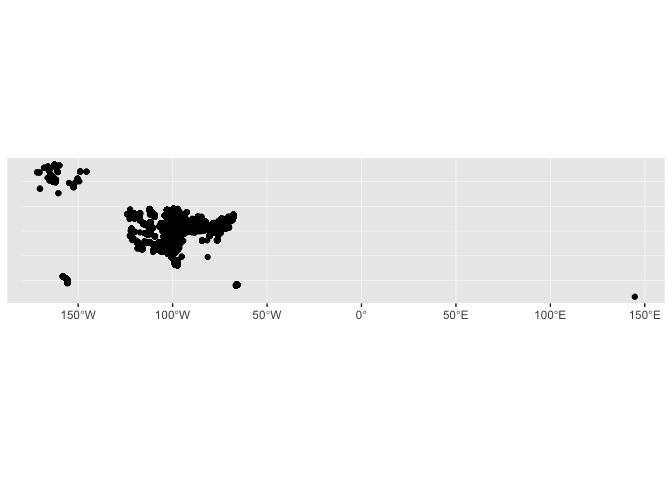
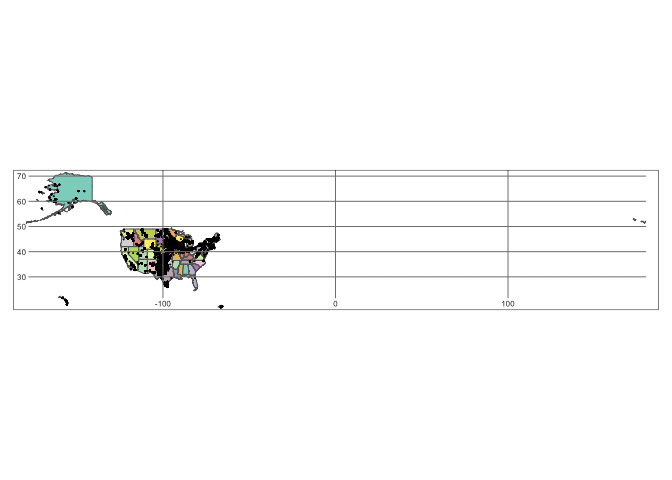
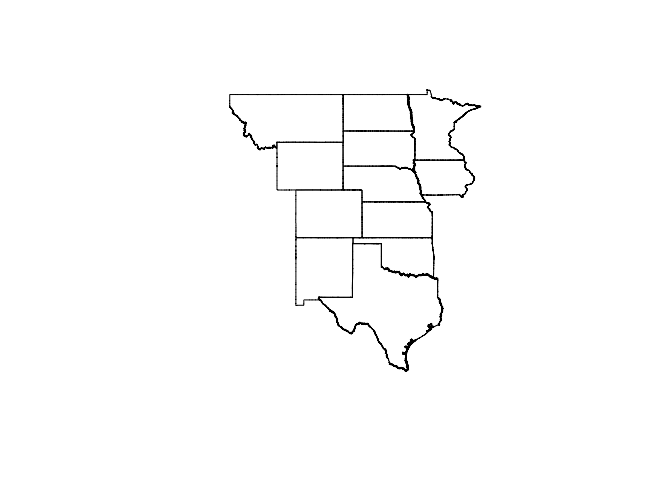
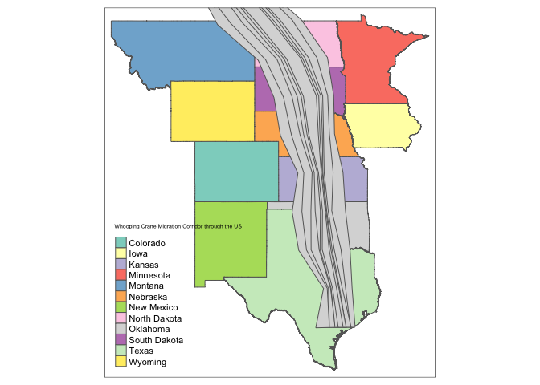
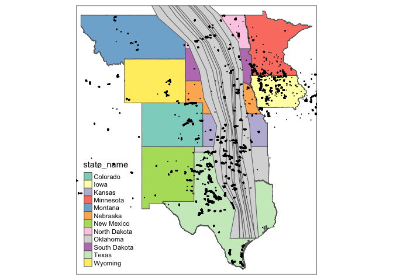
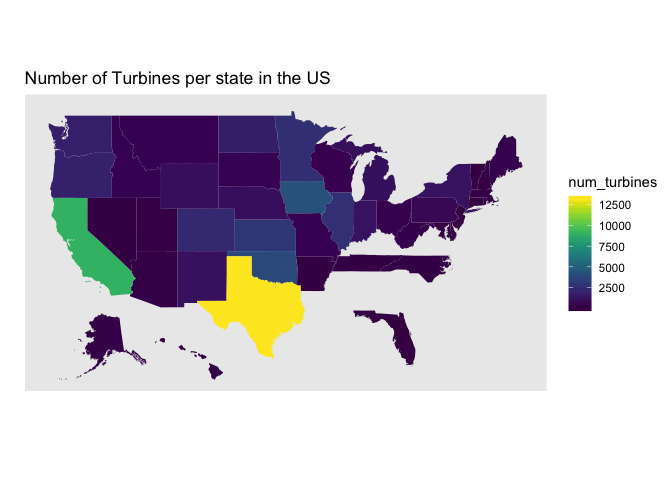

Wind Turbine and Whooping Crane Analysis
================
Sarah Tang

Set Up
------

My first steps were to load in the appropriate libraries and packages to make API Calls and visualize and analyze data using maps.

Fifty Stater: <https://github.com/wmurphyrd/fiftystater> USAboundaries: <https://lincolnmullen.com/software/usaboundaries/>

Introduction
------------

This module aims to examine and better understand how wind turbine development impacts bird populations, specifically for the whooping crane (Grus americana), one of the most endangered birds in North America. As land use needed for wind energy increases, it is crucial to understand the relationship between wind turbines, both while operating and installing, and animals' responses and wildlife habitat.

Throughout this module, I analyze spatial data to examine how the migratory corridor for whooping cranes overlaps with the placement of wind turbines. Later on, I use the IUCN api to determine what other species may be at risk because of renewable energy development.

Whooping crane corridor - <https://www.sciencebase.gov/catalog/item/5a314a72e4b08e6a89d707e0> Whooping crane - <https://www.arcgis.com/home/item.html?id=7d27571bc3454a1c91edf665c67b9c3e>

Loading in files
----------------

I access the data and read in the necessary files. In this case, I load in shape file for both the wind turbine locations and the whooping crane migratory corridor.

Mapping Wind Turbines and Whooping Crane Migratory Paths
========================================================

Next, I plot the maps of the location of wind turbines and whooping crane patterns using the `tm_shape` command. The first map is the initial data visualization and the latter shows the location of the wind turbines on top of a map of the United States. At a quick glance, there seems to be a lot of wind turbines in the Midwest area of the United States.

### Location of Wind Turbines in the United States

``` r
tm_shape(wind_turbines) +
  tm_dots()
```



``` r
data("World")
bb_us <- bb("United States", projection = "eck4")
tm_shape(World, bbox = bb_us) +
  tm_polygons() +
  tm_shape(wind_turbines) +
  tm_dots(title = "Location of Wind Turbines in the US")
```



In order to better visualize the data in the Midwest region of the United States, where the main wind belt is, I create a wind belt object with the states in that area. Doing so allows me to create a more detailed visualization of where exactly the wind turbines are and what states they are located in.

### Location of Wind turbines within the wind belt

``` r
devtools::install_github("ropensci/USAboundariesData")
```

    ## Skipping install of 'USAboundariesData' from a github remote, the SHA1 (a3db4fb6) has not changed since last install.
    ##   Use `force = TRUE` to force installation

``` r
USAboundaries::install_data_package
```

    ## function () 
    ## {
    ##     instructions <- paste(" Please try installing the package for yourself", 
    ##         "using the following command: \n", "    install.packages(\"USAboundariesData\",", 
    ##         "repos = \"http://packages.ropensci.org\",", "type = \"source\")")
    ##     error_func <- function(e) {
    ##         stop(paste("Failed to install the USAboundariesData package.\n", 
    ##             instructions))
    ##     }
    ##     if (interactive()) {
    ##         input <- utils::menu(c("Yes", "No"), title = "Install the USAboundariesData package?")
    ##         if (input == 1) {
    ##             message("Installing the USAboundariesData package.")
    ##             tryCatch(utils::install.packages("USAboundariesData", 
    ##                 repos = "http://packages.ropensci.org", type = "source"), 
    ##                 error = error_func, warning = error_func)
    ##         }
    ##         else {
    ##             stop(paste("The USAboundariesData package provides the data you requested.\n", 
    ##                 instructions))
    ##         }
    ##     }
    ##     else {
    ##         stop(paste("Failed to install the USAboundariesData package.\n", 
    ##             instructions))
    ##     }
    ## }
    ## <bytecode: 0x7fbfc2418900>
    ## <environment: namespace:USAboundaries>

``` r
wind_belt <- USAboundaries::us_states(states = c("Texas", "Wyoming",
                                  "Kansas", "Montana",
                                  "Nebraska", "Colorado",
                                  "North Dakota", "New Mexico",
                                  "South Dakota", "Iowa",
                                  "Oklahoma", "Minnesota"),
                       resolution = "high")
 plot(st_geometry(wind_belt))
```



``` r
tm_shape(wind_belt) +
  tm_polygons() +
  tm_shape(wind_turbines) +
  tm_dots()
```

 The map below shows the Whooping Crane migration corridor based off the data read in. This isn't particularly helpful as there are no coordinates or map beneath it to ground the data to a specific place.

``` r
ggplot(whooping_crane_corridors) + geom_sf() +
  ggtitle("Whooping Crane Migration Corridor")
```



After I overlay the migration corridor onto my wind belt object, the location and potential for overlap becomes much more clear.

``` r
tm_shape(wind_belt) +
  tm_polygons("state_name", title = "Whooping Crane Flight in US") +
  tm_shape(whooping_crane_corridors) +
  tm_polygons()
```


I then overlay the two maps onto a map of the United States.

``` r
tmap_mode(mode = "plot") #change mode to plot
```

    ## tmap mode set to plotting

``` r
tm_shape(wind_belt) +
  tm_polygons("state_name", legend.title = "State", 
              title = "Whooping Cranes & Wind Turbines Location") +
  tm_shape(whooping_crane_corridors) +
  tm_polygons() +
  tm_shape(wind_turbines) +
  tm_dots()
```


### Are there overlaps in the location of wind turbine sites and whooping crane migratory patterns?

*Yes! By overlaying the three different shape files, we can see that where there is high wind in the United States (in the midwest), is where wind turbines are primarily located.*

Wind Turbine Analysis
=====================

From USGS and USWTDB, I read in a csv with the location of land-based and offshore wind turbines. Specifically, I will analyze each of the projects information, specifically regarding state location and height of the turbine. Data found here: <https://eerscmap.usgs.gov/uswtdb/data/> Metadata: <https://eerscmap.usgs.gov/uswtdb/assets/data/uswtdb_v1_2_20181001.xml>

``` r
full_wind_csv <- read_csv("uswtdbCSV/uswtdb_v1_2_20181001.csv")
```

    ## Parsed with column specification:
    ## cols(
    ##   .default = col_character(),
    ##   case_id = col_integer(),
    ##   usgs_pr_id = col_integer(),
    ##   p_year = col_integer(),
    ##   p_tnum = col_integer(),
    ##   p_cap = col_double(),
    ##   t_cap = col_integer(),
    ##   t_hh = col_double(),
    ##   t_rd = col_double(),
    ##   t_rsa = col_double(),
    ##   t_ttlh = col_double(),
    ##   t_conf_atr = col_integer(),
    ##   t_conf_loc = col_integer(),
    ##   xlong = col_double(),
    ##   ylat = col_double()
    ## )

    ## See spec(...) for full column specifications.

``` r
full_wind_csv
```

    ## # A tibble: 58,185 x 24
    ##    case_id faa_ors faa_asn usgs_pr_id t_state t_county t_fips p_name p_year
    ##      <int> <chr>   <chr>        <int> <chr>   <chr>    <chr>  <chr>   <int>
    ##  1 3073429 missing missing       4960 CA      Kern Co… 06029  251 W…   1987
    ##  2 3071522 missing missing       4997 CA      Kern Co… 06029  251 W…   1987
    ##  3 3073425 missing missing       4957 CA      Kern Co… 06029  251 W…   1987
    ##  4 3071569 missing missing       5023 CA      Kern Co… 06029  251 W…   1987
    ##  5 3005252 missing missing       5768 CA      Kern Co… 06029  251 W…   1987
    ##  6 3003862 missing missing       5836 CA      Kern Co… 06029  251 W…   1987
    ##  7 3073370 missing missing       4948 CA      Kern Co… 06029  251 W…   1987
    ##  8 3010101 missing missing       5828 CA      Kern Co… 06029  251 W…   1987
    ##  9 3073324 missing missing       4965 CA      Kern Co… 06029  251 W…   1987
    ## 10 3072659 missing missing       5044 CA      Kern Co… 06029  251 W…   1987
    ## # ... with 58,175 more rows, and 15 more variables: p_tnum <int>,
    ## #   p_cap <dbl>, t_manu <chr>, t_model <chr>, t_cap <int>, t_hh <dbl>,
    ## #   t_rd <dbl>, t_rsa <dbl>, t_ttlh <dbl>, t_conf_atr <int>,
    ## #   t_conf_loc <int>, t_img_date <chr>, t_img_srce <chr>, xlong <dbl>,
    ## #   ylat <dbl>

``` r
total_num_turbines <- nrow(full_wind_csv)
total_num_turbines
```

    ## [1] 58185

*Our dataset looks at a total of 58,185 tubines.*

The columns of interest for my analysis of turbines are: 1. t\_hh: refers to the turbine hub height in meters 2. t\_rsa: refers to the turbine rotor swept area in square meters 3. t\_ttlh: refers to the height of the wind turbine from the ground to the tip of a vertially extended blade above the tower (t\_ttlh = t\_hh + 1/2 rotor diameter) 4. t\_conf\_atr: refers to the level of confidence in the turbine's attributes from low to hight where 1 is no confidence (no information) and 3 is full confidence (consistent information across multiple data sources)

First, I select for the desired attributes.

``` r
wind_csv <- full_wind_csv %>% dplyr::select(case_id,
                    state = t_state,
                    site_name = p_name,
                    site_year = p_year,
                    total_turbines = p_tnum,
                    rotor_swept_area = t_rsa,
                    hub_height = t_hh,
                    rotor_dia = t_rd,
                    total_height = t_ttlh,
                    confidence = t_conf_atr)
wind_csv
```

    ## # A tibble: 58,185 x 10
    ##    case_id state site_name site_year total_turbines rotor_swept_area
    ##      <int> <chr> <chr>         <int>          <int>            <dbl>
    ##  1 3073429 CA    251 Wind       1987            194            -9999
    ##  2 3071522 CA    251 Wind       1987            194            -9999
    ##  3 3073425 CA    251 Wind       1987            194            -9999
    ##  4 3071569 CA    251 Wind       1987            194            -9999
    ##  5 3005252 CA    251 Wind       1987            194            -9999
    ##  6 3003862 CA    251 Wind       1987            194            -9999
    ##  7 3073370 CA    251 Wind       1987            194            -9999
    ##  8 3010101 CA    251 Wind       1987            194            -9999
    ##  9 3073324 CA    251 Wind       1987            194            -9999
    ## 10 3072659 CA    251 Wind       1987            194            -9999
    ## # ... with 58,175 more rows, and 4 more variables: hub_height <dbl>,
    ## #   rotor_dia <dbl>, total_height <dbl>, confidence <int>

Next, I perform an analysis of the number of turbines per state. I need to filter for states that do not exist that were within the data, specifically "GU" and "PR".

``` r
turbine_per_state <- wind_csv %>%
  filter(state != "GU") %>% #not real states: GU and PR
  filter(state != "PR") %>%
  count(state)

turbine_per_state %>% arrange(desc(n))
```

    ## # A tibble: 43 x 2
    ##    state     n
    ##    <chr> <int>
    ##  1 TX    13232
    ##  2 CA     9037
    ##  3 IA     4280
    ##  4 OK     3821
    ##  5 KS     2898
    ##  6 IL     2602
    ##  7 MN     2547
    ##  8 CO     2278
    ##  9 OR     1868
    ## 10 WA     1744
    ## # ... with 33 more rows

*From this analysis, we can see that Texas has the most turbines as wind generation there continues to grow. After Texas and California, the states with the next highest number of turbines are IA (Iowa), OK (Oklahoma) - right above Texas, and KS (Kansas). All of these states fall within the wind belt.*

Next, I map the number of turbines per state using the Fifty States data. When using this data, the states are written lowercase and spelled out, not in abbreviations. As a result, it is important to convert each state id so that it correlates with the map.

``` r
data("fifty_states")
state_abbs <- tibble(state = str_to_lower(state.name), abb = state.abb)
full_turbines <- left_join(turbine_per_state,
                           state_abbs, by = c("state" = "abb")) %>%
  rename(id = state) %>%
  rename(full_state = state.y) %>%
  rename(num_turbines = n)

ggplot(full_turbines, aes(map_id = full_state)) +
  geom_map(aes(fill = num_turbines), map = fifty_states) +
  expand_limits(x = fifty_states$long, y = fifty_states$lat) +
  coord_map() +
  scale_fill_viridis() +
  scale_x_continuous(breaks = NULL) +
  scale_y_continuous(breaks = NULL) +
  labs(title = "Number of Turbines per state in the US", x = "", y = "")
```

 *With this visual map and analysis, it is more clear to see that Texas leads the country with the highest number of wind turbines. Following behind it is California, and then some other states in the Midwest region.*

Filter wind turbines by height
------------------------------

Whooping cranes fly during migration between 15 and 1800 meters above the ground. They usually fly around 500 m off the ground (Source: <https://journeynorth.org/tm/crane/MigrationDay_BJohns.html>). Knowing this, I filter the dangerous wind turbines to be those whose rotors fall within the distance of 15 and 1800 m, where a Whooping Crane could potentially get caught and hit.

``` r
wind_belt_states <- c("Texas", "Wyoming",
              "Kansas", "Montana",
              "Nebraska", "Colorado",
              "North Dakota", "New Mexico",
              "South Dakota", "Iowa",
              "Oklahoma", "Minnesota")

wind_belt_abb <- c("TX", "NM", "WY", "KS",
                   "NE", "ND", "SD", "CO",
                   "IA", "MN", "OK")

turbines_by_height <- wind_csv %>%
  filter(rotor_swept_area != -9999.00) %>%
  filter(total_height < 1800) %>% #top of rotor area
  filter(is.element(state, wind_belt_abb)) %>%
  mutate(bottom = total_height - rotor_dia) %>%
  filter(bottom > 15) #botom of rotor area

percent_dangerous <- nrow(turbines_by_height) / total_num_turbines
percent_dangerous * 100
```

    ## [1] 56.48363

*56 percent of turbines could potentially be dangerous for whooping crane populations based on their rotor height. Wind turbine siting is extremely important in order to limit the number of bird deaths, especially for species that are already endangered.*

Other bird populations: API calls
=================================

The second section of my project is to use the IUCN API in order to determine what bird species in the United States may be at risk and threatened by wind turbine development. First, I provide some background information about the main species of interest. While only updated in 2012, the species was listed as endangered and was making a strong comeback. Updated data and more targeted studies will be needed to determine the impact of wind turbines on Whooping Crane migration.

``` r
genus <- "Grus"
species <- "americana"
api_call <- paste0("http://api.iucnredlist.org/index/species/",
                   genus, "-", species, ".json")

resp <- httr::GET(api_call)
resp
```

    ## Response [http://api.iucnredlist.org/index/species/Grus-americana.json]
    ##   Date: 2018-12-10 01:49
    ##   Status: 200
    ##   Content-Type: application/json; charset=utf-8
    ##   Size: 1.02 kB

``` r
status <- httr::status_code(resp)
out <- httr::content(resp, as = "text")
df <- jsonlite::fromJSON(out)
rationale <- df$rationale
df
```

    ##   scientific_name primary  kingdom   phylum class      order  family genus
    ## 1  Grus americana    TRUE ANIMALIA CHORDATA  AVES GRUIFORMES GRUIDAE  Grus
    ##     species        authority infra_name infra_rank infra_authority
    ## 1 americana (Linnaeus, 1758)         NA         NA              NA
    ##   stock_name species_id main_common_name modified_year category criteria
    ## 1         NA   22692156   Whooping Crane          2012       EN        D
    ##   assessmentid trend_id biome_marine biome_freshwater biome_terrestrial
    ## 1     38458501        1         TRUE             TRUE              TRUE
    ##   taxonomicnotes
    ## 1             NA
    ##                                                                                                                                                                                                                                                                                                                                                                                                         rationale
    ## 1 This species is listed as Endangered because it has an extremely small population. However, the conservation status of the species is improving, with not only increases in the natural wild population but also establishment of two reintroduced flocks that may become self-sustaining. If the number of mature individuals continues to increase, this species may merit downlisting to Vulnerable. <p></p>
    ##                 assessor                evaluator
    ## 1 BirdLife International Butchart, S. & Symes, A.

All species vs. US species
--------------------------

I used the API to get all of the species found within the United States. This list of species consists of plants, mammals, birds, reptiles, etc.

    ## [1] "9bb4facb6d23f48efbf424bb05c0c1ef1cf6f468393bc745d42179ac4aca5fee"

    ## [1] "http://apiv3.iucnredlist.org/api/v3/"

I got all 10 pages of species so that I could match them up with the species found within the United States.

``` r
api_calls <- purrr::map((7:9), function(page_num){paste0("http://apiv3.iucnredlist.org/api/v3/species/page/", page_num, "?token=9bb4facb6d23f48efbf424bb05c0c1ef1cf6f468393bc745d42179ac4aca5fee")})

resp2 <- purrr::map(api_calls[1:3], function(url){
  #Sys.sleep(0.5)
  httr::GET(url)
})

out <- purrr::map(resp2, httr::content, as = "text")
df_page <- purrr::map(out, jsonlite::fromJSON)
all_df <- plyr::ldply(df_page, data.frame)

all_df <- all_df %>%
  mutate(scientific_name = result.scientific_name)
```

US Bird Species (and regular expressions!)
------------------------------------------

In order to get all the bird species with the United States, I combine all of the species with all of those within the United States. This allowed me to filter for the class Aves. Additionally, I used regular expressions to extract the species name from the scientific name. I then used the genus and species name to make the needed API calls later on!

``` r
us_all <- left_join(df_us_final, all_df, by = "scientific_name")

us_birds <- us_all %>%
  filter(!is.na(scientific_name)) %>%
  filter(result.class_name == "AVES") %>%
  dplyr::select(scientific_name, class = result.class_name,
         order = result.order_name,
         genus = result.genus_name, category) %>%
  mutate(species = stringr::str_extract(scientific_name, "(?:\\s+\\S+)")) %>%
  mutate(species2 = stringr::str_extract(species, "\\S+"))
```

Threats to Birds
----------------

To get the associated threats for each bird species, I created two custom R functions. The first makes the necessary API calls to get the timing, scope, severity, and score for each potential threat and bird. The second R function makes calls to the first function and binds the respective dataframes together. One issue that I originally ran into was how to deal with data frames of different sizes as each bird is associated with different threats and may have no threats. To handle these different cases, I made sure to have an error handler to set the values to NA as well as binding the dataframes together. I make the API calls on only a portion of the species because of the timing it would take for the entire bird population within the United States.

``` r
df_all_threats <- data.frame()
df_all_threats
```

    ## data frame with 0 columns and 0 rows

``` r
api_threat <- function(genus, species) {
  api_call_threats <- paste0("http://apiv3.iucnredlist.org/api/v3/threats/species/name/", 
                             genus, "%20", species, "?token=", token)
  response <- httr::GET(api_call_threats)
  status <- httr::status_code(response)
  out <- httr::content(response, as = "text")
  df_threat <- jsonlite::fromJSON(out)
  result <- df_threat$result
  length(result)
  if (length(result) == 0) {
    df_species <- data_frame(Genus = genus, Species = species, threat = NA, timing = NA,
             scope = NA, severity = NA, score = NA)
  } else {
    title <- df_threat$result$title
    timing <- df_threat$result$timing
    scope <- df_threat$result$scope
    severity <- df_threat$result$severity
    score <- df_threat$result$score
    
    df_species <- data_frame(Genus = genus, Species = species, threat = title, timing = timing,
               scope = scope, severity = severity, score = score)
  }
}

call_api_threat <- function(genus, species, df = df_all_threats) {
  rv <- api_threat(genus, species)
  rbind(df, rv)
}

df_threats <- map2_dfr(us_birds$genus[1:300], us_birds$species2[1:300], call_api_threat)

df_threats %>% 
  filter(timing != "Past, Unlikely to Return") %>% #filter by relevant threats
  filter(!str_detect(threat, "species")) %>% #no invasive or competitive species
  count(threat) %>%
  arrange(desc(n))
```

    ## # A tibble: 69 x 2
    ##    threat                                             n
    ##    <chr>                                          <int>
    ##  1 Habitat shifting & alteration                     71
    ##  2 Hunting & trapping terrestrial animals            42
    ##  3 Fishing & harvesting aquatic resources            30
    ##  4 Annual & perennial non-timber crops               29
    ##  5 Unintentional effects: (large scale) [harvest]    28
    ##  6 Agro-industry farming                             24
    ##  7 Industrial & military effluents                   24
    ##  8 Agricultural & forestry effluents                 22
    ##  9 Recreational activities                           21
    ## 10 Housing & urban areas                             20
    ## # ... with 59 more rows

By examining the different threats that bird species within the United States face, I can see how the threat of renewable energy and wind turbine development falls compared to other categories. The most prevalent threat among species is habitat shifting and alteration, followed by hunting & trapping terrestrial animals. Ultimately, human interference with animal habitats is impacting their survival.

*Approximately 4 percent of birds are impacted by renewable energy. And while it more often has a low to medium impact on a a minority of the population, this problem is ongoing. Additionally, as the number of wind turbines increases and as such technologies become more prevalent, they will continue to threaten bird populations.*

Overall, the future steps for this project are to further examine how positioning and siting of wind turbines can either alter migration patterns of whooping cranes as well as the other bird species or reduce their population sizes. In this module, I was able to show a correlation between the two locations, but not a causation between the two. More research is needed in this area as well as increased regulations regarding how and where wind turbines are constructed.
