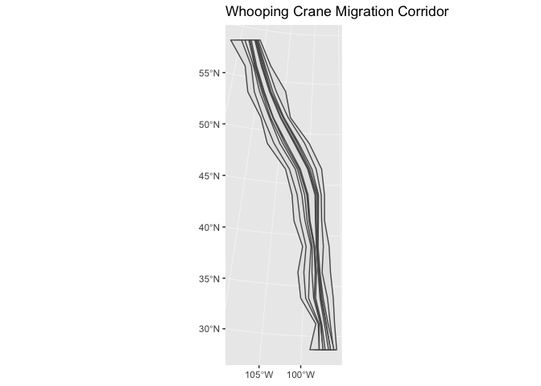

Wind Turbine and Bird Analysis
================
Sarah Tang

Set Up
------

Fifty Stater: <https://github.com/wmurphyrd/fiftystater>

Introduction
------------

This module aims to examine and better understand how wind turbine development impacts bird populations, specifically for the whooping crane (Grus americana), one of the most endangered birds in North America. As land use needed for wind energy increases, it is crucial to understand the relationship between wind turbines, both while operating and installing, and animals' responses and wildlife habitat.

Whooping crane corridor - <https://www.sciencebase.gov/catalog/item/5a314a72e4b08e6a89d707e0> Whooping crane - <https://www.arcgis.com/home/item.html?id=7d27571bc3454a1c91edf665c67b9c3e>

Loading in files
----------------

``` r
wind_turbines <- st_read("uswtdbSHP/uswtdb_v1_2_20181001.shp", quiet=TRUE)
whooping_crane_corridors <- st_read("WHCR_corridors/WHCR_corridors.shp", quiet=TRUE)

wind_turbines
```

    ## Simple feature collection with 58185 features and 0 fields
    ## geometry type:  POINT
    ## dimension:      XY
    ## bbox:           xmin: -171.7131 ymin: 13.38938 xmax: 144.7227 ymax: 66.8399
    ## epsg (SRID):    4269
    ## proj4string:    +proj=longlat +datum=NAD83 +no_defs
    ## First 10 features:
    ##                      geometry
    ## 1  POINT (-102.0486 33.60797)
    ## 2  POINT (-102.0495 33.60793)
    ## 3  POINT (-102.0486 33.60919)
    ## 4  POINT (-98.26075 35.39525)
    ## 5     POINT (-98.2576 35.367)
    ## 6  POINT (-98.75173 43.70377)
    ## 7  POINT (-98.24736 35.39624)
    ## 8  POINT (-98.26535 35.37489)
    ## 9  POINT (-98.25227 35.39637)
    ## 10 POINT (-98.22907 35.35834)

``` r
whooping_crane_corridors
```

    ## Simple feature collection with 9 features and 3 fields
    ## geometry type:  POLYGON
    ## dimension:      XY
    ## bbox:           xmin: -1197376 ymin: -1322000 xmax: 32657.37 ymax: 2278000
    ## epsg (SRID):    NA
    ## proj4string:    +proj=aea +lat_1=20 +lat_2=60 +lat_0=40 +lon_0=-96 +x_0=0 +y_0=0 +datum=NAD83 +units=m +no_defs
    ##   Id Corridor CL                       geometry
    ## 1  0       95 NA POLYGON ((16808.16 -1322000...
    ## 2  0       75 NA POLYGON ((-31086.76 -132200...
    ## 3  0       50 NA POLYGON ((-44661.35 -132200...
    ## 4  0       95  E POLYGON ((32657.37 -1322000...
    ## 5  0       95  W POLYGON ((-170092 -1322000,...
    ## 6  0       75  E POLYGON ((1147.896 -1322000...
    ## 7  0       75  W POLYGON ((-123305.4 -132200...
    ## 8  0       50  E POLYGON ((-38234.65 -132200...
    ## 9  0       50  W POLYGON ((-101020.2 -132200...

Mapping Wind Turbines and Whooping Crane Migratory Paths
========================================================

Next, I plot the maps of the location of wind turbines and whooping crane patterns using the `tm_shape` command.

``` r
tm_shape(wind_turbines) + tm_dots()
```


``` r
data("World")
bb_us <- bb("United States", projection = "eck4")

tm_shape(World, bbox = bb_us) +
  tm_polygons() + 
  tm_shape(wind_turbines) +
  tm_dots()
```


``` r
if (require(USAboundaries) && require(sf)) {
  wind_belt <- us_states(states = c("Texas", "Wyoming",
                                    "Kansas", "Montana",
                                    "Nebraska", "Colorado",
                                    "North Dakota", "New Mexico",
                                    "South Dakota", "Iowa",
                                    "Oklahoma", "Minnesota"),
                         resolution = "high")
   plot(st_geometry(wind_belt))
}
```


``` r
tm_shape(wind_belt) +
  tm_polygons() +
  tm_shape(wind_turbines) +
  tm_dots()
```


``` r
ggplot(whooping_crane_corridors) + geom_sf() + ggtitle("Whooping Crane Migration Corridor")
```


``` r
tm_shape(wind_belt) +
  tm_polygons("state_name") +
  tm_shape(whooping_crane_corridors) +
  tm_polygons()
```


I then overlay the two maps onto a map of the United States.

``` r
tmap_mode(mode = "plot") #change mode to plot
```

    ## tmap mode set to plotting

``` r
tm_shape(wind_belt) +
  tm_polygons("state_name") +
  tm_shape(whooping_crane_corridors) +
  tm_polygons() +
  tm_shape(wind_turbines) +
  tm_dots()
```



### Are there overlaps in the location of wind turbine sites and whooping crane migratory patterns?

*Yes! By overlaying the three different shape files, we can see that where there is high wind in the United States (in the midwest), is where wind turbines are primarily located.*

Wind Turbine Analysis
=====================

From USGS and USWTDB, I read in a csv with the location of land-based and offshore wind turbines. Specifically, I will analyze each of projects information, specifically regarding state, height, and year put in place. Data found here: <https://eerscmap.usgs.gov/uswtdb/data/> Metadata: <https://eerscmap.usgs.gov/uswtdb/assets/data/uswtdb_v1_2_20181001.xml>

``` r
full_wind_csv = read_csv("uswtdbCSV/uswtdb_v1_2_20181001.csv")
```

    ## Parsed with column specification:
    ## cols(
    ##   .default = col_character(),
    ##   case_id = col_integer(),
    ##   usgs_pr_id = col_integer(),
    ##   p_year = col_integer(),
    ##   p_tnum = col_integer(),
    ##   p_cap = col_double(),
    ##   t_cap = col_integer(),
    ##   t_hh = col_double(),
    ##   t_rd = col_double(),
    ##   t_rsa = col_double(),
    ##   t_ttlh = col_double(),
    ##   t_conf_atr = col_integer(),
    ##   t_conf_loc = col_integer(),
    ##   xlong = col_double(),
    ##   ylat = col_double()
    ## )

    ## See spec(...) for full column specifications.

``` r
full_wind_csv
```

    ## # A tibble: 58,185 x 24
    ##    case_id faa_ors faa_asn usgs_pr_id t_state t_county t_fips p_name p_year
    ##      <int> <chr>   <chr>        <int> <chr>   <chr>    <chr>  <chr>   <int>
    ##  1 3073429 missing missing       4960 CA      Kern Co… 06029  251 W…   1987
    ##  2 3071522 missing missing       4997 CA      Kern Co… 06029  251 W…   1987
    ##  3 3073425 missing missing       4957 CA      Kern Co… 06029  251 W…   1987
    ##  4 3071569 missing missing       5023 CA      Kern Co… 06029  251 W…   1987
    ##  5 3005252 missing missing       5768 CA      Kern Co… 06029  251 W…   1987
    ##  6 3003862 missing missing       5836 CA      Kern Co… 06029  251 W…   1987
    ##  7 3073370 missing missing       4948 CA      Kern Co… 06029  251 W…   1987
    ##  8 3010101 missing missing       5828 CA      Kern Co… 06029  251 W…   1987
    ##  9 3073324 missing missing       4965 CA      Kern Co… 06029  251 W…   1987
    ## 10 3072659 missing missing       5044 CA      Kern Co… 06029  251 W…   1987
    ## # ... with 58,175 more rows, and 15 more variables: p_tnum <int>,
    ## #   p_cap <dbl>, t_manu <chr>, t_model <chr>, t_cap <int>, t_hh <dbl>,
    ## #   t_rd <dbl>, t_rsa <dbl>, t_ttlh <dbl>, t_conf_atr <int>,
    ## #   t_conf_loc <int>, t_img_date <chr>, t_img_srce <chr>, xlong <dbl>,
    ## #   ylat <dbl>

``` r
total_num_turbines <- nrow(full_wind_csv)
total_num_turbines
```

    ## [1] 58185

*Our dataset looks at a total of 58,185 tubines.*

Analysis - group by state, graph height (and get none NA vals), what heights

t\_hh refers to turbine hub height in m t\_rsa refers to turbine rotor swept area in square meters t\_ttlh refers to the height of the wind turbine from the ground to the tip of a vertically extended blade above the tower. (t\_ttlh = t\_hh + 1/2 rotor diameter) t\_conf\_atr referes to level of confidence in the turbine's attributes from low to high 1. no confidence: no information found 2. partial confidence: incomplete information or discrepancies found across data sources 3. full confidence: consistent information across multiple data sources

``` r
wind_csv <- full_wind_csv %>% dplyr::select(case_id,
                    state = t_state,
                    site_name = p_name,
                    site_year = p_year,
                    total_turbines = p_tnum,
                    rotor_swept_area = t_rsa,
                    hub_height = t_hh,
                    rotor_dia = t_rd,
                    total_height = t_ttlh,
                    confidence = t_conf_atr)
wind_csv
```

    ## # A tibble: 58,185 x 10
    ##    case_id state site_name site_year total_turbines rotor_swept_area
    ##      <int> <chr> <chr>         <int>          <int>            <dbl>
    ##  1 3073429 CA    251 Wind       1987            194            -9999
    ##  2 3071522 CA    251 Wind       1987            194            -9999
    ##  3 3073425 CA    251 Wind       1987            194            -9999
    ##  4 3071569 CA    251 Wind       1987            194            -9999
    ##  5 3005252 CA    251 Wind       1987            194            -9999
    ##  6 3003862 CA    251 Wind       1987            194            -9999
    ##  7 3073370 CA    251 Wind       1987            194            -9999
    ##  8 3010101 CA    251 Wind       1987            194            -9999
    ##  9 3073324 CA    251 Wind       1987            194            -9999
    ## 10 3072659 CA    251 Wind       1987            194            -9999
    ## # ... with 58,175 more rows, and 4 more variables: hub_height <dbl>,
    ## #   rotor_dia <dbl>, total_height <dbl>, confidence <int>

State analysis - number of turbines per states

``` r
turbine_per_state <- wind_csv %>%
  filter(state != "GU") %>% #not real states: GU and PR
  filter(state != "PR") %>%
  count(state)

turbine_per_state %>% arrange(desc(n))
```

    ## # A tibble: 43 x 2
    ##    state     n
    ##    <chr> <int>
    ##  1 TX    13232
    ##  2 CA     9037
    ##  3 IA     4280
    ##  4 OK     3821
    ##  5 KS     2898
    ##  6 IL     2602
    ##  7 MN     2547
    ##  8 CO     2278
    ##  9 OR     1868
    ## 10 WA     1744
    ## # ... with 33 more rows

*From this analysis, we can see that Texas has the most turbines as wind generation there continues to grow. After Texas and California, the states with the next highest number of turbines are IA (Iowa), OK (Oklahoma) - right above Texas, and KS (Kansas). All of these states fall within the wind belt.*

``` r
data("fifty_states")
#fifty_states states written lower case and spelled out
state_abbs <- tibble(state = str_to_lower(state.name), abb = state.abb)
full_turbines<- left_join(turbine_per_state, state_abbs, by = c("state" = "abb")) %>%
  rename(id = state) %>%
  rename(full_state = state.y) %>%
  rename(num_turbines = n)

ggplot(full_turbines, aes(map_id = full_state)) +
  geom_map(aes(fill = num_turbines), map = fifty_states) +
  expand_limits(x = fifty_states$long, y = fifty_states$lat) +
  coord_map() +
  scale_fill_viridis() +
  scale_x_continuous(breaks = NULL) + 
  scale_y_continuous(breaks = NULL) +
  labs(x = "", y = "")
```


Filter wind turbines by height
------------------------------

Whooping cranes fly during migration between 15 and 1800 meters above the ground. They usually fly around 500 m off the ground (Source: <https://journeynorth.org/tm/crane/MigrationDay_BJohns.html>).

``` r
wind_belt_states <- c("Texas", "Wyoming",
              "Kansas", "Montana",
              "Nebraska", "Colorado",
              "North Dakota", "New Mexico",
              "South Dakota", "Iowa",
              "Oklahoma", "Minnesota")

wind_belt_abb <- c("TX", "NM", "WY", "KS",
                   "NE", "ND", "SD", "CO",
                   "IA", "MN", "OK")

turbines_by_height <- wind_csv %>%
  filter(rotor_swept_area != -9999.00) %>%
  filter(total_height < 1800) %>% #top of rotor area
  filter(is.element(state, wind_belt_abb)) %>%
  mutate(bottom = total_height - rotor_dia) %>%
  filter(bottom > 15) #botom of rotor area

percent_dangerous <- nrow(turbines_by_height) / total_num_turbines
percent_dangerous * 100
```

    ## [1] 56.48363

*56 percent of turbines could potentially be dangerous for whooping crane populations based on their rotor height. Wind turbine siting is extremely important in order to limit the number of bird deaths, especially for species that are already endangered.*

Other bird populations?
=======================

Just want to look through api list for genus and species of birds and bats (not necessarily ones that are already extinct)

``` r
genus <- "Grus"
species <- "americana"
api_call <- paste0("http://api.iucnredlist.org/index/species/", genus, "-", species, ".json")

resp <- GET(api_call)
resp
```

    ## Response [http://api.iucnredlist.org/index/species/Grus-americana.json]
    ##   Date: 2018-12-09 09:24
    ##   Status: 200
    ##   Content-Type: application/json; charset=utf-8
    ##   Size: 1.02 kB

``` r
status <- httr::status_code(resp)

out <- content(resp, as = "text")
df <- jsonlite::fromJSON(out)
rationale <- df$rationale
df
```

    ##   scientific_name primary  kingdom   phylum class      order  family genus
    ## 1  Grus americana    TRUE ANIMALIA CHORDATA  AVES GRUIFORMES GRUIDAE  Grus
    ##     species        authority infra_name infra_rank infra_authority
    ## 1 americana (Linnaeus, 1758)         NA         NA              NA
    ##   stock_name species_id main_common_name modified_year category criteria
    ## 1         NA   22692156   Whooping Crane          2012       EN        D
    ##   assessmentid trend_id biome_marine biome_freshwater biome_terrestrial
    ## 1     38458501        1         TRUE             TRUE              TRUE
    ##   taxonomicnotes
    ## 1             NA
    ##                                                                                                                                                                                                                                                                                                                                                                                                         rationale
    ## 1 This species is listed as Endangered because it has an extremely small population. However, the conservation status of the species is improving, with not only increases in the natural wild population but also establishment of two reintroduced flocks that may become self-sustaining. If the number of mature individuals continues to increase, this species may merit downlisting to Vulnerable. <p></p>
    ##                 assessor                evaluator
    ## 1 BirdLife International Butchart, S. & Symes, A.

TODO:
=====

Custom R functions Interaction with an API? - maybe just get the birds? what birds are potentially endangered/extinct? Use lintr to clean code (checks adherence to a given style, syntax errors and possible semantic issues) Making layout and presentation into secondary output (e.g. .pdf, website) - should enhance presentaiton

Note that the `echo = FALSE` parameter was added to the code chunk to prevent printing of the R code that generated the plot.
