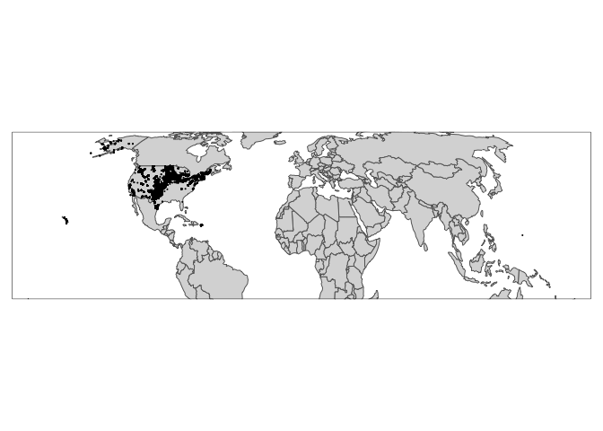

Wind Turbine and Bird Analysis
================
Sarah Tang

Set Up
------

Fifty Stater: <https://github.com/wmurphyrd/fiftystater>

Introduction
------------

This module aims to examine and better understand how wind turbine development impacts bird populations, specifically for the whooping crane (Grus americana), one of the most endangered birds in North America. As land use needed for wind energy increases, it is crucial to understand the relationship between wind turbines, both while operating and installing, and animals' responses and wildlife habitat.

Whooping crane corridor - <https://www.sciencebase.gov/catalog/item/5a314a72e4b08e6a89d707e0> Whooping crane - <https://www.arcgis.com/home/item.html?id=7d27571bc3454a1c91edf665c67b9c3e>

Loading in files
----------------

``` r
wind_turbines <- st_read("uswtdbSHP/uswtdb_v1_2_20181001.shp", quiet=TRUE)
whooping_crane_corridors <- st_read("WHCR_corridors/WHCR_corridors.shp", quiet=TRUE)

wind_turbines
```

    ## Simple feature collection with 58185 features and 0 fields
    ## geometry type:  POINT
    ## dimension:      XY
    ## bbox:           xmin: -171.7131 ymin: 13.38938 xmax: 144.7227 ymax: 66.8399
    ## epsg (SRID):    4269
    ## proj4string:    +proj=longlat +datum=NAD83 +no_defs
    ## First 10 features:
    ##                      geometry
    ## 1  POINT (-102.0486 33.60797)
    ## 2  POINT (-102.0495 33.60793)
    ## 3  POINT (-102.0486 33.60919)
    ## 4  POINT (-98.26075 35.39525)
    ## 5     POINT (-98.2576 35.367)
    ## 6  POINT (-98.75173 43.70377)
    ## 7  POINT (-98.24736 35.39624)
    ## 8  POINT (-98.26535 35.37489)
    ## 9  POINT (-98.25227 35.39637)
    ## 10 POINT (-98.22907 35.35834)

``` r
whooping_crane_corridors
```

    ## Simple feature collection with 9 features and 3 fields
    ## geometry type:  POLYGON
    ## dimension:      XY
    ## bbox:           xmin: -1197376 ymin: -1322000 xmax: 32657.37 ymax: 2278000
    ## epsg (SRID):    NA
    ## proj4string:    +proj=aea +lat_1=20 +lat_2=60 +lat_0=40 +lon_0=-96 +x_0=0 +y_0=0 +datum=NAD83 +units=m +no_defs
    ##   Id Corridor CL                       geometry
    ## 1  0       95 NA POLYGON ((16808.16 -1322000...
    ## 2  0       75 NA POLYGON ((-31086.76 -132200...
    ## 3  0       50 NA POLYGON ((-44661.35 -132200...
    ## 4  0       95  E POLYGON ((32657.37 -1322000...
    ## 5  0       95  W POLYGON ((-170092 -1322000,...
    ## 6  0       75  E POLYGON ((1147.896 -1322000...
    ## 7  0       75  W POLYGON ((-123305.4 -132200...
    ## 8  0       50  E POLYGON ((-38234.65 -132200...
    ## 9  0       50  W POLYGON ((-101020.2 -132200...

Mapping Wind Turbines and Whooping Crane Migratory Paths
========================================================

Next, I plot the maps of the location of wind turbines and whooping crane patterns using the `tm_shape` command.

``` r
tm_shape(wind_turbines) + tm_dots()
```


``` r
data("World")
bb_us <- bb("United States", projection = "eck4")

tm_shape(World, bbox = bb_us) +
  tm_polygons() + 
  tm_shape(wind_turbines) +
  tm_dots()
```



``` r
if (require(USAboundaries) && require(sf)) {
  wind_belt <- us_states(states = c("Texas", "Wyoming",
                                    "Kansas", "Montana",
                                    "Nebraska", "Colorado",
                                    "North Dakota", "New Mexico",
                                    "South Dakota", "Iowa",
                                    "Oklahoma", "Minnesota"),
                         resolution = "high")
   plot(st_geometry(wind_belt))
}
```


``` r
tm_shape(wind_belt) +
  tm_polygons() +
  tm_shape(wind_turbines) +
  tm_dots()
```


``` r
ggplot(whooping_crane_corridors) + geom_sf() + ggtitle("Whooping Crane Migration Corridor")
```


``` r
tm_shape(wind_belt) +
  tm_polygons("state_name") +
  tm_shape(whooping_crane_corridors) +
  tm_polygons()
```


I then overlay the two maps onto a map of the United States.

``` r
tmap_mode(mode = "plot") #change mode to plot
```

    ## tmap mode set to plotting

``` r
tm_shape(wind_belt) +
  tm_polygons("state_name") +
  tm_shape(whooping_crane_corridors) +
  tm_polygons() +
  tm_shape(wind_turbines) +
  tm_dots()
```


### Are there overlaps in the location of wind turbine sites and whooping crane migratory patterns?

*Yes! By overlaying the three different shape files, we can see that where there is high wind in the United States (in the midwest), is where wind turbines are primarily located.*

Wind Turbine Analysis
=====================

From USGS and USWTDB, I read in a csv with the location of land-based and offshore wind turbines. Specifically, I will analyze each of projects information, specifically regarding state, height, and year put in place. Data found here: <https://eerscmap.usgs.gov/uswtdb/data/> Metadata: <https://eerscmap.usgs.gov/uswtdb/assets/data/uswtdb_v1_2_20181001.xml>

``` r
full_wind_csv = read_csv("uswtdbCSV/uswtdb_v1_2_20181001.csv")
```

    ## Parsed with column specification:
    ## cols(
    ##   .default = col_character(),
    ##   case_id = col_integer(),
    ##   usgs_pr_id = col_integer(),
    ##   p_year = col_integer(),
    ##   p_tnum = col_integer(),
    ##   p_cap = col_double(),
    ##   t_cap = col_integer(),
    ##   t_hh = col_double(),
    ##   t_rd = col_double(),
    ##   t_rsa = col_double(),
    ##   t_ttlh = col_double(),
    ##   t_conf_atr = col_integer(),
    ##   t_conf_loc = col_integer(),
    ##   xlong = col_double(),
    ##   ylat = col_double()
    ## )

    ## See spec(...) for full column specifications.

``` r
full_wind_csv
```

    ## # A tibble: 58,185 x 24
    ##    case_id faa_ors faa_asn usgs_pr_id t_state t_county t_fips p_name p_year
    ##      <int> <chr>   <chr>        <int> <chr>   <chr>    <chr>  <chr>   <int>
    ##  1 3073429 missing missing       4960 CA      Kern Co… 06029  251 W…   1987
    ##  2 3071522 missing missing       4997 CA      Kern Co… 06029  251 W…   1987
    ##  3 3073425 missing missing       4957 CA      Kern Co… 06029  251 W…   1987
    ##  4 3071569 missing missing       5023 CA      Kern Co… 06029  251 W…   1987
    ##  5 3005252 missing missing       5768 CA      Kern Co… 06029  251 W…   1987
    ##  6 3003862 missing missing       5836 CA      Kern Co… 06029  251 W…   1987
    ##  7 3073370 missing missing       4948 CA      Kern Co… 06029  251 W…   1987
    ##  8 3010101 missing missing       5828 CA      Kern Co… 06029  251 W…   1987
    ##  9 3073324 missing missing       4965 CA      Kern Co… 06029  251 W…   1987
    ## 10 3072659 missing missing       5044 CA      Kern Co… 06029  251 W…   1987
    ## # ... with 58,175 more rows, and 15 more variables: p_tnum <int>,
    ## #   p_cap <dbl>, t_manu <chr>, t_model <chr>, t_cap <int>, t_hh <dbl>,
    ## #   t_rd <dbl>, t_rsa <dbl>, t_ttlh <dbl>, t_conf_atr <int>,
    ## #   t_conf_loc <int>, t_img_date <chr>, t_img_srce <chr>, xlong <dbl>,
    ## #   ylat <dbl>

``` r
total_num_turbines <- nrow(full_wind_csv)
total_num_turbines
```

    ## [1] 58185

*Our dataset looks at a total of 58,185 tubines.*

Analysis - group by state, graph height (and get none NA vals), what heights

t\_hh refers to turbine hub height in m t\_rsa refers to turbine rotor swept area in square meters t\_ttlh refers to the height of the wind turbine from the ground to the tip of a vertically extended blade above the tower. (t\_ttlh = t\_hh + 1/2 rotor diameter) t\_conf\_atr referes to level of confidence in the turbine's attributes from low to high 1. no confidence: no information found 2. partial confidence: incomplete information or discrepancies found across data sources 3. full confidence: consistent information across multiple data sources

``` r
wind_csv <- full_wind_csv %>% dplyr::select(case_id,
                    state = t_state,
                    site_name = p_name,
                    site_year = p_year,
                    total_turbines = p_tnum,
                    rotor_swept_area = t_rsa,
                    hub_height = t_hh,
                    rotor_dia = t_rd,
                    total_height = t_ttlh,
                    confidence = t_conf_atr)
wind_csv
```

    ## # A tibble: 58,185 x 10
    ##    case_id state site_name site_year total_turbines rotor_swept_area
    ##      <int> <chr> <chr>         <int>          <int>            <dbl>
    ##  1 3073429 CA    251 Wind       1987            194            -9999
    ##  2 3071522 CA    251 Wind       1987            194            -9999
    ##  3 3073425 CA    251 Wind       1987            194            -9999
    ##  4 3071569 CA    251 Wind       1987            194            -9999
    ##  5 3005252 CA    251 Wind       1987            194            -9999
    ##  6 3003862 CA    251 Wind       1987            194            -9999
    ##  7 3073370 CA    251 Wind       1987            194            -9999
    ##  8 3010101 CA    251 Wind       1987            194            -9999
    ##  9 3073324 CA    251 Wind       1987            194            -9999
    ## 10 3072659 CA    251 Wind       1987            194            -9999
    ## # ... with 58,175 more rows, and 4 more variables: hub_height <dbl>,
    ## #   rotor_dia <dbl>, total_height <dbl>, confidence <int>

State analysis - number of turbines per states

``` r
turbine_per_state <- wind_csv %>%
  filter(state != "GU") %>% #not real states: GU and PR
  filter(state != "PR") %>%
  count(state)

turbine_per_state %>% arrange(desc(n))
```

    ## # A tibble: 43 x 2
    ##    state     n
    ##    <chr> <int>
    ##  1 TX    13232
    ##  2 CA     9037
    ##  3 IA     4280
    ##  4 OK     3821
    ##  5 KS     2898
    ##  6 IL     2602
    ##  7 MN     2547
    ##  8 CO     2278
    ##  9 OR     1868
    ## 10 WA     1744
    ## # ... with 33 more rows

*From this analysis, we can see that Texas has the most turbines as wind generation there continues to grow. After Texas and California, the states with the next highest number of turbines are IA (Iowa), OK (Oklahoma) - right above Texas, and KS (Kansas). All of these states fall within the wind belt.*

``` r
data("fifty_states")
#fifty_states states written lower case and spelled out
state_abbs <- tibble(state = str_to_lower(state.name), abb = state.abb)
full_turbines<- left_join(turbine_per_state, state_abbs, by = c("state" = "abb")) %>%
  rename(id = state) %>%
  rename(full_state = state.y) %>%
  rename(num_turbines = n)

ggplot(full_turbines, aes(map_id = full_state)) +
  geom_map(aes(fill = num_turbines), map = fifty_states) +
  expand_limits(x = fifty_states$long, y = fifty_states$lat) +
  coord_map() +
  scale_fill_viridis() +
  scale_x_continuous(breaks = NULL) + 
  scale_y_continuous(breaks = NULL) +
  labs(x = "", y = "")
```


Filter wind turbines by height
------------------------------

Whooping cranes fly during migration between 15 and 1800 meters above the ground. They usually fly around 500 m off the ground (Source: <https://journeynorth.org/tm/crane/MigrationDay_BJohns.html>).

``` r
wind_belt_states <- c("Texas", "Wyoming",
              "Kansas", "Montana",
              "Nebraska", "Colorado",
              "North Dakota", "New Mexico",
              "South Dakota", "Iowa",
              "Oklahoma", "Minnesota")

wind_belt_abb <- c("TX", "NM", "WY", "KS",
                   "NE", "ND", "SD", "CO",
                   "IA", "MN", "OK")

turbines_by_height <- wind_csv %>%
  filter(rotor_swept_area != -9999.00) %>%
  filter(total_height < 1800) %>% #top of rotor area
  filter(is.element(state, wind_belt_abb)) %>%
  mutate(bottom = total_height - rotor_dia) %>%
  filter(bottom > 15) #botom of rotor area

percent_dangerous <- nrow(turbines_by_height) / total_num_turbines
percent_dangerous * 100
```

    ## [1] 56.48363

*56 percent of turbines could potentially be dangerous for whooping crane populations based on their rotor height. Wind turbine siting is extremely important in order to limit the number of bird deaths, especially for species that are already endangered.*

Other bird populations?
=======================

Just want to look through api list for genus and species of birds and bats (not necessarily ones that are already extinct)

``` r
genus <- "Grus"
species <- "americana"
api_call <- paste0("http://api.iucnredlist.org/index/species/", genus, "-", species, ".json")

resp <- GET(api_call)
resp
```

    ## Response [http://api.iucnredlist.org/index/species/Grus-americana.json]
    ##   Date: 2018-12-09 09:24
    ##   Status: 200
    ##   Content-Type: application/json; charset=utf-8
    ##   Size: 1.02 kB

``` r
status <- httr::status_code(resp)

out <- content(resp, as = "text")
df <- jsonlite::fromJSON(out)
rationale <- df$rationale
df
```

    ##   scientific_name primary  kingdom   phylum class      order  family genus
    ## 1  Grus americana    TRUE ANIMALIA CHORDATA  AVES GRUIFORMES GRUIDAE  Grus
    ##     species        authority infra_name infra_rank infra_authority
    ## 1 americana (Linnaeus, 1758)         NA         NA              NA
    ##   stock_name species_id main_common_name modified_year category criteria
    ## 1         NA   22692156   Whooping Crane          2012       EN        D
    ##   assessmentid trend_id biome_marine biome_freshwater biome_terrestrial
    ## 1     38458501        1         TRUE             TRUE              TRUE
    ##   taxonomicnotes
    ## 1             NA
    ##                                                                                                                                                                                                                                                                                                                                                                                                         rationale
    ## 1 This species is listed as Endangered because it has an extremely small population. However, the conservation status of the species is improving, with not only increases in the natural wild population but also establishment of two reintroduced flocks that may become self-sustaining. If the number of mature individuals continues to increase, this species may merit downlisting to Vulnerable. <p></p>
    ##                 assessor                evaluator
    ## 1 BirdLife International Butchart, S. & Symes, A.

Working with API and token

``` r
token <- "9bb4facb6d23f48efbf424bb05c0c1ef1cf6f468393bc745d42179ac4aca5fee"
website <- "http://apiv3.iucnredlist.org/api/v3/"

resp_test <- GET(paste0(website, "country/getspecies/US?token=", token))
out_test <- content(resp_test, as = "text")
df_test <- jsonlite::fromJSON(out_test)
df_test
```

    ## $count
    ## [1] 10293
    ## 
    ## $country
    ## [1] "us"
    ## 
    ## $result
    ##         taxonid
    ## 1         42271
    ## 2         42272
    ## 3      46521861
    ## 4      46521889
    ## 5         34019
    ## 6         42276
    ## 7         32101
    ## 8         42284
    ## 9         42289
    ## 10        42290
    ## 11        42296
    ## 12     13486514
    ## 13       163184
    ## 14       163302
    ## 15       163030
    ## 16       163028
    ## 17       163262
    ## 18       163114
    ## 19       163405
    ## 20       163094
    ## 21       162933
    ## 22       188304
    ## 23       188581
    ## 24       188434
    ## 25       183397
    ## 26       188609
    ## 27        44059
    ## 28        44060
    ## 29        44061
    ## 30     60469175
    ## 31     19892219
    ## 32     19891902
    ## 33     19891713
    ## 34        30902
    ## 35        44072
    ## 36       170000
    ## 37     51302880
    ## 38           82
    ## 39       201938
    ## 40     46104116
    ## 41     47141293
    ## 42     47141354
    ## 43     22725044
    ## 44       152925
    ## 45       190341
    ## 46       170331
    ## 47       181137
    ## 48           83
    ## 49        40729
    ## 50       193646
    ## 51       193647
    ## 52     80702763
    ## 53     80702772
    ## 54       177960
    ## 55       177971
    ## 56       177982
    ## 57       177953
    ## 58       177981
    ## 59       177995
    ## 60       178011
    ## 61       177969
    ## 62       177999
    ## 63       177991
    ## 64       178008
    ## 65     47139706
    ## 66       177965
    ## 67       177989
    ## 68     22695656
    ## 69     22695683
    ## 70     22734130
    ## 71     69618813
    ## 72     46107486
    ## 73       193533
    ## 74    103451747
    ## 75    103451786
    ## 76       193546
    ## 77    103451869
    ## 78    103451921
    ## 79       193830
    ## 80        62940
    ## 81     61961045
    ## 82       193849
    ## 83       193853
    ## 84       193860
    ## 85       193862
    ## 86       193863
    ## 87       193872
    ## 88          167
    ## 89          168
    ## 90          211
    ## 91          169
    ## 92          170
    ## 93          171
    ## 94          210
    ## 95          172
    ## 96          173
    ## 97          174
    ## 98          175
    ## 99          176
    ## 100         177
    ## 101         178
    ## 102         179
    ## 103         180
    ## 104         181
    ## 105         182
    ## 106         183
    ## 107         184
    ## 108         185
    ## 109         186
    ## 110         209
    ## 111         188
    ## 112         189
    ## 113         190
    ## 114         191
    ## 115         192
    ## 116         193
    ## 117         194
    ## 118         195
    ## 119         197
    ## 120         198
    ## 121         199
    ## 122         200
    ## 123         201
    ## 124         202
    ## 125         203
    ## 126         204
    ## 127         205
    ## 128         207
    ## 129      202909
    ## 130      193273
    ## 131       44074
    ## 132       44075
    ## 133       44145
    ## 134       44147
    ## 135       44146
    ## 136         222
    ## 137         223
    ## 138         233
    ## 139         245
    ## 140         242
    ## 141         243
    ## 142         234
    ## 143         257
    ## 144      168639
    ## 145    22710921
    ## 146       55286
    ## 147       55287
    ## 148    22714797
    ## 149      201940
    ## 150         314
    ## 151         315
    ## 152      155234
    ## 153      133381
    ## 154      133006
    ## 155      177110
    ## 156      178810
    ## 157        4969
    ## 158      189504
    ## 159         511
    ## 160      180353
    ## 161      180337
    ## 162      180338
    ## 163    22693264
    ## 164    22693277
    ## 165      185922
    ## 166         513
    ## 167    91150579
    ## 168    78772698
    ## 169      164082
    ## 170    22696634
    ## 171    22696631
    ## 172         526
    ## 173         527
    ## 174      172098
    ## 175    22689366
    ## 176    22689362
    ## 177    22728583
    ## 178    22686733
    ## 179      168855
    ## 180    60757580
    ## 181    60757589
    ## 182      165074
    ## 183      165016
    ## 184    50959122
    ## 185    50959126
    ## 186    50959132
    ## 187      165518
    ## 188      164945
    ## 189         562
    ## 190    50959142
    ## 191    50959145
    ## 192      165508
    ## 193    50959214
    ## 194      165055
    ## 195    50959222
    ## 196    50959232
    ## 197    22694915
    ## 198    22694906
    ## 199    22694921
    ## 200    22694918
    ## 201       39415
    ## 202    42566169
    ## 203      133535
    ## 204      133153
    ## 205      133288
    ## 206      133255
    ## 207      132970
    ## 208      133100
    ## 209    75093504
    ## 210    44393414
    ## 211    22724206
    ## 212    22724191
    ## 213    22724196
    ## 214       64297
    ## 215       64298
    ## 216         693
    ## 217         694
    ## 218       39312
    ## 219      192943
    ## 220      191246
    ## 221    64262084
    ## 222      167861
    ## 223    64262122
    ## 224    64263217
    ## 225      164020
    ## 226         704
    ## 227         705
    ## 228         706
    ## 229         707
    ## 230         708
    ## 231         709
    ## 232      199311
    ## 233    13485141
    ## 234    22721288
    ## 235    22680104
    ## 236   103823212
    ## 237   103823431
    ## 238    22728910
    ## 239   103823250
    ## 240         773
    ## 241         774
    ## 242         775
    ## 243         779
    ## 244         780
    ## 245         776
    ## 246         777
    ## 247      189371
    ## 248      189106
    ## 249         781
    ## 250      188990
    ## 251         778
    ## 252   102998555
    ## 253      194298
    ## 254      178043
    ## 255      194299
    ## 256      194302
    ## 257      194303
    ## 258    22694852
    ## 259    56003281
    ## 260      190356
    ## 261      190486
    ## 262      190312
    ## 263      195838
    ## 264      155014
    ## 265    22678691
    ## 266       44144
    ## 267       33574
    ## 268       34045
    ## 269    60469186
    ## 270      154820
    ## 271    15147715
    ## 272    15147725
    ## 273    15147740
    ## 274    18139074
    ## 275    18435618
    ## 276      164129
    ## 277    64263394
    ## 278    64263415
    ## 279    22694837
    ## 280       46583
    ## 281    64263485
    ## 282      172256
    ## 283      172157
    ## 284    80603050
    ## 285      185174
    ## 286         873
    ## 287         874
    ## 288         879
    ## 289      170349
    ## 290    51203944
    ## 291       63517
    ## 292      194472
    ## 293       34053
    ## 294      194649
    ## 295      194580
    ## 296      194648
    ## 297      194598
    ## 298      194664
    ## 299      164156
    ## 300    64263649
    ## 301    58084855
    ## 302      161597
    ## 303      161696
    ## 304       39339
    ## 305      201946
    ## 306         908
    ## 307      196673
    ## 308      201947
    ## 309      201948
    ## 310      191206
    ## 311      132764
    ## 312       44076
    ## 313       44073
    ## 314       44058
    ## 315       44110
    ## 316       44111
    ## 317      164480
    ## 318      190333
    ## 319    16404943
    ## 320    16404974
    ## 321      190125
    ## 322    22719614
    ## 323    95383179
    ## 324    95383221
    ## 325    95383287
    ## 326       44077
    ## 327    21610439
    ## 328         989
    ## 329         990
    ## 330         991
    ## 331         985
    ## 332         992
    ## 333         993
    ## 334         986
    ## 335         994
    ## 336         995
    ## 337         996
    ## 338         987
    ## 339         988
    ## 340         997
    ## 341         998
    ## 342         999
    ## 343        1000
    ## 344    22687583
    ## 345    22687603
    ## 346    22730168
    ## 347    22687624
    ## 348    22687606
    ## 349    22686259
    ## 350      172359
    ## 351      188904
    ## 352        1076
    ## 353      203724
    ## 354      202423
    ## 355        1078
    ## 356      202424
    ## 357      202425
    ## 358    67996575
    ## 359      190418
    ## 360        1079
    ## 361        1080
    ## 362      161452
    ## 363      161491
    ## 364      161542
    ## 365       59052
    ## 366       59053
    ## 367      136128
    ## 368        1098
    ## 369        1099
    ## 370       59057
    ## 371       59059
    ## 372       59060
    ## 373       59062
    ## 374       59063
    ## 375       59064
    ## 376      199970
    ## 377       59065
    ## 378       59069
    ## 379       59071
    ## 380    83293207
    ## 381      202672
    ## 382      202673
    ## 383      202674
    ## 384      202675
    ## 385      202676
    ## 386      202677
    ## 387      202678
    ## 388   135957919
    ## 389   135956270
    ## 390   135957978
    ## 391   135957854
    ## 392   135956199
    ## 393      201942
    ## 394      164059
    ## 395    64263777
    ## 396      202426
    ## 397      202427
    ## 398      202428
    ## 399      202429
    ## 400        8134
    ## 401      202430
    ## 402    22721144
    ## 403      187796
    ## 404        1146
    ## 405        1147
    ## 406        1148
    ## 407       42399
    ## 408       42451
    ## 409       42452
    ## 410        1149
    ## 411    22721129
    ## 412    22721135
    ## 413    22721123
    ## 414    22728393
    ## 415        1151
    ## 416       40045
    ## 417    69615713
    ## 418      189672
    ## 419    19892228
    ## 420    19893100
    ## 421    19891556
    ## 422    51302894
    ## 423      164998
    ## 424    19712646
    ## 425        1168
    ## 426       19044
    ## 427       19045
    ## 428       19047
    ## 429      189128
    ## 430      189523
    ## 431       19049
    ## 432      163359
    ## 433    64263809
    ## 434    22721194
    ## 435    22721200
    ## 436      154728
    ## 437      162899
    ## 438       59074
    ## 439       59075
    ## 440       59076
    ## 441    50049394
    ## 442    50025687
    ## 443    50025974
    ## 444   118831686
    ## 445   118818651
    ## 446      164405
    ## 447      161681
    ## 448      161494
    ## 449      187555
    ## 450      187758
    ## 451      195674
    ## 452    46107620
    ## 453    46107890
    ## 454    22680301
    ## 455    22680287
    ## 456    22729717
    ## 457    22680178
    ## 458    22680203
    ## 459    22680186
    ## 460    22680174
    ## 461    22680199
    ## 462    49254643
    ## 463      165012
    ## 464      165081
    ## 465      164953
    ## 466    50959519
    ## 467       54570
    ## 468       54583
    ## 469        3179
    ## 470       54599
    ## 471        3180
    ## 472       54612
    ## 473       54626
    ## 474        3169
    ## 475       54640
    ## 476       54661
    ## 477        3170
    ## 478       54709
    ## 479        3181
    ## 480       54739
    ## 481       54743
    ## 482        3173
    ## 483       54761
    ## 484       54777
    ## 485       54798
    ## 486    16405644
    ## 487    98888849
    ## 488    16405685
    ## 489      154975
    ## 490    16406327
    ## 491    16406525
    ## 492      191214
    ## 493      190222
    ## 494    16406934
    ## 495      163050
    ## 496      163102
    ## 497      190345
    ## 498      190129
    ## 499    60761659
    ## 500    64263821
    ## 501    13506888
    ## 502        1282
    ## 503       59115
    ## 504       59116
    ## 505       59117
    ## 506       59118
    ## 507       59119
    ## 508    64263861
    ## 509      166189
    ## 510      191108
    ## 511        1299
    ## 512    22696702
    ## 513      176953
    ## 514      183736
    ## 515      194408
    ## 516      194409
    ## 517       62227
    ## 518      188974
    ## 519      189603
    ## 520    91149898
    ## 521      189487
    ## 522        1312
    ## 523       44091
    ## 524       64188
    ## 525    18123960
    ## 526    18123632
    ## 527    22727746
    ## 528    22694799
    ## 529    22694794
    ## 530    22679881
    ## 531    22679872
    ## 532    22679896
    ## 533    22679919
    ## 534    22679886
    ## 535    22679875
    ## 536    22679909
    ## 537      155277
    ## 538      190459
    ## 539    16406979
    ## 540    16407002
    ## 541    20666401
    ## 542        1617
    ## 543    22687125
    ## 544    22718560
    ## 545    22718553
    ## 546    22718550
    ## 547    22718575
    ## 548    22718591
    ## 549    22718546
    ## 550    91150638
    ## 551    91150722
    ## 552    22692078
    ## 553    16407132
    ## 554      154928
    ## 555        1677
    ## 556        1681
    ## 557      155287
    ## 558      190385
    ## 559       29626
    ## 560        1786
    ## 561        1787
    ## 562    22736398
    ## 563    22689778
    ## 564    22689801
    ## 565    22736393
    ## 566        1790
    ## 567      165597
    ## 568      165596
    ## 569      163451
    ## 570    51302922
    ## 571      154731
    ## 572        1831
    ## 573        1854
    ## 574      189643
    ## 575      189655
    ## 576        1855
    ## 577        1858
    ## 578      189695
    ## 579      194289
    ## 580      194360
    ## 581   103727785
    ## 582    22705629
    ## 583    22724967
    ## 584      202607
    ## 585    51178524
    ## 586      164956
    ## 587      165030
    ## 588    57453548
    ## 589      164203
    ## 590      199221
    ## 591    69623954
    ## 592      193261
    ## 593        1869
    ## 594      185925
    ## 595      185923
    ## 596      185930
    ## 597      183756
    ## 598      185926
    ## 599      185927
    ## 600      185937
    ## 601      183403
    ## 602      185934
    ## 603      185938
    ## 604      190973
    ## 605      185931
    ## 606      185935
    ## 607      185936
    ## 608      165834
    ## 609    69584035
    ## 610    19711761
    ## 611    19711843
    ## 612      180368
    ## 613       40737
    ## 614      194379
    ## 615       44209
    ## 616       44572
    ## 617       44215
    ## 618       44216
    ## 619       44599
    ## 620       42700
    ## 621       44221
    ## 622       44224
    ## 623       44639
    ## 624       44226
    ## 625      198996
    ## 626      155126
    ## 627      199287
    ## 628      154939
    ## 629    22686800
    ## 630    22686845
    ## 631    22696060
    ## 632    22692174
    ## 633    22685577
    ## 634    22685752
    ## 635        2017
    ## 636       42615
    ## 637        2018
    ## 638    61220272
    ## 639    51364268
    ## 640    49254284
    ## 641    22688196
    ## 642    22688193
    ## 643      189650
    ## 644      189684
    ## 645      163265
    ## 646      202432
    ## 647      170223
    ## 648      170156
    ## 649      189137
    ## 650        2114
    ## 651      185939
    ## 652    64264082
    ## 653      170052
    ## 654      170063
    ## 655        2061
    ## 656      161889
    ## 657       37563
    ## 658      194997
    ## 659    22697043
    ## 660    22696998
    ## 661    22727668
    ## 662    22698182
    ## 663    22698188
    ## 664    22698195
    ## 665    22698201
    ## 666    22698209
    ## 667    22698175
    ## 668    22698216
    ## 669    22693336
    ## 670    22693341
    ## 671    64264102
    ## 672      183969
    ## 673    16407217
    ## 674    51332132
    ## 675      165033
    ## 676    80679593
    ## 677      164989
    ## 678    51332186
    ## 679    51332190
    ## 680    51332193
    ## 681    51332201
    ## 682    51332230
    ## 683    51332233
    ## 684    51332246
    ## 685    51332260
    ## 686    51332278
    ## 687    51332292
    ## 688    51332305
    ## 689       63224
    ## 690      164962
    ## 691      165038
    ## 692    51332325
    ## 693    51332329
    ## 694    51332333
    ## 695      165024
    ## 696       63539
    ## 697      164970
    ## 698       63225
    ## 699       63222
    ## 700    51332337
    ## 701      165097
    ## 702    51332343
    ## 703      164981
    ## 704    51332350
    ## 705    49254591
    ## 706    51332354
    ## 707      163080
    ## 708      163391
    ## 709      163211
    ## 710        2100
    ## 711      190130
    ## 712    18253276
    ## 713      190118
    ## 714    18253282
    ## 715      154998
    ## 716    21132859
    ## 717       44112
    ## 718       44113
    ## 719       44157
    ## 720       44159
    ## 721       44158
    ## 722       44078
    ## 723    51178530
    ## 724    51178538
    ## 725    51178553
    ## 726    51178568
    ## 727    51178585
    ## 728    51178605
    ## 729    51178639
    ## 730      152093
    ## 731    16407630
    ## 732      190252
    ## 733    16407645
    ## 734      190456
    ## 735      190166
    ## 736      194968
    ## 737      155266
    ## 738    44392137
    ## 739    60469232
    ## 740    21132898
    ## 741      190353
    ## 742    21132901
    ## 743       63734
    ## 744        2115
    ## 745        2116
    ## 746    69741187
    ## 747      193699
    ## 748      193662
    ## 749    22721392
    ## 750      155015
    ## 751        2117
    ## 752    91150858
    ## 753   103780113
    ## 754   103780166
    ## 755      164340
    ## 756       54413
    ## 757       54414
    ## 758       39183
    ## 759    64264135
    ## 760    64264155
    ## 761    69779638
    ## 762    69779937
    ## 763    69780323
    ## 764        2160
    ## 765       30379
    ## 766   135958357
    ## 767    22689531
    ## 768    22689507
    ## 769    13507050
    ## 770      163112
    ## 771      176064
    ## 772    19002684
    ## 773       64249
    ## 774       64251
    ## 775       64262
    ## 776       64264
    ## 777       64265
    ## 778       64267
    ## 779       64269
    ## 780        4996
    ## 781       64270
    ## 782       64272
    ## 783       64278
    ## 784       64279
    ## 785       64281
    ## 786       64286
    ## 787       64287
    ## 788       64288
    ## 789       64289
    ## 790       64290
    ## 791       64291
    ## 792       64292
    ## 793    78774453
    ## 794    78774610
    ## 795    80229055
    ## 796    80229074
    ## 797    78774640
    ## 798    78775516
    ## 799      190169
    ## 800        2179
    ## 801    15208241
    ## 802        2182
    ## 803    91151440
    ## 804       44079
    ## 805    69741907
    ## 806    19035773
    ## 807      180493
    ## 808    19892777
    ## 809    19891964
    ## 810    19892208
    ## 811    19892240
    ## 812    19892442
    ## 813    19892983
    ## 814    19891488
    ## 815    19893114
    ## 816    19892382
    ## 817    19892581
    ## 818    19892709
    ## 819    19892516
    ## 820    19892548
    ## 821    19892575
    ## 822    19891930
    ## 823    19892168
    ## 824    19893094
    ## 825    19893117
    ## 826    19892003
    ## 827    19891799
    ## 828    19892274
    ## 829    19892057
    ## 830    19892692
    ## 831    19891567
    ## 832    19892093
    ## 833    19892697
    ## 834    19892102
    ## 835    19891748
    ## 836    19892179
    ## 837    19892607
    ## 838    19892715
    ## 839    19892792
    ## 840      133446
    ## 841      185868
    ## 842      185870
    ## 843      185869
    ## 844      190373
    ## 845    18256447
    ## 846    21132910
    ## 847      190229
    ## 848      190360
    ## 849    21132914
    ## 850      190361
    ## 851      155003
    ## 852       40961
    ## 853    47153800
    ## 854      190348
    ## 855      183370
    ## 856       62191
    ## 857       11771
    ## 858       11768
    ## 859    22689353
    ## 860      155310
    ## 861      183957
    ## 862      183827
    ## 863   114849613
    ## 864      183848
    ## 865    22688235
    ## 866    20256729
    ## 867      198132
    ## 868      190335
    ## 869    65134524
    ## 870    65134886
    ## 871    16421352
    ## 872      184904
    ## 873        2404
    ## 874        2405
    ## 875        2406
    ## 876        2411
    ## 877        2407
    ## 878        2408
    ## 879        2409
    ## 880        2410
    ## 881        2412
    ## 882    22711568
    ## 883      162601
    ## 884      170355
    ## 885      170344
    ## 886      178811
    ## 887      190350
    ## 888       41783
    ## 889       41784
    ## 890    22680402
    ## 891    22680367
    ## 892    22680370
    ## 893    22680358
    ## 894    22680391
    ## 895    22680398
    ## 896    22680364
    ## 897      169061
    ## 898      183774
    ## 899      164168
    ## 900    64264258
    ## 901    22711989
    ## 902    22711983
    ## 903    22711978
    ## 904    22711969
    ## 905      196806
    ## 906      183765
    ## 907        2466
    ## 908      193264
    ## 909    15147816
    ## 910        2467
    ## 911        2468
    ## 912        2474
    ## 913        2475
    ## 914        2476
    ## 915   117636167
    ## 916        2477
    ## 917        2478
    ## 918        2534
    ## 919    16750054
    ## 920    16750728
    ## 921      193736
    ## 922      183532
    ## 923        2539
    ## 924    22725191
    ## 925        2548
    ## 926       40741
    ## 927   120979891
    ## 928    19892853
    ## 929      176585
    ## 930      153972
    ## 931      166936
    ## 932      181160
    ## 933    21110276
    ## 934      185942
    ## 935    64264306
    ## 936    22693203
    ## 937      199361
    ## 938      199302
    ## 939    48790397
    ## 940    22721955
    ## 941    22722016
    ## 942    22687428
    ## 943    22687424
    ## 944      197460
    ## 945    64175902
    ## 946       41680
    ## 947      190154
    ## 948    60469264
    ## 949    60469273
    ## 950      154973
    ## 951    21132928
    ## 952    18256458
    ## 953    21132935
    ## 954    60469323
    ## 955      198761
    ## 956    21132953
    ## 957    60469375
    ## 958    18256490
    ## 959      163338
    ## 960      185077
    ## 961    15522064
    ## 962    15522069
    ## 963      185943
    ## 964      195513
    ## 965      195872
    ## 966      190959
    ## 967      183177
    ## 968    15147860
    ## 969    18140358
    ## 970    57693936
    ## 971      180452
    ## 972      180377
    ## 973      163237
    ## 974      163149
    ## 975    15147965
    ## 976    13462751
    ## 977      194992
    ## 978      190243
    ## 979    13462757
    ## 980    13462760
    ## 981    13462763
    ## 982        2636
    ## 983      161661
    ## 984      161402
    ## 985      161706
    ## 986      161430
    ## 987      161350
    ## 988      161319
    ## 989      161683
    ## 990      161381
    ## 991    80671020
    ## 992      161471
    ## 993       63127
    ## 994      161366
    ## 995      161486
    ## 996      161375
    ## 997    13462491
    ## 998      195001
    ## 999      163288
    ## 1000     162894
    ## 1001      63152
    ## 1002     161386
    ## 1003     190282
    ## 1004   15147977
    ## 1005     190265
    ## 1006   60469527
    ## 1007   13462771
    ## 1008     154673
    ## 1009      59120
    ## 1010       2649
    ## 1011      59121
    ## 1012      59122
    ## 1013      59123
    ## 1014      59124
    ## 1015      59125
    ## 1016      59126
    ## 1017      59127
    ## 1018      59128
    ## 1019      59129
    ## 1020      59130
    ## 1021      59131
    ## 1022      59132
    ## 1023       2650
    ## 1024      59133
    ## 1025       2647
    ## 1026       2648
    ## 1027      59134
    ## 1028  110520503
    ## 1029   19891953
    ## 1030   19893142
    ## 1031     168748
    ## 1032     190097
    ## 1033   16424139
    ## 1034   16425141
    ## 1035       2754
    ## 1036       2755
    ## 1037   16425187
    ## 1038   16425314
    ## 1039   13485675
    ## 1040     161317
    ## 1041     154929
    ## 1042   20666310
    ## 1043     198611
    ## 1044   15598524
    ## 1045       2763
    ## 1046     151980
    ## 1047      44183
    ## 1048     163247
    ## 1049     176070
    ## 1050     164378
    ## 1051     198578
    ## 1052   16425354
    ## 1053     194255
    ## 1054   51207376
    ## 1055     194626
    ## 1056     194483
    ## 1057      37556
    ## 1058   51208029
    ## 1059     194551
    ## 1060     194643
    ## 1061     194502
    ## 1062      62535
    ## 1063     194635
    ## 1064     194637
    ## 1065     185027
    ## 1066      44114
    ## 1067   64264310
    ## 1068      44160
    ## 1069      44161
    ## 1070      44162
    ## 1071      44163
    ## 1072     175257
    ## 1073      44115
    ## 1074      44116
    ## 1075   64264329
    ## 1076   91152973
    ## 1077   91153009
    ## 1078   91153093
    ## 1079   64264333
    ## 1080   64264338
    ## 1081   16184852
    ## 1082   16184855
    ## 1083   16195319
    ## 1084      44117
    ## 1085      44118
    ## 1086   91153629
    ## 1087   69690665
    ## 1088     168750
    ## 1089   91153800
    ## 1090   64264402
    ## 1091      44119
    ## 1092       2806
    ## 1093     189172
    ## 1094   69617454
    ## 1095   95383414
    ## 1096       2815
    ## 1097     184828
    ## 1098      41451
    ## 1099      41452
    ## 1100      41453
    ## 1101   48342422
    ## 1102     168967
    ## 1103      30780
    ## 1104      30904
    ## 1105     187404
    ## 1106     187619
    ## 1107     187583
    ## 1108     187570
    ## 1109     187672
    ## 1110     187429
    ## 1111   64264431
    ## 1112      63736
    ## 1113      63737
    ## 1114     180323
    ## 1115     180352
    ## 1116   64264444
    ## 1117     164276
    ## 1118   64264486
    ## 1119   95383424
    ## 1120     190390
    ## 1121     190317
    ## 1122     190488
    ## 1123     163312
    ## 1124     185944
    ## 1125     185947
    ## 1126     185945
    ## 1127       2863
    ## 1128   64264547
    ## 1129   44937399
    ## 1130   44938356
    ## 1131   44936424
    ## 1132   44937707
    ## 1133   44937719
    ## 1134   13152926
    ## 1135   44938377
    ## 1136   44937726
    ## 1137   44937777
    ## 1138   44937676
    ## 1139   44937582
    ## 1140   13340340
    ## 1141   13340348
    ## 1142   21215132
    ## 1143   13340361
    ## 1144   44937784
    ## 1145     135295
    ## 1146   44937623
    ## 1147   44937790
    ## 1148   44937645
    ## 1149   21215139
    ## 1150   44937797
    ## 1151   44937688
    ## 1152   13340493
    ## 1153   88088737
    ## 1154   44937809
    ## 1155   44937898
    ## 1156   44937666
    ## 1157   88089236
    ## 1158   44937195
    ## 1159   21215146
    ## 1160   44937492
    ## 1161   21215172
    ## 1162   44937925
    ## 1163   88120725
    ## 1164   21215145
    ## 1165   44937931
    ## 1166   44937938
    ## 1167   44937699
    ## 1168   44937945
    ## 1169   44937988
    ## 1170   44937505
    ## 1171   44938024
    ## 1172   44938052
    ## 1173   21215168
    ## 1174   44938235
    ## 1175   22708153
    ## 1176   22708146
    ## 1177      44129
    ## 1178     190176
    ## 1179   22679500
    ## 1180     198762
    ## 1181   21132963
    ## 1182     190359
    ## 1183       2893
    ## 1184   22697340
    ## 1185     190102
    ## 1186   16425422
    ## 1187     154833
    ## 1188   16425468
    ## 1189   18214519
    ## 1190   16425533
    ## 1191     154024
    ## 1192     164939
    ## 1193   50960672
    ## 1194     164272
    ## 1195     169043
    ## 1196   44392781
    ## 1197   44393376
    ## 1198     163101
    ## 1199     163095
    ## 1200       2963
    ## 1201   49254421
    ## 1202     164949
    ## 1203     164954
    ## 1204   66081466
    ## 1205   22694875
    ## 1206   22694870
    ## 1207     195091
    ## 1208     154906
    ## 1209       3045
    ## 1210       3041
    ## 1211       3046
    ## 1212       3047
    ## 1213       3048
    ## 1214       3054
    ## 1215       3055
    ## 1216   22679946
    ## 1217   22679935
    ## 1218   22733619
    ## 1219   22679943
    ## 1220   22679929
    ## 1221     185681
    ## 1222      46517
    ## 1223   51272874
    ## 1224   49254582
    ## 1225   49254575
    ## 1226     154997
    ## 1227   16425572
    ## 1228   16425603
    ## 1229   15522050
    ## 1230       3068
    ## 1231     161416
    ## 1232     161527
    ## 1233     161708
    ## 1234     191207
    ## 1235     191208
    ## 1236     190185
    ## 1237     190134
    ## 1238   76195622
    ## 1239      44080
    ## 1240      44081
    ## 1241   46104241
    ## 1242   44392866
    ## 1243   22486557
    ## 1244   44392610
    ## 1245   22685959
    ## 1246     183970
    ## 1247     154959
    ## 1248     193251
    ## 1249     193093
    ## 1250   47150056
    ## 1251   22689055
    ## 1252   61752071
    ## 1253   22697109
    ## 1254   22680462
    ## 1255   22680455
    ## 1256   22680459
    ## 1257   18127809
    ## 1258   44392435
    ## 1259     189444
    ## 1260   22698132
    ## 1261   22693594
    ## 1262   22695926
    ## 1263   22695897
    ## 1264   22735514
    ## 1265   22695933
    ## 1266   22695973
    ## 1267   22695883
    ## 1268   22727773
    ## 1269   22695891
    ## 1270   22695970
    ## 1271   22695929
    ## 1272   22695903
    ## 1273     164438
    ## 1274   22728182
    ## 1275       3438
    ## 1276       3439
    ## 1277       3440
    ## 1278       3446
    ## 1279       3447
    ## 1280       3448
    ## 1281   19893082
    ## 1282      46584
    ## 1283   22680061
    ## 1284   44393334
    ## 1285   44393259
    ## 1286      44137
    ## 1287      44138
    ## 1288   44392395
    ## 1289   44393654
    ## 1290   16427386
    ## 1291   22721049
    ## 1292     170243
    ## 1293     170190
    ## 1294     170249
    ## 1295     170233
    ## 1296     170178
    ## 1297     170207
    ## 1298     170182
    ## 1299     198335
    ## 1300   22721033
    ## 1301   22721040
    ## 1302   22721037
    ## 1303   22693414
    ## 1304   22693369
    ## 1305   22693427
    ## 1306   22693404
    ## 1307   22693363
    ## 1308   22693464
    ## 1309   22693431
    ## 1310   22693399
    ## 1311   22693437
    ## 1312   22693420
    ## 1313   22693376
    ## 1314   22693408
    ## 1315   22693379
    ## 1316   22693396
    ## 1317   22693424
    ## 1318   22693468
    ## 1319   22693373
    ## 1320   22693452
    ## 1321   22693383
    ## 1322   22693392
    ## 1323   22693447
    ## 1324   22693388
    ## 1325   22693359
    ## 1326   22693356
    ## 1327     167822
    ## 1328     199115
    ## 1329     199390
    ## 1330     190212
    ## 1331   18267928
    ## 1332   16506657
    ## 1333     154738
    ## 1334   22709701
    ## 1335   22679603
    ## 1336   22679609
    ## 1337   22679594
    ## 1338      64061
    ## 1339   95384402
    ## 1340     164300
    ## 1341   69727585
    ## 1342     167828
    ## 1343   64268932
    ## 1344   64268993
    ## 1345     164452
    ## 1346     164371
    ## 1347   69728164
    ## 1348   64269019
    ## 1349       3590
    ## 1350      42468
    ## 1351      42562
    ## 1352      42210
    ## 1353   22732244
    ## 1354   22729421
    ## 1355   22698172
    ## 1356   64175911
    ## 1357   64269039
    ## 1358     165005
    ## 1359   51293762
    ## 1360       3627
    ## 1361   51293832
    ## 1362   51293854
    ## 1363   22688185
    ## 1364     190688
    ## 1365     190687
    ## 1366   64269065
    ## 1367   64269077
    ## 1368   22688199
    ## 1369   22688202
    ## 1370   19224959
    ## 1371       3669
    ## 1372       3670
    ## 1373       3671
    ## 1374     153635
    ## 1375     153931
    ## 1376     153836
    ## 1377     154008
    ## 1378     153628
    ## 1379     153818
    ## 1380       3688
    ## 1381     153783
    ## 1382     153791
    ## 1383     153998
    ## 1384     153748
    ## 1385       3672
    ## 1386       3673
    ## 1387     153754
    ## 1388     153867
    ## 1389     153869
    ## 1390     153967
    ## 1391     153850
    ## 1392       3674
    ## 1393     153800
    ## 1394      41250
    ## 1395       3689
    ## 1396     153932
    ## 1397     153805
    ## 1398     153794
    ## 1399       3690
    ## 1400     153997
    ## 1401     153971
    ## 1402       3691
    ## 1403     153776
    ## 1404       3692
    ## 1405     154004
    ## 1406       3679
    ## 1407     153814
    ## 1408     153920
    ## 1409     153839
    ## 1410     153734
    ## 1411     153806
    ## 1412       3693
    ## 1413     153860
    ## 1414       3676
    ## 1415       3694
    ## 1416     153919
    ## 1417     153803
    ## 1418       3695
    ## 1419     153913
    ## 1420     153908
    ## 1421     153964
    ## 1422     153852
    ## 1423       3696
    ## 1424       3697
    ## 1425     153973
    ## 1426       3698
    ## 1427     153914
    ## 1428     153903
    ## 1429     153811
    ## 1430     153854
    ## 1431     153909
    ## 1432     153956
    ## 1433     164914
    ## 1434     154003
    ## 1435     153985
    ## 1436     153983
    ## 1437     153979
    ## 1438     154030
    ## 1439     153882
    ## 1440     153830
    ## 1441       3699
    ## 1442     153730
    ## 1443       3700
    ## 1444     154006
    ## 1445       3677
    ## 1446     153904
    ## 1447     153770
    ## 1448       3701
    ## 1449     153863
    ## 1450      18212
    ## 1451     153926
    ## 1452       3680
    ## 1453       3681
    ## 1454       3702
    ## 1455     153933
    ## 1456     153901
    ## 1457     153695
    ## 1458     153982
    ## 1459     153820
    ## 1460       3703
    ## 1461     153995
    ## 1462       3704
    ## 1463     164915
    ## 1464     153778
    ## 1465       3705
    ## 1466     153891
    ## 1467       3706
    ## 1468       3682
    ## 1469       3683
    ## 1470     153886
    ## 1471     153935
    ## 1472       3685
    ## 1473     153853
    ## 1474       3686
    ## 1475     153812
    ## 1476       3687
    ## 1477       3684
    ## 1478       3678
    ## 1479   64269116
    ## 1480       3709
    ## 1481   69632293
    ## 1482     189071
    ## 1483     188955
    ## 1484   22681425
    ## 1485     191256
    ## 1486     201949
    ## 1487     191257
    ## 1488     201950
    ## 1489     201951
    ## 1490       3719
    ## 1491   22680418
    ## 1492   22699177
    ## 1493   22711287
    ## 1494   64269620
    ## 1495   19892974
    ## 1496   80231460
    ## 1497      44120
    ## 1498      44121
    ## 1499      44122
    ## 1500   19892334
    ## 1501       3745
    ## 1502       3746
    ## 1503       3747
    ## 1504   51273005
    ## 1505   69922228
    ## 1506   16430203
    ## 1507   16431606
    ## 1508   70010402
    ## 1509   70010437
    ## 1510     190444
    ## 1511     190332
    ## 1512     193675
    ## 1513     193656
    ## 1514     193749
    ## 1515     193733
    ## 1516     154630
    ## 1517     193663
    ## 1518     193725
    ## 1519     193705
    ## 1520     193793
    ## 1521     193775
    ## 1522     137164
    ## 1523   19718050
    ## 1524   19717509
    ## 1525      44123
    ## 1526   22725702
    ## 1527   69584359
    ## 1528   69584395
    ## 1529  100895534
    ## 1530   69793068
    ## 1531   22696255
    ## 1532     199347
    ## 1533   20429448
    ## 1534   20429455
    ## 1535   20429869
    ## 1536   16431725
    ## 1537     183579
    ## 1538     183324
    ## 1539     154807
    ## 1540     190458
    ## 1541   20430651
    ## 1542     191829
    ## 1543   16431757
    ## 1544   20430679
    ## 1545   16431737
    ## 1546     155130
    ## 1547     183293
    ## 1548   16431946
    ## 1549     184039
    ## 1550     166083
    ## 1551     161378
    ## 1552     161564
    ## 1553      39365
    ## 1554      41741
    ## 1555      39368
    ## 1556      39544
    ## 1557      39370
    ## 1558      41736
    ## 1559     161524
    ## 1560      39372
    ## 1561       3851
    ## 1562      39374
    ## 1563       3852
    ## 1564      39376
    ## 1565      60217
    ## 1566       3853
    ## 1567      60220
    ## 1568      60219
    ## 1569       3854
    ## 1570       3855
    ## 1571   64269647
    ## 1572   64269656
    ## 1573   22721882
    ## 1574   22721879
    ## 1575   22721885
    ## 1576   22723819
    ## 1577   22723825
    ## 1578     185015
    ## 1579       3875
    ## 1580       3876
    ## 1581       3877
    ## 1582       3878
    ## 1583       3879
    ## 1584       3880
    ## 1585       3881
    ## 1586       3882
    ## 1587       3883
    ## 1588       3884
    ## 1589       3885
    ## 1590       3886
    ## 1591       3887
    ## 1592       3888
    ## 1593       3889
    ## 1594       3890
    ## 1595       3891
    ## 1596       3892
    ## 1597       3893
    ## 1598       3895
    ## 1599       3896
    ## 1600       3897
    ## 1601   83652278
    ## 1602   84131194
    ## 1603     164058
    ## 1604   64269714
    ## 1605   64269754
    ## 1606   64270123
    ## 1607   64270143
    ## 1608     167841
    ## 1609   44392588
    ## 1610   64270157
    ## 1611   64270171
    ## 1612     175266
    ## 1613   64270175
    ## 1614   64270331
    ## 1615   64270356
    ## 1616   64270380
    ## 1617   44392674
    ## 1618   64270394
    ## 1619   64270410
    ## 1620     175302
    ## 1621     175279
    ## 1622   64270920
    ## 1623   44393344
    ## 1624   64270998
    ## 1625   64271098
    ## 1626   64271123
    ## 1627   44393137
    ## 1628   19617611
    ## 1629   44392899
    ## 1630     164119
    ## 1631     164014
    ## 1632     163994
    ## 1633   64271133
    ## 1634   64271142
    ## 1635     164523
    ## 1636   44392897
    ## 1637     164048
    ## 1638   64271157
    ## 1639   64271217
    ## 1640   64271226
    ## 1641   64271241
    ## 1642   64271261
    ## 1643   64271276
    ## 1644   64271359
    ## 1645     162303
    ## 1646   64271385
    ## 1647   64271477
    ## 1648   64271495
    ## 1649   64271536
    ## 1650   91154618
    ## 1651   44393064
    ## 1652   64271548
    ## 1653   64271551
    ## 1654   64271682
    ## 1655   64271697
    ## 1656     167842
    ## 1657   64271725
    ## 1658   64271758
    ## 1659   64271813
    ## 1660     167843
    ## 1661   64271818
    ## 1662   64271826
    ## 1663   44392844
    ## 1664   64272069
    ## 1665   64272072
    ## 1666   64272076
    ## 1667   64272080
    ## 1668   64272102
    ## 1669   19617678
    ## 1670   64272352
    ## 1671   64272369
    ## 1672   19617691
    ## 1673   64272375
    ## 1674     164003
    ## 1675   64272382
    ## 1676   44392761
    ## 1677   64272387
    ## 1678   64272624
    ## 1679   64272628
    ## 1680   64272648
    ## 1681   44392280
    ## 1682   19617721
    ## 1683   64273033
    ## 1684   64273037
    ## 1685   64273045
    ## 1686   64273052
    ## 1687   64273055
    ## 1688     164389
    ## 1689   64273071
    ## 1690   64273084
    ## 1691   44392936
    ## 1692     167845
    ## 1693   64273116
    ## 1694   64273119
    ## 1695   64273122
    ## 1696   64273126
    ## 1697   64273165
    ## 1698   64273174
    ## 1699   64273177
    ## 1700   64273180
    ## 1701   64273471
    ## 1702   64273493
    ## 1703   64273534
    ## 1704   64273555
    ## 1705   64273564
    ## 1706   80603334
    ## 1707   64273589
    ## 1708   64273612
    ## 1709     167846
    ## 1710   44392456
    ## 1711   19617802
    ## 1712   64273615
    ## 1713     152495
    ## 1714      63738
    ## 1715      63739
    ## 1716     194277
    ## 1717     191235
    ## 1718     202054
    ## 1719     202055
    ## 1720   22720556
    ## 1721   62019576
    ## 1722   62019598
    ## 1723   66785479
    ## 1724   62019607
    ## 1725   62019622
    ## 1726   62019631
    ## 1727   62019640
    ## 1728   62019649
    ## 1729   66788288
    ## 1730   66789177
    ## 1731  126194480
    ## 1732   22723840
    ## 1733   84939369
    ## 1734   84939414
    ## 1735   62004455
    ## 1736   64310257
    ## 1737       4003
    ## 1738     164512
    ## 1739     198623
    ## 1740   61985360
    ## 1741   61985370
    ## 1742   56503706
    ## 1743   22694218
    ## 1744   22694160
    ## 1745   22697627
    ## 1746   22728467
    ## 1747   22708655
    ## 1748   22708667
    ## 1749   22708647
    ## 1750   22708658
    ## 1751  103881981
    ## 1752  103881682
    ## 1753   22711335
    ## 1754     202056
    ## 1755       4039
    ## 1756      62192
    ## 1757      62193
    ## 1758     202057
    ## 1759     202058
    ## 1760      62194
    ## 1761     202059
    ## 1762     191236
    ## 1763     202060
    ## 1764     202061
    ## 1765       4046
    ## 1766      62195
    ## 1767     202062
    ## 1768     191238
    ## 1769      62196
    ## 1770       4049
    ## 1771       4053
    ## 1772     202063
    ## 1773     202064
    ## 1774       4051
    ## 1775     155205
    ## 1776   16431990
    ## 1777     155128
    ## 1778   16432098
    ## 1779     190191
    ## 1780     183991
    ## 1781     190447
    ## 1782   60469615
    ## 1783   21112867
    ## 1784   51273008
    ## 1785     164959
    ## 1786     164975
    ## 1787   51273021
    ## 1788   51273061
    ## 1789     165043
    ## 1790   51273072
    ## 1791   51273089
    ## 1792   19218728
    ## 1793   61987968
    ## 1794      34001
    ## 1795   61987996
    ## 1796  126373492
    ## 1797      63740
    ## 1798      44153
    ## 1799      44152
    ## 1800      44151
    ## 1801   13490727
    ## 1802   13490755
    ## 1803     202950
    ## 1804     164149
    ## 1805      44136
    ## 1806     177366
    ## 1807     202434
    ## 1808   15598550
    ## 1809   22728472
    ## 1810   22679503
    ## 1811     198571
    ## 1812      60216
    ## 1813      41745
    ## 1814   60469670
    ## 1815     191831
    ## 1816     191832
    ## 1817     190327
    ## 1818     191833
    ## 1819     191835
    ## 1820     190178
    ## 1821   16433850
    ## 1822   16433946
    ## 1823   16435325
    ## 1824     165837
    ## 1825     165828
    ## 1826     165858
    ## 1827     155308
    ## 1828     165896
    ## 1829     165823
    ## 1830     165899
    ## 1831     161521
    ## 1832      44514
    ## 1833      41747
    ## 1834      41749
    ## 1835   64310261
    ## 1836     132781
    ## 1837     132761
    ## 1838     132806
    ## 1839      60227
    ## 1840   22694864
    ## 1841   22694861
    ## 1842   64310278
    ## 1843   18127741
    ## 1844   21112879
    ## 1845     164459
    ## 1846   16241920
    ## 1847     168862
    ## 1848     198612
    ## 1849   15598596
    ## 1850      33892
    ## 1851   19893034
    ## 1852      37562
    ## 1853   20665797
    ## 1854     189357
    ## 1855   22694924
    ## 1856   22711244
    ## 1857   55997823
    ## 1858      41788
    ## 1859       4291
    ## 1860     183878
    ## 1861     190349
    ## 1862     154907
    ## 1863   15522073
    ## 1864       4292
    ## 1865      39545
    ## 1866     190260
    ## 1867   70386009
    ## 1868   60469804
    ## 1869     154916
    ## 1870   42830251
    ## 1871     183941
    ## 1872   46104127
    ## 1873   47142333
    ## 1874   16435530
    ## 1875     178072
    ## 1876       4328
    ## 1877       4329
    ## 1878     136606
    ## 1879       4330
    ## 1880       4331
    ## 1881       4333
    ## 1882       4334
    ## 1883       4335
    ## 1884       4336
    ## 1885     136837
    ## 1886       4338
    ## 1887     165631
    ## 1888     165695
    ## 1889     165668
    ## 1890     165681
    ## 1891     165662
    ## 1892     165635
    ## 1893     165628
    ## 1894     165669
    ## 1895     165651
    ## 1896     165704
    ## 1897     165721
    ## 1898     165655
    ## 1899     165611
    ## 1900     165641
    ## 1901     165678
    ## 1902     165713
    ## 1903     155220
    ## 1904     165637
    ## 1905     165698
    ## 1906     165712
    ## 1907     165714
    ## 1908   22704348
    ## 1909   22686709
    ## 1910   22733935
    ## 1911   22716861
    ## 1912   19891606
    ## 1913   19891928
    ## 1914   19893070
    ## 1915      34004
    ## 1916      42214
    ## 1917      34056
    ## 1918   64310601
    ## 1919     176306
    ## 1920     166090
    ## 1921      60324
    ## 1922   22693842
    ## 1923   22693770
    ## 1924   22693759
    ## 1925   22693862
    ## 1926   22693811
    ## 1927   22693855
    ## 1928   22693876
    ## 1929   22725033
    ## 1930   22693764
    ## 1931   22693777
    ## 1932   22693774
    ## 1933     177231
    ## 1934      62228
    ## 1935      30772
    ## 1936   91155227
    ## 1937     155137
    ## 1938   69743659
    ## 1939   22736423
    ## 1940   22736440
    ## 1941   22736432
    ## 1942       4585
    ## 1943       4586
    ## 1944      62197
    ## 1945       4589
    ## 1946   47140942
    ## 1947     196686
    ## 1948   46104027
    ## 1949     190203
    ## 1950     190324
    ## 1951     190064
    ## 1952   18127783
    ## 1953     187383
    ## 1954     190123
    ## 1955     198575
    ## 1956     190391
    ## 1957     198576
    ## 1958     190276
    ## 1959   13487700
    ## 1960     155104
    ## 1961     184053
    ## 1962     183409
    ## 1963      33564
    ## 1964   91158071
    ## 1965      30773
    ## 1966   91115100
    ## 1967   91158368
    ## 1968     185080
    ## 1969   64310637
    ## 1970       4615
    ## 1971   16285718
    ## 1972     163424
    ## 1973   64310645
    ## 1974     153634
    ## 1975     190310
    ## 1976     190109
    ## 1977     183598
    ## 1978      63744
    ## 1979     193644
    ## 1980     193815
    ## 1981     193752
    ## 1982     155166
    ## 1983     189829
    ## 1984     193826
    ## 1985     195643
    ## 1986   56503531
    ## 1987      63745
    ## 1988      63746
    ## 1989     155155
    ## 1990     163204
    ## 1991     163226
    ## 1992     163033
    ## 1993     163372
    ## 1994     176066
    ## 1995      41794
    ## 1996   22694764
    ## 1997   22694782
    ## 1998   22694787
    ## 1999       4710
    ## 2000     194967
    ## 2001   22728825
    ## 2002   22720340
    ## 2003   22683652
    ## 2004   22728299
    ## 2005   22720756
    ## 2006   22720766
    ## 2007     194993
    ## 2008   16437187
    ## 2009     183872
    ## 2010   22687330
    ## 2011     190718
    ## 2012     190727
    ## 2013       4776
    ## 2014     202609
    ## 2015   22721191
    ## 2016   22694971
    ## 2017   44392665
    ## 2018   16407017
    ## 2019   22689711
    ## 2020   22689717
    ## 2021   22689714
    ## 2022     191196
    ## 2023   53753301
    ## 2024     185950
    ## 2025   51332574
    ## 2026     183870
    ## 2027     165910
    ## 2028     188315
    ## 2029     188624
    ## 2030     188607
    ## 2031     154831
    ## 2032     188469
    ## 2033      17064
    ## 2034     202066
    ## 2035     202067
    ## 2036     184089
    ## 2037     202068
    ## 2038     202069
    ## 2039      17065
    ## 2040     163467
    ## 2041   91161449
    ## 2042      33583
    ## 2043      31363
    ## 2044      33584
    ## 2045      33585
    ## 2046      33586
    ## 2047   62004680
    ## 2048   64310648
    ## 2049   80603388
    ## 2050   64310667
    ## 2051   91168785
    ## 2052   22689122
    ## 2053   64174124
    ## 2054       4846
    ## 2055       4851
    ## 2056       4855
    ## 2057   64310693
    ## 2058   64310718
    ## 2059   64310721
    ## 2060     167932
    ## 2061     188756
    ## 2062   22708163
    ## 2063     166265
    ## 2064   22727740
    ## 2065   22720840
    ## 2066      60209
    ## 2067     187447
    ## 2068   67997694
    ## 2069   67997787
    ## 2070   48342089
    ## 2071   48342428
    ## 2072   48342499
    ## 2073   22711374
    ## 2074  103887005
    ## 2075   16437988
    ## 2076   16438001
    ## 2077   16438022
    ## 2078   20672326
    ## 2079     184042
    ## 2080     154631
    ## 2081   16438701
    ## 2082   16439236
    ## 2083   64310725
    ## 2084     164157
    ## 2085     133575
    ## 2086      43994
    ## 2087   22680427
    ## 2088       4955
    ## 2089      40046
    ## 2090     166124
    ## 2091       4961
    ## 2092   80603495
    ## 2093   80603544
    ## 2094   80603599
    ## 2095       4968
    ## 2096     187546
    ## 2097      34054
    ## 2098      44124
    ## 2099      30912
    ## 2100      34036
    ## 2101      34034
    ## 2102      30913
    ## 2103      44126
    ## 2104      44143
    ## 2105      33575
    ## 2106      33576
    ## 2107      33569
    ## 2108      30767
    ## 2109      44102
    ## 2110      44103
    ## 2111      33570
    ## 2112      30914
    ## 2113      44156
    ## 2114      44155
    ## 2115      44154
    ## 2116      30768
    ## 2117      44125
    ## 2118     155094
    ## 2119     202070
    ## 2120     184083
    ## 2121      63747
    ## 2122     155123
    ## 2123   47164926
    ## 2124   22720681
    ## 2125   22684331
    ## 2126   22684328
    ## 2127   22684337
    ## 2128       5048
    ## 2129     154911
    ## 2130     198775
    ## 2131     154647
    ## 2132       5078
    ## 2133       5079
    ## 2134   51339713
    ## 2135   51341145
    ## 2136     164966
    ## 2137   22722080
    ## 2138   22726404
    ## 2139   22726414
    ## 2140   22681290
    ## 2141     161844
    ## 2142      64034
    ## 2143      64037
    ## 2144      64038
    ## 2145      64039
    ## 2146       5111
    ## 2147   22687110
    ## 2148   22728956
    ## 2149      40050
    ## 2150     189776
    ## 2151       5119
    ## 2152     193650
    ## 2153     132884
    ## 2154      63748
    ## 2155      30915
    ## 2156   22690066
    ## 2157   22690762
    ## 2158   22690774
    ## 2159   22690784
    ## 2160      34885
    ## 2161   64310797
    ## 2162     177240
    ## 2163     177167
    ## 2164     177028
    ## 2165     176972
    ## 2166      41458
    ## 2167      41632
    ## 2168     199391
    ## 2169     199312
    ## 2170      63750
    ## 2171   15148522
    ## 2172   18139615
    ## 2173   15148566
    ## 2174     178806
    ## 2175     194414
    ## 2176     184023
    ## 2177       5261
    ## 2178   16329591
    ## 2179      63766
    ## 2180   22699787
    ## 2181   22699798
    ## 2182   22699811
    ## 2183   22699816
    ## 2184   22685776
    ## 2185     192568
    ## 2186     192704
    ## 2187     192340
    ## 2188     192684
    ## 2189     192612
    ## 2190     192629
    ## 2191     192815
    ## 2192     192587
    ## 2193     192734
    ## 2194     192297
    ## 2195     192254
    ## 2196     192693
    ## 2197     192507
    ## 2198     192367
    ## 2199     192580
    ## 2200     192440
    ## 2201     192328
    ## 2202     192636
    ## 2203     192793
    ## 2204     192370
    ## 2205     192630
    ## 2206     192578
    ## 2207     192859
    ## 2208     192627
    ## 2209     192624
    ## 2210     192593
    ## 2211     192488
    ## 2212     192445
    ## 2213     192386
    ## 2214     192378
    ## 2215     192844
    ## 2216     192339
    ## 2217     192634
    ## 2218     192599
    ## 2219     192564
    ## 2220     192874
    ## 2221     192798
    ## 2222     192397
    ## 2223     192712
    ## 2224     192879
    ## 2225     192281
    ## 2226     192811
    ## 2227     192506
    ## 2228     192812
    ## 2229     192428
    ## 2230     192869
    ## 2231     192521
    ## 2232     192296
    ## 2233     192680
    ## 2234     192589
    ## 2235     192261
    ## 2236     192525
    ## 2237     192532
    ## 2238     192683
    ## 2239     192699
    ## 2240     192258
    ## 2241     192316
    ## 2242     192778
    ## 2243     192444
    ## 2244     192816
    ## 2245      40716
    ## 2246     190255
    ## 2247      64062
    ## 2248  103801483
    ## 2249   91168887
    ## 2250   91168960
    ## 2251   91169123
    ## 2252   22697624
    ## 2253   64175940
    ## 2254     189225
    ## 2255   98201936
    ## 2256     155736
    ## 2257      62558
    ## 2258   56497523
    ## 2259   50967742
    ## 2260     164951
    ## 2261   50967776
    ## 2262   50968962
    ## 2263   50968975
    ## 2264   50969002
    ## 2265     165072
    ## 2266   50969065
    ## 2267      59707
    ## 2268     165047
    ## 2269   50969369
    ## 2270       5361
    ## 2271       5362
    ## 2272       5363
    ## 2273       5366
    ## 2274       5367
    ## 2275       5368
    ## 2276       5370
    ## 2277       5371
    ## 2278       5375
    ## 2279       5376
    ## 2280      62223
    ## 2281       5378
    ## 2282   80603621
    ## 2283     187802
    ## 2284     187498
    ## 2285     187602
    ## 2286     187436
    ## 2287     187785
    ## 2288     190420
    ## 2289  130047024
    ## 2290  130047059
    ## 2291  130048308
    ## 2292   61990536
    ## 2293  130048382
    ## 2294  130048412
    ## 2295  130048880
    ## 2296  131552927
    ## 2297  130049815
    ## 2298   64310848
    ## 2299  130049866
    ## 2300   19891909
    ## 2301   76196246
    ## 2302   75101587
    ## 2303   46104895
    ## 2304   46104928
    ## 2305   22705990
    ## 2306   22705986
    ## 2307   22706068
    ## 2308   22706055
    ## 2309   22706052
    ## 2310   22705996
    ## 2311   22705929
    ## 2312   22705993
    ## 2313   22705938
    ## 2314     194257
    ## 2315      63521
    ## 2316     194448
    ## 2317     152837
    ## 2318     152613
    ## 2319     151779
    ## 2320     152054
    ## 2321     152347
    ## 2322     152673
    ## 2323     152015
    ## 2324     151777
    ## 2325      17600
    ## 2326      17598
    ## 2327     170350
    ## 2328     154712
    ## 2329   18125776
    ## 2330   15522140
    ## 2331     198595
    ## 2332   60469866
    ## 2333   15522149
    ## 2334   15522152
    ## 2335     164957
    ## 2336     164997
    ## 2337   49254418
    ## 2338     152140
    ## 2339     152811
    ## 2340     152538
    ## 2341     151872
    ## 2342     152578
    ## 2343      62363
    ## 2344     152528
    ## 2345     185961
    ## 2346     185962
    ## 2347     185954
    ## 2348     185957
    ## 2349     155021
    ## 2350     185953
    ## 2351     185958
    ## 2352     185960
    ## 2353     185959
    ## 2354     185952
    ## 2355     185955
    ## 2356   46108119
    ## 2357  112664138
    ## 2358   65365349
    ## 2359   46108252
    ## 2360     155212
    ## 2361   47150446
    ## 2362   65365975
    ## 2363   44393151
    ## 2364     190065
    ## 2365     202649
    ## 2366     202650
    ## 2367       5437
    ## 2368     202651
    ## 2369     202652
    ## 2370     202653
    ## 2371     202654
    ## 2372     202655
    ## 2373     202656
    ## 2374     202657
    ## 2375     202658
    ## 2376     202659
    ## 2377       5438
    ## 2378       5439
    ## 2379     202660
    ## 2380       5440
    ## 2381     202661
    ## 2382     202662
    ## 2383     202663
    ## 2384   18246574
    ## 2385   18246588
    ## 2386     202664
    ## 2387       5441
    ## 2388     202665
    ## 2389       5443
    ## 2390     202666
    ## 2391     184085
    ## 2392       5442
    ## 2393     202667
    ## 2394     202668
    ## 2395     202669
    ## 2396       5444
    ## 2397   22692275
    ## 2398   22678949
    ## 2399     202072
    ## 2400     162941
    ## 2401       5470
    ## 2402       5471
    ## 2403       5472
    ## 2404  135957450
    ## 2405  135957391
    ## 2406  135957789
    ## 2407  135957326
    ## 2408  135958043
    ## 2409  135957261
    ## 2410  135957515
    ## 2411  135956470
    ## 2412  135956536
    ## 2413  135957060
    ## 2414  135956995
    ## 2415      16025
    ## 2416      56438
    ## 2417      41983
    ## 2418       5515
    ## 2419       5517
    ## 2420   22720117
    ## 2421   22720181
    ## 2422       5659
    ## 2423     163607
    ## 2424   19892472
    ## 2425   19891771
    ## 2426   19892482
    ## 2427      64308
    ## 2428      64311
    ## 2429      64315
    ## 2430      64318
    ## 2431      64321
    ## 2432      64323
    ## 2433      64324
    ## 2434      64326
    ## 2435      64328
    ## 2436      64331
    ## 2437      64332
    ## 2438      64335
    ## 2439      64339
    ## 2440      62253
    ## 2441      64006
    ## 2442      64007
    ## 2443      64011
    ## 2444      64012
    ## 2445      64013
    ## 2446   22684434
    ## 2447   22684438
    ## 2448     161712
    ## 2449     161374
    ## 2450     161711
    ## 2451     161682
    ## 2452     164139
    ## 2453     164424
    ## 2454     196597
    ## 2455      59077
    ## 2456      30771
    ## 2457     168884
    ## 2458       5750
    ## 2459     190067
    ## 2460      41377
    ## 2461     190757
    ## 2462     185142
    ## 2463       5786
    ## 2464     202435
    ## 2465   67999325
    ## 2466      44128
    ## 2467     178014
    ## 2468     177949
    ## 2469     185963
    ## 2470     185968
    ## 2471     185970
    ## 2472     185966
    ## 2473     185965
    ## 2474     192934
    ## 2475     185964
    ## 2476     190960
    ## 2477     185967
    ## 2478     174480
    ## 2479     190384
    ## 2480     198675
    ## 2481     198676
    ## 2482   16439367
    ## 2483   22683873
    ## 2484   61450351
    ## 2485   20742877
    ## 2486     184086
    ## 2487       5952
    ## 2488      42216
    ## 2489   19708408
    ## 2490      33998
    ## 2491      33999
    ## 2492      34047
    ## 2493      42219
    ## 2494      34000
    ## 2495      30918
    ## 2496      42220
    ## 2497      34081
    ## 2498      42222
    ## 2499      30375
    ## 2500      42258
    ## 2501   64310857
    ## 2502      33571
    ## 2503      44104
    ## 2504      34005
    ## 2505      44100
    ## 2506      44105
    ## 2507      44106
    ## 2508      44101
    ## 2509      44140
    ## 2510      44141
    ## 2511      44142
    ## 2512      44092
    ## 2513      44093
    ## 2514      44094
    ## 2515      44095
    ## 2516      44096
    ## 2517      44107
    ## 2518      44097
    ## 2519      30919
    ## 2520      44098
    ## 2521   78777135
    ## 2522   78777144
    ## 2523   78777153
    ## 2524      44108
    ## 2525      44139
    ## 2526      33580
    ## 2527      34044
    ## 2528      33581
    ## 2529      33582
    ## 2530   78777176
    ## 2531   80230419
    ## 2532  103801946
    ## 2533   78777204
    ## 2534   80230488
    ## 2535      34006
    ## 2536   91172297
    ## 2537   78777213
    ## 2538   78777250
    ## 2539   78777234
    ## 2540   78777282
    ## 2541      33587
    ## 2542   78777299
    ## 2543   78777332
    ## 2544      30920
    ## 2545   78777379
    ## 2546   78777416
    ## 2547   91115476
    ## 2548   91172490
    ## 2549   91172805
    ## 2550      44109
    ## 2551   78777444
    ## 2552      33554
    ## 2553      30769
    ## 2554      30921
    ## 2555      34035
    ## 2556   78777599
    ## 2557   78777626
    ## 2558   78777637
    ## 2559   78777783
    ## 2560      34014
    ## 2561      34016
    ## 2562      44052
    ## 2563      44135
    ## 2564      33588
    ## 2565      34028
    ## 2566      34017
    ## 2567      44053
    ## 2568   78777794
    ## 2569   22709707
    ## 2570   22705611
    ## 2571   22705614
    ## 2572   22705742
    ## 2573   22705738
    ## 2574       6006
    ## 2575     202073
    ## 2576       6008
    ## 2577       6018
    ## 2578   16439534
    ## 2579   16439642
    ## 2580       6024
    ## 2581      61423
    ## 2582     164350
    ## 2583      61424
    ## 2584     163222
    ## 2585   18252612
    ## 2586     190300
    ## 2587     198757
    ## 2588     190133
    ## 2589   21132825
    ## 2590   18252619
    ## 2591   60469980
    ## 2592   18252629
    ## 2593     188889
    ## 2594   18227109
    ## 2595   22679859
    ## 2596   22679862
    ## 2597   22679856
    ## 2598   22679839
    ## 2599     152776
    ## 2600     152855
    ## 2601     152128
    ## 2602     152659
    ## 2603     151936
    ## 2604     152307
    ## 2605     152740
    ## 2606     152447
    ## 2607     152783
    ## 2608     152144
    ## 2609     152859
    ## 2610     152600
    ## 2611     181376
    ## 2612     152293
    ## 2613     152246
    ## 2614     152923
    ## 2615     152534
    ## 2616     152642
    ## 2617     151712
    ## 2618     152721
    ## 2619     152860
    ## 2620     192929
    ## 2621     187754
    ## 2622     187681
    ## 2623   22725767
    ## 2624   44393469
    ## 2625      42453
    ## 2626      42454
    ## 2627       6091
    ## 2628       6090
    ## 2629     196690
    ## 2630     193266
    ## 2631   47147574
    ## 2632     183439
    ## 2633     164443
    ## 2634     168912
    ## 2635     177321
    ## 2636     164147
    ## 2637     164257
    ## 2638     177276
    ## 2639   64310870
    ## 2640     177093
    ## 2641   44392775
    ## 2642   64310884
    ## 2643   64310893
    ## 2644     164079
    ## 2645   44393264
    ## 2646     168969
    ## 2647  120158708
    ## 2648     164164
    ## 2649     169017
    ## 2650     164060
    ## 2651  120159111
    ## 2652     164287
    ## 2653     177048
    ## 2654     164158
    ## 2655   78786326
    ## 2656   78786376
    ## 2657   91177012
    ## 2658     158183
    ## 2659  131762561
    ## 2660     177290
    ## 2661   64310948
    ## 2662     202074
    ## 2663       6134
    ## 2664     202075
    ## 2665     202076
    ## 2666       6135
    ## 2667     202077
    ## 2668     202078
    ## 2669       6136
    ## 2670     202079
    ## 2671     202080
    ## 2672     202081
    ## 2673     202082
    ## 2674     202083
    ## 2675     191260
    ## 2676       6137
    ## 2677     202084
    ## 2678       6139
    ## 2679     202085
    ## 2680     202086
    ## 2681     202087
    ## 2682     184097
    ## 2683     202088
    ## 2684     202089
    ## 2685     202090
    ## 2686     202375
    ## 2687       6148
    ## 2688       6149
    ## 2689       6150
    ## 2690     191303
    ## 2691      62208
    ## 2692      62209
    ## 2693      62210
    ## 2694       6163
    ## 2695       6164
    ## 2696     202376
    ## 2697      62211
    ## 2698       6169
    ## 2699     189823
    ## 2700   43315493
    ## 2701   43315496
    ## 2702   43315511
    ## 2703   43315514
    ## 2704   43315656
    ## 2705     203370
    ## 2706   13254117
    ## 2707   43316810
    ## 2708   43316816
    ## 2709   43316819
    ## 2710   43316825
    ## 2711   43316849
    ## 2712       6182
    ## 2713       6184
    ## 2714   22686440
    ## 2715   20885884
    ## 2716   78787179
    ## 2717   79129553
    ## 2718   79129577
    ## 2719      30922
    ## 2720   80231759
    ## 2721      44054
    ## 2722   80231899
    ## 2723   91178520
    ## 2724   80231951
    ## 2725      44055
    ## 2726   79830986
    ## 2727   79853183
    ## 2728      44056
    ## 2729   22728212
    ## 2730     164748
    ## 2731       6204
    ## 2732   19892837
    ## 2733   16439757
    ## 2734     161556
    ## 2735     161331
    ## 2736   50903234
    ## 2737     185182
    ## 2738   47143394
    ## 2739   47143398
    ## 2740   46104160
    ## 2741   46104167
    ## 2742       6228
    ## 2743       6229
    ## 2744   19892800
    ## 2745   19892761
    ## 2746   19893131
    ## 2747   19892999
    ## 2748   19892391
    ## 2749   19892189
    ## 2750   19891725
    ## 2751   19892312
    ## 2752     202400
    ## 2753      42188
    ## 2754   60470089
    ## 2755      39714
    ## 2756       6290
    ## 2757  117196619
    ## 2758     161551
    ## 2759     190117
    ## 2760   20431518
    ## 2761   20431538
    ## 2762   16439848
    ## 2763     190164
    ## 2764     187613
    ## 2765   64311180
    ## 2766  103811886
    ## 2767      34038
    ## 2768      34039
    ## 2769   79862837
    ## 2770   79862904
    ## 2771   79863585
    ## 2772   79863526
    ## 2773   79863661
    ## 2774      34040
    ## 2775   79864848
    ## 2776      32947
    ## 2777       6335
    ## 2778      61442
    ## 2779       6337
    ## 2780       6336
    ## 2781       6338
    ## 2782   22734695
    ## 2783   22734690
    ## 2784      55174
    ## 2785   69793403
    ## 2786   22681124
    ## 2787   22679780
    ## 2788   22679746
    ## 2789     133124
    ## 2790     155093
    ## 2791     132767
    ## 2792      39303
    ## 2793       6494
    ## 2794   46967807
    ## 2795   46967827
    ## 2796   46967817
    ## 2797   83478691
    ## 2798     190073
    ## 2799   19892387
    ## 2800   19892074
    ## 2801   19891529
    ## 2802   19892479
    ## 2803   19891814
    ## 2804      61902
    ## 2805      59243
    ## 2806      59244
    ## 2807      59245
    ## 2808      59246
    ## 2809      59247
    ## 2810      59248
    ## 2811      59249
    ## 2812      59250
    ## 2813      59251
    ## 2814      59252
    ## 2815      59253
    ## 2816      59254
    ## 2817      59255
    ## 2818      59256
    ## 2819      59257
    ## 2820      59258
    ## 2821      59259
    ## 2822   75102369
    ## 2823       6519
    ## 2824      63769
    ## 2825     190404
    ## 2826   15598621
    ## 2827     190314
    ## 2828   15598639
    ## 2829   15598666
    ## 2830     190321
    ## 2831   15598672
    ## 2832   47165067
    ## 2833     198613
    ## 2834     190197
    ## 2835   15598778
    ## 2836   60470092
    ## 2837     154729
    ## 2838   15598791
    ## 2839   15598799
    ## 2840   15598809
    ## 2841   15598812
    ## 2842     185971
    ## 2843     192930
    ## 2844   20663855
    ## 2845   20663917
    ## 2846      59078
    ## 2847      59079
    ## 2848      59080
    ## 2849      59081
    ## 2850     190089
    ## 2851     133436
    ## 2852     133102
    ## 2853     164134
    ## 2854  120202792
    ## 2855     155063
    ## 2856   60470322
    ## 2857      42618
    ## 2858      42620
    ## 2859      39974
    ## 2860      40502
    ## 2861   50969374
    ## 2862   50969974
    ## 2863     193606
    ## 2864     193817
    ## 2865     193668
    ## 2866     198614
    ## 2867   22698305
    ## 2868      39636
    ## 2869     191262
    ## 2870       6623
    ## 2871      62199
    ## 2872     202091
    ## 2873     202092
    ## 2874       6628
    ## 2875   78776120
    ## 2876     190325
    ## 2877   16439926
    ## 2878     183239
    ## 2879     190226
    ## 2880      61403
    ## 2881     170154
    ## 2882     170275
    ## 2883     170264
    ## 2884   16435778
    ## 2885   18252702
    ## 2886     133377
    ## 2887     133257
    ## 2888     133155
    ## 2889   20665551
    ## 2890       6684
    ## 2891      42599
    ## 2892       6685
    ## 2893       6686
    ## 2894       6675
    ## 2895      42600
    ## 2896       6678
    ## 2897   92465716
    ## 2898      42603
    ## 2899       6683
    ## 2900       6691
    ## 2901      42604
    ## 2902     136630
    ## 2903       6693
    ## 2904       6682
    ## 2905      42605
    ## 2906      64053
    ## 2907     161427
    ## 2908     161565
    ## 2909      39771
    ## 2910     161718
    ## 2911     161514
    ## 2912     161610
    ## 2913     190137
    ## 2914   21110056
    ## 2915   18124015
    ## 2916       6718
    ## 2917     193226
    ## 2918     163256
    ## 2919     163179
    ## 2920       6736
    ## 2921       6737
    ## 2922   64311188
    ## 2923     153937
    ## 2924     153809
    ## 2925       6763
    ## 2926     153779
    ## 2927       6764
    ## 2928     190414
    ## 2929   64311196
    ## 2930   18140736
    ## 2931   22724367
    ## 2932   21101200
    ## 2933   58241062
    ## 2934   42830260
    ## 2935   61934241
    ## 2936     190278
    ## 2937   60470361
    ## 2938      39166
    ## 2939     168974
    ## 2940     187456
    ## 2941     183257
    ## 2942     185972
    ## 2943   50970062
    ## 2944   50970083
    ## 2945     191210
    ## 2946     191211
    ## 2947      41982
    ## 2948   80233453
    ## 2949     162959
    ## 2950   64311201
    ## 2951   64311205
    ## 2952     188911
    ## 2953     155495
    ## 2954   22720844
    ## 2955   22720852
    ## 2956   22720848
    ## 2957     189147
    ## 2958       6828
    ## 2959       6829
    ## 2960     165000
    ## 2961     165089
    ## 2962   51178659
    ## 2963       6843
    ## 2964   64311210
    ## 2965   64311215
    ## 2966     168798
    ## 2967       6844
    ## 2968      63773
    ## 2969      63774
    ## 2970     197481
    ## 2971   22681149
    ## 2972   22681155
    ## 2973   22681152
    ## 2974       6862
    ## 2975      10350
    ## 2976      55396
    ## 2977      55403
    ## 2978      55448
    ## 2979      55449
    ## 2980      55481
    ## 2981      55495
    ## 2982      55662
    ## 2983      55687
    ## 2984      55696
    ## 2985   80231114
    ## 2986   80231256
    ## 2987   80231286
    ## 2988       6863
    ## 2989      30770
    ## 2990   79865085
    ## 2991   80229156
    ## 2992   80229184
    ## 2993      33578
    ## 2994      34018
    ## 2995      33579
    ## 2996   79866204
    ## 2997      33997
    ## 2998   79866309
    ## 2999   79866379
    ## 3000   79869827
    ## 3001   80087527
    ## 3002      30923
    ## 3003   64311222
    ## 3004   22711013
    ## 3005   65366377
    ## 3006   21113900
    ## 3007   60470373
    ## 3008   22720738
    ## 3009     199278
    ## 3010     194989
    ## 3011     165087
    ## 3012   51273181
    ## 3013   51273184
    ## 3014     165091
    ## 3015   19891615
    ## 3016   44393696
    ## 3017     190393
    ## 3018   16440083
    ## 3019     195680
    ## 3020     152053
    ## 3021     152221
    ## 3022     152878
    ## 3023     152305
    ## 3024     152355
    ## 3025     152845
    ## 3026     152215
    ## 3027     152312
    ## 3028     152239
    ## 3029     152898
    ## 3030     152692
    ## 3031     151819
    ## 3032     152682
    ## 3033     152902
    ## 3034     152764
    ## 3035     152021
    ## 3036     152048
    ## 3037     152059
    ## 3038     151193
    ## 3039     152184
    ## 3040     151886
    ## 3041     152066
    ## 3042     152784
    ## 3043     152915
    ## 3044     152260
    ## 3045     152410
    ## 3046     152032
    ## 3047     169069
    ## 3048     177074
    ## 3049   64311248
    ## 3050      41801
    ## 3051      41802
    ## 3052     190469
    ## 3053     199114
    ## 3054     199272
    ## 3055   18256560
    ## 3056     164051
    ## 3057   48342385
    ## 3058       7028
    ## 3059       7029
    ## 3060   22690733
    ## 3061   15622831
    ## 3062     184997
    ## 3063   22696944
    ## 3064   22696977
    ## 3065   62774969
    ## 3066   22696916
    ## 3067   22696974
    ## 3068   22696931
    ## 3069   44392606
    ## 3070   57825241
    ## 3071   15148742
    ## 3072     185988
    ## 3073     185986
    ## 3074     185974
    ## 3075   62002626
    ## 3076   64311251
    ## 3077   22699259
    ## 3078   16440027
    ## 3079   22695017
    ## 3080   22695036
    ## 3081       7116
    ## 3082       7120
    ## 3083     202436
    ## 3084       7128
    ## 3085     202437
    ## 3086     202438
    ## 3087       7129
    ## 3088     202439
    ## 3089     202440
    ## 3090     175254
    ## 3091   64311254
    ## 3092   64311257
    ## 3093   64311260
    ## 3094   64311267
    ## 3095     167856
    ## 3096     198615
    ## 3097     164247
    ## 3098     177168
    ## 3099   64311276
    ## 3100   64311283
    ## 3101   64311292
    ## 3102   44392324
    ## 3103     164219
    ## 3104   64311295
    ## 3105   64311298
    ## 3106  120170355
    ## 3107   64311305
    ## 3108     163990
    ## 3109     164353
    ## 3110   64311311
    ## 3111   64311314
    ## 3112   64311317
    ## 3113     164239
    ## 3114     185989
    ## 3115     166077
    ## 3116     185990
    ## 3117       7134
    ## 3118     177359
    ## 3119      56522
    ## 3120      56547
    ## 3121      56643
    ## 3122      56744
    ## 3123      56864
    ## 3124      63701
    ## 3125      63702
    ## 3126      63703
    ## 3127      40792
    ## 3128       7599
    ## 3129       7600
    ## 3130       7581
    ## 3131       7582
    ## 3132       7583
    ## 3133     189657
    ## 3134       7601
    ## 3135     189131
    ## 3136     189659
    ## 3137       7602
    ## 3138       7603
    ## 3139       7584
    ## 3140     189677
    ## 3141       7585
    ## 3142       7604
    ## 3143     189401
    ## 3144       7589
    ## 3145     189663
    ## 3146     189648
    ## 3147       7605
    ## 3148     188972
    ## 3149       7606
    ## 3150       7590
    ## 3151      40100
    ## 3152     189671
    ## 3153       7591
    ## 3154       7607
    ## 3155       7608
    ## 3156       7592
    ## 3157       7609
    ## 3158       7610
    ## 3159       7593
    ## 3160      40101
    ## 3161       7594
    ## 3162   69629544
    ## 3163      40102
    ## 3164     188758
    ## 3165       7611
    ## 3166       7612
    ## 3167       7595
    ## 3168     189647
    ## 3169       7613
    ## 3170     189406
    ## 3171     189173
    ## 3172       7596
    ## 3173       7614
    ## 3174       7597
    ## 3175     189383
    ## 3176     189683
    ## 3177       7615
    ## 3178       7616
    ## 3179       7617
    ## 3180       7587
    ## 3181       7598
    ## 3182       7588
    ## 3183       7629
    ## 3184       7637
    ## 3185       7638
    ## 3186       7639
    ## 3187     188902
    ## 3188       7640
    ## 3189     188939
    ## 3190     188880
    ## 3191       7641
    ## 3192     188905
    ## 3193     189160
    ## 3194       7642
    ## 3195     189634
    ## 3196       7643
    ## 3197     189003
    ## 3198     189583
    ## 3199       7644
    ## 3200       7645
    ## 3201       7646
    ## 3202       7636
    ## 3203       7647
    ## 3204       7648
    ## 3205       7631
    ## 3206       7649
    ## 3207     189539
    ## 3208       7650
    ## 3209       7633
    ## 3210       7634
    ## 3211       7635
    ## 3212       7651
    ## 3213       7652
    ## 3214   64311327
    ## 3215   13506646
    ## 3216   64311330
    ## 3217     184047
    ## 3218     194307
    ## 3219     191822
    ## 3220     194309
    ## 3221   64311334
    ## 3222   22720966
    ## 3223   22720881
    ## 3224   22721007
    ## 3225   22720954
    ## 3226   22720960
    ## 3227   22721012
    ## 3228   22721003
    ## 3229   46104133
    ## 3230   46104136
    ## 3231   46104139
    ## 3232     185179
    ## 3233     190205
    ## 3234     190148
    ## 3235      62213
    ## 3236       7705
    ## 3237   22699845
    ## 3238   22699871
    ## 3239   22699839
    ## 3240   22699880
    ## 3241   22699857
    ## 3242   22699854
    ## 3243   22699864
    ## 3244   22699874
    ## 3245   22699848
    ## 3246   22699842
    ## 3247   22699860
    ## 3248   22700520
    ## 3249       7709
    ## 3250   51342071
    ## 3251   51342193
    ## 3252   51342379
    ## 3253   51355082
    ## 3254   51355210
    ## 3255   51355269
    ## 3256   51355816
    ## 3257     165079
    ## 3258   49254379
    ## 3259   51355757
    ## 3260   51355980
    ## 3261   51356189
    ## 3262     164927
    ## 3263   51356443
    ## 3264     164931
    ## 3265     164963
    ## 3266   51356619
    ## 3267     165063
    ## 3268   51356810
    ## 3269     165092
    ## 3270   51356945
    ## 3271   51357009
    ## 3272      63540
    ## 3273     164932
    ## 3274   51357200
    ## 3275      63221
    ## 3276   51357310
    ## 3277   51357444
    ## 3278       7720
    ## 3279   51357608
    ## 3280   51357677
    ## 3281   51357888
    ## 3282     164925
    ## 3283   51357987
    ## 3284   51357991
    ## 3285   51358001
    ## 3286     195691
    ## 3287     195694
    ## 3288   15522054
    ## 3289   48342148
    ## 3290       2130
    ## 3291   75155303
    ## 3292   98943344
    ## 3293      40717
    ## 3294   16440016
    ## 3295     183856
    ## 3296     183467
    ## 3297   16765190
    ## 3298   69743737
    ## 3299   69743778
    ## 3300   69744363
    ## 3301       7750
    ## 3302     202441
    ## 3303     184103
    ## 3304     202442
    ## 3305     178978
    ## 3306     178910
    ## 3307   49437996
    ## 3308     178898
    ## 3309     178920
    ## 3310     155088
    ## 3311     184993
    ## 3312     184998
    ## 3313     185024
    ## 3314     185060
    ## 3315     162968
    ## 3316     163187
    ## 3317     162904
    ## 3318     163096
    ## 3319     162905
    ## 3320     163255
    ## 3321      59260
    ## 3322     163119
    ## 3323     162958
    ## 3324   48342177
    ## 3325   46104049
    ## 3326   48342144
    ## 3327     202629
    ## 3328      11209
    ## 3329     202631
    ## 3330     163162
    ## 3331     154977
    ## 3332     201712
    ## 3333     201685
    ## 3334     201668
    ## 3335     201692
    ## 3336     201675
    ## 3337     201694
    ## 3338     201686
    ## 3339     201698
    ## 3340     201687
    ## 3341     201677
    ## 3342     201674
    ## 3343     201705
    ## 3344   48790596
    ## 3345     187722
    ## 3346     198652
    ## 3347   15601962
    ## 3348     164212
    ## 3349   64311338
    ## 3350   64311341
    ## 3351     164347
    ## 3352   64311344
    ## 3353   64311347
    ## 3354     168737
    ## 3355     164450
    ## 3356   64311350
    ## 3357     132819
    ## 3358     132744
    ## 3359       7854
    ## 3360     132770
    ## 3361     195409
    ## 3362     132750
    ## 3363       7858
    ## 3364      44681
    ## 3365       7862
    ## 3366       7863
    ## 3367       7864
    ## 3368       7865
    ## 3369       7866
    ## 3370       7868
    ## 3371       7870
    ## 3372       7869
    ## 3373      40042
    ## 3374       7872
    ## 3375       7874
    ## 3376       7892
    ## 3377       7876
    ## 3378       7893
    ## 3379       7894
    ## 3380       7877
    ## 3381       7878
    ## 3382       7879
    ## 3383       7880
    ## 3384       7881
    ## 3385       7895
    ## 3386      62262
    ## 3387       7886
    ## 3388       7887
    ## 3389       7888
    ## 3390       7889
    ## 3391       7890
    ## 3392   64311354
    ## 3393       7898
    ## 3394   50970197
    ## 3395   50970469
    ## 3396   50970697
    ## 3397   50970730
    ## 3398   50970816
    ## 3399   50978637
    ## 3400   50978648
    ## 3401   50978657
    ## 3402   50978668
    ## 3403   50978676
    ## 3404     152453
    ## 3405      62364
    ## 3406     196018
    ## 3407     196019
    ## 3408     196031
    ## 3409     196032
    ## 3410     196035
    ## 3411     196044
    ## 3412       7928
    ## 3413   46104959
    ## 3414   46105095
    ## 3415     167857
    ## 3416     167858
    ## 3417     194151
    ## 3418     203003
    ## 3419     167859
    ## 3420   14828406
    ## 3421   64311359
    ## 3422     203004
    ## 3423   80087743
    ## 3424   64311363
    ## 3425     177051
    ## 3426   18942466
    ## 3427   44392366
    ## 3428     176925
    ## 3429       7987
    ## 3430       7990
    ## 3431       7988
    ## 3432       7989
    ## 3433       7991
    ## 3434       7992
    ## 3435       7993
    ## 3436   22717434
    ## 3437       8004
    ## 3438       8005
    ## 3439   83752938
    ## 3440     202285
    ## 3441     202293
    ## 3442     161330
    ## 3443   64311366
    ## 3444   64311370
    ## 3445       8010
    ## 3446       8013
    ## 3447       8015
    ## 3448     202093
    ## 3449     202094
    ## 3450     202095
    ## 3451     202096
    ## 3452   15350694
    ## 3453     202098
    ## 3454     202099
    ## 3455     202100
    ## 3456     189194
    ## 3457      42392
    ## 3458     167860
    ## 3459     177263
    ## 3460     167849
    ## 3461   64311480
    ## 3462   64311483
    ## 3463   64311486
    ## 3464   19618096
    ## 3465   64311490
    ## 3466   64311493
    ## 3467   56503710
    ## 3468     185992
    ## 3469   51178670
    ## 3470     165094
    ## 3471   51178684
    ## 3472   51178689
    ## 3473   51178694
    ## 3474      59727
    ## 3475       8034
    ## 3476       8035
    ## 3477   49254694
    ## 3478   51273218
    ## 3479     164969
    ## 3480   49254729
    ## 3481     164992
    ## 3482     165090
    ## 3483     164958
    ## 3484   19891448
    ## 3485   16440965
    ## 3486   51273307
    ## 3487   49254470
    ## 3488   49254417
    ## 3489   49254720
    ## 3490   49254456
    ## 3491   51273365
    ## 3492   49254239
    ## 3493       8097
    ## 3494       8099
    ## 3495     152329
    ## 3496     152157
    ## 3497     152430
    ## 3498     152135
    ## 3499     151766
    ## 3500     152350
    ## 3501     151844
    ## 3502     152645
    ## 3503     152639
    ## 3504     151721
    ## 3505     152233
    ## 3506     184100
    ## 3507     135631
    ## 3508     202401
    ## 3509     202402
    ## 3510   22719574
    ## 3511   22719518
    ## 3512   22719558
    ## 3513   22719570
    ## 3514     154999
    ## 3515     194382
    ## 3516     190309
    ## 3517     155199
    ## 3518       8107
    ## 3519     202443
    ## 3520       8108
    ## 3521     202444
    ## 3522     202445
    ## 3523   18245568
    ## 3524   18245618
    ## 3525     202446
    ## 3526     202447
    ## 3527     202448
    ## 3528     202449
    ## 3529     202450
    ## 3530     202451
    ## 3531     202452
    ## 3532     202453
    ## 3533     202454
    ## 3534       8110
    ## 3535     202455
    ## 3536     202456
    ## 3537     202457
    ## 3538     202458
    ## 3539     202459
    ## 3540     202460
    ## 3541     202461
    ## 3542     202462
    ## 3543     202463
    ## 3544     202464
    ## 3545     202465
    ## 3546       8111
    ## 3547     202466
    ## 3548     202467
    ## 3549     202468
    ## 3550     202469
    ## 3551     202470
    ## 3552       8112
    ## 3553     202471
    ## 3554     202472
    ## 3555     202473
    ## 3556     202474
    ## 3557       8113
    ## 3558     202475
    ## 3559     202476
    ## 3560     202477
    ## 3561   18245771
    ## 3562     202478
    ## 3563     202479
    ## 3564     202480
    ## 3565     202481
    ## 3566     202482
    ## 3567     202483
    ## 3568       8114
    ## 3569     202484
    ## 3570     202485
    ## 3571     184082
    ## 3572     202486
    ## 3573     202487
    ## 3574       8115
    ## 3575     202488
    ## 3576     202489
    ## 3577     202490
    ## 3578     202491
    ## 3579     202492
    ## 3580     202493
    ## 3581     202494
    ## 3582       8116
    ## 3583     202495
    ## 3584     202496
    ## 3585     202497
    ## 3586     202498
    ## 3587     202499
    ## 3588     202500
    ## 3589     202501
    ## 3590       8117
    ## 3591     184096
    ## 3592       8118
    ## 3593       8119
    ## 3594     202502
    ## 3595     202503
    ## 3596     202504
    ## 3597   18246225
    ## 3598       8120
    ## 3599     202505
    ## 3600       8121
    ## 3601     202506
    ## 3602     202507
    ## 3603       8122
    ## 3604     202508
    ## 3605   18246249
    ## 3606       8123
    ## 3607     202509
    ## 3608     202510
    ## 3609     202511
    ## 3610   18246349
    ## 3611       8124
    ## 3612       8125
    ## 3613     202512
    ## 3614     202513
    ## 3615     202514
    ## 3616     202515
    ## 3617   18246390
    ## 3618     202516
    ## 3619     202517
    ## 3620     202518
    ## 3621     202519
    ## 3622     202520
    ## 3623     202521
    ## 3624     202522
    ## 3625     202523
    ## 3626     202524
    ## 3627       8127
    ## 3628     202525
    ## 3629     202526
    ## 3630     202527
    ## 3631     202529
    ## 3632     202530
    ## 3633       8128
    ## 3634     202531
    ## 3635     202532
    ## 3636     202533
    ## 3637     202534
    ## 3638     202535
    ## 3639   18243637
    ## 3640     202536
    ## 3641     202537
    ## 3642       8130
    ## 3643     202538
    ## 3644     202539
    ## 3645     202540
    ## 3646     202541
    ## 3647     202542
    ## 3648   18246436
    ## 3649     202543
    ## 3650     202544
    ## 3651     202545
    ## 3652       8131
    ## 3653       8132
    ## 3654     202546
    ## 3655     202547
    ## 3656     202548
    ## 3657     202549
    ## 3658     202550
    ## 3659       8133
    ## 3660     202551
    ## 3661     202552
    ## 3662     202553
    ## 3663     202554
    ## 3664      60236
    ## 3665      60237
    ## 3666      63108
    ## 3667      60239
    ## 3668      60242
    ## 3669     161443
    ## 3670      60243
    ## 3671      60246
    ## 3672     161441
    ## 3673      60245
    ## 3674   16777804
    ## 3675   16777808
    ## 3676     155040
    ## 3677   99167147
    ## 3678   99167411
    ## 3679   82626288
    ## 3680      41712
    ## 3681      41711
    ## 3682     133706
    ## 3683   64311529
    ## 3684     185994
    ## 3685     183675
    ## 3686     183211
    ## 3687     183543
    ## 3688     185995
    ## 3689     192932
    ## 3690     195883
    ## 3691     185996
    ## 3692     185874
    ## 3693     185993
    ## 3694     162926
    ## 3695      39313
    ## 3696       8165
    ## 3697       8166
    ## 3698   22697411
    ## 3699   22697415
    ## 3700   22693906
    ## 3701   22687746
    ## 3702      30778
    ## 3703   46109145
    ## 3704     185997
    ## 3705   15521852
    ## 3706   64176842
    ## 3707     190107
    ## 3708       8239
    ## 3709   17367725
    ## 3710   17345844
    ## 3711     155082
    ## 3712     136433
    ## 3713       8247
    ## 3714       8248
    ## 3715       8249
    ## 3716     169981
    ## 3717   22719761
    ## 3718   22719770
    ## 3719  135956865
    ## 3720   64311534
    ## 3721   64311538
    ## 3722     189053
    ## 3723   22724329
    ## 3724   22724332
    ## 3725      33596
    ## 3726      34048
    ## 3727      33599
    ## 3728      33600
    ## 3729      33597
    ## 3730      33598
    ## 3731      33601
    ## 3732      33555
    ## 3733      44130
    ## 3734      44131
    ## 3735      30925
    ## 3736      44132
    ## 3737      33602
    ## 3738      44133
    ## 3739      33603
    ## 3740      44150
    ## 3741      44127
    ## 3742      44148
    ## 3743      44149
    ## 3744      33604
    ## 3745   16201591
    ## 3746   80090298
    ## 3747      44134
    ## 3748  135836706
    ## 3749   64311558
    ## 3750       8373
    ## 3751      60210
    ## 3752     162598
    ## 3753   22682744
    ## 3754      30785
    ## 3755  100503272
    ## 3756   64311579
    ## 3757      59261
    ## 3758      59262
    ## 3759      59263
    ## 3760      59264
    ## 3761      59265
    ## 3762      59266
    ## 3763      59267
    ## 3764      59268
    ## 3765      59269
    ## 3766      59270
    ## 3767       8391
    ## 3768      59271
    ## 3769      59272
    ## 3770      59273
    ## 3771      59274
    ## 3772      39262
    ## 3773      39263
    ## 3774       8392
    ## 3775      22707
    ## 3776      59275
    ## 3777       8393
    ## 3778      59276
    ## 3779      59277
    ## 3780      59284
    ## 3781      59278
    ## 3782      59279
    ## 3783       8408
    ## 3784   18227119
    ## 3785     133400
    ## 3786     190075
    ## 3787     154909
    ## 3788   47165099
    ## 3789   47165104
    ## 3790   47165158
    ## 3791   18256726
    ## 3792   60470382
    ## 3793     155262
    ## 3794   21132986
    ## 3795   21132989
    ## 3796     190416
    ## 3797   60470395
    ## 3798   47165317
    ## 3799   47165363
    ## 3800     190434
    ## 3801   18256943
    ## 3802   21133006
    ## 3803     190465
    ## 3804   60470418
    ## 3805   60470422
    ## 3806   60470440
    ## 3807   21133013
    ## 3808     154715
    ## 3809   64311584
    ## 3810     170345
    ## 3811     170320
    ## 3812   64311594
    ## 3813     195295
    ## 3814     185915
    ## 3815     193187
    ## 3816     185999
    ## 3817   48342137
    ## 3818      40757
    ## 3819      30782
    ## 3820   80090352
    ## 3821     190163
    ## 3822     198566
    ## 3823     202102
    ## 3824     202103
    ## 3825     198127
    ## 3826   62004694
    ## 3827   61204079
    ## 3828   61204155
    ## 3829   22696453
    ## 3830   22696450
    ## 3831   22696504
    ## 3832   45354964
    ## 3833   22696500
    ## 3834   22696395
    ## 3835   22696460
    ## 3836   22696362
    ## 3837   22696432
    ## 3838       8488
    ## 3839     153838
    ## 3840     153798
    ## 3841       8489
    ## 3842     153768
    ## 3843     153808
    ## 3844     153747
    ## 3845       8490
    ## 3846       8491
    ## 3847       8492
    ## 3848       8493
    ## 3849     154023
    ## 3850     153898
    ## 3851     153894
    ## 3852     153889
    ## 3853     153771
    ## 3854       8494
    ## 3855       8495
    ## 3856     154001
    ## 3857      63779
    ## 3858      63780
    ## 3859   64312996
    ## 3860     133594
    ## 3861     153878
    ## 3862     153915
    ## 3863     153949
    ## 3864     153990
    ## 3865     161584
    ## 3866     161693
    ## 3867     161359
    ## 3868     161642
    ## 3869     161656
    ## 3870       8551
    ## 3871     152556
    ## 3872     151830
    ## 3873     152900
    ## 3874     151890
    ## 3875     152037
    ## 3876     189119
    ## 3877       8554
    ## 3878     166312
    ## 3879   69626187
    ## 3880   80232566
    ## 3881   44392858
    ## 3882   65367204
    ## 3883   75723177
    ## 3884  103769227
    ## 3885      63784
    ## 3886     203433
    ## 3887   64313013
    ## 3888     169008
    ## 3889     177006
    ## 3890     169055
    ## 3891     177155
    ## 3892   69619345
    ## 3893       8574
    ## 3894     178111
    ## 3895   16781113
    ## 3896   16781124
    ## 3897   18256992
    ## 3898     191308
    ## 3899       4870
    ## 3900       4871
    ## 3901       4872
    ## 3902       4873
    ## 3903       4874
    ## 3904       4875
    ## 3905       4876
    ## 3906      33605
    ## 3907       8621
    ## 3908       8626
    ## 3909     188967
    ## 3910   69618356
    ## 3911       8623
    ## 3912     189484
    ## 3913     189592
    ## 3914     183752
    ## 3915   16506725
    ## 3916     190066
    ## 3917     189243
    ## 3918     189289
    ## 3919       8640
    ## 3920     189607
    ## 3921       8641
    ## 3922     189153
    ## 3923     202611
    ## 3924     165716
    ## 3925     165667
    ## 3926       8649
    ## 3927       8650
    ## 3928       8660
    ## 3929       8658
    ## 3930     183737
    ## 3931     190441
    ## 3932   16467178
    ## 3933   22678728
    ## 3934   61957071
    ## 3935      30408
    ## 3936   22694927
    ## 3937   22694934
    ## 3938   22694931
    ## 3939   96444634
    ## 3940   61918430
    ## 3941   96443671
    ## 3942   96443722
    ## 3943      63004
    ## 3944   96443765
    ## 3945   96443856
    ## 3946   96443938
    ## 3947   96443946
    ## 3948   61918519
    ## 3949   61918683
    ## 3950   61918934
    ## 3951   61919022
    ## 3952   61919112
    ## 3953   96444707
    ## 3954   96444728
    ## 3955   22697738
    ## 3956   22697724
    ## 3957   22697733
    ## 3958   22698459
    ## 3959   22720030
    ## 3960   22720041
    ## 3961   44392806
    ## 3962     177091
    ## 3963   22692920
    ## 3964   62169677
    ## 3965   22692913
    ## 3966   22697866
    ## 3967       8706
    ## 3968     184079
    ## 3969     202377
    ## 3970     202378
    ## 3971     202379
    ## 3972     202380
    ## 3973     190443
    ## 3974     202381
    ## 3975     202382
    ## 3976     202383
    ## 3977     202384
    ## 3978     190111
    ## 3979     189824
    ## 3980     196678
    ## 3981       8707
    ## 3982     202385
    ## 3983     202386
    ## 3984     190476
    ## 3985   20662958
    ## 3986     184090
    ## 3987     184091
    ## 3988     202387
    ## 3989     196679
    ## 3990     202388
    ## 3991     202389
    ## 3992     202390
    ## 3993     184078
    ## 3994     191314
    ## 3995     202391
    ## 3996       8709
    ## 3997     196677
    ## 3998     191315
    ## 3999       8776
    ## 4000     173070
    ## 4001       8778
    ## 4002       8773
    ## 4003     188910
    ## 4004       8779
    ## 4005     189275
    ## 4006      19055
    ## 4007       8780
    ## 4008       8781
    ## 4009      19056
    ## 4010       8782
    ## 4011       8775
    ## 4012     193160
    ## 4013     190069
    ## 4014   60470467
    ## 4015   15522159
    ## 4016       8784
    ## 4017     162168
    ## 4018     189207
    ## 4019     189136
    ## 4020     188923
    ## 4021     189460
    ## 4022   69620611
    ## 4023   69620636
    ## 4024   69620662
    ## 4025   69620696
    ## 4026   69620727
    ## 4027     189649
    ## 4028     189644
    ## 4029     189609
    ## 4030   69620757
    ## 4031   69620782
    ## 4032     155730
    ## 4033   69620808
    ## 4034   64175965
    ## 4035     185076
    ## 4036      39378
    ## 4037      39352
    ## 4038     161732
    ## 4039     161479
    ## 4040     163156
    ## 4041     162953
    ## 4042     163229
    ## 4043   64313521
    ## 4044   64313527
    ## 4045   64313531
    ## 4046   64313534
    ## 4047   64313537
    ## 4048     164339
    ## 4049   22729867
    ## 4050   22693085
    ## 4051   62120280
    ## 4052   22679199
    ## 4053      64014
    ## 4054      40690
    ## 4055      64015
    ## 4056     166562
    ## 4057       8888
    ## 4058     202392
    ## 4059       8890
    ## 4060     202393
    ## 4061       8891
    ## 4062       8892
    ## 4063     202394
    ## 4064       8895
    ## 4065   46103983
    ## 4066       8896
    ## 4067       8899
    ## 4068      40743
    ## 4069       8901
    ## 4070       8902
    ## 4071       8905
    ## 4072       8904
    ## 4073      30927
    ## 4074      31365
    ## 4075      33566
    ## 4076   22715685
    ## 4077   22715611
    ## 4078       8951
    ## 4079   19922686
    ## 4080   75111171
    ## 4081      57813
    ## 4082      57815
    ## 4083   16777813
    ## 4084   64313540
    ## 4085   22697847
    ## 4086   22697842
    ## 4087   22697839
    ## 4088   22697829
    ## 4089   64313562
    ## 4090   62026481
    ## 4091   16509126
    ## 4092     165874
    ## 4093       9000
    ## 4094   64313619
    ## 4095   64313642
    ## 4096   64313658
    ## 4097   64313866
    ## 4098   64313871
    ## 4099   64313924
    ## 4100     154755
    ## 4101   64314003
    ## 4102   22684458
    ## 4103       9054
    ## 4104     136380
    ## 4105     136840
    ## 4106      42588
    ## 4107     136258
    ## 4108       9055
    ## 4109      42589
    ## 4110       9062
    ## 4111   22690708
    ## 4112      39242
    ## 4113   22721812
    ## 4114   22721824
    ## 4115   22721860
    ## 4116   22721830
    ## 4117   22721836
    ## 4118   22690954
    ## 4119   22690966
    ## 4120   16449531
    ## 4121   80090392
    ## 4122   80231538
    ## 4123   22695906
    ## 4124   22695729
    ## 4125     183992
    ## 4126      63707
    ## 4127      63709
    ## 4128   64314067
    ## 4129   64314072
    ## 4130     178925
    ## 4131     178917
    ## 4132     178902
    ## 4133   60470485
    ## 4134   60470489
    ## 4135   60470674
    ## 4136   60470680
    ## 4137   60470683
    ## 4138   60470687
    ## 4139   13462737
    ## 4140     190180
    ## 4141     202104
    ## 4142     202105
    ## 4143       9183
    ## 4144       9184
    ## 4145       9185
    ## 4146       9186
    ## 4147       9187
    ## 4148     202106
    ## 4149       9189
    ## 4150     202107
    ## 4151     202108
    ## 4152       9190
    ## 4153      62201
    ## 4154     202109
    ## 4155   46104170
    ## 4156     155059
    ## 4157   46104173
    ## 4158   69618792
    ## 4159     184044
    ## 4160      60223
    ## 4161      60224
    ## 4162     184016
    ## 4163       9198
    ## 4164   18990775
    ## 4165      58706
    ## 4166   22694132
    ## 4167   61815999
    ## 4168   61791401
    ## 4169   61791135
    ## 4170      39553
    ## 4171       9240
    ## 4172       9244
    ## 4173   19891674
    ## 4174   62026061
    ## 4175       9249
    ## 4176       9250
    ## 4177   44393073
    ## 4178     155296
    ## 4179     176927
    ## 4180   64314079
    ## 4181   64314082
    ## 4182     164299
    ## 4183   64314086
    ## 4184   64314090
    ## 4185   64314131
    ## 4186     164468
    ## 4187   64314136
    ## 4188   64314144
    ## 4189   44392649
    ## 4190   64314149
    ## 4191   64314157
    ## 4192       9284
    ## 4193       4965
    ## 4194       4967
    ## 4195   64314162
    ## 4196   20432145
    ## 4197     154848
    ## 4198   95984916
    ## 4199   61984292
    ## 4200     199270
    ## 4201     183436
    ## 4202     183846
    ## 4203     186005
    ## 4204   46104208
    ## 4205   46104211
    ## 4206   46104218
    ## 4207   46104227
    ## 4208   46104232
    ## 4209     186007
    ## 4210     186008
    ## 4211     181984
    ## 4212     186012
    ## 4213     186010
    ## 4214     186013
    ## 4215     186011
    ## 4216     190958
    ## 4217     186018
    ## 4218   50967175
    ## 4219     165037
    ## 4220     187536
    ## 4221   51178901
    ## 4222     165053
    ## 4223   51178920
    ## 4224   51178928
    ## 4225      59718
    ## 4226   51178958
    ## 4227     164999
    ## 4228      42686
    ## 4229      42687
    ## 4230     164936
    ## 4231       9313
    ## 4232   51179177
    ## 4233   51179182
    ## 4234     197487
    ## 4235     162930
    ## 4236     163253
    ## 4237     163342
    ## 4238     162994
    ## 4239     163396
    ## 4240     162931
    ## 4241     162950
    ## 4242     163400
    ## 4243     163350
    ## 4244     163190
    ## 4245     173073
    ## 4246     132771
    ## 4247   60470704
    ## 4248   21132828
    ## 4249     190471
    ## 4250   18252718
    ## 4251       9400
    ## 4252       9401
    ## 4253       9403
    ## 4254     199259
    ## 4255     199267
    ## 4256     199157
    ## 4257     199256
    ## 4258   62077548
    ## 4259  100101021
    ## 4260   80090580
    ## 4261      44057
    ## 4262   21133018
    ## 4263   18257189
    ## 4264   18257696
    ## 4265   16467411
    ## 4266     183930
    ## 4267       9461
    ## 4268     163292
    ## 4269     163159
    ## 4270       9496
    ## 4271       9497
    ## 4272       9500
    ## 4273       9498
    ## 4274     165598
    ## 4275     184436
    ## 4276       9502
    ## 4277       9499
    ## 4278     165599
    ## 4279     184437
    ## 4280     165600
    ## 4281     170494
    ## 4282       9503
    ## 4283   64314167
    ## 4284   64314170
    ## 4285   64314174
    ## 4286     164396
    ## 4287     162952
    ## 4288     163299
    ## 4289     163106
    ## 4290     163012
    ## 4291   22692156
    ## 4292   22692146
    ## 4293       9529
    ## 4294       9530
    ## 4295      32955
    ## 4296     186019
    ## 4297   56503696
    ## 4298   65899567
    ## 4299       9560
    ## 4300       9561
    ## 4301   69128053
    ## 4302     196683
    ## 4303      63817
    ## 4304      63818
    ## 4305   22694821
    ## 4306   16765067
    ## 4307     196693
    ## 4308     154650
    ## 4309   22697636
    ## 4310   22705608
    ## 4311     195731
    ## 4312     195738
    ## 4313     195744
    ## 4314     190250
    ## 4315     195756
    ## 4316     195762
    ## 4317     190351
    ## 4318     190318
    ## 4319     195796
    ## 4320     195805
    ## 4321      63153
    ## 4322   14134429
    ## 4323      60115
    ## 4324   49254287
    ## 4325     165050
    ## 4326     189394
    ## 4327     156006
    ## 4328   69626195
    ## 4329   69626225
    ## 4330     155684
    ## 4331     190331
    ## 4332      59280
    ## 4333      59281
    ## 4334      59282
    ## 4335      59283
    ## 4336       9597
    ## 4337       9598
    ## 4338       9599
    ## 4339       9600
    ## 4340       9601
    ## 4341       9602
    ## 4342   62015238
    ## 4343   22733462
    ## 4344   22693644
    ## 4345   62026169
    ## 4346   22720560
    ## 4347   22720563
    ## 4348   22720553
    ## 4349     190206
    ## 4350     190481
    ## 4351     190295
    ## 4352     194416
    ## 4353     194417
    ## 4354     183651
    ## 4355     194418
    ## 4356     194419
    ## 4357     194420
    ## 4358     194421
    ## 4359     190132
    ## 4360     194422
    ## 4361     155163
    ## 4362   16509426
    ## 4363     165029
    ## 4364     155538
    ## 4365      64002
    ## 4366  135952711
    ## 4367   22695137
    ## 4368   22695144
    ## 4369   22695147
    ## 4370   65367581
    ## 4371     187703
    ## 4372     187482
    ## 4373     187608
    ## 4374     187405
    ## 4375     187512
    ## 4376     187724
    ## 4377     187549
    ## 4378     154904
    ## 4379     187444
    ## 4380     187584
    ## 4381     187736
    ## 4382     183817
    ## 4383       9660
    ## 4384   61382004
    ## 4385   20664078
    ## 4386   68283383
    ## 4387     199855
    ## 4388      41880
    ## 4389      61743
    ## 4390     163207
    ## 4391     173372
    ## 4392     173352
    ## 4393     173337
    ## 4394     173338
    ## 4395     173324
    ## 4396     195840
    ## 4397     190196
    ## 4398     195844
    ## 4399   62018973
    ## 4400      11250
    ## 4401     189213
    ## 4402     176004
    ## 4403   60470770
    ## 4404   95384485
    ## 4405   16449654
    ## 4406   16449708
    ## 4407     190478
    ## 4408     183931
    ## 4409       9731
    ## 4410      60139
    ## 4411      60140
    ## 4412     152256
    ## 4413   64314193
    ## 4414     189674
    ## 4415   19073408
    ## 4416   20694238
    ## 4417   20694242
    ## 4418   20694246
    ## 4419   20694250
    ## 4420   20694260
    ## 4421   20694276
    ## 4422   20694280
    ## 4423   64989879
    ## 4424   20694284
    ## 4425   20694288
    ## 4426   20694293
    ## 4427   20694297
    ## 4428   20694301
    ## 4429   64990398
    ## 4430   20694305
    ## 4431   20694311
    ## 4432   20694323
    ## 4433   20694327
    ## 4434   20694331
    ## 4435   20694335
    ## 4436   20694339
    ## 4437   20694343
    ## 4438   20694347
    ## 4439   20694351
    ## 4440   20694360
    ## 4441   20694364
    ## 4442     163181
    ## 4443       9801
    ## 4444       9802
    ## 4445     195093
    ## 4446       9808
    ## 4447       9809
    ## 4448   44392205
    ## 4449   22688135
    ## 4450     133522
    ## 4451   64314219
    ## 4452   69626368
    ## 4453       9847
    ## 4454       9850
    ## 4455       9852
    ## 4456       9860
    ## 4457       9861
    ## 4458       9853
    ## 4459       9854
    ## 4460       9855
    ## 4461       9856
    ## 4462       9857
    ## 4463       9862
    ## 4464       9863
    ## 4465       9859
    ## 4466   22721768
    ## 4467   50978686
    ## 4468     164995
    ## 4469       9865
    ## 4470     190251
    ## 4471     183261
    ## 4472     164067
    ## 4473     190340
    ## 4474     181750
    ## 4475      59285
    ## 4476     176130
    ## 4477     157261
    ## 4478   46104147
    ## 4479  103823664
    ## 4480  103823616
    ## 4481  103823595
    ## 4482   22720799
    ## 4483   15521875
    ## 4484   15521927
    ## 4485       9907
    ## 4486     154788
    ## 4487       9920
    ## 4488     165683
    ## 4489      41823
    ## 4490   64314237
    ## 4491  110590900
    ## 4492     192895
    ## 4493     183465
    ## 4494       9948
    ## 4495   70204120
    ## 4496   15148858
    ## 4497     165098
    ## 4498       9968
    ## 4499   22720702
    ## 4500       9973
    ## 4501       9974
    ## 4502     202131
    ## 4503      34002
    ## 4504      34003
    ## 4505      30929
    ## 4506   51293948
    ## 4507   51293970
    ## 4508     164990
    ## 4509     202395
    ## 4510   64314241
    ## 4511     199078
    ## 4512     199198
    ## 4513      63819
    ## 4514      63820
    ## 4515      63821
    ## 4516      39333
    ## 4517      12074
    ## 4518     196198
    ## 4519   21133028
    ## 4520   16749737
    ## 4521     179015
    ## 4522     162644
    ## 4523     162562
    ## 4524   64176137
    ## 4525   64176203
    ## 4526      10030
    ## 4527     161352
    ## 4528     161674
    ## 4529      30774
    ## 4530      33556
    ## 4531      30930
    ## 4532      30396
    ## 4533      30787
    ## 4534      30397
    ## 4535      35153
    ## 4536      33624
    ## 4537      62743
    ## 4538      30775
    ## 4539      33625
    ## 4540   80091009
    ## 4541      30931
    ## 4542      34009
    ## 4543      33626
    ## 4544   64314251
    ## 4545      33627
    ## 4546      30776
    ## 4547   60470792
    ## 4548   60470817
    ## 4549     155055
    ## 4550   18127836
    ## 4551   60470918
    ## 4552   22727969
    ## 4553  103829706
    ## 4554  103828426
    ## 4555     202408
    ## 4556     202409
    ## 4557      10066
    ## 4558      41009
    ## 4559      10070
    ## 4560      10072
    ## 4561      10075
    ## 4562      10082
    ## 4563      10089
    ## 4564   19892450
    ## 4565     155058
    ## 4566      10097
    ## 4567   64314320
    ## 4568     161957
    ## 4569     167870
    ## 4570   22686677
    ## 4571     183776
    ## 4572     190292
    ## 4573   68308810
    ## 4574   22712252
    ## 4575     199249
    ## 4576     163073
    ## 4577     176075
    ## 4578     162925
    ## 4579     163056
    ## 4580     176077
    ## 4581     190183
    ## 4582   22680423
    ## 4583      41670
    ## 4584      10205
    ## 4585      10206
    ## 4586      10207
    ## 4587      10208
    ## 4588     153957
    ## 4589      10209
    ## 4590      10210
    ## 4591   19891635
    ## 4592     165832
    ## 4593     165883
    ## 4594     165879
    ## 4595      64063
    ## 4596      64064
    ## 4597      64065
    ## 4598      64066
    ## 4599   16442472
    ## 4600   16442487
    ## 4601     180296
    ## 4602     180437
    ## 4603     180421
    ## 4604     180504
    ## 4605     180509
    ## 4606     180531
    ## 4607     180246
    ## 4608     180400
    ## 4609     180483
    ## 4610     180228
    ## 4611     200715
    ## 4612     180423
    ## 4613     180252
    ## 4614     180385
    ## 4615     180451
    ## 4616     180235
    ## 4617   19709103
    ## 4618     180534
    ## 4619     180371
    ## 4620     180375
    ## 4621     180539
    ## 4622     180326
    ## 4623     180413
    ## 4624     180236
    ## 4625     180286
    ## 4626     180469
    ## 4627     180549
    ## 4628     180380
    ## 4629     180443
    ## 4630     180219
    ## 4631     180258
    ## 4632     180497
    ## 4633     180231
    ## 4634     180440
    ## 4635   21103888
    ## 4636   21104612
    ## 4637     170009
    ## 4638     185055
    ## 4639     136584
    ## 4640     198579
    ## 4641     199364
    ## 4642     190375
    ## 4643     190142
    ## 4644   21344013
    ## 4645   21344051
    ## 4646   21344233
    ## 4647   21344760
    ## 4648   21345256
    ## 4649   22714380
    ## 4650   20665743
    ## 4651     163294
    ## 4652      10277
    ## 4653     202110
    ## 4654     202111
    ## 4655     202112
    ## 4656     202113
    ## 4657     202114
    ## 4658     202115
    ## 4659     202116
    ## 4660     202117
    ## 4661     202118
    ## 4662     202119
    ## 4663     202120
    ## 4664     202121
    ## 4665   95384499
    ## 4666   44340011
    ## 4667     167871
    ## 4668  132341128
    ## 4669   22698572
    ## 4670   22698562
    ## 4671   22698567
    ## 4672  132438298
    ## 4673   22698557
    ## 4674   22698485
    ## 4675  132450926
    ## 4676   22698535
    ## 4677     164128
    ## 4678   22694469
    ## 4679   64314371
    ## 4680   13581832
    ## 4681     177226
    ## 4682   64314702
    ## 4683      10303
    ## 4684      63123
    ## 4685      60189
    ## 4686      60191
    ## 4687     195435
    ## 4688      60196
    ## 4689      10304
    ## 4690      59286
    ## 4691      10305
    ## 4692     176738
    ## 4693   22694524
    ## 4694     190100
    ## 4695     198617
    ## 4696   15598815
    ## 4697     155160
    ## 4698   15598887
    ## 4699   15598938
    ## 4700   75115087
    ## 4701   95384502
    ## 4702     168882
    ## 4703      10345
    ## 4704   22681363
    ## 4705     152183
    ## 4706   22708670
    ## 4707     165056
    ## 4708   51178871
    ## 4709   51178877
    ## 4710      42688
    ## 4711      42689
    ## 4712   51179191
    ## 4713     198596
    ## 4714   60471195
    ## 4715      60149
    ## 4716      60152
    ## 4717      60158
    ## 4718      60159
    ## 4719      10637
    ## 4720      10641
    ## 4721      10639
    ## 4722      10640
    ## 4723     202123
    ## 4724     202124
    ## 4725     202125
    ## 4726   64314709
    ## 4727   64314729
    ## 4728   64314773
    ## 4729   64314794
    ## 4730     190140
    ## 4731     155081
    ## 4732      10707
    ## 4733   46104052
    ## 4734     196687
    ## 4735   47141089
    ## 4736     196688
    ## 4737   47141104
    ## 4738   46104061
    ## 4739   16441120
    ## 4740     135708
    ## 4741      10722
    ## 4742      57832
    ## 4743     166172
    ## 4744     190173
    ## 4745     190121
    ## 4746   47149869
    ## 4747     190290
    ## 4748   16751128
    ## 4749   16759093
    ## 4750   16759066
    ## 4751   16759111
    ## 4752   16759126
    ## 4753   16759139
    ## 4754   16759144
    ## 4755     191197
    ## 4756     183951
    ## 4757     183993
    ## 4758     166985
    ## 4759     132730
    ## 4760      64400
    ## 4761     132827
    ## 4762       7860
    ## 4763     132734
    ## 4764       7861
    ## 4765      44675
    ## 4766   22692447
    ## 4767      63823
    ## 4768     183611
    ## 4769     183781
    ## 4770   46104064
    ## 4771   46104071
    ## 4772   46104074
    ## 4773     183875
    ## 4774     183367
    ## 4775      62221
    ## 4776     155216
    ## 4777     190405
    ## 4778     155195
    ## 4779     190285
    ## 4780     202616
    ## 4781     202617
    ## 4782     202618
    ## 4783     202619
    ## 4784     202620
    ## 4785     202621
    ## 4786     202679
    ## 4787      10768
    ## 4788      10770
    ## 4789     202680
    ## 4790   22722057
    ## 4791   22729123
    ## 4792   22724131
    ## 4793   22724126
    ## 4794   22724081
    ## 4795   22724108
    ## 4796   22724160
    ## 4797   22724105
    ## 4798   22724111
    ## 4799  103793298
    ## 4800   22724139
    ## 4801      20487
    ## 4802      42564
    ## 4803   22695066
    ## 4804     191239
    ## 4805     202127
    ## 4806     191242
    ## 4807   18257198
    ## 4808     190354
    ## 4809   51274385
    ## 4810      10790
    ## 4811      10791
    ## 4812     174481
    ## 4813  122927323
    ## 4814  122927373
    ## 4815   20678718
    ## 4816  123000619
    ## 4817  123600074
    ## 4818  122927400
    ## 4819  122927419
    ## 4820  123000685
    ## 4821  122927429
    ## 4822  122927459
    ## 4823   64318779
    ## 4824  122927472
    ## 4825   20680285
    ## 4826  122927488
    ## 4827      62390
    ## 4828     163269
    ## 4829     163002
    ## 4830     163242
    ## 4831     199068
    ## 4832     183570
    ## 4833   64314821
    ## 4834   64314907
    ## 4835      54567
    ## 4836      54714
    ## 4837   19892543
    ## 4838   19892008
    ## 4839      40635
    ## 4840      39942
    ## 4841     187395
    ## 4842     187731
    ## 4843     187610
    ## 4844     187705
    ## 4845     187399
    ## 4846      10838
    ## 4847      10847
    ## 4848     168908
    ## 4849   69794152
    ## 4850     162595
    ## 4851   64315027
    ## 4852   80604993
    ## 4853   64315039
    ## 4854   64315076
    ## 4855     163999
    ## 4856   64315086
    ## 4857   64315090
    ## 4858   51361495
    ## 4859   51361508
    ## 4860   51361532
    ## 4861   51361536
    ## 4862   51361552
    ## 4863   51361572
    ## 4864      10858
    ## 4865     165519
    ## 4866   51361680
    ## 4867     165003
    ## 4868     165042
    ## 4869   51361703
    ## 4870     165059
    ## 4871   51361720
    ## 4872      41830
    ## 4873      60212
    ## 4874   80091402
    ## 4875   80091469
    ## 4876   80091503
    ## 4877   64315111
    ## 4878   64315121
    ## 4879     167877
    ## 4880   64315141
    ## 4881   64315204
    ## 4882     167878
    ## 4883   64315207
    ## 4884   64315210
    ## 4885   70485370
    ## 4886   64315225
    ## 4887   64315234
    ## 4888     164026
    ## 4889     164234
    ## 4890     133564
    ## 4891     133591
    ## 4892     180519
    ## 4893     180313
    ## 4894   64176265
    ## 4895   48342379
    ## 4896     170312
    ## 4897     170338
    ## 4898      39341
    ## 4899     161749
    ## 4900     161751
    ## 4901      60225
    ## 4902   64315276
    ## 4903   22697314
    ## 4904   22697303
    ## 4905   22708385
    ## 4906   22697710
    ## 4907   22693550
    ## 4908     162986
    ## 4909   64315327
    ## 4910     154793
    ## 4911   16465921
    ## 4912     162961
    ## 4913     189656
    ## 4914   69630401
    ## 4915     189678
    ## 4916     189666
    ## 4917     189676
    ## 4918   69630430
    ## 4919   69630438
    ## 4920      35154
    ## 4921   62019712
    ## 4922   22721097
    ## 4923  103778667
    ## 4924   64315465
    ## 4925     164329
    ## 4926   19619028
    ## 4927   64315536
    ## 4928     163984
    ## 4929   64315553
    ## 4930   64315557
    ## 4931   64315562
    ## 4932   64315574
    ## 4933   64315579
    ## 4934     164042
    ## 4935     164370
    ## 4936   64315594
    ## 4937   64315597
    ## 4938     164391
    ## 4939     164416
    ## 4940   64315600
    ## 4941     164223
    ## 4942   19619032
    ## 4943     185722
    ## 4944     164245
    ## 4945   80605013
    ## 4946   80605049
    ## 4947   64315603
    ## 4948   64315615
    ## 4949   64315633
    ## 4950   19619041
    ## 4951   64315636
    ## 4952   80606278
    ## 4953   64315713
    ## 4954   64315778
    ## 4955   64315787
    ## 4956   64315790
    ## 4957   64315805
    ## 4958   64315811
    ## 4959      63549
    ## 4960      42224
    ## 4961   16335081
    ## 4962   16335124
    ## 4963      42226
    ## 4964   16335864
    ## 4965      42229
    ## 4966      42231
    ## 4967   16335916
    ## 4968   16336230
    ## 4969      31083
    ## 4970      40954
    ## 4971      42233
    ## 4972      44048
    ## 4973      42237
    ## 4974      42239
    ## 4975      42242
    ## 4976   16345010
    ## 4977   16345037
    ## 4978      42241
    ## 4979      42245
    ## 4980      42252
    ## 4981      42257
    ## 4982   16356412
    ## 4983   16356397
    ## 4984   64315830
    ## 4985     170097
    ## 4986   22680683
    ## 4987   80091537
    ## 4988   80091565
    ## 4989   80091826
    ## 4990   80091967
    ## 4991   80092214
    ## 4992   80092017
    ## 4993   80233548
    ## 4994   80233735
    ## 4995   80092248
    ## 4996   80092275
    ## 4997   80092309
    ## 4998     170322
    ## 4999     170309
    ## 5000   21113904
    ## 5001   60471792
    ## 5002     155106
    ## 5003   60471825
    ## 5004   21113907
    ## 5005   62002834
    ## 5006   64316798
    ## 5007   64316801
    ## 5008   80092456
    ## 5009     190151
    ## 5010     184006
    ## 5011     170310
    ## 5012     195651
    ## 5013     190473
    ## 5014      63666
    ## 5015     163429
    ## 5016     163421
    ## 5017      63670
    ## 5018      11011
    ## 5019   96710001
    ## 5020     163435
    ## 5021  103894856
    ## 5022   19618171
    ## 5023   64316823
    ## 5024      11047
    ## 5025      11048
    ## 5026      30932
    ## 5027      30933
    ## 5028      30934
    ## 5029      30777
    ## 5030      11049
    ## 5031     161916
    ## 5032   68377344
    ## 5033      19735
    ## 5034     154969
    ## 5035     168653
    ## 5036     177052
    ## 5037     183225
    ## 5038   46086162
    ## 5039     198561
    ## 5040   46086190
    ## 5041     201944
    ## 5042     180399
    ## 5043     180479
    ## 5044      44068
    ## 5045   80232348
    ## 5046      33619
    ## 5047   91115648
    ## 5048      34031
    ## 5049   80232429
    ## 5050      30935
    ## 5051      30936
    ## 5052      34022
    ## 5053   80092636
    ## 5054   21132053
    ## 5055     155017
    ## 5056      61519
    ## 5057      61530
    ## 5058   64316895
    ## 5059      11130
    ## 5060   19891627
    ## 5061     190106
    ## 5062     193816
    ## 5063     190363
    ## 5064   51274501
    ## 5065   51274526
    ## 5066   51274589
    ## 5067   91288887
    ## 5068     189480
    ## 5069     155142
    ## 5070   60471850
    ## 5071     188920
    ## 5072      11140
    ## 5073      11141
    ## 5074      11142
    ## 5075      11145
    ## 5076     190380
    ## 5077     190464
    ## 5078     166947
    ## 5079     170250
    ## 5080   22679460
    ## 5081   22679473
    ## 5082   22679464
    ## 5083     178798
    ## 5084     195539
    ## 5085      11198
    ## 5086      39342
    ## 5087      11200
    ## 5088      39344
    ## 5089   15598948
    ## 5090   15598951
    ## 5091   15598957
    ## 5092   60471855
    ## 5093     163219
    ## 5094   15599060
    ## 5095     198618
    ## 5096   15599067
    ## 5097   15599070
    ## 5098     154674
    ## 5099   18128938
    ## 5100     190369
    ## 5101   60471860
    ## 5102     198619
    ## 5103   15599078
    ## 5104   60471865
    ## 5105     202622
    ## 5106     202625
    ## 5107      11207
    ## 5108     202630
    ## 5109   22687664
    ## 5110   60471901
    ## 5111   60471916
    ## 5112      63825
    ## 5113      63826
    ## 5114      63927
    ## 5115      63828
    ## 5116      63831
    ## 5117      63834
    ## 5118  109473102
    ## 5119      11249
    ## 5120      11251
    ## 5121      11252
    ## 5122      11253
    ## 5123      11254
    ## 5124      11235
    ## 5125     189279
    ## 5126      11255
    ## 5127      11237
    ## 5128     189496
    ## 5129      11257
    ## 5130      11258
    ## 5131      11241
    ## 5132      11259
    ## 5133      11242
    ## 5134      11260
    ## 5135      11261
    ## 5136      11262
    ## 5137     189448
    ## 5138      11263
    ## 5139      11264
    ## 5140      11265
    ## 5141      11244
    ## 5142     188908
    ## 5143      11245
    ## 5144     168991
    ## 5145  103718956
    ## 5146   22705042
    ## 5147   51179217
    ## 5148   51179226
    ## 5149   47147749
    ## 5150      42313
    ## 5151      42314
    ## 5152      42315
    ## 5153   22694455
    ## 5154   22694321
    ## 5155   22694308
    ## 5156   22694289
    ## 5157   22694317
    ## 5158   22694373
    ## 5159   22694334
    ## 5160   22729877
    ## 5161   22694296
    ## 5162   22694343
    ## 5163   22694340
    ## 5164   22694324
    ## 5165   22694337
    ## 5166   22694432
    ## 5167   22694462
    ## 5168   22694420
    ## 5169   22694362
    ## 5170   62030590
    ## 5171   44393464
    ## 5172   60471925
    ## 5173      11339
    ## 5174   88151055
    ## 5175      11347
    ## 5176      11345
    ## 5177      11350
    ## 5178      11352
    ## 5179      11353
    ## 5180      41532
    ## 5181      62269
    ## 5182      11358
    ## 5183      11359
    ## 5184      11360
    ## 5185      11357
    ## 5186      11361
    ## 5187   64316916
    ## 5188   22692353
    ## 5189     176501
    ## 5190   18762781
    ## 5191     176401
    ## 5192   19379058
    ## 5193     202129
    ## 5194     163143
    ## 5195     190921
    ## 5196     190922
    ## 5197     164118
    ## 5198   64316936
    ## 5199   75320046
    ## 5200     178591
    ## 5201   99931452
    ## 5202     193267
    ## 5203   22721624
    ## 5204   22721633
    ## 5205   22721636
    ## 5206   22721621
    ## 5207   22721627
    ## 5208   22721630
    ## 5209   22716522
    ## 5210      30937
    ## 5211      11479
    ## 5212      42624
    ## 5213     136712
    ## 5214     164404
    ## 5215     164103
    ## 5216     164057
    ## 5217   64316939
    ## 5218     168695
    ## 5219     164467
    ## 5220     167881
    ## 5221      11501
    ## 5222      11509
    ## 5223   80165940
    ## 5224   80230301
    ## 5225   80230346
    ## 5226      11533
    ## 5227      11534
    ## 5228     190287
    ## 5229      11576
    ## 5230     202132
    ## 5231      11577
    ## 5232     202133
    ## 5233      62202
    ## 5234      11579
    ## 5235   15599123
    ## 5236   15599136
    ## 5237      11615
    ## 5238   95384528
    ## 5239   95384531
    ## 5240   76195538
    ## 5241     191027
    ## 5242     202411
    ## 5243     202412
    ## 5244     184095
    ## 5245      61248
    ## 5246     202555
    ## 5247     191830
    ## 5248     202556
    ## 5249      61260
    ## 5250     202557
    ## 5251      62216
    ## 5252     202558
    ## 5253     202559
    ## 5254     202560
    ## 5255     202561
    ## 5256   16501868
    ## 5257   20675303
    ## 5258   20675356
    ## 5259   20675360
    ## 5260     190244
    ## 5261   16502093
    ## 5262   16503587
    ## 5263   60471934
    ## 5264      11635
    ## 5265     165040
    ## 5266      59736
    ## 5267     158918
    ## 5268   15601934
    ## 5269     164493
    ## 5270     202670
    ## 5271      57127
    ## 5272     173047
    ## 5273      11685
    ## 5274      11686
    ## 5275     197498
    ## 5276   15148964
    ## 5277   71598929
    ## 5278      11690
    ## 5279     202397
    ## 5280   76256454
    ## 5281      11697
    ## 5282     136659
    ## 5283     133686
    ## 5284   18257269
    ## 5285      11762
    ## 5286      11763
    ## 5287   22690854
    ## 5288      11772
    ## 5289     189287
    ## 5290      11773
    ## 5291      11774
    ## 5292      11775
    ## 5293      11776
    ## 5294      11777
    ## 5295      11778
    ## 5296     177734
    ## 5297      11780
    ## 5298      11781
    ## 5299      11782
    ## 5300      11783
    ## 5301      11769
    ## 5302      11784
    ## 5303      11785
    ## 5304      11786
    ## 5305      11787
    ## 5306      11788
    ## 5307      41272
    ## 5308      41273
    ## 5309      41276
    ## 5310      11792
    ## 5311      41280
    ## 5312      11795
    ## 5313      41288
    ## 5314      11803
    ## 5315   19892702
    ## 5316   19892369
    ## 5317   19892863
    ## 5318   51364316
    ## 5319   51364319
    ## 5320   51364323
    ## 5321   51364327
    ## 5322     165516
    ## 5323   51364333
    ## 5324   51364337
    ## 5325   49254380
    ## 5326   51364348
    ## 5327   51364361
    ## 5328   51364373
    ## 5329     165086
    ## 5330   51364394
    ## 5331   49254550
    ## 5332   51364399
    ## 5333   51364424
    ## 5334   51364434
    ## 5335   13485398
    ## 5336     189818
    ## 5337     154635
    ## 5338     190099
    ## 5339   13485622
    ## 5340     190392
    ## 5341     202623
    ## 5342     202624
    ## 5343     135719
    ## 5344   62026287
    ## 5345     164488
    ## 5346   22681169
    ## 5347   22729044
    ## 5348   22681158
    ## 5349   22681161
    ## 5350   22681166
    ## 5351     161418
    ## 5352     161419
    ## 5353     161318
    ## 5354     161631
    ## 5355   51274672
    ## 5356     165100
    ## 5357     164993
    ## 5358   51274686
    ## 5359   51274744
    ## 5360   51274871
    ## 5361   51274882
    ## 5362   22720488
    ## 5363   22728985
    ## 5364   22720482
    ## 5365      11919
    ## 5366      11923
    ## 5367   51275269
    ## 5368   51275285
    ## 5369     164977
    ## 5370   51275332
    ## 5371     165095
    ## 5372     165020
    ## 5373   51275474
    ## 5374   51275487
    ## 5375   51276313
    ## 5376   51276332
    ## 5377      11929
    ## 5378     165064
    ## 5379   51276359
    ## 5380   51276369
    ## 5381   51276380
    ## 5382     165469
    ## 5383   51276401
    ## 5384   51276410
    ## 5385   51276429
    ## 5386      63726
    ## 5387      11967
    ## 5388      11968
    ## 5389   64316981
    ## 5390   95384539
    ## 5391      39156
    ## 5392   68000804
    ## 5393   22693344
    ## 5394   22693348
    ## 5395     169024
    ## 5396   22721776
    ## 5397   22693162
    ## 5398   22693154
    ## 5399   22693158
    ## 5400   22693150
    ## 5401   64316999
    ## 5402     164098
    ## 5403      11987
    ## 5404  135956930
    ## 5405      11989
    ## 5406   64317051
    ## 5407   21112889
    ## 5408   21112898
    ## 5409   60472409
    ## 5410     163218
    ## 5411     163118
    ## 5412      63884
    ## 5413      63916
    ## 5414      63886
    ## 5415      12101
    ## 5416     189109
    ## 5417     155279
    ## 5418   69584420
    ## 5419   16759167
    ## 5420   69584428
    ## 5421   16759176
    ## 5422   69584537
    ## 5423   16759184
    ## 5424   16759188
    ## 5425     135574
    ## 5426   44393213
    ## 5427   64317082
    ## 5428     194336
    ## 5429     186025
    ## 5430     186022
    ## 5431     186026
    ## 5432      33966
    ## 5433      12120
    ## 5434      12121
    ## 5435     194015
    ## 5436      12125
    ## 5437      12127
    ## 5438      12134
    ## 5439      12128
    ## 5440      12129
    ## 5441      12131
    ## 5442      12132
    ## 5443      12133
    ## 5444      58546
    ## 5445      58561
    ## 5446      58562
    ## 5447      58564
    ## 5448      58565
    ## 5449      58575
    ## 5450      58578
    ## 5451      19148
    ## 5452      58611
    ## 5453      58614
    ## 5454      58684
    ## 5455      19178
    ## 5456      58690
    ## 5457      58695
    ## 5458      58713
    ## 5459      58714
    ## 5460      58723
    ## 5461      19180
    ## 5462      58728
    ## 5463      58731
    ## 5464      58747
    ## 5465      19181
    ## 5466     164451
    ## 5467     189223
    ## 5468   64317175
    ## 5469     167831
    ## 5470   91115847
    ## 5471   64317285
    ## 5472   80166134
    ## 5473      44069
    ## 5474   80166475
    ## 5475   80166506
    ## 5476   64317288
    ## 5477   64317299
    ## 5478     198620
    ## 5479     190425
    ## 5480     178077
    ## 5481     198670
    ## 5482   22714654
    ## 5483   22714669
    ## 5484   64317394
    ## 5485   16545346
    ## 5486   16545360
    ## 5487   22719912
    ## 5488   22719821
    ## 5489   18775218
    ## 5490   64317403
    ## 5491      12302
    ## 5492     154992
    ## 5493     190186
    ## 5494     183967
    ## 5495     154649
    ## 5496     190157
    ## 5497   22680472
    ## 5498     190957
    ## 5499   16545046
    ## 5500     151962
    ## 5501     190207
    ## 5502   22679217
    ## 5503     135675
    ## 5504      12382
    ## 5505   19892492
    ## 5506   19892876
    ## 5507   60473762
    ## 5508   60474290
    ## 5509   22720646
    ## 5510   22728944
    ## 5511   22720742
    ## 5512   22720832
    ## 5513  103823991
    ## 5514  103824084
    ## 5515  103824105
    ## 5516   80702946
    ## 5517     202398
    ## 5518     191368
    ## 5519     190262
    ## 5520     154923
    ## 5521   64317439
    ## 5522  120214361
    ## 5523     169056
    ## 5524     164352
    ## 5525   64317448
    ## 5526     191828
    ## 5527   46104077
    ## 5528   19893055
    ## 5529   19892530
    ## 5530   19891609
    ## 5531   19891469
    ## 5532   19892176
    ## 5533   19892376
    ## 5534   19892809
    ## 5535   19893044
    ## 5536   19891552
    ## 5537   19893107
    ## 5538   19891938
    ## 5539   19892385
    ## 5540   19892533
    ## 5541   19891535
    ## 5542      12416
    ## 5543     155152
    ## 5544     183948
    ## 5545     190170
    ## 5546     194365
    ## 5547     183531
    ## 5548      12417
    ## 5549     192941
    ## 5550     190221
    ## 5551     190083
    ## 5552     183311
    ## 5553     183334
    ## 5554     194344
    ## 5555     194406
    ## 5556      12418
    ## 5557     190116
    ## 5558     202134
    ## 5559     202135
    ## 5560     202136
    ## 5561     184081
    ## 5562     202137
    ## 5563     202138
    ## 5564     202139
    ## 5565     202140
    ## 5566     202141
    ## 5567     154695
    ## 5568   64317478
    ## 5569      12435
    ## 5570     155161
    ## 5571     154953
    ## 5572   64317511
    ## 5573   19619815
    ## 5574   64317515
    ## 5575   64317523
    ## 5576     163972
    ## 5577   64317534
    ## 5578   64317541
    ## 5579   64317554
    ## 5580      12438
    ## 5581   69621010
    ## 5582     155475
    ## 5583   22693133
    ## 5584      12518
    ## 5585      12521
    ## 5586   69616139
    ## 5587     189497
    ## 5588     189658
    ## 5589   69616303
    ## 5590      39038
    ## 5591      37561
    ## 5592     154845
    ## 5593      12527
    ## 5594      12528
    ## 5595      12529
    ## 5596      12530
    ## 5597      12531
    ## 5598      12532
    ## 5599      12526
    ## 5600      12533
    ## 5601      12534
    ## 5602      12535
    ## 5603      12536
    ## 5604      12537
    ## 5605      12538
    ## 5606      12539
    ## 5607      12540
    ## 5608   22679480
    ## 5609   64317583
    ## 5610   64317587
    ## 5611   80232582
    ## 5612  114849627
    ## 5613   64317593
    ## 5614   80232735
    ## 5615  114849693
    ## 5616   80166609
    ## 5617   64317602
    ## 5618   80166801
    ## 5619   80232847
    ## 5620   80233005
    ## 5621   19619934
    ## 5622   80233116
    ## 5623   64317621
    ## 5624     167914
    ## 5625   80233182
    ## 5626     164460
    ## 5627   64317654
    ## 5628     164091
    ## 5629     164063
    ## 5630     164154
    ## 5631     164323
    ## 5632   19015549
    ## 5633     202142
    ## 5634     202143
    ## 5635     184101
    ## 5636     202144
    ## 5637     202145
    ## 5638     202146
    ## 5639     202147
    ## 5640     202148
    ## 5641      12541
    ## 5642     202149
    ## 5643     183363
    ## 5644     186034
    ## 5645     186033
    ## 5646     186028
    ## 5647     186030
    ## 5648     184029
    ## 5649   19892768
    ## 5650      12554
    ## 5651   61886714
    ## 5652      12582
    ## 5653     191269
    ## 5654     202150
    ## 5655      12583
    ## 5656     202151
    ## 5657     202152
    ## 5658      12584
    ## 5659     202153
    ## 5660     202154
    ## 5661      12586
    ## 5662      12587
    ## 5663     198030
    ## 5664     198003
    ## 5665     197761
    ## 5666     197590
    ## 5667     197727
    ## 5668     197866
    ## 5669     198089
    ## 5670     198217
    ## 5671      12589
    ## 5672   51276589
    ## 5673     193229
    ## 5674   50978701
    ## 5675     164946
    ## 5676   50978710
    ## 5677   50978719
    ## 5678      12597
    ## 5679   50978726
    ## 5680   50978730
    ## 5681   13485631
    ## 5682   68064267
    ## 5683     187680
    ## 5684     155030
    ## 5685   49254238
    ## 5686     165028
    ## 5687   51279102
    ## 5688   49254669
    ## 5689      12652
    ## 5690     133476
    ## 5691     133618
    ## 5692     133663
    ## 5693     133281
    ## 5694     133135
    ## 5695     133611
    ## 5696      12690
    ## 5697      12691
    ## 5698      12692
    ## 5699     163365
    ## 5700   13485635
    ## 5701     193896
    ## 5702     193941
    ## 5703     193948
    ## 5704      62595
    ## 5705      39001
    ## 5706     194013
    ## 5707     194018
    ## 5708   22720774
    ## 5709     170314
    ## 5710     190470
    ## 5711      12695
    ## 5712     190093
    ## 5713     155265
    ## 5714   46104251
    ## 5715   47144358
    ## 5716     155167
    ## 5717     161477
    ## 5718     190149
    ## 5719   64176353
    ## 5720   44392741
    ## 5721   64176425
    ## 5722   61855167
    ## 5723     152284
    ## 5724     152723
    ## 5725     152786
    ## 5726     151197
    ## 5727     151769
    ## 5728     152425
    ## 5729     152479
    ## 5730     151738
    ## 5731     151771
    ## 5732     152423
    ## 5733     152338
    ## 5734     190223
    ## 5735      12759
    ## 5736     132963
    ## 5737   44793247
    ## 5738   22720814
    ## 5739   22680163
    ## 5740   22680153
    ## 5741   22680157
    ## 5742   22680149
    ## 5743     202156
    ## 5744   15350714
    ## 5745   91109639
    ## 5746      12803
    ## 5747      12799
    ## 5748      12800
    ## 5749   18252849
    ## 5750   19891659
    ## 5751   19892813
    ## 5752      42455
    ## 5753      42456
    ## 5754      42457
    ## 5755      42458
    ## 5756      42459
    ## 5757     161864
    ## 5758   78777071
    ## 5759      18958
    ## 5760      18961
    ## 5761     189642
    ## 5762   69617712
    ## 5763   69617724
    ## 5764      18978
    ## 5765      18979
    ## 5766      18980
    ## 5767      18981
    ## 5768      41648
    ## 5769      29672
    ## 5770      41651
    ## 5771      63847
    ## 5772      62235
    ## 5773      62236
    ## 5774      63848
    ## 5775      63850
    ## 5776     163270
    ## 5777     163160
    ## 5778     162943
    ## 5779     163306
    ## 5780     176083
    ## 5781     163132
    ## 5782     193634
    ## 5783   57453720
    ## 5784   18155946
    ## 5785   21108245
    ## 5786     190313
    ## 5787     133217
    ## 5788     133224
    ## 5789      12923
    ## 5790     183618
    ## 5791      12924
    ## 5792      12925
    ## 5793      12926
    ## 5794      12927
    ## 5795      12928
    ## 5796      12929
    ## 5797      12930
    ## 5798   22683623
    ## 5799   22683634
    ## 5800      39338
    ## 5801      12949
    ## 5802      12951
    ## 5803      12953
    ## 5804     159123
    ## 5805      12954
    ## 5806      59740
    ## 5807      59741
    ## 5808      12955
    ## 5809      42683
    ## 5810      12961
    ## 5811      12958
    ## 5812      12959
    ## 5813     159125
    ## 5814      12960
    ## 5815     190923
    ## 5816     162972
    ## 5817     173066
    ## 5818     191823
    ## 5819      13006
    ## 5820   22688758
    ## 5821   22688747
    ## 5822   22688766
    ## 5823   60476941
    ## 5824   60477122
    ## 5825   60477337
    ## 5826   60477619
    ## 5827   21132822
    ## 5828   60477991
    ## 5829   60478393
    ## 5830   22720863
    ## 5831     189424
    ## 5832   22680862
    ## 5833   22680856
    ## 5834   22680810
    ## 5835   22680813
    ## 5836   22680801
    ## 5837   22680853
    ## 5838     189516
    ## 5839   22732425
    ## 5840   22734194
    ## 5841   22680441
    ## 5842   18127840
    ## 5843   42830239
    ## 5844      13045
    ## 5845     155675
    ## 5846     190485
    ## 5847   15522213
    ## 5848   51269349
    ## 5849   22723611
    ## 5850     198723
    ## 5851   18257303
    ## 5852     190103
    ## 5853   60478881
    ## 5854   60479354
    ## 5855   21133050
    ## 5856   18257309
    ## 5857   22711020
    ## 5858   80167382
    ## 5859   80167423
    ## 5860   80167580
    ## 5861   80167662
    ## 5862   80167648
    ## 5863   80167726
    ## 5864   80167978
    ## 5865   22679525
    ## 5866     193609
    ## 5867   80168163
    ## 5868      33661
    ## 5869      33662
    ## 5870      33663
    ## 5871      33664
    ## 5872   80233838
    ## 5873      33665
    ## 5874      33666
    ## 5875      33667
    ## 5876      33668
    ## 5877      33669
    ## 5878   80168308
    ## 5879      33670
    ## 5880      33671
    ## 5881      33672
    ## 5882   97905834
    ## 5883      33673
    ## 5884  103802920
    ## 5885      33674
    ## 5886      33557
    ## 5887      33558
    ## 5888      33675
    ## 5889      33676
    ## 5890      33559
    ## 5891   80172785
    ## 5892      33677
    ## 5893      33678
    ## 5894      33679
    ## 5895      33680
    ## 5896      33681
    ## 5897   22685223
    ## 5898   22721070
    ## 5899   22721064
    ## 5900   22721058
    ## 5901   22721315
    ## 5902   22721323
    ## 5903   22721331
    ## 5904     154767
    ## 5905   69626399
    ## 5906     201945
    ## 5907     191191
    ## 5908   47140142
    ## 5909      13145
    ## 5910      13146
    ## 5911   16441575
    ## 5912     155207
    ## 5913   64317970
    ## 5914     164256
    ## 5915     164464
    ## 5916     164109
    ## 5917     195075
    ## 5918   46105545
    ## 5919   46105847
    ## 5920     183602
    ## 5921   60479648
    ## 5922   60480024
    ## 5923     163993
    ## 5924      41634
    ## 5925      41635
    ## 5926   22680465
    ## 5927   22680492
    ## 5928   22680485
    ## 5929   16466377
    ## 5930   16466393
    ## 5931     183411
    ## 5932   60481655
    ## 5933      13224
    ## 5934      13225
    ## 5935      13226
    ## 5936      13227
    ## 5937      13228
    ## 5938      13241
    ## 5939      13243
    ## 5940      13244
    ## 5941      13245
    ## 5942      13246
    ## 5943      13248
    ## 5944      13250
    ## 5945      41759
    ## 5946      13252
    ## 5947     180434
    ## 5948     180540
    ## 5949     180468
    ## 5950     180331
    ## 5951      13255
    ## 5952     170021
    ## 5953  118832952
    ## 5954  103804024
    ## 5955      33632
    ## 5956  103803885
    ## 5957  103804082
    ## 5958  103804120
    ## 5959      13290
    ## 5960      33606
    ## 5961     165066
    ## 5962      13299
    ## 5963      13300
    ## 5964      13301
    ## 5965      13306
    ## 5966   22696291
    ## 5967   22689325
    ## 5968   49254699
    ## 5969   49254614
    ## 5970     165060
    ## 5971   51279217
    ## 5972   20665821
    ## 5973     196689
    ## 5974   20665873
    ## 5975      42606
    ## 5976      42607
    ## 5977     202405
    ## 5978   65370664
    ## 5979     186035
    ## 5980     186040
    ## 5981     186038
    ## 5982     186037
    ## 5983     183610
    ## 5984   42830277
    ## 5985     189668
    ## 5986     189692
    ## 5987     188963
    ## 5988     189682
    ## 5989     181547
    ## 5990   46108938
    ## 5991     193268
    ## 5992     202562
    ## 5993     202563
    ## 5994     202564
    ## 5995   15351329
    ## 5996      13403
    ## 5997     202565
    ## 5998      61265
    ## 5999      13405
    ## 6000   64317989
    ## 6001     188617
    ## 6002     198628
    ## 6003      13425
    ## 6004      13417
    ## 6005      13427
    ## 6006      42625
    ## 6007      42626
    ## 6008      42627
    ## 6009      13443
    ## 6010      42629
    ## 6011      42630
    ## 6012      42631
    ## 6013      13451
    ## 6014      42632
    ## 6015      13452
    ## 6016      42633
    ## 6017      42634
    ## 6018      13487
    ## 6019      42628
    ## 6020      64017
    ## 6021      64025
    ## 6022      64033
    ## 6023     166759
    ## 6024     133144
    ## 6025     133042
    ## 6026   19893031
    ## 6027   64318011
    ## 6028   64318014
    ## 6029   64318064
    ## 6030   64318097
    ## 6031   64318106
    ## 6032   64318116
    ## 6033   64318150
    ## 6034   64318171
    ## 6035   64318181
    ## 6036   64318184
    ## 6037   22711032
    ## 6038   22711026
    ## 6039   81358340
    ## 6040   65371161
    ## 6041     202158
    ## 6042      13581
    ## 6043     166158
    ## 6044   22699779
    ## 6045      44565
    ## 6046   22721758
    ## 6047      13602
    ## 6048     195459
    ## 6049     198921
    ## 6050     161737
    ## 6051      41833
    ## 6052      60199
    ## 6053      60200
    ## 6054   22704329
    ## 6055   22704335
    ## 6056   22704323
    ## 6057   22704342
    ## 6058     190422
    ## 6059      13648
    ## 6060   22732035
    ## 6061   22724354
    ## 6062   22724345
    ## 6063   16781145
    ## 6064   16781154
    ## 6065      13657
    ## 6066      13658
    ## 6067      13659
    ## 6068      13663
    ## 6069      13664
    ## 6070      13666
    ## 6071      13667
    ## 6072      13668
    ## 6073      13704
    ## 6074   16765806
    ## 6075     154865
    ## 6076      13714
    ## 6077      13713
    ## 6078     155107
    ## 6079     166148
    ## 6080   16720607
    ## 6081     133134
    ## 6082     133237
    ## 6083     133373
    ## 6084     133012
    ## 6085   64318243
    ## 6086     164123
    ## 6087   64318249
    ## 6088     133170
    ## 6089     133229
    ## 6090  135952557
    ## 6091      30941
    ## 6092     155131
    ## 6093      13878
    ## 6094     184088
    ## 6095     184080
    ## 6096     202566
    ## 6097     192942
    ## 6098   22696657
    ## 6099   61890109
    ## 6100   22718348
    ## 6101   22718392
    ## 6102   22718379
    ## 6103  103822471
    ## 6104     202159
    ## 6105      40696
    ## 6106     202160
    ## 6107     202161
    ## 6108     202162
    ## 6109     202163
    ## 6110      13915
    ## 6111   18227213
    ## 6112     202165
    ## 6113      39291
    ## 6114     202166
    ## 6115     202253
    ## 6116     202254
    ## 6117     202255
    ## 6118     202256
    ## 6119     202257
    ## 6120     202258
    ## 6121     202259
    ## 6122     135567
    ## 6123     190168
    ## 6124     190409
    ## 6125     196335
    ## 6126     197060
    ## 6127     192945
    ## 6128   44393090
    ## 6129   64318265
    ## 6130   44393211
    ## 6131   64318288
    ## 6132   50903119
    ## 6133     190429
    ## 6134   69181822
    ## 6135   69181847
    ## 6136   69181884
    ## 6137   16545072
    ## 6138     183664
    ## 6139     195812
    ## 6140     195813
    ## 6141   22709207
    ## 6142   22709200
    ## 6143   22709204
    ## 6144   22709192
    ## 6145     155915
    ## 6146   66639255
    ## 6147   66639265
    ## 6148     155937
    ## 6149      13972
    ## 6150     133457
    ## 6151      29674
    ## 6152      41654
    ## 6153      14020
    ## 6154   70207409
    ## 6155     161334
    ## 6156      39359
    ## 6157     161648
    ## 6158      60204
    ## 6159     161640
    ## 6160     161518
    ## 6161      60206
    ## 6162     163164
    ## 6163     163140
    ## 6164     163166
    ## 6165     163060
    ## 6166     163137
    ## 6167   22708574
    ## 6168   22708559
    ## 6169   22708579
    ## 6170   22708583
    ## 6171   22708587
    ## 6172   22708564
    ## 6173     133047
    ## 6174     133519
    ## 6175     133356
    ## 6176     133062
    ## 6177     133037
    ## 6178   22697648
    ## 6179     132830
    ## 6180     132724
    ## 6181      64410
    ## 6182      14049
    ## 6183      14050
    ## 6184     132729
    ## 6185      44682
    ## 6186      44683
    ## 6187     132811
    ## 6188   15599150
    ## 6189   15600450
    ## 6190   15600453
    ## 6191   15600713
    ## 6192     190453
    ## 6193   15600727
    ## 6194     154869
    ## 6195   22700427
    ## 6196   22700433
    ## 6197   22700430
    ## 6198   22700449
    ## 6199   22700399
    ## 6200   22700436
    ## 6201   22721898
    ## 6202   22721894
    ## 6203   22700580
    ## 6204   22699248
    ## 6205   45427277
    ## 6206   22700586
    ## 6207      39416
    ## 6208     161568
    ## 6209     161436
    ## 6210     202261
    ## 6211     202263
    ## 6212     166112
    ## 6213      14085
    ## 6214      42616
    ## 6215      42617
    ## 6216       4975
    ## 6217   64318300
    ## 6218      14145
    ## 6219      14147
    ## 6220      14150
    ## 6221      14153
    ## 6222      14157
    ## 6223      14132
    ## 6224      14171
    ## 6225      14172
    ## 6226      14176
    ## 6227     136784
    ## 6228     136650
    ## 6229      14201
    ## 6230      14136
    ## 6231      14206
    ## 6232      14208
    ## 6233      14210
    ## 6234      14213
    ## 6235      14214
    ## 6236     202671
    ## 6237   64318305
    ## 6238     199029
    ## 6239     190440
    ## 6240     164338
    ## 6241   64318320
    ## 6242   64318331
    ## 6243   64318349
    ## 6244   64318374
    ## 6245   64318391
    ## 6246   64318412
    ## 6247     167869
    ## 6248     164481
    ## 6249   64318464
    ## 6250   64318582
    ## 6251     164335
    ## 6252   67869551
    ## 6253   67869566
    ## 6254   67869958
    ## 6255   16442540
    ## 6256   67871020
    ## 6257   67871116
    ## 6258      14238
    ## 6259     199355
    ## 6260     199106
    ## 6261     184046
    ## 6262      33628
    ## 6263      30942
    ## 6264      33629
    ## 6265   80172901
    ## 6266      33630
    ## 6267   80173279
    ## 6268      30943
    ## 6269      30944
    ## 6270     155623
    ## 6271     196052
    ## 6272     196057
    ## 6273     196058
    ## 6274     196065
    ## 6275     162310
    ## 6276     168711
    ## 6277     177124
    ## 6278     164322
    ## 6279     164446
    ## 6280   15600731
    ## 6281   15600738
    ## 6282     190311
    ## 6283   22696776
    ## 6284   22696773
    ## 6285   51279324
    ## 6286   60481712
    ## 6287   60481729
    ## 6288   60481876
    ## 6289      42612
    ## 6290   18140291
    ## 6291      63142
    ## 6292     161423
    ## 6293     164988
    ## 6294     177988
    ## 6295     177990
    ## 6296     178013
    ## 6297     178002
    ## 6298     177950
    ## 6299     178020
    ## 6300     177970
    ## 6301     155120
    ## 6302      41683
    ## 6303     190452
    ## 6304   64318755
    ## 6305   16509242
    ## 6306     169039
    ## 6307     162543
    ## 6308      59430
    ## 6309      59431
    ## 6310      59432
    ## 6311      59433
    ## 6312      59434
    ## 6313      14483
    ## 6314      39380
    ## 6315     164994
    ## 6316   51364127
    ## 6317   51364147
    ## 6318   51364161
    ## 6319      14485
    ## 6320     169072
    ## 6321     154837
    ## 6322      14498
    ## 6323      14500
    ## 6324     199323
    ## 6325     190214
    ## 6326   64318788
    ## 6327     190387
    ## 6328     190307
    ## 6329   47145520
    ## 6330   60481914
    ## 6331     185133
    ## 6332     185171
    ## 6333     155174
    ## 6334     190342
    ## 6335   22692760
    ## 6336   51364195
    ## 6337      14520
    ## 6338      14529
    ## 6339     151969
    ## 6340   16778750
    ## 6341     154693
    ## 6342   69797998
    ## 6343      13654
    ## 6344      13655
    ## 6345      14538
    ## 6346   18257331
    ## 6347   21133058
    ## 6348   51364513
    ## 6349     165078
    ## 6350   67871203
    ## 6351   16443048
    ## 6352   67871355
    ## 6353   19892457
    ## 6354      14553
    ## 6355      14554
    ## 6356      14556
    ## 6357      14555
    ## 6358     161522
    ## 6359   15601909
    ## 6360      42568
    ## 6361      42569
    ## 6362      21364
    ## 6363      42570
    ## 6364      42571
    ## 6365      21358
    ## 6366      42572
    ## 6367      21359
    ## 6368      42573
    ## 6369      21355
    ## 6370      42574
    ## 6371      42575
    ## 6372      42576
    ## 6373      42577
    ## 6374      42578
    ## 6375      42579
    ## 6376      42580
    ## 6377      42581
    ## 6378      42582
    ## 6379      42584
    ## 6380      42585
    ## 6381      14582
    ## 6382  117189944
    ## 6383      42673
    ## 6384      14586
    ## 6385      42650
    ## 6386      14587
    ## 6387  116988741
    ## 6388     136793
    ## 6389      14597
    ## 6390      14581
    ## 6391      14590
    ## 6392      14591
    ## 6393      42651
    ## 6394     175931
    ## 6395      40784
    ## 6396      41661
    ## 6397   89292313
    ## 6398     169958
    ## 6399     169973
    ## 6400     169986
    ## 6401     177356
    ## 6402   80173352
    ## 6403   80173388
    ## 6404   80173413
    ## 6405   80234094
    ## 6406      33682
    ## 6407      30945
    ## 6408   80173437
    ## 6409      14624
    ## 6410     189675
    ## 6411     189436
    ## 6412     202961
    ## 6413      63852
    ## 6414      63853
    ## 6415      63854
    ## 6416      62237
    ## 6417      63855
    ## 6418      62238
    ## 6419      14631
    ## 6420      63856
    ## 6421      62239
    ## 6422      63857
    ## 6423   18158583
    ## 6424     185885
    ## 6425      32010
    ## 6426  133484158
    ## 6427      14682
    ## 6428      14683
    ## 6429      14684
    ## 6430      14685
    ## 6431      14686
    ## 6432      14687
    ## 6433      14688
    ## 6434      14689
    ## 6435      14690
    ## 6436      14691
    ## 6437      14692
    ## 6438      14693
    ## 6439      14695
    ## 6440      14696
    ## 6441      14697
    ## 6442      14699
    ## 6443      14700
    ## 6444      14701
    ## 6445      14702
    ## 6446      14703
    ## 6447     155191
    ## 6448     190431
    ## 6449     199059
    ## 6450     165032
    ## 6451      59750
    ## 6452   50978741
    ## 6453     164947
    ## 6454     165035
    ## 6455   50978759
    ## 6456   50978767
    ## 6457      41468
    ## 6458      14747
    ## 6459      14748
    ## 6460      14749
    ## 6461      14750
    ## 6462      14751
    ## 6463      14746
    ## 6464      14752
    ## 6465     198597
    ## 6466     198598
    ## 6467     183813
    ## 6468     190730
    ## 6469      14760
    ## 6470     177256
    ## 6471     176940
    ## 6472     202272
    ## 6473     202273
    ## 6474     202274
    ## 6475     202275
    ## 6476     202276
    ## 6477     202277
    ## 6478     202278
    ## 6479   16545183
    ## 6480   22679789
    ## 6481   18155949
    ## 6482     195852
    ## 6483     184098
    ## 6484      30784
    ## 6485      30946
    ## 6486      33577
    ## 6487      30947
    ## 6488   62005598
    ## 6489     136666
    ## 6490      41456
    ## 6491     190261
    ## 6492      59452
    ## 6493      14872
    ## 6494      59453
    ## 6495      39324
    ## 6496      39541
    ## 6497     198621
    ## 6498   15601865
    ## 6499   15601872
    ## 6500     163085
    ## 6501   80173451
    ## 6502     202279
    ## 6503     202280
    ## 6504     202281
    ## 6505     191270
    ## 6506     202282
    ## 6507     202283
    ## 6508     184076
    ## 6509     202286
    ## 6510     202287
    ## 6511     202288
    ## 6512     202289
    ## 6513     202290
    ## 6514     202291
    ## 6515     184093
    ## 6516     184084
    ## 6517     202292
    ## 6518      14883
    ## 6519     191273
    ## 6520      14884
    ## 6521     202294
    ## 6522     202295
    ## 6523     202296
    ## 6524     202297
    ## 6525     202298
    ## 6526     202299
    ## 6527     202300
    ## 6528     202301
    ## 6529     202302
    ## 6530     184094
    ## 6531     202303
    ## 6532     202304
    ## 6533     202305
    ## 6534     202306
    ## 6535     202307
    ## 6536      14887
    ## 6537     202308
    ## 6538     202309
    ## 6539     202310
    ## 6540     202311
    ## 6541      14888
    ## 6542      14889
    ## 6543     202312
    ## 6544     202313
    ## 6545      14891
    ## 6546     202314
    ## 6547      14892
    ## 6548     202315
    ## 6549     202316
    ## 6550      14893
    ## 6551     202317
    ## 6552     202318
    ## 6553     202319
    ## 6554     202320
    ## 6555     184087
    ## 6556     202321
    ## 6557     202322
    ## 6558     202323
    ## 6559     202324
    ## 6560     202325
    ## 6561     202326
    ## 6562      14895
    ## 6563     202327
    ## 6564      14896
    ## 6565     202328
    ## 6566     202329
    ## 6567     191289
    ## 6568     202330
    ## 6569     202331
    ## 6570     202332
    ## 6571     184092
    ## 6572     202333
    ## 6573     202334
    ## 6574     202335
    ## 6575     202336
    ## 6576     202681
    ## 6577      14899
    ## 6578     202682
    ## 6579     202683
    ## 6580     202684
    ## 6581     202685
    ## 6582     202686
    ## 6583     202687
    ## 6584      14900
    ## 6585     202688
    ## 6586     202689
    ## 6587      14901
    ## 6588      14902
    ## 6589     202690
    ## 6590     202691
    ## 6591     202692
    ## 6592     202693
    ## 6593      14903
    ## 6594     202694
    ## 6595     202695
    ## 6596     184075
    ## 6597      14904
    ## 6598     202696
    ## 6599     202697
    ## 6600      14905
    ## 6601      14906
    ## 6602     202698
    ## 6603      14907
    ## 6604      14908
    ## 6605     187441
    ## 6606      14909
    ## 6607   22705909
    ## 6608   22693195
    ## 6609   22693190
    ## 6610   22693170
    ## 6611   22693199
    ## 6612   22693165
    ## 6613   22693178
    ## 6614   22693182
    ## 6615   22679555
    ## 6616     167888
    ## 6617   22697203
    ## 6618      14944
    ## 6619   22697211
    ## 6620   22689731
    ## 6621      14994
    ## 6622      14996
    ## 6623   64318915
    ## 6624   64318950
    ## 6625     167890
    ## 6626   64319018
    ## 6627     168850
    ## 6628     164309
    ## 6629   61990552
    ## 6630   61990567
    ## 6631   61990588
    ## 6632     173049
    ## 6633      11256
    ## 6634      15021
    ## 6635      15022
    ## 6636      15020
    ## 6637      15023
    ## 6638      15024
    ## 6639      15025
    ## 6640   22698436
    ## 6641      41257
    ## 6642      41267
    ## 6643      33560
    ## 6644      33561
    ## 6645      33562
    ## 6646      42674
    ## 6647   64319028
    ## 6648     164922
    ## 6649     163334
    ## 6650     163086
    ## 6651     162928
    ## 6652     163147
    ## 6653     163004
    ## 6654     163175
    ## 6655     163055
    ## 6656     163378
    ## 6657     162911
    ## 6658     163385
    ## 6659     163069
    ## 6660     163272
    ## 6661     163145
    ## 6662     133212
    ## 6663     133533
    ## 6664     132961
    ## 6665     133165
    ## 6666     163075
    ## 6667     194341
    ## 6668      15106
    ## 6669   61963499
    ## 6670      42393
    ## 6671      42394
    ## 6672   69587107
    ## 6673   69587178
    ## 6674      41876
    ## 6675      39336
    ## 6676   46106057
    ## 6677   13462731
    ## 6678      15129
    ## 6679   44392733
    ## 6680     167934
    ## 6681  103773898
    ## 6682   64319071
    ## 6683      15166
    ## 6684     190200
    ## 6685   20664248
    ## 6686     196681
    ## 6687   20664320
    ## 6688     190136
    ## 6689   20664652
    ## 6690   20664658
    ## 6691     190344
    ## 6692   16501568
    ## 6693     190355
    ## 6694     183364
    ## 6695   16506781
    ## 6696   62026716
    ## 6697      44542
    ## 6698      44543
    ## 6699      44544
    ## 6700      44545
    ## 6701      44546
    ## 6702      44547
    ## 6703      44548
    ## 6704      44549
    ## 6705      44550
    ## 6706     163163
    ## 6707   48342168
    ## 6708   13485312
    ## 6709   64176473
    ## 6710      15316
    ## 6711      15318
    ## 6712     135301
    ## 6713     135322
    ## 6714     135361
    ## 6715     135374
    ## 6716     135320
    ## 6717     135317
    ## 6718     135339
    ## 6719     135309
    ## 6720     135341
    ## 6721     135368
    ## 6722     135326
    ## 6723     135363
    ## 6724     135316
    ## 6725     135348
    ## 6726     135347
    ## 6727     135379
    ## 6728     135306
    ## 6729     135355
    ## 6730     135365
    ## 6731     135343
    ## 6732     135328
    ## 6733     135352
    ## 6734     135324
    ## 6735     135334
    ## 6736     135319
    ## 6737     135311
    ## 6738     135340
    ## 6739     135325
    ## 6740     135357
    ## 6741     135362
    ## 6742     135312
    ## 6743     135308
    ## 6744     135358
    ## 6745     135342
    ## 6746     135335
    ## 6747     135329
    ## 6748      15324
    ## 6749     154663
    ## 6750   18128749
    ## 6751   60482102
    ## 6752   64319082
    ## 6753     137463
    ## 6754      15329
    ## 6755      15337
    ## 6756      15338
    ## 6757      15339
    ## 6758   22694716
    ## 6759   22694730
    ## 6760   22694740
    ## 6761   22694722
    ## 6762     190928
    ## 6763     163375
    ## 6764     163203
    ## 6765     163348
    ## 6766     190930
    ## 6767     163252
    ## 6768      15144
    ## 6769      63859
    ## 6770      63842
    ## 6771     191110
    ## 6772     190379
    ## 6773     155069
    ## 6774     190160
    ## 6775     199232
    ## 6776     199342
    ## 6777     183692
    ## 6778     183678
    ## 6779   16505486
    ## 6780   16505522
    ## 6781     190249
    ## 6782   16505619
    ## 6783   16505650
    ## 6784     190213
    ## 6785     183355
    ## 6786   16505842
    ## 6787     185129
    ## 6788      15362
    ## 6789      15363
    ## 6790     165011
    ## 6791     164968
    ## 6792      63223
    ## 6793     165070
    ## 6794   51179334
    ## 6795     165062
    ## 6796      15365
    ## 6797      15366
    ## 6798      15367
    ## 6799   51179357
    ## 6800   51179375
    ## 6801     164955
    ## 6802   51179439
    ## 6803   51179458
    ## 6804   51179470
    ## 6805     165022
    ## 6806   51179481
    ## 6807      63716
    ## 6808      63718
    ## 6809      63720
    ## 6810      63721
    ## 6811     183662
    ## 6812     183235
    ## 6813   16466100
    ## 6814   18140829
    ## 6815   18155920
    ## 6816     163377
    ## 6817     163065
    ## 6818     190079
    ## 6819   16546023
    ## 6820     190253
    ## 6821     154764
    ## 6822   16546072
    ## 6823   16546127
    ## 6824   16546144
    ## 6825   50967446
    ## 6826   22721818
    ## 6827     190257
    ## 6828     196672
    ## 6829   16441738
    ## 6830     202338
    ## 6831     199640
    ## 6832     152685
    ## 6833     199641
    ## 6834     152871
    ## 6835     151954
    ## 6836     151852
    ## 6837     199642
    ## 6838     152316
    ## 6839     152366
    ## 6840     152531
    ## 6841     151913
    ## 6842     152374
    ## 6843     199644
    ## 6844     152203
    ## 6845     152846
    ## 6846     152371
    ## 6847     152768
    ## 6848     152851
    ## 6849     152901
    ## 6850     199645
    ## 6851     151747
    ## 6852     151972
    ## 6853     152942
    ## 6854     152874
    ## 6855     152354
    ## 6856     152773
    ## 6857     152850
    ## 6858      15421
    ## 6859     153902
    ## 6860     153953
    ## 6861      62025
    ## 6862     154017
    ## 6863     154020
    ## 6864      15424
    ## 6865     153774
    ## 6866     153907
    ## 6867     154021
    ## 6868     153930
    ## 6869     154009
    ## 6870      15439
    ## 6871     154029
    ## 6872      15440
    ## 6873     153826
    ## 6874     154025
    ## 6875     153847
    ## 6876     153861
    ## 6877     153999
    ## 6878     153984
    ## 6879     153942
    ## 6880      15441
    ## 6881     153989
    ## 6882      15438
    ## 6883     165915
    ## 6884     153848
    ## 6885      15442
    ## 6886     153856
    ## 6887     153840
    ## 6888     153925
    ## 6889      15425
    ## 6890     153928
    ## 6891      62026
    ## 6892      15444
    ## 6893      15422
    ## 6894      15432
    ## 6895     153954
    ## 6896      15426
    ## 6897     153970
    ## 6898     153881
    ## 6899     153764
    ## 6900     153974
    ## 6901     153944
    ## 6902     153884
    ## 6903      15433
    ## 6904      15434
    ## 6905     154018
    ## 6906     153855
    ## 6907      62027
    ## 6908      15445
    ## 6909      15435
    ## 6910     153939
    ## 6911      15427
    ## 6912     154013
    ## 6913     153858
    ## 6914     153807
    ## 6915     153781
    ## 6916     153988
    ## 6917      15443
    ## 6918     153911
    ## 6919     153799
    ## 6920     153981
    ## 6921     153874
    ## 6922     153965
    ## 6923      15436
    ## 6924     153834
    ## 6925     153893
    ## 6926     153948
    ## 6927     153905
    ## 6928      15437
    ## 6929     165914
    ## 6930     153880
    ## 6931     153895
    ## 6932     153849
    ## 6933     153835
    ## 6934     153910
    ## 6935      15428
    ## 6936     153962
    ## 6937      15423
    ## 6938      15429
    ## 6939     153865
    ## 6940      15430
    ## 6941     153857
    ## 6942     168254
    ## 6943     153829
    ## 6944     153923
    ## 6945     153784
    ## 6946     153883
    ## 6947     153831
    ## 6948     153772
    ## 6949      15431
    ## 6950      42680
    ## 6951      15453
    ## 6952      15454
    ## 6953     166975
    ## 6954      15461
    ## 6955      15469
    ## 6956      15466
    ## 6957      15467
    ## 6958      15468
    ## 6959   22720809
    ## 6960   22679591
    ## 6961   22711096
    ## 6962   22721645
    ## 6963     163232
    ## 6964   22678305
    ## 6965      15541
    ## 6966   49254394
    ## 6967     164944
    ## 6968     202340
    ## 6969     192937
    ## 6970   22687164
    ## 6971      41291
    ## 6972  112680564
    ## 6973      15592
    ## 6974      42675
    ## 6975     135660
    ## 6976     202413
    ## 6977     164368
    ## 6978   95567639
    ## 6979      55811
    ## 6980   67899355
    ## 6981   67899781
    ## 6982   16443217
    ## 6983     194284
    ## 6984     194557
    ## 6985     194540
    ## 6986     194541
    ## 6987   16505933
    ## 6988   16505959
    ## 6989      20481
    ## 6990      20495
    ## 6991     164482
    ## 6992   22728969
    ## 6993      29684
    ## 6994      15735
    ## 6995      39250
    ## 6996     187523
    ## 6997     187674
    ## 6998   67997854
    ## 6999   62002889
    ## 7000     187709
    ## 7001      15780
    ## 7002   64319095
    ## 7003   64319127
    ## 7004   15521934
    ## 7005   19891743
    ## 7006   19891888
    ## 7007   22727750
    ## 7008     193143
    ## 7009     186041
    ## 7010      39182
    ## 7011   18180983
    ## 7012     151764
    ## 7013   51279390
    ## 7014   22700670
    ## 7015   18257417
    ## 7016     153701
    ## 7017      15866
    ## 7018     153735
    ## 7019     153648
    ## 7020      15867
    ## 7021     180325
    ## 7022     180365
    ## 7023   19743050
    ## 7024   22694473
    ## 7025      41671
    ## 7026      15873
    ## 7027   51364461
    ## 7028      15885
    ## 7029      15886
    ## 7030     197722
    ## 7031     198284
    ## 7032     198098
    ## 7033      15887
    ## 7034      15888
    ## 7035     186042
    ## 7036      15918
    ## 7037     170015
    ## 7038     170049
    ## 7039   22720855
    ## 7040   51279601
    ## 7041   22694938
    ## 7042   64319146
    ## 7043   80173703
    ## 7044   64319156
    ## 7045   44393298
    ## 7046      15946
    ## 7047      59971
    ## 7048   49254542
    ## 7049      15953
    ## 7050      63860
    ## 7051      63861
    ## 7052      63862
    ## 7053      63863
    ## 7054      63864
    ## 7055      63865
    ## 7056      63866
    ## 7057     169976
    ## 7058     169988
    ## 7059     169966
    ## 7060     170014
    ## 7061     170067
    ## 7062     169951
    ## 7063   46104109
    ## 7064   46079924
    ## 7065   69745130
    ## 7066   69778452
    ## 7067   60482248
    ## 7068   22695838
    ## 7069     177972
    ## 7070   67997869
    ## 7071   67997879
    ## 7072   46104287
    ## 7073   46104430
    ## 7074   47144544
    ## 7075   47144580
    ## 7076     155121
    ## 7077   46104765
    ## 7078     199205
    ## 7079     190281
    ## 7080     183858
    ## 7081     183576
    ## 7082     183861
    ## 7083   20885933
    ## 7084     190358
    ## 7085     183801
    ## 7086     154983
    ## 7087     202632
    ## 7088   16778030
    ## 7089     190081
    ## 7090     154981
    ## 7091     154778
    ## 7092     196086
    ## 7093     132727
    ## 7094      16185
    ## 7095      41469
    ## 7096   16759230
    ## 7097     180436
    ## 7098     180298
    ## 7099   20661580
    ## 7100      16201
    ## 7101   22692763
    ## 7102      16219
    ## 7103   47148229
    ## 7104   16749758
    ## 7105   47148543
    ## 7106   20885891
    ## 7107   22721803
    ## 7108   22721793
    ## 7109      60231
    ## 7110   64319175
    ## 7111   64319184
    ## 7112   64319288
    ## 7113     164421
    ## 7114   22721602
    ## 7115   22721582
    ## 7116     185924
    ## 7117     190155
    ## 7118   22720823
    ## 7119   22720827
    ## 7120   22720818
    ## 7121     170071
    ## 7122      16350
    ## 7123      16351
    ## 7124      16357
    ## 7125      16358
    ## 7126      16356
    ## 7127      16352
    ## 7128      16359
    ## 7129      16360
    ## 7130      16353
    ## 7131      16361
    ## 7132      16354
    ## 7133      16362
    ## 7134      16363
    ## 7135      16364
    ## 7136      16365
    ## 7137      16366
    ## 7138      16355
    ## 7139      16367
    ## 7140      16368
    ## 7141      16369
    ## 7142      16370
    ## 7143      16371
    ## 7144      16372
    ## 7145      16373
    ## 7146   69181948
    ## 7147   69182011
    ## 7148   69182291
    ## 7149     154670
    ## 7150   69182861
    ## 7151   69182988
    ## 7152     164522
    ## 7153     177227
    ## 7154     169030
    ## 7155   44393076
    ## 7156   44393145
    ## 7157     168983
    ## 7158     177401
    ## 7159   22721141
    ## 7160  103780258
    ## 7161   22721138
    ## 7162   22721115
    ## 7163  103780243
    ## 7164  103818789
    ## 7165   22721159
    ## 7166  103779110
    ## 7167  103779317
    ## 7168  103779283
    ## 7169  103779230
    ## 7170   22723948
    ## 7171   22723939
    ## 7172   22723957
    ## 7173   22723951
    ## 7174   22723954
    ## 7175   22718270
    ## 7176   22725264
    ## 7177   22690296
    ## 7178   22690229
    ## 7179   22690241
    ## 7180   22679435
    ## 7181      41777
    ## 7182   81441044
    ## 7183   64319294
    ## 7184   64319311
    ## 7185   64319314
    ## 7186   64319331
    ## 7187     161814
    ## 7188     152465
    ## 7189     153464
    ## 7190     152903
    ## 7191     152155
    ## 7192     151923
    ## 7193     151915
    ## 7194     152679
    ## 7195     152758
    ## 7196     153107
    ## 7197   19892153
    ## 7198      16479
    ## 7199   22698453
    ## 7200   22697611
    ## 7201   22733989
    ## 7202     196209
    ## 7203      39620
    ## 7204   64319363
    ## 7205   16749725
    ## 7206   47150895
    ## 7207     152166
    ## 7208     152457
    ## 7209   60482312
    ## 7210     185038
    ## 7211     185061
    ## 7212     185058
    ## 7213      40726
    ## 7214   60482374
    ## 7215   64319417
    ## 7216   13583698
    ## 7217      16564
    ## 7218   16759571
    ## 7219     154624
    ## 7220     183337
    ## 7221     202567
    ## 7222      16585
    ## 7223   18246486
    ## 7224     202569
    ## 7225      16586
    ## 7226     184102
    ## 7227     184077
    ## 7228     202570
    ## 7229     202571
    ## 7230      16587
    ## 7231     202572
    ## 7232     202573
    ## 7233     202574
    ## 7234     202575
    ## 7235     202576
    ## 7236      16588
    ## 7237     202577
    ## 7238     202578
    ## 7239     202579
    ## 7240      16589
    ## 7241     202580
    ## 7242     202581
    ## 7243      16590
    ## 7244      16591
    ## 7245     193260
    ## 7246     202583
    ## 7247      16592
    ## 7248     202584
    ## 7249     202585
    ## 7250     202586
    ## 7251     202587
    ## 7252     202588
    ## 7253      16593
    ## 7254     202589
    ## 7255     202590
    ## 7256      16594
    ## 7257     202591
    ## 7258     202592
    ## 7259     202593
    ## 7260     202594
    ## 7261     202595
    ## 7262     202596
    ## 7263     202597
    ## 7264     202598
    ## 7265      16595
    ## 7266      16596
    ## 7267     202599
    ## 7268     202600
    ## 7269     202613
    ## 7270     202614
    ## 7271      16598
    ## 7272      16601
    ## 7273      16599
    ## 7274      16597
    ## 7275      16602
    ## 7276      16600
    ## 7277      16603
    ## 7278      16604
    ## 7279   22678911
    ## 7280      46508
    ## 7281      17366
    ## 7282   22705783
    ## 7283   16778632
    ## 7284   16509008
    ## 7285   64176722
    ## 7286     165039
    ## 7287   51279851
    ## 7288      16631
    ## 7289      16633
    ## 7290      42608
    ## 7291      16634
    ## 7292      16635
    ## 7293      42609
    ## 7294      16636
    ## 7295      16637
    ## 7296      42610
    ## 7297      42652
    ## 7298      16652
    ## 7299      16654
    ## 7300      16656
    ## 7301      16659
    ## 7302     136412
    ## 7303      42653
    ## 7304      16663
    ## 7305     135164
    ## 7306      16669
    ## 7307      16672
    ## 7308      16678
    ## 7309      16680
    ## 7310      16682
    ## 7311      16684
    ## 7312      42654
    ## 7313      16694
    ## 7314  135956601
    ## 7315     184425
    ## 7316   64319482
    ## 7317     163977
    ## 7318   64320296
    ## 7319     164411
    ## 7320     175559
    ## 7321   64320299
    ## 7322   64320302
    ## 7323   70011018
    ## 7324   70011384
    ## 7325   64320313
    ## 7326   22712435
    ## 7327   22712427
    ## 7328      16781
    ## 7329      64067
    ## 7330     154749
    ## 7331   22721256
    ## 7332   22721264
    ## 7333   22721280
    ## 7334   22721272
    ## 7335   22720027
    ## 7336   75118122
    ## 7337      16801
    ## 7338  109425987
    ## 7339     185866
    ## 7340     185865
    ## 7341     190974
    ## 7342   22696637
    ## 7343   22696645
    ## 7344   22696641
    ## 7345   22694791
    ## 7346   22708139
    ## 7347   22696792
    ## 7348   22689735
    ## 7349     164064
    ## 7350   22693494
    ## 7351   22693490
    ## 7352   51178881
    ## 7353   51178891
    ## 7354   51178895
    ## 7355   51178910
    ## 7356       9308
    ## 7357     164943
    ## 7358   51178953
    ## 7359       9311
    ## 7360   51178965
    ## 7361   51178979
    ## 7362   51178996
    ## 7363   51179090
    ## 7364   51179102
    ## 7365   51179112
    ## 7366       9312
    ## 7367   51179172
    ## 7368      63400
    ## 7369   19892040
    ## 7370   45100023
    ## 7371   22732650
    ## 7372      16910
    ## 7373      16907
    ## 7374     202343
    ## 7375     202344
    ## 7376     191291
    ## 7377      16957
    ## 7378     202345
    ## 7379      42636
    ## 7380      42637
    ## 7381   69798571
    ## 7382   22723799
    ## 7383   22723813
    ## 7384   22723816
    ## 7385   44392335
    ## 7386      44062
    ## 7387   44393234
    ## 7388      17023
    ## 7389      17013
    ## 7390      17021
    ## 7391      17022
    ## 7392      17014
    ## 7393      17027
    ## 7394      17032
    ## 7395   22698335
    ## 7396   22698365
    ## 7397   22698350
    ## 7398   22729706
    ## 7399     163243
    ## 7400     154866
    ## 7401   42830286
    ## 7402   21133091
    ## 7403   60482467
    ## 7404   21133108
    ## 7405   21133116
    ## 7406   47165472
    ## 7407     190376
    ## 7408   60482532
    ## 7409   47165490
    ## 7410     190302
    ## 7411     190298
    ## 7412     164494
    ## 7413     188962
    ## 7414     188869
    ## 7415      17077
    ## 7416     189532
    ## 7417     189057
    ## 7418      64072
    ## 7419      64073
    ## 7420      64075
    ## 7421      64076
    ## 7422      64077
    ## 7423      64078
    ## 7424      64080
    ## 7425      64081
    ## 7426     190461
    ## 7427   64320389
    ## 7428     164053
    ## 7429      17120
    ## 7430     164976
    ## 7431      64051
    ## 7432   51179504
    ## 7433     165036
    ## 7434   60482553
    ## 7435   60482562
    ## 7436      63867
    ## 7437      63868
    ## 7438  103845882
    ## 7439  103845868
    ## 7440   22715264
    ## 7441   22715260
    ## 7442     173367
    ## 7443     173366
    ## 7444     173320
    ## 7445   80232055
    ## 7446   80174299
    ## 7447   80232087
    ## 7448   80174327
    ## 7449   80174349
    ## 7450      44063
    ## 7451   80232109
    ## 7452   80174379
    ## 7453   80174419
    ## 7454      44064
    ## 7455   80174447
    ## 7456   80174541
    ## 7457   80174575
    ## 7458   80174481
    ## 7459   80174634
    ## 7460   80232159
    ## 7461   80174830
    ## 7462   80174894
    ## 7463   80175066
    ## 7464   69623978
    ## 7465   19241191
    ## 7466  104430418
    ## 7467  104430975
    ## 7468  110681067
    ## 7469  110680973
    ## 7470  104431036
    ## 7471  105907527
    ## 7472  110680877
    ## 7473     189472
    ## 7474   69624007
    ## 7475   69624052
    ## 7476   69624091
    ## 7477     189694
    ## 7478   69624175
    ## 7479     156003
    ## 7480   69624206
    ## 7481   69624258
    ## 7482   69624283
    ## 7483      17240
    ## 7484      17239
    ## 7485   69624521
    ## 7486   69624538
    ## 7487      17241
    ## 7488      17242
    ## 7489   69624546
    ## 7490   69624589
    ## 7491      17243
    ## 7492      41755
    ## 7493     190091
    ## 7494   64320451
    ## 7495   64320455
    ## 7496  103727176
    ## 7497   22705874
    ## 7498      34049
    ## 7499      42322
    ## 7500      33922
    ## 7501      42323
    ## 7502      42328
    ## 7503      42333
    ## 7504      42335
    ## 7505      42337
    ## 7506   22681181
    ## 7507   22727137
    ## 7508     166694
    ## 7509   64320464
    ## 7510     152020
    ## 7511     202346
    ## 7512     191292
    ## 7513     202347
    ## 7514     191293
    ## 7515   64320490
    ## 7516   64320539
    ## 7517     175287
    ## 7518   22720625
    ## 7519      39049
    ## 7520      34057
    ## 7521      42341
    ## 7522      42343
    ## 7523      42345
    ## 7524      42346
    ## 7525      42350
    ## 7526      34050
    ## 7527      42351
    ## 7528      42352
    ## 7529      42359
    ## 7530      42360
    ## 7531      42361
    ## 7532   18153818
    ## 7533      42362
    ## 7534      42363
    ## 7535   46509530
    ## 7536      42364
    ## 7537      42371
    ## 7538      42374
    ## 7539      42376
    ## 7540      34024
    ## 7541      42381
    ## 7542      42383
    ## 7543      34058
    ## 7544      39068
    ## 7545      42401
    ## 7546      42406
    ## 7547      42407
    ## 7548      42408
    ## 7549      34743
    ## 7550      42409
    ## 7551      42410
    ## 7552      42411
    ## 7553      42413
    ## 7554      42414
    ## 7555      42416
    ## 7556      42417
    ## 7557      42420
    ## 7558      42424
    ## 7559      34013
    ## 7560      34015
    ## 7561      42426
    ## 7562   22721304
    ## 7563   22721310
    ## 7564  103772680
    ## 7565      17341
    ## 7566   22722444
    ## 7567  103811627
    ## 7568   22722471
    ## 7569   22722466
    ## 7570   22722456
    ## 7571   66639283
    ## 7572     155571
    ## 7573   66639293
    ## 7574     155516
    ## 7575   66639309
    ## 7576   66639332
    ## 7577     189485
    ## 7578   66639342
    ## 7579     189450
    ## 7580     156025
    ## 7581     189490
    ## 7582     189364
    ## 7583     155532
    ## 7584     155923
    ## 7585     155659
    ## 7586     156122
    ## 7587   66639363
    ## 7588      17398
    ## 7589     155908
    ## 7590      17397
    ## 7591     189047
    ## 7592     189214
    ## 7593     155974
    ## 7594     189587
    ## 7595      33633
    ## 7596     168937
    ## 7597   22700605
    ## 7598   80232542
    ## 7599      30779
    ## 7600      33565
    ## 7601      63869
    ## 7602      63873
    ## 7603      63874
    ## 7604     183980
    ## 7605   48342097
    ## 7606   48342392
    ## 7607      17468
    ## 7608     163257
    ## 7609     162962
    ## 7610   51280096
    ## 7611   69626410
    ## 7612     203723
    ## 7613     189281
    ## 7614      17479
    ## 7615      17480
    ## 7616   69626431
    ## 7617     189578
    ## 7618   69626451
    ## 7619     189326
    ## 7620   69626464
    ## 7621     189351
    ## 7622     188899
    ## 7623   69626479
    ## 7624   64320639
    ## 7625   64320642
    ## 7626   64320648
    ## 7627   80175325
    ## 7628   64320663
    ## 7629     168960
    ## 7630   64320667
    ## 7631   22697574
    ## 7632   64320684
    ## 7633   64176634
    ## 7634   64320687
    ## 7635   64320698
    ## 7636   64320706
    ## 7637     175967
    ## 7638   64176733
    ## 7639   64176760
    ## 7640     132834
    ## 7641   44392569
    ## 7642   64176580
    ## 7643   64176784
    ## 7644   64176810
    ## 7645   61956705
    ## 7646   51280160
    ## 7647   51280207
    ## 7648     135717
    ## 7649   19014407
    ## 7650   60482676
    ## 7651      30948
    ## 7652   80233969
    ## 7653   46104176
    ## 7654     202349
    ## 7655      60112
    ## 7656     190217
    ## 7657     173069
    ## 7658     190105
    ## 7659   69588682
    ## 7660   69588764
    ## 7661   69588906
    ## 7662   69588992
    ## 7663     155322
    ## 7664   22721046
    ## 7665   22721043
    ## 7666   67899991
    ## 7667   16443285
    ## 7668   22697426
    ## 7669   22697422
    ## 7670      60111
    ## 7671      64220
    ## 7672      64222
    ## 7673      64226
    ## 7674      64227
    ## 7675      64228
    ## 7676      64229
    ## 7677      64231
    ## 7678      64234
    ## 7679      64235
    ## 7680      14564
    ## 7681      64239
    ## 7682      64240
    ## 7683      64241
    ## 7684      17622
    ## 7685      17623
    ## 7686      17624
    ## 7687      29488
    ## 7688      59329
    ## 7689      59330
    ## 7690      59331
    ## 7691      61904
    ## 7692      59332
    ## 7693      17630
    ## 7694      59333
    ## 7695      59334
    ## 7696      59335
    ## 7697      59336
    ## 7698      59337
    ## 7699      59338
    ## 7700      59339
    ## 7701      17631
    ## 7702      59340
    ## 7703      59341
    ## 7704      17632
    ## 7705      59342
    ## 7706      59343
    ## 7707      59344
    ## 7708      59345
    ## 7709      59346
    ## 7710      17625
    ## 7711      59347
    ## 7712      59348
    ## 7713      59349
    ## 7714      17626
    ## 7715      17627
    ## 7716      17633
    ## 7717      59350
    ## 7718      59351
    ## 7719      59352
    ## 7720      59353
    ## 7721      59354
    ## 7722      17629
    ## 7723      61905
    ## 7724      59355
    ## 7725      17628
    ## 7726      59356
    ## 7727      59357
    ## 7728      59358
    ## 7729      59359
    ## 7730      59360
    ## 7731      59361
    ## 7732      59362
    ## 7733      59363
    ## 7734      59364
    ## 7735      17672
    ## 7736     173058
    ## 7737      17673
    ## 7738      17674
    ## 7739      17675
    ## 7740      17676
    ## 7741      17665
    ## 7742      17677
    ## 7743      17678
    ## 7744      17666
    ## 7745      17679
    ## 7746      17680
    ## 7747      17681
    ## 7748      17682
    ## 7749      17683
    ## 7750      17684
    ## 7751      17685
    ## 7752      17686
    ## 7753      17667
    ## 7754      17687
    ## 7755      17688
    ## 7756      17668
    ## 7757      17689
    ## 7758      17669
    ## 7759      17690
    ## 7760      17691
    ## 7761      17692
    ## 7762      17670
    ## 7763     173061
    ## 7764      17693
    ## 7765      17671
    ## 7766      17694
    ## 7767      17695
    ## 7768   69629631
    ## 7769      17696
    ## 7770      17697
    ## 7771      17698
    ## 7772      17699
    ## 7773      17700
    ## 7774      17701
    ## 7775     189132
    ## 7776     189479
    ## 7777      17706
    ## 7778      17703
    ## 7779      17704
    ## 7780      17705
    ## 7781       8777
    ## 7782      11922
    ## 7783      17710
    ## 7784     183514
    ## 7785     183346
    ## 7786     183696
    ## 7787   64320986
    ## 7788     175241
    ## 7789     193028
    ## 7790   22693727
    ## 7791   22693740
    ## 7792   22693735
    ## 7793   22693749
    ## 7794   44392851
    ## 7795     168729
    ## 7796   44392274
    ## 7797   64321338
    ## 7798   80176565
    ## 7799   64321343
    ## 7800     176440
    ## 7801   64321353
    ## 7802   80176944
    ## 7803     133579
    ## 7804      61550
    ## 7805      61553
    ## 7806   22696606
    ## 7807   22696599
    ## 7808   22696610
    ## 7809   22696574
    ## 7810      17830
    ## 7811   64321371
    ## 7812   22711716
    ## 7813   22711708
    ## 7814   22711750
    ## 7815   22711724
    ## 7816   22711759
    ## 7817   22711767
    ## 7818   22711732
    ## 7819     191747
    ## 7820     191748
    ## 7821   69779492
    ## 7822   64321383
    ## 7823     193269
    ## 7824      17874
    ## 7825      17875
    ## 7826      17880
    ## 7827      17881
    ## 7828   64321387
    ## 7829   64321407
    ## 7830   64321422
    ## 7831      41787
    ## 7832   22711581
    ## 7833   22711585
    ## 7834   22711588
    ## 7835   22711594
    ## 7836     190087
    ## 7837     190403
    ## 7838     190489
    ## 7839     185084
    ## 7840     185026
    ## 7841     183667
    ## 7842   16778406
    ## 7843   16778475
    ## 7844     183977
    ## 7845     190426
    ## 7846      17927
    ## 7847      17928
    ## 7848   17046274
    ## 7849     177128
    ## 7850   64321477
    ## 7851      17931
    ## 7852      17932
    ## 7853      17933
    ## 7854     154726
    ## 7855     187777
    ## 7856     190258
    ## 7857   15622706
    ## 7858      17938
    ## 7859     164232
    ## 7860     164337
    ## 7861      43972
    ## 7862   80228720
    ## 7863   80228773
    ## 7864      34007
    ## 7865      34055
    ## 7866      33683
    ## 7867   97820728
    ## 7868   97821101
    ## 7869   22680415
    ## 7870     165887
    ## 7871     165862
    ## 7872     165898
    ## 7873     166261
    ## 7874     189339
    ## 7875     192939
    ## 7876   19891413
    ## 7877     189665
    ## 7878     188884
    ## 7879   69629745
    ## 7880     190279
    ## 7881     202602
    ## 7882     202603
    ## 7883     168724
    ## 7884   16778824
    ## 7885     190086
    ## 7886     155172
    ## 7887   16779096
    ## 7888   16779138
    ## 7889   22721188
    ## 7890      17992
    ## 7891  135952538
    ## 7892   61959749
    ## 7893   61959821
    ## 7894   61959841
    ## 7895   61959850
    ## 7896   61960127
    ## 7897   61960204
    ## 7898     183301
    ## 7899     183724
    ## 7900   16441862
    ## 7901     133680
    ## 7902     133543
    ## 7903     133349
    ## 7904     133584
    ## 7905     132891
    ## 7906     133504
    ## 7907     133395
    ## 7908     133574
    ## 7909   60482748
    ## 7910   60482810
    ## 7911     190239
    ## 7912   60482859
    ## 7913   22692848
    ## 7914   22692827
    ## 7915   80180177
    ## 7916   22692684
    ## 7917      18093
    ## 7918      18094
    ## 7919      18091
    ## 7920      18092
    ## 7921     189185
    ## 7922   64321496
    ## 7923     167897
    ## 7924   64321505
    ## 7925   64321522
    ## 7926     164434
    ## 7927     167901
    ## 7928   64321531
    ## 7929     167903
    ## 7930     167904
    ## 7931   64321546
    ## 7932     164479
    ## 7933   64321552
    ## 7934     167905
    ## 7935   64321558
    ## 7936     164189
    ## 7937     164496
    ## 7938     167906
    ## 7939   64321565
    ## 7940     163982
    ## 7941   64321569
    ## 7942   64321575
    ## 7943   64321581
    ## 7944   64321584
    ## 7945     167910
    ## 7946   64321592
    ## 7947     155980
    ## 7948   64321666
    ## 7949   64321705
    ## 7950   64321721
    ## 7951   64321725
    ## 7952   19620186
    ## 7953   64321742
    ## 7954     164521
    ## 7955     197709
    ## 7956     178100
    ## 7957     198558
    ## 7958   69545542
    ## 7959   64321787
    ## 7960     165272
    ## 7961   64321902
    ## 7962   64321906
    ## 7963     186045
    ## 7964      39381
    ## 7965   16779436
    ## 7966   16779491
    ## 7967   16780973
    ## 7968     196695
    ## 7969     190436
    ## 7970   16781047
    ## 7971     196696
    ## 7972   16781050
    ## 7973   16781072
    ## 7974     190283
    ## 7975   16781081
    ## 7976   16781085
    ## 7977   16781101
    ## 7978     190397
    ## 7979     178102
    ## 7980   67900591
    ## 7981     189336
    ## 7982      60226
    ## 7983     190156
    ## 7984     194351
    ## 7985     194331
    ## 7986     154682
    ## 7987     190372
    ## 7988     194366
    ## 7989     194371
    ## 7990      18175
    ## 7991   43398250
    ## 7992   18584848
    ## 7993   43508845
    ## 7994      18178
    ## 7995      38641
    ## 7996      38642
    ## 7997      38643
    ## 7998   80228875
    ## 7999      38644
    ## 8000      38645
    ## 8001      38646
    ## 8002      38647
    ## 8003      38740
    ## 8004      38648
    ## 8005      38741
    ## 8006      38649
    ## 8007   80228952
    ## 8008      38650
    ## 8009      38651
    ## 8010      38742
    ## 8011      38652
    ## 8012      38653
    ## 8013      38655
    ## 8014      38656
    ## 8015   69618071
    ## 8016     154014
    ## 8017      18188
    ## 8018     154010
    ## 8019     154022
    ## 8020     154031
    ## 8021     153828
    ## 8022     153976
    ## 8023      18220
    ## 8024      18191
    ## 8025      18192
    ## 8026     154007
    ## 8027      18193
    ## 8028     153796
    ## 8029     153780
    ## 8030     153885
    ## 8031      18194
    ## 8032     153929
    ## 8033     153817
    ## 8034     153975
    ## 8035     153782
    ## 8036     153877
    ## 8037     153912
    ## 8038      18195
    ## 8039      18189
    ## 8040     153813
    ## 8041      18196
    ## 8042     153900
    ## 8043      18221
    ## 8044      18197
    ## 8045     154012
    ## 8046     153951
    ## 8047     153842
    ## 8048      18198
    ## 8049      18222
    ## 8050     154027
    ## 8051     153961
    ## 8052      18199
    ## 8053      18200
    ## 8054     153846
    ## 8055     154015
    ## 8056      18207
    ## 8057     153952
    ## 8058     153992
    ## 8059     153906
    ## 8060     153785
    ## 8061     153766
    ## 8062      18201
    ## 8063     153844
    ## 8064     153991
    ## 8065     153873
    ## 8066     153868
    ## 8067     153959
    ## 8068     153871
    ## 8069     153980
    ## 8070      18208
    ## 8071      18202
    ## 8072     153934
    ## 8073      18203
    ## 8074     154026
    ## 8075     153875
    ## 8076     153917
    ## 8077     153986
    ## 8078     153789
    ## 8079     153945
    ## 8080      62028
    ## 8081      18224
    ## 8082      18225
    ## 8083     153833
    ## 8084     153887
    ## 8085     153938
    ## 8086     153797
    ## 8087     153960
    ## 8088     153832
    ## 8089      18204
    ## 8090      18205
    ## 8091     153996
    ## 8092      18206
    ## 8093      18209
    ## 8094     153845
    ## 8095      18211
    ## 8096     153916
    ## 8097     153841
    ## 8098     153879
    ## 8099     153950
    ## 8100     153963
    ## 8101     153862
    ## 8102     165918
    ## 8103     153896
    ## 8104      18213
    ## 8105     153843
    ## 8106      18214
    ## 8107      18215
    ## 8108     153969
    ## 8109     153769
    ## 8110     153922
    ## 8111     153859
    ## 8112     153824
    ## 8113      18216
    ## 8114     153936
    ## 8115      18217
    ## 8116      62030
    ## 8117      18226
    ## 8118      18227
    ## 8119      18228
    ## 8120      18229
    ## 8121     153941
    ## 8122     153978
    ## 8123     153927
    ## 8124     153866
    ## 8125      18218
    ## 8126     153864
    ## 8127     154028
    ## 8128      18219
    ## 8129     153851
    ## 8130     153763
    ## 8131     153775
    ## 8132     153786
    ## 8133     153918
    ## 8134     153821
    ## 8135     153899
    ## 8136     153946
    ## 8137     153993
    ## 8138      41686
    ## 8139     165627
    ## 8140     165621
    ## 8141     165701
    ## 8142     155150
    ## 8143   22712110
    ## 8144   22712101
    ## 8145   22712098
    ## 8146   22712092
    ## 8147   20885921
    ## 8148   20885924
    ## 8149   51272322
    ## 8150      18336
    ## 8151   51272337
    ## 8152   51272340
    ## 8153   69626517
    ## 8154   69626580
    ## 8155   16509297
    ## 8156      18342
    ## 8157      18343
    ## 8158      18344
    ## 8159      18345
    ## 8160      18346
    ## 8161      18347
    ## 8162      18348
    ## 8163      18349
    ## 8164      18350
    ## 8165   16759242
    ## 8166     183283
    ## 8167   64322019
    ## 8168   64322022
    ## 8169   64322037
    ## 8170      18379
    ## 8171   51364534
    ## 8172   22721765
    ## 8173   22718630
    ## 8174     203256
    ## 8175   50669154
    ## 8176   50673310
    ## 8177   50135652
    ## 8178   50136459
    ## 8179   50403541
    ## 8180   50458195
    ## 8181   50471966
    ## 8182   50475932
    ## 8183   50137962
    ## 8184   50623166
    ## 8185   50623767
    ## 8186   50631663
    ## 8187   50635658
    ## 8188   61957524
    ## 8189   50636821
    ## 8190   50668331
    ## 8191   64133468
    ## 8192   22712028
    ## 8193     133328
    ## 8194   16545250
    ## 8195   16545253
    ## 8196   16545256
    ## 8197      55888
    ## 8198      55889
    ## 8199      55890
    ## 8200      55891
    ## 8201      55892
    ## 8202      55893
    ## 8203     135819
    ## 8204     136134
    ## 8205     136004
    ## 8206      55894
    ## 8207      55895
    ## 8208      55896
    ## 8209      55897
    ## 8210      55898
    ## 8211      55899
    ## 8212   69590149
    ## 8213   69590885
    ## 8214   69590949
    ## 8215   69591811
    ## 8216     154889
    ## 8217      18458
    ## 8218     163444
    ## 8219      18459
    ## 8220     170495
    ## 8221     170496
    ## 8222      18460
    ## 8223     170497
    ## 8224     155009
    ## 8225     161743
    ## 8226      60171
    ## 8227      59489
    ## 8228      59490
    ## 8229  123424889
    ## 8230     190070
    ## 8231      39337
    ## 8232     187658
    ## 8233     187621
    ## 8234     187740
    ## 8235      18525
    ## 8236   16759321
    ## 8237     187626
    ## 8238   51280302
    ## 8239      18548
    ## 8240     190220
    ## 8241     199328
    ## 8242   22720753
    ## 8243     199161
    ## 8244     161440
    ## 8245      18596
    ## 8246   60483083
    ## 8247     190433
    ## 8248   60483092
    ## 8249   19743079
    ## 8250     180381
    ## 8251     180460
    ## 8252     156043
    ## 8253      44566
    ## 8254      59403
    ## 8255      59404
    ## 8256      22420
    ## 8257      34025
    ## 8258      42429
    ## 8259     183515
    ## 8260   16545086
    ## 8261   64322054
    ## 8262   64322062
    ## 8263   22688637
    ## 8264     185893
    ## 8265   22685441
    ## 8266   22720734
    ## 8267   19891733
    ## 8268   19891913
    ## 8269   19892963
    ## 8270      18650
    ## 8271      30951
    ## 8272      33567
    ## 8273      33568
    ## 8274   68983611
    ## 8275  136089885
    ## 8276     154993
    ## 8277      30952
    ## 8278      33563
    ## 8279     186052
    ## 8280     186053
    ## 8281   69181442
    ## 8282   78777080
    ## 8283     177137
    ## 8284   22678865
    ## 8285   22692990
    ## 8286     163380
    ## 8287   22698001
    ## 8288   22698088
    ## 8289   22697957
    ## 8290   22697975
    ## 8291   22736135
    ## 8292   22698030
    ## 8293   22698092
    ## 8294   22698012
    ## 8295   22697967
    ## 8296   22697963
    ## 8297   22697997
    ## 8298   45048812
    ## 8299   22698027
    ## 8300   22697954
    ## 8301   22697984
    ## 8302   22698017
    ## 8303   22698042
    ## 8304   22698039
    ## 8305   69800019
    ## 8306     202351
    ## 8307     202352
    ## 8308      14885
    ## 8309     202353
    ## 8310     202354
    ## 8311     202355
    ## 8312     202356
    ## 8313     202357
    ## 8314      14898
    ## 8315     161731
    ## 8316     190330
    ## 8317     163357
    ## 8318     176088
    ## 8319     163368
    ## 8320   22708132
    ## 8321      18824
    ## 8322      18825
    ## 8323      18826
    ## 8324      18827
    ## 8325      18828
    ## 8326     202358
    ## 8327      18829
    ## 8328     202359
    ## 8329     202360
    ## 8330   22694903
    ## 8331   44393135
    ## 8332   44392694
    ## 8333   64322086
    ## 8334   45354718
    ## 8335   45959182
    ## 8336   22698222
    ## 8337  132467692
    ## 8338   22698246
    ## 8339   22698226
    ## 8340     164013
    ## 8341      18868
    ## 8342      18878
    ## 8343      18920
    ## 8344      41672
    ## 8345   61382318
    ## 8346   22712695
    ## 8347   22712634
    ## 8348   64322123
    ## 8349     189007
    ## 8350      18934
    ## 8351     189102
    ## 8352     189753
    ## 8353     202701
    ## 8354      40051
    ## 8355     189691
    ## 8356      40047
    ## 8357      18959
    ## 8358      18991
    ## 8359      18960
    ## 8360      18962
    ## 8361      18963
    ## 8362      40106
    ## 8363      18964
    ## 8364      18965
    ## 8365     189303
    ## 8366      18966
    ## 8367      18967
    ## 8368      18968
    ## 8369      40052
    ## 8370      18969
    ## 8371     189238
    ## 8372      18971
    ## 8373     189327
    ## 8374      18972
    ## 8375      18973
    ## 8376      18974
    ## 8377      18975
    ## 8378      18976
    ## 8379      18977
    ## 8380      40048
    ## 8381      18982
    ## 8382     189636
    ## 8383      18983
    ## 8384      18984
    ## 8385      18985
    ## 8386      18986
    ## 8387      18987
    ## 8388     189108
    ## 8389      18988
    ## 8390      18989
    ## 8391      18990
    ## 8392     189681
    ## 8393     189004
    ## 8394  103682912
    ## 8395     163089
    ## 8396     163353
    ## 8397   22720671
    ## 8398     173010
    ## 8399     193451
    ## 8400     189689
    ## 8401      19046
    ## 8402      19039
    ## 8403      19040
    ## 8404     189690
    ## 8405      19048
    ## 8406      19050
    ## 8407       8783
    ## 8408     199398
    ## 8409      35039
    ## 8410     194049
    ## 8411     194050
    ## 8412     194051
    ## 8413     194058
    ## 8414      30953
    ## 8415     194067
    ## 8416     194068
    ## 8417     194069
    ## 8418      33635
    ## 8419      34030
    ## 8420     194072
    ## 8421      30727
    ## 8422     194074
    ## 8423   72420232
    ## 8424     194076
    ## 8425     194079
    ## 8426   78811580
    ## 8427      32762
    ## 8428   78914533
    ## 8429      34662
    ## 8430   86583109
    ## 8431      33896
    ## 8432     194126
    ## 8433      34020
    ## 8434     194127
    ## 8435     194130
    ## 8436     194132
    ## 8437     194133
    ## 8438     194134
    ## 8439      34011
    ## 8440      30954
    ## 8441      34665
    ## 8442   78921986
    ## 8443   72420404
    ## 8444     194137
    ## 8445      30955
    ## 8446   78923860
    ## 8447     194173
    ## 8448     194174
    ## 8449     194175
    ## 8450   72420414
    ## 8451   78967163
    ## 8452   86583133
    ## 8453   61982990
    ## 8454   72420423
    ## 8455     194182
    ## 8456     194186
    ## 8457   61983021
    ## 8458     194190
    ## 8459      34008
    ## 8460      33991
    ## 8461     194191
    ## 8462     194195
    ## 8463     194196
    ## 8464     194198
    ## 8465     194199
    ## 8466     194201
    ## 8467     194202
    ## 8468     194204
    ## 8469     194205
    ## 8470   78969903
    ## 8471      30956
    ## 8472     194213
    ## 8473     194214
    ## 8474   78970940
    ## 8475     194215
    ## 8476      62538
    ## 8477      30957
    ## 8478     194220
    ## 8479     194221
    ## 8480      33897
    ## 8481     194224
    ## 8482   72420426
    ## 8483      34021
    ## 8484     194226
    ## 8485     194227
    ## 8486   78972401
    ## 8487     194232
    ## 8488     194233
    ## 8489     194234
    ## 8490     194236
    ## 8491      30958
    ## 8492     194239
    ## 8493      30959
    ## 8494      34683
    ## 8495     194242
    ## 8496   78978851
    ## 8497   72420977
    ## 8498     194244
    ## 8499   79005393
    ## 8500     194245
    ## 8501   89254808
    ## 8502     183926
    ## 8503   22724311
    ## 8504   22724308
    ## 8505   22724320
    ## 8506     190190
    ## 8507   21112632
    ## 8508      19063
    ## 8509     155568
    ## 8510     161446
    ## 8511     161528
    ## 8512     161658
    ## 8513     161694
    ## 8514     161466
    ## 8515     161595
    ## 8516     161629
    ## 8517     161686
    ## 8518     161344
    ## 8519     161345
    ## 8520     161371
    ## 8521     161512
    ## 8522   62155296
    ## 8523   62155060
    ## 8524   22692479
    ## 8525   22731577
    ## 8526      58553
    ## 8527      19175
    ## 8528      19176
    ## 8529     136113
    ## 8530      58649
    ## 8531      19177
    ## 8532      19179
    ## 8533     136114
    ## 8534     194400
    ## 8535      29742
    ## 8536   64322143
    ## 8537     164182
    ## 8538   64322147
    ## 8539   64322157
    ## 8540     164282
    ## 8541   64322166
    ## 8542     164528
    ## 8543   64322177
    ## 8544   64322180
    ## 8545   64322185
    ## 8546   64322200
    ## 8547     167921
    ## 8548     164175
    ## 8549     164138
    ## 8550     193615
    ## 8551      19330
    ## 8552   22693717
    ## 8553     190378
    ## 8554   60483137
    ## 8555      63885
    ## 8556      63887
    ## 8557   22712567
    ## 8558   22712594
    ## 8559      19407
    ## 8560      42678
    ## 8561      19410
    ## 8562      19413
    ## 8563      19401
    ## 8564      19423
    ## 8565     158905
    ## 8566     155075
    ## 8567     198650
    ## 8568     155068
    ## 8569     190080
    ## 8570     198651
    ## 8571   80212484
    ## 8572   80212504
    ## 8573      64056
    ## 8574      64057
    ## 8575      64058
    ## 8576     155179
    ## 8577      63890
    ## 8578   18257501
    ## 8579   64323209
    ## 8580      19488
    ## 8581      41065
    ## 8582      64219
    ## 8583     202361
    ## 8584      62204
    ## 8585      39285
    ## 8586      19490
    ## 8587     202362
    ## 8588     202363
    ## 8589     202364
    ## 8590      62205
    ## 8591     202365
    ## 8592      63909
    ## 8593      60145
    ## 8594      59040
    ## 8595   69800498
    ## 8596      60128
    ## 8597     161600
    ## 8598   50967530
    ## 8599     165080
    ## 8600   50967597
    ## 8601   50967632
    ## 8602   49254680
    ## 8603      62378
    ## 8604     178851
    ## 8605   75121617
    ## 8606     161662
    ## 8607      39382
    ## 8608   22720745
    ## 8609   22720749
    ## 8610      19669
    ## 8611      19670
    ## 8612     189651
    ## 8613   82889952
    ## 8614   22694476
    ## 8615     190138
    ## 8616  124270038
    ## 8617   61984086
    ## 8618      19695
    ## 8619      59435
    ## 8620      59436
    ## 8621      59437
    ## 8622      59438
    ## 8623   60483177
    ## 8624     199223
    ## 8625     199040
    ## 8626     190096
    ## 8627   60483211
    ## 8628   22721025
    ## 8629   19379374
    ## 8630   19891570
    ## 8631   19618181
    ## 8632   64323216
    ## 8633   64323220
    ## 8634   64323224
    ## 8635   64323232
    ## 8636     168782
    ## 8637      19724
    ## 8638   64323685
    ## 8639     202368
    ## 8640     202369
    ## 8641   22708391
    ## 8642   15149028
    ## 8643   80703064
    ## 8644   80703073
    ## 8645  103815961
    ## 8646     185898
    ## 8647   22694502
    ## 8648   22694497
    ## 8649     165639
    ## 8650   19892296
    ## 8651   19892906
    ## 8652   19891648
    ## 8653     183830
    ## 8654   60483257
    ## 8655   60483273
    ## 8656     176580
    ## 8657   64323717
    ## 8658     176369
    ## 8659     175575
    ## 8660     176486
    ## 8661   64323755
    ## 8662   64323786
    ## 8663   20662018
    ## 8664     162529
    ## 8665     162575
    ## 8666     190951
    ## 8667     162614
    ## 8668   22695048
    ## 8669     168735
    ## 8670   64323857
    ## 8671   15149121
    ## 8672     190264
    ## 8673   64323866
    ## 8674   64323876
    ## 8675   64323892
    ## 8676   64323907
    ## 8677   64324002
    ## 8678   64324181
    ## 8679   22695880
    ## 8680     164508
    ## 8681      41790
    ## 8682     190432
    ## 8683   22694256
    ## 8684   16759340
    ## 8685   16811574
    ## 8686   16759353
    ## 8687   16759357
    ## 8688     193272
    ## 8689   16759367
    ## 8690   64324190
    ## 8691     175232
    ## 8692   18227123
    ## 8693     201121
    ## 8694   80229274
    ## 8695     154750
    ## 8696   64324204
    ## 8697   64324207
    ## 8698   64324210
    ## 8699   64324213
    ## 8700   64324216
    ## 8701   64324226
    ## 8702   64324246
    ## 8703  126588435
    ## 8704     203465
    ## 8705  126588956
    ## 8706  126588988
    ## 8707   64324256
    ## 8708  126589010
    ## 8709   64324259
    ## 8710  126589074
    ## 8711   64324263
    ## 8712  126589170
    ## 8713   19620468
    ## 8714   64324271
    ## 8715  126589188
    ## 8716   64324281
    ## 8717  126589236
    ## 8718   64324286
    ## 8719      30960
    ## 8720  126589461
    ## 8721   79927480
    ## 8722  126589665
    ## 8723  126589685
    ## 8724  126589800
    ## 8725   64324296
    ## 8726  126589815
    ## 8727  126589853
    ## 8728  126590173
    ## 8729   64324306
    ## 8730  126590256
    ## 8731   64324312
    ## 8732   64324315
    ## 8733  126590302
    ## 8734   64324330
    ## 8735   61960325
    ## 8736   64324333
    ## 8737  126590319
    ## 8738   64324336
    ## 8739   64324339
    ## 8740   64324343
    ## 8741  126590342
    ## 8742   64324347
    ## 8743  126590480
    ## 8744  126590504
    ## 8745   64324350
    ## 8746   64324355
    ## 8747  126590565
    ## 8748  126590674
    ## 8749  126590688
    ## 8750      19855
    ## 8751   22711332
    ## 8752      63911
    ## 8753      63912
    ## 8754      19873
    ## 8755      19877
    ## 8756      19875
    ## 8757   83773098
    ## 8758     163967
    ## 8759     163067
    ## 8760     202604
    ## 8761     202605
    ## 8762     203458
    ## 8763   97908360
    ## 8764   80212515
    ## 8765   80212525
    ## 8766      62929
    ## 8767      30783
    ## 8768      31366
    ## 8769      31364
    ## 8770   64324390
    ## 8771   58515314
    ## 8772     170352
    ## 8773     155096
    ## 8774     198581
    ## 8775     183347
    ## 8776     184056
    ## 8777   16447362
    ## 8778   16447568
    ## 8779   67901205
    ## 8780   67902046
    ## 8781   67902088
    ## 8782   16447988
    ## 8783   67902985
    ## 8784   67903042
    ## 8785   67903074
    ## 8786   67903124
    ## 8787   16449034
    ## 8788   67903264
    ## 8789      39713
    ## 8790      39715
    ## 8791      39716
    ## 8792      39717
    ## 8793      39718
    ## 8794      39719
    ## 8795      39720
    ## 8796      39722
    ## 8797      39723
    ## 8798      40116
    ## 8799      39725
    ## 8800      40117
    ## 8801      40118
    ## 8802      39724
    ## 8803      40119
    ## 8804     163197
    ## 8805   62020487
    ## 8806      19917
    ## 8807     190202
    ## 8808   13486028
    ## 8809   16441631
    ## 8810   67851665
    ## 8811   67852269
    ## 8812   67852930
    ## 8813   16441651
    ## 8814      64054
    ## 8815   64324394
    ## 8816   22710184
    ## 8817   64324410
    ## 8818     162099
    ## 8819   22699892
    ## 8820   22699886
    ## 8821   22699889
    ## 8822     163130
    ## 8823     163301
    ## 8824      41471
    ## 8825      41473
    ## 8826      41474
    ## 8827      41475
    ## 8828      59041
    ## 8829      59042
    ## 8830      59043
    ## 8831      19940
    ## 8832      19943
    ## 8833      19942
    ## 8834     198632
    ## 8835     190720
    ## 8836     190709
    ## 8837     154706
    ## 8838      19950
    ## 8839     190732
    ## 8840     190736
    ## 8841     190731
    ## 8842     190750
    ## 8843     190698
    ## 8844      64087
    ## 8845      64095
    ## 8846      64106
    ## 8847      64107
    ## 8848      64116
    ## 8849      64123
    ## 8850      64126
    ## 8851      64131
    ## 8852      64133
    ## 8853      64134
    ## 8854      64138
    ## 8855      64143
    ## 8856      64145
    ## 8857      64156
    ## 8858      64158
    ## 8859     198414
    ## 8860      64159
    ## 8861      64160
    ## 8862     201616
    ## 8863      44065
    ## 8864   97909097
    ## 8865   80217216
    ## 8866   80230525
    ## 8867   80217972
    ## 8868   80218137
    ## 8869   80218194
    ## 8870      44067
    ## 8871   80218247
    ## 8872   80218288
    ## 8873   80230597
    ## 8874   80218307
    ## 8875   91116107
    ## 8876   80218429
    ## 8877   80218319
    ## 8878   80218373
    ## 8879   80218482
    ## 8880   80219156
    ## 8881   80219174
    ## 8882   80219238
    ## 8883   80230682
    ## 8884   64324421
    ## 8885   44393126
    ## 8886   64324425
    ## 8887   64324795
    ## 8888   64324800
    ## 8889   64324813
    ## 8890   64324817
    ## 8891   64324821
    ## 8892     164086
    ## 8893   64324832
    ## 8894     175246
    ## 8895   64324837
    ## 8896     164040
    ## 8897     164511
    ## 8898   16759398
    ## 8899     193270
    ## 8900      64245
    ## 8901   64324851
    ## 8902   64324856
    ## 8903   64324859
    ## 8904   64324862
    ## 8905   64324865
    ## 8906   64324870
    ## 8907   64324874
    ## 8908   64324877
    ## 8909   64324880
    ## 8910   64324883
    ## 8911   64324886
    ## 8912   64324889
    ## 8913      42461
    ## 8914      20005
    ## 8915      20006
    ## 8916      42462
    ## 8917      20011
    ## 8918      20015
    ## 8919      20016
    ## 8920  120180276
    ## 8921   44392988
    ## 8922   44392890
    ## 8923   64324892
    ## 8924     152535
    ## 8925     181378
    ## 8926     152717
    ## 8927     151845
    ## 8928     152187
    ## 8929     152815
    ## 8930     152052
    ## 8931     152519
    ## 8932     152484
    ## 8933     152367
    ## 8934     152298
    ## 8935     151778
    ## 8936     152099
    ## 8937     152820
    ## 8938     181379
    ## 8939     152400
    ## 8940     152567
    ## 8941     152154
    ## 8942     181377
    ## 8943     152090
    ## 8944     152640
    ## 8945     167866
    ## 8946   22693072
    ## 8947   22693052
    ## 8948     133053
    ## 8949     132874
    ## 8950     133605
    ## 8951     170357
    ## 8952     190211
    ## 8953     170306
    ## 8954   20434766
    ## 8955     170339
    ## 8956      20047
    ## 8957     170323
    ## 8958     170327
    ## 8959     170325
    ## 8960     170354
    ## 8961   21132418
    ## 8962   20662028
    ## 8963     190316
    ## 8964   13485856
    ## 8965     190480
    ## 8966   15601913
    ## 8967   61934264
    ## 8968   18238049
    ## 8969   60484333
    ## 8970   13485167
    ## 8971     190389
    ## 8972   67966271
    ## 8973     190233
    ## 8974   16779209
    ## 8975   16779221
    ## 8976   16779231
    ## 8977   16779236
    ## 8978     190336
    ## 8979   69917415
    ## 8980   16779248
    ## 8981   16779254
    ## 8982   16779258
    ## 8983     183715
    ## 8984   16779264
    ## 8985     190398
    ## 8986     183491
    ## 8987   69917664
    ## 8988   16779308
    ## 8989   16779383
    ## 8990   69917860
    ## 8991   69917918
    ## 8992     155224
    ## 8993   69918242
    ## 8994   69918402
    ## 8995   16779424
    ## 8996     183994
    ## 8997     154756
    ## 8998   69918570
    ## 8999   69918587
    ## 9000   69918624
    ## 9001   69919192
    ## 9002      20074
    ## 9003      20075
    ## 9004      20076
    ## 9005   19620681
    ## 9006   19210380
    ## 9007   64324897
    ## 9008      60232
    ## 9009      60233
    ## 9010     161449
    ## 9011     170075
    ## 9012     169954
    ## 9013     170088
    ## 9014     170008
    ## 9015     185086
    ## 9016     185042
    ## 9017     185081
    ## 9018     185016
    ## 9019     190147
    ## 9020   69919266
    ## 9021   69919546
    ## 9022   69919731
    ## 9023   69920041
    ## 9024      20084
    ## 9025      20085
    ## 9026      29609
    ## 9027   22721779
    ## 9028     190388
    ## 9029   22688232
    ## 9030   22688293
    ## 9031   22688296
    ## 9032   22688299
    ## 9033     183636
    ## 9034     183213
    ## 9035   16506931
    ## 9036   16507307
    ## 9037     152736
    ## 9038     152633
    ## 9039     163025
    ## 9040      61340
    ## 9041     162573
    ## 9042     162616
    ## 9043     202370
    ## 9044     202371
    ## 9045      20107
    ## 9046     202372
    ## 9047   64324900
    ## 9048   19375580
    ## 9049     190631
    ## 9050      34023
    ## 9051      34051
    ## 9052  123424986
    ## 9053     198643
    ## 9054     190139
    ## 9055     195097
    ## 9056   16507347
    ## 9057   16507442
    ## 9058     183750
    ## 9059   16759463
    ## 9060     183978
    ## 9061   16759509
    ## 9062     190218
    ## 9063     190297
    ## 9064   16759518
    ## 9065   16759552
    ## 9066   16759556
    ## 9067     190339
    ## 9068   16759559
    ## 9069     154799
    ## 9070   16759567
    ## 9071     190315
    ## 9072   19891518
    ## 9073   15622835
    ## 9074   18963261
    ## 9075   44393141
    ## 9076   22721639
    ## 9077  103798482
    ## 9078   22721673
    ## 9079   22721734
    ## 9080   22721740
    ## 9081   22721692
    ## 9082   22721876
    ## 9083  103798425
    ## 9084   22721725
    ## 9085   22724793
    ## 9086   22721695
    ## 9087   22721708
    ## 9088   22721722
    ## 9089   22721667
    ## 9090   22721679
    ## 9091   22721686
    ## 9092   22721731
    ## 9093   22721664
    ## 9094   22721657
    ## 9095   22721719
    ## 9096  103798640
    ## 9097   22721762
    ## 9098   22721737
    ## 9099   22721670
    ## 9100   22721683
    ## 9101   22721689
    ## 9102  135952473
    ## 9103   22708556
    ## 9104   22708553
    ## 9105   22708550
    ## 9106     189778
    ## 9107   22723346
    ## 9108      44167
    ## 9109   80606791
    ## 9110     133027
    ## 9111     133389
    ## 9112      20211
    ## 9113      20212
    ## 9114      20213
    ## 9115      20217
    ## 9116   18252853
    ## 9117   80219480
    ## 9118   80219542
    ## 9119   19108751
    ## 9120     155190
    ## 9121      20247
    ## 9122     166313
    ## 9123       9180
    ## 9124      62200
    ## 9125       9182
    ## 9126      59491
    ## 9127      59492
    ## 9128      64346
    ## 9129      64347
    ## 9130   22711196
    ## 9131   22711202
    ## 9132  103881613
    ## 9133   22711170
    ## 9134   64324910
    ## 9135      20286
    ## 9136      20288
    ## 9137      20287
    ## 9138      56006
    ## 9139      55907
    ## 9140   20665159
    ## 9141   80219624
    ## 9142     133657
    ## 9143     133425
    ## 9144   64325060
    ## 9145   64325065
    ## 9146   64325073
    ## 9147   64325076
    ## 9148   64325079
    ## 9149   64325083
    ## 9150   22680412
    ## 9151   22680405
    ## 9152   22680409
    ## 9153   50978779
    ## 9154      20340
    ## 9155      20341
    ## 9156     165065
    ## 9157   50978798
    ## 9158   50978806
    ## 9159   50978814
    ## 9160   50978822
    ## 9161     164940
    ## 9162     164980
    ## 9163      20342
    ## 9164     165088
    ## 9165      20343
    ## 9166   50978866
    ## 9167   50978870
    ## 9168      20344
    ## 9169   50978881
    ## 9170      20345
    ## 9171   50978886
    ## 9172      60310
    ## 9173   50978895
    ## 9174   50978929
    ## 9175   50978937
    ## 9176   50978945
    ## 9177   50980574
    ## 9178      40053
    ## 9179      20350
    ## 9180      20351
    ## 9181      20352
    ## 9182      20353
    ## 9183      20354
    ## 9184      20355
    ## 9185      20349
    ## 9186      20356
    ## 9187      20357
    ## 9188      20358
    ## 9189      20359
    ## 9190      20360
    ## 9191      20361
    ## 9192      20362
    ## 9193      20363
    ## 9194      20347
    ## 9195      20364
    ## 9196      20365
    ## 9197      20366
    ## 9198      20367
    ## 9199      20368
    ## 9200      20348
    ## 9201      20369
    ## 9202     189679
    ## 9203     189680
    ## 9204      40103
    ## 9205      20370
    ## 9206      60213
    ## 9207     161403
    ## 9208      63925
    ## 9209      20375
    ## 9210      20376
    ## 9211      20373
    ## 9212      20377
    ## 9213      20378
    ## 9214      20374
    ## 9215      20379
    ## 9216   19892156
    ## 9217   19893077
    ## 9218  135956666
    ## 9219  135957190
    ## 9220  135956737
    ## 9221      41384
    ## 9222      41385
    ## 9223      20396
    ## 9224      41387
    ## 9225      41389
    ## 9226      41392
    ## 9227      41394
    ## 9228      41396
    ## 9229      41399
    ## 9230      41400
    ## 9231      20390
    ## 9232      41401
    ## 9233      41402
    ## 9234      41403
    ## 9235      41405
    ## 9236      41406
    ## 9237     136608
    ## 9238      41408
    ## 9239      41409
    ## 9240      41410
    ## 9241      41413
    ## 9242      20391
    ## 9243     136282
    ## 9244      41418
    ## 9245      41419
    ## 9246      41421
    ## 9247      41422
    ## 9248      41423
    ## 9249      41425
    ## 9250     136542
    ## 9251      20421
    ## 9252      20434
    ## 9253   64325105
    ## 9254   64325108
    ## 9255     167925
    ## 9256     167926
    ## 9257     164140
    ## 9258   64325114
    ## 9259   64325118
    ## 9260     175276
    ## 9261     167928
    ## 9262     164166
    ## 9263     190768
    ## 9264     190729
    ## 9265     190738
    ## 9266     190712
    ## 9267     190721
    ## 9268     190734
    ## 9269   13491788
    ## 9270   64325157
    ## 9271   64325161
    ## 9272   49196213
    ## 9273   22680247
    ## 9274   22680233
    ## 9275   22680229
    ## 9276   22680313
    ## 9277      59044
    ## 9278      59045
    ## 9279      59046
    ## 9280      59047
    ## 9281   18139045
    ## 9282      20451
    ## 9283      20467
    ## 9284   19128012
    ## 9285     164334
    ## 9286   68983987
    ## 9287     155511
    ## 9288   66639395
    ## 9289     155761
    ## 9290   66639399
    ## 9291   66639415
    ## 9292   66639423
    ## 9293   66639426
    ## 9294      39243
    ## 9295     198439
    ## 9296   75605419
    ## 9297      64052
    ## 9298   19891638
    ## 9299     154867
    ## 9300   22697817
    ## 9301     164176
    ## 9302     183652
    ## 9303     193759
    ## 9304     183276
    ## 9305     190246
    ## 9306     193762
    ## 9307     190193
    ## 9308     193611
    ## 9309     193630
    ## 9310     193813
    ## 9311     178105
    ## 9312     190399
    ## 9313   20666166
    ## 9314     178106
    ## 9315     190362
    ## 9316   22680871
    ## 9317   22680874
    ## 9318   22680877
    ## 9319   22680868
    ## 9320      39385
    ## 9321     165291
    ## 9322     165293
    ## 9323      39386
    ## 9324      39387
    ## 9325      39388
    ## 9326     136797
    ## 9327      41636
    ## 9328   60482887
    ## 9329   22722522
    ## 9330     190402
    ## 9331   22720413
    ## 9332   22720359
    ## 9333   22720410
    ## 9334   22720354
    ## 9335   22720407
    ## 9336   64176923
    ## 9337   44393427
    ## 9338   22486502
    ## 9339   64176965
    ## 9340   64176975
    ## 9341   64177005
    ## 9342     175925
    ## 9343   64176890
    ## 9344     184099
    ## 9345     164229
    ## 9346     162587
    ## 9347   22723796
    ## 9348   22721185
    ## 9349   22734705
    ## 9350   22721165
    ## 9351   22721162
    ## 9352   22721179
    ## 9353   22721182
    ## 9354   44392622
    ## 9355   22731776
    ## 9356   98838439
    ## 9357   69616870
    ## 9358      60214
    ## 9359     190237
    ## 9360   91209505
    ## 9361      44169
    ## 9362      61416
    ## 9363      41877
    ## 9364     195488
    ## 9365      39328
    ## 9366      60248
    ## 9367     203274
    ## 9368   69622798
    ## 9369   69622875
    ## 9370      20707
    ## 9371   69622894
    ## 9372     189006
    ## 9373     189641
    ## 9374   69622912
    ## 9375     189645
    ## 9376     189660
    ## 9377     189653
    ## 9378     189664
    ## 9379     177724
    ## 9380     189673
    ## 9381      20706
    ## 9382   69623056
    ## 9383   69623082
    ## 9384  135957125
    ## 9385   46104807
    ## 9386   46104864
    ## 9387   46104150
    ## 9388   46104153
    ## 9389   47143351
    ## 9390     163172
    ## 9391   22693472
    ## 9392     188551
    ## 9393     188592
    ## 9394     188569
    ## 9395     188539
    ## 9396     188496
    ## 9397   68308968
    ## 9398   22712152
    ## 9399     155065
    ## 9400   64325183
    ## 9401   64325204
    ## 9402     193271
    ## 9403     199187
    ## 9404     154666
    ## 9405     190146
    ## 9406     190158
    ## 9407      20729
    ## 9408      20730
    ## 9409      20731
    ## 9410      20732
    ## 9411      20733
    ## 9412      20737
    ## 9413      20738
    ## 9414     151842
    ## 9415     135545
    ## 9416      42685
    ## 9417   51179134
    ## 9418   80220185
    ## 9419   80220290
    ## 9420   80220314
    ## 9421   80232294
    ## 9422      20762
    ## 9423      20763
    ## 9424      20764
    ## 9425     170180
    ## 9426     170168
    ## 9427      20767
    ## 9428      20768
    ## 9429      20769
    ## 9430     133521
    ## 9431   16781168
    ## 9432   16781181
    ## 9433   22694251
    ## 9434   22694245
    ## 9435   22694240
    ## 9436      59406
    ## 9437      20795
    ## 9438     185000
    ## 9439     185037
    ## 9440     185012
    ## 9441     185023
    ## 9442      20796
    ## 9443   22694601
    ## 9444   22694646
    ## 9445   22694623
    ## 9446   22694629
    ## 9447   18253296
    ## 9448     155012
    ## 9449     190145
    ## 9450     170492
    ## 9451      20824
    ## 9452     170493
    ## 9453     163450
    ## 9454   22694656
    ## 9455   22694673
    ## 9456     187799
    ## 9457   62085861
    ## 9458   62086365
    ## 9459     163152
    ## 9460     163198
    ## 9461     180477
    ## 9462     180238
    ## 9463     180488
    ## 9464     180367
    ## 9465     180544
    ## 9466   17222946
    ## 9467     176079
    ## 9468     162938
    ## 9469      20854
    ## 9470   44392289
    ## 9471   44392747
    ## 9472     162502
    ## 9473   21133121
    ## 9474     198563
    ## 9475   18257533
    ## 9476   18257655
    ## 9477      20867
    ## 9478      63928
    ## 9479      63930
    ## 9480      20872
    ## 9481   22727811
    ## 9482   22690439
    ## 9483   22690515
    ## 9484   22686476
    ## 9485   22689118
    ## 9486   22689089
    ## 9487   22689094
    ## 9488     183294
    ## 9489     155259
    ## 9490     189819
    ## 9491     190195
    ## 9492      20939
    ## 9493      20940
    ## 9494   56503729
    ## 9495      20944
    ## 9496   19619916
    ## 9497     168962
    ## 9498     195506
    ## 9499   22735434
    ## 9500   22724256
    ## 9501   22710886
    ## 9502     155148
    ## 9503      20973
    ## 9504      20974
    ## 9505      21013
    ## 9506      20976
    ## 9507      20977
    ## 9508      20978
    ## 9509      20979
    ## 9510      20980
    ## 9511      20981
    ## 9512      20982
    ## 9513      20983
    ## 9514      20984
    ## 9515      20985
    ## 9516      20986
    ## 9517      20987
    ## 9518      20988
    ## 9519      20989
    ## 9520      20990
    ## 9521      20991
    ## 9522      20992
    ## 9523      20993
    ## 9524      20994
    ## 9525      20995
    ## 9526      20996
    ## 9527      20997
    ## 9528      20998
    ## 9529      21014
    ## 9530      21000
    ## 9531      21001
    ## 9532      21002
    ## 9533      21003
    ## 9534      21004
    ## 9535      21005
    ## 9536      21006
    ## 9537      21007
    ## 9538      21008
    ## 9539      21009
    ## 9540      21010
    ## 9541      21011
    ## 9542      21012
    ## 9543   21112669
    ## 9544   51272366
    ## 9545   51272396
    ## 9546     165048
    ## 9547   51272433
    ## 9548     165008
    ## 9549   51272472
    ## 9550   51272520
    ## 9551   51272610
    ## 9552     164921
    ## 9553      21118
    ## 9554     164933
    ## 9555     165068
    ## 9556      21119
    ## 9557     167839
    ## 9558      21128
    ## 9559   47165538
    ## 9560     190101
    ## 9561     187485
    ## 9562     154721
    ## 9563   22736173
    ## 9564   22696698
    ## 9565   22696683
    ## 9566   22696694
    ## 9567   66296722
    ## 9568   22689189
    ## 9569      41775
    ## 9570   69592082
    ## 9571      32519
    ## 9572     190219
    ## 9573   15622604
    ## 9574   16778128
    ## 9575   22734992
    ## 9576      41296
    ## 9577      41297
    ## 9578      41302
    ## 9579      41309
    ## 9580      41299
    ## 9581      41300
    ## 9582      41301
    ## 9583      41303
    ## 9584      41310
    ## 9585      21212
    ## 9586     190477
    ## 9587     190466
    ## 9588     165006
    ## 9589   51290637
    ## 9590   51291504
    ## 9591     165473
    ## 9592     165101
    ## 9593     164978
    ## 9594     164930
    ## 9595   51291811
    ## 9596   51291855
    ## 9597   51291893
    ## 9598   51292224
    ## 9599   51292283
    ## 9600   51292295
    ## 9601   16766235
    ## 9602     183227
    ## 9603   16777231
    ## 9604   16777242
    ## 9605   16777283
    ## 9606   16777344
    ## 9607   16777347
    ## 9608     190208
    ## 9609     190462
    ## 9610   16777363
    ## 9611     190227
    ## 9612     190289
    ## 9613   80606804
    ## 9614   64325262
    ## 9615   64325267
    ## 9616   64325281
    ## 9617   64325296
    ## 9618   64325300
    ## 9619   16759591
    ## 9620   64325342
    ## 9621   13458323
    ## 9622   42830204
    ## 9623   16506077
    ## 9624     190161
    ## 9625   19743115
    ## 9626   19743123
    ## 9627     180465
    ## 9628   19743257
    ## 9629   19743631
    ## 9630     154613
    ## 9631     155246
    ## 9632     155211
    ## 9633      42638
    ## 9634      42639
    ## 9635      21249
    ## 9636      21250
    ## 9637     183229
    ## 9638     183743
    ## 9639   65374622
    ## 9640   47153711
    ## 9641   65374676
    ## 9642   65374735
    ## 9643     154853
    ## 9644   47153773
    ## 9645   65374916
    ## 9646   46109068
    ## 9647   46109095
    ## 9648     202406
    ## 9649   47153791
    ## 9650   67853143
    ## 9651   67853294
    ## 9652   67853390
    ## 9653   67853416
    ## 9654   16441698
    ## 9655     190484
    ## 9656   67853562
    ## 9657     183263
    ## 9658   67854163
    ## 9659     183220
    ## 9660   46109104
    ## 9661   67855065
    ## 9662     190445
    ## 9663   13486169
    ## 9664   67856047
    ## 9665   67856062
    ## 9666   67856085
    ## 9667   22694896
    ## 9668   22694887
    ## 9669   62101215
    ## 9670   62101249
    ## 9671     173378
    ## 9672   19893048
    ## 9673     190232
    ## 9674   15601902
    ## 9675   15601905
    ## 9676     165071
    ## 9677   22686742
    ## 9678   22696571
    ## 9679   22712057
    ## 9680   22712080
    ## 9681   22712077
    ## 9682      21310
    ## 9683      21314
    ## 9684   79800214
    ## 9685   69778947
    ## 9686      39412
    ## 9687      39189
    ## 9688   61786470
    ## 9689     190198
    ## 9690     155203
    ## 9691   15149175
    ## 9692   21251979
    ## 9693      42586
    ## 9694      42587
    ## 9695      42583
    ## 9696     163267
    ## 9697      63935
    ## 9698      63941
    ## 9699      63942
    ## 9700      63946
    ## 9701      63947
    ## 9702      63952
    ## 9703      63954
    ## 9704      63955
    ## 9705      63956
    ## 9706      63965
    ## 9707      63966
    ## 9708   51293508
    ## 9709     163245
    ## 9710     162942
    ## 9711   16506080
    ## 9712     190394
    ## 9713     165813
    ## 9714      61578
    ## 9715      59469
    ## 9716      59470
    ## 9717     136023
    ## 9718      59471
    ## 9719  105294257
    ## 9720      21497
    ## 9721   49254698
    ## 9722   49254390
    ## 9723   51292358
    ## 9724     187479
    ## 9725     187448
    ## 9726      41663
    ## 9727      42261
    ## 9728      34029
    ## 9729      34041
    ## 9730      42547
    ## 9731      30965
    ## 9732      40049
    ## 9733   51364233
    ## 9734     164923
    ## 9735   49254446
    ## 9736   22720728
    ## 9737   22720722
    ## 9738   19892512
    ## 9739   19892588
    ## 9740      21641
    ## 9741      21644
    ## 9742     162704
    ## 9743     165019
    ## 9744     165025
    ## 9745     164941
    ## 9746     190296
    ## 9747     198716
    ## 9748   80220552
    ## 9749   97909271
    ## 9750   80220991
    ## 9751   80221048
    ## 9752   22678673
    ## 9753     170315
    ## 9754     170333
    ## 9755     170307
    ## 9756      40740
    ## 9757      39396
    ## 9758     161580
    ## 9759      21680
    ## 9760     163258
    ## 9761   22698425
    ## 9762   22694571
    ## 9763   22694552
    ## 9764   22694542
    ## 9765   22694591
    ## 9766     173346
    ## 9767     154798
    ## 9768     187601
    ## 9769     187652
    ## 9770     187711
    ## 9771     187685
    ## 9772     187746
    ## 9773     187733
    ## 9774     187707
    ## 9775     202415
    ## 9776      63970
    ## 9777      63971
    ## 9778      63972
    ## 9779      63974
    ## 9780      63975
    ## 9781      63976
    ## 9782      63977
    ## 9783      21706
    ## 9784      21707
    ## 9785     198521
    ## 9786      63985
    ## 9787     198522
    ## 9788      63988
    ## 9789      63990
    ## 9790      63991
    ## 9791      62240
    ## 9792     170095
    ## 9793      21719
    ## 9794      21720
    ## 9795      19041
    ## 9796      19042
    ## 9797      19043
    ## 9798      19051
    ## 9799     152343
    ## 9800     151859
    ## 9801     164136
    ## 9802      21733
    ## 9803   19892015
    ## 9804      21740
    ## 9805      21741
    ## 9806   61788175
    ## 9807     189669
    ## 9808     189652
    ## 9809      13914
    ## 9810      13916
    ## 9811     202374
    ## 9812   49254464
    ## 9813      21799
    ## 9814      42594
    ## 9815      42595
    ## 9816      21809
    ## 9817      21810
    ## 9818      42596
    ## 9819      42597
    ## 9820      42598
    ## 9821      21800
    ## 9822   22711377
    ## 9823  103887192
    ## 9824      42262
    ## 9825      42263
    ## 9826      21856
    ## 9827      21857
    ## 9828     155276
    ## 9829      21859
    ## 9830     170341
    ## 9831      21860
    ## 9832     135593
    ## 9833   21133167
    ## 9834     163228
    ## 9835   22723603
    ## 9836     185982
    ## 9837     185983
    ## 9838   61788230
    ## 9839   44393356
    ## 9840   62099953
    ## 9841   44393060
    ## 9842      21913
    ## 9843      21920
    ## 9844   22700689
    ## 9845     193788
    ## 9846     193621
    ## 9847     193689
    ## 9848      34026
    ## 9849      30968
    ## 9850   64325345
    ## 9851   64325354
    ## 9852      22013
    ## 9853     189434
    ## 9854     189193
    ## 9855     189483
    ## 9856   22711108
    ## 9857   22711127
    ## 9858   22711115
    ## 9859   22711121
    ## 9860   22711102
    ## 9861   22711124
    ## 9862   22711099
    ## 9863      22024
    ## 9864      22028
    ## 9865   13486199
    ## 9866   16507646
    ## 9867     190407
    ## 9868     154970
    ## 9869     155159
    ## 9870     198608
    ## 9871     195098
    ## 9872     183729
    ## 9873     189828
    ## 9874   15622813
    ## 9875   64325500
    ## 9876   49254723
    ## 9877   49254615
    ## 9878     164926
    ## 9879     165001
    ## 9880   51292816
    ## 9881   51292820
    ## 9882     164982
    ## 9883     164153
    ## 9884  135821499
    ## 9885   97911574
    ## 9886   80221174
    ## 9887     163082
    ## 9888     174486
    ## 9889     174487
    ## 9890     158817
    ## 9891   49254483
    ## 9892     165013
    ## 9893   64325510
    ## 9894   64325513
    ## 9895      22087
    ## 9896      22088
    ## 9897      39384
    ## 9898      39363
    ## 9899      22103
    ## 9900     190090
    ## 9901   79515478
    ## 9902   64325767
    ## 9903   64326156
    ## 9904   64326165
    ## 9905   20672310
    ## 9906     190274
    ## 9907      22137
    ## 9908      22140
    ## 9909     169646
    ## 9910   64326168
    ## 9911   19892797
    ## 9912   19893086
    ## 9913   19891961
    ## 9914   19891874
    ## 9915   19892929
    ## 9916     174713
    ## 9917     176372
    ## 9918     164116
    ## 9919   64326171
    ## 9920     154790
    ## 9921      44205
    ## 9922   18257684
    ## 9923      22147
    ## 9924      22148
    ## 9925      22175
    ## 9926      22177
    ## 9927      22176
    ## 9928     193145
    ## 9929     193204
    ## 9930     193055
    ## 9931      63997
    ## 9932     190082
    ## 9933   22693289
    ## 9934   22693207
    ## 9935   22693235
    ## 9936   22693247
    ## 9937   22693305
    ## 9938   22693231
    ## 9939   22693220
    ## 9940   22693243
    ## 9941   22693319
    ## 9942   22693239
    ## 9943   22693216
    ## 9944     172531
    ## 9945      22193
    ## 9946      22194
    ## 9947   64177031
    ## 9948   64177016
    ## 9949   64177061
    ## 9950   21132839
    ## 9951      22209
    ## 9952  101163071
    ## 9953     153773
    ## 9954  103886826
    ## 9955  103885731
    ## 9956  103884879
    ## 9957      22273
    ## 9958   22726838
    ## 9959   64326174
    ## 9960      63998
    ## 9961      22347
    ## 9962     188874
    ## 9963     189135
    ## 9964      22421
    ## 9965      22422
    ## 9966      22423
    ## 9967      22416
    ## 9968      22417
    ## 9969     189654
    ## 9970      22424
    ## 9971      22425
    ## 9972      22426
    ## 9973      22418
    ## 9974      22427
    ## 9975     189117
    ## 9976      22428
    ## 9977     189670
    ## 9978      22430
    ## 9979      42431
    ## 9980      34200
    ## 9981      42435
    ## 9982      42436
    ## 9983      34201
    ## 9984      22444
    ## 9985   22708938
    ## 9986   22736111
    ## 9987   22708914
    ## 9988   22708819
    ## 9989  103888106
    ## 9990  103889499
    ## 9991   22708793
    ## 9992   22708816
    ## 9993   22734203
    ## 9994      22563
    ## 9995     189820
    ## 9996   13487154
    ## 9997     183274
    ## 9998   13487345
    ## 9999   22679514
    ## 10000  22679519
    ## 10001  22679511
    ## 10002    164199
    ## 10003    164208
    ## 10004    164165
    ## 10005     22599
    ## 10006  22700513
    ## 10007  22700488
    ## 10008  22700494
    ## 10009  22700509
    ## 10010  22700500
    ## 10011  22700485
    ## 10012  22700503
    ## 10013  22700506
    ## 10014  22700497
    ## 10015  22700491
    ## 10016  22688504
    ## 10017  19891755
    ## 10018  61966946
    ## 10019  61966807
    ## 10020  61967382
    ## 10021  61967392
    ## 10022     22727
    ## 10023     64163
    ## 10024     64165
    ## 10025     64166
    ## 10026     62572
    ## 10027     35156
    ## 10028    202403
    ## 10029    202404
    ## 10030  46106542
    ## 10031    183744
    ## 10032    173063
    ## 10033    173064
    ## 10034  16545164
    ## 10035  69538589
    ## 10036  22682655
    ## 10037  22719493
    ## 10038  50902942
    ## 10039  16507729
    ## 10040     30970
    ## 10041  22694841
    ## 10042  22694847
    ## 10043  22728950
    ## 10044  22696753
    ## 10045  22696887
    ## 10046     60108
    ## 10047     60109
    ## 10048     42463
    ## 10049     42464
    ## 10050     20497
    ## 10051     42465
    ## 10052     42466
    ## 10053     42467
    ## 10054     20498
    ## 10055     42469
    ## 10056     20488
    ## 10057     42561
    ## 10058     20476
    ## 10059     20475
    ## 10060    190400
    ## 10061     22780
    ## 10062     22781
    ## 10063  47145752
    ## 10064  47145793
    ## 10065  47145877
    ## 10066    154628
    ## 10067    195825
    ## 10068     64171
    ## 10069     64173
    ## 10070     64174
    ## 10071    185664
    ## 10072     41687
    ## 10073     41688
    ## 10074     22823
    ## 10075    167815
    ## 10076     22828
    ## 10077     64180
    ## 10078  99442727
    ## 10079  64326177
    ## 10080  99442739
    ## 10081  99442744
    ## 10082  64326181
    ## 10083    164362
    ## 10084    167883
    ## 10085  99442753
    ## 10086    167884
    ## 10087  99442760
    ## 10088  64326200
    ## 10089  64326203
    ## 10090  64326207
    ## 10091  99442790
    ## 10092  64326215
    ## 10093    189156
    ## 10094  64326218
    ## 10095  64326221
    ## 10096  18748884
    ## 10097  18253303
    ## 10098  64326239
    ## 10099  64326243
    ## 10100     62543
    ## 10101  64326246
    ## 10102    189646
    ## 10103  69631392
    ## 10104  69632172
    ## 10105  69632213
    ## 10106    156186
    ## 10107    189373
    ## 10108    189129
    ## 10109     22835
    ## 10110     22836
    ## 10111  69632260
    ## 10112  22693949
    ## 10113    185909
    ## 10114  56499094
    ## 10115  56499118
    ## 10116    199373
    ## 10117    154803
    ## 10118  44392189
    ## 10119    173053
    ## 10120  22721607
    ## 10121  22721618
    ## 10122  22721610
    ## 10123  64326255
    ## 10124    164419
    ## 10125    168634
    ## 10126    167924
    ## 10127  19620739
    ## 10128     22934
    ## 10129     22941
    ## 10130     22938
    ## 10131     22942
    ## 10132     22943
    ## 10133     22944
    ## 10134     22945
    ## 10135     22946
    ## 10136 135952518
    ## 10137  19892489
    ## 10138  80221227
    ## 10139  19892655
    ## 10140  19892285
    ## 10141  19379811
    ## 10142  22719988
    ## 10143    188959
    ## 10144     22972
    ## 10145    189560
    ## 10146    189290
    ## 10147     22973
    ## 10148     22977
    ## 10149    189566
    ## 10150     22976
    ## 10151    188973
    ## 10152    198758
    ## 10153  18252952
    ## 10154    198759
    ## 10155  80221367
    ## 10156  80221399
    ## 10157  80221505
    ## 10158  64326265
    ## 10159  64326274
    ## 10160  64326277
    ## 10161  80224011
    ## 10162  64326281
    ## 10163  64326289
    ## 10164  64326292
    ## 10165  22705254
    ## 10166  22705159
    ## 10167  22705156
    ## 10168  22705228
    ## 10169  22705200
    ## 10170  22705237
    ## 10171  22705248
    ## 10172  22735122
    ## 10173  22705188
    ## 10174  22705182
    ## 10175  22705257
    ## 10176  22705243
    ## 10177  22705240
    ## 10178  22705231
    ## 10179  22705234
    ## 10180  22705209
    ## 10181     64003
    ## 10182  22720784
    ## 10183    162988
    ## 10184    188929
    ## 10185    189581
    ## 10186    189667
    ## 10187       899
    ## 10188     41587
    ## 10189     23059
    ## 10190     23062
    ## 10191  44393631
    ## 10192     38725
    ## 10193    187556
    ## 10194     30788
    ## 10195  97910096
    ## 10196     30971
    ## 10197     30972
    ## 10198  97910910
    ## 10199  80224047
    ## 10200    185050
    ## 10201  51178520
    ## 10202     23079
    ## 10203  21101322
    ## 10204  64326301
    ## 10205  64326304
    ## 10206  64326308
    ## 10207  64326311
    ## 10208  64326314
    ## 10209    154974
    ## 10210    190377
    ## 10211  22724169
    ## 10212     44029
    ## 10213     64361
    ## 10214     64362
    ## 10215     64365
    ## 10216     64366
    ## 10217     23095
    ## 10218     64368
    ## 10219  22694479
    ## 10220    183330
    ## 10221    190135
    ## 10222  15149335
    ## 10223  16781189
    ## 10224    190085
    ## 10225    190131
    ## 10226     58174
    ## 10227  22693251
    ## 10228     23138
    ## 10229     23139
    ## 10230     23140
    ## 10231     20474
    ## 10232     42563
    ## 10233     20493
    ## 10234     23148
    ## 10235     30973
    ## 10236     23162
    ## 10237    154697
    ## 10238    187696
    ## 10239    187670
    ## 10240    187408
    ## 10241  64326317
    ## 10242  44392390
    ## 10243  64326321
    ## 10244    183928
    ## 10245  21132856
    ## 10246    184037
    ## 10247    183426
    ## 10248    154806
    ## 10249     41666
    ## 10250     60215
    ## 10251     42164
    ## 10252  69741115
    ## 10253    164133
    ## 10254 135956405
    ## 10255     62986
    ## 10256     34027
    ## 10257     30781
    ## 10258     31861
    ## 10259     35157
    ## 10260     33572
    ## 10261     33573
    ## 10262    185933
    ## 10263  22692672
    ## 10264  22692693
    ## 10265  19891812
    ## 10266     60177
    ## 10267     42613
    ## 10268     42614
    ## 10269     23192
    ## 10270    178015
    ## 10271    178001
    ## 10272    178010
    ## 10273  22733956
    ## 10274  22690750
    ## 10275  22690736
    ## 10276  21133207
    ## 10277    190347
    ## 10278    169023
    ## 10279     23211
    ## 10280  64326324
    ## 10281  64326333
    ## 10282     32102
    ## 10283    165010
    ## 10284  22721085
    ## 10285  22721091
    ## 10286  22721088
    ## 10287  22721082
    ## 10288    173339
    ## 10289    173348
    ## 10290    153538
    ## 10291    173373
    ## 10292  22714033
    ## 10293    190346
    ##                                                                  scientific_name
    ## 1                                                                 Abies amabilis
    ## 2                                                                 Abies balsamea
    ## 3                                                   Abies balsamea var. balsamea
    ## 4                                               Abies balsamea var. phanerolepis
    ## 5                                                                Abies bracteata
    ## 6                                                                 Abies concolor
    ## 7                                                                  Abies fraseri
    ## 8                                                                  Abies grandis
    ## 9                                                               Abies lasiocarpa
    ## 10                                                               Abies magnifica
    ## 11                                                                 Abies procera
    ## 12                                                                Ablennes hians
    ## 13                                                            Abralia andamanica
    ## 14                                                           Abralia astrosticta
    ## 15                                                               Abralia grimpei
    ## 16                                                             Abralia redfieldi
    ## 17                                                             Abralia trigonura
    ## 18                                                               Abralia veranyi
    ## 19                                                             Abraliopsis falco
    ## 20                                                             Abraliopsis felis
    ## 21                                                         Abraliopsis pacificus
    ## 22                                                         Abudefduf abdominalis
    ## 23                                                           Abudefduf saxatilis
    ## 24                                                              Abudefduf taurus
    ## 25                                                          Abudefduf troschelii
    ## 26                                                          Abudefduf vaigiensis
    ## 27                                                       Abutilon eremitopetalum
    ## 28                                                            Abutilon menziesii
    ## 29                                                          Abutilon sandwicense
    ## 30                                                       Abyssobrotula galatheae
    ## 31                                                                 Acacia aneura
    ## 32                                                         Acacia auriculiformis
    ## 33                                                                    Acacia koa
    ## 34                                                                  Acacia koaia
    ## 35                                                                 Acaena exigua
    ## 36                                                            Acanthacaris caeca
    ## 37                                                        Acanthagrion quadratum
    ## 38                                                    Acanthametropus pecatonica
    ## 39                                                          Acantharchus pomotis
    ## 40                                                       Acanthemblemaria aspera
    ## 41                                                     Acanthemblemaria chaplini
    ## 42                                                      Acanthemblemaria harpeza
    ## 43                                                              Acanthis flammea
    ## 44                                                      Acanthocereus tetragonus
    ## 45                                                      Acanthochaenus luetkenii
    ## 46                                                        Acanthocybium solandri
    ## 47                                                      Acanthogobius flavimanus
    ## 48                                                          Acanthomyops latipes
    ## 49                                                          Acanthomyops murphii
    ## 50                                                    Acanthostracion polygonius
    ## 51                                                  Acanthostracion quadricornis
    ## 52                                                 Acanthothecis leucoxanthoides
    ## 53                                                      Acanthothecis paucispora
    ## 54                                                           Acanthurus achilles
    ## 55                                                            Acanthurus blochii
    ## 56                                                          Acanthurus chirurgus
    ## 57                                                          Acanthurus coeruleus
    ## 58                                                         Acanthurus dussumieri
    ## 59                                                           Acanthurus guttatus
    ## 60                                                       Acanthurus leucopareius
    ## 61                                                          Acanthurus nigricans
    ## 62                                                           Acanthurus nigroris
    ## 63                                                          Acanthurus olivaceus
    ## 64                                                          Acanthurus thompsoni
    ## 65                                                            Acanthurus tractus
    ## 66                                                         Acanthurus triostegus
    ## 67                                                       Acanthurus xanthopterus
    ## 68                                                            Accipiter cooperii
    ## 69                                                            Accipiter gentilis
    ## 70                                                            Accipiter striatus
    ## 71                                                              Acella haldemani
    ## 72                                                        Acentronura dendritica
    ## 73                                                               Acer circinatum
    ## 74                                                                Acer drummondi
    ## 75                                                               Acer floridanum
    ## 76                                                                  Acer glabrum
    ## 77                                                           Acer grandidentatum
    ## 78                                                               Acer leucoderme
    ## 79                                                             Acer macrophyllum
    ## 80                                                                  Acer negundo
    ## 81                                                                   Acer nigrum
    ## 82                                                            Acer pensylvanicum
    ## 83                                                              Acer platanoides
    ## 84                                                                   Acer rubrum
    ## 85                                                              Acer saccharinum
    ## 86                                                                Acer saccharum
    ## 87                                                                 Acer spicatum
    ## 88                                                        Achatinella abbreviata
    ## 89                                                         Achatinella apexfulva
    ## 90                                            Achatinella apexfulva ssp. vittata
    ## 91                                                           Achatinella bellula
    ## 92                                                            Achatinella buddii
    ## 93                                                        Achatinella bulimoides
    ## 94                                             Achatinella bulimoides ssp. rosea
    ## 95                                                           Achatinella byronii
    ## 96                                                            Achatinella caesia
    ## 97                                                             Achatinella casta
    ## 98                                                            Achatinella cestus
    ## 99                                                      Achatinella concavospira
    ## 100                                                            Achatinella curta
    ## 101                                                        Achatinella decipiens
    ## 102                                                           Achatinella decora
    ## 103                                                         Achatinella dimorpha
    ## 104                                                          Achatinella elegans
    ## 105                                                          Achatinella fulgens
    ## 106                                                       Achatinella fuscobasis
    ## 107                                                           Achatinella juddii
    ## 108                                                           Achatinella juncea
    ## 109                                                       Achatinella lehuiensis
    ## 110                                                     Achatinella leucorrhaphe
    ## 111                                                             Achatinella lila
    ## 112                                                           Achatinella livida
    ## 113                                                           Achatinella lorata
    ## 114                                                        Achatinella mustelina
    ## 115                                                        Achatinella papyracea
    ## 116                                                        Achatinella phaeozona
    ## 117                                                      Achatinella pulcherrima
    ## 118                                                       Achatinella pupukanioe
    ## 119                                                       Achatinella sowerbyana
    ## 120                                                        Achatinella spaldingi
    ## 121                                                        Achatinella stewartii
    ## 122                                                          Achatinella swiftii
    ## 123                                                       Achatinella taeniolata
    ## 124                                                         Achatinella thaanumi
    ## 125                                                          Achatinella turgida
    ## 126                                                           Achatinella valida
    ## 127                                                         Achatinella viridans
    ## 128                                                          Achatinella vulpina
    ## 129                                                         Achillea millefolium
    ## 130                                                             Achirus lineatus
    ## 131                                                       Achyranthes atollensis
    ## 132                                                           Achyranthes mutica
    ## 133                                                        Achyranthes splendens
    ## 134                                         Achyranthes splendens var. rotundata
    ## 135                                         Achyranthes splendens var. splendens
    ## 136                                                       Acipenser brevirostrum
    ## 137                                                         Acipenser fulvescens
    ## 138                                                        Acipenser medirostris
    ## 139                                                         Acipenser oxyrinchus
    ## 140                                            Acipenser oxyrinchus ssp. desotoi
    ## 141                                         Acipenser oxyrinchus ssp. oxyrinchus
    ## 142                                                      Acipenser transmontanus
    ## 143                         Acipenser transmontanus Kootenai River subpopulation
    ## 144                                                               Acorus calamus
    ## 145                                                         Acridotheres tristis
    ## 146                                                              Acris crepitans
    ## 147                                                                Acris gryllus
    ## 148                                                      Acrocephalus familiaris
    ## 149                                                        Acrocheilus alutaceus
    ## 150                                                      Acrolophitus pulchellus
    ## 151                                                       Acroloxus coloradensis
    ## 152                                                       Acromycter perturbator
    ## 153                                                         Acropora cervicornis
    ## 154                                                             Acropora palmata
    ## 155                                                           Acrostichum aureum
    ## 156                                                     Acrostichum danaeifolium
    ## 157                                                          Actinemys marmorata
    ## 158                                                      Actinonaias ligamentina
    ## 159                                                        Actinonaias pectorosa
    ## 160                                                          Actinopyga agassizi
    ## 161                                                        Actinopyga mauritiana
    ## 162                                                             Actinopyga obesa
    ## 163                                                           Actitis hypoleucos
    ## 164                                                           Actitis macularius
    ## 165                                                          Acyrtops beryllinus
    ## 166                                                              Adelocosa anops
    ## 167                                                         Adenophorus epigaeus
    ## 168                                                          Adenophorus periens
    ## 169                                                    Adiantum capillus-veneris
    ## 170                                                         Aechmophorus clarkii
    ## 171                                                    Aechmophorus occidentalis
    ## 172                                                            Aegialia concinna
    ## 173                                                           Aegialia crescenta
    ## 174                                                          Aegilops ventricosa
    ## 175                                                            Aegolius acadicus
    ## 176                                                            Aegolius funereus
    ## 177                                                          Aerodramus bartschi
    ## 178                                                         Aeronautes saxatalis
    ## 179                                                          Aeschynomene indica
    ## 180                                                               Aesculus flava
    ## 181                                                              Aesculus glabra
    ## 182                                                            Aeshna canadensis
    ## 183                                                             Aeshna clepsydra
    ## 184                                                            Aeshna constricta
    ## 185                                                               Aeshna eremita
    ## 186                                                            Aeshna interrupta
    ## 187                                                                Aeshna juncea
    ## 188                                                               Aeshna palmata
    ## 189                                                            Aeshna persephone
    ## 190                                                       Aeshna septentrionalis
    ## 191                                                            Aeshna sitchensis
    ## 192                                                            Aeshna subarctica
    ## 193                                                         Aeshna tuberculifera
    ## 194                                                               Aeshna umbrosa
    ## 195                                                            Aeshna verticalis
    ## 196                                                               Aeshna walkeri
    ## 197                                                           Aethia cristatella
    ## 198                                                            Aethia psittacula
    ## 199                                                               Aethia pusilla
    ## 200                                                               Aethia pygmaea
    ## 201                                                           Aetobatus narinari
    ## 202                                                          Aetobatus ocellatus
    ## 203                                                          Agaricia agaricites
    ## 204                                                            Agaricia fragilis
    ## 205                                                            Agaricia grahamae
    ## 206                                                             Agaricia humilis
    ## 207                                                            Agaricia lamarcki
    ## 208                                                              Agaricia undata
    ## 209                                                        Agaricus pattersoniae
    ## 210                                                            Agave lechuguilla
    ## 211                                                           Agelaius humeralis
    ## 212                                                          Agelaius phoeniceus
    ## 213                                                            Agelaius tricolor
    ## 214                                                       Agkistrodon contortrix
    ## 215                                                       Agkistrodon piscivorus
    ## 216                                                   Aglaodiaptomus kingsburyae
    ## 217                                                    Aglaodiaptomus marshianus
    ## 218                                                      Aglaothorax longipennis
    ## 219                                                        Agonostomus monticola
    ## 220                                                          Agosia chrysogaster
    ## 221                                                         Agrostis aequivalvis
    ## 222                                                              Agrostis canina
    ## 223                                                             Agrostis clavata
    ## 224                                                           Agrostis perennans
    ## 225                                                         Agrostis stolonifera
    ## 226                                                            Agrotis crinigera
    ## 227                                                             Agrotis fasciata
    ## 228                                                                Agrotis kerri
    ## 229                                                          Agrotis laysanensis
    ## 230                                                           Agrotis photophila
    ## 231                                                          Agrotis procellaris
    ## 232                                                               Ahlia egmontis
    ## 233                                                           Ahliesaurus berryi
    ## 234                                                           Aimophila ruficeps
    ## 235                                                                   Aix sponsa
    ## 236                                                            Akialoa ellisiana
    ## 237                                                           Akialoa lanaiensis
    ## 238                                                              Akialoa obscura
    ## 239                                                           Akialoa stejnegeri
    ## 240                                                           Alasmidonta arcula
    ## 241                                                     Alasmidonta atropurpurea
    ## 242                                                        Alasmidonta heterodon
    ## 243                                                        Alasmidonta marginata
    ## 244                                                          Alasmidonta mccordi
    ## 245                                                      Alasmidonta raveneliana
    ## 246                                                          Alasmidonta robusta
    ## 247                                                      Alasmidonta triangulata
    ## 248                                                         Alasmidonta undulata
    ## 249                                                         Alasmidonta varicosa
    ## 250                                                          Alasmidonta viridis
    ## 251                                                       Alasmidonta wrightiana
    ## 252                                                              Alauda arvensis
    ## 253                                                              Albula argentea
    ## 254                                                              Albula esuncula
    ## 255                                                           Albula glossodonta
    ## 256                                                               Albula virgata
    ## 257                                                                Albula vulpes
    ## 258                                                                   Alca torda
    ## 259                                                                  Alces alces
    ## 260                                                          Aldrovandia affinis
    ## 261                                                         Aldrovandia gracilis
    ## 262                                                           Aldrovandia oleosa
    ## 263                                                         Aldrovandia phalacra
    ## 264                                                             Alectis ciliaris
    ## 265                                                             Alectoris chukar
    ## 266                                                        Alectryon macrococcus
    ## 267                                       Alectryon macrococcus var. auwahiensis
    ## 268                                       Alectryon macrococcus var. macrococcus
    ## 269                                                     Alepisaurus brevirostris
    ## 270                                                            Alepisaurus ferox
    ## 271                                                      Alepocephalus agassizii
    ## 272                                                      Alepocephalus australis
    ## 273                                                        Alepocephalus bairdii
    ## 274                                                      Alepocephalus productus
    ## 275                                                         Aleurites moluccanus
    ## 276                                                     Alisma plantago-aquatica
    ## 277                                                           Alisma subcordatum
    ## 278                                                              Alisma triviale
    ## 279                                                                    Alle alle
    ## 280                                                   Alligator mississippiensis
    ## 281                                                                Allium geyeri
    ## 282                                                         Allium schoenoprasum
    ## 283                                                            Allium triquetrum
    ## 284                                                               Allium validum
    ## 285                                                           Alloclinus holderi
    ## 286                                                      Allocrangonyx hubrichti
    ## 287                                                     Allocrangonyx pellucidus
    ## 288                                                            Alloperla roberti
    ## 289                                                           Allothunnus fallai
    ## 290                                                             Alnus alnobetula
    ## 291                                                              Alnus glutinosa
    ## 292                                                                 Alnus incana
    ## 293                                                               Alnus maritima
    ## 294                                                             Alnus nepalensis
    ## 295                                                           Alnus oblongifolia
    ## 296                                                            Alnus rhombifolia
    ## 297                                                                  Alnus rubra
    ## 298                                                              Alnus serrulata
    ## 299                                                          Alopecurus aequalis
    ## 300                                                      Alopecurus carolinianus
    ## 301                                                      Alopecurus magellanicus
    ## 302                                                            Alopias pelagicus
    ## 303                                                        Alopias superciliosus
    ## 304                                                             Alopias vulpinus
    ## 305                                                             Alosa aestivalis
    ## 306                                                               Alosa alabamae
    ## 307                                                          Alosa chrysochloris
    ## 308                                                              Alosa mediocris
    ## 309                                                         Alosa pseudoharengus
    ## 310                                                            Alosa sapidissima
    ## 311                                                               Alphestes afer
    ## 312                                                         Alphitonia ponderosa
    ## 313                                                     Alsinidendron lychnoides
    ## 314                                                       Alsinidendron obovatum
    ## 315                                                       Alsinidendron trinerve
    ## 316                                                       Alsinidendron viscosum
    ## 317                                                       Alternanthera sessilis
    ## 318                                                          Aluterus heudelotii
    ## 319                                                           Aluterus monoceros
    ## 320                                                           Aluterus schoepfii
    ## 321                                                            Aluterus scriptus
    ## 322                                                            Amandava amandava
    ## 323                                                             Amanita morrisii
    ## 324                                                            Amanita ristichii
    ## 325                                               Amanita sp. nov. 'zayantensis'
    ## 326                                                           Amaranthus brownii
    ## 327                                                      Amaranthus tuberculatus
    ## 328                                                           Amastra albolabris
    ## 329                                                               Amastra cornea
    ## 330                                                         Amastra crassilabrum
    ## 331                                                           Amastra cylindrica
    ## 332                                                             Amastra elongata
    ## 333                                                              Amastra forbesi
    ## 334                                                               Amastra micans
    ## 335                                                            Amastra pellucida
    ## 336                                                               Amastra porcus
    ## 337                                                           Amastra reticulata
    ## 338                                                               Amastra rubens
    ## 339                                                            Amastra spirizona
    ## 340                                                          Amastra subrostrata
    ## 341                                                             Amastra subsoror
    ## 342                                                           Amastra tenuispira
    ## 343                                                           Amastra umbilicata
    ## 344                                                           Amazilia beryllina
    ## 345                                                              Amazilia rutila
    ## 346                                                             Amazilia tzacatl
    ## 347                                                           Amazilia violiceps
    ## 348                                                        Amazilia yucatanensis
    ## 349                                                        Amazona viridigenalis
    ## 350                                                               Ambassis nalua
    ## 351                                                            Amblema elliottii
    ## 352                                                            Amblema neislerii
    ## 353                                                              Amblema plicata
    ## 354                                                         Ambloplites ariommus
    ## 355                                                        Ambloplites cavifrons
    ## 356                                                     Ambloplites constellatus
    ## 357                                                        Ambloplites rupestris
    ## 358                                                      Amblycirrhitus bimacula
    ## 359                                                         Amblycirrhitus pinos
    ## 360                                                             Amblyopsis rosae
    ## 361                                                           Amblyopsis spelaea
    ## 362                                                              Amblyraja badia
    ## 363                                                            Amblyraja jenseni
    ## 364                                                            Amblyraja radiata
    ## 365                                                          Ambystoma annulatum
    ## 366                                                           Ambystoma barbouri
    ## 367                                                            Ambystoma bishopi
    ## 368                                                      Ambystoma californiense
    ## 369                                                         Ambystoma cingulatum
    ## 370                                                            Ambystoma gracile
    ## 371                                                     Ambystoma jeffersonianum
    ## 372                                                           Ambystoma laterale
    ## 373                                                             Ambystoma mabeei
    ## 374                                                      Ambystoma macrodactylum
    ## 375                                                          Ambystoma maculatum
    ## 376                                                          Ambystoma mavortium
    ## 377                                                             Ambystoma opacum
    ## 378                                                         Ambystoma talpoideum
    ## 379                                                            Ambystoma texanum
    ## 380                                                           Ambystoma tigrinum
    ## 381                                                            Ameiurus brunneus
    ## 382                                                               Ameiurus catus
    ## 383                                                               Ameiurus melas
    ## 384                                                             Ameiurus natalis
    ## 385                                                           Ameiurus nebulosus
    ## 386                                                       Ameiurus platycephalus
    ## 387                                                        Ameiurus serracanthus
    ## 388                                                        Amelanchier alnifolia
    ## 389                                                      Amelanchier bartramiana
    ## 390                                                       Amelanchier canadensis
    ## 391                                                         Amelanchier interior
    ## 392                                                           Amelanchier laevis
    ## 393                                                                   Amia calva
    ## 394                                                          Ammannia auriculata
    ## 395                                                             Ammannia robusta
    ## 396                                                            Ammocrypta beanii
    ## 397                                                          Ammocrypta bifascia
    ## 398                                                             Ammocrypta clara
    ## 399                                                         Ammocrypta meridiana
    ## 400                                                         Ammocrypta pellucida
    ## 401                                                             Ammocrypta vivax
    ## 402                                                        Ammodramus savannarum
    ## 403                                                            Ammolabrus dicrus
    ## 404                                                          Ammonitella yatesii
    ## 405                                                      Ammopelmatus kelsoensis
    ## 406                                                            Ammopelmatus muwu
    ## 407                                                    Ammospermophilus harrisii
    ## 408                                                   Ammospermophilus interpres
    ## 409                                                    Ammospermophilus leucurus
    ## 410                                                     Ammospermophilus nelsoni
    ## 411                                                          Ammospiza caudacuta
    ## 412                                                          Ammospiza leconteii
    ## 413                                                           Ammospiza maritima
    ## 414                                                            Ammospiza nelsoni
    ## 415                                                            Ammotragus lervia
    ## 416                                                                Amnicola cora
    ## 417                                                              Amnicola limosa
    ## 418                                                             Amnicola stygius
    ## 419                                                          Amorpha californica
    ## 420                                                            Amorpha crenulata
    ## 421                                                         Amorpha ouachitensis
    ## 422                                                      Amphiagrion abbreviatum
    ## 423                                                          Amphiagrion saucium
    ## 424                                                       Amphigymnas bahamensis
    ## 425                                                        Amphigyra alabamensis
    ## 426                                                          Amphinaias asperata
    ## 427                                                         Amphinaias couchiana
    ## 428                                                      Amphinaias houstonensis
    ## 429                                                          Amphinaias nodulata
    ## 430                                                         Amphinaias pustulosa
    ## 431                                                         Amphinaias refulgens
    ## 432                                                          Amphioctopus burryi
    ## 433                                                      Amphiscirpus nevadensis
    ## 434                                                         Amphispiza bilineata
    ## 435                                                    Amphispiza quinquestriata
    ## 436                                                          Amphistichus koelzi
    ## 437                                                        Amphitretus pelagicus
    ## 438                                                               Amphiuma means
    ## 439                                                            Amphiuma pholeter
    ## 440                                                         Amphiuma tridactylum
    ## 441                                                         Amygdalus andersonii
    ## 442                                                        Amygdalus minutiflora
    ## 443                                                             Amygdalus texana
    ## 444                                                            Amynthas agrestis
    ## 445                                                          Amynthas tokioensis
    ## 446                                                         Anacamptis palustris
    ## 447                                                   Anacanthobatis folirostris
    ## 448                                                  Anacanthobatis longirostris
    ## 449                                                      Anampses chrysocephalus
    ## 450                                                              Anampses cuvier
    ## 451                                                            Anarchias similis
    ## 452                                                       Anarchopterus criniger
    ## 453                                                         Anarchopterus tectus
    ## 454                                                                   Anas acuta
    ## 455                                                              Anas bahamensis
    ## 456                                                                  Anas crecca
    ## 457                                                               Anas fulvigula
    ## 458                                                             Anas laysanensis
    ## 459                                                           Anas platyrhynchos
    ## 460                                                                Anas rubripes
    ## 461                                                              Anas wyvilliana
    ## 462                                                                 Anax amazili
    ## 463                                                                Anax concolor
    ## 464                                                                  Anax junius
    ## 465                                                                Anax longipes
    ## 466                                                             Anax walsinghami
    ## 467                                                          Anaxyrus americanus
    ## 468                                                             Anaxyrus baxteri
    ## 469                                                              Anaxyrus boreas
    ## 470                                                        Anaxyrus californicus
    ## 471                                                             Anaxyrus canorus
    ## 472                                                            Anaxyrus cognatus
    ## 473                                                             Anaxyrus debilis
    ## 474                                                               Anaxyrus exsul
    ## 475                                                             Anaxyrus fowleri
    ## 476                                                          Anaxyrus hemiophrys
    ## 477                                                        Anaxyrus houstonensis
    ## 478                                                        Anaxyrus microscaphus
    ## 479                                                             Anaxyrus nelsoni
    ## 480                                                           Anaxyrus punctatus
    ## 481                                                           Anaxyrus quercicus
    ## 482                                                          Anaxyrus retiformis
    ## 483                                                           Anaxyrus speciosus
    ## 484                                                          Anaxyrus terrestris
    ## 485                                                          Anaxyrus woodhousii
    ## 486                                                               Anchoa cayorum
    ## 487                                                             Anchoa compressa
    ## 488                                                                Anchoa cubana
    ## 489                                                         Anchoa delicatissima
    ## 490                                                              Anchoa hepsetus
    ## 491                                                          Anchoa lamprotaenia
    ## 492                                                              Anchoa lyolepis
    ## 493                                                             Anchoa mitchilli
    ## 494                                                      Anchoviella perfasciata
    ## 495                                                     Ancistrocheirus lesueuri
    ## 496                                                Ancistroteuthis lichtensteini
    ## 497                                                         Ancylopsetta dilecta
    ## 498                                                          Ancylopsetta ommata
    ## 499                                                               Andira inermis
    ## 500                                                          Andromeda polifolia
    ## 501                                                        Andropogon virginicus
    ## 502                                                               Aneides aeneus
    ## 503                                                              Aneides ferreus
    ## 504                                                       Aneides flavipunctatus
    ## 505                                                               Aneides hardii
    ## 506                                                             Aneides lugubris
    ## 507                                                              Aneides vagrans
    ## 508                                                        Angelica atropurpurea
    ## 509                                                           Anguilla marmorata
    ## 510                                                            Anguilla rostrata
    ## 511                                                             Anguispira picta
    ## 512                                                              Anhinga anhinga
    ## 513                                                        Aniseia martinicensis
    ## 514                                                       Anisotremus davidsonii
    ## 515                                                     Anisotremus surinamensis
    ## 516                                                       Anisotremus virginicus
    ## 517                                                             Anniella pulchra
    ## 518                                                          Anodonta beringiana
    ## 519                                                           Anodonta implicata
    ## 520                                                         Anodonta nuttalliana
    ## 521                                                         Anodonta oregonensis
    ## 522                                                        Anodontoides radiatus
    ## 523                                                   Anoectochilus sandvicensis
    ## 524                                                          Anolis carolinensis
    ## 525                                                         Anoplogaster cornuta
    ## 526                                                           Anotopterus pharao
    ## 527                                                               Anous ceruleus
    ## 528                                                                Anous minutus
    ## 529                                                               Anous stolidus
    ## 530                                                              Anser albifrons
    ## 531                                                         Anser brachyrhynchus
    ## 532                                                           Anser caerulescens
    ## 533                                                              Anser canagicus
    ## 534                                                             Anser erythropus
    ## 535                                                                Anser fabalis
    ## 536                                                                 Anser rossii
    ## 537                                                           Antennarius analis
    ## 538                                                   Antennarius multiocellatus
    ## 539                                                         Antennarius striatus
    ## 540                                                             Anthias nicholsi
    ## 541                                                               Anthias woodsi
    ## 542                                                          Anthicus sacramento
    ## 543                                                     Anthracothorax prevostii
    ## 544                                                              Anthus cervinus
    ## 545                                                               Anthus gustavi
    ## 546                                                              Anthus hodgsoni
    ## 547                                                             Anthus rubescens
    ## 548                                                             Anthus spragueii
    ## 549                                                             Anthus trivialis
    ## 550                                                       Antidesma platyphyllum
    ## 551                                     Antidesma platyphyllum var. hillebrandii
    ## 552                                                          Antigone canadensis
    ## 553                                                             Antigonia capros
    ## 554                                                           Antigonia combatia
    ## 555                                                        Antilocapra americana
    ## 556                                                          Antilope cervicapra
    ## 557                                                          Antimora microlepis
    ## 558                                                            Antimora rostrata
    ## 559                                                             Antrobia breweri
    ## 560                                                             Antrobia culveri
    ## 561                                                               Antrolana lira
    ## 562                                                         Antrostomus arizonae
    ## 563                                                     Antrostomus carolinensis
    ## 564                                                         Antrostomus ridgwayi
    ## 565                                                        Antrostomus vociferus
    ## 566                                                           Antrozous pallidus
    ## 567                                                                Apalone ferox
    ## 568                                                               Apalone mutica
    ## 569                                                            Apalone spinifera
    ## 570                                                            Apanisagrion lais
    ## 571                                                            Apeltes quadracus
    ## 572                                                     Aphaenogaster bidentatus
    ## 573                                                        Aphaostracon asthenes
    ## 574                                                    Aphaostracon chalarogyrus
    ## 575                                                    Aphaostracon hypohyalinum
    ## 576                                                           Aphaostracon monas
    ## 577                                                          Aphaostracon pycnus
    ## 578                                                     Aphaostracon xynoelictum
    ## 579                                                               Aphareus furca
    ## 580                                                            Aphareus rutilans
    ## 581                                                       Aphelocoma californica
    ## 582                                                      Aphelocoma coerulescens
    ## 583                                                        Aphelocoma wollweberi
    ## 584                                                         Aphredoderus sayanus
    ## 585                                                         Aphylla angustifolia
    ## 586                                                            Aphylla protracta
    ## 587                                                          Aphylla williamsoni
    ## 588                                                         Aphyonus gelatinosus
    ## 589                                                             Apium graveolens
    ## 590                                                        Aplatophis chauliodus
    ## 591                                                              Aplexa elongata
    ## 592                                                        Aplodinotus grunniens
    ## 593                                                              Aplodontia rufa
    ## 594                                                          Apogon aurolineatus
    ## 595                                                             Apogon binotatus
    ## 596                                                                Apogon gouldi
    ## 597                                                         Apogon guadalupensis
    ## 598                                                              Apogon lachneri
    ## 599                                                           Apogon leptocaulus
    ## 600                                                             Apogon maculatus
    ## 601                                                             Apogon pacificus
    ## 602                                                                Apogon phenax
    ## 603                                                           Apogon pillionatus
    ## 604                                                            Apogon planifrons
    ## 605                                                       Apogon pseudomaculatus
    ## 606                                                       Apogon quadrisquamatus
    ## 607                                                             Apogon townsendi
    ## 608                                                       Apolemichthys arcuatus
    ## 609                                                           Aporops bilinearis
    ## 610                                                        Apostichopus johnsoni
    ## 611                                                      Apostichopus leukothele
    ## 612                                                     Apostichopus parvimensis
    ## 613                                                            Appalachia arcana
    ## 614                                                             Aprion virescens
    ## 615                                                          Apristurus brunneus
    ## 616                                                           Apristurus canutus
    ## 617                                                            Apristurus kampae
    ## 618                                                       Apristurus laurussonii
    ## 619                                                             Apristurus manis
    ## 620                                                       Apristurus melanoasper
    ## 621                                                       Apristurus parvipinnis
    ## 622                                                       Apristurus profundorum
    ## 623                                                            Apristurus riveri
    ## 624                                                        Apristurus spongiceps
    ## 625                                                   Aprognathodon platyventris
    ## 626                                                             Apsilus dentatus
    ## 627                                                             Apterichtus ansp
    ## 628                                                         Apterichtus kendalli
    ## 629                                                                    Apus apus
    ## 630                                                               Apus pacificus
    ## 631                                                            Aquila chrysaetos
    ## 632                                                              Aramus guarauna
    ## 633                                                                  Ara severus
    ## 634                                                              Aratinga nenday
    ## 635                                                            Arborimus albipes
    ## 636                                                        Arborimus longicaudus
    ## 637                                                               Arborimus pomo
    ## 638                                                            Arbutus menziesii
    ## 639                                                     Archilestes californicus
    ## 640                                                          Archilestes grandis
    ## 641                                                        Archilochus alexandri
    ## 642                                                         Archilochus colubris
    ## 643                                                           Archiphysa laphami
    ## 644                                                           Archiphysa sonomae
    ## 645                                                             Architeuthis dux
    ## 646                                                      Archoplites interruptus
    ## 647                                                  Archosargus probatocephalus
    ## 648                                                     Archosargus rhomboidalis
    ## 649                                                         Arcidens confragosus
    ## 650                                                            Arcidens wheeleri
    ## 651                                                                  Arcos nudus
    ## 652                                                        Arctanthemum arcticum
    ## 653                                                          Arctides guineensis
    ## 654                                                             Arctides regalis
    ## 655                                                      Arctocephalus townsendi
    ## 656                                                             Arctophila fulva
    ## 657                                                     Arctostaphylos catalinae
    ## 658                                                             Arctozenus risso
    ## 659                                                                   Ardea alba
    ## 660                                                               Ardea herodias
    ## 661                                                             Ardea intermedia
    ## 662                                                              Ardenna bulleri
    ## 663                                                            Ardenna carneipes
    ## 664                                                            Ardenna creatopus
    ## 665                                                               Ardenna gravis
    ## 666                                                               Ardenna grisea
    ## 667                                                             Ardenna pacifica
    ## 668                                                         Ardenna tenuirostris
    ## 669                                                           Arenaria interpres
    ## 670                                                       Arenaria melanocephala
    ## 671                                                             Arethusa bulbosa
    ## 672                                                             Argentina sialis
    ## 673                                                            Argentina striata
    ## 674                                                              Argia agrioides
    ## 675                                                                Argia alberta
    ## 676                                                                 Argia anceps
    ## 677                                                               Argia apicalis
    ## 678                                                               Argia barretti
    ## 679                                                           Argia bipunctulata
    ## 680                                                              Argia carlcooki
    ## 681                                                                 Argia cuprea
    ## 682                                                                   Argia emma
    ## 683                                                               Argia extranea
    ## 684                                                             Argia fumipennis
    ## 685                                                              Argia harknessi
    ## 686                                                                  Argia hinei
    ## 687                                                                Argia immunda
    ## 688                                                              Argia lacrimans
    ## 689                                                               Argia leonorae
    ## 690                                                                 Argia lugens
    ## 691                                                                 Argia moesta
    ## 692                                                                  Argia munda
    ## 693                                                                Argia nahuana
    ## 694                                                                  Argia oenea
    ## 695                                                                Argia pallens
    ## 696                                                                   Argia pima
    ## 697                                                                  Argia plana
    ## 698                                                                Argia rhoadsi
    ## 699                                                                 Argia sabino
    ## 700                                                                 Argia sedula
    ## 701                                                              Argia tarascana
    ## 702                                                                  Argia tezpi
    ## 703                                                               Argia tibialis
    ## 704                                                                  Argia tonto
    ## 705                                                              Argia translata
    ## 706                                                                 Argia vivida
    ## 707                                                               Argonauta argo
    ## 708                                                          Argonauta boettgeri
    ## 709                                                              Argonauta hians
    ## 710                                                      Argyresthia castaneella
    ## 711                                                        Argyripnus atlanticus
    ## 712                                                      Argyropelecus aculeatus
    ## 713                                                        Argyropelecus affinis
    ## 714                                                          Argyropelecus gigas
    ## 715                                                     Argyropelecus hemigymnus
    ## 716                                                        Argyropelecus sladeni
    ## 717                                                      Argyroxiphium caliginis
    ## 718                                                        Argyroxiphium kauense
    ## 719                                                    Argyroxiphium sandwicense
    ## 720                               Argyroxiphium sandwicense subsp. macrocephalum
    ## 721                                 Argyroxiphium sandwicense subsp. sandwicense
    ## 722                                                      Argyroxiphium virescens
    ## 723                                                          Arigomphus cornutus
    ## 724                                                          Arigomphus furcifer
    ## 725                                                          Arigomphus lentulus
    ## 726                                                          Arigomphus maxwelli
    ## 727                                                          Arigomphus pallidus
    ## 728                                                       Arigomphus submedianus
    ## 729                                                        Arigomphus villosipes
    ## 730                                                        Ariocarpus fissuratus
    ## 731                                                                Ariomma bondi
    ## 732                                                              Ariomma melanum
    ## 733                                                              Ariomma regulus
    ## 734                                                               Ariopsis felis
    ## 735                                                               Ariosoma anale
    ## 736                                                          Ariosoma balearicum
    ## 737                                                            Ariosoma selenops
    ## 738                                                            Aristida purpurea
    ## 739                                                        Aristostomias lunifer
    ## 740                                                   Aristostomias polydactylus
    ## 741                                                      Aristostomias tittmanni
    ## 742                                                      Aristostomias xenostoma
    ## 743                                                              Arizona elegans
    ## 744                                                        Armatobalanus nefrens
    ## 745                                                               Armsia petasus
    ## 746                                                          Arnoglossus debilis
    ## 747                                                            Arothron hispidus
    ## 748                                                           Arothron meleagris
    ## 749                                                      Arremonops rufivirgatus
    ## 750                                                 Artediellichthys nigripinnis
    ## 751                                                               Artemia monica
    ## 752                                                         Artemisia kauaiensis
    ## 753                                                         Artemisiospiza belli
    ## 754                                                    Artemisiospiza nevadensis
    ## 755                                                                 Arundo donax
    ## 756                                                            Ascaphus montanus
    ## 757                                                               Ascaphus truei
    ## 758                                                            Aschisma kansanum
    ## 759                                                           Asclepias exaltata
    ## 760                                                          Asclepias incarnata
    ## 761                                                         Aseraggodes borehami
    ## 762                                                          Aseraggodes holcomi
    ## 763                                                          Aseraggodes therese
    ## 764                                                           Ashmunella pasonis
    ## 765                                                            Asimina tetramera
    ## 766                                                              Asimina triloba
    ## 767                                                                Asio flammeus
    ## 768                                                                    Asio otus
    ## 769                                                        Asparagus aethiopicus
    ## 770                                                   Asperoteuthis acanthoderma
    ## 771                                                      Asperoteuthis mangoldae
    ## 772                                                        Asphodelus fistulosus
    ## 773                                                        Aspidoscelis arizonae
    ## 774                                                           Aspidoscelis burti
    ## 775                                                          Aspidoscelis dixoni
    ## 776                                                       Aspidoscelis exsanguis
    ## 777                                                   Aspidoscelis flagellicauda
    ## 778                                                         Aspidoscelis gularis
    ## 779                                                           Aspidoscelis gypsi
    ## 780                                                      Aspidoscelis hyperythra
    ## 781                                                        Aspidoscelis inornata
    ## 782                                                     Aspidoscelis laredoensis
    ## 783                                                     Aspidoscelis neomexicana
    ## 784                                                    Aspidoscelis neotesselata
    ## 785                                                             Aspidoscelis pai
    ## 786                                                   Aspidoscelis septemvittata
    ## 787                                                      Aspidoscelis sexlineata
    ## 788                                                         Aspidoscelis sonorae
    ## 789                                                       Aspidoscelis tesselata
    ## 790                                                          Aspidoscelis tigris
    ## 791                                                       Aspidoscelis uniparens
    ## 792                                                           Aspidoscelis velox
    ## 793                                                        Asplenium dielerectum
    ## 794                                                       Asplenium dielfalcatum
    ## 795                                                     Asplenium diellaciniatum
    ## 796                                                         Asplenium dielmannii
    ## 797                                                       Asplenium dielpallidum
    ## 798                                                           Asplenium unisorum
    ## 799                                                        Asquamiceps caeruleus
    ## 800                                                            Assiminea infirma
    ## 801                                                             Assiminea nitida
    ## 802                                                              Assiminea pecos
    ## 803                                                           Astelia argyrocoma
    ## 804                                                           Astelia waialealae
    ## 805                                                        Asterorhombus filifer
    ## 806                                                              Aster subulatus
    ## 807                                                        Astichopus multifidus
    ## 808                                                             Astragalus altus
    ## 809                                                         Astragalus calycosus
    ## 810                                                        Astragalus castetteri
    ## 811                                                         Astragalus cobrensis
    ## 812                                                          Astragalus coltonii
    ## 813                                                          Astragalus cottamii
    ## 814                                                      Astragalus crassicarpus
    ## 815                                                       Astragalus crotalariae
    ## 816                                                      Astragalus didymocarpus
    ## 817                                                        Astragalus ensiformis
    ## 818                                                         Astragalus flexuosus
    ## 819                                                            Astragalus geyeri
    ## 820                                                        Astragalus harrisonii
    ## 821                                                         Astragalus inyoensis
    ## 822                                                        Astragalus kolymensis
    ## 823                                                      Astragalus lentiginosus
    ## 824                                                        Astragalus leucolobus
    ## 825                                                             Astragalus miser
    ## 826                                                       Astragalus mollissimus
    ## 827                                                        Astragalus molybdenus
    ## 828                                                      Astragalus nuttallianus
    ## 829                                                          Astragalus oophorus
    ## 830                                                          Astragalus pachypus
    ## 831                                                         Astragalus piutensis
    ## 832                                                     Astragalus pubentissimus
    ## 833                                                        Astragalus schmolliae
    ## 834                                                          Astragalus sinuatus
    ## 835                                                      Astragalus sparsiflorus
    ## 836                                                             Astragalus tener
    ## 837                                                        Astragalus terminalis
    ## 838                                                          Astragalus whitneyi
    ## 839                                                        Astragalus williamsii
    ## 840                                                           Astrangia poculata
    ## 841                                                            Astrapogon alutus
    ## 842                                                     Astrapogon puncticulatus
    ## 843                                                         Astrapogon stellatus
    ## 844                                                      Astronesthes atlanticus
    ## 845                                                        Astronesthes gemmifer
    ## 846                                                         Astronesthes indicus
    ## 847                                                      Astronesthes leucopogon
    ## 848                                                      Astronesthes macropogon
    ## 849                                                      Astronesthes micropogon
    ## 850                                                           Astronesthes niger
    ## 851                                                       Astronesthes nigroides
    ## 852                                                         Astrophytum asterias
    ## 853                                                         Astroscopus guttatus
    ## 854                                                        Astroscopus y-graecum
    ## 855                                                        Astroscopus zephyreus
    ## 856                                                           Astyanax mexicanus
    ## 857                                                           Athearnia anthonyi
    ## 858                                                             Athearnia crassa
    ## 859                                                           Athene cunicularia
    ## 860                                                         Atherinomorus stipes
    ## 861                                                           Atherinops affinis
    ## 862                                                  Atherinopsis californiensis
    ## 863                                                          Athyrium haleakalae
    ## 864                                                         Atractoscion nobilis
    ## 865                                                               Atthis heloisa
    ## 866                                                                   Atule mate
    ## 867                                                            Atyoida bisulcata
    ## 868                                                         Aulopus filamentosus
    ## 869                                                        Aulorhynchus flavidus
    ## 870                                                         Aulostomus chinensis
    ## 871                                                         Aulostomus maculatus
    ## 872                                                        Auriculastra elongata
    ## 873                                                          Auriculella ambusta
    ## 874                                                         Auriculella castanea
    ## 875                                                         Auriculella crassula
    ## 876                                                          Auriculella expansa
    ## 877                                                         Auriculella malleata
    ## 878                                                       Auriculella perpusilla
    ## 879                                                          Auriculella pulchra
    ## 880                                                          Auriculella tenella
    ## 881                                                       Auriculella uniplicata
    ## 882                                                          Auriparus flaviceps
    ## 883                                                     Austrorossia antillensis
    ## 884                                                                 Auxis rochei
    ## 885                                                                Auxis thazard
    ## 886                                                          Avicennia germinans
    ## 887                                                            Avocettina infans
    ## 888                                                                    Axis axis
    ## 889                                                                Axis porcinus
    ## 890                                                               Aythya affinis
    ## 891                                                             Aythya americana
    ## 892                                                              Aythya collaris
    ## 893                                                                Aythya ferina
    ## 894                                                              Aythya fuligula
    ## 895                                                                Aythya marila
    ## 896                                                           Aythya valisineria
    ## 897                                                           Azolla microphylla
    ## 898                                                              Azurina hirundo
    ## 899                                                              Bacopa monnieri
    ## 900                                                          Bacopa rotundifolia
    ## 901                                                     Baeolophus atricristatus
    ## 902                                                           Baeolophus bicolor
    ## 903                                                         Baeolophus inornatus
    ## 904                                                        Baeolophus wollweberi
    ## 905                                                                Bagre marinus
    ## 906                                                             Bagre panamensis
    ## 907                                                              Baiomys taylori
    ## 908                                                         Bairdiella chrysoura
    ## 909                                                      Bajacalifornia megalops
    ## 910                                                           Balaena mysticetus
    ## 911                 Balaena mysticetus Bering-Chukchi-Beaufort Sea subpopulation
    ## 912                                                   Balaenoptera acutorostrata
    ## 913                                                        Balaenoptera borealis
    ## 914                                                           Balaenoptera edeni
    ## 915                              Balaenoptera edeni Gulf of Mexico subpopulation
    ## 916                                                        Balaenoptera musculus
    ## 917                                                        Balaenoptera physalus
    ## 918                                                               Balanus aquila
    ## 919                                                      Baldwinella aureorubens
    ## 920                                                          Baldwinella vivanus
    ## 921                                                           Balistes capriscus
    ## 922                                                           Balistes polylepis
    ## 923                                                              Balistes vetula
    ## 924                                                       Bambusicola thoracicus
    ## 925                                                             Banksula melones
    ## 926                                                                  Banza nihoa
    ## 927                                                           Baphia massaiensis
    ## 928                                                        Baptisia sphaerocarpa
    ## 929                                                            Barbarea vulgaris
    ## 930                                                       Barbicambarus cornutus
    ## 931                                                     Barbodes semifasciolatus
    ## 932                                                    Barbonymus schwanenfeldii
    ## 933                                                             Barbourisia rufa
    ## 934                                                        Barbulifer ceuthoecus
    ## 935                                                          Bartonia paniculata
    ## 936                                                         Bartramia longicauda
    ## 937                                                      Bascanichthys bascanium
    ## 938                                                     Bascanichthys scuticaris
    ## 939                                                           Basiaeschna janata
    ## 940                                                     Basileuterus lachrymosus
    ## 941                                                       Basileuterus rufifrons
    ## 942                                                           Basilinna leucotis
    ## 943                                                           Basilinna xantusii
    ## 944                                                          Basiliscus vittatus
    ## 945                                                     Basiphyllaea corallicola
    ## 946                                                          Bassariscus astutus
    ## 947                                                        Bassozetus compressus
    ## 948                                                      Bassozetus levistomatus
    ## 949                                                          Bassozetus normalis
    ## 950                                                          Bassozetus robustus
    ## 951                                                           Bathophilus brevis
    ## 952                                                        Bathophilus digitatus
    ## 953                                                      Bathophilus longipinnis
    ## 954                                                       Bathophilus metallicus
    ## 955                                                       Bathophilus nigerrimus
    ## 956                                                          Bathophilus pawneei
    ## 957                                                     Bathophilus schizochirus
    ## 958                                                        Bathophilus vaillanti
    ## 959                                                          Bathothauma lyromma
    ## 960                                                           Bathyarctus faxoni
    ## 961                                                           Bathygadus macrops
    ## 962                                                    Bathygadus melanobranchus
    ## 963                                                          Bathygobius curacao
    ## 964                                                        Bathygobius geminatus
    ## 965                                                         Bathygobius lacertus
    ## 966                                                        Bathygobius mystacium
    ## 967                                                        Bathygobius soporator
    ## 968                                                          Bathylaco nigricans
    ## 969                                                       Bathylagichthys greyae
    ## 970                                                           Bathyonus laticeps
    ## 971                                                           Bathyplotes natans
    ## 972                                                      Bathyplotes pourtalesii
    ## 973                                                         Bathypolypus bairdii
    ## 974                                                        Bathypolypus pugniger
    ## 975                                                             Bathyprion danae
    ## 976                                                          Bathypterois dubius
    ## 977                                                       Bathypterois grallator
    ## 978                                                        Bathypterois longipes
    ## 979                                                          Bathypterois phenax
    ## 980                                                     Bathypterois quadrifilis
    ## 981                                                      Bathypterois viridensis
    ## 982                                                         Bathyraja abyssicola
    ## 983                                                           Bathyraja aleutica
    ## 984                                                         Bathyraja interrupta
    ## 985                                                          Bathyraja kincaidii
    ## 986                                                          Bathyraja lindbergi
    ## 987                                                           Bathyraja maculata
    ## 988                                                           Bathyraja mariposa
    ## 989                                                       Bathyraja microtrachys
    ## 990                                                        Bathyraja minispinosa
    ## 991                                                           Bathyraja panthera
    ## 992                                                          Bathyraja parmifera
    ## 993                                                        Bathyraja richardsoni
    ## 994                                                         Bathyraja spinicauda
    ## 995                                                       Bathyraja spinosissima
    ## 996                                                           Bathyraja trachura
    ## 997                                                            Bathysaurus ferox
    ## 998                                                           Bathysaurus mollis
    ## 999                                                      Bathyteuthis abyssicola
    ## 1000                                                         Bathyteuthis berryi
    ## 1001                                                       Bathytoshia centroura
    ## 1002                                                            Bathytoshia lata
    ## 1003                                                     Bathytroctes macrolepis
    ## 1004                                                   Bathytroctes michaelsarsi
    ## 1005                                                     Bathytroctes microlepis
    ## 1006                                                      Bathytroctes squamosus
    ## 1007                                                      Bathytyphlops marionae
    ## 1008                                                      Bathyuroconger vicinus
    ## 1009                                                     Batrachoseps attenuatus
    ## 1010                                                          Batrachoseps campi
    ## 1011                                                     Batrachoseps diabolicus
    ## 1012                                                       Batrachoseps gabrieli
    ## 1013                                                   Batrachoseps gavilanensis
    ## 1014                                                      Batrachoseps gregarius
    ## 1015                                                     Batrachoseps incognitus
    ## 1016                                                          Batrachoseps kawia
    ## 1017                                                         Batrachoseps luciae
    ## 1018                                                          Batrachoseps major
    ## 1019                                                          Batrachoseps minor
    ## 1020                                                   Batrachoseps nigriventris
    ## 1021                                                      Batrachoseps pacificus
    ## 1022                                                         Batrachoseps regius
    ## 1023                                                       Batrachoseps relictus
    ## 1024                                                       Batrachoseps robustus
    ## 1025                                                        Batrachoseps simatus
    ## 1026                                                      Batrachoseps stebbinsi
    ## 1027                                                        Batrachoseps wrighti
    ## 1028                                                            Battus polydamas
    ## 1029                                                           Bauhinia purpurea
    ## 1030                                                          Bauhinia variegata
    ## 1031                                                       Beckmannia syzigachne
    ## 1032                                                         Bellator brachychir
    ## 1033                                                            Bellator egretta
    ## 1034                                                          Bellator militaris
    ## 1035                                                       Belocephalus micanopy
    ## 1036                                                       Belocephalus sleighti
    ## 1037                                                       Bembrops anatirostris
    ## 1038                                                          Bembrops gobioides
    ## 1039                                                         Benthalbella infans
    ## 1040                                                         Benthobatis marcida
    ## 1041                                                      Benthocometes robustus
    ## 1042                                                         Benthodesmus tenuis
    ## 1043                                                         Benthosema glaciale
    ## 1044                                                      Benthosema suborbitale
    ## 1045                                                           Berardius bairdii
    ## 1046                                                        Bergerocactus emoryi
    ## 1047                                                       Beringraja binoculata
    ## 1048                                                      Berryteuthis anonychus
    ## 1049                                                       Berryteuthis magister
    ## 1050                                                               Berula erecta
    ## 1051                                                          Beryx decadactylus
    ## 1052                                                             Beryx splendens
    ## 1053                                                       Betula alleghaniensis
    ## 1054                                                           Betula cordifolia
    ## 1055                                                           Betula glandulosa
    ## 1056                                                                Betula lenta
    ## 1057                                                    Betula lenta subsp. uber
    ## 1058                                                            Betula murrayana
    ## 1059                                                                Betula nigra
    ## 1060                                                         Betula occidentalis
    ## 1061                                                           Betula papyrifera
    ## 1062                                                              Betula pendula
    ## 1063                                                          Betula populifolia
    ## 1064                                                               Betula pumila
    ## 1065                                                          Biarctus vitiensis
    ## 1066                                                           Bidens amplectens
    ## 1067                                                               Bidens beckii
    ## 1068                                                         Bidens campylotheca
    ## 1069                                       Bidens campylotheca fma. campylotheca
    ## 1070                                        Bidens campylotheca subsp. pentamera
    ## 1071                                      Bidens campylotheca subsp. waihoiensis
    ## 1072                                                               Bidens cernua
    ## 1073                                                            Bidens conjuncta
    ## 1074                                                            Bidens cosmoides
    ## 1075                                                              Bidens eatonii
    ## 1076                                                             Bidens forbesii
    ## 1077                                             Bidens forbesii subsp. forbesii
    ## 1078                                          Bidens forbesii subsp. kahiliensis
    ## 1079                                                             Bidens frondosa
    ## 1080                                                           Bidens hyperborea
    ## 1081                                                            Bidens micrantha
    ## 1082                                         Bidens micrantha subsp. ctenophylla
    ## 1083                                           Bidens micrantha subsp. kalealaha
    ## 1084                                                         Bidens molokaiensis
    ## 1085                                                          Bidens populifolia
    ## 1086                                          Bidens sandvicensis subsp. confusa
    ## 1087                                                         Bidens trichosperma
    ## 1088                                                           Bidens tripartita
    ## 1089                                                               Bidens valida
    ## 1090                                                              Bidens vulgata
    ## 1091                                                              Bidens wiebkei
    ## 1092                                                           Binneya notabilis
    ## 1093                                                     Biomphalaria havanensis
    ## 1094                                                        Birgella subglobosus
    ## 1095                                                  Biscogniauxia bartholomaei
    ## 1096                                                                 Bison bison
    ## 1097                                                            Bithynia pygmaea
    ## 1098                                                          Blarina brevicauda
    ## 1099                                                        Blarina carolinensis
    ## 1100                                                           Blarina hylophaga
    ## 1101                                                       Blenniella gibbifrons
    ## 1102                                                              Blyxa aubertii
    ## 1103                                                          Bobea sandwicensis
    ## 1104                                                           Bobea timonioides
    ## 1105                                                      Bodianus albotaeniatus
    ## 1106                                                        Bodianus bathycapros
    ## 1107                                                       Bodianus cylindriatus
    ## 1108                                                         Bodianus pulchellus
    ## 1109                                                              Bodianus rufus
    ## 1110                                                         Bodianus sanguineus
    ## 1111                                                        Boehmeria cylindrica
    ## 1112                                                        Bogertophis rosaliae
    ## 1113                                                     Bogertophis subocularis
    ## 1114                                                         Bohadschia paradoxa
    ## 1115                                                        Bohadschia vitiensis
    ## 1116                                                        Boisduvalia glabella
    ## 1117                                                     Bolboschoenus maritimus
    ## 1118                                                 Bolboschoenus novae-angliae
    ## 1119                                                   Boletus aurantiosplendens
    ## 1120                                                        Bolinichthys indicus
    ## 1121                                                    Bolinichthys photothorax
    ## 1122                                                 Bolinichthys supralateralis
    ## 1123                                                           Bolitaena pygmaea
    ## 1124                                                    Bollmannia boqueronensis
    ## 1125                                                         Bollmannia communis
    ## 1126                                                       Bollmannia eigenmanni
    ## 1127                                                           Boloria acrocnema
    ## 1128                                                         Boltonia asteroides
    ## 1129                                                              Bombus affinis
    ## 1130                                                            Bombus appositus
    ## 1131                                                            Bombus auricomus
    ## 1132                                                             Bombus bifarius
    ## 1133                                                          Bombus bimaculatus
    ## 1134                                                            Bombus bohemicus
    ## 1135                                                             Bombus borealis
    ## 1136                                                          Bombus caliginosus
    ## 1137                                                            Bombus centralis
    ## 1138                                                             Bombus citrinus
    ## 1139                                                             Bombus crotchii
    ## 1140                                                            Bombus cryptarum
    ## 1141                                                        Bombus distinguendus
    ## 1142                                                             Bombus fervidus
    ## 1143                                                             Bombus flavidus
    ## 1144                                                           Bombus flavifrons
    ## 1145                                                            Bombus franklini
    ## 1146                                                            Bombus fraternus
    ## 1147                                                             Bombus frigidus
    ## 1148                                                         Bombus griseocollis
    ## 1149                                                               Bombus huntii
    ## 1150                                                            Bombus impatiens
    ## 1151                                                            Bombus insularis
    ## 1152                                                             Bombus jonellus
    ## 1153                                                           Bombus kirbiellus
    ## 1154                                                          Bombus melanopygus
    ## 1155                                                               Bombus mixtus
    ## 1156                                                            Bombus morrisoni
    ## 1157                                                              Bombus natvigi
    ## 1158                                                            Bombus neoboreus
    ## 1159                                                           Bombus nevadensis
    ## 1160                                                         Bombus occidentalis
    ## 1161                                                        Bombus pensylvanicus
    ## 1162                                                            Bombus perplexus
    ## 1163                                                              Bombus polaris
    ## 1164                                                          Bombus rufocinctus
    ## 1165                                                           Bombus sandersoni
    ## 1166                                                            Bombus sitkensis
    ## 1167                                                             Bombus suckleyi
    ## 1168                                                            Bombus sylvicola
    ## 1169                                                            Bombus ternarius
    ## 1170                                                            Bombus terricola
    ## 1171                                                               Bombus vagans
    ## 1172                                                             Bombus vandykei
    ## 1173                                                           Bombus variabilis
    ## 1174                                                         Bombus vosnesenskii
    ## 1175                                                         Bombycilla cedrorum
    ## 1176                                                         Bombycilla garrulus
    ## 1177                                                           Bonamia menziesii
    ## 1178                                                        Bonapartia pedaliota
    ## 1179                                                             Bonasa umbellus
    ## 1180                                                     Borostomias antarcticus
    ## 1181                                                         Borostomias elucens
    ## 1182                                                        Borostomias mononema
    ## 1183                                                     Boselaphus tragocamelus
    ## 1184                                                       Botaurus lentiginosus
    ## 1185                                                              Bothus lunatus
    ## 1186                                                          Bothus maculiferus
    ## 1187                                                               Bothus mancus
    ## 1188                                                            Bothus ocellatus
    ## 1189                                                          Bothus pantherinus
    ## 1190                                                              Bothus robinsi
    ## 1191                                                        Bouchardina robisoni
    ## 1192                                                            Boyeria grafiana
    ## 1193                                                              Boyeria vinosa
    ## 1194                                                           Brachiaria mutica
    ## 1195                                                          Brachiaria reptans
    ## 1196                                                    Brachiaria subquadripara
    ## 1197                                                           Brachiaria texana
    ## 1198                                                       Brachioteuthis beanii
    ## 1199                                                       Brachioteuthis riisei
    ## 1200                                                      Brachylagus idahoensis
    ## 1201                                                         Brachymesia furcata
    ## 1202                                                         Brachymesia gravida
    ## 1203                                                         Brachymesia herbida
    ## 1204                                                       Brachypelma aureoceps
    ## 1205                                                  Brachyramphus brevirostris
    ## 1206                                                    Brachyramphus marmoratus
    ## 1207                                                                 Brama brama
    ## 1208                                                            Brama dussumieri
    ## 1209                                                    Branchinecta conservatio
    ## 1210                                                          Branchinecta gigas
    ## 1211                                                   Branchinecta longiantenna
    ## 1212                                                         Branchinecta lynchi
    ## 1213                                                 Branchinecta sandiegonensis
    ## 1214                                                        Branchinella alachua
    ## 1215                                                        Branchinella lithaca
    ## 1216                                                             Branta bernicla
    ## 1217                                                           Branta canadensis
    ## 1218                                                           Branta hutchinsii
    ## 1219                                                            Branta leucopsis
    ## 1220                                                         Branta sandvicensis
    ## 1221                                                          Brasenia schreberi
    ## 1222                                                 Brasiliopuntia brasiliensis
    ## 1223                                                         Brechmorhoga mendax
    ## 1224                                                       Brechmorhoga pertinax
    ## 1225                                                        Brechmorhoga praecox
    ## 1226                                                      Bregmaceros atlanticus
    ## 1227                                                         Bregmaceros cantori
    ## 1228                                                          Bregmaceros houdei
    ## 1229                                                      Bregmaceros nectabanus
    ## 1230                                                           Brennania belkini
    ## 1231                                                     Breviraja claramaculata
    ## 1232                                                            Breviraja colesi
    ## 1233                                                           Breviraja spinosa
    ## 1234                                                          Brevoortia gunteri
    ## 1235                                                         Brevoortia patronus
    ## 1236                                                           Brevoortia smithi
    ## 1237                                                         Brevoortia tyrannus
    ## 1238                                                   Bridgeoporus nobilissimus
    ## 1239                                                          Brighamia insignis
    ## 1240                                                            Brighamia rockii
    ## 1241                                                       Brockius nigricinctus
    ## 1242                                                              Brodiaea minor
    ## 1243                                                            Brodiaea pallida
    ## 1244                                                           Bromus suksdorfii
    ## 1245                                                     Brotogeris versicolurus
    ## 1246                                                             Brotula clarkae
    ## 1247                                                           Bryaninops amplus
    ## 1248                                                           Bryaninops tigris
    ## 1249                                                           Bryaninops yongei
    ## 1250                                                               Bryx dunckeri
    ## 1251                                                             Bubo scandiacus
    ## 1252                                                            Bubo virginianus
    ## 1253                                                               Bubulcus ibis
    ## 1254                                                           Bucephala albeola
    ## 1255                                                          Bucephala clangula
    ## 1256                                                         Bucephala islandica
    ## 1257                                                          Bufoceratias wedli
    ## 1258                                                      Bulbostylis capillaris
    ## 1259                                                          Bulimnaea megasoma
    ## 1260                                                           Bulweria bulwerii
    ## 1261                                                         Burhinus bistriatus
    ## 1262                                                           Buteo albonotatus
    ## 1263                                                            Buteo brachyurus
    ## 1264                                                     Buteogallus anthracinus
    ## 1265                                                           Buteo jamaicensis
    ## 1266                                                               Buteo lagopus
    ## 1267                                                              Buteo lineatus
    ## 1268                                                             Buteo plagiatus
    ## 1269                                                           Buteo platypterus
    ## 1270                                                               Buteo regalis
    ## 1271                                                            Buteo solitarius
    ## 1272                                                             Buteo swainsoni
    ## 1273                                                          Butomus umbellatus
    ## 1274                                                           Butorides striata
    ## 1275                                                       Caconemobius howarthi
    ## 1276                                                  Caconemobius schauinslandi
    ## 1277                                                         Caconemobius varius
    ## 1278                                                            Caecidotea barri
    ## 1279                                                        Caecidotea macropoda
    ## 1280                                                   Caecidotea nickajackensis
    ## 1281                                                  Caesalpinia phyllanthoides
    ## 1282                                                           Caiman crocodilus
    ## 1283                                                            Cairina moschata
    ## 1284                                                    Calamagrostis canadensis
    ## 1285                                                     Calamagrostis coarctata
    ## 1286                                                       Calamagrostis expansa
    ## 1287                                                  Calamagrostis hillebrandii
    ## 1288                                                     Calamagrostis inexpansa
    ## 1289                                                     Calamagrostis lapponica
    ## 1290                                                     Calamopteryx robinsorum
    ## 1291                                                     Calamospiza melanocorys
    ## 1292                                                          Calamus arctifrons
    ## 1293                                                            Calamus bajonado
    ## 1294                                                             Calamus calamus
    ## 1295                                                          Calamus leucosteus
    ## 1296                                                             Calamus nodosus
    ## 1297                                                               Calamus penna
    ## 1298                                                           Calamus proridens
    ## 1299                                                       Calathaemon holthuisi
    ## 1300                                                        Calcarius lapponicus
    ## 1301                                                           Calcarius ornatus
    ## 1302                                                            Calcarius pictus
    ## 1303                                                          Calidris acuminata
    ## 1304                                                               Calidris alba
    ## 1305                                                             Calidris alpina
    ## 1306                                                            Calidris bairdii
    ## 1307                                                            Calidris canutus
    ## 1308                                                        Calidris falcinellus
    ## 1309                                                         Calidris ferruginea
    ## 1310                                                        Calidris fuscicollis
    ## 1311                                                         Calidris himantopus
    ## 1312                                                           Calidris maritima
    ## 1313                                                              Calidris mauri
    ## 1314                                                          Calidris melanotos
    ## 1315                                                             Calidris minuta
    ## 1316                                                          Calidris minutilla
    ## 1317                                                        Calidris ptilocnemis
    ## 1318                                                             Calidris pugnax
    ## 1319                                                            Calidris pusilla
    ## 1320                                                            Calidris pygmaea
    ## 1321                                                         Calidris ruficollis
    ## 1322                                                          Calidris subminuta
    ## 1323                                                      Calidris subruficollis
    ## 1324                                                         Calidris temminckii
    ## 1325                                                       Calidris tenuirostris
    ## 1326                                                            Calidris virgata
    ## 1327                                                             Calla palustris
    ## 1328                                                      Callechelys guineensis
    ## 1329                                                         Callechelys muraena
    ## 1330                                                       Callechelys springeri
    ## 1331                                                       Callimachus youngorum
    ## 1332                                                          Callionymus bairdi
    ## 1333                                                         Callionymus comptus
    ## 1334                                                           Calliope calliope
    ## 1335                                                      Callipepla californica
    ## 1336                                                         Callipepla gambelii
    ## 1337                                                         Callipepla squamata
    ## 1338                                                     Callisaurus draconoides
    ## 1339                                              Callistosporium vinosobrunneum
    ## 1340                                                          Callitriche brutia
    ## 1341                                                       Callitriche fassettii
    ## 1342                                                 Callitriche hermaphroditica
    ## 1343                                                    Callitriche heterophylla
    ## 1344                                                       Callitriche marginata
    ## 1345                                                       Callitriche palustris
    ## 1346                                                       Callitriche stagnalis
    ## 1347                                                      Callitriche stenoptera
    ## 1348                                                      Callitriche terrestris
    ## 1349                                                         Callorhinus ursinus
    ## 1350                                                 Callospermophilus lateralis
    ## 1351                                                 Callospermophilus saturatus
    ## 1352                                                        Calocedrus decurrens
    ## 1353                                                        Calonectris borealis
    ## 1354                                                       Calonectris edwardsii
    ## 1355                                                      Calonectris leucomelas
    ## 1356                                                       Calopogon multiflorus
    ## 1357                                                         Calopogon tuberosus
    ## 1358                                                       Calopteryx aequabilis
    ## 1359                                                            Calopteryx amata
    ## 1360                                                    Calopteryx angustipennis
    ## 1361                                                        Calopteryx dimidiata
    ## 1362                                                         Calopteryx maculata
    ## 1363                                                          Calothorax lucifer
    ## 1364                                                         Calotomus carolinus
    ## 1365                                                         Calotomus zonarchus
    ## 1366                                                          Caltha leptosepala
    ## 1367                                                               Caltha natans
    ## 1368                                                                Calypte anna
    ## 1369                                                              Calypte costae
    ## 1370                                                           Calystegia sepium
    ## 1371                                                          Cambarellus blacki
    ## 1372                                                       Cambarellus diminutus
    ## 1373                                                         Cambarellus lesliei
    ## 1374                                                           Cambarellus ninae
    ## 1375                                                            Cambarellus puer
    ## 1376                                                        Cambarellus schmitti
    ## 1377                                                      Cambarellus shufeldtii
    ## 1378                                                         Cambarellus texanus
    ## 1379                                                          Cambarus acanthura
    ## 1380                                                          Cambarus aculabrum
    ## 1381                                                         Cambarus acuminatus
    ## 1382                                                          Cambarus angularis
    ## 1383                                                        Cambarus asperimanus
    ## 1384                                                           Cambarus bartonii
    ## 1385                                                             Cambarus batchi
    ## 1386                                                          Cambarus bouchardi
    ## 1387                                                     Cambarus brachydactylus
    ## 1388                                                        Cambarus brimleyorum
    ## 1389                                                           Cambarus buntingi
    ## 1390                                                      Cambarus carinirostris
    ## 1391                                                          Cambarus carolinus
    ## 1392                                                           Cambarus catagius
    ## 1393                                                            Cambarus causeyi
    ## 1394                                                     Cambarus chasmodactylus
    ## 1395                                                        Cambarus chaugaensis
    ## 1396                                                           Cambarus clivosus
    ## 1397                                                     Cambarus conasaugaensis
    ## 1398                                                             Cambarus coosae
    ## 1399                                                        Cambarus coosawattae
    ## 1400                                                            Cambarus cracens
    ## 1401                                                           Cambarus crinipes
    ## 1402                                                        Cambarus cryptodytes
    ## 1403                                                    Cambarus cumberlandensis
    ## 1404                                                          Cambarus cymatilis
    ## 1405                                                             Cambarus davidi
    ## 1406                                                           Cambarus deweesae
    ## 1407                                                           Cambarus diogenes
    ## 1408                                                            Cambarus distans
    ## 1409                                                     Cambarus doughertyensis
    ## 1410                                                             Cambarus dubius
    ## 1411                                                       Cambarus eeseeohensis
    ## 1412                                                           Cambarus elkensis
    ## 1413                                                           Cambarus englishi
    ## 1414                                                          Cambarus extraneus
    ## 1415                                                          Cambarus fasciatus
    ## 1416                                                            Cambarus friaufi
    ## 1417                                                            Cambarus gentryi
    ## 1418                                                           Cambarus georgiae
    ## 1419                                                        Cambarus girardianus
    ## 1420                                                           Cambarus graysoni
    ## 1421                                                              Cambarus halli
    ## 1422                                                          Cambarus hamulatus
    ## 1423                                                              Cambarus harti
    ## 1424                                                       Cambarus hiwasseensis
    ## 1425                                                          Cambarus hobbsorum
    ## 1426                                                            Cambarus howardi
    ## 1427                                                             Cambarus hubbsi
    ## 1428                                                          Cambarus hubrichti
    ## 1429                                                        Cambarus hystricosus
    ## 1430                                                         Cambarus jezerinaci
    ## 1431                                                              Cambarus johni
    ## 1432                                                             Cambarus jonesi
    ## 1433                                                         Cambarus laconensis
    ## 1434                                                          Cambarus latimanus
    ## 1435                                                             Cambarus lenati
    ## 1436                                                       Cambarus longirostris
    ## 1437                                                           Cambarus longulus
    ## 1438                                                       Cambarus ludovicianus
    ## 1439                                                          Cambarus maculatus
    ## 1440                                                           Cambarus manningi
    ## 1441                                                             Cambarus miltus
    ## 1442                                                      Cambarus monongalensis
    ## 1443                                                          Cambarus nerterius
    ## 1444                                                            Cambarus nodosus
    ## 1445                                                          Cambarus obeyensis
    ## 1446                                                           Cambarus obstipus
    ## 1447                                                           Cambarus ortmanni
    ## 1448                                                           Cambarus parrishi
    ## 1449                                                         Cambarus parvoculus
    ## 1450                                                              Cambarus pecki
    ## 1451                                                      Cambarus polychromatus
    ## 1452                                                          Cambarus pristinus
    ## 1453                                                          Cambarus pyronotus
    ## 1454                                                           Cambarus reburrus
    ## 1455                                                           Cambarus reduncus
    ## 1456                                                           Cambarus reflexus
    ## 1457                                                           Cambarus robustus
    ## 1458                                                      Cambarus rusticiformis
    ## 1459                                                         Cambarus sciotensis
    ## 1460                                                             Cambarus scotti
    ## 1461                                                            Cambarus setosus
    ## 1462                                                          Cambarus speciosus
    ## 1463                                                        Cambarus speleocoopi
    ## 1464                                                         Cambarus sphenoides
    ## 1465                                                           Cambarus spicatus
    ## 1466                                                           Cambarus striatus
    ## 1467                                                          Cambarus strigosus
    ## 1468                                                       Cambarus subterraneus
    ## 1469                                                           Cambarus tartarus
    ## 1470                                                         Cambarus tenebrosus
    ## 1471                                                             Cambarus thomai
    ## 1472                                                          Cambarus truncatus
    ## 1473                                                         Cambarus tuckasegee
    ## 1474                                                           Cambarus unestami
    ## 1475                                                         Cambarus veitchorum
    ## 1476                                                          Cambarus veteranus
    ## 1477                                                           Cambarus williami
    ## 1478                                                        Cambarus zophonastes
    ## 1479                                                       Campanula aparinoides
    ## 1480                                                           Campeloma decampi
    ## 1481                                                           Campeloma decisum
    ## 1482                                                         Campeloma geniculum
    ## 1483                                                             Campeloma rufum
    ## 1484                                                     Campephilus principalis
    ## 1485                                                         Campostoma anomalum
    ## 1486                                                       Campostoma oligolepis
    ## 1487                                                          Campostoma ornatum
    ## 1488                                                       Campostoma pauciradii
    ## 1489                                                        Campostoma spadiceum
    ## 1490                                                      Campsicnemus mirabilis
    ## 1491                                                  Camptorhynchus labradorius
    ## 1492                                                         Camptostoma imberbe
    ## 1493                                             Campylorhynchus brunneicapillus
    ## 1494                                                        Canadanthus modestus
    ## 1495                                                       Canavalia hawaiiensis
    ## 1496                                                        Canavalia kauaiensis
    ## 1497                                                      Canavalia molokaiensis
    ## 1498                                                       Canavalia napaliensis
    ## 1499                                                         Canavalia pubescens
    ## 1500                                                           Canavalia sericea
    ## 1501                                                               Canis latrans
    ## 1502                                                                 Canis lupus
    ## 1503                                                                 Canis rufus
    ## 1504                                                        Cannaphila insularis
    ## 1505                                                      Cantherhines dumerilii
    ## 1506                                                     Cantherhines macrocerus
    ## 1507                                                         Cantherhines pullus
    ## 1508                                                 Cantherhines sandwichiensis
    ## 1509                                                     Cantherhines verecundus
    ## 1510                                                       Canthidermis maculata
    ## 1511                                                      Canthidermis sufflamen
    ## 1512                                                    Canthigaster amboinensis
    ## 1513                                                       Canthigaster bennetti
    ## 1514                                                       Canthigaster coronata
    ## 1515                                                      Canthigaster epilampra
    ## 1516                                                    Canthigaster inframacula
    ## 1517                                                       Canthigaster jactator
    ## 1518                                                    Canthigaster jamestyleri
    ## 1519                                                       Canthigaster rivulata
    ## 1520                                                       Canthigaster rostrata
    ## 1521                                                       Canthigaster solandri
    ## 1522                                                          Canthon indigaceus
    ## 1523                                                             Capheira mollis
    ## 1524                                                            Capheira sulcata
    ## 1525                                                       Capparis sandwichiana
    ## 1526                                                          Caprimulgus jotaka
    ## 1527                                                         Caprodon longimanus
    ## 1528                                                         Caprodon schlegelii
    ## 1529                                                             Capsicum annuum
    ## 1530                                                         Caracanthus typicus
    ## 1531                                                           Caracara cheriway
    ## 1532                                                        Caralophia loxochila
    ## 1533                                                          Carangoides equula
    ## 1534                                                          Carangoides ferdau
    ## 1535                                                    Carangoides orthogrammus
    ## 1536                                                         Caranx bartholomaei
    ## 1537                                                             Caranx caballus
    ## 1538                                                              Caranx caninus
    ## 1539                                                               Caranx crysos
    ## 1540                                                               Caranx hippos
    ## 1541                                                            Caranx ignobilis
    ## 1542                                                                Caranx latus
    ## 1543                                                             Caranx lugubris
    ## 1544                                                           Caranx melampygus
    ## 1545                                                                Caranx ruber
    ## 1546                                                         Caranx sexfasciatus
    ## 1547                                                              Caranx vinctus
    ## 1548                                                         Carapus bermudensis
    ## 1549                                                              Carapus dubius
    ## 1550                                                           Carassius auratus
    ## 1551                                                      Carcharhinus acronotus
    ## 1552                                                        Carcharhinus altimus
    ## 1553                                                  Carcharhinus amblyrhynchos
    ## 1554                                                     Carcharhinus brachyurus
    ## 1555                                                     Carcharhinus brevipinna
    ## 1556                    Carcharhinus brevipinna Northwest Atlantic subpopulation
    ## 1557                                                    Carcharhinus falciformis
    ## 1558                                                   Carcharhinus galapagensis
    ## 1559                                                         Carcharhinus isodon
    ## 1560                                                         Carcharhinus leucas
    ## 1561                                                       Carcharhinus limbatus
    ## 1562                                                     Carcharhinus longimanus
    ## 1563                                                       Carcharhinus obscurus
    ## 1564  Carcharhinus obscurus Northwest and Western Central Atlantic subpopulation
    ## 1565                                                         Carcharhinus perezi
    ## 1566                                                       Carcharhinus plumbeus
    ## 1567                                                        Carcharhinus porosus
    ## 1568                                                       Carcharhinus signatus
    ## 1569                                                           Carcharias taurus
    ## 1570                                                      Carcharodon carcharias
    ## 1571                                                           Cardamine bulbosa
    ## 1572                                                      Cardamine pensylvanica
    ## 1573                                                       Cardellina canadensis
    ## 1574                                                          Cardellina pusilla
    ## 1575                                                       Cardellina rubrifrons
    ## 1576                                                       Cardinalis cardinalis
    ## 1577                                                         Cardinalis sinuatus
    ## 1578                                                             Cardus crucifer
    ## 1579                                                          Carelia anceophila
    ## 1580                                                             Carelia bicolor
    ## 1581                                                             Carelia cochlea
    ## 1582                                                          Carelia cumingiana
    ## 1583                                                               Carelia dolei
    ## 1584                                                            Carelia evelynae
    ## 1585                                                            Carelia glossema
    ## 1586                                                           Carelia hyattiana
    ## 1587                                                        Carelia kalalauensis
    ## 1588                                                            Carelia knudseni
    ## 1589                                                              Carelia lirata
    ## 1590                                                              Carelia lymani
    ## 1591                                                           Carelia mirabilis
    ## 1592                                                               Carelia necra
    ## 1593                                                            Carelia olivacea
    ## 1594                                                            Carelia paradoxa
    ## 1595                                                          Carelia periscelis
    ## 1596                                                            Carelia pilsbryi
    ## 1597                                                           Carelia sinclairi
    ## 1598                                                           Carelia tenebrosa
    ## 1599                                                           Carelia turricula
    ## 1600                                                             Caretta caretta
    ## 1601                                 Caretta caretta North Pacific subpopulation
    ## 1602                           Caretta caretta North West Atlantic subpopulation
    ## 1603                                                           Carex acutiformis
    ## 1604                                                            Carex adelostoma
    ## 1605                                                           Carex alopecoidea
    ## 1606                                                          Carex anthoxanthea
    ## 1607                                                                Carex aperta
    ## 1608                                                             Carex aquatilis
    ## 1609                                                          Carex arapahoensis
    ## 1610                                                                 Carex arcta
    ## 1611                                                           Carex arctiformis
    ## 1612                                                             Carex atherodes
    ## 1613                                                             Carex atlantica
    ## 1614                                                                Carex bebbii
    ## 1615                                                               Carex bicolor
    ## 1616                                                           Carex brunnescens
    ## 1617                                                           Carex bulbostylis
    ## 1618                                                               Carex bullata
    ## 1619                                                             Carex buxbaumii
    ## 1620                                                             Carex canescens
    ## 1621                                                          Carex chordorrhiza
    ## 1622                                                                Carex comosa
    ## 1623                                                              Carex conoidea
    ## 1624                                                               Carex crinita
    ## 1625                                                           Carex cryptolepis
    ## 1626                                                              Carex cusickii
    ## 1627                                                               Carex debilis
    ## 1628                                                               Carex diandra
    ## 1629                                                             Carex digitalis
    ## 1630                                                               Carex distans
    ## 1631                                                                Carex divisa
    ## 1632                                                              Carex echinata
    ## 1633                                                                Carex emoryi
    ## 1634                                                                Carex exilis
    ## 1635                                                               Carex extensa
    ## 1636                                                                 Carex fissa
    ## 1637                                                                 Carex flava
    ## 1638                                                           Carex folliculata
    ## 1639                                                              Carex glareosa
    ## 1640                                                            Carex granularis
    ## 1641                                                              Carex gynandra
    ## 1642                                                            Carex gynocrates
    ## 1643                                                              Carex haydenii
    ## 1644                                                           Carex heleonastes
    ## 1645                                                             Carex holostoma
    ## 1646                                                          Carex hyalinolepis
    ## 1647                                                           Carex hystericina
    ## 1648                                                              Carex interior
    ## 1649                                                           Carex intumescens
    ## 1650                                                            Carex kauaiensis
    ## 1651                                                            Carex lachenalii
    ## 1652                                                             Carex lacustris
    ## 1653                                                           Carex laeviconica
    ## 1654                                                         Carex laevivaginata
    ## 1655                                                             Carex lapponica
    ## 1656                                                            Carex lasiocarpa
    ## 1657                                                                  Carex laxa
    ## 1658                                                          Carex lenticularis
    ## 1659                                                              Carex leptalea
    ## 1660                                                                Carex limosa
    ## 1661                                                                Carex livida
    ## 1662                                                              Carex loliacea
    ## 1663                                                           Carex louisianica
    ## 1664                                                              Carex lupulina
    ## 1665                                                                Carex lurida
    ## 1666                                                              Carex luzulina
    ## 1667                                                              Carex lyngbyei
    ## 1668                                                           Carex macrochaeta
    ## 1669                                                           Carex magellanica
    ## 1670                                                                Carex marina
    ## 1671                                                           Carex michauxiana
    ## 1672                                                          Carex microglochin
    ## 1673                                                          Carex nebrascensis
    ## 1674                                                                 Carex nigra
    ## 1675                                                              Carex normalis
    ## 1676                                                             Carex norvegica
    ## 1677                                                               Carex obnupta
    ## 1678                                                                Carex oederi
    ## 1679                                                           Carex oligosperma
    ## 1680                                                              Carex paleacea
    ## 1681                                                              Carex parryana
    ## 1682                                                            Carex pauciflora
    ## 1683                                                           Carex pedunculata
    ## 1684                                                               Carex pellita
    ## 1685                                                            Carex pluriflora
    ## 1686                                                               Carex prairea
    ## 1687                                                               Carex prasina
    ## 1688                                                         Carex pseudocyperus
    ## 1689                                                             Carex rariflora
    ## 1690                                                              Carex retrorsa
    ## 1691                                                                Carex rossii
    ## 1692                                                              Carex rostrata
    ## 1693                                                             Carex rotundata
    ## 1694                                                            Carex sartwellii
    ## 1695                                                             Carex saxatilis
    ## 1696                                                              Carex scabrata
    ## 1697                                                              Carex simulata
    ## 1698                                                              Carex sterilis
    ## 1699                                                               Carex stipata
    ## 1700                                                               Carex stricta
    ## 1701                                                               Carex stylosa
    ## 1702                                                          Carex subspathacea
    ## 1703                                                            Carex tenuiflora
    ## 1704                                                             Carex trisperma
    ## 1705                                                           Carex tuckermanii
    ## 1706                                                          Carex unilateralis
    ## 1707                                                            Carex utriculata
    ## 1708                                                              Carex vaginata
    ## 1709                                                             Carex vesicaria
    ## 1710                                                               Carex vulpina
    ## 1711                                                           Carex vulpinoidea
    ## 1712                                                             Carex wiegandii
    ## 1713                                                          Carnegiea gigantea
    ## 1714                                                          Carphophis amoenus
    ## 1715                                                           Carphophis vermis
    ## 1716                                                        Carpinus caroliniana
    ## 1717                                                            Carpiodes carpio
    ## 1718                                                          Carpiodes cyprinus
    ## 1719                                                           Carpiodes velifer
    ## 1720                                                       Carpodacus erythrinus
    ## 1721                                                              Carya aquatica
    ## 1722                                                           Carya cordiformis
    ## 1723                                                             Carya floridana
    ## 1724                                                                Carya glabra
    ## 1725                                                         Carya illinoinensis
    ## 1726                                                             Carya laciniosa
    ## 1727                                                       Carya myristiciformis
    ## 1728                                                                 Carya ovata
    ## 1729                                                               Carya pallida
    ## 1730                                                                Carya texana
    ## 1731                                                             Carya tomentosa
    ## 1732                                                      Caryothraustes celaeno
    ## 1733                                                         Casasia clusiifolia
    ## 1734                                        Casasia clusiifolia var. clusiifolia
    ## 1735                                                            Castanea dentata
    ## 1736                                                            Castilleja minor
    ## 1737                                                           Castor canadensis
    ## 1738                                                          Catabrosa aquatica
    ## 1739                                                           Cataetyx laticeps
    ## 1740                                                        Catalpa bignonioides
    ## 1741                                                            Catalpa speciosa
    ## 1742                                                        Catesbaea parviflora
    ## 1743                                                      Catharacta maccormicki
    ## 1744                                                             Catharacta skua
    ## 1745                                                              Cathartes aura
    ## 1746                                                          Catharus bicknelli
    ## 1747                                                         Catharus fuscescens
    ## 1748                                                           Catharus guttatus
    ## 1749                                                          Catharus mexicanus
    ## 1750                                                            Catharus minimus
    ## 1751                                                          Catharus swainsoni
    ## 1752                                                          Catharus ustulatus
    ## 1753                                                         Catherpes mexicanus
    ## 1754                                                           Catostomus ardens
    ## 1755                                                       Catostomus bernardini
    ## 1756                                                       Catostomus catostomus
    ## 1757                                                          Catostomus clarkii
    ## 1758                                                      Catostomus columbianus
    ## 1759                                                      Catostomus commersonii
    ## 1760                                                       Catostomus discobolus
    ## 1761                                                     Catostomus fumeiventris
    ## 1762                                                         Catostomus insignis
    ## 1763                                                       Catostomus latipinnis
    ## 1764                                                     Catostomus macrocheilus
    ## 1765                                                          Catostomus microps
    ## 1766                                                     Catostomus occidentalis
    ## 1767                                                    Catostomus platyrhynchus
    ## 1768                                                         Catostomus plebeius
    ## 1769                                                        Catostomus rimiculus
    ## 1770                                                        Catostomus santaanae
    ## 1771                                                          Catostomus snyderi
    ## 1772                                                        Catostomus tahoensis
    ## 1773                                                          Catostomus utawana
    ## 1774                                                      Catostomus warnerensis
    ## 1775                                                        Caulolatilus affinis
    ## 1776                                                       Caulolatilus chrysops
    ## 1777                                                        Caulolatilus cyanops
    ## 1778                                                    Caulolatilus intermedius
    ## 1779                                                        Caulolatilus microps
    ## 1780                                                       Caulolatilus princeps
    ## 1781                                                         Caulophryne jordani
    ## 1782                                                        Caulophryne pelagica
    ## 1783                                                        Caulophryne polynema
    ## 1784                                                           Celithemis amanda
    ## 1785                                                           Celithemis bertha
    ## 1786                                                            Celithemis elisa
    ## 1787                                                          Celithemis eponina
    ## 1788                                                         Celithemis fasciata
    ## 1789                                                           Celithemis martha
    ## 1790                                                           Celithemis ornata
    ## 1791                                                            Celithemis verna
    ## 1792                                                            Celtis australis
    ## 1793                                                            Celtis laevigata
    ## 1794                                                          Celtis lindheimeri
    ## 1795                                                         Celtis occidentalis
    ## 1796                                                              Celtis pallida
    ## 1797                                                          Cemophora coccinea
    ## 1798                                                      Cenchrus agrimonioides
    ## 1799                                   Cenchrus agrimonioides var. agrimonioides
    ## 1800                                     Cenchrus agrimonioides var. laysanensis
    ## 1801                                                          Cenchrus macrourus
    ## 1802                                                           Cenchrus setaceus
    ## 1803                                                        Centaurium erythraea
    ## 1804                                                       Centaurium pulchellum
    ## 1805                                                       Centaurium sebaeoides
    ## 1806                                                            Centipeda minima
    ## 1807                                                     Centrarchus macropterus
    ## 1808                                               Centrobranchus nigroocellatus
    ## 1809                                                        Centrocercus minimus
    ## 1810                                                   Centrocercus urophasianus
    ## 1811                                                          Centrolophus niger
    ## 1812              Centrophorus granulosus Western Central Atlantic subpopulation
    ## 1813                                                          Centrophorus uyato
    ## 1814                                                      Centrophryne spinulosa
    ## 1815                                                       Centropomus ensiferus
    ## 1816                                                       Centropomus mexicanus
    ## 1817                                                      Centropomus parallelus
    ## 1818                                                      Centropomus pectinatus
    ## 1819                                                     Centropomus undecimalis
    ## 1820                                                       Centropristis fuscula
    ## 1821                                                       Centropristis ocyurus
    ## 1822                                                 Centropristis philadelphica
    ## 1823                                                       Centropristis striata
    ## 1824                                                             Centropyge argi
    ## 1825                                                          Centropyge fisheri
    ## 1826                                                      Centropyge interruptus
    ## 1827                                                         Centropyge loricula
    ## 1828                                                       Centropyge multicolor
    ## 1829                                                         Centropyge nahackyi
    ## 1830                                                          Centropyge potteri
    ## 1831                                                     Centroscyllium fabricii
    ## 1832                                                       Centroscyllium nigrum
    ## 1833                                                    Centroscymnus coelolepis
    ## 1834                                                      Centroscymnus owstonii
    ## 1835                                                   Cephalanthus occidentalis
    ## 1836                                                         Cephalopholis argus
    ## 1837                                                     Cephalopholis cruentata
    ## 1838                                                         Cephalopholis fulva
    ## 1839                                                  Cephaloscyllium ventriosum
    ## 1840                                                             Cepphus columba
    ## 1841                                                              Cepphus grylle
    ## 1842                                                           Cerastium arvense
    ## 1843                                                          Ceratias holboelli
    ## 1844                                                        Ceratias uranoscopus
    ## 1845                                                      Ceratophyllum demersum
    ## 1846                                                        Ceratopteris cornuta
    ## 1847                                                  Ceratopteris thalictroides
    ## 1848                                                   Ceratoscopelus maderensis
    ## 1849                                                    Ceratoscopelus warmingii
    ## 1850                                                           Cercis canadensis
    ## 1851                                                            Cercis chinensis
    ## 1852                                                        Cercocarpus traskiae
    ## 1853                                                           Cerdale floridana
    ## 1854                                                        Cerithidea pliculosa
    ## 1855                                                       Cerorhinca monocerata
    ## 1856                                                           Certhia americana
    ## 1857                                                           Cervus canadensis
    ## 1858                                                               Cervus nippon
    ## 1859                                                             Cesonia irvingi
    ## 1860                                                     Cetengraulis mysticetus
    ## 1861                                                            Cetomimus gillii
    ## 1862                                                           Cetomimus teevani
    ## 1863                                                         Cetonurus globiceps
    ## 1864                                                          Cetorhinus maximus
    ## 1865                              Cetorhinus maximus North Pacific subpopulation
    ## 1866                                                            Cetostoma regani
    ## 1867                                                         Cetradonia linearis
    ## 1868                                                          Chaenophryne draco
    ## 1869                                                      Chaenophryne longiceps
    ## 1870                                                       Chaenophryne ramifera
    ## 1871                                                        Chaenopsis alepidota
    ## 1872                                                         Chaenopsis ocellata
    ## 1873                                                          Chaenopsis roseola
    ## 1874                                                        Chaetodipterus faber
    ## 1875                                                      Chaetodipterus zonatus
    ## 1876                                                         Chaetodipus baileyi
    ## 1877                                                    Chaetodipus californicus
    ## 1878                                                        Chaetodipus eremicus
    ## 1879                                                          Chaetodipus fallax
    ## 1880                                                        Chaetodipus formosus
    ## 1881                                                        Chaetodipus hispidus
    ## 1882                                                     Chaetodipus intermedius
    ## 1883                                                         Chaetodipus nelsoni
    ## 1884                                                    Chaetodipus penicillatus
    ## 1885                                                       Chaetodipus rudinoris
    ## 1886                                                        Chaetodipus spinatus
    ## 1887                                                            Chaetodon auriga
    ## 1888                                                       Chaetodon capistratus
    ## 1889                                                       Chaetodon citrinellus
    ## 1890                                                         Chaetodon ephippium
    ## 1891                                                          Chaetodon fremblii
    ## 1892                                                         Chaetodon humeralis
    ## 1893                                                           Chaetodon kleinii
    ## 1894                                                        Chaetodon lineolatus
    ## 1895                                                            Chaetodon lunula
    ## 1896                                                         Chaetodon lunulatus
    ## 1897                                                          Chaetodon miliaris
    ## 1898                                                      Chaetodon multicinctus
    ## 1899                                                         Chaetodon ocellatus
    ## 1900                                                      Chaetodon ornatissimus
    ## 1901                                                   Chaetodon quadrimaculatus
    ## 1902                                                       Chaetodon reticulatus
    ## 1903                                                       Chaetodon sedentarius
    ## 1904                                                          Chaetodon striatus
    ## 1905                                                           Chaetodon tinkeri
    ## 1906                                                      Chaetodon trifascialis
    ## 1907                                                      Chaetodon unimaculatus
    ## 1908                                                    Chaetoptila angustipluma
    ## 1909                                                           Chaetura pelagica
    ## 1910                                                              Chaetura vauxi
    ## 1911                                                            Chamaea fasciata
    ## 1912                                                          Chamaecrista absus
    ## 1913                                                        Chamaecrista lineata
    ## 1914                                                      Chamaecrista nictitans
    ## 1915                                                    Chamaecyparis lawsoniana
    ## 1916                                                      Chamaecyparis thyoides
    ## 1917                                         Chamaecyparis thyoides var. henryae
    ## 1918                                                     Chamaedaphne calyculata
    ## 1919                                                       Chamaeleo calyptratus
    ## 1920                                                             Channa maculata
    ## 1921                                                               Chanos chanos
    ## 1922                                                         Charadrius collaris
    ## 1923                                                           Charadrius dubius
    ## 1924                                                        Charadrius hiaticula
    ## 1925                                                    Charadrius leschenaultii
    ## 1926                                                          Charadrius melodus
    ## 1927                                                         Charadrius mongolus
    ## 1928                                                         Charadrius montanus
    ## 1929                                                          Charadrius nivosus
    ## 1930                                                     Charadrius semipalmatus
    ## 1931                                                        Charadrius vociferus
    ## 1932                                                         Charadrius wilsonia
    ## 1933                                                            Chara hydropitys
    ## 1934                                                              Charina bottae
    ## 1935                                                     Charpentiera densiflora
    ## 1936                                                      Charpentiera elliptica
    ## 1937                                                   Chascanopsetta crumenalis
    ## 1938                                                    Chascanopsetta prorigera
    ## 1939                                                           Chasiempis ibidis
    ## 1940                                                    Chasiempis sandwichensis
    ## 1941                                                         Chasiempis sclateri
    ## 1942                                                     Chasmistes brevirostris
    ## 1943                                                            Chasmistes cujus
    ## 1944                                                           Chasmistes liorus
    ## 1945                                                           Chasmistes muriei
    ## 1946                                                        Chasmodes bosquianus
    ## 1947                                                      Chasmodes longimaxilla
    ## 1948                                                          Chasmodes saburrae
    ## 1949                                                            Chauliodus danae
    ## 1950                                                           Chauliodus sloani
    ## 1951                                                              Chaunax pictus
    ## 1952                                                            Chaunax suttkusi
    ## 1953                                                             Cheilio inermis
    ## 1954                                                     Cheilopogon cyanopterus
    ## 1955                                                       Cheilopogon exsiliens
    ## 1956                                                        Cheilopogon furcatus
    ## 1957                                                       Cheilopogon heterurus
    ## 1958                                                       Cheilopogon melanurus
    ## 1959                                                       Cheilopogon nigricans
    ## 1960                                                 Cheilopogon pinnatibarbatus
    ## 1961                               Cheilopogon pinnatibarbatus ssp. californicus
    ## 1962                                                        Cheilotrema saturnum
    ## 1963                                                       Cheirodendron dominii
    ## 1964                                                       Cheirodendron fauriei
    ## 1965                                                      Cheirodendron forbesii
    ## 1966                                 Cheirodendron platyphyllum subsp. kauaiense
    ## 1967                                       Cheirodendron trigynum subsp. helleri
    ## 1968                                                        Chelarctus cultrifer
    ## 1969                                                              Chelone glabra
    ## 1970                                                              Chelonia mydas
    ## 1971                                       Chelonia mydas Hawaiian subpopulation
    ## 1972                                                         Chelydra serpentina
    ## 1973                                                          Chenopodium rubrum
    ## 1974                                                               Cherax cainii
    ## 1975                                                            Chiasmodon niger
    ## 1976                                                         Chiasmodon subniger
    ## 1977                                                             Chilara taylori
    ## 1978                                                    Chilomeniscus stramineus
    ## 1979                                                    Chilomycterus antennatus
    ## 1980                                                    Chilomycterus antillarum
    ## 1981                                                   Chilomycterus reticulatus
    ## 1982                                                     Chilomycterus schoepfii
    ## 1983                                                      Chilomycterus spinosus
    ## 1984                                        Chilomycterus spinosus ssp. spinosus
    ## 1985                                                       Chilorhinus suensonii
    ## 1986                                                              Chiococca alba
    ## 1987                                                      Chionactis occipitalis
    ## 1988                                                      Chionactis palarostris
    ## 1989                                                         Chirolophis snyderi
    ## 1990                                                          Chiroteuthis calyx
    ## 1991                                                        Chiroteuthis joubini
    ## 1992                                                           Chiroteuthis mega
    ## 1993                                                         Chiroteuthis spoeli
    ## 1994                                                        Chiroteuthis veranyi
    ## 1995                                                  Chlamydoselachus anguineus
    ## 1996                                                          Chlidonias hybrida
    ## 1997                                                      Chlidonias leucopterus
    ## 1998                                                            Chlidonias niger
    ## 1999                                                          Chloealtis aspasma
    ## 2000                                                            Chlopsis bicolor
    ## 2001                                                             Chloridops kona
    ## 2002                                                              Chloris sinica
    ## 2003                                                      Chloroceryle americana
    ## 2004                                                        Chlorodrepanis flava
    ## 2005                                                   Chlorodrepanis stejnegeri
    ## 2006                                                       Chlorodrepanis virens
    ## 2007                                                    Chlorophthalmus agassizi
    ## 2008                                                    Chloroscombrus chrysurus
    ## 2009                                                      Chloroscombrus orqueta
    ## 2010                                                      Chlorostilbon ricordii
    ## 2011                                                    Chlorurus perspicillatus
    ## 2012                                                          Chlorurus spilurus
    ## 2013                                                     Choeronycteris mexicana
    ## 2014                                                         Chologaster cornuta
    ## 2015                                                        Chondestes grammacus
    ## 2016                                                     Chondrohierax uncinatus
    ## 2017                                                          Chondrosum gracile
    ## 2018                                                          Choranthias tenuis
    ## 2019                                                      Chordeiles acutipennis
    ## 2020                                                       Chordeiles gundlachii
    ## 2021                                                            Chordeiles minor
    ## 2022                                                     Chriodorus atherinoides
    ## 2023                                                            Chriolepis bilix
    ## 2024                                                            Chriolepis vespa
    ## 2025                                                        Chromagrion conditum
    ## 2026                                                                Chromis alta
    ## 2027                                                              Chromis cyanea
    ## 2028                                                          Chromis enchrysura
    ## 2029                                                            Chromis insolata
    ## 2030                                                        Chromis multilineata
    ## 2031                                                        Chromis punctipinnis
    ## 2032                                                              Chromis scotti
    ## 2033                                                   Chrosomus cumberlandensis
    ## 2034                                                               Chrosomus eos
    ## 2035                                                     Chrosomus erythrogaster
    ## 2036                                                          Chrosomus neogaeus
    ## 2037                                                             Chrosomus oreas
    ## 2038                                                           Chrosomus saylori
    ## 2039                                                     Chrosomus tennesseensis
    ## 2040                                                             Chrysemys picta
    ## 2041                                                          Chrysodracon aurea
    ## 2042                                                    Chrysodracon auwahiensis
    ## 2043                                                      Chrysodracon fernaldii
    ## 2044                                                       Chrysodracon forbesii
    ## 2045                                                       Chrysodracon halapepe
    ## 2046                                                    Chrysodracon hawaiiensis
    ## 2047                                                    Chrysolepis chrysophylla
    ## 2048                                                   Chrysosplenium americanum
    ## 2049                                                  Chrysosplenium rosendahlii
    ## 2050                                                   Chrysosplenium tetrandrum
    ## 2051                                                            Cibotium nealiae
    ## 2052                                                             Ciccaba virgata
    ## 2053                                                         Cicindela albissima
    ## 2054                                                         Cicindela columbica
    ## 2055                                                     Cicindela marginipennis
    ## 2056                                                          Cicindela puritana
    ## 2057                                                            Cicuta bulbifera
    ## 2058                                                            Cicuta douglasii
    ## 2059                                                             Cicuta maculata
    ## 2060                                                               Cicuta virosa
    ## 2061                                                         Cincinnatia integra
    ## 2062                                                           Cinclus mexicanus
    ## 2063                                                   Cipangopaludina chinensis
    ## 2064                                                            Circus hudsonius
    ## 2065                                                               Ciridops anna
    ## 2066                                                          Cirrhigaleus asper
    ## 2067                                                        Cirrhilabrus jordani
    ## 2068                                                        Cirrhitops fasciatus
    ## 2069                                                        Cirrhitus pinnulatus
    ## 2070                                                        Cirripectes obscurus
    ## 2071                                                          Cirripectes quagga
    ## 2072                                                     Cirripectes vanderbilti
    ## 2073                                                       Cistothorus palustris
    ## 2074                                                       Cistothorus stellaris
    ## 2075                                                    Citharichthys arctifrons
    ## 2076                                                     Citharichthys arenaceus
    ## 2077                                                      Citharichthys cornutus
    ## 2078                                                     Citharichthys dinoceros
    ## 2079                                                      Citharichthys fragilis
    ## 2080                                                   Citharichthys gymnorhinus
    ## 2081                                                       Citharichthys macrops
    ## 2082                                                   Citharichthys spilopterus
    ## 2083                                                         Cladium mariscoides
    ## 2084                                                            Cladium mariscus
    ## 2085                                                         Cladocora arbuscula
    ## 2086                                                          Cladonia perforata
    ## 2087                                                           Clangula hyemalis
    ## 2088                                                          Clappia cahabensis
    ## 2089                                                          Clappia umbilicata
    ## 2090                                                              Clarias fuscus
    ## 2091                                                       Clavicoccus erinaceus
    ## 2092                                                        Claytonia cordifolia
    ## 2093                                                        Claytonia sarmentosa
    ## 2094                                                          Claytonia tuberosa
    ## 2095                                                             Clemmys guttata
    ## 2096                                                            Clepticus parrae
    ## 2097                                   Clermontia arborescens subsp. arborescens
    ## 2098                                                       Clermontia calophylla
    ## 2099                                                    Clermontia drepanomorpha
    ## 2100                                                      Clermontia grandiflora
    ## 2101                                                      Clermontia hawaiiensis
    ## 2102                                                       Clermontia lindseyana
    ## 2103                                                       Clermontia multiflora
    ## 2104                                                     Clermontia oblongifolia
    ## 2105                                     Clermontia oblongifolia subsp. brevipes
    ## 2106                                    Clermontia oblongifolia subsp. mauiensis
    ## 2107                                 Clermontia oblongifolia subsp. oblongifolia
    ## 2108                                                          Clermontia peleana
    ## 2109                                           Clermontia peleana subsp. peleana
    ## 2110                                      Clermontia peleana subsp. singuliflora
    ## 2111                                                     Clermontia persicifolia
    ## 2112                                                        Clermontia pyrularia
    ## 2113                                                         Clermontia samuelii
    ## 2114                                        Clermontia samuelii subsp. hanaensis
    ## 2115                                         Clermontia samuelii subsp. samuelii
    ## 2116                                                      Clermontia tuberculata
    ## 2117                                                          Clermontia waimeae
    ## 2118                                                       Clinocottus globiceps
    ## 2119                                                       Clinostomus elongatus
    ## 2120                                                     Clinostomus funduloides
    ## 2121                                                        Clonophis kirtlandii
    ## 2122                                                             Clupea harengus
    ## 2123                                                        Coccorella atlantica
    ## 2124                                               Coccothraustes coccothraustes
    ## 2125                                                         Coccyzus americanus
    ## 2126                                                    Coccyzus erythropthalmus
    ## 2127                                                              Coccyzus minor
    ## 2128                                                            Cochliopa texana
    ## 2129                                                        Coelorinchus aratrum
    ## 2130                                                   Coelorinchus caelorhincus
    ## 2131                                                           Coelorinchus occa
    ## 2132                                                             Coelus globosus
    ## 2133                                                             Coelus gracilis
    ## 2134                                                        Coenagrion angulatum
    ## 2135                                                     Coenagrion interrogatum
    ## 2136                                                        Coenagrion resolutum
    ## 2137                                                            Coereba flaveola
    ## 2138                                                            Colaptes auratus
    ## 2139                                                              Colaptes cafer
    ## 2140                                                         Colaptes chrysoides
    ## 2141                                                         Coleanthus subtilis
    ## 2142                                                             Coleonyx brevis
    ## 2143                                                        Coleonyx reticulatus
    ## 2144                                                            Coleonyx switaki
    ## 2145                                                         Coleonyx variegatus
    ## 2146                                                   Coleophora leucochrysella
    ## 2147                                                         Colibri thalassinus
    ## 2148                                                         Colinus virginianus
    ## 2149                                                        Colligyrus depressus
    ## 2150                                                           Colligyrus greggi
    ## 2151                                                      Collisella edmitchelli
    ## 2152                                                         Colomesus psittacus
    ## 2153                                                         Colpophyllia natans
    ## 2154                                                         Coluber constrictor
    ## 2155                                                     Colubrina oppositifolia
    ## 2156                                                               Columba livia
    ## 2157                                                              Columbina inca
    ## 2158                                                         Columbina passerina
    ## 2159                                                         Columbina talpacoti
    ## 2160                                                          Colvillea racemosa
    ## 2161                                                            Comarum palustre
    ## 2162                                                      Commelina benghalensis
    ## 2163                                                       Commelina caroliniana
    ## 2164                                                           Commelina diffusa
    ## 2165                                                            Commelina erecta
    ## 2166                                                          Condylura cristata
    ## 2167                                                        Conepatus leuconotus
    ## 2168                                                            Conger oceanicus
    ## 2169                                                          Conger triporiceps
    ## 2170                                                      Coniophanes imperialis
    ## 2171                                                        Conocara macropterum
    ## 2172                                                            Conocara murrayi
    ## 2173                                                          Conocara salmoneum
    ## 2174                                                          Conocarpus erectus
    ## 2175                                                             Conodon nobilis
    ## 2176                                                            Conodon serrifer
    ## 2177                                                             Conozoa hyalina
    ## 2178                                                        Consolea corallicola
    ## 2179                                                               Contia tenuis
    ## 2180                                                            Contopus cooperi
    ## 2181                                                           Contopus pertinax
    ## 2182                                                         Contopus sordidulus
    ## 2183                                                             Contopus virens
    ## 2184                                                     Conuropsis carolinensis
    ## 2185                                                           Conus abbreviatus
    ## 2186                                                           Conus acutangulus
    ## 2187                                                            Conus amphiurgus
    ## 2188                                                            Conus anabathrum
    ## 2189                                                               Conus armiger
    ## 2190                                                            Conus attenuatus
    ## 2191                                                             Conus auricomus
    ## 2192                                                              Conus bandanus
    ## 2193                                                             Conus binghamae
    ## 2194                                                              Conus bullatus
    ## 2195                                                          Conus californicus
    ## 2196                                                           Conus cancellatus
    ## 2197                                                            Conus capitaneus
    ## 2198                                                                 Conus catus
    ## 2199                                                             Conus chaldaeus
    ## 2200                                                           Conus circumactus
    ## 2201                                                              Conus coelinae
    ## 2202                                                             Conus coronatus
    ## 2203                                                          Conus cylindraceus
    ## 2204                                                                Conus daucus
    ## 2205                                                           Conus delessertii
    ## 2206                                                              Conus ermineus
    ## 2207                                                           Conus eugrammatus
    ## 2208                                                            Conus flavescens
    ## 2209                                                            Conus granulatus
    ## 2210                                                            Conus imperialis
    ## 2211                                                          Conus largillierti
    ## 2212                                                            Conus leekremeri
    ## 2213                                                             Conus leopardus
    ## 2214                                                           Conus litoglyphus
    ## 2215                                                               Conus lividus
    ## 2216                                                              Conus mcgintyi
    ## 2217                                                                 Conus miles
    ## 2218                                                              Conus mindanus
    ## 2219                                                              Conus moreleti
    ## 2220                                                                   Conus nux
    ## 2221                                                                 Conus patae
    ## 2222                                                                Conus pealii
    ## 2223                                                             Conus pennaceus
    ## 2224                                                              Conus pertusus
    ## 2225                                                             Conus philippii
    ## 2226                                                             Conus planorbis
    ## 2227                                                            Conus pulicarius
    ## 2228                                                             Conus quercinus
    ## 2229                                                                Conus rattus
    ## 2230                                                                Conus regius
    ## 2231                                                               Conus retifer
    ## 2232                                                        Conus sanguinolentus
    ## 2233                                                                Conus sauros
    ## 2234                                                               Conus sazanka
    ## 2235                                                                Conus smirna
    ## 2236                                                               Conus spurius
    ## 2237                                                             Conus stearnsii
    ## 2238                                                             Conus stimpsoni
    ## 2239                                                           Conus striatellus
    ## 2240                                                             Conus suturatus
    ## 2241                                                               Conus textile
    ## 2242                                                              Conus vexillum
    ## 2243                                                            Conus villepinii
    ## 2244                                                               Conus ximenes
    ## 2245                                                        Cookeconcha contorta
    ## 2246                                                         Cookeolus japonicus
    ## 2247                                                         Cophosaurus texanus
    ## 2248                                                         Coprosma cordicarpa
    ## 2249                                                          Coprosma elliptica
    ## 2250                                                           Coprosma kauensis
    ## 2251                                                     Coprosma kawaikiniensis
    ## 2252                                                            Coragyps atratus
    ## 2253                                                       Corallorhiza bentleyi
    ## 2254                                                         Corbicula amurensis
    ## 2255                                                        Corbicula fluminalis
    ## 2256                                                          Corbicula fluminea
    ## 2257                                                            Cordia sebestena
    ## 2258                                             Cordia sebestena var. sebestena
    ## 2259                                                     Cordulegaster bilineata
    ## 2260                                                       Cordulegaster diadema
    ## 2261                                                    Cordulegaster diastatops
    ## 2262                                                      Cordulegaster dorsalis
    ## 2263                                                       Cordulegaster erronea
    ## 2264                                                      Cordulegaster maculata
    ## 2265                                                       Cordulegaster obliqua
    ## 2266                                                    Cordulegaster sarracenia
    ## 2267                                                          Cordulegaster sayi
    ## 2268                                                       Cordulegaster talaria
    ## 2269                                                        Cordulia shurtleffii
    ## 2270                                                           Coregonus alpenae
    ## 2271                                                            Coregonus artedi
    ## 2272                                                        Coregonus autumnalis
    ## 2273                                                              Coregonus hoyi
    ## 2274                                                          Coregonus johannae
    ## 2275                                                              Coregonus kiyi
    ## 2276                                                             Coregonus nasus
    ## 2277                                                       Coregonus nigripinnis
    ## 2278                                                         Coregonus pidschian
    ## 2279                                                         Coregonus reighardi
    ## 2280                                                        Coregonus sardinella
    ## 2281                                                        Coregonus zenithicus
    ## 2282                                                             Coreopsis rosea
    ## 2283                                                                Coris aygula
    ## 2284                                                              Coris ballieui
    ## 2285                                                          Coris flavovittata
    ## 2286                                                               Coris gaimard
    ## 2287                                                               Coris venusta
    ## 2288                                                           Corniger spinosus
    ## 2289                                                         Cornus alternifolia
    ## 2290                                                               Cornus amomum
    ## 2291                                                           Cornus drummondii
    ## 2292                                                              Cornus florida
    ## 2293                                                              Cornus foemina
    ## 2294                                                             Cornus glabrata
    ## 2295                                                            Cornus nuttallii
    ## 2296                                                              Cornus obliqua
    ## 2297                                                               Cornus rugosa
    ## 2298                                                              Cornus sericea
    ## 2299                                                             Cornus sessilis
    ## 2300                                                         Coronilla valentina
    ## 2301                                                     Cortinarius cupreorufus
    ## 2302                                                       Cortinarius pavelekii
    ## 2303                                                            Corvula batabana
    ## 2304                                                       Corvula sanctaeluciae
    ## 2305                                                       Corvus brachyrhynchos
    ## 2306                                                             Corvus caurinus
    ## 2307                                                                Corvus corax
    ## 2308                                                         Corvus cryptoleucus
    ## 2309                                                          Corvus hawaiiensis
    ## 2310                                                            Corvus imparatus
    ## 2311                                                             Corvus monedula
    ## 2312                                                           Corvus ossifragus
    ## 2313                                                            Corvus splendens
    ## 2314                                                           Corylus americana
    ## 2315                                                            Corylus avellana
    ## 2316                                                             Corylus cornuta
    ## 2317                                                        Corynopuntia aggeria
    ## 2318                                                        Corynopuntia clavata
    ## 2319                                                         Corynopuntia emoryi
    ## 2320                                                       Corynopuntia grahamii
    ## 2321                                                         Corynopuntia kunzei
    ## 2322                                                    Corynopuntia parishiorum
    ## 2323                                                      Corynopuntia pulchella
    ## 2324                                                       Corynopuntia schottii
    ## 2325                                                    Corynorhinus rafinesquii
    ## 2326                                                     Corynorhinus townsendii
    ## 2327                                                        Coryphaena equiselis
    ## 2328                                                         Coryphaena hippurus
    ## 2329                                                      Coryphaenoides armatus
    ## 2330                                                   Coryphaenoides leptolepis
    ## 2331                                                Coryphaenoides mediterraneus
    ## 2332                                                        Coryphaenoides rudis
    ## 2333                                                    Coryphaenoides rupestris
    ## 2334                                                  Coryphaenoides zaniophorus
    ## 2335                                                        Coryphaeschna adnexa
    ## 2336                                                        Coryphaeschna ingens
    ## 2337                                                     Coryphaeschna viriditas
    ## 2338                                                         Coryphantha echinus
    ## 2339                                                      Coryphantha macromeris
    ## 2340                                                      Coryphantha nickelsiae
    ## 2341                                                       Coryphantha ramillosa
    ## 2342                                                       Coryphantha recurvata
    ## 2343                                                    Coryphantha robustispina
    ## 2344                                                         Coryphantha sulcata
    ## 2345                                                      Coryphopterus alloides
    ## 2346                                                        Coryphopterus dicrus
    ## 2347                                                       Coryphopterus eidolon
    ## 2348                                                 Coryphopterus glaucofraenum
    ## 2349                                                      Coryphopterus hyalinus
    ## 2350                                                          Coryphopterus kuna
    ## 2351                                                      Coryphopterus lipernes
    ## 2352                                                    Coryphopterus personatus
    ## 2353                                             Coryphopterus punctipectophorus
    ## 2354                                                         Coryphopterus thrix
    ## 2355                                                      Coryphopterus tortugae
    ## 2356                                                     Cosmocampus albirostris
    ## 2357                                                          Cosmocampus arctus
    ## 2358                                                           Cosmocampus balli
    ## 2359                                                  Cosmocampus brachycephalus
    ## 2360                                                         Cosmocampus elucens
    ## 2361                                                     Cosmocampus hildebrandi
    ## 2362                                                       Cosmocampus profundus
    ## 2363                                                       Cottea pappophoroides
    ## 2364                                                       Cottunculus thomsonii
    ## 2365                                                            Cottus aleuticus
    ## 2366                                                                Cottus asper
    ## 2367                                                           Cottus asperrimus
    ## 2368                                                              Cottus baileyi
    ## 2369                                                              Cottus bairdii
    ## 2370                                                            Cottus beldingii
    ## 2371                                                             Cottus bendirei
    ## 2372                                                       Cottus caeruleomentum
    ## 2373                                                            Cottus carolinae
    ## 2374                                                        Cottus chattahoochee
    ## 2375                                                             Cottus cognatus
    ## 2376                                                             Cottus confusus
    ## 2377                                                            Cottus echinatus
    ## 2378                                                             Cottus extensus
    ## 2379                                                              Cottus girardi
    ## 2380                                                              Cottus greenei
    ## 2381                                                              Cottus gulosus
    ## 2382                                                               Cottus hubbsi
    ## 2383                                                           Cottus hypselurus
    ## 2384                                                          Cottus immaculatus
    ## 2385                                                             Cottus kanawhae
    ## 2386                                                         Cottus klamathensis
    ## 2387                                                            Cottus leiopomus
    ## 2388                                                           Cottus marginatus
    ## 2389                                                               Cottus paulus
    ## 2390                                                            Cottus perplexus
    ## 2391                                                             Cottus pitensis
    ## 2392                                                             Cottus princeps
    ## 2393                                                             Cottus rhotheus
    ## 2394                                                                Cottus ricei
    ## 2395                                                          Cottus tallapoosae
    ## 2396                                                               Cottus tenuis
    ## 2397                                                  Coturnicops noveboracensis
    ## 2398                                                           Coturnix japonica
    ## 2399                                                           Couesius plumbeus
    ## 2400                                                             Cranchia scabra
    ## 2401                                                          Crangonyx dearolfi
    ## 2402                                                       Crangonyx grandimanus
    ## 2403                                                            Crangonyx hobbsi
    ## 2404                                                      Crataegus calpodendron
    ## 2405                                                       Crataegus chrysocarpa
    ## 2406                                                        Crataegus crus-galli
    ## 2407                                                         Crataegus douglasii
    ## 2408                                                        Crataegus holmesiana
    ## 2409                                                       Crataegus macrosperma
    ## 2410                                                            Crataegus mollis
    ## 2411                                                          Crataegus pruinosa
    ## 2412                                                          Crataegus punctata
    ## 2413                                                         Crataegus submollis
    ## 2414                                                        Crataegus succulenta
    ## 2415                                                       Cratogeomys castanops
    ## 2416                                                          Craugastor augusti
    ## 2417                                                        Crematogaster pilosa
    ## 2418                                                         Crenichthys baileyi
    ## 2419                                                         Crenichthys nevadae
    ## 2420                                                        Crithagra leucopygia
    ## 2421                                                         Crithagra mozambica
    ## 2422                                                           Crocodylus acutus
    ## 2423                                                        Crocothemis servilia
    ## 2424                                                           Crotalaria micans
    ## 2425                                                           Crotalaria pumila
    ## 2426                                                     Crotalaria rotundifolia
    ## 2427                                                         Crotalus adamanteus
    ## 2428                                                              Crotalus atrox
    ## 2429                                                           Crotalus cerastes
    ## 2430                                                           Crotalus horridus
    ## 2431                                                            Crotalus lepidus
    ## 2432                                                         Crotalus mitchellii
    ## 2433                                                           Crotalus molossus
    ## 2434                                                           Crotalus oreganus
    ## 2435                                                             Crotalus pricei
    ## 2436                                                              Crotalus ruber
    ## 2437                                                         Crotalus scutulatus
    ## 2438                                                             Crotalus tigris
    ## 2439                                                            Crotalus viridis
    ## 2440                                                           Crotalus willardi
    ## 2441                                                     Crotaphytus bicinctores
    ## 2442                                                        Crotaphytus collaris
    ## 2443                                                         Crotaphytus nebrius
    ## 2444                                                     Crotaphytus reticulatus
    ## 2445                                                       Crotaphytus vestigium
    ## 2446                                                              Crotophaga ani
    ## 2447                                                     Crotophaga sulcirostris
    ## 2448                                                          Cruriraja atlantis
    ## 2449                                                          Cruriraja cadenati
    ## 2450                                                             Cruriraja poeyi
    ## 2451                                                            Cruriraja rugosa
    ## 2452                                                       Crypsis alopecuroides
    ## 2453                                                         Crypsis schoenoides
    ## 2454                                              Cryptoblepharus poecilopleurus
    ## 2455                                                Cryptobranchus alleganiensis
    ## 2456                                                          Cryptocarya mannii
    ## 2457                                                        Cryptocoryne ciliata
    ## 2458                                                   Cryptomastix magnidentata
    ## 2459                                                        Cryptopsaras couesii
    ## 2460                                                             Cryptotis parva
    ## 2461                                                          Cryptotomus roseus
    ## 2462                                                      Cryptotrema corallinum
    ## 2463                                                       Crystallaria asprella
    ## 2464                                                       Crystallaria cincotta
    ## 2465                                                       Crystallodytes cookei
    ## 2466                                                         Ctenitis squamigera
    ## 2467                                                    Ctenochaetus hawaiiensis
    ## 2468                                                      Ctenochaetus strigosus
    ## 2469                                                       Ctenogobius boleosoma
    ## 2470                                                       Ctenogobius claytonii
    ## 2471                                                       Ctenogobius fasciatus
    ## 2472                                                 Ctenogobius pseudofasciatus
    ## 2473                                                    Ctenogobius saepepallens
    ## 2474                                                       Ctenogobius shufeldti
    ## 2475                                                       Ctenogobius smaragdus
    ## 2476                                                     Ctenogobius stigmaticus
    ## 2477                                                     Ctenogobius stigmaturus
    ## 2478                                                          Ctenosaura similis
    ## 2479                                                          Cubiceps caeruleus
    ## 2480                                                           Cubiceps capensis
    ## 2481                                                           Cubiceps gracilis
    ## 2482                                                      Cubiceps pauciradiatus
    ## 2483                                                             Cuculus canorus
    ## 2484                                                           Cuculus saturatus
    ## 2485                                                    Cucurbita okeechobeensis
    ## 2486                                                           Culaea inconstans
    ## 2487                                                      Cumberlandia monodonta
    ## 2488                                                         Cupressus arizonica
    ## 2489                                             Cupressus arizonica var. glabra
    ## 2490                                         Cupressus arizonica var. nevadensis
    ## 2491                                       Cupressus arizonica var. stephensonii
    ## 2492                                                            Cupressus bakeri
    ## 2493                                                         Cupressus goveniana
    ## 2494                                         Cupressus goveniana var. abramsiana
    ## 2495                                          Cupressus goveniana var. goveniana
    ## 2496                                                     Cupressus guadalupensis
    ## 2497                                       Cupressus guadalupensis var. forbesii
    ## 2498                                                        Cupressus macnabiana
    ## 2499                                                        Cupressus macrocarpa
    ## 2500                                                         Cupressus sargentii
    ## 2501                                                            Cuscuta gronovii
    ## 2502                                                        Cyanea aculeatiflora
    ## 2503                                                            Cyanea acuminata
    ## 2504                                                              Cyanea arborea
    ## 2505                                                           Cyanea asarifolia
    ## 2506                                                         Cyanea asplenifolia
    ## 2507                                                             Cyanea calycina
    ## 2508                                                               Cyanea comata
    ## 2509                                                           Cyanea copelandii
    ## 2510                                         Cyanea copelandii subsp. copelandii
    ## 2511                                     Cyanea copelandii subsp. haleakalaensis
    ## 2512                                                               Cyanea crispa
    ## 2513                                                        Cyanea cylindrocalyx
    ## 2514                                                          Cyanea dolichopoda
    ## 2515                                                            Cyanea dunbariae
    ## 2516                                                          Cyanea eleeleensis
    ## 2517                                                              Cyanea fauriei
    ## 2518                                                             Cyanea gibsonii
    ## 2519                                                            Cyanea giffardii
    ## 2520                                                               Cyanea glabra
    ## 2521                                                           Cyanea grimesiana
    ## 2522                                         Cyanea grimesiana subsp. grimesiana
    ## 2523                                             Cyanea grimesiana subsp. obatae
    ## 2524                                                             Cyanea habenata
    ## 2525                                                          Cyanea hamatiflora
    ## 2526                                         Cyanea hamatiflora subsp. carlsonii
    ## 2527                                       Cyanea hamatiflora subsp. hamatiflora
    ## 2528                                                               Cyanea hardyi
    ## 2529                                                              Cyanea horrida
    ## 2530                                                         Cyanea humboldtiana
    ## 2531                                                        Cyanea kolekoleensis
    ## 2532                                                      Cyanea konahuanuiensis
    ## 2533                                                          Cyanea koolauensis
    ## 2534                                                             Cyanea kuhihewa
    ## 2535                                                          Cyanea leptostegia
    ## 2536                                                         Cyanea linearifolia
    ## 2537                                                               Cyanea lobata
    ## 2538                                              Cyanea lobata subsp. baldwinii
    ## 2539                                                 Cyanea lobata subsp. lobata
    ## 2540                                                           Cyanea longiflora
    ## 2541                                          Cyanea macrostegia subsp. gibsonii
    ## 2542                                                           Cyanea magnicalyx
    ## 2543                                                               Cyanea mannii
    ## 2544                                                              Cyanea marksii
    ## 2545                                                            Cyanea mauiensis
    ## 2546                                                          Cyanea mceldowneyi
    ## 2547                                                          Cyanea membranacea
    ## 2548                                                          Cyanea minutiflora
    ## 2549                                                           Cyanea parvifolia
    ## 2550                                                          Cyanea pinnatifida
    ## 2551                                                          Cyanea platyphylla
    ## 2552                                                               Cyanea pohaku
    ## 2553                                                              Cyanea procera
    ## 2554                                                           Cyanea pycnocarpa
    ## 2555                                                          Cyanea quercifolia
    ## 2556                                                                Cyanea remyi
    ## 2557                                                            Cyanea rivularis
    ## 2558                                                         Cyanea sessilifolia
    ## 2559                                                            Cyanea shipmanii
    ## 2560                                                          Cyanea solenocalyx
    ## 2561                                                         Cyanea stictophylla
    ## 2562                                                            Cyanea st-johnii
    ## 2563                                                              Cyanea superba
    ## 2564                                                Cyanea superba subsp. regina
    ## 2565                                               Cyanea superba subsp. superba
    ## 2566                                                          Cyanea tritomantha
    ## 2567                                                             Cyanea truncata
    ## 2568                                                             Cyanea undulata
    ## 2569                                                           Cyanecula svecica
    ## 2570                                                         Cyanocitta cristata
    ## 2571                                                         Cyanocitta stelleri
    ## 2572                                                            Cyanocorax morio
    ## 2573                                                            Cyanocorax yncas
    ## 2574                                                         Cycleptus elongatus
    ## 2575                                                      Cycleptus meridionalis
    ## 2576                                                         Cyclocosmia torreya
    ## 2577                                                      Cyclonaias tuberculata
    ## 2578                                                     Cyclopsetta chittendeni
    ## 2579                                                       Cyclopsetta fimbriata
    ## 2580                                                     Cycloptilum irregularis
    ## 2581                                                          Cyclosorus boydiae
    ## 2582                                                      Cyclosorus interruptus
    ## 2583                                                          Cyclosorus wailele
    ## 2584                                                      Cycloteuthis serventyi
    ## 2585                                                      Cyclothone acclinidens
    ## 2586                                                             Cyclothone alba
    ## 2587                                                          Cyclothone braueri
    ## 2588                                                         Cyclothone microdon
    ## 2589                                                          Cyclothone obscura
    ## 2590                                                          Cyclothone pallida
    ## 2591                                                      Cyclothone parapallida
    ## 2592                                                    Cyclothone pseudopallida
    ## 2593                                                     Cyclotropis bedaliensis
    ## 2594                                                                 Cyema atrum
    ## 2595                                                           Cygnus buccinator
    ## 2596                                                          Cygnus columbianus
    ## 2597                                                               Cygnus cygnus
    ## 2598                                                                 Cygnus olor
    ## 2599                                                       Cylindropuntia abyssi
    ## 2600                                                 Cylindropuntia acanthocarpa
    ## 2601                                                    Cylindropuntia arbuscula
    ## 2602                                                    Cylindropuntia bigelovii
    ## 2603                                                  Cylindropuntia californica
    ## 2604                                                      Cylindropuntia davisii
    ## 2605                                                  Cylindropuntia echinocarpa
    ## 2606                                                      Cylindropuntia fulgida
    ## 2607                                                      Cylindropuntia ganderi
    ## 2608                                                    Cylindropuntia imbricata
    ## 2609                                                     Cylindropuntia kleiniae
    ## 2610                                                  Cylindropuntia leptocaulis
    ## 2611                                              Cylindropuntia multigeniculata
    ## 2612                                                       Cylindropuntia munzii
    ## 2613                                                    Cylindropuntia prolifera
    ## 2614                                                  Cylindropuntia ramosissima
    ## 2615                                                    Cylindropuntia spinosior
    ## 2616                                                     Cylindropuntia tunicata
    ## 2617                                                   Cylindropuntia versicolor
    ## 2618                                                     Cylindropuntia whipplei
    ## 2619                                                       Cylindropuntia wolfii
    ## 2620                                                      Cymatogaster aggregata
    ## 2621                                                           Cymolutes lecluse
    ## 2622                                                      Cymolutes praetextatus
    ## 2623                                                       Cynanthus latirostris
    ## 2624                                                      Cynodon transvaalensis
    ## 2625                                                           Cynomys gunnisoni
    ## 2626                                                            Cynomys leucurus
    ## 2627                                                        Cynomys ludovicianus
    ## 2628                                                           Cynomys parvidens
    ## 2629                                                         Cynoscion arenarius
    ## 2630                                                         Cynoscion nebulosus
    ## 2631                                                            Cynoscion nothus
    ## 2632                                                       Cynoscion parvipinnis
    ## 2633                                                       Cyperus alopecuroides
    ## 2634                                                       Cyperus alternifolius
    ## 2635                                                            Cyperus amabilis
    ## 2636                                                         Cyperus articulatus
    ## 2637                                                          Cyperus compressus
    ## 2638                                                          Cyperus cyperoides
    ## 2639                                                            Cyperus dentatus
    ## 2640                                                             Cyperus distans
    ## 2641                                                          Cyperus drummondii
    ## 2642                                                          Cyperus eragrostis
    ## 2643                                                       Cyperus erythrorhizos
    ## 2644                                                              Cyperus fuscus
    ## 2645                                                               Cyperus grayi
    ## 2646                                                              Cyperus haspan
    ## 2647                                                        Cyperus hystricoides
    ## 2648                                                          Cyperus imbricatus
    ## 2649                                                                Cyperus iria
    ## 2650                                                          Cyperus laevigatus
    ## 2651                                                         Cyperus lanceolatus
    ## 2652                                                              Cyperus longus
    ## 2653                                                       Cyperus macrostachyos
    ## 2654                                                             Cyperus papyrus
    ## 2655                                                       Cyperus pennatiformis
    ## 2656                                          Cyperus pennatiformis var. bryanii
    ## 2657                                                              Cyperus rockii
    ## 2658                                                            Cyperus rotundus
    ## 2659                                                        Cyperus sesquiflorus
    ## 2660                                                          Cyperus squarrosus
    ## 2661                                                           Cyperus strigosus
    ## 2662                                                       Cyprinella analostana
    ## 2663                                                         Cyprinella caerulea
    ## 2664                                                        Cyprinella callisema
    ## 2665                                                        Cyprinella callistia
    ## 2666                                                      Cyprinella callitaenia
    ## 2667                                                           Cyprinella camura
    ## 2668                                                       Cyprinella chloristia
    ## 2669                                                          Cyprinella formosa
    ## 2670                                                        Cyprinella galactura
    ## 2671                                                           Cyprinella gibbsi
    ## 2672                                                          Cyprinella labrosa
    ## 2673                                                           Cyprinella leedsi
    ## 2674                                                           Cyprinella lepida
    ## 2675                                                        Cyprinella lutrensis
    ## 2676                                                          Cyprinella monacha
    ## 2677                                                            Cyprinella nivea
    ## 2678                                                       Cyprinella proserpina
    ## 2679                                                      Cyprinella pyrrhomelas
    ## 2680                                                       Cyprinella spiloptera
    ## 2681                                                     Cyprinella trichroistia
    ## 2682                                                          Cyprinella venusta
    ## 2683                                                         Cyprinella whipplei
    ## 2684                                                          Cyprinella xaenura
    ## 2685                                                           Cyprinella zanema
    ## 2686                                                         Cyprinodon arcuatus
    ## 2687                                                          Cyprinodon bovinus
    ## 2688                                                         Cyprinodon diabolis
    ## 2689                                                          Cyprinodon elegans
    ## 2690                                                           Cyprinodon eremus
    ## 2691                                                          Cyprinodon eximius
    ## 2692                                                       Cyprinodon macularius
    ## 2693                                                       Cyprinodon nevadensis
    ## 2694                                                       Cyprinodon pecosensis
    ## 2695                                                         Cyprinodon radiosus
    ## 2696                                                 Cyprinodon rubrofluviatilis
    ## 2697                                                          Cyprinodon salinus
    ## 2698                                                         Cyprinodon tularosa
    ## 2699                                                       Cyprinodon variegatus
    ## 2700                                                          Cypripedium acaule
    ## 2701                                                       Cypripedium arietinum
    ## 2702                                                    Cypripedium californicum
    ## 2703                                                        Cypripedium candidum
    ## 2704                                                    Cypripedium fasciculatum
    ## 2705                                                        Cypripedium guttatum
    ## 2706                                                    Cypripedium kentuckiense
    ## 2707                                                        Cypripedium montanum
    ## 2708                                                     Cypripedium parviflorum
    ## 2709                                                      Cypripedium passerinum
    ## 2710                                                         Cypripedium reginae
    ## 2711                                                      Cypripedium yatabeanum
    ## 2712                                                           Cyprogenia aberti
    ## 2713                                                         Cyprogenia stegaria
    ## 2714                                                           Cypseloides niger
    ## 2715                                                          Cypselurus comatus
    ## 2716                                                           Cyrtandra crenata
    ## 2717                                                        Cyrtandra cyaneoides
    ## 2718                                                           Cyrtandra dentata
    ## 2719                                                         Cyrtandra giffardii
    ## 2720                                                        Cyrtandra heinrichii
    ## 2721                                                         Cyrtandra kaulantha
    ## 2722                                                         Cyrtandra oenobarba
    ## 2723                                                             Cyrtandra olona
    ## 2724                                                            Cyrtandra paliku
    ## 2725                                                         Cyrtandra polyantha
    ## 2726                                                      Cyrtandra subumbellata
    ## 2727                                                       Cyrtandra viridiflora
    ## 2728                                                          Cyrtandra waiolani
    ## 2729                                                         Cyrtonyx montezumae
    ## 2730                                                         Cyrtopodion scabrum
    ## 2731                                                         Cystophora cristata
    ## 2732                                                            Cytisus striatus
    ## 2733                                                             Cyttopsis rosea
    ## 2734                                                        Dactylobatus armatus
    ## 2735                                                        Dactylobatus clarkii
    ## 2736                                                     Dactyloptena orientalis
    ## 2737                                                      Dactylopterus volitans
    ## 2738                                                     Dactyloscopus crossotus
    ## 2739                                                   Dactyloscopus foraminosus
    ## 2740                                                        Dactyloscopus moorei
    ## 2741                                                  Dactyloscopus tridigitatus
    ## 2742                                                 Daihinibaenetes arizonensis
    ## 2743                                                              Dalatias licha
    ## 2744                                                               Dalea bicolor
    ## 2745                                                              Dalea compacta
    ## 2746                                                               Dalea formosa
    ## 2747                                                            Dalea lasiathera
    ## 2748                                                               Dalea obovata
    ## 2749                                                                Dalea ornata
    ## 2750                                                             Dalea sabinalis
    ## 2751                                                              Dalea scandens
    ## 2752                                                           Dallia pectoralis
    ## 2753                                                                   Dama dama
    ## 2754                                                   Danacetichthys galathenus
    ## 2755                                                    Darlingtonia californica
    ## 2756                                                        Dasypus novemcinctus
    ## 2757                                                             Daucus pusillus
    ## 2758                                                          Deania profundorum
    ## 2759                                                       Decapterus macarellus
    ## 2760                                                        Decapterus macrosoma
    ## 2761                                                         Decapterus muroadsi
    ## 2762                                                        Decapterus punctatus
    ## 2763                                                             Decapterus tabl
    ## 2764                                                           Decodon puellaris
    ## 2765                                                       Decodon verticillatus
    ## 2766                                                            Delichon urbicum
    ## 2767                                                         Delissea kauaiensis
    ## 2768                                                        Delissea niihauensis
    ## 2769                                                      Delissea rhytidosperma
    ## 2770                                                         Delissea subcordata
    ## 2771                                      Delissea subcordata subsp. obtusifolia
    ## 2772                                       Delissea subcordata subsp. subcordata
    ## 2773                                                          Delissea takeuchii
    ## 2774                                                           Delissea undulata
    ## 2775                                                       Delissea waianaeensis
    ## 2776                                                               Delonix regia
    ## 2777                                                       Delphinapterus leucas
    ## 2778                              Delphinapterus leucas Cook Inlet subpopulation
    ## 2779                                                          Delphinus capensis
    ## 2780                                                           Delphinus delphis
    ## 2781                                                           Deltistes luxatus
    ## 2782                                                     Dendragapus fuliginosus
    ## 2783                                                        Dendragapus obscurus
    ## 2784                                                         Dendrobates auratus
    ## 2785                                                        Dendrochirus barberi
    ## 2786                                                           Dendrocopos major
    ## 2787                                                      Dendrocygna autumnalis
    ## 2788                                                         Dendrocygna bicolor
    ## 2789                                                        Dendrogyra cylindrus
    ## 2790                                                      Derichthys serpentinus
    ## 2791                                                   Dermatolepis dermatolepis
    ## 2792                                                        Dermatolepis inermis
    ## 2793                                                        Dermochelys coriacea
    ## 2794                       Dermochelys coriacea East Pacific Ocean subpopulation
    ## 2795                 Dermochelys coriacea Northwest Atlantic Ocean subpopulation
    ## 2796                       Dermochelys coriacea West Pacific Ocean subpopulation
    ## 2797                                                          Deroceras invadens
    ## 2798                                                       Desmodema polystictum
    ## 2799                                                        Desmodium glutinosum
    ## 2800                                                          Desmodium grahamii
    ## 2801                                                          Desmodium intortum
    ## 2802                                                       Desmodium lindheimeri
    ## 2803                                                         Desmodium nuttallii
    ## 2804                                                        Desmognathus abditus
    ## 2805                                                         Desmognathus aeneus
    ## 2806                                                  Desmognathus apalachicolae
    ## 2807                                                    Desmognathus auriculatus
    ## 2808                                                    Desmognathus brimleyorum
    ## 2809                                                   Desmognathus carolinensis
    ## 2810                                                      Desmognathus folkertsi
    ## 2811                                                         Desmognathus fuscus
    ## 2812                                                       Desmognathus imitator
    ## 2813                                                     Desmognathus marmoratus
    ## 2814                                                      Desmognathus monticola
    ## 2815                                                    Desmognathus ochrophaeus
    ## 2816                                                          Desmognathus ocoee
    ## 2817                                                        Desmognathus orestes
    ## 2818                                                Desmognathus quadramaculatus
    ## 2819                                                     Desmognathus santeetlah
    ## 2820                                                        Desmognathus welteri
    ## 2821                                                        Desmognathus wrighti
    ## 2822                                                            Destuntzia rubra
    ## 2823                                                          Dexteria floridana
    ## 2824                                                         Diadophis punctatus
    ## 2825                                                           Diaphus anderseni
    ## 2826                                                          Diaphus bertelseni
    ## 2827                                                           Diaphus dumerilii
    ## 2828                                                           Diaphus effulgens
    ## 2829                                                            Diaphus fragilis
    ## 2830                                                             Diaphus garmani
    ## 2831                                                             Diaphus lucidus
    ## 2832                                                            Diaphus luetkeni
    ## 2833                                                       Diaphus metopoclampus
    ## 2834                                                              Diaphus mollis
    ## 2835                                                      Diaphus perspicillatus
    ## 2836                                                       Diaphus problematicus
    ## 2837                                                         Diaphus rafinesquii
    ## 2838                                                          Diaphus splendidus
    ## 2839                                                            Diaphus subtilis
    ## 2840                                                            Diaphus taaningi
    ## 2841                                                         Diaphus termophilus
    ## 2842                                                           Diapterus auratus
    ## 2843                                                          Diapterus rhombeus
    ## 2844                                                       Dibranchus atlanticus
    ## 2845                                                        Dibranchus tremendus
    ## 2846                                                       Dicamptodon aterrimus
    ## 2847                                                           Dicamptodon copei
    ## 2848                                                         Dicamptodon ensatus
    ## 2849                                                      Dicamptodon tenebrosus
    ## 2850                                                         Diceratias pileatus
    ## 2851                                                       Dichocoenia stellaris
    ## 2852                                                        Dichocoenia stokesii
    ## 2853                                                       Dichrostachys cinerea
    ## 2854                                                      Dicranopteris linearis
    ## 2855                                                         Dicrolene hubrechti
    ## 2856                                                        Dicrolene introniger
    ## 2857                                                   Dicrostonyx groenlandicus
    ## 2858                                                         Dicrostonyx nelsoni
    ## 2859                                                    Dicrostonyx unalascensis
    ## 2860                                                        Didelphis virginiana
    ## 2861                                                        Didymops floridensis
    ## 2862                                                         Didymops transversa
    ## 2863                                                             Diodon eydouxii
    ## 2864                                                          Diodon holocanthus
    ## 2865                                                              Diodon hystrix
    ## 2866                                                    Diogenichthys atlanticus
    ## 2867                                                            Diomedea exulans
    ## 2868                                                           Dionaea muscipula
    ## 2869                                                            Dionda argentosa
    ## 2870                                                              Dionda diaboli
    ## 2871                                                             Dionda episcopa
    ## 2872                                                        Dionda nigrotaeniata
    ## 2873                                                               Dionda serena
    ## 2874                                                           Diphylla ecaudata
    ## 2875                                                       Diplazium molokaiense
    ## 2876                                                       Diplectrum bivittatum
    ## 2877                                                         Diplectrum formosum
    ## 2878                                                          Diplectrum maximum
    ## 2879                                                          Diplectrum radiale
    ## 2880                                                           Diplobatis ommata
    ## 2881                                                          Diplodus argenteus
    ## 2882                                         Diplodus argenteus ssp. caudimacula
    ## 2883                                                         Diplodus holbrookii
    ## 2884                                                  Diplogrammus pauciradiatus
    ## 2885                                                            Diplophos taenia
    ## 2886                                                            Diploria clivosa
    ## 2887                                                   Diploria labyrinthiformis
    ## 2888                                                           Diploria strigosa
    ## 2889                                                   Diplospinus multistriatus
    ## 2890                                                            Dipodomys agilis
    ## 2891                                                      Dipodomys californicus
    ## 2892                                                         Dipodomys compactus
    ## 2893                                                           Dipodomys deserti
    ## 2894                                                            Dipodomys elator
    ## 2895                                                         Dipodomys heermanni
    ## 2896                                                            Dipodomys ingens
    ## 2897                                                          Dipodomys merriami
    ## 2898                                                           Dipodomys microps
    ## 2899                                                       Dipodomys nitratoides
    ## 2900                                                             Dipodomys ordii
    ## 2901                                                      Dipodomys panamintinus
    ## 2902                                                          Dipodomys simulans
    ## 2903                                                       Dipodomys spectabilis
    ## 2904                                                         Dipodomys stephensi
    ## 2905                                                          Dipodomys venustus
    ## 2906                                                        Dipsosaurus dorsalis
    ## 2907                                                            Dipturus bullisi
    ## 2908                                                           Dipturus garricki
    ## 2909                                                             Dipturus laevis
    ## 2910                                                             Dipturus olseni
    ## 2911                                                            Dipturus oregoni
    ## 2912                                                            Dipturus teevani
    ## 2913                                                        Diretmichthys parini
    ## 2914                                                   Diretmoides pauciradiatus
    ## 2915                                                          Diretmus argenteus
    ## 2916                                                     Disconaias salinasensis
    ## 2917                                                  Discordipinna griessingeri
    ## 2918                                                         Discoteuthis discus
    ## 2919                                                      Discoteuthis laciniosa
    ## 2920                                                         Discus macclintocki
    ## 2921                                                          Discus marmorensis
    ## 2922                                                          Distichlis spicata
    ## 2923                                                      Distocambarus carlsoni
    ## 2924                                                      Distocambarus crockeri
    ## 2925                                                       Distocambarus devexus
    ## 2926                                                       Distocambarus hunteri
    ## 2927                                                    Distocambarus youngineri
    ## 2928                                                       Ditropichthys storeri
    ## 2929                                                      Doellingeria umbellata
    ## 2930                                                   Dolicholagus longirostris
    ## 2931                                                       Dolichonyx oryzivorus
    ## 2932                                                Dolichopteroides binocularis
    ## 2933                                                      Dolichopteryx longipes
    ## 2934                                                       Dolopichthys allector
    ## 2935                                                          Dolopichthys danae
    ## 2936                                                    Dolopichthys longicornis
    ## 2937                                                       Dolopichthys pullatus
    ## 2938                                                   Donrichardsia macroneuron
    ## 2939                                                           Dopatrium junceum
    ## 2940                                                       Doratonotus megalepis
    ## 2941                                                        Dormitator latifrons
    ## 2942                                                        Dormitator maculatus
    ## 2943                                                         Dorocordulia lepida
    ## 2944                                                         Dorocordulia libera
    ## 2945                                                         Dorosoma cepedianum
    ## 2946                                                          Dorosoma petenense
    ## 2947                                                          Dorymyrmex insanus
    ## 2948                                                        Doryopteris angelica
    ## 2949                                                             Dosidicus gigas
    ## 2950                                                           Downingia elegans
    ## 2951                                                             Downingia laeta
    ## 2952                                                          Dreissena bugensis
    ## 2953                                                        Dreissena polymorpha
    ## 2954                                                           Drepanis coccinea
    ## 2955                                                            Drepanis funerea
    ## 2956                                                           Drepanis pacifica
    ## 2957                                                          Drepanotrema cimex
    ## 2958                                                      Driloleirus americanus
    ## 2959                                                     Driloleirus macelfreshi
    ## 2960                                                        Dromogomphus armatus
    ## 2961                                                       Dromogomphus spinosus
    ## 2962                                                      Dromogomphus spoliatus
    ## 2963                                                               Dromus dromas
    ## 2964                                                          Drosera filiformis
    ## 2965                                                            Drosera linearis
    ## 2966                                                        Drosera rotundifolia
    ## 2967                                                       Drosophila lanaiensis
    ## 2968                                                          Drymarchon couperi
    ## 2969                                                        Drymarchon melanurus
    ## 2970                                                    Drymobius margaritiferus
    ## 2971                                                         Dryobates nuttallii
    ## 2972                                                         Dryobates pubescens
    ## 2973                                                          Dryobates scalaris
    ## 2974                                                  Dryophthorus distinguendus
    ## 2975                                                       Dryophytes andersonii
    ## 2976                                                       Dryophytes arenicolor
    ## 2977                                                          Dryophytes avivoca
    ## 2978                                                     Dryophytes chrysoscelis
    ## 2979                                                         Dryophytes cinereus
    ## 2980                                                        Dryophytes femoralis
    ## 2981                                                        Dryophytes gratiosus
    ## 2982                                                       Dryophytes squirellus
    ## 2983                                                       Dryophytes versicolor
    ## 2984                                                       Dryophytes wrightorum
    ## 2985                                          Dryopteris crinalis var. podosorus
    ## 2986                                              Dryopteris glabra var. flynnii
    ## 2987                                              Dryopteris glabra var. pusilla
    ## 2988                                                        Dryotribus mimeticus
    ## 2989                                                            Dubautia arborea
    ## 2990                                                       Dubautia herbstobatae
    ## 2991                                                       Dubautia kalalauensis
    ## 2992                                                          Dubautia kenwoodii
    ## 2993                                        Dubautia knudsenii subsp. filiformis
    ## 2994                                         Dubautia knudsenii subsp. knudsenii
    ## 2995                                           Dubautia knudsenii subsp. nagatae
    ## 2996                                                          Dubautia latifolia
    ## 2997                                                       Dubautia microcephala
    ## 2998                                                       Dubautia pauciflorula
    ## 2999                                                        Dubautia plantaginea
    ## 3000                                         Dubautia plantaginea subsp. humilis
    ## 3001                                      Dubautia plantaginea subsp. magnifolia
    ## 3002                                                         Dubautia reticulata
    ## 3003                                                      Dulichium arundinaceum
    ## 3004                                                      Dumetella carolinensis
    ## 3005                                                     Dunckerocampus baldwini
    ## 3006                                                           Dysalotus alcocki
    ## 3007                                                       Dysalotus oligoscolus
    ## 3008                                                      Dysmorodrepanis munroi
    ## 3009                                                          Dysomma anguillare
    ## 3010                                                         Dysomma brevirostre
    ## 3011                                                              Dythemis fugax
    ## 3012                                                               Dythemis maya
    ## 3013                                                         Dythemis nigrescens
    ## 3014                                                              Dythemis velox
    ## 3015                                                             Ebenopsis ebano
    ## 3016                                                        Echeandia flavescens
    ## 3017                                                          Echeneis naucrates
    ## 3018                                                       Echeneis neucratoides
    ## 3019                                                            Echidna catenata
    ## 3020                                               Echinocactus horizonthalonius
    ## 3021                                                   Echinocactus polycephalus
    ## 3022                                                       Echinocactus texensis
    ## 3023                                                     Echinocereus arizonicus
    ## 3024                                                    Echinocereus berlandieri
    ## 3025                                                       Echinocereus bonkerae
    ## 3026                                                    Echinocereus chisosensis
    ## 3027                                                      Echinocereus coccineus
    ## 3028                                                   Echinocereus dasyacanthus
    ## 3029                                                    Echinocereus engelmannii
    ## 3030                                                   Echinocereus enneacanthus
    ## 3031                                                   Echinocereus fasciculatus
    ## 3032                                                       Echinocereus fendleri
    ## 3033                                                       Echinocereus ledingii
    ## 3034                                                       Echinocereus nicholii
    ## 3035                                                     Echinocereus papillosus
    ## 3036                                                     Echinocereus pectinatus
    ## 3037                                                    Echinocereus pentalophus
    ## 3038                                                      Echinocereus poselgeri
    ## 3039                                               Echinocereus pseudopectinatus
    ## 3040                                                  Echinocereus reichenbachii
    ## 3041                                                   Echinocereus rigidissimus
    ## 3042                                                     Echinocereus russanthus
    ## 3043                                                  Echinocereus santaritensis
    ## 3044                                                     Echinocereus stramineus
    ## 3045                                                Echinocereus triglochidiatus
    ## 3046                                                   Echinocereus viridiflorus
    ## 3047                                                       Echinochloa crusgalli
    ## 3048                                                     Echinochloa frumentacea
    ## 3049                                                         Echinochloa walteri
    ## 3050                                                         Echinorhinus brucus
    ## 3051                                                         Echinorhinus cookei
    ## 3052                                                            Echiodon dawsoni
    ## 3053                                                      Echiophis intertinctus
    ## 3054                                                         Echiophis punctifer
    ## 3055                                                         Echiostoma barbatum
    ## 3056                                                           Eclipta prostrata
    ## 3057                                                            Ecsenius bicolor
    ## 3058                                                        Ectoedemia castaneae
    ## 3059                                                       Ectoedemia phleophaga
    ## 3060                                                      Ectopistes migratorius
    ## 3061                                                        Ectreposebastes imus
    ## 3062                                                          Eduarctus modestus
    ## 3063                                                            Egretta caerulea
    ## 3064                                                          Egretta eulophotes
    ## 3065                                                            Egretta garzetta
    ## 3066                                                           Egretta rufescens
    ## 3067                                                               Egretta thula
    ## 3068                                                            Egretta tricolor
    ## 3069                                                          Ehrharta stipoides
    ## 3070                                                             Einara edentula
    ## 3071                                                           Einara macrolepis
    ## 3072                                                         Elacatinus evelynae
    ## 3073                                                         Elacatinus oceanops
    ## 3074                                                      Elacatinus xanthiprora
    ## 3075                                                      Elaeagnus angustifolia
    ## 3076                                                         Elaeagnus commutata
    ## 3077                                                           Elaenia martinica
    ## 3078                                                        Elagatis bipinnulata
    ## 3079                                                        Elanoides forficatus
    ## 3080                                                             Elanus leucurus
    ## 3081                                                       Elaphoidella amabilis
    ## 3082                                                            Elaphrus viridis
    ## 3083                                                           Elassoma alabamae
    ## 3084                                                           Elassoma boehlkei
    ## 3085                                                         Elassoma evergladei
    ## 3086                                                           Elassoma gilberti
    ## 3087                                                             Elassoma okatie
    ## 3088                                                         Elassoma okefenokee
    ## 3089                                                            Elassoma zonatum
    ## 3090                                                             Elatine ambigua
    ## 3091                                                           Elatine americana
    ## 3092                                                        Elatine brachysperma
    ## 3093                                                              Elatine minima
    ## 3094                                                             Elatine rubella
    ## 3095                                                            Elatine triandra
    ## 3096                                                             Electrona risso
    ## 3097                                                       Eleocharis acicularis
    ## 3098                                                     Eleocharis atropurpurea
    ## 3099                                                        Eleocharis compressa
    ## 3100                                                        Eleocharis elliptica
    ## 3101                                                      Eleocharis erythropoda
    ## 3102                                                       Eleocharis flavescens
    ## 3103                                                       Eleocharis geniculata
    ## 3104                                                       Eleocharis intermedia
    ## 3105                                                     Eleocharis macrostachya
    ## 3106                                                       Eleocharis nigrescens
    ## 3107                                                           Eleocharis obtusa
    ## 3108                                                        Eleocharis palustris
    ## 3109                                                     Eleocharis quinqueflora
    ## 3110                                                        Eleocharis robbinsii
    ## 3111                                                       Eleocharis rostellata
    ## 3112                                                     Eleocharis suksdorfiana
    ## 3113                                                        Eleocharis uniglumis
    ## 3114                                                         Eleotris amblyopsis
    ## 3115                                                              Eleotris fusca
    ## 3116                                                           Eleotris perniger
    ## 3117                                                       Eleotris sandwicensis
    ## 3118                                                             Eleusine indica
    ## 3119                                                     Eleutherodactylus coqui
    ## 3120                                           Eleutherodactylus cystignathoides
    ## 3121                                                Eleutherodactylus guttilatus
    ## 3122                                                 Eleutherodactylus marnockii
    ## 3123                                              Eleutherodactylus planirostris
    ## 3124                                                            Elgaria coerulea
    ## 3125                                                              Elgaria kingii
    ## 3126                                                       Elgaria multicarinata
    ## 3127                                                         Elgaria panamintina
    ## 3128                                                                Elimia acuta
    ## 3129                                                          Elimia alabamensis
    ## 3130                                                          Elimia albanyensis
    ## 3131                                                                Elimia ampla
    ## 3132                                                             Elimia annettae
    ## 3133                                                          Elimia arachnoidea
    ## 3134                                                              Elimia aterina
    ## 3135                                                             Elimia athearni
    ## 3136                                                         Elimia bellacrenata
    ## 3137                                                              Elimia bellula
    ## 3138                                                           Elimia boykiniana
    ## 3139                                                               Elimia brevis
    ## 3140                                                            Elimia caelatura
    ## 3141                                                          Elimia cahawbensis
    ## 3142                                                           Elimia capillaris
    ## 3143                                                        Elimia carinocostata
    ## 3144                                                               Elimia clausa
    ## 3145                                                         Elimia clavaeformis
    ## 3146                                                              Elimia clenchi
    ## 3147                                                           Elimia crenatella
    ## 3148                                                           Elimia dickinsoni
    ## 3149                                                            Elimia fascinans
    ## 3150                                                           Elimia fusiformis
    ## 3151                                                              Elimia gibbera
    ## 3152                                                              Elimia godwini
    ## 3153                                                          Elimia hartmaniana
    ## 3154                                                             Elimia haysiana
    ## 3155                                                                Elimia hydei
    ## 3156                                                             Elimia impressa
    ## 3157                                                           Elimia interrupta
    ## 3158                                                         Elimia interveniens
    ## 3159                                                               Elimia jonesi
    ## 3160                                                             Elimia lachryma
    ## 3161                                                                Elimia laeta
    ## 3162                                                            Elimia livescens
    ## 3163                                                        Elimia macglameriana
    ## 3164                                                              Elimia modesta
    ## 3165                                                              Elimia nassula
    ## 3166                                                              Elimia olivula
    ## 3167                                                             Elimia pilsbryi
    ## 3168                                                       Elimia plicatastriata
    ## 3169                                                             Elimia porrecta
    ## 3170                                                          Elimia potosiensis
    ## 3171                                                              Elimia proxima
    ## 3172                                                          Elimia pupaeformis
    ## 3173                                                               Elimia pybasi
    ## 3174                                                              Elimia pygmaea
    ## 3175                                                              Elimia simplex
    ## 3176                                                            Elimia striatula
    ## 3177                                                             Elimia strigosa
    ## 3178                                                                Elimia teres
    ## 3179                                                           Elimia troostiana
    ## 3180                                                          Elimia vanuxemiana
    ## 3181                                                              Elimia varians
    ## 3182                                                              Elimia variata
    ## 3183                                                        Ellipsaria lineolata
    ## 3184                                                             Elliptio ahenea
    ## 3185                                                          Elliptio angustata
    ## 3186                                                               Elliptio arca
    ## 3187                                                           Elliptio buckleyi
    ## 3188                                                       Elliptio chipolaensis
    ## 3189                                                    Elliptio cistellaeformis
    ## 3190                                                         Elliptio complanata
    ## 3191                                                          Elliptio congaraea
    ## 3192                                                         Elliptio crassidens
    ## 3193                                                        Elliptio cylindracea
    ## 3194                                                          Elliptio dariensis
    ## 3195                                                           Elliptio dilatata
    ## 3196                                                            Elliptio downiei
    ## 3197                                                             Elliptio errans
    ## 3198                                                         Elliptio fisheriana
    ## 3199                                                        Elliptio folliculata
    ## 3200                                                           Elliptio fraterna
    ## 3201                                                       Elliptio hopetonensis
    ## 3202                                                           Elliptio jayensis
    ## 3203                                                         Elliptio lanceolata
    ## 3204                                                         Elliptio mcmichaeli
    ## 3205                                                            Elliptio nigella
    ## 3206                                                           Elliptio producta
    ## 3207                                                        Elliptio roanokensis
    ## 3208                                                        Elliptio shepardiana
    ## 3209                                                            Elliptio spinosa
    ## 3210                                                      Elliptio steinstansana
    ## 3211                                                      Elliptio waccamawensis
    ## 3212                                                            Elliptio waltoni
    ## 3213                                                     Elliptoideus sloatianus
    ## 3214                                                            Elodea bifoliata
    ## 3215                                                           Elodea canadensis
    ## 3216                                                            Elodea nuttallii
    ## 3217                                                               Elops affinis
    ## 3218                                                            Elops hawaiensis
    ## 3219                                                                Elops saurus
    ## 3220                                                                Elops smithi
    ## 3221                                                            Elymus violaceus
    ## 3222                                                            Emberiza aureola
    ## 3223                                                      Emberiza leucocephalos
    ## 3224                                                            Emberiza pallasi
    ## 3225                                                            Emberiza pusilla
    ## 3226                                                            Emberiza rustica
    ## 3227                                                        Emberiza schoeniclus
    ## 3228                                                         Emberiza variabilis
    ## 3229                                                        Emblemaria atlantica
    ## 3230                                                        Emblemaria pandionis
    ## 3231                                                         Emblemaria piratula
    ## 3232                                                     Emblemariopsis diaphana
    ## 3233                                                   Emmelichthyops atlanticus
    ## 3234                                                          Emmelichthys ruber
    ## 3235                                                         Empetrichthys latos
    ## 3236                                                      Empetrichthys merriami
    ## 3237                                                           Empidonax alnorum
    ## 3238                                                        Empidonax difficilis
    ## 3239                                                      Empidonax flaviventris
    ## 3240                                                        Empidonax fulvifrons
    ## 3241                                                         Empidonax hammondii
    ## 3242                                                           Empidonax minimus
    ## 3243                                                       Empidonax oberholseri
    ## 3244                                                      Empidonax occidentalis
    ## 3245                                                          Empidonax traillii
    ## 3246                                                         Empidonax virescens
    ## 3247                                                          Empidonax wrightii
    ## 3248                                                          Empidonomus varius
    ## 3249                                                        Emydoidea blandingii
    ## 3250                                                              Enallagma anna
    ## 3251                                                           Enallagma annexum
    ## 3252                                                        Enallagma antennatum
    ## 3253                                                          Enallagma aspersum
    ## 3254                                                          Enallagma basidens
    ## 3255                                                           Enallagma boreale
    ## 3256                                                         Enallagma cardenium
    ## 3257                                                      Enallagma carunculatum
    ## 3258                                                            Enallagma civile
    ## 3259                                                           Enallagma clausum
    ## 3260                                                          Enallagma concisum
    ## 3261                                                           Enallagma daeckii
    ## 3262                                                            Enallagma davisi
    ## 3263                                                          Enallagma divagans
    ## 3264                                                        Enallagma doubledayi
    ## 3265                                                            Enallagma dubium
    ## 3266                                                             Enallagma durum
    ## 3267                                                            Enallagma ebrium
    ## 3268                                                            Enallagma eiseni
    ## 3269                                                          Enallagma exsulans
    ## 3270                                                         Enallagma geminatum
    ## 3271                                                            Enallagma hageni
    ## 3272                                                          Enallagma laterale
    ## 3273                                                        Enallagma minusculum
    ## 3274                                                          Enallagma pallidum
    ## 3275                                                            Enallagma pictum
    ## 3276                                                          Enallagma pollutum
    ## 3277                                                         Enallagma praevarum
    ## 3278                                                        Enallagma recurvatum
    ## 3279                                                     Enallagma semicirculare
    ## 3280                                                          Enallagma signatum
    ## 3281                                                          Enallagma sulcatum
    ## 3282                                                         Enallagma traviatum
    ## 3283                                                           Enallagma vernale
    ## 3284                                                          Enallagma vesperum
    ## 3285                                                             Enallagma weewa
    ## 3286                                                       Enchelycore carychroa
    ## 3287                                                       Enchelycore nigricans
    ## 3288                                                        Enchelyopus cimbrius
    ## 3289                                                      Enchelyurus brunneolus
    ## 3290                                                         Enchisthenes hartii
    ## 3291                                                    Encrasicholina punctifer
    ## 3292                                                     Encrasicholina purpurea
    ## 3293                                                         Endodonta apiculata
    ## 3294                                                         Engraulis eurystole
    ## 3295                                                            Engraulis mordax
    ## 3296                                                  Engyophrys sanctilaurentii
    ## 3297                                                            Engyophrys senta
    ## 3298                                                      Engyprosopon arenicola
    ## 3299                                                    Engyprosopon hawaiiensis
    ## 3300                                                      Engyprosopon xenandrus
    ## 3301                                                              Enhydra lutris
    ## 3302                                                      Enneacanthus chaetodon
    ## 3303                                                      Enneacanthus gloriosus
    ## 3304                                                         Enneacanthus obesus
    ## 3305                                                       Enneanectes altivelis
    ## 3306                                                        Enneanectes boehlkei
    ## 3307                                                         Enneanectes matador
    ## 3308                                                      Enneanectes pectoralis
    ## 3309                                                     Enneapterygius atriceps
    ## 3310                                                            Enophrys taurina
    ## 3311                                                   Enoplometopus antillensis
    ## 3312                                                      Enoplometopus debelius
    ## 3313                                                     Enoplometopus holthuisi
    ## 3314                                                  Enoplometopus occidentalis
    ## 3315                                                       Enoploteuthis anapsis
    ## 3316                                                        Enoploteuthis chunii
    ## 3317                                                      Enoploteuthis higginsi
    ## 3318                                                        Enoploteuthis jonesi
    ## 3319                                                       Enoploteuthis obliqua
    ## 3320                                                    Enoploteuthis reticulata
    ## 3321                                                      Ensatina eschscholtzii
    ## 3322                                                   Enteroctopus californicus
    ## 3323                                                       Enteroctopus dofleini
    ## 3324                                                     Entomacrodus marmoratus
    ## 3325                                                      Entomacrodus nigricans
    ## 3326                                                     Entomacrodus strasburgi
    ## 3327                                                     Entosphenus lethophagus
    ## 3328                                                         Entosphenus minimus
    ## 3329                                                         Entosphenus similis
    ## 3330                                                             Eogonatus tinro
    ## 3331                                                            Eopsetta jordani
    ## 3332                                                     Ephedra antisyphilitica
    ## 3333                                                              Ephedra aspera
    ## 3334                                                         Ephedra californica
    ## 3335                                                               Ephedra coryi
    ## 3336                                                             Ephedra cutleri
    ## 3337                                                         Ephedra fasciculata
    ## 3338                                                             Ephedra funerea
    ## 3339                                                          Ephedra nevadensis
    ## 3340                                                         Ephedra pedunculata
    ## 3341                                                           Ephedra torreyana
    ## 3342                                                            Ephedra trifurca
    ## 3343                                                             Ephedra viridis
    ## 3344                                                            Epiaeschna heros
    ## 3345                                                         Epibulus insidiator
    ## 3346                                                       Epigonus denticulatus
    ## 3347                                                          Epigonus pandionis
    ## 3348                                                     Epilobium angustifolium
    ## 3349                                                          Epilobium ciliatum
    ## 3350                                                         Epilobium coloratum
    ## 3351                                                          Epilobium hirsutum
    ## 3352                                                        Epilobium latifolium
    ## 3353                                                      Epilobium leptophyllum
    ## 3354                                                          Epilobium palustre
    ## 3355                                                       Epilobium parviflorum
    ## 3356                                                          Epilobium strictum
    ## 3357                                                    Epinephelus adscensionis
    ## 3358                                                        Epinephelus analogus
    ## 3359                                                    Epinephelus drummondhayi
    ## 3360                                                        Epinephelus guttatus
    ## 3361                                                         Epinephelus itajara
    ## 3362                                                     Epinephelus labriformis
    ## 3363                                                     Epinephelus lanceolatus
    ## 3364                                                           Epinephelus morio
    ## 3365                                                        Epinephelus striatus
    ## 3366                                                      Epioblasma arcaeformis
    ## 3367                                                     Epioblasma biemarginata
    ## 3368                                                        Epioblasma brevidens
    ## 3369                                                     Epioblasma capsaeformis
    ## 3370                                                         Epioblasma flexuosa
    ## 3371                                          Epioblasma florentina ssp. curtisi
    ## 3372                                       Epioblasma florentina ssp. florentina
    ## 3373                                          Epioblasma florentina ssp. walkeri
    ## 3374                                                         Epioblasma haysiana
    ## 3375                                                           Epioblasma lenior
    ## 3376                                                          Epioblasma lewisii
    ## 3377                                                      Epioblasma metastriata
    ## 3378                                         Epioblasma obliquata ssp. obliquata
    ## 3379                                        Epioblasma obliquata ssp. perobliqua
    ## 3380                                                   Epioblasma othcaloogensis
    ## 3381                                                           Epioblasma penita
    ## 3382                                                        Epioblasma personata
    ## 3383                                                        Epioblasma propinqua
    ## 3384                                                        Epioblasma sampsonii
    ## 3385                                                     Epioblasma stewardsonii
    ## 3386                                                         Epioblasma torulosa
    ## 3387                                       Epioblasma torulosa ssp. gubernaculum
    ## 3388                                           Epioblasma torulosa ssp. rangiana
    ## 3389                                           Epioblasma torulosa ssp. torulosa
    ## 3390                                                        Epioblasma triquetra
    ## 3391                                                        Epioblasma turgidula
    ## 3392                                                          Epipactis gigantea
    ## 3393                                                Epischura massachusettsensis
    ## 3394                                                              Epitheca canis
    ## 3395                                                           Epitheca costalis
    ## 3396                                                           Epitheca cynosura
    ## 3397                                                        Epitheca petechialis
    ## 3398                                                           Epitheca princeps
    ## 3399                                                          Epitheca semiaquea
    ## 3400                                                              Epitheca sepia
    ## 3401                                                          Epitheca spinigera
    ## 3402                                                            Epitheca spinosa
    ## 3403                                                             Epitheca stella
    ## 3404                                                          Epithelantha bokei
    ## 3405                                                     Epithelantha micromeris
    ## 3406                                                       Eptatretus carlhubbsi
    ## 3407                                                            Eptatretus deani
    ## 3408                                                        Eptatretus lopheliae
    ## 3409                                                    Eptatretus mcconnaugheyi
    ## 3410                                                            Eptatretus minor
    ## 3411                                                          Eptatretus stoutii
    ## 3412                                                            Eptesicus fuscus
    ## 3413                                                         Equetus lanceolatus
    ## 3414                                                           Equetus punctatus
    ## 3415                                                           Equisetum arvense
    ## 3416                                                        Equisetum fluviatile
    ## 3417                                                         Equisetum giganteum
    ## 3418                                                           Equisetum hyemale
    ## 3419                                                          Equisetum palustre
    ## 3420                                                      Equisetum ramosissimum
    ## 3421                                                        Equisetum scirpoides
    ## 3422                                                         Equisetum telmateia
    ## 3423                                                        Eragrostis fosbergii
    ## 3424                                                        Eragrostis hypnoides
    ## 3425                                                         Eragrostis japonica
    ## 3426                                                        Eragrostis prolifera
    ## 3427                                                         Eragrostis silveana
    ## 3428                                                       Eragrostis unioloides
    ## 3429                                                      Eremarionta immaculata
    ## 3430                                     Eremarionta indioensis ssp. cathedralis
    ## 3431                                                   Eremarionta millepalmarum
    ## 3432                                                      Eremarionta morongoana
    ## 3433                                         Eremarionta rowelli ssp. bakerensis
    ## 3434                                           Eremarionta rowelli ssp. mccoiana
    ## 3435                                                           Eremichthys acros
    ## 3436                                                        Eremophila alpestris
    ## 3437                                                          Erethizon dorsatum
    ## 3438                                                      Eretmochelys imbricata
    ## 3439                                                            Erica lusitanica
    ## 3440                                                          Ericymba amplamala
    ## 3441                                                            Ericymba buccata
    ## 3442                                                          Eridacnis barbouri
    ## 3443                                                             Erigeron elatus
    ## 3444                                                      Erigeron lonchophyllus
    ## 3445                                                         Erignathus barbatus
    ## 3446                                           Erignathus barbatus ssp. nauticus
    ## 3447                                                             Erimystax cahni
    ## 3448                                                        Erimystax dissimilis
    ## 3449                                                            Erimystax harryi
    ## 3450                                                          Erimystax insignis
    ## 3451                                                       Erimystax x-punctatus
    ## 3452                                                        Erimyzon claviformis
    ## 3453                                                           Erimyzon oblongus
    ## 3454                                                            Erimyzon sucetta
    ## 3455                                                             Erimyzon tenuis
    ## 3456                                                          Erinna aulacospira
    ## 3457                                                             Erinna newcombi
    ## 3458                                                        Eriocaulon aquaticum
    ## 3459                                                           Eriochloa procera
    ## 3460                                                    Eriophorum angustifolium
    ## 3461                                                        Eriophorum callitrix
    ## 3462                                                      Eriophorum chamissonis
    ## 3463                                                         Eriophorum tenellum
    ## 3464                                                        Eriophorum vaginatum
    ## 3465                                                       Eriophorum virginicum
    ## 3466                                                  Eriophorum viridicarinatum
    ## 3467                                                          Ernodea littoralis
    ## 3468                                                          Erotelis smaragdus
    ## 3469                                                    Erpetogomphus compositus
    ## 3470                                                    Erpetogomphus crotalinus
    ## 3471                                                    Erpetogomphus designatus
    ## 3472                                                         Erpetogomphus elaps
    ## 3473                                                      Erpetogomphus eutainia
    ## 3474                                                     Erpetogomphus heterodon
    ## 3475                                                  Erpetogomphus lampropeltis
    ## 3476                                Erpetogomphus lampropeltis ssp. lampropeltis
    ## 3477                                                            Erythemis attala
    ## 3478                                                         Erythemis collocata
    ## 3479                                                        Erythemis mithroides
    ## 3480                                                         Erythemis peruviana
    ## 3481                                                           Erythemis plebeja
    ## 3482                                                    Erythemis simplicicollis
    ## 3483                                                        Erythemis vesiculosa
    ## 3484                                                         Erythrina variegata
    ## 3485                                                          Erythrocles monodi
    ## 3486                                                     Erythrodiplax basifusca
    ## 3487                                                      Erythrodiplax berenice
    ## 3488                                                       Erythrodiplax fervida
    ## 3489                                                       Erythrodiplax funerea
    ## 3490                                                         Erythrodiplax fusca
    ## 3491                                                     Erythrodiplax minuscula
    ## 3492                                                       Erythrodiplax umbrata
    ## 3493                                                       Eschrichtius robustus
    ## 3494                                 Eschrichtius robustus western subpopulation
    ## 3495                                                        Escobaria alversonii
    ## 3496                                                       Escobaria dasyacantha
    ## 3497                                                          Escobaria duncanii
    ## 3498                                                    Escobaria emskoetteriana
    ## 3499                                                           Escobaria hesteri
    ## 3500                                                            Escobaria minima
    ## 3501                                                     Escobaria missouriensis
    ## 3502                                                       Escobaria robbinsorum
    ## 3503                                                           Escobaria sneedii
    ## 3504                                                       Escobaria tuberculosa
    ## 3505                                                          Escobaria vivipara
    ## 3506                                                             Esox americanus
    ## 3507                                                                 Esox lucius
    ## 3508                                                            Esox masquinongy
    ## 3509                                                                  Esox niger
    ## 3510                                                            Estrilda astrild
    ## 3511                                                       Estrilda coerulescens
    ## 3512                                                            Estrilda melpoda
    ## 3513                                                        Estrilda troglodytes
    ## 3514                                                          Etelis carbunculus
    ## 3515                                                            Etelis coruscans
    ## 3516                                                             Etelis oculatus
    ## 3517                                                       Ethadophis akkistikos
    ## 3518                                                        Etheostoma acuticeps
    ## 3519                                                          Etheostoma akatulo
    ## 3520                                                           Etheostoma aquali
    ## 3521                                                         Etheostoma artesiae
    ## 3522                                                        Etheostoma asprigene
    ## 3523                                                        Etheostoma atripinne
    ## 3524                                                        Etheostoma autumnale
    ## 3525                                                          Etheostoma baileyi
    ## 3526                                                         Etheostoma barbouri
    ## 3527                                                       Etheostoma barrenense
    ## 3528                                                         Etheostoma basilare
    ## 3529                                                         Etheostoma bellator
    ## 3530                                                           Etheostoma bellum
    ## 3531                                                            Etheostoma bison
    ## 3532                                                      Etheostoma blennioides
    ## 3533                                                         Etheostoma blennius
    ## 3534                                                        Etheostoma boschungi
    ## 3535                                                     Etheostoma brevirostrum
    ## 3536                                                      Etheostoma brevispinum
    ## 3537                                                            Etheostoma burri
    ## 3538                                                        Etheostoma caeruleum
    ## 3539                                                          Etheostoma camurum
    ## 3540                                                           Etheostoma cervus
    ## 3541                                                        Etheostoma chermocki
    ## 3542                                                        Etheostoma chienense
    ## 3543                                                  Etheostoma chlorobranchium
    ## 3544                                                      Etheostoma chlorosomum
    ## 3545                                                    Etheostoma chuckwachatte
    ## 3546                                                         Etheostoma cinereum
    ## 3547                                                        Etheostoma collettei
    ## 3548                                                           Etheostoma collis
    ## 3549                                                        Etheostoma colorosum
    ## 3550                                                           Etheostoma coosae
    ## 3551                                                           Etheostoma corona
    ## 3552                                                          Etheostoma cragini
    ## 3553                                                     Etheostoma crossopterum
    ## 3554                                                         Etheostoma davisoni
    ## 3555                                                      Etheostoma denoncourti
    ## 3556                                                      Etheostoma derivativum
    ## 3557                                                          Etheostoma ditrema
    ## 3558                                                         Etheostoma douglasi
    ## 3559                                                            Etheostoma duryi
    ## 3560                                                           Etheostoma edwini
    ## 3561                                                     Etheostoma erythrozonum
    ## 3562                                                          Etheostoma etnieri
    ## 3563                                                         Etheostoma etowahae
    ## 3564                                                          Etheostoma euzonum
    ## 3565                                                            Etheostoma exile
    ## 3566                                                       Etheostoma flabellare
    ## 3567                                                           Etheostoma flavum
    ## 3568                                                        Etheostoma fonticola
    ## 3569                                                          Etheostoma forbesi
    ## 3570                                                            Etheostoma fragi
    ## 3571                                                        Etheostoma fricksium
    ## 3572                                                        Etheostoma fusiforme
    ## 3573                                                          Etheostoma gracile
    ## 3574                                                          Etheostoma grahami
    ## 3575                                                         Etheostoma gutselli
    ## 3576                                                          Etheostoma histrio
    ## 3577                                                         Etheostoma hopkinsi
    ## 3578                                                       Etheostoma inscriptum
    ## 3579                                                          Etheostoma jessiae
    ## 3580                                                          Etheostoma jordani
    ## 3581                                                           Etheostoma juliae
    ## 3582                                                         Etheostoma kanawhae
    ## 3583                                                     Etheostoma kantuckeense
    ## 3584                                                       Etheostoma kennicotti
    ## 3585                                                         Etheostoma lachneri
    ## 3586                                                        Etheostoma lawrencei
    ## 3587                                                      Etheostoma lemniscatum
    ## 3588                                                          Etheostoma lepidum
    ## 3589                                                       Etheostoma longimanum
    ## 3590                                                     Etheostoma luteovinctum
    ## 3591                                                          Etheostoma lynceum
    ## 3592                                                        Etheostoma maculatum
    ## 3593                                                           Etheostoma mariae
    ## 3594                                                     Etheostoma marmorpinnum
    ## 3595                                                     Etheostoma microlepidum
    ## 3596                                                       Etheostoma microperca
    ## 3597                                                         Etheostoma mihileze
    ## 3598                                                           Etheostoma moorei
    ## 3599                                                        Etheostoma neopterum
    ## 3600                                                         Etheostoma nianguae
    ## 3601                                                       Etheostoma nigripinne
    ## 3602                                                           Etheostoma nigrum
    ## 3603                                                          Etheostoma nuchale
    ## 3604                                                         Etheostoma obeyense
    ## 3605                                                      Etheostoma occidentale
    ## 3606                                                        Etheostoma okaloosae
    ## 3607                                                        Etheostoma olivaceum
    ## 3608                                                         Etheostoma olmstedi
    ## 3609                                                         Etheostoma oophylax
    ## 3610                                                        Etheostoma orientale
    ## 3611                                                          Etheostoma osburni
    ## 3612                                                    Etheostoma pallididorsum
    ## 3613                                                       Etheostoma parvipinne
    ## 3614                                                        Etheostoma percnurum
    ## 3615                                                        Etheostoma perlongum
    ## 3616                                                      Etheostoma phytophilum
    ## 3617                                                    Etheostoma planasaxatile
    ## 3618                                                      Etheostoma podostemone
    ## 3619                                                        Etheostoma proeliare
    ## 3620                                                    Etheostoma pseudovulatum
    ## 3621                                                      Etheostoma punctulatum
    ## 3622                                                     Etheostoma pyrrhogaster
    ## 3623                                                         Etheostoma radiosum
    ## 3624                                                      Etheostoma rafinesquei
    ## 3625                                                          Etheostoma ramseyi
    ## 3626                                                           Etheostoma raneyi
    ## 3627                                                           Etheostoma rubrum
    ## 3628                                                     Etheostoma rufilineatum
    ## 3629                                                         Etheostoma rupestre
    ## 3630                                                          Etheostoma sagitta
    ## 3631                                                      Etheostoma sanguifluum
    ## 3632                                                           Etheostoma scotti
    ## 3633                                                          Etheostoma sellare
    ## 3634                                                         Etheostoma serrifer
    ## 3635                                                        Etheostoma simoterum
    ## 3636                                                       Etheostoma sitikuense
    ## 3637                                                           Etheostoma smithi
    ## 3638                                                       Etheostoma spectabile
    ## 3639                                                         Etheostoma spilotum
    ## 3640                                                       Etheostoma squamiceps
    ## 3641                                                        Etheostoma stigmaeum
    ## 3642                                                       Etheostoma striatulum
    ## 3643                                                          Etheostoma susanae
    ## 3644                                                           Etheostoma swaini
    ## 3645                                                        Etheostoma swannanoa
    ## 3646                                                      Etheostoma tallapoosae
    ## 3647                                                        Etheostoma tecumsehi
    ## 3648                                                     Etheostoma tennesseense
    ## 3649                                                       Etheostoma tetrazonum
    ## 3650                                                      Etheostoma thalassinum
    ## 3651                                                       Etheostoma tippecanoe
    ## 3652                                                         Etheostoma trisella
    ## 3653                                                        Etheostoma tuscumbia
    ## 3654                                                         Etheostoma uniporum
    ## 3655                                                         Etheostoma variatum
    ## 3656                                                         Etheostoma virgatum
    ## 3657                                                          Etheostoma vitreum
    ## 3658                                                       Etheostoma vulneratum
    ## 3659                                                           Etheostoma wapiti
    ## 3660                                                         Etheostoma whipplei
    ## 3661                                                           Etheostoma zonale
    ## 3662                                                          Etheostoma zonifer
    ## 3663                                                        Etheostoma zonistium
    ## 3664                                                         Etmopterus bigelowi
    ## 3665                                                          Etmopterus bullisi
    ## 3666                                                    Etmopterus gracilispinis
    ## 3667                                                        Etmopterus hillianus
    ## 3668                                                         Etmopterus princeps
    ## 3669                                                         Etmopterus pusillus
    ## 3670                                                          Etmopterus robinsi
    ## 3671                                                         Etmopterus schultzi
    ## 3672                                                         Etmopterus villosus
    ## 3673                                                           Etmopterus virens
    ## 3674                                                           Etropus crossotus
    ## 3675                                                        Etropus cyclosquamus
    ## 3676                                                             Etropus rimosus
    ## 3677                                                         Etrumeus acuminatus
    ## 3678                                                            Etrumeus makiawa
    ## 3679                                                             Etrumeus sadina
    ## 3680                                                         Eubalaena glacialis
    ## 3681                                                          Eubalaena japonica
    ## 3682                          Eubalaena japonica Northeast Pacific subpopulation
    ## 3683                                                      Eucephalus engelmannii
    ## 3684                                                      Eucinostomus argenteus
    ## 3685                                                        Eucinostomus currani
    ## 3686                                                          Eucinostomus dowii
    ## 3687                                                       Eucinostomus gracilis
    ## 3688                                                           Eucinostomus gula
    ## 3689                                                     Eucinostomus harengulus
    ## 3690                                                         Eucinostomus havana
    ## 3691                                                        Eucinostomus jonesii
    ## 3692                                                        Eucinostomus lefroyi
    ## 3693                                                   Eucinostomus melanopterus
    ## 3694                                                      Eucleoteuthis luminosa
    ## 3695                                                      Euconocephalus remotus
    ## 3696                                                     Eucyclogobius newberryi
    ## 3697                                                           Euderma maculatum
    ## 3698                                                             Eudocimus albus
    ## 3699                                                             Eudocimus ruber
    ## 3700                                                        Eudromias morinellus
    ## 3701                                                             Eugenes fulgens
    ## 3702                                                         Eugenia koolauensis
    ## 3703                                                              Eugerres awlae
    ## 3704                                                           Eugerres plumieri
    ## 3705                                                       Euleptorhamphus velox
    ## 3706                                                          Eulophia ecristata
    ## 3707                                                          Eumecichthys fiski
    ## 3708                                                          Eumetopias jubatus
    ## 3709                                             Eumetopias jubatus ssp. jubatus
    ## 3710                                        Eumetopias jubatus ssp. monteriensis
    ## 3711                                                      Eumicrotremus barbatus
    ## 3712                                                           Eumops floridanus
    ## 3713                                                              Eumops perotis
    ## 3714                                                           Eumops underwoodi
    ## 3715                                                           Eumorsea pinaleno
    ## 3716                                                         Eunephrops manningi
    ## 3717                                                             Euodice cantans
    ## 3718                                                          Euodice malabarica
    ## 3719                                                      Euonymus atropurpureus
    ## 3720                                                        Eupatorium maculatum
    ## 3721                                                      Eupatorium perfoliatum
    ## 3722                                                             Eupera cubensis
    ## 3723                                                          Euphagus carolinus
    ## 3724                                                      Euphagus cyanocephalus
    ## 3725                                                         Euphorbia atrococca
    ## 3726                                    Euphorbia celastroides var. celastroides
    ## 3727                                    Euphorbia celastroides var. hanapepensis
    ## 3728                                         Euphorbia celastroides var. kaenana
    ## 3729                                      Euphorbia celastroides var. laehiensis
    ## 3730                                       Euphorbia celastroides var. lorifolia
    ## 3731                                        Euphorbia celastroides var. stokesii
    ## 3732                                      Euphorbia celastroides var. tomentella
    ## 3733                                                          Euphorbia deppeana
    ## 3734                                                        Euphorbia eleanoriae
    ## 3735                                                       Euphorbia haeleeleana
    ## 3736                                                         Euphorbia halemanui
    ## 3737                                                          Euphorbia herbstii
    ## 3738                                                         Euphorbia kuwaleana
    ## 3739                                                        Euphorbia olowaluana
    ## 3740                                                             Euphorbia remyi
    ## 3741                                           Euphorbia remyi var. hanaleiensis
    ## 3742                                             Euphorbia remyi var. kauaiensis
    ## 3743                                                  Euphorbia remyi var. remyi
    ## 3744                                                            Euphorbia rockii
    ## 3745                                                      Euphorbia skottsbergii
    ## 3746                                  Euphorbia skottsbergii subsp. skottsbergii
    ## 3747                                                       Euphorbia sparsiflora
    ## 3748                                                     Euphorbia tithymaloides
    ## 3749                                                        Euphrasia hudsoniana
    ## 3750                                                        Euproserpinus wiesti
    ## 3751                                                    Euprotomicrus bispinatus
    ## 3752                                                           Euprymna scolopes
    ## 3753                                                         Euptilotis neoxenus
    ## 3754                                                          Eurya sandwicensis
    ## 3755                                                             Eurybia furcata
    ## 3756                                                              Eurybia radula
    ## 3757                                                          Eurycea bislineata
    ## 3758                                                        Eurycea chamberlaini
    ## 3759                                                       Eurycea chisholmensis
    ## 3760                                                           Eurycea cirrigera
    ## 3761                                                        Eurycea guttolineata
    ## 3762                                                           Eurycea junaluska
    ## 3763                                                            Eurycea latitans
    ## 3764                                                          Eurycea longicauda
    ## 3765                                                            Eurycea lucifuga
    ## 3766                                                        Eurycea multiplicata
    ## 3767                                                                Eurycea nana
    ## 3768                                                           Eurycea naufragia
    ## 3769                                                            Eurycea neotenes
    ## 3770                                                          Eurycea pterophila
    ## 3771                                                      Eurycea quadridigitata
    ## 3772                                                            Eurycea rathbuni
    ## 3773                                                             Eurycea robusta
    ## 3774                                                             Eurycea sosorum
    ## 3775                                                             Eurycea spelaea
    ## 3776                                                            Eurycea tonkawae
    ## 3777                                                        Eurycea tridentifera
    ## 3778                                                         Eurycea troglodytes
    ## 3779                                                          Eurycea tynerensis
    ## 3780                                                            Eurycea wallacei
    ## 3781                                                       Eurycea waterlooensis
    ## 3782                                                            Eurycea wilderae
    ## 3783                                                         Eurypegasus papilio
    ## 3784                                                    Eurypharynx pelecanoides
    ## 3785                                                         Eusmilia fastigiata
    ## 3786                                                          Eustomias acinosus
    ## 3787                                                        Eustomias albibulbus
    ## 3788                                                         Eustomias arborifer
    ## 3789                                                        Eustomias bibulbosus
    ## 3790                                                          Eustomias bigelowi
    ## 3791                                                           Eustomias braueri
    ## 3792                                                         Eustomias contiguus
    ## 3793                                                            Eustomias dinema
    ## 3794                                                        Eustomias enbarbatus
    ## 3795                                                       Eustomias fissibarbis
    ## 3796                                                          Eustomias furcifer
    ## 3797                                                           Eustomias kreffti
    ## 3798                                                        Eustomias longibarba
    ## 3799                                                          Eustomias macrurus
    ## 3800                                                      Eustomias melanostigma
    ## 3801                                                          Eustomias obscurus
    ## 3802                                                           Eustomias patulus
    ## 3803                                                         Eustomias polyaster
    ## 3804                                                        Eustomias satterleei
    ## 3805                                                           Eustomias simplex
    ## 3806                                                          Eustomias tenisoni
    ## 3807                                                          Eustomias triramis
    ## 3808                                                          Eustomias vulgaris
    ## 3809                                                       Euthamia graminifolia
    ## 3810                                                      Euthynnus alletteratus
    ## 3811                                                          Euthynnus lineatus
    ## 3812                                                           Eutrema edwardsii
    ## 3813                                                      Eutropis multifasciata
    ## 3814                                                  Evermannichthys spongicola
    ## 3815                                                                Eviota rubra
    ## 3816                                                          Evorthodus lyricus
    ## 3817                                                             Exallias brevis
    ## 3818                                                          Eximacris superbum
    ## 3819                                                      Exocarpos gaudichaudii
    ## 3820                                                          Exocarpos luteolus
    ## 3821                                                     Exocoetus obtusirostris
    ## 3822                                                          Exocoetus volitans
    ## 3823                                                           Exoglossum laurae
    ## 3824                                                      Exoglossum maxillingua
    ## 3825                                                        Exopalaemon modestus
    ## 3826                                                           Fagus grandifolia
    ## 3827                                                      Falcipennis canadensis
    ## 3828                                                      Falcipennis franklinii
    ## 3829                                                           Falco columbarius
    ## 3830                                                             Falco femoralis
    ## 3831                                                             Falco mexicanus
    ## 3832                                                            Falco peregrinus
    ## 3833                                                            Falco rusticolus
    ## 3834                                                            Falco sparverius
    ## 3835                                                              Falco subbuteo
    ## 3836                                                           Falco tinnunculus
    ## 3837                                                           Falco vespertinus
    ## 3838                                                       Fallicambarus burrisi
    ## 3839                                                        Fallicambarus byersi
    ## 3840                                                       Fallicambarus caesius
    ## 3841                                                      Fallicambarus danielae
    ## 3842                                                    Fallicambarus devastator
    ## 3843                                                      Fallicambarus dissitus
    ## 3844                                                       Fallicambarus fodiens
    ## 3845                                                       Fallicambarus gilpini
    ## 3846                                                       Fallicambarus gordoni
    ## 3847                                                         Fallicambarus harpi
    ## 3848                                                       Fallicambarus hortoni
    ## 3849                                                  Fallicambarus houstonensis
    ## 3850                                                        Fallicambarus jeanae
    ## 3851                                                     Fallicambarus kountzeae
    ## 3852                                                     Fallicambarus macneesei
    ## 3853                                                       Fallicambarus oryktes
    ## 3854                                                  Fallicambarus petilicarpus
    ## 3855                                                       Fallicambarus strawni
    ## 3856                                                        Fallicambarus tenuis
    ## 3857                                                            Farancia abacura
    ## 3858                                                       Farancia erytrogramma
    ## 3859                                                         Fauria crista-galli
    ## 3860                                                                Favia fragum
    ## 3861                                                            Faxonella beyeri
    ## 3862                                                            Faxonella blairi
    ## 3863                                                          Faxonella clypeata
    ## 3864                                                          Faxonella creaseri
    ## 3865                                                        Fenestraja atripinna
    ## 3866                                                         Fenestraja cubensis
    ## 3867                                                        Fenestraja ishiyamai
    ## 3868                                                         Fenestraja plutonia
    ## 3869                                                   Fenestraja sinusmexicanus
    ## 3870                                                            Feresa attenuata
    ## 3871                                                     Ferocactus cylindraceus
    ## 3872                                                           Ferocactus emoryi
    ## 3873                                                    Ferocactus hamatacanthus
    ## 3874                                                      Ferocactus viridescens
    ## 3875                                                        Ferocactus wislizeni
    ## 3876                                                          Ferrissia fragilis
    ## 3877                                                           Ferrissia mcneili
    ## 3878                                                         Ferrissia parallela
    ## 3879                                                         Ferrissia rivularis
    ## 3880                                                               Festuca aloha
    ## 3881                                                              Festuca elmeri
    ## 3882                                                       Festucalex erythraeus
    ## 3883                                                         Fevansia aurantiaca
    ## 3884                                                         Ficedula narcissina
    ## 3885                                                           Ficimia streckeri
    ## 3886                                                         Filipendula ulmaria
    ## 3887                                                     Fimbristylis autumnalis
    ## 3888                                                      Fimbristylis dichotoma
    ## 3889                                                     Fimbristylis littoralis
    ## 3890                                                Fimbristylis quinquangularis
    ## 3891                                                    Fimbristylis schoenoides
    ## 3892                                                          Fisherola nuttalli
    ## 3893                                                  Fissilicreagris imperialis
    ## 3894                                                          Fistularia corneta
    ## 3895                                                          Fistularia petimba
    ## 3896                                                        Fistularia tabacaria
    ## 3897                                                     Flagellostomias boureei
    ## 3898                                                        Floridichthys carpio
    ## 3899                                                       Floridobia helicogyra
    ## 3900                                                             Floridobia mica
    ## 3901                                                       Floridobia monroensis
    ## 3902                                                            Floridobia parva
    ## 3903                                                        Floridobia ponderosa
    ## 3904                                                       Floridobia vanhyningi
    ## 3905                                                          Floridobia wekiwae
    ## 3906                                                         Flueggea neowawraea
    ## 3907                                                       Fluminicola avernalis
    ## 3908                                                      Fluminicola columbiana
    ## 3909                                                           Fluminicola dalli
    ## 3910                                                          Fluminicola fuscus
    ## 3911                                                        Fluminicola merriami
    ## 3912                                                          Fluminicola modoci
    ## 3913                                                       Fluminicola seminalis
    ## 3914                                                          Fodiator rostratus
    ## 3915                                                        Foetorepus agassizii
    ## 3916                                                      Foetorepus goodenbeani
    ## 3917                                                       Fontigens antroecetes
    ## 3918                                                         Fontigens binneyana
    ## 3919                                                        Fontigens holsingeri
    ## 3920                                                          Fontigens orolibas
    ## 3921                                                        Fontigens turritella
    ## 3922                                                            Fontigens weberi
    ## 3923                                                     Forbesichthys agassizii
    ## 3924                                                      Forcipiger flavissimus
    ## 3925                                                     Forcipiger longirostris
    ## 3926                                                              Formica dirksi
    ## 3927                                                            Formica talbotae
    ## 3928                                                    Formicoxenus chamberlini
    ## 3929                                                    Formicoxenus provancheri
    ## 3930                                                      Fowlerichthys avalonis
    ## 3931                                                     Fowlerichthys ocellatus
    ## 3932                                                      Fowlerichthys radiosus
    ## 3933                                                   Francolinus pondicerianus
    ## 3934                                                          Frangula purshiana
    ## 3935                                                        Franklinia alatamaha
    ## 3936                                                          Fratercula arctica
    ## 3937                                                         Fratercula cirrhata
    ## 3938                                                      Fratercula corniculata
    ## 3939                                                           Fraxinus albicans
    ## 3940                                                          Fraxinus americana
    ## 3941                                                            Fraxinus anomala
    ## 3942                                                     Fraxinus berlandieriana
    ## 3943                                                        Fraxinus caroliniana
    ## 3944                                                          Fraxinus cuspidata
    ## 3945                                                           Fraxinus dipetala
    ## 3946                                                         Fraxinus gooddingii
    ## 3947                                                            Fraxinus greggii
    ## 3948                                                          Fraxinus latifolia
    ## 3949                                                              Fraxinus nigra
    ## 3950                                                      Fraxinus pennsylvanica
    ## 3951                                                           Fraxinus profunda
    ## 3952                                                      Fraxinus quadrangulata
    ## 3953                                                              Fraxinus uhdei
    ## 3954                                                           Fraxinus velutina
    ## 3955                                                               Fregata ariel
    ## 3956                                                         Fregata magnificens
    ## 3957                                                               Fregata minor
    ## 3958                                                            Fregetta tropica
    ## 3959                                                           Fringilla coelebs
    ## 3960                                                    Fringilla montifringilla
    ## 3961                                                         Fritillaria falcata
    ## 3962                                                           Fuirena umbellata
    ## 3963                                                                 Fulica alai
    ## 3964                                                            Fulica americana
    ## 3965                                                                 Fulica atra
    ## 3966                                                          Fulmarus glacialis
    ## 3967                                                       Fundulus albolineatus
    ## 3968                                                              Fundulus bifax
    ## 3969                                                            Fundulus blairae
    ## 3970                                                          Fundulus catenatus
    ## 3971                                                          Fundulus chrysotus
    ## 3972                                                         Fundulus cingulatus
    ## 3973                                                        Fundulus confluentus
    ## 3974                                                          Fundulus diaphanus
    ## 3975                                                             Fundulus dispar
    ## 3976                                                          Fundulus escambiae
    ## 3977                                                          Fundulus euryzonus
    ## 3978                                                            Fundulus grandis
    ## 3979                                                       Fundulus heteroclitus
    ## 3980                                                           Fundulus jenkinsi
    ## 3981                                                            Fundulus julisia
    ## 3982                                                             Fundulus kansae
    ## 3983                                                         Fundulus lineolatus
    ## 3984                                                             Fundulus luciae
    ## 3985                                                            Fundulus majalis
    ## 3986                                                            Fundulus notatus
    ## 3987                                                             Fundulus nottii
    ## 3988                                                          Fundulus olivaceus
    ## 3989                                                          Fundulus pulvereus
    ## 3990                                                           Fundulus rathbuni
    ## 3991                                                         Fundulus rubrifrons
    ## 3992                                                          Fundulus sciadicus
    ## 3993                                                          Fundulus seminolis
    ## 3994                                                            Fundulus similis
    ## 3995                                                          Fundulus stellifer
    ## 3996                                                        Fundulus waccamensis
    ## 3997                                                             Fundulus xenica
    ## 3998                                                           Fundulus zebrinus
    ## 3999                                                            Fusconaia askewi
    ## 4000                                                            Fusconaia burkei
    ## 4001                                                               Fusconaia cor
    ## 4002                                                          Fusconaia cuneolus
    ## 4003                                                             Fusconaia ebena
    ## 4004                                                          Fusconaia escambia
    ## 4005                                                             Fusconaia flava
    ## 4006                                                          Fusconaia infucata
    ## 4007                                                        Fusconaia lananensis
    ## 4008                                                            Fusconaia masoni
    ## 4009                                                         Fusconaia mitchelli
    ## 4010                                                        Fusconaia ozarkensis
    ## 4011                                                        Fusconaia subrotunda
    ## 4012                                                        Fusigobius duospilus
    ## 4013                                                            Gadella imberbis
    ## 4014                                                            Gadomus arcuatus
    ## 4015                                                          Gadomus longifilis
    ## 4016                                                                Gadus morhua
    ## 4017                                                           Galanthus nivalis
    ## 4018                                                            Galba bulimoides
    ## 4019                                                              Galba cubensis
    ## 4020                                                                 Galba dalli
    ## 4021                                                                Galba exigua
    ## 4022                                                               Galba galbana
    ## 4023                                                               Galba humilis
    ## 4024                                                             Galba modicella
    ## 4025                                                               Galba obrussa
    ## 4026                                                                 Galba parva
    ## 4027                                                            Galba peninsulae
    ## 4028                                                              Galba perplexa
    ## 4029                                                             Galba perpolita
    ## 4030                                                               Galba rustica
    ## 4031                                                              Galba techella
    ## 4032                                                            Galba truncatula
    ## 4033                                                        Galba vancouverensis
    ## 4034                                                        Galeandra bicarinata
    ## 4035                                                           Galearctus aurora
    ## 4036                                                           Galeocerdo cuvier
    ## 4037                                                          Galeorhinus galeus
    ## 4038                                                          Galeus antillensis
    ## 4039                                                                 Galeus arae
    ## 4040                                                          Galiteuthis armata
    ## 4041                                                        Galiteuthis pacifica
    ## 4042                                                        Galiteuthis phyllura
    ## 4043                                                            Galium asprellum
    ## 4044                                                         Galium labradoricum
    ## 4045                                                           Galium tinctorium
    ## 4046                                                             Galium trifidum
    ## 4047                                                            Galium triflorum
    ## 4048                                                           Galium uliginosum
    ## 4049                                                          Gallinago delicata
    ## 4050                                                           Gallinago stenura
    ## 4051                                                           Gallinula galeata
    ## 4052                                                               Gallus gallus
    ## 4053                                                             Gambelia copeii
    ## 4054                                                               Gambelia sila
    ## 4055                                                         Gambelia wislizenii
    ## 4056                                                            Gambusia affinis
    ## 4057                                                       Gambusia amistadensis
    ## 4058                                                        Gambusia clarkhubbsi
    ## 4059                                                             Gambusia gaigei
    ## 4060                                                            Gambusia geiseri
    ## 4061                                                            Gambusia georgei
    ## 4062                                                         Gambusia heterochir
    ## 4063                                                          Gambusia holbrooki
    ## 4064                                                            Gambusia nobilis
    ## 4065                                                        Gambusia rhizophorae
    ## 4066                                                            Gambusia senilis
    ## 4067                                                           Gambusia speciosa
    ## 4068                                                       Gammarus acherondytes
    ## 4069                                                         Gammarus bousfieldi
    ## 4070                                                         Gammarus desperatus
    ## 4071                                                       Gammarus hyalelloides
    ## 4072                                                              Gammarus pecos
    ## 4073                                                          Gardenia brighamii
    ## 4074                                                             Gardenia mannii
    ## 4075                                                              Gardenia remyi
    ## 4076                                                         Garrulax caerulatus
    ## 4077                                                         Garrulax pectoralis
    ## 4078                                                      Gasterosteus aculeatus
    ## 4079                                                     Gasterosteus wheatlandi
    ## 4080                                                 Gastrolactarius camphoratus
    ## 4081                                                   Gastrophryne carolinensis
    ## 4082                                                       Gastrophryne olivacea
    ## 4083                                                      Gastropsetta frontalis
    ## 4084                                                        Gaultheria hispidula
    ## 4085                                                               Gavia adamsii
    ## 4086                                                                 Gavia immer
    ## 4087                                                              Gavia pacifica
    ## 4088                                                              Gavia stellata
    ## 4089                                                     Gaylussacia bigeloviana
    ## 4090                                                       Gelochelidon nilotica
    ## 4091                                                            Gempylus serpens
    ## 4092                                                      Genicanthus personatus
    ## 4093                                                           Genophantis leahi
    ## 4094                                                        Gentiana douglasiana
    ## 4095                                                        Gentiana rubricaulis
    ## 4096                                                           Gentiana sceptrum
    ## 4097                                                        Gentianopsis crinita
    ## 4098                                                        Gentianopsis detonsa
    ## 4099                                                        Gentianopsis virgata
    ## 4100                                                         Genyonemus lineatus
    ## 4101                                                           Geocaulon lividum
    ## 4102                                                     Geococcyx californianus
    ## 4103                                                            Geomys arenarius
    ## 4104                                                            Geomys attwateri
    ## 4105                                                            Geomys breviceps
    ## 4106                                                            Geomys bursarius
    ## 4107                                                           Geomys knoxjonesi
    ## 4108                                                           Geomys personatus
    ## 4109                                                              Geomys pinetis
    ## 4110                                                             Geomys texensis
    ## 4111                                                            Geopelia striata
    ## 4112                                                        Geothallus tuberosus
    ## 4113                                                          Geothlypis formosa
    ## 4114                                                     Geothlypis philadelphia
    ## 4115                                                     Geothlypis poliocephala
    ## 4116                                                          Geothlypis tolmiei
    ## 4117                                                          Geothlypis trichas
    ## 4118                                                           Geotrygon chrysia
    ## 4119                                                           Geotrygon montana
    ## 4120                                                       Gephyroberyx darwinii
    ## 4121                                                           Geranium arboreum
    ## 4122                                                          Geranium kauaiense
    ## 4123                                                    Geranoaetus albicaudatus
    ## 4124                                                    Geranospiza caerulescens
    ## 4125                                                             Gerres cinereus
    ## 4126                                                      Gerrhonotus infernalis
    ## 4127                                                           Gerrhonotus lugoi
    ## 4128                                                                 Geum peckii
    ## 4129                                                                 Geum rivale
    ## 4130                                                           Gibbonsia elegans
    ## 4131                                                             Gibbonsia metzi
    ## 4132                                                     Gibbonsia montereyensis
    ## 4133                                                          Gigantactis gibbsi
    ## 4134                                                        Gigantactis golovani
    ## 4135                                                         Gigantactis herwigi
    ## 4136                                                             Gigantactis ios
    ## 4137                                                      Gigantactis longicirra
    ## 4138                                                     Gigantactis vanhoeffeni
    ## 4139                                                             Gigantura chuni
    ## 4140                                                            Gigantura indica
    ## 4141                                                                Gila atraria
    ## 4142                                                               Gila coerulea
    ## 4143                                                            Gila crassicauda
    ## 4144                                                                  Gila cypha
    ## 4145                                                               Gila ditaenia
    ## 4146                                                                Gila elegans
    ## 4147                                                             Gila intermedia
    ## 4148                                                                  Gila nigra
    ## 4149                                                             Gila nigrescens
    ## 4150                                                               Gila orcuttii
    ## 4151                                                                Gila pandora
    ## 4152                                                               Gila purpurea
    ## 4153                                                                Gila robusta
    ## 4154                                                               Gila seminuda
    ## 4155                                                            Gillellus greyae
    ## 4156                                                            Gillellus healae
    ## 4157                                                          Gillellus uranidea
    ## 4158                                                              Gillia altilis
    ## 4159                                                       Gillichthys mirabilis
    ## 4160                                                      Ginglymostoma cirratum
    ## 4161                       Ginglymostoma cirratum Western Atlantic subpopulation
    ## 4162                                                           Girella nigricans
    ## 4163                                                 Glacicavicola bathyscioides
    ## 4164                                                          Gladiolus italicus
    ## 4165                                                           Glandirana rugosa
    ## 4166                                                         Glareola maldivarum
    ## 4167                                                      Glaucidium brasilianum
    ## 4168                                                     Glaucidium californicum
    ## 4169                                                            Glaucidium gnoma
    ## 4170                                                          Glaucomys sabrinus
    ## 4171                                                            Glaucomys volans
    ## 4172                                                         Glaucopsyche xerces
    ## 4173                                                       Gleditsia microphylla
    ## 4174                                                       Gleditsia triacanthos
    ## 4175                                                  Globicephala macrorhynchus
    ## 4176                                                          Globicephala melas
    ## 4177                                                            Gloriosa superba
    ## 4178                                                        Glossanodon pygmaeus
    ## 4179                                                       Glossostigma diandrum
    ## 4180                                                           Glyceria borealis
    ## 4181                                                         Glyceria canadensis
    ## 4182                                                           Glyceria fluitans
    ## 4183                                                            Glyceria grandis
    ## 4184                                                       Glyceria leptostachya
    ## 4185                                                          Glyceria melicaria
    ## 4186                                                             Glyceria notata
    ## 4187                                                             Glyceria obtusa
    ## 4188                                                          Glyceria pulchella
    ## 4189                                                    Glyceria septentrionalis
    ## 4190                                                            Glyceria striata
    ## 4191                                                        Glycyrrhiza lepidota
    ## 4192                                                          Glyphyalinia pecki
    ## 4193                                                         Glyptemys insculpta
    ## 4194                                                      Glyptemys muhlenbergii
    ## 4195                                                         Gnaphalium palustre
    ## 4196                                                       Gnathanodon speciosus
    ## 4197                                                      Gnatholepis cauerensis
    ## 4198                                                         Gnatholepis knighti
    ## 4199                                                       Gnatholepis thompsoni
    ## 4200                                                     Gnathophis bracheatopos
    ## 4201                                                          Gnathophis cinctus
    ## 4202                                                         Gobiesox papillifer
    ## 4203                                                          Gobiesox strumosus
    ## 4204                                                      Gobioclinus bucciferus
    ## 4205                                                           Gobioclinus gobio
    ## 4206                                                          Gobioclinus guppyi
    ## 4207                                                      Gobioclinus haitiensis
    ## 4208                                                      Gobioclinus kalisherae
    ## 4209                                                     Gobioides broussonnetii
    ## 4210                                                         Gobiomorus dormitor
    ## 4211                                                       Gobionellus oceanicus
    ## 4212                                                              Gobiosoma bosc
    ## 4213                                                         Gobiosoma ginsburgi
    ## 4214                                                        Gobiosoma grosvenori
    ## 4215                                                         Gobiosoma longipala
    ## 4216                                                          Gobiosoma robustum
    ## 4217                                                              Gobulus myersi
    ## 4218                                                       Gomphaeschna antilope
    ## 4219                                                     Gomphaeschna furcillata
    ## 4220                                                            Gomphosus varius
    ## 4221                                                           Gomphurus crassus
    ## 4222                                                         Gomphurus dilatatus
    ## 4223                                                          Gomphurus externus
    ## 4224                                                         Gomphurus fraternus
    ## 4225                                                         Gomphurus gonzalezi
    ## 4226                                                          Gomphurus hybridus
    ## 4227                                                      Gomphurus lineatifrons
    ## 4228                                                            Gomphurus lynnae
    ## 4229                                                          Gomphurus modestus
    ## 4230                                                        Gomphurus ozarkensis
    ## 4231                                                           Gomphurus septima
    ## 4232                                                            Gomphurus vastus
    ## 4233                                                       Gomphurus ventricosus
    ## 4234                                                       Gonatodes albogularis
    ## 4235                                                         Gonatopsis borealis
    ## 4236                                                            Gonatopsis makko
    ## 4237                                                              Gonatus berryi
    ## 4238                                                      Gonatus californiensis
    ## 4239                                                       Gonatus kamtschaticus
    ## 4240                                                             Gonatus madokai
    ## 4241                                                                Gonatus onyx
    ## 4242                                                         Gonatus oregonensis
    ## 4243                                                               Gonatus pyros
    ## 4244                                                          Gonatus ursabrunae
    ## 4245                                                            Gonidea angulata
    ## 4246                                                      Gonioplectrus hispanus
    ## 4247                                                     Gonorynchus gonorynchus
    ## 4248                                                        Gonostoma atlanticum
    ## 4249                                                         Gonostoma denudatum
    ## 4250                                                         Gonostoma elongatum
    ## 4251                                                          Gopherus agassizii
    ## 4252                                                        Gopherus berlandieri
    ## 4253                                                         Gopherus polyphemus
    ## 4254                                                        Gordiichthys ergodes
    ## 4255                                                      Gordiichthys irretitus
    ## 4256                                                         Gordiichthys leibyi
    ## 4257                                                       Gordiichthys randalli
    ## 4258                                                         Gordonia lasianthus
    ## 4259                                                          Gossypium thurberi
    ## 4260                                                             Gouania meyenii
    ## 4261                                                           Gouania vitifolia
    ## 4262                                                    Grammatostomias dentatus
    ## 4263                                               Grammatostomias flagellibarba
    ## 4264                                                 Grammicolepis brachiusculus
    ## 4265                                                           Grammonus claudei
    ## 4266                                                        Grammonus diagrammus
    ## 4267                                                             Grampus griseus
    ## 4268                                                   Graneledone boreopacifica
    ## 4269                                                       Graneledone verrucosa
    ## 4270                                                          Graptemys barbouri
    ## 4271                                                            Graptemys caglei
    ## 4272                                                            Graptemys ernsti
    ## 4273                                                     Graptemys flavimaculata
    ## 4274                                                       Graptemys geographica
    ## 4275                                                          Graptemys gibbonsi
    ## 4276                                                         Graptemys nigrinoda
    ## 4277                                                         Graptemys oculifera
    ## 4278                                                      Graptemys ouachitensis
    ## 4279                                                        Graptemys pearlensis
    ## 4280                                                 Graptemys pseudogeographica
    ## 4281                                                           Graptemys pulchra
    ## 4282                                                             Graptemys versa
    ## 4283                                                              Gratiola aurea
    ## 4284                                                         Gratiola ebracteata
    ## 4285                                                           Gratiola neglecta
    ## 4286                                                        Gratiola officinalis
    ## 4287                                                   Grimalditeuthis bonplandi
    ## 4288                                                   Grimpoteuthis bathynectes
    ## 4289                                                     Grimpoteuthis megaptera
    ## 4290                                                        Grimpoteuthis tuftsi
    ## 4291                                                              Grus americana
    ## 4292                                                                   Grus grus
    ## 4293                                                     Grylloblatta chirurgica
    ## 4294                                                           Gryllotalpa major
    ## 4295                                                            Guaiacum sanctum
    ## 4296                                                             Guavina guavina
    ## 4297                                                            Guettarda scabra
    ## 4298                                                           Guilandina bonduc
    ## 4299                                                          Gulickia alexandri
    ## 4300                                                                   Gulo gulo
    ## 4301                                                     Gunnellichthys curiosus
    ## 4302                                                    Gunterichthys longipenis
    ## 4303                                                             Gyalopion canum
    ## 4304                                                     Gyalopion quadrangulare
    ## 4305                                                                  Gygis alba
    ## 4306                                                           Gymnachirus melas
    ## 4307                                                           Gymnachirus texae
    ## 4308                                                          Gymnelus barsukovi
    ## 4309                                                     Gymnogyps californianus
    ## 4310                                                   Gymnorhinus cyanocephalus
    ## 4311                                                        Gymnothorax funebris
    ## 4312                                                          Gymnothorax hubbsi
    ## 4313                                                          Gymnothorax kolpos
    ## 4314                                                      Gymnothorax maderensis
    ## 4315                                                        Gymnothorax miliaris
    ## 4316                                                         Gymnothorax moringa
    ## 4317                                                 Gymnothorax nigromarginatus
    ## 4318                                                      Gymnothorax polygonius
    ## 4319                                                        Gymnothorax saxicola
    ## 4320                                                         Gymnothorax vicinus
    ## 4321                                                            Gymnura altavela
    ## 4322                                                           Gymnura marmorata
    ## 4323                                                             Gymnura micrura
    ## 4324                                                         Gynacantha mexicana
    ## 4325                                                          Gynacantha nervosa
    ## 4326                                                     Gyraulus circumstriatus
    ## 4327                                                             Gyraulus crista
    ## 4328                                                          Gyraulus deflectus
    ## 4329                                                          Gyraulus hornensis
    ## 4330                                                             Gyraulus parvus
    ## 4331                                                          Gyrinomimus myersi
    ## 4332                                                   Gyrinophilus gulolineatus
    ## 4333                                                      Gyrinophilus palleucus
    ## 4334                                                  Gyrinophilus porphyriticus
    ## 4335                                                   Gyrinophilus subterraneus
    ## 4336                                                             Gyrotoma excisa
    ## 4337                                                            Gyrotoma lewisii
    ## 4338                                                             Gyrotoma pagoda
    ## 4339                                                             Gyrotoma pumila
    ## 4340                                                         Gyrotoma pyramidata
    ## 4341                                                            Gyrotoma walkeri
    ## 4342                                                             Haematopus ater
    ## 4343                                                       Haematopus ostralegus
    ## 4344                                                        Haematopus palliatus
    ## 4345                                                   Haematoxylum campechianum
    ## 4346                                                         Haemorhous cassinii
    ## 4347                                                        Haemorhous mexicanus
    ## 4348                                                        Haemorhous purpureus
    ## 4349                                                              Haemulon album
    ## 4350                                                       Haemulon aurolineatum
    ## 4351                                                         Haemulon bonariense
    ## 4352                                                        Haemulon carbonarium
    ## 4353                                                      Haemulon chrysargyreum
    ## 4354                                                      Haemulon flaviguttatum
    ## 4355                                                      Haemulon flavolineatum
    ## 4356                                                        Haemulon macrostomum
    ## 4357                                                          Haemulon melanurum
    ## 4358                                                              Haemulon parra
    ## 4359                                                          Haemulon plumierii
    ## 4360                                                            Haemulon sciurus
    ## 4361                                                           Haemulon striatum
    ## 4362                                                           Haemulon vittatum
    ## 4363                                                        Hagenius brevistylus
    ## 4364                                                                Haitia acuta
    ## 4365                                                            Haldea striatula
    ## 4366                                                            Halesia carolina
    ## 4367                                                        Haliaeetus albicilla
    ## 4368                                                    Haliaeetus leucocephalus
    ## 4369                                                        Haliaeetus pelagicus
    ## 4370                                                       Halicampus edmondsoni
    ## 4371                                                     Halichoeres bathyphilus
    ## 4372                                                      Halichoeres bivittatus
    ## 4373                                                         Halichoeres burekae
    ## 4374                                                        Halichoeres caudalis
    ## 4375                                                   Halichoeres cyanocephalus
    ## 4376                                                         Halichoeres garnoti
    ## 4377                                                     Halichoeres maculipinna
    ## 4378                                                    Halichoeres ornatissimus
    ## 4379                                                          Halichoeres pictus
    ## 4380                                                           Halichoeres poeyi
    ## 4381                                                        Halichoeres radiatus
    ## 4382                                                     Halichoeres semicinctus
    ## 4383                                                          Halichoerus grypus
    ## 4384                                              Halichoerus grypus ssp. grypus
    ## 4385                                                    Halieutichthys aculeatus
    ## 4386                                                   Halieutichthys bispinosus
    ## 4387                                                  Halieutichthys intermedius
    ## 4388                                                        Haliotis cracherodii
    ## 4389                                                      Haliotis kamtschatkana
    ## 4390                                                        Haliphron atlanticus
    ## 4391                                                           Halodule wrightii
    ## 4392                                                         Halophila decipiens
    ## 4393                                                        Halophila engelmanni
    ## 4394                                                         Halophila hawaiiana
    ## 4395                                                         Halophila johnsonii
    ## 4396                                                     Halosauropsis macrochir
    ## 4397                                                        Halosaurus guentheri
    ## 4398                                                           Halosaurus ovenii
    ## 4399                                                        Hamamelis virginiana
    ## 4400                                                             Hamiota altilis
    ## 4401                                                           Hamiota australis
    ## 4402                                                          Hammarbya paludosa
    ## 4403                                                          Haplophryne mollis
    ## 4404                                                           Haploporus odorus
    ## 4405                                                          Harengula clupeola
    ## 4406                                                         Harengula humeralis
    ## 4407                                                           Harengula jaguana
    ## 4408                                                         Harengula thrissina
    ## 4409                                                     Harpagoxenus canadensis
    ## 4410                                                          Harriotta haeckeli
    ## 4411                                                        Harriotta raleighana
    ## 4412                                                           Harrisia gracilis
    ## 4413                                                           Hedysarum alpinum
    ## 4414                                                            Heleobops docima
    ## 4415                                                           Helianthus annuus
    ## 4416                                                         Helianthus anomalus
    ## 4417                                                      Helianthus argophyllus
    ## 4418                                                      Helianthus arizonensis
    ## 4419                                                       Helianthus atrorubens
    ## 4420                                                        Helianthus bolanderi
    ## 4421                                                     Helianthus californicus
    ## 4422                                                          Helianthus debilis
    ## 4423                                                      Helianthus decapetalus
    ## 4424                                                      Helianthus deserticola
    ## 4425                                                      Helianthus divaricatus
    ## 4426                                                           Helianthus exilis
    ## 4427                                                        Helianthus giganteus
    ## 4428                                                   Helianthus grosseserratus
    ## 4429                                                         Helianthus hirsutus
    ## 4430                                                      Helianthus maximiliani
    ## 4431                                                        Helianthus neglectus
    ## 4432                                                           Helianthus niveus
    ## 4433                                                        Helianthus nuttallii
    ## 4434                                                        Helianthus paradoxus
    ## 4435                                                      Helianthus pauciflorus
    ## 4436                                                       Helianthus petiolaris
    ## 4437                                                          Helianthus praecox
    ## 4438                                                        Helianthus resinosus
    ## 4439                                                     Helianthus salicifolius
    ## 4440                                                      Helianthus silphioides
    ## 4441                                                        Helianthus tuberosus
    ## 4442                                                    Helicocranchia papillata
    ## 4443                                                        Helicodiscus diadema
    ## 4444                                                        Helicodiscus hexodon
    ## 4445                                                   Helicolenus dactylopterus
    ## 4446                                                         Helicoverpa confusa
    ## 4447                                                          Helicoverpa minuta
    ## 4448                                                    Helictotrichon canescens
    ## 4449                                                      Heliomaster constantii
    ## 4450                                                        Helioseris cucullata
    ## 4451                                                   Heliotropium curassavicum
    ## 4452                                                             Helisoma anceps
    ## 4453                                                 Helminthoglypta allynsmithi
    ## 4454                                       Helminthoglypta arrosa ssp. pomoensis
    ## 4455                                               Helminthoglypta callistoderma
    ## 4456                                                     Helminthoglypta coelata
    ## 4457                              Helminthoglypta expansilabris ssp. mattolensis
    ## 4458                                                   Helminthoglypta mohaveana
    ## 4459                                     Helminthoglypta nickliniana ssp. awania
    ## 4460                                   Helminthoglypta nickliniana ssp. bridgesi
    ## 4461                                Helminthoglypta nickliniana ssp. contracosta
    ## 4462                                     Helminthoglypta sequoicola ssp. consors
    ## 4463                                     Helminthoglypta stiversiana ssp. miwoka
    ## 4464                                  Helminthoglypta stiversiana ssp. williamsi
    ## 4465                                                  Helminthoglypta walkeriana
    ## 4466                                                      Helmitheros vermivorum
    ## 4467                                                        Helocordulia selysii
    ## 4468                                                         Helocordulia uhleri
    ## 4469                                                         Heloderma suspectum
    ## 4470                                                           Hemanthias leptus
    ## 4471                                                         Hemanthias signifer
    ## 4472                                                        Hemarthria altissima
    ## 4473                                                    Hemicaranx amblyrhynchus
    ## 4474                                                       Hemichromis elongatus
    ## 4475                                                      Hemidactylium scutatum
    ## 4476                                                       Hemidactylus frenatus
    ## 4477                                                       Hemidactylus turcicus
    ## 4478                                                      Hemiemblemaria simulus
    ## 4479                                                         Hemignathus affinis
    ## 4480                                                        Hemignathus hanapepe
    ## 4481                                                         Hemignathus lucidus
    ## 4482                                                         Hemignathus wilsoni
    ## 4483                                                           Hemiramphus balao
    ## 4484                                                    Hemiramphus brasiliensis
    ## 4485                                                              Hemistena lata
    ## 4486                                                   Hemitaurichthys thompsoni
    ## 4487                                                          Hemitremia flammea
    ## 4488                                                        Heniochus diphreutes
    ## 4489                                                          Heptranchias perlo
    ## 4490                                                           Heracleum maximum
    ## 4491                                                        Heraclides andraemon
    ## 4492                                                    Herichthys cyanoguttatus
    ## 4493                                                           Hermosilla azurea
    ## 4494                                                    Herpailurus yagouaroundi
    ## 4495                                                     Herpestes auropunctatus
    ## 4496                                                            Herwigia kreffti
    ## 4497                                                    Hesperagrion heterodoxum
    ## 4498                                                            Hesperia dacotae
    ## 4499                                                     Hesperiphona vespertina
    ## 4500                                               Hesperodiaptomus augustaensis
    ## 4501                                             Hesperodiaptomus californiensis
    ## 4502                                                   Hesperoleucus symmetricus
    ## 4503                                                   Hesperomannia arborescens
    ## 4504                                                     Hesperomannia arbuscula
    ## 4505                                                      Hesperomannia lydgatei
    ## 4506                                                         Hetaerina americana
    ## 4507                                                             Hetaerina titia
    ## 4508                                                         Hetaerina vulnerata
    ## 4509                                                         Heterandria formosa
    ## 4510                                                          Heteranthera dubia
    ## 4511                                                    Heteroconger longissimus
    ## 4512                                                       Heteroconger luteolus
    ## 4513                                                           Heterodon nasicus
    ## 4514                                                       Heterodon platirhinos
    ## 4515                                                             Heterodon simus
    ## 4516                                                      Heterodontus francisci
    ## 4517                                                         Heteromys irroratus
    ## 4518                                                   Heteroonops tetraspinosus
    ## 4519                                                      Heterophotus ophistoma
    ## 4520                                                Heteropriacanthus cruentatus
    ## 4521                                                     Heterostichus rostratus
    ## 4522                                                        Heteroteuthis dispar
    ## 4523                                                   Heteroteuthis hawaiiensis
    ## 4524                                                        Hexalectris revoluta
    ## 4525                                                       Hexalectris warnockii
    ## 4526                                                           Hexanchus griseus
    ## 4527                                                         Hexanchus nakamurai
    ## 4528                                                         Hexatrygon bickelli
    ## 4529                                                   Hibiscadelphus bombycinus
    ## 4530                                              Hibiscadelphus crucibracteatus
    ## 4531                                                      Hibiscadelphus distans
    ## 4532                                                 Hibiscadelphus giffardianus
    ## 4533                                                Hibiscadelphus hualalaiensis
    ## 4534                                                  Hibiscadelphus wilderianus
    ## 4535                                                       Hibiscadelphus woodii
    ## 4536                                     Hibiscus arnottianus subsp. immaculatus
    ## 4537                                                      Hibiscus brackenridgei
    ## 4538                                 Hibiscus brackenridgei subsp. brackenridgei
    ## 4539                                   Hibiscus brackenridgei subsp. mokuleianus
    ## 4540                                    Hibiscus brackenridgei subsp. molokaiana
    ## 4541                                                              Hibiscus clayi
    ## 4542                                                 Hibiscus kokio subsp. kokio
    ## 4543                                        Hibiscus kokio subsp. saintjohnianus
    ## 4544                                                         Hibiscus moscheutos
    ## 4545                                            Hibiscus waimeae subsp. hannerae
    ## 4546                                             Hibiscus waimeae subsp. waimeae
    ## 4547                                                     Himantolophus albinares
    ## 4548                                                  Himantolophus brevirostris
    ## 4549                                                      Himantolophus cornifer
    ## 4550                                                 Himantolophus groenlandicus
    ## 4551                                                     Himantolophus rostratus
    ## 4552                                                       Himantopus himantopus
    ## 4553                                                          Himatione fraithii
    ## 4554                                                         Himatione sanguinea
    ## 4555                                                            Hiodon alosoides
    ## 4556                                                             Hiodon tergisus
    ## 4557                                                         Hippocampus erectus
    ## 4558                                                         Hippocampus fisheri
    ## 4559                                                         Hippocampus histrix
    ## 4560                                                          Hippocampus ingens
    ## 4561                                                            Hippocampus kuda
    ## 4562                                                           Hippocampus reidi
    ## 4563                                                        Hippocampus zosterae
    ## 4564                                                          Hippocrepis comosa
    ## 4565                                                       Hippoglossina stomata
    ## 4566                                                   Hippoglossus hippoglossus
    ## 4567                                                         Hippuris lanceolata
    ## 4568                                                        Hippuris tetraphylla
    ## 4569                                                           Hippuris vulgaris
    ## 4570                                                       Hirundapus caudacutus
    ## 4571                                                    Hirundichthys rondeletii
    ## 4572                                                    Hirundichthys speculiger
    ## 4573                                                       Hirundichthys volador
    ## 4574                                                             Hirundo rustica
    ## 4575                                                    Histiobranchus bathybius
    ## 4576                                                     Histioteuthis bonnellii
    ## 4577                                                        Histioteuthis corona
    ## 4578                                                    Histioteuthis heteropsis
    ## 4579                                                        Histioteuthis oceani
    ## 4580                                                      Histioteuthis pacifica
    ## 4581                                                             Histrio histrio
    ## 4582                                                   Histrionicus histrionicus
    ## 4583                                                       Histriophoca fasciata
    ## 4584                                                         Hobbseus attenuatus
    ## 4585                                                          Hobbseus cristatus
    ## 4586                                                      Hobbseus orconectoides
    ## 4587                                                            Hobbseus petilus
    ## 4588                                                          Hobbseus prominens
    ## 4589                                                         Hobbseus valleculus
    ## 4590                                                      Hobbseus yalobushensis
    ## 4591                                                       Hoffmannseggia repens
    ## 4592                                                     Holacanthus bermudensis
    ## 4593                                                        Holacanthus ciliaris
    ## 4594                                                        Holacanthus tricolor
    ## 4595                                                          Holbrookia elegans
    ## 4596                                                         Holbrookia lacerata
    ## 4597                                                         Holbrookia maculata
    ## 4598                                                        Holbrookia propinqua
    ## 4599                                                    Holocentrus adscensionis
    ## 4600                                                           Holocentrus rufus
    ## 4601                                                       Holothuria annulifera
    ## 4602                                                        Holothuria arenicola
    ## 4603                                                             Holothuria atra
    ## 4604                                                      Holothuria cinerascens
    ## 4605                                                           Holothuria cubana
    ## 4606                                                       Holothuria dakarensis
    ## 4607                                                       Holothuria difficilis
    ## 4608                                                           Holothuria edulis
    ## 4609                                                    Holothuria flavomaculata
    ## 4610                                                        Holothuria floridana
    ## 4611                                                       Holothuria fuscogilva
    ## 4612                                                       Holothuria fuscorubra
    ## 4613                                                       Holothuria glaberrima
    ## 4614                                                           Holothuria grisea
    ## 4615                                                      Holothuria hawaiiensis
    ## 4616                                                            Holothuria hilla
    ## 4617                                                        Holothuria immobilis
    ## 4618                                                        Holothuria inhabilis
    ## 4619                                                      Holothuria lentiginosa
    ## 4620                                                     Holothuria leucospilota
    ## 4621                                                          Holothuria lineata
    ## 4622                                                          Holothuria nobilis
    ## 4623                                                     Holothuria occidentalis
    ## 4624                                                         Holothuria olivacea
    ## 4625                                                         Holothuria pardalis
    ## 4626                                                          Holothuria parvula
    ## 4627                                                         Holothuria princeps
    ## 4628                                                     Holothuria pseudofossor
    ## 4629                                                           Holothuria rigida
    ## 4630                                                            Holothuria rowei
    ## 4631                                                     Holothuria surinamensis
    ## 4632                                                          Holothuria thomasi
    ## 4633                                                        Holothuria verrucosa
    ## 4634                                                         Holothuria whitmaei
    ## 4635                                                     Holtbyrnia cyanocephala
    ## 4636                                                           Holtbyrnia innesi
    ## 4637                                                          Homarus americanus
    ## 4638                                                              Homeryon asper
    ## 4639                                                                Homo sapiens
    ## 4640                                                  Hoplostethus mediterraneus
    ## 4641                                                        Hoplunnis diomediana
    ## 4642                                                           Hoplunnis macrura
    ## 4643                                                            Hoplunnis tenuis
    ## 4644                                                          Hordeum arizonicum
    ## 4645                                                      Hordeum brachyantherum
    ## 4646                                                           Hordeum depressum
    ## 4647                                                             Hordeum jubatum
    ## 4648                                                            Hordeum pusillum
    ## 4649                                                            Horornis diphone
    ## 4650                                                           Howella atlantica
    ## 4651                                                       Hyaloteuthis pelagica
    ## 4652                                                          Hybognathus amarus
    ## 4653                                                       Hybognathus argyritis
    ## 4654                                                      Hybognathus hankinsoni
    ## 4655                                                            Hybognathus hayi
    ## 4656                                                        Hybognathus nuchalis
    ## 4657                                                        Hybognathus placitus
    ## 4658                                                          Hybognathus regius
    ## 4659                                                            Hybopsis amblops
    ## 4660                                                              Hybopsis amnis
    ## 4661                                                         Hybopsis hypsinotus
    ## 4662                                                      Hybopsis lineapunctata
    ## 4663                                                         Hybopsis rubrifrons
    ## 4664                                                          Hybopsis winchelli
    ## 4665                                                       Hydnellum cyanopodium
    ## 4666                                                        Hydrastis canadensis
    ## 4667                                                       Hydrilla verticillata
    ## 4668                                                           Hydrobates castro
    ## 4669                                                         Hydrobates furcatus
    ## 4670                                                        Hydrobates homochroa
    ## 4671                                                          Hydrobates hornbyi
    ## 4672                                                       Hydrobates leucorhous
    ## 4673                                                          Hydrobates melania
    ## 4674                                                        Hydrobates microsoma
    ## 4675                                                     Hydrobates socorroensis
    ## 4676                                                        Hydrobates tristrami
    ## 4677                                                    Hydrocharis morsus-ranae
    ## 4678                                                        Hydrocoloeus minutus
    ## 4679                                                       Hydrocotyle americana
    ## 4680                                                   Hydrocotyle ranunculoides
    ## 4681                                                  Hydrocotyle sibthorpioides
    ## 4682                                                       Hydrocotyle umbellata
    ## 4683                                                          Hydrodamalis gigas
    ## 4684                                                          Hydrolagus affinis
    ## 4685                                                          Hydrolagus alberti
    ## 4686                                                          Hydrolagus colliei
    ## 4687                                                     Hydrolagus melanophasma
    ## 4688                                                     Hydrolagus purpurescens
    ## 4689                                                          Hydromantes brunus
    ## 4690                                                   Hydromantes platycephalus
    ## 4691                                                         Hydromantes shastae
    ## 4692                                                          Hydrophis platurus
    ## 4693                                                          Hydroprogne caspia
    ## 4694                                                            Hygophum benoiti
    ## 4695                                                            Hygophum hygomii
    ## 4696                                                          Hygophum macrochir
    ## 4697                                                           Hygophum proximum
    ## 4698                                                        Hygophum reinhardtii
    ## 4699                                                           Hygophum taaningi
    ## 4700                                                        Hygrocybe flavifolia
    ## 4701                                                       Hygrocybe noelokelani
    ## 4702                                                      Hygrophila pinnatifida
    ## 4703                                                              Hygrotus artus
    ## 4704                                                          Hylatomus pileatus
    ## 4705                                                          Hylocereus undatus
    ## 4706                                                        Hylocichla mustelina
    ## 4707                                                     Hylogomphus abbreviatus
    ## 4708                                                        Hylogomphus adelphus
    ## 4709                                                        Hylogomphus apomyius
    ## 4710                                                       Hylogomphus geminatus
    ## 4711                                                       Hylogomphus parvidens
    ## 4712                                                     Hylogomphus viridifrons
    ## 4713                                                     Hymenocephalus italicus
    ## 4714                                                        Hymenogadus gracilis
    ## 4715                                                          Hypanus americanus
    ## 4716                                                          Hypanus dipterurus
    ## 4717                                                             Hypanus sabinus
    ## 4718                                                                 Hypanus say
    ## 4719                                                          Hypena laysanensis
    ## 4720                                                              Hypena newelli
    ## 4721                                                             Hypena plagiota
    ## 4722                                                             Hypena senicula
    ## 4723                                                        Hypentelium etowanum
    ## 4724                                                       Hypentelium nigricans
    ## 4725                                                      Hypentelium roanokense
    ## 4726                                                      Hypericum anagalloides
    ## 4727                                                           Hypericum boreale
    ## 4728                                                        Hypericum ellipticum
    ## 4729                                                             Hypericum majus
    ## 4730                                                       Hyperoglyphe bythites
    ## 4731                                                    Hyperoglyphe perciformis
    ## 4732                                                       Hyperoodon ampullatus
    ## 4733                                                  Hypleurochilus bermudensis
    ## 4734                                                Hypleurochilus caudovittatus
    ## 4735                                                    Hypleurochilus geminatus
    ## 4736                                                   Hypleurochilus multifilis
    ## 4737                                            Hypleurochilus pseudoaequipinnis
    ## 4738                                                    Hypleurochilus springeri
    ## 4739                                                Hypoatherina harringtonensis
    ## 4740                                                            Hypomesus olidus
    ## 4741                                                    Hypomesus transpacificus
    ## 4742                                                       Hypopachus variolosus
    ## 4743                                                  Hypophthalmichthys nobilis
    ## 4744                                                       Hypoplectrus aberrans
    ## 4745                                                      Hypoplectrus chlorurus
    ## 4746                                                       Hypoplectrus floridae
    ## 4747                                                          Hypoplectrus gemma
    ## 4748                                                     Hypoplectrus gummigutta
    ## 4749                                                    Hypoplectrus guttavarius
    ## 4750                                                         Hypoplectrus indigo
    ## 4751                                                      Hypoplectrus nigricans
    ## 4752                                                         Hypoplectrus puella
    ## 4753                                                    Hypoplectrus randallorum
    ## 4754                                                       Hypoplectrus unicolor
    ## 4755                                                          Hyporhamphus meeki
    ## 4756                                                           Hyporhamphus naos
    ## 4757                                                          Hyporhamphus rosae
    ## 4758                                                   Hyporhamphus unifasciatus
    ## 4759                                                    Hyporthodus acanthistius
    ## 4760                                                   Hyporthodus flavolimbatus
    ## 4761                                                      Hyporthodus mystacinus
    ## 4762                                                        Hyporthodus nigritus
    ## 4763                                                       Hyporthodus niphobles
    ## 4764                                                        Hyporthodus niveatus
    ## 4765                                                         Hyporthodus quernus
    ## 4766                                                       Hypotaenidia wakensis
    ## 4767                                                         Hypsiglena torquata
    ## 4768                                                      Hypsoblennius gentilis
    ## 4769                                                      Hypsoblennius gilberti
    ## 4770                                                         Hypsoblennius hentz
    ## 4771                                                       Hypsoblennius invemar
    ## 4772                                                       Hypsoblennius ionthas
    ## 4773                                                      Hypsoblennius jenkinsi
    ## 4774                                                        Hypsypops rubicundus
    ## 4775                                                       Hysterocarpus traskii
    ## 4776                                                       Icelinus filamentosus
    ## 4777                                                        Ichthyapus ophioneus
    ## 4778                                                   Ichthyococcus irregularis
    ## 4779                                                        Ichthyococcus ovatus
    ## 4780                                                       Ichthyomyzon bdellium
    ## 4781                                                      Ichthyomyzon castaneus
    ## 4782                                                         Ichthyomyzon fossor
    ## 4783                                                          Ichthyomyzon gagei
    ## 4784                                                       Ichthyomyzon greeleyi
    ## 4785                                                      Ichthyomyzon unicuspis
    ## 4786                                                          Ictalurus furcatus
    ## 4787                                                             Ictalurus lupus
    ## 4788                                                            Ictalurus pricei
    ## 4789                                                         Ictalurus punctatus
    ## 4790                                                              Icteria virens
    ## 4791                                                        Icterus bullockiorum
    ## 4792                                                          Icterus cucullatus
    ## 4793                                                             Icterus galbula
    ## 4794                                                         Icterus graduacauda
    ## 4795                                                             Icterus gularis
    ## 4796                                                           Icterus parisorum
    ## 4797                                                          Icterus pectoralis
    ## 4798                                                          Icterus pustulatus
    ## 4799                                                             Icterus spurius
    ## 4800                                                             Icterus wagleri
    ## 4801                                                         Ictidomys mexicanus
    ## 4802                                                  Ictidomys tridecemlineatus
    ## 4803                                                    Ictinia mississippiensis
    ## 4804                                                            Ictiobus bubalus
    ## 4805                                                        Ictiobus cyprinellus
    ## 4806                                                              Ictiobus niger
    ## 4807                                                        Idiacanthus fasciola
    ## 4808                                                            Idiastion kyphos
    ## 4809                                                          Idiataphe cubensis
    ## 4810                                                      Idionycteris phyllotis
    ## 4811                                                      Idiostatus middlekaufi
    ## 4812                                                               Iguana iguana
    ## 4813                                                                Ilex ambigua
    ## 4814                                                            Ilex amelanchier
    ## 4815                                                                Ilex cassine
    ## 4816                                                                Ilex collina
    ## 4817                                                               Ilex coriacea
    ## 4818                                                             Ilex cuthbertii
    ## 4819                                                                Ilex decidua
    ## 4820                                                                 Ilex glabra
    ## 4821                                                              Ilex laevigata
    ## 4822                                                               Ilex longipes
    ## 4823                                                              Ilex mucronata
    ## 4824                                                             Ilex myrtifolia
    ## 4825                                                                  Ilex opaca
    ## 4826                                                           Ilex verticillata
    ## 4827                                                              Ilex vomitoria
    ## 4828                                                             Illex coindetii
    ## 4829                                                          Illex illecebrosus
    ## 4830                                                             Illex oxygonius
    ## 4831                                                           Ilyophis brunneus
    ## 4832                                                            Ilypnus gilberti
    ## 4833                                                          Impatiens capensis
    ## 4834                                                      Impatiens noli-tangere
    ## 4835                                                           Incilius alvarius
    ## 4836                                                          Incilius nebulifer
    ## 4837                                                          Indigofera miniata
    ## 4838                                                            Indigofera trita
    ## 4839                                                       Indopacetus pacificus
    ## 4840                                                   Inflectarius magazinensis
    ## 4841                                                        Iniistius aneitensis
    ## 4842                                                          Iniistius baldwini
    ## 4843                                                         Iniistius celebicus
    ## 4844                                                              Iniistius pavo
    ## 4845                                                        Iniistius umbrilatus
    ## 4846                                                                Io fluvialis
    ## 4847                                                    Iotichthys phlegethontis
    ## 4848                                                            Ipomoea aquatica
    ## 4849                                                          Iracundus signifer
    ## 4850                                                           Iridoteuthis iris
    ## 4851                                                            Iris brevicaulis
    ## 4852                                                              Iris lacustris
    ## 4853                                                          Iris missouriensis
    ## 4854                                                             Iris prismatica
    ## 4855                                                            Iris pseudacorus
    ## 4856                                                             Iris versicolor
    ## 4857                                                              Iris virginica
    ## 4858                                                            Ischnura barberi
    ## 4859                                                            Ischnura cervula
    ## 4860                                                             Ischnura damula
    ## 4861                                                            Ischnura demorsa
    ## 4862                                                        Ischnura denticollis
    ## 4863                                                           Ischnura erratica
    ## 4864                                                             Ischnura gemina
    ## 4865                                                            Ischnura hastata
    ## 4866                                                         Ischnura kellicotti
    ## 4867                                                           Ischnura perparva
    ## 4868                                                             Ischnura posita
    ## 4869                                                           Ischnura prognata
    ## 4870                                                           Ischnura ramburii
    ## 4871                                                         Ischnura verticalis
    ## 4872                                                       Isistius brasiliensis
    ## 4873                                                           Isistius plutodus
    ## 4874                                                     Isodendrion laurifolium
    ## 4875                                                     Isodendrion longifolium
    ## 4876                                                      Isodendrion pyrifolium
    ## 4877                                                          Isoetes acadiensis
    ## 4878                                                           Isoetes bolanderi
    ## 4879                                                         Isoetes echinospora
    ## 4880                                                         Isoetes engelmannii
    ## 4881                                                            Isoetes howellii
    ## 4882                                                           Isoetes lacustris
    ## 4883                                                            Isoetes maritima
    ## 4884                                                           Isoetes nuttallii
    ## 4885                                                          Isoetes prototypus
    ## 4886                                                             Isoetes riparia
    ## 4887                                                         Isoetes tuckermanii
    ## 4888                                                             Isolepis cernua
    ## 4889                                                            Isolepis setacea
    ## 4890                                                       Isophyllastrea rigida
    ## 4891                                                          Isophyllia sinuosa
    ## 4892                                                     Isostichopus badionotus
    ## 4893                                               Isostichopus macroparentheses
    ## 4894                                                         Isotria medeoloides
    ## 4895                                                          Istiblennius zebra
    ## 4896                                                            Istiompax indica
    ## 4897                                                     Istiophorus platypterus
    ## 4898                                                           Isurus oxyrinchus
    ## 4899                                    Isurus oxyrinchus Atlantic subpopulation
    ## 4900                       Isurus oxyrinchus Eastern North Pacific subpopulation
    ## 4901                                                               Isurus paucus
    ## 4902                                                             Iva xanthifolia
    ## 4903                                                           Ixobrychus exilis
    ## 4904                                                         Ixobrychus sinensis
    ## 4905                                                             Ixoreus naevius
    ## 4906                                                             Jabiru mycteria
    ## 4907                                                              Jacana spinosa
    ## 4908                                                          Japetella diaphana
    ## 4909                                                              Jaumea carnosa
    ## 4910                                                      Jenkinsia lamprotaenia
    ## 4911                                                         Jenkinsia stolifera
    ## 4912                                                     Joubiniteuthis portieri
    ## 4913                                                            Juga acutifilosa
    ## 4914                                                              Juga hemphilli
    ## 4915                                                                 Juga laurae
    ## 4916                                                                Juga nigrina
    ## 4917                                                                 Juga occata
    ## 4918                                                              Juga plicifera
    ## 4919                                                               Juga silicula
    ## 4920                                                         Juglans californica
    ## 4921                                                               Juglans nigra
    ## 4922                                                              Junco hyemalis
    ## 4923                                                            Junco phaeonotus
    ## 4924                                                           Juncus acuminatus
    ## 4925                                                               Juncus acutus
    ## 4926                                                    Juncus alpinoarticulatus
    ## 4927                                                           Juncus anthelatus
    ## 4928                                                          Juncus articulatus
    ## 4929                                                             Juncus balticus
    ## 4930                                                             Juncus biglumis
    ## 4931                                                            Juncus bolanderi
    ## 4932                                                       Juncus brachycephalus
    ## 4933                                                        Juncus brevicaudatus
    ## 4934                                                             Juncus bufonius
    ## 4935                                                             Juncus bulbosus
    ## 4936                                                         Juncus caesariensis
    ## 4937                                                           Juncus canadensis
    ## 4938                                                           Juncus compressus
    ## 4939                                                        Juncus conglomeratus
    ## 4940                                                              Juncus dudleyi
    ## 4941                                                              Juncus effusus
    ## 4942                                                           Juncus filiformis
    ## 4943                                                             Juncus hybridus
    ## 4944                                                             Juncus inflexus
    ## 4945                                                            Juncus kelloggii
    ## 4946                                                            Juncus lesueurii
    ## 4947                                                           Juncus marginatus
    ## 4948                                                         Juncus mertensianus
    ## 4949                                                            Juncus militaris
    ## 4950                                                            Juncus minutulus
    ## 4951                                                              Juncus nodosus
    ## 4952                                                             Juncus oxymeris
    ## 4953                                                           Juncus pelocarpus
    ## 4954                                                              Juncus stygius
    ## 4955                                                          Juncus subcaudatus
    ## 4956                                                             Juncus subtilis
    ## 4957                                                         Juncus supiniformis
    ## 4958                                                            Juncus triglumis
    ## 4959                                                         Juniperus arizonica
    ## 4960                                                             Juniperus ashei
    ## 4961                                                  Juniperus ashei var. ashei
    ## 4962                                                  Juniperus ashei var. ovata
    ## 4963                                                       Juniperus californica
    ## 4964                                                      Juniperus coahuilensis
    ## 4965                                                          Juniperus communis
    ## 4966                                                          Juniperus deppeana
    ## 4967                                            Juniperus deppeana var. deppeana
    ## 4968                                         Juniperus deppeana var. pachyphlaea
    ## 4969                                             Juniperus deppeana var. robusta
    ## 4970                                             Juniperus deppeana var. sperryi
    ## 4971                                                          Juniperus flaccida
    ## 4972                                            Juniperus flaccida var. flaccida
    ## 4973                                                      Juniperus horizontalis
    ## 4974                                                        Juniperus monosperma
    ## 4975                                                      Juniperus occidentalis
    ## 4976                                       Juniperus occidentalis var. australis
    ## 4977                                    Juniperus occidentalis var. occidentalis
    ## 4978                                                       Juniperus osteosperma
    ## 4979                                                         Juniperus pinchotii
    ## 4980                                                        Juniperus scopulorum
    ## 4981                                                        Juniperus virginiana
    ## 4982                                        Juniperus virginiana var. silicicola
    ## 4983                                        Juniperus virginiana var. virginiana
    ## 4984                                                          Justicia americana
    ## 4985                                                         Justitia longimanus
    ## 4986                                                              Jynx torquilla
    ## 4987                                                              Kadua cookiana
    ## 4988                                                               Kadua cordata
    ## 4989                                                              Kadua coriacea
    ## 4990                                                              Kadua degeneri
    ## 4991                                         Kadua degeneri subsp. coprosmifolia
    ## 4992                                              Kadua degeneri subsp. degeneri
    ## 4993                                                               Kadua flynnii
    ## 4994                                                            Kadua haupuensis
    ## 4995                                                             Kadua laxiflora
    ## 4996                                                               Kadua parvula
    ## 4997                                                             Kadua st-johnii
    ## 4998                                                              Kajikia albida
    ## 4999                                                               Kajikia audax
    ## 5000                                                                 Kali indica
    ## 5001                                                               Kali kerberti
    ## 5002                                                               Kali macrodon
    ## 5003                                                                Kali macrura
    ## 5004                                                                  Kali parri
    ## 5005                                                            Kalmia latifolia
    ## 5006                                                          Kalmia microphylla
    ## 5007                                                            Kalmia polifolia
    ## 5008                                                       Kanaloa kahoolawensis
    ## 5009                                                      Kathetostoma albigutta
    ## 5010                                                     Kathetostoma averruncus
    ## 5011                                                          Katsuwonus pelamis
    ## 5012                                                    Kaupichthys hyoproroides
    ## 5013                                                        Kaupichthys nuchalis
    ## 5014                                                      Kinosternon arizonense
    ## 5015                                                          Kinosternon baurii
    ## 5016                                                      Kinosternon flavescens
    ## 5017                                                        Kinosternon hirtipes
    ## 5018                                                      Kinosternon sonoriense
    ## 5019                                   Kinosternon sonoriense ssp. longifemorale
    ## 5020                                                       Kinosternon subrubrum
    ## 5021                                                      Kittacincla malabarica
    ## 5022                                                     Kobresia simpliciuscula
    ## 5023                                                          Koenigia islandica
    ## 5024                                                             Kogia breviceps
    ## 5025                                                                  Kogia sima
    ## 5026                                                                Kokia cookei
    ## 5027                                                          Kokia drynarioides
    ## 5028                                                            Kokia kauaiensis
    ## 5029                                                            Kokia lanceolata
    ## 5030                                                          Komarekiona eatoni
    ## 5031                                                    Kosteletzkya pentacarpos
    ## 5032                                                            Kraemeria bryani
    ## 5033                                                     Kryptolebias marmoratus
    ## 5034                                                         Kuronezumia bubonis
    ## 5035                                                         Kyllinga brevifolia
    ## 5036                                                            Kyllinga bulbosa
    ## 5037                                                           Kyphosus analogus
    ## 5038                                                        Kyphosus cinerascens
    ## 5039                                                          Kyphosus sectatrix
    ## 5040                                                         Kyphosus vaigiensis
    ## 5041                                                        Labidesthes sicculus
    ## 5042                                                         Labidodemas rugosum
    ## 5043                                                     Labidodemas semperianum
    ## 5044                                                         Labordia cyrtandrae
    ## 5045                                                            Labordia helleri
    ## 5046                                                           Labordia hirtella
    ## 5047                                                           Labordia hosakana
    ## 5048                                                             Labordia kaalae
    ## 5049                                                         Labordia lorenceana
    ## 5050                                                           Labordia lydgatei
    ## 5051                                          Labordia tinifolia var. lanaiensis
    ## 5052                                        Labordia tinifolia var. wahiawaensis
    ## 5053                                                           Labordia triflora
    ## 5054                                                      Labrisomus nuchipinnis
    ## 5055                                                     Labroides phthirophagus
    ## 5056                                                           Lacerta bilineata
    ## 5057                                                             Lacerta viridis
    ## 5058                                                       Lachnanthes caroliana
    ## 5059                                                        Lachnolaimus maximus
    ## 5060                                                          Lackeya multiflora
    ## 5061                                                       Lactophrys bicaudalis
    ## 5062                                                         Lactophrys trigonus
    ## 5063                                                        Lactophrys triqueter
    ## 5064                                                            Ladona deplanata
    ## 5065                                                               Ladona exusta
    ## 5066                                                                Ladona julia
    ## 5067                                                           Laemodonta clausa
    ## 5068                                                          Laemodonta striata
    ## 5069                                                         Laemonema rhodochir
    ## 5070                                                          Laemonema robustum
    ## 5071                                                             Laevapex fuscus
    ## 5072                                                         Lagenodelphis hosei
    ## 5073                                                       Lagenorhynchus acutus
    ## 5074                                                  Lagenorhynchus albirostris
    ## 5075                                                  Lagenorhynchus obliquidens
    ## 5076                                                     Lagocephalus laevigatus
    ## 5077                                                   Lagocephalus lagocephalus
    ## 5078                                                     Lagocephalus sceleratus
    ## 5079                                                          Lagodon rhomboides
    ## 5080                                                             Lagopus lagopus
    ## 5081                                                             Lagopus leucura
    ## 5082                                                                Lagopus muta
    ## 5083                                                       Laguncularia racemosa
    ## 5084                                                          Lamellidea oblonga
    ## 5085                                                         Laminella sanguinea
    ## 5086                                                              Lamna ditropis
    ## 5087                                                                 Lamna nasus
    ## 5088                                Lamna nasus Northwest Atlantic subpopulation
    ## 5089                                                           Lampadena anomala
    ## 5090                                                           Lampadena chavesi
    ## 5091                                                          Lampadena luminosa
    ## 5092                                                       Lampadena speculigera
    ## 5093                                                    Lampadioteuthis megaleia
    ## 5094                                                          Lampanyctus alatus
    ## 5095                                                      Lampanyctus crocodilus
    ## 5096                                                        Lampanyctus festivus
    ## 5097                                                     Lampanyctus intricarius
    ## 5098                                                         Lampanyctus jordani
    ## 5099                                                      Lampanyctus macdonaldi
    ## 5100                                                         Lampanyctus nobilis
    ## 5101                                                      Lampanyctus photonotus
    ## 5102                                                        Lampanyctus pusillus
    ## 5103                                                     Lampanyctus tenuiformis
    ## 5104                                                         Lampanyctus vadulus
    ## 5105                                                          Lampetra aepyptera
    ## 5106                                                            Lampetra ayresii
    ## 5107                                                             Lampetra hubbsi
    ## 5108                                                        Lampetra richardsoni
    ## 5109                                                        Lampornis clemenciae
    ## 5110                                                         Lamprogrammus niger
    ## 5111                                                 Lamprogrammus shcherbachevi
    ## 5112                                                        Lampropeltis alterna
    ## 5113                                                    Lampropeltis calligaster
    ## 5114                                                      Lampropeltis extenuata
    ## 5115                                                         Lampropeltis getula
    ## 5116                                                     Lampropeltis pyromelana
    ## 5117                                                         Lampropeltis zonata
    ## 5118                                                       Lampropholis delicata
    ## 5119                                                           Lampsilis abrupta
    ## 5120                                                        Lampsilis binominata
    ## 5121                                                         Lampsilis bracteata
    ## 5122                                                           Lampsilis cardium
    ## 5123                                                           Lampsilis cariosa
    ## 5124                                                    Lampsilis dolabraeformis
    ## 5125                                                          Lampsilis fasciola
    ## 5126                                                        Lampsilis fullerkati
    ## 5127                                                         Lampsilis higginsii
    ## 5128                                                           Lampsilis hydiana
    ## 5129                                                            Lampsilis ornata
    ## 5130                                                             Lampsilis ovata
    ## 5131                                                         Lampsilis perovalis
    ## 5132                                                          Lampsilis powellii
    ## 5133                                                     Lampsilis rafinesqueana
    ## 5134                                           Lampsilis reeviana ssp. brevicula
    ## 5135                                            Lampsilis reeviana ssp. reeviana
    ## 5136                                                            Lampsilis satura
    ## 5137                                                       Lampsilis siliquoidea
    ## 5138                                                         Lampsilis splendida
    ## 5139                                      Lampsilis straminea ssp. claibornensis
    ## 5140                                          Lampsilis straminea ssp. straminea
    ## 5141                                                         Lampsilis streckeri
    ## 5142                                                             Lampsilis teres
    ## 5143                                                         Lampsilis virescens
    ## 5144                                                          Landoltia punctata
    ## 5145                                                             Lanius borealis
    ## 5146                                                         Lanius ludovicianus
    ## 5147                                                            Lanthus parvulus
    ## 5148                                                            Lanthus vernalis
    ## 5149                                                           Larimus fasciatus
    ## 5150                                                              Larix laricina
    ## 5151                                                               Larix lyallii
    ## 5152                                                          Larix occidentalis
    ## 5153                                                             Larus atricilla
    ## 5154                                                          Larus californicus
    ## 5155                                                                 Larus canus
    ## 5156                                                         Larus crassirostris
    ## 5157                                                          Larus delawarensis
    ## 5158                                                                Larus fuscus
    ## 5159                                                           Larus glaucescens
    ## 5160                                                            Larus glaucoides
    ## 5161                                                             Larus heermanni
    ## 5162                                                           Larus hyperboreus
    ## 5163                                                                Larus livens
    ## 5164                                                               Larus marinus
    ## 5165                                                          Larus occidentalis
    ## 5166                                                          Larus philadelphia
    ## 5167                                                              Larus pipixcan
    ## 5168                                                            Larus ridibundus
    ## 5169                                                          Larus schistisagus
    ## 5170                                                         Larus smithsonianus
    ## 5171                                                         Lasiacis divaricata
    ## 5172                                                     Lasiognathus saccostoma
    ## 5173                                                   Lasionycteris noctivagans
    ## 5174                                                       Lasiurus blossevillii
    ## 5175                                                           Lasiurus borealis
    ## 5176                                                           Lasiurus cinereus
    ## 5177                                                                Lasiurus ega
    ## 5178                                                        Lasiurus intermedius
    ## 5179                                                          Lasiurus seminolus
    ## 5180                                                          Lasiurus xanthinus
    ## 5181                                                        Lasmigona complanata
    ## 5182                                       Lasmigona complanata ssp. alabamensis
    ## 5183                                                         Lasmigona compressa
    ## 5184                                                          Lasmigona decorata
    ## 5185                                                         Lasmigona holstonia
    ## 5186                                                        Lasmigona subviridis
    ## 5187                                                        Lasthenia glaberrima
    ## 5188                                                      Laterallus jamaicensis
    ## 5189                                                           Lathyrus hirsutus
    ## 5190                                                          Lathyrus palustris
    ## 5191                                                      Lathyrus rotundifolius
    ## 5192                                                         Lathyrus sphaericus
    ## 5193                                                          Lavinia exilicauda
    ## 5194                                                               Leachia danae
    ## 5195                                                           Leachia dislocata
    ## 5196                                                               Leachia lemur
    ## 5197                                                           Leersia oryzoides
    ## 5198                                                           Leersia virginica
    ## 5199                                                      Leiocephalus carinatus
    ## 5200                                                   Leiocephalus schreibersii
    ## 5201                                                     Leiolepis rubritaeniata
    ## 5202                                                        Leiostomus xanthurus
    ## 5203                                                          Leiothlypis celata
    ## 5204                                                       Leiothlypis crissalis
    ## 5205                                                          Leiothlypis luciae
    ## 5206                                                       Leiothlypis peregrina
    ## 5207                                                     Leiothlypis ruficapilla
    ## 5208                                                       Leiothlypis virginiae
    ## 5209                                                             Leiothrix lutea
    ## 5210                                                         Leitneria floridana
    ## 5211                                                              Lemiox rimosus
    ## 5212                                                          Lemmiscus curtatus
    ## 5213                                                        Lemmus trimucronatus
    ## 5214                                                        Lemna aequinoctialis
    ## 5215                                                                 Lemna gibba
    ## 5216                                                                 Lemna minor
    ## 5217                                                                Lemna minuta
    ## 5218                                                            Lemna perpusilla
    ## 5219                                                              Lemna trisulca
    ## 5220                                                           Lemna turionifera
    ## 5221                                                           Lentipes concolor
    ## 5222                                                          Leopardus pardalis
    ## 5223                                                          Lepidium arbuscula
    ## 5224                                                         Lepidium orbiculare
    ## 5225                                                              Lepidium serra
    ## 5226                                                         Lepidochelys kempii
    ## 5227                                                       Lepidochelys olivacea
    ## 5228                                                  Lepidocybium flavobrunneum
    ## 5229                                                       Lepidomeda albivallis
    ## 5230                                                          Lepidomeda aliciae
    ## 5231                                                        Lepidomeda altivelis
    ## 5232                                                            Lepidomeda copei
    ## 5233                                                      Lepidomeda mollispinis
    ## 5234                                                          Lepidomeda vittata
    ## 5235                                                         Lepidophanes gaussi
    ## 5236                                                      Lepidophanes guentheri
    ## 5237                                                          Lepidurus packardi
    ## 5238                                                         Lepiota luteophylla
    ## 5239                                                         Lepiota rhodophylla
    ## 5240                                                         Lepiota viridigleba
    ## 5241                                                          Lepisosteus osseus
    ## 5242                                                     Lepisosteus platostomus
    ## 5243                                                    Lepisosteus platyrhincus
    ## 5244                                                             Lepomis auritus
    ## 5245                                                           Lepomis cyanellus
    ## 5246                                                            Lepomis gibbosus
    ## 5247                                                             Lepomis gulosus
    ## 5248                                                             Lepomis humilis
    ## 5249                                                         Lepomis macrochirus
    ## 5250                                                          Lepomis marginatus
    ## 5251                                                           Lepomis megalotis
    ## 5252                                                         Lepomis microlophus
    ## 5253                                                            Lepomis miniatus
    ## 5254                                                           Lepomis punctatus
    ## 5255                                                         Lepomis symmetricus
    ## 5256                                                      Lepophidium brevibarbe
    ## 5257                                                       Lepophidium crossotum
    ## 5258                                                       Lepophidium entomelan
    ## 5259                                                        Lepophidium gilmorei
    ## 5260                                                         Lepophidium jeannae
    ## 5261                                                     Lepophidium profundorum
    ## 5262                                                      Lepophidium staurophor
    ## 5263                                             Leptacanthichthys gracilispinis
    ## 5264                                                         Leptachatina lepida
    ## 5265                                                          Leptobasis lucifer
    ## 5266                                                     Leptobasis melinogaster
    ## 5267                                                        Leptobasis vacillans
    ## 5268                                                  Leptochilichthys agassizii
    ## 5269                                                          Leptochloa panicea
    ## 5270                                                         Leptocottus armatus
    ## 5271                                                      Leptodactylus fragilis
    ## 5272                                                           Leptodea fragilis
    ## 5273                                                           Leptodea leptodon
    ## 5274                                                           Leptodea ochracea
    ## 5275                                                  Leptodeira septentrionalis
    ## 5276                                                          Leptoderma macrops
    ## 5277                                                          Leptogium rivulare
    ## 5278                                                       Leptogryllus deceptor
    ## 5279                                                         Leptolucania ommata
    ## 5280                                                             Leptonia carnea
    ## 5281                                                       Leptonycteris nivalis
    ## 5282                                                   Leptonycteris yerbabuenae
    ## 5283                                                         Leptoseris cailleti
    ## 5284                                                      Leptostomias gladiator
    ## 5285                                                       Leptothorax duloticus
    ## 5286                                                    Leptothorax minutissimus
    ## 5287                                                         Leptotila verreauxi
    ## 5288                                                              Leptoxis ampla
    ## 5289                                                           Leptoxis carinata
    ## 5290                                                           Leptoxis clipeata
    ## 5291                                                           Leptoxis compacta
    ## 5292                                                          Leptoxis foremanii
    ## 5293                                                            Leptoxis formosa
    ## 5294                                                             Leptoxis ligata
    ## 5295                                                             Leptoxis lirata
    ## 5296                                                         Leptoxis melanoides
    ## 5297                                                              Leptoxis minor
    ## 5298                                                          Leptoxis occultata
    ## 5299                                                              Leptoxis picta
    ## 5300                                                            Leptoxis plicata
    ## 5301                                                           Leptoxis praerosa
    ## 5302                                                        Leptoxis showalterii
    ## 5303                                                           Leptoxis taeniata
    ## 5304                                                         Leptoxis torrefacta
    ## 5305                                                            Leptoxis virgata
    ## 5306                                                            Leptoxis vittata
    ## 5307                                                                Lepus alleni
    ## 5308                                                            Lepus americanus
    ## 5309                                                          Lepus californicus
    ## 5310                                                              Lepus callotis
    ## 5311                                                             Lepus europaeus
    ## 5312                                                                 Lepus othus
    ## 5313                                                            Lepus townsendii
    ## 5314                                                         Lepyrium showalteri
    ## 5315                                                           Lespedeza cuneata
    ## 5316                                                             Lespedeza hirta
    ## 5317                                                        Lespedeza thunbergii
    ## 5318                                                               Lestes alacer
    ## 5319                                                            Lestes australis
    ## 5320                                                             Lestes congener
    ## 5321                                                           Lestes disjunctus
    ## 5322                                                                Lestes dryas
    ## 5323                                                              Lestes eurinus
    ## 5324                                                           Lestes forcipatus
    ## 5325                                                            Lestes forficula
    ## 5326                                                           Lestes inaequalis
    ## 5327                                                        Lestes rectangularis
    ## 5328                                                                Lestes sigma
    ## 5329                                                            Lestes spumarius
    ## 5330                                                              Lestes stultus
    ## 5331                                                             Lestes tenuatus
    ## 5332                                                         Lestes unguiculatus
    ## 5333                                                                Lestes vidua
    ## 5334                                                              Lestes vigilax
    ## 5335                                                          Lestidiops affinis
    ## 5336                                                         Lestidiops jayakari
    ## 5337                                                          Lestidiops ringens
    ## 5338                                                        Lestidium atlanticum
    ## 5339                                                      Lestrolepis intermedia
    ## 5340                                                          Letharchus velifer
    ## 5341                                                       Lethenteron alaskense
    ## 5342                                                        Lethenteron appendix
    ## 5343                                                   Lethenteron camtschaticum
    ## 5344                                                       Leucaena pulverulenta
    ## 5345                                                           Leucojum aestivum
    ## 5346                                                 Leuconotopicus albolarvatus
    ## 5347                                                     Leuconotopicus arizonae
    ## 5348                                                     Leuconotopicus borealis
    ## 5349                                                  Leuconotopicus stricklandi
    ## 5350                                                     Leuconotopicus villosus
    ## 5351                                                          Leucoraja erinacea
    ## 5352                                                           Leucoraja garmani
    ## 5353                                                       Leucoraja lentiginosa
    ## 5354                                                          Leucoraja ocellata
    ## 5355                                                       Leucorrhinia borealis
    ## 5356                                                        Leucorrhinia frigida
    ## 5357                                                      Leucorrhinia glacialis
    ## 5358                                                      Leucorrhinia hudsonica
    ## 5359                                                        Leucorrhinia intacta
    ## 5360                                                       Leucorrhinia patricia
    ## 5361                                                        Leucorrhinia proxima
    ## 5362                                                          Leucosticte atrata
    ## 5363                                                       Leucosticte australis
    ## 5364                                                     Leucosticte tephrocotis
    ## 5365                                                         Levuana irridescens
    ## 5366                                                        Lexingtonia subplana
    ## 5367                                                        Libellula auripennis
    ## 5368                                                           Libellula axilena
    ## 5369                                                          Libellula comanche
    ## 5370                                                         Libellula composita
    ## 5371                                                      Libellula croceipennis
    ## 5372                                                            Libellula cyanea
    ## 5373                                                           Libellula flavida
    ## 5374                                                          Libellula forensis
    ## 5375                                                            Libellula gaigei
    ## 5376                                                           Libellula incesta
    ## 5377                                                          Libellula jesseana
    ## 5378                                                          Libellula luctuosa
    ## 5379                                                          Libellula needhami
    ## 5380                                                        Libellula nodisticta
    ## 5381                                                         Libellula pulchella
    ## 5382                                                    Libellula quadrimaculata
    ## 5383                                                          Libellula saturata
    ## 5384                                                      Libellula semifasciata
    ## 5385                                                           Libellula vibrans
    ## 5386                                                        Lichanura trivirgata
    ## 5387                                                              Ligumia nasuta
    ## 5388                                                               Ligumia recta
    ## 5389                                                     Lilaeopsis occidentalis
    ## 5390                                                         Limacella solidipes
    ## 5391                                                              Limbella fryei
    ## 5392                                                         Limnichthys nitidus
    ## 5393                                                         Limnodromus griseus
    ## 5394                                                     Limnodromus scolopaceus
    ## 5395                                                           Limnophila indica
    ## 5396                                                     Limnothlypis swainsonii
    ## 5397                                                                Limosa fedoa
    ## 5398                                                           Limosa haemastica
    ## 5399                                                            Limosa lapponica
    ## 5400                                                               Limosa limosa
    ## 5401                                                           Limosella acaulis
    ## 5402                                                          Limosella aquatica
    ## 5403                                                          Limulus polyphemus
    ## 5404                                                             Lindera benzoin
    ## 5405                                                    Linderiella occidentalis
    ## 5406                                                             Lindernia dubia
    ## 5407                                                       Linophryne arborifera
    ## 5408                                                     Linophryne pennibarbata
    ## 5409                                                       Linophryne racemifera
    ## 5410                                                      Liocranchia reinhardti
    ## 5411                                                       Liocranchia valdiviae
    ## 5412                                                             Liodytes alleni
    ## 5413                                                             Liodytes pygaea
    ## 5414                                                             Liodytes rigida
    ## 5415                                                    Lioplax cyclostomaformis
    ## 5416                                                         Lioplax subcarinata
    ## 5417                                                         Liopropoma aberrans
    ## 5418                                                           Liopropoma aurora
    ## 5419                                                          Liopropoma carmabi
    ## 5420                                                        Liopropoma collettei
    ## 5421                                                         Liopropoma eukrines
    ## 5422                                                        Liopropoma maculatum
    ## 5423                                                         Liopropoma mowbrayi
    ## 5424                                                            Liopropoma rubre
    ## 5425                                                         Liopsetta glacialis
    ## 5426                                                         Lipocarpha maculata
    ## 5427                                                        Lipocarpha micrantha
    ## 5428                                                     Lipocheilus carnolabrum
    ## 5429                                                     Lipogramma anabantoides
    ## 5430                                                            Lipogramma regia
    ## 5431                                                       Lipogramma trilineata
    ## 5432                                                     Liquidambar styraciflua
    ## 5433                                                             Lirceus culveri
    ## 5434                                                           Lirceus usdagalun
    ## 5435                                                     Liriodendron tulipifera
    ## 5436                                                       Lissodelphis borealis
    ## 5437                                                           Lithasia armigera
    ## 5438                                                              Lithasia curta
    ## 5439                                                         Lithasia duttoniana
    ## 5440                                                         Lithasia geniculata
    ## 5441                                                               Lithasia lima
    ## 5442                                                          Lithasia salebrosa
    ## 5443                                                          Lithasia verrucosa
    ## 5444                                                        Lithobates areolatus
    ## 5445                                                      Lithobates berlandieri
    ## 5446                                                           Lithobates blairi
    ## 5447                                                           Lithobates capito
    ## 5448                                                     Lithobates catesbeianus
    ## 5449                                                   Lithobates chiricahuensis
    ## 5450                                                        Lithobates clamitans
    ## 5451                                                          Lithobates fisheri
    ## 5452                                                           Lithobates grylio
    ## 5453                                                       Lithobates heckscheri
    ## 5454                                                        Lithobates okaloosae
    ## 5455                                                             Lithobates onca
    ## 5456                                                        Lithobates palustris
    ## 5457                                                          Lithobates pipiens
    ## 5458                                                  Lithobates septentrionalis
    ## 5459                                                          Lithobates sevosus
    ## 5460                                                   Lithobates sphenocephalus
    ## 5461                                                   Lithobates subaquavocalis
    ## 5462                                                       Lithobates sylvaticus
    ## 5463                                                      Lithobates tarahumarae
    ## 5464                                                       Lithobates virgatipes
    ## 5465                                                     Lithobates yavapaiensis
    ## 5466                                                         Littorella uniflora
    ## 5467                                                     Littoridinops palustris
    ## 5468                                                          Lobelia cardinalis
    ## 5469                                                           Lobelia dortmanna
    ## 5470                                                        Lobelia gaudichaudii
    ## 5471                                                              Lobelia kalmii
    ## 5472                                                         Lobelia koolauensis
    ## 5473                                                         Lobelia monostachya
    ## 5474                                                         Lobelia niihauensis
    ## 5475                                                           Lobelia oahuensis
    ## 5476                                                         Lobelia siphilitica
    ## 5477                                                             Lobelia spicata
    ## 5478                                                         Lobianchia dofleini
    ## 5479                                                       Lobianchia gemellarii
    ## 5480                                                           Lobotes pacificus
    ## 5481                                                        Lobotes surinamensis
    ## 5482                                                       Locustella lanceolata
    ## 5483                                                       Locustella ochotensis
    ## 5484                                                        Lomatogonium rotatum
    ## 5485                                                         Lonchopisthus lemur
    ## 5486                                                  Lonchopisthus micrognathus
    ## 5487                                                          Lonchura oryzivora
    ## 5488                                                         Lonchura punctulata
    ## 5489                                                           Lonicera caerulea
    ## 5490                                                       Lonicera oblongifolia
    ## 5491                                                           Lontra canadensis
    ## 5492                                                        Lophiodes caulinaris
    ## 5493                                                       Lophiodes reticulatus
    ## 5494                                                          Lophiodes spilurus
    ## 5495                                                        Lophius gastrophysus
    ## 5496                                                   Lophodolos acanthognathus
    ## 5497                                                       Lophodytes cucullatus
    ## 5498                                                     Lophogobius cyprinoides
    ## 5499                                               Lopholatilus chamaeleonticeps
    ## 5500                                                       Lophophora williamsii
    ## 5501                                                           Lophotus lacepede
    ## 5502                                                        Lophura leucomelanos
    ## 5503                                                                   Lota lota
    ## 5504                                                               Lottia alveus
    ## 5505                                                            Lotus aboriginus
    ## 5506                                                          Lotus nuttallianus
    ## 5507                                                          Loweina interrupta
    ## 5508                                                                Loweina rara
    ## 5509                                                           Loxia curvirostra
    ## 5510                                                            Loxia leucoptera
    ## 5511                                                          Loxioides bailleui
    ## 5512                                                      Loxops caeruleirostris
    ## 5513                                                            Loxops coccineus
    ## 5514                                                            Loxops ochraceus
    ## 5515                                                        Loxops wolstenholmei
    ## 5516                                                    Loxospora assateaguensis
    ## 5517                                                              Lucania goodei
    ## 5518                                                               Lucania parva
    ## 5519                                                 Luciobrotula corethromycter
    ## 5520                                                        Luciobrotula lineata
    ## 5521                                                       Ludwigia alternifolia
    ## 5522                                                         Ludwigia leptocarpa
    ## 5523                                                         Ludwigia octovalvis
    ## 5524                                                          Ludwigia palustris
    ## 5525                                                          Ludwigia polycarpa
    ## 5526                                                     Lupinoblennius nicholsi
    ## 5527                                                      Lupinoblennius vinctus
    ## 5528                                                            Lupinus abramsii
    ## 5529                                                           Lupinus argenteus
    ## 5530                                                             Lupinus breweri
    ## 5531                                                            Lupinus diffusus
    ## 5532                                                               Lupinus grayi
    ## 5533                                                              Lupinus kingii
    ## 5534                                                         Lupinus microcarpus
    ## 5535                                                        Lupinus nootkatensis
    ## 5536                                                         Lupinus obtusilobus
    ## 5537                                                           Lupinus peirsonii
    ## 5538                                                           Lupinus rivularis
    ## 5539                                                            Lupinus texensis
    ## 5540                                                          Lupinus variicolor
    ## 5541                                                           Lupinus westianus
    ## 5542                                                             Lutjanus analis
    ## 5543                                                             Lutjanus apodus
    ## 5544                                                     Lutjanus argentiventris
    ## 5545                                                         Lutjanus buccanella
    ## 5546                                                        Lutjanus campechanus
    ## 5547                                                           Lutjanus colorado
    ## 5548                                                        Lutjanus cyanopterus
    ## 5549                                                            Lutjanus griseus
    ## 5550                                                               Lutjanus jocu
    ## 5551                                                           Lutjanus mahogoni
    ## 5552                                                     Lutjanus novemfasciatus
    ## 5553                                                               Lutjanus peru
    ## 5554                                                           Lutjanus synagris
    ## 5555                                                            Lutjanus vivanus
    ## 5556                                                 Lutodrilus multivesiculatus
    ## 5557                                                          Luvarus imperialis
    ## 5558                                                            Luxilus albeolus
    ## 5559                                                          Luxilus cardinalis
    ## 5560                                                           Luxilus cerasinus
    ## 5561                                                      Luxilus chrysocephalus
    ## 5562                                                          Luxilus coccogenis
    ## 5563                                                            Luxilus cornutus
    ## 5564                                                            Luxilus pilsbryi
    ## 5565                                                             Luxilus zonatus
    ## 5566                                                           Luxilus zonistius
    ## 5567                                                         Luzonichthys earlei
    ## 5568                                                         Luzula wahlenbergii
    ## 5569                                                              Lycaena hermes
    ## 5570                                                            Lycodes concolor
    ## 5571                                                           Lycodes jugoricus
    ## 5572                                                       Lycopodiella appressa
    ## 5573                                                       Lycopodiella inundata
    ## 5574                                                          Lycopus americanus
    ## 5575                                                               Lycopus asper
    ## 5576                                                           Lycopus europaeus
    ## 5577                                                            Lycopus rubellus
    ## 5578                                                           Lycopus uniflorus
    ## 5579                                                          Lycopus virginicus
    ## 5580                                                          Lycosa ericeticola
    ## 5581                                                           Lymnaea atkaensis
    ## 5582                                                           Lymnaea stagnalis
    ## 5583                                                        Lymnocryptes minimus
    ## 5584                                                             Lynx canadensis
    ## 5585                                                                  Lynx rufus
    ## 5586                                                             Lyogyrus granum
    ## 5587                                                              Lyogyrus latus
    ## 5588                                                         Lyogyrus retromargo
    ## 5589                                                            Lyogyrus walkeri
    ## 5590                               Lyonothamnus floribundus subsp. asplenifolius
    ## 5591                                 Lyonothamnus floribundus subsp. floribundus
    ## 5592                                                            Lyopsetta exilis
    ## 5593                                                           Lyropupa anceyana
    ## 5594                                                        Lyropupa clathratula
    ## 5595                                                        Lyropupa hawaiiensis
    ## 5596                                                             Lyropupa lyrata
    ## 5597                                                        Lyropupa microthauma
    ## 5598                                                          Lyropupa mirabilis
    ## 5599                                                           Lyropupa perlonga
    ## 5600                                                             Lyropupa prisca
    ## 5601                                                           Lyropupa rhabdota
    ## 5602                                                             Lyropupa scabra
    ## 5603                                                          Lyropupa spaldingi
    ## 5604                                                             Lyropupa sparna
    ## 5605                                                          Lyropupa striatula
    ## 5606                                                           Lyropupa thaanumi
    ## 5607                                                           Lyropupa truncata
    ## 5608                                                              Lyrurus tetrix
    ## 5609                                                       Lysichiton americanus
    ## 5610                                                          Lysimachia ciliata
    ## 5611                                                       Lysimachia daphnoides
    ## 5612                                                        Lysimachia glutinosa
    ## 5613                                                          Lysimachia hybrida
    ## 5614                                                            Lysimachia iniki
    ## 5615                                                     Lysimachia kalalauensis
    ## 5616                                                         Lysimachia lydgatei
    ## 5617                                                         Lysimachia maritima
    ## 5618                                                           Lysimachia maxima
    ## 5619                                                          Lysimachia ovoidea
    ## 5620                                                          Lysimachia pendens
    ## 5621                                                         Lysimachia punctata
    ## 5622                                                      Lysimachia scopulensis
    ## 5623                                                       Lysimachia terrestris
    ## 5624                                                      Lysimachia thyrsiflora
    ## 5625                                                           Lysimachia venosa
    ## 5626                                                         Lysimachia vulgaris
    ## 5627                                                              Lythrum alatum
    ## 5628                                                        Lythrum hyssopifolia
    ## 5629                                                             Lythrum junceum
    ## 5630                                                             Lythrum portula
    ## 5631                                                           Lythrum salicaria
    ## 5632                                                         Lythrurus alegnotus
    ## 5633                                                            Lythrurus ardens
    ## 5634                                                       Lythrurus atrapiculus
    ## 5635                                                            Lythrurus bellus
    ## 5636                                                       Lythrurus fasciolaris
    ## 5637                                                            Lythrurus fumeus
    ## 5638                                                             Lythrurus lirus
    ## 5639                                                         Lythrurus matutinus
    ## 5640                                                       Lythrurus roseipinnis
    ## 5641                                                          Lythrurus snelsoni
    ## 5642                                                        Lythrurus umbratilis
    ## 5643                                                            Lythrypnus dalli
    ## 5644                                                          Lythrypnus elasson
    ## 5645                                                         Lythrypnus nesiotes
    ## 5646                                                        Lythrypnus phorellus
    ## 5647                                                           Lythrypnus spilus
    ## 5648                                                            Lythrypnus zebra
    ## 5649                                                           Maackia amurensis
    ## 5650                                                              Macaca mulatta
    ## 5651                                                            Maclura pomifera
    ## 5652                                                        Macrancylus linearis
    ## 5653                                                     Macrhybopsis aestivalis
    ## 5654                                                      Macrhybopsis australis
    ## 5655                                                         Macrhybopsis gelida
    ## 5656                                                       Macrhybopsis hyostoma
    ## 5657                                                       Macrhybopsis marconis
    ## 5658                                                          Macrhybopsis meeki
    ## 5659                                                     Macrhybopsis storeriana
    ## 5660                                                      Macrhybopsis tetranema
    ## 5661                                                    Macrobaenetes kelsoensis
    ## 5662                                                        Macrobaenetes valgum
    ## 5663                                                    Macrobrachium acanthurus
    ## 5664                                                      Macrobrachium carcinus
    ## 5665                                                     Macrobrachium faustinum
    ## 5666                                                   Macrobrachium grandimanus
    ## 5667                                                  Macrobrachium heterochirus
    ## 5668                                                           Macrobrachium lar
    ## 5669                                                        Macrobrachium ohione
    ## 5670                                                      Macrobrachium olfersii
    ## 5671                                                      Macrochelys temminckii
    ## 5672                                                        Macrodiplax balteata
    ## 5673                                                    Macrodontogobius wilburi
    ## 5674                                                     Macromia alleghaniensis
    ## 5675                                                           Macromia annulata
    ## 5676                                                       Macromia illinoiensis
    ## 5677                                                          Macromia magnifica
    ## 5678                                                          Macromia margarita
    ## 5679                                                           Macromia pacifica
    ## 5680                                                         Macromia taeniolata
    ## 5681                                                      Macroparalepis affinis
    ## 5682                                                       Macroparalepis brevis
    ## 5683                                                   Macropharyngodon geoffroy
    ## 5684                                                     Macroramphosus scolopax
    ## 5685                                                         Macrothemis imitans
    ## 5686                                                         Macrothemis inacuta
    ## 5687                                                    Macrothemis inequiunguis
    ## 5688                                                    Macrothemis pseudimitans
    ## 5689                                                       Macrotus californicus
    ## 5690                                                           Madracis asperula
    ## 5691                                                          Madracis auretenra
    ## 5692                                                           Madracis decactis
    ## 5693                                                            Madracis formosa
    ## 5694                                                          Madracis pharensis
    ## 5695                                                            Madracis senaria
    ## 5696                                                          Magicicada cassini
    ## 5697                                                      Magicicada septendecim
    ## 5698                                                     Magicicada septendecula
    ## 5699                                                         Magnapinna pacifica
    ## 5700                                                        Magnisudis atlantica
    ## 5701                                                          Magnolia acuminata
    ## 5702                                                            Magnolia fraseri
    ## 5703                                                        Magnolia grandiflora
    ## 5704                                                        Magnolia macrophylla
    ## 5705                                             Magnolia macrophylla var. ashei
    ## 5706                                                          Magnolia tripetala
    ## 5707                                                         Magnolia virginiana
    ## 5708                                                               Magumma parva
    ## 5709                                                           Makaira nigricans
    ## 5710                                                        Malacanthus plumieri
    ## 5711                                                         Malaclemys terrapin
    ## 5712                                                       Malacocephalus laevis
    ## 5713                                                 Malacocephalus occidentalis
    ## 5714                                                   Malacoctenus aurolineatus
    ## 5715                                                       Malacoctenus boehlkei
    ## 5716                                                       Malacoctenus macropus
    ## 5717                                                            Malacoraja senta
    ## 5718                                                           Malacosteus niger
    ## 5719                                                            Malaxis bayardii
    ## 5720                                                       Malaxis brachystachys
    ## 5721                                                             Malaxis wendtii
    ## 5722                                                                 Malus fusca
    ## 5723                                                          Mammillaria dioica
    ## 5724                                                        Mammillaria grahamii
    ## 5725                                                         Mammillaria heyderi
    ## 5726                                                     Mammillaria lasiacantha
    ## 5727                                                         Mammillaria mainiae
    ## 5728                                                         Mammillaria pottsii
    ## 5729                                                       Mammillaria prolifera
    ## 5730                                                       Mammillaria sphaerica
    ## 5731                                                    Mammillaria tetrancistra
    ## 5732                                                       Mammillaria thornberi
    ## 5733                                                        Mammillaria wrightii
    ## 5734                                                         Manducus maderensis
    ## 5735                                                           Manica parasitica
    ## 5736                                                           Manicina areolata
    ## 5737                                                            Mantis religiosa
    ## 5738                                                            Manucerthia mana
    ## 5739                                                            Mareca americana
    ## 5740                                                              Mareca falcata
    ## 5741                                                             Mareca penelope
    ## 5742                                                             Mareca strepera
    ## 5743                                                       Margariscus margarita
    ## 5744                                                      Margariscus nachtriebi
    ## 5745                                                       Margaritifera falcata
    ## 5746                                                       Margaritifera hembeli
    ## 5747                                                 Margaritifera margaritifera
    ## 5748                                                     Margaritifera marrianae
    ## 5749                                                     Margrethia obtusirostra
    ## 5750                                                             Marina orcuttii
    ## 5751                                                               Marina parryi
    ## 5752                                                             Marmota broweri
    ## 5753                                                            Marmota caligata
    ## 5754                                                        Marmota flaviventris
    ## 5755                                                               Marmota monax
    ## 5756                                                             Marmota olympus
    ## 5757                                                        Marsilea quadrifolia
    ## 5758                                                            Marsilea villosa
    ## 5759                                                         Marstonia agarhecta
    ## 5760                                                            Marstonia castor
    ## 5761                                                           Marstonia halcyon
    ## 5762                                                           Marstonia letsoni
    ## 5763                                                          Marstonia lustrica
    ## 5764                                                         Marstonia ogmoraphe
    ## 5765                                                          Marstonia olivacea
    ## 5766                                                        Marstonia ozarkensis
    ## 5767                                                           Marstonia pachyta
    ## 5768                                                            Martes americana
    ## 5769                                                                Martes foina
    ## 5770                                                             Martes pennanti
    ## 5771                                                      Masticophis bilineatus
    ## 5772                                                       Masticophis flagellum
    ## 5773                                                       Masticophis lateralis
    ## 5774                                                         Masticophis schotti
    ## 5775                                                       Masticophis taeniatus
    ## 5776                                                    Mastigoteuthis agassizii
    ## 5777                                                      Mastigoteuthis dentata
    ## 5778                                                     Mastigoteuthis famelica
    ## 5779                                                        Mastigoteuthis magna
    ## 5780                                                  Mastigoteuthis microlucens
    ## 5781                                                      Mastigoteuthis pyrodes
    ## 5782                                                        Masturus lanceolatus
    ## 5783                                                          Maulisia argipalla
    ## 5784                                                              Maulisia mauli
    ## 5785                                                         Maulisia microlepis
    ## 5786                                                        Maurolicus weitzmani
    ## 5787                                                             Meandrina danae
    ## 5788                                                        Meandrina meandrites
    ## 5789                                                                Meda fulgida
    ## 5790                                                    Medialuna californiensis
    ## 5791                                                      Medionidus acutissimus
    ## 5792                                                       Medionidus conradicus
    ## 5793                                                      Medionidus mcglameriae
    ## 5794                                                         Medionidus parvulus
    ## 5795                                                     Medionidus penicillatus
    ## 5796                                                     Medionidus simpsonianus
    ## 5797                                                          Medionidus walkeri
    ## 5798                                                           Megaceryle alcyon
    ## 5799                                                         Megaceryle torquata
    ## 5800                                                         Megachasma pelagios
    ## 5801                                                          Megalagrion adytum
    ## 5802                                          Megalagrion amaurodytum ssp. peles
    ## 5803                                                         Megalagrion jugorum
    ## 5804                                                        Megalagrion koelense
    ## 5805                                                      Megalagrion leptodemas
    ## 5806                                                     Megalagrion molokaiense
    ## 5807                                                        Megalagrion nesiotes
    ## 5808                                                    Megalagrion nigrohamatum
    ## 5809                                 Megalagrion nigrohamatum ssp. nigrolineatum
    ## 5810                                                        Megalagrion oahuense
    ## 5811                                                       Megalagrion oceanicum
    ## 5812                                                       Megalagrion pacificum
    ## 5813                                                      Megalagrion paludicola
    ## 5814                                                     Megalagrion xanthomelas
    ## 5815                                                      Megalocranchia fisheri
    ## 5816                                                     Megalocranchia oceanica
    ## 5817                                                         Megalonaias nervosa
    ## 5818                                                         Megalops atlanticus
    ## 5819                                                      Megaptera novaeangliae
    ## 5820                                                              Megascops asio
    ## 5821                                                       Megascops kennicottii
    ## 5822                                                        Megascops trichopsis
    ## 5823                                                         Melamphaes ebelingi
    ## 5824                                                       Melamphaes longivelis
    ## 5825                                                        Melamphaes polylepis
    ## 5826                                                          Melamphaes pumilus
    ## 5827                                                            Melamphaes simus
    ## 5828                                                     Melamphaes suborbitalis
    ## 5829                                                         Melamphaes typhlops
    ## 5830                                                      Melamprosops phaeosoma
    ## 5831                                                            Melampus coffeus
    ## 5832                                                        Melanerpes aurifrons
    ## 5833                                                        Melanerpes carolinus
    ## 5834                                                  Melanerpes erythrocephalus
    ## 5835                                                     Melanerpes formicivorus
    ## 5836                                                            Melanerpes lewis
    ## 5837                                                      Melanerpes uropygialis
    ## 5838                                                               Melania erosa
    ## 5839                                                         Melanitta americana
    ## 5840                                                          Melanitta deglandi
    ## 5841                                                     Melanitta perspicillata
    ## 5842                                                       Melanocetus johnsonii
    ## 5843                                                         Melanocetus murrayi
    ## 5844                                                    Melanogrammus aeglefinus
    ## 5845                                                      Melanoides tuberculata
    ## 5846                                                      Melanolagus bericoides
    ## 5847                                                         Melanonus zugmayeri
    ## 5848                                                          Melanoplus spretus
    ## 5849                                                         Melanospiza bicolor
    ## 5850                                                     Melanostigma atlanticum
    ## 5851                                                   Melanostomias bartonbeani
    ## 5852                                                    Melanostomias biseriatus
    ## 5853                                                      Melanostomias melanops
    ## 5854                                                 Melanostomias spilorhynchus
    ## 5855                                                  Melanostomias tentaculatus
    ## 5856                                                     Melanostomias valdiviae
    ## 5857                                                      Melanotis caerulescens
    ## 5858                                                          Melanthera fauriei
    ## 5859                                                       Melanthera kamolensis
    ## 5860                                                        Melanthera micrantha
    ## 5861                                          Melanthera micrantha subsp. exigua
    ## 5862                                       Melanthera micrantha subsp. micrantha
    ## 5863                                                       Melanthera tenuifolia
    ## 5864                                                      Melanthera waimeaensis
    ## 5865                                                         Meleagris gallopavo
    ## 5866                                                            Melichthys niger
    ## 5867                                                         Melicope adscendens
    ## 5868                                                            Melicope balloui
    ## 5869                                                   Melicope christophersenii
    ## 5870                                                            Melicope cinerea
    ## 5871                                                           Melicope cruciata
    ## 5872                                                           Melicope degeneri
    ## 5873                                                         Melicope haleakalae
    ## 5874                                                         Melicope haupuensis
    ## 5875                                                         Melicope hawaiensis
    ## 5876                                                         Melicope kaalaensis
    ## 5877                                                          Melicope knudsenii
    ## 5878                                                           Melicope lydgatei
    ## 5879                                                           Melicope macropus
    ## 5880                                                            Melicope makahae
    ## 5881                                                        Melicope mucronulata
    ## 5882                                                             Melicope nealae
    ## 5883                                                            Melicope obovata
    ## 5884                                                       Melicope oppenheimeri
    ## 5885                                                        Melicope orbicularis
    ## 5886                                                             Melicope ovalis
    ## 5887                                                            Melicope pallida
    ## 5888                                                         Melicope paniculata
    ## 5889                                                           Melicope puberula
    ## 5890                                                     Melicope quadrangularis
    ## 5891                                                            Melicope reflexa
    ## 5892                                                       Melicope saint-johnii
    ## 5893                                                       Melicope sandwicensis
    ## 5894                                                         Melicope waialealae
    ## 5895                                                          Melicope wawraeana
    ## 5896                                                      Melicope zahlbruckneri
    ## 5897                                                     Melopsittacus undulatus
    ## 5898                                                         Melospiza georgiana
    ## 5899                                                         Melospiza lincolnii
    ## 5900                                                           Melospiza melodia
    ## 5901                                                             Melozone aberti
    ## 5902                                                          Melozone crissalis
    ## 5903                                                              Melozone fusca
    ## 5904                                                           Membras martinica
    ## 5905                                                         Menetus opercularis
    ## 5906                                                              Menidia audens
    ## 5907                                                           Menidia beryllina
    ## 5908                                                         Menidia clarkhubbsi
    ## 5909                                                           Menidia conchorum
    ## 5910                                                             Menidia extensa
    ## 5911                                                             Menidia menidia
    ## 5912                                                          Menidia peninsulae
    ## 5913                                                             Mentha arvensis
    ## 5914                                                             Mentha pulegium
    ## 5915                                                              Mentha spicata
    ## 5916                                                           Mentha suaveolens
    ## 5917                                                     Menticirrhus americanus
    ## 5918                                                     Menticirrhus littoralis
    ## 5919                                                      Menticirrhus saxatilis
    ## 5920                                                      Menticirrhus undulatus
    ## 5921                                                            Mentodus facilis
    ## 5922                                                       Mentodus longirostris
    ## 5923                                                       Menyanthes trifoliata
    ## 5924                                                           Mephitis macroura
    ## 5925                                                           Mephitis mephitis
    ## 5926                                                          Mergellus albellus
    ## 5927                                                            Mergus merganser
    ## 5928                                                             Mergus serrator
    ## 5929                                                          Merluccius albidus
    ## 5930                                                       Merluccius bilinearis
    ## 5931                                                        Merluccius productus
    ## 5932                                                             Mesobius berryi
    ## 5933                                                             Mesodon archeri
    ## 5934                                               Mesodon clarki ssp. nantahala
    ## 5935                                              Mesodon clausus ssp. trossulus
    ## 5936                                                             Mesodon clenchi
    ## 5937                                                          Mesodon jonesianus
    ## 5938                                                           Mesoplodon bidens
    ## 5939                                                       Mesoplodon carlhubbsi
    ## 5940                                                     Mesoplodon densirostris
    ## 5941                                                        Mesoplodon europaeus
    ## 5942                                                       Mesoplodon ginkgodens
    ## 5943                                                          Mesoplodon hectori
    ## 5944                                                            Mesoplodon mirus
    ## 5945                                                          Mesoplodon perrini
    ## 5946                                                       Mesoplodon stejnegeri
    ## 5947                                                          Mesothuria carnosa
    ## 5948                                                     Mesothuria intestinalis
    ## 5949                                                           Mesothuria lactea
    ## 5950                                                          Mesothuria murrayi
    ## 5951                                                                Meta dolloff
    ## 5952                                                       Metanephrops binghami
    ## 5953                                                       Metaphire hilgendorfi
    ## 5954                                                       Metrosideros macropus
    ## 5955                                       Metrosideros polymorpha var. newellii
    ## 5956                                   Metrosideros polymorpha var. pseudorugosa
    ## 5957                                                         Metrosideros rugosa
    ## 5958                                                    Metrosideros tremuloides
    ## 5959                                                    Mexistenasellus coahuila
    ## 5960                                                        Mezoneuron kavaiense
    ## 5961                                                          Miathyria marcella
    ## 5962                                                           Micrarionta facta
    ## 5963                                                         Micrarionta feralis
    ## 5964                                                          Micrarionta gabbii
    ## 5965                                                         Micrarionta opuntia
    ## 5966                                                     Micrastur semitorquatus
    ## 5967                                                         Micrathene whitneyi
    ## 5968                                                        Micrathyria aequalis
    ## 5969                                                          Micrathyria didyma
    ## 5970                                                      Micrathyria dissocians
    ## 5971                                                         Micrathyria hagenii
    ## 5972                                                        Microdesmus bahianus
    ## 5973                                                     Microdesmus lanceolatus
    ## 5974                                                     Microdesmus longipinnis
    ## 5975                                                  Microdipodops megacephalus
    ## 5976                                                      Microdipodops pallidus
    ## 5977                                                           Microgadus tomcod
    ## 5978                                                       Micrognathus crinitus
    ## 5979                                                           Microgobius carri
    ## 5980                                                         Microgobius gulosus
    ## 5981                                                      Microgobius microlepis
    ## 5982                                                     Microgobius thalassinus
    ## 5983                                                    Microlepidotus inornatus
    ## 5984                                                Microlophichthys microlophus
    ## 5985                                                    Micromenetus alabamensis
    ## 5986                                                      Micromenetus dilatatus
    ## 5987                                                    Micromenetus floridensis
    ## 5988                                                       Micromenetus sampsoni
    ## 5989                                                        Microphis brachyurus
    ## 5990                                          Microphis brachyurus ssp. lineatus
    ## 5991                                                     Micropogonias undulatus
    ## 5992                                                      Micropterus cataractae
    ## 5993                                                          Micropterus coosae
    ## 5994                                                        Micropterus dolomieu
    ## 5995                                                       Micropterus henshalli
    ## 5996                                                          Micropterus notius
    ## 5997                                                     Micropterus punctulatus
    ## 5998                                                       Micropterus salmoides
    ## 5999                                                        Micropterus treculii
    ## 6000                                                         Microseris borealis
    ## 6001                                                    Microspathodon chrysurus
    ## 6002                                                       Microstoma microstoma
    ## 6003                                                        Microtus abbreviatus
    ## 6004                                                            Microtus breweri
    ## 6005                                                       Microtus californicus
    ## 6006                                                         Microtus canicaudus
    ## 6007                                                      Microtus chrotorrhinus
    ## 6008                                                        Microtus longicaudus
    ## 6009                                                          Microtus mexicanus
    ## 6010                                                             Microtus miurus
    ## 6011                                                           Microtus montanus
    ## 6012                                                        Microtus ochrogaster
    ## 6013                                                          Microtus oeconomus
    ## 6014                                                            Microtus oregoni
    ## 6015                                                     Microtus pennsylvanicus
    ## 6016                                                          Microtus pinetorum
    ## 6017                                                        Microtus richardsoni
    ## 6018                                                         Microtus townsendii
    ## 6019                                                      Microtus xanthognathus
    ## 6020                                                     Micruroides euryxanthus
    ## 6021                                                            Micrurus fulvius
    ## 6022                                                              Micrurus tener
    ## 6023                                                          Mieniplotia scabra
    ## 6024                                                        Millepora alcicornis
    ## 6025                                                        Millepora complanata
    ## 6026                                                            Mimosa wherryana
    ## 6027                                                              Mimulus alatus
    ## 6028                                                          Mimulus alsinoides
    ## 6029                                                            Mimulus dentatus
    ## 6030                                                         Mimulus floribundus
    ## 6031                                                           Mimulus glabratus
    ## 6032                                                            Mimulus guttatus
    ## 6033                                                             Mimulus lewisii
    ## 6034                                                           Mimulus moschatus
    ## 6035                                                             Mimulus ringens
    ## 6036                                                            Mimulus tilingii
    ## 6037                                                            Mimus gundlachii
    ## 6038                                                           Mimus polyglottos
    ## 6039                                                           Minuartia pusilla
    ## 6040                                                    Minyichthys brachyrhinus
    ## 6041                                                          Minytrema melanops
    ## 6042                                                     Mirounga angustirostris
    ## 6043                                                  Misgurnus anguillicaudatus
    ## 6044                                                     Mitrephanes phaeocercus
    ## 6045                                                         Mitsukurina owstoni
    ## 6046                                                             Mniotilta varia
    ## 6047                                                              Moapa coriacea
    ## 6048                                                              Mobula alfredi
    ## 6049                                                            Mobula birostris
    ## 6050                                                            Mobula hypostoma
    ## 6051                                                             Mobula japanica
    ## 6052                                                           Mobula tarapacana
    ## 6053                                                            Mobula thurstoni
    ## 6054                                                               Moho apicalis
    ## 6055                                                                Moho bishopi
    ## 6056                                                              Moho braccatus
    ## 6057                                                                Moho nobilis
    ## 6058                                                                   Mola mola
    ## 6059                                                           Molossus molossus
    ## 6060                                                            Molothrus aeneus
    ## 6061                                                              Molothrus ater
    ## 6062                                                       Molothrus bonariensis
    ## 6063                                                        Monacanthus ciliatus
    ## 6064                                                         Monacanthus tuckeri
    ## 6065                                                    Monadenia circumcarinata
    ## 6066                                                Monadenia fidelis ssp. minor
    ## 6067                                             Monadenia fidelis ssp. pronotis
    ## 6068                                             Monadenia mormonum ssp. buttoni
    ## 6069                                             Monadenia mormonum ssp. hirsuta
    ## 6070                                                            Monadenia setosa
    ## 6071                                                       Monadenia troglodytes
    ## 6072                                    Monadenia yosemitensis ssp. yosemitensis
    ## 6073                                                           Monodon monoceros
    ## 6074                                                       Monolene sessilicauda
    ## 6075                                                       Monomitopus agassizii
    ## 6076                                                        Monomorium pergandei
    ## 6077                                                         Monomorium talbotae
    ## 6078                                                         Monopenchelys acuta
    ## 6079                                                            Monopterus albus
    ## 6080                                                       Monotaxis grandoculis
    ## 6081                                                       Montastraea annularis
    ## 6082                                                       Montastraea cavernosa
    ## 6083                                                       Montastraea faveolata
    ## 6084                                                         Montastraea franksi
    ## 6085                                                            Montia chamissoi
    ## 6086                                                              Montia fontana
    ## 6087                                                           Montia parvifolia
    ## 6088                                                          Montipora dilatata
    ## 6089                                                        Montipora flabellata
    ## 6090                                                        Morella pensylvanica
    ## 6091                                                             Morinda trimera
    ## 6092                                                           Moringua edwardsi
    ## 6093                                                       Mormoops megalophylla
    ## 6094                                                            Morone americana
    ## 6095                                                             Morone chrysops
    ## 6096                                                     Morone mississippiensis
    ## 6097                                                            Morone saxatilis
    ## 6098                                                              Morus bassanus
    ## 6099                                                                 Morus rubra
    ## 6100                                                              Motacilla alba
    ## 6101                                                           Motacilla cinerea
    ## 6102                                                          Motacilla citreola
    ## 6103                                                    Motacilla tschutschensis
    ## 6104                                                          Moxostoma anisurum
    ## 6105                                                          Moxostoma ariommum
    ## 6106                                                         Moxostoma breviceps
    ## 6107                                                         Moxostoma carinatum
    ## 6108                                                          Moxostoma cervinum
    ## 6109                                                         Moxostoma collapsum
    ## 6110                                                         Moxostoma congestum
    ## 6111                                                         Moxostoma duquesnei
    ## 6112                                                        Moxostoma erythrurum
    ## 6113                                                           Moxostoma lacerum
    ## 6114                                                          Moxostoma lachneri
    ## 6115                                                    Moxostoma macrolepidotum
    ## 6116                                                       Moxostoma pappillosum
    ## 6117                                                        Moxostoma pisolabrum
    ## 6118                                                        Moxostoma poecilurum
    ## 6119                                                          Moxostoma robustum
    ## 6120                                                       Moxostoma rupiscartes
    ## 6121                                                     Moxostoma valenciennesi
    ## 6122                                                              Mugil cephalus
    ## 6123                                                                Mugil curema
    ## 6124                                                                  Mugil liza
    ## 6125                                                      Mugilogobius cavifrons
    ## 6126                                                           Mugil rubrioculus
    ## 6127                                                             Mugil trichodon
    ## 6128                                                      Muhlenbergia arenicola
    ## 6129                                                      Muhlenbergia glomerata
    ## 6130                                                    Muhlenbergia spiciformis
    ## 6131                                                       Muhlenbergia uniflora
    ## 6132                                                Mulloidichthys flavolineatus
    ## 6133                                                   Mulloidichthys martinicus
    ## 6134                                                      Mulloidichthys mimicus
    ## 6135                                                    Mulloidichthys pfluegeri
    ## 6136                                                 Mulloidichthys vanicolensis
    ## 6137                                                              Mullus auratus
    ## 6138                                                               Muraena argus
    ## 6139                                                            Muraena retifera
    ## 6140                                                             Muraena robusta
    ## 6141                                                          Muscicapa dauurica
    ## 6142                                                      Muscicapa griseisticta
    ## 6143                                                          Muscicapa sibirica
    ## 6144                                                           Muscicapa striata
    ## 6145                                                          Musculium lacustre
    ## 6146                                                        Musculium partumeium
    ## 6147                                                           Musculium securis
    ## 6148                                                       Musculium transversum
    ## 6149                                                                Mus musculus
    ## 6150                                                              Mussa angulosa
    ## 6151                                                             Mustela erminea
    ## 6152                                                             Mustela frenata
    ## 6153                                                            Mustela nigripes
    ## 6154                                                             Mustela nivalis
    ## 6155                                                       Mustelus californicus
    ## 6156                                                              Mustelus canis
    ## 6157                                                             Mustelus henlei
    ## 6158                                                            Mustelus higmani
    ## 6159                                                          Mustelus lunulatus
    ## 6160                                                            Mustelus norrisi
    ## 6161                                                     Mustelus sinusmexicanus
    ## 6162                                                       Muusoctopus canthylus
    ## 6163                                                        Muusoctopus januarii
    ## 6164                                                     Muusoctopus oregonensis
    ## 6165                                                        Muusoctopus robustus
    ## 6166                                                        Muusoctopus yaquinae
    ## 6167                                                        Myadestes lanaiensis
    ## 6168                                                       Myadestes myadestinus
    ## 6169                                                          Myadestes obscurus
    ## 6170                                                           Myadestes palmeri
    ## 6171                                                         Myadestes townsendi
    ## 6172                                                         Myadestes woahensis
    ## 6173                                                       Mycetophyllia aliciae
    ## 6174                                                       Mycetophyllia danaana
    ## 6175                                                         Mycetophyllia ferox
    ## 6176                                                   Mycetophyllia lamarckiana
    ## 6177                                                         Mycetophyllia reesi
    ## 6178                                                          Mycteria americana
    ## 6179                                                   Mycteroperca acutirostris
    ## 6180                                                         Mycteroperca bonaci
    ## 6181                                                 Mycteroperca interstitialis
    ## 6182                                                        Mycteroperca jordani
    ## 6183                                                     Mycteroperca microlepis
    ## 6184                                                         Mycteroperca phenax
    ## 6185                                                         Mycteroperca tigris
    ## 6186                                                       Mycteroperca venenosa
    ## 6187                                                       Mycteroperca xenarcha
    ## 6188                                                            Myctophum affine
    ## 6189                                                           Myctophum asperum
    ## 6190                                                         Myctophum nitidulum
    ## 6191                                                      Myctophum obtusirostre
    ## 6192                                                         Myctophum punctatum
    ## 6193                                                          Myctophum selenops
    ## 6194                                                          Myctophum spinosum
    ## 6195                                                       Myiarchus cinerascens
    ## 6196                                                          Myiarchus crinitus
    ## 6197                                                          Myiarchus nuttingi
    ## 6198                                                            Myiarchus sagrae
    ## 6199                                                      Myiarchus tuberculifer
    ## 6200                                                        Myiarchus tyrannulus
    ## 6201                                                          Myioborus miniatus
    ## 6202                                                            Myioborus pictus
    ## 6203                                                   Myiodynastes luteiventris
    ## 6204                                                        Myiopagis viridicata
    ## 6205                                                         Myiopsitta monachus
    ## 6206                                                         Myiozetetes similis
    ## 6207                                                     Myliobatis californicus
    ## 6208                                                     Myliobatis freminvillii
    ## 6209                                                           Myliobatis goodei
    ## 6210                                                        Mylocheilus caurinus
    ## 6211                                                   Mylopharodon conocephalus
    ## 6212                                                      Mylopharyngodon piceus
    ## 6213                                                            Myocastor coypus
    ## 6214                                                         Myodes californicus
    ## 6215                                                              Myodes gapperi
    ## 6216                                                              Myodes rutilus
    ## 6217                                                           Myosurus apetalus
    ## 6218                                                            Myotis auriculus
    ## 6219                                                       Myotis austroriparius
    ## 6220                                                         Myotis californicus
    ## 6221                                                          Myotis ciliolabrum
    ## 6222                                                               Myotis evotis
    ## 6223                                                           Myotis grisescens
    ## 6224                                                               Myotis keenii
    ## 6225                                                               Myotis leibii
    ## 6226                                                            Myotis lucifugus
    ## 6227                                                         Myotis melanorhinus
    ## 6228                                                             Myotis occultus
    ## 6229                                                      Myotis septentrionalis
    ## 6230                                                              Myotis sodalis
    ## 6231                                                           Myotis thysanodes
    ## 6232                                                              Myotis velifer
    ## 6233                                                               Myotis volans
    ## 6234                                                           Myotis yumanensis
    ## 6235                                                  Myoxocephalus quadricornis
    ## 6236                                                    Myoxocephalus thompsonii
    ## 6237                                                                 Myrica gale
    ## 6238                                                        Myrichthys breviceps
    ## 6239                                                        Myrichthys ocellatus
    ## 6240                                                  Myriophyllum alterniflorum
    ## 6241                                                      Myriophyllum farwellii
    ## 6242                                                  Myriophyllum heterophyllum
    ## 6243                                                    Myriophyllum hippuroides
    ## 6244                                                         Myriophyllum humile
    ## 6245                                                       Myriophyllum pinnatum
    ## 6246                                                       Myriophyllum quitense
    ## 6247                                                      Myriophyllum sibiricum
    ## 6248                                                       Myriophyllum spicatum
    ## 6249                                                       Myriophyllum tenellum
    ## 6250                                                     Myriophyllum ussuriense
    ## 6251                                                  Myriophyllum verticillatum
    ## 6252                                                          Myripristis amaena
    ## 6253                                                         Myripristis berndti
    ## 6254                                                       Myripristis chryseres
    ## 6255                                                         Myripristis jacobus
    ## 6256                                                          Myripristis kuntee
    ## 6257                                                         Myripristis vittata
    ## 6258                                                               Myrmica colax
    ## 6259                                                      Myrophis platyrhynchus
    ## 6260                                                          Myrophis punctatus
    ## 6261                                                              Myrophis vafer
    ## 6262                                                            Myrsine degeneri
    ## 6263                                                            Myrsine fernseei
    ## 6264                                                           Myrsine fosbergii
    ## 6265                                                              Myrsine juddii
    ## 6266                                                           Myrsine knudsenii
    ## 6267                                                        Myrsine linearifolia
    ## 6268                                                               Myrsine mezii
    ## 6269                                                           Myrsine petiolata
    ## 6270                                                     Mytilopsis leucophaeata
    ## 6271                                                           Myxine circifrons
    ## 6272                                                            Myxine glutinosa
    ## 6273                                                               Myxine hubbsi
    ## 6274                                                           Myxine mcmillanae
    ## 6275                                                              Najas flexilis
    ## 6276                                                            Najas gracillima
    ## 6277                                                         Najas guadalupensis
    ## 6278                                                                Najas marina
    ## 6279                                                                 Najas minor
    ## 6280                                                         Nannobrachium atrum
    ## 6281                                                     Nannobrachium cuprarium
    ## 6282                                                      Nannobrachium lineatum
    ## 6283                                                         Nannopterum auritus
    ## 6284                                                     Nannopterum brasilianus
    ## 6285                                                           Nannothemis bella
    ## 6286                                                         Nansenia longicauda
    ## 6287                                                           Nansenia megalopa
    ## 6288                                                           Nansenia pelagica
    ## 6289                                                        Napaeozapus insignis
    ## 6290                                                            Narcetes stomias
    ## 6291                                                          Narcine bancroftii
    ## 6292                                                        Narcine vermiculatus
    ## 6293                                                     Nasiaeschna pentacantha
    ## 6294                                                              Naso annulatus
    ## 6295                                                           Naso brevirostris
    ## 6296                                                                Naso caesius
    ## 6297                                                            Naso hexacanthus
    ## 6298                                                              Naso lituratus
    ## 6299                                                              Naso maculatus
    ## 6300                                                              Naso unicornis
    ## 6301                                                              Naso vlamingii
    ## 6302                                                                Nasua narica
    ## 6303                                                            Naucrates ductor
    ## 6304                                                     Navarretia leucocephala
    ## 6305                                                             Nealotus tripes
    ## 6306                                                    Nechamandra alternifolia
    ## 6307                                                     Nectoteuthis pourtalesi
    ## 6308                                                        Necturus alabamensis
    ## 6309                                                             Necturus beyeri
    ## 6310                                                             Necturus lewisi
    ## 6311                                                          Necturus maculosus
    ## 6312                                                          Necturus punctatus
    ## 6313                                                             Neduba extincta
    ## 6314                                                      Negaprion brevirostris
    ## 6315                                                         Nehalennia gracilis
    ## 6316                                                    Nehalennia integricollis
    ## 6317                                                            Nehalennia irene
    ## 6318                                                           Nehalennia minuta
    ## 6319                                                        Nehalennia pallidula
    ## 6320                                                               Nelumbo lutea
    ## 6321                                                        Nemaclinus atelestos
    ## 6322                                                       Nemapalpus nearcticus
    ## 6323                                                      Nematostella vectensis
    ## 6324                                                     Nemichthys curvirostris
    ## 6325                                                      Nemichthys scolopaceus
    ## 6326                                                          Neobeckia aquatica
    ## 6327                                                           Neobythites gilli
    ## 6328                                                      Neobythites marginatus
    ## 6329                                                  Neobythites multiocellatus
    ## 6330                                                        Neoceratias spinifer
    ## 6331                                                        Neoclinus blanchardi
    ## 6332                                                        Neoclinus stephensae
    ## 6333                                                        Neoclinus uninotatus
    ## 6334                                                        Neoconger mucronatus
    ## 6335                                                           Neocrex erythrops
    ## 6336                                                   Neoerythromma cultellatum
    ## 6337                                                             Neofiber alleni
    ## 6338                                                        Neoleptoneta myopica
    ## 6339                                                         Neolloydia conoidea
    ## 6340                                                        Neomerinthe beanorum
    ## 6341                                                      Neomerinthe hemingwayi
    ## 6342                                                       Neomerinthe rufescens
    ## 6343                                                   Neomonachus schauinslandi
    ## 6344                                                      Neomonachus tropicalis
    ## 6345                                                       Neonemobius eurynotus
    ## 6346                                                         Neonesthes capensis
    ## 6347                                                    Neonesthes microcephalus
    ## 6348                                                             Neoneura aaroni
    ## 6349                                                             Neoneura amelia
    ## 6350                                                      Neoniphon aurolineatus
    ## 6351                                                          Neoniphon marianus
    ## 6352                                                           Neoniphon sammara
    ## 6353                                                          Neonotonia wightii
    ## 6354                                                      Neoplanorbis carinatus
    ## 6355                                                         Neoplanorbis smithi
    ## 6356                                                      Neoplanorbis tantillus
    ## 6357                                                    Neoplanorbis umbilicatus
    ## 6358                                                        Neoraja carolinensis
    ## 6359                                                  Neoscopelus macrolepidotus
    ## 6360                                                           Neotamias alpinus
    ## 6361                                                           Neotamias amoenus
    ## 6362                                                           Neotamias canipes
    ## 6363                                                     Neotamias cinereicollis
    ## 6364                                                          Neotamias dorsalis
    ## 6365                                                          Neotamias merriami
    ## 6366                                                           Neotamias minimus
    ## 6367                                                          Neotamias obscurus
    ## 6368                                                        Neotamias ochrogenys
    ## 6369                                                           Neotamias palmeri
    ## 6370                                                      Neotamias panamintinus
    ## 6371                                                   Neotamias quadrimaculatus
    ## 6372                                                    Neotamias quadrivittatus
    ## 6373                                                        Neotamias ruficaudus
    ## 6374                                                             Neotamias rufus
    ## 6375                                                             Neotamias senex
    ## 6376                                                          Neotamias siskiyou
    ## 6377                                                           Neotamias sonomae
    ## 6378                                                         Neotamias speciosus
    ## 6379                                                        Neotamias townsendii
    ## 6380                                                          Neotamias umbrinus
    ## 6381                                                            Neotoma albigula
    ## 6382                                                             Neotoma bryanti
    ## 6383                                                             Neotoma cinerea
    ## 6384                                                               Neotoma devia
    ## 6385                                                           Neotoma floridana
    ## 6386                                                            Neotoma fuscipes
    ## 6387                                                              Neotoma lepida
    ## 6388                                                            Neotoma leucodon
    ## 6389                                                            Neotoma macrotis
    ## 6390                                                            Neotoma magister
    ## 6391                                                            Neotoma mexicana
    ## 6392                                                            Neotoma micropus
    ## 6393                                                           Neotoma stephensi
    ## 6394                                                             Neottia cordata
    ## 6395                                                           Neovison macrodon
    ## 6396                                                              Neovison vison
    ## 6397                                                            Nephila clavipes
    ## 6398                                                         Nephropsis aculeata
    ## 6399                                                         Nephropsis neglecta
    ## 6400                                                            Nephropsis rosea
    ## 6401                                                              Neptunia plena
    ## 6402                                                           Neraudia angulata
    ## 6403                                             Neraudia angulata var. angulata
    ## 6404                                              Neraudia angulata var. dentata
    ## 6405                                                         Neraudia kauaiensis
    ## 6406                                                     Neraudia melastomifolia
    ## 6407                                                              Neraudia ovata
    ## 6408                                                            Neraudia sericea
    ## 6409                                                       Neritilia hawaiiensis
    ## 6410                                                            Neritina granosa
    ## 6411                                                           Neritina virginea
    ## 6412                                                             Nerium oleander
    ## 6413                                                             Nerodia clarkii
    ## 6414                                                           Nerodia cyclopion
    ## 6415                                                       Nerodia erythrogaster
    ## 6416                                                            Nerodia fasciata
    ## 6417                                                           Nerodia floridana
    ## 6418                                                             Nerodia harteri
    ## 6419                                                       Nerodia paucimaculata
    ## 6420                                                           Nerodia rhombifer
    ## 6421                                                             Nerodia sipedon
    ## 6422                                                         Nerodia taxispilota
    ## 6423                                                          Nesiarchus nasutus
    ## 6424                                                                  Nes longus
    ## 6425                                                        Nesoluma polynesicum
    ## 6426                                                          Nesophlox evelynae
    ## 6427                                                             Nesopupa alloia
    ## 6428                                                           Nesopupa anceyana
    ## 6429                                                              Nesopupa bacca
    ## 6430                                                           Nesopupa baldwini
    ## 6431                                                            Nesopupa bishopi
    ## 6432                                                           Nesopupa dispersa
    ## 6433                                                        Nesopupa dubitabilis
    ## 6434                                                            Nesopupa forbesi
    ## 6435                                                         Nesopupa infrequens
    ## 6436                                                         Nesopupa kauaiensis
    ## 6437                                                           Nesopupa limatula
    ## 6438                                                          Nesopupa litoralis
    ## 6439                                                           Nesopupa newcombi
    ## 6440                                                          Nesopupa oahuensis
    ## 6441                                                          Nesopupa plicifera
    ## 6442                                                         Nesopupa singularis
    ## 6443                                                       Nesopupa subcentralis
    ## 6444                                                           Nesopupa thaanumi
    ## 6445                                                         Nesopupa waianensis
    ## 6446                                                          Nesopupa wesleyana
    ## 6447                                                         Nessorhamphus danae
    ## 6448                                                        Nettastoma melanurum
    ## 6449                                                        Nettenchelys pygmaea
    ## 6450                                                   Neurocordulia alabamensis
    ## 6451                                                      Neurocordulia michaeli
    ## 6452                                                       Neurocordulia molesta
    ## 6453                                                      Neurocordulia obsoleta
    ## 6454                                                  Neurocordulia virginiensis
    ## 6455                                                    Neurocordulia xanthosoma
    ## 6456                                                 Neurocordulia yamaskanensis
    ## 6457                                                        Neurotrichus gibbsii
    ## 6458                                                      Newcombia canaliculata
    ## 6459                                                           Newcombia cumingi
    ## 6460                                                            Newcombia lirata
    ## 6461                                                          Newcombia perkinsi
    ## 6462                                                         Newcombia pfeifferi
    ## 6463                                                       Newcombia philippiana
    ## 6464                                                           Newcombia sulcata
    ## 6465                                                            Nezumia aequalis
    ## 6466                                                      Nezumia sclerorhynchus
    ## 6467                                                      Nicholsina denticulata
    ## 6468                                                             Nicholsina usta
    ## 6469                                                      Nicrophorus americanus
    ## 6470                                                            Nitella flexilis
    ## 6471                                                          Nitella oligospira
    ## 6472                                                               Nocomis asper
    ## 6473                                                          Nocomis biguttatus
    ## 6474                                                             Nocomis effusus
    ## 6475                                                       Nocomis leptocephalus
    ## 6476                                                          Nocomis micropogon
    ## 6477                                                       Nocomis platyrhynchus
    ## 6478                                                              Nocomis raneyi
    ## 6479                                                             Nomeus gronovii
    ## 6480                                                           Nomonyx dominicus
    ## 6481                                                        Normichthys operosus
    ## 6482                                                      Notacanthus chemnitzii
    ## 6483                                                     Notemigonus crysoleucas
    ## 6484                                                    Nothocestrum breviflorum
    ## 6485                                                     Nothocestrum latifolium
    ## 6486                                                    Nothocestrum longifolium
    ## 6487                                                       Nothocestrum peltatum
    ## 6488                                                Notholithocarpus densiflorus
    ## 6489                                                         Notiosorex cockrumi
    ## 6490                                                        Notiosorex crawfordi
    ## 6491                                                       Notolychnus valdiviae
    ## 6492                                                  Notophthalmus meridionalis
    ## 6493                                                   Notophthalmus perstriatus
    ## 6494                                                   Notophthalmus viridescens
    ## 6495                                                      Notorynchus cepedianus
    ## 6496                           Notorynchus cepedianus East Pacific subpopulation
    ## 6497                                                         Notoscopelus bolini
    ## 6498                                                  Notoscopelus caudispinosus
    ## 6499                                                    Notoscopelus resplendens
    ## 6500                                                     Nototodarus hawaiiensis
    ## 6501                                                         Nototrichium humile
    ## 6502                                                        Notropis albizonatus
    ## 6503                                                            Notropis alborus
    ## 6504                                                         Notropis altipinnis
    ## 6505                                                           Notropis amabilis
    ## 6506                                                         Notropis ammophilus
    ## 6507                                                            Notropis amoenus
    ## 6508                                                           Notropis anogenus
    ## 6509                                                           Notropis ariommus
    ## 6510                                                        Notropis asperifrons
    ## 6511                                                       Notropis atherinoides
    ## 6512                                                       Notropis atrocaudalis
    ## 6513                                                            Notropis baileyi
    ## 6514                                                             Notropis bairdi
    ## 6515                                                         Notropis bifrenatus
    ## 6516                                                           Notropis blennius
    ## 6517                                                              Notropis boops
    ## 6518                                                            Notropis buccula
    ## 6519                                                          Notropis buchanani
    ## 6520                                                            Notropis cahabae
    ## 6521                                                           Notropis candidus
    ## 6522                                                         Notropis chalybaeus
    ## 6523                                                         Notropis chiliticus
    ## 6524                                                     Notropis chlorocephalus
    ## 6525                                                          Notropis chrosomus
    ## 6526                                                         Notropis cummingsae
    ## 6527                                                           Notropis dorsalis
    ## 6528                                                       Notropis edwardraneyi
    ## 6529                                                            Notropis girardi
    ## 6530                                                            Notropis greenei
    ## 6531                                                            Notropis harperi
    ## 6532                                                          Notropis heterodon
    ## 6533                                                        Notropis heterolepis
    ## 6534                                                          Notropis hudsonius
    ## 6535                                                         Notropis hypsilepis
    ## 6536                                                          Notropis jemezanus
    ## 6537                                                          Notropis leuciodus
    ## 6538                                                       Notropis longirostris
    ## 6539                                                         Notropis lutipinnis
    ## 6540                                                          Notropis maculatus
    ## 6541                                                      Notropis mekistocholas
    ## 6542                                                       Notropis melanostomus
    ## 6543                                                        Notropis micropteryx
    ## 6544                                                            Notropis nubilus
    ## 6545                                                               Notropis orca
    ## 6546                                                       Notropis ortenburgeri
    ## 6547                                                        Notropis oxyrhynchus
    ## 6548                                                          Notropis ozarcanus
    ## 6549                                                        Notropis percobromus
    ## 6550                                                        Notropis perpallidus
    ## 6551                                                          Notropis petersoni
    ## 6552                                                         Notropis photogenis
    ## 6553                                                            Notropis potteri
    ## 6554                                                             Notropis procne
    ## 6555                                                        Notropis rafinesquei
    ## 6556                                                           Notropis rubellus
    ## 6557                                                       Notropis rubricroceus
    ## 6558                                                          Notropis rupestris
    ## 6559                                                            Notropis sabinae
    ## 6560                                                         Notropis scabriceps
    ## 6561                                                          Notropis scepticus
    ## 6562                                                        Notropis semperasper
    ## 6563                                                           Notropis shumardi
    ## 6564                                                              Notropis simus
    ## 6565                                                      Notropis spectrunculus
    ## 6566                                                           Notropis stilbius
    ## 6567                                                         Notropis stramineus
    ## 6568                                                           Notropis suttkusi
    ## 6569                                                         Notropis telescopus
    ## 6570                                                            Notropis texanus
    ## 6571                                                             Notropis topeka
    ## 6572                                                        Notropis uranoscopus
    ## 6573                                                         Notropis volucellus
    ## 6574                                                          Notropis wickliffi
    ## 6575                                                      Notropis xaenocephalus
    ## 6576                                                             Noturus albater
    ## 6577                                                             Noturus baileyi
    ## 6578                                                           Noturus crypticus
    ## 6579                                                             Noturus elegans
    ## 6580                                                          Noturus eleutherus
    ## 6581                                                              Noturus exilis
    ## 6582                                                           Noturus fasciatus
    ## 6583                                                            Noturus flavater
    ## 6584                                                         Noturus flavipinnis
    ## 6585                                                              Noturus flavus
    ## 6586                                                            Noturus funebris
    ## 6587                                                            Noturus furiosus
    ## 6588                                                            Noturus gilberti
    ## 6589                                                           Noturus gladiator
    ## 6590                                                             Noturus gyrinus
    ## 6591                                                         Noturus hildebrandi
    ## 6592                                                            Noturus insignis
    ## 6593                                                            Noturus lachneri
    ## 6594                                                        Noturus leptacanthus
    ## 6595                                                             Noturus maydeni
    ## 6596                                                              Noturus miurus
    ## 6597                                                             Noturus munitus
    ## 6598                                                           Noturus nocturnus
    ## 6599                                                              Noturus phaeus
    ## 6600                                                            Noturus placidus
    ## 6601                                                            Noturus stanauli
    ## 6602                                                           Noturus stigmosus
    ## 6603                                                             Noturus taylori
    ## 6604                                                           Noturus trautmani
    ## 6605                                                   Novaculichthys taeniourus
    ## 6606                                                             Novumbra hubbsi
    ## 6607                                                        Nucifraga columbiana
    ## 6608                                                         Numenius americanus
    ## 6609                                                            Numenius arquata
    ## 6610                                                           Numenius borealis
    ## 6611                                                   Numenius madagascariensis
    ## 6612                                                            Numenius minutus
    ## 6613                                                           Numenius phaeopus
    ## 6614                                                        Numenius tahitiensis
    ## 6615                                                            Numida meleagris
    ## 6616                                                               Nuphar pumila
    ## 6617                                                         Nyctanassa violacea
    ## 6618                                                        Nycticeius humeralis
    ## 6619                                                       Nycticorax nycticorax
    ## 6620                                                      Nyctidromus albicollis
    ## 6621                                                    Nyctinomops femorosaccus
    ## 6622                                                        Nyctinomops macrotis
    ## 6623                                                          Nymphaea leibergii
    ## 6624                                                            Nymphaea odorata
    ## 6625                                                          Nymphaea tetragona
    ## 6626                                                          Nymphoides cordata
    ## 6627                                                       Nymphoides parvifolia
    ## 6628                                                          Nymphoides peltata
    ## 6629                                                              Nyssa aquatica
    ## 6630                                                                Nyssa ogeche
    ## 6631                                                             Nyssa sylvatica
    ## 6632                                                          Obliquaria reflexa
    ## 6633                                                         Obovaria haddletoni
    ## 6634                                                        Obovaria jacksoniana
    ## 6635                                                           Obovaria olivaria
    ## 6636                                                             Obovaria retusa
    ## 6637                                                           Obovaria rotulata
    ## 6638                                                         Obovaria subrotunda
    ## 6639                                                           Obovaria unicolor
    ## 6640                                                         Oceanites oceanicus
    ## 6641                                                           Ochotona collaris
    ## 6642                                                           Ochotona princeps
    ## 6643                                                         Ochrosia haleakalae
    ## 6644                                                         Ochrosia kauaiensis
    ## 6645                                                       Ochrosia kilaueaensis
    ## 6646                                                         Ochrotomys nuttalli
    ## 6647                                                          Oclemena nemoralis
    ## 6648                                                      Octogomphus specularis
    ## 6649                                                      Octopoteuthis deletron
    ## 6650                                                     Octopoteuthis megaptera
    ## 6651                                                      Octopoteuthis nielseni
    ## 6652                                                         Octopus bimaculatus
    ## 6653                                                        Octopus bimaculoides
    ## 6654                                                            Octopus briareus
    ## 6655                                                              Octopus cyanea
    ## 6656                                                          Octopus hawiiensis
    ## 6657                                                             Octopus joubini
    ## 6658                                                           Octopus leioderma
    ## 6659                                                          Octopus mercatoris
    ## 6660                                                         Octopus micropyrsus
    ## 6661                                                           Octopus rubescens
    ## 6662                                                             Oculina diffusa
    ## 6663                                                             Oculina robusta
    ## 6664                                                             Oculina tenella
    ## 6665                                                            Oculina varicosa
    ## 6666                                                         Ocythoe tuberculata
    ## 6667                                                           Ocyurus chrysurus
    ## 6668                                                           Odobenus rosmarus
    ## 6669                                            Odobenus rosmarus ssp. divergens
    ## 6670                                                         Odocoileus hemionus
    ## 6671                                                      Odocoileus virginianus
    ## 6672                                                    Odontanthias elizabethae
    ## 6673                                                    Odontanthias fuscipinnis
    ## 6674                                                            Odontaspis ferox
    ## 6675                                                         Odontaspis noronhai
    ## 6676                                                          Odontoscion dentex
    ## 6677                                                     Odontostomops normalops
    ## 6678                                                           Oecanthus laricis
    ## 6679                                                        Oeceoclades maculata
    ## 6680                                                           Oenanthe aquatica
    ## 6681                                                           Oenanthe oenanthe
    ## 6682                                                         Oenanthe sarmentosa
    ## 6683                                                             Oeobia sp. nov.
    ## 6684                                                       Ogcocephalus corniger
    ## 6685                                                      Ogcocephalus cubifrons
    ## 6686                                                 Ogcocephalus declivirostris
    ## 6687                                                        Ogcocephalus nasutus
    ## 6688                                                   Ogcocephalus pantostictus
    ## 6689                                                         Ogcocephalus parvus
    ## 6690                                                      Ogcocephalus rostellum
    ## 6691                                                             Ogilbia cayorum
    ## 6692                                                              Ogilbia sabaji
    ## 6693                                                            Ogilbia suarezae
    ## 6694                                                          Oligoplites saurus
    ## 6695                                              Oligoplites saurus ssp. saurus
    ## 6696                                                               Olneya tesota
    ## 6697                                                          Omiodes asaphombra
    ## 6698                                                       Omiodes continuatalis
    ## 6699                                                           Omiodes epicentra
    ## 6700                                                           Omiodes euryprora
    ## 6701                                                           Omiodes fullawayi
    ## 6702                                                         Omiodes laysanensis
    ## 6703                                                            Omiodes meyricki
    ## 6704                                                            Omiodes musicola
    ## 6705                                                          Omiodes telegrapha
    ## 6706                                                      Ommastrephes bartramii
    ## 6707                                                        Omobranchus obliquus
    ## 6708                                                              Omosudis lowii
    ## 6709                                                            Oncidium ensatum
    ## 6710                                                         Oncorhynchus apache
    ## 6711                                                          Oncorhynchus gilae
    ## 6712                                                          Oncorhynchus nerka
    ## 6713       Oncorhynchus nerka ALASKA COASTAL DOWNWELLING, EASTERN GULF OF ALASKA
    ## 6714       Oncorhynchus nerka ALASKA COASTAL DOWNWELLING, WESTERN GULF OF ALASKA
    ## 6715                                              Oncorhynchus nerka ALSEK RIVER
    ## 6716                                    Oncorhynchus nerka BERING-ALASKAN MIXING
    ## 6717                    Oncorhynchus nerka COLUMBIA RIVER: Okanogan R/Osoyoos Lk
    ## 6718                                Oncorhynchus nerka COLUMBIA RIVER: Payette R
    ## 6719                               Oncorhynchus nerka COLUMBIA RIVER: Redfish Lk
    ## 6720                    Oncorhynchus nerka COLUMBIA RIVER: Suttle Lk/Deschutes R
    ## 6721       Oncorhynchus nerka COLUMBIA RIVER: Upper, Headwater/Arrow, Whatsan Lk
    ## 6722                               Oncorhynchus nerka COLUMBIA RIVER: Wallowa Lk
    ## 6723                                Oncorhynchus nerka COLUMBIA RIVER: Wenatchee
    ## 6724                                 Oncorhynchus nerka COLUMBIA RIVER: Yakima R
    ## 6725                                               Oncorhynchus nerka COOK INLET
    ## 6726                                             Oncorhynchus nerka COPPER RIVER
    ## 6727                                    Oncorhynchus nerka EASTERN ARCTIC (COLD)
    ## 6728                            Oncorhynchus nerka EASTERN ARCTIC CURRENT (WARM)
    ## 6729                                              Oncorhynchus nerka KOBUK RIVER
    ## 6730                                            Oncorhynchus nerka KODIAK ISLAND
    ## 6731                                          Oncorhynchus nerka KUSKOKWIM RIVER
    ## 6732        Oncorhynchus nerka NASS-SKEENA ESTUARY: Hugh Smith Lk/Boca de Quadra
    ## 6733                       Oncorhynchus nerka NASS-SKEENA ESTUARY: North of Nass
    ## 6734                                             Oncorhynchus nerka NOATAK RIVER
    ## 6735                                     Oncorhynchus nerka PRINCE WILLIAM SOUND
    ## 6736          Oncorhynchus nerka PUGET SOUND-GEORGIA BASIN: Baker Lk/Puget Sound
    ## 6737                                 Oncorhynchus nerka SEASONAL UPWELLING CLINE
    ## 6738                         Oncorhynchus nerka SOUTHEAST BERING SEA INNER SHELF
    ## 6739                                     Oncorhynchus nerka STIKINE RIVER, LOWER
    ## 6740       Oncorhynchus nerka TRANSBOUNDARY FJORDS: Kah Sheets Lk/S Kupreanof Is
    ## 6741                Oncorhynchus nerka TRANSBOUNDARY FJORDS: Kunk Lk/E Etolin Is
    ## 6742                              Oncorhynchus nerka TRANSBOUNDARY FJORDS: North
    ## 6743       Oncorhynchus nerka TRANSBOUNDARY FJORDS: Petersburg Lk/N Kupreanof Is
    ## 6744          Oncorhynchus nerka TRANSBOUNDARY FJORDS: Shipley Lk/N Kosciusko Is
    ## 6745                              Oncorhynchus nerka TRANSBOUNDARY FJORDS: South
    ## 6746                                              Oncorhynchus nerka YUKON RIVER
    ## 6747                                    Oncorhynchus nerka YUKON RIVER INFLUENCE
    ## 6748                                                          Ondatra zibethicus
    ## 6749                                                         Oneirodes acanthias
    ## 6750                                                       Oneirodes eschrichtii
    ## 6751                                                        Oneirodes macrosteus
    ## 6752                                                          Onoclea sensibilis
    ## 6753                                                       Onthophagus depressus
    ## 6754                                               Onychodiaptomus louisianensis
    ## 6755                                                         Onychomys arenicola
    ## 6756                                                       Onychomys leucogaster
    ## 6757                                                          Onychomys torridus
    ## 6758                                                       Onychoprion aleuticus
    ## 6759                                                      Onychoprion anaethetus
    ## 6760                                                        Onychoprion fuscatus
    ## 6761                                                         Onychoprion lunatus
    ## 6762                                                    Onychoteuthis aequimanus
    ## 6763                                                       Onychoteuthis banksii
    ## 6764                                               Onychoteuthis borealijaponica
    ## 6765                                                      Onychoteuthis compacta
    ## 6766                                                       Onychoteuthis prolata
    ## 6767                                                              Onykia robusta
    ## 6768                                                         Oodemas laysanensis
    ## 6769                                                          Opheodrys aestivus
    ## 6770                                                          Opheodrys vernalis
    ## 6771                                                          Ophichthus gomesii
    ## 6772                                                     Ophichthus hyposagmatus
    ## 6773                                                      Ophichthus melanoporus
    ## 6774                                                            Ophichthus ophis
    ## 6775                                                       Ophichthus puncticeps
    ## 6776                                                              Ophichthus rex
    ## 6777                                                      Ophichthus triserialis
    ## 6778                                                        Ophichthus zophochir
    ## 6779                                                         Ophidion antipholus
    ## 6780                                                             Ophidion dromio
    ## 6781                                                              Ophidion grayi
    ## 6782                                                         Ophidion holbrookii
    ## 6783                                                            Ophidion josephi
    ## 6784                                                         Ophidion marginatum
    ## 6785                                                          Ophidion scrippsae
    ## 6786                                                           Ophidion selenops
    ## 6787                                                    Ophioblennius atlanticus
    ## 6788                                                     Ophiogomphus acuminatus
    ## 6789                                                       Ophiogomphus anomalus
    ## 6790                                                     Ophiogomphus arizonicus
    ## 6791                                                       Ophiogomphus aspersus
    ## 6792                                                      Ophiogomphus australis
    ## 6793                                                          Ophiogomphus bison
    ## 6794                                                        Ophiogomphus carolus
    ## 6795                                                     Ophiogomphus colubrinus
    ## 6796                                                        Ophiogomphus edmundo
    ## 6797                                                          Ophiogomphus howei
    ## 6798                                                     Ophiogomphus incurvatus
    ## 6799                                                      Ophiogomphus mainensis
    ## 6800                                                      Ophiogomphus morrisoni
    ## 6801                                                     Ophiogomphus occidentis
    ## 6802                                                  Ophiogomphus rupinsulensis
    ## 6803                                                        Ophiogomphus severus
    ## 6804                                                         Ophiogomphus smithi
    ## 6805                                                      Ophiogomphus susbehcha
    ## 6806                                                      Ophiogomphus westfalli
    ## 6807                                                       Ophisaurus attenuatus
    ## 6808                                                       Ophisaurus compressus
    ## 6809                                                          Ophisaurus mimicus
    ## 6810                                                        Ophisaurus ventralis
    ## 6811                                                       Opisthonema libertate
    ## 6812                                                      Opisthonema medirastre
    ## 6813                                                         Opisthonema oglinum
    ## 6814                                                    Opisthoproctus grimaldii
    ## 6815                                                     Opisthoproctus soleatus
    ## 6816                                                    Opisthoteuthis agassizii
    ## 6817                                                 Opisthoteuthis californiana
    ## 6818                                                     Opistognathus aurifrons
    ## 6819                                                     Opistognathus lonchurus
    ## 6820                                                  Opistognathus macrognathus
    ## 6821                                                    Opistognathus maxillosus
    ## 6822                                                        Opistognathus nothus
    ## 6823                                                       Opistognathus robinsi
    ## 6824                                                   Opistognathus whitehursti
    ## 6825                                                         Oplonaeschna armata
    ## 6826                                                            Oporornis agilis
    ## 6827                                                                Opsanus beta
    ## 6828                                                              Opsanus pardus
    ## 6829                                                                 Opsanus tau
    ## 6830                                                         Opsopoeodus emiliae
    ## 6831                                                             Opuntia abjecta
    ## 6832                                                           Opuntia aciculata
    ## 6833                                                           Opuntia ammophila
    ## 6834                                                           Opuntia atrispina
    ## 6835                                                               Opuntia aurea
    ## 6836                                                          Opuntia aureispina
    ## 6837                                                            Opuntia austrina
    ## 6838                                                           Opuntia basilaris
    ## 6839                                                          Opuntia chlorotica
    ## 6840                                                         Opuntia engelmannii
    ## 6841                                                            Opuntia fragilis
    ## 6842                                                            Opuntia humifusa
    ## 6843                                                                Opuntia lata
    ## 6844                                                          Opuntia littoralis
    ## 6845                                                         Opuntia macrocentra
    ## 6846                                                          Opuntia macrorhiza
    ## 6847                                                             Opuntia oricola
    ## 6848                                                         Opuntia phaeacantha
    ## 6849                                                            Opuntia pinkavae
    ## 6850                                                           Opuntia pollardii
    ## 6851                                                         Opuntia polyacantha
    ## 6852                                                             Opuntia pottsii
    ## 6853                                                             Opuntia pusilla
    ## 6854                                                             Opuntia robusta
    ## 6855                                                              Opuntia rufida
    ## 6856                                                             Opuntia stricta
    ## 6857                                                             Opuntia strigil
    ## 6858                                                                Orcinus orca
    ## 6859                                                           Orconectes acares
    ## 6860                                                      Orconectes alabamensis
    ## 6861                                                        Orconectes australis
    ## 6862                                                      Orconectes barrenensis
    ## 6863                                                            Orconectes barri
    ## 6864                                                         Orconectes bisectus
    ## 6865                                                            Orconectes burri
    ## 6866                                                     Orconectes carolinensis
    ## 6867                                                          Orconectes causeyi
    ## 6868                                                      Orconectes chickasawae
    ## 6869                                                       Orconectes compressus
    ## 6870                                                          Orconectes cooperi
    ## 6871                                                     Orconectes cristavarius
    ## 6872                                                           Orconectes deanae
    ## 6873                                                       Orconectes difficilis
    ## 6874                                                          Orconectes durelli
    ## 6875                                                    Orconectes erichsonianus
    ## 6876                                                          Orconectes etnieri
    ## 6877                                                        Orconectes eupunctus
    ## 6878                                                          Orconectes forceps
    ## 6879                                                       Orconectes harrisonii
    ## 6880                                                       Orconectes hartfieldi
    ## 6881                                                        Orconectes hathawayi
    ## 6882                                            Orconectes hathawayi ssp. blacki
    ## 6883                                         Orconectes hathawayi ssp. hathawayi
    ## 6884                                                           Orconectes hobbsi
    ## 6885                                                            Orconectes holti
    ## 6886                                                            Orconectes hylas
    ## 6887                                                     Orconectes illinoiensis
    ## 6888                                                          Orconectes immunis
    ## 6889                                                        Orconectes incomptus
    ## 6890                                                      Orconectes indianensis
    ## 6891                                                          Orconectes inermis
    ## 6892                                              Orconectes inermis ssp. testii
    ## 6893                                                       Orconectes jeffersoni
    ## 6894                                                           Orconectes jonesi
    ## 6895                                                        Orconectes juvenilis
    ## 6896                                                    Orconectes kentuckiensis
    ## 6897                                                         Orconectes lancifer
    ## 6898                                                   Orconectes leptogonopodus
    ## 6899                                                          Orconectes limosus
    ## 6900                                                     Orconectes longidigitus
    ## 6901                                                           Orconectes luteus
    ## 6902                                                           Orconectes macrus
    ## 6903                                                          Orconectes maletae
    ## 6904                                                        Orconectes marchandi
    ## 6905                                                      Orconectes margorectus
    ## 6906                                                           Orconectes medius
    ## 6907                                                            Orconectes meeki
    ## 6908                                                Orconectes meeki ssp. brevis
    ## 6909                                                            Orconectes menae
    ## 6910                                                            Orconectes mirus
    ## 6911                                                 Orconectes mississippiensis
    ## 6912                                                             Orconectes nais
    ## 6913                                                             Orconectes nana
    ## 6914                                                        Orconectes neglectus
    ## 6915                                                         Orconectes obscurus
    ## 6916                                                          Orconectes ozarkae
    ## 6917                                                         Orconectes packardi
    ## 6918                                                            Orconectes pagei
    ## 6919                                                          Orconectes palmeri
    ## 6920                                                       Orconectes pardalotus
    ## 6921                                                       Orconectes pellucidus
    ## 6922                                                        Orconectes perfectus
    ## 6923                                                         Orconectes peruncus
    ## 6924                                                         Orconectes placidus
    ## 6925                                                       Orconectes propinquus
    ## 6926                                                      Orconectes punctimanus
    ## 6927                                                          Orconectes putnami
    ## 6928                                                       Orconectes quadruncus
    ## 6929                                                   Orconectes quinebaugensis
    ## 6930                                                      Orconectes rafinesquei
    ## 6931                                                         Orconectes rhoadesi
    ## 6932                                                          Orconectes ronaldi
    ## 6933                                                         Orconectes rusticus
    ## 6934                                                        Orconectes sanbornii
    ## 6935                                                        Orconectes saxatilis
    ## 6936                                                          Orconectes sheltae
    ## 6937                                                           Orconectes shoupi
    ## 6938                                                          Orconectes sloanii
    ## 6939                                                         Orconectes spinosus
    ## 6940                                                        Orconectes stannardi
    ## 6941                                                      Orconectes stygocaneyi
    ## 6942                                                          Orconectes taylori
    ## 6943                                                   Orconectes theaphionensis
    ## 6944                                                        Orconectes tricuspis
    ## 6945                                                          Orconectes validus
    ## 6946                                                     Orconectes virginiensis
    ## 6947                                                          Orconectes virilis
    ## 6948                                                        Orconectes williamsi
    ## 6949                                                          Orconectes wrighti
    ## 6950                                                         Oreamnos americanus
    ## 6951                                                       Oregonichthys crameri
    ## 6952                                                   Oregonichthys kalawatseti
    ## 6953                                                       Oreochromis niloticus
    ## 6954                                        Oreohelix idahoensis ssp. idahoensis
    ## 6955                                                           Oreohelix jugalis
    ## 6956                                           Oreohelix strigosa ssp. goniogyra
    ## 6957                                                            Oreohelix vortex
    ## 6958                                                           Oreohelix waltoni
    ## 6959                                                           Oreomystis bairdi
    ## 6960                                                             Oreortyx pictus
    ## 6961                                                        Oreoscoptes montanus
    ## 6962                                                    Oreothlypis superciliosa
    ## 6963                                                   Ornithoteuthis antillarum
    ## 6964                                                              Ortalis vetula
    ## 6965                                                 Orthalicus reses ssp. reses
    ## 6966                                                           Orthemis discolor
    ## 6967                                                         Orthemis ferruginea
    ## 6968                                                     Orthodon microlepidotus
    ## 6969                                                    Orthopristis chrysoptera
    ## 6970                                                      Orthorhyncus cristatus
    ## 6971                                                       Oryctolagus cuniculus
    ## 6972                                                                Oryza nivara
    ## 6973                                                             Oryzomys couesi
    ## 6974                                                          Oryzomys palustris
    ## 6975                                                              Osmerus dentex
    ## 6976                                                              Osmerus mordax
    ## 6977                                                             Osmunda regalis
    ## 6978                                                           Osteomugil engeli
    ## 6979                                                  Osteopilus septentrionalis
    ## 6980                                                   Ostichthys archiepiscopus
    ## 6981                                                           Ostichthys sandix
    ## 6982                                                       Ostichthys trachypoma
    ## 6983                                                          Ostrya chisosensis
    ## 6984                                                           Ostrya knowltonii
    ## 6985                                                           Ostrya virginiana
    ## 6986                                         Ostrya virginiana subsp. virginiana
    ## 6987                                                       Otophidium dormitator
    ## 6988                                                        Otophidium omostigma
    ## 6989                                                    Otospermophilus beecheyi
    ## 6990                                                  Otospermophilus variegatus
    ## 6991                                                          Ottelia alismoides
    ## 6992                                                                  Otus sunia
    ## 6993                                                            Ovibos moschatus
    ## 6994                                                             Ovis canadensis
    ## 6995                                                                  Ovis dalli
    ## 6996                                                    Oxycheilinus bimaculatus
    ## 6997                                                   Oxycheilinus unifasciatus
    ## 6998                                                          Oxycirrhites typus
    ## 6999                                                         Oxydendrum arboreum
    ## 7000                                                        Oxyjulis californica
    ## 7001                                                           Oxyloma kanabense
    ## 7002                                                       Oxypolis occidentalis
    ## 7003                                                           Oxypolis rigidior
    ## 7004                                                       Oxyporhamphus similis
    ## 7005                                                       Oxyrhynchus volubilis
    ## 7006                                                         Oxytropis lambertii
    ## 7007                                                          Oxyura jamaicensis
    ## 7008                                                      Oxyurichthys lonchotus
    ## 7009                                                  Oxyurichthys stigmalophius
    ## 7010                                                         Ozobryum ogalalense
    ## 7011                                                         Pachycara bulbiceps
    ## 7012                                                        Pachycereus schottii
    ## 7013                                                     Pachydiplax longipennis
    ## 7014                                                        Pachyramphus aglaiae
    ## 7015                                                       Pachystomias microdon
    ## 7016                                                     Pacifastacus connectens
    ## 7017                                                         Pacifastacus fortis
    ## 7018                                                       Pacifastacus gambelii
    ## 7019                                                    Pacifastacus leniusculus
    ## 7020                                                     Pacifastacus nigrescens
    ## 7021                                                     Paelopatides confundens
    ## 7022                                                       Paelopatides gigantea
    ## 7023                                                        Paelopatides retifer
    ## 7024                                                           Pagophila eburnea
    ## 7025                                                    Pagophilus groenlandicus
    ## 7026                                                               Pagrus pagrus
    ## 7027                                                           Palaemnema domina
    ## 7028                                                       Palaemonetes antrorum
    ## 7029                                                       Palaemonetes cummingi
    ## 7030                                                    Palaemonetes kadiakensis
    ## 7031                                                      Palaemonetes paludosus
    ## 7032                                                        Palaemonetes texanus
    ## 7033                                                        Palaemonias alabamae
    ## 7034                                                         Palaemonias ganteri
    ## 7035                                                      Palatogobius paradoxus
    ## 7036                                                         Palea steindachneri
    ## 7037                                                      Palinurellus gundlachi
    ## 7038                                                      Palinurellus wieneckii
    ## 7039                                                              Palmeria dolei
    ## 7040                                                      Paltothemis lineatipes
    ## 7041                                                           Pandion haliaetus
    ## 7042                                                          Panicum acuminatum
    ## 7043                                                          Panicum niihauense
    ## 7044                                                       Panicum scabriusculum
    ## 7045                                                           Panicum strigosum
    ## 7046                                                            Panoquina errans
    ## 7047                                                          Pantala flavescens
    ## 7048                                                            Pantala hymenaea
    ## 7049                                                               Panthera onca
    ## 7050                                                         Pantherophis bairdi
    ## 7051                                                         Pantherophis emoryi
    ## 7052                                                         Pantherophis gloydi
    ## 7053                                                       Pantherophis guttatus
    ## 7054                                                      Pantherophis obsoletus
    ## 7055                                                     Pantherophis slowinskii
    ## 7056                                                       Pantherophis vulpinus
    ## 7057                                                             Panulirus argus
    ## 7058                                                          Panulirus guttatus
    ## 7059                                                       Panulirus interruptus
    ## 7060                                                        Panulirus laevicauda
    ## 7061                                                        Panulirus marginatus
    ## 7062                                                      Panulirus penicillatus
    ## 7063                                                      Parablennius marmoreus
    ## 7064                                                      Parablennius thysanius
    ## 7065                                                     Parabothus chlorospilus
    ## 7066                                                       Parabothus coarctatus
    ## 7067                                                  Parabrotula plagiophthalma
    ## 7068                                                        Parabuteo unicinctus
    ## 7069                                                       Paracanthurus hepatus
    ## 7070                                                       Paracirrhites arcatus
    ## 7071                                                      Paracirrhites forsteri
    ## 7072                                                       Paraclinus cingulatus
    ## 7073                                                        Paraclinus fasciatus
    ## 7074                                                      Paraclinus grandicomis
    ## 7075                                                          Paraclinus infrons
    ## 7076                                                    Paraclinus integripinnis
    ## 7077                                                       Paraclinus marmoratus
    ## 7078                                                    Paraconger caudilimbatus
    ## 7079                                                       Parahollardia lineata
    ## 7080                                                       Paralabrax clathratus
    ## 7081                                                Paralabrax maculatofasciatus
    ## 7082                                                        Paralabrax nebulifer
    ## 7083                                                          Paralepis elongata
    ## 7084                                                      Paralichthys albigutta
    ## 7085                                                   Paralichthys californicus
    ## 7086                                                       Paralichthys dentatus
    ## 7087                                                    Paralichthys lethostigma
    ## 7088                                                       Paralichthys oblongus
    ## 7089                                                   Paralichthys squamilentus
    ## 7090                                                           Paraliparis copei
    ## 7091                                                       Paraliparis megalopus
    ## 7092                                                        Paramyxine springeri
    ## 7093                                                         Paranthias furcifer
    ## 7094                                                         Parapinnixa affinis
    ## 7095                                                         Parascalops breweri
    ## 7096                                                     Parasphyraenops incisus
    ## 7097                                                  Parastichopus californicus
    ## 7098                                                       Parastichopus regalis
    ## 7099                                                        Parasudis truculenta
    ## 7100                                                           Paravitrea clappi
    ## 7101                                                       Pardirallus maculatus
    ## 7102                                                            Pardosa diuturna
    ## 7103                                                         Pareques acuminatus
    ## 7104                                                           Pareques iwamotoi
    ## 7105                                                           Pareques umbrosus
    ## 7106                                                      Parexocoetus hillianus
    ## 7107                                                          Parkesia motacilla
    ## 7108                                                     Parkesia noveboracensis
    ## 7109                                                         Parmaturus xaniurus
    ## 7110                                                         Parnassia fimbriata
    ## 7111                                                            Parnassia glauca
    ## 7112                                                         Parnassia kotzebuei
    ## 7113                                                         Parnassia palustris
    ## 7114                                                           Paroaria capitata
    ## 7115                                                           Paroaria coronata
    ## 7116                                                        Paroncheilus affinis
    ## 7117                                                        Parophidion schmidti
    ## 7118                                                         Paroreomyza flammea
    ## 7119                                                        Paroreomyza maculata
    ## 7120                                                         Paroreomyza montana
    ## 7121                                                      Parribacus antarcticus
    ## 7122                                                           Partulina confusa
    ## 7123                                                            Partulina crassa
    ## 7124                                                             Partulina dolei
    ## 7125                                                             Partulina dubia
    ## 7126                                                          Partulina dwightii
    ## 7127                                                          Partulina fusoidea
    ## 7128                                                           Partulina kaaeana
    ## 7129                                                       Partulina mighelsiana
    ## 7130                                                          Partulina montagui
    ## 7131                                                            Partulina nattii
    ## 7132                                                            Partulina perdix
    ## 7133                                                             Partulina physa
    ## 7134                                                        Partulina porcellana
    ## 7135                                                           Partulina proxima
    ## 7136                                                         Partulina redfieldi
    ## 7137                                                      Partulina semicarinata
    ## 7138                                                         Partulina splendida
    ## 7139                                                           Partulina talpina
    ## 7140                                                        Partulina tappaniana
    ## 7141                                                           Partulina terebra
    ## 7142                                                        Partulina tessellata
    ## 7143                                                          Partulina ustulata
    ## 7144                                                        Partulina variabilis
    ## 7145                                                         Partulina virgulata
    ## 7146                                                      Parupeneus chrysonemus
    ## 7147                                                      Parupeneus cyclostomus
    ## 7148                                                        Parupeneus insularis
    ## 7149                                                   Parupeneus multifasciatus
    ## 7150                                                     Parupeneus pleurostigma
    ## 7151                                                       Parupeneus porphyreus
    ## 7152                                                       Paspalidium geminatum
    ## 7153                                                         Paspalum conjugatum
    ## 7154                                                          Paspalum distichum
    ## 7155                                                       Paspalum pleostachyum
    ## 7156                                                             Paspalum repens
    ## 7157                                                      Paspalum scrobiculatum
    ## 7158                                                          Paspalum vaginatum
    ## 7159                                                         Passerculus bairdii
    ## 7160                                                        Passerculus guttatus
    ## 7161                                                       Passerculus henslowii
    ## 7162                                                       Passerculus rostratus
    ## 7163                                                   Passerculus sandwichensis
    ## 7164                                                           Passer domesticus
    ## 7165                                                          Passerella arborea
    ## 7166                                                           Passerella iliaca
    ## 7167                                                      Passerella megarhyncha
    ## 7168                                                       Passerella schistacea
    ## 7169                                                   Passerella unalaschcensis
    ## 7170                                                            Passerina amoena
    ## 7171                                                          Passerina caerulea
    ## 7172                                                             Passerina ciris
    ## 7173                                                            Passerina cyanea
    ## 7174                                                        Passerina versicolor
    ## 7175                                                             Passer montanus
    ## 7176                                                        Patagioenas fasciata
    ## 7177                                                    Patagioenas flavirostris
    ## 7178                                                    Patagioenas leucocephala
    ## 7179                                                        Patagioenas squamosa
    ## 7180                                                              Pavo cristatus
    ## 7181                                                               Pecari tajacu
    ## 7182                                                      Pedicularis furbishiae
    ## 7183                                                    Pedicularis groenlandica
    ## 7184                                                     Pedicularis labradorica
    ## 7185                                                      Pedicularis lanceolata
    ## 7186                                                      Pedicularis parviflora
    ## 7187                                                        Pedicularis sudetica
    ## 7188                                                          Pediocactus bradyi
    ## 7189                                                       Pediocactus despainii
    ## 7190                                                      Pediocactus knowltonii
    ## 7191                                                     Pediocactus nigrispinus
    ## 7192                                                       Pediocactus paradinei
    ## 7193                                                    Pediocactus peeblesianus
    ## 7194                                                          Pediocactus sileri
    ## 7195                                                       Pediocactus simpsonii
    ## 7196                                                        Pediocactus winkleri
    ## 7197                                                       Pediomelum aromaticum
    ## 7198                                                               Pegias fabula
    ## 7199                                                          Pelagodroma marina
    ## 7200                                                   Pelecanus erythrorhynchos
    ## 7201                                                      Pelecanus occidentalis
    ## 7202                                                        Pelicinus marmoratus
    ## 7203                                                         Pelodiscus sinensis
    ## 7204                                                         Peltandra virginica
    ## 7205                                                      Pempheris schomburgkii
    ## 7206                                                          Penetopteryx nanus
    ## 7207                                                         Peniocereus greggii
    ## 7208                                                        Peniocereus striatus
    ## 7209                                                      Penopus microphthalmus
    ## 7210                                                          Pentacheles laevis
    ## 7211                                                         Pentacheles snyderi
    ## 7212                                                         Pentacheles validus
    ## 7213                                                          Pentagenia robusta
    ## 7214                                                      Pentherichthys atratus
    ## 7215                                                          Penthorum sedoides
    ## 7216                                                         Pentodon pentandrus
    ## 7217                                                       Peponocephala electra
    ## 7218                                                              Peprilus burti
    ## 7219                                                               Peprilus paru
    ## 7220                                                         Peprilus simillimus
    ## 7221                                                            Perca flavescens
    ## 7222                                                           Percina antesella
    ## 7223                                                            Percina apristis
    ## 7224                                                          Percina aurantiaca
    ## 7225                                                         Percina aurolineata
    ## 7226                                                              Percina aurora
    ## 7227                                                         Percina austroperca
    ## 7228                                                          Percina bimaculata
    ## 7229                                                          Percina brevicauda
    ## 7230                                                             Percina burtoni
    ## 7231                                                            Percina caprodes
    ## 7232                                                          Percina carbonaria
    ## 7233                                                           Percina copelandi
    ## 7234                                                              Percina crassa
    ## 7235                                                              Percina crypta
    ## 7236                                                        Percina cymatotaenia
    ## 7237                                                              Percina evides
    ## 7238                                                         Percina fulvitaenia
    ## 7239                                                        Percina gymnocephala
    ## 7240                                                            Percina jenkinsi
    ## 7241                                                              Percina kathae
    ## 7242                                                               Percina kusha
    ## 7243                                                           Percina lenticula
    ## 7244                                                        Percina macrocephala
    ## 7245                                                         Percina macrolepida
    ## 7246                                                            Percina maculata
    ## 7247                                                              Percina nasuta
    ## 7248                                                           Percina nevisense
    ## 7249                                                       Percina nigrofasciata
    ## 7250                                                          Percina notogramma
    ## 7251                                                         Percina oxyrhynchus
    ## 7252                                                            Percina palmaris
    ## 7253                                                          Percina pantherina
    ## 7254                                                             Percina peltata
    ## 7255                                                        Percina phoxocephala
    ## 7256                                                                 Percina rex
    ## 7257                                                             Percina roanoka
    ## 7258                                                              Percina sciera
    ## 7259                                                            Percina shumardi
    ## 7260                                                               Percina sipsi
    ## 7261                                                         Percina smithvanizi
    ## 7262                                                            Percina squamata
    ## 7263                                                        Percina stictogaster
    ## 7264                                                            Percina suttkusi
    ## 7265                                                              Percina tanasi
    ## 7266                                                            Percina uranidea
    ## 7267                                                               Percina vigil
    ## 7268                                                           Percina williamsi
    ## 7269                                                      Percopsis omiscomaycus
    ## 7270                                                      Percopsis transmontana
    ## 7271                                                        Perdicella carinella
    ## 7272                                                        Perdicella fulgurans
    ## 7273                                                           Perdicella helena
    ## 7274                                                           Perdicella kuhnsi
    ## 7275                                                        Perdicella maniensis
    ## 7276                                                           Perdicella ornata
    ## 7277                                                            Perdicella zebra
    ## 7278                                                          Perdicella zebrina
    ## 7279                                                               Perdix perdix
    ## 7280                                                           Pereskia aculeata
    ## 7281                                                        Perimyotis subflavus
    ## 7282                                                       Perisoreus canadensis
    ## 7283                                                         Peristedion gracile
    ## 7284                                                        Peristedion miniatum
    ## 7285                                                        Peristylus holochila
    ## 7286                                                          Perithemis domitia
    ## 7287                                                           Perithemis tenera
    ## 7288                                                        Perognathus alticola
    ## 7289                                                          Perognathus amplus
    ## 7290                                                       Perognathus fasciatus
    ## 7291                                                      Perognathus flavescens
    ## 7292                                                          Perognathus flavus
    ## 7293                                                       Perognathus inornatus
    ## 7294                                                    Perognathus longimembris
    ## 7295                                                        Perognathus merriami
    ## 7296                                                          Perognathus parvus
    ## 7297                                                        Peromyscus attwateri
    ## 7298                                                           Peromyscus boylii
    ## 7299                                                     Peromyscus californicus
    ## 7300                                                         Peromyscus crinitus
    ## 7301                                                         Peromyscus eremicus
    ## 7302                                                      Peromyscus fraterculus
    ## 7303                                                       Peromyscus gossypinus
    ## 7304                                                           Peromyscus gratus
    ## 7305                                                            Peromyscus keeni
    ## 7306                                                         Peromyscus leucopus
    ## 7307                                                      Peromyscus maniculatus
    ## 7308                                                        Peromyscus melanotis
    ## 7309                                                         Peromyscus merriami
    ## 7310                                                          Peromyscus nasutus
    ## 7311                                                       Peromyscus pectoralis
    ## 7312                                                       Peromyscus polionotus
    ## 7313                                                            Peromyscus truei
    ## 7314                                                             Persea borbonia
    ## 7315                                                         Persicaria amphibia
    ## 7316                                                         Persicaria arifolia
    ## 7317                                                       Persicaria hydropiper
    ## 7318                                                  Persicaria hydropiperoides
    ## 7319                                                     Persicaria lapathifolia
    ## 7320                                                         Persicaria maculosa
    ## 7321                                                        Persicaria robustior
    ## 7322                                                        Persicaria sagittata
    ## 7323                                                        Pervagor aspricaudus
    ## 7324                                                          Pervagor spilosoma
    ## 7325                                                          Petasites frigidus
    ## 7326                                                         Petrochelidon fulva
    ## 7327                                                    Petrochelidon pyrrhonota
    ## 7328                                                          Petromyzon marinus
    ## 7329                                                         Petrosaurus mearnsi
    ## 7330                                                         Petrotyx sanguineus
    ## 7331                                                          Peucaea aestivalis
    ## 7332                                                            Peucaea botterii
    ## 7333                                                            Peucaea carpalis
    ## 7334                                                            Peucaea cassinii
    ## 7335                                                       Peucedramus taeniatus
    ## 7336                                                   Phaeocollybia oregonensis
    ## 7337                                                      Phaeognathus hubrichti
    ## 7338                                                      Phaeophyscia hispidula
    ## 7339                                                          Phaeoptyx conklini
    ## 7340                                                       Phaeoptyx pigmentaria
    ## 7341                                                             Phaeoptyx xenus
    ## 7342                                                          Phaethon aethereus
    ## 7343                                                           Phaethon lepturus
    ## 7344                                                         Phaethon rubricauda
    ## 7345                                                            Phaetusa simplex
    ## 7346                                                          Phainopepla nitens
    ## 7347                                                         Phalacrocorax carbo
    ## 7348                                                    Phalaenoptilus nuttallii
    ## 7349                                                        Phalaris arundinacea
    ## 7350                                                       Phalaropus fulicarius
    ## 7351                                                          Phalaropus lobatus
    ## 7352                                                      Phanogomphus australis
    ## 7353                                                       Phanogomphus borealis
    ## 7354                                                     Phanogomphus cavillaris
    ## 7355                                                     Phanogomphus descriptus
    ## 7356                                                      Phanogomphus diminutus
    ## 7357                                                         Phanogomphus exilis
    ## 7358                                                   Phanogomphus graslinellus
    ## 7359                                                        Phanogomphus hodgesi
    ## 7360                                                        Phanogomphus kurilis
    ## 7361                                                        Phanogomphus lividus
    ## 7362                                                      Phanogomphus militaris
    ## 7363                                                        Phanogomphus minutus
    ## 7364                                                   Phanogomphus oklahomensis
    ## 7365                                                    Phanogomphus quadricolor
    ## 7366                                                       Phanogomphus sandrius
    ## 7367                                                       Phanogomphus spicatus
    ## 7368                                                      Phanogomphus westfalli
    ## 7369                                                      Phaseolus polystachios
    ## 7370                                                         Phasianus colchicus
    ## 7371                                                        Phasianus versicolor
    ## 7372                                                           Pheidole elecebra
    ## 7373                                                          Pheidole inquilina
    ## 7374                                                      Phenacobius catostomus
    ## 7375                                                    Phenacobius crassilabrum
    ## 7376                                                       Phenacobius mirabilis
    ## 7377                                                       Phenacobius teretulus
    ## 7378                                                         Phenacobius uranops
    ## 7379                                                      Phenacomys intermedius
    ## 7380                                                           Phenacomys ungava
    ## 7381                                                    Phenacoscorpius megalops
    ## 7382                                                     Pheucticus chrysopeplus
    ## 7383                                                     Pheucticus ludovicianus
    ## 7384                                                   Pheucticus melanocephalus
    ## 7385                                                             Phippsia algida
    ## 7386                                                        Phlegmariurus nutans
    ## 7387                                                              Phleum alpinum
    ## 7388                                                                Phoca largha
    ## 7389                                                              Phoca vitulina
    ## 7390                                                Phoca vitulina ssp. concolor
    ## 7391                                               Phoca vitulina ssp. richardii
    ## 7392                                              Phoca vitulina ssp. stejnegeri
    ## 7393                                                           Phocoena phocoena
    ## 7394                                                          Phocoenoides dalli
    ## 7395                                                        Phoebastria albatrus
    ## 7396                                                     Phoebastria immutabilis
    ## 7397                                                        Phoebastria nigripes
    ## 7398                                                        Phoenicopterus ruber
    ## 7399                                                        Pholidoteuthis adami
    ## 7400                                                               Pholis ornata
    ## 7401                                                      Photocorynus spiniceps
    ## 7402                                                         Photonectes braueri
    ## 7403                                                    Photonectes caerulescens
    ## 7404                                                       Photonectes margarita
    ## 7405                                                       Photonectes mirabilis
    ## 7406                                                      Photonectes parvimanus
    ## 7407                                                     Photonectes phyllopogon
    ## 7408                                                          Photostomias atrox
    ## 7409                                                      Photostomias goodyeari
    ## 7410                                                        Photostomias guernei
    ## 7411                                                     Photostylus pycnopterus
    ## 7412                                                        Phragmites australis
    ## 7413                                                        Phreatoceras taylori
    ## 7414                                                       Phreatodrobia coronae
    ## 7415                                                       Phreatodrobia imitata
    ## 7416                                                         Phreatodrobia nugax
    ## 7417                                                       Phreatodrobia rotunda
    ## 7418                                                         Phrynosoma cornutum
    ## 7419                                                        Phrynosoma coronatum
    ## 7420                                                        Phrynosoma douglasii
    ## 7421                                                       Phrynosoma hernandesi
    ## 7422                                                          Phrynosoma mcallii
    ## 7423                                                         Phrynosoma modestum
    ## 7424                                                      Phrynosoma platyrhinos
    ## 7425                                                           Phrynosoma solare
    ## 7426                                                     Phtheirichthys lineatus
    ## 7427                                                            Phyla lanceolata
    ## 7428                                                             Phyla nodiflora
    ## 7429                                                      Phyllococcus oahuensis
    ## 7430                                                     Phyllocycla breviphylla
    ## 7431                                                        Phyllodactylus xanti
    ## 7432                                                  Phyllogomphoides albrighti
    ## 7433                                                  Phyllogomphoides stigmatus
    ## 7434                                                Phyllorhinichthys balushkini
    ## 7435                                                 Phyllorhinichthys micractis
    ## 7436                                                       Phyllorhynchus browni
    ## 7437                                                   Phyllorhynchus decurtatus
    ## 7438                                                       Phylloscopus borealis
    ## 7439                                                    Phylloscopus examinandus
    ## 7440                                                       Phylloscopus fuscatus
    ## 7441                                                     Phylloscopus sibilatrix
    ## 7442                                                       Phyllospadix scouleri
    ## 7443                                                     Phyllospadix serrulatus
    ## 7444                                                        Phyllospadix torreyi
    ## 7445                                                        Phyllostegia electra
    ## 7446                                                     Phyllostegia haliakalae
    ## 7447                                                        Phyllostegia helleri
    ## 7448                                                        Phyllostegia hirsuta
    ## 7449                                                        Phyllostegia hispida
    ## 7450                                                     Phyllostegia kaalaensis
    ## 7451                                                    Phyllostegia kahiliensis
    ## 7452                                                      Phyllostegia knudsenii
    ## 7453                                                         Phyllostegia mannii
    ## 7454                                                         Phyllostegia mollis
    ## 7455                                                     Phyllostegia parviflora
    ## 7456                                   Phyllostegia parviflora var. glabriuscula
    ## 7457                                       Phyllostegia parviflora var. lydgatei
    ## 7458                                     Phyllostegia parviflora var. parviflora
    ## 7459                                                         Phyllostegia pilosa
    ## 7460                                                       Phyllostegia renovans
    ## 7461                                                        Phyllostegia waimeae
    ## 7462                                                     Phyllostegia warshaueri
    ## 7463                                                        Phyllostegia wawrana
    ## 7464                                                              Physa jennessi
    ## 7465                                                           Physalis angulata
    ## 7466                                                           Physalis caudella
    ## 7467                                                        Physalis cinerascens
    ## 7468                                       Physalis cinerascens var. cinerascens
    ## 7469                                     Physalis cinerascens var. spathulifolia
    ## 7470                                                            Physalis cordata
    ## 7471                                                        Physalis crassifolia
    ## 7472                                        Physalis crassifolia var. versicolor
    ## 7473                                                         Physa megalochlamys
    ## 7474                                                              Physa sibirica
    ## 7475                                                              Physa skinneri
    ## 7476                                                              Physa vernalis
    ## 7477                                                                Physa zionis
    ## 7478                                                         Physella ancillaria
    ## 7479                                                             Physella gyrina
    ## 7480                                                           Physella hordacea
    ## 7481                                                              Physella lordi
    ## 7482                                                     Physella magnalacustris
    ## 7483                                                       Physella microstriata
    ## 7484                                                          Physella natricina
    ## 7485                                                            Physella parkeri
    ## 7486                                                          Physella propinqua
    ## 7487                                                           Physella spelunca
    ## 7488                                                          Physella utahensis
    ## 7489                                                             Physella vinosa
    ## 7490                                                           Physella virginea
    ## 7491                                                             Physella zionis
    ## 7492                                                      Physeter macrocephalus
    ## 7493                                                           Physiculus fulvus
    ## 7494                                                     Physostegia ledinghamii
    ## 7495                                                      Physostegia parviflora
    ## 7496                                                               Pica hudsonia
    ## 7497                                                                Pica nutalli
    ## 7498                                                            Picea breweriana
    ## 7499                                                           Picea engelmannii
    ## 7500                                           Picea engelmannii subsp. mexicana
    ## 7501                                                                Picea glauca
    ## 7502                                                               Picea mariana
    ## 7503                                                               Picea pungens
    ## 7504                                                                Picea rubens
    ## 7505                                                            Picea sitchensis
    ## 7506                                                           Picoides arcticus
    ## 7507                                                        Picoides tridactylus
    ## 7508                                                                Pila globosa
    ## 7509                                                               Pilea fontana
    ## 7510                                                      Pilosocereus polygonus
    ## 7511                                                          Pimephales notatus
    ## 7512                                                         Pimephales promelas
    ## 7513                                                         Pimephales tenellus
    ## 7514                                                          Pimephales vigilax
    ## 7515                                                       Pinguicula macroceras
    ## 7516                                                          Pinguicula villosa
    ## 7517                                                         Pinguicula vulgaris
    ## 7518                                                         Pinicola enucleator
    ## 7519                                                            Pinus albicaulis
    ## 7520                                                              Pinus aristata
    ## 7521                                                             Pinus arizonica
    ## 7522                                                             Pinus attenuata
    ## 7523                                                           Pinus balfouriana
    ## 7524                                                             Pinus banksiana
    ## 7525                                                            Pinus cembroides
    ## 7526                                                                Pinus clausa
    ## 7527                                                              Pinus contorta
    ## 7528                                                              Pinus coulteri
    ## 7529                                                              Pinus echinata
    ## 7530                                                                Pinus edulis
    ## 7531                                                             Pinus elliottii
    ## 7532                                                  Pinus elliottii var. densa
    ## 7533                                                           Pinus engelmannii
    ## 7534                                                              Pinus flexilis
    ## 7535                                                 Pinus flexilis var. reflexa
    ## 7536                                                                Pinus glabra
    ## 7537                                                              Pinus jeffreyi
    ## 7538                                                           Pinus lambertiana
    ## 7539                                                            Pinus leiophylla
    ## 7540                                                              Pinus longaeva
    ## 7541                                                            Pinus monophylla
    ## 7542                                                             Pinus monticola
    ## 7543                                                              Pinus muricata
    ## 7544                                                             Pinus palustris
    ## 7545                                                             Pinus ponderosa
    ## 7546                                                               Pinus pungens
    ## 7547                                                           Pinus quadrifolia
    ## 7548                                                               Pinus radiata
    ## 7549                                                  Pinus radiata var. radiata
    ## 7550                                                                Pinus remota
    ## 7551                                                              Pinus resinosa
    ## 7552                                                                Pinus rigida
    ## 7553                                                             Pinus sabiniana
    ## 7554                                                              Pinus serotina
    ## 7555                                                          Pinus strobiformis
    ## 7556                                                               Pinus strobus
    ## 7557                                                                 Pinus taeda
    ## 7558                                                             Pinus torreyana
    ## 7559                                            Pinus torreyana subsp. insularis
    ## 7560                                            Pinus torreyana subsp. torreyana
    ## 7561                                                            Pinus virginiana
    ## 7562                                                            Pipilo chlorurus
    ## 7563                                                     Pipilo erythrophthalmus
    ## 7564                                                            Pipilo maculatus
    ## 7565                                                       Pipistrellus hesperus
    ## 7566                                                           Piranga bidentata
    ## 7567                                                            Piranga hepatica
    ## 7568                                                         Piranga ludoviciana
    ## 7569                                                            Piranga olivacea
    ## 7570                                                               Piranga rubra
    ## 7571                                                             Pisidium adamsi
    ## 7572                                                         Pisidium casertanum
    ## 7573                                                         Pisidium compressum
    ## 7574                                                          Pisidium conventus
    ## 7575                                                          Pisidium cruciatum
    ## 7576                                                             Pisidium dubium
    ## 7577                                                       Pisidium equilaterale
    ## 7578                                                             Pisidium fallax
    ## 7579                                                        Pisidium ferrugineum
    ## 7580                                                        Pisidium henslowanum
    ## 7581                                                          Pisidium idahoense
    ## 7582                                                            Pisidium insigne
    ## 7583                                                       Pisidium lilljeborgii
    ## 7584                                                             Pisidium milium
    ## 7585                                                            Pisidium nitidum
    ## 7586                                                           Pisidium obtusale
    ## 7587                                                         Pisidium rotundatum
    ## 7588                                                    Pisidium sanguinichristi
    ## 7589                                                       Pisidium subtruncatum
    ## 7590                                                      Pisidium ultramontanum
    ## 7591                                                          Pisidium variabile
    ## 7592                                                        Pisidium ventricosum
    ## 7593                                                            Pisidium waldeni
    ## 7594                                                            Pisidium walkeri
    ## 7595                                                          Pisonia wagneriana
    ## 7596                                                           Pistia stratiotes
    ## 7597                                                        Pitangus sulphuratus
    ## 7598                                                         Pittosporum gayanum
    ## 7599                                                      Pittosporum napaliense
    ## 7600                                                  Pittosporum terminalioides
    ## 7601                                                         Pituophis catenifer
    ## 7602                                                      Pituophis melanoleucus
    ## 7603                                                          Pituophis ruthveni
    ## 7604                                                        Plagiotremus azaleus
    ## 7605                                                       Plagiotremus ewaensis
    ## 7606                                                       Plagiotremus goslinei
    ## 7607                                                   Plagopterus argentissimus
    ## 7608                                                        Planctoteuthis danae
    ## 7609                                                   Planctoteuthis oligobessa
    ## 7610                                                   Planiplax sanguiniventris
    ## 7611                                                         Planorbella binneyi
    ## 7612                                                     Planorbella campanulata
    ## 7613                                                      Planorbella corpulenta
    ## 7614                                                       Planorbella magnifica
    ## 7615                                                     Planorbella multivolvis
    ## 7616                                                    Planorbella occidentalis
    ## 7617                                                     Planorbella oregonensis
    ## 7618                                                        Planorbella pilsbryi
    ## 7619                                                        Planorbella scalaris
    ## 7620                                                      Planorbella subcrenata
    ## 7621                                                       Planorbella trivolvis
    ## 7622                                                         Planorbula armigera
    ## 7623                                                       Planorbula campestris
    ## 7624                                                          Plantago bigelovii
    ## 7625                                                            Plantago cordata
    ## 7626                                                           Plantago eriopoda
    ## 7627                                                         Plantago hawaiensis
    ## 7628                                                         Plantago macrocarpa
    ## 7629                                                              Plantago major
    ## 7630                                                           Plantago maritima
    ## 7631                                                              Platalea ajaja
    ## 7632                                                 Platanthera blephariglottis
    ## 7633                                                       Platanthera chapmanii
    ## 7634                                                      Platanthera chorisiana
    ## 7635                                                      Platanthera clavellata
    ## 7636                                                      Platanthera huronensis
    ## 7637                                                      Platanthera hyperborea
    ## 7638                                                    Platanthera integrilabia
    ## 7639                                                      Platanthera leucophaea
    ## 7640                                                       Platanthera praeclara
    ## 7641                                                      Platanthera tipuloides
    ## 7642                                                         Platanthera yadonii
    ## 7643                                                    Platanthera yosemitensis
    ## 7644                                                       Platanthera zothecina
    ## 7645                                                       Platanus occidentalis
    ## 7646                                                             Plathemis lydia
    ## 7647                                                         Plathemis subornata
    ## 7648                                                          Platichthys flesus
    ## 7649                                                       Platichthys stellatus
    ## 7650                                                      Platyberyx andriashevi
    ## 7651                                                            Platydesma remyi
    ## 7652                                                         Platydesma rostrata
    ## 7653                                                 Platygillellus rubrocinctus
    ## 7654                                                         Platygobio gracilis
    ## 7655                                                   Platyrhinoidis triseriata
    ## 7656                                                           Platytroctes apus
    ## 7657                                                      Plectomerus dombeyanus
    ## 7658                                                   Plectranthias garrupellus
    ## 7659                                                       Plectranthias helenae
    ## 7660                                                      Plectranthias kelloggi
    ## 7661                                                         Plectranthias nanus
    ## 7662                                                    Plectranthias winniensis
    ## 7663                                                         Plectrogenium nanum
    ## 7664                                                   Plectrophenax hyperboreus
    ## 7665                                                       Plectrophenax nivalis
    ## 7666                                                            Plectrypops lima
    ## 7667                                                     Plectrypops retrospinis
    ## 7668                                                              Plegadis chihi
    ## 7669                                                        Plegadis falcinellus
    ## 7670                                                         Plesiobatis daviesi
    ## 7671                                                      Plestiodon anthracinus
    ## 7672                                                    Plestiodon callicephalus
    ## 7673                                                         Plestiodon egregius
    ## 7674                                                        Plestiodon fasciatus
    ## 7675                                                         Plestiodon gilberti
    ## 7676                                                     Plestiodon inexpectatus
    ## 7677                                                         Plestiodon laticeps
    ## 7678                                                    Plestiodon multivirgatus
    ## 7679                                                        Plestiodon obsoletus
    ## 7680                                                        Plestiodon reynoldsi
    ## 7681                                                  Plestiodon septentrionalis
    ## 7682                                                     Plestiodon skiltonianus
    ## 7683                                                     Plestiodon tetragrammus
    ## 7684                                                    Plethobasus cicatricosus
    ## 7685                                                     Plethobasus cooperianus
    ## 7686                                                         Plethobasus cyphyus
    ## 7687                                                        Plethodon ainsworthi
    ## 7688                                                          Plethodon albagula
    ## 7689                                                            Plethodon amplus
    ## 7690                                                    Plethodon angusticlavius
    ## 7691                                                            Plethodon asupak
    ## 7692                                                          Plethodon aureolus
    ## 7693                                                        Plethodon caddoensis
    ## 7694                                                            Plethodon cheoah
    ## 7695                                                          Plethodon cinereus
    ## 7696                                                      Plethodon cylindraceus
    ## 7697                                                          Plethodon dorsalis
    ## 7698                                                             Plethodon dunni
    ## 7699                                                    Plethodon electromorphus
    ## 7700                                                         Plethodon elongatus
    ## 7701                                                       Plethodon fourchensis
    ## 7702                                                        Plethodon glutinosus
    ## 7703                                                          Plethodon hoffmani
    ## 7704                                                         Plethodon hubrichti
    ## 7705                                                        Plethodon idahoensis
    ## 7706                                                           Plethodon jordani
    ## 7707                                                          Plethodon kentucki
    ## 7708                                                          Plethodon kiamichi
    ## 7709                                                         Plethodon kisatchie
    ## 7710                                                          Plethodon larselli
    ## 7711                                                        Plethodon meridianus
    ## 7712                                                          Plethodon metcalfi
    ## 7713                                                          Plethodon montanus
    ## 7714                                                      Plethodon neomexicanus
    ## 7715                                                          Plethodon nettingi
    ## 7716                                                         Plethodon ouachitae
    ## 7717                                                          Plethodon petraeus
    ## 7718                                                         Plethodon punctatus
    ## 7719                                                         Plethodon richmondi
    ## 7720                                                          Plethodon sequoyah
    ## 7721                                                          Plethodon serratus
    ## 7722                                                        Plethodon shenandoah
    ## 7723                                                          Plethodon sherando
    ## 7724                                                          Plethodon shermani
    ## 7725                                                            Plethodon stormi
    ## 7726                                                         Plethodon teyahalee
    ## 7727                                                          Plethodon vandykei
    ## 7728                                                         Plethodon vehiculum
    ## 7729                                                         Plethodon ventralis
    ## 7730                                                          Plethodon virginia
    ## 7731                                                          Plethodon websteri
    ## 7732                                                           Plethodon wehrlei
    ## 7733                                                           Plethodon welleri
    ## 7734                                                       Plethodon yonahlossee
    ## 7735                                                            Pleurobema altum
    ## 7736                                                         Pleurobema athearni
    ## 7737                                                        Pleurobema avellanum
    ## 7738                                                      Pleurobema beadleianum
    ## 7739                                                       Pleurobema bournianum
    ## 7740                                                  Pleurobema chattanoogaense
    ## 7741                                                            Pleurobema clava
    ## 7742                                                          Pleurobema collina
    ## 7743                                                         Pleurobema cordatum
    ## 7744                                                           Pleurobema curtum
    ## 7745                                                          Pleurobema decisum
    ## 7746                                                       Pleurobema flavidulum
    ## 7747                                                           Pleurobema furvum
    ## 7748                                                       Pleurobema georgianum
    ## 7749                                                         Pleurobema gibberum
    ## 7750                                                          Pleurobema hagleri
    ## 7751                                                      Pleurobema hanleyianum
    ## 7752                                                         Pleurobema johannis
    ## 7753                                                        Pleurobema marshalli
    ## 7754                                                       Pleurobema murrayense
    ## 7755                                                       Pleurobema nucleopsis
    ## 7756                                                         Pleurobema oviforme
    ## 7757                                                        Pleurobema perovatum
    ## 7758                                                           Pleurobema plenum
    ## 7759                                                        Pleurobema pyriforme
    ## 7760                                                        Pleurobema riddellii
    ## 7761                                                         Pleurobema rubellum
    ## 7762                                                           Pleurobema rubrum
    ## 7763                                                         Pleurobema sintoxia
    ## 7764                                                       Pleurobema strodeanum
    ## 7765                                                        Pleurobema taitianum
    ## 7766                                                    Pleurobema troschelianum
    ## 7767                                                            Pleurobema verum
    ## 7768                                                            Pleurocera acuta
    ## 7769                                                          Pleurocera alveare
    ## 7770                                                       Pleurocera annulifera
    ## 7771                                                          Pleurocera brumbyi
    ## 7772                                                       Pleurocera corpulenta
    ## 7773                                                            Pleurocera curta
    ## 7774                                                         Pleurocera foremani
    ## 7775                                                          Pleurocera gradata
    ## 7776                                                          Pleurocera nobilis
    ## 7777                                                         Pleurocera postelli
    ## 7778                                                        Pleurocera pyrenella
    ## 7779                                                       Pleurocera showalteri
    ## 7780                                                          Pleurocera walkeri
    ## 7781                                                       Pleuronaia barnesiana
    ## 7782                                                    Pleuronaia dolabelloides
    ## 7783                                                    Pleuronectes ferrugineus
    ## 7784                                                   Pleuronichthys guttulatus
    ## 7785                                                      Pleuronichthys ritteri
    ## 7786                                                   Pleuronichthys verticalis
    ## 7787                                                       Pleuropogon refractus
    ## 7788                                                         Pleuropogon sabinei
    ## 7789                                                         Pleurosicya micheli
    ## 7790                                                         Pluvialis apricaria
    ## 7791                                                          Pluvialis dominica
    ## 7792                                                             Pluvialis fulva
    ## 7793                                                        Pluvialis squatarola
    ## 7794                                                            Poa angustifolia
    ## 7795                                                                   Poa annua
    ## 7796                                                               Poa bolanderi
    ## 7797                                                               Poa leptocoma
    ## 7798                                                                  Poa mannii
    ## 7799                                                               Poa palustris
    ## 7800                                                               Poa pratensis
    ## 7801                                                                 Poa reflexa
    ## 7802                                                           Poa siphonoglossa
    ## 7803                                                      Pocillopora molokensis
    ## 7804                                                            Podarcis muralis
    ## 7805                                                            Podarcis siculus
    ## 7806                                                            Podiceps auritus
    ## 7807                                                          Podiceps grisegena
    ## 7808                                                        Podiceps nigricollis
    ## 7809                                                         Podilymbus podiceps
    ## 7810                                                          Podomys floridanus
    ## 7811                                                    Podostemum ceratophyllum
    ## 7812                                                        Poecile atricapillus
    ## 7813                                                        Poecile carolinensis
    ## 7814                                                             Poecile cinctus
    ## 7815                                                             Poecile gambeli
    ## 7816                                                          Poecile hudsonicus
    ## 7817                                                           Poecile rufescens
    ## 7818                                                            Poecile sclateri
    ## 7819                                                            Poecilia formosa
    ## 7820                                                          Poecilia latipinna
    ## 7821                                                   Poecilopsetta hawaiiensis
    ## 7822                                                     Pogonia ophioglossoides
    ## 7823                                                             Pogonias cromis
    ## 7824                                                      Pogonichthys ciscoides
    ## 7825                                                 Pogonichthys macrolepidotus
    ## 7826                                                     Pogonomyrmex anergismus
    ## 7827                                                          Pogonomyrmex colei
    ## 7828                                                      Polemonium acutiflorum
    ## 7829                                                     Polemonium pulcherrimum
    ## 7830                                                         Polemonium viscosum
    ## 7831                                                    Poliocitellus franklinii
    ## 7832                                                         Polioptila caerulea
    ## 7833                                                      Polioptila californica
    ## 7834                                                         Polioptila melanura
    ## 7835                                                        Polioptila nigriceps
    ## 7836                                                           Pollichthys mauli
    ## 7837                                                Polyacanthonotus challengeri
    ## 7838                                                   Polyacanthonotus merretti
    ## 7839                                                       Polycheles perarmatus
    ## 7840                                                         Polycheles typhlops
    ## 7841                                                    Polydactylus approximans
    ## 7842                                                      Polydactylus octonemus
    ## 7843                                                       Polydactylus oligodon
    ## 7844                                                    Polydactylus opercularis
    ## 7845                                                     Polydactylus virginicus
    ## 7846                                                         Polyergus breviceps
    ## 7847                                                           Polyergus lucidus
    ## 7848                                                      Polygonum argyrocoleon
    ## 7849                                                          Polygonum plebeium
    ## 7850                                                         Polygonum punctatum
    ## 7851                                                        Polygyra hippocrepis
    ## 7852                                                          Polygyra peregrina
    ## 7853                                                    Polygyriscus virginianus
    ## 7854                                                            Polyipnus clarus
    ## 7855                                                         Polylepion russelli
    ## 7856                                                       Polymetme thaeocoryla
    ## 7857                                                           Polymixia nobilis
    ## 7858                                                           Polyodon spathula
    ## 7859                                                     Polypogon monspeliensis
    ## 7860                                                           Polypogon viridis
    ## 7861                                                        Polyprion americanus
    ## 7862                                                      Polyscias bisattenuata
    ## 7863                                                           Polyscias flynnii
    ## 7864                                                        Polyscias gymnocarpa
    ## 7865                                                          Polyscias racemosa
    ## 7866                                                      Polyscias sandwicensis
    ## 7867                                                        Polyscias waialealae
    ## 7868                                                           Polyscias waimeae
    ## 7869                                                         Polysticta stelleri
    ## 7870                                                        Pomacanthus arcuatus
    ## 7871                                                       Pomacanthus imperator
    ## 7872                                                            Pomacanthus paru
    ## 7873                                                        Pomacea canaliculata
    ## 7874                                                            Pomacea paludosa
    ## 7875                                                            Pomadasys crocro
    ## 7876                                                             Pomaria jamesii
    ## 7877                                                     Pomatiopsis californica
    ## 7878                                                 Pomatiopsis cincinnatiensis
    ## 7879                                                       Pomatiopsis lapidaria
    ## 7880                                                         Pomatomus saltatrix
    ## 7881                                                           Pomoxis annularis
    ## 7882                                                      Pomoxis nigromaculatus
    ## 7883                                                            Pongamia pinnata
    ## 7884                                                             Pontinus castor
    ## 7885                                                        Pontinus longispinis
    ## 7886                                                      Pontinus macrocephalus
    ## 7887                                                    Pontinus nematophthalmus
    ## 7888                                                           Pontinus rathbuni
    ## 7889                                                         Pooecetes gramineus
    ## 7890                                                            Popenaias popeii
    ## 7891                                                        Populus angustifolia
    ## 7892                                                         Populus balsamifera
    ## 7893                                                           Populus deltoides
    ## 7894                                                       Populus grandidentata
    ## 7895                                                        Populus heterophylla
    ## 7896                                                         Populus tremuloides
    ## 7897                                                         Populus trichocarpa
    ## 7898                                                        Porichthys myriaster
    ## 7899                                                          Porichthys notatus
    ## 7900                                                       Porichthys plectrodon
    ## 7901                                                          Porites astreoides
    ## 7902                                                            Porites brighami
    ## 7903                                                           Porites compressa
    ## 7904                                                          Porites divaricata
    ## 7905                                                            Porites duerdeni
    ## 7906                                                             Porites furcata
    ## 7907                                                             Porites porites
    ## 7908                                                           Porites pukoensis
    ## 7909                                                             Porogadus miles
    ## 7910                                                            Poromitra capito
    ## 7911                                                        Poromitra crassiceps
    ## 7912                                                          Poromitra megalops
    ## 7913                                                      Porphyrio flavirostris
    ## 7914                                                        Porphyrio martinicus
    ## 7915                                                       Portulaca sclerocarpa
    ## 7916                                                            Porzana carolina
    ## 7917                                                            Potamilus alatus
    ## 7918                                                      Potamilus amphichaenus
    ## 7919                                                             Potamilus capax
    ## 7920                                                          Potamilus inflatus
    ## 7921                                                          Potamilus ohiensis
    ## 7922                                                     Potamogeton amplifolius
    ## 7923                                                     Potamogeton berchtoldii
    ## 7924                                                     Potamogeton bicupulatus
    ## 7925                                                    Potamogeton confervoides
    ## 7926                                                         Potamogeton crispus
    ## 7927                                                       Potamogeton epihydrus
    ## 7928                                                        Potamogeton foliosus
    ## 7929                                                         Potamogeton friesii
    ## 7930                                                       Potamogeton gramineus
    ## 7931                                                          Potamogeton hillii
    ## 7932                                                          Potamogeton natans
    ## 7933                                                      Potamogeton oakesianus
    ## 7934                                                    Potamogeton obtusifolius
    ## 7935                                                         Potamogeton ogdenii
    ## 7936                                                     Potamogeton perfoliatus
    ## 7937                                                  Potamogeton polygonifolius
    ## 7938                                                      Potamogeton praelongus
    ## 7939                                                         Potamogeton pulcher
    ## 7940                                                        Potamogeton pusillus
    ## 7941                                                    Potamogeton richardsonii
    ## 7942                                                       Potamogeton robbinsii
    ## 7943                                                       Potamogeton spirillus
    ## 7944                                                   Potamogeton strictifolius
    ## 7945                                                    Potamogeton subsibiricus
    ## 7946                                                          Potamogeton vaseyi
    ## 7947                                                    Potamopyrgus antipodarum
    ## 7948                                                         Potentilla anserina
    ## 7949                                                     Potentilla diversifolia
    ## 7950                                                       Potentilla drummondii
    ## 7951                                                        Potentilla norvegica
    ## 7952                                                        Potentilla palustris
    ## 7953                                                          Potentilla rivalis
    ## 7954                                                           Potentilla supina
    ## 7955                                                         Potimirim potimirim
    ## 7956                                                         Priacanthus alalaua
    ## 7957                                                        Priacanthus arenatus
    ## 7958                                                           Priacanthus meeki
    ## 7959                                                          Primula cuneifolia
    ## 7960                                                        Primula egaliksensis
    ## 7961                                                              Primula incana
    ## 7962                                                        Primula mistassinica
    ## 7963                                                          Priolepis hipoliti
    ## 7964                                                             Prionace glauca
    ## 7965                                                            Prionotus alatus
    ## 7966                                                         Prionotus carolinus
    ## 7967                                                           Prionotus evolans
    ## 7968                                                     Prionotus longispinosus
    ## 7969                                                            Prionotus martis
    ## 7970                                                           Prionotus ophryas
    ## 7971                                                         Prionotus paralatus
    ## 7972                                                         Prionotus punctatus
    ## 7973                                                            Prionotus roseus
    ## 7974                                                             Prionotus rubio
    ## 7975                                                          Prionotus scitulus
    ## 7976                                                          Prionotus stearnsi
    ## 7977                                                          Prionotus tribulus
    ## 7978                                                            Pristigenys alta
    ## 7979                                                         Pristigenys serrula
    ## 7980                                                      Pristilepis oligolepis
    ## 7981                                                      Pristinicola hemphilli
    ## 7982                                                    Pristiophorus schroederi
    ## 7983                                                  Pristipomoides aquilonaris
    ## 7984                                                    Pristipomoides auricilla
    ## 7985                                                 Pristipomoides filamentosus
    ## 7986                                                     Pristipomoides freemani
    ## 7987                                               Pristipomoides macrophthalmus
    ## 7988                                                    Pristipomoides sieboldii
    ## 7989                                                      Pristipomoides zonatus
    ## 7990                                                           Pristis pectinata
    ## 7991                            Pristis pectinata Western Atlantic subpopulation
    ## 7992                                                             Pristis pristis
    ## 7993                              Pristis pristis Western Atlantic subpopulation
    ## 7994                                                 Pristoceuthophilus sp. nov.
    ## 7995                                                         Pritchardia affinis
    ## 7996                                               Pritchardia aylmer-robinsonii
    ## 7997                                                       Pritchardia elliptica
    ## 7998                                                         Pritchardia flynnii
    ## 7999                                                      Pritchardia forbesiana
    ## 8000                                                        Pritchardia glabrata
    ## 8001                                                          Pritchardia hardyi
    ## 8002                                                          Pritchardia kaalae
    ## 8003                                                      Pritchardia lanaiensis
    ## 8004                                                        Pritchardia lanigera
    ## 8005                                                   Pritchardia limahuliensis
    ## 8006                                                       Pritchardia lowreyana
    ## 8007                                                           Pritchardia minor
    ## 8008                                                          Pritchardia munroi
    ## 8009                                                     Pritchardia napaliensis
    ## 8010                                                       Pritchardia perlmanii
    ## 8011                                                          Pritchardia remota
    ## 8012                                                     Pritchardia schattaueri
    ## 8013                                                         Pritchardia viscosa
    ## 8014                                                    Pritchardia waialealeana
    ## 8015                                                    Probythinella emarginata
    ## 8016                                                         Procambarus ablusus
    ## 8017                                                      Procambarus acherontis
    ## 8018                                                     Procambarus acutissimus
    ## 8019                                                          Procambarus acutus
    ## 8020                                                          Procambarus advena
    ## 8021                                                          Procambarus alleni
    ## 8022                                                         Procambarus ancylus
    ## 8023                                                      Procambarus angustatus
    ## 8024                                                   Procambarus apalachicolae
    ## 8025                                                        Procambarus attiguus
    ## 8026                                                        Procambarus barbatus
    ## 8027                                                        Procambarus barbiger
    ## 8028                                                      Procambarus bivittatus
    ## 8029                                                      Procambarus blandingii
    ## 8030                                                       Procambarus braswelli
    ## 8031                                                    Procambarus brazoriensis
    ## 8032                                                      Procambarus capillatus
    ## 8033                                                         Procambarus caritus
    ## 8034                                                        Procambarus ceruleus
    ## 8035                                                          Procambarus chacei
    ## 8036                                                         Procambarus clarkii
    ## 8037                                                        Procambarus clemmeri
    ## 8038                                                         Procambarus cometes
    ## 8039                                                          Procambarus connus
    ## 8040                                                           Procambarus curdi
    ## 8041                                                       Procambarus delicatus
    ## 8042                                                        Procambarus dupratzi
    ## 8043                                                       Procambarus echinatus
    ## 8044                                                       Procambarus econfinae
    ## 8045                                                         Procambarus elegans
    ## 8046                                                   Procambarus enoplosternum
    ## 8047                                                       Procambarus epicyrtus
    ## 8048                                                       Procambarus erythrops
    ## 8049                                                    Procambarus escambiensis
    ## 8050                                                       Procambarus evermanni
    ## 8051                                                          Procambarus fallax
    ## 8052                                                    Procambarus fitzpatricki
    ## 8053                                                          Procambarus franzi
    ## 8054                                                         Procambarus geminus
    ## 8055                                                        Procambarus geodytes
    ## 8056                                                          Procambarus gibbus
    ## 8057                                                        Procambarus gracilis
    ## 8058                                                      Procambarus hagenianus
    ## 8059                                                            Procambarus hayi
    ## 8060                                                           Procambarus hinei
    ## 8061                                                        Procambarus hirsutus
    ## 8062                                                          Procambarus horsti
    ## 8063                                                        Procambarus howellae
    ## 8064                                                        Procambarus hubbelli
    ## 8065                                                           Procambarus hybus
    ## 8066                                                         Procambarus incilis
    ## 8067                                                         Procambarus jaculus
    ## 8068                                                        Procambarus kensleyi
    ## 8069                                                          Procambarus kilbyi
    ## 8070                                                       Procambarus lagniappe
    ## 8071                                                     Procambarus latipleurum
    ## 8072                                                        Procambarus lecontei
    ## 8073                                                     Procambarus leitheuseri
    ## 8074                                                       Procambarus leonensis
    ## 8075                                                  Procambarus lepidodactylus
    ## 8076                                                          Procambarus lewisi
    ## 8077                                                       Procambarus liberorum
    ## 8078                                                     Procambarus litosternum
    ## 8079                                                        Procambarus lophotus
    ## 8080                                                       Procambarus lucifugus
    ## 8081                                          Procambarus lucifugus ssp. alachua
    ## 8082                                        Procambarus lucifugus ssp. lucifugus
    ## 8083                                                           Procambarus lunzi
    ## 8084                                                           Procambarus lylei
    ## 8085                                                       Procambarus machardyi
    ## 8086                                                          Procambarus mancus
    ## 8087                                                         Procambarus marthae
    ## 8088                                                        Procambarus medialis
    ## 8089                                                         Procambarus milleri
    ## 8090                                                         Procambarus morrisi
    ## 8091                                                    Procambarus natchitochae
    ## 8092                                                        Procambarus nechesae
    ## 8093                                                    Procambarus nigrocinctus
    ## 8094                                                       Procambarus okaloosae
    ## 8095                                                         Procambarus orcinus
    ## 8096                                                       Procambarus ouachitae
    ## 8097                                                   Procambarus paeninsulanus
    ## 8098                                                        Procambarus pallidus
    ## 8099                                                    Procambarus parasimulans
    ## 8100                                                         Procambarus pearsei
    ## 8101                                                           Procambarus penni
    ## 8102                                                     Procambarus pentastylus
    ## 8103                                                         Procambarus petersi
    ## 8104                                                          Procambarus pictus
    ## 8105                                                    Procambarus planirostris
    ## 8106                                                      Procambarus plumimanus
    ## 8107                                                           Procambarus pogum
    ## 8108                                                       Procambarus pubescens
    ## 8109                                                     Procambarus pubischelae
    ## 8110                                                  Procambarus pycnogonopodus
    ## 8111                                                        Procambarus pygmaeus
    ## 8112                                                          Procambarus raneyi
    ## 8113                                                       Procambarus rathbunae
    ## 8114                                                         Procambarus regalis
    ## 8115                                                         Procambarus reimeri
    ## 8116                                                         Procambarus rogersi
    ## 8117                                         Procambarus rogersi ssp. campestris
    ## 8118                                           Procambarus rogersi ssp. expletus
    ## 8119                                      Procambarus rogersi ssp. ochlocknensis
    ## 8120                                            Procambarus rogersi ssp. rogersi
    ## 8121                                                       Procambarus seminolae
    ## 8122                                                        Procambarus shermani
    ## 8123                                                        Procambarus simulans
    ## 8124                                                      Procambarus spiculifer
    ## 8125                                                       Procambarus steigmani
    ## 8126                                                        Procambarus suttkusi
    ## 8127                                                       Procambarus talpoides
    ## 8128                                                         Procambarus texanus
    ## 8129                                                     Procambarus troglodytes
    ## 8130                                                     Procambarus truculentus
    ## 8131                                                         Procambarus tulanei
    ## 8132                                                      Procambarus verrucosus
    ## 8133                                                        Procambarus versutus
    ## 8134                                                     Procambarus viaeviridis
    ## 8135                                                         Procambarus vioscai
    ## 8136                                                          Procambarus youngi
    ## 8137                                                      Procambarus zonangulus
    ## 8138                                                               Procyon lotor
    ## 8139                                                      Prognathodes aculeatus
    ## 8140                                                            Prognathodes aya
    ## 8141                                                       Prognathodes falcifer
    ## 8142                                         Prognatholiparis ptychomandibularis
    ## 8143                                                             Progne chalybea
    ## 8144                                                          Progne cryptoleuca
    ## 8145                                                                Progne subis
    ## 8146                                                               Progne tapera
    ## 8147                                                      Prognichthys glaphyrae
    ## 8148                                                   Prognichthys occidentalis
    ## 8149                                                      Progomphus alachuensis
    ## 8150                                                           Progomphus bellei
    ## 8151                                                         Progomphus borealis
    ## 8152                                                         Progomphus obscurus
    ## 8153                                                         Promenetus exacuous
    ## 8154                                                   Promenetus umbilicatellus
    ## 8155                                                   Promethichthys prometheus
    ## 8156                                                     Pronesopupa acanthinula
    ## 8157                                                       Pronesopupa boettgeri
    ## 8158                                                     Pronesopupa frondicella
    ## 8159                                                     Pronesopupa hystricella
    ## 8160                                                         Pronesopupa incerta
    ## 8161                                                       Pronesopupa lymaniana
    ## 8162                                                    Pronesopupa molokaiensis
    ## 8163                                                          Pronesopupa orycta
    ## 8164                                                        Pronesopupa sericata
    ## 8165                                                Pronotogrammus martinicensis
    ## 8166                                               Pronotogrammus multifasciatus
    ## 8167                                                     Proserpinaca intermedia
    ## 8168                                                      Proserpinaca palustris
    ## 8169                                                      Proserpinaca pectinata
    ## 8170                                                   Protomognathus americanus
    ## 8171                                                             Protoneura cara
    ## 8172                                                         Protonotaria citrea
    ## 8173                                                         Prunella montanella
    ## 8174                                                           Prunella vulgaris
    ## 8175                                                            Prunus americana
    ## 8176                                                         Prunus angustifolia
    ## 8177                                                              Prunus besseyi
    ## 8178                                                           Prunus emarginata
    ## 8179                                                             Prunus gracilis
    ## 8180                                                            Prunus harvardii
    ## 8181                                                            Prunus hortulana
    ## 8182                                                             Prunus maritima
    ## 8183                                                             Prunus mexicana
    ## 8184                                                           Prunus munsoniana
    ## 8185                                                            Prunus murrayana
    ## 8186                                                         Prunus pensylvanica
    ## 8187                                                            Prunus rivularis
    ## 8188                                                             Prunus serotina
    ## 8189                                                           Prunus subcordata
    ## 8190                                                            Prunus umbellata
    ## 8191                                                           Prunus virginiana
    ## 8192                                                        Psaltriparus minimus
    ## 8193                                                         Psammocora verrilli
    ## 8194                                                          Psenes arafurensis
    ## 8195                                                           Psenes cyanophrys
    ## 8196                                                           Psenes pellucidus
    ## 8197                                                      Pseudacris brachyphona
    ## 8198                                                         Pseudacris brimleyi
    ## 8199                                                       Pseudacris cadaverina
    ## 8200                                                          Pseudacris clarkii
    ## 8201                                                         Pseudacris crucifer
    ## 8202                                                         Pseudacris feriarum
    ## 8203                                                       Pseudacris fouquettei
    ## 8204                                                            Pseudacris kalmi
    ## 8205                                                         Pseudacris maculata
    ## 8206                                                          Pseudacris nigrita
    ## 8207                                                         Pseudacris ocularis
    ## 8208                                                           Pseudacris ornata
    ## 8209                                                          Pseudacris regilla
    ## 8210                                                        Pseudacris streckeri
    ## 8211                                                       Pseudacris triseriata
    ## 8212                                                        Pseudanthias bicolor
    ## 8213                                                        Pseudanthias fucinus
    ## 8214                                                    Pseudanthias hawaiiensis
    ## 8215                                                      Pseudanthias thompsoni
    ## 8216                                                      Pseudanthias ventralis
    ## 8217                                                       Pseudemys alabamensis
    ## 8218                                                          Pseudemys concinna
    ## 8219                                                           Pseudemys gorzugi
    ## 8220                                                           Pseudemys nelsoni
    ## 8221                                                      Pseudemys peninsularis
    ## 8222                                                      Pseudemys rubriventris
    ## 8223                                                            Pseudemys texana
    ## 8224                                                    Pseudobathylagus milleri
    ## 8225                                                    Pseudobatos lentiginosus
    ## 8226                                                       Pseudobatos productus
    ## 8227                                                     Pseudobranchus axanthus
    ## 8228                                                     Pseudobranchus striatus
    ## 8229                                                        Pseudocaranx cheilio
    ## 8230                                                         Pseudocaranx dentex
    ## 8231                                                  Pseudocarcharias kamoharai
    ## 8232                                                    Pseudocheilinus evanidus
    ## 8233                                                  Pseudocheilinus octotaenia
    ## 8234                                                 Pseudocheilinus tetrataenia
    ## 8235                                                     Pseudocotalpa giulianii
    ## 8236                                                       Pseudogramma gregoryi
    ## 8237                                                    Pseudojuloides cerasinus
    ## 8238                                                         Pseudoleon superbus
    ## 8239                                                       Pseudomyrmex leptosus
    ## 8240                                                      Pseudomyrophis fugesae
    ## 8241                                                       Pseudomyrophis nimius
    ## 8242                                                    Pseudonestor xanthophrys
    ## 8243                                                   Pseudophichthys splendens
    ## 8244                                                         Pseudoraja fischeri
    ## 8245                                                        Pseudorca crassidens
    ## 8246                                                   Pseudoscopelus altipinnis
    ## 8247                                                     Pseudoscopelus scriptus
    ## 8248                                                     Pseudoscopelus scutatus
    ## 8249                                                     Pseudostichopus elegans
    ## 8250                                                      Pseudostichopus mollis
    ## 8251                                                   Pseudostichopus tuberosus
    ## 8252                                                    Pseudosuccinea columella
    ## 8253                                                      Pseudotriakis microdon
    ## 8254                                                       Pseudotriton montanus
    ## 8255                                                          Pseudotriton ruber
    ## 8256                                                    Pseudotryonia adamantina
    ## 8257                                                      Pseudotsuga macrocarpa
    ## 8258                                                       Pseudotsuga menziesii
    ## 8259                                                  Pseudupeneus grandisquamis
    ## 8260                                                      Pseudupeneus maculatus
    ## 8261                                                    Psilocarphus brevissimus
    ## 8262                                                       Psilocarphus tenellus
    ## 8263                                                       Psiloscops flammeolus
    ## 8264                                                            Psilotris celsus
    ## 8265                                                          Psittacula krameri
    ## 8266                                                      Psittirostra psittacea
    ## 8267                                                          Psoralea esculenta
    ## 8268                                                        Psoralea reverchonii
    ## 8269                                                    Psorothamnus thompsoniae
    ## 8270                                                    Psychomastax deserticola
    ## 8271                                                      Psychotria grandiflora
    ## 8272                                                     Psychotria greenwelliae
    ## 8273                                                           Psychotria hobdyi
    ## 8274                                                    Psychotria ligustrifolia
    ## 8275                                                             Psydrax odorata
    ## 8276                                                         Pteraclis aesticola
    ## 8277                                                       Pteralyxia kauaiensis
    ## 8278                                                       Pteralyxia macrocarpa
    ## 8279                                                       Ptereleotris calliura
    ## 8280                                                        Ptereleotris helenae
    ## 8281                                                    Ptereleotris heteroptera
    ## 8282                                                             Pteris lidgatei
    ## 8283                                                              Pteris vittata
    ## 8284                                                         Pternistis erckelii
    ## 8285                                                           Pterocles exustus
    ## 8286                                                          Pteroctopus hoylei
    ## 8287                                                             Pterodroma alba
    ## 8288                                                            Pterodroma cahow
    ## 8289                                                       Pterodroma cervicalis
    ## 8290                                                           Pterodroma cookii
    ## 8291                                                          Pterodroma deserta
    ## 8292                                                          Pterodroma externa
    ## 8293                                                         Pterodroma hasitata
    ## 8294                                                        Pterodroma heraldica
    ## 8295                                                        Pterodroma hypoleuca
    ## 8296                                                      Pterodroma inexpectata
    ## 8297                                                     Pterodroma longirostris
    ## 8298                                                       Pterodroma macroptera
    ## 8299                                                         Pterodroma neglecta
    ## 8300                                                      Pterodroma nigripennis
    ## 8301                                                         Pterodroma pycrofti
    ## 8302                                                    Pterodroma sandwichensis
    ## 8303                                                         Pterodroma solandri
    ## 8304                                                           Pterodroma ultima
    ## 8305                                                               Pterois sphex
    ## 8306                                                     Pteronotropis euryzonus
    ## 8307                                                  Pteronotropis grandipinnis
    ## 8308                                                        Pteronotropis hubbsi
    ## 8309                                                 Pteronotropis hypselopterus
    ## 8310                                                       Pteronotropis merlini
    ## 8311                                                    Pteronotropis metallicus
    ## 8312                                                   Pteronotropis signipinnis
    ## 8313                                                        Pteronotropis stonei
    ## 8314                                                        Pteronotropis welaka
    ## 8315                                                   Pteroplatytrygon violacea
    ## 8316                                                           Pterycombus brama
    ## 8317                                                     Pterygioteuthis gemmata
    ## 8318                                                      Pterygioteuthis giardi
    ## 8319                                                 Pterygioteuthis microlampas
    ## 8320                                                        Ptiliogonys cinereus
    ## 8321                                                  Ptychobranchus fasciolaris
    ## 8322                                                      Ptychobranchus greenii
    ## 8323                                                       Ptychobranchus jonesi
    ## 8324                                                 Ptychobranchus occidentalis
    ## 8325                                                    Ptychobranchus subtentum
    ## 8326                                                       Ptychocheilus grandis
    ## 8327                                                        Ptychocheilus lucius
    ## 8328                                                   Ptychocheilus oregonensis
    ## 8329                                                       Ptychocheilus umpquae
    ## 8330                                                     Ptychoramphus aleuticus
    ## 8331                                                       Puccinellia angustata
    ## 8332                                                         Puccinellia arctica
    ## 8333                                                     Puccinellia nuttalliana
    ## 8334                                                             Puffinus bryani
    ## 8335                                                        Puffinus lherminieri
    ## 8336                                                        Puffinus nativitatis
    ## 8337                                                            Puffinus newelli
    ## 8338                                                       Puffinus opisthomelas
    ## 8339                                                           Puffinus puffinus
    ## 8340                                                           Pulicaria arabica
    ## 8341                                                               Puma concolor
    ## 8342                                                         Pungitius pungitius
    ## 8343                                                      Pupoidopsis hawaiensis
    ## 8344                                                                Pusa hispida
    ## 8345                                                   Pusa hispida ssp. hispida
    ## 8346                                                            Pycnonotus cafer
    ## 8347                                                          Pycnonotus jocosus
    ## 8348                                                          Pycreus bipartitus
    ## 8349                                                         Pyganodon cataracta
    ## 8350                                                           Pyganodon gibbosa
    ## 8351                                                           Pyganodon grandis
    ## 8352                                                         Pyganodon lacustris
    ## 8353                                                         Pylodictis olivaris
    ## 8354                                                           Pyrgulopsis aloba
    ## 8355                                                       Pyrgulopsis amargosae
    ## 8356                                                       Pyrgulopsis avernalis
    ## 8357                                                         Pyrgulopsis bacchus
    ## 8358                                                      Pyrgulopsis bernardina
    ## 8359                                                    Pyrgulopsis bruneauensis
    ## 8360                                                      Pyrgulopsis chupaderae
    ## 8361                                                          Pyrgulopsis conica
    ## 8362                                                      Pyrgulopsis cruciglans
    ## 8363                                                       Pyrgulopsis crystalis
    ## 8364                                                          Pyrgulopsis davisi
    ## 8365                                                      Pyrgulopsis diablensis
    ## 8366                                                     Pyrgulopsis erythropoma
    ## 8367                                                  Pyrgulopsis fairbanksensis
    ## 8368                                                           Pyrgulopsis gilae
    ## 8369                                                        Pyrgulopsis giuliani
    ## 8370                                                      Pyrgulopsis glandulosa
    ## 8371                                                          Pyrgulopsis greggi
    ## 8372                                                         Pyrgulopsis isolata
    ## 8373                                                       Pyrgulopsis longinqua
    ## 8374                                                        Pyrgulopsis metcalfi
    ## 8375                                                     Pyrgulopsis micrococcus
    ## 8376                                                   Pyrgulopsis montezumensis
    ## 8377                                                       Pyrgulopsis morrisoni
    ## 8378                                                           Pyrgulopsis nanus
    ## 8379                                                     Pyrgulopsis neomexicana
    ## 8380                                                      Pyrgulopsis nevadensis
    ## 8381                                                      Pyrgulopsis pecosensis
    ## 8382                                                      Pyrgulopsis pilsbryana
    ## 8383                                                         Pyrgulopsis pisteri
    ## 8384                                                         Pyrgulopsis robusta
    ## 8385                                                    Pyrgulopsis roswellensis
    ## 8386                                                         Pyrgulopsis simplex
    ## 8387                                                            Pyrgulopsis sola
    ## 8388                                                     Pyrgulopsis stearnsiana
    ## 8389                                                       Pyrgulopsis thermalis
    ## 8390                                                       Pyrgulopsis thompsoni
    ## 8391                                                       Pyrgulopsis trivialis
    ## 8392                                                      Pyrgulopsis ventricosa
    ## 8393                                                           Pyrgulopsis wongi
    ## 8394                                                        Pyrocephalus rubinus
    ## 8395                                                         Pyroteuthis addolux
    ## 8396                                                   Pyroteuthis margaritifera
    ## 8397                                                           Pyrrhula pyrrhula
    ## 8398                                                              Pyrus communis
    ## 8399                                                           Python bivittatus
    ## 8400                                                         Quadrula cylindrica
    ## 8401                                         Quadrula cylindrica ssp. cylindrica
    ## 8402                                        Quadrula cylindrica ssp. strigillata
    ## 8403                                                            Quadrula fragosa
    ## 8404                                                         Quadrula intermedia
    ## 8405                                                           Quadrula quadrula
    ## 8406                                                          Quadrula rumphiana
    ## 8407                                                           Quadrula succissa
    ## 8408                                                     Quassiremus ascensionis
    ## 8409                                                          Quercus acerifolia
    ## 8410                                                           Quercus agrifolia
    ## 8411                                                            Quercus ajoensis
    ## 8412                                                                Quercus alba
    ## 8413                                                           Quercus arizonica
    ## 8414                                                           Quercus arkansana
    ## 8415                                                            Quercus austrina
    ## 8416                                                      Quercus berberidifolia
    ## 8417                                                             Quercus bicolor
    ## 8418                                                           Quercus boyntonii
    ## 8419                                                            Quercus buckleyi
    ## 8420                                                         Quercus carmenensis
    ## 8421                                                         Quercus cedrosensis
    ## 8422                                                              Quercus cerris
    ## 8423                                                           Quercus chapmanii
    ## 8424                                                         Quercus chrysolepis
    ## 8425                                                            Quercus coccinea
    ## 8426                                                   Quercus cornelius-mulleri
    ## 8427                                                         Quercus depressipes
    ## 8428                                                           Quercus douglasii
    ## 8429                                                              Quercus dumosa
    ## 8430                                                              Quercus durata
    ## 8431                                                       Quercus ellipsoidalis
    ## 8432                                                              Quercus emoryi
    ## 8433                                                         Quercus engelmannii
    ## 8434                                                             Quercus falcata
    ## 8435                                                          Quercus fusiformis
    ## 8436                                                            Quercus gambelii
    ## 8437                                                            Quercus garryana
    ## 8438                                                            Quercus geminata
    ## 8439                                                           Quercus georgiana
    ## 8440                                                       Quercus graciliformis
    ## 8441                                                            Quercus gravesii
    ## 8442                                                              Quercus grisea
    ## 8443                                                            Quercus havardii
    ## 8444                                                       Quercus hemisphaerica
    ## 8445                                                           Quercus hinckleyi
    ## 8446                                                       Quercus hypoleucoides
    ## 8447                                                          Quercus ilicifolia
    ## 8448                                                          Quercus imbricaria
    ## 8449                                                              Quercus incana
    ## 8450                                                             Quercus inopina
    ## 8451                                                           Quercus intricata
    ## 8452                                                        Quercus john-tuckeri
    ## 8453                                                           Quercus kelloggii
    ## 8454                                                              Quercus laceyi
    ## 8455                                                              Quercus laevis
    ## 8456                                                          Quercus laurifolia
    ## 8457                                                              Quercus lobata
    ## 8458                                                              Quercus lyrata
    ## 8459                                                         Quercus macdonaldii
    ## 8460                                                          Quercus macrocarpa
    ## 8461                                                         Quercus margarettae
    ## 8462                                                         Quercus marilandica
    ## 8463                                                           Quercus michauxii
    ## 8464                                                              Quercus minima
    ## 8465                                                            Quercus mohriana
    ## 8466                                                             Quercus montana
    ## 8467                                                       Quercus muehlenbergii
    ## 8468                                                          Quercus myrtifolia
    ## 8469                                                               Quercus nigra
    ## 8470                                                        Quercus oblongifolia
    ## 8471                                                      Quercus oglethorpensis
    ## 8472                                                            Quercus pacifica
    ## 8473                                                              Quercus pagoda
    ## 8474                                                             Quercus palmeri
    ## 8475                                                           Quercus palustris
    ## 8476                                                             Quercus parvula
    ## 8477                                                Quercus parvula var. parvula
    ## 8478                                                             Quercus phellos
    ## 8479                                                          Quercus polymorpha
    ## 8480                                                           Quercus prinoides
    ## 8481                                                              Quercus pumila
    ## 8482                                                             Quercus pungens
    ## 8483                                                             Quercus robusta
    ## 8484                                                               Quercus rubra
    ## 8485                                                              Quercus rugosa
    ## 8486                                                          Quercus sadleriana
    ## 8487                                                           Quercus shumardii
    ## 8488                                                             Quercus similis
    ## 8489                                                             Quercus sinuata
    ## 8490                                                            Quercus stellata
    ## 8491                                                          Quercus tardifolia
    ## 8492                                                              Quercus texana
    ## 8493                                                          Quercus tomentella
    ## 8494                                                             Quercus toumeyi
    ## 8495                                                          Quercus turbinella
    ## 8496                                                       Quercus vacciniifolia
    ## 8497                                                            Quercus vaseyana
    ## 8498                                                            Quercus velutina
    ## 8499                                                             Quercus viminea
    ## 8500                                                          Quercus virginiana
    ## 8501                                                           Quercus wislizeni
    ## 8502                                                            Quietula y-cauda
    ## 8503                                                             Quiscalus major
    ## 8504                                                         Quiscalus mexicanus
    ## 8505                                                          Quiscalus quiscula
    ## 8506                                                        Rachycentron canadum
    ## 8507                                                     Radiicephalus elongatus
    ## 8508                                                     Radiocentrum avalonense
    ## 8509                                                           Radix auricularia
    ## 8510                                                                Raja ackleyi
    ## 8511                                                             Raja bahamensis
    ## 8512                                                             Raja eglanteria
    ## 8513                                                           Raja equatorialis
    ## 8514                                                               Raja inornata
    ## 8515                                                                  Raja rhina
    ## 8516                                                             Raja stellulata
    ## 8517                                                                 Raja texana
    ## 8518                                                                 Raja velezi
    ## 8519                                                          Rajella bathyphila
    ## 8520                                                            Rajella bigelowi
    ## 8521                                                           Rajella fuliginea
    ## 8522                                                            Rallus crepitans
    ## 8523                                                              Rallus elegans
    ## 8524                                                             Rallus limicola
    ## 8525                                                            Rallus obsoletus
    ## 8526                                                                 Rana aurora
    ## 8527                                                                 Rana boylii
    ## 8528                                                               Rana cascadae
    ## 8529                                                              Rana draytonii
    ## 8530                                                           Rana luteiventris
    ## 8531                                                                Rana muscosa
    ## 8532                                                               Rana pretiosa
    ## 8533                                                                Rana sierrae
    ## 8534                                                 Randallichthys filamentosus
    ## 8535                                                           Rangifer tarandus
    ## 8536                                                         Ranunculus ambigens
    ## 8537                                                        Ranunculus aquatilis
    ## 8538                                                       Ranunculus cymbalaria
    ## 8539                                                      Ranunculus flabellaris
    ## 8540                                                         Ranunculus flammula
    ## 8541                                                         Ranunculus gmelinii
    ## 8542                                                       Ranunculus hederaceus
    ## 8543                                                         Ranunculus hispidus
    ## 8544                                                      Ranunculus hyperboreus
    ## 8545                                                           Ranunculus lobbii
    ## 8546                                                         Ranunculus macounii
    ## 8547                                                          Ranunculus reptans
    ## 8548                                                       Ranunculus sceleratus
    ## 8549                                                    Ranunculus trichophyllus
    ## 8550                                                             Ranzania laevis
    ## 8551                                                              Rattus exulans
    ## 8552                                                     Recurvirostra americana
    ## 8553                                                            Regalecus glesne
    ## 8554                                                          Regalecus russelii
    ## 8555                                                             Regina grahamii
    ## 8556                                                        Regina septemvittata
    ## 8557                                                           Regulus calendula
    ## 8558                                                             Regulus satrapa
    ## 8559                                                  Reithrodontomys fulvescens
    ## 8560                                                     Reithrodontomys humulis
    ## 8561                                                   Reithrodontomys megalotis
    ## 8562                                                    Reithrodontomys montanus
    ## 8563                                                 Reithrodontomys raviventris
    ## 8564                                                         Relictus solitarius
    ## 8565                                                      Remartinia luteipennis
    ## 8566                                                            Remora albescens
    ## 8567                                                            Remora australis
    ## 8568                                                          Remora brachyptera
    ## 8569                                                            Remora osteochir
    ## 8570                                                               Remora remora
    ## 8571                                                            Remya kauaiensis
    ## 8572                                                           Remya montgomeryi
    ## 8573                                                               Rena dissecta
    ## 8574                                                                 Rena dulcis
    ## 8575                                                                Rena humilis
    ## 8576                                                           Rhacochilus vacca
    ## 8577                                                         Rhadinaea flavilata
    ## 8578                                                        Rhadinesthes decimus
    ## 8579                                                            Rhexia virginica
    ## 8580                                                             Rhincodon typus
    ## 8581                                                             Rhinella marina
    ## 8582                                                          Rhineura floridana
    ## 8583                                                       Rhinichthys atratulus
    ## 8584                                                      Rhinichthys cataractae
    ## 8585                                                         Rhinichthys cobitis
    ## 8586                                                         Rhinichthys deaconi
    ## 8587                                                       Rhinichthys evermanni
    ## 8588                                                        Rhinichthys falcatus
    ## 8589                                                         Rhinichthys obtusus
    ## 8590                                                         Rhinichthys osculus
    ## 8591                                                        Rhinichthys umatilla
    ## 8592                                                       Rhinocheilus lecontei
    ## 8593                                                     Rhinochimaera atlantica
    ## 8594                                                       Rhinophrynus dorsalis
    ## 8595                                                            Rhinopias xenops
    ## 8596                                                          Rhinoptera bonasus
    ## 8597                                                         Rhinoraja taranetzi
    ## 8598                                                    Rhionaeschna californica
    ## 8599                                                         Rhionaeschna dugesi
    ## 8600                                                     Rhionaeschna multicolor
    ## 8601                                                         Rhionaeschna mutata
    ## 8602                                                         Rhionaeschna psilus
    ## 8603                                                         Rhipsalis baccifera
    ## 8604                                                           Rhizophora mangle
    ## 8605                                                      Rhizopogon alexsmithii
    ## 8606                                                     Rhizoprionodon longurio
    ## 8607                                                  Rhizoprionodon terraenovae
    ## 8608                                                      Rhodacanthis flaviceps
    ## 8609                                                        Rhodacanthis palmeri
    ## 8610                                                           Rhodacmea elatior
    ## 8611                                                            Rhodacmea filosa
    ## 8612                                                          Rhodacmea hinkleyi
    ## 8613                                                        Rhododendron maximum
    ## 8614                                                          Rhodostethia rosea
    ## 8615                                                     Rhomboplites aurorubens
    ## 8616                                                                 Rhus glabra
    ## 8617                                                                Rhus typhina
    ## 8618                                                        Rhyacophila amabilis
    ## 8619                                                       Rhyacotriton cascadae
    ## 8620                                                         Rhyacotriton kezeri
    ## 8621                                                      Rhyacotriton olympicus
    ## 8622                                                     Rhyacotriton variegatus
    ## 8623                                                      Rhynchactis macrothrix
    ## 8624                                                        Rhynchoconger flavus
    ## 8625                                                     Rhynchoconger gracilior
    ## 8626                                                        Rhynchoconger guppyi
    ## 8627                                                    Rhynchohyalus natalensis
    ## 8628                                                      Rhynchophanes mccownii
    ## 8629                                                           Rhynchosia minima
    ## 8630                                                            Rhynchosia senna
    ## 8631                                                           Rhynchospora alba
    ## 8632                                                     Rhynchospora capillacea
    ## 8633                                                    Rhynchospora capitellata
    ## 8634                                                          Rhynchospora fusca
    ## 8635                                                   Rhynchospora macrostachya
    ## 8636                                                         Rhynchospora rugosa
    ## 8637                                                          Rhyncogonus bryani
    ## 8638                                                           Ribes glandulosum
    ## 8639                                                     Richardsonius balteatus
    ## 8640                                                      Richardsonius egregius
    ## 8641                                                          Ridgwayia pinicola
    ## 8642                                                            Rinoctes nasutus
    ## 8643                                                           Rinodina brodoana
    ## 8644                                                      Rinodina chrysomelaena
    ## 8645                                                             Riparia riparia
    ## 8646                                                                 Risor ruber
    ## 8647                                                          Rissa brevirostris
    ## 8648                                                            Rissa tridactyla
    ## 8649                                                                 Roa excelsa
    ## 8650                                                             Robinia hispida
    ## 8651                                                         Robinia neomexicana
    ## 8652                                                        Robinia pseudoacacia
    ## 8653                                                          Roncador stearnsii
    ## 8654                                                          Rondeletia bicolor
    ## 8655                                                         Rondeletia loricata
    ## 8656                                                           Rorippa austriaca
    ## 8657                                                        Rorippa curvisiliqua
    ## 8658                                                           Rorippa islandica
    ## 8659                                                         Rorippa microphylla
    ## 8660                                                          Rorippa sylvestris
    ## 8661                                                             Rosa acicularis
    ## 8662                                                              Rosa palustris
    ## 8663                                                    Rosenblattichthys hubbsi
    ## 8664                                                              Rossia bullisi
    ## 8665                                                            Rossia megaptera
    ## 8666                                                             Rossia pacifica
    ## 8667                                                         Rossia tortugaensis
    ## 8668                                                       Rostrhamus sociabilis
    ## 8669                                                               Rotala indica
    ## 8670                                                             Rotala ramosior
    ## 8671                                                            Rouleina attrita
    ## 8672                                                         Rouleina maderensis
    ## 8673                                                              Rubus arcticus
    ## 8674                                                           Rubus chamaemorus
    ## 8675                                                               Rubus pedatus
    ## 8676                                                             Rubus pubescens
    ## 8677                                                            Rumex britannica
    ## 8678                                                          Rumex occidentalis
    ## 8679                                                       Rupornis magnirostris
    ## 8680                                                             Ruppia maritima
    ## 8681                                                               Rusa unicolor
    ## 8682                                                          Ruvettus pretiosus
    ## 8683                                                              Rynchops niger
    ## 8684                                                       Rypticus bistrispinus
    ## 8685                                                         Rypticus carpenteri
    ## 8686                                                          Rypticus maculatus
    ## 8687                                                           Rypticus randalli
    ## 8688                                                         Rypticus saponaceus
    ## 8689                                                      Rypticus subbifrenatus
    ## 8690                                                          Sabatia kennedyana
    ## 8691                                                          Saccharum ravennae
    ## 8692                                                    Saccopharynx ampullaceus
    ## 8693                                                     Saccostrea scyphophilla
    ## 8694                                                         Sadleria wagneriana
    ## 8695                                                           Sagamichthys abei
    ## 8696                                                      Sagittaria brevirostra
    ## 8697                                                         Sagittaria cristata
    ## 8698                                                          Sagittaria cuneata
    ## 8699                                                         Sagittaria graminea
    ## 8700                                                        Sagittaria latifolia
    ## 8701                                                           Sagittaria rigida
    ## 8702                                                            Salicornia rubra
    ## 8703                                                             Salix alaxensis
    ## 8704                                                                  Salix alba
    ## 8705                                                          Salix amygdaloides
    ## 8706                                                         Salix arbusculoides
    ## 8707                                                         Salix athabascensis
    ## 8708                                                              Salix barclayi
    ## 8709                                                              Salix bebbiana
    ## 8710                                                          Salix bonplandiana
    ## 8711                                                               Salix candida
    ## 8712                                                           Salix caroliniana
    ## 8713                                                               Salix cinerea
    ## 8714                                                             Salix commutata
    ## 8715                                                              Salix discolor
    ## 8716                                                           Salix eriocephala
    ## 8717                                                                Salix exigua
    ## 8718                                                               Salix farriae
    ## 8719                                                             Salix floridana
    ## 8720                                                             Salix geyeriana
    ## 8721                                                                Salix glauca
    ## 8722                                                            Salix gooddingii
    ## 8723                                                            Salix hookeriana
    ## 8724                                                              Salix interior
    ## 8725                                                                Salix lanata
    ## 8726                                                            Salix lasiolepis
    ## 8727                                                           Salix ligulifolia
    ## 8728                                                                Salix lucida
    ## 8729                                                                 Salix lutea
    ## 8730                                                           Salix maccalliana
    ## 8731                                                            Salix melanopsis
    ## 8732                                                             Salix monticola
    ## 8733                                                            Salix myricoides
    ## 8734                                                         Salix myrtillifolia
    ## 8735                                                                 Salix nigra
    ## 8736                                                          Salix pedicellaris
    ## 8737                                                               Salix pellita
    ## 8738                                                            Salix petiolaris
    ## 8739                                                            Salix planifolia
    ## 8740                                                               Salix prolixa
    ## 8741                                                      Salix pseudomyrsinites
    ## 8742                                                             Salix pyrifolia
    ## 8743                                                          Salix richardsonii
    ## 8744                                                           Salix scouleriana
    ## 8745                                                               Salix sericea
    ## 8746                                                             Salix serissima
    ## 8747                                                          Salix sessilifolia
    ## 8748                                                            Salix sitchensis
    ## 8749                                                             Salix taxifolia
    ## 8750                                                                 Salmo salar
    ## 8751                                                        Salpinctes obsoletus
    ## 8752                                                         Salvadora grahamiae
    ## 8753                                                         Salvadora hexalepis
    ## 8754                                                        Salvelinus agassizii
    ## 8755                                                          Salvelinus alpinus
    ## 8756                                                      Salvelinus confluentus
    ## 8757                                                           Sambucus racemosa
    ## 8758                                                           Samolus valerandi
    ## 8759                                                     Sandalops melancholicus
    ## 8760                                                           Sander canadensis
    ## 8761                                                              Sander vitreus
    ## 8762                                                     Sanguisorba officinalis
    ## 8763                                                         Sanicula kauaiensis
    ## 8764                                                          Sanicula mariversa
    ## 8765                                                           Sanicula purpurea
    ## 8766                                                     Santalum freycinetianum
    ## 8767                                         Santalum haleakalae var. haleakalae
    ## 8768                                          Santalum haleakalae var. lanaiense
    ## 8769                                                          Sapindus oahuensis
    ## 8770                                                     Sarcobatus vermiculatus
    ## 8771                                                          Sarcosoma globosum
    ## 8772                                                            Sarda chiliensis
    ## 8773                                                                 Sarda sarda
    ## 8774                                                           Sardinella aurita
    ## 8775                                                             Sardinops sagax
    ## 8776                                                  Sardinops sagax ssp. sagax
    ## 8777                                                        Sargocentron bullisi
    ## 8778                                                       Sargocentron coruscum
    ## 8779                                                        Sargocentron diadema
    ## 8780                                                        Sargocentron ensifer
    ## 8781                                                           Sargocentron iota
    ## 8782                                                           Sargocentron poco
    ## 8783                                                 Sargocentron punctatissimum
    ## 8784                                                     Sargocentron spiniferum
    ## 8785                                                  Sargocentron spinosissimum
    ## 8786                                                          Sargocentron tiere
    ## 8787                                                    Sargocentron vexillarium
    ## 8788                                                  Sargocentron xantherythrum
    ## 8789                                                            Sarracenia alata
    ## 8790                                                            Sarracenia flava
    ## 8791                                                      Sarracenia leucophylla
    ## 8792                                                            Sarracenia minor
    ## 8793                                                        Sarracenia oreophila
    ## 8794                                                       Sarracenia psittacina
    ## 8795                                         Sarracenia purpurea subsp. purpurea
    ## 8796                                           Sarracenia purpurea subsp. venosa
    ## 8797                                             Sarracenia purpurea var. burkii
    ## 8798                                            Sarracenia purpurea var. montana
    ## 8799                                         Sarracenia rubra subsp. alabamensis
    ## 8800                                           Sarracenia rubra subsp. gulfensis
    ## 8801                                             Sarracenia rubra subsp. jonesii
    ## 8802                                               Sarracenia rubra subsp. rubra
    ## 8803                                             Sarracenia rubra subsp. wherryi
    ## 8804                                                       Sasakiopus salebrosus
    ## 8805                                                           Sassafras albidum
    ## 8806                                                            Satan eurystomus
    ## 8807                                                        Saurenchelys cognita
    ## 8808                                                        Saurida brasiliensis
    ## 8809                                                           Saurida caribbaea
    ## 8810                                                              Saurida flamma
    ## 8811                                                            Saurida gracilis
    ## 8812                                                            Saurida nebulosa
    ## 8813                                                             Saurida normani
    ## 8814                                                             Sauromalus ater
    ## 8815                                                            Saururus cernuus
    ## 8816                                                          Saxicola torquatus
    ## 8817                                                         Saxifraga foliolosa
    ## 8818                                                          Saxifraga hirculus
    ## 8819                                                          Sayornis nigricans
    ## 8820                                                             Sayornis phoebe
    ## 8821                                                               Sayornis saya
    ## 8822                                                         Scaergus patagiatus
    ## 8823                                                         Scaergus unicirrhus
    ## 8824                                                          Scalopus aquaticus
    ## 8825                                                          Scapanus latimanus
    ## 8826                                                            Scapanus orarius
    ## 8827                                                         Scapanus townsendii
    ## 8828                                                          Scaphiopus couchii
    ## 8829                                                       Scaphiopus holbrookii
    ## 8830                                                         Scaphiopus hurterii
    ## 8831                                                        Scaphirhynchus albus
    ## 8832                                                 Scaphirhynchus platorynchus
    ## 8833                                                     Scaphirhynchus suttkusi
    ## 8834                                                          Scartella cristata
    ## 8835                                                          Scarus coelestinus
    ## 8836                                                            Scarus coeruleus
    ## 8837                                                               Scarus dubius
    ## 8838                                                            Scarus guacamaia
    ## 8839                                                                Scarus iseri
    ## 8840                                                            Scarus psittacus
    ## 8841                                                       Scarus rubroviolaceus
    ## 8842                                                         Scarus taeniopterus
    ## 8843                                                               Scarus vetula
    ## 8844                                                       Sceloporus arenicolus
    ## 8845                                                          Sceloporus clarkii
    ## 8846                                                        Sceloporus graciosus
    ## 8847                                                        Sceloporus grammicus
    ## 8848                                                         Sceloporus jarrovii
    ## 8849                                                         Sceloporus magister
    ## 8850                                                         Sceloporus merriami
    ## 8851                                                     Sceloporus occidentalis
    ## 8852                                                        Sceloporus olivaceus
    ## 8853                                                          Sceloporus orcutti
    ## 8854                                                       Sceloporus poinsettii
    ## 8855                                                         Sceloporus serrifer
    ## 8856                                                          Sceloporus slevini
    ## 8857                                                        Sceloporus undulatus
    ## 8858                                                  Sceloporus vandenburgianus
    ## 8859                                                       Sceloporus variabilis
    ## 8860                                                         Sceloporus virgatus
    ## 8861                                                            Sceloporus woodi
    ## 8862                                                      Scheuchzeria palustris
    ## 8863                                                          Schiedea adamantis
    ## 8864                                                      Schiedea amplexicaulis
    ## 8865                                                         Schiedea apokremnos
    ## 8866                                                          Schiedea attenuata
    ## 8867                                                      Schiedea haleakalensis
    ## 8868                                                            Schiedea helleri
    ## 8869                                                            Schiedea hookeri
    ## 8870                                                             Schiedea kaalae
    ## 8871                                                         Schiedea kauaiensis
    ## 8872                                                            Schiedea kealiae
    ## 8873                                                         Schiedea lychnoides
    ## 8874                                                           Schiedea lydgatei
    ## 8875                                                             Schiedea mannii
    ## 8876                                                        Schiedea membranacea
    ## 8877                                                          Schiedea nuttallii
    ## 8878                                                          Schiedea perlmanii
    ## 8879                                                         Schiedea sarmentosa
    ## 8880                                                         Schiedea spergulina
    ## 8881                                                      Schiedea stellarioides
    ## 8882                                                       Schiedea verticillata
    ## 8883                                                            Schiedea viscosa
    ## 8884                                                            Schizaea pusilla
    ## 8885                                                 Schizostachyum glaucifolium
    ## 8886                                                 Schoenoplectiella purshiana
    ## 8887                                               Schoenoplectiella saximontana
    ## 8888                                                   Schoenoplectiella smithii
    ## 8889                                                       Schoenoplectus acutus
    ## 8890                                                   Schoenoplectus americanus
    ## 8891                                                Schoenoplectus heterochaetus
    ## 8892                                                   Schoenoplectus mucronatus
    ## 8893                                                Schoenoplectus subterminalis
    ## 8894                                              Schoenoplectus tabernaemontani
    ## 8895                                                      Schoenoplectus torreyi
    ## 8896                                                    Schoenoplectus triqueter
    ## 8897                                                          Schoenus nigricans
    ## 8898                                                              Schultzea beta
    ## 8899                                                         Sciaenops ocellatus
    ## 8900                                                         Scincella lateralis
    ## 8901                                                     Scirpus ancistrochaetus
    ## 8902                                                         Scirpus atrocinctus
    ## 8903                                                          Scirpus atrovirens
    ## 8904                                                           Scirpus cyperinus
    ## 8905                                                            Scirpus expansus
    ## 8906                                                          Scirpus georgianus
    ## 8907                                                         Scirpus hattorianus
    ## 8908                                                              Scirpus longii
    ## 8909                                                         Scirpus microcarpus
    ## 8910                                                            Scirpus pallidus
    ## 8911                                                        Scirpus pedicellatus
    ## 8912                                                            Scirpus pendulus
    ## 8913                                                              Sciurus aberti
    ## 8914                                                         Sciurus arizonensis
    ## 8915                                                         Sciurus aureogaster
    ## 8916                                                        Sciurus carolinensis
    ## 8917                                                             Sciurus griseus
    ## 8918                                                        Sciurus nayaritensis
    ## 8919                                                               Sciurus niger
    ## 8920                                                             Scleria distans
    ## 8921                                                         Scleria reticularis
    ## 8922                                                        Scleria triglomerata
    ## 8923                                                        Scleria verticillata
    ## 8924                                                   Sclerocactus brevihamatus
    ## 8925                                                    Sclerocactus brevispinus
    ## 8926                                                  Sclerocactus erectocentrus
    ## 8927                                                        Sclerocactus glaucus
    ## 8928                                                    Sclerocactus intertextus
    ## 8929                                                      Sclerocactus johnsonii
    ## 8930                                                   Sclerocactus mariposensis
    ## 8931                                                   Sclerocactus mesae-verdae
    ## 8932                                                        Sclerocactus nyensis
    ## 8933                                                  Sclerocactus papyracanthus
    ## 8934                                                    Sclerocactus parviflorus
    ## 8935                                                  Sclerocactus polyancistrus
    ## 8936                                                     Sclerocactus pubispinus
    ## 8937                                                        Sclerocactus scheeri
    ## 8938                                                         Sclerocactus sileri
    ## 8939                                                      Sclerocactus spinosior
    ## 8940                                                      Sclerocactus uncinatus
    ## 8941                                                      Sclerocactus warnockii
    ## 8942                                                    Sclerocactus wetlandicus
    ## 8943                                                       Sclerocactus whipplei
    ## 8944                                                      Sclerocactus wrightiae
    ## 8945                                                       Scolochloa festucacea
    ## 8946                                                              Scolopax minor
    ## 8947                                                          Scolopax rusticola
    ## 8948                                                           Scolymia cubensis
    ## 8949                                                             Scolymia lacera
    ## 8950                                                             Scolymia wellsi
    ## 8951                                                              Scomber colias
    ## 8952                                                          Scomberesox saurus
    ## 8953                                                           Scomber japonicus
    ## 8954                                                          Scomberoides lysan
    ## 8955                                                       Scomberomorus cavalla
    ## 8956                                                      Scomberomorus concolor
    ## 8957                                                     Scomberomorus maculatus
    ## 8958                                                       Scomberomorus regalis
    ## 8959                                                        Scomberomorus sierra
    ## 8960                                                            Scomber scombrus
    ## 8961                                                   Scombrolabrax heterolepis
    ## 8962                                                       Scopelarchoides danae
    ## 8963                                                         Scopelarchus analis
    ## 8964                                                      Scopelarchus guentheri
    ## 8965                                                   Scopelarchus michaelsarsi
    ## 8966                                                         Scopelengys tristis
    ## 8967                                                       Scopeloberyx robustus
    ## 8968                                                         Scopelogadus beanii
    ## 8969                                                      Scopelogadus mizolepis
    ## 8970                                                     Scopelosaurus argenteus
    ## 8971                                                       Scopelosaurus lepidus
    ## 8972                                                       Scopelosaurus smithii
    ## 8973                                                         Scorpaena agassizii
    ## 8974                                                       Scorpaena albifimbria
    ## 8975                                                            Scorpaena bergii
    ## 8976                                                       Scorpaena brachyptera
    ## 8977                                                      Scorpaena brasiliensis
    ## 8978                                                         Scorpaena calcarata
    ## 8979                                                          Scorpaena colorata
    ## 8980                                                            Scorpaena dispar
    ## 8981                                                           Scorpaena elachys
    ## 8982                                                      Scorpaena grandicornis
    ## 8983                                                           Scorpaena guttata
    ## 8984                                                           Scorpaena inermis
    ## 8985                                                        Scorpaena isthmensis
    ## 8986                                                            Scorpaena mystes
    ## 8987                                                              Scorpaena pele
    ## 8988                                                          Scorpaena plumieri
    ## 8989                                                     Scorpaenodes caribbaeus
    ## 8990                                                     Scorpaenodes corallinus
    ## 8991                                                         Scorpaenodes evides
    ## 8992                                                       Scorpaenodes hirsutus
    ## 8993                                                       Scorpaenodes kelloggi
    ## 8994                                                    Scorpaenodes parvipinnis
    ## 8995                                               Scorpaenodes tredecimspinosus
    ## 8996                                                          Scorpaenodes xyris
    ## 8997                                                   Scorpaenopsis altirostris
    ## 8998                                                    Scorpaenopsis brevifrons
    ## 8999                                                      Scorpaenopsis cacopsis
    ## 9000                                                      Scorpaenopsis diabolus
    ## 9001                                                      Scorpaenopsis pluralis
    ## 9002                                                    Scotorythra megalophylla
    ## 9003                                                        Scotorythra nesiotes
    ## 9004                                                      Scotorythra paratactis
    ## 9005                                                        Scrophularia umbrosa
    ## 9006                                                    Scutellaria galericulata
    ## 9007                                                     Scutellaria lateriflora
    ## 9008                                                          Scyliorhinus meadi
    ## 9009                                                        Scyliorhinus retifer
    ## 9010                                                         Scyliorhinus torrei
    ## 9011                                                  Scyllarides aequinoctialis
    ## 9012                                                          Scyllarides haanii
    ## 9013                                                         Scyllarides nodifer
    ## 9014                                                      Scyllarides squammosus
    ## 9015                                                        Scyllarus americanus
    ## 9016                                                            Scyllarus chacei
    ## 9017                                                         Scyllarus depressus
    ## 9018                                                         Scyllarus planorbis
    ## 9019                                                            Searsia koefoedi
    ## 9020                                                      Sebastapistes ballieui
    ## 9021                                                      Sebastapistes coniorta
    ## 9022                                                       Sebastapistes fowleri
    ## 9023                                                    Sebastapistes galactacma
    ## 9024                                                          Sebastes fasciatus
    ## 9025                                                        Sebastes paucispinus
    ## 9026                                                      Sebastolobus alascanus
    ## 9027                                                         Seiurus aurocapilla
    ## 9028                                                      Selar crumenophthalmus
    ## 9029                                                        Selasphorus calliope
    ## 9030                                                     Selasphorus platycercus
    ## 9031                                                           Selasphorus rufus
    ## 9032                                                           Selasphorus sasin
    ## 9033                                                           Selene brevoortii
    ## 9034                                                            Selene peruviana
    ## 9035                                                           Selene setapinnis
    ## 9036                                                                Selene vomer
    ## 9037                                                   Selenicereus grandiflorus
    ## 9038                                                     Selenicereus spinulosus
    ## 9039                                                   Selenoteuthis scintillans
    ## 9040                                                       Semicossyphus pulcher
    ## 9041                                                          Semirossia equalis
    ## 9042                                                           Semirossia tenera
    ## 9043                                                     Semotilus atromaculatus
    ## 9044                                                        Semotilus corporalis
    ## 9045                                                            Semotilus lumbee
    ## 9046                                                      Semotilus thoreauianus
    ## 9047                                                         Senecio hydrophilus
    ## 9048                                                           Senna obtusifolia
    ## 9049                                                         Senticolis triaspis
    ## 9050                                                    Sequoiadendron giganteum
    ## 9051                                                        Sequoia sempervirens
    ## 9052                                                            Seriola dorsalis
    ## 9053                                                            Seriola dumerili
    ## 9054                                                            Seriola fasciata
    ## 9055                                                             Seriola lalandi
    ## 9056                                                           Seriola rivoliana
    ## 9057                                                              Seriola zonata
    ## 9058                                                            Seriphus politus
    ## 9059                                                        Serraniculus pumilio
    ## 9060                                                          Serranus aequidens
    ## 9061                                                          Serranus annularis
    ## 9062                                                       Serranus atrobranchus
    ## 9063                                                           Serranus baldwini
    ## 9064                                                         Serranus chionaraia
    ## 9065                                                         Serranus notospilus
    ## 9066                                                             Serranus phoebe
    ## 9067                                                        Serranus subligarius
    ## 9068                                                         Serranus tabacarius
    ## 9069                                                           Serranus tigrinus
    ## 9070                                                         Serranus tortugarum
    ## 9071                                                           Serrivomer beanii
    ## 9072                                                         Sesbania drummondii
    ## 9073                                                         Setarches guentheri
    ## 9074                                                          Setaria parviflora
    ## 9075                                                              Setaria setosa
    ## 9076                                                         Setophaga americana
    ## 9077                                                          Setophaga auduboni
    ## 9078                                                      Setophaga caerulescens
    ## 9079                                                          Setophaga castanea
    ## 9080                                                           Setophaga cerulea
    ## 9081                                                       Setophaga chrysoparia
    ## 9082                                                           Setophaga citrina
    ## 9083                                                          Setophaga coronata
    ## 9084                                                          Setophaga discolor
    ## 9085                                                          Setophaga dominica
    ## 9086                                                             Setophaga fusca
    ## 9087                                                           Setophaga graciae
    ## 9088                                                        Setophaga kirtlandii
    ## 9089                                                          Setophaga magnolia
    ## 9090                                                        Setophaga nigrescens
    ## 9091                                                      Setophaga occidentalis
    ## 9092                                                          Setophaga palmarum
    ## 9093                                                      Setophaga pensylvanica
    ## 9094                                                          Setophaga petechia
    ## 9095                                                             Setophaga pinus
    ## 9096                                                         Setophaga pitiayumi
    ## 9097                                                         Setophaga ruticilla
    ## 9098                                                           Setophaga striata
    ## 9099                                                           Setophaga tigrina
    ## 9100                                                         Setophaga townsendi
    ## 9101                                                            Setophaga virens
    ## 9102                                                         Shepherdia argentea
    ## 9103                                                          Sialia currucoides
    ## 9104                                                             Sialia mexicana
    ## 9105                                                               Sialia sialis
    ## 9106                                                          Sibirenauta pictus
    ## 9107                                                            Sicalis flaveola
    ## 9108                                                       Sicyopterus stimpsoni
    ## 9109                                                        Sidalcea hendersonii
    ## 9110                                                         Siderastrea radians
    ## 9111                                                         Siderastrea siderea
    ## 9112                                                           Sigmodon arizonae
    ## 9113                                                        Sigmodon fulviventer
    ## 9114                                                           Sigmodon hispidus
    ## 9115                                                       Sigmodon ochrognathus
    ## 9116                                                         Sigmops bathyphilus
    ## 9117                                                            Silene alexandri
    ## 9118                                                            Silene perlmanii
    ## 9119                                                             Silene vulgaris
    ## 9120                                                      Simenchelys parasitica
    ## 9121                                                         Simpsonaias ambigua
    ## 9122                                                        Sinanodonta woodiana
    ## 9123                                                      Siphateles alvordensis
    ## 9124                                                          Siphateles bicolor
    ## 9125                                                       Siphateles boraxobius
    ## 9126                                                            Siren intermedia
    ## 9127                                                             Siren lacertina
    ## 9128                                                         Sistrurus catenatus
    ## 9129                                                         Sistrurus miliarius
    ## 9130                                                            Sitta canadensis
    ## 9131                                                          Sitta carolinensis
    ## 9132                                                               Sitta pusilla
    ## 9133                                                               Sitta pygmaea
    ## 9134                                                                  Sium suave
    ## 9135                                                Skistodiaptomus bogalusensis
    ## 9136                                                Skistodiaptomus carolinensis
    ## 9137                                                    Skistodiaptomus sinuatus
    ## 9138                                                           Smilisca baudinii
    ## 9139                                                            Smilisca fodiens
    ## 9140                                                           Snyderidia canina
    ## 9141                                                         Solanum incompletum
    ## 9142                                                        Solenastrea bournoni
    ## 9143                                                          Solenastrea hyades
    ## 9144                                                         Solidago houghtonii
    ## 9145                                                     Solidago latissimifolia
    ## 9146                                                          Solidago ohioensis
    ## 9147                                                             Solidago patula
    ## 9148                                                          Solidago riddellii
    ## 9149                                                          Solidago uliginosa
    ## 9150                                                          Somateria fischeri
    ## 9151                                                        Somateria mollissima
    ## 9152                                                       Somateria spectabilis
    ## 9153                                                     Somatochlora albicincta
    ## 9154                                                    Somatochlora brevicincta
    ## 9155                                                       Somatochlora calverti
    ## 9156                                                      Somatochlora cingulata
    ## 9157                                                       Somatochlora elongata
    ## 9158                                                       Somatochlora ensigera
    ## 9159                                                         Somatochlora filosa
    ## 9160                                                      Somatochlora forcipata
    ## 9161                                                      Somatochlora franklini
    ## 9162                                                      Somatochlora georgiana
    ## 9163                                                        Somatochlora hineana
    ## 9164                                                      Somatochlora hudsonica
    ## 9165                                                      Somatochlora incurvata
    ## 9166                                                       Somatochlora kennedyi
    ## 9167                                                       Somatochlora linearis
    ## 9168                                                      Somatochlora margarita
    ## 9169                                                          Somatochlora minor
    ## 9170                                                     Somatochlora ozarkensis
    ## 9171                                                      Somatochlora provocans
    ## 9172                                                      Somatochlora sahlbergi
    ## 9173                                                 Somatochlora semicircularis
    ## 9174                                                      Somatochlora tenebrosa
    ## 9175                                                        Somatochlora walshii
    ## 9176                                                    Somatochlora whitehousei
    ## 9177                                                    Somatochlora williamsoni
    ## 9178                                                     Somatogyrus alcoviensis
    ## 9179                                                    Somatogyrus amnicoloides
    ## 9180                                                          Somatogyrus aureus
    ## 9181                                                     Somatogyrus biangulatus
    ## 9182                                                     Somatogyrus constrictus
    ## 9183                                                      Somatogyrus coosaensis
    ## 9184                                                    Somatogyrus crassilabris
    ## 9185                                                         Somatogyrus crassus
    ## 9186                                                    Somatogyrus currierianus
    ## 9187                                                       Somatogyrus decipiens
    ## 9188                                                       Somatogyrus excavatus
    ## 9189                                                      Somatogyrus hendersoni
    ## 9190                                                        Somatogyrus hinkleyi
    ## 9191                                                       Somatogyrus humerosus
    ## 9192                                                           Somatogyrus nanus
    ## 9193                                                         Somatogyrus obtusus
    ## 9194                                                        Somatogyrus parvulus
    ## 9195                                                     Somatogyrus pilsbryanus
    ## 9196                                                        Somatogyrus pygmaeus
    ## 9197                                                       Somatogyrus quadratus
    ## 9198                                                        Somatogyrus sargenti
    ## 9199                                                         Somatogyrus strengi
    ## 9200                                                           Somatogyrus tenax
    ## 9201                                                   Somatogyrus tennesseensis
    ## 9202                                                         Somatogyrus trothis
    ## 9203                                                          Somatogyrus tryoni
    ## 9204                                                      Somatogyrus virginicus
    ## 9205                                                        Somatogyrus wheeleri
    ## 9206                                                     Somniosus microcephalus
    ## 9207                                                         Somniosus pacificus
    ## 9208                                                         Sonora semiannulata
    ## 9209                                                       Sonorella allynsmithi
    ## 9210                                                      Sonorella christenseni
    ## 9211                                                           Sonorella eremita
    ## 9212                                                       Sonorella grahamensis
    ## 9213                                                      Sonorella macrophallus
    ## 9214                                                          Sonorella metcalfi
    ## 9215                                                           Sonorella todseni
    ## 9216                                                          Sophora gypsophila
    ## 9217                                                         Sophora nuttalliana
    ## 9218                                                            Sorbus americana
    ## 9219                                                               Sorbus decora
    ## 9220                                                           Sorbus sitchensis
    ## 9221                                                             Sorex alaskanus
    ## 9222                                                              Sorex arcticus
    ## 9223                                                              Sorex arizonae
    ## 9224                                                                Sorex bairdi
    ## 9225                                                              Sorex bendirii
    ## 9226                                                              Sorex cinereus
    ## 9227                                                                Sorex dispar
    ## 9228                                                                Sorex fumeus
    ## 9229                                                               Sorex haydeni
    ## 9230                                                                  Sorex hoyi
    ## 9231                                                              Sorex jacksoni
    ## 9232                                                          Sorex longirostris
    ## 9233                                                                Sorex lyelli
    ## 9234                                                              Sorex merriami
    ## 9235                                                            Sorex monticolus
    ## 9236                                                                 Sorex nanus
    ## 9237                                                          Sorex neomexicanus
    ## 9238                                                               Sorex ornatus
    ## 9239                                                             Sorex pacificus
    ## 9240                                                             Sorex palustris
    ## 9241                                                               Sorex preblei
    ## 9242                                                         Sorex pribilofensis
    ## 9243                                                               Sorex rohweri
    ## 9244                                                               Sorex sonomae
    ## 9245                                                              Sorex tenellus
    ## 9246                                                           Sorex trowbridgii
    ## 9247                                                            Sorex tundrensis
    ## 9248                                                               Sorex ugyunak
    ## 9249                                                               Sorex vagrans
    ## 9250                                                             Sorex yukonicus
    ## 9251                                                           Sosippus placidus
    ## 9252                                                      Spaniacris deserticola
    ## 9253                                                       Sparganium americanum
    ## 9254                                                      Sparganium androcladum
    ## 9255                                                    Sparganium angustifolium
    ## 9256                                                          Sparganium emersum
    ## 9257                                                          Sparganium erectum
    ## 9258                                                       Sparganium eurycarpum
    ## 9259                                                        Sparganium fluctuans
    ## 9260                                                       Sparganium glomeratum
    ## 9261                                                      Sparganium hyperboreum
    ## 9262                                                           Sparganium natans
    ## 9263                                                         Sparisoma atomarium
    ## 9264                                                      Sparisoma aurofrenatum
    ## 9265                                                      Sparisoma chrysopterum
    ## 9266                                                           Sparisoma radians
    ## 9267                                                        Sparisoma rubripinne
    ## 9268                                                            Sparisoma viride
    ## 9269                                                       Spartina alterniflora
    ## 9270                                                           Spartina gracilis
    ## 9271                                                          Spartina pectinata
    ## 9272                                                       Spathodea campanulata
    ## 9273                                                            Spatula clypeata
    ## 9274                                                          Spatula cyanoptera
    ## 9275                                                             Spatula discors
    ## 9276                                                         Spatula querquedula
    ## 9277                                                             Spea bombifrons
    ## 9278                                                              Spea hammondii
    ## 9279                                                           Spea intermontana
    ## 9280                                                           Spea multiplicata
    ## 9281                                                       Spectrunculus grandis
    ## 9282                                                     Spelaeorchestia kiloana
    ## 9283                                                    Speoplatyrhinus poulsoni
    ## 9284                                                        Spergularia bocconei
    ## 9285                                                          Spergularia marina
    ## 9286                                                      Spermacoce tetraquetra
    ## 9287                                                           Sphaerium corneum
    ## 9288                                                            Sphaerium fabale
    ## 9289                                                           Sphaerium nitidum
    ## 9290                                                       Sphaerium occidentale
    ## 9291                                                       Sphaerium rhomboideum
    ## 9292                                                            Sphaerium simile
    ## 9293                                                        Sphaerium striatinum
    ## 9294                                                        Sphaerocarpos drewei
    ## 9295                                                       Sphaerodactylus argus
    ## 9296                                                     Sphaerodactylus elegans
    ## 9297                                                     Sphaerodactylus notatus
    ## 9298                                                        Sphaerophysa salsula
    ## 9299                                                       Sphagemacrurus gibber
    ## 9300                                                        Spheniscus humboldti
    ## 9301                                                        Sphenoclea zeylanica
    ## 9302                                                       Sphoeroides annulatus
    ## 9303                                                        Sphoeroides dorsalis
    ## 9304                                                         Sphoeroides lobatus
    ## 9305                                                       Sphoeroides maculatus
    ## 9306                                                        Sphoeroides nephelus
    ## 9307                                                     Sphoeroides pachygaster
    ## 9308                                                          Sphoeroides parvus
    ## 9309                                                       Sphoeroides spengleri
    ## 9310                                                     Sphoeroides testudineus
    ## 9311                                                          Sphyraena argentea
    ## 9312                                                         Sphyraena barracuda
    ## 9313                                                          Sphyraena borealis
    ## 9314                                                             Sphyraena ensis
    ## 9315                                                        Sphyraena guachancho
    ## 9316                                                        Sphyrapicus nuchalis
    ## 9317                                                           Sphyrapicus ruber
    ## 9318                                                      Sphyrapicus thyroideus
    ## 9319                                                          Sphyrapicus varius
    ## 9320                                                              Sphyrna lewini
    ## 9321          Sphyrna lewini Eastern Central and Southeast Pacific subpopulation
    ## 9322         Sphyrna lewini Northwest and Western Central Atlantic subpopulation
    ## 9323                                                            Sphyrna mokarran
    ## 9324                                                              Sphyrna tiburo
    ## 9325                                                             Sphyrna zygaena
    ## 9326                                                          Spilogale gracilis
    ## 9327                                                          Spilogale putorius
    ## 9328                                                        Spilopelia chinensis
    ## 9329                                                              Spindalis zena
    ## 9330                                                     Spiniphryne gladisfenae
    ## 9331                                                            Spinus lawrencei
    ## 9332                                                                Spinus pinus
    ## 9333                                                             Spinus psaltria
    ## 9334                                                               Spinus spinus
    ## 9335                                                              Spinus tristis
    ## 9336                                                      Spiranthes brevilabris
    ## 9337                                                            Spiranthes casei
    ## 9338                                                      Spiranthes delitescens
    ## 9339                                                       Spiranthes diluvialis
    ## 9340                                                       Spiranthes infernalis
    ## 9341                                                          Spiranthes parksii
    ## 9342                                                    Spiranthes romanzoffiana
    ## 9343                                                            Spiranthes torta
    ## 9344                                                     Spirinchus thaleichthys
    ## 9345                                                         Spirodela polyrhiza
    ## 9346                                                             Spirula spirula
    ## 9347                                                             Spiza americana
    ## 9348                                                        Spizella atrogularis
    ## 9349                                                            Spizella breweri
    ## 9350                                                            Spizella pallida
    ## 9351                                                          Spizella passerina
    ## 9352                                                            Spizella pusilla
    ## 9353                                                           Spizella wortheni
    ## 9354                                                     Sporobolus coahuilensis
    ## 9355                                                        Sporophila morelleti
    ## 9356                                                   Spratelloides delicatulus
    ## 9357                                                            Spurwinkia salsa
    ## 9358                                                       Squaliolus laticaudus
    ## 9359                                                     Squalogadus modificatus
    ## 9360                                                           Squalus acanthias
    ## 9361                          Squalus acanthias Northwest Atlantic subpopulation
    ## 9362                                                            Squalus cubensis
    ## 9363                                                          Squalus mitsukurii
    ## 9364                                                            Squalus suckleyi
    ## 9365                                                        Squatina californica
    ## 9366                                                            Squatina dumeril
    ## 9367                                                           Stachys palustris
    ## 9368                                                          Stagnicola apicina
    ## 9369                                                          Stagnicola arctica
    ## 9370                                                   Stagnicola bonnevillensis
    ## 9371                                                         Stagnicola caperata
    ## 9372                                                      Stagnicola catascopium
    ## 9373                                                           Stagnicola elodes
    ## 9374                                                       Stagnicola emarginata
    ## 9375                                                           Stagnicola exilis
    ## 9376                                                       Stagnicola idahoensis
    ## 9377                                                      Stagnicola montanensis
    ## 9378                                                       Stagnicola oronoensis
    ## 9379                                                         Stagnicola pilsbryi
    ## 9380                                                           Stagnicola traski
    ## 9381                                                        Stagnicola utahensis
    ## 9382                                                       Stagnicola walkeriana
    ## 9383                                                        Stagnicola woodruffi
    ## 9384                                                          Staphylea trifolia
    ## 9385                                                           Starksia ocellata
    ## 9386                                                            Starksia starcki
    ## 9387                                                     Stathmonotus hemphillii
    ## 9388                                                         Stathmonotus stahli
    ## 9389                                                          Stathmonotus tekla
    ## 9390                                                     Stauroteuthis syrtensis
    ## 9391                                                         Steganopus tricolor
    ## 9392                                                           Stegastes adustus
    ## 9393                                                         Stegastes diencaeus
    ## 9394                                                      Stegastes leucostictus
    ## 9395                                                          Stegastes partitus
    ## 9396                                                        Stegastes planifrons
    ## 9397                                                         Stegastes xanthurus
    ## 9398                                                  Stelgidopteryx serripennis
    ## 9399                                                     Stelgistrum beringianum
    ## 9400                                                        Stellaria calycantha
    ## 9401                                                          Stellaria humifusa
    ## 9402                                                       Stellifer lanceolatus
    ## 9403                                                       Stemonidium hypomelas
    ## 9404                                                        Stemonosudis bullisi
    ## 9405                                                     Stemonosudis intermedia
    ## 9406                                                  Stemonosudis siliquiventer
    ## 9407                                                          Stenella attenuata
    ## 9408                                                            Stenella clymene
    ## 9409                                                       Stenella coeruleoalba
    ## 9410                                                          Stenella frontalis
    ## 9411                                                       Stenella longirostris
    ## 9412                                                           Stenelmis gammoni
    ## 9413                                                           Steno bredanensis
    ## 9414                                                        Stenocereus thurberi
    ## 9415                                                              Stenodus nelma
    ## 9416                                                   Stenogomphurus consanguis
    ## 9417                                                      Stenogomphurus rogersi
    ## 9418                                                            Stenogyne bifida
    ## 9419                                                       Stenogyne campanulata
    ## 9420                                                         Stenogyne kanehoana
    ## 9421                                                           Stenogyne kealiae
    ## 9422                                                  Stenopelmatus cahuilaensis
    ## 9423                                                        Stenopelmatus navajo
    ## 9424                                                Stenopelmatus nigrocapitatus
    ## 9425                                                         Stenotomus caprinus
    ## 9426                                                         Stenotomus chrysops
    ## 9427                                                        Stenotrema hubrichti
    ## 9428                                               Stenotrema leai ssp. cheatumi
    ## 9429                                                         Stenotrema pilsbryi
    ## 9430                                                   Stephanocoenia intersepta
    ## 9431                                                      Stephanolepis hispidus
    ## 9432                                                       Stephanolepis setifer
    ## 9433                                                    Stercorarius longicaudus
    ## 9434                                                    Stercorarius parasiticus
    ## 9435                                                      Stercorarius pomarinus
    ## 9436                                                     Stereochilus marginatus
    ## 9437                                                           Stereolepis gigas
    ## 9438                                                           Stereomastis nana
    ## 9439                                                       Stereomastis pacifica
    ## 9440                                                        Stereomastis sculpta
    ## 9441                                                          Stereomastis surda
    ## 9442                                                          Sterkia clementina
    ## 9443                                                            Sterna dougallii
    ## 9444                                                             Sterna forsteri
    ## 9445                                                              Sterna hirundo
    ## 9446                                                           Sterna paradisaea
    ## 9447                                                         Sternoptyx diaphana
    ## 9448                                                          Sternoptyx obscura
    ## 9449                                                     Sternoptyx pseudobscura
    ## 9450                                                      Sternotherus carinatus
    ## 9451                                                      Sternotherus depressus
    ## 9452                                                          Sternotherus minor
    ## 9453                                                       Sternotherus odoratus
    ## 9454                                                          Sternula albifrons
    ## 9455                                                         Sternula antillarum
    ## 9456                                                        Stethojulis balteata
    ## 9457                                                     Stewartia malacodendron
    ## 9458                                                             Stewartia ovata
    ## 9459                                                  Sthenoteuthis oualaniensis
    ## 9460                                                      Sthenoteuthis pteropus
    ## 9461                                                       Stichopus chloronotus
    ## 9462                                                         Stichopus herrmanni
    ## 9463                                                           Stichopus horrens
    ## 9464                                                  Stichopus monotuberculatus
    ## 9465                                                        Stichopus noctivagus
    ## 9466                                                     Stictocardia tiliifolia
    ## 9467                                                    Stigmatoteuthis dofleini
    ## 9468                                                      Stigmatoteuthis hoylei
    ## 9469                                                                Stiobia nana
    ## 9470                                                                Stipa kingii
    ## 9471                                                             Stipa scribneri
    ## 9472                                                     Stoloteuthis leucoptera
    ## 9473                                                             Stomias affinis
    ## 9474                                                                 Stomias boa
    ## 9475                                                       Stomias brevibarbatus
    ## 9476                                                       Stomias longibarbatus
    ## 9477                                                          Stonemyia volutina
    ## 9478                                                             Storeria dekayi
    ## 9479                                                   Storeria occipitomaculata
    ## 9480                                                    Streptocephalus woottoni
    ## 9481                                                       Streptopelia decaocto
    ## 9482                                                     Streptopelia orientalis
    ## 9483                                                    Streptopelia roseogrisea
    ## 9484                                                       Streptoprocne zonaris
    ## 9485                                                              Strix nebulosa
    ## 9486                                                          Strix occidentalis
    ## 9487                                                                 Strix varia
    ## 9488                                                          Strongylura exilis
    ## 9489                                                          Strongylura marina
    ## 9490                                                          Strongylura notata
    ## 9491                                                          Strongylura timucu
    ## 9492                                                  Strophitus connasaugaensis
    ## 9493                                                         Strophitus subvexus
    ## 9494                                                          Strumpfia maritima
    ## 9495                                                             Strymon avalona
    ## 9496                                                        Stuckenia filiformis
    ## 9497                                                         Stuckenia pectinata
    ## 9498                                                          Stuckenia vaginata
    ## 9499                                                             Sturnella magna
    ## 9500                                                          Sturnella neglecta
    ## 9501                                                            Sturnus vulgaris
    ## 9502                                                   Stygnobrotula latebricola
    ## 9503                                                          Stygobromus araeus
    ## 9504                                                     Stygobromus arizonensis
    ## 9505                                                        Stygobromus balconis
    ## 9506                                                           Stygobromus barri
    ## 9507                                                      Stygobromus bifurcatus
    ## 9508                                                         Stygobromus bowmani
    ## 9509                                                        Stygobromus clantoni
    ## 9510                                                         Stygobromus conradi
    ## 9511                                                         Stygobromus cooperi
    ## 9512                                                        Stygobromus dejectus
    ## 9513                                                          Stygobromus elatus
    ## 9514                                                     Stygobromus emarginatus
    ## 9515                                                       Stygobromus ephemerus
    ## 9516                                                     Stygobromus flagellatus
    ## 9517                                                          Stygobromus gradyi
    ## 9518                                                      Stygobromus hadenoecus
    ## 9519                                                           Stygobromus harai
    ## 9520                                                            Stygobromus hayi
    ## 9521                                                     Stygobromus heteropodus
    ## 9522                                                          Stygobromus hubbsi
    ## 9523                                                       Stygobromus identatus
    ## 9524                                                        Stygobromus longipes
    ## 9525                                                       Stygobromus lucifugus
    ## 9526                                                      Stygobromus mackenziei
    ## 9527                                                        Stygobromus montanus
    ## 9528                                                       Stygobromus morrisoni
    ## 9529                                                          Stygobromus mundus
    ## 9530                                                         Stygobromus nortoni
    ## 9531                                                   Stygobromus onondagaensis
    ## 9532                                                      Stygobromus ozarkensis
    ## 9533                                                          Stygobromus parvus
    ## 9534                                                           Stygobromus pecki
    ## 9535                                                        Stygobromus pizzinii
    ## 9536                                                        Stygobromus putealis
    ## 9537                                                        Stygobromus reddelli
    ## 9538                                                         Stygobromus smithii
    ## 9539                                                        Stygobromus spinatus
    ## 9540                                                      Stygobromus stellmacki
    ## 9541                                                        Stygobromus subtilis
    ## 9542                                                      Stygobromus wengerorum
    ## 9543                                                       Stylephorus chordatus
    ## 9544                                                     Stylogomphus albistylus
    ## 9545                                                    Stylogomphus sigmastylus
    ## 9546                                                           Stylurus amnicola
    ## 9547                                                         Stylurus intricatus
    ## 9548                                                               Stylurus ivae
    ## 9549                                                             Stylurus laurae
    ## 9550                                                            Stylurus notatus
    ## 9551                                                          Stylurus olivaceus
    ## 9552                                                          Stylurus plagiatus
    ## 9553                                                         Stylurus potulentus
    ## 9554                                                           Stylurus scudderi
    ## 9555                                                          Stylurus spiniceps
    ## 9556                                                            Stylurus townesi
    ## 9557                                                          Subularia aquatica
    ## 9558                                                   Succinea chittenangoensis
    ## 9559                                                                 Sudis atrox
    ## 9560                                                               Sudis hyalina
    ## 9561                                                         Suezichthys notatus
    ## 9562                                                         Sufflamen fraenatum
    ## 9563                                                             Sula dactylatra
    ## 9564                                                            Sula leucogaster
    ## 9565                                                               Sula nebouxii
    ## 9566                                                                   Sula sula
    ## 9567                                                            Suriana maritima
    ## 9568                                                                Surnia ulula
    ## 9569                                                                  Sus scrofa
    ## 9570                                                            Suttonia lineata
    ## 9571                                                          Swietenia mahagoni
    ## 9572                                                             Syacium gunteri
    ## 9573                                                            Syacium micrurum
    ## 9574                                                          Syacium papillosum
    ## 9575                                                              Sylvia curruca
    ## 9576                                                        Sylvilagus aquaticus
    ## 9577                                                        Sylvilagus audubonii
    ## 9578                                                         Sylvilagus bachmani
    ## 9579                                                         Sylvilagus cognatus
    ## 9580                                                       Sylvilagus floridanus
    ## 9581                                                        Sylvilagus nuttallii
    ## 9582                                                         Sylvilagus obscurus
    ## 9583                                                        Sylvilagus palustris
    ## 9584                                                         Sylvilagus robustus
    ## 9585                                                   Sylvilagus transitionalis
    ## 9586                                                       Symbolophorus rufinus
    ## 9587                                                       Symbolophorus veranyi
    ## 9588                                                          Sympetrum ambiguum
    ## 9589                                                         Sympetrum corruptum
    ## 9590                                                        Sympetrum costiferum
    ## 9591                                                             Sympetrum danae
    ## 9592                                                           Sympetrum illotum
    ## 9593                                                          Sympetrum internum
    ## 9594                                                           Sympetrum madidum
    ## 9595                                                          Sympetrum obtrusum
    ## 9596                                                          Sympetrum pallipes
    ## 9597                                                      Sympetrum rubicundulum
    ## 9598                                                       Sympetrum semicinctum
    ## 9599                                                        Sympetrum signiferum
    ## 9600                                                           Sympetrum vicinum
    ## 9601                                                            Symphurus arawak
    ## 9602                                                        Symphurus atricaudus
    ## 9603                                                        Symphurus civitatium
    ## 9604                                                       Symphurus diomedeanus
    ## 9605                                                             Symphurus minor
    ## 9606                                                            Symphurus parvus
    ## 9607                                                         Symphurus pelicanus
    ## 9608                                                             Symphurus piger
    ## 9609                                                          Symphurus plagiusa
    ## 9610                                                          Symphurus pusillus
    ## 9611                                                       Symphurus tessellatus
    ## 9612                                                         Symphurus urospilus
    ## 9613                                                 Symphyotrichum anticostense
    ## 9614                                                      Symphyotrichum boreale
    ## 9615                                                     Symphyotrichum ciliatum
    ## 9616                                                  Symphyotrichum lanceolatum
    ## 9617                                                    Symphyotrichum praealtum
    ## 9618                                                     Symphyotrichum puniceum
    ## 9619                                                        Symphysanodon berryi
    ## 9620                                                       Symplocarpus foetidus
    ## 9621                                                            Synagrops bellus
    ## 9622                                                         Synagrops japonicus
    ## 9623                                                          Synagrops spinosus
    ## 9624                                                       Synagrops trispinosus
    ## 9625                                                         Synallactes aenigma
    ## 9626                                                       Synallactes alexandri
    ## 9627                                                       Synallactes crucifera
    ## 9628                                                        Synallactes gilberti
    ## 9629                                                      Synallactes triradiata
    ## 9630                                                     Synaphobranchus affinis
    ## 9631                                                      Synaphobranchus kaupii
    ## 9632                                                     Synaphobranchus oregoni
    ## 9633                                                         Synaptomys borealis
    ## 9634                                                          Synaptomys cooperi
    ## 9635                                                           Syncaris pacifica
    ## 9636                                                          Syncaris pasadenae
    ## 9637                                                    Synchiropus atrilabiatus
    ## 9638                                                         Syngnathus auliscus
    ## 9639                                                   Syngnathus californiensis
    ## 9640                                                       Syngnathus caribbaeus
    ## 9641                                                         Syngnathus euchrous
    ## 9642                                                           Syngnathus exilis
    ## 9643                                                         Syngnathus floridae
    ## 9644                                                           Syngnathus fuscus
    ## 9645                                                    Syngnathus leptorhynchus
    ## 9646                                                       Syngnathus louisianae
    ## 9647                                                        Syngnathus pelagicus
    ## 9648                                                         Syngnathus scovelli
    ## 9649                                                        Syngnathus springeri
    ## 9650                                                           Synodus binotatus
    ## 9651                                                         Synodus capricornis
    ## 9652                                                        Synodus dermatogenys
    ## 9653                                                            Synodus falcatus
    ## 9654                                                             Synodus foetens
    ## 9655                                                         Synodus intermedius
    ## 9656                                                             Synodus kaianus
    ## 9657                                                          Synodus lacertinus
    ## 9658                                                              Synodus lobeli
    ## 9659                                                           Synodus lucioceps
    ## 9660                                                        Synodus macrostigmus
    ## 9661                                                              Synodus mundyi
    ## 9662                                                               Synodus poeyi
    ## 9663                                                             Synodus synodus
    ## 9664                                                                Synodus ulae
    ## 9665                                                            Synodus usitatus
    ## 9666                                                          Synodus variegatus
    ## 9667                                                   Synthliboramphus antiquus
    ## 9668                                                    Synthliboramphus craveri
    ## 9669                                                 Synthliboramphus hypoleucus
    ## 9670                                                   Synthliboramphus scrippsi
    ## 9671                                                       Syringodium filiforme
    ## 9672                                                        Syrmatium tomentosum
    ## 9673                                                  Taaningichthys bathyphilus
    ## 9674                                                      Taaningichthys minimus
    ## 9675                                                 Taaningichthys paurolychnus
    ## 9676                                                         Tachopteryx thoreyi
    ## 9677                                                       Tachornis phoenicobia
    ## 9678                                                       Tachybaptus dominicus
    ## 9679                                                         Tachycineta bicolor
    ## 9680                                                   Tachycineta cyaneoviridis
    ## 9681                                                      Tachycineta thalassina
    ## 9682                                                        Tachysphex pechumani
    ## 9683                                                       Tadarida brasiliensis
    ## 9684                                                     Taenianotus triacanthus
    ## 9685                                                         Taeniopsetta radula
    ## 9686                                                              Taeniura lymma
    ## 9687                                                        Takakia ceratophylla
    ## 9688                                                       Talipariti tilliaceum
    ## 9689                                                       Talismania antillarum
    ## 9690                                                        Talismania bifurcata
    ## 9691                                                        Talismania homoptera
    ## 9692                                                         Tamarix ramosissima
    ## 9693                                                      Tamiasciurus douglasii
    ## 9694                                                     Tamiasciurus hudsonicus
    ## 9695                                                             Tamias striatus
    ## 9696                                                              Taningia danae
    ## 9697                                                           Tantilla atriceps
    ## 9698                                                           Tantilla coronata
    ## 9699                                                          Tantilla cucullata
    ## 9700                                                           Tantilla gracilis
    ## 9701                                                       Tantilla hobartsmithi
    ## 9702                                                          Tantilla nigriceps
    ## 9703                                                           Tantilla oolitica
    ## 9704                                                          Tantilla planiceps
    ## 9705                                                            Tantilla relicta
    ## 9706                                                            Tantilla wilcoxi
    ## 9707                                                             Tantilla yaquia
    ## 9708                                                           Tanypteryx hageni
    ## 9709                                                            Taonius borealis
    ## 9710                                                                Taonius pavo
    ## 9711                                                          Taractes rubescens
    ## 9712                                                   Taractichthys longipinnis
    ## 9713                                                           Tarebia granifera
    ## 9714                                                       Tarentola mauritanica
    ## 9715                                                           Taricha granulosa
    ## 9716                                                           Taricha rivularis
    ## 9717                                                              Taricha sierra
    ## 9718                                                              Taricha torosa
    ## 9719                                                           Tarsiger cyanurus
    ## 9720                                                      Tartarocreagris texana
    ## 9721                                                             Tauriphila argo
    ## 9722                                                        Tauriphila australis
    ## 9723                                                           Tauriphila azteca
    ## 9724                                                              Tautoga onitis
    ## 9725                                                     Tautogolabrus adspersus
    ## 9726                                                               Taxidea taxus
    ## 9727                                                          Taxodium distichum
    ## 9728                                                         Taxodium mucronatum
    ## 9729                                                            Taxus brevifolia
    ## 9730                                                            Taxus canadensis
    ## 9731                                                             Taxus floridana
    ## 9732                                                   Taylorconcha serpenticola
    ## 9733                                                            Telebasis byersi
    ## 9734                                                      Telebasis digiticollis
    ## 9735                                                             Telebasis salva
    ## 9736                                                           Telespiza cantans
    ## 9737                                                            Telespiza ultima
    ## 9738                                                      Tephrosia angustissima
    ## 9739                                                     Tephrosia onobrychoides
    ## 9740                                                          Terrapene carolina
    ## 9741                                                            Terrapene ornata
    ## 9742                                                  Tetracheledone spinicirrus
    ## 9743                                                         Tetragoneuria canis
    ## 9744                                                       Tetragoneuria spinosa
    ## 9745                                                        Tetragoneuria stella
    ## 9746                                                     Tetragonurus atlanticus
    ## 9747                                                        Tetragonurus cuvieri
    ## 9748                                                     Tetramolopium capillare
    ## 9749                            Tetramolopium consanguineum subsp. consanguineum
    ## 9750                                                        Tetramolopium rockii
    ## 9751                                    Tetramolopium rockii var. calcisabulorum
    ## 9752                                                   Tetraogallus himalayensis
    ## 9753                                                  Tetrapturus angustirostris
    ## 9754                                                         Tetrapturus georgii
    ## 9755                                                       Tetrapturus pfluegeri
    ## 9756                                                             Tetrix sierrana
    ## 9757                                                      Tetronarce californica
    ## 9758                                                        Tetronarce nobiliana
    ## 9759                                                      Tettigidea empedonepia
    ## 9760                                                        Teuthowenia megalops
    ## 9761                                                 Thalassarche chlororhynchos
    ## 9762                                                           Thalasseus bergii
    ## 9763                                                          Thalasseus elegans
    ## 9764                                                          Thalasseus maximus
    ## 9765                                                     Thalasseus sandvicensis
    ## 9766                                                        Thalassia testudinum
    ## 9767                                                     Thalassobathia pelagica
    ## 9768                                                         Thalassoma ballieui
    ## 9769                                                      Thalassoma bifasciatum
    ## 9770                                                         Thalassoma duperrey
    ## 9771                                                        Thalassoma lutescens
    ## 9772                                                        Thalassoma purpureum
    ## 9773                                                  Thalassoma quinquevittatum
    ## 9774                                                       Thalassoma trilobatum
    ## 9775                                                      Thaleichthys pacificus
    ## 9776                                                          Thamnophis atratus
    ## 9777                                                      Thamnophis brachystoma
    ## 9778                                                          Thamnophis butleri
    ## 9779                                                          Thamnophis couchii
    ## 9780                                                        Thamnophis cyrtopsis
    ## 9781                                                          Thamnophis elegans
    ## 9782                                                            Thamnophis eques
    ## 9783                                                            Thamnophis gigas
    ## 9784                                                        Thamnophis hammondii
    ## 9785                                                        Thamnophis marcianus
    ## 9786                                                       Thamnophis ordinoides
    ## 9787                                                         Thamnophis proximus
    ## 9788                                                            Thamnophis radix
    ## 9789                                                    Thamnophis rufipunctatus
    ## 9790                                                         Thamnophis sauritus
    ## 9791                                                         Thamnophis sirtalis
    ## 9792                                                    Thaumastocheles zaleucus
    ## 9793                                                    Thaumatogryllus cavicola
    ## 9794                                                  Thaumatogryllus variegatus
    ## 9795                                                       Theliderma intermedia
    ## 9796                                                           Theliderma sparsa
    ## 9797                                                           Theliderma stapes
    ## 9798                                                         Theliderma tuberosa
    ## 9799                                                         Thelocactus bicolor
    ## 9800                                                      Thelocactus setispinus
    ## 9801                                                       Thelypteris palustris
    ## 9802                                                        Thermocyclops parvus
    ## 9803                                                          Thermopsis montana
    ## 9804                                                  Thermosphaeroma subequalum
    ## 9805                                                Thermosphaeroma thermophilum
    ## 9806                                                          Thespesia populnea
    ## 9807                                                             Thiara baldwini
    ## 9808                                                           Thiara kauaiensis
    ## 9809                                                        Thoburnia atripinnis
    ## 9810                                                         Thoburnia hamiltoni
    ## 9811                                                         Thoburnia rhothoeca
    ## 9812                                                            Tholymis citrina
    ## 9813                                                             Thomomys bottae
    ## 9814                                                         Thomomys bulbivorus
    ## 9815                                                            Thomomys clusius
    ## 9816                                                         Thomomys idahoensis
    ## 9817                                                             Thomomys mazama
    ## 9818                                                          Thomomys monticola
    ## 9819                                                          Thomomys talpoides
    ## 9820                                                         Thomomys townsendii
    ## 9821                                                           Thomomys umbrinus
    ## 9822                                                         Thryomanes bewickii
    ## 9823                                                    Thryothorus ludovicianus
    ## 9824                                                          Thuja occidentalis
    ## 9825                                                               Thuja plicata
    ## 9826                                                            Thunnus alalunga
    ## 9827                                                           Thunnus albacares
    ## 9828                                                          Thunnus atlanticus
    ## 9829                                                              Thunnus obesus
    ## 9830                                                          Thunnus orientalis
    ## 9831                                                             Thunnus thynnus
    ## 9832                                                          Thymallus arcticus
    ## 9833                                                          Thysanactis dentex
    ## 9834                                                      Thysanoteuthis rhombus
    ## 9835                                                            Tiaris olivaceus
    ## 9836                                                        Tigrigobius macrodon
    ## 9837                                                         Tigrigobius saucrus
    ## 9838                                                             Tilia americana
    ## 9839                                                      Tillandsia fasciculata
    ## 9840                                      Tillandsia fasciculata var. clavispica
    ## 9841                                                         Tillandsia ionantha
    ## 9842                                                       Tinostoma smaragditis
    ## 9843                                                          Tischeria perplexa
    ## 9844                                                         Tityra semifasciata
    ## 9845                                                       Torquigener florealis
    ## 9846                                                  Torquigener hypselogeneion
    ## 9847                                                        Torquigener randalli
    ## 9848                                                         Torreya californica
    ## 9849                                                           Torreya taxifolia
    ## 9850                                                        Torreyochloa pallida
    ## 9851                                                        Toxicodendron vernix
    ## 9852                                                      Toxolasma cylindrellus
    ## 9853                                                           Toxolasma lividum
    ## 9854                                                            Toxolasma parvum
    ## 9855                                                            Toxolasma pullus
    ## 9856                                                          Toxostoma bendirei
    ## 9857                                                          Toxostoma crissale
    ## 9858                                                       Toxostoma curvirostre
    ## 9859                                                          Toxostoma lecontei
    ## 9860                                                       Toxostoma longirostre
    ## 9861                                                         Toxostoma redivivum
    ## 9862                                                             Toxostoma rufum
    ## 9863                                                           Trachemys gaigeae
    ## 9864                                                           Trachemys scripta
    ## 9865                                                      Trachinocephalus myops
    ## 9866                                                       Trachinotus carolinus
    ## 9867                                                        Trachinotus falcatus
    ## 9868                                                          Trachinotus goodei
    ## 9869                                                        Trachinotus rhodopus
    ## 9870                                                   Trachipterus trachypterus
    ## 9871                                                           Trachurus lathami
    ## 9872                                                       Trachurus symmetricus
    ## 9873                                                    Trachyscorpia cristulata
    ## 9874                                      Trachyscorpia cristulata ssp. echinata
    ## 9875                                                   Tradescantia occidentalis
    ## 9876                                                          Tramea abdominalis
    ## 9877                                                             Tramea binotata
    ## 9878                                                             Tramea calverti
    ## 9879                                                             Tramea carolina
    ## 9880                                                            Tramea insularis
    ## 9881                                                             Tramea lacerata
    ## 9882                                                               Tramea onusta
    ## 9883                                                                Trapa natans
    ## 9884                                                           Trema lamarckiana
    ## 9885                                                   Trematolobelia kauaiensis
    ## 9886                                                   Trematolobelia singularis
    ## 9887                                                         Tremoctopus gelatus
    ## 9888                                                        Tremoctopus gracilis
    ## 9889                                                       Tremoctopus violaceus
    ## 9890                                                     Triacanthagyna caribbea
    ## 9891                                                      Triacanthagyna septima
    ## 9892                                                      Triacanthagyna trifida
    ## 9893                                                           Triadenum fraseri
    ## 9894                                                        Triadenum virginicum
    ## 9895                                                        Triaenodes phalacris
    ## 9896                                                        Triaenodes tridontus
    ## 9897                                                           Triaenodon obesus
    ## 9898                                                        Triakis semifasciata
    ## 9899                                                          Trichechus manatus
    ## 9900                                                         Trichiurus lepturus
    ## 9901                                                            Tricholoma apium
    ## 9902                                                        Trichophorum alpinum
    ## 9903                                                    Trichophorum caespitosum
    ## 9904                                                      Trichophorum clintonii
    ## 9905                                                        Trichopsetta melasma
    ## 9906                                                      Trichopsetta ventralis
    ## 9907                                                              Tridacna gigas
    ## 9908                                                           Tridacna squamosa
    ## 9909                                                     Tridentiger bifasciatus
    ## 9910                                                         Trientalis borealis
    ## 9911                                                           Trifolium amabile
    ## 9912                                                        Trifolium bejariense
    ## 9913                                                        Trifolium ciliolatum
    ## 9914                                                       Trifolium gymnocarpon
    ## 9915                                                            Trifolium parryi
    ## 9916                                                          Trifolium pratense
    ## 9917                                                      Trifolium subterraneum
    ## 9918                                                         Triglochin maritima
    ## 9919                                                       Triglochin scilloides
    ## 9920                                                         Triglops forficatus
    ## 9921                                                      Trigonognathus kabeyai
    ## 9922                                                       Trigonolampa miriceps
    ## 9923                                                          Trigonoscuta rossi
    ## 9924                                                    Trigonoscuta yorbalindae
    ## 9925                                                    Trimerotropis infantilis
    ## 9926                                               Trimerotropis occidentaloides
    ## 9927                                                      Trimerotropis occulens
    ## 9928                                                                Trimma milta
    ## 9929                                                              Trimma taylori
    ## 9930                                                           Trimma unisquamis
    ## 9931                                                    Trimorphodon vilkinsonii
    ## 9932                                                         Trinectes maculatus
    ## 9933                                                             Tringa brevipes
    ## 9934                                                           Tringa erythropus
    ## 9935                                                             Tringa flavipes
    ## 9936                                                             Tringa glareola
    ## 9937                                                               Tringa incana
    ## 9938                                                          Tringa melanoleuca
    ## 9939                                                            Tringa nebularia
    ## 9940                                                             Tringa ochropus
    ## 9941                                                          Tringa semipalmata
    ## 9942                                                            Tringa solitaria
    ## 9943                                                          Tringa stagnatilis
    ## 9944                                                         Trioceros jacksonii
    ## 9945                                                     Triodopsis occidentalis
    ## 9946                                                    Triodopsis platysayoides
    ## 9947                                                          Triphora amazonica
    ## 9948                                                        Triphora craigheadii
    ## 9949                                                       Triphora yucatanensis
    ## 9950                                                          Triplophos hemingi
    ## 9951                                                      Tritocleis microphylla
    ## 9952                                                      Triumfetta semitriloba
    ## 9953                                                     Troglocambarus maclanei
    ## 9954                                                           Troglodytes aedon
    ## 9955                                                        Troglodytes hiemalis
    ## 9956                                                       Troglodytes pacificus
    ## 9957                                                     Trogloglanis pattersoni
    ## 9958                                                             Trogon ambiguus
    ## 9959                                                              Trollius laxus
    ## 9960                                                     Tropidoclonion lineatum
    ## 9961                                                   Tropidoptera heliciformis
    ## 9962                                                      Truncilla donaciformis
    ## 9963                                                        Tryonia aequicostata
    ## 9964                                                            Tryonia alamosae
    ## 9965                                                            Tryonia angulata
    ## 9966                                                              Tryonia brunei
    ## 9967                                                            Tryonia cheatumi
    ## 9968                                                           Tryonia clathrata
    ## 9969                                                             Tryonia diaboli
    ## 9970                                                               Tryonia elata
    ## 9971                                                              Tryonia ericae
    ## 9972                                                               Tryonia gilae
    ## 9973                                                            Tryonia imitator
    ## 9974                                                             Tryonia kosteri
    ## 9975                                                            Tryonia porrecta
    ## 9976                                                       Tryonia quitobaquitae
    ## 9977                                                              Tryonia salina
    ## 9978                                                           Tryonia variegata
    ## 9979                                                            Tsuga canadensis
    ## 9980                                                           Tsuga caroliniana
    ## 9981                                                          Tsuga heterophylla
    ## 9982                                                           Tsuga mertensiana
    ## 9983                                         Tsuga mertensiana subsp. grandicona
    ## 9984                                                          Tulotoma magnifica
    ## 9985                                                            Turdus assimilis
    ## 9986                                                              Turdus eunomus
    ## 9987                                                                Turdus grayi
    ## 9988                                                              Turdus iliacus
    ## 9989                                                               Turdus merula
    ## 9990                                                          Turdus migratorius
    ## 9991                                                             Turdus obscurus
    ## 9992                                                              Turdus pilaris
    ## 9993                                                        Turdus rufopalliatus
    ## 9994                                                          Tursiops truncatus
    ## 9995                                                              Tylosurus acus
    ## 9996                                                    Tylosurus acus ssp. acus
    ## 9997                                                        Tylosurus crocodilus
    ## 9998                                        Tylosurus crocodilus ssp. crocodilus
    ## 9999                                                          Tympanuchus cupido
    ## 10000                                                 Tympanuchus pallidicinctus
    ## 10001                                                   Tympanuchus phasianellus
    ## 10002                                                         Typha angustifolia
    ## 10003                                                          Typha domingensis
    ## 10004                                                            Typha latifolia
    ## 10005                                                  Typhlichthys subterraneus
    ## 10006                                                    Tyrannus caudifasciatus
    ## 10007                                                           Tyrannus couchii
    ## 10008                                                     Tyrannus crassirostris
    ## 10009                                                      Tyrannus dominicensis
    ## 10010                                                        Tyrannus forficatus
    ## 10011                                                     Tyrannus melancholicus
    ## 10012                                                            Tyrannus savana
    ## 10013                                                          Tyrannus tyrannus
    ## 10014                                                        Tyrannus verticalis
    ## 10015                                                        Tyrannus vociferans
    ## 10016                                                                  Tyto alba
    ## 10017                                                             Ulex europaeus
    ## 10018                                                          Ulmus crassifolia
    ## 10019                                                               Ulmus glabra
    ## 10020                                                                Ulmus rubra
    ## 10021                                                             Ulmus thomasii
    ## 10022                                                               Uma inornata
    ## 10023                                                                 Uma notata
    ## 10024                                                           Uma rufopunctata
    ## 10025                                                               Uma scoparia
    ## 10026                                                   Umbellularia californica
    ## 10027                                   Umbellularia californica var. fresnensis
    ## 10028                                                                 Umbra limi
    ## 10029                                                              Umbra pygmaea
    ## 10030                                                           Umbrina coroides
    ## 10031                                                           Umbrina roncador
    ## 10032                                                      Uniomerus caroliniana
    ## 10033                                                      Uniomerus tetralasmus
    ## 10034                                                             Upeneus parvus
    ## 10035                                                       Upeneus taeniopterus
    ## 10036                                                                Upupa epops
    ## 10037                                                       Uraeginthus bengalus
    ## 10038                                                            Uraspis helvola
    ## 10039                                                            Uraspis secunda
    ## 10040                                                               Urera kaalae
    ## 10041                                                                 Uria aalge
    ## 10042                                                                Uria lomvia
    ## 10043                                                            Urile pelagicus
    ## 10044                                                         Urile penicillatus
    ## 10045                                                                Urile urile
    ## 10046                                                           Urobatis halleri
    ## 10047                                                       Urobatis jamaicensis
    ## 10048                                                        Urocitellus armatus
    ## 10049                                                       Urocitellus beldingi
    ## 10050                                                       Urocitellus brunneus
    ## 10051                                                          Urocitellus canus
    ## 10052                                                    Urocitellus columbianus
    ## 10053                                                        Urocitellus elegans
    ## 10054                                                      Urocitellus endemicus
    ## 10055                                                         Urocitellus mollis
    ## 10056                                                        Urocitellus parryii
    ## 10057                                                   Urocitellus richardsonii
    ## 10058                                                     Urocitellus townsendii
    ## 10059                                                    Urocitellus washingtoni
    ## 10060                                                       Uroconger syringinus
    ## 10061                                                   Urocyon cinereoargenteus
    ## 10062                                                         Urocyon littoralis
    ## 10063                                                          Urophycis earllii
    ## 10064                                                        Urophycis floridana
    ## 10065                                                            Urophycis regia
    ## 10066                                                 Uropterygius fuscoguttatus
    ## 10067                                                    Uropterygius macularius
    ## 10068                                                        Urosaurus graciosus
    ## 10069                                                      Urosaurus nigricaudus
    ## 10070                                                          Urosaurus ornatus
    ## 10071                                                         Urspelerpes brucei
    ## 10072                                                           Ursus americanus
    ## 10073                                                               Ursus arctos
    ## 10074                                                            Ursus maritimus
    ## 10075                                                              Urtica dioica
    ## 10076                                                        Utabaenetes tanneri
    ## 10077                                                           Uta stansburiana
    ## 10078                                                    Utricularia amethystina
    ## 10079                                                        Utricularia cornuta
    ## 10080                                                      Utricularia floridana
    ## 10081                                                        Utricularia foliosa
    ## 10082                                                    Utricularia geminiscapa
    ## 10083                                                          Utricularia gibba
    ## 10084                                                     Utricularia intermedia
    ## 10085                                                         Utricularia juncea
    ## 10086                                                     Utricularia ochroleuca
    ## 10087                                                       Utricularia olivacea
    ## 10088                                                       Utricularia purpurea
    ## 10089                                                        Utricularia radiata
    ## 10090                                                     Utricularia resupinata
    ## 10091                                                        Utricularia striata
    ## 10092                                                       Utricularia subulata
    ## 10093                                                     Utterbackia imbecillis
    ## 10094                                                      Vaccinium macrocarpon
    ## 10095                                                        Vaccinium oxycoccos
    ## 10096                                                      Vaccinium vitis-idaea
    ## 10097                                             Valenciennellus tripunctulatus
    ## 10098                                                           Valeriana dioica
    ## 10099                                                        Valeriana uliginosa
    ## 10100                                                            Vallesia glabra
    ## 10101                                                      Vallisneria americana
    ## 10102                                                          Valvata humeralis
    ## 10103                                                             Valvata lewisi
    ## 10104                                                           Valvata mergella
    ## 10105                                                        Valvata perdepressa
    ## 10106                                                         Valvata piscinalis
    ## 10107                                                            Valvata sincera
    ## 10108                                                        Valvata tricarinata
    ## 10109                                                          Valvata utahensis
    ## 10110                                                             Valvata virens
    ## 10111                                                     Valvata winnebagoensis
    ## 10112                                                          Vanellus vanellus
    ## 10113                                                          Varicus marilynae
    ## 10114                                                           Varronia bullata
    ## 10115                                            Varronia bullata subsp. humilis
    ## 10116                                                       Venefica proboscidea
    ## 10117                                                       Venefica tentaculata
    ## 10118                                                            Ventenata dubia
    ## 10119                                                Venustaconcha ellipsiformis
    ## 10120                                                        Vermivora bachmanii
    ## 10121                                                      Vermivora chrysoptera
    ## 10122                                                       Vermivora cyanoptera
    ## 10123                                                         Veronica americana
    ## 10124                                                          Veronica catenata
    ## 10125                                                         Veronica peregrina
    ## 10126                                                        Veronica scutellata
    ## 10127                                                     Veronica serpyllifolia
    ## 10128                                                        Vertigo alabamensis
    ## 10129                                                            Vertigo arthuri
    ## 10130                                                            Vertigo hebardi
    ## 10131                                                           Vertigo hubricti
    ## 10132                                                            Vertigo occulta
    ## 10133                                                              Vertigo ovata
    ## 10134                                                           Vertigo paradoxa
    ## 10135                                                      Vespericola karokorum
    ## 10136                                                           Viburnum lentago
    ## 10137                                                           Vicia leucophaea
    ## 10138                                                            Vicia menziesii
    ## 10139                                                          Vicia minutiflora
    ## 10140                                                            Vicia ocalensis
    ## 10141                                                           Vicia tenuifolia
    ## 10142                                                             Vidua macroura
    ## 10143                                                           Villosa amygdala
    ## 10144                                                       Villosa choctawensis
    ## 10145                                                         Villosa constricta
    ## 10146                                                           Villosa delumbis
    ## 10147                                                            Villosa fabalis
    ## 10148                                                        Villosa perpurpurea
    ## 10149                                                           Villosa taeniata
    ## 10150                                                           Villosa trabalis
    ## 10151                                                            Villosa villosa
    ## 10152                                                     Vinciguerria attenuata
    ## 10153                                                      Vinciguerria nimbaria
    ## 10154                                                      Vinciguerria poweriae
    ## 10155                                                        Viola chamissoniana
    ## 10156                                   Viola chamissoniana subsp. chamissoniana
    ## 10157                                                              Viola helenae
    ## 10158                                                           Viola lanceolata
    ## 10159                                                           Viola macloskeyi
    ## 10160                                                         Viola nephrophylla
    ## 10161                                                            Viola oahuensis
    ## 10162                                                              Viola obliqua
    ## 10163                                                            Viola palustris
    ## 10164                                                            Viola renifolia
    ## 10165                                                           Vireo altiloquus
    ## 10166                                                          Vireo atricapilla
    ## 10167                                                               Vireo bellii
    ## 10168                                                             Vireo cassinii
    ## 10169                                                        Vireo crassirostris
    ## 10170                                                           Vireo flavifrons
    ## 10171                                                         Vireo flavoviridis
    ## 10172                                                               Vireo gilvus
    ## 10173                                                              Vireo griseus
    ## 10174                                                              Vireo huttoni
    ## 10175                                                             Vireo magister
    ## 10176                                                            Vireo olivaceus
    ## 10177                                                       Vireo philadelphicus
    ## 10178                                                             Vireo plumbeus
    ## 10179                                                           Vireo solitarius
    ## 10180                                                             Vireo vicinior
    ## 10181                                                          Virginia valeriae
    ## 10182                                                   Viridonia sagittirostris
    ## 10183                                                    Vitreledonella richardi
    ## 10184                                                      Viviparus intertextus
    ## 10185                                                             Viviparus limi
    ## 10186                                                          Vorticifex effusa
    ## 10187                                                             Vulpes lagopus
    ## 10188                                                            Vulpes macrotis
    ## 10189                                                               Vulpes velox
    ## 10190                                                              Vulpes vulpes
    ## 10191                                                           Vulpia octoflora
    ## 10192                                                      Washingtonia filifera
    ## 10193                                                    Wetmorella albofasciata
    ## 10194                                                      Wikstroemia bicornuta
    ## 10195                                                        Wikstroemia hanalei
    ## 10196                                                 Wikstroemia skottsbergiana
    ## 10197                                                        Wikstroemia villosa
    ## 10198                                                      Wilkesia gymnoxiphium
    ## 10199                                                            Wilkesia hobdyi
    ## 10200                                                        Willemoesia forceps
    ## 10201                                                     Williamsonia fletcheri
    ## 10202                                                      Williamsonia lintneri
    ## 10203                                                         Winteria telescopa
    ## 10204                                                           Wolffia borealis
    ## 10205                                                       Wolffia brasiliensis
    ## 10206                                                         Wolffia columbiana
    ## 10207                                                        Woodwardia areolata
    ## 10208                                                       Woodwardia virginica
    ## 10209                                                         Xanthichthys mento
    ## 10210                                                       Xanthichthys ringens
    ## 10211                                              Xanthocephalus xanthocephalus
    ## 10212                                                 Xanthocyparis nootkatensis
    ## 10213                                                          Xantusia arizonae
    ## 10214                                                             Xantusia bezyi
    ## 10215                                                          Xantusia gracilis
    ## 10216                                                          Xantusia henshawi
    ## 10217                                                        Xantusia riversiana
    ## 10218                                                           Xantusia vigilis
    ## 10219                                                                Xema sabini
    ## 10220                                                   Xenistius californiensis
    ## 10221                                                      Xenocephalus egregius
    ## 10222                                                      Xenodermichthys copei
    ## 10223                                                Xenolepidichthys dalgleishi
    ## 10224                                                      Xenomystax congroides
    ## 10225                                                   Xenophthalmichthys danae
    ## 10226                                                             Xenopus laevis
    ## 10227                                                             Xenus cinereus
    ## 10228                                                       Xerarionta intercisa
    ## 10229                                                        Xerarionta redimita
    ## 10230                                                          Xerarionta tryoni
    ## 10231                                                Xerospermophilus mohavensis
    ## 10232                                                 Xerospermophilus spilosoma
    ## 10233                                              Xerospermophilus tereticaudus
    ## 10234                                                            Xiphias gladius
    ## 10235                                                           Xylosma crenatum
    ## 10236                                                          Xyrauchen texanus
    ## 10237                                                    Xyrichtys martinicensis
    ## 10238                                                         Xyrichtys novacula
    ## 10239                                                        Xyrichtys splendens
    ## 10240                                                            Xyrichtys woodi
    ## 10241                                                            Xyris difformis
    ## 10242                                                            Xyris elliottii
    ## 10243                                                              Xyris montana
    ## 10244                                                        Xystreurys liolepis
    ## 10245                                                        Yarrella blackfordi
    ## 10246                                                         Zalembius rosaceus
    ## 10247                                                           Zalieutes elater
    ## 10248                                                         Zalieutes mcgintyi
    ## 10249                                                     Zalophus californianus
    ## 10250                                                         Zameus squamulosus
    ## 10251                                                         Zamia integrifolia
    ## 10252                                                           Zanclus cornutus
    ## 10253                                                     Zannichellia palustris
    ## 10254                                                     Zanthoxylum americanum
    ## 10255                                                      Zanthoxylum dipetalum
    ## 10256                                       Zanthoxylum dipetalum var. dipetalum
    ## 10257                                      Zanthoxylum dipetalum var. tomentosum
    ## 10258                                                         Zanthoxylum flavum
    ## 10259                                                     Zanthoxylum hawaiiense
    ## 10260                                                       Zanthoxylum kauaense
    ## 10261                                                       Zanthoxylum oahuense
    ## 10262                                                          Zapogon evermanni
    ## 10263                                                           Zapornia palmeri
    ## 10264                                                     Zapornia sandwichensis
    ## 10265                                                           Zapoteca formosa
    ## 10266                                                        Zapteryx exasperata
    ## 10267                                                            Zapus hudsonius
    ## 10268                                                             Zapus princeps
    ## 10269                                                           Zapus trinotatus
    ## 10270                                                       Zebrasoma flavescens
    ## 10271                                                        Zebrasoma rostratum
    ## 10272                                                        Zebrasoma veliferum
    ## 10273                                                           Zenaida asiatica
    ## 10274                                                             Zenaida aurita
    ## 10275                                                           Zenaida macroura
    ## 10276                                                           Zenion hololepis
    ## 10277                                                         Zenopsis conchifer
    ## 10278                                                      Zeuxine strateumatica
    ## 10279                                                        Ziphius cavirostris
    ## 10280                                                           Zizania aquatica
    ## 10281                                                          Zizania palustris
    ## 10282                                                            Ziziphus celata
    ## 10283                                                   Zoniagrion exclamationis
    ## 10284                                                     Zonotrichia albicollis
    ## 10285                                                    Zonotrichia atricapilla
    ## 10286                                                     Zonotrichia leucophrys
    ## 10287                                                        Zonotrichia querula
    ## 10288                                                           Zostera asiatica
    ## 10289                                                           Zostera japonica
    ## 10290                                                             Zostera marina
    ## 10291                                                           Zostera pacifica
    ## 10292                                                        Zosterops japonicus
    ## 10293                                                               Zu cristatus
    ##           subspecies   rank
    ## 1               <NA>   <NA>
    ## 2               <NA>   <NA>
    ## 3           balsamea   var.
    ## 4       phanerolepis   var.
    ## 5               <NA>   <NA>
    ## 6               <NA>   <NA>
    ## 7               <NA>   <NA>
    ## 8               <NA>   <NA>
    ## 9               <NA>   <NA>
    ## 10              <NA>   <NA>
    ## 11              <NA>   <NA>
    ## 12              <NA>   <NA>
    ## 13              <NA>   <NA>
    ## 14              <NA>   <NA>
    ## 15              <NA>   <NA>
    ## 16              <NA>   <NA>
    ## 17              <NA>   <NA>
    ## 18              <NA>   <NA>
    ## 19              <NA>   <NA>
    ## 20              <NA>   <NA>
    ## 21              <NA>   <NA>
    ## 22              <NA>   <NA>
    ## 23              <NA>   <NA>
    ## 24              <NA>   <NA>
    ## 25              <NA>   <NA>
    ## 26              <NA>   <NA>
    ## 27              <NA>   <NA>
    ## 28              <NA>   <NA>
    ## 29              <NA>   <NA>
    ## 30              <NA>   <NA>
    ## 31              <NA>   <NA>
    ## 32              <NA>   <NA>
    ## 33              <NA>   <NA>
    ## 34              <NA>   <NA>
    ## 35              <NA>   <NA>
    ## 36              <NA>   <NA>
    ## 37              <NA>   <NA>
    ## 38              <NA>   <NA>
    ## 39              <NA>   <NA>
    ## 40              <NA>   <NA>
    ## 41              <NA>   <NA>
    ## 42              <NA>   <NA>
    ## 43              <NA>   <NA>
    ## 44              <NA>   <NA>
    ## 45              <NA>   <NA>
    ## 46              <NA>   <NA>
    ## 47              <NA>   <NA>
    ## 48              <NA>   <NA>
    ## 49              <NA>   <NA>
    ## 50              <NA>   <NA>
    ## 51              <NA>   <NA>
    ## 52              <NA>   <NA>
    ## 53              <NA>   <NA>
    ## 54              <NA>   <NA>
    ## 55              <NA>   <NA>
    ## 56              <NA>   <NA>
    ## 57              <NA>   <NA>
    ## 58              <NA>   <NA>
    ## 59              <NA>   <NA>
    ## 60              <NA>   <NA>
    ## 61              <NA>   <NA>
    ## 62              <NA>   <NA>
    ## 63              <NA>   <NA>
    ## 64              <NA>   <NA>
    ## 65              <NA>   <NA>
    ## 66              <NA>   <NA>
    ## 67              <NA>   <NA>
    ## 68              <NA>   <NA>
    ## 69              <NA>   <NA>
    ## 70              <NA>   <NA>
    ## 71              <NA>   <NA>
    ## 72              <NA>   <NA>
    ## 73              <NA>   <NA>
    ## 74              <NA>   <NA>
    ## 75              <NA>   <NA>
    ## 76              <NA>   <NA>
    ## 77              <NA>   <NA>
    ## 78              <NA>   <NA>
    ## 79              <NA>   <NA>
    ## 80              <NA>   <NA>
    ## 81              <NA>   <NA>
    ## 82              <NA>   <NA>
    ## 83              <NA>   <NA>
    ## 84              <NA>   <NA>
    ## 85              <NA>   <NA>
    ## 86              <NA>   <NA>
    ## 87              <NA>   <NA>
    ## 88              <NA>   <NA>
    ## 89              <NA>   <NA>
    ## 90           vittata   ssp.
    ## 91              <NA>   <NA>
    ## 92              <NA>   <NA>
    ## 93              <NA>   <NA>
    ## 94             rosea   ssp.
    ## 95              <NA>   <NA>
    ## 96              <NA>   <NA>
    ## 97              <NA>   <NA>
    ## 98              <NA>   <NA>
    ## 99              <NA>   <NA>
    ## 100             <NA>   <NA>
    ## 101             <NA>   <NA>
    ## 102             <NA>   <NA>
    ## 103             <NA>   <NA>
    ## 104             <NA>   <NA>
    ## 105             <NA>   <NA>
    ## 106             <NA>   <NA>
    ## 107             <NA>   <NA>
    ## 108             <NA>   <NA>
    ## 109             <NA>   <NA>
    ## 110             <NA>   <NA>
    ## 111             <NA>   <NA>
    ## 112             <NA>   <NA>
    ## 113             <NA>   <NA>
    ## 114             <NA>   <NA>
    ## 115             <NA>   <NA>
    ## 116             <NA>   <NA>
    ## 117             <NA>   <NA>
    ## 118             <NA>   <NA>
    ## 119             <NA>   <NA>
    ## 120             <NA>   <NA>
    ## 121             <NA>   <NA>
    ## 122             <NA>   <NA>
    ## 123             <NA>   <NA>
    ## 124             <NA>   <NA>
    ## 125             <NA>   <NA>
    ## 126             <NA>   <NA>
    ## 127             <NA>   <NA>
    ## 128             <NA>   <NA>
    ## 129             <NA>   <NA>
    ## 130             <NA>   <NA>
    ## 131             <NA>   <NA>
    ## 132             <NA>   <NA>
    ## 133             <NA>   <NA>
    ## 134        rotundata   var.
    ## 135        splendens   var.
    ## 136             <NA>   <NA>
    ## 137             <NA>   <NA>
    ## 138             <NA>   <NA>
    ## 139             <NA>   <NA>
    ## 140          desotoi   ssp.
    ## 141       oxyrinchus   ssp.
    ## 142             <NA>   <NA>
    ## 143             <NA>   <NA>
    ## 144             <NA>   <NA>
    ## 145             <NA>   <NA>
    ## 146             <NA>   <NA>
    ## 147             <NA>   <NA>
    ## 148             <NA>   <NA>
    ## 149             <NA>   <NA>
    ## 150             <NA>   <NA>
    ## 151             <NA>   <NA>
    ## 152             <NA>   <NA>
    ## 153             <NA>   <NA>
    ## 154             <NA>   <NA>
    ## 155             <NA>   <NA>
    ## 156             <NA>   <NA>
    ## 157             <NA>   <NA>
    ## 158             <NA>   <NA>
    ## 159             <NA>   <NA>
    ## 160             <NA>   <NA>
    ## 161             <NA>   <NA>
    ## 162             <NA>   <NA>
    ## 163             <NA>   <NA>
    ## 164             <NA>   <NA>
    ## 165             <NA>   <NA>
    ## 166             <NA>   <NA>
    ## 167             <NA>   <NA>
    ## 168             <NA>   <NA>
    ## 169             <NA>   <NA>
    ## 170             <NA>   <NA>
    ## 171             <NA>   <NA>
    ## 172             <NA>   <NA>
    ## 173             <NA>   <NA>
    ## 174             <NA>   <NA>
    ## 175             <NA>   <NA>
    ## 176             <NA>   <NA>
    ## 177             <NA>   <NA>
    ## 178             <NA>   <NA>
    ## 179             <NA>   <NA>
    ## 180             <NA>   <NA>
    ## 181             <NA>   <NA>
    ## 182             <NA>   <NA>
    ## 183             <NA>   <NA>
    ## 184             <NA>   <NA>
    ## 185             <NA>   <NA>
    ## 186             <NA>   <NA>
    ## 187             <NA>   <NA>
    ## 188             <NA>   <NA>
    ## 189             <NA>   <NA>
    ## 190             <NA>   <NA>
    ## 191             <NA>   <NA>
    ## 192             <NA>   <NA>
    ## 193             <NA>   <NA>
    ## 194             <NA>   <NA>
    ## 195             <NA>   <NA>
    ## 196             <NA>   <NA>
    ## 197             <NA>   <NA>
    ## 198             <NA>   <NA>
    ## 199             <NA>   <NA>
    ## 200             <NA>   <NA>
    ## 201             <NA>   <NA>
    ## 202             <NA>   <NA>
    ## 203             <NA>   <NA>
    ## 204             <NA>   <NA>
    ## 205             <NA>   <NA>
    ## 206             <NA>   <NA>
    ## 207             <NA>   <NA>
    ## 208             <NA>   <NA>
    ## 209             <NA>   <NA>
    ## 210             <NA>   <NA>
    ## 211             <NA>   <NA>
    ## 212             <NA>   <NA>
    ## 213             <NA>   <NA>
    ## 214             <NA>   <NA>
    ## 215             <NA>   <NA>
    ## 216             <NA>   <NA>
    ## 217             <NA>   <NA>
    ## 218             <NA>   <NA>
    ## 219             <NA>   <NA>
    ## 220             <NA>   <NA>
    ## 221             <NA>   <NA>
    ## 222             <NA>   <NA>
    ## 223             <NA>   <NA>
    ## 224             <NA>   <NA>
    ## 225             <NA>   <NA>
    ## 226             <NA>   <NA>
    ## 227             <NA>   <NA>
    ## 228             <NA>   <NA>
    ## 229             <NA>   <NA>
    ## 230             <NA>   <NA>
    ## 231             <NA>   <NA>
    ## 232             <NA>   <NA>
    ## 233             <NA>   <NA>
    ## 234             <NA>   <NA>
    ## 235             <NA>   <NA>
    ## 236             <NA>   <NA>
    ## 237             <NA>   <NA>
    ## 238             <NA>   <NA>
    ## 239             <NA>   <NA>
    ## 240             <NA>   <NA>
    ## 241             <NA>   <NA>
    ## 242             <NA>   <NA>
    ## 243             <NA>   <NA>
    ## 244             <NA>   <NA>
    ## 245             <NA>   <NA>
    ## 246             <NA>   <NA>
    ## 247             <NA>   <NA>
    ## 248             <NA>   <NA>
    ## 249             <NA>   <NA>
    ## 250             <NA>   <NA>
    ## 251             <NA>   <NA>
    ## 252             <NA>   <NA>
    ## 253             <NA>   <NA>
    ## 254             <NA>   <NA>
    ## 255             <NA>   <NA>
    ## 256             <NA>   <NA>
    ## 257             <NA>   <NA>
    ## 258             <NA>   <NA>
    ## 259             <NA>   <NA>
    ## 260             <NA>   <NA>
    ## 261             <NA>   <NA>
    ## 262             <NA>   <NA>
    ## 263             <NA>   <NA>
    ## 264             <NA>   <NA>
    ## 265             <NA>   <NA>
    ## 266             <NA>   <NA>
    ## 267      auwahiensis   var.
    ## 268      macrococcus   var.
    ## 269             <NA>   <NA>
    ## 270             <NA>   <NA>
    ## 271             <NA>   <NA>
    ## 272             <NA>   <NA>
    ## 273             <NA>   <NA>
    ## 274             <NA>   <NA>
    ## 275             <NA>   <NA>
    ## 276             <NA>   <NA>
    ## 277             <NA>   <NA>
    ## 278             <NA>   <NA>
    ## 279             <NA>   <NA>
    ## 280             <NA>   <NA>
    ## 281             <NA>   <NA>
    ## 282             <NA>   <NA>
    ## 283             <NA>   <NA>
    ## 284             <NA>   <NA>
    ## 285             <NA>   <NA>
    ## 286             <NA>   <NA>
    ## 287             <NA>   <NA>
    ## 288             <NA>   <NA>
    ## 289             <NA>   <NA>
    ## 290             <NA>   <NA>
    ## 291             <NA>   <NA>
    ## 292             <NA>   <NA>
    ## 293             <NA>   <NA>
    ## 294             <NA>   <NA>
    ## 295             <NA>   <NA>
    ## 296             <NA>   <NA>
    ## 297             <NA>   <NA>
    ## 298             <NA>   <NA>
    ## 299             <NA>   <NA>
    ## 300             <NA>   <NA>
    ## 301             <NA>   <NA>
    ## 302             <NA>   <NA>
    ## 303             <NA>   <NA>
    ## 304             <NA>   <NA>
    ## 305             <NA>   <NA>
    ## 306             <NA>   <NA>
    ## 307             <NA>   <NA>
    ## 308             <NA>   <NA>
    ## 309             <NA>   <NA>
    ## 310             <NA>   <NA>
    ## 311             <NA>   <NA>
    ## 312             <NA>   <NA>
    ## 313             <NA>   <NA>
    ## 314             <NA>   <NA>
    ## 315             <NA>   <NA>
    ## 316             <NA>   <NA>
    ## 317             <NA>   <NA>
    ## 318             <NA>   <NA>
    ## 319             <NA>   <NA>
    ## 320             <NA>   <NA>
    ## 321             <NA>   <NA>
    ## 322             <NA>   <NA>
    ## 323             <NA>   <NA>
    ## 324             <NA>   <NA>
    ## 325             <NA>   <NA>
    ## 326             <NA>   <NA>
    ## 327             <NA>   <NA>
    ## 328             <NA>   <NA>
    ## 329             <NA>   <NA>
    ## 330             <NA>   <NA>
    ## 331             <NA>   <NA>
    ## 332             <NA>   <NA>
    ## 333             <NA>   <NA>
    ## 334             <NA>   <NA>
    ## 335             <NA>   <NA>
    ## 336             <NA>   <NA>
    ## 337             <NA>   <NA>
    ## 338             <NA>   <NA>
    ## 339             <NA>   <NA>
    ## 340             <NA>   <NA>
    ## 341             <NA>   <NA>
    ## 342             <NA>   <NA>
    ## 343             <NA>   <NA>
    ## 344             <NA>   <NA>
    ## 345             <NA>   <NA>
    ## 346             <NA>   <NA>
    ## 347             <NA>   <NA>
    ## 348             <NA>   <NA>
    ## 349             <NA>   <NA>
    ## 350             <NA>   <NA>
    ## 351             <NA>   <NA>
    ## 352             <NA>   <NA>
    ## 353             <NA>   <NA>
    ## 354             <NA>   <NA>
    ## 355             <NA>   <NA>
    ## 356             <NA>   <NA>
    ## 357             <NA>   <NA>
    ## 358             <NA>   <NA>
    ## 359             <NA>   <NA>
    ## 360             <NA>   <NA>
    ## 361             <NA>   <NA>
    ## 362             <NA>   <NA>
    ## 363             <NA>   <NA>
    ## 364             <NA>   <NA>
    ## 365             <NA>   <NA>
    ## 366             <NA>   <NA>
    ## 367             <NA>   <NA>
    ## 368             <NA>   <NA>
    ## 369             <NA>   <NA>
    ## 370             <NA>   <NA>
    ## 371             <NA>   <NA>
    ## 372             <NA>   <NA>
    ## 373             <NA>   <NA>
    ## 374             <NA>   <NA>
    ## 375             <NA>   <NA>
    ## 376             <NA>   <NA>
    ## 377             <NA>   <NA>
    ## 378             <NA>   <NA>
    ## 379             <NA>   <NA>
    ## 380             <NA>   <NA>
    ## 381             <NA>   <NA>
    ## 382             <NA>   <NA>
    ## 383             <NA>   <NA>
    ## 384             <NA>   <NA>
    ## 385             <NA>   <NA>
    ## 386             <NA>   <NA>
    ## 387             <NA>   <NA>
    ## 388             <NA>   <NA>
    ## 389             <NA>   <NA>
    ## 390             <NA>   <NA>
    ## 391             <NA>   <NA>
    ## 392             <NA>   <NA>
    ## 393             <NA>   <NA>
    ## 394             <NA>   <NA>
    ## 395             <NA>   <NA>
    ## 396             <NA>   <NA>
    ## 397             <NA>   <NA>
    ## 398             <NA>   <NA>
    ## 399             <NA>   <NA>
    ## 400             <NA>   <NA>
    ## 401             <NA>   <NA>
    ## 402             <NA>   <NA>
    ## 403             <NA>   <NA>
    ## 404             <NA>   <NA>
    ## 405             <NA>   <NA>
    ## 406             <NA>   <NA>
    ## 407             <NA>   <NA>
    ## 408             <NA>   <NA>
    ## 409             <NA>   <NA>
    ## 410             <NA>   <NA>
    ## 411             <NA>   <NA>
    ## 412             <NA>   <NA>
    ## 413             <NA>   <NA>
    ## 414             <NA>   <NA>
    ## 415             <NA>   <NA>
    ## 416             <NA>   <NA>
    ## 417             <NA>   <NA>
    ## 418             <NA>   <NA>
    ## 419             <NA>   <NA>
    ## 420             <NA>   <NA>
    ## 421             <NA>   <NA>
    ## 422             <NA>   <NA>
    ## 423             <NA>   <NA>
    ## 424             <NA>   <NA>
    ## 425             <NA>   <NA>
    ## 426             <NA>   <NA>
    ## 427             <NA>   <NA>
    ## 428             <NA>   <NA>
    ## 429             <NA>   <NA>
    ## 430             <NA>   <NA>
    ## 431             <NA>   <NA>
    ## 432             <NA>   <NA>
    ## 433             <NA>   <NA>
    ## 434             <NA>   <NA>
    ## 435             <NA>   <NA>
    ## 436             <NA>   <NA>
    ## 437             <NA>   <NA>
    ## 438             <NA>   <NA>
    ## 439             <NA>   <NA>
    ## 440             <NA>   <NA>
    ## 441             <NA>   <NA>
    ## 442             <NA>   <NA>
    ## 443             <NA>   <NA>
    ## 444             <NA>   <NA>
    ## 445             <NA>   <NA>
    ## 446             <NA>   <NA>
    ## 447             <NA>   <NA>
    ## 448             <NA>   <NA>
    ## 449             <NA>   <NA>
    ## 450             <NA>   <NA>
    ## 451             <NA>   <NA>
    ## 452             <NA>   <NA>
    ## 453             <NA>   <NA>
    ## 454             <NA>   <NA>
    ## 455             <NA>   <NA>
    ## 456             <NA>   <NA>
    ## 457             <NA>   <NA>
    ## 458             <NA>   <NA>
    ## 459             <NA>   <NA>
    ## 460             <NA>   <NA>
    ## 461             <NA>   <NA>
    ## 462             <NA>   <NA>
    ## 463             <NA>   <NA>
    ## 464             <NA>   <NA>
    ## 465             <NA>   <NA>
    ## 466             <NA>   <NA>
    ## 467             <NA>   <NA>
    ## 468             <NA>   <NA>
    ## 469             <NA>   <NA>
    ## 470             <NA>   <NA>
    ## 471             <NA>   <NA>
    ## 472             <NA>   <NA>
    ## 473             <NA>   <NA>
    ## 474             <NA>   <NA>
    ## 475             <NA>   <NA>
    ## 476             <NA>   <NA>
    ## 477             <NA>   <NA>
    ## 478             <NA>   <NA>
    ## 479             <NA>   <NA>
    ## 480             <NA>   <NA>
    ## 481             <NA>   <NA>
    ## 482             <NA>   <NA>
    ## 483             <NA>   <NA>
    ## 484             <NA>   <NA>
    ## 485             <NA>   <NA>
    ## 486             <NA>   <NA>
    ## 487             <NA>   <NA>
    ## 488             <NA>   <NA>
    ## 489             <NA>   <NA>
    ## 490             <NA>   <NA>
    ## 491             <NA>   <NA>
    ## 492             <NA>   <NA>
    ## 493             <NA>   <NA>
    ## 494             <NA>   <NA>
    ## 495             <NA>   <NA>
    ## 496             <NA>   <NA>
    ## 497             <NA>   <NA>
    ## 498             <NA>   <NA>
    ## 499             <NA>   <NA>
    ## 500             <NA>   <NA>
    ## 501             <NA>   <NA>
    ## 502             <NA>   <NA>
    ## 503             <NA>   <NA>
    ## 504             <NA>   <NA>
    ## 505             <NA>   <NA>
    ## 506             <NA>   <NA>
    ## 507             <NA>   <NA>
    ## 508             <NA>   <NA>
    ## 509             <NA>   <NA>
    ## 510             <NA>   <NA>
    ## 511             <NA>   <NA>
    ## 512             <NA>   <NA>
    ## 513             <NA>   <NA>
    ## 514             <NA>   <NA>
    ## 515             <NA>   <NA>
    ## 516             <NA>   <NA>
    ## 517             <NA>   <NA>
    ## 518             <NA>   <NA>
    ## 519             <NA>   <NA>
    ## 520             <NA>   <NA>
    ## 521             <NA>   <NA>
    ## 522             <NA>   <NA>
    ## 523             <NA>   <NA>
    ## 524             <NA>   <NA>
    ## 525             <NA>   <NA>
    ## 526             <NA>   <NA>
    ## 527             <NA>   <NA>
    ## 528             <NA>   <NA>
    ## 529             <NA>   <NA>
    ## 530             <NA>   <NA>
    ## 531             <NA>   <NA>
    ## 532             <NA>   <NA>
    ## 533             <NA>   <NA>
    ## 534             <NA>   <NA>
    ## 535             <NA>   <NA>
    ## 536             <NA>   <NA>
    ## 537             <NA>   <NA>
    ## 538             <NA>   <NA>
    ## 539             <NA>   <NA>
    ## 540             <NA>   <NA>
    ## 541             <NA>   <NA>
    ## 542             <NA>   <NA>
    ## 543             <NA>   <NA>
    ## 544             <NA>   <NA>
    ## 545             <NA>   <NA>
    ## 546             <NA>   <NA>
    ## 547             <NA>   <NA>
    ## 548             <NA>   <NA>
    ## 549             <NA>   <NA>
    ## 550             <NA>   <NA>
    ## 551     hillebrandii   var.
    ## 552             <NA>   <NA>
    ## 553             <NA>   <NA>
    ## 554             <NA>   <NA>
    ## 555             <NA>   <NA>
    ## 556             <NA>   <NA>
    ## 557             <NA>   <NA>
    ## 558             <NA>   <NA>
    ## 559             <NA>   <NA>
    ## 560             <NA>   <NA>
    ## 561             <NA>   <NA>
    ## 562             <NA>   <NA>
    ## 563             <NA>   <NA>
    ## 564             <NA>   <NA>
    ## 565             <NA>   <NA>
    ## 566             <NA>   <NA>
    ## 567             <NA>   <NA>
    ## 568             <NA>   <NA>
    ## 569             <NA>   <NA>
    ## 570             <NA>   <NA>
    ## 571             <NA>   <NA>
    ## 572             <NA>   <NA>
    ## 573             <NA>   <NA>
    ## 574             <NA>   <NA>
    ## 575             <NA>   <NA>
    ## 576             <NA>   <NA>
    ## 577             <NA>   <NA>
    ## 578             <NA>   <NA>
    ## 579             <NA>   <NA>
    ## 580             <NA>   <NA>
    ## 581             <NA>   <NA>
    ## 582             <NA>   <NA>
    ## 583             <NA>   <NA>
    ## 584             <NA>   <NA>
    ## 585             <NA>   <NA>
    ## 586             <NA>   <NA>
    ## 587             <NA>   <NA>
    ## 588             <NA>   <NA>
    ## 589             <NA>   <NA>
    ## 590             <NA>   <NA>
    ## 591             <NA>   <NA>
    ## 592             <NA>   <NA>
    ## 593             <NA>   <NA>
    ## 594             <NA>   <NA>
    ## 595             <NA>   <NA>
    ## 596             <NA>   <NA>
    ## 597             <NA>   <NA>
    ## 598             <NA>   <NA>
    ## 599             <NA>   <NA>
    ## 600             <NA>   <NA>
    ## 601             <NA>   <NA>
    ## 602             <NA>   <NA>
    ## 603             <NA>   <NA>
    ## 604             <NA>   <NA>
    ## 605             <NA>   <NA>
    ## 606             <NA>   <NA>
    ## 607             <NA>   <NA>
    ## 608             <NA>   <NA>
    ## 609             <NA>   <NA>
    ## 610             <NA>   <NA>
    ## 611             <NA>   <NA>
    ## 612             <NA>   <NA>
    ## 613             <NA>   <NA>
    ## 614             <NA>   <NA>
    ## 615             <NA>   <NA>
    ## 616             <NA>   <NA>
    ## 617             <NA>   <NA>
    ## 618             <NA>   <NA>
    ## 619             <NA>   <NA>
    ## 620             <NA>   <NA>
    ## 621             <NA>   <NA>
    ## 622             <NA>   <NA>
    ## 623             <NA>   <NA>
    ## 624             <NA>   <NA>
    ## 625             <NA>   <NA>
    ## 626             <NA>   <NA>
    ## 627             <NA>   <NA>
    ## 628             <NA>   <NA>
    ## 629             <NA>   <NA>
    ## 630             <NA>   <NA>
    ## 631             <NA>   <NA>
    ## 632             <NA>   <NA>
    ## 633             <NA>   <NA>
    ## 634             <NA>   <NA>
    ## 635             <NA>   <NA>
    ## 636             <NA>   <NA>
    ## 637             <NA>   <NA>
    ## 638             <NA>   <NA>
    ## 639             <NA>   <NA>
    ## 640             <NA>   <NA>
    ## 641             <NA>   <NA>
    ## 642             <NA>   <NA>
    ## 643             <NA>   <NA>
    ## 644             <NA>   <NA>
    ## 645             <NA>   <NA>
    ## 646             <NA>   <NA>
    ## 647             <NA>   <NA>
    ## 648             <NA>   <NA>
    ## 649             <NA>   <NA>
    ## 650             <NA>   <NA>
    ## 651             <NA>   <NA>
    ## 652             <NA>   <NA>
    ## 653             <NA>   <NA>
    ## 654             <NA>   <NA>
    ## 655             <NA>   <NA>
    ## 656             <NA>   <NA>
    ## 657             <NA>   <NA>
    ## 658             <NA>   <NA>
    ## 659             <NA>   <NA>
    ## 660             <NA>   <NA>
    ## 661             <NA>   <NA>
    ## 662             <NA>   <NA>
    ## 663             <NA>   <NA>
    ## 664             <NA>   <NA>
    ## 665             <NA>   <NA>
    ## 666             <NA>   <NA>
    ## 667             <NA>   <NA>
    ## 668             <NA>   <NA>
    ## 669             <NA>   <NA>
    ## 670             <NA>   <NA>
    ## 671             <NA>   <NA>
    ## 672             <NA>   <NA>
    ## 673             <NA>   <NA>
    ## 674             <NA>   <NA>
    ## 675             <NA>   <NA>
    ## 676             <NA>   <NA>
    ## 677             <NA>   <NA>
    ## 678             <NA>   <NA>
    ## 679             <NA>   <NA>
    ## 680             <NA>   <NA>
    ## 681             <NA>   <NA>
    ## 682             <NA>   <NA>
    ## 683             <NA>   <NA>
    ## 684             <NA>   <NA>
    ## 685             <NA>   <NA>
    ## 686             <NA>   <NA>
    ## 687             <NA>   <NA>
    ## 688             <NA>   <NA>
    ## 689             <NA>   <NA>
    ## 690             <NA>   <NA>
    ## 691             <NA>   <NA>
    ## 692             <NA>   <NA>
    ## 693             <NA>   <NA>
    ## 694             <NA>   <NA>
    ## 695             <NA>   <NA>
    ## 696             <NA>   <NA>
    ## 697             <NA>   <NA>
    ## 698             <NA>   <NA>
    ## 699             <NA>   <NA>
    ## 700             <NA>   <NA>
    ## 701             <NA>   <NA>
    ## 702             <NA>   <NA>
    ## 703             <NA>   <NA>
    ## 704             <NA>   <NA>
    ## 705             <NA>   <NA>
    ## 706             <NA>   <NA>
    ## 707             <NA>   <NA>
    ## 708             <NA>   <NA>
    ## 709             <NA>   <NA>
    ## 710             <NA>   <NA>
    ## 711             <NA>   <NA>
    ## 712             <NA>   <NA>
    ## 713             <NA>   <NA>
    ## 714             <NA>   <NA>
    ## 715             <NA>   <NA>
    ## 716             <NA>   <NA>
    ## 717             <NA>   <NA>
    ## 718             <NA>   <NA>
    ## 719             <NA>   <NA>
    ## 720    macrocephalum subsp.
    ## 721      sandwicense subsp.
    ## 722             <NA>   <NA>
    ## 723             <NA>   <NA>
    ## 724             <NA>   <NA>
    ## 725             <NA>   <NA>
    ## 726             <NA>   <NA>
    ## 727             <NA>   <NA>
    ## 728             <NA>   <NA>
    ## 729             <NA>   <NA>
    ## 730             <NA>   <NA>
    ## 731             <NA>   <NA>
    ## 732             <NA>   <NA>
    ## 733             <NA>   <NA>
    ## 734             <NA>   <NA>
    ## 735             <NA>   <NA>
    ## 736             <NA>   <NA>
    ## 737             <NA>   <NA>
    ## 738             <NA>   <NA>
    ## 739             <NA>   <NA>
    ## 740             <NA>   <NA>
    ## 741             <NA>   <NA>
    ## 742             <NA>   <NA>
    ## 743             <NA>   <NA>
    ## 744             <NA>   <NA>
    ## 745             <NA>   <NA>
    ## 746             <NA>   <NA>
    ## 747             <NA>   <NA>
    ## 748             <NA>   <NA>
    ## 749             <NA>   <NA>
    ## 750             <NA>   <NA>
    ## 751             <NA>   <NA>
    ## 752             <NA>   <NA>
    ## 753             <NA>   <NA>
    ## 754             <NA>   <NA>
    ## 755             <NA>   <NA>
    ## 756             <NA>   <NA>
    ## 757             <NA>   <NA>
    ## 758             <NA>   <NA>
    ## 759             <NA>   <NA>
    ## 760             <NA>   <NA>
    ## 761             <NA>   <NA>
    ## 762             <NA>   <NA>
    ## 763             <NA>   <NA>
    ## 764             <NA>   <NA>
    ## 765             <NA>   <NA>
    ## 766             <NA>   <NA>
    ## 767             <NA>   <NA>
    ## 768             <NA>   <NA>
    ## 769             <NA>   <NA>
    ## 770             <NA>   <NA>
    ## 771             <NA>   <NA>
    ## 772             <NA>   <NA>
    ## 773             <NA>   <NA>
    ## 774             <NA>   <NA>
    ## 775             <NA>   <NA>
    ## 776             <NA>   <NA>
    ## 777             <NA>   <NA>
    ## 778             <NA>   <NA>
    ## 779             <NA>   <NA>
    ## 780             <NA>   <NA>
    ## 781             <NA>   <NA>
    ## 782             <NA>   <NA>
    ## 783             <NA>   <NA>
    ## 784             <NA>   <NA>
    ## 785             <NA>   <NA>
    ## 786             <NA>   <NA>
    ## 787             <NA>   <NA>
    ## 788             <NA>   <NA>
    ## 789             <NA>   <NA>
    ## 790             <NA>   <NA>
    ## 791             <NA>   <NA>
    ## 792             <NA>   <NA>
    ## 793             <NA>   <NA>
    ## 794             <NA>   <NA>
    ## 795             <NA>   <NA>
    ## 796             <NA>   <NA>
    ## 797             <NA>   <NA>
    ## 798             <NA>   <NA>
    ## 799             <NA>   <NA>
    ## 800             <NA>   <NA>
    ## 801             <NA>   <NA>
    ## 802             <NA>   <NA>
    ## 803             <NA>   <NA>
    ## 804             <NA>   <NA>
    ## 805             <NA>   <NA>
    ## 806             <NA>   <NA>
    ## 807             <NA>   <NA>
    ## 808             <NA>   <NA>
    ## 809             <NA>   <NA>
    ## 810             <NA>   <NA>
    ## 811             <NA>   <NA>
    ## 812             <NA>   <NA>
    ## 813             <NA>   <NA>
    ## 814             <NA>   <NA>
    ## 815             <NA>   <NA>
    ## 816             <NA>   <NA>
    ## 817             <NA>   <NA>
    ## 818             <NA>   <NA>
    ## 819             <NA>   <NA>
    ## 820             <NA>   <NA>
    ## 821             <NA>   <NA>
    ## 822             <NA>   <NA>
    ## 823             <NA>   <NA>
    ## 824             <NA>   <NA>
    ## 825             <NA>   <NA>
    ## 826             <NA>   <NA>
    ## 827             <NA>   <NA>
    ## 828             <NA>   <NA>
    ## 829             <NA>   <NA>
    ## 830             <NA>   <NA>
    ## 831             <NA>   <NA>
    ## 832             <NA>   <NA>
    ## 833             <NA>   <NA>
    ## 834             <NA>   <NA>
    ## 835             <NA>   <NA>
    ## 836             <NA>   <NA>
    ## 837             <NA>   <NA>
    ## 838             <NA>   <NA>
    ## 839             <NA>   <NA>
    ## 840             <NA>   <NA>
    ## 841             <NA>   <NA>
    ## 842             <NA>   <NA>
    ## 843             <NA>   <NA>
    ## 844             <NA>   <NA>
    ## 845             <NA>   <NA>
    ## 846             <NA>   <NA>
    ## 847             <NA>   <NA>
    ## 848             <NA>   <NA>
    ## 849             <NA>   <NA>
    ## 850             <NA>   <NA>
    ## 851             <NA>   <NA>
    ## 852             <NA>   <NA>
    ## 853             <NA>   <NA>
    ## 854             <NA>   <NA>
    ## 855             <NA>   <NA>
    ## 856             <NA>   <NA>
    ## 857             <NA>   <NA>
    ## 858             <NA>   <NA>
    ## 859             <NA>   <NA>
    ## 860             <NA>   <NA>
    ## 861             <NA>   <NA>
    ## 862             <NA>   <NA>
    ## 863             <NA>   <NA>
    ## 864             <NA>   <NA>
    ## 865             <NA>   <NA>
    ## 866             <NA>   <NA>
    ## 867             <NA>   <NA>
    ## 868             <NA>   <NA>
    ## 869             <NA>   <NA>
    ## 870             <NA>   <NA>
    ## 871             <NA>   <NA>
    ## 872             <NA>   <NA>
    ## 873             <NA>   <NA>
    ## 874             <NA>   <NA>
    ## 875             <NA>   <NA>
    ## 876             <NA>   <NA>
    ## 877             <NA>   <NA>
    ## 878             <NA>   <NA>
    ## 879             <NA>   <NA>
    ## 880             <NA>   <NA>
    ## 881             <NA>   <NA>
    ## 882             <NA>   <NA>
    ## 883             <NA>   <NA>
    ## 884             <NA>   <NA>
    ## 885             <NA>   <NA>
    ## 886             <NA>   <NA>
    ## 887             <NA>   <NA>
    ## 888             <NA>   <NA>
    ## 889             <NA>   <NA>
    ## 890             <NA>   <NA>
    ## 891             <NA>   <NA>
    ## 892             <NA>   <NA>
    ## 893             <NA>   <NA>
    ## 894             <NA>   <NA>
    ## 895             <NA>   <NA>
    ## 896             <NA>   <NA>
    ## 897             <NA>   <NA>
    ## 898             <NA>   <NA>
    ## 899             <NA>   <NA>
    ## 900             <NA>   <NA>
    ## 901             <NA>   <NA>
    ## 902             <NA>   <NA>
    ## 903             <NA>   <NA>
    ## 904             <NA>   <NA>
    ## 905             <NA>   <NA>
    ## 906             <NA>   <NA>
    ## 907             <NA>   <NA>
    ## 908             <NA>   <NA>
    ## 909             <NA>   <NA>
    ## 910             <NA>   <NA>
    ## 911             <NA>   <NA>
    ## 912             <NA>   <NA>
    ## 913             <NA>   <NA>
    ## 914             <NA>   <NA>
    ## 915             <NA>   <NA>
    ## 916             <NA>   <NA>
    ## 917             <NA>   <NA>
    ## 918             <NA>   <NA>
    ## 919             <NA>   <NA>
    ## 920             <NA>   <NA>
    ## 921             <NA>   <NA>
    ## 922             <NA>   <NA>
    ## 923             <NA>   <NA>
    ## 924             <NA>   <NA>
    ## 925             <NA>   <NA>
    ## 926             <NA>   <NA>
    ## 927             <NA>   <NA>
    ## 928             <NA>   <NA>
    ## 929             <NA>   <NA>
    ## 930             <NA>   <NA>
    ## 931             <NA>   <NA>
    ## 932             <NA>   <NA>
    ## 933             <NA>   <NA>
    ## 934             <NA>   <NA>
    ## 935             <NA>   <NA>
    ## 936             <NA>   <NA>
    ## 937             <NA>   <NA>
    ## 938             <NA>   <NA>
    ## 939             <NA>   <NA>
    ## 940             <NA>   <NA>
    ## 941             <NA>   <NA>
    ## 942             <NA>   <NA>
    ## 943             <NA>   <NA>
    ## 944             <NA>   <NA>
    ## 945             <NA>   <NA>
    ## 946             <NA>   <NA>
    ## 947             <NA>   <NA>
    ## 948             <NA>   <NA>
    ## 949             <NA>   <NA>
    ## 950             <NA>   <NA>
    ## 951             <NA>   <NA>
    ## 952             <NA>   <NA>
    ## 953             <NA>   <NA>
    ## 954             <NA>   <NA>
    ## 955             <NA>   <NA>
    ## 956             <NA>   <NA>
    ## 957             <NA>   <NA>
    ## 958             <NA>   <NA>
    ## 959             <NA>   <NA>
    ## 960             <NA>   <NA>
    ## 961             <NA>   <NA>
    ## 962             <NA>   <NA>
    ## 963             <NA>   <NA>
    ## 964             <NA>   <NA>
    ## 965             <NA>   <NA>
    ## 966             <NA>   <NA>
    ## 967             <NA>   <NA>
    ## 968             <NA>   <NA>
    ## 969             <NA>   <NA>
    ## 970             <NA>   <NA>
    ## 971             <NA>   <NA>
    ## 972             <NA>   <NA>
    ## 973             <NA>   <NA>
    ## 974             <NA>   <NA>
    ## 975             <NA>   <NA>
    ## 976             <NA>   <NA>
    ## 977             <NA>   <NA>
    ## 978             <NA>   <NA>
    ## 979             <NA>   <NA>
    ## 980             <NA>   <NA>
    ## 981             <NA>   <NA>
    ## 982             <NA>   <NA>
    ## 983             <NA>   <NA>
    ## 984             <NA>   <NA>
    ## 985             <NA>   <NA>
    ## 986             <NA>   <NA>
    ## 987             <NA>   <NA>
    ## 988             <NA>   <NA>
    ## 989             <NA>   <NA>
    ## 990             <NA>   <NA>
    ## 991             <NA>   <NA>
    ## 992             <NA>   <NA>
    ## 993             <NA>   <NA>
    ## 994             <NA>   <NA>
    ## 995             <NA>   <NA>
    ## 996             <NA>   <NA>
    ## 997             <NA>   <NA>
    ## 998             <NA>   <NA>
    ## 999             <NA>   <NA>
    ## 1000            <NA>   <NA>
    ## 1001            <NA>   <NA>
    ## 1002            <NA>   <NA>
    ## 1003            <NA>   <NA>
    ## 1004            <NA>   <NA>
    ## 1005            <NA>   <NA>
    ## 1006            <NA>   <NA>
    ## 1007            <NA>   <NA>
    ## 1008            <NA>   <NA>
    ## 1009            <NA>   <NA>
    ## 1010            <NA>   <NA>
    ## 1011            <NA>   <NA>
    ## 1012            <NA>   <NA>
    ## 1013            <NA>   <NA>
    ## 1014            <NA>   <NA>
    ## 1015            <NA>   <NA>
    ## 1016            <NA>   <NA>
    ## 1017            <NA>   <NA>
    ## 1018            <NA>   <NA>
    ## 1019            <NA>   <NA>
    ## 1020            <NA>   <NA>
    ## 1021            <NA>   <NA>
    ## 1022            <NA>   <NA>
    ## 1023            <NA>   <NA>
    ## 1024            <NA>   <NA>
    ## 1025            <NA>   <NA>
    ## 1026            <NA>   <NA>
    ## 1027            <NA>   <NA>
    ## 1028            <NA>   <NA>
    ## 1029            <NA>   <NA>
    ## 1030            <NA>   <NA>
    ## 1031            <NA>   <NA>
    ## 1032            <NA>   <NA>
    ## 1033            <NA>   <NA>
    ## 1034            <NA>   <NA>
    ## 1035            <NA>   <NA>
    ## 1036            <NA>   <NA>
    ## 1037            <NA>   <NA>
    ## 1038            <NA>   <NA>
    ## 1039            <NA>   <NA>
    ## 1040            <NA>   <NA>
    ## 1041            <NA>   <NA>
    ## 1042            <NA>   <NA>
    ## 1043            <NA>   <NA>
    ## 1044            <NA>   <NA>
    ## 1045            <NA>   <NA>
    ## 1046            <NA>   <NA>
    ## 1047            <NA>   <NA>
    ## 1048            <NA>   <NA>
    ## 1049            <NA>   <NA>
    ## 1050            <NA>   <NA>
    ## 1051            <NA>   <NA>
    ## 1052            <NA>   <NA>
    ## 1053            <NA>   <NA>
    ## 1054            <NA>   <NA>
    ## 1055            <NA>   <NA>
    ## 1056            <NA>   <NA>
    ## 1057            uber subsp.
    ## 1058            <NA>   <NA>
    ## 1059            <NA>   <NA>
    ## 1060            <NA>   <NA>
    ## 1061            <NA>   <NA>
    ## 1062            <NA>   <NA>
    ## 1063            <NA>   <NA>
    ## 1064            <NA>   <NA>
    ## 1065            <NA>   <NA>
    ## 1066            <NA>   <NA>
    ## 1067            <NA>   <NA>
    ## 1068            <NA>   <NA>
    ## 1069    campylotheca   fma.
    ## 1070       pentamera subsp.
    ## 1071     waihoiensis subsp.
    ## 1072            <NA>   <NA>
    ## 1073            <NA>   <NA>
    ## 1074            <NA>   <NA>
    ## 1075            <NA>   <NA>
    ## 1076            <NA>   <NA>
    ## 1077        forbesii subsp.
    ## 1078     kahiliensis subsp.
    ## 1079            <NA>   <NA>
    ## 1080            <NA>   <NA>
    ## 1081            <NA>   <NA>
    ## 1082     ctenophylla subsp.
    ## 1083       kalealaha subsp.
    ## 1084            <NA>   <NA>
    ## 1085            <NA>   <NA>
    ## 1086         confusa subsp.
    ## 1087            <NA>   <NA>
    ## 1088            <NA>   <NA>
    ## 1089            <NA>   <NA>
    ## 1090            <NA>   <NA>
    ## 1091            <NA>   <NA>
    ## 1092            <NA>   <NA>
    ## 1093            <NA>   <NA>
    ## 1094            <NA>   <NA>
    ## 1095            <NA>   <NA>
    ## 1096            <NA>   <NA>
    ## 1097            <NA>   <NA>
    ## 1098            <NA>   <NA>
    ## 1099            <NA>   <NA>
    ## 1100            <NA>   <NA>
    ## 1101            <NA>   <NA>
    ## 1102            <NA>   <NA>
    ## 1103            <NA>   <NA>
    ## 1104            <NA>   <NA>
    ## 1105            <NA>   <NA>
    ## 1106            <NA>   <NA>
    ## 1107            <NA>   <NA>
    ## 1108            <NA>   <NA>
    ## 1109            <NA>   <NA>
    ## 1110            <NA>   <NA>
    ## 1111            <NA>   <NA>
    ## 1112            <NA>   <NA>
    ## 1113            <NA>   <NA>
    ## 1114            <NA>   <NA>
    ## 1115            <NA>   <NA>
    ## 1116            <NA>   <NA>
    ## 1117            <NA>   <NA>
    ## 1118            <NA>   <NA>
    ## 1119            <NA>   <NA>
    ## 1120            <NA>   <NA>
    ## 1121            <NA>   <NA>
    ## 1122            <NA>   <NA>
    ## 1123            <NA>   <NA>
    ## 1124            <NA>   <NA>
    ## 1125            <NA>   <NA>
    ## 1126            <NA>   <NA>
    ## 1127            <NA>   <NA>
    ## 1128            <NA>   <NA>
    ## 1129            <NA>   <NA>
    ## 1130            <NA>   <NA>
    ## 1131            <NA>   <NA>
    ## 1132            <NA>   <NA>
    ## 1133            <NA>   <NA>
    ## 1134            <NA>   <NA>
    ## 1135            <NA>   <NA>
    ## 1136            <NA>   <NA>
    ## 1137            <NA>   <NA>
    ## 1138            <NA>   <NA>
    ## 1139            <NA>   <NA>
    ## 1140            <NA>   <NA>
    ## 1141            <NA>   <NA>
    ## 1142            <NA>   <NA>
    ## 1143            <NA>   <NA>
    ## 1144            <NA>   <NA>
    ## 1145            <NA>   <NA>
    ## 1146            <NA>   <NA>
    ## 1147            <NA>   <NA>
    ## 1148            <NA>   <NA>
    ## 1149            <NA>   <NA>
    ## 1150            <NA>   <NA>
    ## 1151            <NA>   <NA>
    ## 1152            <NA>   <NA>
    ## 1153            <NA>   <NA>
    ## 1154            <NA>   <NA>
    ## 1155            <NA>   <NA>
    ## 1156            <NA>   <NA>
    ## 1157            <NA>   <NA>
    ## 1158            <NA>   <NA>
    ## 1159            <NA>   <NA>
    ## 1160            <NA>   <NA>
    ## 1161            <NA>   <NA>
    ## 1162            <NA>   <NA>
    ## 1163            <NA>   <NA>
    ## 1164            <NA>   <NA>
    ## 1165            <NA>   <NA>
    ## 1166            <NA>   <NA>
    ## 1167            <NA>   <NA>
    ## 1168            <NA>   <NA>
    ## 1169            <NA>   <NA>
    ## 1170            <NA>   <NA>
    ## 1171            <NA>   <NA>
    ## 1172            <NA>   <NA>
    ## 1173            <NA>   <NA>
    ## 1174            <NA>   <NA>
    ## 1175            <NA>   <NA>
    ## 1176            <NA>   <NA>
    ## 1177            <NA>   <NA>
    ## 1178            <NA>   <NA>
    ## 1179            <NA>   <NA>
    ## 1180            <NA>   <NA>
    ## 1181            <NA>   <NA>
    ## 1182            <NA>   <NA>
    ## 1183            <NA>   <NA>
    ## 1184            <NA>   <NA>
    ## 1185            <NA>   <NA>
    ## 1186            <NA>   <NA>
    ## 1187            <NA>   <NA>
    ## 1188            <NA>   <NA>
    ## 1189            <NA>   <NA>
    ## 1190            <NA>   <NA>
    ## 1191            <NA>   <NA>
    ## 1192            <NA>   <NA>
    ## 1193            <NA>   <NA>
    ## 1194            <NA>   <NA>
    ## 1195            <NA>   <NA>
    ## 1196            <NA>   <NA>
    ## 1197            <NA>   <NA>
    ## 1198            <NA>   <NA>
    ## 1199            <NA>   <NA>
    ## 1200            <NA>   <NA>
    ## 1201            <NA>   <NA>
    ## 1202            <NA>   <NA>
    ## 1203            <NA>   <NA>
    ## 1204            <NA>   <NA>
    ## 1205            <NA>   <NA>
    ## 1206            <NA>   <NA>
    ## 1207            <NA>   <NA>
    ## 1208            <NA>   <NA>
    ## 1209            <NA>   <NA>
    ## 1210            <NA>   <NA>
    ## 1211            <NA>   <NA>
    ## 1212            <NA>   <NA>
    ## 1213            <NA>   <NA>
    ## 1214            <NA>   <NA>
    ## 1215            <NA>   <NA>
    ## 1216            <NA>   <NA>
    ## 1217            <NA>   <NA>
    ## 1218            <NA>   <NA>
    ## 1219            <NA>   <NA>
    ## 1220            <NA>   <NA>
    ## 1221            <NA>   <NA>
    ## 1222            <NA>   <NA>
    ## 1223            <NA>   <NA>
    ## 1224            <NA>   <NA>
    ## 1225            <NA>   <NA>
    ## 1226            <NA>   <NA>
    ## 1227            <NA>   <NA>
    ## 1228            <NA>   <NA>
    ## 1229            <NA>   <NA>
    ## 1230            <NA>   <NA>
    ## 1231            <NA>   <NA>
    ## 1232            <NA>   <NA>
    ## 1233            <NA>   <NA>
    ## 1234            <NA>   <NA>
    ## 1235            <NA>   <NA>
    ## 1236            <NA>   <NA>
    ## 1237            <NA>   <NA>
    ## 1238            <NA>   <NA>
    ## 1239            <NA>   <NA>
    ## 1240            <NA>   <NA>
    ## 1241            <NA>   <NA>
    ## 1242            <NA>   <NA>
    ## 1243            <NA>   <NA>
    ## 1244            <NA>   <NA>
    ## 1245            <NA>   <NA>
    ## 1246            <NA>   <NA>
    ## 1247            <NA>   <NA>
    ## 1248            <NA>   <NA>
    ## 1249            <NA>   <NA>
    ## 1250            <NA>   <NA>
    ## 1251            <NA>   <NA>
    ## 1252            <NA>   <NA>
    ## 1253            <NA>   <NA>
    ## 1254            <NA>   <NA>
    ## 1255            <NA>   <NA>
    ## 1256            <NA>   <NA>
    ## 1257            <NA>   <NA>
    ## 1258            <NA>   <NA>
    ## 1259            <NA>   <NA>
    ## 1260            <NA>   <NA>
    ## 1261            <NA>   <NA>
    ## 1262            <NA>   <NA>
    ## 1263            <NA>   <NA>
    ## 1264            <NA>   <NA>
    ## 1265            <NA>   <NA>
    ## 1266            <NA>   <NA>
    ## 1267            <NA>   <NA>
    ## 1268            <NA>   <NA>
    ## 1269            <NA>   <NA>
    ## 1270            <NA>   <NA>
    ## 1271            <NA>   <NA>
    ## 1272            <NA>   <NA>
    ## 1273            <NA>   <NA>
    ## 1274            <NA>   <NA>
    ## 1275            <NA>   <NA>
    ## 1276            <NA>   <NA>
    ## 1277            <NA>   <NA>
    ## 1278            <NA>   <NA>
    ## 1279            <NA>   <NA>
    ## 1280            <NA>   <NA>
    ## 1281            <NA>   <NA>
    ## 1282            <NA>   <NA>
    ## 1283            <NA>   <NA>
    ## 1284            <NA>   <NA>
    ## 1285            <NA>   <NA>
    ## 1286            <NA>   <NA>
    ## 1287            <NA>   <NA>
    ## 1288            <NA>   <NA>
    ## 1289            <NA>   <NA>
    ## 1290            <NA>   <NA>
    ## 1291            <NA>   <NA>
    ## 1292            <NA>   <NA>
    ## 1293            <NA>   <NA>
    ## 1294            <NA>   <NA>
    ## 1295            <NA>   <NA>
    ## 1296            <NA>   <NA>
    ## 1297            <NA>   <NA>
    ## 1298            <NA>   <NA>
    ## 1299            <NA>   <NA>
    ## 1300            <NA>   <NA>
    ## 1301            <NA>   <NA>
    ## 1302            <NA>   <NA>
    ## 1303            <NA>   <NA>
    ## 1304            <NA>   <NA>
    ## 1305            <NA>   <NA>
    ## 1306            <NA>   <NA>
    ## 1307            <NA>   <NA>
    ## 1308            <NA>   <NA>
    ## 1309            <NA>   <NA>
    ## 1310            <NA>   <NA>
    ## 1311            <NA>   <NA>
    ## 1312            <NA>   <NA>
    ## 1313            <NA>   <NA>
    ## 1314            <NA>   <NA>
    ## 1315            <NA>   <NA>
    ## 1316            <NA>   <NA>
    ## 1317            <NA>   <NA>
    ## 1318            <NA>   <NA>
    ## 1319            <NA>   <NA>
    ## 1320            <NA>   <NA>
    ## 1321            <NA>   <NA>
    ## 1322            <NA>   <NA>
    ## 1323            <NA>   <NA>
    ## 1324            <NA>   <NA>
    ## 1325            <NA>   <NA>
    ## 1326            <NA>   <NA>
    ## 1327            <NA>   <NA>
    ## 1328            <NA>   <NA>
    ## 1329            <NA>   <NA>
    ## 1330            <NA>   <NA>
    ## 1331            <NA>   <NA>
    ## 1332            <NA>   <NA>
    ## 1333            <NA>   <NA>
    ## 1334            <NA>   <NA>
    ## 1335            <NA>   <NA>
    ## 1336            <NA>   <NA>
    ## 1337            <NA>   <NA>
    ## 1338            <NA>   <NA>
    ## 1339            <NA>   <NA>
    ## 1340            <NA>   <NA>
    ## 1341            <NA>   <NA>
    ## 1342            <NA>   <NA>
    ## 1343            <NA>   <NA>
    ## 1344            <NA>   <NA>
    ## 1345            <NA>   <NA>
    ## 1346            <NA>   <NA>
    ## 1347            <NA>   <NA>
    ## 1348            <NA>   <NA>
    ## 1349            <NA>   <NA>
    ## 1350            <NA>   <NA>
    ## 1351            <NA>   <NA>
    ## 1352            <NA>   <NA>
    ## 1353            <NA>   <NA>
    ## 1354            <NA>   <NA>
    ## 1355            <NA>   <NA>
    ## 1356            <NA>   <NA>
    ## 1357            <NA>   <NA>
    ## 1358            <NA>   <NA>
    ## 1359            <NA>   <NA>
    ## 1360            <NA>   <NA>
    ## 1361            <NA>   <NA>
    ## 1362            <NA>   <NA>
    ## 1363            <NA>   <NA>
    ## 1364            <NA>   <NA>
    ## 1365            <NA>   <NA>
    ## 1366            <NA>   <NA>
    ## 1367            <NA>   <NA>
    ## 1368            <NA>   <NA>
    ## 1369            <NA>   <NA>
    ## 1370            <NA>   <NA>
    ## 1371            <NA>   <NA>
    ## 1372            <NA>   <NA>
    ## 1373            <NA>   <NA>
    ## 1374            <NA>   <NA>
    ## 1375            <NA>   <NA>
    ## 1376            <NA>   <NA>
    ## 1377            <NA>   <NA>
    ## 1378            <NA>   <NA>
    ## 1379            <NA>   <NA>
    ## 1380            <NA>   <NA>
    ## 1381            <NA>   <NA>
    ## 1382            <NA>   <NA>
    ## 1383            <NA>   <NA>
    ## 1384            <NA>   <NA>
    ## 1385            <NA>   <NA>
    ## 1386            <NA>   <NA>
    ## 1387            <NA>   <NA>
    ## 1388            <NA>   <NA>
    ## 1389            <NA>   <NA>
    ## 1390            <NA>   <NA>
    ## 1391            <NA>   <NA>
    ## 1392            <NA>   <NA>
    ## 1393            <NA>   <NA>
    ## 1394            <NA>   <NA>
    ## 1395            <NA>   <NA>
    ## 1396            <NA>   <NA>
    ## 1397            <NA>   <NA>
    ## 1398            <NA>   <NA>
    ## 1399            <NA>   <NA>
    ## 1400            <NA>   <NA>
    ## 1401            <NA>   <NA>
    ## 1402            <NA>   <NA>
    ## 1403            <NA>   <NA>
    ## 1404            <NA>   <NA>
    ## 1405            <NA>   <NA>
    ## 1406            <NA>   <NA>
    ## 1407            <NA>   <NA>
    ## 1408            <NA>   <NA>
    ## 1409            <NA>   <NA>
    ## 1410            <NA>   <NA>
    ## 1411            <NA>   <NA>
    ## 1412            <NA>   <NA>
    ## 1413            <NA>   <NA>
    ## 1414            <NA>   <NA>
    ## 1415            <NA>   <NA>
    ## 1416            <NA>   <NA>
    ## 1417            <NA>   <NA>
    ## 1418            <NA>   <NA>
    ## 1419            <NA>   <NA>
    ## 1420            <NA>   <NA>
    ## 1421            <NA>   <NA>
    ## 1422            <NA>   <NA>
    ## 1423            <NA>   <NA>
    ## 1424            <NA>   <NA>
    ## 1425            <NA>   <NA>
    ## 1426            <NA>   <NA>
    ## 1427            <NA>   <NA>
    ## 1428            <NA>   <NA>
    ## 1429            <NA>   <NA>
    ## 1430            <NA>   <NA>
    ## 1431            <NA>   <NA>
    ## 1432            <NA>   <NA>
    ## 1433            <NA>   <NA>
    ## 1434            <NA>   <NA>
    ## 1435            <NA>   <NA>
    ## 1436            <NA>   <NA>
    ## 1437            <NA>   <NA>
    ## 1438            <NA>   <NA>
    ## 1439            <NA>   <NA>
    ## 1440            <NA>   <NA>
    ## 1441            <NA>   <NA>
    ## 1442            <NA>   <NA>
    ## 1443            <NA>   <NA>
    ## 1444            <NA>   <NA>
    ## 1445            <NA>   <NA>
    ## 1446            <NA>   <NA>
    ## 1447            <NA>   <NA>
    ## 1448            <NA>   <NA>
    ## 1449            <NA>   <NA>
    ## 1450            <NA>   <NA>
    ## 1451            <NA>   <NA>
    ## 1452            <NA>   <NA>
    ## 1453            <NA>   <NA>
    ## 1454            <NA>   <NA>
    ## 1455            <NA>   <NA>
    ## 1456            <NA>   <NA>
    ## 1457            <NA>   <NA>
    ## 1458            <NA>   <NA>
    ## 1459            <NA>   <NA>
    ## 1460            <NA>   <NA>
    ## 1461            <NA>   <NA>
    ## 1462            <NA>   <NA>
    ## 1463            <NA>   <NA>
    ## 1464            <NA>   <NA>
    ## 1465            <NA>   <NA>
    ## 1466            <NA>   <NA>
    ## 1467            <NA>   <NA>
    ## 1468            <NA>   <NA>
    ## 1469            <NA>   <NA>
    ## 1470            <NA>   <NA>
    ## 1471            <NA>   <NA>
    ## 1472            <NA>   <NA>
    ## 1473            <NA>   <NA>
    ## 1474            <NA>   <NA>
    ## 1475            <NA>   <NA>
    ## 1476            <NA>   <NA>
    ## 1477            <NA>   <NA>
    ## 1478            <NA>   <NA>
    ## 1479            <NA>   <NA>
    ## 1480            <NA>   <NA>
    ## 1481            <NA>   <NA>
    ## 1482            <NA>   <NA>
    ## 1483            <NA>   <NA>
    ## 1484            <NA>   <NA>
    ## 1485            <NA>   <NA>
    ## 1486            <NA>   <NA>
    ## 1487            <NA>   <NA>
    ## 1488            <NA>   <NA>
    ## 1489            <NA>   <NA>
    ## 1490            <NA>   <NA>
    ## 1491            <NA>   <NA>
    ## 1492            <NA>   <NA>
    ## 1493            <NA>   <NA>
    ## 1494            <NA>   <NA>
    ## 1495            <NA>   <NA>
    ## 1496            <NA>   <NA>
    ## 1497            <NA>   <NA>
    ## 1498            <NA>   <NA>
    ## 1499            <NA>   <NA>
    ## 1500            <NA>   <NA>
    ## 1501            <NA>   <NA>
    ## 1502            <NA>   <NA>
    ## 1503            <NA>   <NA>
    ## 1504            <NA>   <NA>
    ## 1505            <NA>   <NA>
    ## 1506            <NA>   <NA>
    ## 1507            <NA>   <NA>
    ## 1508            <NA>   <NA>
    ## 1509            <NA>   <NA>
    ## 1510            <NA>   <NA>
    ## 1511            <NA>   <NA>
    ## 1512            <NA>   <NA>
    ## 1513            <NA>   <NA>
    ## 1514            <NA>   <NA>
    ## 1515            <NA>   <NA>
    ## 1516            <NA>   <NA>
    ## 1517            <NA>   <NA>
    ## 1518            <NA>   <NA>
    ## 1519            <NA>   <NA>
    ## 1520            <NA>   <NA>
    ## 1521            <NA>   <NA>
    ## 1522            <NA>   <NA>
    ## 1523            <NA>   <NA>
    ## 1524            <NA>   <NA>
    ## 1525            <NA>   <NA>
    ## 1526            <NA>   <NA>
    ## 1527            <NA>   <NA>
    ## 1528            <NA>   <NA>
    ## 1529            <NA>   <NA>
    ## 1530            <NA>   <NA>
    ## 1531            <NA>   <NA>
    ## 1532            <NA>   <NA>
    ## 1533            <NA>   <NA>
    ## 1534            <NA>   <NA>
    ## 1535            <NA>   <NA>
    ## 1536            <NA>   <NA>
    ## 1537            <NA>   <NA>
    ## 1538            <NA>   <NA>
    ## 1539            <NA>   <NA>
    ## 1540            <NA>   <NA>
    ## 1541            <NA>   <NA>
    ## 1542            <NA>   <NA>
    ## 1543            <NA>   <NA>
    ## 1544            <NA>   <NA>
    ## 1545            <NA>   <NA>
    ## 1546            <NA>   <NA>
    ## 1547            <NA>   <NA>
    ## 1548            <NA>   <NA>
    ## 1549            <NA>   <NA>
    ## 1550            <NA>   <NA>
    ## 1551            <NA>   <NA>
    ## 1552            <NA>   <NA>
    ## 1553            <NA>   <NA>
    ## 1554            <NA>   <NA>
    ## 1555            <NA>   <NA>
    ## 1556            <NA>   <NA>
    ## 1557            <NA>   <NA>
    ## 1558            <NA>   <NA>
    ## 1559            <NA>   <NA>
    ## 1560            <NA>   <NA>
    ## 1561            <NA>   <NA>
    ## 1562            <NA>   <NA>
    ## 1563            <NA>   <NA>
    ## 1564            <NA>   <NA>
    ## 1565            <NA>   <NA>
    ## 1566            <NA>   <NA>
    ## 1567            <NA>   <NA>
    ## 1568            <NA>   <NA>
    ## 1569            <NA>   <NA>
    ## 1570            <NA>   <NA>
    ## 1571            <NA>   <NA>
    ## 1572            <NA>   <NA>
    ## 1573            <NA>   <NA>
    ## 1574            <NA>   <NA>
    ## 1575            <NA>   <NA>
    ## 1576            <NA>   <NA>
    ## 1577            <NA>   <NA>
    ## 1578            <NA>   <NA>
    ## 1579            <NA>   <NA>
    ## 1580            <NA>   <NA>
    ## 1581            <NA>   <NA>
    ## 1582            <NA>   <NA>
    ## 1583            <NA>   <NA>
    ## 1584            <NA>   <NA>
    ## 1585            <NA>   <NA>
    ## 1586            <NA>   <NA>
    ## 1587            <NA>   <NA>
    ## 1588            <NA>   <NA>
    ## 1589            <NA>   <NA>
    ## 1590            <NA>   <NA>
    ## 1591            <NA>   <NA>
    ## 1592            <NA>   <NA>
    ## 1593            <NA>   <NA>
    ## 1594            <NA>   <NA>
    ## 1595            <NA>   <NA>
    ## 1596            <NA>   <NA>
    ## 1597            <NA>   <NA>
    ## 1598            <NA>   <NA>
    ## 1599            <NA>   <NA>
    ## 1600            <NA>   <NA>
    ## 1601            <NA>   <NA>
    ## 1602            <NA>   <NA>
    ## 1603            <NA>   <NA>
    ## 1604            <NA>   <NA>
    ## 1605            <NA>   <NA>
    ## 1606            <NA>   <NA>
    ## 1607            <NA>   <NA>
    ## 1608            <NA>   <NA>
    ## 1609            <NA>   <NA>
    ## 1610            <NA>   <NA>
    ## 1611            <NA>   <NA>
    ## 1612            <NA>   <NA>
    ## 1613            <NA>   <NA>
    ## 1614            <NA>   <NA>
    ## 1615            <NA>   <NA>
    ## 1616            <NA>   <NA>
    ## 1617            <NA>   <NA>
    ## 1618            <NA>   <NA>
    ## 1619            <NA>   <NA>
    ## 1620            <NA>   <NA>
    ## 1621            <NA>   <NA>
    ## 1622            <NA>   <NA>
    ## 1623            <NA>   <NA>
    ## 1624            <NA>   <NA>
    ## 1625            <NA>   <NA>
    ## 1626            <NA>   <NA>
    ## 1627            <NA>   <NA>
    ## 1628            <NA>   <NA>
    ## 1629            <NA>   <NA>
    ## 1630            <NA>   <NA>
    ## 1631            <NA>   <NA>
    ## 1632            <NA>   <NA>
    ## 1633            <NA>   <NA>
    ## 1634            <NA>   <NA>
    ## 1635            <NA>   <NA>
    ## 1636            <NA>   <NA>
    ## 1637            <NA>   <NA>
    ## 1638            <NA>   <NA>
    ## 1639            <NA>   <NA>
    ## 1640            <NA>   <NA>
    ## 1641            <NA>   <NA>
    ## 1642            <NA>   <NA>
    ## 1643            <NA>   <NA>
    ## 1644            <NA>   <NA>
    ## 1645            <NA>   <NA>
    ## 1646            <NA>   <NA>
    ## 1647            <NA>   <NA>
    ## 1648            <NA>   <NA>
    ## 1649            <NA>   <NA>
    ## 1650            <NA>   <NA>
    ## 1651            <NA>   <NA>
    ## 1652            <NA>   <NA>
    ## 1653            <NA>   <NA>
    ## 1654            <NA>   <NA>
    ## 1655            <NA>   <NA>
    ## 1656            <NA>   <NA>
    ## 1657            <NA>   <NA>
    ## 1658            <NA>   <NA>
    ## 1659            <NA>   <NA>
    ## 1660            <NA>   <NA>
    ## 1661            <NA>   <NA>
    ## 1662            <NA>   <NA>
    ## 1663            <NA>   <NA>
    ## 1664            <NA>   <NA>
    ## 1665            <NA>   <NA>
    ## 1666            <NA>   <NA>
    ## 1667            <NA>   <NA>
    ## 1668            <NA>   <NA>
    ## 1669            <NA>   <NA>
    ## 1670            <NA>   <NA>
    ## 1671            <NA>   <NA>
    ## 1672            <NA>   <NA>
    ## 1673            <NA>   <NA>
    ## 1674            <NA>   <NA>
    ## 1675            <NA>   <NA>
    ## 1676            <NA>   <NA>
    ## 1677            <NA>   <NA>
    ## 1678            <NA>   <NA>
    ## 1679            <NA>   <NA>
    ## 1680            <NA>   <NA>
    ## 1681            <NA>   <NA>
    ## 1682            <NA>   <NA>
    ## 1683            <NA>   <NA>
    ## 1684            <NA>   <NA>
    ## 1685            <NA>   <NA>
    ## 1686            <NA>   <NA>
    ## 1687            <NA>   <NA>
    ## 1688            <NA>   <NA>
    ## 1689            <NA>   <NA>
    ## 1690            <NA>   <NA>
    ## 1691            <NA>   <NA>
    ## 1692            <NA>   <NA>
    ## 1693            <NA>   <NA>
    ## 1694            <NA>   <NA>
    ## 1695            <NA>   <NA>
    ## 1696            <NA>   <NA>
    ## 1697            <NA>   <NA>
    ## 1698            <NA>   <NA>
    ## 1699            <NA>   <NA>
    ## 1700            <NA>   <NA>
    ## 1701            <NA>   <NA>
    ## 1702            <NA>   <NA>
    ## 1703            <NA>   <NA>
    ## 1704            <NA>   <NA>
    ## 1705            <NA>   <NA>
    ## 1706            <NA>   <NA>
    ## 1707            <NA>   <NA>
    ## 1708            <NA>   <NA>
    ## 1709            <NA>   <NA>
    ## 1710            <NA>   <NA>
    ## 1711            <NA>   <NA>
    ## 1712            <NA>   <NA>
    ## 1713            <NA>   <NA>
    ## 1714            <NA>   <NA>
    ## 1715            <NA>   <NA>
    ## 1716            <NA>   <NA>
    ## 1717            <NA>   <NA>
    ## 1718            <NA>   <NA>
    ## 1719            <NA>   <NA>
    ## 1720            <NA>   <NA>
    ## 1721            <NA>   <NA>
    ## 1722            <NA>   <NA>
    ## 1723            <NA>   <NA>
    ## 1724            <NA>   <NA>
    ## 1725            <NA>   <NA>
    ## 1726            <NA>   <NA>
    ## 1727            <NA>   <NA>
    ## 1728            <NA>   <NA>
    ## 1729            <NA>   <NA>
    ## 1730            <NA>   <NA>
    ## 1731            <NA>   <NA>
    ## 1732            <NA>   <NA>
    ## 1733            <NA>   <NA>
    ## 1734     clusiifolia   var.
    ## 1735            <NA>   <NA>
    ## 1736            <NA>   <NA>
    ## 1737            <NA>   <NA>
    ## 1738            <NA>   <NA>
    ## 1739            <NA>   <NA>
    ## 1740            <NA>   <NA>
    ## 1741            <NA>   <NA>
    ## 1742            <NA>   <NA>
    ## 1743            <NA>   <NA>
    ## 1744            <NA>   <NA>
    ## 1745            <NA>   <NA>
    ## 1746            <NA>   <NA>
    ## 1747            <NA>   <NA>
    ## 1748            <NA>   <NA>
    ## 1749            <NA>   <NA>
    ## 1750            <NA>   <NA>
    ## 1751            <NA>   <NA>
    ## 1752            <NA>   <NA>
    ## 1753            <NA>   <NA>
    ## 1754            <NA>   <NA>
    ## 1755            <NA>   <NA>
    ## 1756            <NA>   <NA>
    ## 1757            <NA>   <NA>
    ## 1758            <NA>   <NA>
    ## 1759            <NA>   <NA>
    ## 1760            <NA>   <NA>
    ## 1761            <NA>   <NA>
    ## 1762            <NA>   <NA>
    ## 1763            <NA>   <NA>
    ## 1764            <NA>   <NA>
    ## 1765            <NA>   <NA>
    ## 1766            <NA>   <NA>
    ## 1767            <NA>   <NA>
    ## 1768            <NA>   <NA>
    ## 1769            <NA>   <NA>
    ## 1770            <NA>   <NA>
    ## 1771            <NA>   <NA>
    ## 1772            <NA>   <NA>
    ## 1773            <NA>   <NA>
    ## 1774            <NA>   <NA>
    ## 1775            <NA>   <NA>
    ## 1776            <NA>   <NA>
    ## 1777            <NA>   <NA>
    ## 1778            <NA>   <NA>
    ## 1779            <NA>   <NA>
    ## 1780            <NA>   <NA>
    ## 1781            <NA>   <NA>
    ## 1782            <NA>   <NA>
    ## 1783            <NA>   <NA>
    ## 1784            <NA>   <NA>
    ## 1785            <NA>   <NA>
    ## 1786            <NA>   <NA>
    ## 1787            <NA>   <NA>
    ## 1788            <NA>   <NA>
    ## 1789            <NA>   <NA>
    ## 1790            <NA>   <NA>
    ## 1791            <NA>   <NA>
    ## 1792            <NA>   <NA>
    ## 1793            <NA>   <NA>
    ## 1794            <NA>   <NA>
    ## 1795            <NA>   <NA>
    ## 1796            <NA>   <NA>
    ## 1797            <NA>   <NA>
    ## 1798            <NA>   <NA>
    ## 1799   agrimonioides   var.
    ## 1800     laysanensis   var.
    ## 1801            <NA>   <NA>
    ## 1802            <NA>   <NA>
    ## 1803            <NA>   <NA>
    ## 1804            <NA>   <NA>
    ## 1805            <NA>   <NA>
    ## 1806            <NA>   <NA>
    ## 1807            <NA>   <NA>
    ## 1808            <NA>   <NA>
    ## 1809            <NA>   <NA>
    ## 1810            <NA>   <NA>
    ## 1811            <NA>   <NA>
    ## 1812            <NA>   <NA>
    ## 1813            <NA>   <NA>
    ## 1814            <NA>   <NA>
    ## 1815            <NA>   <NA>
    ## 1816            <NA>   <NA>
    ## 1817            <NA>   <NA>
    ## 1818            <NA>   <NA>
    ## 1819            <NA>   <NA>
    ## 1820            <NA>   <NA>
    ## 1821            <NA>   <NA>
    ## 1822            <NA>   <NA>
    ## 1823            <NA>   <NA>
    ## 1824            <NA>   <NA>
    ## 1825            <NA>   <NA>
    ## 1826            <NA>   <NA>
    ## 1827            <NA>   <NA>
    ## 1828            <NA>   <NA>
    ## 1829            <NA>   <NA>
    ## 1830            <NA>   <NA>
    ## 1831            <NA>   <NA>
    ## 1832            <NA>   <NA>
    ## 1833            <NA>   <NA>
    ## 1834            <NA>   <NA>
    ## 1835            <NA>   <NA>
    ## 1836            <NA>   <NA>
    ## 1837            <NA>   <NA>
    ## 1838            <NA>   <NA>
    ## 1839            <NA>   <NA>
    ## 1840            <NA>   <NA>
    ## 1841            <NA>   <NA>
    ## 1842            <NA>   <NA>
    ## 1843            <NA>   <NA>
    ## 1844            <NA>   <NA>
    ## 1845            <NA>   <NA>
    ## 1846            <NA>   <NA>
    ## 1847            <NA>   <NA>
    ## 1848            <NA>   <NA>
    ## 1849            <NA>   <NA>
    ## 1850            <NA>   <NA>
    ## 1851            <NA>   <NA>
    ## 1852            <NA>   <NA>
    ## 1853            <NA>   <NA>
    ## 1854            <NA>   <NA>
    ## 1855            <NA>   <NA>
    ## 1856            <NA>   <NA>
    ## 1857            <NA>   <NA>
    ## 1858            <NA>   <NA>
    ## 1859            <NA>   <NA>
    ## 1860            <NA>   <NA>
    ## 1861            <NA>   <NA>
    ## 1862            <NA>   <NA>
    ## 1863            <NA>   <NA>
    ## 1864            <NA>   <NA>
    ## 1865            <NA>   <NA>
    ## 1866            <NA>   <NA>
    ## 1867            <NA>   <NA>
    ## 1868            <NA>   <NA>
    ## 1869            <NA>   <NA>
    ## 1870            <NA>   <NA>
    ## 1871            <NA>   <NA>
    ## 1872            <NA>   <NA>
    ## 1873            <NA>   <NA>
    ## 1874            <NA>   <NA>
    ## 1875            <NA>   <NA>
    ## 1876            <NA>   <NA>
    ## 1877            <NA>   <NA>
    ## 1878            <NA>   <NA>
    ## 1879            <NA>   <NA>
    ## 1880            <NA>   <NA>
    ## 1881            <NA>   <NA>
    ## 1882            <NA>   <NA>
    ## 1883            <NA>   <NA>
    ## 1884            <NA>   <NA>
    ## 1885            <NA>   <NA>
    ## 1886            <NA>   <NA>
    ## 1887            <NA>   <NA>
    ## 1888            <NA>   <NA>
    ## 1889            <NA>   <NA>
    ## 1890            <NA>   <NA>
    ## 1891            <NA>   <NA>
    ## 1892            <NA>   <NA>
    ## 1893            <NA>   <NA>
    ## 1894            <NA>   <NA>
    ## 1895            <NA>   <NA>
    ## 1896            <NA>   <NA>
    ## 1897            <NA>   <NA>
    ## 1898            <NA>   <NA>
    ## 1899            <NA>   <NA>
    ## 1900            <NA>   <NA>
    ## 1901            <NA>   <NA>
    ## 1902            <NA>   <NA>
    ## 1903            <NA>   <NA>
    ## 1904            <NA>   <NA>
    ## 1905            <NA>   <NA>
    ## 1906            <NA>   <NA>
    ## 1907            <NA>   <NA>
    ## 1908            <NA>   <NA>
    ## 1909            <NA>   <NA>
    ## 1910            <NA>   <NA>
    ## 1911            <NA>   <NA>
    ## 1912            <NA>   <NA>
    ## 1913            <NA>   <NA>
    ## 1914            <NA>   <NA>
    ## 1915            <NA>   <NA>
    ## 1916            <NA>   <NA>
    ## 1917         henryae   var.
    ## 1918            <NA>   <NA>
    ## 1919            <NA>   <NA>
    ## 1920            <NA>   <NA>
    ## 1921            <NA>   <NA>
    ## 1922            <NA>   <NA>
    ## 1923            <NA>   <NA>
    ## 1924            <NA>   <NA>
    ## 1925            <NA>   <NA>
    ## 1926            <NA>   <NA>
    ## 1927            <NA>   <NA>
    ## 1928            <NA>   <NA>
    ## 1929            <NA>   <NA>
    ## 1930            <NA>   <NA>
    ## 1931            <NA>   <NA>
    ## 1932            <NA>   <NA>
    ## 1933            <NA>   <NA>
    ## 1934            <NA>   <NA>
    ## 1935            <NA>   <NA>
    ## 1936            <NA>   <NA>
    ## 1937            <NA>   <NA>
    ## 1938            <NA>   <NA>
    ## 1939            <NA>   <NA>
    ## 1940            <NA>   <NA>
    ## 1941            <NA>   <NA>
    ## 1942            <NA>   <NA>
    ## 1943            <NA>   <NA>
    ## 1944            <NA>   <NA>
    ## 1945            <NA>   <NA>
    ## 1946            <NA>   <NA>
    ## 1947            <NA>   <NA>
    ## 1948            <NA>   <NA>
    ## 1949            <NA>   <NA>
    ## 1950            <NA>   <NA>
    ## 1951            <NA>   <NA>
    ## 1952            <NA>   <NA>
    ## 1953            <NA>   <NA>
    ## 1954            <NA>   <NA>
    ## 1955            <NA>   <NA>
    ## 1956            <NA>   <NA>
    ## 1957            <NA>   <NA>
    ## 1958            <NA>   <NA>
    ## 1959            <NA>   <NA>
    ## 1960            <NA>   <NA>
    ## 1961    californicus   ssp.
    ## 1962            <NA>   <NA>
    ## 1963            <NA>   <NA>
    ## 1964            <NA>   <NA>
    ## 1965            <NA>   <NA>
    ## 1966       kauaiense subsp.
    ## 1967         helleri subsp.
    ## 1968            <NA>   <NA>
    ## 1969            <NA>   <NA>
    ## 1970            <NA>   <NA>
    ## 1971            <NA>   <NA>
    ## 1972            <NA>   <NA>
    ## 1973            <NA>   <NA>
    ## 1974            <NA>   <NA>
    ## 1975            <NA>   <NA>
    ## 1976            <NA>   <NA>
    ## 1977            <NA>   <NA>
    ## 1978            <NA>   <NA>
    ## 1979            <NA>   <NA>
    ## 1980            <NA>   <NA>
    ## 1981            <NA>   <NA>
    ## 1982            <NA>   <NA>
    ## 1983            <NA>   <NA>
    ## 1984        spinosus   ssp.
    ## 1985            <NA>   <NA>
    ## 1986            <NA>   <NA>
    ## 1987            <NA>   <NA>
    ## 1988            <NA>   <NA>
    ## 1989            <NA>   <NA>
    ## 1990            <NA>   <NA>
    ## 1991            <NA>   <NA>
    ## 1992            <NA>   <NA>
    ## 1993            <NA>   <NA>
    ## 1994            <NA>   <NA>
    ## 1995            <NA>   <NA>
    ## 1996            <NA>   <NA>
    ## 1997            <NA>   <NA>
    ## 1998            <NA>   <NA>
    ## 1999            <NA>   <NA>
    ## 2000            <NA>   <NA>
    ## 2001            <NA>   <NA>
    ## 2002            <NA>   <NA>
    ## 2003            <NA>   <NA>
    ## 2004            <NA>   <NA>
    ## 2005            <NA>   <NA>
    ## 2006            <NA>   <NA>
    ## 2007            <NA>   <NA>
    ## 2008            <NA>   <NA>
    ## 2009            <NA>   <NA>
    ## 2010            <NA>   <NA>
    ## 2011            <NA>   <NA>
    ## 2012            <NA>   <NA>
    ## 2013            <NA>   <NA>
    ## 2014            <NA>   <NA>
    ## 2015            <NA>   <NA>
    ## 2016            <NA>   <NA>
    ## 2017            <NA>   <NA>
    ## 2018            <NA>   <NA>
    ## 2019            <NA>   <NA>
    ## 2020            <NA>   <NA>
    ## 2021            <NA>   <NA>
    ## 2022            <NA>   <NA>
    ## 2023            <NA>   <NA>
    ## 2024            <NA>   <NA>
    ## 2025            <NA>   <NA>
    ## 2026            <NA>   <NA>
    ## 2027            <NA>   <NA>
    ## 2028            <NA>   <NA>
    ## 2029            <NA>   <NA>
    ## 2030            <NA>   <NA>
    ## 2031            <NA>   <NA>
    ## 2032            <NA>   <NA>
    ## 2033            <NA>   <NA>
    ## 2034            <NA>   <NA>
    ## 2035            <NA>   <NA>
    ## 2036            <NA>   <NA>
    ## 2037            <NA>   <NA>
    ## 2038            <NA>   <NA>
    ## 2039            <NA>   <NA>
    ## 2040            <NA>   <NA>
    ## 2041            <NA>   <NA>
    ## 2042            <NA>   <NA>
    ## 2043            <NA>   <NA>
    ## 2044            <NA>   <NA>
    ## 2045            <NA>   <NA>
    ## 2046            <NA>   <NA>
    ## 2047            <NA>   <NA>
    ## 2048            <NA>   <NA>
    ## 2049            <NA>   <NA>
    ## 2050            <NA>   <NA>
    ## 2051            <NA>   <NA>
    ## 2052            <NA>   <NA>
    ## 2053            <NA>   <NA>
    ## 2054            <NA>   <NA>
    ## 2055            <NA>   <NA>
    ## 2056            <NA>   <NA>
    ## 2057            <NA>   <NA>
    ## 2058            <NA>   <NA>
    ## 2059            <NA>   <NA>
    ## 2060            <NA>   <NA>
    ## 2061            <NA>   <NA>
    ## 2062            <NA>   <NA>
    ## 2063            <NA>   <NA>
    ## 2064            <NA>   <NA>
    ## 2065            <NA>   <NA>
    ## 2066            <NA>   <NA>
    ## 2067            <NA>   <NA>
    ## 2068            <NA>   <NA>
    ## 2069            <NA>   <NA>
    ## 2070            <NA>   <NA>
    ## 2071            <NA>   <NA>
    ## 2072            <NA>   <NA>
    ## 2073            <NA>   <NA>
    ## 2074            <NA>   <NA>
    ## 2075            <NA>   <NA>
    ## 2076            <NA>   <NA>
    ## 2077            <NA>   <NA>
    ## 2078            <NA>   <NA>
    ## 2079            <NA>   <NA>
    ## 2080            <NA>   <NA>
    ## 2081            <NA>   <NA>
    ## 2082            <NA>   <NA>
    ## 2083            <NA>   <NA>
    ## 2084            <NA>   <NA>
    ## 2085            <NA>   <NA>
    ## 2086            <NA>   <NA>
    ## 2087            <NA>   <NA>
    ## 2088            <NA>   <NA>
    ## 2089            <NA>   <NA>
    ## 2090            <NA>   <NA>
    ## 2091            <NA>   <NA>
    ## 2092            <NA>   <NA>
    ## 2093            <NA>   <NA>
    ## 2094            <NA>   <NA>
    ## 2095            <NA>   <NA>
    ## 2096            <NA>   <NA>
    ## 2097     arborescens subsp.
    ## 2098            <NA>   <NA>
    ## 2099            <NA>   <NA>
    ## 2100            <NA>   <NA>
    ## 2101            <NA>   <NA>
    ## 2102            <NA>   <NA>
    ## 2103            <NA>   <NA>
    ## 2104            <NA>   <NA>
    ## 2105        brevipes subsp.
    ## 2106       mauiensis subsp.
    ## 2107    oblongifolia subsp.
    ## 2108            <NA>   <NA>
    ## 2109         peleana subsp.
    ## 2110    singuliflora subsp.
    ## 2111            <NA>   <NA>
    ## 2112            <NA>   <NA>
    ## 2113            <NA>   <NA>
    ## 2114       hanaensis subsp.
    ## 2115        samuelii subsp.
    ## 2116            <NA>   <NA>
    ## 2117            <NA>   <NA>
    ## 2118            <NA>   <NA>
    ## 2119            <NA>   <NA>
    ## 2120            <NA>   <NA>
    ## 2121            <NA>   <NA>
    ## 2122            <NA>   <NA>
    ## 2123            <NA>   <NA>
    ## 2124            <NA>   <NA>
    ## 2125            <NA>   <NA>
    ## 2126            <NA>   <NA>
    ## 2127            <NA>   <NA>
    ## 2128            <NA>   <NA>
    ## 2129            <NA>   <NA>
    ## 2130            <NA>   <NA>
    ## 2131            <NA>   <NA>
    ## 2132            <NA>   <NA>
    ## 2133            <NA>   <NA>
    ## 2134            <NA>   <NA>
    ## 2135            <NA>   <NA>
    ## 2136            <NA>   <NA>
    ## 2137            <NA>   <NA>
    ## 2138            <NA>   <NA>
    ## 2139            <NA>   <NA>
    ## 2140            <NA>   <NA>
    ## 2141            <NA>   <NA>
    ## 2142            <NA>   <NA>
    ## 2143            <NA>   <NA>
    ## 2144            <NA>   <NA>
    ## 2145            <NA>   <NA>
    ## 2146            <NA>   <NA>
    ## 2147            <NA>   <NA>
    ## 2148            <NA>   <NA>
    ## 2149            <NA>   <NA>
    ## 2150            <NA>   <NA>
    ## 2151            <NA>   <NA>
    ## 2152            <NA>   <NA>
    ## 2153            <NA>   <NA>
    ## 2154            <NA>   <NA>
    ## 2155            <NA>   <NA>
    ## 2156            <NA>   <NA>
    ## 2157            <NA>   <NA>
    ## 2158            <NA>   <NA>
    ## 2159            <NA>   <NA>
    ## 2160            <NA>   <NA>
    ## 2161            <NA>   <NA>
    ## 2162            <NA>   <NA>
    ## 2163            <NA>   <NA>
    ## 2164            <NA>   <NA>
    ## 2165            <NA>   <NA>
    ## 2166            <NA>   <NA>
    ## 2167            <NA>   <NA>
    ## 2168            <NA>   <NA>
    ## 2169            <NA>   <NA>
    ## 2170            <NA>   <NA>
    ## 2171            <NA>   <NA>
    ## 2172            <NA>   <NA>
    ## 2173            <NA>   <NA>
    ## 2174            <NA>   <NA>
    ## 2175            <NA>   <NA>
    ## 2176            <NA>   <NA>
    ## 2177            <NA>   <NA>
    ## 2178            <NA>   <NA>
    ## 2179            <NA>   <NA>
    ## 2180            <NA>   <NA>
    ## 2181            <NA>   <NA>
    ## 2182            <NA>   <NA>
    ## 2183            <NA>   <NA>
    ## 2184            <NA>   <NA>
    ## 2185            <NA>   <NA>
    ## 2186            <NA>   <NA>
    ## 2187            <NA>   <NA>
    ## 2188            <NA>   <NA>
    ## 2189            <NA>   <NA>
    ## 2190            <NA>   <NA>
    ## 2191            <NA>   <NA>
    ## 2192            <NA>   <NA>
    ## 2193            <NA>   <NA>
    ## 2194            <NA>   <NA>
    ## 2195            <NA>   <NA>
    ## 2196            <NA>   <NA>
    ## 2197            <NA>   <NA>
    ## 2198            <NA>   <NA>
    ## 2199            <NA>   <NA>
    ## 2200            <NA>   <NA>
    ## 2201            <NA>   <NA>
    ## 2202            <NA>   <NA>
    ## 2203            <NA>   <NA>
    ## 2204            <NA>   <NA>
    ## 2205            <NA>   <NA>
    ## 2206            <NA>   <NA>
    ## 2207            <NA>   <NA>
    ## 2208            <NA>   <NA>
    ## 2209            <NA>   <NA>
    ## 2210            <NA>   <NA>
    ## 2211            <NA>   <NA>
    ## 2212            <NA>   <NA>
    ## 2213            <NA>   <NA>
    ## 2214            <NA>   <NA>
    ## 2215            <NA>   <NA>
    ## 2216            <NA>   <NA>
    ## 2217            <NA>   <NA>
    ## 2218            <NA>   <NA>
    ## 2219            <NA>   <NA>
    ## 2220            <NA>   <NA>
    ## 2221            <NA>   <NA>
    ## 2222            <NA>   <NA>
    ## 2223            <NA>   <NA>
    ## 2224            <NA>   <NA>
    ## 2225            <NA>   <NA>
    ## 2226            <NA>   <NA>
    ## 2227            <NA>   <NA>
    ## 2228            <NA>   <NA>
    ## 2229            <NA>   <NA>
    ## 2230            <NA>   <NA>
    ## 2231            <NA>   <NA>
    ## 2232            <NA>   <NA>
    ## 2233            <NA>   <NA>
    ## 2234            <NA>   <NA>
    ## 2235            <NA>   <NA>
    ## 2236            <NA>   <NA>
    ## 2237            <NA>   <NA>
    ## 2238            <NA>   <NA>
    ## 2239            <NA>   <NA>
    ## 2240            <NA>   <NA>
    ## 2241            <NA>   <NA>
    ## 2242            <NA>   <NA>
    ## 2243            <NA>   <NA>
    ## 2244            <NA>   <NA>
    ## 2245            <NA>   <NA>
    ## 2246            <NA>   <NA>
    ## 2247            <NA>   <NA>
    ## 2248            <NA>   <NA>
    ## 2249            <NA>   <NA>
    ## 2250            <NA>   <NA>
    ## 2251            <NA>   <NA>
    ## 2252            <NA>   <NA>
    ## 2253            <NA>   <NA>
    ## 2254            <NA>   <NA>
    ## 2255            <NA>   <NA>
    ## 2256            <NA>   <NA>
    ## 2257            <NA>   <NA>
    ## 2258       sebestena   var.
    ## 2259            <NA>   <NA>
    ## 2260            <NA>   <NA>
    ## 2261            <NA>   <NA>
    ## 2262            <NA>   <NA>
    ## 2263            <NA>   <NA>
    ## 2264            <NA>   <NA>
    ## 2265            <NA>   <NA>
    ## 2266            <NA>   <NA>
    ## 2267            <NA>   <NA>
    ## 2268            <NA>   <NA>
    ## 2269            <NA>   <NA>
    ## 2270            <NA>   <NA>
    ## 2271            <NA>   <NA>
    ## 2272            <NA>   <NA>
    ## 2273            <NA>   <NA>
    ## 2274            <NA>   <NA>
    ## 2275            <NA>   <NA>
    ## 2276            <NA>   <NA>
    ## 2277            <NA>   <NA>
    ## 2278            <NA>   <NA>
    ## 2279            <NA>   <NA>
    ## 2280            <NA>   <NA>
    ## 2281            <NA>   <NA>
    ## 2282            <NA>   <NA>
    ## 2283            <NA>   <NA>
    ## 2284            <NA>   <NA>
    ## 2285            <NA>   <NA>
    ## 2286            <NA>   <NA>
    ## 2287            <NA>   <NA>
    ## 2288            <NA>   <NA>
    ## 2289            <NA>   <NA>
    ## 2290            <NA>   <NA>
    ## 2291            <NA>   <NA>
    ## 2292            <NA>   <NA>
    ## 2293            <NA>   <NA>
    ## 2294            <NA>   <NA>
    ## 2295            <NA>   <NA>
    ## 2296            <NA>   <NA>
    ## 2297            <NA>   <NA>
    ## 2298            <NA>   <NA>
    ## 2299            <NA>   <NA>
    ## 2300            <NA>   <NA>
    ## 2301            <NA>   <NA>
    ## 2302            <NA>   <NA>
    ## 2303            <NA>   <NA>
    ## 2304            <NA>   <NA>
    ## 2305            <NA>   <NA>
    ## 2306            <NA>   <NA>
    ## 2307            <NA>   <NA>
    ## 2308            <NA>   <NA>
    ## 2309            <NA>   <NA>
    ## 2310            <NA>   <NA>
    ## 2311            <NA>   <NA>
    ## 2312            <NA>   <NA>
    ## 2313            <NA>   <NA>
    ## 2314            <NA>   <NA>
    ## 2315            <NA>   <NA>
    ## 2316            <NA>   <NA>
    ## 2317            <NA>   <NA>
    ## 2318            <NA>   <NA>
    ## 2319            <NA>   <NA>
    ## 2320            <NA>   <NA>
    ## 2321            <NA>   <NA>
    ## 2322            <NA>   <NA>
    ## 2323            <NA>   <NA>
    ## 2324            <NA>   <NA>
    ## 2325            <NA>   <NA>
    ## 2326            <NA>   <NA>
    ## 2327            <NA>   <NA>
    ## 2328            <NA>   <NA>
    ## 2329            <NA>   <NA>
    ## 2330            <NA>   <NA>
    ## 2331            <NA>   <NA>
    ## 2332            <NA>   <NA>
    ## 2333            <NA>   <NA>
    ## 2334            <NA>   <NA>
    ## 2335            <NA>   <NA>
    ## 2336            <NA>   <NA>
    ## 2337            <NA>   <NA>
    ## 2338            <NA>   <NA>
    ## 2339            <NA>   <NA>
    ## 2340            <NA>   <NA>
    ## 2341            <NA>   <NA>
    ## 2342            <NA>   <NA>
    ## 2343            <NA>   <NA>
    ## 2344            <NA>   <NA>
    ## 2345            <NA>   <NA>
    ## 2346            <NA>   <NA>
    ## 2347            <NA>   <NA>
    ## 2348            <NA>   <NA>
    ## 2349            <NA>   <NA>
    ## 2350            <NA>   <NA>
    ## 2351            <NA>   <NA>
    ## 2352            <NA>   <NA>
    ## 2353            <NA>   <NA>
    ## 2354            <NA>   <NA>
    ## 2355            <NA>   <NA>
    ## 2356            <NA>   <NA>
    ## 2357            <NA>   <NA>
    ## 2358            <NA>   <NA>
    ## 2359            <NA>   <NA>
    ## 2360            <NA>   <NA>
    ## 2361            <NA>   <NA>
    ## 2362            <NA>   <NA>
    ## 2363            <NA>   <NA>
    ## 2364            <NA>   <NA>
    ## 2365            <NA>   <NA>
    ## 2366            <NA>   <NA>
    ## 2367            <NA>   <NA>
    ## 2368            <NA>   <NA>
    ## 2369            <NA>   <NA>
    ## 2370            <NA>   <NA>
    ## 2371            <NA>   <NA>
    ## 2372            <NA>   <NA>
    ## 2373            <NA>   <NA>
    ## 2374            <NA>   <NA>
    ## 2375            <NA>   <NA>
    ## 2376            <NA>   <NA>
    ## 2377            <NA>   <NA>
    ## 2378            <NA>   <NA>
    ## 2379            <NA>   <NA>
    ## 2380            <NA>   <NA>
    ## 2381            <NA>   <NA>
    ## 2382            <NA>   <NA>
    ## 2383            <NA>   <NA>
    ## 2384            <NA>   <NA>
    ## 2385            <NA>   <NA>
    ## 2386            <NA>   <NA>
    ## 2387            <NA>   <NA>
    ## 2388            <NA>   <NA>
    ## 2389            <NA>   <NA>
    ## 2390            <NA>   <NA>
    ## 2391            <NA>   <NA>
    ## 2392            <NA>   <NA>
    ## 2393            <NA>   <NA>
    ## 2394            <NA>   <NA>
    ## 2395            <NA>   <NA>
    ## 2396            <NA>   <NA>
    ## 2397            <NA>   <NA>
    ## 2398            <NA>   <NA>
    ## 2399            <NA>   <NA>
    ## 2400            <NA>   <NA>
    ## 2401            <NA>   <NA>
    ## 2402            <NA>   <NA>
    ## 2403            <NA>   <NA>
    ## 2404            <NA>   <NA>
    ## 2405            <NA>   <NA>
    ## 2406            <NA>   <NA>
    ## 2407            <NA>   <NA>
    ## 2408            <NA>   <NA>
    ## 2409            <NA>   <NA>
    ## 2410            <NA>   <NA>
    ## 2411            <NA>   <NA>
    ## 2412            <NA>   <NA>
    ## 2413            <NA>   <NA>
    ## 2414            <NA>   <NA>
    ## 2415            <NA>   <NA>
    ## 2416            <NA>   <NA>
    ## 2417            <NA>   <NA>
    ## 2418            <NA>   <NA>
    ## 2419            <NA>   <NA>
    ## 2420            <NA>   <NA>
    ## 2421            <NA>   <NA>
    ## 2422            <NA>   <NA>
    ## 2423            <NA>   <NA>
    ## 2424            <NA>   <NA>
    ## 2425            <NA>   <NA>
    ## 2426            <NA>   <NA>
    ## 2427            <NA>   <NA>
    ## 2428            <NA>   <NA>
    ## 2429            <NA>   <NA>
    ## 2430            <NA>   <NA>
    ## 2431            <NA>   <NA>
    ## 2432            <NA>   <NA>
    ## 2433            <NA>   <NA>
    ## 2434            <NA>   <NA>
    ## 2435            <NA>   <NA>
    ## 2436            <NA>   <NA>
    ## 2437            <NA>   <NA>
    ## 2438            <NA>   <NA>
    ## 2439            <NA>   <NA>
    ## 2440            <NA>   <NA>
    ## 2441            <NA>   <NA>
    ## 2442            <NA>   <NA>
    ## 2443            <NA>   <NA>
    ## 2444            <NA>   <NA>
    ## 2445            <NA>   <NA>
    ## 2446            <NA>   <NA>
    ## 2447            <NA>   <NA>
    ## 2448            <NA>   <NA>
    ## 2449            <NA>   <NA>
    ## 2450            <NA>   <NA>
    ## 2451            <NA>   <NA>
    ## 2452            <NA>   <NA>
    ## 2453            <NA>   <NA>
    ## 2454            <NA>   <NA>
    ## 2455            <NA>   <NA>
    ## 2456            <NA>   <NA>
    ## 2457            <NA>   <NA>
    ## 2458            <NA>   <NA>
    ## 2459            <NA>   <NA>
    ## 2460            <NA>   <NA>
    ## 2461            <NA>   <NA>
    ## 2462            <NA>   <NA>
    ## 2463            <NA>   <NA>
    ## 2464            <NA>   <NA>
    ## 2465            <NA>   <NA>
    ## 2466            <NA>   <NA>
    ## 2467            <NA>   <NA>
    ## 2468            <NA>   <NA>
    ## 2469            <NA>   <NA>
    ## 2470            <NA>   <NA>
    ## 2471            <NA>   <NA>
    ## 2472            <NA>   <NA>
    ## 2473            <NA>   <NA>
    ## 2474            <NA>   <NA>
    ## 2475            <NA>   <NA>
    ## 2476            <NA>   <NA>
    ## 2477            <NA>   <NA>
    ## 2478            <NA>   <NA>
    ## 2479            <NA>   <NA>
    ## 2480            <NA>   <NA>
    ## 2481            <NA>   <NA>
    ## 2482            <NA>   <NA>
    ## 2483            <NA>   <NA>
    ## 2484            <NA>   <NA>
    ## 2485            <NA>   <NA>
    ## 2486            <NA>   <NA>
    ## 2487            <NA>   <NA>
    ## 2488            <NA>   <NA>
    ## 2489          glabra   var.
    ## 2490      nevadensis   var.
    ## 2491    stephensonii   var.
    ## 2492            <NA>   <NA>
    ## 2493            <NA>   <NA>
    ## 2494      abramsiana   var.
    ## 2495       goveniana   var.
    ## 2496            <NA>   <NA>
    ## 2497        forbesii   var.
    ## 2498            <NA>   <NA>
    ## 2499            <NA>   <NA>
    ## 2500            <NA>   <NA>
    ## 2501            <NA>   <NA>
    ## 2502            <NA>   <NA>
    ## 2503            <NA>   <NA>
    ## 2504            <NA>   <NA>
    ## 2505            <NA>   <NA>
    ## 2506            <NA>   <NA>
    ## 2507            <NA>   <NA>
    ## 2508            <NA>   <NA>
    ## 2509            <NA>   <NA>
    ## 2510      copelandii subsp.
    ## 2511  haleakalaensis subsp.
    ## 2512            <NA>   <NA>
    ## 2513            <NA>   <NA>
    ## 2514            <NA>   <NA>
    ## 2515            <NA>   <NA>
    ## 2516            <NA>   <NA>
    ## 2517            <NA>   <NA>
    ## 2518            <NA>   <NA>
    ## 2519            <NA>   <NA>
    ## 2520            <NA>   <NA>
    ## 2521            <NA>   <NA>
    ## 2522      grimesiana subsp.
    ## 2523          obatae subsp.
    ## 2524            <NA>   <NA>
    ## 2525            <NA>   <NA>
    ## 2526       carlsonii subsp.
    ## 2527     hamatiflora subsp.
    ## 2528            <NA>   <NA>
    ## 2529            <NA>   <NA>
    ## 2530            <NA>   <NA>
    ## 2531            <NA>   <NA>
    ## 2532            <NA>   <NA>
    ## 2533            <NA>   <NA>
    ## 2534            <NA>   <NA>
    ## 2535            <NA>   <NA>
    ## 2536            <NA>   <NA>
    ## 2537            <NA>   <NA>
    ## 2538       baldwinii subsp.
    ## 2539          lobata subsp.
    ## 2540            <NA>   <NA>
    ## 2541        gibsonii subsp.
    ## 2542            <NA>   <NA>
    ## 2543            <NA>   <NA>
    ## 2544            <NA>   <NA>
    ## 2545            <NA>   <NA>
    ## 2546            <NA>   <NA>
    ## 2547            <NA>   <NA>
    ## 2548            <NA>   <NA>
    ## 2549            <NA>   <NA>
    ## 2550            <NA>   <NA>
    ## 2551            <NA>   <NA>
    ## 2552            <NA>   <NA>
    ## 2553            <NA>   <NA>
    ## 2554            <NA>   <NA>
    ## 2555            <NA>   <NA>
    ## 2556            <NA>   <NA>
    ## 2557            <NA>   <NA>
    ## 2558            <NA>   <NA>
    ## 2559            <NA>   <NA>
    ## 2560            <NA>   <NA>
    ## 2561            <NA>   <NA>
    ## 2562            <NA>   <NA>
    ## 2563            <NA>   <NA>
    ## 2564          regina subsp.
    ## 2565         superba subsp.
    ## 2566            <NA>   <NA>
    ## 2567            <NA>   <NA>
    ## 2568            <NA>   <NA>
    ## 2569            <NA>   <NA>
    ## 2570            <NA>   <NA>
    ## 2571            <NA>   <NA>
    ## 2572            <NA>   <NA>
    ## 2573            <NA>   <NA>
    ## 2574            <NA>   <NA>
    ## 2575            <NA>   <NA>
    ## 2576            <NA>   <NA>
    ## 2577            <NA>   <NA>
    ## 2578            <NA>   <NA>
    ## 2579            <NA>   <NA>
    ## 2580            <NA>   <NA>
    ## 2581            <NA>   <NA>
    ## 2582            <NA>   <NA>
    ## 2583            <NA>   <NA>
    ## 2584            <NA>   <NA>
    ## 2585            <NA>   <NA>
    ## 2586            <NA>   <NA>
    ## 2587            <NA>   <NA>
    ## 2588            <NA>   <NA>
    ## 2589            <NA>   <NA>
    ## 2590            <NA>   <NA>
    ## 2591            <NA>   <NA>
    ## 2592            <NA>   <NA>
    ## 2593            <NA>   <NA>
    ## 2594            <NA>   <NA>
    ## 2595            <NA>   <NA>
    ## 2596            <NA>   <NA>
    ## 2597            <NA>   <NA>
    ## 2598            <NA>   <NA>
    ## 2599            <NA>   <NA>
    ## 2600            <NA>   <NA>
    ## 2601            <NA>   <NA>
    ## 2602            <NA>   <NA>
    ## 2603            <NA>   <NA>
    ## 2604            <NA>   <NA>
    ## 2605            <NA>   <NA>
    ## 2606            <NA>   <NA>
    ## 2607            <NA>   <NA>
    ## 2608            <NA>   <NA>
    ## 2609            <NA>   <NA>
    ## 2610            <NA>   <NA>
    ## 2611            <NA>   <NA>
    ## 2612            <NA>   <NA>
    ## 2613            <NA>   <NA>
    ## 2614            <NA>   <NA>
    ## 2615            <NA>   <NA>
    ## 2616            <NA>   <NA>
    ## 2617            <NA>   <NA>
    ## 2618            <NA>   <NA>
    ## 2619            <NA>   <NA>
    ## 2620            <NA>   <NA>
    ## 2621            <NA>   <NA>
    ## 2622            <NA>   <NA>
    ## 2623            <NA>   <NA>
    ## 2624            <NA>   <NA>
    ## 2625            <NA>   <NA>
    ## 2626            <NA>   <NA>
    ## 2627            <NA>   <NA>
    ## 2628            <NA>   <NA>
    ## 2629            <NA>   <NA>
    ## 2630            <NA>   <NA>
    ## 2631            <NA>   <NA>
    ## 2632            <NA>   <NA>
    ## 2633            <NA>   <NA>
    ## 2634            <NA>   <NA>
    ## 2635            <NA>   <NA>
    ## 2636            <NA>   <NA>
    ## 2637            <NA>   <NA>
    ## 2638            <NA>   <NA>
    ## 2639            <NA>   <NA>
    ## 2640            <NA>   <NA>
    ## 2641            <NA>   <NA>
    ## 2642            <NA>   <NA>
    ## 2643            <NA>   <NA>
    ## 2644            <NA>   <NA>
    ## 2645            <NA>   <NA>
    ## 2646            <NA>   <NA>
    ## 2647            <NA>   <NA>
    ## 2648            <NA>   <NA>
    ## 2649            <NA>   <NA>
    ## 2650            <NA>   <NA>
    ## 2651            <NA>   <NA>
    ## 2652            <NA>   <NA>
    ## 2653            <NA>   <NA>
    ## 2654            <NA>   <NA>
    ## 2655            <NA>   <NA>
    ## 2656         bryanii   var.
    ## 2657            <NA>   <NA>
    ## 2658            <NA>   <NA>
    ## 2659            <NA>   <NA>
    ## 2660            <NA>   <NA>
    ## 2661            <NA>   <NA>
    ## 2662            <NA>   <NA>
    ## 2663            <NA>   <NA>
    ## 2664            <NA>   <NA>
    ## 2665            <NA>   <NA>
    ## 2666            <NA>   <NA>
    ## 2667            <NA>   <NA>
    ## 2668            <NA>   <NA>
    ## 2669            <NA>   <NA>
    ## 2670            <NA>   <NA>
    ## 2671            <NA>   <NA>
    ## 2672            <NA>   <NA>
    ## 2673            <NA>   <NA>
    ## 2674            <NA>   <NA>
    ## 2675            <NA>   <NA>
    ## 2676            <NA>   <NA>
    ## 2677            <NA>   <NA>
    ## 2678            <NA>   <NA>
    ## 2679            <NA>   <NA>
    ## 2680            <NA>   <NA>
    ## 2681            <NA>   <NA>
    ## 2682            <NA>   <NA>
    ## 2683            <NA>   <NA>
    ## 2684            <NA>   <NA>
    ## 2685            <NA>   <NA>
    ## 2686            <NA>   <NA>
    ## 2687            <NA>   <NA>
    ## 2688            <NA>   <NA>
    ## 2689            <NA>   <NA>
    ## 2690            <NA>   <NA>
    ## 2691            <NA>   <NA>
    ## 2692            <NA>   <NA>
    ## 2693            <NA>   <NA>
    ## 2694            <NA>   <NA>
    ## 2695            <NA>   <NA>
    ## 2696            <NA>   <NA>
    ## 2697            <NA>   <NA>
    ## 2698            <NA>   <NA>
    ## 2699            <NA>   <NA>
    ## 2700            <NA>   <NA>
    ## 2701            <NA>   <NA>
    ## 2702            <NA>   <NA>
    ## 2703            <NA>   <NA>
    ## 2704            <NA>   <NA>
    ## 2705            <NA>   <NA>
    ## 2706            <NA>   <NA>
    ## 2707            <NA>   <NA>
    ## 2708            <NA>   <NA>
    ## 2709            <NA>   <NA>
    ## 2710            <NA>   <NA>
    ## 2711            <NA>   <NA>
    ## 2712            <NA>   <NA>
    ## 2713            <NA>   <NA>
    ## 2714            <NA>   <NA>
    ## 2715            <NA>   <NA>
    ## 2716            <NA>   <NA>
    ## 2717            <NA>   <NA>
    ## 2718            <NA>   <NA>
    ## 2719            <NA>   <NA>
    ## 2720            <NA>   <NA>
    ## 2721            <NA>   <NA>
    ## 2722            <NA>   <NA>
    ## 2723            <NA>   <NA>
    ## 2724            <NA>   <NA>
    ## 2725            <NA>   <NA>
    ## 2726            <NA>   <NA>
    ## 2727            <NA>   <NA>
    ## 2728            <NA>   <NA>
    ## 2729            <NA>   <NA>
    ## 2730            <NA>   <NA>
    ## 2731            <NA>   <NA>
    ## 2732            <NA>   <NA>
    ## 2733            <NA>   <NA>
    ## 2734            <NA>   <NA>
    ## 2735            <NA>   <NA>
    ## 2736            <NA>   <NA>
    ## 2737            <NA>   <NA>
    ## 2738            <NA>   <NA>
    ## 2739            <NA>   <NA>
    ## 2740            <NA>   <NA>
    ## 2741            <NA>   <NA>
    ## 2742            <NA>   <NA>
    ## 2743            <NA>   <NA>
    ## 2744            <NA>   <NA>
    ## 2745            <NA>   <NA>
    ## 2746            <NA>   <NA>
    ## 2747            <NA>   <NA>
    ## 2748            <NA>   <NA>
    ## 2749            <NA>   <NA>
    ## 2750            <NA>   <NA>
    ## 2751            <NA>   <NA>
    ## 2752            <NA>   <NA>
    ## 2753            <NA>   <NA>
    ## 2754            <NA>   <NA>
    ## 2755            <NA>   <NA>
    ## 2756            <NA>   <NA>
    ## 2757            <NA>   <NA>
    ## 2758            <NA>   <NA>
    ## 2759            <NA>   <NA>
    ## 2760            <NA>   <NA>
    ## 2761            <NA>   <NA>
    ## 2762            <NA>   <NA>
    ## 2763            <NA>   <NA>
    ## 2764            <NA>   <NA>
    ## 2765            <NA>   <NA>
    ## 2766            <NA>   <NA>
    ## 2767            <NA>   <NA>
    ## 2768            <NA>   <NA>
    ## 2769            <NA>   <NA>
    ## 2770            <NA>   <NA>
    ## 2771     obtusifolia subsp.
    ## 2772      subcordata subsp.
    ## 2773            <NA>   <NA>
    ## 2774            <NA>   <NA>
    ## 2775            <NA>   <NA>
    ## 2776            <NA>   <NA>
    ## 2777            <NA>   <NA>
    ## 2778            <NA>   <NA>
    ## 2779            <NA>   <NA>
    ## 2780            <NA>   <NA>
    ## 2781            <NA>   <NA>
    ## 2782            <NA>   <NA>
    ## 2783            <NA>   <NA>
    ## 2784            <NA>   <NA>
    ## 2785            <NA>   <NA>
    ## 2786            <NA>   <NA>
    ## 2787            <NA>   <NA>
    ## 2788            <NA>   <NA>
    ## 2789            <NA>   <NA>
    ## 2790            <NA>   <NA>
    ## 2791            <NA>   <NA>
    ## 2792            <NA>   <NA>
    ## 2793            <NA>   <NA>
    ## 2794            <NA>   <NA>
    ## 2795            <NA>   <NA>
    ## 2796            <NA>   <NA>
    ## 2797            <NA>   <NA>
    ## 2798            <NA>   <NA>
    ## 2799            <NA>   <NA>
    ## 2800            <NA>   <NA>
    ## 2801            <NA>   <NA>
    ## 2802            <NA>   <NA>
    ## 2803            <NA>   <NA>
    ## 2804            <NA>   <NA>
    ## 2805            <NA>   <NA>
    ## 2806            <NA>   <NA>
    ## 2807            <NA>   <NA>
    ## 2808            <NA>   <NA>
    ## 2809            <NA>   <NA>
    ## 2810            <NA>   <NA>
    ## 2811            <NA>   <NA>
    ## 2812            <NA>   <NA>
    ## 2813            <NA>   <NA>
    ## 2814            <NA>   <NA>
    ## 2815            <NA>   <NA>
    ## 2816            <NA>   <NA>
    ## 2817            <NA>   <NA>
    ## 2818            <NA>   <NA>
    ## 2819            <NA>   <NA>
    ## 2820            <NA>   <NA>
    ## 2821            <NA>   <NA>
    ## 2822            <NA>   <NA>
    ## 2823            <NA>   <NA>
    ## 2824            <NA>   <NA>
    ## 2825            <NA>   <NA>
    ## 2826            <NA>   <NA>
    ## 2827            <NA>   <NA>
    ## 2828            <NA>   <NA>
    ## 2829            <NA>   <NA>
    ## 2830            <NA>   <NA>
    ## 2831            <NA>   <NA>
    ## 2832            <NA>   <NA>
    ## 2833            <NA>   <NA>
    ## 2834            <NA>   <NA>
    ## 2835            <NA>   <NA>
    ## 2836            <NA>   <NA>
    ## 2837            <NA>   <NA>
    ## 2838            <NA>   <NA>
    ## 2839            <NA>   <NA>
    ## 2840            <NA>   <NA>
    ## 2841            <NA>   <NA>
    ## 2842            <NA>   <NA>
    ## 2843            <NA>   <NA>
    ## 2844            <NA>   <NA>
    ## 2845            <NA>   <NA>
    ## 2846            <NA>   <NA>
    ## 2847            <NA>   <NA>
    ## 2848            <NA>   <NA>
    ## 2849            <NA>   <NA>
    ## 2850            <NA>   <NA>
    ## 2851            <NA>   <NA>
    ## 2852            <NA>   <NA>
    ## 2853            <NA>   <NA>
    ## 2854            <NA>   <NA>
    ## 2855            <NA>   <NA>
    ## 2856            <NA>   <NA>
    ## 2857            <NA>   <NA>
    ## 2858            <NA>   <NA>
    ## 2859            <NA>   <NA>
    ## 2860            <NA>   <NA>
    ## 2861            <NA>   <NA>
    ## 2862            <NA>   <NA>
    ## 2863            <NA>   <NA>
    ## 2864            <NA>   <NA>
    ## 2865            <NA>   <NA>
    ## 2866            <NA>   <NA>
    ## 2867            <NA>   <NA>
    ## 2868            <NA>   <NA>
    ## 2869            <NA>   <NA>
    ## 2870            <NA>   <NA>
    ## 2871            <NA>   <NA>
    ## 2872            <NA>   <NA>
    ## 2873            <NA>   <NA>
    ## 2874            <NA>   <NA>
    ## 2875            <NA>   <NA>
    ## 2876            <NA>   <NA>
    ## 2877            <NA>   <NA>
    ## 2878            <NA>   <NA>
    ## 2879            <NA>   <NA>
    ## 2880            <NA>   <NA>
    ## 2881            <NA>   <NA>
    ## 2882     caudimacula   ssp.
    ## 2883            <NA>   <NA>
    ## 2884            <NA>   <NA>
    ## 2885            <NA>   <NA>
    ## 2886            <NA>   <NA>
    ## 2887            <NA>   <NA>
    ## 2888            <NA>   <NA>
    ## 2889            <NA>   <NA>
    ## 2890            <NA>   <NA>
    ## 2891            <NA>   <NA>
    ## 2892            <NA>   <NA>
    ## 2893            <NA>   <NA>
    ## 2894            <NA>   <NA>
    ## 2895            <NA>   <NA>
    ## 2896            <NA>   <NA>
    ## 2897            <NA>   <NA>
    ## 2898            <NA>   <NA>
    ## 2899            <NA>   <NA>
    ## 2900            <NA>   <NA>
    ## 2901            <NA>   <NA>
    ## 2902            <NA>   <NA>
    ## 2903            <NA>   <NA>
    ## 2904            <NA>   <NA>
    ## 2905            <NA>   <NA>
    ## 2906            <NA>   <NA>
    ## 2907            <NA>   <NA>
    ## 2908            <NA>   <NA>
    ## 2909            <NA>   <NA>
    ## 2910            <NA>   <NA>
    ## 2911            <NA>   <NA>
    ## 2912            <NA>   <NA>
    ## 2913            <NA>   <NA>
    ## 2914            <NA>   <NA>
    ## 2915            <NA>   <NA>
    ## 2916            <NA>   <NA>
    ## 2917            <NA>   <NA>
    ## 2918            <NA>   <NA>
    ## 2919            <NA>   <NA>
    ## 2920            <NA>   <NA>
    ## 2921            <NA>   <NA>
    ## 2922            <NA>   <NA>
    ## 2923            <NA>   <NA>
    ## 2924            <NA>   <NA>
    ## 2925            <NA>   <NA>
    ## 2926            <NA>   <NA>
    ## 2927            <NA>   <NA>
    ## 2928            <NA>   <NA>
    ## 2929            <NA>   <NA>
    ## 2930            <NA>   <NA>
    ## 2931            <NA>   <NA>
    ## 2932            <NA>   <NA>
    ## 2933            <NA>   <NA>
    ## 2934            <NA>   <NA>
    ## 2935            <NA>   <NA>
    ## 2936            <NA>   <NA>
    ## 2937            <NA>   <NA>
    ## 2938            <NA>   <NA>
    ## 2939            <NA>   <NA>
    ## 2940            <NA>   <NA>
    ## 2941            <NA>   <NA>
    ## 2942            <NA>   <NA>
    ## 2943            <NA>   <NA>
    ## 2944            <NA>   <NA>
    ## 2945            <NA>   <NA>
    ## 2946            <NA>   <NA>
    ## 2947            <NA>   <NA>
    ## 2948            <NA>   <NA>
    ## 2949            <NA>   <NA>
    ## 2950            <NA>   <NA>
    ## 2951            <NA>   <NA>
    ## 2952            <NA>   <NA>
    ## 2953            <NA>   <NA>
    ## 2954            <NA>   <NA>
    ## 2955            <NA>   <NA>
    ## 2956            <NA>   <NA>
    ## 2957            <NA>   <NA>
    ## 2958            <NA>   <NA>
    ## 2959            <NA>   <NA>
    ## 2960            <NA>   <NA>
    ## 2961            <NA>   <NA>
    ## 2962            <NA>   <NA>
    ## 2963            <NA>   <NA>
    ## 2964            <NA>   <NA>
    ## 2965            <NA>   <NA>
    ## 2966            <NA>   <NA>
    ## 2967            <NA>   <NA>
    ## 2968            <NA>   <NA>
    ## 2969            <NA>   <NA>
    ## 2970            <NA>   <NA>
    ## 2971            <NA>   <NA>
    ## 2972            <NA>   <NA>
    ## 2973            <NA>   <NA>
    ## 2974            <NA>   <NA>
    ## 2975            <NA>   <NA>
    ## 2976            <NA>   <NA>
    ## 2977            <NA>   <NA>
    ## 2978            <NA>   <NA>
    ## 2979            <NA>   <NA>
    ## 2980            <NA>   <NA>
    ## 2981            <NA>   <NA>
    ## 2982            <NA>   <NA>
    ## 2983            <NA>   <NA>
    ## 2984            <NA>   <NA>
    ## 2985       podosorus   var.
    ## 2986         flynnii   var.
    ## 2987         pusilla   var.
    ## 2988            <NA>   <NA>
    ## 2989            <NA>   <NA>
    ## 2990            <NA>   <NA>
    ## 2991            <NA>   <NA>
    ## 2992            <NA>   <NA>
    ## 2993      filiformis subsp.
    ## 2994       knudsenii subsp.
    ## 2995         nagatae subsp.
    ## 2996            <NA>   <NA>
    ## 2997            <NA>   <NA>
    ## 2998            <NA>   <NA>
    ## 2999            <NA>   <NA>
    ## 3000         humilis subsp.
    ## 3001      magnifolia subsp.
    ## 3002            <NA>   <NA>
    ## 3003            <NA>   <NA>
    ## 3004            <NA>   <NA>
    ## 3005            <NA>   <NA>
    ## 3006            <NA>   <NA>
    ## 3007            <NA>   <NA>
    ## 3008            <NA>   <NA>
    ## 3009            <NA>   <NA>
    ## 3010            <NA>   <NA>
    ## 3011            <NA>   <NA>
    ## 3012            <NA>   <NA>
    ## 3013            <NA>   <NA>
    ## 3014            <NA>   <NA>
    ## 3015            <NA>   <NA>
    ## 3016            <NA>   <NA>
    ## 3017            <NA>   <NA>
    ## 3018            <NA>   <NA>
    ## 3019            <NA>   <NA>
    ## 3020            <NA>   <NA>
    ## 3021            <NA>   <NA>
    ## 3022            <NA>   <NA>
    ## 3023            <NA>   <NA>
    ## 3024            <NA>   <NA>
    ## 3025            <NA>   <NA>
    ## 3026            <NA>   <NA>
    ## 3027            <NA>   <NA>
    ## 3028            <NA>   <NA>
    ## 3029            <NA>   <NA>
    ## 3030            <NA>   <NA>
    ## 3031            <NA>   <NA>
    ## 3032            <NA>   <NA>
    ## 3033            <NA>   <NA>
    ## 3034            <NA>   <NA>
    ## 3035            <NA>   <NA>
    ## 3036            <NA>   <NA>
    ## 3037            <NA>   <NA>
    ## 3038            <NA>   <NA>
    ## 3039            <NA>   <NA>
    ## 3040            <NA>   <NA>
    ## 3041            <NA>   <NA>
    ## 3042            <NA>   <NA>
    ## 3043            <NA>   <NA>
    ## 3044            <NA>   <NA>
    ## 3045            <NA>   <NA>
    ## 3046            <NA>   <NA>
    ## 3047            <NA>   <NA>
    ## 3048            <NA>   <NA>
    ## 3049            <NA>   <NA>
    ## 3050            <NA>   <NA>
    ## 3051            <NA>   <NA>
    ## 3052            <NA>   <NA>
    ## 3053            <NA>   <NA>
    ## 3054            <NA>   <NA>
    ## 3055            <NA>   <NA>
    ## 3056            <NA>   <NA>
    ## 3057            <NA>   <NA>
    ## 3058            <NA>   <NA>
    ## 3059            <NA>   <NA>
    ## 3060            <NA>   <NA>
    ## 3061            <NA>   <NA>
    ## 3062            <NA>   <NA>
    ## 3063            <NA>   <NA>
    ## 3064            <NA>   <NA>
    ## 3065            <NA>   <NA>
    ## 3066            <NA>   <NA>
    ## 3067            <NA>   <NA>
    ## 3068            <NA>   <NA>
    ## 3069            <NA>   <NA>
    ## 3070            <NA>   <NA>
    ## 3071            <NA>   <NA>
    ## 3072            <NA>   <NA>
    ## 3073            <NA>   <NA>
    ## 3074            <NA>   <NA>
    ## 3075            <NA>   <NA>
    ## 3076            <NA>   <NA>
    ## 3077            <NA>   <NA>
    ## 3078            <NA>   <NA>
    ## 3079            <NA>   <NA>
    ## 3080            <NA>   <NA>
    ## 3081            <NA>   <NA>
    ## 3082            <NA>   <NA>
    ## 3083            <NA>   <NA>
    ## 3084            <NA>   <NA>
    ## 3085            <NA>   <NA>
    ## 3086            <NA>   <NA>
    ## 3087            <NA>   <NA>
    ## 3088            <NA>   <NA>
    ## 3089            <NA>   <NA>
    ## 3090            <NA>   <NA>
    ## 3091            <NA>   <NA>
    ## 3092            <NA>   <NA>
    ## 3093            <NA>   <NA>
    ## 3094            <NA>   <NA>
    ## 3095            <NA>   <NA>
    ## 3096            <NA>   <NA>
    ## 3097            <NA>   <NA>
    ## 3098            <NA>   <NA>
    ## 3099            <NA>   <NA>
    ## 3100            <NA>   <NA>
    ## 3101            <NA>   <NA>
    ## 3102            <NA>   <NA>
    ## 3103            <NA>   <NA>
    ## 3104            <NA>   <NA>
    ## 3105            <NA>   <NA>
    ## 3106            <NA>   <NA>
    ## 3107            <NA>   <NA>
    ## 3108            <NA>   <NA>
    ## 3109            <NA>   <NA>
    ## 3110            <NA>   <NA>
    ## 3111            <NA>   <NA>
    ## 3112            <NA>   <NA>
    ## 3113            <NA>   <NA>
    ## 3114            <NA>   <NA>
    ## 3115            <NA>   <NA>
    ## 3116            <NA>   <NA>
    ## 3117            <NA>   <NA>
    ## 3118            <NA>   <NA>
    ## 3119            <NA>   <NA>
    ## 3120            <NA>   <NA>
    ## 3121            <NA>   <NA>
    ## 3122            <NA>   <NA>
    ## 3123            <NA>   <NA>
    ## 3124            <NA>   <NA>
    ## 3125            <NA>   <NA>
    ## 3126            <NA>   <NA>
    ## 3127            <NA>   <NA>
    ## 3128            <NA>   <NA>
    ## 3129            <NA>   <NA>
    ## 3130            <NA>   <NA>
    ## 3131            <NA>   <NA>
    ## 3132            <NA>   <NA>
    ## 3133            <NA>   <NA>
    ## 3134            <NA>   <NA>
    ## 3135            <NA>   <NA>
    ## 3136            <NA>   <NA>
    ## 3137            <NA>   <NA>
    ## 3138            <NA>   <NA>
    ## 3139            <NA>   <NA>
    ## 3140            <NA>   <NA>
    ## 3141            <NA>   <NA>
    ## 3142            <NA>   <NA>
    ## 3143            <NA>   <NA>
    ## 3144            <NA>   <NA>
    ## 3145            <NA>   <NA>
    ## 3146            <NA>   <NA>
    ## 3147            <NA>   <NA>
    ## 3148            <NA>   <NA>
    ## 3149            <NA>   <NA>
    ## 3150            <NA>   <NA>
    ## 3151            <NA>   <NA>
    ## 3152            <NA>   <NA>
    ## 3153            <NA>   <NA>
    ## 3154            <NA>   <NA>
    ## 3155            <NA>   <NA>
    ## 3156            <NA>   <NA>
    ## 3157            <NA>   <NA>
    ## 3158            <NA>   <NA>
    ## 3159            <NA>   <NA>
    ## 3160            <NA>   <NA>
    ## 3161            <NA>   <NA>
    ## 3162            <NA>   <NA>
    ## 3163            <NA>   <NA>
    ## 3164            <NA>   <NA>
    ## 3165            <NA>   <NA>
    ## 3166            <NA>   <NA>
    ## 3167            <NA>   <NA>
    ## 3168            <NA>   <NA>
    ## 3169            <NA>   <NA>
    ## 3170            <NA>   <NA>
    ## 3171            <NA>   <NA>
    ## 3172            <NA>   <NA>
    ## 3173            <NA>   <NA>
    ## 3174            <NA>   <NA>
    ## 3175            <NA>   <NA>
    ## 3176            <NA>   <NA>
    ## 3177            <NA>   <NA>
    ## 3178            <NA>   <NA>
    ## 3179            <NA>   <NA>
    ## 3180            <NA>   <NA>
    ## 3181            <NA>   <NA>
    ## 3182            <NA>   <NA>
    ## 3183            <NA>   <NA>
    ## 3184            <NA>   <NA>
    ## 3185            <NA>   <NA>
    ## 3186            <NA>   <NA>
    ## 3187            <NA>   <NA>
    ## 3188            <NA>   <NA>
    ## 3189            <NA>   <NA>
    ## 3190            <NA>   <NA>
    ## 3191            <NA>   <NA>
    ## 3192            <NA>   <NA>
    ## 3193            <NA>   <NA>
    ## 3194            <NA>   <NA>
    ## 3195            <NA>   <NA>
    ## 3196            <NA>   <NA>
    ## 3197            <NA>   <NA>
    ## 3198            <NA>   <NA>
    ## 3199            <NA>   <NA>
    ## 3200            <NA>   <NA>
    ## 3201            <NA>   <NA>
    ## 3202            <NA>   <NA>
    ## 3203            <NA>   <NA>
    ## 3204            <NA>   <NA>
    ## 3205            <NA>   <NA>
    ## 3206            <NA>   <NA>
    ## 3207            <NA>   <NA>
    ## 3208            <NA>   <NA>
    ## 3209            <NA>   <NA>
    ## 3210            <NA>   <NA>
    ## 3211            <NA>   <NA>
    ## 3212            <NA>   <NA>
    ## 3213            <NA>   <NA>
    ## 3214            <NA>   <NA>
    ## 3215            <NA>   <NA>
    ## 3216            <NA>   <NA>
    ## 3217            <NA>   <NA>
    ## 3218            <NA>   <NA>
    ## 3219            <NA>   <NA>
    ## 3220            <NA>   <NA>
    ## 3221            <NA>   <NA>
    ## 3222            <NA>   <NA>
    ## 3223            <NA>   <NA>
    ## 3224            <NA>   <NA>
    ## 3225            <NA>   <NA>
    ## 3226            <NA>   <NA>
    ## 3227            <NA>   <NA>
    ## 3228            <NA>   <NA>
    ## 3229            <NA>   <NA>
    ## 3230            <NA>   <NA>
    ## 3231            <NA>   <NA>
    ## 3232            <NA>   <NA>
    ## 3233            <NA>   <NA>
    ## 3234            <NA>   <NA>
    ## 3235            <NA>   <NA>
    ## 3236            <NA>   <NA>
    ## 3237            <NA>   <NA>
    ## 3238            <NA>   <NA>
    ## 3239            <NA>   <NA>
    ## 3240            <NA>   <NA>
    ## 3241            <NA>   <NA>
    ## 3242            <NA>   <NA>
    ## 3243            <NA>   <NA>
    ## 3244            <NA>   <NA>
    ## 3245            <NA>   <NA>
    ## 3246            <NA>   <NA>
    ## 3247            <NA>   <NA>
    ## 3248            <NA>   <NA>
    ## 3249            <NA>   <NA>
    ## 3250            <NA>   <NA>
    ## 3251            <NA>   <NA>
    ## 3252            <NA>   <NA>
    ## 3253            <NA>   <NA>
    ## 3254            <NA>   <NA>
    ## 3255            <NA>   <NA>
    ## 3256            <NA>   <NA>
    ## 3257            <NA>   <NA>
    ## 3258            <NA>   <NA>
    ## 3259            <NA>   <NA>
    ## 3260            <NA>   <NA>
    ## 3261            <NA>   <NA>
    ## 3262            <NA>   <NA>
    ## 3263            <NA>   <NA>
    ## 3264            <NA>   <NA>
    ## 3265            <NA>   <NA>
    ## 3266            <NA>   <NA>
    ## 3267            <NA>   <NA>
    ## 3268            <NA>   <NA>
    ## 3269            <NA>   <NA>
    ## 3270            <NA>   <NA>
    ## 3271            <NA>   <NA>
    ## 3272            <NA>   <NA>
    ## 3273            <NA>   <NA>
    ## 3274            <NA>   <NA>
    ## 3275            <NA>   <NA>
    ## 3276            <NA>   <NA>
    ## 3277            <NA>   <NA>
    ## 3278            <NA>   <NA>
    ## 3279            <NA>   <NA>
    ## 3280            <NA>   <NA>
    ## 3281            <NA>   <NA>
    ## 3282            <NA>   <NA>
    ## 3283            <NA>   <NA>
    ## 3284            <NA>   <NA>
    ## 3285            <NA>   <NA>
    ## 3286            <NA>   <NA>
    ## 3287            <NA>   <NA>
    ## 3288            <NA>   <NA>
    ## 3289            <NA>   <NA>
    ## 3290            <NA>   <NA>
    ## 3291            <NA>   <NA>
    ## 3292            <NA>   <NA>
    ## 3293            <NA>   <NA>
    ## 3294            <NA>   <NA>
    ## 3295            <NA>   <NA>
    ## 3296            <NA>   <NA>
    ## 3297            <NA>   <NA>
    ## 3298            <NA>   <NA>
    ## 3299            <NA>   <NA>
    ## 3300            <NA>   <NA>
    ## 3301            <NA>   <NA>
    ## 3302            <NA>   <NA>
    ## 3303            <NA>   <NA>
    ## 3304            <NA>   <NA>
    ## 3305            <NA>   <NA>
    ## 3306            <NA>   <NA>
    ## 3307            <NA>   <NA>
    ## 3308            <NA>   <NA>
    ## 3309            <NA>   <NA>
    ## 3310            <NA>   <NA>
    ## 3311            <NA>   <NA>
    ## 3312            <NA>   <NA>
    ## 3313            <NA>   <NA>
    ## 3314            <NA>   <NA>
    ## 3315            <NA>   <NA>
    ## 3316            <NA>   <NA>
    ## 3317            <NA>   <NA>
    ## 3318            <NA>   <NA>
    ## 3319            <NA>   <NA>
    ## 3320            <NA>   <NA>
    ## 3321            <NA>   <NA>
    ## 3322            <NA>   <NA>
    ## 3323            <NA>   <NA>
    ## 3324            <NA>   <NA>
    ## 3325            <NA>   <NA>
    ## 3326            <NA>   <NA>
    ## 3327            <NA>   <NA>
    ## 3328            <NA>   <NA>
    ## 3329            <NA>   <NA>
    ## 3330            <NA>   <NA>
    ## 3331            <NA>   <NA>
    ## 3332            <NA>   <NA>
    ## 3333            <NA>   <NA>
    ## 3334            <NA>   <NA>
    ## 3335            <NA>   <NA>
    ## 3336            <NA>   <NA>
    ## 3337            <NA>   <NA>
    ## 3338            <NA>   <NA>
    ## 3339            <NA>   <NA>
    ## 3340            <NA>   <NA>
    ## 3341            <NA>   <NA>
    ## 3342            <NA>   <NA>
    ## 3343            <NA>   <NA>
    ## 3344            <NA>   <NA>
    ## 3345            <NA>   <NA>
    ## 3346            <NA>   <NA>
    ## 3347            <NA>   <NA>
    ## 3348            <NA>   <NA>
    ## 3349            <NA>   <NA>
    ## 3350            <NA>   <NA>
    ## 3351            <NA>   <NA>
    ## 3352            <NA>   <NA>
    ## 3353            <NA>   <NA>
    ## 3354            <NA>   <NA>
    ## 3355            <NA>   <NA>
    ## 3356            <NA>   <NA>
    ## 3357            <NA>   <NA>
    ## 3358            <NA>   <NA>
    ## 3359            <NA>   <NA>
    ## 3360            <NA>   <NA>
    ## 3361            <NA>   <NA>
    ## 3362            <NA>   <NA>
    ## 3363            <NA>   <NA>
    ## 3364            <NA>   <NA>
    ## 3365            <NA>   <NA>
    ## 3366            <NA>   <NA>
    ## 3367            <NA>   <NA>
    ## 3368            <NA>   <NA>
    ## 3369            <NA>   <NA>
    ## 3370            <NA>   <NA>
    ## 3371         curtisi   ssp.
    ## 3372      florentina   ssp.
    ## 3373         walkeri   ssp.
    ## 3374            <NA>   <NA>
    ## 3375            <NA>   <NA>
    ## 3376            <NA>   <NA>
    ## 3377            <NA>   <NA>
    ## 3378       obliquata   ssp.
    ## 3379      perobliqua   ssp.
    ## 3380            <NA>   <NA>
    ## 3381            <NA>   <NA>
    ## 3382            <NA>   <NA>
    ## 3383            <NA>   <NA>
    ## 3384            <NA>   <NA>
    ## 3385            <NA>   <NA>
    ## 3386            <NA>   <NA>
    ## 3387    gubernaculum   ssp.
    ## 3388        rangiana   ssp.
    ## 3389        torulosa   ssp.
    ## 3390            <NA>   <NA>
    ## 3391            <NA>   <NA>
    ## 3392            <NA>   <NA>
    ## 3393            <NA>   <NA>
    ## 3394            <NA>   <NA>
    ## 3395            <NA>   <NA>
    ## 3396            <NA>   <NA>
    ## 3397            <NA>   <NA>
    ## 3398            <NA>   <NA>
    ## 3399            <NA>   <NA>
    ## 3400            <NA>   <NA>
    ## 3401            <NA>   <NA>
    ## 3402            <NA>   <NA>
    ## 3403            <NA>   <NA>
    ## 3404            <NA>   <NA>
    ## 3405            <NA>   <NA>
    ## 3406            <NA>   <NA>
    ## 3407            <NA>   <NA>
    ## 3408            <NA>   <NA>
    ## 3409            <NA>   <NA>
    ## 3410            <NA>   <NA>
    ## 3411            <NA>   <NA>
    ## 3412            <NA>   <NA>
    ## 3413            <NA>   <NA>
    ## 3414            <NA>   <NA>
    ## 3415            <NA>   <NA>
    ## 3416            <NA>   <NA>
    ## 3417            <NA>   <NA>
    ## 3418            <NA>   <NA>
    ## 3419            <NA>   <NA>
    ## 3420            <NA>   <NA>
    ## 3421            <NA>   <NA>
    ## 3422            <NA>   <NA>
    ## 3423            <NA>   <NA>
    ## 3424            <NA>   <NA>
    ## 3425            <NA>   <NA>
    ## 3426            <NA>   <NA>
    ## 3427            <NA>   <NA>
    ## 3428            <NA>   <NA>
    ## 3429            <NA>   <NA>
    ## 3430     cathedralis   ssp.
    ## 3431            <NA>   <NA>
    ## 3432            <NA>   <NA>
    ## 3433      bakerensis   ssp.
    ## 3434        mccoiana   ssp.
    ## 3435            <NA>   <NA>
    ## 3436            <NA>   <NA>
    ## 3437            <NA>   <NA>
    ## 3438            <NA>   <NA>
    ## 3439            <NA>   <NA>
    ## 3440            <NA>   <NA>
    ## 3441            <NA>   <NA>
    ## 3442            <NA>   <NA>
    ## 3443            <NA>   <NA>
    ## 3444            <NA>   <NA>
    ## 3445            <NA>   <NA>
    ## 3446        nauticus   ssp.
    ## 3447            <NA>   <NA>
    ## 3448            <NA>   <NA>
    ## 3449            <NA>   <NA>
    ## 3450            <NA>   <NA>
    ## 3451            <NA>   <NA>
    ## 3452            <NA>   <NA>
    ## 3453            <NA>   <NA>
    ## 3454            <NA>   <NA>
    ## 3455            <NA>   <NA>
    ## 3456            <NA>   <NA>
    ## 3457            <NA>   <NA>
    ## 3458            <NA>   <NA>
    ## 3459            <NA>   <NA>
    ## 3460            <NA>   <NA>
    ## 3461            <NA>   <NA>
    ## 3462            <NA>   <NA>
    ## 3463            <NA>   <NA>
    ## 3464            <NA>   <NA>
    ## 3465            <NA>   <NA>
    ## 3466            <NA>   <NA>
    ## 3467            <NA>   <NA>
    ## 3468            <NA>   <NA>
    ## 3469            <NA>   <NA>
    ## 3470            <NA>   <NA>
    ## 3471            <NA>   <NA>
    ## 3472            <NA>   <NA>
    ## 3473            <NA>   <NA>
    ## 3474            <NA>   <NA>
    ## 3475            <NA>   <NA>
    ## 3476    lampropeltis   ssp.
    ## 3477            <NA>   <NA>
    ## 3478            <NA>   <NA>
    ## 3479            <NA>   <NA>
    ## 3480            <NA>   <NA>
    ## 3481            <NA>   <NA>
    ## 3482            <NA>   <NA>
    ## 3483            <NA>   <NA>
    ## 3484            <NA>   <NA>
    ## 3485            <NA>   <NA>
    ## 3486            <NA>   <NA>
    ## 3487            <NA>   <NA>
    ## 3488            <NA>   <NA>
    ## 3489            <NA>   <NA>
    ## 3490            <NA>   <NA>
    ## 3491            <NA>   <NA>
    ## 3492            <NA>   <NA>
    ## 3493            <NA>   <NA>
    ## 3494            <NA>   <NA>
    ## 3495            <NA>   <NA>
    ## 3496            <NA>   <NA>
    ## 3497            <NA>   <NA>
    ## 3498            <NA>   <NA>
    ## 3499            <NA>   <NA>
    ## 3500            <NA>   <NA>
    ## 3501            <NA>   <NA>
    ## 3502            <NA>   <NA>
    ## 3503            <NA>   <NA>
    ## 3504            <NA>   <NA>
    ## 3505            <NA>   <NA>
    ## 3506            <NA>   <NA>
    ## 3507            <NA>   <NA>
    ## 3508            <NA>   <NA>
    ## 3509            <NA>   <NA>
    ## 3510            <NA>   <NA>
    ## 3511            <NA>   <NA>
    ## 3512            <NA>   <NA>
    ## 3513            <NA>   <NA>
    ## 3514            <NA>   <NA>
    ## 3515            <NA>   <NA>
    ## 3516            <NA>   <NA>
    ## 3517            <NA>   <NA>
    ## 3518            <NA>   <NA>
    ## 3519            <NA>   <NA>
    ## 3520            <NA>   <NA>
    ## 3521            <NA>   <NA>
    ## 3522            <NA>   <NA>
    ## 3523            <NA>   <NA>
    ## 3524            <NA>   <NA>
    ## 3525            <NA>   <NA>
    ## 3526            <NA>   <NA>
    ## 3527            <NA>   <NA>
    ## 3528            <NA>   <NA>
    ## 3529            <NA>   <NA>
    ## 3530            <NA>   <NA>
    ## 3531            <NA>   <NA>
    ## 3532            <NA>   <NA>
    ## 3533            <NA>   <NA>
    ## 3534            <NA>   <NA>
    ## 3535            <NA>   <NA>
    ## 3536            <NA>   <NA>
    ## 3537            <NA>   <NA>
    ## 3538            <NA>   <NA>
    ## 3539            <NA>   <NA>
    ## 3540            <NA>   <NA>
    ## 3541            <NA>   <NA>
    ## 3542            <NA>   <NA>
    ## 3543            <NA>   <NA>
    ## 3544            <NA>   <NA>
    ## 3545            <NA>   <NA>
    ## 3546            <NA>   <NA>
    ## 3547            <NA>   <NA>
    ## 3548            <NA>   <NA>
    ## 3549            <NA>   <NA>
    ## 3550            <NA>   <NA>
    ## 3551            <NA>   <NA>
    ## 3552            <NA>   <NA>
    ## 3553            <NA>   <NA>
    ## 3554            <NA>   <NA>
    ## 3555            <NA>   <NA>
    ## 3556            <NA>   <NA>
    ## 3557            <NA>   <NA>
    ## 3558            <NA>   <NA>
    ## 3559            <NA>   <NA>
    ## 3560            <NA>   <NA>
    ## 3561            <NA>   <NA>
    ## 3562            <NA>   <NA>
    ## 3563            <NA>   <NA>
    ## 3564            <NA>   <NA>
    ## 3565            <NA>   <NA>
    ## 3566            <NA>   <NA>
    ## 3567            <NA>   <NA>
    ## 3568            <NA>   <NA>
    ## 3569            <NA>   <NA>
    ## 3570            <NA>   <NA>
    ## 3571            <NA>   <NA>
    ## 3572            <NA>   <NA>
    ## 3573            <NA>   <NA>
    ## 3574            <NA>   <NA>
    ## 3575            <NA>   <NA>
    ## 3576            <NA>   <NA>
    ## 3577            <NA>   <NA>
    ## 3578            <NA>   <NA>
    ## 3579            <NA>   <NA>
    ## 3580            <NA>   <NA>
    ## 3581            <NA>   <NA>
    ## 3582            <NA>   <NA>
    ## 3583            <NA>   <NA>
    ## 3584            <NA>   <NA>
    ## 3585            <NA>   <NA>
    ## 3586            <NA>   <NA>
    ## 3587            <NA>   <NA>
    ## 3588            <NA>   <NA>
    ## 3589            <NA>   <NA>
    ## 3590            <NA>   <NA>
    ## 3591            <NA>   <NA>
    ## 3592            <NA>   <NA>
    ## 3593            <NA>   <NA>
    ## 3594            <NA>   <NA>
    ## 3595            <NA>   <NA>
    ## 3596            <NA>   <NA>
    ## 3597            <NA>   <NA>
    ## 3598            <NA>   <NA>
    ## 3599            <NA>   <NA>
    ## 3600            <NA>   <NA>
    ## 3601            <NA>   <NA>
    ## 3602            <NA>   <NA>
    ## 3603            <NA>   <NA>
    ## 3604            <NA>   <NA>
    ## 3605            <NA>   <NA>
    ## 3606            <NA>   <NA>
    ## 3607            <NA>   <NA>
    ## 3608            <NA>   <NA>
    ## 3609            <NA>   <NA>
    ## 3610            <NA>   <NA>
    ## 3611            <NA>   <NA>
    ## 3612            <NA>   <NA>
    ## 3613            <NA>   <NA>
    ## 3614            <NA>   <NA>
    ## 3615            <NA>   <NA>
    ## 3616            <NA>   <NA>
    ## 3617            <NA>   <NA>
    ## 3618            <NA>   <NA>
    ## 3619            <NA>   <NA>
    ## 3620            <NA>   <NA>
    ## 3621            <NA>   <NA>
    ## 3622            <NA>   <NA>
    ## 3623            <NA>   <NA>
    ## 3624            <NA>   <NA>
    ## 3625            <NA>   <NA>
    ## 3626            <NA>   <NA>
    ## 3627            <NA>   <NA>
    ## 3628            <NA>   <NA>
    ## 3629            <NA>   <NA>
    ## 3630            <NA>   <NA>
    ## 3631            <NA>   <NA>
    ## 3632            <NA>   <NA>
    ## 3633            <NA>   <NA>
    ## 3634            <NA>   <NA>
    ## 3635            <NA>   <NA>
    ## 3636            <NA>   <NA>
    ## 3637            <NA>   <NA>
    ## 3638            <NA>   <NA>
    ## 3639            <NA>   <NA>
    ## 3640            <NA>   <NA>
    ## 3641            <NA>   <NA>
    ## 3642            <NA>   <NA>
    ## 3643            <NA>   <NA>
    ## 3644            <NA>   <NA>
    ## 3645            <NA>   <NA>
    ## 3646            <NA>   <NA>
    ## 3647            <NA>   <NA>
    ## 3648            <NA>   <NA>
    ## 3649            <NA>   <NA>
    ## 3650            <NA>   <NA>
    ## 3651            <NA>   <NA>
    ## 3652            <NA>   <NA>
    ## 3653            <NA>   <NA>
    ## 3654            <NA>   <NA>
    ## 3655            <NA>   <NA>
    ## 3656            <NA>   <NA>
    ## 3657            <NA>   <NA>
    ## 3658            <NA>   <NA>
    ## 3659            <NA>   <NA>
    ## 3660            <NA>   <NA>
    ## 3661            <NA>   <NA>
    ## 3662            <NA>   <NA>
    ## 3663            <NA>   <NA>
    ## 3664            <NA>   <NA>
    ## 3665            <NA>   <NA>
    ## 3666            <NA>   <NA>
    ## 3667            <NA>   <NA>
    ## 3668            <NA>   <NA>
    ## 3669            <NA>   <NA>
    ## 3670            <NA>   <NA>
    ## 3671            <NA>   <NA>
    ## 3672            <NA>   <NA>
    ## 3673            <NA>   <NA>
    ## 3674            <NA>   <NA>
    ## 3675            <NA>   <NA>
    ## 3676            <NA>   <NA>
    ## 3677            <NA>   <NA>
    ## 3678            <NA>   <NA>
    ## 3679            <NA>   <NA>
    ## 3680            <NA>   <NA>
    ## 3681            <NA>   <NA>
    ## 3682            <NA>   <NA>
    ## 3683            <NA>   <NA>
    ## 3684            <NA>   <NA>
    ## 3685            <NA>   <NA>
    ## 3686            <NA>   <NA>
    ## 3687            <NA>   <NA>
    ## 3688            <NA>   <NA>
    ## 3689            <NA>   <NA>
    ## 3690            <NA>   <NA>
    ## 3691            <NA>   <NA>
    ## 3692            <NA>   <NA>
    ## 3693            <NA>   <NA>
    ## 3694            <NA>   <NA>
    ## 3695            <NA>   <NA>
    ## 3696            <NA>   <NA>
    ## 3697            <NA>   <NA>
    ## 3698            <NA>   <NA>
    ## 3699            <NA>   <NA>
    ## 3700            <NA>   <NA>
    ## 3701            <NA>   <NA>
    ## 3702            <NA>   <NA>
    ## 3703            <NA>   <NA>
    ## 3704            <NA>   <NA>
    ## 3705            <NA>   <NA>
    ## 3706            <NA>   <NA>
    ## 3707            <NA>   <NA>
    ## 3708            <NA>   <NA>
    ## 3709         jubatus   ssp.
    ## 3710    monteriensis   ssp.
    ## 3711            <NA>   <NA>
    ## 3712            <NA>   <NA>
    ## 3713            <NA>   <NA>
    ## 3714            <NA>   <NA>
    ## 3715            <NA>   <NA>
    ## 3716            <NA>   <NA>
    ## 3717            <NA>   <NA>
    ## 3718            <NA>   <NA>
    ## 3719            <NA>   <NA>
    ## 3720            <NA>   <NA>
    ## 3721            <NA>   <NA>
    ## 3722            <NA>   <NA>
    ## 3723            <NA>   <NA>
    ## 3724            <NA>   <NA>
    ## 3725            <NA>   <NA>
    ## 3726    celastroides   var.
    ## 3727    hanapepensis   var.
    ## 3728         kaenana   var.
    ## 3729      laehiensis   var.
    ## 3730       lorifolia   var.
    ## 3731        stokesii   var.
    ## 3732      tomentella   var.
    ## 3733            <NA>   <NA>
    ## 3734            <NA>   <NA>
    ## 3735            <NA>   <NA>
    ## 3736            <NA>   <NA>
    ## 3737            <NA>   <NA>
    ## 3738            <NA>   <NA>
    ## 3739            <NA>   <NA>
    ## 3740            <NA>   <NA>
    ## 3741    hanaleiensis   var.
    ## 3742      kauaiensis   var.
    ## 3743           remyi   var.
    ## 3744            <NA>   <NA>
    ## 3745            <NA>   <NA>
    ## 3746    skottsbergii subsp.
    ## 3747            <NA>   <NA>
    ## 3748            <NA>   <NA>
    ## 3749            <NA>   <NA>
    ## 3750            <NA>   <NA>
    ## 3751            <NA>   <NA>
    ## 3752            <NA>   <NA>
    ## 3753            <NA>   <NA>
    ## 3754            <NA>   <NA>
    ## 3755            <NA>   <NA>
    ## 3756            <NA>   <NA>
    ## 3757            <NA>   <NA>
    ## 3758            <NA>   <NA>
    ## 3759            <NA>   <NA>
    ## 3760            <NA>   <NA>
    ## 3761            <NA>   <NA>
    ## 3762            <NA>   <NA>
    ## 3763            <NA>   <NA>
    ## 3764            <NA>   <NA>
    ## 3765            <NA>   <NA>
    ## 3766            <NA>   <NA>
    ## 3767            <NA>   <NA>
    ## 3768            <NA>   <NA>
    ## 3769            <NA>   <NA>
    ## 3770            <NA>   <NA>
    ## 3771            <NA>   <NA>
    ## 3772            <NA>   <NA>
    ## 3773            <NA>   <NA>
    ## 3774            <NA>   <NA>
    ## 3775            <NA>   <NA>
    ## 3776            <NA>   <NA>
    ## 3777            <NA>   <NA>
    ## 3778            <NA>   <NA>
    ## 3779            <NA>   <NA>
    ## 3780            <NA>   <NA>
    ## 3781            <NA>   <NA>
    ## 3782            <NA>   <NA>
    ## 3783            <NA>   <NA>
    ## 3784            <NA>   <NA>
    ## 3785            <NA>   <NA>
    ## 3786            <NA>   <NA>
    ## 3787            <NA>   <NA>
    ## 3788            <NA>   <NA>
    ## 3789            <NA>   <NA>
    ## 3790            <NA>   <NA>
    ## 3791            <NA>   <NA>
    ## 3792            <NA>   <NA>
    ## 3793            <NA>   <NA>
    ## 3794            <NA>   <NA>
    ## 3795            <NA>   <NA>
    ## 3796            <NA>   <NA>
    ## 3797            <NA>   <NA>
    ## 3798            <NA>   <NA>
    ## 3799            <NA>   <NA>
    ## 3800            <NA>   <NA>
    ## 3801            <NA>   <NA>
    ## 3802            <NA>   <NA>
    ## 3803            <NA>   <NA>
    ## 3804            <NA>   <NA>
    ## 3805            <NA>   <NA>
    ## 3806            <NA>   <NA>
    ## 3807            <NA>   <NA>
    ## 3808            <NA>   <NA>
    ## 3809            <NA>   <NA>
    ## 3810            <NA>   <NA>
    ## 3811            <NA>   <NA>
    ## 3812            <NA>   <NA>
    ## 3813            <NA>   <NA>
    ## 3814            <NA>   <NA>
    ## 3815            <NA>   <NA>
    ## 3816            <NA>   <NA>
    ## 3817            <NA>   <NA>
    ## 3818            <NA>   <NA>
    ## 3819            <NA>   <NA>
    ## 3820            <NA>   <NA>
    ## 3821            <NA>   <NA>
    ## 3822            <NA>   <NA>
    ## 3823            <NA>   <NA>
    ## 3824            <NA>   <NA>
    ## 3825            <NA>   <NA>
    ## 3826            <NA>   <NA>
    ## 3827            <NA>   <NA>
    ## 3828            <NA>   <NA>
    ## 3829            <NA>   <NA>
    ## 3830            <NA>   <NA>
    ## 3831            <NA>   <NA>
    ## 3832            <NA>   <NA>
    ## 3833            <NA>   <NA>
    ## 3834            <NA>   <NA>
    ## 3835            <NA>   <NA>
    ## 3836            <NA>   <NA>
    ## 3837            <NA>   <NA>
    ## 3838            <NA>   <NA>
    ## 3839            <NA>   <NA>
    ## 3840            <NA>   <NA>
    ## 3841            <NA>   <NA>
    ## 3842            <NA>   <NA>
    ## 3843            <NA>   <NA>
    ## 3844            <NA>   <NA>
    ## 3845            <NA>   <NA>
    ## 3846            <NA>   <NA>
    ## 3847            <NA>   <NA>
    ## 3848            <NA>   <NA>
    ## 3849            <NA>   <NA>
    ## 3850            <NA>   <NA>
    ## 3851            <NA>   <NA>
    ## 3852            <NA>   <NA>
    ## 3853            <NA>   <NA>
    ## 3854            <NA>   <NA>
    ## 3855            <NA>   <NA>
    ## 3856            <NA>   <NA>
    ## 3857            <NA>   <NA>
    ## 3858            <NA>   <NA>
    ## 3859            <NA>   <NA>
    ## 3860            <NA>   <NA>
    ## 3861            <NA>   <NA>
    ## 3862            <NA>   <NA>
    ## 3863            <NA>   <NA>
    ## 3864            <NA>   <NA>
    ## 3865            <NA>   <NA>
    ## 3866            <NA>   <NA>
    ## 3867            <NA>   <NA>
    ## 3868            <NA>   <NA>
    ## 3869            <NA>   <NA>
    ## 3870            <NA>   <NA>
    ## 3871            <NA>   <NA>
    ## 3872            <NA>   <NA>
    ## 3873            <NA>   <NA>
    ## 3874            <NA>   <NA>
    ## 3875            <NA>   <NA>
    ## 3876            <NA>   <NA>
    ## 3877            <NA>   <NA>
    ## 3878            <NA>   <NA>
    ## 3879            <NA>   <NA>
    ## 3880            <NA>   <NA>
    ## 3881            <NA>   <NA>
    ## 3882            <NA>   <NA>
    ## 3883            <NA>   <NA>
    ## 3884            <NA>   <NA>
    ## 3885            <NA>   <NA>
    ## 3886            <NA>   <NA>
    ## 3887            <NA>   <NA>
    ## 3888            <NA>   <NA>
    ## 3889            <NA>   <NA>
    ## 3890            <NA>   <NA>
    ## 3891            <NA>   <NA>
    ## 3892            <NA>   <NA>
    ## 3893            <NA>   <NA>
    ## 3894            <NA>   <NA>
    ## 3895            <NA>   <NA>
    ## 3896            <NA>   <NA>
    ## 3897            <NA>   <NA>
    ## 3898            <NA>   <NA>
    ## 3899            <NA>   <NA>
    ## 3900            <NA>   <NA>
    ## 3901            <NA>   <NA>
    ## 3902            <NA>   <NA>
    ## 3903            <NA>   <NA>
    ## 3904            <NA>   <NA>
    ## 3905            <NA>   <NA>
    ## 3906            <NA>   <NA>
    ## 3907            <NA>   <NA>
    ## 3908            <NA>   <NA>
    ## 3909            <NA>   <NA>
    ## 3910            <NA>   <NA>
    ## 3911            <NA>   <NA>
    ## 3912            <NA>   <NA>
    ## 3913            <NA>   <NA>
    ## 3914            <NA>   <NA>
    ## 3915            <NA>   <NA>
    ## 3916            <NA>   <NA>
    ## 3917            <NA>   <NA>
    ## 3918            <NA>   <NA>
    ## 3919            <NA>   <NA>
    ## 3920            <NA>   <NA>
    ## 3921            <NA>   <NA>
    ## 3922            <NA>   <NA>
    ## 3923            <NA>   <NA>
    ## 3924            <NA>   <NA>
    ## 3925            <NA>   <NA>
    ## 3926            <NA>   <NA>
    ## 3927            <NA>   <NA>
    ## 3928            <NA>   <NA>
    ## 3929            <NA>   <NA>
    ## 3930            <NA>   <NA>
    ## 3931            <NA>   <NA>
    ## 3932            <NA>   <NA>
    ## 3933            <NA>   <NA>
    ## 3934            <NA>   <NA>
    ## 3935            <NA>   <NA>
    ## 3936            <NA>   <NA>
    ## 3937            <NA>   <NA>
    ## 3938            <NA>   <NA>
    ## 3939            <NA>   <NA>
    ## 3940            <NA>   <NA>
    ## 3941            <NA>   <NA>
    ## 3942            <NA>   <NA>
    ## 3943            <NA>   <NA>
    ## 3944            <NA>   <NA>
    ## 3945            <NA>   <NA>
    ## 3946            <NA>   <NA>
    ## 3947            <NA>   <NA>
    ## 3948            <NA>   <NA>
    ## 3949            <NA>   <NA>
    ## 3950            <NA>   <NA>
    ## 3951            <NA>   <NA>
    ## 3952            <NA>   <NA>
    ## 3953            <NA>   <NA>
    ## 3954            <NA>   <NA>
    ## 3955            <NA>   <NA>
    ## 3956            <NA>   <NA>
    ## 3957            <NA>   <NA>
    ## 3958            <NA>   <NA>
    ## 3959            <NA>   <NA>
    ## 3960            <NA>   <NA>
    ## 3961            <NA>   <NA>
    ## 3962            <NA>   <NA>
    ## 3963            <NA>   <NA>
    ## 3964            <NA>   <NA>
    ## 3965            <NA>   <NA>
    ## 3966            <NA>   <NA>
    ## 3967            <NA>   <NA>
    ## 3968            <NA>   <NA>
    ## 3969            <NA>   <NA>
    ## 3970            <NA>   <NA>
    ## 3971            <NA>   <NA>
    ## 3972            <NA>   <NA>
    ## 3973            <NA>   <NA>
    ## 3974            <NA>   <NA>
    ## 3975            <NA>   <NA>
    ## 3976            <NA>   <NA>
    ## 3977            <NA>   <NA>
    ## 3978            <NA>   <NA>
    ## 3979            <NA>   <NA>
    ## 3980            <NA>   <NA>
    ## 3981            <NA>   <NA>
    ## 3982            <NA>   <NA>
    ## 3983            <NA>   <NA>
    ## 3984            <NA>   <NA>
    ## 3985            <NA>   <NA>
    ## 3986            <NA>   <NA>
    ## 3987            <NA>   <NA>
    ## 3988            <NA>   <NA>
    ## 3989            <NA>   <NA>
    ## 3990            <NA>   <NA>
    ## 3991            <NA>   <NA>
    ## 3992            <NA>   <NA>
    ## 3993            <NA>   <NA>
    ## 3994            <NA>   <NA>
    ## 3995            <NA>   <NA>
    ## 3996            <NA>   <NA>
    ## 3997            <NA>   <NA>
    ## 3998            <NA>   <NA>
    ## 3999            <NA>   <NA>
    ## 4000            <NA>   <NA>
    ## 4001            <NA>   <NA>
    ## 4002            <NA>   <NA>
    ## 4003            <NA>   <NA>
    ## 4004            <NA>   <NA>
    ## 4005            <NA>   <NA>
    ## 4006            <NA>   <NA>
    ## 4007            <NA>   <NA>
    ## 4008            <NA>   <NA>
    ## 4009            <NA>   <NA>
    ## 4010            <NA>   <NA>
    ## 4011            <NA>   <NA>
    ## 4012            <NA>   <NA>
    ## 4013            <NA>   <NA>
    ## 4014            <NA>   <NA>
    ## 4015            <NA>   <NA>
    ## 4016            <NA>   <NA>
    ## 4017            <NA>   <NA>
    ## 4018            <NA>   <NA>
    ## 4019            <NA>   <NA>
    ## 4020            <NA>   <NA>
    ## 4021            <NA>   <NA>
    ## 4022            <NA>   <NA>
    ## 4023            <NA>   <NA>
    ## 4024            <NA>   <NA>
    ## 4025            <NA>   <NA>
    ## 4026            <NA>   <NA>
    ## 4027            <NA>   <NA>
    ## 4028            <NA>   <NA>
    ## 4029            <NA>   <NA>
    ## 4030            <NA>   <NA>
    ## 4031            <NA>   <NA>
    ## 4032            <NA>   <NA>
    ## 4033            <NA>   <NA>
    ## 4034            <NA>   <NA>
    ## 4035            <NA>   <NA>
    ## 4036            <NA>   <NA>
    ## 4037            <NA>   <NA>
    ## 4038            <NA>   <NA>
    ## 4039            <NA>   <NA>
    ## 4040            <NA>   <NA>
    ## 4041            <NA>   <NA>
    ## 4042            <NA>   <NA>
    ## 4043            <NA>   <NA>
    ## 4044            <NA>   <NA>
    ## 4045            <NA>   <NA>
    ## 4046            <NA>   <NA>
    ## 4047            <NA>   <NA>
    ## 4048            <NA>   <NA>
    ## 4049            <NA>   <NA>
    ## 4050            <NA>   <NA>
    ## 4051            <NA>   <NA>
    ## 4052            <NA>   <NA>
    ## 4053            <NA>   <NA>
    ## 4054            <NA>   <NA>
    ## 4055            <NA>   <NA>
    ## 4056            <NA>   <NA>
    ## 4057            <NA>   <NA>
    ## 4058            <NA>   <NA>
    ## 4059            <NA>   <NA>
    ## 4060            <NA>   <NA>
    ## 4061            <NA>   <NA>
    ## 4062            <NA>   <NA>
    ## 4063            <NA>   <NA>
    ## 4064            <NA>   <NA>
    ## 4065            <NA>   <NA>
    ## 4066            <NA>   <NA>
    ## 4067            <NA>   <NA>
    ## 4068            <NA>   <NA>
    ## 4069            <NA>   <NA>
    ## 4070            <NA>   <NA>
    ## 4071            <NA>   <NA>
    ## 4072            <NA>   <NA>
    ## 4073            <NA>   <NA>
    ## 4074            <NA>   <NA>
    ## 4075            <NA>   <NA>
    ## 4076            <NA>   <NA>
    ## 4077            <NA>   <NA>
    ## 4078            <NA>   <NA>
    ## 4079            <NA>   <NA>
    ## 4080            <NA>   <NA>
    ## 4081            <NA>   <NA>
    ## 4082            <NA>   <NA>
    ## 4083            <NA>   <NA>
    ## 4084            <NA>   <NA>
    ## 4085            <NA>   <NA>
    ## 4086            <NA>   <NA>
    ## 4087            <NA>   <NA>
    ## 4088            <NA>   <NA>
    ## 4089            <NA>   <NA>
    ## 4090            <NA>   <NA>
    ## 4091            <NA>   <NA>
    ## 4092            <NA>   <NA>
    ## 4093            <NA>   <NA>
    ## 4094            <NA>   <NA>
    ## 4095            <NA>   <NA>
    ## 4096            <NA>   <NA>
    ## 4097            <NA>   <NA>
    ## 4098            <NA>   <NA>
    ## 4099            <NA>   <NA>
    ## 4100            <NA>   <NA>
    ## 4101            <NA>   <NA>
    ## 4102            <NA>   <NA>
    ## 4103            <NA>   <NA>
    ## 4104            <NA>   <NA>
    ## 4105            <NA>   <NA>
    ## 4106            <NA>   <NA>
    ## 4107            <NA>   <NA>
    ## 4108            <NA>   <NA>
    ## 4109            <NA>   <NA>
    ## 4110            <NA>   <NA>
    ## 4111            <NA>   <NA>
    ## 4112            <NA>   <NA>
    ## 4113            <NA>   <NA>
    ## 4114            <NA>   <NA>
    ## 4115            <NA>   <NA>
    ## 4116            <NA>   <NA>
    ## 4117            <NA>   <NA>
    ## 4118            <NA>   <NA>
    ## 4119            <NA>   <NA>
    ## 4120            <NA>   <NA>
    ## 4121            <NA>   <NA>
    ## 4122            <NA>   <NA>
    ## 4123            <NA>   <NA>
    ## 4124            <NA>   <NA>
    ## 4125            <NA>   <NA>
    ## 4126            <NA>   <NA>
    ## 4127            <NA>   <NA>
    ## 4128            <NA>   <NA>
    ## 4129            <NA>   <NA>
    ## 4130            <NA>   <NA>
    ## 4131            <NA>   <NA>
    ## 4132            <NA>   <NA>
    ## 4133            <NA>   <NA>
    ## 4134            <NA>   <NA>
    ## 4135            <NA>   <NA>
    ## 4136            <NA>   <NA>
    ## 4137            <NA>   <NA>
    ## 4138            <NA>   <NA>
    ## 4139            <NA>   <NA>
    ## 4140            <NA>   <NA>
    ## 4141            <NA>   <NA>
    ## 4142            <NA>   <NA>
    ## 4143            <NA>   <NA>
    ## 4144            <NA>   <NA>
    ## 4145            <NA>   <NA>
    ## 4146            <NA>   <NA>
    ## 4147            <NA>   <NA>
    ## 4148            <NA>   <NA>
    ## 4149            <NA>   <NA>
    ## 4150            <NA>   <NA>
    ## 4151            <NA>   <NA>
    ## 4152            <NA>   <NA>
    ## 4153            <NA>   <NA>
    ## 4154            <NA>   <NA>
    ## 4155            <NA>   <NA>
    ## 4156            <NA>   <NA>
    ## 4157            <NA>   <NA>
    ## 4158            <NA>   <NA>
    ## 4159            <NA>   <NA>
    ## 4160            <NA>   <NA>
    ## 4161            <NA>   <NA>
    ## 4162            <NA>   <NA>
    ## 4163            <NA>   <NA>
    ## 4164            <NA>   <NA>
    ## 4165            <NA>   <NA>
    ## 4166            <NA>   <NA>
    ## 4167            <NA>   <NA>
    ## 4168            <NA>   <NA>
    ## 4169            <NA>   <NA>
    ## 4170            <NA>   <NA>
    ## 4171            <NA>   <NA>
    ## 4172            <NA>   <NA>
    ## 4173            <NA>   <NA>
    ## 4174            <NA>   <NA>
    ## 4175            <NA>   <NA>
    ## 4176            <NA>   <NA>
    ## 4177            <NA>   <NA>
    ## 4178            <NA>   <NA>
    ## 4179            <NA>   <NA>
    ## 4180            <NA>   <NA>
    ## 4181            <NA>   <NA>
    ## 4182            <NA>   <NA>
    ## 4183            <NA>   <NA>
    ## 4184            <NA>   <NA>
    ## 4185            <NA>   <NA>
    ## 4186            <NA>   <NA>
    ## 4187            <NA>   <NA>
    ## 4188            <NA>   <NA>
    ## 4189            <NA>   <NA>
    ## 4190            <NA>   <NA>
    ## 4191            <NA>   <NA>
    ## 4192            <NA>   <NA>
    ## 4193            <NA>   <NA>
    ## 4194            <NA>   <NA>
    ## 4195            <NA>   <NA>
    ## 4196            <NA>   <NA>
    ## 4197            <NA>   <NA>
    ## 4198            <NA>   <NA>
    ## 4199            <NA>   <NA>
    ## 4200            <NA>   <NA>
    ## 4201            <NA>   <NA>
    ## 4202            <NA>   <NA>
    ## 4203            <NA>   <NA>
    ## 4204            <NA>   <NA>
    ## 4205            <NA>   <NA>
    ## 4206            <NA>   <NA>
    ## 4207            <NA>   <NA>
    ## 4208            <NA>   <NA>
    ## 4209            <NA>   <NA>
    ## 4210            <NA>   <NA>
    ## 4211            <NA>   <NA>
    ## 4212            <NA>   <NA>
    ## 4213            <NA>   <NA>
    ## 4214            <NA>   <NA>
    ## 4215            <NA>   <NA>
    ## 4216            <NA>   <NA>
    ## 4217            <NA>   <NA>
    ## 4218            <NA>   <NA>
    ## 4219            <NA>   <NA>
    ## 4220            <NA>   <NA>
    ## 4221            <NA>   <NA>
    ## 4222            <NA>   <NA>
    ## 4223            <NA>   <NA>
    ## 4224            <NA>   <NA>
    ## 4225            <NA>   <NA>
    ## 4226            <NA>   <NA>
    ## 4227            <NA>   <NA>
    ## 4228            <NA>   <NA>
    ## 4229            <NA>   <NA>
    ## 4230            <NA>   <NA>
    ## 4231            <NA>   <NA>
    ## 4232            <NA>   <NA>
    ## 4233            <NA>   <NA>
    ## 4234            <NA>   <NA>
    ## 4235            <NA>   <NA>
    ## 4236            <NA>   <NA>
    ## 4237            <NA>   <NA>
    ## 4238            <NA>   <NA>
    ## 4239            <NA>   <NA>
    ## 4240            <NA>   <NA>
    ## 4241            <NA>   <NA>
    ## 4242            <NA>   <NA>
    ## 4243            <NA>   <NA>
    ## 4244            <NA>   <NA>
    ## 4245            <NA>   <NA>
    ## 4246            <NA>   <NA>
    ## 4247            <NA>   <NA>
    ## 4248            <NA>   <NA>
    ## 4249            <NA>   <NA>
    ## 4250            <NA>   <NA>
    ## 4251            <NA>   <NA>
    ## 4252            <NA>   <NA>
    ## 4253            <NA>   <NA>
    ## 4254            <NA>   <NA>
    ## 4255            <NA>   <NA>
    ## 4256            <NA>   <NA>
    ## 4257            <NA>   <NA>
    ## 4258            <NA>   <NA>
    ## 4259            <NA>   <NA>
    ## 4260            <NA>   <NA>
    ## 4261            <NA>   <NA>
    ## 4262            <NA>   <NA>
    ## 4263            <NA>   <NA>
    ## 4264            <NA>   <NA>
    ## 4265            <NA>   <NA>
    ## 4266            <NA>   <NA>
    ## 4267            <NA>   <NA>
    ## 4268            <NA>   <NA>
    ## 4269            <NA>   <NA>
    ## 4270            <NA>   <NA>
    ## 4271            <NA>   <NA>
    ## 4272            <NA>   <NA>
    ## 4273            <NA>   <NA>
    ## 4274            <NA>   <NA>
    ## 4275            <NA>   <NA>
    ## 4276            <NA>   <NA>
    ## 4277            <NA>   <NA>
    ## 4278            <NA>   <NA>
    ## 4279            <NA>   <NA>
    ## 4280            <NA>   <NA>
    ## 4281            <NA>   <NA>
    ## 4282            <NA>   <NA>
    ## 4283            <NA>   <NA>
    ## 4284            <NA>   <NA>
    ## 4285            <NA>   <NA>
    ## 4286            <NA>   <NA>
    ## 4287            <NA>   <NA>
    ## 4288            <NA>   <NA>
    ## 4289            <NA>   <NA>
    ## 4290            <NA>   <NA>
    ## 4291            <NA>   <NA>
    ## 4292            <NA>   <NA>
    ## 4293            <NA>   <NA>
    ## 4294            <NA>   <NA>
    ## 4295            <NA>   <NA>
    ## 4296            <NA>   <NA>
    ## 4297            <NA>   <NA>
    ## 4298            <NA>   <NA>
    ## 4299            <NA>   <NA>
    ## 4300            <NA>   <NA>
    ## 4301            <NA>   <NA>
    ## 4302            <NA>   <NA>
    ## 4303            <NA>   <NA>
    ## 4304            <NA>   <NA>
    ## 4305            <NA>   <NA>
    ## 4306            <NA>   <NA>
    ## 4307            <NA>   <NA>
    ## 4308            <NA>   <NA>
    ## 4309            <NA>   <NA>
    ## 4310            <NA>   <NA>
    ## 4311            <NA>   <NA>
    ## 4312            <NA>   <NA>
    ## 4313            <NA>   <NA>
    ## 4314            <NA>   <NA>
    ## 4315            <NA>   <NA>
    ## 4316            <NA>   <NA>
    ## 4317            <NA>   <NA>
    ## 4318            <NA>   <NA>
    ## 4319            <NA>   <NA>
    ## 4320            <NA>   <NA>
    ## 4321            <NA>   <NA>
    ## 4322            <NA>   <NA>
    ## 4323            <NA>   <NA>
    ## 4324            <NA>   <NA>
    ## 4325            <NA>   <NA>
    ## 4326            <NA>   <NA>
    ## 4327            <NA>   <NA>
    ## 4328            <NA>   <NA>
    ## 4329            <NA>   <NA>
    ## 4330            <NA>   <NA>
    ## 4331            <NA>   <NA>
    ## 4332            <NA>   <NA>
    ## 4333            <NA>   <NA>
    ## 4334            <NA>   <NA>
    ## 4335            <NA>   <NA>
    ## 4336            <NA>   <NA>
    ## 4337            <NA>   <NA>
    ## 4338            <NA>   <NA>
    ## 4339            <NA>   <NA>
    ## 4340            <NA>   <NA>
    ## 4341            <NA>   <NA>
    ## 4342            <NA>   <NA>
    ## 4343            <NA>   <NA>
    ## 4344            <NA>   <NA>
    ## 4345            <NA>   <NA>
    ## 4346            <NA>   <NA>
    ## 4347            <NA>   <NA>
    ## 4348            <NA>   <NA>
    ## 4349            <NA>   <NA>
    ## 4350            <NA>   <NA>
    ## 4351            <NA>   <NA>
    ## 4352            <NA>   <NA>
    ## 4353            <NA>   <NA>
    ## 4354            <NA>   <NA>
    ## 4355            <NA>   <NA>
    ## 4356            <NA>   <NA>
    ## 4357            <NA>   <NA>
    ## 4358            <NA>   <NA>
    ## 4359            <NA>   <NA>
    ## 4360            <NA>   <NA>
    ## 4361            <NA>   <NA>
    ## 4362            <NA>   <NA>
    ## 4363            <NA>   <NA>
    ## 4364            <NA>   <NA>
    ## 4365            <NA>   <NA>
    ## 4366            <NA>   <NA>
    ## 4367            <NA>   <NA>
    ## 4368            <NA>   <NA>
    ## 4369            <NA>   <NA>
    ## 4370            <NA>   <NA>
    ## 4371            <NA>   <NA>
    ## 4372            <NA>   <NA>
    ## 4373            <NA>   <NA>
    ## 4374            <NA>   <NA>
    ## 4375            <NA>   <NA>
    ## 4376            <NA>   <NA>
    ## 4377            <NA>   <NA>
    ## 4378            <NA>   <NA>
    ## 4379            <NA>   <NA>
    ## 4380            <NA>   <NA>
    ## 4381            <NA>   <NA>
    ## 4382            <NA>   <NA>
    ## 4383            <NA>   <NA>
    ## 4384          grypus   ssp.
    ## 4385            <NA>   <NA>
    ## 4386            <NA>   <NA>
    ## 4387            <NA>   <NA>
    ## 4388            <NA>   <NA>
    ## 4389            <NA>   <NA>
    ## 4390            <NA>   <NA>
    ## 4391            <NA>   <NA>
    ## 4392            <NA>   <NA>
    ## 4393            <NA>   <NA>
    ## 4394            <NA>   <NA>
    ## 4395            <NA>   <NA>
    ## 4396            <NA>   <NA>
    ## 4397            <NA>   <NA>
    ## 4398            <NA>   <NA>
    ## 4399            <NA>   <NA>
    ## 4400            <NA>   <NA>
    ## 4401            <NA>   <NA>
    ## 4402            <NA>   <NA>
    ## 4403            <NA>   <NA>
    ## 4404            <NA>   <NA>
    ## 4405            <NA>   <NA>
    ## 4406            <NA>   <NA>
    ## 4407            <NA>   <NA>
    ## 4408            <NA>   <NA>
    ## 4409            <NA>   <NA>
    ## 4410            <NA>   <NA>
    ## 4411            <NA>   <NA>
    ## 4412            <NA>   <NA>
    ## 4413            <NA>   <NA>
    ## 4414            <NA>   <NA>
    ## 4415            <NA>   <NA>
    ## 4416            <NA>   <NA>
    ## 4417            <NA>   <NA>
    ## 4418            <NA>   <NA>
    ## 4419            <NA>   <NA>
    ## 4420            <NA>   <NA>
    ## 4421            <NA>   <NA>
    ## 4422            <NA>   <NA>
    ## 4423            <NA>   <NA>
    ## 4424            <NA>   <NA>
    ## 4425            <NA>   <NA>
    ## 4426            <NA>   <NA>
    ## 4427            <NA>   <NA>
    ## 4428            <NA>   <NA>
    ## 4429            <NA>   <NA>
    ## 4430            <NA>   <NA>
    ## 4431            <NA>   <NA>
    ## 4432            <NA>   <NA>
    ## 4433            <NA>   <NA>
    ## 4434            <NA>   <NA>
    ## 4435            <NA>   <NA>
    ## 4436            <NA>   <NA>
    ## 4437            <NA>   <NA>
    ## 4438            <NA>   <NA>
    ## 4439            <NA>   <NA>
    ## 4440            <NA>   <NA>
    ## 4441            <NA>   <NA>
    ## 4442            <NA>   <NA>
    ## 4443            <NA>   <NA>
    ## 4444            <NA>   <NA>
    ## 4445            <NA>   <NA>
    ## 4446            <NA>   <NA>
    ## 4447            <NA>   <NA>
    ## 4448            <NA>   <NA>
    ## 4449            <NA>   <NA>
    ## 4450            <NA>   <NA>
    ## 4451            <NA>   <NA>
    ## 4452            <NA>   <NA>
    ## 4453            <NA>   <NA>
    ## 4454       pomoensis   ssp.
    ## 4455            <NA>   <NA>
    ## 4456            <NA>   <NA>
    ## 4457     mattolensis   ssp.
    ## 4458            <NA>   <NA>
    ## 4459          awania   ssp.
    ## 4460        bridgesi   ssp.
    ## 4461     contracosta   ssp.
    ## 4462         consors   ssp.
    ## 4463          miwoka   ssp.
    ## 4464       williamsi   ssp.
    ## 4465            <NA>   <NA>
    ## 4466            <NA>   <NA>
    ## 4467            <NA>   <NA>
    ## 4468            <NA>   <NA>
    ## 4469            <NA>   <NA>
    ## 4470            <NA>   <NA>
    ## 4471            <NA>   <NA>
    ## 4472            <NA>   <NA>
    ## 4473            <NA>   <NA>
    ## 4474            <NA>   <NA>
    ## 4475            <NA>   <NA>
    ## 4476            <NA>   <NA>
    ## 4477            <NA>   <NA>
    ## 4478            <NA>   <NA>
    ## 4479            <NA>   <NA>
    ## 4480            <NA>   <NA>
    ## 4481            <NA>   <NA>
    ## 4482            <NA>   <NA>
    ## 4483            <NA>   <NA>
    ## 4484            <NA>   <NA>
    ## 4485            <NA>   <NA>
    ## 4486            <NA>   <NA>
    ## 4487            <NA>   <NA>
    ## 4488            <NA>   <NA>
    ## 4489            <NA>   <NA>
    ## 4490            <NA>   <NA>
    ## 4491            <NA>   <NA>
    ## 4492            <NA>   <NA>
    ## 4493            <NA>   <NA>
    ## 4494            <NA>   <NA>
    ## 4495            <NA>   <NA>
    ## 4496            <NA>   <NA>
    ## 4497            <NA>   <NA>
    ## 4498            <NA>   <NA>
    ## 4499            <NA>   <NA>
    ## 4500            <NA>   <NA>
    ## 4501            <NA>   <NA>
    ## 4502            <NA>   <NA>
    ## 4503            <NA>   <NA>
    ## 4504            <NA>   <NA>
    ## 4505            <NA>   <NA>
    ## 4506            <NA>   <NA>
    ## 4507            <NA>   <NA>
    ## 4508            <NA>   <NA>
    ## 4509            <NA>   <NA>
    ## 4510            <NA>   <NA>
    ## 4511            <NA>   <NA>
    ## 4512            <NA>   <NA>
    ## 4513            <NA>   <NA>
    ## 4514            <NA>   <NA>
    ## 4515            <NA>   <NA>
    ## 4516            <NA>   <NA>
    ## 4517            <NA>   <NA>
    ## 4518            <NA>   <NA>
    ## 4519            <NA>   <NA>
    ## 4520            <NA>   <NA>
    ## 4521            <NA>   <NA>
    ## 4522            <NA>   <NA>
    ## 4523            <NA>   <NA>
    ## 4524            <NA>   <NA>
    ## 4525            <NA>   <NA>
    ## 4526            <NA>   <NA>
    ## 4527            <NA>   <NA>
    ## 4528            <NA>   <NA>
    ## 4529            <NA>   <NA>
    ## 4530            <NA>   <NA>
    ## 4531            <NA>   <NA>
    ## 4532            <NA>   <NA>
    ## 4533            <NA>   <NA>
    ## 4534            <NA>   <NA>
    ## 4535            <NA>   <NA>
    ## 4536     immaculatus subsp.
    ## 4537            <NA>   <NA>
    ## 4538   brackenridgei subsp.
    ## 4539     mokuleianus subsp.
    ## 4540      molokaiana subsp.
    ## 4541            <NA>   <NA>
    ## 4542           kokio subsp.
    ## 4543  saintjohnianus subsp.
    ## 4544            <NA>   <NA>
    ## 4545        hannerae subsp.
    ## 4546         waimeae subsp.
    ## 4547            <NA>   <NA>
    ## 4548            <NA>   <NA>
    ## 4549            <NA>   <NA>
    ## 4550            <NA>   <NA>
    ## 4551            <NA>   <NA>
    ## 4552            <NA>   <NA>
    ## 4553            <NA>   <NA>
    ## 4554            <NA>   <NA>
    ## 4555            <NA>   <NA>
    ## 4556            <NA>   <NA>
    ## 4557            <NA>   <NA>
    ## 4558            <NA>   <NA>
    ## 4559            <NA>   <NA>
    ## 4560            <NA>   <NA>
    ## 4561            <NA>   <NA>
    ## 4562            <NA>   <NA>
    ## 4563            <NA>   <NA>
    ## 4564            <NA>   <NA>
    ## 4565            <NA>   <NA>
    ## 4566            <NA>   <NA>
    ## 4567            <NA>   <NA>
    ## 4568            <NA>   <NA>
    ## 4569            <NA>   <NA>
    ## 4570            <NA>   <NA>
    ## 4571            <NA>   <NA>
    ## 4572            <NA>   <NA>
    ## 4573            <NA>   <NA>
    ## 4574            <NA>   <NA>
    ## 4575            <NA>   <NA>
    ## 4576            <NA>   <NA>
    ## 4577            <NA>   <NA>
    ## 4578            <NA>   <NA>
    ## 4579            <NA>   <NA>
    ## 4580            <NA>   <NA>
    ## 4581            <NA>   <NA>
    ## 4582            <NA>   <NA>
    ## 4583            <NA>   <NA>
    ## 4584            <NA>   <NA>
    ## 4585            <NA>   <NA>
    ## 4586            <NA>   <NA>
    ## 4587            <NA>   <NA>
    ## 4588            <NA>   <NA>
    ## 4589            <NA>   <NA>
    ## 4590            <NA>   <NA>
    ## 4591            <NA>   <NA>
    ## 4592            <NA>   <NA>
    ## 4593            <NA>   <NA>
    ## 4594            <NA>   <NA>
    ## 4595            <NA>   <NA>
    ## 4596            <NA>   <NA>
    ## 4597            <NA>   <NA>
    ## 4598            <NA>   <NA>
    ## 4599            <NA>   <NA>
    ## 4600            <NA>   <NA>
    ## 4601            <NA>   <NA>
    ## 4602            <NA>   <NA>
    ## 4603            <NA>   <NA>
    ## 4604            <NA>   <NA>
    ## 4605            <NA>   <NA>
    ## 4606            <NA>   <NA>
    ## 4607            <NA>   <NA>
    ## 4608            <NA>   <NA>
    ## 4609            <NA>   <NA>
    ## 4610            <NA>   <NA>
    ## 4611            <NA>   <NA>
    ## 4612            <NA>   <NA>
    ## 4613            <NA>   <NA>
    ## 4614            <NA>   <NA>
    ## 4615            <NA>   <NA>
    ## 4616            <NA>   <NA>
    ## 4617            <NA>   <NA>
    ## 4618            <NA>   <NA>
    ## 4619            <NA>   <NA>
    ## 4620            <NA>   <NA>
    ## 4621            <NA>   <NA>
    ## 4622            <NA>   <NA>
    ## 4623            <NA>   <NA>
    ## 4624            <NA>   <NA>
    ## 4625            <NA>   <NA>
    ## 4626            <NA>   <NA>
    ## 4627            <NA>   <NA>
    ## 4628            <NA>   <NA>
    ## 4629            <NA>   <NA>
    ## 4630            <NA>   <NA>
    ## 4631            <NA>   <NA>
    ## 4632            <NA>   <NA>
    ## 4633            <NA>   <NA>
    ## 4634            <NA>   <NA>
    ## 4635            <NA>   <NA>
    ## 4636            <NA>   <NA>
    ## 4637            <NA>   <NA>
    ## 4638            <NA>   <NA>
    ## 4639            <NA>   <NA>
    ## 4640            <NA>   <NA>
    ## 4641            <NA>   <NA>
    ## 4642            <NA>   <NA>
    ## 4643            <NA>   <NA>
    ## 4644            <NA>   <NA>
    ## 4645            <NA>   <NA>
    ## 4646            <NA>   <NA>
    ## 4647            <NA>   <NA>
    ## 4648            <NA>   <NA>
    ## 4649            <NA>   <NA>
    ## 4650            <NA>   <NA>
    ## 4651            <NA>   <NA>
    ## 4652            <NA>   <NA>
    ## 4653            <NA>   <NA>
    ## 4654            <NA>   <NA>
    ## 4655            <NA>   <NA>
    ## 4656            <NA>   <NA>
    ## 4657            <NA>   <NA>
    ## 4658            <NA>   <NA>
    ## 4659            <NA>   <NA>
    ## 4660            <NA>   <NA>
    ## 4661            <NA>   <NA>
    ## 4662            <NA>   <NA>
    ## 4663            <NA>   <NA>
    ## 4664            <NA>   <NA>
    ## 4665            <NA>   <NA>
    ## 4666            <NA>   <NA>
    ## 4667            <NA>   <NA>
    ## 4668            <NA>   <NA>
    ## 4669            <NA>   <NA>
    ## 4670            <NA>   <NA>
    ## 4671            <NA>   <NA>
    ## 4672            <NA>   <NA>
    ## 4673            <NA>   <NA>
    ## 4674            <NA>   <NA>
    ## 4675            <NA>   <NA>
    ## 4676            <NA>   <NA>
    ## 4677            <NA>   <NA>
    ## 4678            <NA>   <NA>
    ## 4679            <NA>   <NA>
    ## 4680            <NA>   <NA>
    ## 4681            <NA>   <NA>
    ## 4682            <NA>   <NA>
    ## 4683            <NA>   <NA>
    ## 4684            <NA>   <NA>
    ## 4685            <NA>   <NA>
    ## 4686            <NA>   <NA>
    ## 4687            <NA>   <NA>
    ## 4688            <NA>   <NA>
    ## 4689            <NA>   <NA>
    ## 4690            <NA>   <NA>
    ## 4691            <NA>   <NA>
    ## 4692            <NA>   <NA>
    ## 4693            <NA>   <NA>
    ## 4694            <NA>   <NA>
    ## 4695            <NA>   <NA>
    ## 4696            <NA>   <NA>
    ## 4697            <NA>   <NA>
    ## 4698            <NA>   <NA>
    ## 4699            <NA>   <NA>
    ## 4700            <NA>   <NA>
    ## 4701            <NA>   <NA>
    ## 4702            <NA>   <NA>
    ## 4703            <NA>   <NA>
    ## 4704            <NA>   <NA>
    ## 4705            <NA>   <NA>
    ## 4706            <NA>   <NA>
    ## 4707            <NA>   <NA>
    ## 4708            <NA>   <NA>
    ## 4709            <NA>   <NA>
    ## 4710            <NA>   <NA>
    ## 4711            <NA>   <NA>
    ## 4712            <NA>   <NA>
    ## 4713            <NA>   <NA>
    ## 4714            <NA>   <NA>
    ## 4715            <NA>   <NA>
    ## 4716            <NA>   <NA>
    ## 4717            <NA>   <NA>
    ## 4718            <NA>   <NA>
    ## 4719            <NA>   <NA>
    ## 4720            <NA>   <NA>
    ## 4721            <NA>   <NA>
    ## 4722            <NA>   <NA>
    ## 4723            <NA>   <NA>
    ## 4724            <NA>   <NA>
    ## 4725            <NA>   <NA>
    ## 4726            <NA>   <NA>
    ## 4727            <NA>   <NA>
    ## 4728            <NA>   <NA>
    ## 4729            <NA>   <NA>
    ## 4730            <NA>   <NA>
    ## 4731            <NA>   <NA>
    ## 4732            <NA>   <NA>
    ## 4733            <NA>   <NA>
    ## 4734            <NA>   <NA>
    ## 4735            <NA>   <NA>
    ## 4736            <NA>   <NA>
    ## 4737            <NA>   <NA>
    ## 4738            <NA>   <NA>
    ## 4739            <NA>   <NA>
    ## 4740            <NA>   <NA>
    ## 4741            <NA>   <NA>
    ## 4742            <NA>   <NA>
    ## 4743            <NA>   <NA>
    ## 4744            <NA>   <NA>
    ## 4745            <NA>   <NA>
    ## 4746            <NA>   <NA>
    ## 4747            <NA>   <NA>
    ## 4748            <NA>   <NA>
    ## 4749            <NA>   <NA>
    ## 4750            <NA>   <NA>
    ## 4751            <NA>   <NA>
    ## 4752            <NA>   <NA>
    ## 4753            <NA>   <NA>
    ## 4754            <NA>   <NA>
    ## 4755            <NA>   <NA>
    ## 4756            <NA>   <NA>
    ## 4757            <NA>   <NA>
    ## 4758            <NA>   <NA>
    ## 4759            <NA>   <NA>
    ## 4760            <NA>   <NA>
    ## 4761            <NA>   <NA>
    ## 4762            <NA>   <NA>
    ## 4763            <NA>   <NA>
    ## 4764            <NA>   <NA>
    ## 4765            <NA>   <NA>
    ## 4766            <NA>   <NA>
    ## 4767            <NA>   <NA>
    ## 4768            <NA>   <NA>
    ## 4769            <NA>   <NA>
    ## 4770            <NA>   <NA>
    ## 4771            <NA>   <NA>
    ## 4772            <NA>   <NA>
    ## 4773            <NA>   <NA>
    ## 4774            <NA>   <NA>
    ## 4775            <NA>   <NA>
    ## 4776            <NA>   <NA>
    ## 4777            <NA>   <NA>
    ## 4778            <NA>   <NA>
    ## 4779            <NA>   <NA>
    ## 4780            <NA>   <NA>
    ## 4781            <NA>   <NA>
    ## 4782            <NA>   <NA>
    ## 4783            <NA>   <NA>
    ## 4784            <NA>   <NA>
    ## 4785            <NA>   <NA>
    ## 4786            <NA>   <NA>
    ## 4787            <NA>   <NA>
    ## 4788            <NA>   <NA>
    ## 4789            <NA>   <NA>
    ## 4790            <NA>   <NA>
    ## 4791            <NA>   <NA>
    ## 4792            <NA>   <NA>
    ## 4793            <NA>   <NA>
    ## 4794            <NA>   <NA>
    ## 4795            <NA>   <NA>
    ## 4796            <NA>   <NA>
    ## 4797            <NA>   <NA>
    ## 4798            <NA>   <NA>
    ## 4799            <NA>   <NA>
    ## 4800            <NA>   <NA>
    ## 4801            <NA>   <NA>
    ## 4802            <NA>   <NA>
    ## 4803            <NA>   <NA>
    ## 4804            <NA>   <NA>
    ## 4805            <NA>   <NA>
    ## 4806            <NA>   <NA>
    ## 4807            <NA>   <NA>
    ## 4808            <NA>   <NA>
    ## 4809            <NA>   <NA>
    ## 4810            <NA>   <NA>
    ## 4811            <NA>   <NA>
    ## 4812            <NA>   <NA>
    ## 4813            <NA>   <NA>
    ## 4814            <NA>   <NA>
    ## 4815            <NA>   <NA>
    ## 4816            <NA>   <NA>
    ## 4817            <NA>   <NA>
    ## 4818            <NA>   <NA>
    ## 4819            <NA>   <NA>
    ## 4820            <NA>   <NA>
    ## 4821            <NA>   <NA>
    ## 4822            <NA>   <NA>
    ## 4823            <NA>   <NA>
    ## 4824            <NA>   <NA>
    ## 4825            <NA>   <NA>
    ## 4826            <NA>   <NA>
    ## 4827            <NA>   <NA>
    ## 4828            <NA>   <NA>
    ## 4829            <NA>   <NA>
    ## 4830            <NA>   <NA>
    ## 4831            <NA>   <NA>
    ## 4832            <NA>   <NA>
    ## 4833            <NA>   <NA>
    ## 4834            <NA>   <NA>
    ## 4835            <NA>   <NA>
    ## 4836            <NA>   <NA>
    ## 4837            <NA>   <NA>
    ## 4838            <NA>   <NA>
    ## 4839            <NA>   <NA>
    ## 4840            <NA>   <NA>
    ## 4841            <NA>   <NA>
    ## 4842            <NA>   <NA>
    ## 4843            <NA>   <NA>
    ## 4844            <NA>   <NA>
    ## 4845            <NA>   <NA>
    ## 4846            <NA>   <NA>
    ## 4847            <NA>   <NA>
    ## 4848            <NA>   <NA>
    ## 4849            <NA>   <NA>
    ## 4850            <NA>   <NA>
    ## 4851            <NA>   <NA>
    ## 4852            <NA>   <NA>
    ## 4853            <NA>   <NA>
    ## 4854            <NA>   <NA>
    ## 4855            <NA>   <NA>
    ## 4856            <NA>   <NA>
    ## 4857            <NA>   <NA>
    ## 4858            <NA>   <NA>
    ## 4859            <NA>   <NA>
    ## 4860            <NA>   <NA>
    ## 4861            <NA>   <NA>
    ## 4862            <NA>   <NA>
    ## 4863            <NA>   <NA>
    ## 4864            <NA>   <NA>
    ## 4865            <NA>   <NA>
    ## 4866            <NA>   <NA>
    ## 4867            <NA>   <NA>
    ## 4868            <NA>   <NA>
    ## 4869            <NA>   <NA>
    ## 4870            <NA>   <NA>
    ## 4871            <NA>   <NA>
    ## 4872            <NA>   <NA>
    ## 4873            <NA>   <NA>
    ## 4874            <NA>   <NA>
    ## 4875            <NA>   <NA>
    ## 4876            <NA>   <NA>
    ## 4877            <NA>   <NA>
    ## 4878            <NA>   <NA>
    ## 4879            <NA>   <NA>
    ## 4880            <NA>   <NA>
    ## 4881            <NA>   <NA>
    ## 4882            <NA>   <NA>
    ## 4883            <NA>   <NA>
    ## 4884            <NA>   <NA>
    ## 4885            <NA>   <NA>
    ## 4886            <NA>   <NA>
    ## 4887            <NA>   <NA>
    ## 4888            <NA>   <NA>
    ## 4889            <NA>   <NA>
    ## 4890            <NA>   <NA>
    ## 4891            <NA>   <NA>
    ## 4892            <NA>   <NA>
    ## 4893            <NA>   <NA>
    ## 4894            <NA>   <NA>
    ## 4895            <NA>   <NA>
    ## 4896            <NA>   <NA>
    ## 4897            <NA>   <NA>
    ## 4898            <NA>   <NA>
    ## 4899            <NA>   <NA>
    ## 4900            <NA>   <NA>
    ## 4901            <NA>   <NA>
    ## 4902            <NA>   <NA>
    ## 4903            <NA>   <NA>
    ## 4904            <NA>   <NA>
    ## 4905            <NA>   <NA>
    ## 4906            <NA>   <NA>
    ## 4907            <NA>   <NA>
    ## 4908            <NA>   <NA>
    ## 4909            <NA>   <NA>
    ## 4910            <NA>   <NA>
    ## 4911            <NA>   <NA>
    ## 4912            <NA>   <NA>
    ## 4913            <NA>   <NA>
    ## 4914            <NA>   <NA>
    ## 4915            <NA>   <NA>
    ## 4916            <NA>   <NA>
    ## 4917            <NA>   <NA>
    ## 4918            <NA>   <NA>
    ## 4919            <NA>   <NA>
    ## 4920            <NA>   <NA>
    ## 4921            <NA>   <NA>
    ## 4922            <NA>   <NA>
    ## 4923            <NA>   <NA>
    ## 4924            <NA>   <NA>
    ## 4925            <NA>   <NA>
    ## 4926            <NA>   <NA>
    ## 4927            <NA>   <NA>
    ## 4928            <NA>   <NA>
    ## 4929            <NA>   <NA>
    ## 4930            <NA>   <NA>
    ## 4931            <NA>   <NA>
    ## 4932            <NA>   <NA>
    ## 4933            <NA>   <NA>
    ## 4934            <NA>   <NA>
    ## 4935            <NA>   <NA>
    ## 4936            <NA>   <NA>
    ## 4937            <NA>   <NA>
    ## 4938            <NA>   <NA>
    ## 4939            <NA>   <NA>
    ## 4940            <NA>   <NA>
    ## 4941            <NA>   <NA>
    ## 4942            <NA>   <NA>
    ## 4943            <NA>   <NA>
    ## 4944            <NA>   <NA>
    ## 4945            <NA>   <NA>
    ## 4946            <NA>   <NA>
    ## 4947            <NA>   <NA>
    ## 4948            <NA>   <NA>
    ## 4949            <NA>   <NA>
    ## 4950            <NA>   <NA>
    ## 4951            <NA>   <NA>
    ## 4952            <NA>   <NA>
    ## 4953            <NA>   <NA>
    ## 4954            <NA>   <NA>
    ## 4955            <NA>   <NA>
    ## 4956            <NA>   <NA>
    ## 4957            <NA>   <NA>
    ## 4958            <NA>   <NA>
    ## 4959            <NA>   <NA>
    ## 4960            <NA>   <NA>
    ## 4961           ashei   var.
    ## 4962           ovata   var.
    ## 4963            <NA>   <NA>
    ## 4964            <NA>   <NA>
    ## 4965            <NA>   <NA>
    ## 4966            <NA>   <NA>
    ## 4967        deppeana   var.
    ## 4968     pachyphlaea   var.
    ## 4969         robusta   var.
    ## 4970         sperryi   var.
    ## 4971            <NA>   <NA>
    ## 4972        flaccida   var.
    ## 4973            <NA>   <NA>
    ## 4974            <NA>   <NA>
    ## 4975            <NA>   <NA>
    ## 4976       australis   var.
    ## 4977    occidentalis   var.
    ## 4978            <NA>   <NA>
    ## 4979            <NA>   <NA>
    ## 4980            <NA>   <NA>
    ## 4981            <NA>   <NA>
    ## 4982      silicicola   var.
    ## 4983      virginiana   var.
    ## 4984            <NA>   <NA>
    ## 4985            <NA>   <NA>
    ## 4986            <NA>   <NA>
    ## 4987            <NA>   <NA>
    ## 4988            <NA>   <NA>
    ## 4989            <NA>   <NA>
    ## 4990            <NA>   <NA>
    ## 4991   coprosmifolia subsp.
    ## 4992        degeneri subsp.
    ## 4993            <NA>   <NA>
    ## 4994            <NA>   <NA>
    ## 4995            <NA>   <NA>
    ## 4996            <NA>   <NA>
    ## 4997            <NA>   <NA>
    ## 4998            <NA>   <NA>
    ## 4999            <NA>   <NA>
    ## 5000            <NA>   <NA>
    ## 5001            <NA>   <NA>
    ## 5002            <NA>   <NA>
    ## 5003            <NA>   <NA>
    ## 5004            <NA>   <NA>
    ## 5005            <NA>   <NA>
    ## 5006            <NA>   <NA>
    ## 5007            <NA>   <NA>
    ## 5008            <NA>   <NA>
    ## 5009            <NA>   <NA>
    ## 5010            <NA>   <NA>
    ## 5011            <NA>   <NA>
    ## 5012            <NA>   <NA>
    ## 5013            <NA>   <NA>
    ## 5014            <NA>   <NA>
    ## 5015            <NA>   <NA>
    ## 5016            <NA>   <NA>
    ## 5017            <NA>   <NA>
    ## 5018            <NA>   <NA>
    ## 5019   longifemorale   ssp.
    ## 5020            <NA>   <NA>
    ## 5021            <NA>   <NA>
    ## 5022            <NA>   <NA>
    ## 5023            <NA>   <NA>
    ## 5024            <NA>   <NA>
    ## 5025            <NA>   <NA>
    ## 5026            <NA>   <NA>
    ## 5027            <NA>   <NA>
    ## 5028            <NA>   <NA>
    ## 5029            <NA>   <NA>
    ## 5030            <NA>   <NA>
    ## 5031            <NA>   <NA>
    ## 5032            <NA>   <NA>
    ## 5033            <NA>   <NA>
    ## 5034            <NA>   <NA>
    ## 5035            <NA>   <NA>
    ## 5036            <NA>   <NA>
    ## 5037            <NA>   <NA>
    ## 5038            <NA>   <NA>
    ## 5039            <NA>   <NA>
    ## 5040            <NA>   <NA>
    ## 5041            <NA>   <NA>
    ## 5042            <NA>   <NA>
    ## 5043            <NA>   <NA>
    ## 5044            <NA>   <NA>
    ## 5045            <NA>   <NA>
    ## 5046            <NA>   <NA>
    ## 5047            <NA>   <NA>
    ## 5048            <NA>   <NA>
    ## 5049            <NA>   <NA>
    ## 5050            <NA>   <NA>
    ## 5051      lanaiensis   var.
    ## 5052    wahiawaensis   var.
    ## 5053            <NA>   <NA>
    ## 5054            <NA>   <NA>
    ## 5055            <NA>   <NA>
    ## 5056            <NA>   <NA>
    ## 5057            <NA>   <NA>
    ## 5058            <NA>   <NA>
    ## 5059            <NA>   <NA>
    ## 5060            <NA>   <NA>
    ## 5061            <NA>   <NA>
    ## 5062            <NA>   <NA>
    ## 5063            <NA>   <NA>
    ## 5064            <NA>   <NA>
    ## 5065            <NA>   <NA>
    ## 5066            <NA>   <NA>
    ## 5067            <NA>   <NA>
    ## 5068            <NA>   <NA>
    ## 5069            <NA>   <NA>
    ## 5070            <NA>   <NA>
    ## 5071            <NA>   <NA>
    ## 5072            <NA>   <NA>
    ## 5073            <NA>   <NA>
    ## 5074            <NA>   <NA>
    ## 5075            <NA>   <NA>
    ## 5076            <NA>   <NA>
    ## 5077            <NA>   <NA>
    ## 5078            <NA>   <NA>
    ## 5079            <NA>   <NA>
    ## 5080            <NA>   <NA>
    ## 5081            <NA>   <NA>
    ## 5082            <NA>   <NA>
    ## 5083            <NA>   <NA>
    ## 5084            <NA>   <NA>
    ## 5085            <NA>   <NA>
    ## 5086            <NA>   <NA>
    ## 5087            <NA>   <NA>
    ## 5088            <NA>   <NA>
    ## 5089            <NA>   <NA>
    ## 5090            <NA>   <NA>
    ## 5091            <NA>   <NA>
    ## 5092            <NA>   <NA>
    ## 5093            <NA>   <NA>
    ## 5094            <NA>   <NA>
    ## 5095            <NA>   <NA>
    ## 5096            <NA>   <NA>
    ## 5097            <NA>   <NA>
    ## 5098            <NA>   <NA>
    ## 5099            <NA>   <NA>
    ## 5100            <NA>   <NA>
    ## 5101            <NA>   <NA>
    ## 5102            <NA>   <NA>
    ## 5103            <NA>   <NA>
    ## 5104            <NA>   <NA>
    ## 5105            <NA>   <NA>
    ## 5106            <NA>   <NA>
    ## 5107            <NA>   <NA>
    ## 5108            <NA>   <NA>
    ## 5109            <NA>   <NA>
    ## 5110            <NA>   <NA>
    ## 5111            <NA>   <NA>
    ## 5112            <NA>   <NA>
    ## 5113            <NA>   <NA>
    ## 5114            <NA>   <NA>
    ## 5115            <NA>   <NA>
    ## 5116            <NA>   <NA>
    ## 5117            <NA>   <NA>
    ## 5118            <NA>   <NA>
    ## 5119            <NA>   <NA>
    ## 5120            <NA>   <NA>
    ## 5121            <NA>   <NA>
    ## 5122            <NA>   <NA>
    ## 5123            <NA>   <NA>
    ## 5124            <NA>   <NA>
    ## 5125            <NA>   <NA>
    ## 5126            <NA>   <NA>
    ## 5127            <NA>   <NA>
    ## 5128            <NA>   <NA>
    ## 5129            <NA>   <NA>
    ## 5130            <NA>   <NA>
    ## 5131            <NA>   <NA>
    ## 5132            <NA>   <NA>
    ## 5133            <NA>   <NA>
    ## 5134       brevicula   ssp.
    ## 5135        reeviana   ssp.
    ## 5136            <NA>   <NA>
    ## 5137            <NA>   <NA>
    ## 5138            <NA>   <NA>
    ## 5139   claibornensis   ssp.
    ## 5140       straminea   ssp.
    ## 5141            <NA>   <NA>
    ## 5142            <NA>   <NA>
    ## 5143            <NA>   <NA>
    ## 5144            <NA>   <NA>
    ## 5145            <NA>   <NA>
    ## 5146            <NA>   <NA>
    ## 5147            <NA>   <NA>
    ## 5148            <NA>   <NA>
    ## 5149            <NA>   <NA>
    ## 5150            <NA>   <NA>
    ## 5151            <NA>   <NA>
    ## 5152            <NA>   <NA>
    ## 5153            <NA>   <NA>
    ## 5154            <NA>   <NA>
    ## 5155            <NA>   <NA>
    ## 5156            <NA>   <NA>
    ## 5157            <NA>   <NA>
    ## 5158            <NA>   <NA>
    ## 5159            <NA>   <NA>
    ## 5160            <NA>   <NA>
    ## 5161            <NA>   <NA>
    ## 5162            <NA>   <NA>
    ## 5163            <NA>   <NA>
    ## 5164            <NA>   <NA>
    ## 5165            <NA>   <NA>
    ## 5166            <NA>   <NA>
    ## 5167            <NA>   <NA>
    ## 5168            <NA>   <NA>
    ## 5169            <NA>   <NA>
    ## 5170            <NA>   <NA>
    ## 5171            <NA>   <NA>
    ## 5172            <NA>   <NA>
    ## 5173            <NA>   <NA>
    ## 5174            <NA>   <NA>
    ## 5175            <NA>   <NA>
    ## 5176            <NA>   <NA>
    ## 5177            <NA>   <NA>
    ## 5178            <NA>   <NA>
    ## 5179            <NA>   <NA>
    ## 5180            <NA>   <NA>
    ## 5181            <NA>   <NA>
    ## 5182     alabamensis   ssp.
    ## 5183            <NA>   <NA>
    ## 5184            <NA>   <NA>
    ## 5185            <NA>   <NA>
    ## 5186            <NA>   <NA>
    ## 5187            <NA>   <NA>
    ## 5188            <NA>   <NA>
    ## 5189            <NA>   <NA>
    ## 5190            <NA>   <NA>
    ## 5191            <NA>   <NA>
    ## 5192            <NA>   <NA>
    ## 5193            <NA>   <NA>
    ## 5194            <NA>   <NA>
    ## 5195            <NA>   <NA>
    ## 5196            <NA>   <NA>
    ## 5197            <NA>   <NA>
    ## 5198            <NA>   <NA>
    ## 5199            <NA>   <NA>
    ## 5200            <NA>   <NA>
    ## 5201            <NA>   <NA>
    ## 5202            <NA>   <NA>
    ## 5203            <NA>   <NA>
    ## 5204            <NA>   <NA>
    ## 5205            <NA>   <NA>
    ## 5206            <NA>   <NA>
    ## 5207            <NA>   <NA>
    ## 5208            <NA>   <NA>
    ## 5209            <NA>   <NA>
    ## 5210            <NA>   <NA>
    ## 5211            <NA>   <NA>
    ## 5212            <NA>   <NA>
    ## 5213            <NA>   <NA>
    ## 5214            <NA>   <NA>
    ## 5215            <NA>   <NA>
    ## 5216            <NA>   <NA>
    ## 5217            <NA>   <NA>
    ## 5218            <NA>   <NA>
    ## 5219            <NA>   <NA>
    ## 5220            <NA>   <NA>
    ## 5221            <NA>   <NA>
    ## 5222            <NA>   <NA>
    ## 5223            <NA>   <NA>
    ## 5224            <NA>   <NA>
    ## 5225            <NA>   <NA>
    ## 5226            <NA>   <NA>
    ## 5227            <NA>   <NA>
    ## 5228            <NA>   <NA>
    ## 5229            <NA>   <NA>
    ## 5230            <NA>   <NA>
    ## 5231            <NA>   <NA>
    ## 5232            <NA>   <NA>
    ## 5233            <NA>   <NA>
    ## 5234            <NA>   <NA>
    ## 5235            <NA>   <NA>
    ## 5236            <NA>   <NA>
    ## 5237            <NA>   <NA>
    ## 5238            <NA>   <NA>
    ## 5239            <NA>   <NA>
    ## 5240            <NA>   <NA>
    ## 5241            <NA>   <NA>
    ## 5242            <NA>   <NA>
    ## 5243            <NA>   <NA>
    ## 5244            <NA>   <NA>
    ## 5245            <NA>   <NA>
    ## 5246            <NA>   <NA>
    ## 5247            <NA>   <NA>
    ## 5248            <NA>   <NA>
    ## 5249            <NA>   <NA>
    ## 5250            <NA>   <NA>
    ## 5251            <NA>   <NA>
    ## 5252            <NA>   <NA>
    ## 5253            <NA>   <NA>
    ## 5254            <NA>   <NA>
    ## 5255            <NA>   <NA>
    ## 5256            <NA>   <NA>
    ## 5257            <NA>   <NA>
    ## 5258            <NA>   <NA>
    ## 5259            <NA>   <NA>
    ## 5260            <NA>   <NA>
    ## 5261            <NA>   <NA>
    ## 5262            <NA>   <NA>
    ## 5263            <NA>   <NA>
    ## 5264            <NA>   <NA>
    ## 5265            <NA>   <NA>
    ## 5266            <NA>   <NA>
    ## 5267            <NA>   <NA>
    ## 5268            <NA>   <NA>
    ## 5269            <NA>   <NA>
    ## 5270            <NA>   <NA>
    ## 5271            <NA>   <NA>
    ## 5272            <NA>   <NA>
    ## 5273            <NA>   <NA>
    ## 5274            <NA>   <NA>
    ## 5275            <NA>   <NA>
    ## 5276            <NA>   <NA>
    ## 5277            <NA>   <NA>
    ## 5278            <NA>   <NA>
    ## 5279            <NA>   <NA>
    ## 5280            <NA>   <NA>
    ## 5281            <NA>   <NA>
    ## 5282            <NA>   <NA>
    ## 5283            <NA>   <NA>
    ## 5284            <NA>   <NA>
    ## 5285            <NA>   <NA>
    ## 5286            <NA>   <NA>
    ## 5287            <NA>   <NA>
    ## 5288            <NA>   <NA>
    ## 5289            <NA>   <NA>
    ## 5290            <NA>   <NA>
    ## 5291            <NA>   <NA>
    ## 5292            <NA>   <NA>
    ## 5293            <NA>   <NA>
    ## 5294            <NA>   <NA>
    ## 5295            <NA>   <NA>
    ## 5296            <NA>   <NA>
    ## 5297            <NA>   <NA>
    ## 5298            <NA>   <NA>
    ## 5299            <NA>   <NA>
    ## 5300            <NA>   <NA>
    ## 5301            <NA>   <NA>
    ## 5302            <NA>   <NA>
    ## 5303            <NA>   <NA>
    ## 5304            <NA>   <NA>
    ## 5305            <NA>   <NA>
    ## 5306            <NA>   <NA>
    ## 5307            <NA>   <NA>
    ## 5308            <NA>   <NA>
    ## 5309            <NA>   <NA>
    ## 5310            <NA>   <NA>
    ## 5311            <NA>   <NA>
    ## 5312            <NA>   <NA>
    ## 5313            <NA>   <NA>
    ## 5314            <NA>   <NA>
    ## 5315            <NA>   <NA>
    ## 5316            <NA>   <NA>
    ## 5317            <NA>   <NA>
    ## 5318            <NA>   <NA>
    ## 5319            <NA>   <NA>
    ## 5320            <NA>   <NA>
    ## 5321            <NA>   <NA>
    ## 5322            <NA>   <NA>
    ## 5323            <NA>   <NA>
    ## 5324            <NA>   <NA>
    ## 5325            <NA>   <NA>
    ## 5326            <NA>   <NA>
    ## 5327            <NA>   <NA>
    ## 5328            <NA>   <NA>
    ## 5329            <NA>   <NA>
    ## 5330            <NA>   <NA>
    ## 5331            <NA>   <NA>
    ## 5332            <NA>   <NA>
    ## 5333            <NA>   <NA>
    ## 5334            <NA>   <NA>
    ## 5335            <NA>   <NA>
    ## 5336            <NA>   <NA>
    ## 5337            <NA>   <NA>
    ## 5338            <NA>   <NA>
    ## 5339            <NA>   <NA>
    ## 5340            <NA>   <NA>
    ## 5341            <NA>   <NA>
    ## 5342            <NA>   <NA>
    ## 5343            <NA>   <NA>
    ## 5344            <NA>   <NA>
    ## 5345            <NA>   <NA>
    ## 5346            <NA>   <NA>
    ## 5347            <NA>   <NA>
    ## 5348            <NA>   <NA>
    ## 5349            <NA>   <NA>
    ## 5350            <NA>   <NA>
    ## 5351            <NA>   <NA>
    ## 5352            <NA>   <NA>
    ## 5353            <NA>   <NA>
    ## 5354            <NA>   <NA>
    ## 5355            <NA>   <NA>
    ## 5356            <NA>   <NA>
    ## 5357            <NA>   <NA>
    ## 5358            <NA>   <NA>
    ## 5359            <NA>   <NA>
    ## 5360            <NA>   <NA>
    ## 5361            <NA>   <NA>
    ## 5362            <NA>   <NA>
    ## 5363            <NA>   <NA>
    ## 5364            <NA>   <NA>
    ## 5365            <NA>   <NA>
    ## 5366            <NA>   <NA>
    ## 5367            <NA>   <NA>
    ## 5368            <NA>   <NA>
    ## 5369            <NA>   <NA>
    ## 5370            <NA>   <NA>
    ## 5371            <NA>   <NA>
    ## 5372            <NA>   <NA>
    ## 5373            <NA>   <NA>
    ## 5374            <NA>   <NA>
    ## 5375            <NA>   <NA>
    ## 5376            <NA>   <NA>
    ## 5377            <NA>   <NA>
    ## 5378            <NA>   <NA>
    ## 5379            <NA>   <NA>
    ## 5380            <NA>   <NA>
    ## 5381            <NA>   <NA>
    ## 5382            <NA>   <NA>
    ## 5383            <NA>   <NA>
    ## 5384            <NA>   <NA>
    ## 5385            <NA>   <NA>
    ## 5386            <NA>   <NA>
    ## 5387            <NA>   <NA>
    ## 5388            <NA>   <NA>
    ## 5389            <NA>   <NA>
    ## 5390            <NA>   <NA>
    ## 5391            <NA>   <NA>
    ## 5392            <NA>   <NA>
    ## 5393            <NA>   <NA>
    ## 5394            <NA>   <NA>
    ## 5395            <NA>   <NA>
    ## 5396            <NA>   <NA>
    ## 5397            <NA>   <NA>
    ## 5398            <NA>   <NA>
    ## 5399            <NA>   <NA>
    ## 5400            <NA>   <NA>
    ## 5401            <NA>   <NA>
    ## 5402            <NA>   <NA>
    ## 5403            <NA>   <NA>
    ## 5404            <NA>   <NA>
    ## 5405            <NA>   <NA>
    ## 5406            <NA>   <NA>
    ## 5407            <NA>   <NA>
    ## 5408            <NA>   <NA>
    ## 5409            <NA>   <NA>
    ## 5410            <NA>   <NA>
    ## 5411            <NA>   <NA>
    ## 5412            <NA>   <NA>
    ## 5413            <NA>   <NA>
    ## 5414            <NA>   <NA>
    ## 5415            <NA>   <NA>
    ## 5416            <NA>   <NA>
    ## 5417            <NA>   <NA>
    ## 5418            <NA>   <NA>
    ## 5419            <NA>   <NA>
    ## 5420            <NA>   <NA>
    ## 5421            <NA>   <NA>
    ## 5422            <NA>   <NA>
    ## 5423            <NA>   <NA>
    ## 5424            <NA>   <NA>
    ## 5425            <NA>   <NA>
    ## 5426            <NA>   <NA>
    ## 5427            <NA>   <NA>
    ## 5428            <NA>   <NA>
    ## 5429            <NA>   <NA>
    ## 5430            <NA>   <NA>
    ## 5431            <NA>   <NA>
    ## 5432            <NA>   <NA>
    ## 5433            <NA>   <NA>
    ## 5434            <NA>   <NA>
    ## 5435            <NA>   <NA>
    ## 5436            <NA>   <NA>
    ## 5437            <NA>   <NA>
    ## 5438            <NA>   <NA>
    ## 5439            <NA>   <NA>
    ## 5440            <NA>   <NA>
    ## 5441            <NA>   <NA>
    ## 5442            <NA>   <NA>
    ## 5443            <NA>   <NA>
    ## 5444            <NA>   <NA>
    ## 5445            <NA>   <NA>
    ## 5446            <NA>   <NA>
    ## 5447            <NA>   <NA>
    ## 5448            <NA>   <NA>
    ## 5449            <NA>   <NA>
    ## 5450            <NA>   <NA>
    ## 5451            <NA>   <NA>
    ## 5452            <NA>   <NA>
    ## 5453            <NA>   <NA>
    ## 5454            <NA>   <NA>
    ## 5455            <NA>   <NA>
    ## 5456            <NA>   <NA>
    ## 5457            <NA>   <NA>
    ## 5458            <NA>   <NA>
    ## 5459            <NA>   <NA>
    ## 5460            <NA>   <NA>
    ## 5461            <NA>   <NA>
    ## 5462            <NA>   <NA>
    ## 5463            <NA>   <NA>
    ## 5464            <NA>   <NA>
    ## 5465            <NA>   <NA>
    ## 5466            <NA>   <NA>
    ## 5467            <NA>   <NA>
    ## 5468            <NA>   <NA>
    ## 5469            <NA>   <NA>
    ## 5470            <NA>   <NA>
    ## 5471            <NA>   <NA>
    ## 5472            <NA>   <NA>
    ## 5473            <NA>   <NA>
    ## 5474            <NA>   <NA>
    ## 5475            <NA>   <NA>
    ## 5476            <NA>   <NA>
    ## 5477            <NA>   <NA>
    ## 5478            <NA>   <NA>
    ## 5479            <NA>   <NA>
    ## 5480            <NA>   <NA>
    ## 5481            <NA>   <NA>
    ## 5482            <NA>   <NA>
    ## 5483            <NA>   <NA>
    ## 5484            <NA>   <NA>
    ## 5485            <NA>   <NA>
    ## 5486            <NA>   <NA>
    ## 5487            <NA>   <NA>
    ## 5488            <NA>   <NA>
    ## 5489            <NA>   <NA>
    ## 5490            <NA>   <NA>
    ## 5491            <NA>   <NA>
    ## 5492            <NA>   <NA>
    ## 5493            <NA>   <NA>
    ## 5494            <NA>   <NA>
    ## 5495            <NA>   <NA>
    ## 5496            <NA>   <NA>
    ## 5497            <NA>   <NA>
    ## 5498            <NA>   <NA>
    ## 5499            <NA>   <NA>
    ## 5500            <NA>   <NA>
    ## 5501            <NA>   <NA>
    ## 5502            <NA>   <NA>
    ## 5503            <NA>   <NA>
    ## 5504            <NA>   <NA>
    ## 5505            <NA>   <NA>
    ## 5506            <NA>   <NA>
    ## 5507            <NA>   <NA>
    ## 5508            <NA>   <NA>
    ## 5509            <NA>   <NA>
    ## 5510            <NA>   <NA>
    ## 5511            <NA>   <NA>
    ## 5512            <NA>   <NA>
    ## 5513            <NA>   <NA>
    ## 5514            <NA>   <NA>
    ## 5515            <NA>   <NA>
    ## 5516            <NA>   <NA>
    ## 5517            <NA>   <NA>
    ## 5518            <NA>   <NA>
    ## 5519            <NA>   <NA>
    ## 5520            <NA>   <NA>
    ## 5521            <NA>   <NA>
    ## 5522            <NA>   <NA>
    ## 5523            <NA>   <NA>
    ## 5524            <NA>   <NA>
    ## 5525            <NA>   <NA>
    ## 5526            <NA>   <NA>
    ## 5527            <NA>   <NA>
    ## 5528            <NA>   <NA>
    ## 5529            <NA>   <NA>
    ## 5530            <NA>   <NA>
    ## 5531            <NA>   <NA>
    ## 5532            <NA>   <NA>
    ## 5533            <NA>   <NA>
    ## 5534            <NA>   <NA>
    ## 5535            <NA>   <NA>
    ## 5536            <NA>   <NA>
    ## 5537            <NA>   <NA>
    ## 5538            <NA>   <NA>
    ## 5539            <NA>   <NA>
    ## 5540            <NA>   <NA>
    ## 5541            <NA>   <NA>
    ## 5542            <NA>   <NA>
    ## 5543            <NA>   <NA>
    ## 5544            <NA>   <NA>
    ## 5545            <NA>   <NA>
    ## 5546            <NA>   <NA>
    ## 5547            <NA>   <NA>
    ## 5548            <NA>   <NA>
    ## 5549            <NA>   <NA>
    ## 5550            <NA>   <NA>
    ## 5551            <NA>   <NA>
    ## 5552            <NA>   <NA>
    ## 5553            <NA>   <NA>
    ## 5554            <NA>   <NA>
    ## 5555            <NA>   <NA>
    ## 5556            <NA>   <NA>
    ## 5557            <NA>   <NA>
    ## 5558            <NA>   <NA>
    ## 5559            <NA>   <NA>
    ## 5560            <NA>   <NA>
    ## 5561            <NA>   <NA>
    ## 5562            <NA>   <NA>
    ## 5563            <NA>   <NA>
    ## 5564            <NA>   <NA>
    ## 5565            <NA>   <NA>
    ## 5566            <NA>   <NA>
    ## 5567            <NA>   <NA>
    ## 5568            <NA>   <NA>
    ## 5569            <NA>   <NA>
    ## 5570            <NA>   <NA>
    ## 5571            <NA>   <NA>
    ## 5572            <NA>   <NA>
    ## 5573            <NA>   <NA>
    ## 5574            <NA>   <NA>
    ## 5575            <NA>   <NA>
    ## 5576            <NA>   <NA>
    ## 5577            <NA>   <NA>
    ## 5578            <NA>   <NA>
    ## 5579            <NA>   <NA>
    ## 5580            <NA>   <NA>
    ## 5581            <NA>   <NA>
    ## 5582            <NA>   <NA>
    ## 5583            <NA>   <NA>
    ## 5584            <NA>   <NA>
    ## 5585            <NA>   <NA>
    ## 5586            <NA>   <NA>
    ## 5587            <NA>   <NA>
    ## 5588            <NA>   <NA>
    ## 5589            <NA>   <NA>
    ## 5590   asplenifolius subsp.
    ## 5591     floribundus subsp.
    ## 5592            <NA>   <NA>
    ## 5593            <NA>   <NA>
    ## 5594            <NA>   <NA>
    ## 5595            <NA>   <NA>
    ## 5596            <NA>   <NA>
    ## 5597            <NA>   <NA>
    ## 5598            <NA>   <NA>
    ## 5599            <NA>   <NA>
    ## 5600            <NA>   <NA>
    ## 5601            <NA>   <NA>
    ## 5602            <NA>   <NA>
    ## 5603            <NA>   <NA>
    ## 5604            <NA>   <NA>
    ## 5605            <NA>   <NA>
    ## 5606            <NA>   <NA>
    ## 5607            <NA>   <NA>
    ## 5608            <NA>   <NA>
    ## 5609            <NA>   <NA>
    ## 5610            <NA>   <NA>
    ## 5611            <NA>   <NA>
    ## 5612            <NA>   <NA>
    ## 5613            <NA>   <NA>
    ## 5614            <NA>   <NA>
    ## 5615            <NA>   <NA>
    ## 5616            <NA>   <NA>
    ## 5617            <NA>   <NA>
    ## 5618            <NA>   <NA>
    ## 5619            <NA>   <NA>
    ## 5620            <NA>   <NA>
    ## 5621            <NA>   <NA>
    ## 5622            <NA>   <NA>
    ## 5623            <NA>   <NA>
    ## 5624            <NA>   <NA>
    ## 5625            <NA>   <NA>
    ## 5626            <NA>   <NA>
    ## 5627            <NA>   <NA>
    ## 5628            <NA>   <NA>
    ## 5629            <NA>   <NA>
    ## 5630            <NA>   <NA>
    ## 5631            <NA>   <NA>
    ## 5632            <NA>   <NA>
    ## 5633            <NA>   <NA>
    ## 5634            <NA>   <NA>
    ## 5635            <NA>   <NA>
    ## 5636            <NA>   <NA>
    ## 5637            <NA>   <NA>
    ## 5638            <NA>   <NA>
    ## 5639            <NA>   <NA>
    ## 5640            <NA>   <NA>
    ## 5641            <NA>   <NA>
    ## 5642            <NA>   <NA>
    ## 5643            <NA>   <NA>
    ## 5644            <NA>   <NA>
    ## 5645            <NA>   <NA>
    ## 5646            <NA>   <NA>
    ## 5647            <NA>   <NA>
    ## 5648            <NA>   <NA>
    ## 5649            <NA>   <NA>
    ## 5650            <NA>   <NA>
    ## 5651            <NA>   <NA>
    ## 5652            <NA>   <NA>
    ## 5653            <NA>   <NA>
    ## 5654            <NA>   <NA>
    ## 5655            <NA>   <NA>
    ## 5656            <NA>   <NA>
    ## 5657            <NA>   <NA>
    ## 5658            <NA>   <NA>
    ## 5659            <NA>   <NA>
    ## 5660            <NA>   <NA>
    ## 5661            <NA>   <NA>
    ## 5662            <NA>   <NA>
    ## 5663            <NA>   <NA>
    ## 5664            <NA>   <NA>
    ## 5665            <NA>   <NA>
    ## 5666            <NA>   <NA>
    ## 5667            <NA>   <NA>
    ## 5668            <NA>   <NA>
    ## 5669            <NA>   <NA>
    ## 5670            <NA>   <NA>
    ## 5671            <NA>   <NA>
    ## 5672            <NA>   <NA>
    ## 5673            <NA>   <NA>
    ## 5674            <NA>   <NA>
    ## 5675            <NA>   <NA>
    ## 5676            <NA>   <NA>
    ## 5677            <NA>   <NA>
    ## 5678            <NA>   <NA>
    ## 5679            <NA>   <NA>
    ## 5680            <NA>   <NA>
    ## 5681            <NA>   <NA>
    ## 5682            <NA>   <NA>
    ## 5683            <NA>   <NA>
    ## 5684            <NA>   <NA>
    ## 5685            <NA>   <NA>
    ## 5686            <NA>   <NA>
    ## 5687            <NA>   <NA>
    ## 5688            <NA>   <NA>
    ## 5689            <NA>   <NA>
    ## 5690            <NA>   <NA>
    ## 5691            <NA>   <NA>
    ## 5692            <NA>   <NA>
    ## 5693            <NA>   <NA>
    ## 5694            <NA>   <NA>
    ## 5695            <NA>   <NA>
    ## 5696            <NA>   <NA>
    ## 5697            <NA>   <NA>
    ## 5698            <NA>   <NA>
    ## 5699            <NA>   <NA>
    ## 5700            <NA>   <NA>
    ## 5701            <NA>   <NA>
    ## 5702            <NA>   <NA>
    ## 5703            <NA>   <NA>
    ## 5704            <NA>   <NA>
    ## 5705           ashei   var.
    ## 5706            <NA>   <NA>
    ## 5707            <NA>   <NA>
    ## 5708            <NA>   <NA>
    ## 5709            <NA>   <NA>
    ## 5710            <NA>   <NA>
    ## 5711            <NA>   <NA>
    ## 5712            <NA>   <NA>
    ## 5713            <NA>   <NA>
    ## 5714            <NA>   <NA>
    ## 5715            <NA>   <NA>
    ## 5716            <NA>   <NA>
    ## 5717            <NA>   <NA>
    ## 5718            <NA>   <NA>
    ## 5719            <NA>   <NA>
    ## 5720            <NA>   <NA>
    ## 5721            <NA>   <NA>
    ## 5722            <NA>   <NA>
    ## 5723            <NA>   <NA>
    ## 5724            <NA>   <NA>
    ## 5725            <NA>   <NA>
    ## 5726            <NA>   <NA>
    ## 5727            <NA>   <NA>
    ## 5728            <NA>   <NA>
    ## 5729            <NA>   <NA>
    ## 5730            <NA>   <NA>
    ## 5731            <NA>   <NA>
    ## 5732            <NA>   <NA>
    ## 5733            <NA>   <NA>
    ## 5734            <NA>   <NA>
    ## 5735            <NA>   <NA>
    ## 5736            <NA>   <NA>
    ## 5737            <NA>   <NA>
    ## 5738            <NA>   <NA>
    ## 5739            <NA>   <NA>
    ## 5740            <NA>   <NA>
    ## 5741            <NA>   <NA>
    ## 5742            <NA>   <NA>
    ## 5743            <NA>   <NA>
    ## 5744            <NA>   <NA>
    ## 5745            <NA>   <NA>
    ## 5746            <NA>   <NA>
    ## 5747            <NA>   <NA>
    ## 5748            <NA>   <NA>
    ## 5749            <NA>   <NA>
    ## 5750            <NA>   <NA>
    ## 5751            <NA>   <NA>
    ## 5752            <NA>   <NA>
    ## 5753            <NA>   <NA>
    ## 5754            <NA>   <NA>
    ## 5755            <NA>   <NA>
    ## 5756            <NA>   <NA>
    ## 5757            <NA>   <NA>
    ## 5758            <NA>   <NA>
    ## 5759            <NA>   <NA>
    ## 5760            <NA>   <NA>
    ## 5761            <NA>   <NA>
    ## 5762            <NA>   <NA>
    ## 5763            <NA>   <NA>
    ## 5764            <NA>   <NA>
    ## 5765            <NA>   <NA>
    ## 5766            <NA>   <NA>
    ## 5767            <NA>   <NA>
    ## 5768            <NA>   <NA>
    ## 5769            <NA>   <NA>
    ## 5770            <NA>   <NA>
    ## 5771            <NA>   <NA>
    ## 5772            <NA>   <NA>
    ## 5773            <NA>   <NA>
    ## 5774            <NA>   <NA>
    ## 5775            <NA>   <NA>
    ## 5776            <NA>   <NA>
    ## 5777            <NA>   <NA>
    ## 5778            <NA>   <NA>
    ## 5779            <NA>   <NA>
    ## 5780            <NA>   <NA>
    ## 5781            <NA>   <NA>
    ## 5782            <NA>   <NA>
    ## 5783            <NA>   <NA>
    ## 5784            <NA>   <NA>
    ## 5785            <NA>   <NA>
    ## 5786            <NA>   <NA>
    ## 5787            <NA>   <NA>
    ## 5788            <NA>   <NA>
    ## 5789            <NA>   <NA>
    ## 5790            <NA>   <NA>
    ## 5791            <NA>   <NA>
    ## 5792            <NA>   <NA>
    ## 5793            <NA>   <NA>
    ## 5794            <NA>   <NA>
    ## 5795            <NA>   <NA>
    ## 5796            <NA>   <NA>
    ## 5797            <NA>   <NA>
    ## 5798            <NA>   <NA>
    ## 5799            <NA>   <NA>
    ## 5800            <NA>   <NA>
    ## 5801            <NA>   <NA>
    ## 5802           peles   ssp.
    ## 5803            <NA>   <NA>
    ## 5804            <NA>   <NA>
    ## 5805            <NA>   <NA>
    ## 5806            <NA>   <NA>
    ## 5807            <NA>   <NA>
    ## 5808            <NA>   <NA>
    ## 5809   nigrolineatum   ssp.
    ## 5810            <NA>   <NA>
    ## 5811            <NA>   <NA>
    ## 5812            <NA>   <NA>
    ## 5813            <NA>   <NA>
    ## 5814            <NA>   <NA>
    ## 5815            <NA>   <NA>
    ## 5816            <NA>   <NA>
    ## 5817            <NA>   <NA>
    ## 5818            <NA>   <NA>
    ## 5819            <NA>   <NA>
    ## 5820            <NA>   <NA>
    ## 5821            <NA>   <NA>
    ## 5822            <NA>   <NA>
    ## 5823            <NA>   <NA>
    ## 5824            <NA>   <NA>
    ## 5825            <NA>   <NA>
    ## 5826            <NA>   <NA>
    ## 5827            <NA>   <NA>
    ## 5828            <NA>   <NA>
    ## 5829            <NA>   <NA>
    ## 5830            <NA>   <NA>
    ## 5831            <NA>   <NA>
    ## 5832            <NA>   <NA>
    ## 5833            <NA>   <NA>
    ## 5834            <NA>   <NA>
    ## 5835            <NA>   <NA>
    ## 5836            <NA>   <NA>
    ## 5837            <NA>   <NA>
    ## 5838            <NA>   <NA>
    ## 5839            <NA>   <NA>
    ## 5840            <NA>   <NA>
    ## 5841            <NA>   <NA>
    ## 5842            <NA>   <NA>
    ## 5843            <NA>   <NA>
    ## 5844            <NA>   <NA>
    ## 5845            <NA>   <NA>
    ## 5846            <NA>   <NA>
    ## 5847            <NA>   <NA>
    ## 5848            <NA>   <NA>
    ## 5849            <NA>   <NA>
    ## 5850            <NA>   <NA>
    ## 5851            <NA>   <NA>
    ## 5852            <NA>   <NA>
    ## 5853            <NA>   <NA>
    ## 5854            <NA>   <NA>
    ## 5855            <NA>   <NA>
    ## 5856            <NA>   <NA>
    ## 5857            <NA>   <NA>
    ## 5858            <NA>   <NA>
    ## 5859            <NA>   <NA>
    ## 5860            <NA>   <NA>
    ## 5861          exigua subsp.
    ## 5862       micrantha subsp.
    ## 5863            <NA>   <NA>
    ## 5864            <NA>   <NA>
    ## 5865            <NA>   <NA>
    ## 5866            <NA>   <NA>
    ## 5867            <NA>   <NA>
    ## 5868            <NA>   <NA>
    ## 5869            <NA>   <NA>
    ## 5870            <NA>   <NA>
    ## 5871            <NA>   <NA>
    ## 5872            <NA>   <NA>
    ## 5873            <NA>   <NA>
    ## 5874            <NA>   <NA>
    ## 5875            <NA>   <NA>
    ## 5876            <NA>   <NA>
    ## 5877            <NA>   <NA>
    ## 5878            <NA>   <NA>
    ## 5879            <NA>   <NA>
    ## 5880            <NA>   <NA>
    ## 5881            <NA>   <NA>
    ## 5882            <NA>   <NA>
    ## 5883            <NA>   <NA>
    ## 5884            <NA>   <NA>
    ## 5885            <NA>   <NA>
    ## 5886            <NA>   <NA>
    ## 5887            <NA>   <NA>
    ## 5888            <NA>   <NA>
    ## 5889            <NA>   <NA>
    ## 5890            <NA>   <NA>
    ## 5891            <NA>   <NA>
    ## 5892            <NA>   <NA>
    ## 5893            <NA>   <NA>
    ## 5894            <NA>   <NA>
    ## 5895            <NA>   <NA>
    ## 5896            <NA>   <NA>
    ## 5897            <NA>   <NA>
    ## 5898            <NA>   <NA>
    ## 5899            <NA>   <NA>
    ## 5900            <NA>   <NA>
    ## 5901            <NA>   <NA>
    ## 5902            <NA>   <NA>
    ## 5903            <NA>   <NA>
    ## 5904            <NA>   <NA>
    ## 5905            <NA>   <NA>
    ## 5906            <NA>   <NA>
    ## 5907            <NA>   <NA>
    ## 5908            <NA>   <NA>
    ## 5909            <NA>   <NA>
    ## 5910            <NA>   <NA>
    ## 5911            <NA>   <NA>
    ## 5912            <NA>   <NA>
    ## 5913            <NA>   <NA>
    ## 5914            <NA>   <NA>
    ## 5915            <NA>   <NA>
    ## 5916            <NA>   <NA>
    ## 5917            <NA>   <NA>
    ## 5918            <NA>   <NA>
    ## 5919            <NA>   <NA>
    ## 5920            <NA>   <NA>
    ## 5921            <NA>   <NA>
    ## 5922            <NA>   <NA>
    ## 5923            <NA>   <NA>
    ## 5924            <NA>   <NA>
    ## 5925            <NA>   <NA>
    ## 5926            <NA>   <NA>
    ## 5927            <NA>   <NA>
    ## 5928            <NA>   <NA>
    ## 5929            <NA>   <NA>
    ## 5930            <NA>   <NA>
    ## 5931            <NA>   <NA>
    ## 5932            <NA>   <NA>
    ## 5933            <NA>   <NA>
    ## 5934       nantahala   ssp.
    ## 5935       trossulus   ssp.
    ## 5936            <NA>   <NA>
    ## 5937            <NA>   <NA>
    ## 5938            <NA>   <NA>
    ## 5939            <NA>   <NA>
    ## 5940            <NA>   <NA>
    ## 5941            <NA>   <NA>
    ## 5942            <NA>   <NA>
    ## 5943            <NA>   <NA>
    ## 5944            <NA>   <NA>
    ## 5945            <NA>   <NA>
    ## 5946            <NA>   <NA>
    ## 5947            <NA>   <NA>
    ## 5948            <NA>   <NA>
    ## 5949            <NA>   <NA>
    ## 5950            <NA>   <NA>
    ## 5951            <NA>   <NA>
    ## 5952            <NA>   <NA>
    ## 5953            <NA>   <NA>
    ## 5954            <NA>   <NA>
    ## 5955        newellii   var.
    ## 5956    pseudorugosa   var.
    ## 5957            <NA>   <NA>
    ## 5958            <NA>   <NA>
    ## 5959            <NA>   <NA>
    ## 5960            <NA>   <NA>
    ## 5961            <NA>   <NA>
    ## 5962            <NA>   <NA>
    ## 5963            <NA>   <NA>
    ## 5964            <NA>   <NA>
    ## 5965            <NA>   <NA>
    ## 5966            <NA>   <NA>
    ## 5967            <NA>   <NA>
    ## 5968            <NA>   <NA>
    ## 5969            <NA>   <NA>
    ## 5970            <NA>   <NA>
    ## 5971            <NA>   <NA>
    ## 5972            <NA>   <NA>
    ## 5973            <NA>   <NA>
    ## 5974            <NA>   <NA>
    ## 5975            <NA>   <NA>
    ## 5976            <NA>   <NA>
    ## 5977            <NA>   <NA>
    ## 5978            <NA>   <NA>
    ## 5979            <NA>   <NA>
    ## 5980            <NA>   <NA>
    ## 5981            <NA>   <NA>
    ## 5982            <NA>   <NA>
    ## 5983            <NA>   <NA>
    ## 5984            <NA>   <NA>
    ## 5985            <NA>   <NA>
    ## 5986            <NA>   <NA>
    ## 5987            <NA>   <NA>
    ## 5988            <NA>   <NA>
    ## 5989            <NA>   <NA>
    ## 5990        lineatus   ssp.
    ## 5991            <NA>   <NA>
    ## 5992            <NA>   <NA>
    ## 5993            <NA>   <NA>
    ## 5994            <NA>   <NA>
    ## 5995            <NA>   <NA>
    ## 5996            <NA>   <NA>
    ## 5997            <NA>   <NA>
    ## 5998            <NA>   <NA>
    ## 5999            <NA>   <NA>
    ## 6000            <NA>   <NA>
    ## 6001            <NA>   <NA>
    ## 6002            <NA>   <NA>
    ## 6003            <NA>   <NA>
    ## 6004            <NA>   <NA>
    ## 6005            <NA>   <NA>
    ## 6006            <NA>   <NA>
    ## 6007            <NA>   <NA>
    ## 6008            <NA>   <NA>
    ## 6009            <NA>   <NA>
    ## 6010            <NA>   <NA>
    ## 6011            <NA>   <NA>
    ## 6012            <NA>   <NA>
    ## 6013            <NA>   <NA>
    ## 6014            <NA>   <NA>
    ## 6015            <NA>   <NA>
    ## 6016            <NA>   <NA>
    ## 6017            <NA>   <NA>
    ## 6018            <NA>   <NA>
    ## 6019            <NA>   <NA>
    ## 6020            <NA>   <NA>
    ## 6021            <NA>   <NA>
    ## 6022            <NA>   <NA>
    ## 6023            <NA>   <NA>
    ## 6024            <NA>   <NA>
    ## 6025            <NA>   <NA>
    ## 6026            <NA>   <NA>
    ## 6027            <NA>   <NA>
    ## 6028            <NA>   <NA>
    ## 6029            <NA>   <NA>
    ## 6030            <NA>   <NA>
    ## 6031            <NA>   <NA>
    ## 6032            <NA>   <NA>
    ## 6033            <NA>   <NA>
    ## 6034            <NA>   <NA>
    ## 6035            <NA>   <NA>
    ## 6036            <NA>   <NA>
    ## 6037            <NA>   <NA>
    ## 6038            <NA>   <NA>
    ## 6039            <NA>   <NA>
    ## 6040            <NA>   <NA>
    ## 6041            <NA>   <NA>
    ## 6042            <NA>   <NA>
    ## 6043            <NA>   <NA>
    ## 6044            <NA>   <NA>
    ## 6045            <NA>   <NA>
    ## 6046            <NA>   <NA>
    ## 6047            <NA>   <NA>
    ## 6048            <NA>   <NA>
    ## 6049            <NA>   <NA>
    ## 6050            <NA>   <NA>
    ## 6051            <NA>   <NA>
    ## 6052            <NA>   <NA>
    ## 6053            <NA>   <NA>
    ## 6054            <NA>   <NA>
    ## 6055            <NA>   <NA>
    ## 6056            <NA>   <NA>
    ## 6057            <NA>   <NA>
    ## 6058            <NA>   <NA>
    ## 6059            <NA>   <NA>
    ## 6060            <NA>   <NA>
    ## 6061            <NA>   <NA>
    ## 6062            <NA>   <NA>
    ## 6063            <NA>   <NA>
    ## 6064            <NA>   <NA>
    ## 6065            <NA>   <NA>
    ## 6066           minor   ssp.
    ## 6067        pronotis   ssp.
    ## 6068         buttoni   ssp.
    ## 6069         hirsuta   ssp.
    ## 6070            <NA>   <NA>
    ## 6071            <NA>   <NA>
    ## 6072    yosemitensis   ssp.
    ## 6073            <NA>   <NA>
    ## 6074            <NA>   <NA>
    ## 6075            <NA>   <NA>
    ## 6076            <NA>   <NA>
    ## 6077            <NA>   <NA>
    ## 6078            <NA>   <NA>
    ## 6079            <NA>   <NA>
    ## 6080            <NA>   <NA>
    ## 6081            <NA>   <NA>
    ## 6082            <NA>   <NA>
    ## 6083            <NA>   <NA>
    ## 6084            <NA>   <NA>
    ## 6085            <NA>   <NA>
    ## 6086            <NA>   <NA>
    ## 6087            <NA>   <NA>
    ## 6088            <NA>   <NA>
    ## 6089            <NA>   <NA>
    ## 6090            <NA>   <NA>
    ## 6091            <NA>   <NA>
    ## 6092            <NA>   <NA>
    ## 6093            <NA>   <NA>
    ## 6094            <NA>   <NA>
    ## 6095            <NA>   <NA>
    ## 6096            <NA>   <NA>
    ## 6097            <NA>   <NA>
    ## 6098            <NA>   <NA>
    ## 6099            <NA>   <NA>
    ## 6100            <NA>   <NA>
    ## 6101            <NA>   <NA>
    ## 6102            <NA>   <NA>
    ## 6103            <NA>   <NA>
    ## 6104            <NA>   <NA>
    ## 6105            <NA>   <NA>
    ## 6106            <NA>   <NA>
    ## 6107            <NA>   <NA>
    ## 6108            <NA>   <NA>
    ## 6109            <NA>   <NA>
    ## 6110            <NA>   <NA>
    ## 6111            <NA>   <NA>
    ## 6112            <NA>   <NA>
    ## 6113            <NA>   <NA>
    ## 6114            <NA>   <NA>
    ## 6115            <NA>   <NA>
    ## 6116            <NA>   <NA>
    ## 6117            <NA>   <NA>
    ## 6118            <NA>   <NA>
    ## 6119            <NA>   <NA>
    ## 6120            <NA>   <NA>
    ## 6121            <NA>   <NA>
    ## 6122            <NA>   <NA>
    ## 6123            <NA>   <NA>
    ## 6124            <NA>   <NA>
    ## 6125            <NA>   <NA>
    ## 6126            <NA>   <NA>
    ## 6127            <NA>   <NA>
    ## 6128            <NA>   <NA>
    ## 6129            <NA>   <NA>
    ## 6130            <NA>   <NA>
    ## 6131            <NA>   <NA>
    ## 6132            <NA>   <NA>
    ## 6133            <NA>   <NA>
    ## 6134            <NA>   <NA>
    ## 6135            <NA>   <NA>
    ## 6136            <NA>   <NA>
    ## 6137            <NA>   <NA>
    ## 6138            <NA>   <NA>
    ## 6139            <NA>   <NA>
    ## 6140            <NA>   <NA>
    ## 6141            <NA>   <NA>
    ## 6142            <NA>   <NA>
    ## 6143            <NA>   <NA>
    ## 6144            <NA>   <NA>
    ## 6145            <NA>   <NA>
    ## 6146            <NA>   <NA>
    ## 6147            <NA>   <NA>
    ## 6148            <NA>   <NA>
    ## 6149            <NA>   <NA>
    ## 6150            <NA>   <NA>
    ## 6151            <NA>   <NA>
    ## 6152            <NA>   <NA>
    ## 6153            <NA>   <NA>
    ## 6154            <NA>   <NA>
    ## 6155            <NA>   <NA>
    ## 6156            <NA>   <NA>
    ## 6157            <NA>   <NA>
    ## 6158            <NA>   <NA>
    ## 6159            <NA>   <NA>
    ## 6160            <NA>   <NA>
    ## 6161            <NA>   <NA>
    ## 6162            <NA>   <NA>
    ## 6163            <NA>   <NA>
    ## 6164            <NA>   <NA>
    ## 6165            <NA>   <NA>
    ## 6166            <NA>   <NA>
    ## 6167            <NA>   <NA>
    ## 6168            <NA>   <NA>
    ## 6169            <NA>   <NA>
    ## 6170            <NA>   <NA>
    ## 6171            <NA>   <NA>
    ## 6172            <NA>   <NA>
    ## 6173            <NA>   <NA>
    ## 6174            <NA>   <NA>
    ## 6175            <NA>   <NA>
    ## 6176            <NA>   <NA>
    ## 6177            <NA>   <NA>
    ## 6178            <NA>   <NA>
    ## 6179            <NA>   <NA>
    ## 6180            <NA>   <NA>
    ## 6181            <NA>   <NA>
    ## 6182            <NA>   <NA>
    ## 6183            <NA>   <NA>
    ## 6184            <NA>   <NA>
    ## 6185            <NA>   <NA>
    ## 6186            <NA>   <NA>
    ## 6187            <NA>   <NA>
    ## 6188            <NA>   <NA>
    ## 6189            <NA>   <NA>
    ## 6190            <NA>   <NA>
    ## 6191            <NA>   <NA>
    ## 6192            <NA>   <NA>
    ## 6193            <NA>   <NA>
    ## 6194            <NA>   <NA>
    ## 6195            <NA>   <NA>
    ## 6196            <NA>   <NA>
    ## 6197            <NA>   <NA>
    ## 6198            <NA>   <NA>
    ## 6199            <NA>   <NA>
    ## 6200            <NA>   <NA>
    ## 6201            <NA>   <NA>
    ## 6202            <NA>   <NA>
    ## 6203            <NA>   <NA>
    ## 6204            <NA>   <NA>
    ## 6205            <NA>   <NA>
    ## 6206            <NA>   <NA>
    ## 6207            <NA>   <NA>
    ## 6208            <NA>   <NA>
    ## 6209            <NA>   <NA>
    ## 6210            <NA>   <NA>
    ## 6211            <NA>   <NA>
    ## 6212            <NA>   <NA>
    ## 6213            <NA>   <NA>
    ## 6214            <NA>   <NA>
    ## 6215            <NA>   <NA>
    ## 6216            <NA>   <NA>
    ## 6217            <NA>   <NA>
    ## 6218            <NA>   <NA>
    ## 6219            <NA>   <NA>
    ## 6220            <NA>   <NA>
    ## 6221            <NA>   <NA>
    ## 6222            <NA>   <NA>
    ## 6223            <NA>   <NA>
    ## 6224            <NA>   <NA>
    ## 6225            <NA>   <NA>
    ## 6226            <NA>   <NA>
    ## 6227            <NA>   <NA>
    ## 6228            <NA>   <NA>
    ## 6229            <NA>   <NA>
    ## 6230            <NA>   <NA>
    ## 6231            <NA>   <NA>
    ## 6232            <NA>   <NA>
    ## 6233            <NA>   <NA>
    ## 6234            <NA>   <NA>
    ## 6235            <NA>   <NA>
    ## 6236            <NA>   <NA>
    ## 6237            <NA>   <NA>
    ## 6238            <NA>   <NA>
    ## 6239            <NA>   <NA>
    ## 6240            <NA>   <NA>
    ## 6241            <NA>   <NA>
    ## 6242            <NA>   <NA>
    ## 6243            <NA>   <NA>
    ## 6244            <NA>   <NA>
    ## 6245            <NA>   <NA>
    ## 6246            <NA>   <NA>
    ## 6247            <NA>   <NA>
    ## 6248            <NA>   <NA>
    ## 6249            <NA>   <NA>
    ## 6250            <NA>   <NA>
    ## 6251            <NA>   <NA>
    ## 6252            <NA>   <NA>
    ## 6253            <NA>   <NA>
    ## 6254            <NA>   <NA>
    ## 6255            <NA>   <NA>
    ## 6256            <NA>   <NA>
    ## 6257            <NA>   <NA>
    ## 6258            <NA>   <NA>
    ## 6259            <NA>   <NA>
    ## 6260            <NA>   <NA>
    ## 6261            <NA>   <NA>
    ## 6262            <NA>   <NA>
    ## 6263            <NA>   <NA>
    ## 6264            <NA>   <NA>
    ## 6265            <NA>   <NA>
    ## 6266            <NA>   <NA>
    ## 6267            <NA>   <NA>
    ## 6268            <NA>   <NA>
    ## 6269            <NA>   <NA>
    ## 6270            <NA>   <NA>
    ## 6271            <NA>   <NA>
    ## 6272            <NA>   <NA>
    ## 6273            <NA>   <NA>
    ## 6274            <NA>   <NA>
    ## 6275            <NA>   <NA>
    ## 6276            <NA>   <NA>
    ## 6277            <NA>   <NA>
    ## 6278            <NA>   <NA>
    ## 6279            <NA>   <NA>
    ## 6280            <NA>   <NA>
    ## 6281            <NA>   <NA>
    ## 6282            <NA>   <NA>
    ## 6283            <NA>   <NA>
    ## 6284            <NA>   <NA>
    ## 6285            <NA>   <NA>
    ## 6286            <NA>   <NA>
    ## 6287            <NA>   <NA>
    ## 6288            <NA>   <NA>
    ## 6289            <NA>   <NA>
    ## 6290            <NA>   <NA>
    ## 6291            <NA>   <NA>
    ## 6292            <NA>   <NA>
    ## 6293            <NA>   <NA>
    ## 6294            <NA>   <NA>
    ## 6295            <NA>   <NA>
    ## 6296            <NA>   <NA>
    ## 6297            <NA>   <NA>
    ## 6298            <NA>   <NA>
    ## 6299            <NA>   <NA>
    ## 6300            <NA>   <NA>
    ## 6301            <NA>   <NA>
    ## 6302            <NA>   <NA>
    ## 6303            <NA>   <NA>
    ## 6304            <NA>   <NA>
    ## 6305            <NA>   <NA>
    ## 6306            <NA>   <NA>
    ## 6307            <NA>   <NA>
    ## 6308            <NA>   <NA>
    ## 6309            <NA>   <NA>
    ## 6310            <NA>   <NA>
    ## 6311            <NA>   <NA>
    ## 6312            <NA>   <NA>
    ## 6313            <NA>   <NA>
    ## 6314            <NA>   <NA>
    ## 6315            <NA>   <NA>
    ## 6316            <NA>   <NA>
    ## 6317            <NA>   <NA>
    ## 6318            <NA>   <NA>
    ## 6319            <NA>   <NA>
    ## 6320            <NA>   <NA>
    ## 6321            <NA>   <NA>
    ## 6322            <NA>   <NA>
    ## 6323            <NA>   <NA>
    ## 6324            <NA>   <NA>
    ## 6325            <NA>   <NA>
    ## 6326            <NA>   <NA>
    ## 6327            <NA>   <NA>
    ## 6328            <NA>   <NA>
    ## 6329            <NA>   <NA>
    ## 6330            <NA>   <NA>
    ## 6331            <NA>   <NA>
    ## 6332            <NA>   <NA>
    ## 6333            <NA>   <NA>
    ## 6334            <NA>   <NA>
    ## 6335            <NA>   <NA>
    ## 6336            <NA>   <NA>
    ## 6337            <NA>   <NA>
    ## 6338            <NA>   <NA>
    ## 6339            <NA>   <NA>
    ## 6340            <NA>   <NA>
    ## 6341            <NA>   <NA>
    ## 6342            <NA>   <NA>
    ## 6343            <NA>   <NA>
    ## 6344            <NA>   <NA>
    ## 6345            <NA>   <NA>
    ## 6346            <NA>   <NA>
    ## 6347            <NA>   <NA>
    ## 6348            <NA>   <NA>
    ## 6349            <NA>   <NA>
    ## 6350            <NA>   <NA>
    ## 6351            <NA>   <NA>
    ## 6352            <NA>   <NA>
    ## 6353            <NA>   <NA>
    ## 6354            <NA>   <NA>
    ## 6355            <NA>   <NA>
    ## 6356            <NA>   <NA>
    ## 6357            <NA>   <NA>
    ## 6358            <NA>   <NA>
    ## 6359            <NA>   <NA>
    ## 6360            <NA>   <NA>
    ## 6361            <NA>   <NA>
    ## 6362            <NA>   <NA>
    ## 6363            <NA>   <NA>
    ## 6364            <NA>   <NA>
    ## 6365            <NA>   <NA>
    ## 6366            <NA>   <NA>
    ## 6367            <NA>   <NA>
    ## 6368            <NA>   <NA>
    ## 6369            <NA>   <NA>
    ## 6370            <NA>   <NA>
    ## 6371            <NA>   <NA>
    ## 6372            <NA>   <NA>
    ## 6373            <NA>   <NA>
    ## 6374            <NA>   <NA>
    ## 6375            <NA>   <NA>
    ## 6376            <NA>   <NA>
    ## 6377            <NA>   <NA>
    ## 6378            <NA>   <NA>
    ## 6379            <NA>   <NA>
    ## 6380            <NA>   <NA>
    ## 6381            <NA>   <NA>
    ## 6382            <NA>   <NA>
    ## 6383            <NA>   <NA>
    ## 6384            <NA>   <NA>
    ## 6385            <NA>   <NA>
    ## 6386            <NA>   <NA>
    ## 6387            <NA>   <NA>
    ## 6388            <NA>   <NA>
    ## 6389            <NA>   <NA>
    ## 6390            <NA>   <NA>
    ## 6391            <NA>   <NA>
    ## 6392            <NA>   <NA>
    ## 6393            <NA>   <NA>
    ## 6394            <NA>   <NA>
    ## 6395            <NA>   <NA>
    ## 6396            <NA>   <NA>
    ## 6397            <NA>   <NA>
    ## 6398            <NA>   <NA>
    ## 6399            <NA>   <NA>
    ## 6400            <NA>   <NA>
    ## 6401            <NA>   <NA>
    ## 6402            <NA>   <NA>
    ## 6403        angulata   var.
    ## 6404         dentata   var.
    ## 6405            <NA>   <NA>
    ## 6406            <NA>   <NA>
    ## 6407            <NA>   <NA>
    ## 6408            <NA>   <NA>
    ## 6409            <NA>   <NA>
    ## 6410            <NA>   <NA>
    ## 6411            <NA>   <NA>
    ## 6412            <NA>   <NA>
    ## 6413            <NA>   <NA>
    ## 6414            <NA>   <NA>
    ## 6415            <NA>   <NA>
    ## 6416            <NA>   <NA>
    ## 6417            <NA>   <NA>
    ## 6418            <NA>   <NA>
    ## 6419            <NA>   <NA>
    ## 6420            <NA>   <NA>
    ## 6421            <NA>   <NA>
    ## 6422            <NA>   <NA>
    ## 6423            <NA>   <NA>
    ## 6424            <NA>   <NA>
    ## 6425            <NA>   <NA>
    ## 6426            <NA>   <NA>
    ## 6427            <NA>   <NA>
    ## 6428            <NA>   <NA>
    ## 6429            <NA>   <NA>
    ## 6430            <NA>   <NA>
    ## 6431            <NA>   <NA>
    ## 6432            <NA>   <NA>
    ## 6433            <NA>   <NA>
    ## 6434            <NA>   <NA>
    ## 6435            <NA>   <NA>
    ## 6436            <NA>   <NA>
    ## 6437            <NA>   <NA>
    ## 6438            <NA>   <NA>
    ## 6439            <NA>   <NA>
    ## 6440            <NA>   <NA>
    ## 6441            <NA>   <NA>
    ## 6442            <NA>   <NA>
    ## 6443            <NA>   <NA>
    ## 6444            <NA>   <NA>
    ## 6445            <NA>   <NA>
    ## 6446            <NA>   <NA>
    ## 6447            <NA>   <NA>
    ## 6448            <NA>   <NA>
    ## 6449            <NA>   <NA>
    ## 6450            <NA>   <NA>
    ## 6451            <NA>   <NA>
    ## 6452            <NA>   <NA>
    ## 6453            <NA>   <NA>
    ## 6454            <NA>   <NA>
    ## 6455            <NA>   <NA>
    ## 6456            <NA>   <NA>
    ## 6457            <NA>   <NA>
    ## 6458            <NA>   <NA>
    ## 6459            <NA>   <NA>
    ## 6460            <NA>   <NA>
    ## 6461            <NA>   <NA>
    ## 6462            <NA>   <NA>
    ## 6463            <NA>   <NA>
    ## 6464            <NA>   <NA>
    ## 6465            <NA>   <NA>
    ## 6466            <NA>   <NA>
    ## 6467            <NA>   <NA>
    ## 6468            <NA>   <NA>
    ## 6469            <NA>   <NA>
    ## 6470            <NA>   <NA>
    ## 6471            <NA>   <NA>
    ## 6472            <NA>   <NA>
    ## 6473            <NA>   <NA>
    ## 6474            <NA>   <NA>
    ## 6475            <NA>   <NA>
    ## 6476            <NA>   <NA>
    ## 6477            <NA>   <NA>
    ## 6478            <NA>   <NA>
    ## 6479            <NA>   <NA>
    ## 6480            <NA>   <NA>
    ## 6481            <NA>   <NA>
    ## 6482            <NA>   <NA>
    ## 6483            <NA>   <NA>
    ## 6484            <NA>   <NA>
    ## 6485            <NA>   <NA>
    ## 6486            <NA>   <NA>
    ## 6487            <NA>   <NA>
    ## 6488            <NA>   <NA>
    ## 6489            <NA>   <NA>
    ## 6490            <NA>   <NA>
    ## 6491            <NA>   <NA>
    ## 6492            <NA>   <NA>
    ## 6493            <NA>   <NA>
    ## 6494            <NA>   <NA>
    ## 6495            <NA>   <NA>
    ## 6496            <NA>   <NA>
    ## 6497            <NA>   <NA>
    ## 6498            <NA>   <NA>
    ## 6499            <NA>   <NA>
    ## 6500            <NA>   <NA>
    ## 6501            <NA>   <NA>
    ## 6502            <NA>   <NA>
    ## 6503            <NA>   <NA>
    ## 6504            <NA>   <NA>
    ## 6505            <NA>   <NA>
    ## 6506            <NA>   <NA>
    ## 6507            <NA>   <NA>
    ## 6508            <NA>   <NA>
    ## 6509            <NA>   <NA>
    ## 6510            <NA>   <NA>
    ## 6511            <NA>   <NA>
    ## 6512            <NA>   <NA>
    ## 6513            <NA>   <NA>
    ## 6514            <NA>   <NA>
    ## 6515            <NA>   <NA>
    ## 6516            <NA>   <NA>
    ## 6517            <NA>   <NA>
    ## 6518            <NA>   <NA>
    ## 6519            <NA>   <NA>
    ## 6520            <NA>   <NA>
    ## 6521            <NA>   <NA>
    ## 6522            <NA>   <NA>
    ## 6523            <NA>   <NA>
    ## 6524            <NA>   <NA>
    ## 6525            <NA>   <NA>
    ## 6526            <NA>   <NA>
    ## 6527            <NA>   <NA>
    ## 6528            <NA>   <NA>
    ## 6529            <NA>   <NA>
    ## 6530            <NA>   <NA>
    ## 6531            <NA>   <NA>
    ## 6532            <NA>   <NA>
    ## 6533            <NA>   <NA>
    ## 6534            <NA>   <NA>
    ## 6535            <NA>   <NA>
    ## 6536            <NA>   <NA>
    ## 6537            <NA>   <NA>
    ## 6538            <NA>   <NA>
    ## 6539            <NA>   <NA>
    ## 6540            <NA>   <NA>
    ## 6541            <NA>   <NA>
    ## 6542            <NA>   <NA>
    ## 6543            <NA>   <NA>
    ## 6544            <NA>   <NA>
    ## 6545            <NA>   <NA>
    ## 6546            <NA>   <NA>
    ## 6547            <NA>   <NA>
    ## 6548            <NA>   <NA>
    ## 6549            <NA>   <NA>
    ## 6550            <NA>   <NA>
    ## 6551            <NA>   <NA>
    ## 6552            <NA>   <NA>
    ## 6553            <NA>   <NA>
    ## 6554            <NA>   <NA>
    ## 6555            <NA>   <NA>
    ## 6556            <NA>   <NA>
    ## 6557            <NA>   <NA>
    ## 6558            <NA>   <NA>
    ## 6559            <NA>   <NA>
    ## 6560            <NA>   <NA>
    ## 6561            <NA>   <NA>
    ## 6562            <NA>   <NA>
    ## 6563            <NA>   <NA>
    ## 6564            <NA>   <NA>
    ## 6565            <NA>   <NA>
    ## 6566            <NA>   <NA>
    ## 6567            <NA>   <NA>
    ## 6568            <NA>   <NA>
    ## 6569            <NA>   <NA>
    ## 6570            <NA>   <NA>
    ## 6571            <NA>   <NA>
    ## 6572            <NA>   <NA>
    ## 6573            <NA>   <NA>
    ## 6574            <NA>   <NA>
    ## 6575            <NA>   <NA>
    ## 6576            <NA>   <NA>
    ## 6577            <NA>   <NA>
    ## 6578            <NA>   <NA>
    ## 6579            <NA>   <NA>
    ## 6580            <NA>   <NA>
    ## 6581            <NA>   <NA>
    ## 6582            <NA>   <NA>
    ## 6583            <NA>   <NA>
    ## 6584            <NA>   <NA>
    ## 6585            <NA>   <NA>
    ## 6586            <NA>   <NA>
    ## 6587            <NA>   <NA>
    ## 6588            <NA>   <NA>
    ## 6589            <NA>   <NA>
    ## 6590            <NA>   <NA>
    ## 6591            <NA>   <NA>
    ## 6592            <NA>   <NA>
    ## 6593            <NA>   <NA>
    ## 6594            <NA>   <NA>
    ## 6595            <NA>   <NA>
    ## 6596            <NA>   <NA>
    ## 6597            <NA>   <NA>
    ## 6598            <NA>   <NA>
    ## 6599            <NA>   <NA>
    ## 6600            <NA>   <NA>
    ## 6601            <NA>   <NA>
    ## 6602            <NA>   <NA>
    ## 6603            <NA>   <NA>
    ## 6604            <NA>   <NA>
    ## 6605            <NA>   <NA>
    ## 6606            <NA>   <NA>
    ## 6607            <NA>   <NA>
    ## 6608            <NA>   <NA>
    ## 6609            <NA>   <NA>
    ## 6610            <NA>   <NA>
    ## 6611            <NA>   <NA>
    ## 6612            <NA>   <NA>
    ## 6613            <NA>   <NA>
    ## 6614            <NA>   <NA>
    ## 6615            <NA>   <NA>
    ## 6616            <NA>   <NA>
    ## 6617            <NA>   <NA>
    ## 6618            <NA>   <NA>
    ## 6619            <NA>   <NA>
    ## 6620            <NA>   <NA>
    ## 6621            <NA>   <NA>
    ## 6622            <NA>   <NA>
    ## 6623            <NA>   <NA>
    ## 6624            <NA>   <NA>
    ## 6625            <NA>   <NA>
    ## 6626            <NA>   <NA>
    ## 6627            <NA>   <NA>
    ## 6628            <NA>   <NA>
    ## 6629            <NA>   <NA>
    ## 6630            <NA>   <NA>
    ## 6631            <NA>   <NA>
    ## 6632            <NA>   <NA>
    ## 6633            <NA>   <NA>
    ## 6634            <NA>   <NA>
    ## 6635            <NA>   <NA>
    ## 6636            <NA>   <NA>
    ## 6637            <NA>   <NA>
    ## 6638            <NA>   <NA>
    ## 6639            <NA>   <NA>
    ## 6640            <NA>   <NA>
    ## 6641            <NA>   <NA>
    ## 6642            <NA>   <NA>
    ## 6643            <NA>   <NA>
    ## 6644            <NA>   <NA>
    ## 6645            <NA>   <NA>
    ## 6646            <NA>   <NA>
    ## 6647            <NA>   <NA>
    ## 6648            <NA>   <NA>
    ## 6649            <NA>   <NA>
    ## 6650            <NA>   <NA>
    ## 6651            <NA>   <NA>
    ## 6652            <NA>   <NA>
    ## 6653            <NA>   <NA>
    ## 6654            <NA>   <NA>
    ## 6655            <NA>   <NA>
    ## 6656            <NA>   <NA>
    ## 6657            <NA>   <NA>
    ## 6658            <NA>   <NA>
    ## 6659            <NA>   <NA>
    ## 6660            <NA>   <NA>
    ## 6661            <NA>   <NA>
    ## 6662            <NA>   <NA>
    ## 6663            <NA>   <NA>
    ## 6664            <NA>   <NA>
    ## 6665            <NA>   <NA>
    ## 6666            <NA>   <NA>
    ## 6667            <NA>   <NA>
    ## 6668            <NA>   <NA>
    ## 6669       divergens   ssp.
    ## 6670            <NA>   <NA>
    ## 6671            <NA>   <NA>
    ## 6672            <NA>   <NA>
    ## 6673            <NA>   <NA>
    ## 6674            <NA>   <NA>
    ## 6675            <NA>   <NA>
    ## 6676            <NA>   <NA>
    ## 6677            <NA>   <NA>
    ## 6678            <NA>   <NA>
    ## 6679            <NA>   <NA>
    ## 6680            <NA>   <NA>
    ## 6681            <NA>   <NA>
    ## 6682            <NA>   <NA>
    ## 6683            <NA>   <NA>
    ## 6684            <NA>   <NA>
    ## 6685            <NA>   <NA>
    ## 6686            <NA>   <NA>
    ## 6687            <NA>   <NA>
    ## 6688            <NA>   <NA>
    ## 6689            <NA>   <NA>
    ## 6690            <NA>   <NA>
    ## 6691            <NA>   <NA>
    ## 6692            <NA>   <NA>
    ## 6693            <NA>   <NA>
    ## 6694            <NA>   <NA>
    ## 6695          saurus   ssp.
    ## 6696            <NA>   <NA>
    ## 6697            <NA>   <NA>
    ## 6698            <NA>   <NA>
    ## 6699            <NA>   <NA>
    ## 6700            <NA>   <NA>
    ## 6701            <NA>   <NA>
    ## 6702            <NA>   <NA>
    ## 6703            <NA>   <NA>
    ## 6704            <NA>   <NA>
    ## 6705            <NA>   <NA>
    ## 6706            <NA>   <NA>
    ## 6707            <NA>   <NA>
    ## 6708            <NA>   <NA>
    ## 6709            <NA>   <NA>
    ## 6710            <NA>   <NA>
    ## 6711            <NA>   <NA>
    ## 6712            <NA>   <NA>
    ## 6713            <NA>   <NA>
    ## 6714            <NA>   <NA>
    ## 6715            <NA>   <NA>
    ## 6716            <NA>   <NA>
    ## 6717            <NA>   <NA>
    ## 6718            <NA>   <NA>
    ## 6719            <NA>   <NA>
    ## 6720            <NA>   <NA>
    ## 6721            <NA>   <NA>
    ## 6722            <NA>   <NA>
    ## 6723            <NA>   <NA>
    ## 6724            <NA>   <NA>
    ## 6725            <NA>   <NA>
    ## 6726            <NA>   <NA>
    ## 6727            <NA>   <NA>
    ## 6728            <NA>   <NA>
    ## 6729            <NA>   <NA>
    ## 6730            <NA>   <NA>
    ## 6731            <NA>   <NA>
    ## 6732            <NA>   <NA>
    ## 6733            <NA>   <NA>
    ## 6734            <NA>   <NA>
    ## 6735            <NA>   <NA>
    ## 6736            <NA>   <NA>
    ## 6737            <NA>   <NA>
    ## 6738            <NA>   <NA>
    ## 6739            <NA>   <NA>
    ## 6740            <NA>   <NA>
    ## 6741            <NA>   <NA>
    ## 6742            <NA>   <NA>
    ## 6743            <NA>   <NA>
    ## 6744            <NA>   <NA>
    ## 6745            <NA>   <NA>
    ## 6746            <NA>   <NA>
    ## 6747            <NA>   <NA>
    ## 6748            <NA>   <NA>
    ## 6749            <NA>   <NA>
    ## 6750            <NA>   <NA>
    ## 6751            <NA>   <NA>
    ## 6752            <NA>   <NA>
    ## 6753            <NA>   <NA>
    ## 6754            <NA>   <NA>
    ## 6755            <NA>   <NA>
    ## 6756            <NA>   <NA>
    ## 6757            <NA>   <NA>
    ## 6758            <NA>   <NA>
    ## 6759            <NA>   <NA>
    ## 6760            <NA>   <NA>
    ## 6761            <NA>   <NA>
    ## 6762            <NA>   <NA>
    ## 6763            <NA>   <NA>
    ## 6764            <NA>   <NA>
    ## 6765            <NA>   <NA>
    ## 6766            <NA>   <NA>
    ## 6767            <NA>   <NA>
    ## 6768            <NA>   <NA>
    ## 6769            <NA>   <NA>
    ## 6770            <NA>   <NA>
    ## 6771            <NA>   <NA>
    ## 6772            <NA>   <NA>
    ## 6773            <NA>   <NA>
    ## 6774            <NA>   <NA>
    ## 6775            <NA>   <NA>
    ## 6776            <NA>   <NA>
    ## 6777            <NA>   <NA>
    ## 6778            <NA>   <NA>
    ## 6779            <NA>   <NA>
    ## 6780            <NA>   <NA>
    ## 6781            <NA>   <NA>
    ## 6782            <NA>   <NA>
    ## 6783            <NA>   <NA>
    ## 6784            <NA>   <NA>
    ## 6785            <NA>   <NA>
    ## 6786            <NA>   <NA>
    ## 6787            <NA>   <NA>
    ## 6788            <NA>   <NA>
    ## 6789            <NA>   <NA>
    ## 6790            <NA>   <NA>
    ## 6791            <NA>   <NA>
    ## 6792            <NA>   <NA>
    ## 6793            <NA>   <NA>
    ## 6794            <NA>   <NA>
    ## 6795            <NA>   <NA>
    ## 6796            <NA>   <NA>
    ## 6797            <NA>   <NA>
    ## 6798            <NA>   <NA>
    ## 6799            <NA>   <NA>
    ## 6800            <NA>   <NA>
    ## 6801            <NA>   <NA>
    ## 6802            <NA>   <NA>
    ## 6803            <NA>   <NA>
    ## 6804            <NA>   <NA>
    ## 6805            <NA>   <NA>
    ## 6806            <NA>   <NA>
    ## 6807            <NA>   <NA>
    ## 6808            <NA>   <NA>
    ## 6809            <NA>   <NA>
    ## 6810            <NA>   <NA>
    ## 6811            <NA>   <NA>
    ## 6812            <NA>   <NA>
    ## 6813            <NA>   <NA>
    ## 6814            <NA>   <NA>
    ## 6815            <NA>   <NA>
    ## 6816            <NA>   <NA>
    ## 6817            <NA>   <NA>
    ## 6818            <NA>   <NA>
    ## 6819            <NA>   <NA>
    ## 6820            <NA>   <NA>
    ## 6821            <NA>   <NA>
    ## 6822            <NA>   <NA>
    ## 6823            <NA>   <NA>
    ## 6824            <NA>   <NA>
    ## 6825            <NA>   <NA>
    ## 6826            <NA>   <NA>
    ## 6827            <NA>   <NA>
    ## 6828            <NA>   <NA>
    ## 6829            <NA>   <NA>
    ## 6830            <NA>   <NA>
    ## 6831            <NA>   <NA>
    ## 6832            <NA>   <NA>
    ## 6833            <NA>   <NA>
    ## 6834            <NA>   <NA>
    ## 6835            <NA>   <NA>
    ## 6836            <NA>   <NA>
    ## 6837            <NA>   <NA>
    ## 6838            <NA>   <NA>
    ## 6839            <NA>   <NA>
    ## 6840            <NA>   <NA>
    ## 6841            <NA>   <NA>
    ## 6842            <NA>   <NA>
    ## 6843            <NA>   <NA>
    ## 6844            <NA>   <NA>
    ## 6845            <NA>   <NA>
    ## 6846            <NA>   <NA>
    ## 6847            <NA>   <NA>
    ## 6848            <NA>   <NA>
    ## 6849            <NA>   <NA>
    ## 6850            <NA>   <NA>
    ## 6851            <NA>   <NA>
    ## 6852            <NA>   <NA>
    ## 6853            <NA>   <NA>
    ## 6854            <NA>   <NA>
    ## 6855            <NA>   <NA>
    ## 6856            <NA>   <NA>
    ## 6857            <NA>   <NA>
    ## 6858            <NA>   <NA>
    ## 6859            <NA>   <NA>
    ## 6860            <NA>   <NA>
    ## 6861            <NA>   <NA>
    ## 6862            <NA>   <NA>
    ## 6863            <NA>   <NA>
    ## 6864            <NA>   <NA>
    ## 6865            <NA>   <NA>
    ## 6866            <NA>   <NA>
    ## 6867            <NA>   <NA>
    ## 6868            <NA>   <NA>
    ## 6869            <NA>   <NA>
    ## 6870            <NA>   <NA>
    ## 6871            <NA>   <NA>
    ## 6872            <NA>   <NA>
    ## 6873            <NA>   <NA>
    ## 6874            <NA>   <NA>
    ## 6875            <NA>   <NA>
    ## 6876            <NA>   <NA>
    ## 6877            <NA>   <NA>
    ## 6878            <NA>   <NA>
    ## 6879            <NA>   <NA>
    ## 6880            <NA>   <NA>
    ## 6881            <NA>   <NA>
    ## 6882          blacki   ssp.
    ## 6883       hathawayi   ssp.
    ## 6884            <NA>   <NA>
    ## 6885            <NA>   <NA>
    ## 6886            <NA>   <NA>
    ## 6887            <NA>   <NA>
    ## 6888            <NA>   <NA>
    ## 6889            <NA>   <NA>
    ## 6890            <NA>   <NA>
    ## 6891            <NA>   <NA>
    ## 6892          testii   ssp.
    ## 6893            <NA>   <NA>
    ## 6894            <NA>   <NA>
    ## 6895            <NA>   <NA>
    ## 6896            <NA>   <NA>
    ## 6897            <NA>   <NA>
    ## 6898            <NA>   <NA>
    ## 6899            <NA>   <NA>
    ## 6900            <NA>   <NA>
    ## 6901            <NA>   <NA>
    ## 6902            <NA>   <NA>
    ## 6903            <NA>   <NA>
    ## 6904            <NA>   <NA>
    ## 6905            <NA>   <NA>
    ## 6906            <NA>   <NA>
    ## 6907            <NA>   <NA>
    ## 6908          brevis   ssp.
    ## 6909            <NA>   <NA>
    ## 6910            <NA>   <NA>
    ## 6911            <NA>   <NA>
    ## 6912            <NA>   <NA>
    ## 6913            <NA>   <NA>
    ## 6914            <NA>   <NA>
    ## 6915            <NA>   <NA>
    ## 6916            <NA>   <NA>
    ## 6917            <NA>   <NA>
    ## 6918            <NA>   <NA>
    ## 6919            <NA>   <NA>
    ## 6920            <NA>   <NA>
    ## 6921            <NA>   <NA>
    ## 6922            <NA>   <NA>
    ## 6923            <NA>   <NA>
    ## 6924            <NA>   <NA>
    ## 6925            <NA>   <NA>
    ## 6926            <NA>   <NA>
    ## 6927            <NA>   <NA>
    ## 6928            <NA>   <NA>
    ## 6929            <NA>   <NA>
    ## 6930            <NA>   <NA>
    ## 6931            <NA>   <NA>
    ## 6932            <NA>   <NA>
    ## 6933            <NA>   <NA>
    ## 6934            <NA>   <NA>
    ## 6935            <NA>   <NA>
    ## 6936            <NA>   <NA>
    ## 6937            <NA>   <NA>
    ## 6938            <NA>   <NA>
    ## 6939            <NA>   <NA>
    ## 6940            <NA>   <NA>
    ## 6941            <NA>   <NA>
    ## 6942            <NA>   <NA>
    ## 6943            <NA>   <NA>
    ## 6944            <NA>   <NA>
    ## 6945            <NA>   <NA>
    ## 6946            <NA>   <NA>
    ## 6947            <NA>   <NA>
    ## 6948            <NA>   <NA>
    ## 6949            <NA>   <NA>
    ## 6950            <NA>   <NA>
    ## 6951            <NA>   <NA>
    ## 6952            <NA>   <NA>
    ## 6953            <NA>   <NA>
    ## 6954      idahoensis   ssp.
    ## 6955            <NA>   <NA>
    ## 6956       goniogyra   ssp.
    ## 6957            <NA>   <NA>
    ## 6958            <NA>   <NA>
    ## 6959            <NA>   <NA>
    ## 6960            <NA>   <NA>
    ## 6961            <NA>   <NA>
    ## 6962            <NA>   <NA>
    ## 6963            <NA>   <NA>
    ## 6964            <NA>   <NA>
    ## 6965           reses   ssp.
    ## 6966            <NA>   <NA>
    ## 6967            <NA>   <NA>
    ## 6968            <NA>   <NA>
    ## 6969            <NA>   <NA>
    ## 6970            <NA>   <NA>
    ## 6971            <NA>   <NA>
    ## 6972            <NA>   <NA>
    ## 6973            <NA>   <NA>
    ## 6974            <NA>   <NA>
    ## 6975            <NA>   <NA>
    ## 6976            <NA>   <NA>
    ## 6977            <NA>   <NA>
    ## 6978            <NA>   <NA>
    ## 6979            <NA>   <NA>
    ## 6980            <NA>   <NA>
    ## 6981            <NA>   <NA>
    ## 6982            <NA>   <NA>
    ## 6983            <NA>   <NA>
    ## 6984            <NA>   <NA>
    ## 6985            <NA>   <NA>
    ## 6986      virginiana subsp.
    ## 6987            <NA>   <NA>
    ## 6988            <NA>   <NA>
    ## 6989            <NA>   <NA>
    ## 6990            <NA>   <NA>
    ## 6991            <NA>   <NA>
    ## 6992            <NA>   <NA>
    ## 6993            <NA>   <NA>
    ## 6994            <NA>   <NA>
    ## 6995            <NA>   <NA>
    ## 6996            <NA>   <NA>
    ## 6997            <NA>   <NA>
    ## 6998            <NA>   <NA>
    ## 6999            <NA>   <NA>
    ## 7000            <NA>   <NA>
    ## 7001            <NA>   <NA>
    ## 7002            <NA>   <NA>
    ## 7003            <NA>   <NA>
    ## 7004            <NA>   <NA>
    ## 7005            <NA>   <NA>
    ## 7006            <NA>   <NA>
    ## 7007            <NA>   <NA>
    ## 7008            <NA>   <NA>
    ## 7009            <NA>   <NA>
    ## 7010            <NA>   <NA>
    ## 7011            <NA>   <NA>
    ## 7012            <NA>   <NA>
    ## 7013            <NA>   <NA>
    ## 7014            <NA>   <NA>
    ## 7015            <NA>   <NA>
    ## 7016            <NA>   <NA>
    ## 7017            <NA>   <NA>
    ## 7018            <NA>   <NA>
    ## 7019            <NA>   <NA>
    ## 7020            <NA>   <NA>
    ## 7021            <NA>   <NA>
    ## 7022            <NA>   <NA>
    ## 7023            <NA>   <NA>
    ## 7024            <NA>   <NA>
    ## 7025            <NA>   <NA>
    ## 7026            <NA>   <NA>
    ## 7027            <NA>   <NA>
    ## 7028            <NA>   <NA>
    ## 7029            <NA>   <NA>
    ## 7030            <NA>   <NA>
    ## 7031            <NA>   <NA>
    ## 7032            <NA>   <NA>
    ## 7033            <NA>   <NA>
    ## 7034            <NA>   <NA>
    ## 7035            <NA>   <NA>
    ## 7036            <NA>   <NA>
    ## 7037            <NA>   <NA>
    ## 7038            <NA>   <NA>
    ## 7039            <NA>   <NA>
    ## 7040            <NA>   <NA>
    ## 7041            <NA>   <NA>
    ## 7042            <NA>   <NA>
    ## 7043            <NA>   <NA>
    ## 7044            <NA>   <NA>
    ## 7045            <NA>   <NA>
    ## 7046            <NA>   <NA>
    ## 7047            <NA>   <NA>
    ## 7048            <NA>   <NA>
    ## 7049            <NA>   <NA>
    ## 7050            <NA>   <NA>
    ## 7051            <NA>   <NA>
    ## 7052            <NA>   <NA>
    ## 7053            <NA>   <NA>
    ## 7054            <NA>   <NA>
    ## 7055            <NA>   <NA>
    ## 7056            <NA>   <NA>
    ## 7057            <NA>   <NA>
    ## 7058            <NA>   <NA>
    ## 7059            <NA>   <NA>
    ## 7060            <NA>   <NA>
    ## 7061            <NA>   <NA>
    ## 7062            <NA>   <NA>
    ## 7063            <NA>   <NA>
    ## 7064            <NA>   <NA>
    ## 7065            <NA>   <NA>
    ## 7066            <NA>   <NA>
    ## 7067            <NA>   <NA>
    ## 7068            <NA>   <NA>
    ## 7069            <NA>   <NA>
    ## 7070            <NA>   <NA>
    ## 7071            <NA>   <NA>
    ## 7072            <NA>   <NA>
    ## 7073            <NA>   <NA>
    ## 7074            <NA>   <NA>
    ## 7075            <NA>   <NA>
    ## 7076            <NA>   <NA>
    ## 7077            <NA>   <NA>
    ## 7078            <NA>   <NA>
    ## 7079            <NA>   <NA>
    ## 7080            <NA>   <NA>
    ## 7081            <NA>   <NA>
    ## 7082            <NA>   <NA>
    ## 7083            <NA>   <NA>
    ## 7084            <NA>   <NA>
    ## 7085            <NA>   <NA>
    ## 7086            <NA>   <NA>
    ## 7087            <NA>   <NA>
    ## 7088            <NA>   <NA>
    ## 7089            <NA>   <NA>
    ## 7090            <NA>   <NA>
    ## 7091            <NA>   <NA>
    ## 7092            <NA>   <NA>
    ## 7093            <NA>   <NA>
    ## 7094            <NA>   <NA>
    ## 7095            <NA>   <NA>
    ## 7096            <NA>   <NA>
    ## 7097            <NA>   <NA>
    ## 7098            <NA>   <NA>
    ## 7099            <NA>   <NA>
    ## 7100            <NA>   <NA>
    ## 7101            <NA>   <NA>
    ## 7102            <NA>   <NA>
    ## 7103            <NA>   <NA>
    ## 7104            <NA>   <NA>
    ## 7105            <NA>   <NA>
    ## 7106            <NA>   <NA>
    ## 7107            <NA>   <NA>
    ## 7108            <NA>   <NA>
    ## 7109            <NA>   <NA>
    ## 7110            <NA>   <NA>
    ## 7111            <NA>   <NA>
    ## 7112            <NA>   <NA>
    ## 7113            <NA>   <NA>
    ## 7114            <NA>   <NA>
    ## 7115            <NA>   <NA>
    ## 7116            <NA>   <NA>
    ## 7117            <NA>   <NA>
    ## 7118            <NA>   <NA>
    ## 7119            <NA>   <NA>
    ## 7120            <NA>   <NA>
    ## 7121            <NA>   <NA>
    ## 7122            <NA>   <NA>
    ## 7123            <NA>   <NA>
    ## 7124            <NA>   <NA>
    ## 7125            <NA>   <NA>
    ## 7126            <NA>   <NA>
    ## 7127            <NA>   <NA>
    ## 7128            <NA>   <NA>
    ## 7129            <NA>   <NA>
    ## 7130            <NA>   <NA>
    ## 7131            <NA>   <NA>
    ## 7132            <NA>   <NA>
    ## 7133            <NA>   <NA>
    ## 7134            <NA>   <NA>
    ## 7135            <NA>   <NA>
    ## 7136            <NA>   <NA>
    ## 7137            <NA>   <NA>
    ## 7138            <NA>   <NA>
    ## 7139            <NA>   <NA>
    ## 7140            <NA>   <NA>
    ## 7141            <NA>   <NA>
    ## 7142            <NA>   <NA>
    ## 7143            <NA>   <NA>
    ## 7144            <NA>   <NA>
    ## 7145            <NA>   <NA>
    ## 7146            <NA>   <NA>
    ## 7147            <NA>   <NA>
    ## 7148            <NA>   <NA>
    ## 7149            <NA>   <NA>
    ## 7150            <NA>   <NA>
    ## 7151            <NA>   <NA>
    ## 7152            <NA>   <NA>
    ## 7153            <NA>   <NA>
    ## 7154            <NA>   <NA>
    ## 7155            <NA>   <NA>
    ## 7156            <NA>   <NA>
    ## 7157            <NA>   <NA>
    ## 7158            <NA>   <NA>
    ## 7159            <NA>   <NA>
    ## 7160            <NA>   <NA>
    ## 7161            <NA>   <NA>
    ## 7162            <NA>   <NA>
    ## 7163            <NA>   <NA>
    ## 7164            <NA>   <NA>
    ## 7165            <NA>   <NA>
    ## 7166            <NA>   <NA>
    ## 7167            <NA>   <NA>
    ## 7168            <NA>   <NA>
    ## 7169            <NA>   <NA>
    ## 7170            <NA>   <NA>
    ## 7171            <NA>   <NA>
    ## 7172            <NA>   <NA>
    ## 7173            <NA>   <NA>
    ## 7174            <NA>   <NA>
    ## 7175            <NA>   <NA>
    ## 7176            <NA>   <NA>
    ## 7177            <NA>   <NA>
    ## 7178            <NA>   <NA>
    ## 7179            <NA>   <NA>
    ## 7180            <NA>   <NA>
    ## 7181            <NA>   <NA>
    ## 7182            <NA>   <NA>
    ## 7183            <NA>   <NA>
    ## 7184            <NA>   <NA>
    ## 7185            <NA>   <NA>
    ## 7186            <NA>   <NA>
    ## 7187            <NA>   <NA>
    ## 7188            <NA>   <NA>
    ## 7189            <NA>   <NA>
    ## 7190            <NA>   <NA>
    ## 7191            <NA>   <NA>
    ## 7192            <NA>   <NA>
    ## 7193            <NA>   <NA>
    ## 7194            <NA>   <NA>
    ## 7195            <NA>   <NA>
    ## 7196            <NA>   <NA>
    ## 7197            <NA>   <NA>
    ## 7198            <NA>   <NA>
    ## 7199            <NA>   <NA>
    ## 7200            <NA>   <NA>
    ## 7201            <NA>   <NA>
    ## 7202            <NA>   <NA>
    ## 7203            <NA>   <NA>
    ## 7204            <NA>   <NA>
    ## 7205            <NA>   <NA>
    ## 7206            <NA>   <NA>
    ## 7207            <NA>   <NA>
    ## 7208            <NA>   <NA>
    ## 7209            <NA>   <NA>
    ## 7210            <NA>   <NA>
    ## 7211            <NA>   <NA>
    ## 7212            <NA>   <NA>
    ## 7213            <NA>   <NA>
    ## 7214            <NA>   <NA>
    ## 7215            <NA>   <NA>
    ## 7216            <NA>   <NA>
    ## 7217            <NA>   <NA>
    ## 7218            <NA>   <NA>
    ## 7219            <NA>   <NA>
    ## 7220            <NA>   <NA>
    ## 7221            <NA>   <NA>
    ## 7222            <NA>   <NA>
    ## 7223            <NA>   <NA>
    ## 7224            <NA>   <NA>
    ## 7225            <NA>   <NA>
    ## 7226            <NA>   <NA>
    ## 7227            <NA>   <NA>
    ## 7228            <NA>   <NA>
    ## 7229            <NA>   <NA>
    ## 7230            <NA>   <NA>
    ## 7231            <NA>   <NA>
    ## 7232            <NA>   <NA>
    ## 7233            <NA>   <NA>
    ## 7234            <NA>   <NA>
    ## 7235            <NA>   <NA>
    ## 7236            <NA>   <NA>
    ## 7237            <NA>   <NA>
    ## 7238            <NA>   <NA>
    ## 7239            <NA>   <NA>
    ## 7240            <NA>   <NA>
    ## 7241            <NA>   <NA>
    ## 7242            <NA>   <NA>
    ## 7243            <NA>   <NA>
    ## 7244            <NA>   <NA>
    ## 7245            <NA>   <NA>
    ## 7246            <NA>   <NA>
    ## 7247            <NA>   <NA>
    ## 7248            <NA>   <NA>
    ## 7249            <NA>   <NA>
    ## 7250            <NA>   <NA>
    ## 7251            <NA>   <NA>
    ## 7252            <NA>   <NA>
    ## 7253            <NA>   <NA>
    ## 7254            <NA>   <NA>
    ## 7255            <NA>   <NA>
    ## 7256            <NA>   <NA>
    ## 7257            <NA>   <NA>
    ## 7258            <NA>   <NA>
    ## 7259            <NA>   <NA>
    ## 7260            <NA>   <NA>
    ## 7261            <NA>   <NA>
    ## 7262            <NA>   <NA>
    ## 7263            <NA>   <NA>
    ## 7264            <NA>   <NA>
    ## 7265            <NA>   <NA>
    ## 7266            <NA>   <NA>
    ## 7267            <NA>   <NA>
    ## 7268            <NA>   <NA>
    ## 7269            <NA>   <NA>
    ## 7270            <NA>   <NA>
    ## 7271            <NA>   <NA>
    ## 7272            <NA>   <NA>
    ## 7273            <NA>   <NA>
    ## 7274            <NA>   <NA>
    ## 7275            <NA>   <NA>
    ## 7276            <NA>   <NA>
    ## 7277            <NA>   <NA>
    ## 7278            <NA>   <NA>
    ## 7279            <NA>   <NA>
    ## 7280            <NA>   <NA>
    ## 7281            <NA>   <NA>
    ## 7282            <NA>   <NA>
    ## 7283            <NA>   <NA>
    ## 7284            <NA>   <NA>
    ## 7285            <NA>   <NA>
    ## 7286            <NA>   <NA>
    ## 7287            <NA>   <NA>
    ## 7288            <NA>   <NA>
    ## 7289            <NA>   <NA>
    ## 7290            <NA>   <NA>
    ## 7291            <NA>   <NA>
    ## 7292            <NA>   <NA>
    ## 7293            <NA>   <NA>
    ## 7294            <NA>   <NA>
    ## 7295            <NA>   <NA>
    ## 7296            <NA>   <NA>
    ## 7297            <NA>   <NA>
    ## 7298            <NA>   <NA>
    ## 7299            <NA>   <NA>
    ## 7300            <NA>   <NA>
    ## 7301            <NA>   <NA>
    ## 7302            <NA>   <NA>
    ## 7303            <NA>   <NA>
    ## 7304            <NA>   <NA>
    ## 7305            <NA>   <NA>
    ## 7306            <NA>   <NA>
    ## 7307            <NA>   <NA>
    ## 7308            <NA>   <NA>
    ## 7309            <NA>   <NA>
    ## 7310            <NA>   <NA>
    ## 7311            <NA>   <NA>
    ## 7312            <NA>   <NA>
    ## 7313            <NA>   <NA>
    ## 7314            <NA>   <NA>
    ## 7315            <NA>   <NA>
    ## 7316            <NA>   <NA>
    ## 7317            <NA>   <NA>
    ## 7318            <NA>   <NA>
    ## 7319            <NA>   <NA>
    ## 7320            <NA>   <NA>
    ## 7321            <NA>   <NA>
    ## 7322            <NA>   <NA>
    ## 7323            <NA>   <NA>
    ## 7324            <NA>   <NA>
    ## 7325            <NA>   <NA>
    ## 7326            <NA>   <NA>
    ## 7327            <NA>   <NA>
    ## 7328            <NA>   <NA>
    ## 7329            <NA>   <NA>
    ## 7330            <NA>   <NA>
    ## 7331            <NA>   <NA>
    ## 7332            <NA>   <NA>
    ## 7333            <NA>   <NA>
    ## 7334            <NA>   <NA>
    ## 7335            <NA>   <NA>
    ## 7336            <NA>   <NA>
    ## 7337            <NA>   <NA>
    ## 7338            <NA>   <NA>
    ## 7339            <NA>   <NA>
    ## 7340            <NA>   <NA>
    ## 7341            <NA>   <NA>
    ## 7342            <NA>   <NA>
    ## 7343            <NA>   <NA>
    ## 7344            <NA>   <NA>
    ## 7345            <NA>   <NA>
    ## 7346            <NA>   <NA>
    ## 7347            <NA>   <NA>
    ## 7348            <NA>   <NA>
    ## 7349            <NA>   <NA>
    ## 7350            <NA>   <NA>
    ## 7351            <NA>   <NA>
    ## 7352            <NA>   <NA>
    ## 7353            <NA>   <NA>
    ## 7354            <NA>   <NA>
    ## 7355            <NA>   <NA>
    ## 7356            <NA>   <NA>
    ## 7357            <NA>   <NA>
    ## 7358            <NA>   <NA>
    ## 7359            <NA>   <NA>
    ## 7360            <NA>   <NA>
    ## 7361            <NA>   <NA>
    ## 7362            <NA>   <NA>
    ## 7363            <NA>   <NA>
    ## 7364            <NA>   <NA>
    ## 7365            <NA>   <NA>
    ## 7366            <NA>   <NA>
    ## 7367            <NA>   <NA>
    ## 7368            <NA>   <NA>
    ## 7369            <NA>   <NA>
    ## 7370            <NA>   <NA>
    ## 7371            <NA>   <NA>
    ## 7372            <NA>   <NA>
    ## 7373            <NA>   <NA>
    ## 7374            <NA>   <NA>
    ## 7375            <NA>   <NA>
    ## 7376            <NA>   <NA>
    ## 7377            <NA>   <NA>
    ## 7378            <NA>   <NA>
    ## 7379            <NA>   <NA>
    ## 7380            <NA>   <NA>
    ## 7381            <NA>   <NA>
    ## 7382            <NA>   <NA>
    ## 7383            <NA>   <NA>
    ## 7384            <NA>   <NA>
    ## 7385            <NA>   <NA>
    ## 7386            <NA>   <NA>
    ## 7387            <NA>   <NA>
    ## 7388            <NA>   <NA>
    ## 7389            <NA>   <NA>
    ## 7390        concolor   ssp.
    ## 7391       richardii   ssp.
    ## 7392      stejnegeri   ssp.
    ## 7393            <NA>   <NA>
    ## 7394            <NA>   <NA>
    ## 7395            <NA>   <NA>
    ## 7396            <NA>   <NA>
    ## 7397            <NA>   <NA>
    ## 7398            <NA>   <NA>
    ## 7399            <NA>   <NA>
    ## 7400            <NA>   <NA>
    ## 7401            <NA>   <NA>
    ## 7402            <NA>   <NA>
    ## 7403            <NA>   <NA>
    ## 7404            <NA>   <NA>
    ## 7405            <NA>   <NA>
    ## 7406            <NA>   <NA>
    ## 7407            <NA>   <NA>
    ## 7408            <NA>   <NA>
    ## 7409            <NA>   <NA>
    ## 7410            <NA>   <NA>
    ## 7411            <NA>   <NA>
    ## 7412            <NA>   <NA>
    ## 7413            <NA>   <NA>
    ## 7414            <NA>   <NA>
    ## 7415            <NA>   <NA>
    ## 7416            <NA>   <NA>
    ## 7417            <NA>   <NA>
    ## 7418            <NA>   <NA>
    ## 7419            <NA>   <NA>
    ## 7420            <NA>   <NA>
    ## 7421            <NA>   <NA>
    ## 7422            <NA>   <NA>
    ## 7423            <NA>   <NA>
    ## 7424            <NA>   <NA>
    ## 7425            <NA>   <NA>
    ## 7426            <NA>   <NA>
    ## 7427            <NA>   <NA>
    ## 7428            <NA>   <NA>
    ## 7429            <NA>   <NA>
    ## 7430            <NA>   <NA>
    ## 7431            <NA>   <NA>
    ## 7432            <NA>   <NA>
    ## 7433            <NA>   <NA>
    ## 7434            <NA>   <NA>
    ## 7435            <NA>   <NA>
    ## 7436            <NA>   <NA>
    ## 7437            <NA>   <NA>
    ## 7438            <NA>   <NA>
    ## 7439            <NA>   <NA>
    ## 7440            <NA>   <NA>
    ## 7441            <NA>   <NA>
    ## 7442            <NA>   <NA>
    ## 7443            <NA>   <NA>
    ## 7444            <NA>   <NA>
    ## 7445            <NA>   <NA>
    ## 7446            <NA>   <NA>
    ## 7447            <NA>   <NA>
    ## 7448            <NA>   <NA>
    ## 7449            <NA>   <NA>
    ## 7450            <NA>   <NA>
    ## 7451            <NA>   <NA>
    ## 7452            <NA>   <NA>
    ## 7453            <NA>   <NA>
    ## 7454            <NA>   <NA>
    ## 7455            <NA>   <NA>
    ## 7456    glabriuscula   var.
    ## 7457        lydgatei   var.
    ## 7458      parviflora   var.
    ## 7459            <NA>   <NA>
    ## 7460            <NA>   <NA>
    ## 7461            <NA>   <NA>
    ## 7462            <NA>   <NA>
    ## 7463            <NA>   <NA>
    ## 7464            <NA>   <NA>
    ## 7465            <NA>   <NA>
    ## 7466            <NA>   <NA>
    ## 7467            <NA>   <NA>
    ## 7468     cinerascens   var.
    ## 7469   spathulifolia   var.
    ## 7470            <NA>   <NA>
    ## 7471            <NA>   <NA>
    ## 7472      versicolor   var.
    ## 7473            <NA>   <NA>
    ## 7474            <NA>   <NA>
    ## 7475            <NA>   <NA>
    ## 7476            <NA>   <NA>
    ## 7477            <NA>   <NA>
    ## 7478            <NA>   <NA>
    ## 7479            <NA>   <NA>
    ## 7480            <NA>   <NA>
    ## 7481            <NA>   <NA>
    ## 7482            <NA>   <NA>
    ## 7483            <NA>   <NA>
    ## 7484            <NA>   <NA>
    ## 7485            <NA>   <NA>
    ## 7486            <NA>   <NA>
    ## 7487            <NA>   <NA>
    ## 7488            <NA>   <NA>
    ## 7489            <NA>   <NA>
    ## 7490            <NA>   <NA>
    ## 7491            <NA>   <NA>
    ## 7492            <NA>   <NA>
    ## 7493            <NA>   <NA>
    ## 7494            <NA>   <NA>
    ## 7495            <NA>   <NA>
    ## 7496            <NA>   <NA>
    ## 7497            <NA>   <NA>
    ## 7498            <NA>   <NA>
    ## 7499            <NA>   <NA>
    ## 7500        mexicana subsp.
    ## 7501            <NA>   <NA>
    ## 7502            <NA>   <NA>
    ## 7503            <NA>   <NA>
    ## 7504            <NA>   <NA>
    ## 7505            <NA>   <NA>
    ## 7506            <NA>   <NA>
    ## 7507            <NA>   <NA>
    ## 7508            <NA>   <NA>
    ## 7509            <NA>   <NA>
    ## 7510            <NA>   <NA>
    ## 7511            <NA>   <NA>
    ## 7512            <NA>   <NA>
    ## 7513            <NA>   <NA>
    ## 7514            <NA>   <NA>
    ## 7515            <NA>   <NA>
    ## 7516            <NA>   <NA>
    ## 7517            <NA>   <NA>
    ## 7518            <NA>   <NA>
    ## 7519            <NA>   <NA>
    ## 7520            <NA>   <NA>
    ## 7521            <NA>   <NA>
    ## 7522            <NA>   <NA>
    ## 7523            <NA>   <NA>
    ## 7524            <NA>   <NA>
    ## 7525            <NA>   <NA>
    ## 7526            <NA>   <NA>
    ## 7527            <NA>   <NA>
    ## 7528            <NA>   <NA>
    ## 7529            <NA>   <NA>
    ## 7530            <NA>   <NA>
    ## 7531            <NA>   <NA>
    ## 7532           densa   var.
    ## 7533            <NA>   <NA>
    ## 7534            <NA>   <NA>
    ## 7535         reflexa   var.
    ## 7536            <NA>   <NA>
    ## 7537            <NA>   <NA>
    ## 7538            <NA>   <NA>
    ## 7539            <NA>   <NA>
    ## 7540            <NA>   <NA>
    ## 7541            <NA>   <NA>
    ## 7542            <NA>   <NA>
    ## 7543            <NA>   <NA>
    ## 7544            <NA>   <NA>
    ## 7545            <NA>   <NA>
    ## 7546            <NA>   <NA>
    ## 7547            <NA>   <NA>
    ## 7548            <NA>   <NA>
    ## 7549         radiata   var.
    ## 7550            <NA>   <NA>
    ## 7551            <NA>   <NA>
    ## 7552            <NA>   <NA>
    ## 7553            <NA>   <NA>
    ## 7554            <NA>   <NA>
    ## 7555            <NA>   <NA>
    ## 7556            <NA>   <NA>
    ## 7557            <NA>   <NA>
    ## 7558            <NA>   <NA>
    ## 7559       insularis subsp.
    ## 7560       torreyana subsp.
    ## 7561            <NA>   <NA>
    ## 7562            <NA>   <NA>
    ## 7563            <NA>   <NA>
    ## 7564            <NA>   <NA>
    ## 7565            <NA>   <NA>
    ## 7566            <NA>   <NA>
    ## 7567            <NA>   <NA>
    ## 7568            <NA>   <NA>
    ## 7569            <NA>   <NA>
    ## 7570            <NA>   <NA>
    ## 7571            <NA>   <NA>
    ## 7572            <NA>   <NA>
    ## 7573            <NA>   <NA>
    ## 7574            <NA>   <NA>
    ## 7575            <NA>   <NA>
    ## 7576            <NA>   <NA>
    ## 7577            <NA>   <NA>
    ## 7578            <NA>   <NA>
    ## 7579            <NA>   <NA>
    ## 7580            <NA>   <NA>
    ## 7581            <NA>   <NA>
    ## 7582            <NA>   <NA>
    ## 7583            <NA>   <NA>
    ## 7584            <NA>   <NA>
    ## 7585            <NA>   <NA>
    ## 7586            <NA>   <NA>
    ## 7587            <NA>   <NA>
    ## 7588            <NA>   <NA>
    ## 7589            <NA>   <NA>
    ## 7590            <NA>   <NA>
    ## 7591            <NA>   <NA>
    ## 7592            <NA>   <NA>
    ## 7593            <NA>   <NA>
    ## 7594            <NA>   <NA>
    ## 7595            <NA>   <NA>
    ## 7596            <NA>   <NA>
    ## 7597            <NA>   <NA>
    ## 7598            <NA>   <NA>
    ## 7599            <NA>   <NA>
    ## 7600            <NA>   <NA>
    ## 7601            <NA>   <NA>
    ## 7602            <NA>   <NA>
    ## 7603            <NA>   <NA>
    ## 7604            <NA>   <NA>
    ## 7605            <NA>   <NA>
    ## 7606            <NA>   <NA>
    ## 7607            <NA>   <NA>
    ## 7608            <NA>   <NA>
    ## 7609            <NA>   <NA>
    ## 7610            <NA>   <NA>
    ## 7611            <NA>   <NA>
    ## 7612            <NA>   <NA>
    ## 7613            <NA>   <NA>
    ## 7614            <NA>   <NA>
    ## 7615            <NA>   <NA>
    ## 7616            <NA>   <NA>
    ## 7617            <NA>   <NA>
    ## 7618            <NA>   <NA>
    ## 7619            <NA>   <NA>
    ## 7620            <NA>   <NA>
    ## 7621            <NA>   <NA>
    ## 7622            <NA>   <NA>
    ## 7623            <NA>   <NA>
    ## 7624            <NA>   <NA>
    ## 7625            <NA>   <NA>
    ## 7626            <NA>   <NA>
    ## 7627            <NA>   <NA>
    ## 7628            <NA>   <NA>
    ## 7629            <NA>   <NA>
    ## 7630            <NA>   <NA>
    ## 7631            <NA>   <NA>
    ## 7632            <NA>   <NA>
    ## 7633            <NA>   <NA>
    ## 7634            <NA>   <NA>
    ## 7635            <NA>   <NA>
    ## 7636            <NA>   <NA>
    ## 7637            <NA>   <NA>
    ## 7638            <NA>   <NA>
    ## 7639            <NA>   <NA>
    ## 7640            <NA>   <NA>
    ## 7641            <NA>   <NA>
    ## 7642            <NA>   <NA>
    ## 7643            <NA>   <NA>
    ## 7644            <NA>   <NA>
    ## 7645            <NA>   <NA>
    ## 7646            <NA>   <NA>
    ## 7647            <NA>   <NA>
    ## 7648            <NA>   <NA>
    ## 7649            <NA>   <NA>
    ## 7650            <NA>   <NA>
    ## 7651            <NA>   <NA>
    ## 7652            <NA>   <NA>
    ## 7653            <NA>   <NA>
    ## 7654            <NA>   <NA>
    ## 7655            <NA>   <NA>
    ## 7656            <NA>   <NA>
    ## 7657            <NA>   <NA>
    ## 7658            <NA>   <NA>
    ## 7659            <NA>   <NA>
    ## 7660            <NA>   <NA>
    ## 7661            <NA>   <NA>
    ## 7662            <NA>   <NA>
    ## 7663            <NA>   <NA>
    ## 7664            <NA>   <NA>
    ## 7665            <NA>   <NA>
    ## 7666            <NA>   <NA>
    ## 7667            <NA>   <NA>
    ## 7668            <NA>   <NA>
    ## 7669            <NA>   <NA>
    ## 7670            <NA>   <NA>
    ## 7671            <NA>   <NA>
    ## 7672            <NA>   <NA>
    ## 7673            <NA>   <NA>
    ## 7674            <NA>   <NA>
    ## 7675            <NA>   <NA>
    ## 7676            <NA>   <NA>
    ## 7677            <NA>   <NA>
    ## 7678            <NA>   <NA>
    ## 7679            <NA>   <NA>
    ## 7680            <NA>   <NA>
    ## 7681            <NA>   <NA>
    ## 7682            <NA>   <NA>
    ## 7683            <NA>   <NA>
    ## 7684            <NA>   <NA>
    ## 7685            <NA>   <NA>
    ## 7686            <NA>   <NA>
    ## 7687            <NA>   <NA>
    ## 7688            <NA>   <NA>
    ## 7689            <NA>   <NA>
    ## 7690            <NA>   <NA>
    ## 7691            <NA>   <NA>
    ## 7692            <NA>   <NA>
    ## 7693            <NA>   <NA>
    ## 7694            <NA>   <NA>
    ## 7695            <NA>   <NA>
    ## 7696            <NA>   <NA>
    ## 7697            <NA>   <NA>
    ## 7698            <NA>   <NA>
    ## 7699            <NA>   <NA>
    ## 7700            <NA>   <NA>
    ## 7701            <NA>   <NA>
    ## 7702            <NA>   <NA>
    ## 7703            <NA>   <NA>
    ## 7704            <NA>   <NA>
    ## 7705            <NA>   <NA>
    ## 7706            <NA>   <NA>
    ## 7707            <NA>   <NA>
    ## 7708            <NA>   <NA>
    ## 7709            <NA>   <NA>
    ## 7710            <NA>   <NA>
    ## 7711            <NA>   <NA>
    ## 7712            <NA>   <NA>
    ## 7713            <NA>   <NA>
    ## 7714            <NA>   <NA>
    ## 7715            <NA>   <NA>
    ## 7716            <NA>   <NA>
    ## 7717            <NA>   <NA>
    ## 7718            <NA>   <NA>
    ## 7719            <NA>   <NA>
    ## 7720            <NA>   <NA>
    ## 7721            <NA>   <NA>
    ## 7722            <NA>   <NA>
    ## 7723            <NA>   <NA>
    ## 7724            <NA>   <NA>
    ## 7725            <NA>   <NA>
    ## 7726            <NA>   <NA>
    ## 7727            <NA>   <NA>
    ## 7728            <NA>   <NA>
    ## 7729            <NA>   <NA>
    ## 7730            <NA>   <NA>
    ## 7731            <NA>   <NA>
    ## 7732            <NA>   <NA>
    ## 7733            <NA>   <NA>
    ## 7734            <NA>   <NA>
    ## 7735            <NA>   <NA>
    ## 7736            <NA>   <NA>
    ## 7737            <NA>   <NA>
    ## 7738            <NA>   <NA>
    ## 7739            <NA>   <NA>
    ## 7740            <NA>   <NA>
    ## 7741            <NA>   <NA>
    ## 7742            <NA>   <NA>
    ## 7743            <NA>   <NA>
    ## 7744            <NA>   <NA>
    ## 7745            <NA>   <NA>
    ## 7746            <NA>   <NA>
    ## 7747            <NA>   <NA>
    ## 7748            <NA>   <NA>
    ## 7749            <NA>   <NA>
    ## 7750            <NA>   <NA>
    ## 7751            <NA>   <NA>
    ## 7752            <NA>   <NA>
    ## 7753            <NA>   <NA>
    ## 7754            <NA>   <NA>
    ## 7755            <NA>   <NA>
    ## 7756            <NA>   <NA>
    ## 7757            <NA>   <NA>
    ## 7758            <NA>   <NA>
    ## 7759            <NA>   <NA>
    ## 7760            <NA>   <NA>
    ## 7761            <NA>   <NA>
    ## 7762            <NA>   <NA>
    ## 7763            <NA>   <NA>
    ## 7764            <NA>   <NA>
    ## 7765            <NA>   <NA>
    ## 7766            <NA>   <NA>
    ## 7767            <NA>   <NA>
    ## 7768            <NA>   <NA>
    ## 7769            <NA>   <NA>
    ## 7770            <NA>   <NA>
    ## 7771            <NA>   <NA>
    ## 7772            <NA>   <NA>
    ## 7773            <NA>   <NA>
    ## 7774            <NA>   <NA>
    ## 7775            <NA>   <NA>
    ## 7776            <NA>   <NA>
    ## 7777            <NA>   <NA>
    ## 7778            <NA>   <NA>
    ## 7779            <NA>   <NA>
    ## 7780            <NA>   <NA>
    ## 7781            <NA>   <NA>
    ## 7782            <NA>   <NA>
    ## 7783            <NA>   <NA>
    ## 7784            <NA>   <NA>
    ## 7785            <NA>   <NA>
    ## 7786            <NA>   <NA>
    ## 7787            <NA>   <NA>
    ## 7788            <NA>   <NA>
    ## 7789            <NA>   <NA>
    ## 7790            <NA>   <NA>
    ## 7791            <NA>   <NA>
    ## 7792            <NA>   <NA>
    ## 7793            <NA>   <NA>
    ## 7794            <NA>   <NA>
    ## 7795            <NA>   <NA>
    ## 7796            <NA>   <NA>
    ## 7797            <NA>   <NA>
    ## 7798            <NA>   <NA>
    ## 7799            <NA>   <NA>
    ## 7800            <NA>   <NA>
    ## 7801            <NA>   <NA>
    ## 7802            <NA>   <NA>
    ## 7803            <NA>   <NA>
    ## 7804            <NA>   <NA>
    ## 7805            <NA>   <NA>
    ## 7806            <NA>   <NA>
    ## 7807            <NA>   <NA>
    ## 7808            <NA>   <NA>
    ## 7809            <NA>   <NA>
    ## 7810            <NA>   <NA>
    ## 7811            <NA>   <NA>
    ## 7812            <NA>   <NA>
    ## 7813            <NA>   <NA>
    ## 7814            <NA>   <NA>
    ## 7815            <NA>   <NA>
    ## 7816            <NA>   <NA>
    ## 7817            <NA>   <NA>
    ## 7818            <NA>   <NA>
    ## 7819            <NA>   <NA>
    ## 7820            <NA>   <NA>
    ## 7821            <NA>   <NA>
    ## 7822            <NA>   <NA>
    ## 7823            <NA>   <NA>
    ## 7824            <NA>   <NA>
    ## 7825            <NA>   <NA>
    ## 7826            <NA>   <NA>
    ## 7827            <NA>   <NA>
    ## 7828            <NA>   <NA>
    ## 7829            <NA>   <NA>
    ## 7830            <NA>   <NA>
    ## 7831            <NA>   <NA>
    ## 7832            <NA>   <NA>
    ## 7833            <NA>   <NA>
    ## 7834            <NA>   <NA>
    ## 7835            <NA>   <NA>
    ## 7836            <NA>   <NA>
    ## 7837            <NA>   <NA>
    ## 7838            <NA>   <NA>
    ## 7839            <NA>   <NA>
    ## 7840            <NA>   <NA>
    ## 7841            <NA>   <NA>
    ## 7842            <NA>   <NA>
    ## 7843            <NA>   <NA>
    ## 7844            <NA>   <NA>
    ## 7845            <NA>   <NA>
    ## 7846            <NA>   <NA>
    ## 7847            <NA>   <NA>
    ## 7848            <NA>   <NA>
    ## 7849            <NA>   <NA>
    ## 7850            <NA>   <NA>
    ## 7851            <NA>   <NA>
    ## 7852            <NA>   <NA>
    ## 7853            <NA>   <NA>
    ## 7854            <NA>   <NA>
    ## 7855            <NA>   <NA>
    ## 7856            <NA>   <NA>
    ## 7857            <NA>   <NA>
    ## 7858            <NA>   <NA>
    ## 7859            <NA>   <NA>
    ## 7860            <NA>   <NA>
    ## 7861            <NA>   <NA>
    ## 7862            <NA>   <NA>
    ## 7863            <NA>   <NA>
    ## 7864            <NA>   <NA>
    ## 7865            <NA>   <NA>
    ## 7866            <NA>   <NA>
    ## 7867            <NA>   <NA>
    ## 7868            <NA>   <NA>
    ## 7869            <NA>   <NA>
    ## 7870            <NA>   <NA>
    ## 7871            <NA>   <NA>
    ## 7872            <NA>   <NA>
    ## 7873            <NA>   <NA>
    ## 7874            <NA>   <NA>
    ## 7875            <NA>   <NA>
    ## 7876            <NA>   <NA>
    ## 7877            <NA>   <NA>
    ## 7878            <NA>   <NA>
    ## 7879            <NA>   <NA>
    ## 7880            <NA>   <NA>
    ## 7881            <NA>   <NA>
    ## 7882            <NA>   <NA>
    ## 7883            <NA>   <NA>
    ## 7884            <NA>   <NA>
    ## 7885            <NA>   <NA>
    ## 7886            <NA>   <NA>
    ## 7887            <NA>   <NA>
    ## 7888            <NA>   <NA>
    ## 7889            <NA>   <NA>
    ## 7890            <NA>   <NA>
    ## 7891            <NA>   <NA>
    ## 7892            <NA>   <NA>
    ## 7893            <NA>   <NA>
    ## 7894            <NA>   <NA>
    ## 7895            <NA>   <NA>
    ## 7896            <NA>   <NA>
    ## 7897            <NA>   <NA>
    ## 7898            <NA>   <NA>
    ## 7899            <NA>   <NA>
    ## 7900            <NA>   <NA>
    ## 7901            <NA>   <NA>
    ## 7902            <NA>   <NA>
    ## 7903            <NA>   <NA>
    ## 7904            <NA>   <NA>
    ## 7905            <NA>   <NA>
    ## 7906            <NA>   <NA>
    ## 7907            <NA>   <NA>
    ## 7908            <NA>   <NA>
    ## 7909            <NA>   <NA>
    ## 7910            <NA>   <NA>
    ## 7911            <NA>   <NA>
    ## 7912            <NA>   <NA>
    ## 7913            <NA>   <NA>
    ## 7914            <NA>   <NA>
    ## 7915            <NA>   <NA>
    ## 7916            <NA>   <NA>
    ## 7917            <NA>   <NA>
    ## 7918            <NA>   <NA>
    ## 7919            <NA>   <NA>
    ## 7920            <NA>   <NA>
    ## 7921            <NA>   <NA>
    ## 7922            <NA>   <NA>
    ## 7923            <NA>   <NA>
    ## 7924            <NA>   <NA>
    ## 7925            <NA>   <NA>
    ## 7926            <NA>   <NA>
    ## 7927            <NA>   <NA>
    ## 7928            <NA>   <NA>
    ## 7929            <NA>   <NA>
    ## 7930            <NA>   <NA>
    ## 7931            <NA>   <NA>
    ## 7932            <NA>   <NA>
    ## 7933            <NA>   <NA>
    ## 7934            <NA>   <NA>
    ## 7935            <NA>   <NA>
    ## 7936            <NA>   <NA>
    ## 7937            <NA>   <NA>
    ## 7938            <NA>   <NA>
    ## 7939            <NA>   <NA>
    ## 7940            <NA>   <NA>
    ## 7941            <NA>   <NA>
    ## 7942            <NA>   <NA>
    ## 7943            <NA>   <NA>
    ## 7944            <NA>   <NA>
    ## 7945            <NA>   <NA>
    ## 7946            <NA>   <NA>
    ## 7947            <NA>   <NA>
    ## 7948            <NA>   <NA>
    ## 7949            <NA>   <NA>
    ## 7950            <NA>   <NA>
    ## 7951            <NA>   <NA>
    ## 7952            <NA>   <NA>
    ## 7953            <NA>   <NA>
    ## 7954            <NA>   <NA>
    ## 7955            <NA>   <NA>
    ## 7956            <NA>   <NA>
    ## 7957            <NA>   <NA>
    ## 7958            <NA>   <NA>
    ## 7959            <NA>   <NA>
    ## 7960            <NA>   <NA>
    ## 7961            <NA>   <NA>
    ## 7962            <NA>   <NA>
    ## 7963            <NA>   <NA>
    ## 7964            <NA>   <NA>
    ## 7965            <NA>   <NA>
    ## 7966            <NA>   <NA>
    ## 7967            <NA>   <NA>
    ## 7968            <NA>   <NA>
    ## 7969            <NA>   <NA>
    ## 7970            <NA>   <NA>
    ## 7971            <NA>   <NA>
    ## 7972            <NA>   <NA>
    ## 7973            <NA>   <NA>
    ## 7974            <NA>   <NA>
    ## 7975            <NA>   <NA>
    ## 7976            <NA>   <NA>
    ## 7977            <NA>   <NA>
    ## 7978            <NA>   <NA>
    ## 7979            <NA>   <NA>
    ## 7980            <NA>   <NA>
    ## 7981            <NA>   <NA>
    ## 7982            <NA>   <NA>
    ## 7983            <NA>   <NA>
    ## 7984            <NA>   <NA>
    ## 7985            <NA>   <NA>
    ## 7986            <NA>   <NA>
    ## 7987            <NA>   <NA>
    ## 7988            <NA>   <NA>
    ## 7989            <NA>   <NA>
    ## 7990            <NA>   <NA>
    ## 7991            <NA>   <NA>
    ## 7992            <NA>   <NA>
    ## 7993            <NA>   <NA>
    ## 7994            <NA>   <NA>
    ## 7995            <NA>   <NA>
    ## 7996            <NA>   <NA>
    ## 7997            <NA>   <NA>
    ## 7998            <NA>   <NA>
    ## 7999            <NA>   <NA>
    ## 8000            <NA>   <NA>
    ## 8001            <NA>   <NA>
    ## 8002            <NA>   <NA>
    ## 8003            <NA>   <NA>
    ## 8004            <NA>   <NA>
    ## 8005            <NA>   <NA>
    ## 8006            <NA>   <NA>
    ## 8007            <NA>   <NA>
    ## 8008            <NA>   <NA>
    ## 8009            <NA>   <NA>
    ## 8010            <NA>   <NA>
    ## 8011            <NA>   <NA>
    ## 8012            <NA>   <NA>
    ## 8013            <NA>   <NA>
    ## 8014            <NA>   <NA>
    ## 8015            <NA>   <NA>
    ## 8016            <NA>   <NA>
    ## 8017            <NA>   <NA>
    ## 8018            <NA>   <NA>
    ## 8019            <NA>   <NA>
    ## 8020            <NA>   <NA>
    ## 8021            <NA>   <NA>
    ## 8022            <NA>   <NA>
    ## 8023            <NA>   <NA>
    ## 8024            <NA>   <NA>
    ## 8025            <NA>   <NA>
    ## 8026            <NA>   <NA>
    ## 8027            <NA>   <NA>
    ## 8028            <NA>   <NA>
    ## 8029            <NA>   <NA>
    ## 8030            <NA>   <NA>
    ## 8031            <NA>   <NA>
    ## 8032            <NA>   <NA>
    ## 8033            <NA>   <NA>
    ## 8034            <NA>   <NA>
    ## 8035            <NA>   <NA>
    ## 8036            <NA>   <NA>
    ## 8037            <NA>   <NA>
    ## 8038            <NA>   <NA>
    ## 8039            <NA>   <NA>
    ## 8040            <NA>   <NA>
    ## 8041            <NA>   <NA>
    ## 8042            <NA>   <NA>
    ## 8043            <NA>   <NA>
    ## 8044            <NA>   <NA>
    ## 8045            <NA>   <NA>
    ## 8046            <NA>   <NA>
    ## 8047            <NA>   <NA>
    ## 8048            <NA>   <NA>
    ## 8049            <NA>   <NA>
    ## 8050            <NA>   <NA>
    ## 8051            <NA>   <NA>
    ## 8052            <NA>   <NA>
    ## 8053            <NA>   <NA>
    ## 8054            <NA>   <NA>
    ## 8055            <NA>   <NA>
    ## 8056            <NA>   <NA>
    ## 8057            <NA>   <NA>
    ## 8058            <NA>   <NA>
    ## 8059            <NA>   <NA>
    ## 8060            <NA>   <NA>
    ## 8061            <NA>   <NA>
    ## 8062            <NA>   <NA>
    ## 8063            <NA>   <NA>
    ## 8064            <NA>   <NA>
    ## 8065            <NA>   <NA>
    ## 8066            <NA>   <NA>
    ## 8067            <NA>   <NA>
    ## 8068            <NA>   <NA>
    ## 8069            <NA>   <NA>
    ## 8070            <NA>   <NA>
    ## 8071            <NA>   <NA>
    ## 8072            <NA>   <NA>
    ## 8073            <NA>   <NA>
    ## 8074            <NA>   <NA>
    ## 8075            <NA>   <NA>
    ## 8076            <NA>   <NA>
    ## 8077            <NA>   <NA>
    ## 8078            <NA>   <NA>
    ## 8079            <NA>   <NA>
    ## 8080            <NA>   <NA>
    ## 8081         alachua   ssp.
    ## 8082       lucifugus   ssp.
    ## 8083            <NA>   <NA>
    ## 8084            <NA>   <NA>
    ## 8085            <NA>   <NA>
    ## 8086            <NA>   <NA>
    ## 8087            <NA>   <NA>
    ## 8088            <NA>   <NA>
    ## 8089            <NA>   <NA>
    ## 8090            <NA>   <NA>
    ## 8091            <NA>   <NA>
    ## 8092            <NA>   <NA>
    ## 8093            <NA>   <NA>
    ## 8094            <NA>   <NA>
    ## 8095            <NA>   <NA>
    ## 8096            <NA>   <NA>
    ## 8097            <NA>   <NA>
    ## 8098            <NA>   <NA>
    ## 8099            <NA>   <NA>
    ## 8100            <NA>   <NA>
    ## 8101            <NA>   <NA>
    ## 8102            <NA>   <NA>
    ## 8103            <NA>   <NA>
    ## 8104            <NA>   <NA>
    ## 8105            <NA>   <NA>
    ## 8106            <NA>   <NA>
    ## 8107            <NA>   <NA>
    ## 8108            <NA>   <NA>
    ## 8109            <NA>   <NA>
    ## 8110            <NA>   <NA>
    ## 8111            <NA>   <NA>
    ## 8112            <NA>   <NA>
    ## 8113            <NA>   <NA>
    ## 8114            <NA>   <NA>
    ## 8115            <NA>   <NA>
    ## 8116            <NA>   <NA>
    ## 8117      campestris   ssp.
    ## 8118        expletus   ssp.
    ## 8119   ochlocknensis   ssp.
    ## 8120         rogersi   ssp.
    ## 8121            <NA>   <NA>
    ## 8122            <NA>   <NA>
    ## 8123            <NA>   <NA>
    ## 8124            <NA>   <NA>
    ## 8125            <NA>   <NA>
    ## 8126            <NA>   <NA>
    ## 8127            <NA>   <NA>
    ## 8128            <NA>   <NA>
    ## 8129            <NA>   <NA>
    ## 8130            <NA>   <NA>
    ## 8131            <NA>   <NA>
    ## 8132            <NA>   <NA>
    ## 8133            <NA>   <NA>
    ## 8134            <NA>   <NA>
    ## 8135            <NA>   <NA>
    ## 8136            <NA>   <NA>
    ## 8137            <NA>   <NA>
    ## 8138            <NA>   <NA>
    ## 8139            <NA>   <NA>
    ## 8140            <NA>   <NA>
    ## 8141            <NA>   <NA>
    ## 8142            <NA>   <NA>
    ## 8143            <NA>   <NA>
    ## 8144            <NA>   <NA>
    ## 8145            <NA>   <NA>
    ## 8146            <NA>   <NA>
    ## 8147            <NA>   <NA>
    ## 8148            <NA>   <NA>
    ## 8149            <NA>   <NA>
    ## 8150            <NA>   <NA>
    ## 8151            <NA>   <NA>
    ## 8152            <NA>   <NA>
    ## 8153            <NA>   <NA>
    ## 8154            <NA>   <NA>
    ## 8155            <NA>   <NA>
    ## 8156            <NA>   <NA>
    ## 8157            <NA>   <NA>
    ## 8158            <NA>   <NA>
    ## 8159            <NA>   <NA>
    ## 8160            <NA>   <NA>
    ## 8161            <NA>   <NA>
    ## 8162            <NA>   <NA>
    ## 8163            <NA>   <NA>
    ## 8164            <NA>   <NA>
    ## 8165            <NA>   <NA>
    ## 8166            <NA>   <NA>
    ## 8167            <NA>   <NA>
    ## 8168            <NA>   <NA>
    ## 8169            <NA>   <NA>
    ## 8170            <NA>   <NA>
    ## 8171            <NA>   <NA>
    ## 8172            <NA>   <NA>
    ## 8173            <NA>   <NA>
    ## 8174            <NA>   <NA>
    ## 8175            <NA>   <NA>
    ## 8176            <NA>   <NA>
    ## 8177            <NA>   <NA>
    ## 8178            <NA>   <NA>
    ## 8179            <NA>   <NA>
    ## 8180            <NA>   <NA>
    ## 8181            <NA>   <NA>
    ## 8182            <NA>   <NA>
    ## 8183            <NA>   <NA>
    ## 8184            <NA>   <NA>
    ## 8185            <NA>   <NA>
    ## 8186            <NA>   <NA>
    ## 8187            <NA>   <NA>
    ## 8188            <NA>   <NA>
    ## 8189            <NA>   <NA>
    ## 8190            <NA>   <NA>
    ## 8191            <NA>   <NA>
    ## 8192            <NA>   <NA>
    ## 8193            <NA>   <NA>
    ## 8194            <NA>   <NA>
    ## 8195            <NA>   <NA>
    ## 8196            <NA>   <NA>
    ## 8197            <NA>   <NA>
    ## 8198            <NA>   <NA>
    ## 8199            <NA>   <NA>
    ## 8200            <NA>   <NA>
    ## 8201            <NA>   <NA>
    ## 8202            <NA>   <NA>
    ## 8203            <NA>   <NA>
    ## 8204            <NA>   <NA>
    ## 8205            <NA>   <NA>
    ## 8206            <NA>   <NA>
    ## 8207            <NA>   <NA>
    ## 8208            <NA>   <NA>
    ## 8209            <NA>   <NA>
    ## 8210            <NA>   <NA>
    ## 8211            <NA>   <NA>
    ## 8212            <NA>   <NA>
    ## 8213            <NA>   <NA>
    ## 8214            <NA>   <NA>
    ## 8215            <NA>   <NA>
    ## 8216            <NA>   <NA>
    ## 8217            <NA>   <NA>
    ## 8218            <NA>   <NA>
    ## 8219            <NA>   <NA>
    ## 8220            <NA>   <NA>
    ## 8221            <NA>   <NA>
    ## 8222            <NA>   <NA>
    ## 8223            <NA>   <NA>
    ## 8224            <NA>   <NA>
    ## 8225            <NA>   <NA>
    ## 8226            <NA>   <NA>
    ## 8227            <NA>   <NA>
    ## 8228            <NA>   <NA>
    ## 8229            <NA>   <NA>
    ## 8230            <NA>   <NA>
    ## 8231            <NA>   <NA>
    ## 8232            <NA>   <NA>
    ## 8233            <NA>   <NA>
    ## 8234            <NA>   <NA>
    ## 8235            <NA>   <NA>
    ## 8236            <NA>   <NA>
    ## 8237            <NA>   <NA>
    ## 8238            <NA>   <NA>
    ## 8239            <NA>   <NA>
    ## 8240            <NA>   <NA>
    ## 8241            <NA>   <NA>
    ## 8242            <NA>   <NA>
    ## 8243            <NA>   <NA>
    ## 8244            <NA>   <NA>
    ## 8245            <NA>   <NA>
    ## 8246            <NA>   <NA>
    ## 8247            <NA>   <NA>
    ## 8248            <NA>   <NA>
    ## 8249            <NA>   <NA>
    ## 8250            <NA>   <NA>
    ## 8251            <NA>   <NA>
    ## 8252            <NA>   <NA>
    ## 8253            <NA>   <NA>
    ## 8254            <NA>   <NA>
    ## 8255            <NA>   <NA>
    ## 8256            <NA>   <NA>
    ## 8257            <NA>   <NA>
    ## 8258            <NA>   <NA>
    ## 8259            <NA>   <NA>
    ## 8260            <NA>   <NA>
    ## 8261            <NA>   <NA>
    ## 8262            <NA>   <NA>
    ## 8263            <NA>   <NA>
    ## 8264            <NA>   <NA>
    ## 8265            <NA>   <NA>
    ## 8266            <NA>   <NA>
    ## 8267            <NA>   <NA>
    ## 8268            <NA>   <NA>
    ## 8269            <NA>   <NA>
    ## 8270            <NA>   <NA>
    ## 8271            <NA>   <NA>
    ## 8272            <NA>   <NA>
    ## 8273            <NA>   <NA>
    ## 8274            <NA>   <NA>
    ## 8275            <NA>   <NA>
    ## 8276            <NA>   <NA>
    ## 8277            <NA>   <NA>
    ## 8278            <NA>   <NA>
    ## 8279            <NA>   <NA>
    ## 8280            <NA>   <NA>
    ## 8281            <NA>   <NA>
    ## 8282            <NA>   <NA>
    ## 8283            <NA>   <NA>
    ## 8284            <NA>   <NA>
    ## 8285            <NA>   <NA>
    ## 8286            <NA>   <NA>
    ## 8287            <NA>   <NA>
    ## 8288            <NA>   <NA>
    ## 8289            <NA>   <NA>
    ## 8290            <NA>   <NA>
    ## 8291            <NA>   <NA>
    ## 8292            <NA>   <NA>
    ## 8293            <NA>   <NA>
    ## 8294            <NA>   <NA>
    ## 8295            <NA>   <NA>
    ## 8296            <NA>   <NA>
    ## 8297            <NA>   <NA>
    ## 8298            <NA>   <NA>
    ## 8299            <NA>   <NA>
    ## 8300            <NA>   <NA>
    ## 8301            <NA>   <NA>
    ## 8302            <NA>   <NA>
    ## 8303            <NA>   <NA>
    ## 8304            <NA>   <NA>
    ## 8305            <NA>   <NA>
    ## 8306            <NA>   <NA>
    ## 8307            <NA>   <NA>
    ## 8308            <NA>   <NA>
    ## 8309            <NA>   <NA>
    ## 8310            <NA>   <NA>
    ## 8311            <NA>   <NA>
    ## 8312            <NA>   <NA>
    ## 8313            <NA>   <NA>
    ## 8314            <NA>   <NA>
    ## 8315            <NA>   <NA>
    ## 8316            <NA>   <NA>
    ## 8317            <NA>   <NA>
    ## 8318            <NA>   <NA>
    ## 8319            <NA>   <NA>
    ## 8320            <NA>   <NA>
    ## 8321            <NA>   <NA>
    ## 8322            <NA>   <NA>
    ## 8323            <NA>   <NA>
    ## 8324            <NA>   <NA>
    ## 8325            <NA>   <NA>
    ## 8326            <NA>   <NA>
    ## 8327            <NA>   <NA>
    ## 8328            <NA>   <NA>
    ## 8329            <NA>   <NA>
    ## 8330            <NA>   <NA>
    ## 8331            <NA>   <NA>
    ## 8332            <NA>   <NA>
    ## 8333            <NA>   <NA>
    ## 8334            <NA>   <NA>
    ## 8335            <NA>   <NA>
    ## 8336            <NA>   <NA>
    ## 8337            <NA>   <NA>
    ## 8338            <NA>   <NA>
    ## 8339            <NA>   <NA>
    ## 8340            <NA>   <NA>
    ## 8341            <NA>   <NA>
    ## 8342            <NA>   <NA>
    ## 8343            <NA>   <NA>
    ## 8344            <NA>   <NA>
    ## 8345         hispida   ssp.
    ## 8346            <NA>   <NA>
    ## 8347            <NA>   <NA>
    ## 8348            <NA>   <NA>
    ## 8349            <NA>   <NA>
    ## 8350            <NA>   <NA>
    ## 8351            <NA>   <NA>
    ## 8352            <NA>   <NA>
    ## 8353            <NA>   <NA>
    ## 8354            <NA>   <NA>
    ## 8355            <NA>   <NA>
    ## 8356            <NA>   <NA>
    ## 8357            <NA>   <NA>
    ## 8358            <NA>   <NA>
    ## 8359            <NA>   <NA>
    ## 8360            <NA>   <NA>
    ## 8361            <NA>   <NA>
    ## 8362            <NA>   <NA>
    ## 8363            <NA>   <NA>
    ## 8364            <NA>   <NA>
    ## 8365            <NA>   <NA>
    ## 8366            <NA>   <NA>
    ## 8367            <NA>   <NA>
    ## 8368            <NA>   <NA>
    ## 8369            <NA>   <NA>
    ## 8370            <NA>   <NA>
    ## 8371            <NA>   <NA>
    ## 8372            <NA>   <NA>
    ## 8373            <NA>   <NA>
    ## 8374            <NA>   <NA>
    ## 8375            <NA>   <NA>
    ## 8376            <NA>   <NA>
    ## 8377            <NA>   <NA>
    ## 8378            <NA>   <NA>
    ## 8379            <NA>   <NA>
    ## 8380            <NA>   <NA>
    ## 8381            <NA>   <NA>
    ## 8382            <NA>   <NA>
    ## 8383            <NA>   <NA>
    ## 8384            <NA>   <NA>
    ## 8385            <NA>   <NA>
    ## 8386            <NA>   <NA>
    ## 8387            <NA>   <NA>
    ## 8388            <NA>   <NA>
    ## 8389            <NA>   <NA>
    ## 8390            <NA>   <NA>
    ## 8391            <NA>   <NA>
    ## 8392            <NA>   <NA>
    ## 8393            <NA>   <NA>
    ## 8394            <NA>   <NA>
    ## 8395            <NA>   <NA>
    ## 8396            <NA>   <NA>
    ## 8397            <NA>   <NA>
    ## 8398            <NA>   <NA>
    ## 8399            <NA>   <NA>
    ## 8400            <NA>   <NA>
    ## 8401      cylindrica   ssp.
    ## 8402     strigillata   ssp.
    ## 8403            <NA>   <NA>
    ## 8404            <NA>   <NA>
    ## 8405            <NA>   <NA>
    ## 8406            <NA>   <NA>
    ## 8407            <NA>   <NA>
    ## 8408            <NA>   <NA>
    ## 8409            <NA>   <NA>
    ## 8410            <NA>   <NA>
    ## 8411            <NA>   <NA>
    ## 8412            <NA>   <NA>
    ## 8413            <NA>   <NA>
    ## 8414            <NA>   <NA>
    ## 8415            <NA>   <NA>
    ## 8416            <NA>   <NA>
    ## 8417            <NA>   <NA>
    ## 8418            <NA>   <NA>
    ## 8419            <NA>   <NA>
    ## 8420            <NA>   <NA>
    ## 8421            <NA>   <NA>
    ## 8422            <NA>   <NA>
    ## 8423            <NA>   <NA>
    ## 8424            <NA>   <NA>
    ## 8425            <NA>   <NA>
    ## 8426            <NA>   <NA>
    ## 8427            <NA>   <NA>
    ## 8428            <NA>   <NA>
    ## 8429            <NA>   <NA>
    ## 8430            <NA>   <NA>
    ## 8431            <NA>   <NA>
    ## 8432            <NA>   <NA>
    ## 8433            <NA>   <NA>
    ## 8434            <NA>   <NA>
    ## 8435            <NA>   <NA>
    ## 8436            <NA>   <NA>
    ## 8437            <NA>   <NA>
    ## 8438            <NA>   <NA>
    ## 8439            <NA>   <NA>
    ## 8440            <NA>   <NA>
    ## 8441            <NA>   <NA>
    ## 8442            <NA>   <NA>
    ## 8443            <NA>   <NA>
    ## 8444            <NA>   <NA>
    ## 8445            <NA>   <NA>
    ## 8446            <NA>   <NA>
    ## 8447            <NA>   <NA>
    ## 8448            <NA>   <NA>
    ## 8449            <NA>   <NA>
    ## 8450            <NA>   <NA>
    ## 8451            <NA>   <NA>
    ## 8452            <NA>   <NA>
    ## 8453            <NA>   <NA>
    ## 8454            <NA>   <NA>
    ## 8455            <NA>   <NA>
    ## 8456            <NA>   <NA>
    ## 8457            <NA>   <NA>
    ## 8458            <NA>   <NA>
    ## 8459            <NA>   <NA>
    ## 8460            <NA>   <NA>
    ## 8461            <NA>   <NA>
    ## 8462            <NA>   <NA>
    ## 8463            <NA>   <NA>
    ## 8464            <NA>   <NA>
    ## 8465            <NA>   <NA>
    ## 8466            <NA>   <NA>
    ## 8467            <NA>   <NA>
    ## 8468            <NA>   <NA>
    ## 8469            <NA>   <NA>
    ## 8470            <NA>   <NA>
    ## 8471            <NA>   <NA>
    ## 8472            <NA>   <NA>
    ## 8473            <NA>   <NA>
    ## 8474            <NA>   <NA>
    ## 8475            <NA>   <NA>
    ## 8476            <NA>   <NA>
    ## 8477         parvula   var.
    ## 8478            <NA>   <NA>
    ## 8479            <NA>   <NA>
    ## 8480            <NA>   <NA>
    ## 8481            <NA>   <NA>
    ## 8482            <NA>   <NA>
    ## 8483            <NA>   <NA>
    ## 8484            <NA>   <NA>
    ## 8485            <NA>   <NA>
    ## 8486            <NA>   <NA>
    ## 8487            <NA>   <NA>
    ## 8488            <NA>   <NA>
    ## 8489            <NA>   <NA>
    ## 8490            <NA>   <NA>
    ## 8491            <NA>   <NA>
    ## 8492            <NA>   <NA>
    ## 8493            <NA>   <NA>
    ## 8494            <NA>   <NA>
    ## 8495            <NA>   <NA>
    ## 8496            <NA>   <NA>
    ## 8497            <NA>   <NA>
    ## 8498            <NA>   <NA>
    ## 8499            <NA>   <NA>
    ## 8500            <NA>   <NA>
    ## 8501            <NA>   <NA>
    ## 8502            <NA>   <NA>
    ## 8503            <NA>   <NA>
    ## 8504            <NA>   <NA>
    ## 8505            <NA>   <NA>
    ## 8506            <NA>   <NA>
    ## 8507            <NA>   <NA>
    ## 8508            <NA>   <NA>
    ## 8509            <NA>   <NA>
    ## 8510            <NA>   <NA>
    ## 8511            <NA>   <NA>
    ## 8512            <NA>   <NA>
    ## 8513            <NA>   <NA>
    ## 8514            <NA>   <NA>
    ## 8515            <NA>   <NA>
    ## 8516            <NA>   <NA>
    ## 8517            <NA>   <NA>
    ## 8518            <NA>   <NA>
    ## 8519            <NA>   <NA>
    ## 8520            <NA>   <NA>
    ## 8521            <NA>   <NA>
    ## 8522            <NA>   <NA>
    ## 8523            <NA>   <NA>
    ## 8524            <NA>   <NA>
    ## 8525            <NA>   <NA>
    ## 8526            <NA>   <NA>
    ## 8527            <NA>   <NA>
    ## 8528            <NA>   <NA>
    ## 8529            <NA>   <NA>
    ## 8530            <NA>   <NA>
    ## 8531            <NA>   <NA>
    ## 8532            <NA>   <NA>
    ## 8533            <NA>   <NA>
    ## 8534            <NA>   <NA>
    ## 8535            <NA>   <NA>
    ## 8536            <NA>   <NA>
    ## 8537            <NA>   <NA>
    ## 8538            <NA>   <NA>
    ## 8539            <NA>   <NA>
    ## 8540            <NA>   <NA>
    ## 8541            <NA>   <NA>
    ## 8542            <NA>   <NA>
    ## 8543            <NA>   <NA>
    ## 8544            <NA>   <NA>
    ## 8545            <NA>   <NA>
    ## 8546            <NA>   <NA>
    ## 8547            <NA>   <NA>
    ## 8548            <NA>   <NA>
    ## 8549            <NA>   <NA>
    ## 8550            <NA>   <NA>
    ## 8551            <NA>   <NA>
    ## 8552            <NA>   <NA>
    ## 8553            <NA>   <NA>
    ## 8554            <NA>   <NA>
    ## 8555            <NA>   <NA>
    ## 8556            <NA>   <NA>
    ## 8557            <NA>   <NA>
    ## 8558            <NA>   <NA>
    ## 8559            <NA>   <NA>
    ## 8560            <NA>   <NA>
    ## 8561            <NA>   <NA>
    ## 8562            <NA>   <NA>
    ## 8563            <NA>   <NA>
    ## 8564            <NA>   <NA>
    ## 8565            <NA>   <NA>
    ## 8566            <NA>   <NA>
    ## 8567            <NA>   <NA>
    ## 8568            <NA>   <NA>
    ## 8569            <NA>   <NA>
    ## 8570            <NA>   <NA>
    ## 8571            <NA>   <NA>
    ## 8572            <NA>   <NA>
    ## 8573            <NA>   <NA>
    ## 8574            <NA>   <NA>
    ## 8575            <NA>   <NA>
    ## 8576            <NA>   <NA>
    ## 8577            <NA>   <NA>
    ## 8578            <NA>   <NA>
    ## 8579            <NA>   <NA>
    ## 8580            <NA>   <NA>
    ## 8581            <NA>   <NA>
    ## 8582            <NA>   <NA>
    ## 8583            <NA>   <NA>
    ## 8584            <NA>   <NA>
    ## 8585            <NA>   <NA>
    ## 8586            <NA>   <NA>
    ## 8587            <NA>   <NA>
    ## 8588            <NA>   <NA>
    ## 8589            <NA>   <NA>
    ## 8590            <NA>   <NA>
    ## 8591            <NA>   <NA>
    ## 8592            <NA>   <NA>
    ## 8593            <NA>   <NA>
    ## 8594            <NA>   <NA>
    ## 8595            <NA>   <NA>
    ## 8596            <NA>   <NA>
    ## 8597            <NA>   <NA>
    ## 8598            <NA>   <NA>
    ## 8599            <NA>   <NA>
    ## 8600            <NA>   <NA>
    ## 8601            <NA>   <NA>
    ## 8602            <NA>   <NA>
    ## 8603            <NA>   <NA>
    ## 8604            <NA>   <NA>
    ## 8605            <NA>   <NA>
    ## 8606            <NA>   <NA>
    ## 8607            <NA>   <NA>
    ## 8608            <NA>   <NA>
    ## 8609            <NA>   <NA>
    ## 8610            <NA>   <NA>
    ## 8611            <NA>   <NA>
    ## 8612            <NA>   <NA>
    ## 8613            <NA>   <NA>
    ## 8614            <NA>   <NA>
    ## 8615            <NA>   <NA>
    ## 8616            <NA>   <NA>
    ## 8617            <NA>   <NA>
    ## 8618            <NA>   <NA>
    ## 8619            <NA>   <NA>
    ## 8620            <NA>   <NA>
    ## 8621            <NA>   <NA>
    ## 8622            <NA>   <NA>
    ## 8623            <NA>   <NA>
    ## 8624            <NA>   <NA>
    ## 8625            <NA>   <NA>
    ## 8626            <NA>   <NA>
    ## 8627            <NA>   <NA>
    ## 8628            <NA>   <NA>
    ## 8629            <NA>   <NA>
    ## 8630            <NA>   <NA>
    ## 8631            <NA>   <NA>
    ## 8632            <NA>   <NA>
    ## 8633            <NA>   <NA>
    ## 8634            <NA>   <NA>
    ## 8635            <NA>   <NA>
    ## 8636            <NA>   <NA>
    ## 8637            <NA>   <NA>
    ## 8638            <NA>   <NA>
    ## 8639            <NA>   <NA>
    ## 8640            <NA>   <NA>
    ## 8641            <NA>   <NA>
    ## 8642            <NA>   <NA>
    ## 8643            <NA>   <NA>
    ## 8644            <NA>   <NA>
    ## 8645            <NA>   <NA>
    ## 8646            <NA>   <NA>
    ## 8647            <NA>   <NA>
    ## 8648            <NA>   <NA>
    ## 8649            <NA>   <NA>
    ## 8650            <NA>   <NA>
    ## 8651            <NA>   <NA>
    ## 8652            <NA>   <NA>
    ## 8653            <NA>   <NA>
    ## 8654            <NA>   <NA>
    ## 8655            <NA>   <NA>
    ## 8656            <NA>   <NA>
    ## 8657            <NA>   <NA>
    ## 8658            <NA>   <NA>
    ## 8659            <NA>   <NA>
    ## 8660            <NA>   <NA>
    ## 8661            <NA>   <NA>
    ## 8662            <NA>   <NA>
    ## 8663            <NA>   <NA>
    ## 8664            <NA>   <NA>
    ## 8665            <NA>   <NA>
    ## 8666            <NA>   <NA>
    ## 8667            <NA>   <NA>
    ## 8668            <NA>   <NA>
    ## 8669            <NA>   <NA>
    ## 8670            <NA>   <NA>
    ## 8671            <NA>   <NA>
    ## 8672            <NA>   <NA>
    ## 8673            <NA>   <NA>
    ## 8674            <NA>   <NA>
    ## 8675            <NA>   <NA>
    ## 8676            <NA>   <NA>
    ## 8677            <NA>   <NA>
    ## 8678            <NA>   <NA>
    ## 8679            <NA>   <NA>
    ## 8680            <NA>   <NA>
    ## 8681            <NA>   <NA>
    ## 8682            <NA>   <NA>
    ## 8683            <NA>   <NA>
    ## 8684            <NA>   <NA>
    ## 8685            <NA>   <NA>
    ## 8686            <NA>   <NA>
    ## 8687            <NA>   <NA>
    ## 8688            <NA>   <NA>
    ## 8689            <NA>   <NA>
    ## 8690            <NA>   <NA>
    ## 8691            <NA>   <NA>
    ## 8692            <NA>   <NA>
    ## 8693            <NA>   <NA>
    ## 8694            <NA>   <NA>
    ## 8695            <NA>   <NA>
    ## 8696            <NA>   <NA>
    ## 8697            <NA>   <NA>
    ## 8698            <NA>   <NA>
    ## 8699            <NA>   <NA>
    ## 8700            <NA>   <NA>
    ## 8701            <NA>   <NA>
    ## 8702            <NA>   <NA>
    ## 8703            <NA>   <NA>
    ## 8704            <NA>   <NA>
    ## 8705            <NA>   <NA>
    ## 8706            <NA>   <NA>
    ## 8707            <NA>   <NA>
    ## 8708            <NA>   <NA>
    ## 8709            <NA>   <NA>
    ## 8710            <NA>   <NA>
    ## 8711            <NA>   <NA>
    ## 8712            <NA>   <NA>
    ## 8713            <NA>   <NA>
    ## 8714            <NA>   <NA>
    ## 8715            <NA>   <NA>
    ## 8716            <NA>   <NA>
    ## 8717            <NA>   <NA>
    ## 8718            <NA>   <NA>
    ## 8719            <NA>   <NA>
    ## 8720            <NA>   <NA>
    ## 8721            <NA>   <NA>
    ## 8722            <NA>   <NA>
    ## 8723            <NA>   <NA>
    ## 8724            <NA>   <NA>
    ## 8725            <NA>   <NA>
    ## 8726            <NA>   <NA>
    ## 8727            <NA>   <NA>
    ## 8728            <NA>   <NA>
    ## 8729            <NA>   <NA>
    ## 8730            <NA>   <NA>
    ## 8731            <NA>   <NA>
    ## 8732            <NA>   <NA>
    ## 8733            <NA>   <NA>
    ## 8734            <NA>   <NA>
    ## 8735            <NA>   <NA>
    ## 8736            <NA>   <NA>
    ## 8737            <NA>   <NA>
    ## 8738            <NA>   <NA>
    ## 8739            <NA>   <NA>
    ## 8740            <NA>   <NA>
    ## 8741            <NA>   <NA>
    ## 8742            <NA>   <NA>
    ## 8743            <NA>   <NA>
    ## 8744            <NA>   <NA>
    ## 8745            <NA>   <NA>
    ## 8746            <NA>   <NA>
    ## 8747            <NA>   <NA>
    ## 8748            <NA>   <NA>
    ## 8749            <NA>   <NA>
    ## 8750            <NA>   <NA>
    ## 8751            <NA>   <NA>
    ## 8752            <NA>   <NA>
    ## 8753            <NA>   <NA>
    ## 8754            <NA>   <NA>
    ## 8755            <NA>   <NA>
    ## 8756            <NA>   <NA>
    ## 8757            <NA>   <NA>
    ## 8758            <NA>   <NA>
    ## 8759            <NA>   <NA>
    ## 8760            <NA>   <NA>
    ## 8761            <NA>   <NA>
    ## 8762            <NA>   <NA>
    ## 8763            <NA>   <NA>
    ## 8764            <NA>   <NA>
    ## 8765            <NA>   <NA>
    ## 8766            <NA>   <NA>
    ## 8767      haleakalae   var.
    ## 8768       lanaiense   var.
    ## 8769            <NA>   <NA>
    ## 8770            <NA>   <NA>
    ## 8771            <NA>   <NA>
    ## 8772            <NA>   <NA>
    ## 8773            <NA>   <NA>
    ## 8774            <NA>   <NA>
    ## 8775            <NA>   <NA>
    ## 8776           sagax   ssp.
    ## 8777            <NA>   <NA>
    ## 8778            <NA>   <NA>
    ## 8779            <NA>   <NA>
    ## 8780            <NA>   <NA>
    ## 8781            <NA>   <NA>
    ## 8782            <NA>   <NA>
    ## 8783            <NA>   <NA>
    ## 8784            <NA>   <NA>
    ## 8785            <NA>   <NA>
    ## 8786            <NA>   <NA>
    ## 8787            <NA>   <NA>
    ## 8788            <NA>   <NA>
    ## 8789            <NA>   <NA>
    ## 8790            <NA>   <NA>
    ## 8791            <NA>   <NA>
    ## 8792            <NA>   <NA>
    ## 8793            <NA>   <NA>
    ## 8794            <NA>   <NA>
    ## 8795        purpurea subsp.
    ## 8796          venosa subsp.
    ## 8797          burkii   var.
    ## 8798         montana   var.
    ## 8799     alabamensis subsp.
    ## 8800       gulfensis subsp.
    ## 8801         jonesii subsp.
    ## 8802           rubra subsp.
    ## 8803         wherryi subsp.
    ## 8804            <NA>   <NA>
    ## 8805            <NA>   <NA>
    ## 8806            <NA>   <NA>
    ## 8807            <NA>   <NA>
    ## 8808            <NA>   <NA>
    ## 8809            <NA>   <NA>
    ## 8810            <NA>   <NA>
    ## 8811            <NA>   <NA>
    ## 8812            <NA>   <NA>
    ## 8813            <NA>   <NA>
    ## 8814            <NA>   <NA>
    ## 8815            <NA>   <NA>
    ## 8816            <NA>   <NA>
    ## 8817            <NA>   <NA>
    ## 8818            <NA>   <NA>
    ## 8819            <NA>   <NA>
    ## 8820            <NA>   <NA>
    ## 8821            <NA>   <NA>
    ## 8822            <NA>   <NA>
    ## 8823            <NA>   <NA>
    ## 8824            <NA>   <NA>
    ## 8825            <NA>   <NA>
    ## 8826            <NA>   <NA>
    ## 8827            <NA>   <NA>
    ## 8828            <NA>   <NA>
    ## 8829            <NA>   <NA>
    ## 8830            <NA>   <NA>
    ## 8831            <NA>   <NA>
    ## 8832            <NA>   <NA>
    ## 8833            <NA>   <NA>
    ## 8834            <NA>   <NA>
    ## 8835            <NA>   <NA>
    ## 8836            <NA>   <NA>
    ## 8837            <NA>   <NA>
    ## 8838            <NA>   <NA>
    ## 8839            <NA>   <NA>
    ## 8840            <NA>   <NA>
    ## 8841            <NA>   <NA>
    ## 8842            <NA>   <NA>
    ## 8843            <NA>   <NA>
    ## 8844            <NA>   <NA>
    ## 8845            <NA>   <NA>
    ## 8846            <NA>   <NA>
    ## 8847            <NA>   <NA>
    ## 8848            <NA>   <NA>
    ## 8849            <NA>   <NA>
    ## 8850            <NA>   <NA>
    ## 8851            <NA>   <NA>
    ## 8852            <NA>   <NA>
    ## 8853            <NA>   <NA>
    ## 8854            <NA>   <NA>
    ## 8855            <NA>   <NA>
    ## 8856            <NA>   <NA>
    ## 8857            <NA>   <NA>
    ## 8858            <NA>   <NA>
    ## 8859            <NA>   <NA>
    ## 8860            <NA>   <NA>
    ## 8861            <NA>   <NA>
    ## 8862            <NA>   <NA>
    ## 8863            <NA>   <NA>
    ## 8864            <NA>   <NA>
    ## 8865            <NA>   <NA>
    ## 8866            <NA>   <NA>
    ## 8867            <NA>   <NA>
    ## 8868            <NA>   <NA>
    ## 8869            <NA>   <NA>
    ## 8870            <NA>   <NA>
    ## 8871            <NA>   <NA>
    ## 8872            <NA>   <NA>
    ## 8873            <NA>   <NA>
    ## 8874            <NA>   <NA>
    ## 8875            <NA>   <NA>
    ## 8876            <NA>   <NA>
    ## 8877            <NA>   <NA>
    ## 8878            <NA>   <NA>
    ## 8879            <NA>   <NA>
    ## 8880            <NA>   <NA>
    ## 8881            <NA>   <NA>
    ## 8882            <NA>   <NA>
    ## 8883            <NA>   <NA>
    ## 8884            <NA>   <NA>
    ## 8885            <NA>   <NA>
    ## 8886            <NA>   <NA>
    ## 8887            <NA>   <NA>
    ## 8888            <NA>   <NA>
    ## 8889            <NA>   <NA>
    ## 8890            <NA>   <NA>
    ## 8891            <NA>   <NA>
    ## 8892            <NA>   <NA>
    ## 8893            <NA>   <NA>
    ## 8894            <NA>   <NA>
    ## 8895            <NA>   <NA>
    ## 8896            <NA>   <NA>
    ## 8897            <NA>   <NA>
    ## 8898            <NA>   <NA>
    ## 8899            <NA>   <NA>
    ## 8900            <NA>   <NA>
    ## 8901            <NA>   <NA>
    ## 8902            <NA>   <NA>
    ## 8903            <NA>   <NA>
    ## 8904            <NA>   <NA>
    ## 8905            <NA>   <NA>
    ## 8906            <NA>   <NA>
    ## 8907            <NA>   <NA>
    ## 8908            <NA>   <NA>
    ## 8909            <NA>   <NA>
    ## 8910            <NA>   <NA>
    ## 8911            <NA>   <NA>
    ## 8912            <NA>   <NA>
    ## 8913            <NA>   <NA>
    ## 8914            <NA>   <NA>
    ## 8915            <NA>   <NA>
    ## 8916            <NA>   <NA>
    ## 8917            <NA>   <NA>
    ## 8918            <NA>   <NA>
    ## 8919            <NA>   <NA>
    ## 8920            <NA>   <NA>
    ## 8921            <NA>   <NA>
    ## 8922            <NA>   <NA>
    ## 8923            <NA>   <NA>
    ## 8924            <NA>   <NA>
    ## 8925            <NA>   <NA>
    ## 8926            <NA>   <NA>
    ## 8927            <NA>   <NA>
    ## 8928            <NA>   <NA>
    ## 8929            <NA>   <NA>
    ## 8930            <NA>   <NA>
    ## 8931            <NA>   <NA>
    ## 8932            <NA>   <NA>
    ## 8933            <NA>   <NA>
    ## 8934            <NA>   <NA>
    ## 8935            <NA>   <NA>
    ## 8936            <NA>   <NA>
    ## 8937            <NA>   <NA>
    ## 8938            <NA>   <NA>
    ## 8939            <NA>   <NA>
    ## 8940            <NA>   <NA>
    ## 8941            <NA>   <NA>
    ## 8942            <NA>   <NA>
    ## 8943            <NA>   <NA>
    ## 8944            <NA>   <NA>
    ## 8945            <NA>   <NA>
    ## 8946            <NA>   <NA>
    ## 8947            <NA>   <NA>
    ## 8948            <NA>   <NA>
    ## 8949            <NA>   <NA>
    ## 8950            <NA>   <NA>
    ## 8951            <NA>   <NA>
    ## 8952            <NA>   <NA>
    ## 8953            <NA>   <NA>
    ## 8954            <NA>   <NA>
    ## 8955            <NA>   <NA>
    ## 8956            <NA>   <NA>
    ## 8957            <NA>   <NA>
    ## 8958            <NA>   <NA>
    ## 8959            <NA>   <NA>
    ## 8960            <NA>   <NA>
    ## 8961            <NA>   <NA>
    ## 8962            <NA>   <NA>
    ## 8963            <NA>   <NA>
    ## 8964            <NA>   <NA>
    ## 8965            <NA>   <NA>
    ## 8966            <NA>   <NA>
    ## 8967            <NA>   <NA>
    ## 8968            <NA>   <NA>
    ## 8969            <NA>   <NA>
    ## 8970            <NA>   <NA>
    ## 8971            <NA>   <NA>
    ## 8972            <NA>   <NA>
    ## 8973            <NA>   <NA>
    ## 8974            <NA>   <NA>
    ## 8975            <NA>   <NA>
    ## 8976            <NA>   <NA>
    ## 8977            <NA>   <NA>
    ## 8978            <NA>   <NA>
    ## 8979            <NA>   <NA>
    ## 8980            <NA>   <NA>
    ## 8981            <NA>   <NA>
    ## 8982            <NA>   <NA>
    ## 8983            <NA>   <NA>
    ## 8984            <NA>   <NA>
    ## 8985            <NA>   <NA>
    ## 8986            <NA>   <NA>
    ## 8987            <NA>   <NA>
    ## 8988            <NA>   <NA>
    ## 8989            <NA>   <NA>
    ## 8990            <NA>   <NA>
    ## 8991            <NA>   <NA>
    ## 8992            <NA>   <NA>
    ## 8993            <NA>   <NA>
    ## 8994            <NA>   <NA>
    ## 8995            <NA>   <NA>
    ## 8996            <NA>   <NA>
    ## 8997            <NA>   <NA>
    ## 8998            <NA>   <NA>
    ## 8999            <NA>   <NA>
    ## 9000            <NA>   <NA>
    ## 9001            <NA>   <NA>
    ## 9002            <NA>   <NA>
    ## 9003            <NA>   <NA>
    ## 9004            <NA>   <NA>
    ## 9005            <NA>   <NA>
    ## 9006            <NA>   <NA>
    ## 9007            <NA>   <NA>
    ## 9008            <NA>   <NA>
    ## 9009            <NA>   <NA>
    ## 9010            <NA>   <NA>
    ## 9011            <NA>   <NA>
    ## 9012            <NA>   <NA>
    ## 9013            <NA>   <NA>
    ## 9014            <NA>   <NA>
    ## 9015            <NA>   <NA>
    ## 9016            <NA>   <NA>
    ## 9017            <NA>   <NA>
    ## 9018            <NA>   <NA>
    ## 9019            <NA>   <NA>
    ## 9020            <NA>   <NA>
    ## 9021            <NA>   <NA>
    ## 9022            <NA>   <NA>
    ## 9023            <NA>   <NA>
    ## 9024            <NA>   <NA>
    ## 9025            <NA>   <NA>
    ## 9026            <NA>   <NA>
    ## 9027            <NA>   <NA>
    ## 9028            <NA>   <NA>
    ## 9029            <NA>   <NA>
    ## 9030            <NA>   <NA>
    ## 9031            <NA>   <NA>
    ## 9032            <NA>   <NA>
    ## 9033            <NA>   <NA>
    ## 9034            <NA>   <NA>
    ## 9035            <NA>   <NA>
    ## 9036            <NA>   <NA>
    ## 9037            <NA>   <NA>
    ## 9038            <NA>   <NA>
    ## 9039            <NA>   <NA>
    ## 9040            <NA>   <NA>
    ## 9041            <NA>   <NA>
    ## 9042            <NA>   <NA>
    ## 9043            <NA>   <NA>
    ## 9044            <NA>   <NA>
    ## 9045            <NA>   <NA>
    ## 9046            <NA>   <NA>
    ## 9047            <NA>   <NA>
    ## 9048            <NA>   <NA>
    ## 9049            <NA>   <NA>
    ## 9050            <NA>   <NA>
    ## 9051            <NA>   <NA>
    ## 9052            <NA>   <NA>
    ## 9053            <NA>   <NA>
    ## 9054            <NA>   <NA>
    ## 9055            <NA>   <NA>
    ## 9056            <NA>   <NA>
    ## 9057            <NA>   <NA>
    ## 9058            <NA>   <NA>
    ## 9059            <NA>   <NA>
    ## 9060            <NA>   <NA>
    ## 9061            <NA>   <NA>
    ## 9062            <NA>   <NA>
    ## 9063            <NA>   <NA>
    ## 9064            <NA>   <NA>
    ## 9065            <NA>   <NA>
    ## 9066            <NA>   <NA>
    ## 9067            <NA>   <NA>
    ## 9068            <NA>   <NA>
    ## 9069            <NA>   <NA>
    ## 9070            <NA>   <NA>
    ## 9071            <NA>   <NA>
    ## 9072            <NA>   <NA>
    ## 9073            <NA>   <NA>
    ## 9074            <NA>   <NA>
    ## 9075            <NA>   <NA>
    ## 9076            <NA>   <NA>
    ## 9077            <NA>   <NA>
    ## 9078            <NA>   <NA>
    ## 9079            <NA>   <NA>
    ## 9080            <NA>   <NA>
    ## 9081            <NA>   <NA>
    ## 9082            <NA>   <NA>
    ## 9083            <NA>   <NA>
    ## 9084            <NA>   <NA>
    ## 9085            <NA>   <NA>
    ## 9086            <NA>   <NA>
    ## 9087            <NA>   <NA>
    ## 9088            <NA>   <NA>
    ## 9089            <NA>   <NA>
    ## 9090            <NA>   <NA>
    ## 9091            <NA>   <NA>
    ## 9092            <NA>   <NA>
    ## 9093            <NA>   <NA>
    ## 9094            <NA>   <NA>
    ## 9095            <NA>   <NA>
    ## 9096            <NA>   <NA>
    ## 9097            <NA>   <NA>
    ## 9098            <NA>   <NA>
    ## 9099            <NA>   <NA>
    ## 9100            <NA>   <NA>
    ## 9101            <NA>   <NA>
    ## 9102            <NA>   <NA>
    ## 9103            <NA>   <NA>
    ## 9104            <NA>   <NA>
    ## 9105            <NA>   <NA>
    ## 9106            <NA>   <NA>
    ## 9107            <NA>   <NA>
    ## 9108            <NA>   <NA>
    ## 9109            <NA>   <NA>
    ## 9110            <NA>   <NA>
    ## 9111            <NA>   <NA>
    ## 9112            <NA>   <NA>
    ## 9113            <NA>   <NA>
    ## 9114            <NA>   <NA>
    ## 9115            <NA>   <NA>
    ## 9116            <NA>   <NA>
    ## 9117            <NA>   <NA>
    ## 9118            <NA>   <NA>
    ## 9119            <NA>   <NA>
    ## 9120            <NA>   <NA>
    ## 9121            <NA>   <NA>
    ## 9122            <NA>   <NA>
    ## 9123            <NA>   <NA>
    ## 9124            <NA>   <NA>
    ## 9125            <NA>   <NA>
    ## 9126            <NA>   <NA>
    ## 9127            <NA>   <NA>
    ## 9128            <NA>   <NA>
    ## 9129            <NA>   <NA>
    ## 9130            <NA>   <NA>
    ## 9131            <NA>   <NA>
    ## 9132            <NA>   <NA>
    ## 9133            <NA>   <NA>
    ## 9134            <NA>   <NA>
    ## 9135            <NA>   <NA>
    ## 9136            <NA>   <NA>
    ## 9137            <NA>   <NA>
    ## 9138            <NA>   <NA>
    ## 9139            <NA>   <NA>
    ## 9140            <NA>   <NA>
    ## 9141            <NA>   <NA>
    ## 9142            <NA>   <NA>
    ## 9143            <NA>   <NA>
    ## 9144            <NA>   <NA>
    ## 9145            <NA>   <NA>
    ## 9146            <NA>   <NA>
    ## 9147            <NA>   <NA>
    ## 9148            <NA>   <NA>
    ## 9149            <NA>   <NA>
    ## 9150            <NA>   <NA>
    ## 9151            <NA>   <NA>
    ## 9152            <NA>   <NA>
    ## 9153            <NA>   <NA>
    ## 9154            <NA>   <NA>
    ## 9155            <NA>   <NA>
    ## 9156            <NA>   <NA>
    ## 9157            <NA>   <NA>
    ## 9158            <NA>   <NA>
    ## 9159            <NA>   <NA>
    ## 9160            <NA>   <NA>
    ## 9161            <NA>   <NA>
    ## 9162            <NA>   <NA>
    ## 9163            <NA>   <NA>
    ## 9164            <NA>   <NA>
    ## 9165            <NA>   <NA>
    ## 9166            <NA>   <NA>
    ## 9167            <NA>   <NA>
    ## 9168            <NA>   <NA>
    ## 9169            <NA>   <NA>
    ## 9170            <NA>   <NA>
    ## 9171            <NA>   <NA>
    ## 9172            <NA>   <NA>
    ## 9173            <NA>   <NA>
    ## 9174            <NA>   <NA>
    ## 9175            <NA>   <NA>
    ## 9176            <NA>   <NA>
    ## 9177            <NA>   <NA>
    ## 9178            <NA>   <NA>
    ## 9179            <NA>   <NA>
    ## 9180            <NA>   <NA>
    ## 9181            <NA>   <NA>
    ## 9182            <NA>   <NA>
    ## 9183            <NA>   <NA>
    ## 9184            <NA>   <NA>
    ## 9185            <NA>   <NA>
    ## 9186            <NA>   <NA>
    ## 9187            <NA>   <NA>
    ## 9188            <NA>   <NA>
    ## 9189            <NA>   <NA>
    ## 9190            <NA>   <NA>
    ## 9191            <NA>   <NA>
    ## 9192            <NA>   <NA>
    ## 9193            <NA>   <NA>
    ## 9194            <NA>   <NA>
    ## 9195            <NA>   <NA>
    ## 9196            <NA>   <NA>
    ## 9197            <NA>   <NA>
    ## 9198            <NA>   <NA>
    ## 9199            <NA>   <NA>
    ## 9200            <NA>   <NA>
    ## 9201            <NA>   <NA>
    ## 9202            <NA>   <NA>
    ## 9203            <NA>   <NA>
    ## 9204            <NA>   <NA>
    ## 9205            <NA>   <NA>
    ## 9206            <NA>   <NA>
    ## 9207            <NA>   <NA>
    ## 9208            <NA>   <NA>
    ## 9209            <NA>   <NA>
    ## 9210            <NA>   <NA>
    ## 9211            <NA>   <NA>
    ## 9212            <NA>   <NA>
    ## 9213            <NA>   <NA>
    ## 9214            <NA>   <NA>
    ## 9215            <NA>   <NA>
    ## 9216            <NA>   <NA>
    ## 9217            <NA>   <NA>
    ## 9218            <NA>   <NA>
    ## 9219            <NA>   <NA>
    ## 9220            <NA>   <NA>
    ## 9221            <NA>   <NA>
    ## 9222            <NA>   <NA>
    ## 9223            <NA>   <NA>
    ## 9224            <NA>   <NA>
    ## 9225            <NA>   <NA>
    ## 9226            <NA>   <NA>
    ## 9227            <NA>   <NA>
    ## 9228            <NA>   <NA>
    ## 9229            <NA>   <NA>
    ## 9230            <NA>   <NA>
    ## 9231            <NA>   <NA>
    ## 9232            <NA>   <NA>
    ## 9233            <NA>   <NA>
    ## 9234            <NA>   <NA>
    ## 9235            <NA>   <NA>
    ## 9236            <NA>   <NA>
    ## 9237            <NA>   <NA>
    ## 9238            <NA>   <NA>
    ## 9239            <NA>   <NA>
    ## 9240            <NA>   <NA>
    ## 9241            <NA>   <NA>
    ## 9242            <NA>   <NA>
    ## 9243            <NA>   <NA>
    ## 9244            <NA>   <NA>
    ## 9245            <NA>   <NA>
    ## 9246            <NA>   <NA>
    ## 9247            <NA>   <NA>
    ## 9248            <NA>   <NA>
    ## 9249            <NA>   <NA>
    ## 9250            <NA>   <NA>
    ## 9251            <NA>   <NA>
    ## 9252            <NA>   <NA>
    ## 9253            <NA>   <NA>
    ## 9254            <NA>   <NA>
    ## 9255            <NA>   <NA>
    ## 9256            <NA>   <NA>
    ## 9257            <NA>   <NA>
    ## 9258            <NA>   <NA>
    ## 9259            <NA>   <NA>
    ## 9260            <NA>   <NA>
    ## 9261            <NA>   <NA>
    ## 9262            <NA>   <NA>
    ## 9263            <NA>   <NA>
    ## 9264            <NA>   <NA>
    ## 9265            <NA>   <NA>
    ## 9266            <NA>   <NA>
    ## 9267            <NA>   <NA>
    ## 9268            <NA>   <NA>
    ## 9269            <NA>   <NA>
    ## 9270            <NA>   <NA>
    ## 9271            <NA>   <NA>
    ## 9272            <NA>   <NA>
    ## 9273            <NA>   <NA>
    ## 9274            <NA>   <NA>
    ## 9275            <NA>   <NA>
    ## 9276            <NA>   <NA>
    ## 9277            <NA>   <NA>
    ## 9278            <NA>   <NA>
    ## 9279            <NA>   <NA>
    ## 9280            <NA>   <NA>
    ## 9281            <NA>   <NA>
    ## 9282            <NA>   <NA>
    ## 9283            <NA>   <NA>
    ## 9284            <NA>   <NA>
    ## 9285            <NA>   <NA>
    ## 9286            <NA>   <NA>
    ## 9287            <NA>   <NA>
    ## 9288            <NA>   <NA>
    ## 9289            <NA>   <NA>
    ## 9290            <NA>   <NA>
    ## 9291            <NA>   <NA>
    ## 9292            <NA>   <NA>
    ## 9293            <NA>   <NA>
    ## 9294            <NA>   <NA>
    ## 9295            <NA>   <NA>
    ## 9296            <NA>   <NA>
    ## 9297            <NA>   <NA>
    ## 9298            <NA>   <NA>
    ## 9299            <NA>   <NA>
    ## 9300            <NA>   <NA>
    ## 9301            <NA>   <NA>
    ## 9302            <NA>   <NA>
    ## 9303            <NA>   <NA>
    ## 9304            <NA>   <NA>
    ## 9305            <NA>   <NA>
    ## 9306            <NA>   <NA>
    ## 9307            <NA>   <NA>
    ## 9308            <NA>   <NA>
    ## 9309            <NA>   <NA>
    ## 9310            <NA>   <NA>
    ## 9311            <NA>   <NA>
    ## 9312            <NA>   <NA>
    ## 9313            <NA>   <NA>
    ## 9314            <NA>   <NA>
    ## 9315            <NA>   <NA>
    ## 9316            <NA>   <NA>
    ## 9317            <NA>   <NA>
    ## 9318            <NA>   <NA>
    ## 9319            <NA>   <NA>
    ## 9320            <NA>   <NA>
    ## 9321            <NA>   <NA>
    ## 9322            <NA>   <NA>
    ## 9323            <NA>   <NA>
    ## 9324            <NA>   <NA>
    ## 9325            <NA>   <NA>
    ## 9326            <NA>   <NA>
    ## 9327            <NA>   <NA>
    ## 9328            <NA>   <NA>
    ## 9329            <NA>   <NA>
    ## 9330            <NA>   <NA>
    ## 9331            <NA>   <NA>
    ## 9332            <NA>   <NA>
    ## 9333            <NA>   <NA>
    ## 9334            <NA>   <NA>
    ## 9335            <NA>   <NA>
    ## 9336            <NA>   <NA>
    ## 9337            <NA>   <NA>
    ## 9338            <NA>   <NA>
    ## 9339            <NA>   <NA>
    ## 9340            <NA>   <NA>
    ## 9341            <NA>   <NA>
    ## 9342            <NA>   <NA>
    ## 9343            <NA>   <NA>
    ## 9344            <NA>   <NA>
    ## 9345            <NA>   <NA>
    ## 9346            <NA>   <NA>
    ## 9347            <NA>   <NA>
    ## 9348            <NA>   <NA>
    ## 9349            <NA>   <NA>
    ## 9350            <NA>   <NA>
    ## 9351            <NA>   <NA>
    ## 9352            <NA>   <NA>
    ## 9353            <NA>   <NA>
    ## 9354            <NA>   <NA>
    ## 9355            <NA>   <NA>
    ## 9356            <NA>   <NA>
    ## 9357            <NA>   <NA>
    ## 9358            <NA>   <NA>
    ## 9359            <NA>   <NA>
    ## 9360            <NA>   <NA>
    ## 9361            <NA>   <NA>
    ## 9362            <NA>   <NA>
    ## 9363            <NA>   <NA>
    ## 9364            <NA>   <NA>
    ## 9365            <NA>   <NA>
    ## 9366            <NA>   <NA>
    ## 9367            <NA>   <NA>
    ## 9368            <NA>   <NA>
    ## 9369            <NA>   <NA>
    ## 9370            <NA>   <NA>
    ## 9371            <NA>   <NA>
    ## 9372            <NA>   <NA>
    ## 9373            <NA>   <NA>
    ## 9374            <NA>   <NA>
    ## 9375            <NA>   <NA>
    ## 9376            <NA>   <NA>
    ## 9377            <NA>   <NA>
    ## 9378            <NA>   <NA>
    ## 9379            <NA>   <NA>
    ## 9380            <NA>   <NA>
    ## 9381            <NA>   <NA>
    ## 9382            <NA>   <NA>
    ## 9383            <NA>   <NA>
    ## 9384            <NA>   <NA>
    ## 9385            <NA>   <NA>
    ## 9386            <NA>   <NA>
    ## 9387            <NA>   <NA>
    ## 9388            <NA>   <NA>
    ## 9389            <NA>   <NA>
    ## 9390            <NA>   <NA>
    ## 9391            <NA>   <NA>
    ## 9392            <NA>   <NA>
    ## 9393            <NA>   <NA>
    ## 9394            <NA>   <NA>
    ## 9395            <NA>   <NA>
    ## 9396            <NA>   <NA>
    ## 9397            <NA>   <NA>
    ## 9398            <NA>   <NA>
    ## 9399            <NA>   <NA>
    ## 9400            <NA>   <NA>
    ## 9401            <NA>   <NA>
    ## 9402            <NA>   <NA>
    ## 9403            <NA>   <NA>
    ## 9404            <NA>   <NA>
    ## 9405            <NA>   <NA>
    ## 9406            <NA>   <NA>
    ## 9407            <NA>   <NA>
    ## 9408            <NA>   <NA>
    ## 9409            <NA>   <NA>
    ## 9410            <NA>   <NA>
    ## 9411            <NA>   <NA>
    ## 9412            <NA>   <NA>
    ## 9413            <NA>   <NA>
    ## 9414            <NA>   <NA>
    ## 9415            <NA>   <NA>
    ## 9416            <NA>   <NA>
    ## 9417            <NA>   <NA>
    ## 9418            <NA>   <NA>
    ## 9419            <NA>   <NA>
    ## 9420            <NA>   <NA>
    ## 9421            <NA>   <NA>
    ## 9422            <NA>   <NA>
    ## 9423            <NA>   <NA>
    ## 9424            <NA>   <NA>
    ## 9425            <NA>   <NA>
    ## 9426            <NA>   <NA>
    ## 9427            <NA>   <NA>
    ## 9428        cheatumi   ssp.
    ## 9429            <NA>   <NA>
    ## 9430            <NA>   <NA>
    ## 9431            <NA>   <NA>
    ## 9432            <NA>   <NA>
    ## 9433            <NA>   <NA>
    ## 9434            <NA>   <NA>
    ## 9435            <NA>   <NA>
    ## 9436            <NA>   <NA>
    ## 9437            <NA>   <NA>
    ## 9438            <NA>   <NA>
    ## 9439            <NA>   <NA>
    ## 9440            <NA>   <NA>
    ## 9441            <NA>   <NA>
    ## 9442            <NA>   <NA>
    ## 9443            <NA>   <NA>
    ## 9444            <NA>   <NA>
    ## 9445            <NA>   <NA>
    ## 9446            <NA>   <NA>
    ## 9447            <NA>   <NA>
    ## 9448            <NA>   <NA>
    ## 9449            <NA>   <NA>
    ## 9450            <NA>   <NA>
    ## 9451            <NA>   <NA>
    ## 9452            <NA>   <NA>
    ## 9453            <NA>   <NA>
    ## 9454            <NA>   <NA>
    ## 9455            <NA>   <NA>
    ## 9456            <NA>   <NA>
    ## 9457            <NA>   <NA>
    ## 9458            <NA>   <NA>
    ## 9459            <NA>   <NA>
    ## 9460            <NA>   <NA>
    ## 9461            <NA>   <NA>
    ## 9462            <NA>   <NA>
    ## 9463            <NA>   <NA>
    ## 9464            <NA>   <NA>
    ## 9465            <NA>   <NA>
    ## 9466            <NA>   <NA>
    ## 9467            <NA>   <NA>
    ## 9468            <NA>   <NA>
    ## 9469            <NA>   <NA>
    ## 9470            <NA>   <NA>
    ## 9471            <NA>   <NA>
    ## 9472            <NA>   <NA>
    ## 9473            <NA>   <NA>
    ## 9474            <NA>   <NA>
    ## 9475            <NA>   <NA>
    ## 9476            <NA>   <NA>
    ## 9477            <NA>   <NA>
    ## 9478            <NA>   <NA>
    ## 9479            <NA>   <NA>
    ## 9480            <NA>   <NA>
    ## 9481            <NA>   <NA>
    ## 9482            <NA>   <NA>
    ## 9483            <NA>   <NA>
    ## 9484            <NA>   <NA>
    ## 9485            <NA>   <NA>
    ## 9486            <NA>   <NA>
    ## 9487            <NA>   <NA>
    ## 9488            <NA>   <NA>
    ## 9489            <NA>   <NA>
    ## 9490            <NA>   <NA>
    ## 9491            <NA>   <NA>
    ## 9492            <NA>   <NA>
    ## 9493            <NA>   <NA>
    ## 9494            <NA>   <NA>
    ## 9495            <NA>   <NA>
    ## 9496            <NA>   <NA>
    ## 9497            <NA>   <NA>
    ## 9498            <NA>   <NA>
    ## 9499            <NA>   <NA>
    ## 9500            <NA>   <NA>
    ## 9501            <NA>   <NA>
    ## 9502            <NA>   <NA>
    ## 9503            <NA>   <NA>
    ## 9504            <NA>   <NA>
    ## 9505            <NA>   <NA>
    ## 9506            <NA>   <NA>
    ## 9507            <NA>   <NA>
    ## 9508            <NA>   <NA>
    ## 9509            <NA>   <NA>
    ## 9510            <NA>   <NA>
    ## 9511            <NA>   <NA>
    ## 9512            <NA>   <NA>
    ## 9513            <NA>   <NA>
    ## 9514            <NA>   <NA>
    ## 9515            <NA>   <NA>
    ## 9516            <NA>   <NA>
    ## 9517            <NA>   <NA>
    ## 9518            <NA>   <NA>
    ## 9519            <NA>   <NA>
    ## 9520            <NA>   <NA>
    ## 9521            <NA>   <NA>
    ## 9522            <NA>   <NA>
    ## 9523            <NA>   <NA>
    ## 9524            <NA>   <NA>
    ## 9525            <NA>   <NA>
    ## 9526            <NA>   <NA>
    ## 9527            <NA>   <NA>
    ## 9528            <NA>   <NA>
    ## 9529            <NA>   <NA>
    ## 9530            <NA>   <NA>
    ## 9531            <NA>   <NA>
    ## 9532            <NA>   <NA>
    ## 9533            <NA>   <NA>
    ## 9534            <NA>   <NA>
    ## 9535            <NA>   <NA>
    ## 9536            <NA>   <NA>
    ## 9537            <NA>   <NA>
    ## 9538            <NA>   <NA>
    ## 9539            <NA>   <NA>
    ## 9540            <NA>   <NA>
    ## 9541            <NA>   <NA>
    ## 9542            <NA>   <NA>
    ## 9543            <NA>   <NA>
    ## 9544            <NA>   <NA>
    ## 9545            <NA>   <NA>
    ## 9546            <NA>   <NA>
    ## 9547            <NA>   <NA>
    ## 9548            <NA>   <NA>
    ## 9549            <NA>   <NA>
    ## 9550            <NA>   <NA>
    ## 9551            <NA>   <NA>
    ## 9552            <NA>   <NA>
    ## 9553            <NA>   <NA>
    ## 9554            <NA>   <NA>
    ## 9555            <NA>   <NA>
    ## 9556            <NA>   <NA>
    ## 9557            <NA>   <NA>
    ## 9558            <NA>   <NA>
    ## 9559            <NA>   <NA>
    ## 9560            <NA>   <NA>
    ## 9561            <NA>   <NA>
    ## 9562            <NA>   <NA>
    ## 9563            <NA>   <NA>
    ## 9564            <NA>   <NA>
    ## 9565            <NA>   <NA>
    ## 9566            <NA>   <NA>
    ## 9567            <NA>   <NA>
    ## 9568            <NA>   <NA>
    ## 9569            <NA>   <NA>
    ## 9570            <NA>   <NA>
    ## 9571            <NA>   <NA>
    ## 9572            <NA>   <NA>
    ## 9573            <NA>   <NA>
    ## 9574            <NA>   <NA>
    ## 9575            <NA>   <NA>
    ## 9576            <NA>   <NA>
    ## 9577            <NA>   <NA>
    ## 9578            <NA>   <NA>
    ## 9579            <NA>   <NA>
    ## 9580            <NA>   <NA>
    ## 9581            <NA>   <NA>
    ## 9582            <NA>   <NA>
    ## 9583            <NA>   <NA>
    ## 9584            <NA>   <NA>
    ## 9585            <NA>   <NA>
    ## 9586            <NA>   <NA>
    ## 9587            <NA>   <NA>
    ## 9588            <NA>   <NA>
    ## 9589            <NA>   <NA>
    ## 9590            <NA>   <NA>
    ## 9591            <NA>   <NA>
    ## 9592            <NA>   <NA>
    ## 9593            <NA>   <NA>
    ## 9594            <NA>   <NA>
    ## 9595            <NA>   <NA>
    ## 9596            <NA>   <NA>
    ## 9597            <NA>   <NA>
    ## 9598            <NA>   <NA>
    ## 9599            <NA>   <NA>
    ## 9600            <NA>   <NA>
    ## 9601            <NA>   <NA>
    ## 9602            <NA>   <NA>
    ## 9603            <NA>   <NA>
    ## 9604            <NA>   <NA>
    ## 9605            <NA>   <NA>
    ## 9606            <NA>   <NA>
    ## 9607            <NA>   <NA>
    ## 9608            <NA>   <NA>
    ## 9609            <NA>   <NA>
    ## 9610            <NA>   <NA>
    ## 9611            <NA>   <NA>
    ## 9612            <NA>   <NA>
    ## 9613            <NA>   <NA>
    ## 9614            <NA>   <NA>
    ## 9615            <NA>   <NA>
    ## 9616            <NA>   <NA>
    ## 9617            <NA>   <NA>
    ## 9618            <NA>   <NA>
    ## 9619            <NA>   <NA>
    ## 9620            <NA>   <NA>
    ## 9621            <NA>   <NA>
    ## 9622            <NA>   <NA>
    ## 9623            <NA>   <NA>
    ## 9624            <NA>   <NA>
    ## 9625            <NA>   <NA>
    ## 9626            <NA>   <NA>
    ## 9627            <NA>   <NA>
    ## 9628            <NA>   <NA>
    ## 9629            <NA>   <NA>
    ## 9630            <NA>   <NA>
    ## 9631            <NA>   <NA>
    ## 9632            <NA>   <NA>
    ## 9633            <NA>   <NA>
    ## 9634            <NA>   <NA>
    ## 9635            <NA>   <NA>
    ## 9636            <NA>   <NA>
    ## 9637            <NA>   <NA>
    ## 9638            <NA>   <NA>
    ## 9639            <NA>   <NA>
    ## 9640            <NA>   <NA>
    ## 9641            <NA>   <NA>
    ## 9642            <NA>   <NA>
    ## 9643            <NA>   <NA>
    ## 9644            <NA>   <NA>
    ## 9645            <NA>   <NA>
    ## 9646            <NA>   <NA>
    ## 9647            <NA>   <NA>
    ## 9648            <NA>   <NA>
    ## 9649            <NA>   <NA>
    ## 9650            <NA>   <NA>
    ## 9651            <NA>   <NA>
    ## 9652            <NA>   <NA>
    ## 9653            <NA>   <NA>
    ## 9654            <NA>   <NA>
    ## 9655            <NA>   <NA>
    ## 9656            <NA>   <NA>
    ## 9657            <NA>   <NA>
    ## 9658            <NA>   <NA>
    ## 9659            <NA>   <NA>
    ## 9660            <NA>   <NA>
    ## 9661            <NA>   <NA>
    ## 9662            <NA>   <NA>
    ## 9663            <NA>   <NA>
    ## 9664            <NA>   <NA>
    ## 9665            <NA>   <NA>
    ## 9666            <NA>   <NA>
    ## 9667            <NA>   <NA>
    ## 9668            <NA>   <NA>
    ## 9669            <NA>   <NA>
    ## 9670            <NA>   <NA>
    ## 9671            <NA>   <NA>
    ## 9672            <NA>   <NA>
    ## 9673            <NA>   <NA>
    ## 9674            <NA>   <NA>
    ## 9675            <NA>   <NA>
    ## 9676            <NA>   <NA>
    ## 9677            <NA>   <NA>
    ## 9678            <NA>   <NA>
    ## 9679            <NA>   <NA>
    ## 9680            <NA>   <NA>
    ## 9681            <NA>   <NA>
    ## 9682            <NA>   <NA>
    ## 9683            <NA>   <NA>
    ## 9684            <NA>   <NA>
    ## 9685            <NA>   <NA>
    ## 9686            <NA>   <NA>
    ## 9687            <NA>   <NA>
    ## 9688            <NA>   <NA>
    ## 9689            <NA>   <NA>
    ## 9690            <NA>   <NA>
    ## 9691            <NA>   <NA>
    ## 9692            <NA>   <NA>
    ## 9693            <NA>   <NA>
    ## 9694            <NA>   <NA>
    ## 9695            <NA>   <NA>
    ## 9696            <NA>   <NA>
    ## 9697            <NA>   <NA>
    ## 9698            <NA>   <NA>
    ## 9699            <NA>   <NA>
    ## 9700            <NA>   <NA>
    ## 9701            <NA>   <NA>
    ## 9702            <NA>   <NA>
    ## 9703            <NA>   <NA>
    ## 9704            <NA>   <NA>
    ## 9705            <NA>   <NA>
    ## 9706            <NA>   <NA>
    ## 9707            <NA>   <NA>
    ## 9708            <NA>   <NA>
    ## 9709            <NA>   <NA>
    ## 9710            <NA>   <NA>
    ## 9711            <NA>   <NA>
    ## 9712            <NA>   <NA>
    ## 9713            <NA>   <NA>
    ## 9714            <NA>   <NA>
    ## 9715            <NA>   <NA>
    ## 9716            <NA>   <NA>
    ## 9717            <NA>   <NA>
    ## 9718            <NA>   <NA>
    ## 9719            <NA>   <NA>
    ## 9720            <NA>   <NA>
    ## 9721            <NA>   <NA>
    ## 9722            <NA>   <NA>
    ## 9723            <NA>   <NA>
    ## 9724            <NA>   <NA>
    ## 9725            <NA>   <NA>
    ## 9726            <NA>   <NA>
    ## 9727            <NA>   <NA>
    ## 9728            <NA>   <NA>
    ## 9729            <NA>   <NA>
    ## 9730            <NA>   <NA>
    ## 9731            <NA>   <NA>
    ## 9732            <NA>   <NA>
    ## 9733            <NA>   <NA>
    ## 9734            <NA>   <NA>
    ## 9735            <NA>   <NA>
    ## 9736            <NA>   <NA>
    ## 9737            <NA>   <NA>
    ## 9738            <NA>   <NA>
    ## 9739            <NA>   <NA>
    ## 9740            <NA>   <NA>
    ## 9741            <NA>   <NA>
    ## 9742            <NA>   <NA>
    ## 9743            <NA>   <NA>
    ## 9744            <NA>   <NA>
    ## 9745            <NA>   <NA>
    ## 9746            <NA>   <NA>
    ## 9747            <NA>   <NA>
    ## 9748            <NA>   <NA>
    ## 9749   consanguineum subsp.
    ## 9750            <NA>   <NA>
    ## 9751  calcisabulorum   var.
    ## 9752            <NA>   <NA>
    ## 9753            <NA>   <NA>
    ## 9754            <NA>   <NA>
    ## 9755            <NA>   <NA>
    ## 9756            <NA>   <NA>
    ## 9757            <NA>   <NA>
    ## 9758            <NA>   <NA>
    ## 9759            <NA>   <NA>
    ## 9760            <NA>   <NA>
    ## 9761            <NA>   <NA>
    ## 9762            <NA>   <NA>
    ## 9763            <NA>   <NA>
    ## 9764            <NA>   <NA>
    ## 9765            <NA>   <NA>
    ## 9766            <NA>   <NA>
    ## 9767            <NA>   <NA>
    ## 9768            <NA>   <NA>
    ## 9769            <NA>   <NA>
    ## 9770            <NA>   <NA>
    ## 9771            <NA>   <NA>
    ## 9772            <NA>   <NA>
    ## 9773            <NA>   <NA>
    ## 9774            <NA>   <NA>
    ## 9775            <NA>   <NA>
    ## 9776            <NA>   <NA>
    ## 9777            <NA>   <NA>
    ## 9778            <NA>   <NA>
    ## 9779            <NA>   <NA>
    ## 9780            <NA>   <NA>
    ## 9781            <NA>   <NA>
    ## 9782            <NA>   <NA>
    ## 9783            <NA>   <NA>
    ## 9784            <NA>   <NA>
    ## 9785            <NA>   <NA>
    ## 9786            <NA>   <NA>
    ## 9787            <NA>   <NA>
    ## 9788            <NA>   <NA>
    ## 9789            <NA>   <NA>
    ## 9790            <NA>   <NA>
    ## 9791            <NA>   <NA>
    ## 9792            <NA>   <NA>
    ## 9793            <NA>   <NA>
    ## 9794            <NA>   <NA>
    ## 9795            <NA>   <NA>
    ## 9796            <NA>   <NA>
    ## 9797            <NA>   <NA>
    ## 9798            <NA>   <NA>
    ## 9799            <NA>   <NA>
    ## 9800            <NA>   <NA>
    ## 9801            <NA>   <NA>
    ## 9802            <NA>   <NA>
    ## 9803            <NA>   <NA>
    ## 9804            <NA>   <NA>
    ## 9805            <NA>   <NA>
    ## 9806            <NA>   <NA>
    ## 9807            <NA>   <NA>
    ## 9808            <NA>   <NA>
    ## 9809            <NA>   <NA>
    ## 9810            <NA>   <NA>
    ## 9811            <NA>   <NA>
    ## 9812            <NA>   <NA>
    ## 9813            <NA>   <NA>
    ## 9814            <NA>   <NA>
    ## 9815            <NA>   <NA>
    ## 9816            <NA>   <NA>
    ## 9817            <NA>   <NA>
    ## 9818            <NA>   <NA>
    ## 9819            <NA>   <NA>
    ## 9820            <NA>   <NA>
    ## 9821            <NA>   <NA>
    ## 9822            <NA>   <NA>
    ## 9823            <NA>   <NA>
    ## 9824            <NA>   <NA>
    ## 9825            <NA>   <NA>
    ## 9826            <NA>   <NA>
    ## 9827            <NA>   <NA>
    ## 9828            <NA>   <NA>
    ## 9829            <NA>   <NA>
    ## 9830            <NA>   <NA>
    ## 9831            <NA>   <NA>
    ## 9832            <NA>   <NA>
    ## 9833            <NA>   <NA>
    ## 9834            <NA>   <NA>
    ## 9835            <NA>   <NA>
    ## 9836            <NA>   <NA>
    ## 9837            <NA>   <NA>
    ## 9838            <NA>   <NA>
    ## 9839            <NA>   <NA>
    ## 9840      clavispica   var.
    ## 9841            <NA>   <NA>
    ## 9842            <NA>   <NA>
    ## 9843            <NA>   <NA>
    ## 9844            <NA>   <NA>
    ## 9845            <NA>   <NA>
    ## 9846            <NA>   <NA>
    ## 9847            <NA>   <NA>
    ## 9848            <NA>   <NA>
    ## 9849            <NA>   <NA>
    ## 9850            <NA>   <NA>
    ## 9851            <NA>   <NA>
    ## 9852            <NA>   <NA>
    ## 9853            <NA>   <NA>
    ## 9854            <NA>   <NA>
    ## 9855            <NA>   <NA>
    ## 9856            <NA>   <NA>
    ## 9857            <NA>   <NA>
    ## 9858            <NA>   <NA>
    ## 9859            <NA>   <NA>
    ## 9860            <NA>   <NA>
    ## 9861            <NA>   <NA>
    ## 9862            <NA>   <NA>
    ## 9863            <NA>   <NA>
    ## 9864            <NA>   <NA>
    ## 9865            <NA>   <NA>
    ## 9866            <NA>   <NA>
    ## 9867            <NA>   <NA>
    ## 9868            <NA>   <NA>
    ## 9869            <NA>   <NA>
    ## 9870            <NA>   <NA>
    ## 9871            <NA>   <NA>
    ## 9872            <NA>   <NA>
    ## 9873            <NA>   <NA>
    ## 9874        echinata   ssp.
    ## 9875            <NA>   <NA>
    ## 9876            <NA>   <NA>
    ## 9877            <NA>   <NA>
    ## 9878            <NA>   <NA>
    ## 9879            <NA>   <NA>
    ## 9880            <NA>   <NA>
    ## 9881            <NA>   <NA>
    ## 9882            <NA>   <NA>
    ## 9883            <NA>   <NA>
    ## 9884            <NA>   <NA>
    ## 9885            <NA>   <NA>
    ## 9886            <NA>   <NA>
    ## 9887            <NA>   <NA>
    ## 9888            <NA>   <NA>
    ## 9889            <NA>   <NA>
    ## 9890            <NA>   <NA>
    ## 9891            <NA>   <NA>
    ## 9892            <NA>   <NA>
    ## 9893            <NA>   <NA>
    ## 9894            <NA>   <NA>
    ## 9895            <NA>   <NA>
    ## 9896            <NA>   <NA>
    ## 9897            <NA>   <NA>
    ## 9898            <NA>   <NA>
    ## 9899            <NA>   <NA>
    ## 9900            <NA>   <NA>
    ## 9901            <NA>   <NA>
    ## 9902            <NA>   <NA>
    ## 9903            <NA>   <NA>
    ## 9904            <NA>   <NA>
    ## 9905            <NA>   <NA>
    ## 9906            <NA>   <NA>
    ## 9907            <NA>   <NA>
    ## 9908            <NA>   <NA>
    ## 9909            <NA>   <NA>
    ## 9910            <NA>   <NA>
    ## 9911            <NA>   <NA>
    ## 9912            <NA>   <NA>
    ## 9913            <NA>   <NA>
    ## 9914            <NA>   <NA>
    ## 9915            <NA>   <NA>
    ## 9916            <NA>   <NA>
    ## 9917            <NA>   <NA>
    ## 9918            <NA>   <NA>
    ## 9919            <NA>   <NA>
    ## 9920            <NA>   <NA>
    ## 9921            <NA>   <NA>
    ## 9922            <NA>   <NA>
    ## 9923            <NA>   <NA>
    ## 9924            <NA>   <NA>
    ## 9925            <NA>   <NA>
    ## 9926            <NA>   <NA>
    ## 9927            <NA>   <NA>
    ## 9928            <NA>   <NA>
    ## 9929            <NA>   <NA>
    ## 9930            <NA>   <NA>
    ## 9931            <NA>   <NA>
    ## 9932            <NA>   <NA>
    ## 9933            <NA>   <NA>
    ## 9934            <NA>   <NA>
    ## 9935            <NA>   <NA>
    ## 9936            <NA>   <NA>
    ## 9937            <NA>   <NA>
    ## 9938            <NA>   <NA>
    ## 9939            <NA>   <NA>
    ## 9940            <NA>   <NA>
    ## 9941            <NA>   <NA>
    ## 9942            <NA>   <NA>
    ## 9943            <NA>   <NA>
    ## 9944            <NA>   <NA>
    ## 9945            <NA>   <NA>
    ## 9946            <NA>   <NA>
    ## 9947            <NA>   <NA>
    ## 9948            <NA>   <NA>
    ## 9949            <NA>   <NA>
    ## 9950            <NA>   <NA>
    ## 9951            <NA>   <NA>
    ## 9952            <NA>   <NA>
    ## 9953            <NA>   <NA>
    ## 9954            <NA>   <NA>
    ## 9955            <NA>   <NA>
    ## 9956            <NA>   <NA>
    ## 9957            <NA>   <NA>
    ## 9958            <NA>   <NA>
    ## 9959            <NA>   <NA>
    ## 9960            <NA>   <NA>
    ## 9961            <NA>   <NA>
    ## 9962            <NA>   <NA>
    ## 9963            <NA>   <NA>
    ## 9964            <NA>   <NA>
    ## 9965            <NA>   <NA>
    ## 9966            <NA>   <NA>
    ## 9967            <NA>   <NA>
    ## 9968            <NA>   <NA>
    ## 9969            <NA>   <NA>
    ## 9970            <NA>   <NA>
    ## 9971            <NA>   <NA>
    ## 9972            <NA>   <NA>
    ## 9973            <NA>   <NA>
    ## 9974            <NA>   <NA>
    ## 9975            <NA>   <NA>
    ## 9976            <NA>   <NA>
    ## 9977            <NA>   <NA>
    ## 9978            <NA>   <NA>
    ## 9979            <NA>   <NA>
    ## 9980            <NA>   <NA>
    ## 9981            <NA>   <NA>
    ## 9982            <NA>   <NA>
    ## 9983      grandicona subsp.
    ## 9984            <NA>   <NA>
    ## 9985            <NA>   <NA>
    ## 9986            <NA>   <NA>
    ## 9987            <NA>   <NA>
    ## 9988            <NA>   <NA>
    ## 9989            <NA>   <NA>
    ## 9990            <NA>   <NA>
    ## 9991            <NA>   <NA>
    ## 9992            <NA>   <NA>
    ## 9993            <NA>   <NA>
    ## 9994            <NA>   <NA>
    ## 9995            <NA>   <NA>
    ## 9996            acus   ssp.
    ## 9997            <NA>   <NA>
    ## 9998      crocodilus   ssp.
    ## 9999            <NA>   <NA>
    ## 10000           <NA>   <NA>
    ## 10001           <NA>   <NA>
    ## 10002           <NA>   <NA>
    ## 10003           <NA>   <NA>
    ## 10004           <NA>   <NA>
    ## 10005           <NA>   <NA>
    ## 10006           <NA>   <NA>
    ## 10007           <NA>   <NA>
    ## 10008           <NA>   <NA>
    ## 10009           <NA>   <NA>
    ## 10010           <NA>   <NA>
    ## 10011           <NA>   <NA>
    ## 10012           <NA>   <NA>
    ## 10013           <NA>   <NA>
    ## 10014           <NA>   <NA>
    ## 10015           <NA>   <NA>
    ## 10016           <NA>   <NA>
    ## 10017           <NA>   <NA>
    ## 10018           <NA>   <NA>
    ## 10019           <NA>   <NA>
    ## 10020           <NA>   <NA>
    ## 10021           <NA>   <NA>
    ## 10022           <NA>   <NA>
    ## 10023           <NA>   <NA>
    ## 10024           <NA>   <NA>
    ## 10025           <NA>   <NA>
    ## 10026           <NA>   <NA>
    ## 10027     fresnensis   var.
    ## 10028           <NA>   <NA>
    ## 10029           <NA>   <NA>
    ## 10030           <NA>   <NA>
    ## 10031           <NA>   <NA>
    ## 10032           <NA>   <NA>
    ## 10033           <NA>   <NA>
    ## 10034           <NA>   <NA>
    ## 10035           <NA>   <NA>
    ## 10036           <NA>   <NA>
    ## 10037           <NA>   <NA>
    ## 10038           <NA>   <NA>
    ## 10039           <NA>   <NA>
    ## 10040           <NA>   <NA>
    ## 10041           <NA>   <NA>
    ## 10042           <NA>   <NA>
    ## 10043           <NA>   <NA>
    ## 10044           <NA>   <NA>
    ## 10045           <NA>   <NA>
    ## 10046           <NA>   <NA>
    ## 10047           <NA>   <NA>
    ## 10048           <NA>   <NA>
    ## 10049           <NA>   <NA>
    ## 10050           <NA>   <NA>
    ## 10051           <NA>   <NA>
    ## 10052           <NA>   <NA>
    ## 10053           <NA>   <NA>
    ## 10054           <NA>   <NA>
    ## 10055           <NA>   <NA>
    ## 10056           <NA>   <NA>
    ## 10057           <NA>   <NA>
    ## 10058           <NA>   <NA>
    ## 10059           <NA>   <NA>
    ## 10060           <NA>   <NA>
    ## 10061           <NA>   <NA>
    ## 10062           <NA>   <NA>
    ## 10063           <NA>   <NA>
    ## 10064           <NA>   <NA>
    ## 10065           <NA>   <NA>
    ## 10066           <NA>   <NA>
    ## 10067           <NA>   <NA>
    ## 10068           <NA>   <NA>
    ## 10069           <NA>   <NA>
    ## 10070           <NA>   <NA>
    ## 10071           <NA>   <NA>
    ## 10072           <NA>   <NA>
    ## 10073           <NA>   <NA>
    ## 10074           <NA>   <NA>
    ## 10075           <NA>   <NA>
    ## 10076           <NA>   <NA>
    ## 10077           <NA>   <NA>
    ## 10078           <NA>   <NA>
    ## 10079           <NA>   <NA>
    ## 10080           <NA>   <NA>
    ## 10081           <NA>   <NA>
    ## 10082           <NA>   <NA>
    ## 10083           <NA>   <NA>
    ## 10084           <NA>   <NA>
    ## 10085           <NA>   <NA>
    ## 10086           <NA>   <NA>
    ## 10087           <NA>   <NA>
    ## 10088           <NA>   <NA>
    ## 10089           <NA>   <NA>
    ## 10090           <NA>   <NA>
    ## 10091           <NA>   <NA>
    ## 10092           <NA>   <NA>
    ## 10093           <NA>   <NA>
    ## 10094           <NA>   <NA>
    ## 10095           <NA>   <NA>
    ## 10096           <NA>   <NA>
    ## 10097           <NA>   <NA>
    ## 10098           <NA>   <NA>
    ## 10099           <NA>   <NA>
    ## 10100           <NA>   <NA>
    ## 10101           <NA>   <NA>
    ## 10102           <NA>   <NA>
    ## 10103           <NA>   <NA>
    ## 10104           <NA>   <NA>
    ## 10105           <NA>   <NA>
    ## 10106           <NA>   <NA>
    ## 10107           <NA>   <NA>
    ## 10108           <NA>   <NA>
    ## 10109           <NA>   <NA>
    ## 10110           <NA>   <NA>
    ## 10111           <NA>   <NA>
    ## 10112           <NA>   <NA>
    ## 10113           <NA>   <NA>
    ## 10114           <NA>   <NA>
    ## 10115        humilis subsp.
    ## 10116           <NA>   <NA>
    ## 10117           <NA>   <NA>
    ## 10118           <NA>   <NA>
    ## 10119           <NA>   <NA>
    ## 10120           <NA>   <NA>
    ## 10121           <NA>   <NA>
    ## 10122           <NA>   <NA>
    ## 10123           <NA>   <NA>
    ## 10124           <NA>   <NA>
    ## 10125           <NA>   <NA>
    ## 10126           <NA>   <NA>
    ## 10127           <NA>   <NA>
    ## 10128           <NA>   <NA>
    ## 10129           <NA>   <NA>
    ## 10130           <NA>   <NA>
    ## 10131           <NA>   <NA>
    ## 10132           <NA>   <NA>
    ## 10133           <NA>   <NA>
    ## 10134           <NA>   <NA>
    ## 10135           <NA>   <NA>
    ## 10136           <NA>   <NA>
    ## 10137           <NA>   <NA>
    ## 10138           <NA>   <NA>
    ## 10139           <NA>   <NA>
    ## 10140           <NA>   <NA>
    ## 10141           <NA>   <NA>
    ## 10142           <NA>   <NA>
    ## 10143           <NA>   <NA>
    ## 10144           <NA>   <NA>
    ## 10145           <NA>   <NA>
    ## 10146           <NA>   <NA>
    ## 10147           <NA>   <NA>
    ## 10148           <NA>   <NA>
    ## 10149           <NA>   <NA>
    ## 10150           <NA>   <NA>
    ## 10151           <NA>   <NA>
    ## 10152           <NA>   <NA>
    ## 10153           <NA>   <NA>
    ## 10154           <NA>   <NA>
    ## 10155           <NA>   <NA>
    ## 10156  chamissoniana subsp.
    ## 10157           <NA>   <NA>
    ## 10158           <NA>   <NA>
    ## 10159           <NA>   <NA>
    ## 10160           <NA>   <NA>
    ## 10161           <NA>   <NA>
    ## 10162           <NA>   <NA>
    ## 10163           <NA>   <NA>
    ## 10164           <NA>   <NA>
    ## 10165           <NA>   <NA>
    ## 10166           <NA>   <NA>
    ## 10167           <NA>   <NA>
    ## 10168           <NA>   <NA>
    ## 10169           <NA>   <NA>
    ## 10170           <NA>   <NA>
    ## 10171           <NA>   <NA>
    ## 10172           <NA>   <NA>
    ## 10173           <NA>   <NA>
    ## 10174           <NA>   <NA>
    ## 10175           <NA>   <NA>
    ## 10176           <NA>   <NA>
    ## 10177           <NA>   <NA>
    ## 10178           <NA>   <NA>
    ## 10179           <NA>   <NA>
    ## 10180           <NA>   <NA>
    ## 10181           <NA>   <NA>
    ## 10182           <NA>   <NA>
    ## 10183           <NA>   <NA>
    ## 10184           <NA>   <NA>
    ## 10185           <NA>   <NA>
    ## 10186           <NA>   <NA>
    ## 10187           <NA>   <NA>
    ## 10188           <NA>   <NA>
    ## 10189           <NA>   <NA>
    ## 10190           <NA>   <NA>
    ## 10191           <NA>   <NA>
    ## 10192           <NA>   <NA>
    ## 10193           <NA>   <NA>
    ## 10194           <NA>   <NA>
    ## 10195           <NA>   <NA>
    ## 10196           <NA>   <NA>
    ## 10197           <NA>   <NA>
    ## 10198           <NA>   <NA>
    ## 10199           <NA>   <NA>
    ## 10200           <NA>   <NA>
    ## 10201           <NA>   <NA>
    ## 10202           <NA>   <NA>
    ## 10203           <NA>   <NA>
    ## 10204           <NA>   <NA>
    ## 10205           <NA>   <NA>
    ## 10206           <NA>   <NA>
    ## 10207           <NA>   <NA>
    ## 10208           <NA>   <NA>
    ## 10209           <NA>   <NA>
    ## 10210           <NA>   <NA>
    ## 10211           <NA>   <NA>
    ## 10212           <NA>   <NA>
    ## 10213           <NA>   <NA>
    ## 10214           <NA>   <NA>
    ## 10215           <NA>   <NA>
    ## 10216           <NA>   <NA>
    ## 10217           <NA>   <NA>
    ## 10218           <NA>   <NA>
    ## 10219           <NA>   <NA>
    ## 10220           <NA>   <NA>
    ## 10221           <NA>   <NA>
    ## 10222           <NA>   <NA>
    ## 10223           <NA>   <NA>
    ## 10224           <NA>   <NA>
    ## 10225           <NA>   <NA>
    ## 10226           <NA>   <NA>
    ## 10227           <NA>   <NA>
    ## 10228           <NA>   <NA>
    ## 10229           <NA>   <NA>
    ## 10230           <NA>   <NA>
    ## 10231           <NA>   <NA>
    ## 10232           <NA>   <NA>
    ## 10233           <NA>   <NA>
    ## 10234           <NA>   <NA>
    ## 10235           <NA>   <NA>
    ## 10236           <NA>   <NA>
    ## 10237           <NA>   <NA>
    ## 10238           <NA>   <NA>
    ## 10239           <NA>   <NA>
    ## 10240           <NA>   <NA>
    ## 10241           <NA>   <NA>
    ## 10242           <NA>   <NA>
    ## 10243           <NA>   <NA>
    ## 10244           <NA>   <NA>
    ## 10245           <NA>   <NA>
    ## 10246           <NA>   <NA>
    ## 10247           <NA>   <NA>
    ## 10248           <NA>   <NA>
    ## 10249           <NA>   <NA>
    ## 10250           <NA>   <NA>
    ## 10251           <NA>   <NA>
    ## 10252           <NA>   <NA>
    ## 10253           <NA>   <NA>
    ## 10254           <NA>   <NA>
    ## 10255           <NA>   <NA>
    ## 10256      dipetalum   var.
    ## 10257     tomentosum   var.
    ## 10258           <NA>   <NA>
    ## 10259           <NA>   <NA>
    ## 10260           <NA>   <NA>
    ## 10261           <NA>   <NA>
    ## 10262           <NA>   <NA>
    ## 10263           <NA>   <NA>
    ## 10264           <NA>   <NA>
    ## 10265           <NA>   <NA>
    ## 10266           <NA>   <NA>
    ## 10267           <NA>   <NA>
    ## 10268           <NA>   <NA>
    ## 10269           <NA>   <NA>
    ## 10270           <NA>   <NA>
    ## 10271           <NA>   <NA>
    ## 10272           <NA>   <NA>
    ## 10273           <NA>   <NA>
    ## 10274           <NA>   <NA>
    ## 10275           <NA>   <NA>
    ## 10276           <NA>   <NA>
    ## 10277           <NA>   <NA>
    ## 10278           <NA>   <NA>
    ## 10279           <NA>   <NA>
    ## 10280           <NA>   <NA>
    ## 10281           <NA>   <NA>
    ## 10282           <NA>   <NA>
    ## 10283           <NA>   <NA>
    ## 10284           <NA>   <NA>
    ## 10285           <NA>   <NA>
    ## 10286           <NA>   <NA>
    ## 10287           <NA>   <NA>
    ## 10288           <NA>   <NA>
    ## 10289           <NA>   <NA>
    ## 10290           <NA>   <NA>
    ## 10291           <NA>   <NA>
    ## 10292           <NA>   <NA>
    ## 10293           <NA>   <NA>
    ##                                              subpopulation category
    ## 1                                                     <NA>       LC
    ## 2                                                     <NA>       LC
    ## 3                                                     <NA>       LC
    ## 4                                                     <NA>       DD
    ## 5                                                     <NA>       NT
    ## 6                                                     <NA>       LC
    ## 7                                                     <NA>       EN
    ## 8                                                     <NA>       LC
    ## 9                                                     <NA>       LC
    ## 10                                                    <NA>       LC
    ## 11                                                    <NA>       LC
    ## 12                                                    <NA>       LC
    ## 13                                                    <NA>       LC
    ## 14                                                    <NA>       LC
    ## 15                                                    <NA>       DD
    ## 16                                                    <NA>       LC
    ## 17                                                    <NA>       LC
    ## 18                                                    <NA>       LC
    ## 19                                                    <NA>       LC
    ## 20                                                    <NA>       LC
    ## 21                                                    <NA>       LC
    ## 22                                                    <NA>       LC
    ## 23                                                    <NA>       LC
    ## 24                                                    <NA>       LC
    ## 25                                                    <NA>       LC
    ## 26                                                    <NA>       LC
    ## 27                                                    <NA>       CR
    ## 28                                                    <NA>       CR
    ## 29                                                    <NA>       CR
    ## 30                                                    <NA>       LC
    ## 31                                                    <NA>       LC
    ## 32                                                    <NA>       LC
    ## 33                                                    <NA>       LC
    ## 34                                                    <NA>       VU
    ## 35                                                    <NA>       EX
    ## 36                                                    <NA>       LC
    ## 37                                                    <NA>       LC
    ## 38                                                    <NA>       EX
    ## 39                                                    <NA>       LC
    ## 40                                                    <NA>       LC
    ## 41                                                    <NA>       LC
    ## 42                                                    <NA>       DD
    ## 43                                                    <NA>       LC
    ## 44                                                    <NA>       LC
    ## 45                                                    <NA>       LC
    ## 46                                                    <NA>       LC
    ## 47                                                    <NA>       LC
    ## 48                                                    <NA>       VU
    ## 49                                                    <NA>       VU
    ## 50                                                    <NA>       LC
    ## 51                                                    <NA>       LC
    ## 52                                                    <NA>       CR
    ## 53                                                    <NA>       CR
    ## 54                                                    <NA>       LC
    ## 55                                                    <NA>       LC
    ## 56                                                    <NA>       LC
    ## 57                                                    <NA>       LC
    ## 58                                                    <NA>       LC
    ## 59                                                    <NA>       LC
    ## 60                                                    <NA>       LC
    ## 61                                                    <NA>       LC
    ## 62                                                    <NA>       LC
    ## 63                                                    <NA>       LC
    ## 64                                                    <NA>       LC
    ## 65                                                    <NA>       LC
    ## 66                                                    <NA>       LC
    ## 67                                                    <NA>       LC
    ## 68                                                    <NA>       LC
    ## 69                                                    <NA>       LC
    ## 70                                                    <NA>       LC
    ## 71                                                    <NA>       NT
    ## 72                                                    <NA>       LC
    ## 73                                                    <NA>       LC
    ## 74                                                    <NA>       LC
    ## 75                                                    <NA>       LC
    ## 76                                                    <NA>       LC
    ## 77                                                    <NA>       LC
    ## 78                                                    <NA>       LC
    ## 79                                                    <NA>       LC
    ## 80                                                    <NA>       LC
    ## 81                                                    <NA>       LC
    ## 82                                                    <NA>       LC
    ## 83                                                    <NA>       LC
    ## 84                                                    <NA>       LC
    ## 85                                                    <NA>       LC
    ## 86                                                    <NA>       LC
    ## 87                                                    <NA>       LC
    ## 88                                                    <NA>       EX
    ## 89                                                    <NA>       CR
    ## 90                                                    <NA>       EX
    ## 91                                                    <NA>       CR
    ## 92                                                    <NA>       EX
    ## 93                                                    <NA>       CR
    ## 94                                                    <NA>       EX
    ## 95                                                    <NA>       CR
    ## 96                                                    <NA>       EX
    ## 97                                                    <NA>       EX
    ## 98                                                    <NA>       CR
    ## 99                                                    <NA>       CR
    ## 100                                                   <NA>       CR
    ## 101                                                   <NA>       CR
    ## 102                                                   <NA>       EX
    ## 103                                                   <NA>       EX
    ## 104                                                   <NA>       EX
    ## 105                                                   <NA>       CR
    ## 106                                                   <NA>       CR
    ## 107                                                   <NA>       EX
    ## 108                                                   <NA>       EX
    ## 109                                                   <NA>       EX
    ## 110                                                   <NA>       CR
    ## 111                                                   <NA>       CR
    ## 112                                                   <NA>       EX
    ## 113                                                   <NA>       CR
    ## 114                                                   <NA>       CR
    ## 115                                                   <NA>       EX
    ## 116                                                   <NA>       CR
    ## 117                                                   <NA>       CR
    ## 118                                                   <NA>       CR
    ## 119                                                   <NA>       CR
    ## 120                                                   <NA>       EX
    ## 121                                                   <NA>       CR
    ## 122                                                   <NA>       CR
    ## 123                                                   <NA>       CR
    ## 124                                                   <NA>       EX
    ## 125                                                   <NA>       CR
    ## 126                                                   <NA>       EX
    ## 127                                                   <NA>       CR
    ## 128                                                   <NA>       CR
    ## 129                                                   <NA>       LC
    ## 130                                                   <NA>       LC
    ## 131                                                   <NA>       EX
    ## 132                                                   <NA>       CR
    ## 133                                                   <NA>       VU
    ## 134                                                   <NA>       CR
    ## 135                                                   <NA>       VU
    ## 136                                                   <NA>       VU
    ## 137                                                   <NA>       LC
    ## 138                                                   <NA>       NT
    ## 139                                                   <NA>       NT
    ## 140                                                   <NA>       VU
    ## 141                                                   <NA>       NT
    ## 142                                                   <NA>       LC
    ## 143                           Kootenai River subpopulation       EN
    ## 144                                                   <NA>       LC
    ## 145                                                   <NA>       LC
    ## 146                                                   <NA>       LC
    ## 147                                                   <NA>       LC
    ## 148                                                   <NA>       CR
    ## 149                                                   <NA>       LC
    ## 150                                                   <NA>       VU
    ## 151                                                   <NA>       NT
    ## 152                                                   <NA>       LC
    ## 153                                                   <NA>       CR
    ## 154                                                   <NA>       CR
    ## 155                                                   <NA>       LC
    ## 156                                                   <NA>       LC
    ## 157                                                   <NA>       VU
    ## 158                                                   <NA>       LC
    ## 159                                                   <NA>    LR/nt
    ## 160                                                   <NA>       LC
    ## 161                                                   <NA>       VU
    ## 162                                                   <NA>       DD
    ## 163                                                   <NA>       LC
    ## 164                                                   <NA>       LC
    ## 165                                                   <NA>       LC
    ## 166                                                   <NA>       EN
    ## 167                                                   <NA>       EN
    ## 168                                                   <NA>       CR
    ## 169                                                   <NA>       LC
    ## 170                                                   <NA>       LC
    ## 171                                                   <NA>       LC
    ## 172                                                   <NA>       VU
    ## 173                                                   <NA>       VU
    ## 174                                                   <NA>       LC
    ## 175                                                   <NA>       LC
    ## 176                                                   <NA>       LC
    ## 177                                                   <NA>       EN
    ## 178                                                   <NA>       LC
    ## 179                                                   <NA>       LC
    ## 180                                                   <NA>       LC
    ## 181                                                   <NA>       LC
    ## 182                                                   <NA>       LC
    ## 183                                                   <NA>       LC
    ## 184                                                   <NA>       LC
    ## 185                                                   <NA>       LC
    ## 186                                                   <NA>       LC
    ## 187                                                   <NA>       LC
    ## 188                                                   <NA>       LC
    ## 189                                                   <NA>       LC
    ## 190                                                   <NA>       LC
    ## 191                                                   <NA>       LC
    ## 192                                                   <NA>       LC
    ## 193                                                   <NA>       LC
    ## 194                                                   <NA>       LC
    ## 195                                                   <NA>       LC
    ## 196                                                   <NA>       LC
    ## 197                                                   <NA>       LC
    ## 198                                                   <NA>       LC
    ## 199                                                   <NA>       LC
    ## 200                                                   <NA>       LC
    ## 201                                                   <NA>       NT
    ## 202                                                   <NA>       VU
    ## 203                                                   <NA>       LC
    ## 204                                                   <NA>       DD
    ## 205                                                   <NA>       LC
    ## 206                                                   <NA>       LC
    ## 207                                                   <NA>       VU
    ## 208                                                   <NA>       DD
    ## 209                                                   <NA>       VU
    ## 210                                                   <NA>       LC
    ## 211                                                   <NA>       LC
    ## 212                                                   <NA>       LC
    ## 213                                                   <NA>       EN
    ## 214                                                   <NA>       LC
    ## 215                                                   <NA>       LC
    ## 216                                                   <NA>       VU
    ## 217                                                   <NA>       VU
    ## 218                                                   <NA>       CR
    ## 219                                                   <NA>       LC
    ## 220                                                   <NA>       LC
    ## 221                                                   <NA>       LC
    ## 222                                                   <NA>       LC
    ## 223                                                   <NA>       LC
    ## 224                                                   <NA>       LC
    ## 225                                                   <NA>       LC
    ## 226                                                   <NA>       EX
    ## 227                                                   <NA>       EX
    ## 228                                                   <NA>       EX
    ## 229                                                   <NA>       EX
    ## 230                                                   <NA>       EX
    ## 231                                                   <NA>       EX
    ## 232                                                   <NA>       LC
    ## 233                                                   <NA>       LC
    ## 234                                                   <NA>       LC
    ## 235                                                   <NA>       LC
    ## 236                                                   <NA>       EX
    ## 237                                                   <NA>       EX
    ## 238                                                   <NA>       EX
    ## 239                                                   <NA>       EX
    ## 240                                                   <NA>       EN
    ## 241                                                   <NA>       EN
    ## 242                                                   <NA>       VU
    ## 243                                                   <NA>       LC
    ## 244                                                   <NA>       EX
    ## 245                                                   <NA>       CR
    ## 246                                                   <NA>       EX
    ## 247                                                   <NA>       EN
    ## 248                                                   <NA>       LC
    ## 249                                                   <NA>       VU
    ## 250                                                   <NA>       LC
    ## 251                                                   <NA>       EX
    ## 252                                                   <NA>       LC
    ## 253                                                   <NA>       DD
    ## 254                                                   <NA>       LC
    ## 255                                                   <NA>       VU
    ## 256                                                   <NA>       DD
    ## 257                                                   <NA>       NT
    ## 258                                                   <NA>       NT
    ## 259                                                   <NA>       LC
    ## 260                                                   <NA>       LC
    ## 261                                                   <NA>       LC
    ## 262                                                   <NA>       LC
    ## 263                                                   <NA>       LC
    ## 264                                                   <NA>       LC
    ## 265                                                   <NA>       LC
    ## 266                                                   <NA>       CR
    ## 267                                                   <NA>       CR
    ## 268                                                   <NA>       CR
    ## 269                                                   <NA>       LC
    ## 270                                                   <NA>       LC
    ## 271                                                   <NA>       LC
    ## 272                                                   <NA>       LC
    ## 273                                                   <NA>       DD
    ## 274                                                   <NA>       LC
    ## 275                                                   <NA>       LC
    ## 276                                                   <NA>       LC
    ## 277                                                   <NA>       LC
    ## 278                                                   <NA>       LC
    ## 279                                                   <NA>       LC
    ## 280                                                   <NA>    LR/lc
    ## 281                                                   <NA>       LC
    ## 282                                                   <NA>       LC
    ## 283                                                   <NA>       LC
    ## 284                                                   <NA>       LC
    ## 285                                                   <NA>       LC
    ## 286                                                   <NA>       VU
    ## 287                                                   <NA>       VU
    ## 288                                                   <NA>       EX
    ## 289                                                   <NA>       LC
    ## 290                                                   <NA>       LC
    ## 291                                                   <NA>       LC
    ## 292                                                   <NA>       LC
    ## 293                                                   <NA>       EN
    ## 294                                                   <NA>       LC
    ## 295                                                   <NA>       LC
    ## 296                                                   <NA>       LC
    ## 297                                                   <NA>       LC
    ## 298                                                   <NA>       LC
    ## 299                                                   <NA>       LC
    ## 300                                                   <NA>       LC
    ## 301                                                   <NA>       LC
    ## 302                                                   <NA>       VU
    ## 303                                                   <NA>       VU
    ## 304                                                   <NA>       VU
    ## 305                                                   <NA>       VU
    ## 306                                                   <NA>       DD
    ## 307                                                   <NA>       LC
    ## 308                                                   <NA>       LC
    ## 309                                                   <NA>       LC
    ## 310                                                   <NA>       LC
    ## 311                                                   <NA>       LC
    ## 312                                                   <NA>       VU
    ## 313                                                   <NA>       CR
    ## 314                                                   <NA>       CR
    ## 315                                                   <NA>       CR
    ## 316                                                   <NA>       CR
    ## 317                                                   <NA>       LC
    ## 318                                                   <NA>       LC
    ## 319                                                   <NA>       LC
    ## 320                                                   <NA>       LC
    ## 321                                                   <NA>       LC
    ## 322                                                   <NA>       LC
    ## 323                                                   <NA>       VU
    ## 324                                                   <NA>       VU
    ## 325                                                   <NA>       DD
    ## 326                                                   <NA>       EX
    ## 327                                                   <NA>       LC
    ## 328                                                   <NA>       EX
    ## 329                                                   <NA>       EX
    ## 330                                                   <NA>       EX
    ## 331                                                   <NA>       CR
    ## 332                                                   <NA>       EX
    ## 333                                                   <NA>       EX
    ## 334                                                   <NA>       CR
    ## 335                                                   <NA>       EX
    ## 336                                                   <NA>       EX
    ## 337                                                   <NA>       EX
    ## 338                                                   <NA>       CR
    ## 339                                                   <NA>       CR
    ## 340                                                   <NA>       EX
    ## 341                                                   <NA>       EX
    ## 342                                                   <NA>       EX
    ## 343                                                   <NA>       EX
    ## 344                                                   <NA>       LC
    ## 345                                                   <NA>       LC
    ## 346                                                   <NA>       LC
    ## 347                                                   <NA>       LC
    ## 348                                                   <NA>       LC
    ## 349                                                   <NA>       EN
    ## 350                                                   <NA>       LC
    ## 351                                                   <NA>       LC
    ## 352                                                   <NA>       CR
    ## 353                                                   <NA>       LC
    ## 354                                                   <NA>       LC
    ## 355                                                   <NA>       LC
    ## 356                                                   <NA>       LC
    ## 357                                                   <NA>       LC
    ## 358                                                   <NA>       LC
    ## 359                                                   <NA>       LC
    ## 360                                                   <NA>       NT
    ## 361                                                   <NA>       NT
    ## 362                                                   <NA>       LC
    ## 363                                                   <NA>       LC
    ## 364                                                   <NA>       VU
    ## 365                                                   <NA>       LC
    ## 366                                                   <NA>       NT
    ## 367                                                   <NA>       VU
    ## 368                                                   <NA>       VU
    ## 369                                                   <NA>       VU
    ## 370                                                   <NA>       LC
    ## 371                                                   <NA>       LC
    ## 372                                                   <NA>       LC
    ## 373                                                   <NA>       LC
    ## 374                                                   <NA>       LC
    ## 375                                                   <NA>       LC
    ## 376                                                   <NA>       LC
    ## 377                                                   <NA>       LC
    ## 378                                                   <NA>       LC
    ## 379                                                   <NA>       LC
    ## 380                                                   <NA>       LC
    ## 381                                                   <NA>       LC
    ## 382                                                   <NA>       LC
    ## 383                                                   <NA>       LC
    ## 384                                                   <NA>       LC
    ## 385                                                   <NA>       LC
    ## 386                                                   <NA>       LC
    ## 387                                                   <NA>       LC
    ## 388                                                   <NA>       LC
    ## 389                                                   <NA>       LC
    ## 390                                                   <NA>       LC
    ## 391                                                   <NA>       LC
    ## 392                                                   <NA>       LC
    ## 393                                                   <NA>       LC
    ## 394                                                   <NA>       LC
    ## 395                                                   <NA>       LC
    ## 396                                                   <NA>       LC
    ## 397                                                   <NA>       LC
    ## 398                                                   <NA>       VU
    ## 399                                                   <NA>       LC
    ## 400                                                   <NA>       LC
    ## 401                                                   <NA>       LC
    ## 402                                                   <NA>       LC
    ## 403                                                   <NA>       LC
    ## 404                                                   <NA>       VU
    ## 405                                                   <NA>       VU
    ## 406                                                   <NA>       VU
    ## 407                                                   <NA>       LC
    ## 408                                                   <NA>       LC
    ## 409                                                   <NA>       LC
    ## 410                                                   <NA>       EN
    ## 411                                                   <NA>       EN
    ## 412                                                   <NA>       LC
    ## 413                                                   <NA>       LC
    ## 414                                                   <NA>       LC
    ## 415                                                   <NA>       VU
    ## 416                                                   <NA>       VU
    ## 417                                                   <NA>       LC
    ## 418                                                   <NA>       VU
    ## 419                                                   <NA>       LC
    ## 420                                                   <NA>       CR
    ## 421                                                   <NA>       VU
    ## 422                                                   <NA>       LC
    ## 423                                                   <NA>       LC
    ## 424                                                   <NA>       LC
    ## 425                                                   <NA>       EX
    ## 426                                                   <NA>    LR/nt
    ## 427                                                   <NA>       CR
    ## 428                                                   <NA>    LR/nt
    ## 429                                                   <NA>       LC
    ## 430                                                   <NA>       LC
    ## 431                                                   <NA>    LR/nt
    ## 432                                                   <NA>       LC
    ## 433                                                   <NA>       LC
    ## 434                                                   <NA>       LC
    ## 435                                                   <NA>       LC
    ## 436                                                   <NA>       LC
    ## 437                                                   <NA>       LC
    ## 438                                                   <NA>       LC
    ## 439                                                   <NA>       NT
    ## 440                                                   <NA>       LC
    ## 441                                                   <NA>       LC
    ## 442                                                   <NA>       NT
    ## 443                                                   <NA>       NT
    ## 444                                                   <NA>       LC
    ## 445                                                   <NA>       LC
    ## 446                                                   <NA>       LC
    ## 447                                                   <NA>       DD
    ## 448                                                   <NA>       DD
    ## 449                                                   <NA>       LC
    ## 450                                                   <NA>       LC
    ## 451                                                   <NA>       LC
    ## 452                                                   <NA>       LC
    ## 453                                                   <NA>       LC
    ## 454                                                   <NA>       LC
    ## 455                                                   <NA>       LC
    ## 456                                                   <NA>       LC
    ## 457                                                   <NA>       LC
    ## 458                                                   <NA>       CR
    ## 459                                                   <NA>       LC
    ## 460                                                   <NA>       LC
    ## 461                                                   <NA>       EN
    ## 462                                                   <NA>       LC
    ## 463                                                   <NA>       LC
    ## 464                                                   <NA>       LC
    ## 465                                                   <NA>       LC
    ## 466                                                   <NA>       LC
    ## 467                                                   <NA>       LC
    ## 468                                                   <NA>       EW
    ## 469                                                   <NA>       LC
    ## 470                                                   <NA>       EN
    ## 471                                                   <NA>       EN
    ## 472                                                   <NA>       LC
    ## 473                                                   <NA>       LC
    ## 474                                                   <NA>       VU
    ## 475                                                   <NA>       LC
    ## 476                                                   <NA>       LC
    ## 477                                                   <NA>       EN
    ## 478                                                   <NA>       LC
    ## 479                                                   <NA>       EN
    ## 480                                                   <NA>       LC
    ## 481                                                   <NA>       LC
    ## 482                                                   <NA>       LC
    ## 483                                                   <NA>       LC
    ## 484                                                   <NA>       LC
    ## 485                                                   <NA>       LC
    ## 486                                                   <NA>       LC
    ## 487                                                   <NA>       LC
    ## 488                                                   <NA>       LC
    ## 489                                                   <NA>       LC
    ## 490                                                   <NA>       LC
    ## 491                                                   <NA>       LC
    ## 492                                                   <NA>       LC
    ## 493                                                   <NA>       LC
    ## 494                                                   <NA>       LC
    ## 495                                                   <NA>       LC
    ## 496                                                   <NA>       LC
    ## 497                                                   <NA>       LC
    ## 498                                                   <NA>       LC
    ## 499                                                   <NA>       LC
    ## 500                                                   <NA>       LC
    ## 501                                                   <NA>       LC
    ## 502                                                   <NA>       NT
    ## 503                                                   <NA>       NT
    ## 504                                                   <NA>       NT
    ## 505                                                   <NA>       LC
    ## 506                                                   <NA>       LC
    ## 507                                                   <NA>       NT
    ## 508                                                   <NA>       LC
    ## 509                                                   <NA>       LC
    ## 510                                                   <NA>       EN
    ## 511                                                   <NA>       DD
    ## 512                                                   <NA>       LC
    ## 513                                                   <NA>       LC
    ## 514                                                   <NA>       LC
    ## 515                                                   <NA>       DD
    ## 516                                                   <NA>       LC
    ## 517                                                   <NA>       LC
    ## 518                                                   <NA>       LC
    ## 519                                                   <NA>       LC
    ## 520                                                   <NA>       VU
    ## 521                                                   <NA>       LC
    ## 522                                                   <NA>       NT
    ## 523                                                   <NA>       VU
    ## 524                                                   <NA>       LC
    ## 525                                                   <NA>       LC
    ## 526                                                   <NA>       LC
    ## 527                                                   <NA>       LC
    ## 528                                                   <NA>       LC
    ## 529                                                   <NA>       LC
    ## 530                                                   <NA>       LC
    ## 531                                                   <NA>       LC
    ## 532                                                   <NA>       LC
    ## 533                                                   <NA>       NT
    ## 534                                                   <NA>       VU
    ## 535                                                   <NA>       LC
    ## 536                                                   <NA>       LC
    ## 537                                                   <NA>       LC
    ## 538                                                   <NA>       LC
    ## 539                                                   <NA>       LC
    ## 540                                                   <NA>       LC
    ## 541                                                   <NA>       LC
    ## 542                                                   <NA>       EN
    ## 543                                                   <NA>       LC
    ## 544                                                   <NA>       LC
    ## 545                                                   <NA>       LC
    ## 546                                                   <NA>       LC
    ## 547                                                   <NA>       LC
    ## 548                                                   <NA>       VU
    ## 549                                                   <NA>       LC
    ## 550                                                   <NA>       LC
    ## 551                                                   <NA>       EN
    ## 552                                                   <NA>       LC
    ## 553                                                   <NA>       LC
    ## 554                                                   <NA>       LC
    ## 555                                                   <NA>       LC
    ## 556                                                   <NA>       LC
    ## 557                                                   <NA>       DD
    ## 558                                                   <NA>       LC
    ## 559                                                   <NA>       VU
    ## 560                                                   <NA>       EN
    ## 561                                                   <NA>       VU
    ## 562                                                   <NA>       LC
    ## 563                                                   <NA>       NT
    ## 564                                                   <NA>       LC
    ## 565                                                   <NA>       NT
    ## 566                                                   <NA>       LC
    ## 567                                                   <NA>       LC
    ## 568                                                   <NA>       LC
    ## 569                                                   <NA>       LC
    ## 570                                                   <NA>       LC
    ## 571                                                   <NA>       LC
    ## 572                                                   <NA>       VU
    ## 573                                                   <NA>       VU
    ## 574                                                   <NA>       VU
    ## 575                                                   <NA>       LC
    ## 576                                                   <NA>       VU
    ## 577                                                   <NA>       VU
    ## 578                                                   <NA>       DD
    ## 579                                                   <NA>       LC
    ## 580                                                   <NA>       LC
    ## 581                                                   <NA>       LC
    ## 582                                                   <NA>       VU
    ## 583                                                   <NA>       LC
    ## 584                                                   <NA>       LC
    ## 585                                                   <NA>       LC
    ## 586                                                   <NA>       LC
    ## 587                                                   <NA>       LC
    ## 588                                                   <NA>       LC
    ## 589                                                   <NA>       LC
    ## 590                                                   <NA>       LC
    ## 591                                                   <NA>       LC
    ## 592                                                   <NA>       LC
    ## 593                                                   <NA>       LC
    ## 594                                                   <NA>       LC
    ## 595                                                   <NA>       LC
    ## 596                                                   <NA>       LC
    ## 597                                                   <NA>       LC
    ## 598                                                   <NA>       LC
    ## 599                                                   <NA>       LC
    ## 600                                                   <NA>       LC
    ## 601                                                   <NA>       LC
    ## 602                                                   <NA>       LC
    ## 603                                                   <NA>       LC
    ## 604                                                   <NA>       LC
    ## 605                                                   <NA>       LC
    ## 606                                                   <NA>       LC
    ## 607                                                   <NA>       LC
    ## 608                                                   <NA>       LC
    ## 609                                                   <NA>       LC
    ## 610                                                   <NA>       DD
    ## 611                                                   <NA>       LC
    ## 612                                                   <NA>       VU
    ## 613                                                   <NA>       VU
    ## 614                                                   <NA>       LC
    ## 615                                                   <NA>       DD
    ## 616                                                   <NA>       DD
    ## 617                                                   <NA>       DD
    ## 618                                                   <NA>       DD
    ## 619                                                   <NA>       LC
    ## 620                                                   <NA>       LC
    ## 621                                                   <NA>       DD
    ## 622                                                   <NA>       DD
    ## 623                                                   <NA>       DD
    ## 624                                                   <NA>       DD
    ## 625                                                   <NA>       LC
    ## 626                                                   <NA>       LC
    ## 627                                                   <NA>       LC
    ## 628                                                   <NA>       LC
    ## 629                                                   <NA>       LC
    ## 630                                                   <NA>       LC
    ## 631                                                   <NA>       LC
    ## 632                                                   <NA>       LC
    ## 633                                                   <NA>       LC
    ## 634                                                   <NA>       LC
    ## 635                                                   <NA>       LC
    ## 636                                                   <NA>       NT
    ## 637                                                   <NA>       NT
    ## 638                                                   <NA>       LC
    ## 639                                                   <NA>       LC
    ## 640                                                   <NA>       LC
    ## 641                                                   <NA>       LC
    ## 642                                                   <NA>       LC
    ## 643                                                   <NA>       DD
    ## 644                                                   <NA>       DD
    ## 645                                                   <NA>       LC
    ## 646                                                   <NA>       EN
    ## 647                                                   <NA>       LC
    ## 648                                                   <NA>       LC
    ## 649                                                   <NA>       LC
    ## 650                                                   <NA>       EN
    ## 651                                                   <NA>       LC
    ## 652                                                   <NA>       LC
    ## 653                                                   <NA>       LC
    ## 654                                                   <NA>       LC
    ## 655                                                   <NA>       LC
    ## 656                                                   <NA>       LC
    ## 657                                                   <NA>       VU
    ## 658                                                   <NA>       LC
    ## 659                                                   <NA>       LC
    ## 660                                                   <NA>       LC
    ## 661                                                   <NA>       LC
    ## 662                                                   <NA>       VU
    ## 663                                                   <NA>       NT
    ## 664                                                   <NA>       VU
    ## 665                                                   <NA>       LC
    ## 666                                                   <NA>       NT
    ## 667                                                   <NA>       LC
    ## 668                                                   <NA>       LC
    ## 669                                                   <NA>       LC
    ## 670                                                   <NA>       LC
    ## 671                                                   <NA>       LC
    ## 672                                                   <NA>       LC
    ## 673                                                   <NA>       LC
    ## 674                                                   <NA>       LC
    ## 675                                                   <NA>       LC
    ## 676                                                   <NA>       LC
    ## 677                                                   <NA>       LC
    ## 678                                                   <NA>       LC
    ## 679                                                   <NA>       LC
    ## 680                                                   <NA>       LC
    ## 681                                                   <NA>       LC
    ## 682                                                   <NA>       LC
    ## 683                                                   <NA>       LC
    ## 684                                                   <NA>       LC
    ## 685                                                   <NA>       LC
    ## 686                                                   <NA>       LC
    ## 687                                                   <NA>       LC
    ## 688                                                   <NA>       LC
    ## 689                                                   <NA>       LC
    ## 690                                                   <NA>       LC
    ## 691                                                   <NA>       LC
    ## 692                                                   <NA>       LC
    ## 693                                                   <NA>       LC
    ## 694                                                   <NA>       LC
    ## 695                                                   <NA>       LC
    ## 696                                                   <NA>       LC
    ## 697                                                   <NA>       LC
    ## 698                                                   <NA>       LC
    ## 699                                                   <NA>       LC
    ## 700                                                   <NA>       LC
    ## 701                                                   <NA>       LC
    ## 702                                                   <NA>       LC
    ## 703                                                   <NA>       LC
    ## 704                                                   <NA>       LC
    ## 705                                                   <NA>       LC
    ## 706                                                   <NA>       LC
    ## 707                                                   <NA>       LC
    ## 708                                                   <NA>       LC
    ## 709                                                   <NA>       LC
    ## 710                                                   <NA>       EX
    ## 711                                                   <NA>       LC
    ## 712                                                   <NA>       LC
    ## 713                                                   <NA>       LC
    ## 714                                                   <NA>       LC
    ## 715                                                   <NA>       LC
    ## 716                                                   <NA>       LC
    ## 717                                                   <NA>       VU
    ## 718                                                   <NA>       CR
    ## 719                                                   <NA>       VU
    ## 720                                                   <NA>       VU
    ## 721                                                   <NA>       CR
    ## 722                                                   <NA>       EX
    ## 723                                                   <NA>       LC
    ## 724                                                   <NA>       LC
    ## 725                                                   <NA>       LC
    ## 726                                                   <NA>       LC
    ## 727                                                   <NA>       LC
    ## 728                                                   <NA>       LC
    ## 729                                                   <NA>       LC
    ## 730                                                   <NA>       LC
    ## 731                                                   <NA>       LC
    ## 732                                                   <NA>       LC
    ## 733                                                   <NA>       LC
    ## 734                                                   <NA>       LC
    ## 735                                                   <NA>       LC
    ## 736                                                   <NA>       LC
    ## 737                                                   <NA>       LC
    ## 738                                                   <NA>       LC
    ## 739                                                   <NA>       LC
    ## 740                                                   <NA>       LC
    ## 741                                                   <NA>       LC
    ## 742                                                   <NA>       LC
    ## 743                                                   <NA>       LC
    ## 744                                                   <NA>       DD
    ## 745                                                   <NA>       CR
    ## 746                                                   <NA>       LC
    ## 747                                                   <NA>       LC
    ## 748                                                   <NA>       LC
    ## 749                                                   <NA>       LC
    ## 750                                                   <NA>       LC
    ## 751                                                   <NA>    LR/cd
    ## 752                                                   <NA>       CR
    ## 753                                                   <NA>       LC
    ## 754                                                   <NA>       LC
    ## 755                                                   <NA>       LC
    ## 756                                                   <NA>       LC
    ## 757                                                   <NA>       LC
    ## 758                                                   <NA>       VU
    ## 759                                                   <NA>       LC
    ## 760                                                   <NA>       LC
    ## 761                                                   <NA>       LC
    ## 762                                                   <NA>       DD
    ## 763                                                   <NA>       LC
    ## 764                                                   <NA>    LR/nt
    ## 765                                                   <NA>       EN
    ## 766                                                   <NA>       LC
    ## 767                                                   <NA>       LC
    ## 768                                                   <NA>       LC
    ## 769                                                   <NA>       LC
    ## 770                                                   <NA>       LC
    ## 771                                                   <NA>       DD
    ## 772                                                   <NA>       LC
    ## 773                                                   <NA>       NT
    ## 774                                                   <NA>       LC
    ## 775                                                   <NA>       NT
    ## 776                                                   <NA>       LC
    ## 777                                                   <NA>       LC
    ## 778                                                   <NA>       LC
    ## 779                                                   <NA>       VU
    ## 780                                                   <NA>       LC
    ## 781                                                   <NA>       LC
    ## 782                                                   <NA>       LC
    ## 783                                                   <NA>       LC
    ## 784                                                   <NA>       NT
    ## 785                                                   <NA>       LC
    ## 786                                                   <NA>       LC
    ## 787                                                   <NA>       LC
    ## 788                                                   <NA>       LC
    ## 789                                                   <NA>       LC
    ## 790                                                   <NA>       LC
    ## 791                                                   <NA>       LC
    ## 792                                                   <NA>       LC
    ## 793                                                   <NA>       CR
    ## 794                                                   <NA>       CR
    ## 795                                                   <NA>       CR
    ## 796                                                   <NA>       CR
    ## 797                                                   <NA>       CR
    ## 798                                                   <NA>       CR
    ## 799                                                   <NA>       LC
    ## 800                                                   <NA>       VU
    ## 801                                                   <NA>       LC
    ## 802                                                   <NA>       EN
    ## 803                                                   <NA>       EN
    ## 804                                                   <NA>       CR
    ## 805                                                   <NA>       LC
    ## 806                                                   <NA>       LC
    ## 807                                                   <NA>       LC
    ## 808                                                   <NA>       EN
    ## 809                                                   <NA>       LC
    ## 810                                                   <NA>       NT
    ## 811                                                   <NA>       LC
    ## 812                                                   <NA>       LC
    ## 813                                                   <NA>       LC
    ## 814                                                   <NA>       LC
    ## 815                                                   <NA>       LC
    ## 816                                                   <NA>       LC
    ## 817                                                   <NA>       LC
    ## 818                                                   <NA>       LC
    ## 819                                                   <NA>       LC
    ## 820                                                   <NA>       NT
    ## 821                                                   <NA>       NT
    ## 822                                                   <NA>       LC
    ## 823                                                   <NA>       LC
    ## 824                                                   <NA>       VU
    ## 825                                                   <NA>       LC
    ## 826                                                   <NA>       LC
    ## 827                                                   <NA>       LC
    ## 828                                                   <NA>       LC
    ## 829                                                   <NA>       LC
    ## 830                                                   <NA>       LC
    ## 831                                                   <NA>       LC
    ## 832                                                   <NA>       LC
    ## 833                                                   <NA>       CR
    ## 834                                                   <NA>       CR
    ## 835                                                   <NA>       LC
    ## 836                                                   <NA>       EN
    ## 837                                                   <NA>       LC
    ## 838                                                   <NA>       LC
    ## 839                                                   <NA>       LC
    ## 840                                                   <NA>       LC
    ## 841                                                   <NA>       LC
    ## 842                                                   <NA>       LC
    ## 843                                                   <NA>       DD
    ## 844                                                   <NA>       LC
    ## 845                                                   <NA>       DD
    ## 846                                                   <NA>       LC
    ## 847                                                   <NA>       LC
    ## 848                                                   <NA>       LC
    ## 849                                                   <NA>       LC
    ## 850                                                   <NA>       LC
    ## 851                                                   <NA>       LC
    ## 852                                                   <NA>       VU
    ## 853                                                   <NA>       LC
    ## 854                                                   <NA>       LC
    ## 855                                                   <NA>       LC
    ## 856                                                   <NA>       LC
    ## 857                                                   <NA>       VU
    ## 858                                                   <NA>       EX
    ## 859                                                   <NA>       LC
    ## 860                                                   <NA>       LC
    ## 861                                                   <NA>       LC
    ## 862                                                   <NA>       LC
    ## 863                                                   <NA>       CR
    ## 864                                                   <NA>       LC
    ## 865                                                   <NA>       LC
    ## 866                                                   <NA>       LC
    ## 867                                                   <NA>       NT
    ## 868                                                   <NA>       LC
    ## 869                                                   <NA>       LC
    ## 870                                                   <NA>       LC
    ## 871                                                   <NA>       LC
    ## 872                                                   <NA>       LC
    ## 873                                                   <NA>       DD
    ## 874                                                   <NA>       DD
    ## 875                                                   <NA>       DD
    ## 876                                                   <NA>       EX
    ## 877                                                   <NA>       DD
    ## 878                                                   <NA>       DD
    ## 879                                                   <NA>       DD
    ## 880                                                   <NA>       DD
    ## 881                                                   <NA>       EX
    ## 882                                                   <NA>       LC
    ## 883                                                   <NA>       LC
    ## 884                                                   <NA>       LC
    ## 885                                                   <NA>       LC
    ## 886                                                   <NA>       LC
    ## 887                                                   <NA>       LC
    ## 888                                                   <NA>       LC
    ## 889                                                   <NA>       EN
    ## 890                                                   <NA>       LC
    ## 891                                                   <NA>       LC
    ## 892                                                   <NA>       LC
    ## 893                                                   <NA>       VU
    ## 894                                                   <NA>       LC
    ## 895                                                   <NA>       LC
    ## 896                                                   <NA>       LC
    ## 897                                                   <NA>       LC
    ## 898                                                   <NA>       NT
    ## 899                                                   <NA>       LC
    ## 900                                                   <NA>       LC
    ## 901                                                   <NA>       LC
    ## 902                                                   <NA>       LC
    ## 903                                                   <NA>       LC
    ## 904                                                   <NA>       LC
    ## 905                                                   <NA>       LC
    ## 906                                                   <NA>       LC
    ## 907                                                   <NA>       LC
    ## 908                                                   <NA>       LC
    ## 909                                                   <NA>       LC
    ## 910                                                   <NA>       LC
    ## 911              Bering-Chukchi-Beaufort Sea subpopulation    LR/cd
    ## 912                                                   <NA>       LC
    ## 913                                                   <NA>       EN
    ## 914                                                   <NA>       LC
    ## 915                           Gulf of Mexico subpopulation       CR
    ## 916                                                   <NA>       EN
    ## 917                                                   <NA>       VU
    ## 918                                                   <NA>       DD
    ## 919                                                   <NA>       LC
    ## 920                                                   <NA>       LC
    ## 921                                                   <NA>       VU
    ## 922                                                   <NA>       LC
    ## 923                                                   <NA>       NT
    ## 924                                                   <NA>       LC
    ## 925                                                   <NA>       VU
    ## 926                                                   <NA>       VU
    ## 927                                                   <NA>       LC
    ## 928                                                   <NA>       LC
    ## 929                                                   <NA>       LC
    ## 930                                                   <NA>       LC
    ## 931                                                   <NA>       LC
    ## 932                                                   <NA>       LC
    ## 933                                                   <NA>       LC
    ## 934                                                   <NA>       LC
    ## 935                                                   <NA>       LC
    ## 936                                                   <NA>       LC
    ## 937                                                   <NA>       LC
    ## 938                                                   <NA>       LC
    ## 939                                                   <NA>       LC
    ## 940                                                   <NA>       LC
    ## 941                                                   <NA>       LC
    ## 942                                                   <NA>       LC
    ## 943                                                   <NA>       LC
    ## 944                                                   <NA>       LC
    ## 945                                                   <NA>       LC
    ## 946                                                   <NA>       LC
    ## 947                                                   <NA>       LC
    ## 948                                                   <NA>       LC
    ## 949                                                   <NA>       LC
    ## 950                                                   <NA>       LC
    ## 951                                                   <NA>       LC
    ## 952                                                   <NA>       LC
    ## 953                                                   <NA>       LC
    ## 954                                                   <NA>       LC
    ## 955                                                   <NA>       LC
    ## 956                                                   <NA>       LC
    ## 957                                                   <NA>       LC
    ## 958                                                   <NA>       LC
    ## 959                                                   <NA>       LC
    ## 960                                                   <NA>       LC
    ## 961                                                   <NA>       LC
    ## 962                                                   <NA>       LC
    ## 963                                                   <NA>       LC
    ## 964                                                   <NA>       DD
    ## 965                                                   <NA>       LC
    ## 966                                                   <NA>       LC
    ## 967                                                   <NA>       LC
    ## 968                                                   <NA>       LC
    ## 969                                                   <NA>       LC
    ## 970                                                   <NA>       DD
    ## 971                                                   <NA>       LC
    ## 972                                                   <NA>       LC
    ## 973                                                   <NA>       LC
    ## 974                                                   <NA>       LC
    ## 975                                                   <NA>       LC
    ## 976                                                   <NA>       LC
    ## 977                                                   <NA>       LC
    ## 978                                                   <NA>       LC
    ## 979                                                   <NA>       LC
    ## 980                                                   <NA>       LC
    ## 981                                                   <NA>       LC
    ## 982                                                   <NA>       DD
    ## 983                                                   <NA>       LC
    ## 984                                                   <NA>       LC
    ## 985                                                   <NA>       DD
    ## 986                                                   <NA>       LC
    ## 987                                                   <NA>       LC
    ## 988                                                   <NA>       LC
    ## 989                                                   <NA>       LC
    ## 990                                                   <NA>       LC
    ## 991                                                   <NA>       LC
    ## 992                                                   <NA>       LC
    ## 993                                                   <NA>       LC
    ## 994                                                   <NA>       NT
    ## 995                                                   <NA>       LC
    ## 996                                                   <NA>       LC
    ## 997                                                   <NA>       LC
    ## 998                                                   <NA>       LC
    ## 999                                                   <NA>       LC
    ## 1000                                                  <NA>       DD
    ## 1001                                                  <NA>       LC
    ## 1002                                                  <NA>       LC
    ## 1003                                                  <NA>       LC
    ## 1004                                                  <NA>       LC
    ## 1005                                                  <NA>       LC
    ## 1006                                                  <NA>       LC
    ## 1007                                                  <NA>       LC
    ## 1008                                                  <NA>       LC
    ## 1009                                                  <NA>       LC
    ## 1010                                                  <NA>       EN
    ## 1011                                                  <NA>       DD
    ## 1012                                                  <NA>       DD
    ## 1013                                                  <NA>       LC
    ## 1014                                                  <NA>       LC
    ## 1015                                                  <NA>       DD
    ## 1016                                                  <NA>       DD
    ## 1017                                                  <NA>       LC
    ## 1018                                                  <NA>       LC
    ## 1019                                                  <NA>       DD
    ## 1020                                                  <NA>       LC
    ## 1021                                                  <NA>       LC
    ## 1022                                                  <NA>       VU
    ## 1023                                                  <NA>       DD
    ## 1024                                                  <NA>       NT
    ## 1025                                                  <NA>       VU
    ## 1026                                                  <NA>       VU
    ## 1027                                                  <NA>       VU
    ## 1028                                                  <NA>       LC
    ## 1029                                                  <NA>       LC
    ## 1030                                                  <NA>       LC
    ## 1031                                                  <NA>       LC
    ## 1032                                                  <NA>       LC
    ## 1033                                                  <NA>       LC
    ## 1034                                                  <NA>       LC
    ## 1035                                                  <NA>       VU
    ## 1036                                                  <NA>       VU
    ## 1037                                                  <NA>       LC
    ## 1038                                                  <NA>       LC
    ## 1039                                                  <NA>       LC
    ## 1040                                                  <NA>       LC
    ## 1041                                                  <NA>       LC
    ## 1042                                                  <NA>       LC
    ## 1043                                                  <NA>       LC
    ## 1044                                                  <NA>       LC
    ## 1045                                                  <NA>       DD
    ## 1046                                                  <NA>       LC
    ## 1047                                                  <NA>       LC
    ## 1048                                                  <NA>       LC
    ## 1049                                                  <NA>       LC
    ## 1050                                                  <NA>       LC
    ## 1051                                                  <NA>       LC
    ## 1052                                                  <NA>       LC
    ## 1053                                                  <NA>       LC
    ## 1054                                                  <NA>       LC
    ## 1055                                                  <NA>       LC
    ## 1056                                                  <NA>       LC
    ## 1057                                                  <NA>       CR
    ## 1058                                                  <NA>       CR
    ## 1059                                                  <NA>       LC
    ## 1060                                                  <NA>       LC
    ## 1061                                                  <NA>       LC
    ## 1062                                                  <NA>       LC
    ## 1063                                                  <NA>       LC
    ## 1064                                                  <NA>       LC
    ## 1065                                                  <NA>       LC
    ## 1066                                                  <NA>       VU
    ## 1067                                                  <NA>       LC
    ## 1068                                                  <NA>       VU
    ## 1069                                                  <NA>       VU
    ## 1070                                                  <NA>       CR
    ## 1071                                                  <NA>       CR
    ## 1072                                                  <NA>       LC
    ## 1073                                                  <NA>       VU
    ## 1074                                                  <NA>       EN
    ## 1075                                                  <NA>       VU
    ## 1076                                                  <NA>       EN
    ## 1077                                                  <NA>       EN
    ## 1078                                                  <NA>       EN
    ## 1079                                                  <NA>       LC
    ## 1080                                                  <NA>       LC
    ## 1081                                                  <NA>       VU
    ## 1082                                                  <NA>       CR
    ## 1083                                                  <NA>       EN
    ## 1084                                                  <NA>       VU
    ## 1085                                                  <NA>       VU
    ## 1086                                                  <NA>       CR
    ## 1087                                                  <NA>       LC
    ## 1088                                                  <NA>       LC
    ## 1089                                                  <NA>       EN
    ## 1090                                                  <NA>       LC
    ## 1091                                                  <NA>       CR
    ## 1092                                                  <NA>       DD
    ## 1093                                                  <NA>       LC
    ## 1094                                                  <NA>       LC
    ## 1095                                                  <NA>       DD
    ## 1096                                                  <NA>       NT
    ## 1097                                                  <NA>       DD
    ## 1098                                                  <NA>       LC
    ## 1099                                                  <NA>       LC
    ## 1100                                                  <NA>       LC
    ## 1101                                                  <NA>       LC
    ## 1102                                                  <NA>       LC
    ## 1103                                                  <NA>       VU
    ## 1104                                                  <NA>       EN
    ## 1105                                                  <NA>       LC
    ## 1106                                                  <NA>       LC
    ## 1107                                                  <NA>       LC
    ## 1108                                                  <NA>       LC
    ## 1109                                                  <NA>       LC
    ## 1110                                                  <NA>       LC
    ## 1111                                                  <NA>       LC
    ## 1112                                                  <NA>       LC
    ## 1113                                                  <NA>       LC
    ## 1114                                                  <NA>       DD
    ## 1115                                                  <NA>       DD
    ## 1116                                                  <NA>       LC
    ## 1117                                                  <NA>       LC
    ## 1118                                                  <NA>       DD
    ## 1119                                                  <NA>       NT
    ## 1120                                                  <NA>       LC
    ## 1121                                                  <NA>       LC
    ## 1122                                                  <NA>       LC
    ## 1123                                                  <NA>       LC
    ## 1124                                                  <NA>       LC
    ## 1125                                                  <NA>       LC
    ## 1126                                                  <NA>       LC
    ## 1127                                                  <NA>       VU
    ## 1128                                                  <NA>       LC
    ## 1129                                                  <NA>       CR
    ## 1130                                                  <NA>       LC
    ## 1131                                                  <NA>       LC
    ## 1132                                                  <NA>       LC
    ## 1133                                                  <NA>       LC
    ## 1134                                                  <NA>       DD
    ## 1135                                                  <NA>       LC
    ## 1136                                                  <NA>       VU
    ## 1137                                                  <NA>       LC
    ## 1138                                                  <NA>       LC
    ## 1139                                                  <NA>       EN
    ## 1140                                                  <NA>       DD
    ## 1141                                                  <NA>       DD
    ## 1142                                                  <NA>       VU
    ## 1143                                                  <NA>       DD
    ## 1144                                                  <NA>       LC
    ## 1145                                                  <NA>       CR
    ## 1146                                                  <NA>       EN
    ## 1147                                                  <NA>       LC
    ## 1148                                                  <NA>       LC
    ## 1149                                                  <NA>       LC
    ## 1150                                                  <NA>       LC
    ## 1151                                                  <NA>       LC
    ## 1152                                                  <NA>       DD
    ## 1153                                                  <NA>       DD
    ## 1154                                                  <NA>       LC
    ## 1155                                                  <NA>       LC
    ## 1156                                                  <NA>       VU
    ## 1157                                                  <NA>       DD
    ## 1158                                                  <NA>       DD
    ## 1159                                                  <NA>       LC
    ## 1160                                                  <NA>       VU
    ## 1161                                                  <NA>       VU
    ## 1162                                                  <NA>       LC
    ## 1163                                                  <NA>       DD
    ## 1164                                                  <NA>       LC
    ## 1165                                                  <NA>       LC
    ## 1166                                                  <NA>       LC
    ## 1167                                                  <NA>       CR
    ## 1168                                                  <NA>       LC
    ## 1169                                                  <NA>       LC
    ## 1170                                                  <NA>       VU
    ## 1171                                                  <NA>       LC
    ## 1172                                                  <NA>       LC
    ## 1173                                                  <NA>       CR
    ## 1174                                                  <NA>       LC
    ## 1175                                                  <NA>       LC
    ## 1176                                                  <NA>       LC
    ## 1177                                                  <NA>       CR
    ## 1178                                                  <NA>       LC
    ## 1179                                                  <NA>       LC
    ## 1180                                                  <NA>       LC
    ## 1181                                                  <NA>       LC
    ## 1182                                                  <NA>       LC
    ## 1183                                                  <NA>       LC
    ## 1184                                                  <NA>       LC
    ## 1185                                                  <NA>       LC
    ## 1186                                                  <NA>       LC
    ## 1187                                                  <NA>       LC
    ## 1188                                                  <NA>       LC
    ## 1189                                                  <NA>       LC
    ## 1190                                                  <NA>       LC
    ## 1191                                                  <NA>       DD
    ## 1192                                                  <NA>       LC
    ## 1193                                                  <NA>       LC
    ## 1194                                                  <NA>       LC
    ## 1195                                                  <NA>       LC
    ## 1196                                                  <NA>       LC
    ## 1197                                                  <NA>       LC
    ## 1198                                                  <NA>       LC
    ## 1199                                                  <NA>       DD
    ## 1200                                                  <NA>       LC
    ## 1201                                                  <NA>       LC
    ## 1202                                                  <NA>       LC
    ## 1203                                                  <NA>       LC
    ## 1204                                                  <NA>       DD
    ## 1205                                                  <NA>       NT
    ## 1206                                                  <NA>       EN
    ## 1207                                                  <NA>       LC
    ## 1208                                                  <NA>       LC
    ## 1209                                                  <NA>       EN
    ## 1210                                                  <NA>    LR/lc
    ## 1211                                                  <NA>       EN
    ## 1212                                                  <NA>       VU
    ## 1213                                                  <NA>       EN
    ## 1214                                                  <NA>       EN
    ## 1215                                                  <NA>       CR
    ## 1216                                                  <NA>       LC
    ## 1217                                                  <NA>       LC
    ## 1218                                                  <NA>       LC
    ## 1219                                                  <NA>       LC
    ## 1220                                                  <NA>       VU
    ## 1221                                                  <NA>       LC
    ## 1222                                                  <NA>       LC
    ## 1223                                                  <NA>       LC
    ## 1224                                                  <NA>       LC
    ## 1225                                                  <NA>       LC
    ## 1226                                                  <NA>       LC
    ## 1227                                                  <NA>       LC
    ## 1228                                                  <NA>       LC
    ## 1229                                                  <NA>       LC
    ## 1230                                                  <NA>       VU
    ## 1231                                                  <NA>       DD
    ## 1232                                                  <NA>       DD
    ## 1233                                                  <NA>       DD
    ## 1234                                                  <NA>       LC
    ## 1235                                                  <NA>       LC
    ## 1236                                                  <NA>       LC
    ## 1237                                                  <NA>       LC
    ## 1238                                                  <NA>       CR
    ## 1239                                                  <NA>       CR
    ## 1240                                                  <NA>       CR
    ## 1241                                                  <NA>       LC
    ## 1242                                                  <NA>       LC
    ## 1243                                                  <NA>       EN
    ## 1244                                                  <NA>       LC
    ## 1245                                                  <NA>       LC
    ## 1246                                                  <NA>       DD
    ## 1247                                                  <NA>       LC
    ## 1248                                                  <NA>       LC
    ## 1249                                                  <NA>       LC
    ## 1250                                                  <NA>       LC
    ## 1251                                                  <NA>       VU
    ## 1252                                                  <NA>       LC
    ## 1253                                                  <NA>       LC
    ## 1254                                                  <NA>       LC
    ## 1255                                                  <NA>       LC
    ## 1256                                                  <NA>       LC
    ## 1257                                                  <NA>       LC
    ## 1258                                                  <NA>       LC
    ## 1259                                                  <NA>       LC
    ## 1260                                                  <NA>       LC
    ## 1261                                                  <NA>       LC
    ## 1262                                                  <NA>       LC
    ## 1263                                                  <NA>       LC
    ## 1264                                                  <NA>       LC
    ## 1265                                                  <NA>       LC
    ## 1266                                                  <NA>       LC
    ## 1267                                                  <NA>       LC
    ## 1268                                                  <NA>       LC
    ## 1269                                                  <NA>       LC
    ## 1270                                                  <NA>       LC
    ## 1271                                                  <NA>       NT
    ## 1272                                                  <NA>       LC
    ## 1273                                                  <NA>       LC
    ## 1274                                                  <NA>       LC
    ## 1275                                                  <NA>       VU
    ## 1276                                                  <NA>       VU
    ## 1277                                                  <NA>       VU
    ## 1278                                                  <NA>       EN
    ## 1279                                                  <NA>       VU
    ## 1280                                                  <NA>       VU
    ## 1281                                                  <NA>       EN
    ## 1282                                                  <NA>    LR/lc
    ## 1283                                                  <NA>       LC
    ## 1284                                                  <NA>       LC
    ## 1285                                                  <NA>       LC
    ## 1286                                                  <NA>       VU
    ## 1287                                                  <NA>       EN
    ## 1288                                                  <NA>       LC
    ## 1289                                                  <NA>       LC
    ## 1290                                                  <NA>       LC
    ## 1291                                                  <NA>       LC
    ## 1292                                                  <NA>       LC
    ## 1293                                                  <NA>       LC
    ## 1294                                                  <NA>       LC
    ## 1295                                                  <NA>       LC
    ## 1296                                                  <NA>       LC
    ## 1297                                                  <NA>       LC
    ## 1298                                                  <NA>       LC
    ## 1299                                                  <NA>       EN
    ## 1300                                                  <NA>       LC
    ## 1301                                                  <NA>       VU
    ## 1302                                                  <NA>       LC
    ## 1303                                                  <NA>       LC
    ## 1304                                                  <NA>       LC
    ## 1305                                                  <NA>       LC
    ## 1306                                                  <NA>       LC
    ## 1307                                                  <NA>       NT
    ## 1308                                                  <NA>       LC
    ## 1309                                                  <NA>       NT
    ## 1310                                                  <NA>       LC
    ## 1311                                                  <NA>       LC
    ## 1312                                                  <NA>       LC
    ## 1313                                                  <NA>       LC
    ## 1314                                                  <NA>       LC
    ## 1315                                                  <NA>       LC
    ## 1316                                                  <NA>       LC
    ## 1317                                                  <NA>       LC
    ## 1318                                                  <NA>       LC
    ## 1319                                                  <NA>       NT
    ## 1320                                                  <NA>       CR
    ## 1321                                                  <NA>       NT
    ## 1322                                                  <NA>       LC
    ## 1323                                                  <NA>       NT
    ## 1324                                                  <NA>       LC
    ## 1325                                                  <NA>       EN
    ## 1326                                                  <NA>       LC
    ## 1327                                                  <NA>       LC
    ## 1328                                                  <NA>       LC
    ## 1329                                                  <NA>       LC
    ## 1330                                                  <NA>       DD
    ## 1331                                                  <NA>       DD
    ## 1332                                                  <NA>       LC
    ## 1333                                                  <NA>       VU
    ## 1334                                                  <NA>       LC
    ## 1335                                                  <NA>       LC
    ## 1336                                                  <NA>       LC
    ## 1337                                                  <NA>       LC
    ## 1338                                                  <NA>       LC
    ## 1339                                                  <NA>       VU
    ## 1340                                                  <NA>       LC
    ## 1341                                                  <NA>       DD
    ## 1342                                                  <NA>       LC
    ## 1343                                                  <NA>       LC
    ## 1344                                                  <NA>       LC
    ## 1345                                                  <NA>       LC
    ## 1346                                                  <NA>       LC
    ## 1347                                                  <NA>       DD
    ## 1348                                                  <NA>       LC
    ## 1349                                                  <NA>       VU
    ## 1350                                                  <NA>       LC
    ## 1351                                                  <NA>       LC
    ## 1352                                                  <NA>       LC
    ## 1353                                                  <NA>       LC
    ## 1354                                                  <NA>       NT
    ## 1355                                                  <NA>       NT
    ## 1356                                                  <NA>       LC
    ## 1357                                                  <NA>       LC
    ## 1358                                                  <NA>       LC
    ## 1359                                                  <NA>       LC
    ## 1360                                                  <NA>       LC
    ## 1361                                                  <NA>       LC
    ## 1362                                                  <NA>       LC
    ## 1363                                                  <NA>       LC
    ## 1364                                                  <NA>       LC
    ## 1365                                                  <NA>       LC
    ## 1366                                                  <NA>       LC
    ## 1367                                                  <NA>       LC
    ## 1368                                                  <NA>       LC
    ## 1369                                                  <NA>       LC
    ## 1370                                                  <NA>       LC
    ## 1371                                                  <NA>       DD
    ## 1372                                                  <NA>       DD
    ## 1373                                                  <NA>       LC
    ## 1374                                                  <NA>       LC
    ## 1375                                                  <NA>       LC
    ## 1376                                                  <NA>       DD
    ## 1377                                                  <NA>       LC
    ## 1378                                                  <NA>       LC
    ## 1379                                                  <NA>       LC
    ## 1380                                                  <NA>       CR
    ## 1381                                                  <NA>       LC
    ## 1382                                                  <NA>       LC
    ## 1383                                                  <NA>       LC
    ## 1384                                                  <NA>       LC
    ## 1385                                                  <NA>       LC
    ## 1386                                                  <NA>       NT
    ## 1387                                                  <NA>       DD
    ## 1388                                                  <NA>       DD
    ## 1389                                                  <NA>       LC
    ## 1390                                                  <NA>       LC
    ## 1391                                                  <NA>       LC
    ## 1392                                                  <NA>       DD
    ## 1393                                                  <NA>       LC
    ## 1394                                                  <NA>       LC
    ## 1395                                                  <NA>       LC
    ## 1396                                                  <NA>       VU
    ## 1397                                                  <NA>       DD
    ## 1398                                                  <NA>       LC
    ## 1399                                                  <NA>       NT
    ## 1400                                                  <NA>       EN
    ## 1401                                                  <NA>       LC
    ## 1402                                                  <NA>       LC
    ## 1403                                                  <NA>       LC
    ## 1404                                                  <NA>       EN
    ## 1405                                                  <NA>       LC
    ## 1406                                                  <NA>       LC
    ## 1407                                                  <NA>       LC
    ## 1408                                                  <NA>       LC
    ## 1409                                                  <NA>       DD
    ## 1410                                                  <NA>       LC
    ## 1411                                                  <NA>       VU
    ## 1412                                                  <NA>       VU
    ## 1413                                                  <NA>       LC
    ## 1414                                                  <NA>       DD
    ## 1415                                                  <NA>       DD
    ## 1416                                                  <NA>       LC
    ## 1417                                                  <NA>       LC
    ## 1418                                                  <NA>       LC
    ## 1419                                                  <NA>       LC
    ## 1420                                                  <NA>       LC
    ## 1421                                                  <NA>       LC
    ## 1422                                                  <NA>       LC
    ## 1423                                                  <NA>       EN
    ## 1424                                                  <NA>       LC
    ## 1425                                                  <NA>       LC
    ## 1426                                                  <NA>       LC
    ## 1427                                                  <NA>       LC
    ## 1428                                                  <NA>       DD
    ## 1429                                                  <NA>       LC
    ## 1430                                                  <NA>       DD
    ## 1431                                                  <NA>       LC
    ## 1432                                                  <NA>       VU
    ## 1433                                                  <NA>       CR
    ## 1434                                                  <NA>       LC
    ## 1435                                                  <NA>       NT
    ## 1436                                                  <NA>       LC
    ## 1437                                                  <NA>       LC
    ## 1438                                                  <NA>       LC
    ## 1439                                                  <NA>       LC
    ## 1440                                                  <NA>       LC
    ## 1441                                                  <NA>       LC
    ## 1442                                                  <NA>       LC
    ## 1443                                                  <NA>       NT
    ## 1444                                                  <NA>       LC
    ## 1445                                                  <NA>       CR
    ## 1446                                                  <NA>       LC
    ## 1447                                                  <NA>       LC
    ## 1448                                                  <NA>       DD
    ## 1449                                                  <NA>       LC
    ## 1450                                                  <NA>       EN
    ## 1451                                                  <NA>       LC
    ## 1452                                                  <NA>       DD
    ## 1453                                                  <NA>       DD
    ## 1454                                                  <NA>       LC
    ## 1455                                                  <NA>       LC
    ## 1456                                                  <NA>       LC
    ## 1457                                                  <NA>       LC
    ## 1458                                                  <NA>       LC
    ## 1459                                                  <NA>       LC
    ## 1460                                                  <NA>       LC
    ## 1461                                                  <NA>       NT
    ## 1462                                                  <NA>       NT
    ## 1463                                                  <NA>       EN
    ## 1464                                                  <NA>       LC
    ## 1465                                                  <NA>       DD
    ## 1466                                                  <NA>       LC
    ## 1467                                                  <NA>       DD
    ## 1468                                                  <NA>       CR
    ## 1469                                                  <NA>       CR
    ## 1470                                                  <NA>       LC
    ## 1471                                                  <NA>       LC
    ## 1472                                                  <NA>       NT
    ## 1473                                                  <NA>       NT
    ## 1474                                                  <NA>       LC
    ## 1475                                                  <NA>       CR
    ## 1476                                                  <NA>       DD
    ## 1477                                                  <NA>       NT
    ## 1478                                                  <NA>       CR
    ## 1479                                                  <NA>       LC
    ## 1480                                                  <NA>       VU
    ## 1481                                                  <NA>       LC
    ## 1482                                                  <NA>       LC
    ## 1483                                                  <NA>       LC
    ## 1484                                                  <NA>       CR
    ## 1485                                                  <NA>       LC
    ## 1486                                                  <NA>       LC
    ## 1487                                                  <NA>       LC
    ## 1488                                                  <NA>       LC
    ## 1489                                                  <NA>       LC
    ## 1490                                                  <NA>       EX
    ## 1491                                                  <NA>       EX
    ## 1492                                                  <NA>       LC
    ## 1493                                                  <NA>       LC
    ## 1494                                                  <NA>       LC
    ## 1495                                                  <NA>       VU
    ## 1496                                                  <NA>       EN
    ## 1497                                                  <NA>       CR
    ## 1498                                                  <NA>       CR
    ## 1499                                                  <NA>       CR
    ## 1500                                                  <NA>       LC
    ## 1501                                                  <NA>       LC
    ## 1502                                                  <NA>       LC
    ## 1503                                                  <NA>       CR
    ## 1504                                                  <NA>       LC
    ## 1505                                                  <NA>       LC
    ## 1506                                                  <NA>       LC
    ## 1507                                                  <NA>       LC
    ## 1508                                                  <NA>       LC
    ## 1509                                                  <NA>       LC
    ## 1510                                                  <NA>       LC
    ## 1511                                                  <NA>       LC
    ## 1512                                                  <NA>       LC
    ## 1513                                                  <NA>       LC
    ## 1514                                                  <NA>       LC
    ## 1515                                                  <NA>       LC
    ## 1516                                                  <NA>       LC
    ## 1517                                                  <NA>       LC
    ## 1518                                                  <NA>       LC
    ## 1519                                                  <NA>       LC
    ## 1520                                                  <NA>       LC
    ## 1521                                                  <NA>       LC
    ## 1522                                                  <NA>       LC
    ## 1523                                                  <NA>       LC
    ## 1524                                                  <NA>       LC
    ## 1525                                                  <NA>       VU
    ## 1526                                                  <NA>       LC
    ## 1527                                                  <NA>       LC
    ## 1528                                                  <NA>       LC
    ## 1529                                                  <NA>       LC
    ## 1530                                                  <NA>       NT
    ## 1531                                                  <NA>       LC
    ## 1532                                                  <NA>       LC
    ## 1533                                                  <NA>       LC
    ## 1534                                                  <NA>       LC
    ## 1535                                                  <NA>       LC
    ## 1536                                                  <NA>       LC
    ## 1537                                                  <NA>       LC
    ## 1538                                                  <NA>       LC
    ## 1539                                                  <NA>       LC
    ## 1540                                                  <NA>       LC
    ## 1541                                                  <NA>       LC
    ## 1542                                                  <NA>       LC
    ## 1543                                                  <NA>       LC
    ## 1544                                                  <NA>       LC
    ## 1545                                                  <NA>       LC
    ## 1546                                                  <NA>       LC
    ## 1547                                                  <NA>       LC
    ## 1548                                                  <NA>       LC
    ## 1549                                                  <NA>       DD
    ## 1550                                                  <NA>       LC
    ## 1551                                                  <NA>       NT
    ## 1552                                                  <NA>       DD
    ## 1553                                                  <NA>       NT
    ## 1554                                                  <NA>       NT
    ## 1555                                                  <NA>       NT
    ## 1556                      Northwest Atlantic subpopulation       VU
    ## 1557                                                  <NA>       VU
    ## 1558                                                  <NA>       NT
    ## 1559                                                  <NA>       LC
    ## 1560                                                  <NA>       NT
    ## 1561                                                  <NA>       NT
    ## 1562                                                  <NA>       VU
    ## 1563                                                  <NA>       VU
    ## 1564  Northwest and Western Central Atlantic subpopulation       VU
    ## 1565                                                  <NA>       NT
    ## 1566                                                  <NA>       VU
    ## 1567                                                  <NA>       DD
    ## 1568                                                  <NA>       VU
    ## 1569                                                  <NA>       VU
    ## 1570                                                  <NA>       VU
    ## 1571                                                  <NA>       LC
    ## 1572                                                  <NA>       LC
    ## 1573                                                  <NA>       LC
    ## 1574                                                  <NA>       LC
    ## 1575                                                  <NA>       LC
    ## 1576                                                  <NA>       LC
    ## 1577                                                  <NA>       LC
    ## 1578                                                  <NA>       LC
    ## 1579                                                  <NA>       EX
    ## 1580                                                  <NA>       EX
    ## 1581                                                  <NA>       EX
    ## 1582                                                  <NA>       EX
    ## 1583                                                  <NA>       EX
    ## 1584                                                  <NA>       EX
    ## 1585                                                  <NA>       EX
    ## 1586                                                  <NA>       EX
    ## 1587                                                  <NA>       EX
    ## 1588                                                  <NA>       EX
    ## 1589                                                  <NA>       EX
    ## 1590                                                  <NA>       EX
    ## 1591                                                  <NA>       EX
    ## 1592                                                  <NA>       EX
    ## 1593                                                  <NA>       EX
    ## 1594                                                  <NA>       EX
    ## 1595                                                  <NA>       EX
    ## 1596                                                  <NA>       EX
    ## 1597                                                  <NA>       EX
    ## 1598                                                  <NA>       EX
    ## 1599                                                  <NA>       EX
    ## 1600                                                  <NA>       VU
    ## 1601                           North Pacific subpopulation       LC
    ## 1602                     North West Atlantic subpopulation       LC
    ## 1603                                                  <NA>       LC
    ## 1604                                                  <NA>       DD
    ## 1605                                                  <NA>       LC
    ## 1606                                                  <NA>       LC
    ## 1607                                                  <NA>       LC
    ## 1608                                                  <NA>       LC
    ## 1609                                                  <NA>       LC
    ## 1610                                                  <NA>       LC
    ## 1611                                                  <NA>       LC
    ## 1612                                                  <NA>       LC
    ## 1613                                                  <NA>       LC
    ## 1614                                                  <NA>       LC
    ## 1615                                                  <NA>       LC
    ## 1616                                                  <NA>       LC
    ## 1617                                                  <NA>       LC
    ## 1618                                                  <NA>       DD
    ## 1619                                                  <NA>       LC
    ## 1620                                                  <NA>       LC
    ## 1621                                                  <NA>       LC
    ## 1622                                                  <NA>       LC
    ## 1623                                                  <NA>       LC
    ## 1624                                                  <NA>       LC
    ## 1625                                                  <NA>       LC
    ## 1626                                                  <NA>       LC
    ## 1627                                                  <NA>       LC
    ## 1628                                                  <NA>       LC
    ## 1629                                                  <NA>       LC
    ## 1630                                                  <NA>       LC
    ## 1631                                                  <NA>       LC
    ## 1632                                                  <NA>       LC
    ## 1633                                                  <NA>       LC
    ## 1634                                                  <NA>       LC
    ## 1635                                                  <NA>       LC
    ## 1636                                                  <NA>       LC
    ## 1637                                                  <NA>       LC
    ## 1638                                                  <NA>       LC
    ## 1639                                                  <NA>       LC
    ## 1640                                                  <NA>       LC
    ## 1641                                                  <NA>       LC
    ## 1642                                                  <NA>       LC
    ## 1643                                                  <NA>       LC
    ## 1644                                                  <NA>       DD
    ## 1645                                                  <NA>       LC
    ## 1646                                                  <NA>       LC
    ## 1647                                                  <NA>       LC
    ## 1648                                                  <NA>       LC
    ## 1649                                                  <NA>       LC
    ## 1650                                                  <NA>       EN
    ## 1651                                                  <NA>       LC
    ## 1652                                                  <NA>       LC
    ## 1653                                                  <NA>       DD
    ## 1654                                                  <NA>       LC
    ## 1655                                                  <NA>       DD
    ## 1656                                                  <NA>       LC
    ## 1657                                                  <NA>       DD
    ## 1658                                                  <NA>       LC
    ## 1659                                                  <NA>       LC
    ## 1660                                                  <NA>       LC
    ## 1661                                                  <NA>       LC
    ## 1662                                                  <NA>       LC
    ## 1663                                                  <NA>       LC
    ## 1664                                                  <NA>       LC
    ## 1665                                                  <NA>       LC
    ## 1666                                                  <NA>       LC
    ## 1667                                                  <NA>       LC
    ## 1668                                                  <NA>       LC
    ## 1669                                                  <NA>       LC
    ## 1670                                                  <NA>       LC
    ## 1671                                                  <NA>       LC
    ## 1672                                                  <NA>       LC
    ## 1673                                                  <NA>       LC
    ## 1674                                                  <NA>       LC
    ## 1675                                                  <NA>       LC
    ## 1676                                                  <NA>       LC
    ## 1677                                                  <NA>       LC
    ## 1678                                                  <NA>       LC
    ## 1679                                                  <NA>       LC
    ## 1680                                                  <NA>       LC
    ## 1681                                                  <NA>       LC
    ## 1682                                                  <NA>       LC
    ## 1683                                                  <NA>       LC
    ## 1684                                                  <NA>       LC
    ## 1685                                                  <NA>       LC
    ## 1686                                                  <NA>       LC
    ## 1687                                                  <NA>       LC
    ## 1688                                                  <NA>       LC
    ## 1689                                                  <NA>       LC
    ## 1690                                                  <NA>       LC
    ## 1691                                                  <NA>       LC
    ## 1692                                                  <NA>       LC
    ## 1693                                                  <NA>       LC
    ## 1694                                                  <NA>       LC
    ## 1695                                                  <NA>       LC
    ## 1696                                                  <NA>       LC
    ## 1697                                                  <NA>       LC
    ## 1698                                                  <NA>       LC
    ## 1699                                                  <NA>       LC
    ## 1700                                                  <NA>       LC
    ## 1701                                                  <NA>       LC
    ## 1702                                                  <NA>       LC
    ## 1703                                                  <NA>       LC
    ## 1704                                                  <NA>       LC
    ## 1705                                                  <NA>       LC
    ## 1706                                                  <NA>       LC
    ## 1707                                                  <NA>       LC
    ## 1708                                                  <NA>       LC
    ## 1709                                                  <NA>       LC
    ## 1710                                                  <NA>       LC
    ## 1711                                                  <NA>       LC
    ## 1712                                                  <NA>       LC
    ## 1713                                                  <NA>       LC
    ## 1714                                                  <NA>       LC
    ## 1715                                                  <NA>       LC
    ## 1716                                                  <NA>       LC
    ## 1717                                                  <NA>       LC
    ## 1718                                                  <NA>       LC
    ## 1719                                                  <NA>       LC
    ## 1720                                                  <NA>       LC
    ## 1721                                                  <NA>       LC
    ## 1722                                                  <NA>       LC
    ## 1723                                                  <NA>       LC
    ## 1724                                                  <NA>       LC
    ## 1725                                                  <NA>       LC
    ## 1726                                                  <NA>       LC
    ## 1727                                                  <NA>       LC
    ## 1728                                                  <NA>       LC
    ## 1729                                                  <NA>       LC
    ## 1730                                                  <NA>       LC
    ## 1731                                                  <NA>       LC
    ## 1732                                                  <NA>       LC
    ## 1733                                                  <NA>       LC
    ## 1734                                                  <NA>       LC
    ## 1735                                                  <NA>       CR
    ## 1736                                                  <NA>       LC
    ## 1737                                                  <NA>       LC
    ## 1738                                                  <NA>       LC
    ## 1739                                                  <NA>       LC
    ## 1740                                                  <NA>       DD
    ## 1741                                                  <NA>       LC
    ## 1742                                                  <NA>       LC
    ## 1743                                                  <NA>       LC
    ## 1744                                                  <NA>       LC
    ## 1745                                                  <NA>       LC
    ## 1746                                                  <NA>       VU
    ## 1747                                                  <NA>       LC
    ## 1748                                                  <NA>       LC
    ## 1749                                                  <NA>       LC
    ## 1750                                                  <NA>       LC
    ## 1751                                                  <NA>       LC
    ## 1752                                                  <NA>       LC
    ## 1753                                                  <NA>       LC
    ## 1754                                                  <NA>       LC
    ## 1755                                                  <NA>       DD
    ## 1756                                                  <NA>       LC
    ## 1757                                                  <NA>       LC
    ## 1758                                                  <NA>       LC
    ## 1759                                                  <NA>       LC
    ## 1760                                                  <NA>       LC
    ## 1761                                                  <NA>       LC
    ## 1762                                                  <NA>       LC
    ## 1763                                                  <NA>       LC
    ## 1764                                                  <NA>       LC
    ## 1765                                                  <NA>       NT
    ## 1766                                                  <NA>       LC
    ## 1767                                                  <NA>       LC
    ## 1768                                                  <NA>       DD
    ## 1769                                                  <NA>       LC
    ## 1770                                                  <NA>       EN
    ## 1771                                                  <NA>       NT
    ## 1772                                                  <NA>       LC
    ## 1773                                                  <NA>       DD
    ## 1774                                                  <NA>       EN
    ## 1775                                                  <NA>       LC
    ## 1776                                                  <NA>       LC
    ## 1777                                                  <NA>       LC
    ## 1778                                                  <NA>       LC
    ## 1779                                                  <NA>       DD
    ## 1780                                                  <NA>       LC
    ## 1781                                                  <NA>       LC
    ## 1782                                                  <NA>       DD
    ## 1783                                                  <NA>       LC
    ## 1784                                                  <NA>       LC
    ## 1785                                                  <NA>       LC
    ## 1786                                                  <NA>       LC
    ## 1787                                                  <NA>       LC
    ## 1788                                                  <NA>       LC
    ## 1789                                                  <NA>       LC
    ## 1790                                                  <NA>       LC
    ## 1791                                                  <NA>       LC
    ## 1792                                                  <NA>       LC
    ## 1793                                                  <NA>       LC
    ## 1794                                                  <NA>       VU
    ## 1795                                                  <NA>       LC
    ## 1796                                                  <NA>       LC
    ## 1797                                                  <NA>       LC
    ## 1798                                                  <NA>       EN
    ## 1799                                                  <NA>       EN
    ## 1800                                                  <NA>       EX
    ## 1801                                                  <NA>       LC
    ## 1802                                                  <NA>       LC
    ## 1803                                                  <NA>       LC
    ## 1804                                                  <NA>       LC
    ## 1805                                                  <NA>       CR
    ## 1806                                                  <NA>       LC
    ## 1807                                                  <NA>       LC
    ## 1808                                                  <NA>       LC
    ## 1809                                                  <NA>       EN
    ## 1810                                                  <NA>       NT
    ## 1811                                                  <NA>       LC
    ## 1812                Western Central Atlantic subpopulation       DD
    ## 1813                                                  <NA>       DD
    ## 1814                                                  <NA>       LC
    ## 1815                                                  <NA>       LC
    ## 1816                                                  <NA>       LC
    ## 1817                                                  <NA>       LC
    ## 1818                                                  <NA>       LC
    ## 1819                                                  <NA>       LC
    ## 1820                                                  <NA>       LC
    ## 1821                                                  <NA>       LC
    ## 1822                                                  <NA>       LC
    ## 1823                                                  <NA>       LC
    ## 1824                                                  <NA>       LC
    ## 1825                                                  <NA>       LC
    ## 1826                                                  <NA>       LC
    ## 1827                                                  <NA>       LC
    ## 1828                                                  <NA>       LC
    ## 1829                                                  <NA>       NT
    ## 1830                                                  <NA>       LC
    ## 1831                                                  <NA>       LC
    ## 1832                                                  <NA>       DD
    ## 1833                                                  <NA>       NT
    ## 1834                                                  <NA>       VU
    ## 1835                                                  <NA>       LC
    ## 1836                                                  <NA>       LC
    ## 1837                                                  <NA>       LC
    ## 1838                                                  <NA>       LC
    ## 1839                                                  <NA>       LC
    ## 1840                                                  <NA>       LC
    ## 1841                                                  <NA>       LC
    ## 1842                                                  <NA>       LC
    ## 1843                                                  <NA>       LC
    ## 1844                                                  <NA>       LC
    ## 1845                                                  <NA>       LC
    ## 1846                                                  <NA>       LC
    ## 1847                                                  <NA>       LC
    ## 1848                                                  <NA>       LC
    ## 1849                                                  <NA>       LC
    ## 1850                                                  <NA>    LR/lc
    ## 1851                                                  <NA>       LC
    ## 1852                                                  <NA>       CR
    ## 1853                                                  <NA>       LC
    ## 1854                                                  <NA>       LC
    ## 1855                                                  <NA>       LC
    ## 1856                                                  <NA>       LC
    ## 1857                                                  <NA>       LC
    ## 1858                                                  <NA>       LC
    ## 1859                                                  <NA>       DD
    ## 1860                                                  <NA>       LC
    ## 1861                                                  <NA>       DD
    ## 1862                                                  <NA>       LC
    ## 1863                                                  <NA>       LC
    ## 1864                                                  <NA>       VU
    ## 1865                           North Pacific subpopulation       EN
    ## 1866                                                  <NA>       DD
    ## 1867                                                  <NA>       VU
    ## 1868                                                  <NA>       LC
    ## 1869                                                  <NA>       LC
    ## 1870                                                  <NA>       LC
    ## 1871                                                  <NA>       LC
    ## 1872                                                  <NA>       LC
    ## 1873                                                  <NA>       LC
    ## 1874                                                  <NA>       LC
    ## 1875                                                  <NA>       LC
    ## 1876                                                  <NA>       LC
    ## 1877                                                  <NA>       LC
    ## 1878                                                  <NA>       LC
    ## 1879                                                  <NA>       LC
    ## 1880                                                  <NA>       LC
    ## 1881                                                  <NA>       LC
    ## 1882                                                  <NA>       LC
    ## 1883                                                  <NA>       LC
    ## 1884                                                  <NA>       LC
    ## 1885                                                  <NA>       LC
    ## 1886                                                  <NA>       LC
    ## 1887                                                  <NA>       LC
    ## 1888                                                  <NA>       LC
    ## 1889                                                  <NA>       LC
    ## 1890                                                  <NA>       LC
    ## 1891                                                  <NA>       LC
    ## 1892                                                  <NA>       LC
    ## 1893                                                  <NA>       LC
    ## 1894                                                  <NA>       LC
    ## 1895                                                  <NA>       LC
    ## 1896                                                  <NA>       LC
    ## 1897                                                  <NA>       LC
    ## 1898                                                  <NA>       LC
    ## 1899                                                  <NA>       LC
    ## 1900                                                  <NA>       LC
    ## 1901                                                  <NA>       LC
    ## 1902                                                  <NA>       DD
    ## 1903                                                  <NA>       LC
    ## 1904                                                  <NA>       LC
    ## 1905                                                  <NA>       LC
    ## 1906                                                  <NA>       NT
    ## 1907                                                  <NA>       LC
    ## 1908                                                  <NA>       EX
    ## 1909                                                  <NA>       VU
    ## 1910                                                  <NA>       LC
    ## 1911                                                  <NA>       LC
    ## 1912                                                  <NA>       LC
    ## 1913                                                  <NA>       LC
    ## 1914                                                  <NA>       LC
    ## 1915                                                  <NA>       NT
    ## 1916                                                  <NA>       LC
    ## 1917                                                  <NA>       LC
    ## 1918                                                  <NA>       LC
    ## 1919                                                  <NA>       LC
    ## 1920                                                  <NA>       LC
    ## 1921                                                  <NA>       LC
    ## 1922                                                  <NA>       LC
    ## 1923                                                  <NA>       LC
    ## 1924                                                  <NA>       LC
    ## 1925                                                  <NA>       LC
    ## 1926                                                  <NA>       NT
    ## 1927                                                  <NA>       LC
    ## 1928                                                  <NA>       NT
    ## 1929                                                  <NA>       NT
    ## 1930                                                  <NA>       LC
    ## 1931                                                  <NA>       LC
    ## 1932                                                  <NA>       LC
    ## 1933                                                  <NA>       LC
    ## 1934                                                  <NA>       LC
    ## 1935                                                  <NA>       CR
    ## 1936                                                  <NA>       EN
    ## 1937                                                  <NA>       DD
    ## 1938                                                  <NA>       LC
    ## 1939                                                  <NA>       EN
    ## 1940                                                  <NA>       VU
    ## 1941                                                  <NA>       VU
    ## 1942                                                  <NA>       EN
    ## 1943                                                  <NA>       EN
    ## 1944                                                  <NA>       CR
    ## 1945                                                  <NA>       EX
    ## 1946                                                  <NA>       LC
    ## 1947                                                  <NA>       LC
    ## 1948                                                  <NA>       LC
    ## 1949                                                  <NA>       LC
    ## 1950                                                  <NA>       LC
    ## 1951                                                  <NA>       LC
    ## 1952                                                  <NA>       LC
    ## 1953                                                  <NA>       LC
    ## 1954                                                  <NA>       LC
    ## 1955                                                  <NA>       LC
    ## 1956                                                  <NA>       LC
    ## 1957                                                  <NA>       LC
    ## 1958                                                  <NA>       LC
    ## 1959                                                  <NA>       LC
    ## 1960                                                  <NA>       LC
    ## 1961                                                  <NA>       LC
    ## 1962                                                  <NA>       DD
    ## 1963                                                  <NA>       EN
    ## 1964                                                  <NA>       EN
    ## 1965                                                  <NA>       VU
    ## 1966                                                  <NA>       EN
    ## 1967                                                  <NA>       EN
    ## 1968                                                  <NA>       LC
    ## 1969                                                  <NA>       LC
    ## 1970                                                  <NA>       EN
    ## 1971                                Hawaiian subpopulation       LC
    ## 1972                                                  <NA>       LC
    ## 1973                                                  <NA>       LC
    ## 1974                                                  <NA>       LC
    ## 1975                                                  <NA>       LC
    ## 1976                                                  <NA>       LC
    ## 1977                                                  <NA>       LC
    ## 1978                                                  <NA>       LC
    ## 1979                                                  <NA>       LC
    ## 1980                                                  <NA>       LC
    ## 1981                                                  <NA>       LC
    ## 1982                                                  <NA>       LC
    ## 1983                                                  <NA>       LC
    ## 1984                                                  <NA>       LC
    ## 1985                                                  <NA>       LC
    ## 1986                                                  <NA>       LC
    ## 1987                                                  <NA>       LC
    ## 1988                                                  <NA>       LC
    ## 1989                                                  <NA>       DD
    ## 1990                                                  <NA>       LC
    ## 1991                                                  <NA>       LC
    ## 1992                                                  <NA>       LC
    ## 1993                                                  <NA>       LC
    ## 1994                                                  <NA>       LC
    ## 1995                                                  <NA>       LC
    ## 1996                                                  <NA>       LC
    ## 1997                                                  <NA>       LC
    ## 1998                                                  <NA>       LC
    ## 1999                                                  <NA>       VU
    ## 2000                                                  <NA>       LC
    ## 2001                                                  <NA>       EX
    ## 2002                                                  <NA>       LC
    ## 2003                                                  <NA>       LC
    ## 2004                                                  <NA>       VU
    ## 2005                                                  <NA>       VU
    ## 2006                                                  <NA>       LC
    ## 2007                                                  <NA>       LC
    ## 2008                                                  <NA>       LC
    ## 2009                                                  <NA>       LC
    ## 2010                                                  <NA>       LC
    ## 2011                                                  <NA>       LC
    ## 2012                                                  <NA>       LC
    ## 2013                                                  <NA>       NT
    ## 2014                                                  <NA>       LC
    ## 2015                                                  <NA>       LC
    ## 2016                                                  <NA>       LC
    ## 2017                                                  <NA>       LC
    ## 2018                                                  <NA>       LC
    ## 2019                                                  <NA>       LC
    ## 2020                                                  <NA>       LC
    ## 2021                                                  <NA>       LC
    ## 2022                                                  <NA>       LC
    ## 2023                                                  <NA>       LC
    ## 2024                                                  <NA>       LC
    ## 2025                                                  <NA>       LC
    ## 2026                                                  <NA>       LC
    ## 2027                                                  <NA>       LC
    ## 2028                                                  <NA>       LC
    ## 2029                                                  <NA>       LC
    ## 2030                                                  <NA>       LC
    ## 2031                                                  <NA>       LC
    ## 2032                                                  <NA>       LC
    ## 2033                                                  <NA>       EN
    ## 2034                                                  <NA>       LC
    ## 2035                                                  <NA>       LC
    ## 2036                                                  <NA>       LC
    ## 2037                                                  <NA>       LC
    ## 2038                                                  <NA>       EN
    ## 2039                                                  <NA>       VU
    ## 2040                                                  <NA>       LC
    ## 2041                                                  <NA>       EN
    ## 2042                                                  <NA>       VU
    ## 2043                                                  <NA>       EN
    ## 2044                                                  <NA>       EN
    ## 2045                                                  <NA>       VU
    ## 2046                                                  <NA>       EN
    ## 2047                                                  <NA>       LC
    ## 2048                                                  <NA>       LC
    ## 2049                                                  <NA>       LC
    ## 2050                                                  <NA>       LC
    ## 2051                                                  <NA>       EN
    ## 2052                                                  <NA>       LC
    ## 2053                                                  <NA>       CR
    ## 2054                                                  <NA>       EN
    ## 2055                                                  <NA>       VU
    ## 2056                                                  <NA>       EN
    ## 2057                                                  <NA>       LC
    ## 2058                                                  <NA>       LC
    ## 2059                                                  <NA>       LC
    ## 2060                                                  <NA>       LC
    ## 2061                                                  <NA>       LC
    ## 2062                                                  <NA>       LC
    ## 2063                                                  <NA>       LC
    ## 2064                                                  <NA>       LC
    ## 2065                                                  <NA>       EX
    ## 2066                                                  <NA>       DD
    ## 2067                                                  <NA>       LC
    ## 2068                                                  <NA>       LC
    ## 2069                                                  <NA>       LC
    ## 2070                                                  <NA>       LC
    ## 2071                                                  <NA>       LC
    ## 2072                                                  <NA>       LC
    ## 2073                                                  <NA>       LC
    ## 2074                                                  <NA>       LC
    ## 2075                                                  <NA>       LC
    ## 2076                                                  <NA>       LC
    ## 2077                                                  <NA>       LC
    ## 2078                                                  <NA>       LC
    ## 2079                                                  <NA>       LC
    ## 2080                                                  <NA>       LC
    ## 2081                                                  <NA>       LC
    ## 2082                                                  <NA>       LC
    ## 2083                                                  <NA>       LC
    ## 2084                                                  <NA>       LC
    ## 2085                                                  <NA>       LC
    ## 2086                                                  <NA>       EN
    ## 2087                                                  <NA>       VU
    ## 2088                                                  <NA>       EX
    ## 2089                                                  <NA>       EX
    ## 2090                                                  <NA>       LC
    ## 2091                                                  <NA>       EX
    ## 2092                                                  <NA>       LC
    ## 2093                                                  <NA>       LC
    ## 2094                                                  <NA>       LC
    ## 2095                                                  <NA>       EN
    ## 2096                                                  <NA>       LC
    ## 2097                                                  <NA>       EN
    ## 2098                                                  <NA>       EN
    ## 2099                                                  <NA>       EN
    ## 2100                                                  <NA>    LR/nt
    ## 2101                                                  <NA>       VU
    ## 2102                                                  <NA>       EN
    ## 2103                                                  <NA>       EX
    ## 2104                                                  <NA>       VU
    ## 2105                                                  <NA>       CR
    ## 2106                                                  <NA>       CR
    ## 2107                                                  <NA>       VU
    ## 2108                                                  <NA>       CR
    ## 2109                                                  <NA>       CR
    ## 2110                                                  <NA>       CR
    ## 2111                                                  <NA>    LR/nt
    ## 2112                                                  <NA>       CR
    ## 2113                                                  <NA>       EN
    ## 2114                                                  <NA>       CR
    ## 2115                                                  <NA>       CR
    ## 2116                                                  <NA>       EN
    ## 2117                                                  <NA>       EN
    ## 2118                                                  <NA>       LC
    ## 2119                                                  <NA>       LC
    ## 2120                                                  <NA>       LC
    ## 2121                                                  <NA>       NT
    ## 2122                                                  <NA>       LC
    ## 2123                                                  <NA>       LC
    ## 2124                                                  <NA>       LC
    ## 2125                                                  <NA>       LC
    ## 2126                                                  <NA>       LC
    ## 2127                                                  <NA>       LC
    ## 2128                                                  <NA>       VU
    ## 2129                                                  <NA>       DD
    ## 2130                                                  <NA>       LC
    ## 2131                                                  <NA>       LC
    ## 2132                                                  <NA>       VU
    ## 2133                                                  <NA>       VU
    ## 2134                                                  <NA>       LC
    ## 2135                                                  <NA>       LC
    ## 2136                                                  <NA>       LC
    ## 2137                                                  <NA>       LC
    ## 2138                                                  <NA>       LC
    ## 2139                                                  <NA>       LC
    ## 2140                                                  <NA>       LC
    ## 2141                                                  <NA>       LC
    ## 2142                                                  <NA>       LC
    ## 2143                                                  <NA>       LC
    ## 2144                                                  <NA>       LC
    ## 2145                                                  <NA>       LC
    ## 2146                                                  <NA>       EX
    ## 2147                                                  <NA>       LC
    ## 2148                                                  <NA>       NT
    ## 2149                                                  <NA>       VU
    ## 2150                                                  <NA>       LC
    ## 2151                                                  <NA>       EX
    ## 2152                                                  <NA>       LC
    ## 2153                                                  <NA>       LC
    ## 2154                                                  <NA>       LC
    ## 2155                                                  <NA>       CR
    ## 2156                                                  <NA>       LC
    ## 2157                                                  <NA>       LC
    ## 2158                                                  <NA>       LC
    ## 2159                                                  <NA>       LC
    ## 2160                                                  <NA>       LC
    ## 2161                                                  <NA>       LC
    ## 2162                                                  <NA>       LC
    ## 2163                                                  <NA>       LC
    ## 2164                                                  <NA>       LC
    ## 2165                                                  <NA>       LC
    ## 2166                                                  <NA>       LC
    ## 2167                                                  <NA>       LC
    ## 2168                                                  <NA>       LC
    ## 2169                                                  <NA>       LC
    ## 2170                                                  <NA>       LC
    ## 2171                                                  <NA>       LC
    ## 2172                                                  <NA>       LC
    ## 2173                                                  <NA>       LC
    ## 2174                                                  <NA>       LC
    ## 2175                                                  <NA>       LC
    ## 2176                                                  <NA>       LC
    ## 2177                                                  <NA>       EX
    ## 2178                                                  <NA>       CR
    ## 2179                                                  <NA>       LC
    ## 2180                                                  <NA>       NT
    ## 2181                                                  <NA>       LC
    ## 2182                                                  <NA>       LC
    ## 2183                                                  <NA>       LC
    ## 2184                                                  <NA>       EX
    ## 2185                                                  <NA>       LC
    ## 2186                                                  <NA>       LC
    ## 2187                                                  <NA>       LC
    ## 2188                                                  <NA>       VU
    ## 2189                                                  <NA>       LC
    ## 2190                                                  <NA>       LC
    ## 2191                                                  <NA>       LC
    ## 2192                                                  <NA>       LC
    ## 2193                                                  <NA>       LC
    ## 2194                                                  <NA>       LC
    ## 2195                                                  <NA>       LC
    ## 2196                                                  <NA>       LC
    ## 2197                                                  <NA>       LC
    ## 2198                                                  <NA>       LC
    ## 2199                                                  <NA>       LC
    ## 2200                                                  <NA>       LC
    ## 2201                                                  <NA>       LC
    ## 2202                                                  <NA>       LC
    ## 2203                                                  <NA>       LC
    ## 2204                                                  <NA>       LC
    ## 2205                                                  <NA>       LC
    ## 2206                                                  <NA>       LC
    ## 2207                                                  <NA>       LC
    ## 2208                                                  <NA>       LC
    ## 2209                                                  <NA>       LC
    ## 2210                                                  <NA>       LC
    ## 2211                                                  <NA>       LC
    ## 2212                                                  <NA>       DD
    ## 2213                                                  <NA>       LC
    ## 2214                                                  <NA>       LC
    ## 2215                                                  <NA>       LC
    ## 2216                                                  <NA>       LC
    ## 2217                                                  <NA>       LC
    ## 2218                                                  <NA>       LC
    ## 2219                                                  <NA>       LC
    ## 2220                                                  <NA>       LC
    ## 2221                                                  <NA>       LC
    ## 2222                                                  <NA>       LC
    ## 2223                                                  <NA>       LC
    ## 2224                                                  <NA>       LC
    ## 2225                                                  <NA>       LC
    ## 2226                                                  <NA>       LC
    ## 2227                                                  <NA>       LC
    ## 2228                                                  <NA>       LC
    ## 2229                                                  <NA>       LC
    ## 2230                                                  <NA>       LC
    ## 2231                                                  <NA>       LC
    ## 2232                                                  <NA>       LC
    ## 2233                                                  <NA>       DD
    ## 2234                                                  <NA>       LC
    ## 2235                                                  <NA>       DD
    ## 2236                                                  <NA>       LC
    ## 2237                                                  <NA>       VU
    ## 2238                                                  <NA>       LC
    ## 2239                                                  <NA>       LC
    ## 2240                                                  <NA>       LC
    ## 2241                                                  <NA>       LC
    ## 2242                                                  <NA>       LC
    ## 2243                                                  <NA>       LC
    ## 2244                                                  <NA>       LC
    ## 2245                                                  <NA>       CR
    ## 2246                                                  <NA>       LC
    ## 2247                                                  <NA>       LC
    ## 2248                                                  <NA>       EN
    ## 2249                                                  <NA>       EN
    ## 2250                                                  <NA>       EN
    ## 2251                                                  <NA>       CR
    ## 2252                                                  <NA>       LC
    ## 2253                                                  <NA>       VU
    ## 2254                                                  <NA>       DD
    ## 2255                                                  <NA>       LC
    ## 2256                                                  <NA>       LC
    ## 2257                                                  <NA>       LC
    ## 2258                                                  <NA>       LC
    ## 2259                                                  <NA>       LC
    ## 2260                                                  <NA>       LC
    ## 2261                                                  <NA>       LC
    ## 2262                                                  <NA>       LC
    ## 2263                                                  <NA>       LC
    ## 2264                                                  <NA>       LC
    ## 2265                                                  <NA>       LC
    ## 2266                                                  <NA>       EN
    ## 2267                                                  <NA>       LC
    ## 2268                                                  <NA>       LC
    ## 2269                                                  <NA>       LC
    ## 2270                                                  <NA>       EX
    ## 2271                                                  <NA>    LR/lc
    ## 2272                                                  <NA>       LC
    ## 2273                                                  <NA>       VU
    ## 2274                                                  <NA>       EX
    ## 2275                                                  <NA>       VU
    ## 2276                                                  <NA>       LC
    ## 2277                                                  <NA>       EX
    ## 2278                                                  <NA>       LC
    ## 2279                                                  <NA>       CR
    ## 2280                                                  <NA>       LC
    ## 2281                                                  <NA>       VU
    ## 2282                                                  <NA>       NT
    ## 2283                                                  <NA>       LC
    ## 2284                                                  <NA>       LC
    ## 2285                                                  <NA>       LC
    ## 2286                                                  <NA>       LC
    ## 2287                                                  <NA>       LC
    ## 2288                                                  <NA>       LC
    ## 2289                                                  <NA>       LC
    ## 2290                                                  <NA>       LC
    ## 2291                                                  <NA>       LC
    ## 2292                                                  <NA>       LC
    ## 2293                                                  <NA>       LC
    ## 2294                                                  <NA>       LC
    ## 2295                                                  <NA>       LC
    ## 2296                                                  <NA>       LC
    ## 2297                                                  <NA>       LC
    ## 2298                                                  <NA>       LC
    ## 2299                                                  <NA>       LC
    ## 2300                                                  <NA>       LC
    ## 2301                                                  <NA>       NT
    ## 2302                                                  <NA>       EN
    ## 2303                                                  <NA>       LC
    ## 2304                                                  <NA>       LC
    ## 2305                                                  <NA>       LC
    ## 2306                                                  <NA>       LC
    ## 2307                                                  <NA>       LC
    ## 2308                                                  <NA>       LC
    ## 2309                                                  <NA>       EW
    ## 2310                                                  <NA>       LC
    ## 2311                                                  <NA>       LC
    ## 2312                                                  <NA>       LC
    ## 2313                                                  <NA>       LC
    ## 2314                                                  <NA>       LC
    ## 2315                                                  <NA>       LC
    ## 2316                                                  <NA>       LC
    ## 2317                                                  <NA>       LC
    ## 2318                                                  <NA>       LC
    ## 2319                                                  <NA>       LC
    ## 2320                                                  <NA>       LC
    ## 2321                                                  <NA>       LC
    ## 2322                                                  <NA>       LC
    ## 2323                                                  <NA>       LC
    ## 2324                                                  <NA>       LC
    ## 2325                                                  <NA>       LC
    ## 2326                                                  <NA>       LC
    ## 2327                                                  <NA>       LC
    ## 2328                                                  <NA>       LC
    ## 2329                                                  <NA>       LC
    ## 2330                                                  <NA>       LC
    ## 2331                                                  <NA>       LC
    ## 2332                                                  <NA>       LC
    ## 2333                                                  <NA>       CR
    ## 2334                                                  <NA>       LC
    ## 2335                                                  <NA>       LC
    ## 2336                                                  <NA>       LC
    ## 2337                                                  <NA>       LC
    ## 2338                                                  <NA>       LC
    ## 2339                                                  <NA>       LC
    ## 2340                                                  <NA>       LC
    ## 2341                                                  <NA>       LC
    ## 2342                                                  <NA>       LC
    ## 2343                                                  <NA>       LC
    ## 2344                                                  <NA>       LC
    ## 2345                                                  <NA>       VU
    ## 2346                                                  <NA>       LC
    ## 2347                                                  <NA>       VU
    ## 2348                                                  <NA>       LC
    ## 2349                                                  <NA>       VU
    ## 2350                                                  <NA>       DD
    ## 2351                                                  <NA>       VU
    ## 2352                                                  <NA>       VU
    ## 2353                                                  <NA>       LC
    ## 2354                                                  <NA>       VU
    ## 2355                                                  <NA>       VU
    ## 2356                                                  <NA>       LC
    ## 2357                                                  <NA>       LC
    ## 2358                                                  <NA>       VU
    ## 2359                                                  <NA>       LC
    ## 2360                                                  <NA>       LC
    ## 2361                                                  <NA>       LC
    ## 2362                                                  <NA>       DD
    ## 2363                                                  <NA>       LC
    ## 2364                                                  <NA>       LC
    ## 2365                                                  <NA>       LC
    ## 2366                                                  <NA>       LC
    ## 2367                                                  <NA>       NT
    ## 2368                                                  <NA>       LC
    ## 2369                                                  <NA>       LC
    ## 2370                                                  <NA>       LC
    ## 2371                                                  <NA>       LC
    ## 2372                                                  <NA>       LC
    ## 2373                                                  <NA>       LC
    ## 2374                                                  <NA>       LC
    ## 2375                                                  <NA>       LC
    ## 2376                                                  <NA>       LC
    ## 2377                                                  <NA>       EX
    ## 2378                                                  <NA>       VU
    ## 2379                                                  <NA>       LC
    ## 2380                                                  <NA>       NT
    ## 2381                                                  <NA>       LC
    ## 2382                                                  <NA>       LC
    ## 2383                                                  <NA>       LC
    ## 2384                                                  <NA>       LC
    ## 2385                                                  <NA>       LC
    ## 2386                                                  <NA>       LC
    ## 2387                                                  <NA>       NT
    ## 2388                                                  <NA>       NT
    ## 2389                                                  <NA>       CR
    ## 2390                                                  <NA>       LC
    ## 2391                                                  <NA>       LC
    ## 2392                                                  <NA>       DD
    ## 2393                                                  <NA>       LC
    ## 2394                                                  <NA>       LC
    ## 2395                                                  <NA>       LC
    ## 2396                                                  <NA>       VU
    ## 2397                                                  <NA>       LC
    ## 2398                                                  <NA>       NT
    ## 2399                                                  <NA>       LC
    ## 2400                                                  <NA>       LC
    ## 2401                                                  <NA>       EN
    ## 2402                                                  <NA>       VU
    ## 2403                                                  <NA>       VU
    ## 2404                                                  <NA>       LC
    ## 2405                                                  <NA>       LC
    ## 2406                                                  <NA>       LC
    ## 2407                                                  <NA>       LC
    ## 2408                                                  <NA>       LC
    ## 2409                                                  <NA>       LC
    ## 2410                                                  <NA>       LC
    ## 2411                                                  <NA>       LC
    ## 2412                                                  <NA>       LC
    ## 2413                                                  <NA>       LC
    ## 2414                                                  <NA>       LC
    ## 2415                                                  <NA>       LC
    ## 2416                                                  <NA>       LC
    ## 2417                                                  <NA>       VU
    ## 2418                                                  <NA>       EN
    ## 2419                                                  <NA>       VU
    ## 2420                                                  <NA>       LC
    ## 2421                                                  <NA>       LC
    ## 2422                                                  <NA>       VU
    ## 2423                                                  <NA>       LC
    ## 2424                                                  <NA>       LC
    ## 2425                                                  <NA>       LC
    ## 2426                                                  <NA>       LC
    ## 2427                                                  <NA>       LC
    ## 2428                                                  <NA>       LC
    ## 2429                                                  <NA>       LC
    ## 2430                                                  <NA>       LC
    ## 2431                                                  <NA>       LC
    ## 2432                                                  <NA>       LC
    ## 2433                                                  <NA>       LC
    ## 2434                                                  <NA>       LC
    ## 2435                                                  <NA>       LC
    ## 2436                                                  <NA>       LC
    ## 2437                                                  <NA>       LC
    ## 2438                                                  <NA>       LC
    ## 2439                                                  <NA>       LC
    ## 2440                                                  <NA>       LC
    ## 2441                                                  <NA>       LC
    ## 2442                                                  <NA>       LC
    ## 2443                                                  <NA>       LC
    ## 2444                                                  <NA>       VU
    ## 2445                                                  <NA>       LC
    ## 2446                                                  <NA>       LC
    ## 2447                                                  <NA>       LC
    ## 2448                                                  <NA>       DD
    ## 2449                                                  <NA>       DD
    ## 2450                                                  <NA>       DD
    ## 2451                                                  <NA>       DD
    ## 2452                                                  <NA>       LC
    ## 2453                                                  <NA>       LC
    ## 2454                                                  <NA>       LC
    ## 2455                                                  <NA>       NT
    ## 2456                                                  <NA>    LR/nt
    ## 2457                                                  <NA>       LC
    ## 2458                                                  <NA>       VU
    ## 2459                                                  <NA>       LC
    ## 2460                                                  <NA>       LC
    ## 2461                                                  <NA>       LC
    ## 2462                                                  <NA>       LC
    ## 2463                                                  <NA>       VU
    ## 2464                                                  <NA>       CR
    ## 2465                                                  <NA>       LC
    ## 2466                                                  <NA>       CR
    ## 2467                                                  <NA>       LC
    ## 2468                                                  <NA>       LC
    ## 2469                                                  <NA>       LC
    ## 2470                                                  <NA>       VU
    ## 2471                                                  <NA>       LC
    ## 2472                                                  <NA>       LC
    ## 2473                                                  <NA>       LC
    ## 2474                                                  <NA>       LC
    ## 2475                                                  <NA>       LC
    ## 2476                                                  <NA>       LC
    ## 2477                                                  <NA>       LC
    ## 2478                                                  <NA>       LC
    ## 2479                                                  <NA>       LC
    ## 2480                                                  <NA>       LC
    ## 2481                                                  <NA>       LC
    ## 2482                                                  <NA>       LC
    ## 2483                                                  <NA>       LC
    ## 2484                                                  <NA>       LC
    ## 2485                                                  <NA>       DD
    ## 2486                                                  <NA>       LC
    ## 2487                                                  <NA>       EN
    ## 2488                                                  <NA>       LC
    ## 2489                                                  <NA>       NT
    ## 2490                                                  <NA>       EN
    ## 2491                                                  <NA>       CR
    ## 2492                                                  <NA>       VU
    ## 2493                                                  <NA>       EN
    ## 2494                                                  <NA>       CR
    ## 2495                                                  <NA>       EN
    ## 2496                                                  <NA>       EN
    ## 2497                                                  <NA>       EN
    ## 2498                                                  <NA>       LC
    ## 2499                                                  <NA>       VU
    ## 2500                                                  <NA>       VU
    ## 2501                                                  <NA>       LC
    ## 2502                                                  <NA>       VU
    ## 2503                                                  <NA>       CR
    ## 2504                                                  <NA>       EX
    ## 2505                                                  <NA>       CR
    ## 2506                                                  <NA>       CR
    ## 2507                                                  <NA>       CR
    ## 2508                                                  <NA>       EX
    ## 2509                                                  <NA>       EN
    ## 2510                                                  <NA>       EX
    ## 2511                                                  <NA>       EN
    ## 2512                                                  <NA>       CR
    ## 2513                                                  <NA>       EX
    ## 2514                                                  <NA>       EX
    ## 2515                                                  <NA>       CR
    ## 2516                                                  <NA>       EX
    ## 2517                                                  <NA>       VU
    ## 2518                                                  <NA>       CR
    ## 2519                                                  <NA>       EX
    ## 2520                                                  <NA>       CR
    ## 2521                                                  <NA>       CR
    ## 2522                                                  <NA>       CR
    ## 2523                                                  <NA>       CR
    ## 2524                                                  <NA>       VU
    ## 2525                                                  <NA>       CR
    ## 2526                                                  <NA>       CR
    ## 2527                                                  <NA>       CR
    ## 2528                                                  <NA>       VU
    ## 2529                                                  <NA>       CR
    ## 2530                                                  <NA>       CR
    ## 2531                                                  <NA>       CR
    ## 2532                                                  <NA>       CR
    ## 2533                                                  <NA>       EN
    ## 2534                                                  <NA>       CR
    ## 2535                                                  <NA>       VU
    ## 2536                                                  <NA>       EX
    ## 2537                                                  <NA>       CR
    ## 2538                                                  <NA>       CR
    ## 2539                                                  <NA>       CR
    ## 2540                                                  <NA>       CR
    ## 2541                                                  <NA>       EN
    ## 2542                                                  <NA>       CR
    ## 2543                                                  <NA>       CR
    ## 2544                                                  <NA>       CR
    ## 2545                                                  <NA>       EX
    ## 2546                                                  <NA>       CR
    ## 2547                                                  <NA>       CR
    ## 2548                                                  <NA>       EX
    ## 2549                                                  <NA>       EX
    ## 2550                                                  <NA>       EW
    ## 2551                                                  <NA>       CR
    ## 2552                                                  <NA>       EX
    ## 2553                                                  <NA>       CR
    ## 2554                                                  <NA>       EX
    ## 2555                                                  <NA>       EX
    ## 2556                                                  <NA>       CR
    ## 2557                                                  <NA>       CR
    ## 2558                                                  <NA>       EX
    ## 2559                                                  <NA>       CR
    ## 2560                                                  <NA>       VU
    ## 2561                                                  <NA>       CR
    ## 2562                                                  <NA>       CR
    ## 2563                                                  <NA>       EW
    ## 2564                                                  <NA>       EX
    ## 2565                                                  <NA>       EW
    ## 2566                                                  <NA>       VU
    ## 2567                                                  <NA>       CR
    ## 2568                                                  <NA>       CR
    ## 2569                                                  <NA>       LC
    ## 2570                                                  <NA>       LC
    ## 2571                                                  <NA>       LC
    ## 2572                                                  <NA>       LC
    ## 2573                                                  <NA>       LC
    ## 2574                                                  <NA>       LC
    ## 2575                                                  <NA>       LC
    ## 2576                                                  <NA>       DD
    ## 2577                                                  <NA>       NT
    ## 2578                                                  <NA>       LC
    ## 2579                                                  <NA>       LC
    ## 2580                                                  <NA>       VU
    ## 2581                                                  <NA>       EN
    ## 2582                                                  <NA>       LC
    ## 2583                                                  <NA>       EN
    ## 2584                                                  <NA>       LC
    ## 2585                                                  <NA>       LC
    ## 2586                                                  <NA>       LC
    ## 2587                                                  <NA>       LC
    ## 2588                                                  <NA>       LC
    ## 2589                                                  <NA>       LC
    ## 2590                                                  <NA>       LC
    ## 2591                                                  <NA>       LC
    ## 2592                                                  <NA>       LC
    ## 2593                                                  <NA>       LC
    ## 2594                                                  <NA>       LC
    ## 2595                                                  <NA>       LC
    ## 2596                                                  <NA>       LC
    ## 2597                                                  <NA>       LC
    ## 2598                                                  <NA>       LC
    ## 2599                                                  <NA>       LC
    ## 2600                                                  <NA>       LC
    ## 2601                                                  <NA>       LC
    ## 2602                                                  <NA>       LC
    ## 2603                                                  <NA>       LC
    ## 2604                                                  <NA>       LC
    ## 2605                                                  <NA>       LC
    ## 2606                                                  <NA>       LC
    ## 2607                                                  <NA>       LC
    ## 2608                                                  <NA>       LC
    ## 2609                                                  <NA>       LC
    ## 2610                                                  <NA>       LC
    ## 2611                                                  <NA>       LC
    ## 2612                                                  <NA>       LC
    ## 2613                                                  <NA>       LC
    ## 2614                                                  <NA>       LC
    ## 2615                                                  <NA>       LC
    ## 2616                                                  <NA>       LC
    ## 2617                                                  <NA>       LC
    ## 2618                                                  <NA>       LC
    ## 2619                                                  <NA>       LC
    ## 2620                                                  <NA>       LC
    ## 2621                                                  <NA>       LC
    ## 2622                                                  <NA>       LC
    ## 2623                                                  <NA>       LC
    ## 2624                                                  <NA>       LC
    ## 2625                                                  <NA>       LC
    ## 2626                                                  <NA>       LC
    ## 2627                                                  <NA>       LC
    ## 2628                                                  <NA>       EN
    ## 2629                                                  <NA>       LC
    ## 2630                                                  <NA>       LC
    ## 2631                                                  <NA>       LC
    ## 2632                                                  <NA>       DD
    ## 2633                                                  <NA>       LC
    ## 2634                                                  <NA>       LC
    ## 2635                                                  <NA>       LC
    ## 2636                                                  <NA>       LC
    ## 2637                                                  <NA>       LC
    ## 2638                                                  <NA>       LC
    ## 2639                                                  <NA>       LC
    ## 2640                                                  <NA>       LC
    ## 2641                                                  <NA>       LC
    ## 2642                                                  <NA>       LC
    ## 2643                                                  <NA>       LC
    ## 2644                                                  <NA>       LC
    ## 2645                                                  <NA>       LC
    ## 2646                                                  <NA>       LC
    ## 2647                                                  <NA>       LC
    ## 2648                                                  <NA>       LC
    ## 2649                                                  <NA>       LC
    ## 2650                                                  <NA>       LC
    ## 2651                                                  <NA>       LC
    ## 2652                                                  <NA>       LC
    ## 2653                                                  <NA>       LC
    ## 2654                                                  <NA>       LC
    ## 2655                                                  <NA>       EN
    ## 2656                                                  <NA>       CR
    ## 2657                                                  <NA>       EX
    ## 2658                                                  <NA>       LC
    ## 2659                                                  <NA>       LC
    ## 2660                                                  <NA>       LC
    ## 2661                                                  <NA>       LC
    ## 2662                                                  <NA>       LC
    ## 2663                                                  <NA>       EN
    ## 2664                                                  <NA>       LC
    ## 2665                                                  <NA>       LC
    ## 2666                                                  <NA>       NT
    ## 2667                                                  <NA>       LC
    ## 2668                                                  <NA>       LC
    ## 2669                                                  <NA>       VU
    ## 2670                                                  <NA>       LC
    ## 2671                                                  <NA>       LC
    ## 2672                                                  <NA>       LC
    ## 2673                                                  <NA>       LC
    ## 2674                                                  <NA>       EN
    ## 2675                                                  <NA>       LC
    ## 2676                                                  <NA>       VU
    ## 2677                                                  <NA>       LC
    ## 2678                                                  <NA>       VU
    ## 2679                                                  <NA>       LC
    ## 2680                                                  <NA>       LC
    ## 2681                                                  <NA>       LC
    ## 2682                                                  <NA>       LC
    ## 2683                                                  <NA>       LC
    ## 2684                                                  <NA>       NT
    ## 2685                                                  <NA>       LC
    ## 2686                                                  <NA>       EX
    ## 2687                                                  <NA>       VU
    ## 2688                                                  <NA>       CR
    ## 2689                                                  <NA>       EN
    ## 2690                                                  <NA>       EN
    ## 2691                                                  <NA>       NT
    ## 2692                                                  <NA>       VU
    ## 2693                                                  <NA>       VU
    ## 2694                                                  <NA>       VU
    ## 2695                                                  <NA>       EN
    ## 2696                                                  <NA>       LC
    ## 2697                                                  <NA>       EN
    ## 2698                                                  <NA>       EN
    ## 2699                                                  <NA>       LC
    ## 2700                                                  <NA>       LC
    ## 2701                                                  <NA>       NT
    ## 2702                                                  <NA>       EN
    ## 2703                                                  <NA>       VU
    ## 2704                                                  <NA>       VU
    ## 2705                                                  <NA>       LC
    ## 2706                                                  <NA>       VU
    ## 2707                                                  <NA>       VU
    ## 2708                                                  <NA>       LC
    ## 2709                                                  <NA>       VU
    ## 2710                                                  <NA>       LC
    ## 2711                                                  <NA>       NT
    ## 2712                                                  <NA>       DD
    ## 2713                                                  <NA>       CR
    ## 2714                                                  <NA>       VU
    ## 2715                                                  <NA>       LC
    ## 2716                                                  <NA>       CR
    ## 2717                                                  <NA>       EN
    ## 2718                                                  <NA>       CR
    ## 2719                                                  <NA>       EN
    ## 2720                                                  <NA>       EN
    ## 2721                                                  <NA>       CR
    ## 2722                                                  <NA>       EN
    ## 2723                                                  <NA>       EX
    ## 2724                                                  <NA>       CR
    ## 2725                                                  <NA>       CR
    ## 2726                                                  <NA>       CR
    ## 2727                                                  <NA>       CR
    ## 2728                                                  <NA>       EW
    ## 2729                                                  <NA>       LC
    ## 2730                                                  <NA>       LC
    ## 2731                                                  <NA>       VU
    ## 2732                                                  <NA>       LC
    ## 2733                                                  <NA>       LC
    ## 2734                                                  <NA>       DD
    ## 2735                                                  <NA>       DD
    ## 2736                                                  <NA>       LC
    ## 2737                                                  <NA>       LC
    ## 2738                                                  <NA>       LC
    ## 2739                                                  <NA>       LC
    ## 2740                                                  <NA>       LC
    ## 2741                                                  <NA>       LC
    ## 2742                                                  <NA>       VU
    ## 2743                                                  <NA>       VU
    ## 2744                                                  <NA>       LC
    ## 2745                                                  <NA>       LC
    ## 2746                                                  <NA>       LC
    ## 2747                                                  <NA>       LC
    ## 2748                                                  <NA>       LC
    ## 2749                                                  <NA>       LC
    ## 2750                                                  <NA>       CR
    ## 2751                                                  <NA>       LC
    ## 2752                                                  <NA>       LC
    ## 2753                                                  <NA>       LC
    ## 2754                                                  <NA>       DD
    ## 2755                                                  <NA>    LR/lc
    ## 2756                                                  <NA>       LC
    ## 2757                                                  <NA>       LC
    ## 2758                                                  <NA>       LC
    ## 2759                                                  <NA>       LC
    ## 2760                                                  <NA>       LC
    ## 2761                                                  <NA>       LC
    ## 2762                                                  <NA>       LC
    ## 2763                                                  <NA>       LC
    ## 2764                                                  <NA>       LC
    ## 2765                                                  <NA>       LC
    ## 2766                                                  <NA>       LC
    ## 2767                                                  <NA>       CR
    ## 2768                                                  <NA>       EX
    ## 2769                                                  <NA>       CR
    ## 2770                                                  <NA>       EX
    ## 2771                                                  <NA>       EX
    ## 2772                                                  <NA>       EX
    ## 2773                                                  <NA>       CR
    ## 2774                                                  <NA>       EX
    ## 2775                                                  <NA>       CR
    ## 2776                                                  <NA>       LC
    ## 2777                                                  <NA>       LC
    ## 2778                              Cook Inlet subpopulation       CR
    ## 2779                                                  <NA>       DD
    ## 2780                                                  <NA>       LC
    ## 2781                                                  <NA>       EN
    ## 2782                                                  <NA>       LC
    ## 2783                                                  <NA>       LC
    ## 2784                                                  <NA>       LC
    ## 2785                                                  <NA>       LC
    ## 2786                                                  <NA>       LC
    ## 2787                                                  <NA>       LC
    ## 2788                                                  <NA>       LC
    ## 2789                                                  <NA>       VU
    ## 2790                                                  <NA>       LC
    ## 2791                                                  <NA>       LC
    ## 2792                                                  <NA>       DD
    ## 2793                                                  <NA>       VU
    ## 2794                      East Pacific Ocean subpopulation       CR
    ## 2795                Northwest Atlantic Ocean subpopulation       LC
    ## 2796                      West Pacific Ocean subpopulation       CR
    ## 2797                                                  <NA>       LC
    ## 2798                                                  <NA>       LC
    ## 2799                                                  <NA>       LC
    ## 2800                                                  <NA>       LC
    ## 2801                                                  <NA>       LC
    ## 2802                                                  <NA>       LC
    ## 2803                                                  <NA>       LC
    ## 2804                                                  <NA>       NT
    ## 2805                                                  <NA>       NT
    ## 2806                                                  <NA>       LC
    ## 2807                                                  <NA>       LC
    ## 2808                                                  <NA>       LC
    ## 2809                                                  <NA>       LC
    ## 2810                                                  <NA>       DD
    ## 2811                                                  <NA>       LC
    ## 2812                                                  <NA>       LC
    ## 2813                                                  <NA>       LC
    ## 2814                                                  <NA>       LC
    ## 2815                                                  <NA>       LC
    ## 2816                                                  <NA>       LC
    ## 2817                                                  <NA>       LC
    ## 2818                                                  <NA>       LC
    ## 2819                                                  <NA>       LC
    ## 2820                                                  <NA>       LC
    ## 2821                                                  <NA>       LC
    ## 2822                                                  <NA>       CR
    ## 2823                                                  <NA>       CR
    ## 2824                                                  <NA>       LC
    ## 2825                                                  <NA>       LC
    ## 2826                                                  <NA>       LC
    ## 2827                                                  <NA>       DD
    ## 2828                                                  <NA>       LC
    ## 2829                                                  <NA>       LC
    ## 2830                                                  <NA>       LC
    ## 2831                                                  <NA>       LC
    ## 2832                                                  <NA>       LC
    ## 2833                                                  <NA>       LC
    ## 2834                                                  <NA>       LC
    ## 2835                                                  <NA>       LC
    ## 2836                                                  <NA>       LC
    ## 2837                                                  <NA>       LC
    ## 2838                                                  <NA>       LC
    ## 2839                                                  <NA>       DD
    ## 2840                                                  <NA>       DD
    ## 2841                                                  <NA>       LC
    ## 2842                                                  <NA>       LC
    ## 2843                                                  <NA>       LC
    ## 2844                                                  <NA>       LC
    ## 2845                                                  <NA>       LC
    ## 2846                                                  <NA>       LC
    ## 2847                                                  <NA>       LC
    ## 2848                                                  <NA>       NT
    ## 2849                                                  <NA>       LC
    ## 2850                                                  <NA>       LC
    ## 2851                                                  <NA>       DD
    ## 2852                                                  <NA>       VU
    ## 2853                                                  <NA>       LC
    ## 2854                                                  <NA>       LC
    ## 2855                                                  <NA>       LC
    ## 2856                                                  <NA>       LC
    ## 2857                                                  <NA>       LC
    ## 2858                                                  <NA>       LC
    ## 2859                                                  <NA>       DD
    ## 2860                                                  <NA>       LC
    ## 2861                                                  <NA>       LC
    ## 2862                                                  <NA>       LC
    ## 2863                                                  <NA>       LC
    ## 2864                                                  <NA>       LC
    ## 2865                                                  <NA>       LC
    ## 2866                                                  <NA>       LC
    ## 2867                                                  <NA>       VU
    ## 2868                                                  <NA>       VU
    ## 2869                                                  <NA>       NT
    ## 2870                                                  <NA>       EN
    ## 2871                                                  <NA>       LC
    ## 2872                                                  <NA>       LC
    ## 2873                                                  <NA>       LC
    ## 2874                                                  <NA>       LC
    ## 2875                                                  <NA>       CR
    ## 2876                                                  <NA>       LC
    ## 2877                                                  <NA>       LC
    ## 2878                                                  <NA>       LC
    ## 2879                                                  <NA>       LC
    ## 2880                                                  <NA>       VU
    ## 2881                                                  <NA>       LC
    ## 2882                                                  <NA>       LC
    ## 2883                                                  <NA>       LC
    ## 2884                                                  <NA>       LC
    ## 2885                                                  <NA>       LC
    ## 2886                                                  <NA>       LC
    ## 2887                                                  <NA>       LC
    ## 2888                                                  <NA>       LC
    ## 2889                                                  <NA>       LC
    ## 2890                                                  <NA>       LC
    ## 2891                                                  <NA>       LC
    ## 2892                                                  <NA>       LC
    ## 2893                                                  <NA>       LC
    ## 2894                                                  <NA>       VU
    ## 2895                                                  <NA>       LC
    ## 2896                                                  <NA>       EN
    ## 2897                                                  <NA>       LC
    ## 2898                                                  <NA>       LC
    ## 2899                                                  <NA>       VU
    ## 2900                                                  <NA>       LC
    ## 2901                                                  <NA>       LC
    ## 2902                                                  <NA>       LC
    ## 2903                                                  <NA>       NT
    ## 2904                                                  <NA>       VU
    ## 2905                                                  <NA>       LC
    ## 2906                                                  <NA>       LC
    ## 2907                                                  <NA>       DD
    ## 2908                                                  <NA>       DD
    ## 2909                                                  <NA>       EN
    ## 2910                                                  <NA>       DD
    ## 2911                                                  <NA>       DD
    ## 2912                                                  <NA>       DD
    ## 2913                                                  <NA>       LC
    ## 2914                                                  <NA>       LC
    ## 2915                                                  <NA>       LC
    ## 2916                                                  <NA>       EN
    ## 2917                                                  <NA>       LC
    ## 2918                                                  <NA>       LC
    ## 2919                                                  <NA>       LC
    ## 2920                                                  <NA>       LC
    ## 2921                                                  <NA>       VU
    ## 2922                                                  <NA>       LC
    ## 2923                                                  <NA>       DD
    ## 2924                                                  <NA>       DD
    ## 2925                                                  <NA>       DD
    ## 2926                                                  <NA>       VU
    ## 2927                                                  <NA>       VU
    ## 2928                                                  <NA>       DD
    ## 2929                                                  <NA>       LC
    ## 2930                                                  <NA>       LC
    ## 2931                                                  <NA>       LC
    ## 2932                                                  <NA>       LC
    ## 2933                                                  <NA>       LC
    ## 2934                                                  <NA>       LC
    ## 2935                                                  <NA>       LC
    ## 2936                                                  <NA>       LC
    ## 2937                                                  <NA>       DD
    ## 2938                                                  <NA>       VU
    ## 2939                                                  <NA>       LC
    ## 2940                                                  <NA>       LC
    ## 2941                                                  <NA>       LC
    ## 2942                                                  <NA>       LC
    ## 2943                                                  <NA>       LC
    ## 2944                                                  <NA>       LC
    ## 2945                                                  <NA>       LC
    ## 2946                                                  <NA>       LC
    ## 2947                                                  <NA>       VU
    ## 2948                                                  <NA>       CR
    ## 2949                                                  <NA>       DD
    ## 2950                                                  <NA>       LC
    ## 2951                                                  <NA>       LC
    ## 2952                                                  <NA>       LC
    ## 2953                                                  <NA>       LC
    ## 2954                                                  <NA>       VU
    ## 2955                                                  <NA>       EX
    ## 2956                                                  <NA>       EX
    ## 2957                                                  <NA>       LC
    ## 2958                                                  <NA>       VU
    ## 2959                                                  <NA>       EN
    ## 2960                                                  <NA>       LC
    ## 2961                                                  <NA>       LC
    ## 2962                                                  <NA>       LC
    ## 2963                                                  <NA>       CR
    ## 2964                                                  <NA>       LC
    ## 2965                                                  <NA>       LC
    ## 2966                                                  <NA>       LC
    ## 2967                                                  <NA>       EX
    ## 2968                                                  <NA>       LC
    ## 2969                                                  <NA>       LC
    ## 2970                                                  <NA>       LC
    ## 2971                                                  <NA>       LC
    ## 2972                                                  <NA>       LC
    ## 2973                                                  <NA>       LC
    ## 2974                                                  <NA>       EX
    ## 2975                                                  <NA>       NT
    ## 2976                                                  <NA>       LC
    ## 2977                                                  <NA>       LC
    ## 2978                                                  <NA>       LC
    ## 2979                                                  <NA>       LC
    ## 2980                                                  <NA>       LC
    ## 2981                                                  <NA>       LC
    ## 2982                                                  <NA>       LC
    ## 2983                                                  <NA>       LC
    ## 2984                                                  <NA>       LC
    ## 2985                                                  <NA>       CR
    ## 2986                                                  <NA>       CR
    ## 2987                                                  <NA>       CR
    ## 2988                                                  <NA>       LC
    ## 2989                                                  <NA>       EN
    ## 2990                                                  <NA>       CR
    ## 2991                                                  <NA>       CR
    ## 2992                                                  <NA>       CR
    ## 2993                                                  <NA>       EN
    ## 2994                                                  <NA>       EN
    ## 2995                                                  <NA>       EN
    ## 2996                                                  <NA>       CR
    ## 2997                                                  <NA>       EN
    ## 2998                                                  <NA>       CR
    ## 2999                                                  <NA>       LC
    ## 3000                                                  <NA>       CR
    ## 3001                                                  <NA>       CR
    ## 3002                                                  <NA>       VU
    ## 3003                                                  <NA>       LC
    ## 3004                                                  <NA>       LC
    ## 3005                                                  <NA>       LC
    ## 3006                                                  <NA>       LC
    ## 3007                                                  <NA>       LC
    ## 3008                                                  <NA>       EX
    ## 3009                                                  <NA>       LC
    ## 3010                                                  <NA>       LC
    ## 3011                                                  <NA>       LC
    ## 3012                                                  <NA>       LC
    ## 3013                                                  <NA>       LC
    ## 3014                                                  <NA>       LC
    ## 3015                                                  <NA>       LC
    ## 3016                                                  <NA>       LC
    ## 3017                                                  <NA>       LC
    ## 3018                                                  <NA>       DD
    ## 3019                                                  <NA>       LC
    ## 3020                                                  <NA>       LC
    ## 3021                                                  <NA>       LC
    ## 3022                                                  <NA>       LC
    ## 3023                                                  <NA>       LC
    ## 3024                                                  <NA>       LC
    ## 3025                                                  <NA>       LC
    ## 3026                                                  <NA>       EN
    ## 3027                                                  <NA>       LC
    ## 3028                                                  <NA>       LC
    ## 3029                                                  <NA>       LC
    ## 3030                                                  <NA>       LC
    ## 3031                                                  <NA>       LC
    ## 3032                                                  <NA>       LC
    ## 3033                                                  <NA>       LC
    ## 3034                                                  <NA>       LC
    ## 3035                                                  <NA>       LC
    ## 3036                                                  <NA>       LC
    ## 3037                                                  <NA>       LC
    ## 3038                                                  <NA>       LC
    ## 3039                                                  <NA>       LC
    ## 3040                                                  <NA>       LC
    ## 3041                                                  <NA>       LC
    ## 3042                                                  <NA>       LC
    ## 3043                                                  <NA>       LC
    ## 3044                                                  <NA>       LC
    ## 3045                                                  <NA>       LC
    ## 3046                                                  <NA>       LC
    ## 3047                                                  <NA>       LC
    ## 3048                                                  <NA>       LC
    ## 3049                                                  <NA>       LC
    ## 3050                                                  <NA>       DD
    ## 3051                                                  <NA>       DD
    ## 3052                                                  <NA>       LC
    ## 3053                                                  <NA>       LC
    ## 3054                                                  <NA>       LC
    ## 3055                                                  <NA>       LC
    ## 3056                                                  <NA>       LC
    ## 3057                                                  <NA>       LC
    ## 3058                                                  <NA>       EX
    ## 3059                                                  <NA>       EX
    ## 3060                                                  <NA>       EX
    ## 3061                                                  <NA>       LC
    ## 3062                                                  <NA>       LC
    ## 3063                                                  <NA>       LC
    ## 3064                                                  <NA>       VU
    ## 3065                                                  <NA>       LC
    ## 3066                                                  <NA>       NT
    ## 3067                                                  <NA>       LC
    ## 3068                                                  <NA>       LC
    ## 3069                                                  <NA>       LC
    ## 3070                                                  <NA>       LC
    ## 3071                                                  <NA>       LC
    ## 3072                                                  <NA>       LC
    ## 3073                                                  <NA>       LC
    ## 3074                                                  <NA>       LC
    ## 3075                                                  <NA>       LC
    ## 3076                                                  <NA>       LC
    ## 3077                                                  <NA>       LC
    ## 3078                                                  <NA>       LC
    ## 3079                                                  <NA>       LC
    ## 3080                                                  <NA>       LC
    ## 3081                                                  <NA>       VU
    ## 3082                                                  <NA>       CR
    ## 3083                                                  <NA>       CR
    ## 3084                                                  <NA>       VU
    ## 3085                                                  <NA>       LC
    ## 3086                                                  <NA>       LC
    ## 3087                                                  <NA>       VU
    ## 3088                                                  <NA>       LC
    ## 3089                                                  <NA>       LC
    ## 3090                                                  <NA>       LC
    ## 3091                                                  <NA>       LC
    ## 3092                                                  <NA>       LC
    ## 3093                                                  <NA>       LC
    ## 3094                                                  <NA>       LC
    ## 3095                                                  <NA>       LC
    ## 3096                                                  <NA>       LC
    ## 3097                                                  <NA>       LC
    ## 3098                                                  <NA>       LC
    ## 3099                                                  <NA>       LC
    ## 3100                                                  <NA>       LC
    ## 3101                                                  <NA>       LC
    ## 3102                                                  <NA>       LC
    ## 3103                                                  <NA>       LC
    ## 3104                                                  <NA>       LC
    ## 3105                                                  <NA>       LC
    ## 3106                                                  <NA>       LC
    ## 3107                                                  <NA>       LC
    ## 3108                                                  <NA>       LC
    ## 3109                                                  <NA>       LC
    ## 3110                                                  <NA>       LC
    ## 3111                                                  <NA>       LC
    ## 3112                                                  <NA>       LC
    ## 3113                                                  <NA>       LC
    ## 3114                                                  <NA>       LC
    ## 3115                                                  <NA>       LC
    ## 3116                                                  <NA>       LC
    ## 3117                                                  <NA>       DD
    ## 3118                                                  <NA>       LC
    ## 3119                                                  <NA>       LC
    ## 3120                                                  <NA>       LC
    ## 3121                                                  <NA>       LC
    ## 3122                                                  <NA>       LC
    ## 3123                                                  <NA>       LC
    ## 3124                                                  <NA>       LC
    ## 3125                                                  <NA>       LC
    ## 3126                                                  <NA>       LC
    ## 3127                                                  <NA>       VU
    ## 3128                                                  <NA>       VU
    ## 3129                                                  <NA>       VU
    ## 3130                                                  <NA>       LC
    ## 3131                                                  <NA>       CR
    ## 3132                                                  <NA>       CR
    ## 3133                                                  <NA>       NT
    ## 3134                                                  <NA>       VU
    ## 3135                                                  <NA>       LC
    ## 3136                                                  <NA>       CR
    ## 3137                                                  <NA>       EN
    ## 3138                                                  <NA>       VU
    ## 3139                                                  <NA>       EX
    ## 3140                                                  <NA>       NT
    ## 3141                                                  <NA>       LC
    ## 3142                                                  <NA>       VU
    ## 3143                                                  <NA>       LC
    ## 3144                                                  <NA>       EX
    ## 3145                                                  <NA>       LC
    ## 3146                                                  <NA>       LC
    ## 3147                                                  <NA>       VU
    ## 3148                                                  <NA>       LC
    ## 3149                                                  <NA>       LC
    ## 3150                                                  <NA>       EX
    ## 3151                                                  <NA>       EX
    ## 3152                                                  <NA>       LC
    ## 3153                                                  <NA>       EX
    ## 3154                                                  <NA>       VU
    ## 3155                                                  <NA>       VU
    ## 3156                                                  <NA>       EX
    ## 3157                                                  <NA>       VU
    ## 3158                                                  <NA>       NT
    ## 3159                                                  <NA>       EX
    ## 3160                                                  <NA>       EX
    ## 3161                                                  <NA>       EX
    ## 3162                                                  <NA>       LC
    ## 3163                                                  <NA>       EX
    ## 3164                                                  <NA>       LC
    ## 3165                                                  <NA>       VU
    ## 3166                                                  <NA>       VU
    ## 3167                                                  <NA>       EX
    ## 3168                                                  <NA>       NT
    ## 3169                                                  <NA>       VU
    ## 3170                                                  <NA>       LC
    ## 3171                                                  <NA>       LC
    ## 3172                                                  <NA>       EX
    ## 3173                                                  <NA>       VU
    ## 3174                                                  <NA>       EX
    ## 3175                                                  <NA>       LC
    ## 3176                                                  <NA>       NT
    ## 3177                                                  <NA>       VU
    ## 3178                                                  <NA>       VU
    ## 3179                                                  <NA>       CR
    ## 3180                                                  <NA>       EX
    ## 3181                                                  <NA>       VU
    ## 3182                                                  <NA>       NT
    ## 3183                                                  <NA>    LR/nt
    ## 3184                                                  <NA>    LR/nt
    ## 3185                                                  <NA>       LC
    ## 3186                                                  <NA>       DD
    ## 3187                                                  <NA>       LC
    ## 3188                                                  <NA>       EN
    ## 3189                                                  <NA>       LC
    ## 3190                                                  <NA>       LC
    ## 3191                                                  <NA>    LR/nt
    ## 3192                                                  <NA>       LC
    ## 3193                                                  <NA>       DD
    ## 3194                                                  <NA>    LR/nt
    ## 3195                                                  <NA>       LC
    ## 3196                                                  <NA>       LC
    ## 3197                                                  <NA>       LC
    ## 3198                                                  <NA>       LC
    ## 3199                                                  <NA>       LC
    ## 3200                                                  <NA>       DD
    ## 3201                                                  <NA>       LC
    ## 3202                                                  <NA>       LC
    ## 3203                                                  <NA>    LR/nt
    ## 3204                                                  <NA>       NT
    ## 3205                                                  <NA>       CR
    ## 3206                                                  <NA>       LC
    ## 3207                                                  <NA>       VU
    ## 3208                                                  <NA>    LR/nt
    ## 3209                                                  <NA>       EN
    ## 3210                                                  <NA>       CR
    ## 3211                                                  <NA>       LC
    ## 3212                                                  <NA>       DD
    ## 3213                                                  <NA>       VU
    ## 3214                                                  <NA>       LC
    ## 3215                                                  <NA>       LC
    ## 3216                                                  <NA>       LC
    ## 3217                                                  <NA>       DD
    ## 3218                                                  <NA>       DD
    ## 3219                                                  <NA>       LC
    ## 3220                                                  <NA>       DD
    ## 3221                                                  <NA>       LC
    ## 3222                                                  <NA>       CR
    ## 3223                                                  <NA>       LC
    ## 3224                                                  <NA>       LC
    ## 3225                                                  <NA>       LC
    ## 3226                                                  <NA>       VU
    ## 3227                                                  <NA>       LC
    ## 3228                                                  <NA>       LC
    ## 3229                                                  <NA>       LC
    ## 3230                                                  <NA>       LC
    ## 3231                                                  <NA>       LC
    ## 3232                                                  <NA>       LC
    ## 3233                                                  <NA>       LC
    ## 3234                                                  <NA>       LC
    ## 3235                                                  <NA>       CR
    ## 3236                                                  <NA>       EX
    ## 3237                                                  <NA>       LC
    ## 3238                                                  <NA>       LC
    ## 3239                                                  <NA>       LC
    ## 3240                                                  <NA>       LC
    ## 3241                                                  <NA>       LC
    ## 3242                                                  <NA>       LC
    ## 3243                                                  <NA>       LC
    ## 3244                                                  <NA>       LC
    ## 3245                                                  <NA>       LC
    ## 3246                                                  <NA>       LC
    ## 3247                                                  <NA>       LC
    ## 3248                                                  <NA>       LC
    ## 3249                                                  <NA>       EN
    ## 3250                                                  <NA>       LC
    ## 3251                                                  <NA>       LC
    ## 3252                                                  <NA>       LC
    ## 3253                                                  <NA>       LC
    ## 3254                                                  <NA>       LC
    ## 3255                                                  <NA>       LC
    ## 3256                                                  <NA>       LC
    ## 3257                                                  <NA>       LC
    ## 3258                                                  <NA>       LC
    ## 3259                                                  <NA>       LC
    ## 3260                                                  <NA>       LC
    ## 3261                                                  <NA>       LC
    ## 3262                                                  <NA>       LC
    ## 3263                                                  <NA>       LC
    ## 3264                                                  <NA>       LC
    ## 3265                                                  <NA>       LC
    ## 3266                                                  <NA>       LC
    ## 3267                                                  <NA>       LC
    ## 3268                                                  <NA>       LC
    ## 3269                                                  <NA>       LC
    ## 3270                                                  <NA>       LC
    ## 3271                                                  <NA>       LC
    ## 3272                                                  <NA>       LC
    ## 3273                                                  <NA>       LC
    ## 3274                                                  <NA>       LC
    ## 3275                                                  <NA>       LC
    ## 3276                                                  <NA>       LC
    ## 3277                                                  <NA>       LC
    ## 3278                                                  <NA>       LC
    ## 3279                                                  <NA>       LC
    ## 3280                                                  <NA>       LC
    ## 3281                                                  <NA>       LC
    ## 3282                                                  <NA>       LC
    ## 3283                                                  <NA>       LC
    ## 3284                                                  <NA>       LC
    ## 3285                                                  <NA>       LC
    ## 3286                                                  <NA>       LC
    ## 3287                                                  <NA>       LC
    ## 3288                                                  <NA>       LC
    ## 3289                                                  <NA>       LC
    ## 3290                                                  <NA>       LC
    ## 3291                                                  <NA>       LC
    ## 3292                                                  <NA>       LC
    ## 3293                                                  <NA>       CR
    ## 3294                                                  <NA>       LC
    ## 3295                                                  <NA>       LC
    ## 3296                                                  <NA>       LC
    ## 3297                                                  <NA>       LC
    ## 3298                                                  <NA>       LC
    ## 3299                                                  <NA>       LC
    ## 3300                                                  <NA>       LC
    ## 3301                                                  <NA>       EN
    ## 3302                                                  <NA>       NT
    ## 3303                                                  <NA>       LC
    ## 3304                                                  <NA>       LC
    ## 3305                                                  <NA>       LC
    ## 3306                                                  <NA>       LC
    ## 3307                                                  <NA>       LC
    ## 3308                                                  <NA>       LC
    ## 3309                                                  <NA>       LC
    ## 3310                                                  <NA>       LC
    ## 3311                                                  <NA>       LC
    ## 3312                                                  <NA>       DD
    ## 3313                                                  <NA>       DD
    ## 3314                                                  <NA>       LC
    ## 3315                                                  <NA>       LC
    ## 3316                                                  <NA>       DD
    ## 3317                                                  <NA>       LC
    ## 3318                                                  <NA>       LC
    ## 3319                                                  <NA>       LC
    ## 3320                                                  <NA>       LC
    ## 3321                                                  <NA>       LC
    ## 3322                                                  <NA>       LC
    ## 3323                                                  <NA>       LC
    ## 3324                                                  <NA>       LC
    ## 3325                                                  <NA>       LC
    ## 3326                                                  <NA>       LC
    ## 3327                                                  <NA>       LC
    ## 3328                                                  <NA>       VU
    ## 3329                                                  <NA>       NT
    ## 3330                                                  <NA>       DD
    ## 3331                                                  <NA>       LC
    ## 3332                                                  <NA>       LC
    ## 3333                                                  <NA>       LC
    ## 3334                                                  <NA>       LC
    ## 3335                                                  <NA>       LC
    ## 3336                                                  <NA>       LC
    ## 3337                                                  <NA>       LC
    ## 3338                                                  <NA>       NT
    ## 3339                                                  <NA>       LC
    ## 3340                                                  <NA>       LC
    ## 3341                                                  <NA>       LC
    ## 3342                                                  <NA>       LC
    ## 3343                                                  <NA>       LC
    ## 3344                                                  <NA>       LC
    ## 3345                                                  <NA>       LC
    ## 3346                                                  <NA>       LC
    ## 3347                                                  <NA>       LC
    ## 3348                                                  <NA>       LC
    ## 3349                                                  <NA>       LC
    ## 3350                                                  <NA>       LC
    ## 3351                                                  <NA>       LC
    ## 3352                                                  <NA>       LC
    ## 3353                                                  <NA>       LC
    ## 3354                                                  <NA>       LC
    ## 3355                                                  <NA>       LC
    ## 3356                                                  <NA>       LC
    ## 3357                                                  <NA>       LC
    ## 3358                                                  <NA>       LC
    ## 3359                                                  <NA>       DD
    ## 3360                                                  <NA>       LC
    ## 3361                                                  <NA>       VU
    ## 3362                                                  <NA>       LC
    ## 3363                                                  <NA>       DD
    ## 3364                                                  <NA>       VU
    ## 3365                                                  <NA>       CR
    ## 3366                                                  <NA>       EX
    ## 3367                                                  <NA>       EX
    ## 3368                                                  <NA>       CR
    ## 3369                                                  <NA>       EN
    ## 3370                                                  <NA>       EX
    ## 3371                                                  <NA>       CR
    ## 3372                                                  <NA>       EX
    ## 3373                                                  <NA>       CR
    ## 3374                                                  <NA>       EX
    ## 3375                                                  <NA>       EX
    ## 3376                                                  <NA>       EX
    ## 3377                                                  <NA>       CR
    ## 3378                                                  <NA>       EN
    ## 3379                                                  <NA>       CR
    ## 3380                                                  <NA>       CR
    ## 3381                                                  <NA>       CR
    ## 3382                                                  <NA>       EX
    ## 3383                                                  <NA>       EX
    ## 3384                                                  <NA>       EX
    ## 3385                                                  <NA>       EX
    ## 3386                                                  <NA>       CR
    ## 3387                                                  <NA>       EX
    ## 3388                                                  <NA>       CR
    ## 3389                                                  <NA>       EX
    ## 3390                                                  <NA>       EN
    ## 3391                                                  <NA>       EX
    ## 3392                                                  <NA>       LC
    ## 3393                                                  <NA>       DD
    ## 3394                                                  <NA>       LC
    ## 3395                                                  <NA>       LC
    ## 3396                                                  <NA>       LC
    ## 3397                                                  <NA>       LC
    ## 3398                                                  <NA>       LC
    ## 3399                                                  <NA>       LC
    ## 3400                                                  <NA>       LC
    ## 3401                                                  <NA>       LC
    ## 3402                                                  <NA>       LC
    ## 3403                                                  <NA>       LC
    ## 3404                                                  <NA>       LC
    ## 3405                                                  <NA>       LC
    ## 3406                                                  <NA>       LC
    ## 3407                                                  <NA>       DD
    ## 3408                                                  <NA>       DD
    ## 3409                                                  <NA>       DD
    ## 3410                                                  <NA>       DD
    ## 3411                                                  <NA>       DD
    ## 3412                                                  <NA>       LC
    ## 3413                                                  <NA>       LC
    ## 3414                                                  <NA>       LC
    ## 3415                                                  <NA>       LC
    ## 3416                                                  <NA>       LC
    ## 3417                                                  <NA>       LC
    ## 3418                                                  <NA>       LC
    ## 3419                                                  <NA>       LC
    ## 3420                                                  <NA>       LC
    ## 3421                                                  <NA>       LC
    ## 3422                                                  <NA>       LC
    ## 3423                                                  <NA>       CR
    ## 3424                                                  <NA>       LC
    ## 3425                                                  <NA>       LC
    ## 3426                                                  <NA>       LC
    ## 3427                                                  <NA>       LC
    ## 3428                                                  <NA>       LC
    ## 3429                                                  <NA>       VU
    ## 3430                                                  <NA>       DD
    ## 3431                                                  <NA>       VU
    ## 3432                                                  <NA>    LR/nt
    ## 3433                                                  <NA>       DD
    ## 3434                                                  <NA>       DD
    ## 3435                                                  <NA>       VU
    ## 3436                                                  <NA>       LC
    ## 3437                                                  <NA>       LC
    ## 3438                                                  <NA>       CR
    ## 3439                                                  <NA>       LC
    ## 3440                                                  <NA>       LC
    ## 3441                                                  <NA>       LC
    ## 3442                                                  <NA>       DD
    ## 3443                                                  <NA>       LC
    ## 3444                                                  <NA>       LC
    ## 3445                                                  <NA>       LC
    ## 3446                                                  <NA>       LC
    ## 3447                                                  <NA>       EN
    ## 3448                                                  <NA>       LC
    ## 3449                                                  <NA>       LC
    ## 3450                                                  <NA>       LC
    ## 3451                                                  <NA>       LC
    ## 3452                                                  <NA>       LC
    ## 3453                                                  <NA>       LC
    ## 3454                                                  <NA>       LC
    ## 3455                                                  <NA>       LC
    ## 3456                                                  <NA>       DD
    ## 3457                                                  <NA>       VU
    ## 3458                                                  <NA>       LC
    ## 3459                                                  <NA>       LC
    ## 3460                                                  <NA>       LC
    ## 3461                                                  <NA>       LC
    ## 3462                                                  <NA>       LC
    ## 3463                                                  <NA>       LC
    ## 3464                                                  <NA>       LC
    ## 3465                                                  <NA>       LC
    ## 3466                                                  <NA>       LC
    ## 3467                                                  <NA>       LC
    ## 3468                                                  <NA>       LC
    ## 3469                                                  <NA>       LC
    ## 3470                                                  <NA>       LC
    ## 3471                                                  <NA>       LC
    ## 3472                                                  <NA>       LC
    ## 3473                                                  <NA>       LC
    ## 3474                                                  <NA>       LC
    ## 3475                                                  <NA>       LC
    ## 3476                                                  <NA>       VU
    ## 3477                                                  <NA>       LC
    ## 3478                                                  <NA>       LC
    ## 3479                                                  <NA>       LC
    ## 3480                                                  <NA>       LC
    ## 3481                                                  <NA>       LC
    ## 3482                                                  <NA>       LC
    ## 3483                                                  <NA>       LC
    ## 3484                                                  <NA>       LC
    ## 3485                                                  <NA>       LC
    ## 3486                                                  <NA>       LC
    ## 3487                                                  <NA>       LC
    ## 3488                                                  <NA>       LC
    ## 3489                                                  <NA>       LC
    ## 3490                                                  <NA>       LC
    ## 3491                                                  <NA>       LC
    ## 3492                                                  <NA>       LC
    ## 3493                                                  <NA>       LC
    ## 3494                                 western subpopulation       EN
    ## 3495                                                  <NA>       LC
    ## 3496                                                  <NA>       LC
    ## 3497                                                  <NA>       LC
    ## 3498                                                  <NA>       LC
    ## 3499                                                  <NA>       LC
    ## 3500                                                  <NA>       LC
    ## 3501                                                  <NA>       LC
    ## 3502                                                  <NA>       VU
    ## 3503                                                  <NA>       LC
    ## 3504                                                  <NA>       LC
    ## 3505                                                  <NA>       LC
    ## 3506                                                  <NA>       LC
    ## 3507                                                  <NA>       LC
    ## 3508                                                  <NA>       LC
    ## 3509                                                  <NA>       LC
    ## 3510                                                  <NA>       LC
    ## 3511                                                  <NA>       LC
    ## 3512                                                  <NA>       LC
    ## 3513                                                  <NA>       LC
    ## 3514                                                  <NA>       LC
    ## 3515                                                  <NA>       LC
    ## 3516                                                  <NA>       DD
    ## 3517                                                  <NA>       LC
    ## 3518                                                  <NA>       VU
    ## 3519                                                  <NA>       EN
    ## 3520                                                  <NA>       NT
    ## 3521                                                  <NA>       LC
    ## 3522                                                  <NA>       LC
    ## 3523                                                  <NA>       LC
    ## 3524                                                  <NA>       LC
    ## 3525                                                  <NA>       LC
    ## 3526                                                  <NA>       LC
    ## 3527                                                  <NA>       LC
    ## 3528                                                  <NA>       LC
    ## 3529                                                  <NA>       VU
    ## 3530                                                  <NA>       LC
    ## 3531                                                  <NA>       LC
    ## 3532                                                  <NA>       LC
    ## 3533                                                  <NA>       LC
    ## 3534                                                  <NA>       EN
    ## 3535                                                  <NA>       VU
    ## 3536                                                  <NA>       LC
    ## 3537                                                  <NA>       LC
    ## 3538                                                  <NA>       LC
    ## 3539                                                  <NA>       LC
    ## 3540                                                  <NA>       NT
    ## 3541                                                  <NA>       CR
    ## 3542                                                  <NA>       EN
    ## 3543                                                  <NA>       LC
    ## 3544                                                  <NA>       LC
    ## 3545                                                  <NA>       LC
    ## 3546                                                  <NA>       VU
    ## 3547                                                  <NA>       LC
    ## 3548                                                  <NA>       LC
    ## 3549                                                  <NA>       LC
    ## 3550                                                  <NA>       LC
    ## 3551                                                  <NA>       NT
    ## 3552                                                  <NA>       NT
    ## 3553                                                  <NA>       LC
    ## 3554                                                  <NA>       LC
    ## 3555                                                  <NA>       VU
    ## 3556                                                  <NA>       LC
    ## 3557                                                  <NA>       EN
    ## 3558                                                  <NA>       LC
    ## 3559                                                  <NA>       LC
    ## 3560                                                  <NA>       LC
    ## 3561                                                  <NA>       LC
    ## 3562                                                  <NA>       LC
    ## 3563                                                  <NA>       VU
    ## 3564                                                  <NA>       LC
    ## 3565                                                  <NA>       LC
    ## 3566                                                  <NA>       LC
    ## 3567                                                  <NA>       LC
    ## 3568                                                  <NA>       EN
    ## 3569                                                  <NA>       VU
    ## 3570                                                  <NA>       LC
    ## 3571                                                  <NA>       LC
    ## 3572                                                  <NA>       LC
    ## 3573                                                  <NA>       LC
    ## 3574                                                  <NA>       VU
    ## 3575                                                  <NA>       LC
    ## 3576                                                  <NA>       LC
    ## 3577                                                  <NA>       LC
    ## 3578                                                  <NA>       LC
    ## 3579                                                  <NA>       LC
    ## 3580                                                  <NA>       LC
    ## 3581                                                  <NA>       LC
    ## 3582                                                  <NA>       LC
    ## 3583                                                  <NA>       LC
    ## 3584                                                  <NA>       LC
    ## 3585                                                  <NA>       LC
    ## 3586                                                  <NA>       LC
    ## 3587                                                  <NA>       VU
    ## 3588                                                  <NA>       NT
    ## 3589                                                  <NA>       LC
    ## 3590                                                  <NA>       LC
    ## 3591                                                  <NA>       LC
    ## 3592                                                  <NA>       VU
    ## 3593                                                  <NA>       LC
    ## 3594                                                  <NA>       CR
    ## 3595                                                  <NA>       NT
    ## 3596                                                  <NA>       LC
    ## 3597                                                  <NA>       LC
    ## 3598                                                  <NA>       EN
    ## 3599                                                  <NA>       NT
    ## 3600                                                  <NA>       VU
    ## 3601                                                  <NA>       LC
    ## 3602                                                  <NA>       LC
    ## 3603                                                  <NA>       EN
    ## 3604                                                  <NA>       LC
    ## 3605                                                  <NA>       LC
    ## 3606                                                  <NA>       LC
    ## 3607                                                  <NA>       LC
    ## 3608                                                  <NA>       LC
    ## 3609                                                  <NA>       LC
    ## 3610                                                  <NA>       LC
    ## 3611                                                  <NA>       NT
    ## 3612                                                  <NA>       VU
    ## 3613                                                  <NA>       LC
    ## 3614                                                  <NA>       CR
    ## 3615                                                  <NA>       VU
    ## 3616                                                  <NA>       EN
    ## 3617                                                  <NA>       LC
    ## 3618                                                  <NA>       LC
    ## 3619                                                  <NA>       LC
    ## 3620                                                  <NA>       VU
    ## 3621                                                  <NA>       LC
    ## 3622                                                  <NA>       NT
    ## 3623                                                  <NA>       LC
    ## 3624                                                  <NA>       LC
    ## 3625                                                  <NA>       LC
    ## 3626                                                  <NA>       NT
    ## 3627                                                  <NA>       EN
    ## 3628                                                  <NA>       LC
    ## 3629                                                  <NA>       LC
    ## 3630                                                  <NA>       NT
    ## 3631                                                  <NA>       LC
    ## 3632                                                  <NA>       EN
    ## 3633                                                  <NA>       EX
    ## 3634                                                  <NA>       LC
    ## 3635                                                  <NA>       LC
    ## 3636                                                  <NA>       VU
    ## 3637                                                  <NA>       LC
    ## 3638                                                  <NA>       LC
    ## 3639                                                  <NA>       NT
    ## 3640                                                  <NA>       LC
    ## 3641                                                  <NA>       LC
    ## 3642                                                  <NA>       VU
    ## 3643                                                  <NA>       EN
    ## 3644                                                  <NA>       LC
    ## 3645                                                  <NA>       LC
    ## 3646                                                  <NA>       LC
    ## 3647                                                  <NA>       EN
    ## 3648                                                  <NA>       LC
    ## 3649                                                  <NA>       LC
    ## 3650                                                  <NA>       LC
    ## 3651                                                  <NA>       NT
    ## 3652                                                  <NA>       VU
    ## 3653                                                  <NA>       VU
    ## 3654                                                  <NA>       LC
    ## 3655                                                  <NA>       LC
    ## 3656                                                  <NA>       LC
    ## 3657                                                  <NA>       LC
    ## 3658                                                  <NA>       LC
    ## 3659                                                  <NA>       VU
    ## 3660                                                  <NA>       LC
    ## 3661                                                  <NA>       LC
    ## 3662                                                  <NA>       LC
    ## 3663                                                  <NA>       LC
    ## 3664                                                  <NA>       LC
    ## 3665                                                  <NA>       DD
    ## 3666                                                  <NA>       LC
    ## 3667                                                  <NA>       LC
    ## 3668                                                  <NA>       DD
    ## 3669                                                  <NA>       LC
    ## 3670                                                  <NA>       LC
    ## 3671                                                  <NA>       LC
    ## 3672                                                  <NA>       LC
    ## 3673                                                  <NA>       LC
    ## 3674                                                  <NA>       LC
    ## 3675                                                  <NA>       LC
    ## 3676                                                  <NA>       LC
    ## 3677                                                  <NA>       LC
    ## 3678                                                  <NA>       LC
    ## 3679                                                  <NA>       LC
    ## 3680                                                  <NA>       EN
    ## 3681                                                  <NA>       EN
    ## 3682                       Northeast Pacific subpopulation       CR
    ## 3683                                                  <NA>       LC
    ## 3684                                                  <NA>       LC
    ## 3685                                                  <NA>       LC
    ## 3686                                                  <NA>       LC
    ## 3687                                                  <NA>       LC
    ## 3688                                                  <NA>       LC
    ## 3689                                                  <NA>       LC
    ## 3690                                                  <NA>       LC
    ## 3691                                                  <NA>       LC
    ## 3692                                                  <NA>       LC
    ## 3693                                                  <NA>       LC
    ## 3694                                                  <NA>       LC
    ## 3695                                                  <NA>       VU
    ## 3696                                                  <NA>       NT
    ## 3697                                                  <NA>       LC
    ## 3698                                                  <NA>       LC
    ## 3699                                                  <NA>       LC
    ## 3700                                                  <NA>       LC
    ## 3701                                                  <NA>       LC
    ## 3702                                                  <NA>       CR
    ## 3703                                                  <NA>       LC
    ## 3704                                                  <NA>       LC
    ## 3705                                                  <NA>       LC
    ## 3706                                                  <NA>       DD
    ## 3707                                                  <NA>       LC
    ## 3708                                                  <NA>       NT
    ## 3709                                                  <NA>       EN
    ## 3710                                                  <NA>       LC
    ## 3711                                                  <NA>       DD
    ## 3712                                                  <NA>       VU
    ## 3713                                                  <NA>       LC
    ## 3714                                                  <NA>       LC
    ## 3715                                                  <NA>       VU
    ## 3716                                                  <NA>       DD
    ## 3717                                                  <NA>       LC
    ## 3718                                                  <NA>       LC
    ## 3719                                                  <NA>       LC
    ## 3720                                                  <NA>       LC
    ## 3721                                                  <NA>       LC
    ## 3722                                                  <NA>       LC
    ## 3723                                                  <NA>       VU
    ## 3724                                                  <NA>       LC
    ## 3725                                                  <NA>       VU
    ## 3726                                                  <NA>    LR/nt
    ## 3727                                                  <NA>    LR/nt
    ## 3728                                                  <NA>       CR
    ## 3729                                                  <NA>       VU
    ## 3730                                                  <NA>       VU
    ## 3731                                                  <NA>       VU
    ## 3732                                                  <NA>       EX
    ## 3733                                                  <NA>       CR
    ## 3734                                                  <NA>       CR
    ## 3735                                                  <NA>       EN
    ## 3736                                                  <NA>       CR
    ## 3737                                                  <NA>       CR
    ## 3738                                                  <NA>       CR
    ## 3739                                                  <NA>       NT
    ## 3740                                                  <NA>       CR
    ## 3741                                                  <NA>       EX
    ## 3742                                                  <NA>       CR
    ## 3743                                                  <NA>       CR
    ## 3744                                                  <NA>       CR
    ## 3745                                                  <NA>       VU
    ## 3746                                                  <NA>       EN
    ## 3747                                                  <NA>       VU
    ## 3748                                                  <NA>       LC
    ## 3749                                                  <NA>       LC
    ## 3750                                                  <NA>       CR
    ## 3751                                                  <NA>       LC
    ## 3752                                                  <NA>       DD
    ## 3753                                                  <NA>       LC
    ## 3754                                                  <NA>       VU
    ## 3755                                                  <NA>       EN
    ## 3756                                                  <NA>       LC
    ## 3757                                                  <NA>       LC
    ## 3758                                                  <NA>       DD
    ## 3759                                                  <NA>       VU
    ## 3760                                                  <NA>       LC
    ## 3761                                                  <NA>       LC
    ## 3762                                                  <NA>       VU
    ## 3763                                                  <NA>       VU
    ## 3764                                                  <NA>       LC
    ## 3765                                                  <NA>       LC
    ## 3766                                                  <NA>       LC
    ## 3767                                                  <NA>       VU
    ## 3768                                                  <NA>       EN
    ## 3769                                                  <NA>       VU
    ## 3770                                                  <NA>       DD
    ## 3771                                                  <NA>       LC
    ## 3772                                                  <NA>       VU
    ## 3773                                                  <NA>       DD
    ## 3774                                                  <NA>       VU
    ## 3775                                                  <NA>       LC
    ## 3776                                                  <NA>       EN
    ## 3777                                                  <NA>       VU
    ## 3778                                                  <NA>       DD
    ## 3779                                                  <NA>       NT
    ## 3780                                                  <NA>       VU
    ## 3781                                                  <NA>       VU
    ## 3782                                                  <NA>       LC
    ## 3783                                                  <NA>       LC
    ## 3784                                                  <NA>       LC
    ## 3785                                                  <NA>       LC
    ## 3786                                                  <NA>       DD
    ## 3787                                                  <NA>       LC
    ## 3788                                                  <NA>       LC
    ## 3789                                                  <NA>       LC
    ## 3790                                                  <NA>       LC
    ## 3791                                                  <NA>       DD
    ## 3792                                                  <NA>       DD
    ## 3793                                                  <NA>       DD
    ## 3794                                                  <NA>       LC
    ## 3795                                                  <NA>       LC
    ## 3796                                                  <NA>       LC
    ## 3797                                                  <NA>       LC
    ## 3798                                                  <NA>       LC
    ## 3799                                                  <NA>       LC
    ## 3800                                                  <NA>       LC
    ## 3801                                                  <NA>       LC
    ## 3802                                                  <NA>       DD
    ## 3803                                                  <NA>       DD
    ## 3804                                                  <NA>       LC
    ## 3805                                                  <NA>       LC
    ## 3806                                                  <NA>       DD
    ## 3807                                                  <NA>       LC
    ## 3808                                                  <NA>       LC
    ## 3809                                                  <NA>       LC
    ## 3810                                                  <NA>       LC
    ## 3811                                                  <NA>       LC
    ## 3812                                                  <NA>       LC
    ## 3813                                                  <NA>       LC
    ## 3814                                                  <NA>       LC
    ## 3815                                                  <NA>       LC
    ## 3816                                                  <NA>       LC
    ## 3817                                                  <NA>       LC
    ## 3818                                                  <NA>       VU
    ## 3819                                                  <NA>       EN
    ## 3820                                                  <NA>       CR
    ## 3821                                                  <NA>       LC
    ## 3822                                                  <NA>       LC
    ## 3823                                                  <NA>       LC
    ## 3824                                                  <NA>       LC
    ## 3825                                                  <NA>       LC
    ## 3826                                                  <NA>       LC
    ## 3827                                                  <NA>       LC
    ## 3828                                                  <NA>       LC
    ## 3829                                                  <NA>       LC
    ## 3830                                                  <NA>       LC
    ## 3831                                                  <NA>       LC
    ## 3832                                                  <NA>       LC
    ## 3833                                                  <NA>       LC
    ## 3834                                                  <NA>       LC
    ## 3835                                                  <NA>       LC
    ## 3836                                                  <NA>       LC
    ## 3837                                                  <NA>       NT
    ## 3838                                                  <NA>       DD
    ## 3839                                                  <NA>       LC
    ## 3840                                                  <NA>       LC
    ## 3841                                                  <NA>       NT
    ## 3842                                                  <NA>       LC
    ## 3843                                                  <NA>       DD
    ## 3844                                                  <NA>       LC
    ## 3845                                                  <NA>       NT
    ## 3846                                                  <NA>       NT
    ## 3847                                                  <NA>       NT
    ## 3848                                                  <NA>       CR
    ## 3849                                                  <NA>       LC
    ## 3850                                                  <NA>       VU
    ## 3851                                                  <NA>       LC
    ## 3852                                                  <NA>       LC
    ## 3853                                                  <NA>       NT
    ## 3854                                                  <NA>       EN
    ## 3855                                                  <NA>       LC
    ## 3856                                                  <NA>       DD
    ## 3857                                                  <NA>       LC
    ## 3858                                                  <NA>       LC
    ## 3859                                                  <NA>       LC
    ## 3860                                                  <NA>       LC
    ## 3861                                                  <NA>       LC
    ## 3862                                                  <NA>       LC
    ## 3863                                                  <NA>       LC
    ## 3864                                                  <NA>       NT
    ## 3865                                                  <NA>       DD
    ## 3866                                                  <NA>       DD
    ## 3867                                                  <NA>       DD
    ## 3868                                                  <NA>       DD
    ## 3869                                                  <NA>       DD
    ## 3870                                                  <NA>       LC
    ## 3871                                                  <NA>       LC
    ## 3872                                                  <NA>       LC
    ## 3873                                                  <NA>       LC
    ## 3874                                                  <NA>       LC
    ## 3875                                                  <NA>       VU
    ## 3876                                                  <NA>       LC
    ## 3877                                                  <NA>       LC
    ## 3878                                                  <NA>       LC
    ## 3879                                                  <NA>       LC
    ## 3880                                                  <NA>       CR
    ## 3881                                                  <NA>       LC
    ## 3882                                                  <NA>       LC
    ## 3883                                                  <NA>       EN
    ## 3884                                                  <NA>       LC
    ## 3885                                                  <NA>       LC
    ## 3886                                                  <NA>       LC
    ## 3887                                                  <NA>       LC
    ## 3888                                                  <NA>       LC
    ## 3889                                                  <NA>       LC
    ## 3890                                                  <NA>       LC
    ## 3891                                                  <NA>       LC
    ## 3892                                                  <NA>       EN
    ## 3893                                                  <NA>       VU
    ## 3894                                                  <NA>       LC
    ## 3895                                                  <NA>       LC
    ## 3896                                                  <NA>       LC
    ## 3897                                                  <NA>       LC
    ## 3898                                                  <NA>       LC
    ## 3899                                                  <NA>       VU
    ## 3900                                                  <NA>       VU
    ## 3901                                                  <NA>       VU
    ## 3902                                                  <NA>       VU
    ## 3903                                                  <NA>       VU
    ## 3904                                                  <NA>       VU
    ## 3905                                                  <NA>       VU
    ## 3906                                                  <NA>       CR
    ## 3907                                                  <NA>       DD
    ## 3908                                                  <NA>       DD
    ## 3909                                                  <NA>       DD
    ## 3910                                                  <NA>       NT
    ## 3911                                                  <NA>       DD
    ## 3912                                                  <NA>       VU
    ## 3913                                                  <NA>       DD
    ## 3914                                                  <NA>       LC
    ## 3915                                                  <NA>       LC
    ## 3916                                                  <NA>       LC
    ## 3917                                                  <NA>       VU
    ## 3918                                                  <NA>       DD
    ## 3919                                                  <NA>       DD
    ## 3920                                                  <NA>       DD
    ## 3921                                                  <NA>       NT
    ## 3922                                                  <NA>       DD
    ## 3923                                                  <NA>       LC
    ## 3924                                                  <NA>       LC
    ## 3925                                                  <NA>       LC
    ## 3926                                                  <NA>       VU
    ## 3927                                                  <NA>       VU
    ## 3928                                                  <NA>       VU
    ## 3929                                                  <NA>       VU
    ## 3930                                                  <NA>       LC
    ## 3931                                                  <NA>       LC
    ## 3932                                                  <NA>       LC
    ## 3933                                                  <NA>       LC
    ## 3934                                                  <NA>       LC
    ## 3935                                                  <NA>       EW
    ## 3936                                                  <NA>       VU
    ## 3937                                                  <NA>       LC
    ## 3938                                                  <NA>       LC
    ## 3939                                                  <NA>       NT
    ## 3940                                                  <NA>       CR
    ## 3941                                                  <NA>       LC
    ## 3942                                                  <NA>       LC
    ## 3943                                                  <NA>       EN
    ## 3944                                                  <NA>       LC
    ## 3945                                                  <NA>       LC
    ## 3946                                                  <NA>       LC
    ## 3947                                                  <NA>       LC
    ## 3948                                                  <NA>       NT
    ## 3949                                                  <NA>       CR
    ## 3950                                                  <NA>       CR
    ## 3951                                                  <NA>       CR
    ## 3952                                                  <NA>       CR
    ## 3953                                                  <NA>       LC
    ## 3954                                                  <NA>       LC
    ## 3955                                                  <NA>       LC
    ## 3956                                                  <NA>       LC
    ## 3957                                                  <NA>       LC
    ## 3958                                                  <NA>       LC
    ## 3959                                                  <NA>       LC
    ## 3960                                                  <NA>       LC
    ## 3961                                                  <NA>       EN
    ## 3962                                                  <NA>       LC
    ## 3963                                                  <NA>       VU
    ## 3964                                                  <NA>       LC
    ## 3965                                                  <NA>       LC
    ## 3966                                                  <NA>       LC
    ## 3967                                                  <NA>       EX
    ## 3968                                                  <NA>       NT
    ## 3969                                                  <NA>       LC
    ## 3970                                                  <NA>       LC
    ## 3971                                                  <NA>       LC
    ## 3972                                                  <NA>       LC
    ## 3973                                                  <NA>       LC
    ## 3974                                                  <NA>       LC
    ## 3975                                                  <NA>       LC
    ## 3976                                                  <NA>       LC
    ## 3977                                                  <NA>       VU
    ## 3978                                                  <NA>       LC
    ## 3979                                                  <NA>       LC
    ## 3980                                                  <NA>       VU
    ## 3981                                                  <NA>       EN
    ## 3982                                                  <NA>       LC
    ## 3983                                                  <NA>       LC
    ## 3984                                                  <NA>       LC
    ## 3985                                                  <NA>       LC
    ## 3986                                                  <NA>       LC
    ## 3987                                                  <NA>       LC
    ## 3988                                                  <NA>       LC
    ## 3989                                                  <NA>       LC
    ## 3990                                                  <NA>       LC
    ## 3991                                                  <NA>       LC
    ## 3992                                                  <NA>       LC
    ## 3993                                                  <NA>       LC
    ## 3994                                                  <NA>       LC
    ## 3995                                                  <NA>       LC
    ## 3996                                                  <NA>       VU
    ## 3997                                                  <NA>       LC
    ## 3998                                                  <NA>       LC
    ## 3999                                                  <NA>    LR/nt
    ## 4000                                                  <NA>       NT
    ## 4001                                                  <NA>       CR
    ## 4002                                                  <NA>       EN
    ## 4003                                                  <NA>       LC
    ## 4004                                                  <NA>       EN
    ## 4005                                                  <NA>       LC
    ## 4006                                                  <NA>    LR/nt
    ## 4007                                                  <NA>       EN
    ## 4008                                                  <NA>       EN
    ## 4009                                                  <NA>       CR
    ## 4010                                                  <NA>       LC
    ## 4011                                                  <NA>       VU
    ## 4012                                                  <NA>       LC
    ## 4013                                                  <NA>       LC
    ## 4014                                                  <NA>       LC
    ## 4015                                                  <NA>       LC
    ## 4016                                                  <NA>       VU
    ## 4017                                                  <NA>       NT
    ## 4018                                                  <NA>       LC
    ## 4019                                                  <NA>       LC
    ## 4020                                                  <NA>       LC
    ## 4021                                                  <NA>       LC
    ## 4022                                                  <NA>       LC
    ## 4023                                                  <NA>       LC
    ## 4024                                                  <NA>       LC
    ## 4025                                                  <NA>       LC
    ## 4026                                                  <NA>       LC
    ## 4027                                                  <NA>       LC
    ## 4028                                                  <NA>       DD
    ## 4029                                                  <NA>       DD
    ## 4030                                                  <NA>       LC
    ## 4031                                                  <NA>       LC
    ## 4032                                                  <NA>       LC
    ## 4033                                                  <NA>       EX
    ## 4034                                                  <NA>       EN
    ## 4035                                                  <NA>       LC
    ## 4036                                                  <NA>       NT
    ## 4037                                                  <NA>       VU
    ## 4038                                                  <NA>       DD
    ## 4039                                                  <NA>       LC
    ## 4040                                                  <NA>       LC
    ## 4041                                                  <NA>       LC
    ## 4042                                                  <NA>       LC
    ## 4043                                                  <NA>       LC
    ## 4044                                                  <NA>       LC
    ## 4045                                                  <NA>       LC
    ## 4046                                                  <NA>       LC
    ## 4047                                                  <NA>       LC
    ## 4048                                                  <NA>       LC
    ## 4049                                                  <NA>       LC
    ## 4050                                                  <NA>       LC
    ## 4051                                                  <NA>       LC
    ## 4052                                                  <NA>       LC
    ## 4053                                                  <NA>       LC
    ## 4054                                                  <NA>       EN
    ## 4055                                                  <NA>       LC
    ## 4056                                                  <NA>       LC
    ## 4057                                                  <NA>       EX
    ## 4058                                                  <NA>       VU
    ## 4059                                                  <NA>       VU
    ## 4060                                                  <NA>       LC
    ## 4061                                                  <NA>       EX
    ## 4062                                                  <NA>       VU
    ## 4063                                                  <NA>       LC
    ## 4064                                                  <NA>       EN
    ## 4065                                                  <NA>       LC
    ## 4066                                                  <NA>       NT
    ## 4067                                                  <NA>       DD
    ## 4068                                                  <NA>       EN
    ## 4069                                                  <NA>       VU
    ## 4070                                                  <NA>       CR
    ## 4071                                                  <NA>       VU
    ## 4072                                                  <NA>       VU
    ## 4073                                                  <NA>       CR
    ## 4074                                                  <NA>       CR
    ## 4075                                                  <NA>       VU
    ## 4076                                                  <NA>       LC
    ## 4077                                                  <NA>       LC
    ## 4078                                                  <NA>       LC
    ## 4079                                                  <NA>       LC
    ## 4080                                                  <NA>       EN
    ## 4081                                                  <NA>       LC
    ## 4082                                                  <NA>       LC
    ## 4083                                                  <NA>       LC
    ## 4084                                                  <NA>       LC
    ## 4085                                                  <NA>       NT
    ## 4086                                                  <NA>       LC
    ## 4087                                                  <NA>       LC
    ## 4088                                                  <NA>       LC
    ## 4089                                                  <NA>       LC
    ## 4090                                                  <NA>       LC
    ## 4091                                                  <NA>       LC
    ## 4092                                                  <NA>       LC
    ## 4093                                                  <NA>       EX
    ## 4094                                                  <NA>       LC
    ## 4095                                                  <NA>       LC
    ## 4096                                                  <NA>       LC
    ## 4097                                                  <NA>       LC
    ## 4098                                                  <NA>       LC
    ## 4099                                                  <NA>       LC
    ## 4100                                                  <NA>       NT
    ## 4101                                                  <NA>       LC
    ## 4102                                                  <NA>       LC
    ## 4103                                                  <NA>       NT
    ## 4104                                                  <NA>       LC
    ## 4105                                                  <NA>       LC
    ## 4106                                                  <NA>       LC
    ## 4107                                                  <NA>       LC
    ## 4108                                                  <NA>       LC
    ## 4109                                                  <NA>       LC
    ## 4110                                                  <NA>       LC
    ## 4111                                                  <NA>       LC
    ## 4112                                                  <NA>       CR
    ## 4113                                                  <NA>       LC
    ## 4114                                                  <NA>       LC
    ## 4115                                                  <NA>       LC
    ## 4116                                                  <NA>       LC
    ## 4117                                                  <NA>       LC
    ## 4118                                                  <NA>       LC
    ## 4119                                                  <NA>       LC
    ## 4120                                                  <NA>       LC
    ## 4121                                                  <NA>       CR
    ## 4122                                                  <NA>       CR
    ## 4123                                                  <NA>       LC
    ## 4124                                                  <NA>       LC
    ## 4125                                                  <NA>       LC
    ## 4126                                                  <NA>       LC
    ## 4127                                                  <NA>       LC
    ## 4128                                                  <NA>       NT
    ## 4129                                                  <NA>       LC
    ## 4130                                                  <NA>       LC
    ## 4131                                                  <NA>       LC
    ## 4132                                                  <NA>       LC
    ## 4133                                                  <NA>       LC
    ## 4134                                                  <NA>       LC
    ## 4135                                                  <NA>       LC
    ## 4136                                                  <NA>       LC
    ## 4137                                                  <NA>       LC
    ## 4138                                                  <NA>       DD
    ## 4139                                                  <NA>       LC
    ## 4140                                                  <NA>       LC
    ## 4141                                                  <NA>       LC
    ## 4142                                                  <NA>       LC
    ## 4143                                                  <NA>       EX
    ## 4144                                                  <NA>       EN
    ## 4145                                                  <NA>       VU
    ## 4146                                                  <NA>       CR
    ## 4147                                                  <NA>       EN
    ## 4148                                                  <NA>       NT
    ## 4149                                                  <NA>       VU
    ## 4150                                                  <NA>       VU
    ## 4151                                                  <NA>       LC
    ## 4152                                                  <NA>       VU
    ## 4153                                                  <NA>       NT
    ## 4154                                                  <NA>       EN
    ## 4155                                                  <NA>       LC
    ## 4156                                                  <NA>       LC
    ## 4157                                                  <NA>       LC
    ## 4158                                                  <NA>       LC
    ## 4159                                                  <NA>       LC
    ## 4160                                                  <NA>       DD
    ## 4161                        Western Atlantic subpopulation       NT
    ## 4162                                                  <NA>       LC
    ## 4163                                                  <NA>       VU
    ## 4164                                                  <NA>       LC
    ## 4165                                                  <NA>       LC
    ## 4166                                                  <NA>       LC
    ## 4167                                                  <NA>       LC
    ## 4168                                                  <NA>       LC
    ## 4169                                                  <NA>       LC
    ## 4170                                                  <NA>       LC
    ## 4171                                                  <NA>       LC
    ## 4172                                                  <NA>       EX
    ## 4173                                                  <NA>       LC
    ## 4174                                                  <NA>       LC
    ## 4175                                                  <NA>       LC
    ## 4176                                                  <NA>       LC
    ## 4177                                                  <NA>       LC
    ## 4178                                                  <NA>       LC
    ## 4179                                                  <NA>       LC
    ## 4180                                                  <NA>       LC
    ## 4181                                                  <NA>       LC
    ## 4182                                                  <NA>       LC
    ## 4183                                                  <NA>       LC
    ## 4184                                                  <NA>       LC
    ## 4185                                                  <NA>       LC
    ## 4186                                                  <NA>       LC
    ## 4187                                                  <NA>       LC
    ## 4188                                                  <NA>       LC
    ## 4189                                                  <NA>       LC
    ## 4190                                                  <NA>       LC
    ## 4191                                                  <NA>       LC
    ## 4192                                                  <NA>       DD
    ## 4193                                                  <NA>       EN
    ## 4194                                                  <NA>       CR
    ## 4195                                                  <NA>       LC
    ## 4196                                                  <NA>       LC
    ## 4197                                                  <NA>       LC
    ## 4198                                                  <NA>       LC
    ## 4199                                                  <NA>       LC
    ## 4200                                                  <NA>       LC
    ## 4201                                                  <NA>       LC
    ## 4202                                                  <NA>       LC
    ## 4203                                                  <NA>       LC
    ## 4204                                                  <NA>       LC
    ## 4205                                                  <NA>       LC
    ## 4206                                                  <NA>       LC
    ## 4207                                                  <NA>       LC
    ## 4208                                                  <NA>       LC
    ## 4209                                                  <NA>       LC
    ## 4210                                                  <NA>       LC
    ## 4211                                                  <NA>       LC
    ## 4212                                                  <NA>       LC
    ## 4213                                                  <NA>       LC
    ## 4214                                                  <NA>       LC
    ## 4215                                                  <NA>       LC
    ## 4216                                                  <NA>       LC
    ## 4217                                                  <NA>       LC
    ## 4218                                                  <NA>       LC
    ## 4219                                                  <NA>       LC
    ## 4220                                                  <NA>       LC
    ## 4221                                                  <NA>       LC
    ## 4222                                                  <NA>       LC
    ## 4223                                                  <NA>       LC
    ## 4224                                                  <NA>       LC
    ## 4225                                                  <NA>       DD
    ## 4226                                                  <NA>       LC
    ## 4227                                                  <NA>       LC
    ## 4228                                                  <NA>       LC
    ## 4229                                                  <NA>       LC
    ## 4230                                                  <NA>       LC
    ## 4231                                                  <NA>       LC
    ## 4232                                                  <NA>       LC
    ## 4233                                                  <NA>       LC
    ## 4234                                                  <NA>       LC
    ## 4235                                                  <NA>       LC
    ## 4236                                                  <NA>       LC
    ## 4237                                                  <NA>       LC
    ## 4238                                                  <NA>       LC
    ## 4239                                                  <NA>       LC
    ## 4240                                                  <NA>       LC
    ## 4241                                                  <NA>       LC
    ## 4242                                                  <NA>       DD
    ## 4243                                                  <NA>       LC
    ## 4244                                                  <NA>       DD
    ## 4245                                                  <NA>       VU
    ## 4246                                                  <NA>       LC
    ## 4247                                                  <NA>       LC
    ## 4248                                                  <NA>       LC
    ## 4249                                                  <NA>       LC
    ## 4250                                                  <NA>       LC
    ## 4251                                                  <NA>       VU
    ## 4252                                                  <NA>    LR/lc
    ## 4253                                                  <NA>       VU
    ## 4254                                                  <NA>       DD
    ## 4255                                                  <NA>       LC
    ## 4256                                                  <NA>       LC
    ## 4257                                                  <NA>       LC
    ## 4258                                                  <NA>       LC
    ## 4259                                                  <NA>       EN
    ## 4260                                                  <NA>       CR
    ## 4261                                                  <NA>       CR
    ## 4262                                                  <NA>       LC
    ## 4263                                                  <NA>       LC
    ## 4264                                                  <NA>       LC
    ## 4265                                                  <NA>       LC
    ## 4266                                                  <NA>       LC
    ## 4267                                                  <NA>       LC
    ## 4268                                                  <NA>       LC
    ## 4269                                                  <NA>       LC
    ## 4270                                                  <NA>       VU
    ## 4271                                                  <NA>       EN
    ## 4272                                                  <NA>       NT
    ## 4273                                                  <NA>       VU
    ## 4274                                                  <NA>       LC
    ## 4275                                                  <NA>       EN
    ## 4276                                                  <NA>       LC
    ## 4277                                                  <NA>       VU
    ## 4278                                                  <NA>       LC
    ## 4279                                                  <NA>       EN
    ## 4280                                                  <NA>       LC
    ## 4281                                                  <NA>       NT
    ## 4282                                                  <NA>       LC
    ## 4283                                                  <NA>       LC
    ## 4284                                                  <NA>       LC
    ## 4285                                                  <NA>       LC
    ## 4286                                                  <NA>       LC
    ## 4287                                                  <NA>       LC
    ## 4288                                                  <NA>       LC
    ## 4289                                                  <NA>       DD
    ## 4290                                                  <NA>       DD
    ## 4291                                                  <NA>       EN
    ## 4292                                                  <NA>       LC
    ## 4293                                                  <NA>       VU
    ## 4294                                                  <NA>       DD
    ## 4295                                                  <NA>       NT
    ## 4296                                                  <NA>       LC
    ## 4297                                                  <NA>       LC
    ## 4298                                                  <NA>       LC
    ## 4299                                                  <NA>       CR
    ## 4300                                                  <NA>       LC
    ## 4301                                                  <NA>       LC
    ## 4302                                                  <NA>       LC
    ## 4303                                                  <NA>       LC
    ## 4304                                                  <NA>       LC
    ## 4305                                                  <NA>       LC
    ## 4306                                                  <NA>       LC
    ## 4307                                                  <NA>       LC
    ## 4308                                                  <NA>       DD
    ## 4309                                                  <NA>       CR
    ## 4310                                                  <NA>       VU
    ## 4311                                                  <NA>       LC
    ## 4312                                                  <NA>       LC
    ## 4313                                                  <NA>       LC
    ## 4314                                                  <NA>       LC
    ## 4315                                                  <NA>       LC
    ## 4316                                                  <NA>       LC
    ## 4317                                                  <NA>       LC
    ## 4318                                                  <NA>       LC
    ## 4319                                                  <NA>       LC
    ## 4320                                                  <NA>       LC
    ## 4321                                                  <NA>       VU
    ## 4322                                                  <NA>       LC
    ## 4323                                                  <NA>       DD
    ## 4324                                                  <NA>       LC
    ## 4325                                                  <NA>       LC
    ## 4326                                                  <NA>       LC
    ## 4327                                                  <NA>       LC
    ## 4328                                                  <NA>       LC
    ## 4329                                                  <NA>       LC
    ## 4330                                                  <NA>       LC
    ## 4331                                                  <NA>       DD
    ## 4332                                                  <NA>       EN
    ## 4333                                                  <NA>       VU
    ## 4334                                                  <NA>       LC
    ## 4335                                                  <NA>       EN
    ## 4336                                                  <NA>       EX
    ## 4337                                                  <NA>       EX
    ## 4338                                                  <NA>       EX
    ## 4339                                                  <NA>       EX
    ## 4340                                                  <NA>       EX
    ## 4341                                                  <NA>       EX
    ## 4342                                                  <NA>       LC
    ## 4343                                                  <NA>       NT
    ## 4344                                                  <NA>       LC
    ## 4345                                                  <NA>       LC
    ## 4346                                                  <NA>       NT
    ## 4347                                                  <NA>       LC
    ## 4348                                                  <NA>       LC
    ## 4349                                                  <NA>       DD
    ## 4350                                                  <NA>       LC
    ## 4351                                                  <NA>       LC
    ## 4352                                                  <NA>       LC
    ## 4353                                                  <NA>       LC
    ## 4354                                                  <NA>       LC
    ## 4355                                                  <NA>       LC
    ## 4356                                                  <NA>       LC
    ## 4357                                                  <NA>       LC
    ## 4358                                                  <NA>       LC
    ## 4359                                                  <NA>       LC
    ## 4360                                                  <NA>       LC
    ## 4361                                                  <NA>       LC
    ## 4362                                                  <NA>       LC
    ## 4363                                                  <NA>       LC
    ## 4364                                                  <NA>       LC
    ## 4365                                                  <NA>       LC
    ## 4366                                                  <NA>       LC
    ## 4367                                                  <NA>       LC
    ## 4368                                                  <NA>       LC
    ## 4369                                                  <NA>       VU
    ## 4370                                                  <NA>       LC
    ## 4371                                                  <NA>       LC
    ## 4372                                                  <NA>       LC
    ## 4373                                                  <NA>       EN
    ## 4374                                                  <NA>       LC
    ## 4375                                                  <NA>       LC
    ## 4376                                                  <NA>       LC
    ## 4377                                                  <NA>       LC
    ## 4378                                                  <NA>       LC
    ## 4379                                                  <NA>       LC
    ## 4380                                                  <NA>       LC
    ## 4381                                                  <NA>       LC
    ## 4382                                                  <NA>       LC
    ## 4383                                                  <NA>       LC
    ## 4384                                                  <NA>       LC
    ## 4385                                                  <NA>       LC
    ## 4386                                                  <NA>       LC
    ## 4387                                                  <NA>       LC
    ## 4388                                                  <NA>       CR
    ## 4389                                                  <NA>       EN
    ## 4390                                                  <NA>       LC
    ## 4391                                                  <NA>       LC
    ## 4392                                                  <NA>       LC
    ## 4393                                                  <NA>       NT
    ## 4394                                                  <NA>       VU
    ## 4395                                                  <NA>       LC
    ## 4396                                                  <NA>       LC
    ## 4397                                                  <NA>       LC
    ## 4398                                                  <NA>       LC
    ## 4399                                                  <NA>       LC
    ## 4400                                                  <NA>       EN
    ## 4401                                                  <NA>       NT
    ## 4402                                                  <NA>       LC
    ## 4403                                                  <NA>       LC
    ## 4404                                                  <NA>       NT
    ## 4405                                                  <NA>       LC
    ## 4406                                                  <NA>       LC
    ## 4407                                                  <NA>       LC
    ## 4408                                                  <NA>       LC
    ## 4409                                                  <NA>       VU
    ## 4410                                                  <NA>       LC
    ## 4411                                                  <NA>       LC
    ## 4412                                                  <NA>       LC
    ## 4413                                                  <NA>       LC
    ## 4414                                                  <NA>       LC
    ## 4415                                                  <NA>       LC
    ## 4416                                                  <NA>       VU
    ## 4417                                                  <NA>       LC
    ## 4418                                                  <NA>       DD
    ## 4419                                                  <NA>       LC
    ## 4420                                                  <NA>       LC
    ## 4421                                                  <NA>       LC
    ## 4422                                                  <NA>       LC
    ## 4423                                                  <NA>       LC
    ## 4424                                                  <NA>       DD
    ## 4425                                                  <NA>       LC
    ## 4426                                                  <NA>       NT
    ## 4427                                                  <NA>       LC
    ## 4428                                                  <NA>       LC
    ## 4429                                                  <NA>       LC
    ## 4430                                                  <NA>       LC
    ## 4431                                                  <NA>       DD
    ## 4432                                                  <NA>       DD
    ## 4433                                                  <NA>       LC
    ## 4434                                                  <NA>       LC
    ## 4435                                                  <NA>       LC
    ## 4436                                                  <NA>       LC
    ## 4437                                                  <NA>       LC
    ## 4438                                                  <NA>       LC
    ## 4439                                                  <NA>       LC
    ## 4440                                                  <NA>       LC
    ## 4441                                                  <NA>       LC
    ## 4442                                                  <NA>       DD
    ## 4443                                                  <NA>    LR/nt
    ## 4444                                                  <NA>    LR/nt
    ## 4445                                                  <NA>       LC
    ## 4446                                                  <NA>       EX
    ## 4447                                                  <NA>       EX
    ## 4448                                                  <NA>       LC
    ## 4449                                                  <NA>       LC
    ## 4450                                                  <NA>       LC
    ## 4451                                                  <NA>       LC
    ## 4452                                                  <NA>       LC
    ## 4453                                                  <NA>       VU
    ## 4454                                                  <NA>       DD
    ## 4455                                                  <NA>       EN
    ## 4456                                                  <NA>       VU
    ## 4457                                                  <NA>       DD
    ## 4458                                                  <NA>    LR/nt
    ## 4459                                                  <NA>       DD
    ## 4460                                                  <NA>       DD
    ## 4461                                                  <NA>       DD
    ## 4462                                                  <NA>       DD
    ## 4463                                                  <NA>       DD
    ## 4464                                                  <NA>       DD
    ## 4465                                                  <NA>       CR
    ## 4466                                                  <NA>       LC
    ## 4467                                                  <NA>       LC
    ## 4468                                                  <NA>       LC
    ## 4469                                                  <NA>       NT
    ## 4470                                                  <NA>       LC
    ## 4471                                                  <NA>       LC
    ## 4472                                                  <NA>       LC
    ## 4473                                                  <NA>       LC
    ## 4474                                                  <NA>       LC
    ## 4475                                                  <NA>       LC
    ## 4476                                                  <NA>       LC
    ## 4477                                                  <NA>       LC
    ## 4478                                                  <NA>       LC
    ## 4479                                                  <NA>       CR
    ## 4480                                                  <NA>       CR
    ## 4481                                                  <NA>       EX
    ## 4482                                                  <NA>       EN
    ## 4483                                                  <NA>       LC
    ## 4484                                                  <NA>       LC
    ## 4485                                                  <NA>       CR
    ## 4486                                                  <NA>       LC
    ## 4487                                                  <NA>       NT
    ## 4488                                                  <NA>       LC
    ## 4489                                                  <NA>       NT
    ## 4490                                                  <NA>       LC
    ## 4491                                                  <NA>       LC
    ## 4492                                                  <NA>       LC
    ## 4493                                                  <NA>       LC
    ## 4494                                                  <NA>       LC
    ## 4495                                                  <NA>       LC
    ## 4496                                                  <NA>       LC
    ## 4497                                                  <NA>       LC
    ## 4498                                                  <NA>       VU
    ## 4499                                                  <NA>       VU
    ## 4500                                                  <NA>       VU
    ## 4501                                                  <NA>       VU
    ## 4502                                                  <NA>       LC
    ## 4503                                                  <NA>       CR
    ## 4504                                                  <NA>       CR
    ## 4505                                                  <NA>       CR
    ## 4506                                                  <NA>       LC
    ## 4507                                                  <NA>       LC
    ## 4508                                                  <NA>       LC
    ## 4509                                                  <NA>       LC
    ## 4510                                                  <NA>       LC
    ## 4511                                                  <NA>       LC
    ## 4512                                                  <NA>       LC
    ## 4513                                                  <NA>       LC
    ## 4514                                                  <NA>       LC
    ## 4515                                                  <NA>       VU
    ## 4516                                                  <NA>       DD
    ## 4517                                                  <NA>       LC
    ## 4518                                                  <NA>       LC
    ## 4519                                                  <NA>       LC
    ## 4520                                                  <NA>       LC
    ## 4521                                                  <NA>       LC
    ## 4522                                                  <NA>       DD
    ## 4523                                                  <NA>       DD
    ## 4524                                                  <NA>       CR
    ## 4525                                                  <NA>       EN
    ## 4526                                                  <NA>       NT
    ## 4527                                                  <NA>       DD
    ## 4528                                                  <NA>       LC
    ## 4529                                                  <NA>       EX
    ## 4530                                                  <NA>       EX
    ## 4531                                                  <NA>       CR
    ## 4532                                                  <NA>       CR
    ## 4533                                                  <NA>       CR
    ## 4534                                                  <NA>       EX
    ## 4535                                                  <NA>       EX
    ## 4536                                                  <NA>       EN
    ## 4537                                                  <NA>       CR
    ## 4538                                                  <NA>       CR
    ## 4539                                                  <NA>       CR
    ## 4540                                                  <NA>       EX
    ## 4541                                                  <NA>       CR
    ## 4542                                                  <NA>       VU
    ## 4543                                                  <NA>       EN
    ## 4544                                                  <NA>       LC
    ## 4545                                                  <NA>       CR
    ## 4546                                                  <NA>    LR/nt
    ## 4547                                                  <NA>       DD
    ## 4548                                                  <NA>       DD
    ## 4549                                                  <NA>       LC
    ## 4550                                                  <NA>       LC
    ## 4551                                                  <NA>       DD
    ## 4552                                                  <NA>       LC
    ## 4553                                                  <NA>       EX
    ## 4554                                                  <NA>       LC
    ## 4555                                                  <NA>       LC
    ## 4556                                                  <NA>       LC
    ## 4557                                                  <NA>       VU
    ## 4558                                                  <NA>       LC
    ## 4559                                                  <NA>       VU
    ## 4560                                                  <NA>       VU
    ## 4561                                                  <NA>       VU
    ## 4562                                                  <NA>       NT
    ## 4563                                                  <NA>       LC
    ## 4564                                                  <NA>       LC
    ## 4565                                                  <NA>       LC
    ## 4566                                                  <NA>       EN
    ## 4567                                                  <NA>       LC
    ## 4568                                                  <NA>       LC
    ## 4569                                                  <NA>       LC
    ## 4570                                                  <NA>       LC
    ## 4571                                                  <NA>       LC
    ## 4572                                                  <NA>       LC
    ## 4573                                                  <NA>       LC
    ## 4574                                                  <NA>       LC
    ## 4575                                                  <NA>       DD
    ## 4576                                                  <NA>       LC
    ## 4577                                                  <NA>       LC
    ## 4578                                                  <NA>       LC
    ## 4579                                                  <NA>       LC
    ## 4580                                                  <NA>       DD
    ## 4581                                                  <NA>       LC
    ## 4582                                                  <NA>       LC
    ## 4583                                                  <NA>       LC
    ## 4584                                                  <NA>       DD
    ## 4585                                                  <NA>       DD
    ## 4586                                                  <NA>       EN
    ## 4587                                                  <NA>       DD
    ## 4588                                                  <NA>       LC
    ## 4589                                                  <NA>       EN
    ## 4590                                                  <NA>       EN
    ## 4591                                                  <NA>       NT
    ## 4592                                                  <NA>       LC
    ## 4593                                                  <NA>       LC
    ## 4594                                                  <NA>       LC
    ## 4595                                                  <NA>       LC
    ## 4596                                                  <NA>       NT
    ## 4597                                                  <NA>       LC
    ## 4598                                                  <NA>       LC
    ## 4599                                                  <NA>       LC
    ## 4600                                                  <NA>       LC
    ## 4601                                                  <NA>       DD
    ## 4602                                                  <NA>       DD
    ## 4603                                                  <NA>       LC
    ## 4604                                                  <NA>       LC
    ## 4605                                                  <NA>       LC
    ## 4606                                                  <NA>       LC
    ## 4607                                                  <NA>       LC
    ## 4608                                                  <NA>       LC
    ## 4609                                                  <NA>       LC
    ## 4610                                                  <NA>       LC
    ## 4611                                                  <NA>       VU
    ## 4612                                                  <NA>       DD
    ## 4613                                                  <NA>       LC
    ## 4614                                                  <NA>       LC
    ## 4615                                                  <NA>       LC
    ## 4616                                                  <NA>       LC
    ## 4617                                                  <NA>       LC
    ## 4618                                                  <NA>       LC
    ## 4619                                                  <NA>       LC
    ## 4620                                                  <NA>       LC
    ## 4621                                                  <NA>       DD
    ## 4622                                                  <NA>       EN
    ## 4623                                                  <NA>       LC
    ## 4624                                                  <NA>       DD
    ## 4625                                                  <NA>       LC
    ## 4626                                                  <NA>       LC
    ## 4627                                                  <NA>       LC
    ## 4628                                                  <NA>       LC
    ## 4629                                                  <NA>       LC
    ## 4630                                                  <NA>       DD
    ## 4631                                                  <NA>       LC
    ## 4632                                                  <NA>       LC
    ## 4633                                                  <NA>       LC
    ## 4634                                                  <NA>       EN
    ## 4635                                                  <NA>       LC
    ## 4636                                                  <NA>       LC
    ## 4637                                                  <NA>       LC
    ## 4638                                                  <NA>       LC
    ## 4639                                                  <NA>       LC
    ## 4640                                                  <NA>       LC
    ## 4641                                                  <NA>       LC
    ## 4642                                                  <NA>       LC
    ## 4643                                                  <NA>       LC
    ## 4644                                                  <NA>       NT
    ## 4645                                                  <NA>       LC
    ## 4646                                                  <NA>       LC
    ## 4647                                                  <NA>       LC
    ## 4648                                                  <NA>       LC
    ## 4649                                                  <NA>       LC
    ## 4650                                                  <NA>       LC
    ## 4651                                                  <NA>       LC
    ## 4652                                                  <NA>       EN
    ## 4653                                                  <NA>       NT
    ## 4654                                                  <NA>       LC
    ## 4655                                                  <NA>       LC
    ## 4656                                                  <NA>       LC
    ## 4657                                                  <NA>       LC
    ## 4658                                                  <NA>       LC
    ## 4659                                                  <NA>       LC
    ## 4660                                                  <NA>       LC
    ## 4661                                                  <NA>       LC
    ## 4662                                                  <NA>       LC
    ## 4663                                                  <NA>       LC
    ## 4664                                                  <NA>       LC
    ## 4665                                                  <NA>       LC
    ## 4666                                                  <NA>       VU
    ## 4667                                                  <NA>       LC
    ## 4668                                                  <NA>       LC
    ## 4669                                                  <NA>       LC
    ## 4670                                                  <NA>       EN
    ## 4671                                                  <NA>       DD
    ## 4672                                                  <NA>       VU
    ## 4673                                                  <NA>       LC
    ## 4674                                                  <NA>       LC
    ## 4675                                                  <NA>       EN
    ## 4676                                                  <NA>       NT
    ## 4677                                                  <NA>       LC
    ## 4678                                                  <NA>       LC
    ## 4679                                                  <NA>       LC
    ## 4680                                                  <NA>       LC
    ## 4681                                                  <NA>       LC
    ## 4682                                                  <NA>       LC
    ## 4683                                                  <NA>       EX
    ## 4684                                                  <NA>       LC
    ## 4685                                                  <NA>       DD
    ## 4686                                                  <NA>       LC
    ## 4687                                                  <NA>       LC
    ## 4688                                                  <NA>       DD
    ## 4689                                                  <NA>       VU
    ## 4690                                                  <NA>       LC
    ## 4691                                                  <NA>       VU
    ## 4692                                                  <NA>       LC
    ## 4693                                                  <NA>       LC
    ## 4694                                                  <NA>       LC
    ## 4695                                                  <NA>       LC
    ## 4696                                                  <NA>       LC
    ## 4697                                                  <NA>       LC
    ## 4698                                                  <NA>       LC
    ## 4699                                                  <NA>       LC
    ## 4700                                                  <NA>       EN
    ## 4701                                                  <NA>       EN
    ## 4702                                                  <NA>       LC
    ## 4703                                                  <NA>       EX
    ## 4704                                                  <NA>       LC
    ## 4705                                                  <NA>       DD
    ## 4706                                                  <NA>       NT
    ## 4707                                                  <NA>       LC
    ## 4708                                                  <NA>       LC
    ## 4709                                                  <NA>       LC
    ## 4710                                                  <NA>       LC
    ## 4711                                                  <NA>       LC
    ## 4712                                                  <NA>       LC
    ## 4713                                                  <NA>       LC
    ## 4714                                                  <NA>       DD
    ## 4715                                                  <NA>       DD
    ## 4716                                                  <NA>       DD
    ## 4717                                                  <NA>       LC
    ## 4718                                                  <NA>       LC
    ## 4719                                                  <NA>       EX
    ## 4720                                                  <NA>       EX
    ## 4721                                                  <NA>       EX
    ## 4722                                                  <NA>       EX
    ## 4723                                                  <NA>       LC
    ## 4724                                                  <NA>       LC
    ## 4725                                                  <NA>       LC
    ## 4726                                                  <NA>       LC
    ## 4727                                                  <NA>       LC
    ## 4728                                                  <NA>       LC
    ## 4729                                                  <NA>       LC
    ## 4730                                                  <NA>       LC
    ## 4731                                                  <NA>       LC
    ## 4732                                                  <NA>       DD
    ## 4733                                                  <NA>       LC
    ## 4734                                                  <NA>       LC
    ## 4735                                                  <NA>       LC
    ## 4736                                                  <NA>       LC
    ## 4737                                                  <NA>       LC
    ## 4738                                                  <NA>       LC
    ## 4739                                                  <NA>       LC
    ## 4740                                                  <NA>       LC
    ## 4741                                                  <NA>       CR
    ## 4742                                                  <NA>       LC
    ## 4743                                                  <NA>       DD
    ## 4744                                                  <NA>       LC
    ## 4745                                                  <NA>       LC
    ## 4746                                                  <NA>       LC
    ## 4747                                                  <NA>       LC
    ## 4748                                                  <NA>       LC
    ## 4749                                                  <NA>       LC
    ## 4750                                                  <NA>       LC
    ## 4751                                                  <NA>       LC
    ## 4752                                                  <NA>       LC
    ## 4753                                                  <NA>       LC
    ## 4754                                                  <NA>       LC
    ## 4755                                                  <NA>       LC
    ## 4756                                                  <NA>       LC
    ## 4757                                                  <NA>       DD
    ## 4758                                                  <NA>       LC
    ## 4759                                                  <NA>       VU
    ## 4760                                                  <NA>       VU
    ## 4761                                                  <NA>       LC
    ## 4762                                                  <NA>       NT
    ## 4763                                                  <NA>       LC
    ## 4764                                                  <NA>       VU
    ## 4765                                                  <NA>       LC
    ## 4766                                                  <NA>       EX
    ## 4767                                                  <NA>       LC
    ## 4768                                                  <NA>       LC
    ## 4769                                                  <NA>       LC
    ## 4770                                                  <NA>       LC
    ## 4771                                                  <NA>       LC
    ## 4772                                                  <NA>       LC
    ## 4773                                                  <NA>       LC
    ## 4774                                                  <NA>       LC
    ## 4775                                                  <NA>       LC
    ## 4776                                                  <NA>       LC
    ## 4777                                                  <NA>       LC
    ## 4778                                                  <NA>       LC
    ## 4779                                                  <NA>       LC
    ## 4780                                                  <NA>       LC
    ## 4781                                                  <NA>       LC
    ## 4782                                                  <NA>       LC
    ## 4783                                                  <NA>       LC
    ## 4784                                                  <NA>       LC
    ## 4785                                                  <NA>       LC
    ## 4786                                                  <NA>       LC
    ## 4787                                                  <NA>       DD
    ## 4788                                                  <NA>       EN
    ## 4789                                                  <NA>       LC
    ## 4790                                                  <NA>       LC
    ## 4791                                                  <NA>       LC
    ## 4792                                                  <NA>       LC
    ## 4793                                                  <NA>       LC
    ## 4794                                                  <NA>       LC
    ## 4795                                                  <NA>       LC
    ## 4796                                                  <NA>       LC
    ## 4797                                                  <NA>       LC
    ## 4798                                                  <NA>       LC
    ## 4799                                                  <NA>       LC
    ## 4800                                                  <NA>       LC
    ## 4801                                                  <NA>       LC
    ## 4802                                                  <NA>       LC
    ## 4803                                                  <NA>       LC
    ## 4804                                                  <NA>       LC
    ## 4805                                                  <NA>       LC
    ## 4806                                                  <NA>       LC
    ## 4807                                                  <NA>       LC
    ## 4808                                                  <NA>       LC
    ## 4809                                                  <NA>       LC
    ## 4810                                                  <NA>       LC
    ## 4811                                                  <NA>       CR
    ## 4812                                                  <NA>       LC
    ## 4813                                                  <NA>       LC
    ## 4814                                                  <NA>       LC
    ## 4815                                                  <NA>       LC
    ## 4816                                                  <NA>       VU
    ## 4817                                                  <NA>       LC
    ## 4818                                                  <NA>       EN
    ## 4819                                                  <NA>       LC
    ## 4820                                                  <NA>       LC
    ## 4821                                                  <NA>       LC
    ## 4822                                                  <NA>       LC
    ## 4823                                                  <NA>       LC
    ## 4824                                                  <NA>       LC
    ## 4825                                                  <NA>       LC
    ## 4826                                                  <NA>       LC
    ## 4827                                                  <NA>       LC
    ## 4828                                                  <NA>       LC
    ## 4829                                                  <NA>       LC
    ## 4830                                                  <NA>       LC
    ## 4831                                                  <NA>       LC
    ## 4832                                                  <NA>       LC
    ## 4833                                                  <NA>       LC
    ## 4834                                                  <NA>       LC
    ## 4835                                                  <NA>       LC
    ## 4836                                                  <NA>       LC
    ## 4837                                                  <NA>       LC
    ## 4838                                                  <NA>       LC
    ## 4839                                                  <NA>       DD
    ## 4840                                                  <NA>       CR
    ## 4841                                                  <NA>       LC
    ## 4842                                                  <NA>       LC
    ## 4843                                                  <NA>       LC
    ## 4844                                                  <NA>       LC
    ## 4845                                                  <NA>       LC
    ## 4846                                                  <NA>       EN
    ## 4847                                                  <NA>       EN
    ## 4848                                                  <NA>       LC
    ## 4849                                                  <NA>       LC
    ## 4850                                                  <NA>       DD
    ## 4851                                                  <NA>       LC
    ## 4852                                                  <NA>       NT
    ## 4853                                                  <NA>       LC
    ## 4854                                                  <NA>       LC
    ## 4855                                                  <NA>       LC
    ## 4856                                                  <NA>       LC
    ## 4857                                                  <NA>       LC
    ## 4858                                                  <NA>       LC
    ## 4859                                                  <NA>       LC
    ## 4860                                                  <NA>       LC
    ## 4861                                                  <NA>       LC
    ## 4862                                                  <NA>       LC
    ## 4863                                                  <NA>       LC
    ## 4864                                                  <NA>       EN
    ## 4865                                                  <NA>       LC
    ## 4866                                                  <NA>       LC
    ## 4867                                                  <NA>       LC
    ## 4868                                                  <NA>       LC
    ## 4869                                                  <NA>       LC
    ## 4870                                                  <NA>       LC
    ## 4871                                                  <NA>       LC
    ## 4872                                                  <NA>       LC
    ## 4873                                                  <NA>       LC
    ## 4874                                                  <NA>       CR
    ## 4875                                                  <NA>       EN
    ## 4876                                                  <NA>       CR
    ## 4877                                                  <NA>       NT
    ## 4878                                                  <NA>       LC
    ## 4879                                                  <NA>       LC
    ## 4880                                                  <NA>       LC
    ## 4881                                                  <NA>       LC
    ## 4882                                                  <NA>       LC
    ## 4883                                                  <NA>       LC
    ## 4884                                                  <NA>       LC
    ## 4885                                                  <NA>       NT
    ## 4886                                                  <NA>       LC
    ## 4887                                                  <NA>       LC
    ## 4888                                                  <NA>       LC
    ## 4889                                                  <NA>       LC
    ## 4890                                                  <NA>       LC
    ## 4891                                                  <NA>       LC
    ## 4892                                                  <NA>       LC
    ## 4893                                                  <NA>       DD
    ## 4894                                                  <NA>       VU
    ## 4895                                                  <NA>       LC
    ## 4896                                                  <NA>       DD
    ## 4897                                                  <NA>       LC
    ## 4898                                                  <NA>       VU
    ## 4899                                Atlantic subpopulation       VU
    ## 4900                   Eastern North Pacific subpopulation       NT
    ## 4901                                                  <NA>       VU
    ## 4902                                                  <NA>       LC
    ## 4903                                                  <NA>       LC
    ## 4904                                                  <NA>       LC
    ## 4905                                                  <NA>       LC
    ## 4906                                                  <NA>       LC
    ## 4907                                                  <NA>       LC
    ## 4908                                                  <NA>       LC
    ## 4909                                                  <NA>       LC
    ## 4910                                                  <NA>       LC
    ## 4911                                                  <NA>       LC
    ## 4912                                                  <NA>       LC
    ## 4913                                                  <NA>       NT
    ## 4914                                                  <NA>       EN
    ## 4915                                                  <NA>       DD
    ## 4916                                                  <NA>       LC
    ## 4917                                                  <NA>       EN
    ## 4918                                                  <NA>       LC
    ## 4919                                                  <NA>       NT
    ## 4920                                                  <NA>       VU
    ## 4921                                                  <NA>       LC
    ## 4922                                                  <NA>       LC
    ## 4923                                                  <NA>       LC
    ## 4924                                                  <NA>       LC
    ## 4925                                                  <NA>       LC
    ## 4926                                                  <NA>       LC
    ## 4927                                                  <NA>       LC
    ## 4928                                                  <NA>       LC
    ## 4929                                                  <NA>       LC
    ## 4930                                                  <NA>       LC
    ## 4931                                                  <NA>       LC
    ## 4932                                                  <NA>       LC
    ## 4933                                                  <NA>       LC
    ## 4934                                                  <NA>       LC
    ## 4935                                                  <NA>       LC
    ## 4936                                                  <NA>       VU
    ## 4937                                                  <NA>       LC
    ## 4938                                                  <NA>       LC
    ## 4939                                                  <NA>       LC
    ## 4940                                                  <NA>       LC
    ## 4941                                                  <NA>       LC
    ## 4942                                                  <NA>       LC
    ## 4943                                                  <NA>       LC
    ## 4944                                                  <NA>       LC
    ## 4945                                                  <NA>       DD
    ## 4946                                                  <NA>       LC
    ## 4947                                                  <NA>       LC
    ## 4948                                                  <NA>       LC
    ## 4949                                                  <NA>       LC
    ## 4950                                                  <NA>       LC
    ## 4951                                                  <NA>       LC
    ## 4952                                                  <NA>       LC
    ## 4953                                                  <NA>       LC
    ## 4954                                                  <NA>       LC
    ## 4955                                                  <NA>       LC
    ## 4956                                                  <NA>       LC
    ## 4957                                                  <NA>       LC
    ## 4958                                                  <NA>       LC
    ## 4959                                                  <NA>       LC
    ## 4960                                                  <NA>       LC
    ## 4961                                                  <NA>       LC
    ## 4962                                                  <NA>       NT
    ## 4963                                                  <NA>       LC
    ## 4964                                                  <NA>       LC
    ## 4965                                                  <NA>       LC
    ## 4966                                                  <NA>       LC
    ## 4967                                                  <NA>       LC
    ## 4968                                                  <NA>       LC
    ## 4969                                                  <NA>       VU
    ## 4970                                                  <NA>       CR
    ## 4971                                                  <NA>       LC
    ## 4972                                                  <NA>       LC
    ## 4973                                                  <NA>       LC
    ## 4974                                                  <NA>       LC
    ## 4975                                                  <NA>       LC
    ## 4976                                                  <NA>       LC
    ## 4977                                                  <NA>       LC
    ## 4978                                                  <NA>       LC
    ## 4979                                                  <NA>       LC
    ## 4980                                                  <NA>       LC
    ## 4981                                                  <NA>       LC
    ## 4982                                                  <NA>       LC
    ## 4983                                                  <NA>       LC
    ## 4984                                                  <NA>       LC
    ## 4985                                                  <NA>       DD
    ## 4986                                                  <NA>       LC
    ## 4987                                                  <NA>       EN
    ## 4988                                                  <NA>       VU
    ## 4989                                                  <NA>       CR
    ## 4990                                                  <NA>       CR
    ## 4991                                                  <NA>       CR
    ## 4992                                                  <NA>       CR
    ## 4993                                                  <NA>       CR
    ## 4994                                                  <NA>       CR
    ## 4995                                                  <NA>       CR
    ## 4996                                                  <NA>       CR
    ## 4997                                                  <NA>       CR
    ## 4998                                                  <NA>       VU
    ## 4999                                                  <NA>       NT
    ## 5000                                                  <NA>       LC
    ## 5001                                                  <NA>       LC
    ## 5002                                                  <NA>       LC
    ## 5003                                                  <NA>       LC
    ## 5004                                                  <NA>       LC
    ## 5005                                                  <NA>       LC
    ## 5006                                                  <NA>       LC
    ## 5007                                                  <NA>       LC
    ## 5008                                                  <NA>       CR
    ## 5009                                                  <NA>       LC
    ## 5010                                                  <NA>       LC
    ## 5011                                                  <NA>       LC
    ## 5012                                                  <NA>       LC
    ## 5013                                                  <NA>       LC
    ## 5014                                                  <NA>       LC
    ## 5015                                                  <NA>       LC
    ## 5016                                                  <NA>       LC
    ## 5017                                                  <NA>       LC
    ## 5018                                                  <NA>       NT
    ## 5019                                                  <NA>       CR
    ## 5020                                                  <NA>       LC
    ## 5021                                                  <NA>       LC
    ## 5022                                                  <NA>       LC
    ## 5023                                                  <NA>       LC
    ## 5024                                                  <NA>       DD
    ## 5025                                                  <NA>       DD
    ## 5026                                                  <NA>       EW
    ## 5027                                                  <NA>       CR
    ## 5028                                                  <NA>       CR
    ## 5029                                                  <NA>       EX
    ## 5030                                                  <NA>       DD
    ## 5031                                                  <NA>       LC
    ## 5032                                                  <NA>       LC
    ## 5033                                                  <NA>       LC
    ## 5034                                                  <NA>       LC
    ## 5035                                                  <NA>       LC
    ## 5036                                                  <NA>       LC
    ## 5037                                                  <NA>       LC
    ## 5038                                                  <NA>       LC
    ## 5039                                                  <NA>       LC
    ## 5040                                                  <NA>       LC
    ## 5041                                                  <NA>       LC
    ## 5042                                                  <NA>       LC
    ## 5043                                                  <NA>       LC
    ## 5044                                                  <NA>       CR
    ## 5045                                                  <NA>       CR
    ## 5046                                                  <NA>    LR/nt
    ## 5047                                                  <NA>       CR
    ## 5048                                                  <NA>       EN
    ## 5049                                                  <NA>       CR
    ## 5050                                                  <NA>       EN
    ## 5051                                                  <NA>       EN
    ## 5052                                                  <NA>       CR
    ## 5053                                                  <NA>       CR
    ## 5054                                                  <NA>       LC
    ## 5055                                                  <NA>       LC
    ## 5056                                                  <NA>       LC
    ## 5057                                                  <NA>       LC
    ## 5058                                                  <NA>       LC
    ## 5059                                                  <NA>       VU
    ## 5060                                                  <NA>       LC
    ## 5061                                                  <NA>       LC
    ## 5062                                                  <NA>       LC
    ## 5063                                                  <NA>       LC
    ## 5064                                                  <NA>       LC
    ## 5065                                                  <NA>       LC
    ## 5066                                                  <NA>       LC
    ## 5067                                                  <NA>       LC
    ## 5068                                                  <NA>       LC
    ## 5069                                                  <NA>       LC
    ## 5070                                                  <NA>       DD
    ## 5071                                                  <NA>       LC
    ## 5072                                                  <NA>       LC
    ## 5073                                                  <NA>       LC
    ## 5074                                                  <NA>       LC
    ## 5075                                                  <NA>       LC
    ## 5076                                                  <NA>       LC
    ## 5077                                                  <NA>       LC
    ## 5078                                                  <NA>       LC
    ## 5079                                                  <NA>       LC
    ## 5080                                                  <NA>       LC
    ## 5081                                                  <NA>       LC
    ## 5082                                                  <NA>       LC
    ## 5083                                                  <NA>       LC
    ## 5084                                                  <NA>       LC
    ## 5085                                                  <NA>       CR
    ## 5086                                                  <NA>       LC
    ## 5087                                                  <NA>       VU
    ## 5088                      Northwest Atlantic subpopulation       EN
    ## 5089                                                  <NA>       DD
    ## 5090                                                  <NA>       LC
    ## 5091                                                  <NA>       LC
    ## 5092                                                  <NA>       LC
    ## 5093                                                  <NA>       LC
    ## 5094                                                  <NA>       LC
    ## 5095                                                  <NA>       LC
    ## 5096                                                  <NA>       LC
    ## 5097                                                  <NA>       LC
    ## 5098                                                  <NA>       LC
    ## 5099                                                  <NA>       LC
    ## 5100                                                  <NA>       LC
    ## 5101                                                  <NA>       LC
    ## 5102                                                  <NA>       LC
    ## 5103                                                  <NA>       LC
    ## 5104                                                  <NA>       LC
    ## 5105                                                  <NA>       LC
    ## 5106                                                  <NA>       LC
    ## 5107                                                  <NA>       VU
    ## 5108                                                  <NA>       LC
    ## 5109                                                  <NA>       LC
    ## 5110                                                  <NA>       LC
    ## 5111                                                  <NA>       DD
    ## 5112                                                  <NA>       LC
    ## 5113                                                  <NA>       LC
    ## 5114                                                  <NA>       NT
    ## 5115                                                  <NA>       LC
    ## 5116                                                  <NA>       LC
    ## 5117                                                  <NA>       LC
    ## 5118                                                  <NA>       LC
    ## 5119                                                  <NA>       VU
    ## 5120                                                  <NA>       EX
    ## 5121                                                  <NA>    LR/nt
    ## 5122                                                  <NA>       LC
    ## 5123                                                  <NA>       VU
    ## 5124                                                  <NA>       VU
    ## 5125                                                  <NA>       LC
    ## 5126                                                  <NA>    LR/nt
    ## 5127                                                  <NA>       EN
    ## 5128                                                  <NA>       LC
    ## 5129                                                  <NA>       LC
    ## 5130                                                  <NA>       LC
    ## 5131                                                  <NA>    LR/nt
    ## 5132                                                  <NA>       EN
    ## 5133                                                  <NA>       EN
    ## 5134                                                  <NA>    LR/nt
    ## 5135                                                  <NA>       VU
    ## 5136                                                  <NA>    LR/nt
    ## 5137                                                  <NA>       LC
    ## 5138                                                  <NA>       LC
    ## 5139                                                  <NA>    LR/nt
    ## 5140                                                  <NA>    LR/nt
    ## 5141                                                  <NA>       CR
    ## 5142                                                  <NA>       LC
    ## 5143                                                  <NA>       CR
    ## 5144                                                  <NA>       LC
    ## 5145                                                  <NA>       LC
    ## 5146                                                  <NA>       NT
    ## 5147                                                  <NA>       LC
    ## 5148                                                  <NA>       LC
    ## 5149                                                  <NA>       LC
    ## 5150                                                  <NA>       LC
    ## 5151                                                  <NA>       LC
    ## 5152                                                  <NA>       LC
    ## 5153                                                  <NA>       LC
    ## 5154                                                  <NA>       LC
    ## 5155                                                  <NA>       LC
    ## 5156                                                  <NA>       LC
    ## 5157                                                  <NA>       LC
    ## 5158                                                  <NA>       LC
    ## 5159                                                  <NA>       LC
    ## 5160                                                  <NA>       LC
    ## 5161                                                  <NA>       NT
    ## 5162                                                  <NA>       LC
    ## 5163                                                  <NA>       LC
    ## 5164                                                  <NA>       LC
    ## 5165                                                  <NA>       LC
    ## 5166                                                  <NA>       LC
    ## 5167                                                  <NA>       LC
    ## 5168                                                  <NA>       LC
    ## 5169                                                  <NA>       LC
    ## 5170                                                  <NA>       LC
    ## 5171                                                  <NA>       LC
    ## 5172                                                  <NA>       LC
    ## 5173                                                  <NA>       LC
    ## 5174                                                  <NA>       LC
    ## 5175                                                  <NA>       LC
    ## 5176                                                  <NA>       LC
    ## 5177                                                  <NA>       LC
    ## 5178                                                  <NA>       LC
    ## 5179                                                  <NA>       LC
    ## 5180                                                  <NA>       LC
    ## 5181                                                  <NA>       LC
    ## 5182                                                  <NA>    LR/nt
    ## 5183                                                  <NA>       LC
    ## 5184                                                  <NA>       CR
    ## 5185                                                  <NA>       LC
    ## 5186                                                  <NA>       LC
    ## 5187                                                  <NA>       LC
    ## 5188                                                  <NA>       NT
    ## 5189                                                  <NA>       LC
    ## 5190                                                  <NA>       LC
    ## 5191                                                  <NA>       LC
    ## 5192                                                  <NA>       LC
    ## 5193                                                  <NA>       LC
    ## 5194                                                  <NA>       LC
    ## 5195                                                  <NA>       DD
    ## 5196                                                  <NA>       DD
    ## 5197                                                  <NA>       LC
    ## 5198                                                  <NA>       LC
    ## 5199                                                  <NA>       LC
    ## 5200                                                  <NA>       LC
    ## 5201                                                  <NA>       LC
    ## 5202                                                  <NA>       LC
    ## 5203                                                  <NA>       LC
    ## 5204                                                  <NA>       LC
    ## 5205                                                  <NA>       LC
    ## 5206                                                  <NA>       LC
    ## 5207                                                  <NA>       LC
    ## 5208                                                  <NA>       LC
    ## 5209                                                  <NA>       LC
    ## 5210                                                  <NA>    LR/nt
    ## 5211                                                  <NA>       CR
    ## 5212                                                  <NA>       LC
    ## 5213                                                  <NA>       LC
    ## 5214                                                  <NA>       LC
    ## 5215                                                  <NA>       LC
    ## 5216                                                  <NA>       LC
    ## 5217                                                  <NA>       LC
    ## 5218                                                  <NA>       LC
    ## 5219                                                  <NA>       LC
    ## 5220                                                  <NA>       LC
    ## 5221                                                  <NA>       DD
    ## 5222                                                  <NA>       LC
    ## 5223                                                  <NA>       CR
    ## 5224                                                  <NA>       CR
    ## 5225                                                  <NA>       EN
    ## 5226                                                  <NA>       CR
    ## 5227                                                  <NA>       VU
    ## 5228                                                  <NA>       LC
    ## 5229                                                  <NA>       CR
    ## 5230                                                  <NA>       VU
    ## 5231                                                  <NA>       EX
    ## 5232                                                  <NA>       NT
    ## 5233                                                  <NA>       VU
    ## 5234                                                  <NA>       EN
    ## 5235                                                  <NA>       LC
    ## 5236                                                  <NA>       LC
    ## 5237                                                  <NA>       EN
    ## 5238                                                  <NA>       CR
    ## 5239                                                  <NA>       CR
    ## 5240                                                  <NA>       DD
    ## 5241                                                  <NA>       LC
    ## 5242                                                  <NA>       LC
    ## 5243                                                  <NA>       LC
    ## 5244                                                  <NA>       LC
    ## 5245                                                  <NA>       LC
    ## 5246                                                  <NA>       LC
    ## 5247                                                  <NA>       LC
    ## 5248                                                  <NA>       LC
    ## 5249                                                  <NA>       LC
    ## 5250                                                  <NA>       LC
    ## 5251                                                  <NA>       LC
    ## 5252                                                  <NA>       LC
    ## 5253                                                  <NA>       LC
    ## 5254                                                  <NA>       LC
    ## 5255                                                  <NA>       LC
    ## 5256                                                  <NA>       LC
    ## 5257                                                  <NA>       LC
    ## 5258                                                  <NA>       LC
    ## 5259                                                  <NA>       LC
    ## 5260                                                  <NA>       LC
    ## 5261                                                  <NA>       LC
    ## 5262                                                  <NA>       LC
    ## 5263                                                  <NA>       DD
    ## 5264                                                  <NA>       EN
    ## 5265                                                  <NA>       DD
    ## 5266                                                  <NA>       VU
    ## 5267                                                  <NA>       LC
    ## 5268                                                  <NA>       LC
    ## 5269                                                  <NA>       LC
    ## 5270                                                  <NA>       LC
    ## 5271                                                  <NA>       LC
    ## 5272                                                  <NA>       LC
    ## 5273                                                  <NA>    LR/nt
    ## 5274                                                  <NA>       NT
    ## 5275                                                  <NA>       LC
    ## 5276                                                  <NA>       LC
    ## 5277                                                  <NA>       NT
    ## 5278                                                  <NA>       EW
    ## 5279                                                  <NA>       LC
    ## 5280                                                  <NA>       VU
    ## 5281                                                  <NA>       EN
    ## 5282                                                  <NA>       NT
    ## 5283                                                  <NA>       LC
    ## 5284                                                  <NA>       LC
    ## 5285                                                  <NA>       VU
    ## 5286                                                  <NA>       VU
    ## 5287                                                  <NA>       LC
    ## 5288                                                  <NA>       VU
    ## 5289                                                  <NA>       LC
    ## 5290                                                  <NA>       EX
    ## 5291                                                  <NA>       EX
    ## 5292                                                  <NA>       EX
    ## 5293                                                  <NA>       EX
    ## 5294                                                  <NA>       EX
    ## 5295                                                  <NA>       EX
    ## 5296                                                  <NA>       CR
    ## 5297                                                  <NA>       VU
    ## 5298                                                  <NA>       EX
    ## 5299                                                  <NA>       VU
    ## 5300                                                  <NA>       CR
    ## 5301                                                  <NA>       VU
    ## 5302                                                  <NA>       EX
    ## 5303                                                  <NA>       EN
    ## 5304                                                  <NA>       EX
    ## 5305                                                  <NA>       VU
    ## 5306                                                  <NA>       EX
    ## 5307                                                  <NA>       LC
    ## 5308                                                  <NA>       LC
    ## 5309                                                  <NA>       LC
    ## 5310                                                  <NA>       NT
    ## 5311                                                  <NA>       LC
    ## 5312                                                  <NA>       LC
    ## 5313                                                  <NA>       LC
    ## 5314                                                  <NA>       VU
    ## 5315                                                  <NA>       LC
    ## 5316                                                  <NA>       LC
    ## 5317                                                  <NA>       DD
    ## 5318                                                  <NA>       LC
    ## 5319                                                  <NA>       LC
    ## 5320                                                  <NA>       LC
    ## 5321                                                  <NA>       LC
    ## 5322                                                  <NA>       LC
    ## 5323                                                  <NA>       LC
    ## 5324                                                  <NA>       LC
    ## 5325                                                  <NA>       LC
    ## 5326                                                  <NA>       LC
    ## 5327                                                  <NA>       LC
    ## 5328                                                  <NA>       LC
    ## 5329                                                  <NA>       LC
    ## 5330                                                  <NA>       LC
    ## 5331                                                  <NA>       LC
    ## 5332                                                  <NA>       LC
    ## 5333                                                  <NA>       LC
    ## 5334                                                  <NA>       LC
    ## 5335                                                  <NA>       LC
    ## 5336                                                  <NA>       LC
    ## 5337                                                  <NA>       LC
    ## 5338                                                  <NA>       LC
    ## 5339                                                  <NA>       LC
    ## 5340                                                  <NA>       LC
    ## 5341                                                  <NA>       DD
    ## 5342                                                  <NA>       LC
    ## 5343                                                  <NA>       LC
    ## 5344                                                  <NA>       LC
    ## 5345                                                  <NA>       LC
    ## 5346                                                  <NA>       LC
    ## 5347                                                  <NA>       LC
    ## 5348                                                  <NA>       NT
    ## 5349                                                  <NA>       LC
    ## 5350                                                  <NA>       LC
    ## 5351                                                  <NA>       NT
    ## 5352                                                  <NA>       LC
    ## 5353                                                  <NA>       DD
    ## 5354                                                  <NA>       EN
    ## 5355                                                  <NA>       LC
    ## 5356                                                  <NA>       LC
    ## 5357                                                  <NA>       LC
    ## 5358                                                  <NA>       LC
    ## 5359                                                  <NA>       LC
    ## 5360                                                  <NA>       LC
    ## 5361                                                  <NA>       LC
    ## 5362                                                  <NA>       EN
    ## 5363                                                  <NA>       EN
    ## 5364                                                  <NA>       LC
    ## 5365                                                  <NA>       EX
    ## 5366                                                  <NA>       CR
    ## 5367                                                  <NA>       LC
    ## 5368                                                  <NA>       LC
    ## 5369                                                  <NA>       LC
    ## 5370                                                  <NA>       LC
    ## 5371                                                  <NA>       LC
    ## 5372                                                  <NA>       LC
    ## 5373                                                  <NA>       LC
    ## 5374                                                  <NA>       LC
    ## 5375                                                  <NA>       DD
    ## 5376                                                  <NA>       LC
    ## 5377                                                  <NA>       VU
    ## 5378                                                  <NA>       LC
    ## 5379                                                  <NA>       LC
    ## 5380                                                  <NA>       LC
    ## 5381                                                  <NA>       LC
    ## 5382                                                  <NA>       LC
    ## 5383                                                  <NA>       LC
    ## 5384                                                  <NA>       LC
    ## 5385                                                  <NA>       LC
    ## 5386                                                  <NA>       LC
    ## 5387                                                  <NA>       VU
    ## 5388                                                  <NA>       NT
    ## 5389                                                  <NA>       LC
    ## 5390                                                  <NA>       DD
    ## 5391                                                  <NA>       CR
    ## 5392                                                  <NA>       LC
    ## 5393                                                  <NA>       LC
    ## 5394                                                  <NA>       LC
    ## 5395                                                  <NA>       LC
    ## 5396                                                  <NA>       LC
    ## 5397                                                  <NA>       LC
    ## 5398                                                  <NA>       LC
    ## 5399                                                  <NA>       NT
    ## 5400                                                  <NA>       NT
    ## 5401                                                  <NA>       LC
    ## 5402                                                  <NA>       LC
    ## 5403                                                  <NA>       VU
    ## 5404                                                  <NA>       LC
    ## 5405                                                  <NA>    LR/nt
    ## 5406                                                  <NA>       LC
    ## 5407                                                  <NA>       LC
    ## 5408                                                  <NA>       LC
    ## 5409                                                  <NA>       DD
    ## 5410                                                  <NA>       LC
    ## 5411                                                  <NA>       LC
    ## 5412                                                  <NA>       LC
    ## 5413                                                  <NA>       LC
    ## 5414                                                  <NA>       LC
    ## 5415                                                  <NA>       VU
    ## 5416                                                  <NA>       LC
    ## 5417                                                  <NA>       LC
    ## 5418                                                  <NA>       LC
    ## 5419                                                  <NA>       LC
    ## 5420                                                  <NA>       LC
    ## 5421                                                  <NA>       LC
    ## 5422                                                  <NA>       LC
    ## 5423                                                  <NA>       LC
    ## 5424                                                  <NA>       LC
    ## 5425                                                  <NA>       LC
    ## 5426                                                  <NA>       LC
    ## 5427                                                  <NA>       LC
    ## 5428                                                  <NA>       LC
    ## 5429                                                  <NA>       LC
    ## 5430                                                  <NA>       LC
    ## 5431                                                  <NA>       LC
    ## 5432                                                  <NA>       LC
    ## 5433                                                  <NA>       VU
    ## 5434                                                  <NA>       EN
    ## 5435                                                  <NA>       LC
    ## 5436                                                  <NA>       LC
    ## 5437                                                  <NA>       VU
    ## 5438                                                  <NA>       DD
    ## 5439                                                  <NA>       VU
    ## 5440                                                  <NA>    LR/nt
    ## 5441                                                  <NA>       DD
    ## 5442                                                  <NA>       VU
    ## 5443                                                  <NA>       LC
    ## 5444                                                  <NA>       NT
    ## 5445                                                  <NA>       LC
    ## 5446                                                  <NA>       LC
    ## 5447                                                  <NA>       NT
    ## 5448                                                  <NA>       LC
    ## 5449                                                  <NA>       VU
    ## 5450                                                  <NA>       LC
    ## 5451                                                  <NA>       EX
    ## 5452                                                  <NA>       LC
    ## 5453                                                  <NA>       LC
    ## 5454                                                  <NA>       VU
    ## 5455                                                  <NA>       EN
    ## 5456                                                  <NA>       LC
    ## 5457                                                  <NA>       LC
    ## 5458                                                  <NA>       LC
    ## 5459                                                  <NA>       CR
    ## 5460                                                  <NA>       LC
    ## 5461                                                  <NA>       CR
    ## 5462                                                  <NA>       LC
    ## 5463                                                  <NA>       VU
    ## 5464                                                  <NA>       LC
    ## 5465                                                  <NA>       LC
    ## 5466                                                  <NA>       LC
    ## 5467                                                  <NA>       LC
    ## 5468                                                  <NA>       LC
    ## 5469                                                  <NA>       LC
    ## 5470                                                  <NA>       CR
    ## 5471                                                  <NA>       LC
    ## 5472                                                  <NA>       CR
    ## 5473                                                  <NA>       CR
    ## 5474                                                  <NA>       EN
    ## 5475                                                  <NA>       CR
    ## 5476                                                  <NA>       LC
    ## 5477                                                  <NA>       LC
    ## 5478                                                  <NA>       LC
    ## 5479                                                  <NA>       LC
    ## 5480                                                  <NA>       LC
    ## 5481                                                  <NA>       LC
    ## 5482                                                  <NA>       LC
    ## 5483                                                  <NA>       LC
    ## 5484                                                  <NA>       LC
    ## 5485                                                  <NA>       LC
    ## 5486                                                  <NA>       LC
    ## 5487                                                  <NA>       EN
    ## 5488                                                  <NA>       LC
    ## 5489                                                  <NA>       LC
    ## 5490                                                  <NA>       LC
    ## 5491                                                  <NA>       LC
    ## 5492                                                  <NA>       LC
    ## 5493                                                  <NA>       LC
    ## 5494                                                  <NA>       LC
    ## 5495                                                  <NA>       LC
    ## 5496                                                  <NA>       LC
    ## 5497                                                  <NA>       LC
    ## 5498                                                  <NA>       LC
    ## 5499                                                  <NA>       EN
    ## 5500                                                  <NA>       VU
    ## 5501                                                  <NA>       LC
    ## 5502                                                  <NA>       LC
    ## 5503                                                  <NA>       LC
    ## 5504                                                  <NA>       EX
    ## 5505                                                  <NA>       LC
    ## 5506                                                  <NA>       EN
    ## 5507                                                  <NA>       LC
    ## 5508                                                  <NA>       LC
    ## 5509                                                  <NA>       LC
    ## 5510                                                  <NA>       LC
    ## 5511                                                  <NA>       CR
    ## 5512                                                  <NA>       CR
    ## 5513                                                  <NA>       EN
    ## 5514                                                  <NA>       CR
    ## 5515                                                  <NA>       EX
    ## 5516                                                  <NA>       CR
    ## 5517                                                  <NA>       LC
    ## 5518                                                  <NA>       LC
    ## 5519                                                  <NA>       LC
    ## 5520                                                  <NA>       DD
    ## 5521                                                  <NA>       LC
    ## 5522                                                  <NA>       LC
    ## 5523                                                  <NA>       LC
    ## 5524                                                  <NA>       LC
    ## 5525                                                  <NA>       LC
    ## 5526                                                  <NA>       LC
    ## 5527                                                  <NA>       NT
    ## 5528                                                  <NA>       NT
    ## 5529                                                  <NA>       LC
    ## 5530                                                  <NA>       LC
    ## 5531                                                  <NA>       LC
    ## 5532                                                  <NA>       LC
    ## 5533                                                  <NA>       LC
    ## 5534                                                  <NA>       LC
    ## 5535                                                  <NA>       LC
    ## 5536                                                  <NA>       LC
    ## 5537                                                  <NA>       NT
    ## 5538                                                  <NA>       NT
    ## 5539                                                  <NA>       LC
    ## 5540                                                  <NA>       LC
    ## 5541                                                  <NA>       NT
    ## 5542                                                  <NA>       NT
    ## 5543                                                  <NA>       LC
    ## 5544                                                  <NA>       LC
    ## 5545                                                  <NA>       DD
    ## 5546                                                  <NA>       VU
    ## 5547                                                  <NA>       LC
    ## 5548                                                  <NA>       VU
    ## 5549                                                  <NA>       LC
    ## 5550                                                  <NA>       DD
    ## 5551                                                  <NA>       LC
    ## 5552                                                  <NA>       LC
    ## 5553                                                  <NA>       LC
    ## 5554                                                  <NA>       NT
    ## 5555                                                  <NA>       LC
    ## 5556                                                  <NA>    LR/nt
    ## 5557                                                  <NA>       LC
    ## 5558                                                  <NA>       LC
    ## 5559                                                  <NA>       LC
    ## 5560                                                  <NA>       LC
    ## 5561                                                  <NA>       LC
    ## 5562                                                  <NA>       LC
    ## 5563                                                  <NA>       LC
    ## 5564                                                  <NA>       LC
    ## 5565                                                  <NA>       LC
    ## 5566                                                  <NA>       LC
    ## 5567                                                  <NA>       LC
    ## 5568                                                  <NA>       LC
    ## 5569                                                  <NA>       VU
    ## 5570                                                  <NA>       LC
    ## 5571                                                  <NA>       LC
    ## 5572                                                  <NA>       LC
    ## 5573                                                  <NA>       LC
    ## 5574                                                  <NA>       LC
    ## 5575                                                  <NA>       LC
    ## 5576                                                  <NA>       LC
    ## 5577                                                  <NA>       LC
    ## 5578                                                  <NA>       LC
    ## 5579                                                  <NA>       LC
    ## 5580                                                  <NA>       DD
    ## 5581                                                  <NA>       LC
    ## 5582                                                  <NA>       LC
    ## 5583                                                  <NA>       LC
    ## 5584                                                  <NA>       LC
    ## 5585                                                  <NA>       LC
    ## 5586                                                  <NA>       LC
    ## 5587                                                  <NA>       LC
    ## 5588                                                  <NA>       LC
    ## 5589                                                  <NA>       LC
    ## 5590                                                  <NA>       VU
    ## 5591                                                  <NA>       VU
    ## 5592                                                  <NA>       LC
    ## 5593                                                  <NA>       DD
    ## 5594                                                  <NA>       DD
    ## 5595                                                  <NA>       DD
    ## 5596                                                  <NA>       DD
    ## 5597                                                  <NA>       DD
    ## 5598                                                  <NA>       DD
    ## 5599                                                  <NA>       EX
    ## 5600                                                  <NA>       DD
    ## 5601                                                  <NA>       DD
    ## 5602                                                  <NA>       DD
    ## 5603                                                  <NA>       DD
    ## 5604                                                  <NA>       DD
    ## 5605                                                  <NA>       DD
    ## 5606                                                  <NA>       DD
    ## 5607                                                  <NA>       DD
    ## 5608                                                  <NA>       LC
    ## 5609                                                  <NA>       LC
    ## 5610                                                  <NA>       LC
    ## 5611                                                  <NA>       CR
    ## 5612                                                  <NA>       EN
    ## 5613                                                  <NA>       LC
    ## 5614                                                  <NA>       CR
    ## 5615                                                  <NA>       EN
    ## 5616                                                  <NA>       CR
    ## 5617                                                  <NA>       LC
    ## 5618                                                  <NA>       CR
    ## 5619                                                  <NA>       CR
    ## 5620                                                  <NA>       CR
    ## 5621                                                  <NA>       LC
    ## 5622                                                  <NA>       CR
    ## 5623                                                  <NA>       LC
    ## 5624                                                  <NA>       LC
    ## 5625                                                  <NA>       CR
    ## 5626                                                  <NA>       LC
    ## 5627                                                  <NA>       LC
    ## 5628                                                  <NA>       LC
    ## 5629                                                  <NA>       LC
    ## 5630                                                  <NA>       LC
    ## 5631                                                  <NA>       LC
    ## 5632                                                  <NA>       NT
    ## 5633                                                  <NA>       LC
    ## 5634                                                  <NA>       LC
    ## 5635                                                  <NA>       LC
    ## 5636                                                  <NA>       LC
    ## 5637                                                  <NA>       LC
    ## 5638                                                  <NA>       LC
    ## 5639                                                  <NA>       LC
    ## 5640                                                  <NA>       LC
    ## 5641                                                  <NA>       LC
    ## 5642                                                  <NA>       LC
    ## 5643                                                  <NA>       LC
    ## 5644                                                  <NA>       LC
    ## 5645                                                  <NA>       LC
    ## 5646                                                  <NA>       LC
    ## 5647                                                  <NA>       LC
    ## 5648                                                  <NA>       LC
    ## 5649                                                  <NA>       LC
    ## 5650                                                  <NA>       LC
    ## 5651                                                  <NA>       LC
    ## 5652                                                  <NA>       LC
    ## 5653                                                  <NA>       LC
    ## 5654                                                  <NA>       VU
    ## 5655                                                  <NA>       LC
    ## 5656                                                  <NA>       LC
    ## 5657                                                  <NA>       LC
    ## 5658                                                  <NA>       LC
    ## 5659                                                  <NA>       LC
    ## 5660                                                  <NA>       EN
    ## 5661                                                  <NA>       VU
    ## 5662                                                  <NA>       VU
    ## 5663                                                  <NA>       LC
    ## 5664                                                  <NA>       LC
    ## 5665                                                  <NA>       LC
    ## 5666                                                  <NA>       LC
    ## 5667                                                  <NA>       LC
    ## 5668                                                  <NA>       LC
    ## 5669                                                  <NA>       LC
    ## 5670                                                  <NA>       LC
    ## 5671                                                  <NA>       VU
    ## 5672                                                  <NA>       LC
    ## 5673                                                  <NA>       LC
    ## 5674                                                  <NA>       LC
    ## 5675                                                  <NA>       LC
    ## 5676                                                  <NA>       LC
    ## 5677                                                  <NA>       LC
    ## 5678                                                  <NA>       LC
    ## 5679                                                  <NA>       LC
    ## 5680                                                  <NA>       LC
    ## 5681                                                  <NA>       LC
    ## 5682                                                  <NA>       LC
    ## 5683                                                  <NA>       LC
    ## 5684                                                  <NA>       LC
    ## 5685                                                  <NA>       LC
    ## 5686                                                  <NA>       LC
    ## 5687                                                  <NA>       LC
    ## 5688                                                  <NA>       LC
    ## 5689                                                  <NA>       LC
    ## 5690                                                  <NA>       DD
    ## 5691                                                  <NA>       LC
    ## 5692                                                  <NA>       LC
    ## 5693                                                  <NA>       LC
    ## 5694                                                  <NA>       LC
    ## 5695                                                  <NA>       LC
    ## 5696                                                  <NA>    LR/nt
    ## 5697                                                  <NA>    LR/nt
    ## 5698                                                  <NA>    LR/nt
    ## 5699                                                  <NA>       DD
    ## 5700                                                  <NA>       LC
    ## 5701                                                  <NA>       LC
    ## 5702                                                  <NA>       LC
    ## 5703                                                  <NA>       LC
    ## 5704                                                  <NA>       LC
    ## 5705                                                  <NA>    LR/nt
    ## 5706                                                  <NA>       LC
    ## 5707                                                  <NA>       LC
    ## 5708                                                  <NA>       VU
    ## 5709                                                  <NA>       VU
    ## 5710                                                  <NA>       LC
    ## 5711                                                  <NA>    LR/nt
    ## 5712                                                  <NA>       LC
    ## 5713                                                  <NA>       LC
    ## 5714                                                  <NA>       LC
    ## 5715                                                  <NA>       LC
    ## 5716                                                  <NA>       LC
    ## 5717                                                  <NA>       EN
    ## 5718                                                  <NA>       LC
    ## 5719                                                  <NA>       CR
    ## 5720                                                  <NA>       LC
    ## 5721                                                  <NA>       NT
    ## 5722                                                  <NA>       LC
    ## 5723                                                  <NA>       LC
    ## 5724                                                  <NA>       LC
    ## 5725                                                  <NA>       LC
    ## 5726                                                  <NA>       LC
    ## 5727                                                  <NA>       LC
    ## 5728                                                  <NA>       LC
    ## 5729                                                  <NA>       LC
    ## 5730                                                  <NA>       LC
    ## 5731                                                  <NA>       LC
    ## 5732                                                  <NA>       LC
    ## 5733                                                  <NA>       LC
    ## 5734                                                  <NA>       DD
    ## 5735                                                  <NA>       VU
    ## 5736                                                  <NA>       LC
    ## 5737                                                  <NA>       LC
    ## 5738                                                  <NA>       EN
    ## 5739                                                  <NA>       LC
    ## 5740                                                  <NA>       NT
    ## 5741                                                  <NA>       LC
    ## 5742                                                  <NA>       LC
    ## 5743                                                  <NA>       LC
    ## 5744                                                  <NA>       LC
    ## 5745                                                  <NA>       NT
    ## 5746                                                  <NA>       CR
    ## 5747                                                  <NA>       EN
    ## 5748                                                  <NA>       EN
    ## 5749                                                  <NA>       DD
    ## 5750                                                  <NA>       LC
    ## 5751                                                  <NA>       LC
    ## 5752                                                  <NA>       LC
    ## 5753                                                  <NA>       LC
    ## 5754                                                  <NA>       LC
    ## 5755                                                  <NA>       LC
    ## 5756                                                  <NA>       LC
    ## 5757                                                  <NA>       LC
    ## 5758                                                  <NA>       EN
    ## 5759                                                  <NA>       EN
    ## 5760                                                  <NA>       CR
    ## 5761                                                  <NA>       LC
    ## 5762                                                  <NA>       LC
    ## 5763                                                  <NA>       LC
    ## 5764                                                  <NA>       LC
    ## 5765                                                  <NA>       EX
    ## 5766                                                  <NA>       CR
    ## 5767                                                  <NA>       DD
    ## 5768                                                  <NA>       LC
    ## 5769                                                  <NA>       LC
    ## 5770                                                  <NA>       LC
    ## 5771                                                  <NA>       LC
    ## 5772                                                  <NA>       LC
    ## 5773                                                  <NA>       LC
    ## 5774                                                  <NA>       LC
    ## 5775                                                  <NA>       LC
    ## 5776                                                  <NA>       DD
    ## 5777                                                  <NA>       DD
    ## 5778                                                  <NA>       DD
    ## 5779                                                  <NA>       DD
    ## 5780                                                  <NA>       DD
    ## 5781                                                  <NA>       DD
    ## 5782                                                  <NA>       LC
    ## 5783                                                  <NA>       LC
    ## 5784                                                  <NA>       LC
    ## 5785                                                  <NA>       LC
    ## 5786                                                  <NA>       LC
    ## 5787                                                  <NA>       LC
    ## 5788                                                  <NA>       LC
    ## 5789                                                  <NA>       EN
    ## 5790                                                  <NA>       LC
    ## 5791                                                  <NA>       EN
    ## 5792                                                  <NA>    LR/nt
    ## 5793                                                  <NA>       EX
    ## 5794                                                  <NA>       EN
    ## 5795                                                  <NA>       CR
    ## 5796                                                  <NA>       CR
    ## 5797                                                  <NA>       CR
    ## 5798                                                  <NA>       LC
    ## 5799                                                  <NA>       LC
    ## 5800                                                  <NA>       LC
    ## 5801                                                  <NA>       LC
    ## 5802                                                  <NA>       LC
    ## 5803                                                  <NA>       EX
    ## 5804                                                  <NA>       LC
    ## 5805                                                  <NA>       CR
    ## 5806                                                  <NA>       CR
    ## 5807                                                  <NA>       CR
    ## 5808                                                  <NA>    LR/nt
    ## 5809                                                  <NA>       VU
    ## 5810                                                  <NA>       VU
    ## 5811                                                  <NA>       VU
    ## 5812                                                  <NA>       VU
    ## 5813                                                  <NA>       NT
    ## 5814                                                  <NA>       VU
    ## 5815                                                  <NA>       DD
    ## 5816                                                  <NA>       DD
    ## 5817                                                  <NA>       LC
    ## 5818                                                  <NA>       VU
    ## 5819                                                  <NA>       LC
    ## 5820                                                  <NA>       LC
    ## 5821                                                  <NA>       LC
    ## 5822                                                  <NA>       LC
    ## 5823                                                  <NA>       DD
    ## 5824                                                  <NA>       DD
    ## 5825                                                  <NA>       DD
    ## 5826                                                  <NA>       DD
    ## 5827                                                  <NA>       LC
    ## 5828                                                  <NA>       DD
    ## 5829                                                  <NA>       DD
    ## 5830                                                  <NA>       CR
    ## 5831                                                  <NA>       LC
    ## 5832                                                  <NA>       LC
    ## 5833                                                  <NA>       LC
    ## 5834                                                  <NA>       LC
    ## 5835                                                  <NA>       LC
    ## 5836                                                  <NA>       LC
    ## 5837                                                  <NA>       LC
    ## 5838                                                  <NA>       DD
    ## 5839                                                  <NA>       NT
    ## 5840                                                  <NA>       LC
    ## 5841                                                  <NA>       LC
    ## 5842                                                  <NA>       LC
    ## 5843                                                  <NA>       LC
    ## 5844                                                  <NA>       VU
    ## 5845                                                  <NA>       LC
    ## 5846                                                  <NA>       LC
    ## 5847                                                  <NA>       LC
    ## 5848                                                  <NA>       EX
    ## 5849                                                  <NA>       LC
    ## 5850                                                  <NA>       LC
    ## 5851                                                  <NA>       LC
    ## 5852                                                  <NA>       LC
    ## 5853                                                  <NA>       LC
    ## 5854                                                  <NA>       LC
    ## 5855                                                  <NA>       LC
    ## 5856                                                  <NA>       LC
    ## 5857                                                  <NA>       LC
    ## 5858                                                  <NA>       CR
    ## 5859                                                  <NA>       CR
    ## 5860                                                  <NA>       CR
    ## 5861                                                  <NA>       CR
    ## 5862                                                  <NA>       CR
    ## 5863                                                  <NA>       CR
    ## 5864                                                  <NA>       CR
    ## 5865                                                  <NA>       LC
    ## 5866                                                  <NA>       LC
    ## 5867                                                  <NA>       CR
    ## 5868                                                  <NA>       EN
    ## 5869                                                  <NA>       EN
    ## 5870                                                  <NA>       EN
    ## 5871                                                  <NA>       EX
    ## 5872                                                  <NA>       CR
    ## 5873                                                  <NA>       EX
    ## 5874                                                  <NA>       CR
    ## 5875                                                  <NA>       VU
    ## 5876                                                  <NA>       VU
    ## 5877                                                  <NA>       CR
    ## 5878                                                  <NA>       CR
    ## 5879                                                  <NA>       EX
    ## 5880                                                  <NA>       EN
    ## 5881                                                  <NA>       CR
    ## 5882                                                  <NA>       EX
    ## 5883                                                  <NA>       EX
    ## 5884                                                  <NA>       CR
    ## 5885                                                  <NA>       EN
    ## 5886                                                  <NA>       EN
    ## 5887                                                  <NA>       EN
    ## 5888                                                  <NA>       EX
    ## 5889                                                  <NA>       EN
    ## 5890                                                  <NA>       CR
    ## 5891                                                  <NA>       CR
    ## 5892                                                  <NA>       EN
    ## 5893                                                  <NA>       EN
    ## 5894                                                  <NA>       EN
    ## 5895                                                  <NA>       VU
    ## 5896                                                  <NA>       CR
    ## 5897                                                  <NA>       LC
    ## 5898                                                  <NA>       LC
    ## 5899                                                  <NA>       LC
    ## 5900                                                  <NA>       LC
    ## 5901                                                  <NA>       LC
    ## 5902                                                  <NA>       LC
    ## 5903                                                  <NA>       LC
    ## 5904                                                  <NA>       LC
    ## 5905                                                  <NA>       LC
    ## 5906                                                  <NA>       LC
    ## 5907                                                  <NA>       LC
    ## 5908                                                  <NA>       DD
    ## 5909                                                  <NA>       EN
    ## 5910                                                  <NA>       VU
    ## 5911                                                  <NA>       LC
    ## 5912                                                  <NA>       LC
    ## 5913                                                  <NA>       LC
    ## 5914                                                  <NA>       LC
    ## 5915                                                  <NA>       LC
    ## 5916                                                  <NA>       LC
    ## 5917                                                  <NA>       LC
    ## 5918                                                  <NA>       LC
    ## 5919                                                  <NA>       LC
    ## 5920                                                  <NA>       DD
    ## 5921                                                  <NA>       LC
    ## 5922                                                  <NA>       LC
    ## 5923                                                  <NA>       LC
    ## 5924                                                  <NA>       LC
    ## 5925                                                  <NA>       LC
    ## 5926                                                  <NA>       LC
    ## 5927                                                  <NA>       LC
    ## 5928                                                  <NA>       LC
    ## 5929                                                  <NA>       LC
    ## 5930                                                  <NA>       NT
    ## 5931                                                  <NA>       LC
    ## 5932                                                  <NA>       LC
    ## 5933                                                  <NA>       DD
    ## 5934                                                  <NA>       DD
    ## 5935                                                  <NA>       DD
    ## 5936                                                  <NA>       EN
    ## 5937                                                  <NA>       DD
    ## 5938                                                  <NA>       DD
    ## 5939                                                  <NA>       DD
    ## 5940                                                  <NA>       DD
    ## 5941                                                  <NA>       DD
    ## 5942                                                  <NA>       DD
    ## 5943                                                  <NA>       DD
    ## 5944                                                  <NA>       DD
    ## 5945                                                  <NA>       DD
    ## 5946                                                  <NA>       DD
    ## 5947                                                  <NA>       DD
    ## 5948                                                  <NA>       LC
    ## 5949                                                  <NA>       LC
    ## 5950                                                  <NA>       LC
    ## 5951                                                  <NA>       VU
    ## 5952                                                  <NA>       LC
    ## 5953                                                  <NA>       LC
    ## 5954                                                  <NA>       EN
    ## 5955                                                  <NA>       EN
    ## 5956                                                  <NA>       CR
    ## 5957                                                  <NA>       EN
    ## 5958                                                  <NA>       EN
    ## 5959                                                  <NA>       EN
    ## 5960                                                  <NA>       CR
    ## 5961                                                  <NA>       LC
    ## 5962                                                  <NA>       VU
    ## 5963                                                  <NA>       CR
    ## 5964                                                  <NA>       VU
    ## 5965                                                  <NA>       VU
    ## 5966                                                  <NA>       LC
    ## 5967                                                  <NA>       LC
    ## 5968                                                  <NA>       LC
    ## 5969                                                  <NA>       LC
    ## 5970                                                  <NA>       LC
    ## 5971                                                  <NA>       LC
    ## 5972                                                  <NA>       LC
    ## 5973                                                  <NA>       LC
    ## 5974                                                  <NA>       LC
    ## 5975                                                  <NA>       LC
    ## 5976                                                  <NA>       LC
    ## 5977                                                  <NA>       LC
    ## 5978                                                  <NA>       LC
    ## 5979                                                  <NA>       LC
    ## 5980                                                  <NA>       LC
    ## 5981                                                  <NA>       LC
    ## 5982                                                  <NA>       LC
    ## 5983                                                  <NA>       LC
    ## 5984                                                  <NA>       LC
    ## 5985                                                  <NA>       DD
    ## 5986                                                  <NA>       LC
    ## 5987                                                  <NA>       LC
    ## 5988                                                  <NA>       DD
    ## 5989                                                  <NA>       LC
    ## 5990                                                  <NA>       DD
    ## 5991                                                  <NA>       LC
    ## 5992                                                  <NA>       NT
    ## 5993                                                  <NA>       LC
    ## 5994                                                  <NA>       LC
    ## 5995                                                  <NA>       LC
    ## 5996                                                  <NA>       NT
    ## 5997                                                  <NA>       LC
    ## 5998                                                  <NA>       LC
    ## 5999                                                  <NA>       NT
    ## 6000                                                  <NA>       LC
    ## 6001                                                  <NA>       LC
    ## 6002                                                  <NA>       LC
    ## 6003                                                  <NA>       LC
    ## 6004                                                  <NA>       VU
    ## 6005                                                  <NA>       LC
    ## 6006                                                  <NA>       LC
    ## 6007                                                  <NA>       LC
    ## 6008                                                  <NA>       LC
    ## 6009                                                  <NA>       LC
    ## 6010                                                  <NA>       LC
    ## 6011                                                  <NA>       LC
    ## 6012                                                  <NA>       LC
    ## 6013                                                  <NA>       LC
    ## 6014                                                  <NA>       LC
    ## 6015                                                  <NA>       LC
    ## 6016                                                  <NA>       LC
    ## 6017                                                  <NA>       LC
    ## 6018                                                  <NA>       LC
    ## 6019                                                  <NA>       LC
    ## 6020                                                  <NA>       LC
    ## 6021                                                  <NA>       LC
    ## 6022                                                  <NA>       LC
    ## 6023                                                  <NA>       LC
    ## 6024                                                  <NA>       LC
    ## 6025                                                  <NA>       LC
    ## 6026                                                  <NA>       LC
    ## 6027                                                  <NA>       LC
    ## 6028                                                  <NA>       LC
    ## 6029                                                  <NA>       LC
    ## 6030                                                  <NA>       LC
    ## 6031                                                  <NA>       LC
    ## 6032                                                  <NA>       LC
    ## 6033                                                  <NA>       LC
    ## 6034                                                  <NA>       LC
    ## 6035                                                  <NA>       LC
    ## 6036                                                  <NA>       LC
    ## 6037                                                  <NA>       LC
    ## 6038                                                  <NA>       LC
    ## 6039                                                  <NA>       LC
    ## 6040                                                  <NA>       DD
    ## 6041                                                  <NA>       LC
    ## 6042                                                  <NA>       LC
    ## 6043                                                  <NA>       LC
    ## 6044                                                  <NA>       LC
    ## 6045                                                  <NA>       LC
    ## 6046                                                  <NA>       LC
    ## 6047                                                  <NA>       CR
    ## 6048                                                  <NA>       VU
    ## 6049                                                  <NA>       VU
    ## 6050                                                  <NA>       DD
    ## 6051                                                  <NA>       NT
    ## 6052                                                  <NA>       VU
    ## 6053                                                  <NA>       NT
    ## 6054                                                  <NA>       EX
    ## 6055                                                  <NA>       EX
    ## 6056                                                  <NA>       EX
    ## 6057                                                  <NA>       EX
    ## 6058                                                  <NA>       VU
    ## 6059                                                  <NA>       LC
    ## 6060                                                  <NA>       LC
    ## 6061                                                  <NA>       LC
    ## 6062                                                  <NA>       LC
    ## 6063                                                  <NA>       LC
    ## 6064                                                  <NA>       LC
    ## 6065                                                  <NA>       VU
    ## 6066                                                  <NA>       DD
    ## 6067                                                  <NA>       DD
    ## 6068                                                  <NA>       DD
    ## 6069                                                  <NA>       DD
    ## 6070                                                  <NA>       VU
    ## 6071                                                  <NA>       DD
    ## 6072                                                  <NA>       DD
    ## 6073                                                  <NA>       LC
    ## 6074                                                  <NA>       LC
    ## 6075                                                  <NA>       LC
    ## 6076                                                  <NA>       VU
    ## 6077                                                  <NA>       VU
    ## 6078                                                  <NA>       LC
    ## 6079                                                  <NA>       LC
    ## 6080                                                  <NA>       LC
    ## 6081                                                  <NA>       EN
    ## 6082                                                  <NA>       LC
    ## 6083                                                  <NA>       EN
    ## 6084                                                  <NA>       VU
    ## 6085                                                  <NA>       LC
    ## 6086                                                  <NA>       LC
    ## 6087                                                  <NA>       LC
    ## 6088                                                  <NA>       EN
    ## 6089                                                  <NA>       VU
    ## 6090                                                  <NA>       LC
    ## 6091                                                  <NA>    LR/nt
    ## 6092                                                  <NA>       LC
    ## 6093                                                  <NA>       LC
    ## 6094                                                  <NA>       LC
    ## 6095                                                  <NA>       LC
    ## 6096                                                  <NA>       LC
    ## 6097                                                  <NA>       LC
    ## 6098                                                  <NA>       LC
    ## 6099                                                  <NA>       LC
    ## 6100                                                  <NA>       LC
    ## 6101                                                  <NA>       LC
    ## 6102                                                  <NA>       LC
    ## 6103                                                  <NA>       LC
    ## 6104                                                  <NA>       LC
    ## 6105                                                  <NA>       LC
    ## 6106                                                  <NA>       LC
    ## 6107                                                  <NA>       LC
    ## 6108                                                  <NA>       LC
    ## 6109                                                  <NA>       LC
    ## 6110                                                  <NA>       LC
    ## 6111                                                  <NA>       LC
    ## 6112                                                  <NA>       LC
    ## 6113                                                  <NA>       EX
    ## 6114                                                  <NA>       LC
    ## 6115                                                  <NA>       LC
    ## 6116                                                  <NA>       LC
    ## 6117                                                  <NA>       LC
    ## 6118                                                  <NA>       LC
    ## 6119                                                  <NA>       EN
    ## 6120                                                  <NA>       LC
    ## 6121                                                  <NA>       LC
    ## 6122                                                  <NA>       LC
    ## 6123                                                  <NA>       LC
    ## 6124                                                  <NA>       DD
    ## 6125                                                  <NA>       LC
    ## 6126                                                  <NA>       LC
    ## 6127                                                  <NA>       LC
    ## 6128                                                  <NA>       LC
    ## 6129                                                  <NA>       LC
    ## 6130                                                  <NA>       LC
    ## 6131                                                  <NA>       LC
    ## 6132                                                  <NA>       LC
    ## 6133                                                  <NA>       LC
    ## 6134                                                  <NA>       LC
    ## 6135                                                  <NA>       LC
    ## 6136                                                  <NA>       LC
    ## 6137                                                  <NA>       LC
    ## 6138                                                  <NA>       LC
    ## 6139                                                  <NA>       LC
    ## 6140                                                  <NA>       LC
    ## 6141                                                  <NA>       LC
    ## 6142                                                  <NA>       LC
    ## 6143                                                  <NA>       LC
    ## 6144                                                  <NA>       LC
    ## 6145                                                  <NA>       LC
    ## 6146                                                  <NA>       LC
    ## 6147                                                  <NA>       LC
    ## 6148                                                  <NA>       LC
    ## 6149                                                  <NA>       LC
    ## 6150                                                  <NA>       LC
    ## 6151                                                  <NA>       LC
    ## 6152                                                  <NA>       LC
    ## 6153                                                  <NA>       EN
    ## 6154                                                  <NA>       LC
    ## 6155                                                  <NA>       LC
    ## 6156                                                  <NA>       NT
    ## 6157                                                  <NA>       LC
    ## 6158                                                  <NA>       LC
    ## 6159                                                  <NA>       LC
    ## 6160                                                  <NA>       DD
    ## 6161                                                  <NA>       DD
    ## 6162                                                  <NA>       DD
    ## 6163                                                  <NA>       LC
    ## 6164                                                  <NA>       LC
    ## 6165                                                  <NA>       LC
    ## 6166                                                  <NA>       LC
    ## 6167                                                  <NA>       CR
    ## 6168                                                  <NA>       EX
    ## 6169                                                  <NA>       VU
    ## 6170                                                  <NA>       CR
    ## 6171                                                  <NA>       LC
    ## 6172                                                  <NA>       EX
    ## 6173                                                  <NA>       LC
    ## 6174                                                  <NA>       LC
    ## 6175                                                  <NA>       VU
    ## 6176                                                  <NA>       LC
    ## 6177                                                  <NA>       DD
    ## 6178                                                  <NA>       LC
    ## 6179                                                  <NA>       LC
    ## 6180                                                  <NA>       NT
    ## 6181                                                  <NA>       VU
    ## 6182                                                  <NA>       EN
    ## 6183                                                  <NA>       VU
    ## 6184                                                  <NA>       DD
    ## 6185                                                  <NA>       DD
    ## 6186                                                  <NA>       NT
    ## 6187                                                  <NA>       DD
    ## 6188                                                  <NA>       LC
    ## 6189                                                  <NA>       LC
    ## 6190                                                  <NA>       LC
    ## 6191                                                  <NA>       LC
    ## 6192                                                  <NA>       LC
    ## 6193                                                  <NA>       LC
    ## 6194                                                  <NA>       LC
    ## 6195                                                  <NA>       LC
    ## 6196                                                  <NA>       LC
    ## 6197                                                  <NA>       LC
    ## 6198                                                  <NA>       LC
    ## 6199                                                  <NA>       LC
    ## 6200                                                  <NA>       LC
    ## 6201                                                  <NA>       LC
    ## 6202                                                  <NA>       LC
    ## 6203                                                  <NA>       LC
    ## 6204                                                  <NA>       LC
    ## 6205                                                  <NA>       LC
    ## 6206                                                  <NA>       LC
    ## 6207                                                  <NA>       LC
    ## 6208                                                  <NA>       DD
    ## 6209                                                  <NA>       DD
    ## 6210                                                  <NA>       LC
    ## 6211                                                  <NA>       LC
    ## 6212                                                  <NA>       DD
    ## 6213                                                  <NA>       LC
    ## 6214                                                  <NA>       LC
    ## 6215                                                  <NA>       LC
    ## 6216                                                  <NA>       LC
    ## 6217                                                  <NA>       LC
    ## 6218                                                  <NA>       LC
    ## 6219                                                  <NA>       LC
    ## 6220                                                  <NA>       LC
    ## 6221                                                  <NA>       LC
    ## 6222                                                  <NA>       LC
    ## 6223                                                  <NA>       VU
    ## 6224                                                  <NA>       LC
    ## 6225                                                  <NA>       EN
    ## 6226                                                  <NA>       EN
    ## 6227                                                  <NA>       LC
    ## 6228                                                  <NA>       LC
    ## 6229                                                  <NA>       NT
    ## 6230                                                  <NA>       NT
    ## 6231                                                  <NA>       LC
    ## 6232                                                  <NA>       LC
    ## 6233                                                  <NA>       LC
    ## 6234                                                  <NA>       LC
    ## 6235                                                  <NA>       LC
    ## 6236                                                  <NA>       LC
    ## 6237                                                  <NA>       LC
    ## 6238                                                  <NA>       LC
    ## 6239                                                  <NA>       LC
    ## 6240                                                  <NA>       LC
    ## 6241                                                  <NA>       LC
    ## 6242                                                  <NA>       LC
    ## 6243                                                  <NA>       LC
    ## 6244                                                  <NA>       LC
    ## 6245                                                  <NA>       LC
    ## 6246                                                  <NA>       LC
    ## 6247                                                  <NA>       LC
    ## 6248                                                  <NA>       LC
    ## 6249                                                  <NA>       LC
    ## 6250                                                  <NA>       LC
    ## 6251                                                  <NA>       LC
    ## 6252                                                  <NA>       LC
    ## 6253                                                  <NA>       LC
    ## 6254                                                  <NA>       LC
    ## 6255                                                  <NA>       LC
    ## 6256                                                  <NA>       LC
    ## 6257                                                  <NA>       LC
    ## 6258                                                  <NA>       VU
    ## 6259                                                  <NA>       LC
    ## 6260                                                  <NA>       LC
    ## 6261                                                  <NA>       LC
    ## 6262                                                  <NA>       VU
    ## 6263                                                  <NA>    LR/nt
    ## 6264                                                  <NA>       VU
    ## 6265                                                  <NA>       CR
    ## 6266                                                  <NA>       EN
    ## 6267                                                  <NA>       EN
    ## 6268                                                  <NA>       CR
    ## 6269                                                  <NA>       EN
    ## 6270                                                  <NA>       LC
    ## 6271                                                  <NA>       LC
    ## 6272                                                  <NA>       LC
    ## 6273                                                  <NA>       LC
    ## 6274                                                  <NA>       LC
    ## 6275                                                  <NA>       LC
    ## 6276                                                  <NA>       LC
    ## 6277                                                  <NA>       LC
    ## 6278                                                  <NA>       LC
    ## 6279                                                  <NA>       LC
    ## 6280                                                  <NA>       LC
    ## 6281                                                  <NA>       LC
    ## 6282                                                  <NA>       LC
    ## 6283                                                  <NA>       LC
    ## 6284                                                  <NA>       LC
    ## 6285                                                  <NA>       LC
    ## 6286                                                  <NA>       DD
    ## 6287                                                  <NA>       DD
    ## 6288                                                  <NA>       DD
    ## 6289                                                  <NA>       LC
    ## 6290                                                  <NA>       LC
    ## 6291                                                  <NA>       CR
    ## 6292                                                  <NA>       NT
    ## 6293                                                  <NA>       LC
    ## 6294                                                  <NA>       LC
    ## 6295                                                  <NA>       LC
    ## 6296                                                  <NA>       LC
    ## 6297                                                  <NA>       LC
    ## 6298                                                  <NA>       LC
    ## 6299                                                  <NA>       LC
    ## 6300                                                  <NA>       LC
    ## 6301                                                  <NA>       LC
    ## 6302                                                  <NA>       LC
    ## 6303                                                  <NA>       LC
    ## 6304                                                  <NA>       LC
    ## 6305                                                  <NA>       LC
    ## 6306                                                  <NA>       LC
    ## 6307                                                  <NA>       DD
    ## 6308                                                  <NA>       EN
    ## 6309                                                  <NA>       LC
    ## 6310                                                  <NA>       NT
    ## 6311                                                  <NA>       LC
    ## 6312                                                  <NA>       LC
    ## 6313                                                  <NA>       EX
    ## 6314                                                  <NA>       NT
    ## 6315                                                  <NA>       LC
    ## 6316                                                  <NA>       LC
    ## 6317                                                  <NA>       LC
    ## 6318                                                  <NA>       LC
    ## 6319                                                  <NA>       NT
    ## 6320                                                  <NA>       LC
    ## 6321                                                  <NA>       LC
    ## 6322                                                  <NA>       EN
    ## 6323                                                  <NA>       VU
    ## 6324                                                  <NA>       LC
    ## 6325                                                  <NA>       LC
    ## 6326                                                  <NA>       LC
    ## 6327                                                  <NA>       LC
    ## 6328                                                  <NA>       LC
    ## 6329                                                  <NA>       LC
    ## 6330                                                  <NA>       LC
    ## 6331                                                  <NA>       LC
    ## 6332                                                  <NA>       LC
    ## 6333                                                  <NA>       LC
    ## 6334                                                  <NA>       LC
    ## 6335                                                  <NA>       LC
    ## 6336                                                  <NA>       LC
    ## 6337                                                  <NA>       LC
    ## 6338                                                  <NA>       DD
    ## 6339                                                  <NA>       LC
    ## 6340                                                  <NA>       LC
    ## 6341                                                  <NA>       LC
    ## 6342                                                  <NA>       LC
    ## 6343                                                  <NA>       EN
    ## 6344                                                  <NA>       EX
    ## 6345                                                  <NA>    LR/cd
    ## 6346                                                  <NA>       LC
    ## 6347                                                  <NA>       LC
    ## 6348                                                  <NA>       LC
    ## 6349                                                  <NA>       LC
    ## 6350                                                  <NA>       LC
    ## 6351                                                  <NA>       LC
    ## 6352                                                  <NA>       LC
    ## 6353                                                  <NA>       LC
    ## 6354                                                  <NA>       EX
    ## 6355                                                  <NA>       EX
    ## 6356                                                  <NA>       EX
    ## 6357                                                  <NA>       EX
    ## 6358                                                  <NA>       DD
    ## 6359                                                  <NA>       LC
    ## 6360                                                  <NA>       LC
    ## 6361                                                  <NA>       LC
    ## 6362                                                  <NA>       LC
    ## 6363                                                  <NA>       LC
    ## 6364                                                  <NA>       LC
    ## 6365                                                  <NA>       LC
    ## 6366                                                  <NA>       LC
    ## 6367                                                  <NA>       LC
    ## 6368                                                  <NA>       LC
    ## 6369                                                  <NA>       EN
    ## 6370                                                  <NA>       LC
    ## 6371                                                  <NA>       LC
    ## 6372                                                  <NA>       LC
    ## 6373                                                  <NA>       LC
    ## 6374                                                  <NA>       LC
    ## 6375                                                  <NA>       LC
    ## 6376                                                  <NA>       LC
    ## 6377                                                  <NA>       LC
    ## 6378                                                  <NA>       LC
    ## 6379                                                  <NA>       LC
    ## 6380                                                  <NA>       LC
    ## 6381                                                  <NA>       LC
    ## 6382                                                  <NA>       LC
    ## 6383                                                  <NA>       LC
    ## 6384                                                  <NA>       LC
    ## 6385                                                  <NA>       LC
    ## 6386                                                  <NA>       LC
    ## 6387                                                  <NA>       LC
    ## 6388                                                  <NA>       LC
    ## 6389                                                  <NA>       LC
    ## 6390                                                  <NA>       NT
    ## 6391                                                  <NA>       LC
    ## 6392                                                  <NA>       LC
    ## 6393                                                  <NA>       LC
    ## 6394                                                  <NA>       LC
    ## 6395                                                  <NA>       EX
    ## 6396                                                  <NA>       LC
    ## 6397                                                  <NA>       LC
    ## 6398                                                  <NA>       LC
    ## 6399                                                  <NA>       LC
    ## 6400                                                  <NA>       LC
    ## 6401                                                  <NA>       LC
    ## 6402                                                  <NA>       CR
    ## 6403                                                  <NA>       CR
    ## 6404                                                  <NA>       CR
    ## 6405                                                  <NA>       CR
    ## 6406                                                  <NA>       VU
    ## 6407                                                  <NA>       CR
    ## 6408                                                  <NA>       CR
    ## 6409                                                  <NA>       DD
    ## 6410                                                  <NA>       VU
    ## 6411                                                  <NA>       LC
    ## 6412                                                  <NA>       LC
    ## 6413                                                  <NA>       LC
    ## 6414                                                  <NA>       LC
    ## 6415                                                  <NA>       LC
    ## 6416                                                  <NA>       LC
    ## 6417                                                  <NA>       LC
    ## 6418                                                  <NA>       NT
    ## 6419                                                  <NA>       NT
    ## 6420                                                  <NA>       LC
    ## 6421                                                  <NA>       LC
    ## 6422                                                  <NA>       LC
    ## 6423                                                  <NA>       LC
    ## 6424                                                  <NA>       LC
    ## 6425                                                  <NA>       VU
    ## 6426                                                  <NA>       LC
    ## 6427                                                  <NA>       DD
    ## 6428                                                  <NA>       DD
    ## 6429                                                  <NA>       DD
    ## 6430                                                  <NA>       DD
    ## 6431                                                  <NA>       DD
    ## 6432                                                  <NA>       DD
    ## 6433                                                  <NA>       DD
    ## 6434                                                  <NA>       DD
    ## 6435                                                  <NA>       DD
    ## 6436                                                  <NA>       DD
    ## 6437                                                  <NA>       DD
    ## 6438                                                  <NA>       DD
    ## 6439                                                  <NA>       DD
    ## 6440                                                  <NA>       DD
    ## 6441                                                  <NA>       DD
    ## 6442                                                  <NA>       DD
    ## 6443                                                  <NA>       DD
    ## 6444                                                  <NA>       DD
    ## 6445                                                  <NA>       DD
    ## 6446                                                  <NA>       DD
    ## 6447                                                  <NA>       LC
    ## 6448                                                  <NA>       LC
    ## 6449                                                  <NA>       LC
    ## 6450                                                  <NA>       LC
    ## 6451                                                  <NA>       LC
    ## 6452                                                  <NA>       LC
    ## 6453                                                  <NA>       LC
    ## 6454                                                  <NA>       LC
    ## 6455                                                  <NA>       LC
    ## 6456                                                  <NA>       LC
    ## 6457                                                  <NA>       LC
    ## 6458                                                  <NA>       EN
    ## 6459                                                  <NA>       EN
    ## 6460                                                  <NA>       EN
    ## 6461                                                  <NA>       EN
    ## 6462                                                  <NA>       EN
    ## 6463                                                  <NA>       EX
    ## 6464                                                  <NA>       EN
    ## 6465                                                  <NA>       LC
    ## 6466                                                  <NA>       LC
    ## 6467                                                  <NA>       LC
    ## 6468                                                  <NA>       LC
    ## 6469                                                  <NA>       CR
    ## 6470                                                  <NA>       LC
    ## 6471                                                  <NA>       LC
    ## 6472                                                  <NA>       LC
    ## 6473                                                  <NA>       LC
    ## 6474                                                  <NA>       LC
    ## 6475                                                  <NA>       LC
    ## 6476                                                  <NA>       LC
    ## 6477                                                  <NA>       LC
    ## 6478                                                  <NA>       LC
    ## 6479                                                  <NA>       LC
    ## 6480                                                  <NA>       LC
    ## 6481                                                  <NA>       LC
    ## 6482                                                  <NA>       LC
    ## 6483                                                  <NA>       LC
    ## 6484                                                  <NA>       CR
    ## 6485                                                  <NA>       EN
    ## 6486                                                  <NA>    LR/nt
    ## 6487                                                  <NA>       CR
    ## 6488                                                  <NA>       LC
    ## 6489                                                  <NA>       LC
    ## 6490                                                  <NA>       LC
    ## 6491                                                  <NA>       LC
    ## 6492                                                  <NA>       EN
    ## 6493                                                  <NA>       NT
    ## 6494                                                  <NA>       LC
    ## 6495                                                  <NA>       DD
    ## 6496                            East Pacific subpopulation    LR/nt
    ## 6497                                                  <NA>       LC
    ## 6498                                                  <NA>       LC
    ## 6499                                                  <NA>       LC
    ## 6500                                                  <NA>       LC
    ## 6501                                                  <NA>       EN
    ## 6502                                                  <NA>       EN
    ## 6503                                                  <NA>       LC
    ## 6504                                                  <NA>       LC
    ## 6505                                                  <NA>       LC
    ## 6506                                                  <NA>       LC
    ## 6507                                                  <NA>       LC
    ## 6508                                                  <NA>       LC
    ## 6509                                                  <NA>       LC
    ## 6510                                                  <NA>       LC
    ## 6511                                                  <NA>       LC
    ## 6512                                                  <NA>       LC
    ## 6513                                                  <NA>       LC
    ## 6514                                                  <NA>       LC
    ## 6515                                                  <NA>       LC
    ## 6516                                                  <NA>       LC
    ## 6517                                                  <NA>       LC
    ## 6518                                                  <NA>       VU
    ## 6519                                                  <NA>       LC
    ## 6520                                                  <NA>       EN
    ## 6521                                                  <NA>       LC
    ## 6522                                                  <NA>       LC
    ## 6523                                                  <NA>       LC
    ## 6524                                                  <NA>       LC
    ## 6525                                                  <NA>       LC
    ## 6526                                                  <NA>       LC
    ## 6527                                                  <NA>       LC
    ## 6528                                                  <NA>       LC
    ## 6529                                                  <NA>       VU
    ## 6530                                                  <NA>       LC
    ## 6531                                                  <NA>       LC
    ## 6532                                                  <NA>       LC
    ## 6533                                                  <NA>       LC
    ## 6534                                                  <NA>       LC
    ## 6535                                                  <NA>       NT
    ## 6536                                                  <NA>       LC
    ## 6537                                                  <NA>       LC
    ## 6538                                                  <NA>       LC
    ## 6539                                                  <NA>       LC
    ## 6540                                                  <NA>       LC
    ## 6541                                                  <NA>       EN
    ## 6542                                                  <NA>       VU
    ## 6543                                                  <NA>       LC
    ## 6544                                                  <NA>       LC
    ## 6545                                                  <NA>       EX
    ## 6546                                                  <NA>       DD
    ## 6547                                                  <NA>       VU
    ## 6548                                                  <NA>       NT
    ## 6549                                                  <NA>       LC
    ## 6550                                                  <NA>       VU
    ## 6551                                                  <NA>       LC
    ## 6552                                                  <NA>       LC
    ## 6553                                                  <NA>       LC
    ## 6554                                                  <NA>       LC
    ## 6555                                                  <NA>       LC
    ## 6556                                                  <NA>       LC
    ## 6557                                                  <NA>       LC
    ## 6558                                                  <NA>       LC
    ## 6559                                                  <NA>       LC
    ## 6560                                                  <NA>       LC
    ## 6561                                                  <NA>       LC
    ## 6562                                                  <NA>       VU
    ## 6563                                                  <NA>       LC
    ## 6564                                                  <NA>       EN
    ## 6565                                                  <NA>       LC
    ## 6566                                                  <NA>       LC
    ## 6567                                                  <NA>       LC
    ## 6568                                                  <NA>       DD
    ## 6569                                                  <NA>       LC
    ## 6570                                                  <NA>       LC
    ## 6571                                                  <NA>       LC
    ## 6572                                                  <NA>       LC
    ## 6573                                                  <NA>       LC
    ## 6574                                                  <NA>       LC
    ## 6575                                                  <NA>       LC
    ## 6576                                                  <NA>       LC
    ## 6577                                                  <NA>       VU
    ## 6578                                                  <NA>       CR
    ## 6579                                                  <NA>       LC
    ## 6580                                                  <NA>       LC
    ## 6581                                                  <NA>       LC
    ## 6582                                                  <NA>       EN
    ## 6583                                                  <NA>       LC
    ## 6584                                                  <NA>       VU
    ## 6585                                                  <NA>       LC
    ## 6586                                                  <NA>       LC
    ## 6587                                                  <NA>       NT
    ## 6588                                                  <NA>       EN
    ## 6589                                                  <NA>       NT
    ## 6590                                                  <NA>       LC
    ## 6591                                                  <NA>       LC
    ## 6592                                                  <NA>       LC
    ## 6593                                                  <NA>       EN
    ## 6594                                                  <NA>       LC
    ## 6595                                                  <NA>       LC
    ## 6596                                                  <NA>       LC
    ## 6597                                                  <NA>       VU
    ## 6598                                                  <NA>       LC
    ## 6599                                                  <NA>       LC
    ## 6600                                                  <NA>       NT
    ## 6601                                                  <NA>       EN
    ## 6602                                                  <NA>       NT
    ## 6603                                                  <NA>       EN
    ## 6604                                                  <NA>       EX
    ## 6605                                                  <NA>       LC
    ## 6606                                                  <NA>       LC
    ## 6607                                                  <NA>       LC
    ## 6608                                                  <NA>       LC
    ## 6609                                                  <NA>       NT
    ## 6610                                                  <NA>       CR
    ## 6611                                                  <NA>       EN
    ## 6612                                                  <NA>       LC
    ## 6613                                                  <NA>       LC
    ## 6614                                                  <NA>       VU
    ## 6615                                                  <NA>       LC
    ## 6616                                                  <NA>       LC
    ## 6617                                                  <NA>       LC
    ## 6618                                                  <NA>       LC
    ## 6619                                                  <NA>       LC
    ## 6620                                                  <NA>       LC
    ## 6621                                                  <NA>       LC
    ## 6622                                                  <NA>       LC
    ## 6623                                                  <NA>       LC
    ## 6624                                                  <NA>       LC
    ## 6625                                                  <NA>       LC
    ## 6626                                                  <NA>       LC
    ## 6627                                                  <NA>       LC
    ## 6628                                                  <NA>       LC
    ## 6629                                                  <NA>       LC
    ## 6630                                                  <NA>       LC
    ## 6631                                                  <NA>       LC
    ## 6632                                                  <NA>       LC
    ## 6633                                                  <NA>       CR
    ## 6634                                                  <NA>       VU
    ## 6635                                                  <NA>       LC
    ## 6636                                                  <NA>       CR
    ## 6637                                                  <NA>       EN
    ## 6638                                                  <NA>       EN
    ## 6639                                                  <NA>    LR/nt
    ## 6640                                                  <NA>       LC
    ## 6641                                                  <NA>       LC
    ## 6642                                                  <NA>       LC
    ## 6643                                                  <NA>       EN
    ## 6644                                                  <NA>       CR
    ## 6645                                                  <NA>       CR
    ## 6646                                                  <NA>       LC
    ## 6647                                                  <NA>       LC
    ## 6648                                                  <NA>       LC
    ## 6649                                                  <NA>       DD
    ## 6650                                                  <NA>       DD
    ## 6651                                                  <NA>       DD
    ## 6652                                                  <NA>       LC
    ## 6653                                                  <NA>       LC
    ## 6654                                                  <NA>       LC
    ## 6655                                                  <NA>       LC
    ## 6656                                                  <NA>       DD
    ## 6657                                                  <NA>       LC
    ## 6658                                                  <NA>       DD
    ## 6659                                                  <NA>       DD
    ## 6660                                                  <NA>       DD
    ## 6661                                                  <NA>       LC
    ## 6662                                                  <NA>       LC
    ## 6663                                                  <NA>       DD
    ## 6664                                                  <NA>       DD
    ## 6665                                                  <NA>       VU
    ## 6666                                                  <NA>       LC
    ## 6667                                                  <NA>       DD
    ## 6668                                                  <NA>       VU
    ## 6669                                                  <NA>       DD
    ## 6670                                                  <NA>       LC
    ## 6671                                                  <NA>       LC
    ## 6672                                                  <NA>       LC
    ## 6673                                                  <NA>       LC
    ## 6674                                                  <NA>       VU
    ## 6675                                                  <NA>       DD
    ## 6676                                                  <NA>       LC
    ## 6677                                                  <NA>       LC
    ## 6678                                                  <NA>       EN
    ## 6679                                                  <NA>       LC
    ## 6680                                                  <NA>       LC
    ## 6681                                                  <NA>       LC
    ## 6682                                                  <NA>       LC
    ## 6683                                                  <NA>       EX
    ## 6684                                                  <NA>       LC
    ## 6685                                                  <NA>       LC
    ## 6686                                                  <NA>       LC
    ## 6687                                                  <NA>       LC
    ## 6688                                                  <NA>       LC
    ## 6689                                                  <NA>       LC
    ## 6690                                                  <NA>       LC
    ## 6691                                                  <NA>       LC
    ## 6692                                                  <NA>       LC
    ## 6693                                                  <NA>       LC
    ## 6694                                                  <NA>       LC
    ## 6695                                                  <NA>       LC
    ## 6696                                                  <NA>       NT
    ## 6697                                                  <NA>       DD
    ## 6698                                                  <NA>       DD
    ## 6699                                                  <NA>       DD
    ## 6700                                                  <NA>       DD
    ## 6701                                                  <NA>       DD
    ## 6702                                                  <NA>       DD
    ## 6703                                                  <NA>       DD
    ## 6704                                                  <NA>       DD
    ## 6705                                                  <NA>       DD
    ## 6706                                                  <NA>       LC
    ## 6707                                                  <NA>       LC
    ## 6708                                                  <NA>       LC
    ## 6709                                                  <NA>       LC
    ## 6710                                                  <NA>       CR
    ## 6711                                                  <NA>       EN
    ## 6712                                                  <NA>       LC
    ## 6713    ALASKA COASTAL DOWNWELLING, EASTERN GULF OF ALASKA       VU
    ## 6714    ALASKA COASTAL DOWNWELLING, WESTERN GULF OF ALASKA       LC
    ## 6715                                           ALSEK RIVER       LC
    ## 6716                                 BERING-ALASKAN MIXING       LC
    ## 6717                 COLUMBIA RIVER: Okanogan R/Osoyoos Lk       NT
    ## 6718                             COLUMBIA RIVER: Payette R       EX
    ## 6719                            COLUMBIA RIVER: Redfish Lk       CR
    ## 6720                 COLUMBIA RIVER: Suttle Lk/Deschutes R       EX
    ## 6721    COLUMBIA RIVER: Upper, Headwater/Arrow, Whatsan Lk       EX
    ## 6722                            COLUMBIA RIVER: Wallowa Lk       EX
    ## 6723                             COLUMBIA RIVER: Wenatchee       NT
    ## 6724                              COLUMBIA RIVER: Yakima R       EX
    ## 6725                                            COOK INLET       LC
    ## 6726                                          COPPER RIVER       LC
    ## 6727                                 EASTERN ARCTIC (COLD)       DD
    ## 6728                         EASTERN ARCTIC CURRENT (WARM)       DD
    ## 6729                                           KOBUK RIVER       DD
    ## 6730                                         KODIAK ISLAND       LC
    ## 6731                                       KUSKOKWIM RIVER       LC
    ## 6732     NASS-SKEENA ESTUARY: Hugh Smith Lk/Boca de Quadra       EN
    ## 6733                    NASS-SKEENA ESTUARY: North of Nass       VU
    ## 6734                                          NOATAK RIVER       DD
    ## 6735                                  PRINCE WILLIAM SOUND       LC
    ## 6736       PUGET SOUND-GEORGIA BASIN: Baker Lk/Puget Sound       LC
    ## 6737                              SEASONAL UPWELLING CLINE       LC
    ## 6738                      SOUTHEAST BERING SEA INNER SHELF       LC
    ## 6739                                  STIKINE RIVER, LOWER       LC
    ## 6740    TRANSBOUNDARY FJORDS: Kah Sheets Lk/S Kupreanof Is       DD
    ## 6741             TRANSBOUNDARY FJORDS: Kunk Lk/E Etolin Is       DD
    ## 6742                           TRANSBOUNDARY FJORDS: North       LC
    ## 6743    TRANSBOUNDARY FJORDS: Petersburg Lk/N Kupreanof Is       DD
    ## 6744       TRANSBOUNDARY FJORDS: Shipley Lk/N Kosciusko Is       DD
    ## 6745                           TRANSBOUNDARY FJORDS: South       DD
    ## 6746                                           YUKON RIVER       DD
    ## 6747                                 YUKON RIVER INFLUENCE       LC
    ## 6748                                                  <NA>       LC
    ## 6749                                                  <NA>       LC
    ## 6750                                                  <NA>       LC
    ## 6751                                                  <NA>       LC
    ## 6752                                                  <NA>       LC
    ## 6753                                                  <NA>       LC
    ## 6754                                                  <NA>       DD
    ## 6755                                                  <NA>       LC
    ## 6756                                                  <NA>       LC
    ## 6757                                                  <NA>       LC
    ## 6758                                                  <NA>       VU
    ## 6759                                                  <NA>       LC
    ## 6760                                                  <NA>       LC
    ## 6761                                                  <NA>       LC
    ## 6762                                                  <NA>       DD
    ## 6763                                                  <NA>       DD
    ## 6764                                                  <NA>       DD
    ## 6765                                                  <NA>       DD
    ## 6766                                                  <NA>       DD
    ## 6767                                                  <NA>       DD
    ## 6768                                                  <NA>       EX
    ## 6769                                                  <NA>       LC
    ## 6770                                                  <NA>       LC
    ## 6771                                                  <NA>       LC
    ## 6772                                                  <NA>       LC
    ## 6773                                                  <NA>       LC
    ## 6774                                                  <NA>       LC
    ## 6775                                                  <NA>       LC
    ## 6776                                                  <NA>       LC
    ## 6777                                                  <NA>       LC
    ## 6778                                                  <NA>       LC
    ## 6779                                                  <NA>       LC
    ## 6780                                                  <NA>       LC
    ## 6781                                                  <NA>       LC
    ## 6782                                                  <NA>       LC
    ## 6783                                                  <NA>       LC
    ## 6784                                                  <NA>       LC
    ## 6785                                                  <NA>       LC
    ## 6786                                                  <NA>       LC
    ## 6787                                                  <NA>       LC
    ## 6788                                                  <NA>       NT
    ## 6789                                                  <NA>       LC
    ## 6790                                                  <NA>       LC
    ## 6791                                                  <NA>       LC
    ## 6792                                                  <NA>       NT
    ## 6793                                                  <NA>       LC
    ## 6794                                                  <NA>       LC
    ## 6795                                                  <NA>       LC
    ## 6796                                                  <NA>       NT
    ## 6797                                                  <NA>       LC
    ## 6798                                                  <NA>       LC
    ## 6799                                                  <NA>       LC
    ## 6800                                                  <NA>       LC
    ## 6801                                                  <NA>       LC
    ## 6802                                                  <NA>       LC
    ## 6803                                                  <NA>       LC
    ## 6804                                                  <NA>       LC
    ## 6805                                                  <NA>       LC
    ## 6806                                                  <NA>       LC
    ## 6807                                                  <NA>       LC
    ## 6808                                                  <NA>       LC
    ## 6809                                                  <NA>       LC
    ## 6810                                                  <NA>       LC
    ## 6811                                                  <NA>       LC
    ## 6812                                                  <NA>       LC
    ## 6813                                                  <NA>       LC
    ## 6814                                                  <NA>       LC
    ## 6815                                                  <NA>       LC
    ## 6816                                                  <NA>       DD
    ## 6817                                                  <NA>       DD
    ## 6818                                                  <NA>       LC
    ## 6819                                                  <NA>       LC
    ## 6820                                                  <NA>       LC
    ## 6821                                                  <NA>       LC
    ## 6822                                                  <NA>       LC
    ## 6823                                                  <NA>       LC
    ## 6824                                                  <NA>       LC
    ## 6825                                                  <NA>       LC
    ## 6826                                                  <NA>       LC
    ## 6827                                                  <NA>       LC
    ## 6828                                                  <NA>       LC
    ## 6829                                                  <NA>       LC
    ## 6830                                                  <NA>       LC
    ## 6831                                                  <NA>       CR
    ## 6832                                                  <NA>       DD
    ## 6833                                                  <NA>       LC
    ## 6834                                                  <NA>       LC
    ## 6835                                                  <NA>       LC
    ## 6836                                                  <NA>       LC
    ## 6837                                                  <NA>       LC
    ## 6838                                                  <NA>       LC
    ## 6839                                                  <NA>       LC
    ## 6840                                                  <NA>       LC
    ## 6841                                                  <NA>       LC
    ## 6842                                                  <NA>       LC
    ## 6843                                                  <NA>       LC
    ## 6844                                                  <NA>       LC
    ## 6845                                                  <NA>       LC
    ## 6846                                                  <NA>       LC
    ## 6847                                                  <NA>       LC
    ## 6848                                                  <NA>       LC
    ## 6849                                                  <NA>       LC
    ## 6850                                                  <NA>       LC
    ## 6851                                                  <NA>       LC
    ## 6852                                                  <NA>       LC
    ## 6853                                                  <NA>       LC
    ## 6854                                                  <NA>       LC
    ## 6855                                                  <NA>       LC
    ## 6856                                                  <NA>       LC
    ## 6857                                                  <NA>       LC
    ## 6858                                                  <NA>       DD
    ## 6859                                                  <NA>       LC
    ## 6860                                                  <NA>       LC
    ## 6861                                                  <NA>       LC
    ## 6862                                                  <NA>       LC
    ## 6863                                                  <NA>       DD
    ## 6864                                                  <NA>       VU
    ## 6865                                                  <NA>       NT
    ## 6866                                                  <NA>       LC
    ## 6867                                                  <NA>       LC
    ## 6868                                                  <NA>       LC
    ## 6869                                                  <NA>       LC
    ## 6870                                                  <NA>       LC
    ## 6871                                                  <NA>       LC
    ## 6872                                                  <NA>       LC
    ## 6873                                                  <NA>       LC
    ## 6874                                                  <NA>       LC
    ## 6875                                                  <NA>       LC
    ## 6876                                                  <NA>       LC
    ## 6877                                                  <NA>       VU
    ## 6878                                                  <NA>       LC
    ## 6879                                                  <NA>       LC
    ## 6880                                                  <NA>       VU
    ## 6881                                                  <NA>       LC
    ## 6882                                                  <NA>       VU
    ## 6883                                                  <NA>       LC
    ## 6884                                                  <NA>       DD
    ## 6885                                                  <NA>       DD
    ## 6886                                                  <NA>       LC
    ## 6887                                                  <NA>       LC
    ## 6888                                                  <NA>       LC
    ## 6889                                                  <NA>       VU
    ## 6890                                                  <NA>       LC
    ## 6891                                                  <NA>       LC
    ## 6892                                                  <NA>       VU
    ## 6893                                                  <NA>       EN
    ## 6894                                                  <NA>       DD
    ## 6895                                                  <NA>       LC
    ## 6896                                                  <NA>       LC
    ## 6897                                                  <NA>       LC
    ## 6898                                                  <NA>       LC
    ## 6899                                                  <NA>       LC
    ## 6900                                                  <NA>       LC
    ## 6901                                                  <NA>       LC
    ## 6902                                                  <NA>       LC
    ## 6903                                                  <NA>       DD
    ## 6904                                                  <NA>       NT
    ## 6905                                                  <NA>       NT
    ## 6906                                                  <NA>       LC
    ## 6907                                                  <NA>       LC
    ## 6908                                                  <NA>       VU
    ## 6909                                                  <NA>       LC
    ## 6910                                                  <NA>       LC
    ## 6911                                                  <NA>       DD
    ## 6912                                                  <NA>       LC
    ## 6913                                                  <NA>       LC
    ## 6914                                                  <NA>       LC
    ## 6915                                                  <NA>       LC
    ## 6916                                                  <NA>       LC
    ## 6917                                                  <NA>       EN
    ## 6918                                                  <NA>       LC
    ## 6919                                                  <NA>       LC
    ## 6920                                                  <NA>       EN
    ## 6921                                                  <NA>       LC
    ## 6922                                                  <NA>       LC
    ## 6923                                                  <NA>       VU
    ## 6924                                                  <NA>       LC
    ## 6925                                                  <NA>       LC
    ## 6926                                                  <NA>       LC
    ## 6927                                                  <NA>       LC
    ## 6928                                                  <NA>       VU
    ## 6929                                                  <NA>       DD
    ## 6930                                                  <NA>       LC
    ## 6931                                                  <NA>       LC
    ## 6932                                                  <NA>       LC
    ## 6933                                                  <NA>       LC
    ## 6934                                                  <NA>       LC
    ## 6935                                                  <NA>       VU
    ## 6936                                                  <NA>       CR
    ## 6937                                                  <NA>       EN
    ## 6938                                                  <NA>       LC
    ## 6939                                                  <NA>       LC
    ## 6940                                                  <NA>       LC
    ## 6941                                                  <NA>       LC
    ## 6942                                                  <NA>       VU
    ## 6943                                                  <NA>       DD
    ## 6944                                                  <NA>       LC
    ## 6945                                                  <NA>       LC
    ## 6946                                                  <NA>       DD
    ## 6947                                                  <NA>       LC
    ## 6948                                                  <NA>       LC
    ## 6949                                                  <NA>       VU
    ## 6950                                                  <NA>       LC
    ## 6951                                                  <NA>       LC
    ## 6952                                                  <NA>       VU
    ## 6953                                                  <NA>       LC
    ## 6954                                                  <NA>       DD
    ## 6955                                                  <NA>       VU
    ## 6956                                                  <NA>       DD
    ## 6957                                                  <NA>       VU
    ## 6958                                                  <NA>       VU
    ## 6959                                                  <NA>       CR
    ## 6960                                                  <NA>       LC
    ## 6961                                                  <NA>       LC
    ## 6962                                                  <NA>       LC
    ## 6963                                                  <NA>       LC
    ## 6964                                                  <NA>       LC
    ## 6965                                                  <NA>       EN
    ## 6966                                                  <NA>       LC
    ## 6967                                                  <NA>       LC
    ## 6968                                                  <NA>       LC
    ## 6969                                                  <NA>       LC
    ## 6970                                                  <NA>       LC
    ## 6971                                                  <NA>       NT
    ## 6972                                                  <NA>       LC
    ## 6973                                                  <NA>       LC
    ## 6974                                                  <NA>       LC
    ## 6975                                                  <NA>       LC
    ## 6976                                                  <NA>       LC
    ## 6977                                                  <NA>       LC
    ## 6978                                                  <NA>       LC
    ## 6979                                                  <NA>       LC
    ## 6980                                                  <NA>       LC
    ## 6981                                                  <NA>       LC
    ## 6982                                                  <NA>       LC
    ## 6983                                                  <NA>       CR
    ## 6984                                                  <NA>       LC
    ## 6985                                                  <NA>       LC
    ## 6986                                                  <NA>       LC
    ## 6987                                                  <NA>       LC
    ## 6988                                                  <NA>       LC
    ## 6989                                                  <NA>       LC
    ## 6990                                                  <NA>       LC
    ## 6991                                                  <NA>       LC
    ## 6992                                                  <NA>       LC
    ## 6993                                                  <NA>       LC
    ## 6994                                                  <NA>       LC
    ## 6995                                                  <NA>       LC
    ## 6996                                                  <NA>       LC
    ## 6997                                                  <NA>       LC
    ## 6998                                                  <NA>       LC
    ## 6999                                                  <NA>       LC
    ## 7000                                                  <NA>       LC
    ## 7001                                                  <NA>       CR
    ## 7002                                                  <NA>       LC
    ## 7003                                                  <NA>       LC
    ## 7004                                                  <NA>       LC
    ## 7005                                                  <NA>       LC
    ## 7006                                                  <NA>       LC
    ## 7007                                                  <NA>       LC
    ## 7008                                                  <NA>       LC
    ## 7009                                                  <NA>       LC
    ## 7010                                                  <NA>       CR
    ## 7011                                                  <NA>       LC
    ## 7012                                                  <NA>       LC
    ## 7013                                                  <NA>       LC
    ## 7014                                                  <NA>       LC
    ## 7015                                                  <NA>       LC
    ## 7016                                                  <NA>       DD
    ## 7017                                                  <NA>       CR
    ## 7018                                                  <NA>       LC
    ## 7019                                                  <NA>       LC
    ## 7020                                                  <NA>       EX
    ## 7021                                                  <NA>       DD
    ## 7022                                                  <NA>       DD
    ## 7023                                                  <NA>       LC
    ## 7024                                                  <NA>       NT
    ## 7025                                                  <NA>       LC
    ## 7026                                                  <NA>       LC
    ## 7027                                                  <NA>       LC
    ## 7028                                                  <NA>       EN
    ## 7029                                                  <NA>       CR
    ## 7030                                                  <NA>       LC
    ## 7031                                                  <NA>       LC
    ## 7032                                                  <NA>       DD
    ## 7033                                                  <NA>       EN
    ## 7034                                                  <NA>       VU
    ## 7035                                                  <NA>       LC
    ## 7036                                                  <NA>       EN
    ## 7037                                                  <NA>       LC
    ## 7038                                                  <NA>       LC
    ## 7039                                                  <NA>       CR
    ## 7040                                                  <NA>       LC
    ## 7041                                                  <NA>       LC
    ## 7042                                                  <NA>       LC
    ## 7043                                                  <NA>       CR
    ## 7044                                                  <NA>       LC
    ## 7045                                                  <NA>       LC
    ## 7046                                                  <NA>    LR/nt
    ## 7047                                                  <NA>       LC
    ## 7048                                                  <NA>       LC
    ## 7049                                                  <NA>       NT
    ## 7050                                                  <NA>       LC
    ## 7051                                                  <NA>       LC
    ## 7052                                                  <NA>       NT
    ## 7053                                                  <NA>       LC
    ## 7054                                                  <NA>       LC
    ## 7055                                                  <NA>       DD
    ## 7056                                                  <NA>       LC
    ## 7057                                                  <NA>       DD
    ## 7058                                                  <NA>       LC
    ## 7059                                                  <NA>       LC
    ## 7060                                                  <NA>       DD
    ## 7061                                                  <NA>       DD
    ## 7062                                                  <NA>       LC
    ## 7063                                                  <NA>       LC
    ## 7064                                                  <NA>       LC
    ## 7065                                                  <NA>       LC
    ## 7066                                                  <NA>       LC
    ## 7067                                                  <NA>       LC
    ## 7068                                                  <NA>       LC
    ## 7069                                                  <NA>       LC
    ## 7070                                                  <NA>       LC
    ## 7071                                                  <NA>       LC
    ## 7072                                                  <NA>       LC
    ## 7073                                                  <NA>       LC
    ## 7074                                                  <NA>       LC
    ## 7075                                                  <NA>       LC
    ## 7076                                                  <NA>       LC
    ## 7077                                                  <NA>       LC
    ## 7078                                                  <NA>       LC
    ## 7079                                                  <NA>       LC
    ## 7080                                                  <NA>       LC
    ## 7081                                                  <NA>       LC
    ## 7082                                                  <NA>       LC
    ## 7083                                                  <NA>       LC
    ## 7084                                                  <NA>       LC
    ## 7085                                                  <NA>       LC
    ## 7086                                                  <NA>       LC
    ## 7087                                                  <NA>       NT
    ## 7088                                                  <NA>       LC
    ## 7089                                                  <NA>       LC
    ## 7090                                                  <NA>       DD
    ## 7091                                                  <NA>       DD
    ## 7092                                                  <NA>       LC
    ## 7093                                                  <NA>       LC
    ## 7094                                                  <NA>       EN
    ## 7095                                                  <NA>       LC
    ## 7096                                                  <NA>       LC
    ## 7097                                                  <NA>       LC
    ## 7098                                                  <NA>       LC
    ## 7099                                                  <NA>       LC
    ## 7100                                                  <NA>    LR/nt
    ## 7101                                                  <NA>       LC
    ## 7102                                                  <NA>       VU
    ## 7103                                                  <NA>       LC
    ## 7104                                                  <NA>       LC
    ## 7105                                                  <NA>       LC
    ## 7106                                                  <NA>       LC
    ## 7107                                                  <NA>       LC
    ## 7108                                                  <NA>       LC
    ## 7109                                                  <NA>       LC
    ## 7110                                                  <NA>       LC
    ## 7111                                                  <NA>       LC
    ## 7112                                                  <NA>       LC
    ## 7113                                                  <NA>       LC
    ## 7114                                                  <NA>       LC
    ## 7115                                                  <NA>       LC
    ## 7116                                                  <NA>       LC
    ## 7117                                                  <NA>       LC
    ## 7118                                                  <NA>       EX
    ## 7119                                                  <NA>       CR
    ## 7120                                                  <NA>       EN
    ## 7121                                                  <NA>       LC
    ## 7122                                                  <NA>       CR
    ## 7123                                                  <NA>       EX
    ## 7124                                                  <NA>       DD
    ## 7125                                                  <NA>       CR
    ## 7126                                                  <NA>       DD
    ## 7127                                                  <NA>       DD
    ## 7128                                                  <NA>       DD
    ## 7129                                                  <NA>       EN
    ## 7130                                                  <NA>       EX
    ## 7131                                                  <NA>       DD
    ## 7132                                                  <NA>       EN
    ## 7133                                                  <NA>       EN
    ## 7134                                                  <NA>       DD
    ## 7135                                                  <NA>       EN
    ## 7136                                                  <NA>       EN
    ## 7137                                                  <NA>       EN
    ## 7138                                                  <NA>       EN
    ## 7139                                                  <NA>       DD
    ## 7140                                                  <NA>       EN
    ## 7141                                                  <NA>       DD
    ## 7142                                                  <NA>       EN
    ## 7143                                                  <NA>       DD
    ## 7144                                                  <NA>       EN
    ## 7145                                                  <NA>       DD
    ## 7146                                                  <NA>       LC
    ## 7147                                                  <NA>       LC
    ## 7148                                                  <NA>       LC
    ## 7149                                                  <NA>       LC
    ## 7150                                                  <NA>       LC
    ## 7151                                                  <NA>       NT
    ## 7152                                                  <NA>       LC
    ## 7153                                                  <NA>       LC
    ## 7154                                                  <NA>       LC
    ## 7155                                                  <NA>       LC
    ## 7156                                                  <NA>       LC
    ## 7157                                                  <NA>       LC
    ## 7158                                                  <NA>       LC
    ## 7159                                                  <NA>       LC
    ## 7160                                                  <NA>       LC
    ## 7161                                                  <NA>       LC
    ## 7162                                                  <NA>       LC
    ## 7163                                                  <NA>       LC
    ## 7164                                                  <NA>       LC
    ## 7165                                                  <NA>       LC
    ## 7166                                                  <NA>       LC
    ## 7167                                                  <NA>       LC
    ## 7168                                                  <NA>       LC
    ## 7169                                                  <NA>       LC
    ## 7170                                                  <NA>       LC
    ## 7171                                                  <NA>       LC
    ## 7172                                                  <NA>       LC
    ## 7173                                                  <NA>       LC
    ## 7174                                                  <NA>       LC
    ## 7175                                                  <NA>       LC
    ## 7176                                                  <NA>       LC
    ## 7177                                                  <NA>       LC
    ## 7178                                                  <NA>       NT
    ## 7179                                                  <NA>       LC
    ## 7180                                                  <NA>       LC
    ## 7181                                                  <NA>       LC
    ## 7182                                                  <NA>       EN
    ## 7183                                                  <NA>       LC
    ## 7184                                                  <NA>       LC
    ## 7185                                                  <NA>       LC
    ## 7186                                                  <NA>       LC
    ## 7187                                                  <NA>       LC
    ## 7188                                                  <NA>       NT
    ## 7189                                                  <NA>       NT
    ## 7190                                                  <NA>       CR
    ## 7191                                                  <NA>       LC
    ## 7192                                                  <NA>       EN
    ## 7193                                                  <NA>       LC
    ## 7194                                                  <NA>       LC
    ## 7195                                                  <NA>       LC
    ## 7196                                                  <NA>       LC
    ## 7197                                                  <NA>       LC
    ## 7198                                                  <NA>       CR
    ## 7199                                                  <NA>       LC
    ## 7200                                                  <NA>       LC
    ## 7201                                                  <NA>       LC
    ## 7202                                                  <NA>       LC
    ## 7203                                                  <NA>       VU
    ## 7204                                                  <NA>       LC
    ## 7205                                                  <NA>       LC
    ## 7206                                                  <NA>       LC
    ## 7207                                                  <NA>       LC
    ## 7208                                                  <NA>       LC
    ## 7209                                                  <NA>       LC
    ## 7210                                                  <NA>       LC
    ## 7211                                                  <NA>       LC
    ## 7212                                                  <NA>       LC
    ## 7213                                                  <NA>       EX
    ## 7214                                                  <NA>       LC
    ## 7215                                                  <NA>       LC
    ## 7216                                                  <NA>       LC
    ## 7217                                                  <NA>       LC
    ## 7218                                                  <NA>       LC
    ## 7219                                                  <NA>       LC
    ## 7220                                                  <NA>       LC
    ## 7221                                                  <NA>       LC
    ## 7222                                                  <NA>       EN
    ## 7223                                                  <NA>       LC
    ## 7224                                                  <NA>       LC
    ## 7225                                                  <NA>       VU
    ## 7226                                                  <NA>       EN
    ## 7227                                                  <NA>       LC
    ## 7228                                                  <NA>       VU
    ## 7229                                                  <NA>       EN
    ## 7230                                                  <NA>       VU
    ## 7231                                                  <NA>       LC
    ## 7232                                                  <NA>       LC
    ## 7233                                                  <NA>       LC
    ## 7234                                                  <NA>       LC
    ## 7235                                                  <NA>       VU
    ## 7236                                                  <NA>       VU
    ## 7237                                                  <NA>       LC
    ## 7238                                                  <NA>       LC
    ## 7239                                                  <NA>       LC
    ## 7240                                                  <NA>       CR
    ## 7241                                                  <NA>       LC
    ## 7242                                                  <NA>       EN
    ## 7243                                                  <NA>       NT
    ## 7244                                                  <NA>       DD
    ## 7245                                                  <NA>       LC
    ## 7246                                                  <NA>       LC
    ## 7247                                                  <NA>       LC
    ## 7248                                                  <NA>       LC
    ## 7249                                                  <NA>       LC
    ## 7250                                                  <NA>       LC
    ## 7251                                                  <NA>       LC
    ## 7252                                                  <NA>       LC
    ## 7253                                                  <NA>       EN
    ## 7254                                                  <NA>       LC
    ## 7255                                                  <NA>       LC
    ## 7256                                                  <NA>       VU
    ## 7257                                                  <NA>       LC
    ## 7258                                                  <NA>       LC
    ## 7259                                                  <NA>       LC
    ## 7260                                                  <NA>       VU
    ## 7261                                                  <NA>       NT
    ## 7262                                                  <NA>       NT
    ## 7263                                                  <NA>       LC
    ## 7264                                                  <NA>       LC
    ## 7265                                                  <NA>       VU
    ## 7266                                                  <NA>       NT
    ## 7267                                                  <NA>       LC
    ## 7268                                                  <NA>       VU
    ## 7269                                                  <NA>       LC
    ## 7270                                                  <NA>       LC
    ## 7271                                                  <NA>       DD
    ## 7272                                                  <NA>       EX
    ## 7273                                                  <NA>       EN
    ## 7274                                                  <NA>       DD
    ## 7275                                                  <NA>       EX
    ## 7276                                                  <NA>       DD
    ## 7277                                                  <NA>       EX
    ## 7278                                                  <NA>       EX
    ## 7279                                                  <NA>       LC
    ## 7280                                                  <NA>       LC
    ## 7281                                                  <NA>       VU
    ## 7282                                                  <NA>       LC
    ## 7283                                                  <NA>       LC
    ## 7284                                                  <NA>       LC
    ## 7285                                                  <NA>       CR
    ## 7286                                                  <NA>       LC
    ## 7287                                                  <NA>       LC
    ## 7288                                                  <NA>       VU
    ## 7289                                                  <NA>       LC
    ## 7290                                                  <NA>       LC
    ## 7291                                                  <NA>       LC
    ## 7292                                                  <NA>       LC
    ## 7293                                                  <NA>       LC
    ## 7294                                                  <NA>       LC
    ## 7295                                                  <NA>       LC
    ## 7296                                                  <NA>       LC
    ## 7297                                                  <NA>       LC
    ## 7298                                                  <NA>       LC
    ## 7299                                                  <NA>       LC
    ## 7300                                                  <NA>       LC
    ## 7301                                                  <NA>       LC
    ## 7302                                                  <NA>       LC
    ## 7303                                                  <NA>       LC
    ## 7304                                                  <NA>       LC
    ## 7305                                                  <NA>       LC
    ## 7306                                                  <NA>       LC
    ## 7307                                                  <NA>       LC
    ## 7308                                                  <NA>       LC
    ## 7309                                                  <NA>       LC
    ## 7310                                                  <NA>       LC
    ## 7311                                                  <NA>       LC
    ## 7312                                                  <NA>       LC
    ## 7313                                                  <NA>       LC
    ## 7314                                                  <NA>       LC
    ## 7315                                                  <NA>       LC
    ## 7316                                                  <NA>       LC
    ## 7317                                                  <NA>       LC
    ## 7318                                                  <NA>       LC
    ## 7319                                                  <NA>       LC
    ## 7320                                                  <NA>       LC
    ## 7321                                                  <NA>       LC
    ## 7322                                                  <NA>       LC
    ## 7323                                                  <NA>       LC
    ## 7324                                                  <NA>       LC
    ## 7325                                                  <NA>       LC
    ## 7326                                                  <NA>       LC
    ## 7327                                                  <NA>       LC
    ## 7328                                                  <NA>       LC
    ## 7329                                                  <NA>       LC
    ## 7330                                                  <NA>       LC
    ## 7331                                                  <NA>       NT
    ## 7332                                                  <NA>       LC
    ## 7333                                                  <NA>       LC
    ## 7334                                                  <NA>       LC
    ## 7335                                                  <NA>       LC
    ## 7336                                                  <NA>       EN
    ## 7337                                                  <NA>       EN
    ## 7338                                                  <NA>       LC
    ## 7339                                                  <NA>       LC
    ## 7340                                                  <NA>       LC
    ## 7341                                                  <NA>       LC
    ## 7342                                                  <NA>       LC
    ## 7343                                                  <NA>       LC
    ## 7344                                                  <NA>       LC
    ## 7345                                                  <NA>       LC
    ## 7346                                                  <NA>       LC
    ## 7347                                                  <NA>       LC
    ## 7348                                                  <NA>       LC
    ## 7349                                                  <NA>       LC
    ## 7350                                                  <NA>       LC
    ## 7351                                                  <NA>       LC
    ## 7352                                                  <NA>       LC
    ## 7353                                                  <NA>       LC
    ## 7354                                                  <NA>       LC
    ## 7355                                                  <NA>       LC
    ## 7356                                                  <NA>       LC
    ## 7357                                                  <NA>       LC
    ## 7358                                                  <NA>       LC
    ## 7359                                                  <NA>       NT
    ## 7360                                                  <NA>       LC
    ## 7361                                                  <NA>       LC
    ## 7362                                                  <NA>       LC
    ## 7363                                                  <NA>       LC
    ## 7364                                                  <NA>       LC
    ## 7365                                                  <NA>       LC
    ## 7366                                                  <NA>       VU
    ## 7367                                                  <NA>       LC
    ## 7368                                                  <NA>       NT
    ## 7369                                                  <NA>       LC
    ## 7370                                                  <NA>       LC
    ## 7371                                                  <NA>       LC
    ## 7372                                                  <NA>       VU
    ## 7373                                                  <NA>       VU
    ## 7374                                                  <NA>       LC
    ## 7375                                                  <NA>       LC
    ## 7376                                                  <NA>       LC
    ## 7377                                                  <NA>       LC
    ## 7378                                                  <NA>       LC
    ## 7379                                                  <NA>       LC
    ## 7380                                                  <NA>       LC
    ## 7381                                                  <NA>       LC
    ## 7382                                                  <NA>       LC
    ## 7383                                                  <NA>       LC
    ## 7384                                                  <NA>       LC
    ## 7385                                                  <NA>       LC
    ## 7386                                                  <NA>       CR
    ## 7387                                                  <NA>       LC
    ## 7388                                                  <NA>       LC
    ## 7389                                                  <NA>       LC
    ## 7390                                                  <NA>       LC
    ## 7391                                                  <NA>       LC
    ## 7392                                                  <NA>       DD
    ## 7393                                                  <NA>       LC
    ## 7394                                                  <NA>       LC
    ## 7395                                                  <NA>       VU
    ## 7396                                                  <NA>       NT
    ## 7397                                                  <NA>       NT
    ## 7398                                                  <NA>       LC
    ## 7399                                                  <NA>       LC
    ## 7400                                                  <NA>       LC
    ## 7401                                                  <NA>       LC
    ## 7402                                                  <NA>       LC
    ## 7403                                                  <NA>       LC
    ## 7404                                                  <NA>       LC
    ## 7405                                                  <NA>       LC
    ## 7406                                                  <NA>       LC
    ## 7407                                                  <NA>       LC
    ## 7408                                                  <NA>       LC
    ## 7409                                                  <NA>       LC
    ## 7410                                                  <NA>       LC
    ## 7411                                                  <NA>       LC
    ## 7412                                                  <NA>       LC
    ## 7413                                                  <NA>       DD
    ## 7414                                                  <NA>       DD
    ## 7415                                                  <NA>       VU
    ## 7416                                                  <NA>       DD
    ## 7417                                                  <NA>       DD
    ## 7418                                                  <NA>       LC
    ## 7419                                                  <NA>       LC
    ## 7420                                                  <NA>       LC
    ## 7421                                                  <NA>       LC
    ## 7422                                                  <NA>       NT
    ## 7423                                                  <NA>       LC
    ## 7424                                                  <NA>       LC
    ## 7425                                                  <NA>       LC
    ## 7426                                                  <NA>       LC
    ## 7427                                                  <NA>       LC
    ## 7428                                                  <NA>       LC
    ## 7429                                                  <NA>       EX
    ## 7430                                                  <NA>       LC
    ## 7431                                                  <NA>       LC
    ## 7432                                                  <NA>       LC
    ## 7433                                                  <NA>       LC
    ## 7434                                                  <NA>       LC
    ## 7435                                                  <NA>       LC
    ## 7436                                                  <NA>       LC
    ## 7437                                                  <NA>       LC
    ## 7438                                                  <NA>       LC
    ## 7439                                                  <NA>       LC
    ## 7440                                                  <NA>       LC
    ## 7441                                                  <NA>       LC
    ## 7442                                                  <NA>       LC
    ## 7443                                                  <NA>       LC
    ## 7444                                                  <NA>       LC
    ## 7445                                                  <NA>       CR
    ## 7446                                                  <NA>       CR
    ## 7447                                                  <NA>       CR
    ## 7448                                                  <NA>       CR
    ## 7449                                                  <NA>       CR
    ## 7450                                                  <NA>       CR
    ## 7451                                                  <NA>       CR
    ## 7452                                                  <NA>       CR
    ## 7453                                                  <NA>       CR
    ## 7454                                                  <NA>       CR
    ## 7455                                                  <NA>       CR
    ## 7456                                                  <NA>       CR
    ## 7457                                                  <NA>       CR
    ## 7458                                                  <NA>       CR
    ## 7459                                                  <NA>       CR
    ## 7460                                                  <NA>       CR
    ## 7461                                                  <NA>       CR
    ## 7462                                                  <NA>       CR
    ## 7463                                                  <NA>       CR
    ## 7464                                                  <NA>       LC
    ## 7465                                                  <NA>       LC
    ## 7466                                                  <NA>       LC
    ## 7467                                                  <NA>       LC
    ## 7468                                                  <NA>       LC
    ## 7469                                                  <NA>       LC
    ## 7470                                                  <NA>       LC
    ## 7471                                                  <NA>       LC
    ## 7472                                                  <NA>       LC
    ## 7473                                                  <NA>       DD
    ## 7474                                                  <NA>       DD
    ## 7475                                                  <NA>       LC
    ## 7476                                                  <NA>       LC
    ## 7477                                                  <NA>       VU
    ## 7478                                                  <NA>       LC
    ## 7479                                                  <NA>       LC
    ## 7480                                                  <NA>       DD
    ## 7481                                                  <NA>       LC
    ## 7482                                                  <NA>       LC
    ## 7483                                                  <NA>       EX
    ## 7484                                                  <NA>       DD
    ## 7485                                                  <NA>       DD
    ## 7486                                                  <NA>       LC
    ## 7487                                                  <NA>       VU
    ## 7488                                                  <NA>       VU
    ## 7489                                                  <NA>       DD
    ## 7490                                                  <NA>       LC
    ## 7491                                                  <NA>       VU
    ## 7492                                                  <NA>       VU
    ## 7493                                                  <NA>       LC
    ## 7494                                                  <NA>       LC
    ## 7495                                                  <NA>       LC
    ## 7496                                                  <NA>       LC
    ## 7497                                                  <NA>       VU
    ## 7498                                                  <NA>       VU
    ## 7499                                                  <NA>       LC
    ## 7500                                                  <NA>       EN
    ## 7501                                                  <NA>       LC
    ## 7502                                                  <NA>       LC
    ## 7503                                                  <NA>       LC
    ## 7504                                                  <NA>       LC
    ## 7505                                                  <NA>       LC
    ## 7506                                                  <NA>       LC
    ## 7507                                                  <NA>       LC
    ## 7508                                                  <NA>       LC
    ## 7509                                                  <NA>       LC
    ## 7510                                                  <NA>       LC
    ## 7511                                                  <NA>       LC
    ## 7512                                                  <NA>       LC
    ## 7513                                                  <NA>       LC
    ## 7514                                                  <NA>       LC
    ## 7515                                                  <NA>       LC
    ## 7516                                                  <NA>       LC
    ## 7517                                                  <NA>       LC
    ## 7518                                                  <NA>       LC
    ## 7519                                                  <NA>       EN
    ## 7520                                                  <NA>       LC
    ## 7521                                                  <NA>       LC
    ## 7522                                                  <NA>       LC
    ## 7523                                                  <NA>       NT
    ## 7524                                                  <NA>       LC
    ## 7525                                                  <NA>       LC
    ## 7526                                                  <NA>       LC
    ## 7527                                                  <NA>       LC
    ## 7528                                                  <NA>       NT
    ## 7529                                                  <NA>       LC
    ## 7530                                                  <NA>       LC
    ## 7531                                                  <NA>       LC
    ## 7532                                                  <NA>       NT
    ## 7533                                                  <NA>       LC
    ## 7534                                                  <NA>       LC
    ## 7535                                                  <NA>       NT
    ## 7536                                                  <NA>       LC
    ## 7537                                                  <NA>       LC
    ## 7538                                                  <NA>       LC
    ## 7539                                                  <NA>       LC
    ## 7540                                                  <NA>       LC
    ## 7541                                                  <NA>       LC
    ## 7542                                                  <NA>       NT
    ## 7543                                                  <NA>       VU
    ## 7544                                                  <NA>       EN
    ## 7545                                                  <NA>       LC
    ## 7546                                                  <NA>       LC
    ## 7547                                                  <NA>       LC
    ## 7548                                                  <NA>       EN
    ## 7549                                                  <NA>       EN
    ## 7550                                                  <NA>       LC
    ## 7551                                                  <NA>       LC
    ## 7552                                                  <NA>       LC
    ## 7553                                                  <NA>       LC
    ## 7554                                                  <NA>       LC
    ## 7555                                                  <NA>       LC
    ## 7556                                                  <NA>       LC
    ## 7557                                                  <NA>       LC
    ## 7558                                                  <NA>       CR
    ## 7559                                                  <NA>       VU
    ## 7560                                                  <NA>       CR
    ## 7561                                                  <NA>       LC
    ## 7562                                                  <NA>       LC
    ## 7563                                                  <NA>       LC
    ## 7564                                                  <NA>       LC
    ## 7565                                                  <NA>       LC
    ## 7566                                                  <NA>       LC
    ## 7567                                                  <NA>       LC
    ## 7568                                                  <NA>       LC
    ## 7569                                                  <NA>       LC
    ## 7570                                                  <NA>       LC
    ## 7571                                                  <NA>       LC
    ## 7572                                                  <NA>       LC
    ## 7573                                                  <NA>       LC
    ## 7574                                                  <NA>       LC
    ## 7575                                                  <NA>       LC
    ## 7576                                                  <NA>       LC
    ## 7577                                                  <NA>       LC
    ## 7578                                                  <NA>       LC
    ## 7579                                                  <NA>       LC
    ## 7580                                                  <NA>       LC
    ## 7581                                                  <NA>       LC
    ## 7582                                                  <NA>       LC
    ## 7583                                                  <NA>       LC
    ## 7584                                                  <NA>       LC
    ## 7585                                                  <NA>       LC
    ## 7586                                                  <NA>       LC
    ## 7587                                                  <NA>       LC
    ## 7588                                                  <NA>       VU
    ## 7589                                                  <NA>       LC
    ## 7590                                                  <NA>       VU
    ## 7591                                                  <NA>       LC
    ## 7592                                                  <NA>       LC
    ## 7593                                                  <NA>       LC
    ## 7594                                                  <NA>       LC
    ## 7595                                                  <NA>       EN
    ## 7596                                                  <NA>       LC
    ## 7597                                                  <NA>       LC
    ## 7598                                                  <NA>       EN
    ## 7599                                                  <NA>       EN
    ## 7600                                                  <NA>       VU
    ## 7601                                                  <NA>       LC
    ## 7602                                                  <NA>       LC
    ## 7603                                                  <NA>       EN
    ## 7604                                                  <NA>       LC
    ## 7605                                                  <NA>       LC
    ## 7606                                                  <NA>       LC
    ## 7607                                                  <NA>       CR
    ## 7608                                                  <NA>       LC
    ## 7609                                                  <NA>       DD
    ## 7610                                                  <NA>       LC
    ## 7611                                                  <NA>       DD
    ## 7612                                                  <NA>       LC
    ## 7613                                                  <NA>       DD
    ## 7614                                                  <NA>       VU
    ## 7615                                                  <NA>       EX
    ## 7616                                                  <NA>       DD
    ## 7617                                                  <NA>       VU
    ## 7618                                                  <NA>       LC
    ## 7619                                                  <NA>       LC
    ## 7620                                                  <NA>       LC
    ## 7621                                                  <NA>       LC
    ## 7622                                                  <NA>       LC
    ## 7623                                                  <NA>       LC
    ## 7624                                                  <NA>       LC
    ## 7625                                                  <NA>       LC
    ## 7626                                                  <NA>       LC
    ## 7627                                                  <NA>       CR
    ## 7628                                                  <NA>       LC
    ## 7629                                                  <NA>       LC
    ## 7630                                                  <NA>       LC
    ## 7631                                                  <NA>       LC
    ## 7632                                                  <NA>       LC
    ## 7633                                                  <NA>       VU
    ## 7634                                                  <NA>       LC
    ## 7635                                                  <NA>       LC
    ## 7636                                                  <NA>       LC
    ## 7637                                                  <NA>       LC
    ## 7638                                                  <NA>       NT
    ## 7639                                                  <NA>       LC
    ## 7640                                                  <NA>       EN
    ## 7641                                                  <NA>       LC
    ## 7642                                                  <NA>       VU
    ## 7643                                                  <NA>       EN
    ## 7644                                                  <NA>       DD
    ## 7645                                                  <NA>       LC
    ## 7646                                                  <NA>       LC
    ## 7647                                                  <NA>       LC
    ## 7648                                                  <NA>       LC
    ## 7649                                                  <NA>       LC
    ## 7650                                                  <NA>       DD
    ## 7651                                                  <NA>       EN
    ## 7652                                                  <NA>       CR
    ## 7653                                                  <NA>       LC
    ## 7654                                                  <NA>       LC
    ## 7655                                                  <NA>       LC
    ## 7656                                                  <NA>       LC
    ## 7657                                                  <NA>       LC
    ## 7658                                                  <NA>       LC
    ## 7659                                                  <NA>       LC
    ## 7660                                                  <NA>       LC
    ## 7661                                                  <NA>       LC
    ## 7662                                                  <NA>       LC
    ## 7663                                                  <NA>       LC
    ## 7664                                                  <NA>       LC
    ## 7665                                                  <NA>       LC
    ## 7666                                                  <NA>       LC
    ## 7667                                                  <NA>       LC
    ## 7668                                                  <NA>       LC
    ## 7669                                                  <NA>       LC
    ## 7670                                                  <NA>       LC
    ## 7671                                                  <NA>       LC
    ## 7672                                                  <NA>       LC
    ## 7673                                                  <NA>       LC
    ## 7674                                                  <NA>       LC
    ## 7675                                                  <NA>       LC
    ## 7676                                                  <NA>       LC
    ## 7677                                                  <NA>       LC
    ## 7678                                                  <NA>       LC
    ## 7679                                                  <NA>       LC
    ## 7680                                                  <NA>       VU
    ## 7681                                                  <NA>       LC
    ## 7682                                                  <NA>       LC
    ## 7683                                                  <NA>       LC
    ## 7684                                                  <NA>       CR
    ## 7685                                                  <NA>       CR
    ## 7686                                                  <NA>       EN
    ## 7687                                                  <NA>       EX
    ## 7688                                                  <NA>       LC
    ## 7689                                                  <NA>       VU
    ## 7690                                                  <NA>       LC
    ## 7691                                                  <NA>       VU
    ## 7692                                                  <NA>       DD
    ## 7693                                                  <NA>       NT
    ## 7694                                                  <NA>       VU
    ## 7695                                                  <NA>       LC
    ## 7696                                                  <NA>       LC
    ## 7697                                                  <NA>       LC
    ## 7698                                                  <NA>       LC
    ## 7699                                                  <NA>       LC
    ## 7700                                                  <NA>       NT
    ## 7701                                                  <NA>       VU
    ## 7702                                                  <NA>       LC
    ## 7703                                                  <NA>       LC
    ## 7704                                                  <NA>       VU
    ## 7705                                                  <NA>       LC
    ## 7706                                                  <NA>       NT
    ## 7707                                                  <NA>       LC
    ## 7708                                                  <NA>       DD
    ## 7709                                                  <NA>       LC
    ## 7710                                                  <NA>       NT
    ## 7711                                                  <NA>       VU
    ## 7712                                                  <NA>       LC
    ## 7713                                                  <NA>       LC
    ## 7714                                                  <NA>       NT
    ## 7715                                                  <NA>       NT
    ## 7716                                                  <NA>       NT
    ## 7717                                                  <NA>       VU
    ## 7718                                                  <NA>       NT
    ## 7719                                                  <NA>       LC
    ## 7720                                                  <NA>       DD
    ## 7721                                                  <NA>       LC
    ## 7722                                                  <NA>       VU
    ## 7723                                                  <NA>       VU
    ## 7724                                                  <NA>       VU
    ## 7725                                                  <NA>       EN
    ## 7726                                                  <NA>       LC
    ## 7727                                                  <NA>       LC
    ## 7728                                                  <NA>       LC
    ## 7729                                                  <NA>       LC
    ## 7730                                                  <NA>       NT
    ## 7731                                                  <NA>       LC
    ## 7732                                                  <NA>       LC
    ## 7733                                                  <NA>       EN
    ## 7734                                                  <NA>       LC
    ## 7735                                                  <NA>       EX
    ## 7736                                                  <NA>       DD
    ## 7737                                                  <NA>       EX
    ## 7738                                                  <NA>       LC
    ## 7739                                                  <NA>       EX
    ## 7740                                                  <NA>       CR
    ## 7741                                                  <NA>       CR
    ## 7742                                                  <NA>       CR
    ## 7743                                                  <NA>    LR/nt
    ## 7744                                                  <NA>       CR
    ## 7745                                                  <NA>       EN
    ## 7746                                                  <NA>       EX
    ## 7747                                                  <NA>       CR
    ## 7748                                                  <NA>       CR
    ## 7749                                                  <NA>       CR
    ## 7750                                                  <NA>       EX
    ## 7751                                                  <NA>       CR
    ## 7752                                                  <NA>       EX
    ## 7753                                                  <NA>       CR
    ## 7754                                                  <NA>       EX
    ## 7755                                                  <NA>       EX
    ## 7756                                                  <NA>       VU
    ## 7757                                                  <NA>       EX
    ## 7758                                                  <NA>       CR
    ## 7759                                                  <NA>       EN
    ## 7760                                                  <NA>    LR/nt
    ## 7761                                                  <NA>       CR
    ## 7762                                                  <NA>    LR/nt
    ## 7763                                                  <NA>       LC
    ## 7764                                                  <NA>       VU
    ## 7765                                                  <NA>       EN
    ## 7766                                                  <NA>       EX
    ## 7767                                                  <NA>       EX
    ## 7768                                                  <NA>       LC
    ## 7769                                                  <NA>       VU
    ## 7770                                                  <NA>       VU
    ## 7771                                                  <NA>       VU
    ## 7772                                                  <NA>       CR
    ## 7773                                                  <NA>       VU
    ## 7774                                                  <NA>       EN
    ## 7775                                                  <NA>       NT
    ## 7776                                                  <NA>       DD
    ## 7777                                                  <NA>       DD
    ## 7778                                                  <NA>       NT
    ## 7779                                                  <NA>       VU
    ## 7780                                                  <NA>       VU
    ## 7781                                                  <NA>       LC
    ## 7782                                                  <NA>       EN
    ## 7783                                                  <NA>       VU
    ## 7784                                                  <NA>       LC
    ## 7785                                                  <NA>       LC
    ## 7786                                                  <NA>       LC
    ## 7787                                                  <NA>       LC
    ## 7788                                                  <NA>       LC
    ## 7789                                                  <NA>       LC
    ## 7790                                                  <NA>       LC
    ## 7791                                                  <NA>       LC
    ## 7792                                                  <NA>       LC
    ## 7793                                                  <NA>       LC
    ## 7794                                                  <NA>       LC
    ## 7795                                                  <NA>       LC
    ## 7796                                                  <NA>       LC
    ## 7797                                                  <NA>       LC
    ## 7798                                                  <NA>       CR
    ## 7799                                                  <NA>       LC
    ## 7800                                                  <NA>       LC
    ## 7801                                                  <NA>       LC
    ## 7802                                                  <NA>       CR
    ## 7803                                                  <NA>       DD
    ## 7804                                                  <NA>       LC
    ## 7805                                                  <NA>       LC
    ## 7806                                                  <NA>       VU
    ## 7807                                                  <NA>       LC
    ## 7808                                                  <NA>       LC
    ## 7809                                                  <NA>       LC
    ## 7810                                                  <NA>       VU
    ## 7811                                                  <NA>       LC
    ## 7812                                                  <NA>       LC
    ## 7813                                                  <NA>       LC
    ## 7814                                                  <NA>       LC
    ## 7815                                                  <NA>       LC
    ## 7816                                                  <NA>       LC
    ## 7817                                                  <NA>       LC
    ## 7818                                                  <NA>       LC
    ## 7819                                                  <NA>       LC
    ## 7820                                                  <NA>       LC
    ## 7821                                                  <NA>       LC
    ## 7822                                                  <NA>       LC
    ## 7823                                                  <NA>       LC
    ## 7824                                                  <NA>       EX
    ## 7825                                                  <NA>       LC
    ## 7826                                                  <NA>       VU
    ## 7827                                                  <NA>       VU
    ## 7828                                                  <NA>       LC
    ## 7829                                                  <NA>       LC
    ## 7830                                                  <NA>       LC
    ## 7831                                                  <NA>       LC
    ## 7832                                                  <NA>       LC
    ## 7833                                                  <NA>       LC
    ## 7834                                                  <NA>       LC
    ## 7835                                                  <NA>       LC
    ## 7836                                                  <NA>       LC
    ## 7837                                                  <NA>       LC
    ## 7838                                                  <NA>       LC
    ## 7839                                                  <NA>       LC
    ## 7840                                                  <NA>       LC
    ## 7841                                                  <NA>       LC
    ## 7842                                                  <NA>       LC
    ## 7843                                                  <NA>       LC
    ## 7844                                                  <NA>       LC
    ## 7845                                                  <NA>       LC
    ## 7846                                                  <NA>       VU
    ## 7847                                                  <NA>       VU
    ## 7848                                                  <NA>       LC
    ## 7849                                                  <NA>       LC
    ## 7850                                                  <NA>       LC
    ## 7851                                                  <NA>    LR/nt
    ## 7852                                                  <NA>    LR/nt
    ## 7853                                                  <NA>       DD
    ## 7854                                                  <NA>       LC
    ## 7855                                                  <NA>       LC
    ## 7856                                                  <NA>       LC
    ## 7857                                                  <NA>       LC
    ## 7858                                                  <NA>       VU
    ## 7859                                                  <NA>       LC
    ## 7860                                                  <NA>       LC
    ## 7861                                                  <NA>       DD
    ## 7862                                                  <NA>       CR
    ## 7863                                                  <NA>       CR
    ## 7864                                                  <NA>       CR
    ## 7865                                                  <NA>       CR
    ## 7866                                                  <NA>    LR/nt
    ## 7867                                                  <NA>       EN
    ## 7868                                                  <NA>       EN
    ## 7869                                                  <NA>       VU
    ## 7870                                                  <NA>       LC
    ## 7871                                                  <NA>       LC
    ## 7872                                                  <NA>       LC
    ## 7873                                                  <NA>       LC
    ## 7874                                                  <NA>       LC
    ## 7875                                                  <NA>       DD
    ## 7876                                                  <NA>       LC
    ## 7877                                                  <NA>       DD
    ## 7878                                                  <NA>       LC
    ## 7879                                                  <NA>       LC
    ## 7880                                                  <NA>       VU
    ## 7881                                                  <NA>       LC
    ## 7882                                                  <NA>       LC
    ## 7883                                                  <NA>       LC
    ## 7884                                                  <NA>       LC
    ## 7885                                                  <NA>       LC
    ## 7886                                                  <NA>       LC
    ## 7887                                                  <NA>       LC
    ## 7888                                                  <NA>       LC
    ## 7889                                                  <NA>       LC
    ## 7890                                                  <NA>       CR
    ## 7891                                                  <NA>       LC
    ## 7892                                                  <NA>       LC
    ## 7893                                                  <NA>       LC
    ## 7894                                                  <NA>       LC
    ## 7895                                                  <NA>       LC
    ## 7896                                                  <NA>       LC
    ## 7897                                                  <NA>       LC
    ## 7898                                                  <NA>       LC
    ## 7899                                                  <NA>       LC
    ## 7900                                                  <NA>       LC
    ## 7901                                                  <NA>       LC
    ## 7902                                                  <NA>       LC
    ## 7903                                                  <NA>       LC
    ## 7904                                                  <NA>       LC
    ## 7905                                                  <NA>       LC
    ## 7906                                                  <NA>       LC
    ## 7907                                                  <NA>       LC
    ## 7908                                                  <NA>       CR
    ## 7909                                                  <NA>       LC
    ## 7910                                                  <NA>       DD
    ## 7911                                                  <NA>       LC
    ## 7912                                                  <NA>       DD
    ## 7913                                                  <NA>       LC
    ## 7914                                                  <NA>       LC
    ## 7915                                                  <NA>       EN
    ## 7916                                                  <NA>       LC
    ## 7917                                                  <NA>       LC
    ## 7918                                                  <NA>       EN
    ## 7919                                                  <NA>       VU
    ## 7920                                                  <NA>       EN
    ## 7921                                                  <NA>       LC
    ## 7922                                                  <NA>       LC
    ## 7923                                                  <NA>       LC
    ## 7924                                                  <NA>       LC
    ## 7925                                                  <NA>       LC
    ## 7926                                                  <NA>       LC
    ## 7927                                                  <NA>       LC
    ## 7928                                                  <NA>       LC
    ## 7929                                                  <NA>       LC
    ## 7930                                                  <NA>       LC
    ## 7931                                                  <NA>       LC
    ## 7932                                                  <NA>       LC
    ## 7933                                                  <NA>       LC
    ## 7934                                                  <NA>       LC
    ## 7935                                                  <NA>       VU
    ## 7936                                                  <NA>       LC
    ## 7937                                                  <NA>       LC
    ## 7938                                                  <NA>       LC
    ## 7939                                                  <NA>       LC
    ## 7940                                                  <NA>       LC
    ## 7941                                                  <NA>       LC
    ## 7942                                                  <NA>       LC
    ## 7943                                                  <NA>       LC
    ## 7944                                                  <NA>       LC
    ## 7945                                                  <NA>       LC
    ## 7946                                                  <NA>       LC
    ## 7947                                                  <NA>       LC
    ## 7948                                                  <NA>       LC
    ## 7949                                                  <NA>       LC
    ## 7950                                                  <NA>       LC
    ## 7951                                                  <NA>       LC
    ## 7952                                                  <NA>       LC
    ## 7953                                                  <NA>       LC
    ## 7954                                                  <NA>       LC
    ## 7955                                                  <NA>       LC
    ## 7956                                                  <NA>       LC
    ## 7957                                                  <NA>       LC
    ## 7958                                                  <NA>       LC
    ## 7959                                                  <NA>       LC
    ## 7960                                                  <NA>       LC
    ## 7961                                                  <NA>       LC
    ## 7962                                                  <NA>       LC
    ## 7963                                                  <NA>       LC
    ## 7964                                                  <NA>       NT
    ## 7965                                                  <NA>       LC
    ## 7966                                                  <NA>       LC
    ## 7967                                                  <NA>       LC
    ## 7968                                                  <NA>       LC
    ## 7969                                                  <NA>       LC
    ## 7970                                                  <NA>       LC
    ## 7971                                                  <NA>       LC
    ## 7972                                                  <NA>       LC
    ## 7973                                                  <NA>       LC
    ## 7974                                                  <NA>       LC
    ## 7975                                                  <NA>       LC
    ## 7976                                                  <NA>       LC
    ## 7977                                                  <NA>       LC
    ## 7978                                                  <NA>       LC
    ## 7979                                                  <NA>       LC
    ## 7980                                                  <NA>       LC
    ## 7981                                                  <NA>       DD
    ## 7982                                                  <NA>       DD
    ## 7983                                                  <NA>       LC
    ## 7984                                                  <NA>       LC
    ## 7985                                                  <NA>       LC
    ## 7986                                                  <NA>       LC
    ## 7987                                                  <NA>       LC
    ## 7988                                                  <NA>       LC
    ## 7989                                                  <NA>       LC
    ## 7990                                                  <NA>       CR
    ## 7991                        Western Atlantic subpopulation       CR
    ## 7992                                                  <NA>       CR
    ## 7993                        Western Atlantic subpopulation       CR
    ## 7994                                                  <NA>       VU
    ## 7995                                                  <NA>       CR
    ## 7996                                                  <NA>       CR
    ## 7997                                                  <NA>       DD
    ## 7998                                                  <NA>       EN
    ## 7999                                                  <NA>       EN
    ## 8000                                                  <NA>       EN
    ## 8001                                                  <NA>       CR
    ## 8002                                                  <NA>       CR
    ## 8003                                                  <NA>       EN
    ## 8004                                                  <NA>       EN
    ## 8005                                                  <NA>       CR
    ## 8006                                                  <NA>       VU
    ## 8007                                                  <NA>       EN
    ## 8008                                                  <NA>       CR
    ## 8009                                                  <NA>       CR
    ## 8010                                                  <NA>       EN
    ## 8011                                                  <NA>       EN
    ## 8012                                                  <NA>       CR
    ## 8013                                                  <NA>       CR
    ## 8014                                                  <NA>       VU
    ## 8015                                                  <NA>       LC
    ## 8016                                                  <NA>       LC
    ## 8017                                                  <NA>       EN
    ## 8018                                                  <NA>       LC
    ## 8019                                                  <NA>       LC
    ## 8020                                                  <NA>       LC
    ## 8021                                                  <NA>       LC
    ## 8022                                                  <NA>       DD
    ## 8023                                                  <NA>       EX
    ## 8024                                                  <NA>       EN
    ## 8025                                                  <NA>       CR
    ## 8026                                                  <NA>       LC
    ## 8027                                                  <NA>       DD
    ## 8028                                                  <NA>       LC
    ## 8029                                                  <NA>       LC
    ## 8030                                                  <NA>       DD
    ## 8031                                                  <NA>       EN
    ## 8032                                                  <NA>       DD
    ## 8033                                                  <NA>       LC
    ## 8034                                                  <NA>       LC
    ## 8035                                                  <NA>       LC
    ## 8036                                                  <NA>       LC
    ## 8037                                                  <NA>       LC
    ## 8038                                                  <NA>       EN
    ## 8039                                                  <NA>       DD
    ## 8040                                                  <NA>       LC
    ## 8041                                                  <NA>       CR
    ## 8042                                                  <NA>       LC
    ## 8043                                                  <NA>       LC
    ## 8044                                                  <NA>       EN
    ## 8045                                                  <NA>       DD
    ## 8046                                                  <NA>       LC
    ## 8047                                                  <NA>       LC
    ## 8048                                                  <NA>       EN
    ## 8049                                                  <NA>       EN
    ## 8050                                                  <NA>       DD
    ## 8051                                                  <NA>       LC
    ## 8052                                                  <NA>       LC
    ## 8053                                                  <NA>       EN
    ## 8054                                                  <NA>       LC
    ## 8055                                                  <NA>       DD
    ## 8056                                                  <NA>       DD
    ## 8057                                                  <NA>       LC
    ## 8058                                                  <NA>       LC
    ## 8059                                                  <NA>       LC
    ## 8060                                                  <NA>       LC
    ## 8061                                                  <NA>       LC
    ## 8062                                                  <NA>       EN
    ## 8063                                                  <NA>       LC
    ## 8064                                                  <NA>       LC
    ## 8065                                                  <NA>       LC
    ## 8066                                                  <NA>       LC
    ## 8067                                                  <NA>       LC
    ## 8068                                                  <NA>       LC
    ## 8069                                                  <NA>       LC
    ## 8070                                                  <NA>       NT
    ## 8071                                                  <NA>       DD
    ## 8072                                                  <NA>       LC
    ## 8073                                                  <NA>       EN
    ## 8074                                                  <NA>       LC
    ## 8075                                                  <NA>       DD
    ## 8076                                                  <NA>       DD
    ## 8077                                                  <NA>       LC
    ## 8078                                                  <NA>       DD
    ## 8079                                                  <NA>       LC
    ## 8080                                                  <NA>       LC
    ## 8081                                                  <NA>       VU
    ## 8082                                                  <NA>       EN
    ## 8083                                                  <NA>       DD
    ## 8084                                                  <NA>       EN
    ## 8085                                                  <NA>       CR
    ## 8086                                                  <NA>       LC
    ## 8087                                                  <NA>       DD
    ## 8088                                                  <NA>       DD
    ## 8089                                                  <NA>       EN
    ## 8090                                                  <NA>       CR
    ## 8091                                                  <NA>       LC
    ## 8092                                                  <NA>       LC
    ## 8093                                                  <NA>       LC
    ## 8094                                                  <NA>       LC
    ## 8095                                                  <NA>       EN
    ## 8096                                                  <NA>       LC
    ## 8097                                                  <NA>       LC
    ## 8098                                                  <NA>       NT
    ## 8099                                                  <NA>       LC
    ## 8100                                                  <NA>       DD
    ## 8101                                                  <NA>       DD
    ## 8102                                                  <NA>       DD
    ## 8103                                                  <NA>       DD
    ## 8104                                                  <NA>       NT
    ## 8105                                                  <NA>       LC
    ## 8106                                                  <NA>       LC
    ## 8107                                                  <NA>       DD
    ## 8108                                                  <NA>       DD
    ## 8109                                                  <NA>       DD
    ## 8110                                                  <NA>       DD
    ## 8111                                                  <NA>       LC
    ## 8112                                                  <NA>       DD
    ## 8113                                                  <NA>       DD
    ## 8114                                                  <NA>       DD
    ## 8115                                                  <NA>       DD
    ## 8116                                                  <NA>       DD
    ## 8117                                                  <NA>       VU
    ## 8118                                                  <NA>       CR
    ## 8119                                                  <NA>       VU
    ## 8120                                                  <NA>       VU
    ## 8121                                                  <NA>       LC
    ## 8122                                                  <NA>       LC
    ## 8123                                                  <NA>       LC
    ## 8124                                                  <NA>       LC
    ## 8125                                                  <NA>       DD
    ## 8126                                                  <NA>       LC
    ## 8127                                                  <NA>       LC
    ## 8128                                                  <NA>       DD
    ## 8129                                                  <NA>       LC
    ## 8130                                                  <NA>       LC
    ## 8131                                                  <NA>       LC
    ## 8132                                                  <NA>       LC
    ## 8133                                                  <NA>       LC
    ## 8134                                                  <NA>       LC
    ## 8135                                                  <NA>       LC
    ## 8136                                                  <NA>       DD
    ## 8137                                                  <NA>       DD
    ## 8138                                                  <NA>       LC
    ## 8139                                                  <NA>       LC
    ## 8140                                                  <NA>       LC
    ## 8141                                                  <NA>       LC
    ## 8142                                                  <NA>       DD
    ## 8143                                                  <NA>       LC
    ## 8144                                                  <NA>       LC
    ## 8145                                                  <NA>       LC
    ## 8146                                                  <NA>       LC
    ## 8147                                                  <NA>       LC
    ## 8148                                                  <NA>       LC
    ## 8149                                                  <NA>       LC
    ## 8150                                                  <NA>       LC
    ## 8151                                                  <NA>       LC
    ## 8152                                                  <NA>       LC
    ## 8153                                                  <NA>       LC
    ## 8154                                                  <NA>       LC
    ## 8155                                                  <NA>       LC
    ## 8156                                                  <NA>       DD
    ## 8157                                                  <NA>       DD
    ## 8158                                                  <NA>       DD
    ## 8159                                                  <NA>       DD
    ## 8160                                                  <NA>       DD
    ## 8161                                                  <NA>       DD
    ## 8162                                                  <NA>       DD
    ## 8163                                                  <NA>       DD
    ## 8164                                                  <NA>       DD
    ## 8165                                                  <NA>       LC
    ## 8166                                                  <NA>       LC
    ## 8167                                                  <NA>       LC
    ## 8168                                                  <NA>       LC
    ## 8169                                                  <NA>       LC
    ## 8170                                                  <NA>       VU
    ## 8171                                                  <NA>       LC
    ## 8172                                                  <NA>       LC
    ## 8173                                                  <NA>       LC
    ## 8174                                                  <NA>       LC
    ## 8175                                                  <NA>       LC
    ## 8176                                                  <NA>       LC
    ## 8177                                                  <NA>       LC
    ## 8178                                                  <NA>       LC
    ## 8179                                                  <NA>       LC
    ## 8180                                                  <NA>       DD
    ## 8181                                                  <NA>       LC
    ## 8182                                                  <NA>       DD
    ## 8183                                                  <NA>       LC
    ## 8184                                                  <NA>       LC
    ## 8185                                                  <NA>       CR
    ## 8186                                                  <NA>       LC
    ## 8187                                                  <NA>       DD
    ## 8188                                                  <NA>       LC
    ## 8189                                                  <NA>       LC
    ## 8190                                                  <NA>       LC
    ## 8191                                                  <NA>       LC
    ## 8192                                                  <NA>       LC
    ## 8193                                                  <NA>       DD
    ## 8194                                                  <NA>       LC
    ## 8195                                                  <NA>       LC
    ## 8196                                                  <NA>       LC
    ## 8197                                                  <NA>       LC
    ## 8198                                                  <NA>       LC
    ## 8199                                                  <NA>       LC
    ## 8200                                                  <NA>       LC
    ## 8201                                                  <NA>       LC
    ## 8202                                                  <NA>       LC
    ## 8203                                                  <NA>       LC
    ## 8204                                                  <NA>       LC
    ## 8205                                                  <NA>       LC
    ## 8206                                                  <NA>       LC
    ## 8207                                                  <NA>       LC
    ## 8208                                                  <NA>       LC
    ## 8209                                                  <NA>       LC
    ## 8210                                                  <NA>       LC
    ## 8211                                                  <NA>       LC
    ## 8212                                                  <NA>       LC
    ## 8213                                                  <NA>       LC
    ## 8214                                                  <NA>       LC
    ## 8215                                                  <NA>       LC
    ## 8216                                                  <NA>       LC
    ## 8217                                                  <NA>       EN
    ## 8218                                                  <NA>       LC
    ## 8219                                                  <NA>       NT
    ## 8220                                                  <NA>       LC
    ## 8221                                                  <NA>       LC
    ## 8222                                                  <NA>       NT
    ## 8223                                                  <NA>       LC
    ## 8224                                                  <NA>       LC
    ## 8225                                                  <NA>       NT
    ## 8226                                                  <NA>       NT
    ## 8227                                                  <NA>       LC
    ## 8228                                                  <NA>       LC
    ## 8229                                                  <NA>       LC
    ## 8230                                                  <NA>       LC
    ## 8231                                                  <NA>       NT
    ## 8232                                                  <NA>       LC
    ## 8233                                                  <NA>       LC
    ## 8234                                                  <NA>       LC
    ## 8235                                                  <NA>       VU
    ## 8236                                                  <NA>       LC
    ## 8237                                                  <NA>       DD
    ## 8238                                                  <NA>       LC
    ## 8239                                                  <NA>       VU
    ## 8240                                                  <NA>       LC
    ## 8241                                                  <NA>       LC
    ## 8242                                                  <NA>       CR
    ## 8243                                                  <NA>       LC
    ## 8244                                                  <NA>       DD
    ## 8245                                                  <NA>       NT
    ## 8246                                                  <NA>       LC
    ## 8247                                                  <NA>       LC
    ## 8248                                                  <NA>       LC
    ## 8249                                                  <NA>       LC
    ## 8250                                                  <NA>       DD
    ## 8251                                                  <NA>       DD
    ## 8252                                                  <NA>       LC
    ## 8253                                                  <NA>       LC
    ## 8254                                                  <NA>       LC
    ## 8255                                                  <NA>       LC
    ## 8256                                                  <NA>       DD
    ## 8257                                                  <NA>       NT
    ## 8258                                                  <NA>       LC
    ## 8259                                                  <NA>       LC
    ## 8260                                                  <NA>       LC
    ## 8261                                                  <NA>       DD
    ## 8262                                                  <NA>       LC
    ## 8263                                                  <NA>       LC
    ## 8264                                                  <NA>       LC
    ## 8265                                                  <NA>       LC
    ## 8266                                                  <NA>       CR
    ## 8267                                                  <NA>       LC
    ## 8268                                                  <NA>       NT
    ## 8269                                                  <NA>       LC
    ## 8270                                                  <NA>       VU
    ## 8271                                                  <NA>       EN
    ## 8272                                                  <NA>       VU
    ## 8273                                                  <NA>       EN
    ## 8274                                                  <NA>       LC
    ## 8275                                                  <NA>       LC
    ## 8276                                                  <NA>       LC
    ## 8277                                                  <NA>       EN
    ## 8278                                                  <NA>       VU
    ## 8279                                                  <NA>       LC
    ## 8280                                                  <NA>       LC
    ## 8281                                                  <NA>       LC
    ## 8282                                                  <NA>       CR
    ## 8283                                                  <NA>       LC
    ## 8284                                                  <NA>       LC
    ## 8285                                                  <NA>       LC
    ## 8286                                                  <NA>       DD
    ## 8287                                                  <NA>       EN
    ## 8288                                                  <NA>       EN
    ## 8289                                                  <NA>       VU
    ## 8290                                                  <NA>       VU
    ## 8291                                                  <NA>       VU
    ## 8292                                                  <NA>       VU
    ## 8293                                                  <NA>       EN
    ## 8294                                                  <NA>       LC
    ## 8295                                                  <NA>       LC
    ## 8296                                                  <NA>       NT
    ## 8297                                                  <NA>       VU
    ## 8298                                                  <NA>       LC
    ## 8299                                                  <NA>       LC
    ## 8300                                                  <NA>       LC
    ## 8301                                                  <NA>       VU
    ## 8302                                                  <NA>       EN
    ## 8303                                                  <NA>       VU
    ## 8304                                                  <NA>       NT
    ## 8305                                                  <NA>       LC
    ## 8306                                                  <NA>       LC
    ## 8307                                                  <NA>       LC
    ## 8308                                                  <NA>       NT
    ## 8309                                                  <NA>       LC
    ## 8310                                                  <NA>       NT
    ## 8311                                                  <NA>       LC
    ## 8312                                                  <NA>       LC
    ## 8313                                                  <NA>       LC
    ## 8314                                                  <NA>       VU
    ## 8315                                                  <NA>       LC
    ## 8316                                                  <NA>       LC
    ## 8317                                                  <NA>       LC
    ## 8318                                                  <NA>       LC
    ## 8319                                                  <NA>       LC
    ## 8320                                                  <NA>       LC
    ## 8321                                                  <NA>       NT
    ## 8322                                                  <NA>       EN
    ## 8323                                                  <NA>       CR
    ## 8324                                                  <NA>    LR/nt
    ## 8325                                                  <NA>    LR/nt
    ## 8326                                                  <NA>       LC
    ## 8327                                                  <NA>       VU
    ## 8328                                                  <NA>       LC
    ## 8329                                                  <NA>       LC
    ## 8330                                                  <NA>       NT
    ## 8331                                                  <NA>       LC
    ## 8332                                                  <NA>       LC
    ## 8333                                                  <NA>       LC
    ## 8334                                                  <NA>       CR
    ## 8335                                                  <NA>       LC
    ## 8336                                                  <NA>       LC
    ## 8337                                                  <NA>       CR
    ## 8338                                                  <NA>       NT
    ## 8339                                                  <NA>       LC
    ## 8340                                                  <NA>       LC
    ## 8341                                                  <NA>       LC
    ## 8342                                                  <NA>       LC
    ## 8343                                                  <NA>       DD
    ## 8344                                                  <NA>       LC
    ## 8345                                                  <NA>       LC
    ## 8346                                                  <NA>       LC
    ## 8347                                                  <NA>       LC
    ## 8348                                                  <NA>       LC
    ## 8349                                                  <NA>       LC
    ## 8350                                                  <NA>       NT
    ## 8351                                                  <NA>       LC
    ## 8352                                                  <NA>       LC
    ## 8353                                                  <NA>       LC
    ## 8354                                                  <NA>       EN
    ## 8355                                                  <NA>       VU
    ## 8356                                                  <NA>       VU
    ## 8357                                                  <NA>       VU
    ## 8358                                                  <NA>       EN
    ## 8359                                                  <NA>       CR
    ## 8360                                                  <NA>       DD
    ## 8361                                                  <NA>       VU
    ## 8362                                                  <NA>       EN
    ## 8363                                                  <NA>       DD
    ## 8364                                                  <NA>       DD
    ## 8365                                                  <NA>       VU
    ## 8366                                                  <NA>       CR
    ## 8367                                                  <NA>       DD
    ## 8368                                                  <NA>       VU
    ## 8369                                                  <NA>       VU
    ## 8370                                                  <NA>       VU
    ## 8371                                                  <NA>       VU
    ## 8372                                                  <NA>       DD
    ## 8373                                                  <NA>       DD
    ## 8374                                                  <NA>       EN
    ## 8375                                                  <NA>    LR/lc
    ## 8376                                                  <NA>       VU
    ## 8377                                                  <NA>       DD
    ## 8378                                                  <NA>       DD
    ## 8379                                                  <NA>       CR
    ## 8380                                                  <NA>       EX
    ## 8381                                                  <NA>       DD
    ## 8382                                                  <NA>       NT
    ## 8383                                                  <NA>       DD
    ## 8384                                                  <NA>       LC
    ## 8385                                                  <NA>       VU
    ## 8386                                                  <NA>       DD
    ## 8387                                                  <NA>       DD
    ## 8388                                                  <NA>       LC
    ## 8389                                                  <NA>       CR
    ## 8390                                                  <NA>       NT
    ## 8391                                                  <NA>       CR
    ## 8392                                                  <NA>       CR
    ## 8393                                                  <NA>       LC
    ## 8394                                                  <NA>       LC
    ## 8395                                                  <NA>       LC
    ## 8396                                                  <NA>       LC
    ## 8397                                                  <NA>       LC
    ## 8398                                                  <NA>       LC
    ## 8399                                                  <NA>       VU
    ## 8400                                                  <NA>       NT
    ## 8401                                                  <NA>    LR/nt
    ## 8402                                                  <NA>       EN
    ## 8403                                                  <NA>       CR
    ## 8404                                                  <NA>       EN
    ## 8405                                                  <NA>       LC
    ## 8406                                                  <NA>       LC
    ## 8407                                                  <NA>       LC
    ## 8408                                                  <NA>       LC
    ## 8409                                                  <NA>       EN
    ## 8410                                                  <NA>       LC
    ## 8411                                                  <NA>       VU
    ## 8412                                                  <NA>       LC
    ## 8413                                                  <NA>       LC
    ## 8414                                                  <NA>       VU
    ## 8415                                                  <NA>       VU
    ## 8416                                                  <NA>       LC
    ## 8417                                                  <NA>       LC
    ## 8418                                                  <NA>       CR
    ## 8419                                                  <NA>       LC
    ## 8420                                                  <NA>       EN
    ## 8421                                                  <NA>       VU
    ## 8422                                                  <NA>       LC
    ## 8423                                                  <NA>       LC
    ## 8424                                                  <NA>       LC
    ## 8425                                                  <NA>       LC
    ## 8426                                                  <NA>       LC
    ## 8427                                                  <NA>       LC
    ## 8428                                                  <NA>       LC
    ## 8429                                                  <NA>       EN
    ## 8430                                                  <NA>       LC
    ## 8431                                                  <NA>       LC
    ## 8432                                                  <NA>       LC
    ## 8433                                                  <NA>       EN
    ## 8434                                                  <NA>       LC
    ## 8435                                                  <NA>       LC
    ## 8436                                                  <NA>       LC
    ## 8437                                                  <NA>       LC
    ## 8438                                                  <NA>       LC
    ## 8439                                                  <NA>       EN
    ## 8440                                                  <NA>       CR
    ## 8441                                                  <NA>       LC
    ## 8442                                                  <NA>       LC
    ## 8443                                                  <NA>       EN
    ## 8444                                                  <NA>       LC
    ## 8445                                                  <NA>       CR
    ## 8446                                                  <NA>       LC
    ## 8447                                                  <NA>       LC
    ## 8448                                                  <NA>       LC
    ## 8449                                                  <NA>       LC
    ## 8450                                                  <NA>       LC
    ## 8451                                                  <NA>       LC
    ## 8452                                                  <NA>       LC
    ## 8453                                                  <NA>       LC
    ## 8454                                                  <NA>       LC
    ## 8455                                                  <NA>       LC
    ## 8456                                                  <NA>       LC
    ## 8457                                                  <NA>       NT
    ## 8458                                                  <NA>       LC
    ## 8459                                                  <NA>       VU
    ## 8460                                                  <NA>       LC
    ## 8461                                                  <NA>       LC
    ## 8462                                                  <NA>       LC
    ## 8463                                                  <NA>       LC
    ## 8464                                                  <NA>       LC
    ## 8465                                                  <NA>       LC
    ## 8466                                                  <NA>       LC
    ## 8467                                                  <NA>       LC
    ## 8468                                                  <NA>       LC
    ## 8469                                                  <NA>       LC
    ## 8470                                                  <NA>       LC
    ## 8471                                                  <NA>       EN
    ## 8472                                                  <NA>       EN
    ## 8473                                                  <NA>       LC
    ## 8474                                                  <NA>       NT
    ## 8475                                                  <NA>       LC
    ## 8476                                                  <NA>       NT
    ## 8477                                                  <NA>       EN
    ## 8478                                                  <NA>       LC
    ## 8479                                                  <NA>       LC
    ## 8480                                                  <NA>       LC
    ## 8481                                                  <NA>       LC
    ## 8482                                                  <NA>       LC
    ## 8483                                                  <NA>       DD
    ## 8484                                                  <NA>       LC
    ## 8485                                                  <NA>       LC
    ## 8486                                                  <NA>       NT
    ## 8487                                                  <NA>       LC
    ## 8488                                                  <NA>       LC
    ## 8489                                                  <NA>       LC
    ## 8490                                                  <NA>       LC
    ## 8491                                                  <NA>       DD
    ## 8492                                                  <NA>       LC
    ## 8493                                                  <NA>       EN
    ## 8494                                                  <NA>       DD
    ## 8495                                                  <NA>       LC
    ## 8496                                                  <NA>       LC
    ## 8497                                                  <NA>       LC
    ## 8498                                                  <NA>       LC
    ## 8499                                                  <NA>       LC
    ## 8500                                                  <NA>       LC
    ## 8501                                                  <NA>       LC
    ## 8502                                                  <NA>       LC
    ## 8503                                                  <NA>       LC
    ## 8504                                                  <NA>       LC
    ## 8505                                                  <NA>       NT
    ## 8506                                                  <NA>       LC
    ## 8507                                                  <NA>       LC
    ## 8508                                                  <NA>       CR
    ## 8509                                                  <NA>       LC
    ## 8510                                                  <NA>       DD
    ## 8511                                                  <NA>       DD
    ## 8512                                                  <NA>       LC
    ## 8513                                                  <NA>       DD
    ## 8514                                                  <NA>       LC
    ## 8515                                                  <NA>       LC
    ## 8516                                                  <NA>       LC
    ## 8517                                                  <NA>       DD
    ## 8518                                                  <NA>       DD
    ## 8519                                                  <NA>       LC
    ## 8520                                                  <NA>       LC
    ## 8521                                                  <NA>       LC
    ## 8522                                                  <NA>       LC
    ## 8523                                                  <NA>       NT
    ## 8524                                                  <NA>       LC
    ## 8525                                                  <NA>       NT
    ## 8526                                                  <NA>       LC
    ## 8527                                                  <NA>       NT
    ## 8528                                                  <NA>       NT
    ## 8529                                                  <NA>       VU
    ## 8530                                                  <NA>       LC
    ## 8531                                                  <NA>       EN
    ## 8532                                                  <NA>       VU
    ## 8533                                                  <NA>       EN
    ## 8534                                                  <NA>       LC
    ## 8535                                                  <NA>       VU
    ## 8536                                                  <NA>       LC
    ## 8537                                                  <NA>       LC
    ## 8538                                                  <NA>       LC
    ## 8539                                                  <NA>       LC
    ## 8540                                                  <NA>       LC
    ## 8541                                                  <NA>       LC
    ## 8542                                                  <NA>       LC
    ## 8543                                                  <NA>       LC
    ## 8544                                                  <NA>       LC
    ## 8545                                                  <NA>       LC
    ## 8546                                                  <NA>       LC
    ## 8547                                                  <NA>       LC
    ## 8548                                                  <NA>       LC
    ## 8549                                                  <NA>       LC
    ## 8550                                                  <NA>       LC
    ## 8551                                                  <NA>       LC
    ## 8552                                                  <NA>       LC
    ## 8553                                                  <NA>       LC
    ## 8554                                                  <NA>       LC
    ## 8555                                                  <NA>       LC
    ## 8556                                                  <NA>       LC
    ## 8557                                                  <NA>       LC
    ## 8558                                                  <NA>       LC
    ## 8559                                                  <NA>       LC
    ## 8560                                                  <NA>       LC
    ## 8561                                                  <NA>       LC
    ## 8562                                                  <NA>       LC
    ## 8563                                                  <NA>       EN
    ## 8564                                                  <NA>       NT
    ## 8565                                                  <NA>       LC
    ## 8566                                                  <NA>       LC
    ## 8567                                                  <NA>       LC
    ## 8568                                                  <NA>       LC
    ## 8569                                                  <NA>       LC
    ## 8570                                                  <NA>       LC
    ## 8571                                                  <NA>       EN
    ## 8572                                                  <NA>       CR
    ## 8573                                                  <NA>       LC
    ## 8574                                                  <NA>       LC
    ## 8575                                                  <NA>       LC
    ## 8576                                                  <NA>       LC
    ## 8577                                                  <NA>       LC
    ## 8578                                                  <NA>       LC
    ## 8579                                                  <NA>       LC
    ## 8580                                                  <NA>       EN
    ## 8581                                                  <NA>       LC
    ## 8582                                                  <NA>       LC
    ## 8583                                                  <NA>       LC
    ## 8584                                                  <NA>       LC
    ## 8585                                                  <NA>       VU
    ## 8586                                                  <NA>       EX
    ## 8587                                                  <NA>       LC
    ## 8588                                                  <NA>       LC
    ## 8589                                                  <NA>       LC
    ## 8590                                                  <NA>       LC
    ## 8591                                                  <NA>       LC
    ## 8592                                                  <NA>       LC
    ## 8593                                                  <NA>       LC
    ## 8594                                                  <NA>       LC
    ## 8595                                                  <NA>       LC
    ## 8596                                                  <NA>       NT
    ## 8597                                                  <NA>       LC
    ## 8598                                                  <NA>       LC
    ## 8599                                                  <NA>       LC
    ## 8600                                                  <NA>       LC
    ## 8601                                                  <NA>       LC
    ## 8602                                                  <NA>       LC
    ## 8603                                                  <NA>       LC
    ## 8604                                                  <NA>       LC
    ## 8605                                                  <NA>       EN
    ## 8606                                                  <NA>       DD
    ## 8607                                                  <NA>       LC
    ## 8608                                                  <NA>       EX
    ## 8609                                                  <NA>       EX
    ## 8610                                                  <NA>       VU
    ## 8611                                                  <NA>       CR
    ## 8612                                                  <NA>       DD
    ## 8613                                                  <NA>       LC
    ## 8614                                                  <NA>       LC
    ## 8615                                                  <NA>       VU
    ## 8616                                                  <NA>       LC
    ## 8617                                                  <NA>       LC
    ## 8618                                                  <NA>       EX
    ## 8619                                                  <NA>       NT
    ## 8620                                                  <NA>       NT
    ## 8621                                                  <NA>       VU
    ## 8622                                                  <NA>       LC
    ## 8623                                                  <NA>       DD
    ## 8624                                                  <NA>       LC
    ## 8625                                                  <NA>       LC
    ## 8626                                                  <NA>       LC
    ## 8627                                                  <NA>       LC
    ## 8628                                                  <NA>       LC
    ## 8629                                                  <NA>       LC
    ## 8630                                                  <NA>       LC
    ## 8631                                                  <NA>       LC
    ## 8632                                                  <NA>       LC
    ## 8633                                                  <NA>       LC
    ## 8634                                                  <NA>       LC
    ## 8635                                                  <NA>       LC
    ## 8636                                                  <NA>       LC
    ## 8637                                                  <NA>       EX
    ## 8638                                                  <NA>       LC
    ## 8639                                                  <NA>       LC
    ## 8640                                                  <NA>       LC
    ## 8641                                                  <NA>       LC
    ## 8642                                                  <NA>       LC
    ## 8643                                                  <NA>       EN
    ## 8644                                                  <NA>       CR
    ## 8645                                                  <NA>       LC
    ## 8646                                                  <NA>       LC
    ## 8647                                                  <NA>       VU
    ## 8648                                                  <NA>       VU
    ## 8649                                                  <NA>       LC
    ## 8650                                                  <NA>       LC
    ## 8651                                                  <NA>       LC
    ## 8652                                                  <NA>       LC
    ## 8653                                                  <NA>       LC
    ## 8654                                                  <NA>       LC
    ## 8655                                                  <NA>       LC
    ## 8656                                                  <NA>       LC
    ## 8657                                                  <NA>       LC
    ## 8658                                                  <NA>       LC
    ## 8659                                                  <NA>       LC
    ## 8660                                                  <NA>       LC
    ## 8661                                                  <NA>       LC
    ## 8662                                                  <NA>       LC
    ## 8663                                                  <NA>       LC
    ## 8664                                                  <NA>       DD
    ## 8665                                                  <NA>       LC
    ## 8666                                                  <NA>       DD
    ## 8667                                                  <NA>       DD
    ## 8668                                                  <NA>       LC
    ## 8669                                                  <NA>       LC
    ## 8670                                                  <NA>       LC
    ## 8671                                                  <NA>       LC
    ## 8672                                                  <NA>       LC
    ## 8673                                                  <NA>       LC
    ## 8674                                                  <NA>       LC
    ## 8675                                                  <NA>       LC
    ## 8676                                                  <NA>       LC
    ## 8677                                                  <NA>       LC
    ## 8678                                                  <NA>       LC
    ## 8679                                                  <NA>       LC
    ## 8680                                                  <NA>       LC
    ## 8681                                                  <NA>       VU
    ## 8682                                                  <NA>       LC
    ## 8683                                                  <NA>       LC
    ## 8684                                                  <NA>       LC
    ## 8685                                                  <NA>       LC
    ## 8686                                                  <NA>       LC
    ## 8687                                                  <NA>       LC
    ## 8688                                                  <NA>       LC
    ## 8689                                                  <NA>       LC
    ## 8690                                                  <NA>       NT
    ## 8691                                                  <NA>       LC
    ## 8692                                                  <NA>       LC
    ## 8693                                                  <NA>       LC
    ## 8694                                                  <NA>       CR
    ## 8695                                                  <NA>       LC
    ## 8696                                                  <NA>       LC
    ## 8697                                                  <NA>       LC
    ## 8698                                                  <NA>       LC
    ## 8699                                                  <NA>       LC
    ## 8700                                                  <NA>       LC
    ## 8701                                                  <NA>       LC
    ## 8702                                                  <NA>       LC
    ## 8703                                                  <NA>       LC
    ## 8704                                                  <NA>       LC
    ## 8705                                                  <NA>       LC
    ## 8706                                                  <NA>       LC
    ## 8707                                                  <NA>       LC
    ## 8708                                                  <NA>       LC
    ## 8709                                                  <NA>       LC
    ## 8710                                                  <NA>       LC
    ## 8711                                                  <NA>       LC
    ## 8712                                                  <NA>       LC
    ## 8713                                                  <NA>       LC
    ## 8714                                                  <NA>       LC
    ## 8715                                                  <NA>       LC
    ## 8716                                                  <NA>       LC
    ## 8717                                                  <NA>       LC
    ## 8718                                                  <NA>       LC
    ## 8719                                                  <NA>       VU
    ## 8720                                                  <NA>       LC
    ## 8721                                                  <NA>       LC
    ## 8722                                                  <NA>       LC
    ## 8723                                                  <NA>       LC
    ## 8724                                                  <NA>       LC
    ## 8725                                                  <NA>       LC
    ## 8726                                                  <NA>       LC
    ## 8727                                                  <NA>       LC
    ## 8728                                                  <NA>       LC
    ## 8729                                                  <NA>       LC
    ## 8730                                                  <NA>       LC
    ## 8731                                                  <NA>       LC
    ## 8732                                                  <NA>       LC
    ## 8733                                                  <NA>       LC
    ## 8734                                                  <NA>       LC
    ## 8735                                                  <NA>       LC
    ## 8736                                                  <NA>       LC
    ## 8737                                                  <NA>       LC
    ## 8738                                                  <NA>       LC
    ## 8739                                                  <NA>       LC
    ## 8740                                                  <NA>       LC
    ## 8741                                                  <NA>       LC
    ## 8742                                                  <NA>       LC
    ## 8743                                                  <NA>       LC
    ## 8744                                                  <NA>       LC
    ## 8745                                                  <NA>       LC
    ## 8746                                                  <NA>       LC
    ## 8747                                                  <NA>       LC
    ## 8748                                                  <NA>       LC
    ## 8749                                                  <NA>       LC
    ## 8750                                                  <NA>    LR/lc
    ## 8751                                                  <NA>       LC
    ## 8752                                                  <NA>       LC
    ## 8753                                                  <NA>       LC
    ## 8754                                                  <NA>       EX
    ## 8755                                                  <NA>       LC
    ## 8756                                                  <NA>       VU
    ## 8757                                                  <NA>       LC
    ## 8758                                                  <NA>       LC
    ## 8759                                                  <NA>       DD
    ## 8760                                                  <NA>       LC
    ## 8761                                                  <NA>       LC
    ## 8762                                                  <NA>       LC
    ## 8763                                                  <NA>       EX
    ## 8764                                                  <NA>       CR
    ## 8765                                                  <NA>       CR
    ## 8766                                                  <NA>       EN
    ## 8767                                                  <NA>       VU
    ## 8768                                                  <NA>       VU
    ## 8769                                                  <NA>       VU
    ## 8770                                                  <NA>       LC
    ## 8771                                                  <NA>       NT
    ## 8772                                                  <NA>       LC
    ## 8773                                                  <NA>       LC
    ## 8774                                                  <NA>       LC
    ## 8775                                                  <NA>       LC
    ## 8776                                                  <NA>       LC
    ## 8777                                                  <NA>       LC
    ## 8778                                                  <NA>       LC
    ## 8779                                                  <NA>       LC
    ## 8780                                                  <NA>       LC
    ## 8781                                                  <NA>       LC
    ## 8782                                                  <NA>       LC
    ## 8783                                                  <NA>       LC
    ## 8784                                                  <NA>       LC
    ## 8785                                                  <NA>       LC
    ## 8786                                                  <NA>       LC
    ## 8787                                                  <NA>       LC
    ## 8788                                                  <NA>       LC
    ## 8789                                                  <NA>    LR/nt
    ## 8790                                                  <NA>    LR/lc
    ## 8791                                                  <NA>       VU
    ## 8792                                                  <NA>    LR/lc
    ## 8793                                                  <NA>       CR
    ## 8794                                                  <NA>    LR/lc
    ## 8795                                                  <NA>    LR/lc
    ## 8796                                                  <NA>    LR/lc
    ## 8797                                                  <NA>    LR/nt
    ## 8798                                                  <NA>       EN
    ## 8799                                                  <NA>       CR
    ## 8800                                                  <NA>       EN
    ## 8801                                                  <NA>       EN
    ## 8802                                                  <NA>    LR/nt
    ## 8803                                                  <NA>       EN
    ## 8804                                                  <NA>       LC
    ## 8805                                                  <NA>       LC
    ## 8806                                                  <NA>       VU
    ## 8807                                                  <NA>       LC
    ## 8808                                                  <NA>       LC
    ## 8809                                                  <NA>       LC
    ## 8810                                                  <NA>       LC
    ## 8811                                                  <NA>       LC
    ## 8812                                                  <NA>       LC
    ## 8813                                                  <NA>       LC
    ## 8814                                                  <NA>       LC
    ## 8815                                                  <NA>       LC
    ## 8816                                                  <NA>       LC
    ## 8817                                                  <NA>       LC
    ## 8818                                                  <NA>       LC
    ## 8819                                                  <NA>       LC
    ## 8820                                                  <NA>       LC
    ## 8821                                                  <NA>       LC
    ## 8822                                                  <NA>       DD
    ## 8823                                                  <NA>       DD
    ## 8824                                                  <NA>       LC
    ## 8825                                                  <NA>       LC
    ## 8826                                                  <NA>       LC
    ## 8827                                                  <NA>       LC
    ## 8828                                                  <NA>       LC
    ## 8829                                                  <NA>       LC
    ## 8830                                                  <NA>       LC
    ## 8831                                                  <NA>       EN
    ## 8832                                                  <NA>       VU
    ## 8833                                                  <NA>       CR
    ## 8834                                                  <NA>       LC
    ## 8835                                                  <NA>       DD
    ## 8836                                                  <NA>       LC
    ## 8837                                                  <NA>       LC
    ## 8838                                                  <NA>       NT
    ## 8839                                                  <NA>       LC
    ## 8840                                                  <NA>       LC
    ## 8841                                                  <NA>       LC
    ## 8842                                                  <NA>       LC
    ## 8843                                                  <NA>       LC
    ## 8844                                                  <NA>       VU
    ## 8845                                                  <NA>       LC
    ## 8846                                                  <NA>       LC
    ## 8847                                                  <NA>       LC
    ## 8848                                                  <NA>       LC
    ## 8849                                                  <NA>       LC
    ## 8850                                                  <NA>       LC
    ## 8851                                                  <NA>       LC
    ## 8852                                                  <NA>       LC
    ## 8853                                                  <NA>       LC
    ## 8854                                                  <NA>       LC
    ## 8855                                                  <NA>       LC
    ## 8856                                                  <NA>       LC
    ## 8857                                                  <NA>       LC
    ## 8858                                                  <NA>       LC
    ## 8859                                                  <NA>       LC
    ## 8860                                                  <NA>       LC
    ## 8861                                                  <NA>       NT
    ## 8862                                                  <NA>       LC
    ## 8863                                                  <NA>       CR
    ## 8864                                                  <NA>       EX
    ## 8865                                                  <NA>       CR
    ## 8866                                                  <NA>       CR
    ## 8867                                                  <NA>       CR
    ## 8868                                                  <NA>       CR
    ## 8869                                                  <NA>       CR
    ## 8870                                                  <NA>       CR
    ## 8871                                                  <NA>       CR
    ## 8872                                                  <NA>       CR
    ## 8873                                                  <NA>       EN
    ## 8874                                                  <NA>       CR
    ## 8875                                                  <NA>       VU
    ## 8876                                                  <NA>       CR
    ## 8877                                                  <NA>       CR
    ## 8878                                                  <NA>       CR
    ## 8879                                                  <NA>       EN
    ## 8880                                                  <NA>       EN
    ## 8881                                                  <NA>       CR
    ## 8882                                                  <NA>       CR
    ## 8883                                                  <NA>       CR
    ## 8884                                                  <NA>       LC
    ## 8885                                                  <NA>       LC
    ## 8886                                                  <NA>       LC
    ## 8887                                                  <NA>       DD
    ## 8888                                                  <NA>       LC
    ## 8889                                                  <NA>       LC
    ## 8890                                                  <NA>       LC
    ## 8891                                                  <NA>       LC
    ## 8892                                                  <NA>       LC
    ## 8893                                                  <NA>       LC
    ## 8894                                                  <NA>       LC
    ## 8895                                                  <NA>       LC
    ## 8896                                                  <NA>       LC
    ## 8897                                                  <NA>       LC
    ## 8898                                                  <NA>       LC
    ## 8899                                                  <NA>       LC
    ## 8900                                                  <NA>       LC
    ## 8901                                                  <NA>       NT
    ## 8902                                                  <NA>       LC
    ## 8903                                                  <NA>       LC
    ## 8904                                                  <NA>       LC
    ## 8905                                                  <NA>       LC
    ## 8906                                                  <NA>       LC
    ## 8907                                                  <NA>       LC
    ## 8908                                                  <NA>       LC
    ## 8909                                                  <NA>       LC
    ## 8910                                                  <NA>       LC
    ## 8911                                                  <NA>       LC
    ## 8912                                                  <NA>       LC
    ## 8913                                                  <NA>       LC
    ## 8914                                                  <NA>       DD
    ## 8915                                                  <NA>       LC
    ## 8916                                                  <NA>       LC
    ## 8917                                                  <NA>       LC
    ## 8918                                                  <NA>       LC
    ## 8919                                                  <NA>       LC
    ## 8920                                                  <NA>       LC
    ## 8921                                                  <NA>       LC
    ## 8922                                                  <NA>       LC
    ## 8923                                                  <NA>       LC
    ## 8924                                                  <NA>       LC
    ## 8925                                                  <NA>       CR
    ## 8926                                                  <NA>       LC
    ## 8927                                                  <NA>       LC
    ## 8928                                                  <NA>       LC
    ## 8929                                                  <NA>       LC
    ## 8930                                                  <NA>       LC
    ## 8931                                                  <NA>       LC
    ## 8932                                                  <NA>       EN
    ## 8933                                                  <NA>       LC
    ## 8934                                                  <NA>       LC
    ## 8935                                                  <NA>       LC
    ## 8936                                                  <NA>       LC
    ## 8937                                                  <NA>       LC
    ## 8938                                                  <NA>       VU
    ## 8939                                                  <NA>       LC
    ## 8940                                                  <NA>       LC
    ## 8941                                                  <NA>       LC
    ## 8942                                                  <NA>       LC
    ## 8943                                                  <NA>       LC
    ## 8944                                                  <NA>       NT
    ## 8945                                                  <NA>       LC
    ## 8946                                                  <NA>       LC
    ## 8947                                                  <NA>       LC
    ## 8948                                                  <NA>       LC
    ## 8949                                                  <NA>       LC
    ## 8950                                                  <NA>       DD
    ## 8951                                                  <NA>       LC
    ## 8952                                                  <NA>       LC
    ## 8953                                                  <NA>       LC
    ## 8954                                                  <NA>       LC
    ## 8955                                                  <NA>       LC
    ## 8956                                                  <NA>       VU
    ## 8957                                                  <NA>       LC
    ## 8958                                                  <NA>       LC
    ## 8959                                                  <NA>       LC
    ## 8960                                                  <NA>       LC
    ## 8961                                                  <NA>       LC
    ## 8962                                                  <NA>       LC
    ## 8963                                                  <NA>       LC
    ## 8964                                                  <NA>       LC
    ## 8965                                                  <NA>       LC
    ## 8966                                                  <NA>       LC
    ## 8967                                                  <NA>       DD
    ## 8968                                                  <NA>       DD
    ## 8969                                                  <NA>       LC
    ## 8970                                                  <NA>       LC
    ## 8971                                                  <NA>       LC
    ## 8972                                                  <NA>       LC
    ## 8973                                                  <NA>       LC
    ## 8974                                                  <NA>       LC
    ## 8975                                                  <NA>       LC
    ## 8976                                                  <NA>       LC
    ## 8977                                                  <NA>       LC
    ## 8978                                                  <NA>       LC
    ## 8979                                                  <NA>       LC
    ## 8980                                                  <NA>       LC
    ## 8981                                                  <NA>       LC
    ## 8982                                                  <NA>       LC
    ## 8983                                                  <NA>       DD
    ## 8984                                                  <NA>       LC
    ## 8985                                                  <NA>       LC
    ## 8986                                                  <NA>       LC
    ## 8987                                                  <NA>       LC
    ## 8988                                                  <NA>       LC
    ## 8989                                                  <NA>       LC
    ## 8990                                                  <NA>       LC
    ## 8991                                                  <NA>       LC
    ## 8992                                                  <NA>       LC
    ## 8993                                                  <NA>       LC
    ## 8994                                                  <NA>       LC
    ## 8995                                                  <NA>       LC
    ## 8996                                                  <NA>       LC
    ## 8997                                                  <NA>       LC
    ## 8998                                                  <NA>       LC
    ## 8999                                                  <NA>       DD
    ## 9000                                                  <NA>       LC
    ## 9001                                                  <NA>       DD
    ## 9002                                                  <NA>       EX
    ## 9003                                                  <NA>       EX
    ## 9004                                                  <NA>       DD
    ## 9005                                                  <NA>       LC
    ## 9006                                                  <NA>       LC
    ## 9007                                                  <NA>       LC
    ## 9008                                                  <NA>       DD
    ## 9009                                                  <NA>       LC
    ## 9010                                                  <NA>       LC
    ## 9011                                                  <NA>       LC
    ## 9012                                                  <NA>       LC
    ## 9013                                                  <NA>       LC
    ## 9014                                                  <NA>       LC
    ## 9015                                                  <NA>       LC
    ## 9016                                                  <NA>       LC
    ## 9017                                                  <NA>       LC
    ## 9018                                                  <NA>       DD
    ## 9019                                                  <NA>       LC
    ## 9020                                                  <NA>       LC
    ## 9021                                                  <NA>       NT
    ## 9022                                                  <NA>       LC
    ## 9023                                                  <NA>       LC
    ## 9024                                                  <NA>       EN
    ## 9025                                                  <NA>       CR
    ## 9026                                                  <NA>       EN
    ## 9027                                                  <NA>       LC
    ## 9028                                                  <NA>       LC
    ## 9029                                                  <NA>       LC
    ## 9030                                                  <NA>       LC
    ## 9031                                                  <NA>       NT
    ## 9032                                                  <NA>       LC
    ## 9033                                                  <NA>       LC
    ## 9034                                                  <NA>       LC
    ## 9035                                                  <NA>       LC
    ## 9036                                                  <NA>       LC
    ## 9037                                                  <NA>       LC
    ## 9038                                                  <NA>       LC
    ## 9039                                                  <NA>       LC
    ## 9040                                                  <NA>       VU
    ## 9041                                                  <NA>       DD
    ## 9042                                                  <NA>       LC
    ## 9043                                                  <NA>       LC
    ## 9044                                                  <NA>       LC
    ## 9045                                                  <NA>       LC
    ## 9046                                                  <NA>       LC
    ## 9047                                                  <NA>       LC
    ## 9048                                                  <NA>       LC
    ## 9049                                                  <NA>       LC
    ## 9050                                                  <NA>       EN
    ## 9051                                                  <NA>       EN
    ## 9052                                                  <NA>       LC
    ## 9053                                                  <NA>       LC
    ## 9054                                                  <NA>       LC
    ## 9055                                                  <NA>       LC
    ## 9056                                                  <NA>       LC
    ## 9057                                                  <NA>       LC
    ## 9058                                                  <NA>       LC
    ## 9059                                                  <NA>       LC
    ## 9060                                                  <NA>       LC
    ## 9061                                                  <NA>       LC
    ## 9062                                                  <NA>       LC
    ## 9063                                                  <NA>       LC
    ## 9064                                                  <NA>       LC
    ## 9065                                                  <NA>       LC
    ## 9066                                                  <NA>       LC
    ## 9067                                                  <NA>       LC
    ## 9068                                                  <NA>       LC
    ## 9069                                                  <NA>       LC
    ## 9070                                                  <NA>       LC
    ## 9071                                                  <NA>       LC
    ## 9072                                                  <NA>       LC
    ## 9073                                                  <NA>       LC
    ## 9074                                                  <NA>       LC
    ## 9075                                                  <NA>       LC
    ## 9076                                                  <NA>       LC
    ## 9077                                                  <NA>       LC
    ## 9078                                                  <NA>       LC
    ## 9079                                                  <NA>       LC
    ## 9080                                                  <NA>       VU
    ## 9081                                                  <NA>       EN
    ## 9082                                                  <NA>       LC
    ## 9083                                                  <NA>       LC
    ## 9084                                                  <NA>       LC
    ## 9085                                                  <NA>       LC
    ## 9086                                                  <NA>       LC
    ## 9087                                                  <NA>       LC
    ## 9088                                                  <NA>       NT
    ## 9089                                                  <NA>       LC
    ## 9090                                                  <NA>       LC
    ## 9091                                                  <NA>       LC
    ## 9092                                                  <NA>       LC
    ## 9093                                                  <NA>       LC
    ## 9094                                                  <NA>       LC
    ## 9095                                                  <NA>       LC
    ## 9096                                                  <NA>       LC
    ## 9097                                                  <NA>       LC
    ## 9098                                                  <NA>       NT
    ## 9099                                                  <NA>       LC
    ## 9100                                                  <NA>       LC
    ## 9101                                                  <NA>       LC
    ## 9102                                                  <NA>       LC
    ## 9103                                                  <NA>       LC
    ## 9104                                                  <NA>       LC
    ## 9105                                                  <NA>       LC
    ## 9106                                                  <NA>       LC
    ## 9107                                                  <NA>       LC
    ## 9108                                                  <NA>    LR/nt
    ## 9109                                                  <NA>       LC
    ## 9110                                                  <NA>       LC
    ## 9111                                                  <NA>       LC
    ## 9112                                                  <NA>       LC
    ## 9113                                                  <NA>       LC
    ## 9114                                                  <NA>       LC
    ## 9115                                                  <NA>       LC
    ## 9116                                                  <NA>       LC
    ## 9117                                                  <NA>       CR
    ## 9118                                                  <NA>       CR
    ## 9119                                                  <NA>       LC
    ## 9120                                                  <NA>       LC
    ## 9121                                                  <NA>       VU
    ## 9122                                                  <NA>       LC
    ## 9123                                                  <NA>       NT
    ## 9124                                                  <NA>       LC
    ## 9125                                                  <NA>       VU
    ## 9126                                                  <NA>       LC
    ## 9127                                                  <NA>       LC
    ## 9128                                                  <NA>       LC
    ## 9129                                                  <NA>       LC
    ## 9130                                                  <NA>       LC
    ## 9131                                                  <NA>       LC
    ## 9132                                                  <NA>       LC
    ## 9133                                                  <NA>       LC
    ## 9134                                                  <NA>       LC
    ## 9135                                                  <NA>       DD
    ## 9136                                                  <NA>       VU
    ## 9137                                                  <NA>       DD
    ## 9138                                                  <NA>       LC
    ## 9139                                                  <NA>       LC
    ## 9140                                                  <NA>       LC
    ## 9141                                                  <NA>       CR
    ## 9142                                                  <NA>       LC
    ## 9143                                                  <NA>       LC
    ## 9144                                                  <NA>       NT
    ## 9145                                                  <NA>       LC
    ## 9146                                                  <NA>       LC
    ## 9147                                                  <NA>       LC
    ## 9148                                                  <NA>       LC
    ## 9149                                                  <NA>       LC
    ## 9150                                                  <NA>       NT
    ## 9151                                                  <NA>       NT
    ## 9152                                                  <NA>       LC
    ## 9153                                                  <NA>       LC
    ## 9154                                                  <NA>       LC
    ## 9155                                                  <NA>       DD
    ## 9156                                                  <NA>       LC
    ## 9157                                                  <NA>       LC
    ## 9158                                                  <NA>       LC
    ## 9159                                                  <NA>       LC
    ## 9160                                                  <NA>       LC
    ## 9161                                                  <NA>       LC
    ## 9162                                                  <NA>       DD
    ## 9163                                                  <NA>       LC
    ## 9164                                                  <NA>       LC
    ## 9165                                                  <NA>       LC
    ## 9166                                                  <NA>       LC
    ## 9167                                                  <NA>       LC
    ## 9168                                                  <NA>       DD
    ## 9169                                                  <NA>       LC
    ## 9170                                                  <NA>       NT
    ## 9171                                                  <NA>       LC
    ## 9172                                                  <NA>       LC
    ## 9173                                                  <NA>       LC
    ## 9174                                                  <NA>       LC
    ## 9175                                                  <NA>       LC
    ## 9176                                                  <NA>       LC
    ## 9177                                                  <NA>       LC
    ## 9178                                                  <NA>       EX
    ## 9179                                                  <NA>       EX
    ## 9180                                                  <NA>       DD
    ## 9181                                                  <NA>       DD
    ## 9182                                                  <NA>       DD
    ## 9183                                                  <NA>       CR
    ## 9184                                                  <NA>       EX
    ## 9185                                                  <NA>       CR
    ## 9186                                                  <NA>       CR
    ## 9187                                                  <NA>       DD
    ## 9188                                                  <NA>       DD
    ## 9189                                                  <NA>       CR
    ## 9190                                                  <NA>       DD
    ## 9191                                                  <NA>       CR
    ## 9192                                                  <NA>       CR
    ## 9193                                                  <NA>       DD
    ## 9194                                                  <NA>       DD
    ## 9195                                                  <NA>       DD
    ## 9196                                                  <NA>       CR
    ## 9197                                                  <NA>       CR
    ## 9198                                                  <NA>       DD
    ## 9199                                                  <NA>       CR
    ## 9200                                                  <NA>       NT
    ## 9201                                                  <NA>       CR
    ## 9202                                                  <NA>       DD
    ## 9203                                                  <NA>       DD
    ## 9204                                                  <NA>       LC
    ## 9205                                                  <NA>       EX
    ## 9206                                                  <NA>       NT
    ## 9207                                                  <NA>       DD
    ## 9208                                                  <NA>       LC
    ## 9209                                                  <NA>    LR/nt
    ## 9210                                                  <NA>    LR/nt
    ## 9211                                                  <NA>    LR/nt
    ## 9212                                                  <NA>    LR/nt
    ## 9213                                                  <NA>    LR/nt
    ## 9214                                                  <NA>    LR/nt
    ## 9215                                                  <NA>    LR/nt
    ## 9216                                                  <NA>       NT
    ## 9217                                                  <NA>       LC
    ## 9218                                                  <NA>       LC
    ## 9219                                                  <NA>       LC
    ## 9220                                                  <NA>       LC
    ## 9221                                                  <NA>       DD
    ## 9222                                                  <NA>       LC
    ## 9223                                                  <NA>       LC
    ## 9224                                                  <NA>       LC
    ## 9225                                                  <NA>       LC
    ## 9226                                                  <NA>       LC
    ## 9227                                                  <NA>       LC
    ## 9228                                                  <NA>       LC
    ## 9229                                                  <NA>       LC
    ## 9230                                                  <NA>       LC
    ## 9231                                                  <NA>       LC
    ## 9232                                                  <NA>       LC
    ## 9233                                                  <NA>       LC
    ## 9234                                                  <NA>       LC
    ## 9235                                                  <NA>       LC
    ## 9236                                                  <NA>       LC
    ## 9237                                                  <NA>       DD
    ## 9238                                                  <NA>       LC
    ## 9239                                                  <NA>       LC
    ## 9240                                                  <NA>       LC
    ## 9241                                                  <NA>       LC
    ## 9242                                                  <NA>       EN
    ## 9243                                                  <NA>       LC
    ## 9244                                                  <NA>       LC
    ## 9245                                                  <NA>       LC
    ## 9246                                                  <NA>       LC
    ## 9247                                                  <NA>       LC
    ## 9248                                                  <NA>       LC
    ## 9249                                                  <NA>       LC
    ## 9250                                                  <NA>       LC
    ## 9251                                                  <NA>       VU
    ## 9252                                                  <NA>    LR/cd
    ## 9253                                                  <NA>       LC
    ## 9254                                                  <NA>       LC
    ## 9255                                                  <NA>       LC
    ## 9256                                                  <NA>       LC
    ## 9257                                                  <NA>       LC
    ## 9258                                                  <NA>       LC
    ## 9259                                                  <NA>       LC
    ## 9260                                                  <NA>       LC
    ## 9261                                                  <NA>       LC
    ## 9262                                                  <NA>       LC
    ## 9263                                                  <NA>       LC
    ## 9264                                                  <NA>       LC
    ## 9265                                                  <NA>       LC
    ## 9266                                                  <NA>       LC
    ## 9267                                                  <NA>       LC
    ## 9268                                                  <NA>       LC
    ## 9269                                                  <NA>       LC
    ## 9270                                                  <NA>       LC
    ## 9271                                                  <NA>       LC
    ## 9272                                                  <NA>       LC
    ## 9273                                                  <NA>       LC
    ## 9274                                                  <NA>       LC
    ## 9275                                                  <NA>       LC
    ## 9276                                                  <NA>       LC
    ## 9277                                                  <NA>       LC
    ## 9278                                                  <NA>       NT
    ## 9279                                                  <NA>       LC
    ## 9280                                                  <NA>       LC
    ## 9281                                                  <NA>       LC
    ## 9282                                                  <NA>       EN
    ## 9283                                                  <NA>       CR
    ## 9284                                                  <NA>       LC
    ## 9285                                                  <NA>       LC
    ## 9286                                                  <NA>       LC
    ## 9287                                                  <NA>       LC
    ## 9288                                                  <NA>       LC
    ## 9289                                                  <NA>       LC
    ## 9290                                                  <NA>       LC
    ## 9291                                                  <NA>       LC
    ## 9292                                                  <NA>       LC
    ## 9293                                                  <NA>       LC
    ## 9294                                                  <NA>       EN
    ## 9295                                                  <NA>       LC
    ## 9296                                                  <NA>       LC
    ## 9297                                                  <NA>       LC
    ## 9298                                                  <NA>       LC
    ## 9299                                                  <NA>       DD
    ## 9300                                                  <NA>       VU
    ## 9301                                                  <NA>       LC
    ## 9302                                                  <NA>       LC
    ## 9303                                                  <NA>       LC
    ## 9304                                                  <NA>       LC
    ## 9305                                                  <NA>       LC
    ## 9306                                                  <NA>       LC
    ## 9307                                                  <NA>       LC
    ## 9308                                                  <NA>       LC
    ## 9309                                                  <NA>       LC
    ## 9310                                                  <NA>       LC
    ## 9311                                                  <NA>       LC
    ## 9312                                                  <NA>       LC
    ## 9313                                                  <NA>       LC
    ## 9314                                                  <NA>       LC
    ## 9315                                                  <NA>       LC
    ## 9316                                                  <NA>       LC
    ## 9317                                                  <NA>       LC
    ## 9318                                                  <NA>       LC
    ## 9319                                                  <NA>       LC
    ## 9320                                                  <NA>       EN
    ## 9321   Eastern Central and Southeast Pacific subpopulation       EN
    ## 9322  Northwest and Western Central Atlantic subpopulation       EN
    ## 9323                                                  <NA>       EN
    ## 9324                                                  <NA>       LC
    ## 9325                                                  <NA>       VU
    ## 9326                                                  <NA>       LC
    ## 9327                                                  <NA>       VU
    ## 9328                                                  <NA>       LC
    ## 9329                                                  <NA>       LC
    ## 9330                                                  <NA>       LC
    ## 9331                                                  <NA>       LC
    ## 9332                                                  <NA>       LC
    ## 9333                                                  <NA>       LC
    ## 9334                                                  <NA>       LC
    ## 9335                                                  <NA>       LC
    ## 9336                                                  <NA>       EN
    ## 9337                                                  <NA>       LC
    ## 9338                                                  <NA>       EN
    ## 9339                                                  <NA>       LC
    ## 9340                                                  <NA>       NT
    ## 9341                                                  <NA>       VU
    ## 9342                                                  <NA>       LC
    ## 9343                                                  <NA>       LC
    ## 9344                                                  <NA>       LC
    ## 9345                                                  <NA>       LC
    ## 9346                                                  <NA>       LC
    ## 9347                                                  <NA>       LC
    ## 9348                                                  <NA>       LC
    ## 9349                                                  <NA>       LC
    ## 9350                                                  <NA>       LC
    ## 9351                                                  <NA>       LC
    ## 9352                                                  <NA>       LC
    ## 9353                                                  <NA>       EN
    ## 9354                                                  <NA>       LC
    ## 9355                                                  <NA>       LC
    ## 9356                                                  <NA>       LC
    ## 9357                                                  <NA>       LC
    ## 9358                                                  <NA>       LC
    ## 9359                                                  <NA>       LC
    ## 9360                                                  <NA>       VU
    ## 9361                      Northwest Atlantic subpopulation       EN
    ## 9362                                                  <NA>       DD
    ## 9363                                                  <NA>       DD
    ## 9364                                                  <NA>       LC
    ## 9365                                                  <NA>       NT
    ## 9366                                                  <NA>       DD
    ## 9367                                                  <NA>       LC
    ## 9368                                                  <NA>       DD
    ## 9369                                                  <NA>       LC
    ## 9370                                                  <NA>       CR
    ## 9371                                                  <NA>       LC
    ## 9372                                                  <NA>       LC
    ## 9373                                                  <NA>       LC
    ## 9374                                                  <NA>       LC
    ## 9375                                                  <NA>       LC
    ## 9376                                                  <NA>       EN
    ## 9377                                                  <NA>       LC
    ## 9378                                                  <NA>       DD
    ## 9379                                                  <NA>       EX
    ## 9380                                                  <NA>       LC
    ## 9381                                                  <NA>       CR
    ## 9382                                                  <NA>       DD
    ## 9383                                                  <NA>       LC
    ## 9384                                                  <NA>       LC
    ## 9385                                                  <NA>       LC
    ## 9386                                                  <NA>       LC
    ## 9387                                                  <NA>       LC
    ## 9388                                                  <NA>       LC
    ## 9389                                                  <NA>       LC
    ## 9390                                                  <NA>       DD
    ## 9391                                                  <NA>       LC
    ## 9392                                                  <NA>       LC
    ## 9393                                                  <NA>       LC
    ## 9394                                                  <NA>       LC
    ## 9395                                                  <NA>       LC
    ## 9396                                                  <NA>       LC
    ## 9397                                                  <NA>       LC
    ## 9398                                                  <NA>       LC
    ## 9399                                                  <NA>       DD
    ## 9400                                                  <NA>       LC
    ## 9401                                                  <NA>       LC
    ## 9402                                                  <NA>       LC
    ## 9403                                                  <NA>       LC
    ## 9404                                                  <NA>       DD
    ## 9405                                                  <NA>       LC
    ## 9406                                                  <NA>       LC
    ## 9407                                                  <NA>       LC
    ## 9408                                                  <NA>       LC
    ## 9409                                                  <NA>       LC
    ## 9410                                                  <NA>       LC
    ## 9411                                                  <NA>       LC
    ## 9412                                                  <NA>       VU
    ## 9413                                                  <NA>       LC
    ## 9414                                                  <NA>       LC
    ## 9415                                                  <NA>       LC
    ## 9416                                                  <NA>       LC
    ## 9417                                                  <NA>       LC
    ## 9418                                                  <NA>       CR
    ## 9419                                                  <NA>       CR
    ## 9420                                                  <NA>       CR
    ## 9421                                                  <NA>       CR
    ## 9422                                                  <NA>       VU
    ## 9423                                                  <NA>       VU
    ## 9424                                                  <NA>    LR/cd
    ## 9425                                                  <NA>       LC
    ## 9426                                                  <NA>       NT
    ## 9427                                                  <NA>       DD
    ## 9428                                                  <NA>       DD
    ## 9429                                                  <NA>       DD
    ## 9430                                                  <NA>       LC
    ## 9431                                                  <NA>       LC
    ## 9432                                                  <NA>       LC
    ## 9433                                                  <NA>       LC
    ## 9434                                                  <NA>       LC
    ## 9435                                                  <NA>       LC
    ## 9436                                                  <NA>       LC
    ## 9437                                                  <NA>       CR
    ## 9438                                                  <NA>       LC
    ## 9439                                                  <NA>       LC
    ## 9440                                                  <NA>       LC
    ## 9441                                                  <NA>       LC
    ## 9442                                                  <NA>    LR/nt
    ## 9443                                                  <NA>       LC
    ## 9444                                                  <NA>       LC
    ## 9445                                                  <NA>       LC
    ## 9446                                                  <NA>       LC
    ## 9447                                                  <NA>       LC
    ## 9448                                                  <NA>       LC
    ## 9449                                                  <NA>       LC
    ## 9450                                                  <NA>       LC
    ## 9451                                                  <NA>       CR
    ## 9452                                                  <NA>       LC
    ## 9453                                                  <NA>       LC
    ## 9454                                                  <NA>       LC
    ## 9455                                                  <NA>       LC
    ## 9456                                                  <NA>       LC
    ## 9457                                                  <NA>       LC
    ## 9458                                                  <NA>       LC
    ## 9459                                                  <NA>       LC
    ## 9460                                                  <NA>       LC
    ## 9461                                                  <NA>       LC
    ## 9462                                                  <NA>       VU
    ## 9463                                                  <NA>       DD
    ## 9464                                                  <NA>       DD
    ## 9465                                                  <NA>       LC
    ## 9466                                                  <NA>       LC
    ## 9467                                                  <NA>       LC
    ## 9468                                                  <NA>       LC
    ## 9469                                                  <NA>       VU
    ## 9470                                                  <NA>       LC
    ## 9471                                                  <NA>       LC
    ## 9472                                                  <NA>       DD
    ## 9473                                                  <NA>       LC
    ## 9474                                                  <NA>       LC
    ## 9475                                                  <NA>       LC
    ## 9476                                                  <NA>       LC
    ## 9477                                                  <NA>       EX
    ## 9478                                                  <NA>       LC
    ## 9479                                                  <NA>       LC
    ## 9480                                                  <NA>       EN
    ## 9481                                                  <NA>       LC
    ## 9482                                                  <NA>       LC
    ## 9483                                                  <NA>       LC
    ## 9484                                                  <NA>       LC
    ## 9485                                                  <NA>       LC
    ## 9486                                                  <NA>       NT
    ## 9487                                                  <NA>       LC
    ## 9488                                                  <NA>       LC
    ## 9489                                                  <NA>       LC
    ## 9490                                                  <NA>       LC
    ## 9491                                                  <NA>       LC
    ## 9492                                                  <NA>       NT
    ## 9493                                                  <NA>    LR/nt
    ## 9494                                                  <NA>       LC
    ## 9495                                                  <NA>       VU
    ## 9496                                                  <NA>       LC
    ## 9497                                                  <NA>       LC
    ## 9498                                                  <NA>       LC
    ## 9499                                                  <NA>       NT
    ## 9500                                                  <NA>       LC
    ## 9501                                                  <NA>       LC
    ## 9502                                                  <NA>       LC
    ## 9503                                                  <NA>       VU
    ## 9504                                                  <NA>       VU
    ## 9505                                                  <NA>       VU
    ## 9506                                                  <NA>       VU
    ## 9507                                                  <NA>       VU
    ## 9508                                                  <NA>       VU
    ## 9509                                                  <NA>       VU
    ## 9510                                                  <NA>       VU
    ## 9511                                                  <NA>       VU
    ## 9512                                                  <NA>       VU
    ## 9513                                                  <NA>       VU
    ## 9514                                                  <NA>       VU
    ## 9515                                                  <NA>       VU
    ## 9516                                                  <NA>       VU
    ## 9517                                                  <NA>       VU
    ## 9518                                                  <NA>       VU
    ## 9519                                                  <NA>       VU
    ## 9520                                                  <NA>       EN
    ## 9521                                                  <NA>       VU
    ## 9522                                                  <NA>       VU
    ## 9523                                                  <NA>       VU
    ## 9524                                                  <NA>       VU
    ## 9525                                                  <NA>       EX
    ## 9526                                                  <NA>       VU
    ## 9527                                                  <NA>       VU
    ## 9528                                                  <NA>       VU
    ## 9529                                                  <NA>       VU
    ## 9530                                                  <NA>       VU
    ## 9531                                                  <NA>       VU
    ## 9532                                                  <NA>       VU
    ## 9533                                                  <NA>       VU
    ## 9534                                                  <NA>       EN
    ## 9535                                                  <NA>       VU
    ## 9536                                                  <NA>       VU
    ## 9537                                                  <NA>       VU
    ## 9538                                                  <NA>       VU
    ## 9539                                                  <NA>       VU
    ## 9540                                                  <NA>       VU
    ## 9541                                                  <NA>       VU
    ## 9542                                                  <NA>       VU
    ## 9543                                                  <NA>       LC
    ## 9544                                                  <NA>       LC
    ## 9545                                                  <NA>       LC
    ## 9546                                                  <NA>       LC
    ## 9547                                                  <NA>       LC
    ## 9548                                                  <NA>       LC
    ## 9549                                                  <NA>       LC
    ## 9550                                                  <NA>       LC
    ## 9551                                                  <NA>       LC
    ## 9552                                                  <NA>       LC
    ## 9553                                                  <NA>       VU
    ## 9554                                                  <NA>       LC
    ## 9555                                                  <NA>       LC
    ## 9556                                                  <NA>       LC
    ## 9557                                                  <NA>       LC
    ## 9558                                                  <NA>       DD
    ## 9559                                                  <NA>       LC
    ## 9560                                                  <NA>       DD
    ## 9561                                                  <NA>       LC
    ## 9562                                                  <NA>       LC
    ## 9563                                                  <NA>       LC
    ## 9564                                                  <NA>       LC
    ## 9565                                                  <NA>       LC
    ## 9566                                                  <NA>       LC
    ## 9567                                                  <NA>       LC
    ## 9568                                                  <NA>       LC
    ## 9569                                                  <NA>       LC
    ## 9570                                                  <NA>       LC
    ## 9571                                                  <NA>       EN
    ## 9572                                                  <NA>       LC
    ## 9573                                                  <NA>       LC
    ## 9574                                                  <NA>       LC
    ## 9575                                                  <NA>       LC
    ## 9576                                                  <NA>       LC
    ## 9577                                                  <NA>       LC
    ## 9578                                                  <NA>       LC
    ## 9579                                                  <NA>       EN
    ## 9580                                                  <NA>       LC
    ## 9581                                                  <NA>       LC
    ## 9582                                                  <NA>       NT
    ## 9583                                                  <NA>       LC
    ## 9584                                                  <NA>       EN
    ## 9585                                                  <NA>       VU
    ## 9586                                                  <NA>       LC
    ## 9587                                                  <NA>       LC
    ## 9588                                                  <NA>       LC
    ## 9589                                                  <NA>       LC
    ## 9590                                                  <NA>       LC
    ## 9591                                                  <NA>       LC
    ## 9592                                                  <NA>       LC
    ## 9593                                                  <NA>       LC
    ## 9594                                                  <NA>       LC
    ## 9595                                                  <NA>       LC
    ## 9596                                                  <NA>       LC
    ## 9597                                                  <NA>       LC
    ## 9598                                                  <NA>       LC
    ## 9599                                                  <NA>       LC
    ## 9600                                                  <NA>       LC
    ## 9601                                                  <NA>       LC
    ## 9602                                                  <NA>       LC
    ## 9603                                                  <NA>       LC
    ## 9604                                                  <NA>       LC
    ## 9605                                                  <NA>       LC
    ## 9606                                                  <NA>       LC
    ## 9607                                                  <NA>       LC
    ## 9608                                                  <NA>       LC
    ## 9609                                                  <NA>       LC
    ## 9610                                                  <NA>       LC
    ## 9611                                                  <NA>       LC
    ## 9612                                                  <NA>       LC
    ## 9613                                                  <NA>       LC
    ## 9614                                                  <NA>       LC
    ## 9615                                                  <NA>       LC
    ## 9616                                                  <NA>       LC
    ## 9617                                                  <NA>       LC
    ## 9618                                                  <NA>       LC
    ## 9619                                                  <NA>       LC
    ## 9620                                                  <NA>       LC
    ## 9621                                                  <NA>       LC
    ## 9622                                                  <NA>       LC
    ## 9623                                                  <NA>       LC
    ## 9624                                                  <NA>       LC
    ## 9625                                                  <NA>       LC
    ## 9626                                                  <NA>       LC
    ## 9627                                                  <NA>       LC
    ## 9628                                                  <NA>       LC
    ## 9629                                                  <NA>       LC
    ## 9630                                                  <NA>       LC
    ## 9631                                                  <NA>       LC
    ## 9632                                                  <NA>       LC
    ## 9633                                                  <NA>       LC
    ## 9634                                                  <NA>       LC
    ## 9635                                                  <NA>       EN
    ## 9636                                                  <NA>       EX
    ## 9637                                                  <NA>       LC
    ## 9638                                                  <NA>       LC
    ## 9639                                                  <NA>       LC
    ## 9640                                                  <NA>       LC
    ## 9641                                                  <NA>       DD
    ## 9642                                                  <NA>       LC
    ## 9643                                                  <NA>       LC
    ## 9644                                                  <NA>       LC
    ## 9645                                                  <NA>       LC
    ## 9646                                                  <NA>       DD
    ## 9647                                                  <NA>       LC
    ## 9648                                                  <NA>       LC
    ## 9649                                                  <NA>       LC
    ## 9650                                                  <NA>       LC
    ## 9651                                                  <NA>       LC
    ## 9652                                                  <NA>       LC
    ## 9653                                                  <NA>       LC
    ## 9654                                                  <NA>       LC
    ## 9655                                                  <NA>       LC
    ## 9656                                                  <NA>       LC
    ## 9657                                                  <NA>       LC
    ## 9658                                                  <NA>       LC
    ## 9659                                                  <NA>       LC
    ## 9660                                                  <NA>       LC
    ## 9661                                                  <NA>       DD
    ## 9662                                                  <NA>       LC
    ## 9663                                                  <NA>       LC
    ## 9664                                                  <NA>       LC
    ## 9665                                                  <NA>       LC
    ## 9666                                                  <NA>       LC
    ## 9667                                                  <NA>       LC
    ## 9668                                                  <NA>       VU
    ## 9669                                                  <NA>       EN
    ## 9670                                                  <NA>       VU
    ## 9671                                                  <NA>       LC
    ## 9672                                                  <NA>       LC
    ## 9673                                                  <NA>       LC
    ## 9674                                                  <NA>       LC
    ## 9675                                                  <NA>       LC
    ## 9676                                                  <NA>       LC
    ## 9677                                                  <NA>       LC
    ## 9678                                                  <NA>       LC
    ## 9679                                                  <NA>       LC
    ## 9680                                                  <NA>       EN
    ## 9681                                                  <NA>       LC
    ## 9682                                                  <NA>    LR/nt
    ## 9683                                                  <NA>       LC
    ## 9684                                                  <NA>       LC
    ## 9685                                                  <NA>       LC
    ## 9686                                                  <NA>       NT
    ## 9687                                                  <NA>       VU
    ## 9688                                                  <NA>       LC
    ## 9689                                                  <NA>       LC
    ## 9690                                                  <NA>       LC
    ## 9691                                                  <NA>       LC
    ## 9692                                                  <NA>       LC
    ## 9693                                                  <NA>       LC
    ## 9694                                                  <NA>       LC
    ## 9695                                                  <NA>       LC
    ## 9696                                                  <NA>       LC
    ## 9697                                                  <NA>       LC
    ## 9698                                                  <NA>       LC
    ## 9699                                                  <NA>       LC
    ## 9700                                                  <NA>       LC
    ## 9701                                                  <NA>       LC
    ## 9702                                                  <NA>       LC
    ## 9703                                                  <NA>       EN
    ## 9704                                                  <NA>       LC
    ## 9705                                                  <NA>       LC
    ## 9706                                                  <NA>       LC
    ## 9707                                                  <NA>       LC
    ## 9708                                                  <NA>       LC
    ## 9709                                                  <NA>       LC
    ## 9710                                                  <NA>       LC
    ## 9711                                                  <NA>       LC
    ## 9712                                                  <NA>       LC
    ## 9713                                                  <NA>       LC
    ## 9714                                                  <NA>       LC
    ## 9715                                                  <NA>       LC
    ## 9716                                                  <NA>       LC
    ## 9717                                                  <NA>       LC
    ## 9718                                                  <NA>       LC
    ## 9719                                                  <NA>       LC
    ## 9720                                                  <NA>       DD
    ## 9721                                                  <NA>       LC
    ## 9722                                                  <NA>       LC
    ## 9723                                                  <NA>       LC
    ## 9724                                                  <NA>       VU
    ## 9725                                                  <NA>       LC
    ## 9726                                                  <NA>       LC
    ## 9727                                                  <NA>       LC
    ## 9728                                                  <NA>       LC
    ## 9729                                                  <NA>       NT
    ## 9730                                                  <NA>       LC
    ## 9731                                                  <NA>       CR
    ## 9732                                                  <NA>       VU
    ## 9733                                                  <NA>       LC
    ## 9734                                                  <NA>       LC
    ## 9735                                                  <NA>       LC
    ## 9736                                                  <NA>       VU
    ## 9737                                                  <NA>       CR
    ## 9738                                                  <NA>       EN
    ## 9739                                                  <NA>       LC
    ## 9740                                                  <NA>       VU
    ## 9741                                                  <NA>       NT
    ## 9742                                                  <NA>       DD
    ## 9743                                                  <NA>       LC
    ## 9744                                                  <NA>       DD
    ## 9745                                                  <NA>       LC
    ## 9746                                                  <NA>       LC
    ## 9747                                                  <NA>       LC
    ## 9748                                                  <NA>       CR
    ## 9749                                                  <NA>       EX
    ## 9750                                                  <NA>       CR
    ## 9751                                                  <NA>       CR
    ## 9752                                                  <NA>       LC
    ## 9753                                                  <NA>       DD
    ## 9754                                                  <NA>       DD
    ## 9755                                                  <NA>       LC
    ## 9756                                                  <NA>       VU
    ## 9757                                                  <NA>       LC
    ## 9758                                                  <NA>       DD
    ## 9759                                                  <NA>       CR
    ## 9760                                                  <NA>       LC
    ## 9761                                                  <NA>       EN
    ## 9762                                                  <NA>       LC
    ## 9763                                                  <NA>       NT
    ## 9764                                                  <NA>       LC
    ## 9765                                                  <NA>       LC
    ## 9766                                                  <NA>       LC
    ## 9767                                                  <NA>       LC
    ## 9768                                                  <NA>       LC
    ## 9769                                                  <NA>       LC
    ## 9770                                                  <NA>       LC
    ## 9771                                                  <NA>       LC
    ## 9772                                                  <NA>       LC
    ## 9773                                                  <NA>       LC
    ## 9774                                                  <NA>       LC
    ## 9775                                                  <NA>       LC
    ## 9776                                                  <NA>       LC
    ## 9777                                                  <NA>       LC
    ## 9778                                                  <NA>       LC
    ## 9779                                                  <NA>       LC
    ## 9780                                                  <NA>       LC
    ## 9781                                                  <NA>       LC
    ## 9782                                                  <NA>       LC
    ## 9783                                                  <NA>       VU
    ## 9784                                                  <NA>       LC
    ## 9785                                                  <NA>       LC
    ## 9786                                                  <NA>       LC
    ## 9787                                                  <NA>       LC
    ## 9788                                                  <NA>       LC
    ## 9789                                                  <NA>       LC
    ## 9790                                                  <NA>       LC
    ## 9791                                                  <NA>       LC
    ## 9792                                                  <NA>       LC
    ## 9793                                                  <NA>       VU
    ## 9794                                                  <NA>       VU
    ## 9795                                                  <NA>       CR
    ## 9796                                                  <NA>       CR
    ## 9797                                                  <NA>       CR
    ## 9798                                                  <NA>       CR
    ## 9799                                                  <NA>       LC
    ## 9800                                                  <NA>       LC
    ## 9801                                                  <NA>       LC
    ## 9802                                                  <NA>    LR/cd
    ## 9803                                                  <NA>       LC
    ## 9804                                                  <NA>    LR/lc
    ## 9805                                                  <NA>       EW
    ## 9806                                                  <NA>       LC
    ## 9807                                                  <NA>       DD
    ## 9808                                                  <NA>       DD
    ## 9809                                                  <NA>       NT
    ## 9810                                                  <NA>       NT
    ## 9811                                                  <NA>       LC
    ## 9812                                                  <NA>       LC
    ## 9813                                                  <NA>       LC
    ## 9814                                                  <NA>       LC
    ## 9815                                                  <NA>       LC
    ## 9816                                                  <NA>       LC
    ## 9817                                                  <NA>       LC
    ## 9818                                                  <NA>       LC
    ## 9819                                                  <NA>       LC
    ## 9820                                                  <NA>       LC
    ## 9821                                                  <NA>       LC
    ## 9822                                                  <NA>       LC
    ## 9823                                                  <NA>       LC
    ## 9824                                                  <NA>       LC
    ## 9825                                                  <NA>       LC
    ## 9826                                                  <NA>       NT
    ## 9827                                                  <NA>       NT
    ## 9828                                                  <NA>       LC
    ## 9829                                                  <NA>       VU
    ## 9830                                                  <NA>       VU
    ## 9831                                                  <NA>       EN
    ## 9832                                                  <NA>       LC
    ## 9833                                                  <NA>       LC
    ## 9834                                                  <NA>       LC
    ## 9835                                                  <NA>       LC
    ## 9836                                                  <NA>       LC
    ## 9837                                                  <NA>       LC
    ## 9838                                                  <NA>       LC
    ## 9839                                                  <NA>       LC
    ## 9840                                                  <NA>       LC
    ## 9841                                                  <NA>       LC
    ## 9842                                                  <NA>       EN
    ## 9843                                                  <NA>       EX
    ## 9844                                                  <NA>       LC
    ## 9845                                                  <NA>       LC
    ## 9846                                                  <NA>       LC
    ## 9847                                                  <NA>       DD
    ## 9848                                                  <NA>       VU
    ## 9849                                                  <NA>       CR
    ## 9850                                                  <NA>       LC
    ## 9851                                                  <NA>       LC
    ## 9852                                                  <NA>       CR
    ## 9853                                                  <NA>       LC
    ## 9854                                                  <NA>       LC
    ## 9855                                                  <NA>       VU
    ## 9856                                                  <NA>       VU
    ## 9857                                                  <NA>       LC
    ## 9858                                                  <NA>       LC
    ## 9859                                                  <NA>       LC
    ## 9860                                                  <NA>       LC
    ## 9861                                                  <NA>       LC
    ## 9862                                                  <NA>       LC
    ## 9863                                                  <NA>       VU
    ## 9864                                                  <NA>       LC
    ## 9865                                                  <NA>       LC
    ## 9866                                                  <NA>       LC
    ## 9867                                                  <NA>       LC
    ## 9868                                                  <NA>       LC
    ## 9869                                                  <NA>       LC
    ## 9870                                                  <NA>       LC
    ## 9871                                                  <NA>       LC
    ## 9872                                                  <NA>       LC
    ## 9873                                                  <NA>       LC
    ## 9874                                                  <NA>       DD
    ## 9875                                                  <NA>       LC
    ## 9876                                                  <NA>       LC
    ## 9877                                                  <NA>       LC
    ## 9878                                                  <NA>       LC
    ## 9879                                                  <NA>       LC
    ## 9880                                                  <NA>       LC
    ## 9881                                                  <NA>       LC
    ## 9882                                                  <NA>       LC
    ## 9883                                                  <NA>       LC
    ## 9884                                                  <NA>       LC
    ## 9885                                                  <NA>       EN
    ## 9886                                                  <NA>       CR
    ## 9887                                                  <NA>       LC
    ## 9888                                                  <NA>       LC
    ## 9889                                                  <NA>       LC
    ## 9890                                                  <NA>       LC
    ## 9891                                                  <NA>       LC
    ## 9892                                                  <NA>       LC
    ## 9893                                                  <NA>       LC
    ## 9894                                                  <NA>       LC
    ## 9895                                                  <NA>       EX
    ## 9896                                                  <NA>       EX
    ## 9897                                                  <NA>       NT
    ## 9898                                                  <NA>       LC
    ## 9899                                                  <NA>       VU
    ## 9900                                                  <NA>       LC
    ## 9901                                                  <NA>       VU
    ## 9902                                                  <NA>       LC
    ## 9903                                                  <NA>       LC
    ## 9904                                                  <NA>       LC
    ## 9905                                                  <NA>       LC
    ## 9906                                                  <NA>       LC
    ## 9907                                                  <NA>       VU
    ## 9908                                                  <NA>    LR/cd
    ## 9909                                                  <NA>       LC
    ## 9910                                                  <NA>       LC
    ## 9911                                                  <NA>       LC
    ## 9912                                                  <NA>       LC
    ## 9913                                                  <NA>       LC
    ## 9914                                                  <NA>       LC
    ## 9915                                                  <NA>       LC
    ## 9916                                                  <NA>       LC
    ## 9917                                                  <NA>       LC
    ## 9918                                                  <NA>       LC
    ## 9919                                                  <NA>       LC
    ## 9920                                                  <NA>       LC
    ## 9921                                                  <NA>       DD
    ## 9922                                                  <NA>       LC
    ## 9923                                                  <NA>       EX
    ## 9924                                                  <NA>       EX
    ## 9925                                                  <NA>       EN
    ## 9926                                                  <NA>       EN
    ## 9927                                                  <NA>       EN
    ## 9928                                                  <NA>       LC
    ## 9929                                                  <NA>       LC
    ## 9930                                                  <NA>       LC
    ## 9931                                                  <NA>       LC
    ## 9932                                                  <NA>       LC
    ## 9933                                                  <NA>       NT
    ## 9934                                                  <NA>       LC
    ## 9935                                                  <NA>       LC
    ## 9936                                                  <NA>       LC
    ## 9937                                                  <NA>       LC
    ## 9938                                                  <NA>       LC
    ## 9939                                                  <NA>       LC
    ## 9940                                                  <NA>       LC
    ## 9941                                                  <NA>       LC
    ## 9942                                                  <NA>       LC
    ## 9943                                                  <NA>       LC
    ## 9944                                                  <NA>       LC
    ## 9945                                                  <NA>       DD
    ## 9946                                                  <NA>       DD
    ## 9947                                                  <NA>       DD
    ## 9948                                                  <NA>       EN
    ## 9949                                                  <NA>       EN
    ## 9950                                                  <NA>       LC
    ## 9951                                                  <NA>       EX
    ## 9952                                                  <NA>       LC
    ## 9953                                                  <NA>       NT
    ## 9954                                                  <NA>       LC
    ## 9955                                                  <NA>       LC
    ## 9956                                                  <NA>       LC
    ## 9957                                                  <NA>       VU
    ## 9958                                                  <NA>       LC
    ## 9959                                                  <NA>       LC
    ## 9960                                                  <NA>       LC
    ## 9961                                                  <NA>       CR
    ## 9962                                                  <NA>       LC
    ## 9963                                                  <NA>       LC
    ## 9964                                                  <NA>       DD
    ## 9965                                                  <NA>       DD
    ## 9966                                                  <NA>       CR
    ## 9967                                                  <NA>       DD
    ## 9968                                                  <NA>       DD
    ## 9969                                                  <NA>       EN
    ## 9970                                                  <NA>       DD
    ## 9971                                                  <NA>       DD
    ## 9972                                                  <NA>       DD
    ## 9973                                                  <NA>       DD
    ## 9974                                                  <NA>       DD
    ## 9975                                                  <NA>       LC
    ## 9976                                                  <NA>       DD
    ## 9977                                                  <NA>       LC
    ## 9978                                                  <NA>       DD
    ## 9979                                                  <NA>       NT
    ## 9980                                                  <NA>       NT
    ## 9981                                                  <NA>       LC
    ## 9982                                                  <NA>       LC
    ## 9983                                                  <NA>       LC
    ## 9984                                                  <NA>       EN
    ## 9985                                                  <NA>       LC
    ## 9986                                                  <NA>       LC
    ## 9987                                                  <NA>       LC
    ## 9988                                                  <NA>       NT
    ## 9989                                                  <NA>       LC
    ## 9990                                                  <NA>       LC
    ## 9991                                                  <NA>       LC
    ## 9992                                                  <NA>       LC
    ## 9993                                                  <NA>       LC
    ## 9994                                                  <NA>       LC
    ## 9995                                                  <NA>       LC
    ## 9996                                                  <NA>       LC
    ## 9997                                                  <NA>       LC
    ## 9998                                                  <NA>       LC
    ## 9999                                                  <NA>       VU
    ## 10000                                                 <NA>       VU
    ## 10001                                                 <NA>       LC
    ## 10002                                                 <NA>       LC
    ## 10003                                                 <NA>       LC
    ## 10004                                                 <NA>       LC
    ## 10005                                                 <NA>       NT
    ## 10006                                                 <NA>       LC
    ## 10007                                                 <NA>       LC
    ## 10008                                                 <NA>       LC
    ## 10009                                                 <NA>       LC
    ## 10010                                                 <NA>       LC
    ## 10011                                                 <NA>       LC
    ## 10012                                                 <NA>       LC
    ## 10013                                                 <NA>       LC
    ## 10014                                                 <NA>       LC
    ## 10015                                                 <NA>       LC
    ## 10016                                                 <NA>       LC
    ## 10017                                                 <NA>       LC
    ## 10018                                                 <NA>       LC
    ## 10019                                                 <NA>       DD
    ## 10020                                                 <NA>       LC
    ## 10021                                                 <NA>       LC
    ## 10022                                                 <NA>       EN
    ## 10023                                                 <NA>       NT
    ## 10024                                                 <NA>       NT
    ## 10025                                                 <NA>       LC
    ## 10026                                                 <NA>       LC
    ## 10027                                                 <NA>       VU
    ## 10028                                                 <NA>       LC
    ## 10029                                                 <NA>       LC
    ## 10030                                                 <NA>       LC
    ## 10031                                                 <NA>       LC
    ## 10032                                                 <NA>       LC
    ## 10033                                                 <NA>       LC
    ## 10034                                                 <NA>       LC
    ## 10035                                                 <NA>       LC
    ## 10036                                                 <NA>       LC
    ## 10037                                                 <NA>       LC
    ## 10038                                                 <NA>       LC
    ## 10039                                                 <NA>       LC
    ## 10040                                                 <NA>       CR
    ## 10041                                                 <NA>       LC
    ## 10042                                                 <NA>       LC
    ## 10043                                                 <NA>       LC
    ## 10044                                                 <NA>       LC
    ## 10045                                                 <NA>       LC
    ## 10046                                                 <NA>       LC
    ## 10047                                                 <NA>       LC
    ## 10048                                                 <NA>       LC
    ## 10049                                                 <NA>       LC
    ## 10050                                                 <NA>       CR
    ## 10051                                                 <NA>       LC
    ## 10052                                                 <NA>       LC
    ## 10053                                                 <NA>       LC
    ## 10054                                                 <NA>       VU
    ## 10055                                                 <NA>       LC
    ## 10056                                                 <NA>       LC
    ## 10057                                                 <NA>       LC
    ## 10058                                                 <NA>       VU
    ## 10059                                                 <NA>       NT
    ## 10060                                                 <NA>       LC
    ## 10061                                                 <NA>       LC
    ## 10062                                                 <NA>       NT
    ## 10063                                                 <NA>       LC
    ## 10064                                                 <NA>       LC
    ## 10065                                                 <NA>       LC
    ## 10066                                                 <NA>       LC
    ## 10067                                                 <NA>       LC
    ## 10068                                                 <NA>       LC
    ## 10069                                                 <NA>       LC
    ## 10070                                                 <NA>       LC
    ## 10071                                                 <NA>       LC
    ## 10072                                                 <NA>       LC
    ## 10073                                                 <NA>       LC
    ## 10074                                                 <NA>       VU
    ## 10075                                                 <NA>       LC
    ## 10076                                                 <NA>       VU
    ## 10077                                                 <NA>       LC
    ## 10078                                                 <NA>       LC
    ## 10079                                                 <NA>       LC
    ## 10080                                                 <NA>       LC
    ## 10081                                                 <NA>       LC
    ## 10082                                                 <NA>       LC
    ## 10083                                                 <NA>       LC
    ## 10084                                                 <NA>       LC
    ## 10085                                                 <NA>       LC
    ## 10086                                                 <NA>       LC
    ## 10087                                                 <NA>       LC
    ## 10088                                                 <NA>       LC
    ## 10089                                                 <NA>       LC
    ## 10090                                                 <NA>       LC
    ## 10091                                                 <NA>       LC
    ## 10092                                                 <NA>       LC
    ## 10093                                                 <NA>       LC
    ## 10094                                                 <NA>       LC
    ## 10095                                                 <NA>       LC
    ## 10096                                                 <NA>       LC
    ## 10097                                                 <NA>       LC
    ## 10098                                                 <NA>       LC
    ## 10099                                                 <NA>       LC
    ## 10100                                                 <NA>       LC
    ## 10101                                                 <NA>       LC
    ## 10102                                                 <NA>       LC
    ## 10103                                                 <NA>       LC
    ## 10104                                                 <NA>       EN
    ## 10105                                                 <NA>       DD
    ## 10106                                                 <NA>       LC
    ## 10107                                                 <NA>       LC
    ## 10108                                                 <NA>       LC
    ## 10109                                                 <NA>       VU
    ## 10110                                                 <NA>       VU
    ## 10111                                                 <NA>       DD
    ## 10112                                                 <NA>       NT
    ## 10113                                                 <NA>       DD
    ## 10114                                                 <NA>       LC
    ## 10115                                                 <NA>       LC
    ## 10116                                                 <NA>       LC
    ## 10117                                                 <NA>       LC
    ## 10118                                                 <NA>       LC
    ## 10119                                                 <NA>       LC
    ## 10120                                                 <NA>       CR
    ## 10121                                                 <NA>       NT
    ## 10122                                                 <NA>       LC
    ## 10123                                                 <NA>       LC
    ## 10124                                                 <NA>       LC
    ## 10125                                                 <NA>       LC
    ## 10126                                                 <NA>       LC
    ## 10127                                                 <NA>       LC
    ## 10128                                                 <NA>    LR/nt
    ## 10129                                                 <NA>    LR/nt
    ## 10130                                                 <NA>    LR/nt
    ## 10131                                                 <NA>    LR/nt
    ## 10132                                                 <NA>    LR/nt
    ## 10133                                                 <NA>    LR/nt
    ## 10134                                                 <NA>       DD
    ## 10135                                                 <NA>       DD
    ## 10136                                                 <NA>       LC
    ## 10137                                                 <NA>       LC
    ## 10138                                                 <NA>       CR
    ## 10139                                                 <NA>       LC
    ## 10140                                                 <NA>       NT
    ## 10141                                                 <NA>       LC
    ## 10142                                                 <NA>       LC
    ## 10143                                                 <NA>       LC
    ## 10144                                                 <NA>       NT
    ## 10145                                                 <NA>       LC
    ## 10146                                                 <NA>       LC
    ## 10147                                                 <NA>       EN
    ## 10148                                                 <NA>       CR
    ## 10149                                                 <NA>       LC
    ## 10150                                                 <NA>       CR
    ## 10151                                                 <NA>       LC
    ## 10152                                                 <NA>       LC
    ## 10153                                                 <NA>       LC
    ## 10154                                                 <NA>       LC
    ## 10155                                                 <NA>       VU
    ## 10156                                                 <NA>       CR
    ## 10157                                                 <NA>       CR
    ## 10158                                                 <NA>       LC
    ## 10159                                                 <NA>       LC
    ## 10160                                                 <NA>       LC
    ## 10161                                                 <NA>       EN
    ## 10162                                                 <NA>       LC
    ## 10163                                                 <NA>       LC
    ## 10164                                                 <NA>       LC
    ## 10165                                                 <NA>       LC
    ## 10166                                                 <NA>       VU
    ## 10167                                                 <NA>       LC
    ## 10168                                                 <NA>       LC
    ## 10169                                                 <NA>       LC
    ## 10170                                                 <NA>       LC
    ## 10171                                                 <NA>       LC
    ## 10172                                                 <NA>       LC
    ## 10173                                                 <NA>       LC
    ## 10174                                                 <NA>       LC
    ## 10175                                                 <NA>       LC
    ## 10176                                                 <NA>       LC
    ## 10177                                                 <NA>       LC
    ## 10178                                                 <NA>       LC
    ## 10179                                                 <NA>       LC
    ## 10180                                                 <NA>       LC
    ## 10181                                                 <NA>       LC
    ## 10182                                                 <NA>       EX
    ## 10183                                                 <NA>       LC
    ## 10184                                                 <NA>       LC
    ## 10185                                                 <NA>       DD
    ## 10186                                                 <NA>       LC
    ## 10187                                                 <NA>       LC
    ## 10188                                                 <NA>       LC
    ## 10189                                                 <NA>       LC
    ## 10190                                                 <NA>       LC
    ## 10191                                                 <NA>       LC
    ## 10192                                                 <NA>    LR/nt
    ## 10193                                                 <NA>       LC
    ## 10194                                                 <NA>       EN
    ## 10195                                                 <NA>       EX
    ## 10196                                                 <NA>       CR
    ## 10197                                                 <NA>       CR
    ## 10198                                                 <NA>       EN
    ## 10199                                                 <NA>       CR
    ## 10200                                                 <NA>       LC
    ## 10201                                                 <NA>       LC
    ## 10202                                                 <NA>       LC
    ## 10203                                                 <NA>       LC
    ## 10204                                                 <NA>       LC
    ## 10205                                                 <NA>       LC
    ## 10206                                                 <NA>       LC
    ## 10207                                                 <NA>       LC
    ## 10208                                                 <NA>       LC
    ## 10209                                                 <NA>       LC
    ## 10210                                                 <NA>       LC
    ## 10211                                                 <NA>       LC
    ## 10212                                                 <NA>       LC
    ## 10213                                                 <NA>       LC
    ## 10214                                                 <NA>       LC
    ## 10215                                                 <NA>       VU
    ## 10216                                                 <NA>       LC
    ## 10217                                                 <NA>       LC
    ## 10218                                                 <NA>       LC
    ## 10219                                                 <NA>       LC
    ## 10220                                                 <NA>       LC
    ## 10221                                                 <NA>       LC
    ## 10222                                                 <NA>       LC
    ## 10223                                                 <NA>       LC
    ## 10224                                                 <NA>       LC
    ## 10225                                                 <NA>       LC
    ## 10226                                                 <NA>       LC
    ## 10227                                                 <NA>       LC
    ## 10228                                                 <NA>       VU
    ## 10229                                                 <NA>       VU
    ## 10230                                                 <NA>       VU
    ## 10231                                                 <NA>       NT
    ## 10232                                                 <NA>       LC
    ## 10233                                                 <NA>       LC
    ## 10234                                                 <NA>       LC
    ## 10235                                                 <NA>       CR
    ## 10236                                                 <NA>       CR
    ## 10237                                                 <NA>       LC
    ## 10238                                                 <NA>       LC
    ## 10239                                                 <NA>       LC
    ## 10240                                                 <NA>       LC
    ## 10241                                                 <NA>       LC
    ## 10242                                                 <NA>       LC
    ## 10243                                                 <NA>       LC
    ## 10244                                                 <NA>       LC
    ## 10245                                                 <NA>       LC
    ## 10246                                                 <NA>       LC
    ## 10247                                                 <NA>       LC
    ## 10248                                                 <NA>       LC
    ## 10249                                                 <NA>       LC
    ## 10250                                                 <NA>       DD
    ## 10251                                                 <NA>       NT
    ## 10252                                                 <NA>       LC
    ## 10253                                                 <NA>       LC
    ## 10254                                                 <NA>       LC
    ## 10255                                                 <NA>       VU
    ## 10256                                                 <NA>    LR/nt
    ## 10257                                                 <NA>       CR
    ## 10258                                                 <NA>       VU
    ## 10259                                                 <NA>       EN
    ## 10260                                                 <NA>    LR/nt
    ## 10261                                                 <NA>       VU
    ## 10262                                                 <NA>       LC
    ## 10263                                                 <NA>       EX
    ## 10264                                                 <NA>       EX
    ## 10265                                                 <NA>       LC
    ## 10266                                                 <NA>       DD
    ## 10267                                                 <NA>       LC
    ## 10268                                                 <NA>       LC
    ## 10269                                                 <NA>       LC
    ## 10270                                                 <NA>       LC
    ## 10271                                                 <NA>       DD
    ## 10272                                                 <NA>       LC
    ## 10273                                                 <NA>       LC
    ## 10274                                                 <NA>       LC
    ## 10275                                                 <NA>       LC
    ## 10276                                                 <NA>       LC
    ## 10277                                                 <NA>       LC
    ## 10278                                                 <NA>       LC
    ## 10279                                                 <NA>       LC
    ## 10280                                                 <NA>       LC
    ## 10281                                                 <NA>       LC
    ## 10282                                                 <NA>       VU
    ## 10283                                                 <NA>       LC
    ## 10284                                                 <NA>       LC
    ## 10285                                                 <NA>       LC
    ## 10286                                                 <NA>       LC
    ## 10287                                                 <NA>       NT
    ## 10288                                                 <NA>       NT
    ## 10289                                                 <NA>       LC
    ## 10290                                                 <NA>       LC
    ## 10291                                                 <NA>       LC
    ## 10292                                                 <NA>       LC
    ## 10293                                                 <NA>       LC

``` r
GET
```

    ## function (url = NULL, config = list(), ..., handle = NULL) 
    ## {
    ##     hu <- handle_url(handle, url, ...)
    ##     req <- request_build("GET", hu$url, as.request(config), ...)
    ##     request_perform(req, hu$handle$handle)
    ## }
    ## <bytecode: 0x7f7ef2baa778>
    ## <environment: namespace:httr>

``` r
GET("http://apiv3.iucnredlist.org/api/v3/species/page/0?token=9bb4facb6d23f48efbf424bb05c0c1ef1cf6f468393bc745d42179ac4aca5fee")
```

    ## Response [http://apiv3.iucnredlist.org/api/v3/species/page/0?token=9bb4facb6d23f48efbf424bb05c0c1ef1cf6f468393bc745d42179ac4aca5fee]
    ##   Date: 2018-12-09 18:38
    ##   Status: 200
    ##   Content-Type: application/json; charset=utf-8
    ##   Size: 2.86 MB

TODO:
=====

Custom R functions Interaction with an API? - maybe just get the birds? what birds are potentially endangered/extinct? Use lintr to clean code (checks adherence to a given style, syntax errors and possible semantic issues) Making layout and presentation into secondary output (e.g. .pdf, website) - should enhance presentaiton

Note that the `echo = FALSE` parameter was added to the code chunk to prevent printing of the R code that generated the plot.
